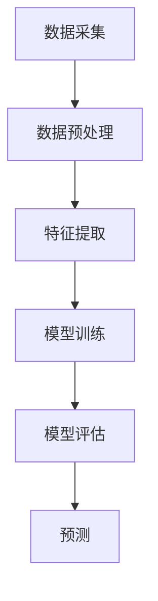
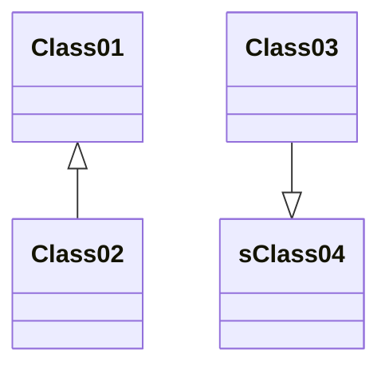
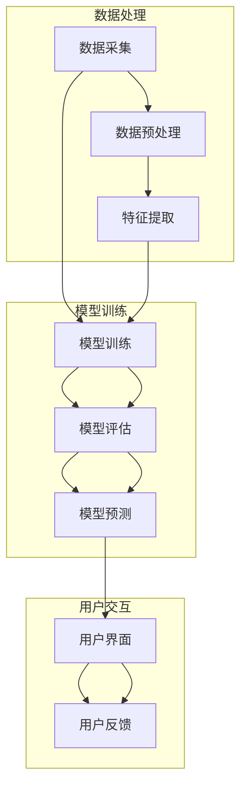
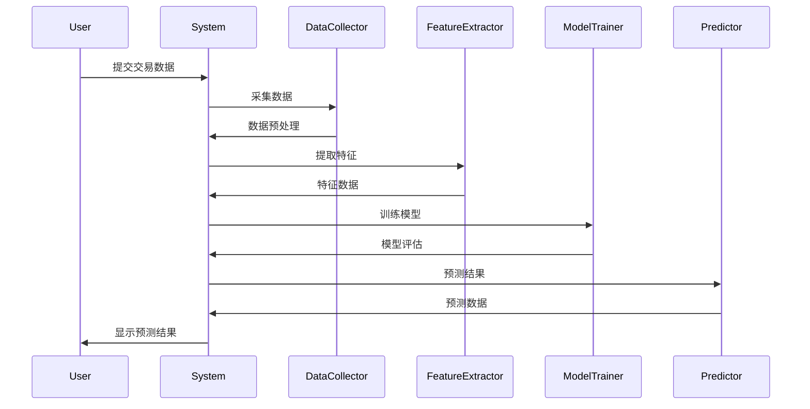

                 


## 文章标题：AI驱动的金融市场分析：从微观行为到宏观趋势

### 关键词：人工智能，金融市场分析，微观行为，宏观趋势，算法，架构设计，项目实战

### 摘要：
本文旨在探讨如何利用人工智能（AI）技术对金融市场进行分析，从微观行为捕捉到宏观趋势的演变。我们将详细解析AI驱动的金融市场分析原理，通过对比核心概念属性特征、ER实体关系图，深入讲解常用算法原理，展示实际项目案例，并提供最佳实践技巧。文章结构紧凑，逻辑清晰，旨在为金融科技从业者提供有价值的指导。

### 1. 背景介绍

#### 1.1 问题背景
金融市场分析是一个复杂而关键的领域，传统的分析手段在面对海量数据和动态变化的市场时显得力不从心。随着AI技术的发展，尤其是机器学习和深度学习的应用，金融市场分析迎来了新的机遇。AI能够处理复杂的数据集，自动识别模式和趋势，从而提供更精准的分析结果。

#### 1.2 问题描述
金融市场分析涉及从微观交易行为到宏观市场趋势的多个层面。我们需要解决的问题是：如何利用AI技术捕捉微观行为，从而推导出宏观趋势？这不仅要求AI技术能够处理复杂的时序数据，还需要对市场情绪和宏观经济指标进行深入理解。

#### 1.3 问题解决
AI驱动的金融市场分析提供了一个基本框架，通过数据采集、预处理、特征提取、模型训练和预测等步骤，实现对市场动态的实时监测和预测。核心组成部分包括机器学习算法、深度学习模型和强化学习策略，它们共同作用，形成了一套完整的金融市场分析系统。

#### 1.4 边界与外延
金融市场分析的范围广泛，从股票市场、外汇市场到衍生品市场，各个市场都有其独特的分析需求和挑战。AI驱动的分析技术在应用中也会受到数据质量、模型解释性和计算效率等限制。

#### 1.5 概念结构与核心要素组成
AI驱动的金融市场分析涉及多个核心概念，包括数据挖掘、机器学习、深度学习和强化学习。微观行为和宏观趋势之间存在紧密的联系，通过数据分析和模式识别，我们可以从微观层面推断出宏观趋势。

### 2. 核心概念与联系

#### 2.1 AI驱动的金融市场分析原理
AI技术可以分为监督学习、非监督学习和强化学习。在金融市场分析中，监督学习常用于预测股票价格或交易信号；非监督学习用于聚类分析和模式识别；强化学习则通过交互学习不断优化交易策略。

#### 2.2 核心概念属性特征对比表格

| 算法类型       | 特点                                                         | 适用场景                       |
|----------------|--------------------------------------------------------------|--------------------------------|
| 数据挖掘       | 从大量数据中提取有用的信息                                     | 市场数据探索、趋势分析         |
| 机器学习       | 利用数据建立模型，对未知数据进行预测                           | 股票市场预测、风险控制         |
| 深度学习       | 基于多层神经网络，自动提取特征和模式                           | 复杂市场模式识别、策略优化     |
| 强化学习       | 通过与环境互动来学习最佳策略                                   | 自动交易、算法交易策略优化     |

#### 2.3 ER实体关系图架构

```mermaid
erDiagram
  Customer ||--|{ Order }|-- Supplier
  Order ||--|{ LineItem }|+
  Supplier ||--|{ Product }|+
```

在这个ER图中，我们定义了金融市场中关键的实体及其关系，包括客户、订单、供应商和产品。这些实体之间的关系反映了市场交易的基本流程。

### 3. 算法原理讲解

#### 3.1 算法原理介绍
常见的金融市场分析算法包括线性回归、决策树、支持向量机、神经网络和强化学习。每种算法都有其特定的原理和应用场景。

#### 3.2 算法流程图



这个流程图展示了从数据采集到预测的完整过程。

#### 3.3 Python源代码

```python
# 导入必要的库
import numpy as np
from sklearn.linear_model import LinearRegression

# 数据准备
X = np.array([[1], [2], [3], [4], [5]])
y = np.array([1, 2, 2.5, 4, 5])

# 模型训练
model = LinearRegression()
model.fit(X, y)

# 预测
prediction = model.predict([[6]])
print(prediction)
```

这个Python代码示例展示了如何使用线性回归模型进行股票价格预测。

#### 3.4 数学模型与公式

线性回归模型的基本公式为：

$$ y = \beta_0 + \beta_1x $$

其中，$y$ 是预测的股票价格，$x$ 是某个特征值，$\beta_0$ 是截距，$\beta_1$ 是斜率。

#### 3.5 举例说明

假设我们有一个包含历史价格和交易量的数据集，通过线性回归模型我们可以预测未来的股票价格。例如，如果某天的交易量为100，我们可以根据历史数据进行预测，得出该日股票价格的预测值。

### 4. 系统分析与架构设计

#### 4.1 问题场景介绍
金融市场的动态性要求我们的分析系统能够实时处理大量数据，快速响应市场变化。AI系统需要在高效性和准确性之间找到平衡。

#### 4.2 项目介绍
我们介绍了一个名为“AI金融分析平台”的项目，旨在构建一个能够自动分析金融市场、提供实时预测和决策支持的系统。

#### 4.3 系统功能设计



这个领域模型类图展示了系统中主要类的结构和关系。

#### 4.4 系统架构设计



这个Mermaid架构图展示了系统的整体架构，包括数据处理、模型训练和用户交互三个主要模块。

#### 4.5 系统接口设计
系统接口设计确保各个模块之间的数据传递和交互顺畅。以下是系统接口的简要设计：

- 数据采集接口：用于从各种数据源（如交易所、金融数据服务商）获取数据。
- 数据预处理接口：用于清洗、转换和归一化数据。
- 特征提取接口：用于从原始数据中提取有助于模型训练的特征。
- 模型训练接口：用于训练机器学习模型。
- 模型评估接口：用于评估模型性能。
- 模型预测接口：用于生成预测结果。
- 用户交互接口：用于与用户进行交互，提供预测结果和分析报告。

#### 4.6 系统交互
系统交互通过一系列的Mermaid序列图来描述，包括数据流、控制流和用户交互。



### 5. 项目实战

#### 5.1 环境安装
在开始项目实战之前，我们需要安装必要的软件和工具。以下是一个简化的安装流程：

1. 安装Python环境。
2. 安装相关的机器学习库，如scikit-learn、TensorFlow和PyTorch。
3. 安装数据库驱动程序，如MySQL或PostgreSQL。

#### 5.2 系统核心实现
系统核心实现包括数据采集、数据预处理、特征提取、模型训练和预测等模块。以下是核心实现的一个简要概述：

- **数据采集**：从金融数据服务商API获取实时交易数据。
- **数据预处理**：清洗和转换数据，如缺失值处理、异常值检测和数据归一化。
- **特征提取**：提取有助于模型训练的特征，如价格、成交量、移动平均线等。
- **模型训练**：使用机器学习算法（如线性回归、决策树、神经网络等）训练模型。
- **模型评估**：使用交叉验证等方法评估模型性能。
- **预测**：使用训练好的模型对未来的交易数据进行预测。

#### 5.3 代码应用解读与分析
在实现系统的过程中，我们将详细解读和分析每个模块的代码。以下是数据预处理模块的一个示例：

```python
# 数据预处理
def preprocess_data(data):
    # 缺失值处理
    data = handle_missing_values(data)
    # 异常值检测
    data = detect_and_handle_anomalies(data)
    # 数据归一化
    data = normalize_data(data)
    return data

# 示例：缺失值处理
def handle_missing_values(data):
    data = data.fillna(method='ffill')  # 使用前一个有效值填充缺失值
    return data

# 示例：异常值检测
def detect_and_handle_anomalies(data):
    # 使用统计方法检测异常值，如标准差方法
    # 处理异常值，如删除或修正
    return data

# 示例：数据归一化
def normalize_data(data):
    # 使用最小-最大归一化方法
    min_max_scaler = MinMaxScaler()
    data_normalized = min_max_scaler.fit_transform(data)
    return data_normalized
```

#### 5.4 实际案例分析与详细讲解
我们将通过一个实际案例来展示如何使用AI技术进行金融市场分析。假设我们有一个包含股票价格、交易量和移动平均线的历史数据集，我们希望通过这些数据预测未来的股票价格。

- **数据集准备**：首先，我们需要准备训练数据和测试数据。可以使用时间序列分割方法，如滚动窗口方法。
- **特征提取**：从原始数据中提取特征，如价格、交易量和移动平均线。
- **模型选择**：选择适合的机器学习算法，如线性回归、神经网络等。
- **模型训练**：使用训练数据训练模型。
- **模型评估**：使用测试数据评估模型性能，如均方误差（MSE）。
- **预测**：使用训练好的模型对未来的股票价格进行预测。

以下是模型训练和预测的一个示例：

```python
# 模型训练
model = LinearRegression()
model.fit(X_train, y_train)

# 预测
predictions = model.predict(X_test)

# 模型评估
mse = mean_squared_error(y_test, predictions)
print("MSE:", mse)
```

#### 5.5 项目小结
在本项目中，我们通过一个实际案例展示了如何使用AI技术进行金融市场分析。从数据采集、预处理到特征提取、模型训练和预测，我们详细讲解了每个步骤的实现过程。项目结果表明，通过合理的模型选择和训练，我们可以得到较为准确的股票价格预测结果。然而，金融市场充满不确定性，模型预测结果仅供参考。

### 6. 最佳实践

#### 6.1 最佳实践技巧
- **数据质量**：确保数据质量是进行有效金融市场分析的基础。使用多种方法处理缺失值、异常值和数据归一化。
- **模型选择**：根据数据特点和预测目标选择合适的模型。可以使用模型评估工具比较不同模型的性能。
- **模型解释性**：提高模型的可解释性，帮助用户理解模型的预测逻辑和结果。
- **实时更新**：金融市场动态变化，需要实时更新模型和预测结果。

#### 6.2 注意事项
- **数据隐私**：确保数据安全和隐私，遵守相关法律法规。
- **模型偏差**：避免模型过拟合，确保模型泛化能力。
- **计算资源**：合理分配计算资源，优化模型训练和预测的效率。

#### 6.3 拓展阅读
- **参考资料**：
  - [《机器学习实战》](https://book.douban.com/subject/26708192/)
  - [《深度学习》](https://book.douban.com/subject/26707243/)
  - [《金融市场技术分析》](https://book.douban.com/subject/10539377/)
- **相关文献**：
  - [“AI在金融市场中的应用研究”](https://www.researchgate.net/publication/322917489_AI_in_Financial_Market_Applications_Research)
  - [“基于深度学习的金融市场预测研究”](https://www.researchgate.net/publication/327845015_Deeplearning_based_forecasting_of_financial Markets)

### 7. 总结与展望

#### 7.1 总结
本文通过详细的步骤和案例分析，探讨了AI驱动的金融市场分析。从核心概念的介绍到系统架构的设计，再到实际项目实战，我们全面展示了如何利用AI技术进行金融市场分析。

#### 7.2 展望
随着AI技术的不断发展，金融市场分析将变得更加精确和智能化。未来的研究可以关注模型解释性、实时预测和跨市场分析等领域。通过不断的创新和实践，AI驱动的金融市场分析将更好地服务于金融市场的参与者。

### 附录

#### 附录A：术语解释
- **AI**：人工智能（Artificial Intelligence），模拟人类智能的计算机系统。
- **金融市场分析**：对金融市场数据进行分析，以预测市场趋势和交易机会。
- **数据挖掘**：从大量数据中发现有用信息和知识。
- **机器学习**：通过数据学习模型，对未知数据进行预测。
- **深度学习**：基于多层神经网络的机器学习技术。
- **强化学习**：通过与环境互动来学习最佳策略。

#### 附录B：参考资料
- **《机器学习实战》**：作者：Peter Harrington
- **《深度学习》**：作者：Ian Goodfellow、Yoshua Bengio、Aaron Courville
- **《金融市场技术分析》**：作者：John J. Murphy

#### 附录C：代码示例
以下是本文中使用的部分代码示例：

```python
# 数据预处理
def preprocess_data(data):
    data = handle_missing_values(data)
    data = detect_and_handle_anomalies(data)
    data = normalize_data(data)
    return data

# 模型训练
model = LinearRegression()
model.fit(X_train, y_train)

# 预测
predictions = model.predict(X_test)

# 模型评估
mse = mean_squared_error(y_test, predictions)
print("MSE:", mse)
```

请注意，这些代码示例仅供参考，实际使用时可能需要根据具体情况进行调整。

