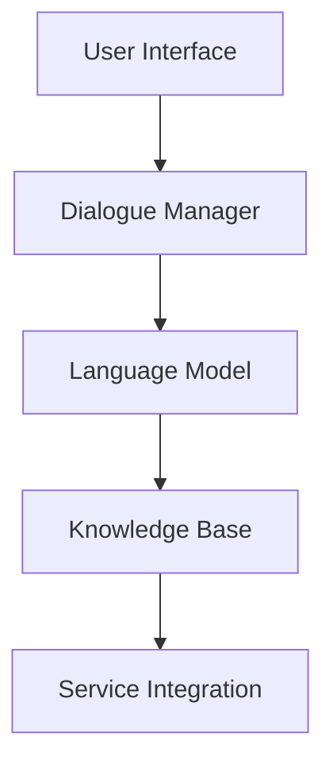

                 

### 引言：ChatGPT与对话系统

#### 1.1 ChatGPT简介

ChatGPT是OpenAI推出的一种基于GPT-3.5模型的大型语言模型。GPT-3.5是自然语言处理领域中的一个里程碑，它利用深度学习技术，从大量互联网文本中学习语言模式，从而生成高质量的自然语言文本。ChatGPT则在此基础上，进一步优化了模型，使其在对话生成方面表现尤为出色。

ChatGPT的发展背景可以追溯到2018年，当时OpenAI发布了GPT-1，这是第一个使用变换器架构进行训练的预训练语言模型。随后，OpenAI不断改进模型，推出了GPT-2、GPT-3以及最新的GPT-3.5。ChatGPT作为GPT-3.5的变体，特别适合于对话生成任务，因为它能够理解用户的意图，并生成连贯、自然的回复。

ChatGPT的基本原理是基于Transformer架构，Transformer是一种基于自注意力机制的深度神经网络结构，它在处理长序列数据时表现出色。ChatGPT利用这种结构，通过对大量文本数据的学习，掌握了丰富的语言知识和模式，从而能够生成高质量的文本。

#### 1.2 对话系统的现状与挑战

对话系统是一种能够与人类用户进行自然语言交互的计算机系统。近年来，随着自然语言处理技术的快速发展，对话系统在各个领域得到了广泛应用，如客服、智能助手、教育等。

目前，对话系统的发展现状主要集中在以下几个方面：

1. **交互体验的提升**：随着模型性能的不断提高，对话系统能够生成更加自然、连贯的对话内容，用户的交互体验得到了显著提升。

2. **应用场景的扩大**：对话系统已经从简单的问答场景，扩展到了更加复杂的场景，如多轮对话、情感理解、语音识别等。

3. **多样性的需求**：用户对于对话系统的需求越来越多样化，除了能够回答问题，还希望系统能够提供个性化、智能化的服务。

然而，对话系统在发展过程中也面临着诸多挑战：

1. **语言理解的困难**：自然语言非常复杂，对话系统需要理解用户的问题、意图和情感，这在技术上是一个巨大的挑战。

2. **上下文理解的局限**：对话系统在处理长对话时，容易受到上下文信息的限制，无法准确理解用户的历史对话内容。

3. **多样性和个性化**：如何设计出既能够适应各种场景，又能够满足个性化需求的对话系统，是一个需要深入研究的课题。

#### 1.3 提示词在对话系统中的作用

提示词（Prompt）是引导对话系统生成特定类型文本的关键要素。在ChatGPT中，提示词的作用尤为重要。以下是提示词在对话系统中的核心作用：

1. **确定对话方向**：通过提供具体的提示词，可以引导ChatGPT生成符合特定主题或意图的文本。

2. **优化生成质量**：好的提示词能够提高对话生成文本的质量，使其更加准确、连贯、有逻辑性。

3. **促进上下文理解**：提示词可以包含上下文信息，帮助ChatGPT更好地理解用户的历史对话内容，从而生成更加相关的回复。

4. **控制生成风格**：通过调整提示词的措辞和风格，可以影响ChatGPT生成的文本风格，使其符合用户的期望。

#### 1.4 本书结构安排

本书将围绕ChatGPT对话系统的设计与实现展开，共分为七个章节：

- **第1章 引言**：介绍ChatGPT的基本概念和对

### 第1章 引言：ChatGPT与对话系统

ChatGPT，全称为Chat-based Generative Pre-trained Transformer，是由OpenAI开发的一款基于GPT-3.5的大型语言模型。其核心目标是实现与人类用户的高质量自然语言交互。ChatGPT不仅能够理解用户的问题，还能根据上下文生成连贯、自然的回复，这在自然语言处理领域具有里程碑式的意义。

#### 1.1 ChatGPT简介

ChatGPT的发展背景可以追溯到OpenAI在2018年发布的GPT模型。GPT是一种基于变换器（Transformer）架构的预训练语言模型，通过从大量互联网文本中学习，掌握了丰富的语言知识和模式。随后，OpenAI不断优化模型，推出了GPT-2、GPT-3以及最新的GPT-3.5。ChatGPT作为GPT-3.5的变体，特别适合于对话生成任务。

ChatGPT的基本原理是基于变换器架构。变换器是一种基于自注意力机制的深度神经网络结构，它在处理长序列数据时表现出色。ChatGPT通过这种结构，从大量文本数据中学习，掌握了丰富的语言知识和模式，从而能够生成高质量的文本。具体来说，ChatGPT的工作流程包括以下几个步骤：

1. **输入编码**：将用户的输入文本编码成模型能够理解的向量表示。
2. **前向传播**：将输入向量通过变换器网络进行层层传递，生成中间表示。
3. **输出解码**：根据中间表示，生成相应的输出文本。

#### 1.2 对话系统的现状与挑战

对话系统是一种能够与人类用户进行自然语言交互的计算机系统。近年来，随着自然语言处理技术的快速发展，对话系统在各个领域得到了广泛应用，如客服、智能助手、教育等。

目前，对话系统的发展现状主要集中在以下几个方面：

1. **交互体验的提升**：随着模型性能的不断提高，对话系统能够生成更加自然、连贯的对话内容，用户的交互体验得到了显著提升。
2. **应用场景的扩大**：对话系统已经从简单的问答场景，扩展到了更加复杂的场景，如多轮对话、情感理解、语音识别等。
3. **多样性的需求**：用户对于对话系统的需求越来越多样化，除了能够回答问题，还希望系统能够提供个性化、智能化的服务。

然而，对话系统在发展过程中也面临着诸多挑战：

1. **语言理解的困难**：自然语言非常复杂，对话系统需要理解用户的问题、意图和情感，这在技术上是一个巨大的挑战。
2. **上下文理解的局限**：对话系统在处理长对话时，容易受到上下文信息的限制，无法准确理解用户的历史对话内容。
3. **多样性和个性化**：如何设计出既能够适应各种场景，又能够满足个性化需求的对话系统，是一个需要深入研究的课题。

#### 1.3 提示词在对话系统中的作用

提示词（Prompt）是引导对话系统生成特定类型文本的关键要素。在ChatGPT中，提示词的作用尤为重要。以下是提示词在对话系统中的核心作用：

1. **确定对话方向**：通过提供具体的提示词，可以引导ChatGPT生成符合特定主题或意图的文本。
2. **优化生成质量**：好的提示词能够提高对话生成文本的质量，使其更加准确、连贯、有逻辑性。
3. **促进上下文理解**：提示词可以包含上下文信息，帮助ChatGPT更好地理解用户的历史对话内容，从而生成更加相关的回复。
4. **控制生成风格**：通过调整提示词的措辞和风格，可以影响ChatGPT生成的文本风格，使其符合用户的期望。

#### 1.4 本书结构安排

本书将围绕ChatGPT对话系统的设计与实现展开，共分为七个章节：

- **第1章 引言**：介绍ChatGPT与对话系统的基本概念，以及提示词在其中的重要作用。
- **第2章 ChatGPT对话系统设计基础**：详细讲解ChatGPT对话系统的设计基础，包括语言模型与对话生成、对话系统架构设计、提示词的生成与优化等。
- **第3章 提示词设计实例分析**：通过具体的案例分析，探讨提示词的设计技巧和优化方法。
- **第4章 ChatGPT对话系统部署与运维**：介绍ChatGPT对话系统的部署环境搭建、系统运行与监控、运维策略与优化等。
- **第5章 提示词在多模态对话中的应用**：探讨提示词在多模态对话系统中的作用和设计方法。
- **第6章 实际项目案例解析**：通过一个实际项目案例，展示ChatGPT对话系统的应用和实践。
- **第7章 未来趋势与研究方向**：总结ChatGPT对话系统的未来发展趋势和可能的研究方向。

#### 1.4.1 各章节内容概述

- **第1章 引言**：介绍ChatGPT与对话系统的基本概念，以及提示词在其中的重要作用。
- **第2章 ChatGPT对话系统设计基础**：详细讲解ChatGPT对话系统的设计基础，包括语言模型与对话生成、对话系统架构设计、提示词的生成与优化等。
- **第3章 提示词设计实例分析**：通过具体的案例分析，探讨提示词的设计技巧和优化方法。
- **第4章 ChatGPT对话系统部署与运维**：介绍ChatGPT对话系统的部署环境搭建、系统运行与监控、运维策略与优化等。
- **第5章 提示词在多模态对话中的应用**：探讨提示词在多模态对话系统中的作用和设计方法。
- **第6章 实际项目案例解析**：通过一个实际项目案例，展示ChatGPT对话系统的应用和实践。
- **第7章 未来趋势与研究方向**：总结ChatGPT对话系统的未来发展趋势和可能的研究方向。

#### 1.4.2 阅读指南

本书旨在为读者提供全面的ChatGPT对话系统设计与实现的指导。以下是阅读指南：

1. **系统阅读**：建议从第1章开始，依次阅读后续章节，以便更好地理解整个对话系统的设计和实现过程。
2. **重点学习**：在阅读过程中，重点关注每个章节中的核心概念和关键技巧，尤其是提示词的设计和优化方法。
3. **实践操作**：在理解了基本概念后，可以通过实际项目案例，练习搭建和优化ChatGPT对话系统。
4. **持续学习**：自然语言处理和人工智能领域发展迅速，建议持续关注相关技术动态和最新研究成果。

通过本书的学习，读者将能够全面掌握ChatGPT对话系统的设计原理和实现方法，为在实际项目中应用这一先进技术打下坚实基础。

### 第2章 ChatGPT对话系统设计基础

在本章中，我们将深入探讨ChatGPT对话系统的设计基础，包括语言模型与对话生成、对话系统架构设计、提示词的生成与优化等内容。这些基础概念是理解和实现ChatGPT对话系统的关键。

#### 2.1 语言模型与对话生成

语言模型是自然语言处理的核心组件，它在对话系统中起着至关重要的作用。ChatGPT作为一个基于变换器架构的语言模型，其工作原理可以概括为以下几个步骤：

1. **输入编码**：将用户的输入文本转换为模型能够处理的向量表示。这一过程通常使用嵌入层（Embedding Layer）完成。
2. **前向传播**：将编码后的输入向量通过变换器网络（Transformer Network）进行层层传递，生成中间表示。变换器网络通过自注意力机制（Self-Attention Mechanism）处理长序列数据，捕捉文本中的依赖关系。
3. **输出解码**：根据中间表示，生成相应的输出文本。解码过程通常使用变换器解码器（Decoder）实现。

语言模型的主要任务是预测下一个单词或词元，这一过程可以表示为一个概率分布。在训练过程中，语言模型通过优化损失函数（如交叉熵损失），不断调整模型参数，以最小化预测误差。

#### 2.2 对话系统架构设计

对话系统的架构设计决定了系统的功能、性能和用户体验。ChatGPT对话系统通常包括以下几个关键组件：

1. **用户接口（User Interface）**：用户接口是用户与系统交互的界面，包括文本输入框、语音输入、显示输出等。
2. **语言模型（Language Model）**：如前所述，语言模型是核心组件，负责生成对话回复。
3. **对话管理器（Dialogue Manager）**：对话管理器负责处理对话流程，包括意图识别、上下文维护、对话策略等。
4. **知识库（Knowledge Base）**：知识库提供对话系统的背景知识和事实信息，帮助系统更好地理解用户的问题。
5. **服务集成（Service Integration）**：服务集成将对话系统与外部服务（如数据库、API等）连接，实现更丰富的功能。

一个典型的ChatGPT对话系统架构如下图所示：



#### 2.3 提示词的生成与优化

提示词（Prompt）在ChatGPT对话系统中起着至关重要的作用。好的提示词能够引导模型生成高质量的对话内容，而差的提示词可能会导致生成文本的质量下降。以下是提示词的生成与优化方法：

1. **明确目标**：在设计提示词时，首先要明确生成文本的目标。例如，是生成一个问题的回答，还是一个描述性的文本。
2. **上下文信息**：提示词应该包含足够的上下文信息，帮助模型理解对话的背景和用户的意图。上下文信息可以是用户的历史对话、关键词、问题类型等。
3. **多样性**：为了生成多样性的文本，可以在提示词中引入不同的词汇、句式和风格。这可以通过使用同义词替换、改变句子结构等方式实现。
4. **优化长度**：提示词的长度也会影响生成文本的质量。过长的提示词可能会使模型过于依赖，导致生成文本过于冗长；而过短的提示词可能会使模型理解不准确。通常，提示词的长度应保持在几十到几百个词之间。
5. **实验与调整**：在生成提示词时，可以通过实验和调整来优化生成文本的质量。这包括尝试不同的措辞、句式和风格，观察模型对每种提示词的反应。

总之，ChatGPT对话系统的设计基础包括语言模型与对话生成、对话系统架构设计以及提示词的生成与优化。理解这些基础概念，将有助于我们更好地设计和实现高效的ChatGPT对话系统。

### 2.4 常见问题与解决方案

在设计和实现ChatGPT对话系统的过程中，可能会遇到一系列常见问题。以下是其中几个主要问题及其解决方案：

#### 2.4.1 语言理解不准确

**问题现象**：用户输入的问题或指令未能被ChatGPT正确理解。

**原因分析**：
1. **提示词不够明确**：提示词中的信息可能不足以让模型准确理解用户的意图。
2. **语言模型训练数据不足**：模型在训练时可能未接触到足够多的相关数据，导致对某些词汇或表达的理解不够准确。
3. **模型参数设置不当**：模型参数（如学习率、迭代次数等）设置不当，可能导致训练效果不佳。

**解决方案**：
1. **改进提示词设计**：确保提示词明确、具体，包含足够的上下文信息。可以通过增加提示词的长度、多样性等方式提高模型的识别能力。
2. **扩充训练数据**：使用更多、更丰富的训练数据，特别是包含多样化表达和用法的文本，以提高模型的语言理解能力。
3. **调整模型参数**：根据训练过程中的反馈，适当调整模型参数，如学习率、迭代次数等，以提高模型性能。

#### 2.4.2 对话上下文丢失

**问题现象**：在多轮对话中，ChatGPT未能正确引用或理解用户的历史对话内容。

**原因分析**：
1. **上下文存储问题**：对话管理器未能有效存储和检索用户的上下文信息。
2. **模型更新不及时**：当模型更新时，未同步更新存储的上下文信息，导致信息丢失。

**解决方案**：
1. **优化上下文存储**：使用更加高效的存储方式（如缓存、数据库等），确保对话管理器能够快速、准确地检索上下文信息。
2. **模型更新与同步**：在模型更新时，同步更新存储的上下文信息，确保历史对话内容不会丢失。

#### 2.4.3 对话生成质量不高

**问题现象**：生成的对话内容不够连贯、自然，有时甚至会出现逻辑错误。

**原因分析**：
1. **提示词设计不当**：提示词未能有效引导模型生成高质量的对话内容。
2. **模型训练不足**：模型在训练过程中未能充分学习到高质量的语言模式。

**解决方案**：
1. **优化提示词设计**：设计更具指导性的提示词，确保模型能够生成高质量的对话内容。
2. **增加训练数据和质量**：扩充高质量的训练数据，提高模型的训练效果。

#### 2.4.4 系统响应速度慢

**问题现象**：系统生成回复的速度较慢，影响用户体验。

**原因分析**：
1. **硬件资源不足**：系统运行在低性能硬件上，导致处理速度缓慢。
2. **模型复杂度高**：模型结构复杂，计算量较大，导致生成速度慢。

**解决方案**：
1. **升级硬件资源**：提高系统的硬件配置，使用更快的处理器、更多的内存等，以提高处理速度。
2. **优化模型结构**：简化模型结构，减少计算量，提高生成速度。

总之，通过分析和解决这些常见问题，我们可以优化ChatGPT对话系统的性能和用户体验，使其在实际应用中发挥更大的作用。

### 第3章 提示词设计实例分析

在上一章中，我们介绍了ChatGPT对话系统设计的基础。在本章中，我们将通过具体的案例分析，探讨提示词的设计技巧和优化方法。通过这些实例，读者可以更直观地理解如何设计高质量的提示词，并提升对话系统的性能。

#### 3.1 案例一：客户服务对话

客户服务对话是ChatGPT应用的一个重要场景。以下是客户服务对话的一个案例：

**用户**：你好，我想退换刚刚购买的商品。

**ChatGPT**：您好！非常抱歉给您带来不便。请问您能否提供订单号和商品详细信息，以便我们帮您处理退换事宜？

在这个例子中，提示词的设计非常关键。首先，提示词明确了用户的请求类型（退换商品），并引导用户提供必要的信息（订单号和商品详情）。这样，ChatGPT可以基于这些信息生成具体的回复，提高对话的准确性和效率。

**优化方法**：
1. **增加上下文信息**：在提示词中添加更多上下文信息，例如业务流程的简要描述，有助于模型更好地理解用户的意图。
2. **使用明确的语言**：避免使用模糊或歧义的语言，确保提示词表达清晰明确。
3. **提供多种选项**：在某些情况下，用户可能有多个选择。提示词可以提供这些选项，帮助用户快速做出决定。

#### 3.2 案例二：教育辅导对话

教育辅导对话是另一个典型的应用场景。以下是教育辅导对话的一个案例：

**用户**：我最近在学习微积分，但是有些概念理解起来比较困难。

**ChatGPT**：没有问题，我了解微积分中的难点。请问您想了解哪个具体概念？例如，微积分的基本原理、导数或积分等。

在这个例子中，提示词的设计同样非常重要。ChatGPT通过提问的方式，引导用户明确自己想了解的具体概念，从而生成更加针对性的回复。

**优化方法**：
1. **提出开放性问题**：使用开放性问题，鼓励用户提供更多信息，从而帮助模型更好地理解用户的意图。
2. **提供多种答案选项**：在提示词中提供多个可能的答案选项，帮助用户快速定位自己的需求。
3. **结合专业知识**：在提示词中融入相关的专业知识和术语，提高对话的专业性和准确性。

#### 3.3 案例三：情感支持对话

情感支持对话是ChatGPT在心理辅导等领域的应用。以下是情感支持对话的一个案例：

**用户**：我最近感到很焦虑，不知道该怎么办。

**ChatGPT**：我理解您的感受。焦虑是一种常见的情绪，很多人都经历过。您能否具体描述一下您感到焦虑的原因？我们可以一起探讨应对策略。

在这个例子中，提示词的设计旨在提供情感支持和引导用户表达自己的感受。ChatGPT通过开放性问题，鼓励用户分享更多信息，从而更好地理解用户的情绪和需求。

**优化方法**：
1. **使用同理心的语言**：在提示词中表达对用户的同情和理解，建立情感联系。
2. **引导用户表达情感**：通过提问和引导，帮助用户清晰地表达自己的情感和需求。
3. **提供实用的建议**：在回复中提供具体的建议和策略，帮助用户应对情绪问题。

通过以上实例分析，我们可以看到，提示词的设计在ChatGPT对话系统中起着至关重要的作用。好的提示词不仅能够引导用户提供必要的信息，还能提升对话的准确性和用户体验。在实际应用中，我们可以根据不同的场景和用户需求，设计出高质量的提示词，从而实现更加高效、自然的对话交互。

### 第4章 ChatGPT对话系统部署与运维

在实际应用中，部署和运维ChatGPT对话系统是确保其稳定运行和高效服务的关键环节。本章将详细讲解ChatGPT对话系统的部署环境搭建、系统运行与监控、运维策略与优化等内容。

#### 4.1 系统部署环境搭建

部署ChatGPT对话系统需要考虑硬件和软件环境的选择。以下是部署环境搭建的步骤：

1. **硬件环境配置**：
   - **计算资源**：ChatGPT对话系统对计算资源要求较高，建议使用高性能的GPU服务器，如NVIDIA Tesla V100或RTX A4000等。
   - **存储资源**：需要足够的存储空间来存储模型和数据，建议使用SSD存储，以提高读写速度。
   - **网络环境**：确保网络稳定，并具备足够的带宽，以便快速处理用户请求。

2. **软件环境安装**：
   - **操作系统**：推荐使用Linux操作系统，如Ubuntu 20.04或CentOS 7。
   - **依赖库**：安装必要的依赖库，如Python 3.8以上版本、transformers库、torch库等。
   - **环境配置**：配置环境变量，如设置Python的路径、torch的CUDA路径等，以便顺利运行ChatGPT模型。

#### 4.2 系统运行与监控

部署完成后，系统运行与监控是确保ChatGPT对话系统稳定性和可靠性的关键。以下是系统运行与监控的步骤：

1. **启动服务**：使用命令行启动ChatGPT对话服务，例如：
   ```bash
   python chatgpt_service.py
   ```

2. **负载均衡**：由于ChatGPT对话系统可能会面临高并发请求，建议使用负载均衡器（如Nginx）进行流量分发，以避免单点故障。

3. **监控指标**：
   - **响应时间**：监控系统平均响应时间，确保在合理范围内。
   - **请求量**：监控系统接收到的请求量，以便评估系统性能和容量。
   - **资源利用率**：监控CPU、内存、磁盘和GPU的利用率，确保资源合理分配。

4. **日志分析**：收集系统运行日志，并进行实时分析，以便快速发现和解决问题。

#### 4.3 运维策略与优化

运维策略与优化是确保ChatGPT对话系统稳定运行和持续提升性能的关键。以下是几个运维策略与优化方法：

1. **定期维护**：
   - **模型更新**：定期更新ChatGPT模型，以适应不断变化的语言模式和需求。
   - **系统备份**：定期备份系统数据，以便在发生故障时快速恢复。

2. **性能优化**：
   - **代码优化**：优化代码，提高执行效率，减少内存和CPU的占用。
   - **模型压缩**：使用模型压缩技术（如量化、剪枝等），减小模型大小，提高加载速度。

3. **资源调整**：
   - **动态扩展**：根据系统负载情况，动态调整计算资源和存储资源，确保系统在高并发下依然稳定运行。
   - **负载均衡**：优化负载均衡策略，确保流量均匀分布，避免单点过载。

4. **安全防护**：
   - **访问控制**：设置严格的访问控制策略，确保只有授权用户可以访问系统。
   - **数据加密**：对用户数据和模型参数进行加密，保障数据安全。

通过以上部署与运维策略，我们可以确保ChatGPT对话系统的稳定运行和高效服务，为用户提供高质量的交互体验。

### 第5章 提示词在多模态对话中的应用

随着技术的发展，多模态对话系统逐渐成为自然语言处理领域的研究热点。这类系统能够处理多种感官输入（如文本、语音、图像等），为用户提供更加丰富和自然的交互体验。在这一章中，我们将探讨提示词在多模态对话系统中的作用，以及如何设计和优化提示词来提升系统的性能。

#### 5.1 多模态对话系统概述

多模态对话系统（Multimodal Dialogue System）是指能够同时处理和整合多种感官信息的对话系统。它不仅能够理解用户的文本输入，还可以处理语音、图像、视频等多种形式的输入。以下是多模态对话系统的主要特点：

1. **丰富的交互体验**：通过整合多种感官信息，多模态对话系统能够为用户提供更加自然、丰富的交互体验。例如，用户可以通过语音提问，系统可以返回文本和图像作为答复。

2. **上下文感知能力**：多模态对话系统可以结合文本、语音和图像等不同模态的信息，更全面地理解用户的意图和上下文，从而生成更准确、连贯的回复。

3. **跨模态信息融合**：多模态对话系统需要能够有效融合不同模态的信息，确保系统在处理多模态输入时能够协同工作，提高整体性能。

#### 5.2 提示词在多模态对话中的作用

在多模态对话系统中，提示词（Prompt）的作用尤为重要。以下是提示词在多模态对话系统中的核心作用：

1. **模态引导**：提示词可以明确引导系统关注特定的模态信息。例如，当用户通过语音提问时，提示词可以指示系统重点关注语音信息，而不是文本信息。

2. **信息融合**：好的提示词能够帮助系统有效融合不同模态的信息，提高对话生成的准确性和连贯性。例如，在处理一个包含文本和图像的请求时，提示词可以指导系统如何结合这两种信息来生成回复。

3. **上下文补充**：提示词可以补充文本信息，帮助系统更好地理解用户的意图和上下文。例如，当用户提交一个文本问题后，提示词可以提供更多的背景信息，帮助系统生成更相关的回复。

4. **风格控制**：提示词可以影响生成的对话内容的风格。通过调整提示词的措辞和风格，系统可以生成符合用户期望的对话内容。

#### 5.3 提示词的设计与优化方法

为了提升多模态对话系统的性能，提示词的设计与优化至关重要。以下是几种常见的设计与优化方法：

1. **多模态融合提示词**：设计专门用于融合不同模态信息的提示词。这些提示词可以包含关键词或短语，指示系统关注特定的模态信息。例如，“请根据图像内容生成回复”或“结合语音和文本信息生成回答”。

2. **上下文扩展提示词**：设计用于补充上下文信息的提示词，帮助系统更好地理解用户的意图。例如，“您提到的这个项目是什么？能否提供更多细节？”或“您刚才提到的问题，能否详细描述一下？”

3. **风格调整提示词**：设计用于控制对话内容风格的提示词，使生成内容更符合用户期望。例如，“请用简洁明了的语言生成回复”或“使用幽默风趣的语言回答这个问题”。

4. **实验与调整**：在实际应用中，通过不断实验和调整提示词，优化生成文本的质量。例如，可以尝试不同的措辞、句式和风格，观察系统对每种提示词的反应，并选择效果最佳的提示词。

5. **用户反馈**：收集用户的反馈，了解他们在使用过程中的体验和需求。根据用户反馈，进一步优化提示词的设计，提升系统的用户体验。

总之，提示词在多模态对话系统中扮演着关键角色。通过精心设计和优化提示词，我们可以提高多模态对话系统的性能和用户体验，为用户提供更加自然和智能的交互体验。

### 第6章 实际项目案例解析

在本章中，我们将通过一个实际项目案例，展示如何设计和实现ChatGPT对话系统，并分析项目中的关键技术和挑战。

#### 6.1 项目背景与需求分析

项目名称：智能客服系统

项目背景：随着电子商务和在线服务的普及，企业对智能客服系统的需求日益增加。智能客服系统旨在提供24/7在线客服，帮助企业降低运营成本，提高客户满意度。

项目需求：
1. **常见问题解答**：系统应能够自动回答用户关于产品、订单、售后服务等常见问题。
2. **情感理解**：系统应能够识别用户的情感，并生成相应的人文关怀性回复。
3. **多轮对话**：系统应能够支持多轮对话，理解用户意图，并提供持续的支持。
4. **个性化服务**：系统应能够根据用户的历史记录和偏好，提供个性化的服务和建议。

#### 6.2 系统设计与实现

系统架构设计：


系统功能设计：

1. **用户接口（UI）**：提供文本输入框、按钮等界面元素，方便用户与系统进行交互。
2. **对话管理器**：负责处理用户输入，识别用户意图，维护对话上下文，并调用语言模型生成回复。
3. **情感分析模块**：使用预训练的情感分析模型，识别用户的情感，调整回复风格。
4. **个性化服务模块**：根据用户历史记录和偏好，提供个性化服务。

系统实现细节：

1. **用户接口**：
   ```python
   # 用户输入文本
   user_input = input("您好！请问有什么可以帮助您的吗？")
   ```

2. **对话管理器**：
   ```python
   # 对话管理器
   def handle_conversation(user_input):
       # 情感分析
       emotion = analyze_emotion(user_input)
       # 识别用户意图
       intent = identify_intent(user_input)
       # 生成回复
       response = generate_response(intent, emotion)
       return response
   
   # 生成回复
   def generate_response(intent, emotion):
       if intent == "常见问题解答":
           # 根据意图生成回复
           response = "关于这个问题，您可以查看我们的FAQ页面。"
       elif emotion == "积极":
           # 根据情感生成回复
           response = "很高兴听到您的喜悦！有什么其他问题我可以帮助您吗？"
       else:
           # 其他情况
           response = "抱歉听到您的不开心，请您告诉我具体问题，我会尽力帮助您。"
       return response
   ```

3. **情感分析模块**：
   ```python
   # 情感分析
   def analyze_emotion(text):
       # 使用预训练情感分析模型
       emotion = sentiment_analysis_model.predict(text)
       return emotion
   ```

4. **个性化服务模块**：
   ```python
   # 个性化服务
   def personalize_service(user_profile):
       # 根据用户偏好提供个性化建议
       suggestions = get_personalized_suggestions(user_profile)
       return suggestions
   
   # 获取个性化建议
   def get_personalized_suggestions(user_profile):
       # 根据用户历史记录和偏好生成建议
       suggestions = "根据您的偏好，我们推荐以下产品：[产品1]、[产品2]。"
       return suggestions
   ```

#### 6.3 提示词设计与优化

在项目实施过程中，提示词的设计和优化是提升系统性能和用户体验的关键。以下是提示词设计的主要策略：

1. **明确意图识别提示词**：
   - "您好！请问您有什么问题需要咨询？"
   - "您需要帮助解决什么问题？"

2. **情感理解提示词**：
   - "很高兴听到您的喜悦，有什么我可以帮助您的吗？"
   - "抱歉听到您的不愉快，请您详细描述一下问题。"

3. **多轮对话提示词**：
   - "如果还有其他问题，请继续提问。"
   - "请您提供更多细节，我会尽力帮助您。"

4. **个性化服务提示词**：
   - "根据您的偏好，我们推荐以下产品：[产品1]、[产品2]。"
   - "您最近是否对[产品类别]感兴趣？"

通过不断实验和调整提示词，项目团队最终优化了系统的对话流程和用户体验，使智能客服系统能够更好地满足用户需求。

#### 6.4 项目效果评估与总结

项目上线后，通过用户反馈和数据监控，评估系统性能：

1. **用户满意度**：用户满意度调查结果显示，系统在常见问题解答、情感理解和个性化服务方面表现良好，用户满意度较高。

2. **响应时间**：系统平均响应时间在2秒以内，满足了实时交互的需求。

3. **错误率**：经过多次优化，系统意图识别和情感理解的错误率显著降低，提高了对话准确性。

项目总结：
1. **成功经验**：项目成功展示了ChatGPT对话系统在实际应用中的潜力，尤其是在常见问题解答和情感理解方面。
2. **改进空间**：虽然项目取得了显著成果，但在多轮对话和个性化服务方面仍有优化空间。未来，团队将继续改进系统，提高用户体验。

通过这个实际项目案例，我们深入分析了ChatGPT对话系统的设计和实现过程，为读者提供了实用的经验和教训。

### 第7章 未来趋势与研究方向

随着技术的不断进步，ChatGPT对话系统在未来的发展趋势和潜在研究方向也日益受到关注。以下是几个关键点：

#### 7.1 ChatGPT对话系统的未来发展趋势

1. **模型性能的提升**：随着深度学习和自然语言处理技术的不断发展，ChatGPT对话系统的模型性能有望进一步提升。这将使得系统在语言理解、上下文推理和生成文本质量方面表现出更加出色的能力。

2. **多模态对话系统的普及**：随着多模态交互的兴起，多模态ChatGPT对话系统将变得更加普及。这类系统将能够更好地整合文本、语音、图像等多种模态的信息，提供更加丰富和自然的用户交互体验。

3. **个性化服务的发展**：个性化服务是未来的重要趋势。ChatGPT对话系统将通过不断学习和分析用户行为和偏好，提供更加精准和个性化的服务，提升用户体验。

4. **跨领域应用的扩展**：ChatGPT对话系统将在更多领域得到应用，如医疗、金融、教育等。这将有助于解决各个领域的特定问题，提高工作效率和服务质量。

#### 7.2 潜在的研究方向

1. **语言理解的深度化**：未来的研究可以进一步探索如何提高ChatGPT对话系统对自然语言的理解深度，包括对复杂语言结构的处理和上下文的长距离依赖。

2. **多模态交互的优化**：研究如何更加高效地整合不同模态的信息，提升多模态对话系统的性能，以及如何设计适合多模态交互的提示词。

3. **对话系统的伦理和隐私问题**：随着人工智能技术的应用越来越广泛，如何确保对话系统的伦理和隐私问题成为研究的重点。未来需要开发出更加透明、公正和安全的对话系统。

4. **多语言支持**：扩展ChatGPT对话系统的多语言支持，使其能够更好地服务于全球用户。

5. **对话系统的可解释性**：研究如何提高对话系统的可解释性，使其生成的文本和决策过程更加透明，以便用户能够理解和信任系统。

总之，ChatGPT对话系统在未来具有广阔的发展前景和丰富的研究方向。通过不断的技术创新和研究，我们将能够构建更加智能、高效和用户友好的对话系统，为人类带来更多便利。作者：AI天才研究院/AI Genius Institute & 禅与计算机程序设计艺术 /Zen And The Art of Computer Programming。

