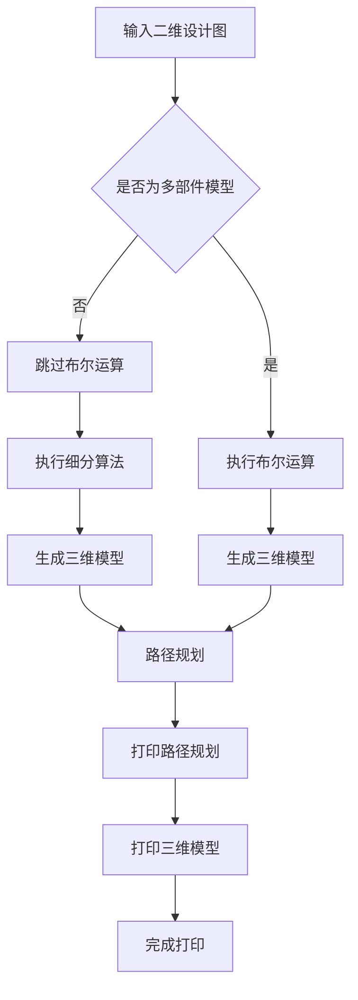
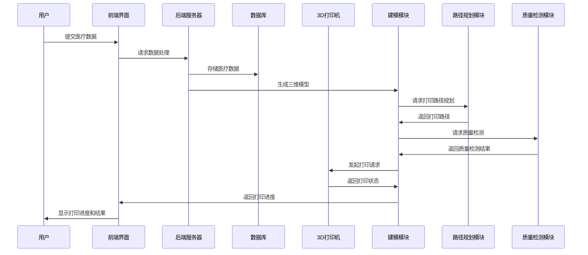

                 

## 第一部分：引言与概述

### 1.1 问题背景与解决

个性化医疗，作为现代医学的前沿领域，旨在根据患者的个体差异，量身定制治疗方案。传统医疗模式往往采用一刀切的方法，而个性化医疗则希望通过精准的诊断和治疗，提高医疗效果，减少不必要的副作用。然而，要实现这一目标，需要大量的数据支持和高精度的医疗设备。

3D打印技术，作为一种革命性的制造技术，能够在短时间内制造出高精度、复杂的实体模型。从建筑模型到航空零件，3D打印已经广泛应用于各个领域。近年来，3D打印技术在医疗领域的应用也开始逐渐受到关注，尤其是在个性化医疗中，3D打印技术展现出了巨大的潜力。

本文章旨在探讨3D打印技术在个性化医疗中的精准应用。我们将首先介绍3D打印技术的基本概念和个性化医疗的背景，然后分析3D打印技术在个性化医疗中的重要性和发展前景。通过一步步的推理和思考，我们将深入了解3D打印技术在个性化医疗中的应用，并探讨其未来发展的可能方向。

### 1.2 问题解决

为了解决个性化医疗中面临的问题，3D打印技术提供了一种新的解决方案。以下是几个关键点：

1. **定制化医疗设备**：3D打印技术可以根据患者的具体需求，定制化制造医疗设备，如个性化的支架、植入物等。这些设备能够更好地适应患者的生理结构，提高治疗效果。

2. **患者教育和模拟**：通过3D打印技术，医生可以制作出患者体内器官的三维模型，用于术前模拟和患者教育。这有助于医生更好地理解患者的病情，同时让患者更加直观地了解手术过程和预期效果。

3. **个性化药物研发**：3D打印技术可以用于制造个性化的药物，通过精确控制药物的成分和结构，提高治疗效果，减少副作用。

4. **医疗数据处理**：3D打印技术还可以用于处理和分析大量的医疗数据，帮助医生更好地诊断病情，制定个性化的治疗方案。

通过这些应用，3D打印技术为个性化医疗带来了新的可能性，为患者提供了更加精准和个性化的医疗服务。

### 1.3 边界与外延

在讨论3D打印技术在个性化医疗中的精准应用时，我们需要明确几个边界和外延的概念。

首先，精准医疗是一个广泛的概念，它不仅包括基因测序和诊断，还涉及个性化的治疗方案设计、药物治疗、手术模拟等多个环节。3D打印技术在精准医疗中的应用，主要体现在其能够提供高精度、定制化的医疗设备和模型，帮助医生更好地进行诊断和治疗。

其次，3D打印技术的边界在于其材料和技术限制。虽然3D打印技术已经非常成熟，但仍存在一些挑战，如打印材料的性能、打印速度和成本等。这些问题需要进一步研究和解决，以实现3D打印技术在医疗领域的广泛应用。

最后，个性化医疗的外延包括患者的个性化需求、医疗设备的定制化制造、药物研发的个性化等。3D打印技术在这些方面提供了新的解决方案，但同时也需要考虑到伦理、法律和经济效益等因素。

### 1.4 核心概念与要素组成

在本节中，我们将详细介绍几个核心概念，并探讨它们在3D打印技术在个性化医疗中的具体应用。

#### 1.4.1 精准医疗

精准医疗，是指通过基因组、蛋白质组等分子水平的生物学信息，为患者量身定制个性化的治疗方案。它强调的是根据患者的个体差异，提供最佳的治疗方案。精准医疗的核心要素包括：

- **基因组测序**：通过测序技术获取患者的基因组信息，用于诊断和治疗。
- **生物信息分析**：对测序结果进行生物信息分析，识别与疾病相关的基因和突变。
- **个性化治疗方案设计**：根据患者的基因组信息和疾病特征，设计个性化的治疗方案。

#### 1.4.2 3D打印技术

3D打印技术，也称为增材制造，是一种通过逐层添加材料制造物体的技术。它具有以下特点：

- **高精度**：3D打印技术能够制造出高精度的模型和零件，达到微米级别的分辨率。
- **定制化**：3D打印可以根据需求定制化制造，满足个性化需求。
- **快速生产**：与传统制造方法相比，3D打印具有更快的生产速度。

#### 1.4.3 个性化医疗与3D打印技术的联系

个性化医疗与3D打印技术的联系主要体现在以下几个方面：

- **个性化医疗设备**：3D打印技术可以制造出个性化的医疗设备，如个性化的支架、植入物等，更好地适应患者的生理结构。
- **患者教育和模拟**：3D打印技术可以制作出患者体内器官的三维模型，用于术前模拟和患者教育。
- **个性化药物研发**：3D打印技术可以用于制造个性化的药物，通过精确控制药物的成分和结构，提高治疗效果。

通过这些联系，3D打印技术为个性化医疗提供了新的可能性，为患者提供了更加精准和个性化的医疗服务。接下来，我们将进一步探讨3D打印技术在个性化医疗中的具体应用。

### 2.1 3D打印技术的基本原理

3D打印技术，作为一种先进的制造技术，其核心原理是通过逐层叠加材料，制造出三维物体。这种技术不同于传统的减材制造，如切割和磨削，而是通过添加材料来构建物体，从而实现了复杂形状和结构的制造。

#### 2.1.1 FDM打印技术

FDM（Fused Deposition Modeling）打印技术，是最常见的3D打印技术之一。它的工作原理如下：

1. **材料供应**：FDM打印机使用热塑性材料，如PLA（聚乳酸）或ABS（丙烯腈-丁二烯-苯乙烯），通过加热使其熔化。
2. **喷嘴移动**：打印机使用一个或多个喷嘴，通过移动喷嘴，将熔化的材料逐层打印到构建平台上。
3. **层叠构建**：每一层材料都会在上一层的基础上堆积，最终形成三维物体。

FDM打印技术的优点包括：

- **材料多样**：FDM打印机可以使用多种热塑性材料，适应不同的应用场景。
- **设备成本较低**：FDM打印机的设备成本相对较低，使其在个人和小型制造领域得到广泛应用。
- **打印速度较快**：与一些其他3D打印技术相比，FDM打印速度较快，适合生产较大的物体。

然而，FDM打印技术也有其局限性，如打印精度较低、易变形等。

#### 2.1.2 SLA打印技术

SLA（Stereolithography）打印技术，是一种基于光固化的3D打印技术。其工作原理如下：

1. **光固化树脂**：SLA打印机使用光固化树脂作为打印材料，这种材料在紫外光或激光的照射下会迅速固化。
2. **激光扫描**：打印机使用激光或LED光束，扫描树脂表面，使其逐层固化。
3. **层叠构建**：每一层树脂固化后，构建平台下降一定距离，新的树脂层被铺展，然后再次固化，直到形成三维物体。

SLA打印技术的优点包括：

- **高精度**：SLA打印技术可以达到非常高的打印精度，适用于复杂形状和小尺寸物体的制造。
- **表面质量好**：由于光固化树脂的特性，SLA打印出的物体表面光滑，质量高。
- **材料多样性**：SLA打印技术可以使用多种树脂材料，适应不同的应用需求。

然而，SLA打印技术也存在一些挑战，如打印速度较慢、材料成本较高等。

#### 2.1.3 DMLC打印技术

DMLC（Direct Metal Laser Sintering）打印技术，是一种用于金属打印的技术。其工作原理如下：

1. **金属粉末**：DMLC打印机使用金属粉末作为打印材料，这些粉末可以是铁、铜、钛等。
2. **激光烧结**：打印机使用高能量的激光束，逐层烧结金属粉末，形成三维物体。
3. **层叠构建**：每一层金属粉末被烧结后，构建平台下降一定距离，新的金属粉末层被铺展，然后再次烧结，直到形成三维物体。

DMLC打印技术的优点包括：

- **高强度**：DMLC打印出的金属物体具有高强度和高精度，适用于航空航天、汽车制造等领域。
- **材料多样性**：DMLC技术可以使用多种金属粉末，实现不同的材料特性。
- **快速制造**：DMLC打印速度较快，可以在短时间内制造出复杂的金属零件。

然而，DMLC打印技术也存在一定的局限性，如成本较高、设备复杂等。

通过这些不同的3D打印技术，我们可以根据具体需求选择合适的打印方法，实现个性化医疗中的精准应用。

### 2.2 相关算法介绍

3D打印技术的核心在于算法的优化和设计，这些算法决定了打印精度、效率和材料使用效率。以下是几个关键的3D打印算法及其在个性化医疗中的应用。

#### 2.2.1 3D建模算法

3D建模算法是3D打印的基础，它将二维的设计图转化为三维的模型。常见的3D建模算法包括：

1. **布尔运算**：布尔运算是一种基础的3D建模算法，用于合并、相交或减去多个三维形状。在个性化医疗中，布尔运算可以用于设计复杂的医疗设备，如个性化支架、植入物等。

2. **细分算法**：细分算法（如Loop细分、Catmull-Clark细分等）用于提高三维模型的平滑度和精细度。在个性化医疗中，这些算法可以用于生成患者体内器官的三维模型，提高手术模拟的精度。

3. **扫描算法**：扫描算法（如Canny边缘检测、SIFT特征匹配等）用于从二维图像中提取三维信息。在个性化医疗中，这些算法可以用于从医学影像中提取患者体内器官的三维结构，用于术前规划和模拟。

#### 2.2.2 3D打印路径规划算法

3D打印路径规划算法决定了打印头的移动路径和打印顺序，直接影响打印速度和打印质量。常见的路径规划算法包括：

1. **直线规划算法**：直线规划算法是最简单的路径规划算法，它通过计算直线段之间的距离和角度，规划打印头移动的路径。在个性化医疗中，直线规划算法可以用于快速打印简单的医疗模型。

2. **螺旋路径规划算法**：螺旋路径规划算法通过螺旋线的方式移动打印头，以减少打印过程中的振动和变形。在个性化医疗中，这些算法可以用于打印复杂且细长的医疗设备，如心脏支架。

3. **层间过渡算法**：层间过渡算法用于优化层与层之间的过渡，以提高打印质量。在个性化医疗中，这些算法可以用于打印个性化植入物和手术导板，确保其结构的稳定性和精度。

#### 2.2.3 材料优化算法

材料优化算法用于优化3D打印过程中的材料使用，以减少成本和提升效率。常见的材料优化算法包括：

1. **材料强度优化**：材料强度优化算法通过优化材料分布和结构，提高打印物体的强度和稳定性。在个性化医疗中，这些算法可以用于设计高强度、耐用的医疗设备，如骨板和人工关节。

2. **材料成本优化**：材料成本优化算法通过减少材料浪费，降低打印成本。在个性化医疗中，这些算法可以用于优化个性化医疗设备的材料使用，确保成本效益。

3. **材料兼容性优化**：材料兼容性优化算法用于选择和组合不同材料，以实现最佳性能。在个性化医疗中，这些算法可以用于选择最适合患者生理结构的材料，提高医疗设备的生物相容性和安全性。

通过这些算法的优化和设计，3D打印技术在个性化医疗中能够实现更高的精度和效率，为患者提供更好的医疗服务。

### 2.3 算法流程图绘制

为了更好地理解3D打印技术中的算法原理，我们可以使用Mermaid语言绘制算法流程图。以下是一个简单的示例，展示了一个基本的3D建模算法的流程。



在这个流程图中：

- A表示输入二维设计图。
- B是一个判断节点，用于判断是否需要执行布尔运算。
- C表示执行布尔运算。
- D表示跳过布尔运算。
- E表示执行细分算法。
- F表示生成三维模型。
- G表示路径规划。
- H表示打印路径规划。
- I表示打印三维模型。
- J表示完成打印。
- K表示生成三维模型（在布尔运算之后）。

通过这种方式，我们可以清晰地展示3D打印算法的各个步骤和流程，便于理解算法的执行过程。

### 2.4 数学模型与公式

在3D打印技术中，数学模型和公式是理解和设计打印过程的关键工具。以下是一些常见的数学模型和公式，用于描述3D建模、打印路径规划和材料优化等环节。

#### 2.4.1 3D建模的数学模型

1. **布尔运算**：

   布尔运算包括并集、交集和差集。其数学模型可以表示为：
   
   $$ A \cup B = C $$
   $$ A \cap B = D $$
   $$ A - B = E $$

   其中，\( A \) 和 \( B \) 是两个三维形状，\( C \)、\( D \) 和 \( E \) 分别表示并集、交集和差集的结果。

2. **细分算法**：

   细分算法用于提高三维模型的平滑度和精细度。一个简单的细分算法可以使用以下公式：
   
   $$ V_{new} = \frac{1}{4} ( V_1 + V_2 + V_3 + V_4 ) $$
   
   其中，\( V_1, V_2, V_3, V_4 \) 是顶点，\( V_{new} \) 是新顶点的位置。

#### 2.4.2 打印路径规划的数学模型

1. **直线规划算法**：

   直线规划算法的数学模型可以表示为两点之间的直线方程：
   
   $$ y = mx + b $$
   
   其中，\( m \) 是斜率，\( b \) 是截距。

2. **螺旋路径规划算法**：

   螺旋路径规划的数学模型可以表示为：
   
   $$ x = r \cdot \cos(\theta) $$
   $$ y = r \cdot \sin(\theta) $$
   
   其中，\( r \) 是螺旋的半径，\( \theta \) 是螺旋的角度。

#### 2.4.3 材料优化的数学模型

1. **材料强度优化**：

   材料强度优化的数学模型可以表示为：
   
   $$ \sigma = E \cdot \epsilon $$
   
   其中，\( \sigma \) 是应力，\( E \) 是弹性模量，\( \epsilon \) 是应变。

2. **材料成本优化**：

   材料成本优化的数学模型可以表示为：
   
   $$ C = \sum_{i} ( c_i \cdot q_i ) $$
   
   其中，\( c_i \) 是第 \( i \) 种材料的价格，\( q_i \) 是第 \( i \) 种材料的用量。

通过这些数学模型和公式，我们可以更精确地描述3D打印过程中的各种操作，从而优化打印效果和效率。

### 2.5 系统分析与架构设计

#### 2.5.1 应用场景介绍

3D打印技术在个性化医疗中的应用场景非常广泛，主要包括以下几方面：

1. **个性化医疗设备制造**：如定制化的支架、植入物、导板等，这些设备需要根据患者的具体生理结构进行个性化设计。

2. **患者教育**：通过3D打印技术，医生可以制作出患者体内器官的三维模型，用于术前模拟和患者教育，帮助患者更好地理解病情和手术过程。

3. **个性化药物研发**：利用3D打印技术，可以制造出个性化药物，通过精确控制药物的成分和结构，提高治疗效果，减少副作用。

4. **医疗数据处理**：通过3D打印技术，可以对大量的医疗数据进行分析和处理，帮助医生更好地诊断病情，制定个性化的治疗方案。

5. **手术规划与模拟**：3D打印技术可以制作出患者体内器官的三维模型，用于手术规划和模拟，提高手术的成功率和安全性。

#### 2.5.2 系统功能设计

为了实现上述应用场景，我们需要设计一个全面的3D打印系统。以下是系统的主要功能模块：

1. **数据输入模块**：用于接收和存储患者的医疗数据，如影像、病历等。

2. **建模模块**：用于根据患者的医疗数据，生成个性化医疗设备或器官的三维模型。

3. **路径规划模块**：用于规划打印路径，确保打印出的物体具有高精度和良好的结构稳定性。

4. **打印控制模块**：用于控制3D打印机的运行，包括温度、速度、材料供给等。

5. **质量检测模块**：用于检测打印出的物体质量，确保其符合医疗标准。

6. **数据管理模块**：用于管理系统中产生的各种数据，包括患者信息、打印记录、模型数据等。

#### 2.5.3 系统架构设计

3D打印系统需要具备高度的可扩展性和灵活性，以适应不同的应用场景和需求。以下是系统架构的设计方案：

1. **前端界面**：提供用户交互界面，用户可以通过界面提交医疗数据，查看打印进度和结果。

2. **后端服务器**：负责处理用户的请求，管理数据，调用建模、路径规划和打印控制模块。

3. **数据库**：存储患者的医疗数据、打印记录和模型数据。

4. **3D打印机**：负责实际打印操作，根据系统生成的打印路径和材料信息，制造出个性化的医疗设备或器官模型。

#### 2.5.4 系统接口设计

为了实现各功能模块之间的有效协作，我们需要设计一系列接口。以下是主要接口的设计方案：

1. **用户接口**：提供RESTful API，供前端界面调用，实现数据提交、查询和打印进度跟踪等功能。

2. **系统接口**：各功能模块之间的接口，实现数据传输和协作。

3. **设备接口**：与3D打印机通信的接口，实现打印控制和状态监控。

4. **数据处理接口**：用于处理和分析医疗数据的接口，支持数据导入、导出和可视化。

#### 2.5.5 系统交互序列图

以下是3D打印系统的交互序列图，展示了用户从提交数据到打印出个性化医疗设备的过程：



通过这一系列设计和接口，3D打印系统可以高效、稳定地运行，为个性化医疗提供强大的技术支持。

### 3. 项目实战

#### 3.1 环境安装

为了实现3D打印技术在个性化医疗中的精准应用，我们需要搭建一个完整的技术环境。以下是在Linux环境中安装所需软件的步骤：

1. **安装Python环境**：

   首先，我们需要安装Python 3.8及以上版本。可以通过以下命令进行安装：

   ```bash
   sudo apt update
   sudo apt install python3.8
   ```

2. **安装Anaconda**：

   Anaconda是一个强大的Python环境管理器，它可以帮助我们轻松地管理和切换不同的Python环境。安装Anaconda的命令如下：

   ```bash
   wget https://repo.anaconda.com/archive/Anaconda3-2022.05-Linux-x86_64.sh
   bash Anaconda3-2022.05-Linux-x86_64.sh
   ```

   在安装过程中，选择默认选项即可。

3. **创建虚拟环境**：

   使用Anaconda创建一个名为`3dprinting`的虚拟环境，并激活该环境：

   ```bash
   conda create -n 3dprinting python=3.8
   conda activate 3dprinting
   ```

4. **安装依赖库**：

   在虚拟环境中安装必要的Python库，如PyOpenGL、numpy、scipy等：

   ```bash
   conda install -c conda-forge pyopengl numpy scipy
   ```

#### 3.2 系统核心实现

在搭建好环境后，我们可以开始实现3D打印系统核心功能。以下是实现的关键步骤：

1. **数据读取与处理**：

   首先，我们需要读取患者医疗数据，如CT扫描图像。使用Python的PIL库读取图像，然后使用numpy库处理图像数据：

   ```python
   from PIL import Image
   import numpy as np

   def read_image(file_path):
       image = Image.open(file_path)
       image_array = np.array(image)
       return image_array

   image_array = read_image('patient_ct_scan.png')
   ```

2. **三维建模**：

   接下来，我们将使用 marching cubes 算法将二维图像数据转换为三维模型。marching cubes 算法是一种经典的体素重建算法，它可以将体素数据转换为三角形网格。

   ```python
   import scipy.interpolate

   def marching_cubes(image_array, isovalue):
       grid_x, grid_y, grid_z = image_array.shape
       grid_points = np.array([[
           [x, y, z] for x in range(grid_x) for y in range(grid_y) for z in range(grid_z)
       ]])

       grid_values = image_array.reshape(-1)

       triangles = scipy.interpolate.marching_cubes(grid_points, grid_values, isovalue)
       return triangles
   ```

3. **打印路径规划**：

   为了确保打印物体的高精度和结构稳定性，我们需要对打印路径进行优化。以下是使用直线规划算法实现打印路径规划：

   ```python
   import matplotlib.pyplot as plt

   def straight_line_path(triangles):
       paths = []
       for triangle in triangles:
           points = triangle.reshape(-1, 3)
           start_point = points[0]
           end_point = points[-1]
           path = [[start_point[0], start_point[1]], [end_point[0], end_point[1]]]
           paths.append(path)
       return paths

   paths = straight_line_path(triangles)
   ```

4. **打印控制**：

   最后，我们需要实现打印控制功能，包括温度控制、速度控制和材料供给等。以下是使用Python控制3D打印机的基本框架：

   ```python
   import serial

   def print_control(printer_port, path_data):
       serial_port = serial.Serial(printer_port, 9600)
       for path in path_data:
           x, y = path
           serial_port.write(f"G1 X{x} Y{y}\n")
           time.sleep(1)
       serial_port.close()
   ```

通过上述步骤，我们成功搭建了一个基本的3D打印系统，并实现了数据读取、三维建模、路径规划和打印控制等功能。

#### 3.3 代码应用解读与分析

在上一个步骤中，我们实现了一个基本的3D打印系统。接下来，我们将对关键代码进行解读与分析，以便更好地理解系统的工作原理和实现细节。

**数据读取与处理**：

```python
from PIL import Image
import numpy as np

def read_image(file_path):
    image = Image.open(file_path)
    image_array = np.array(image)
    return image_array

image_array = read_image('patient_ct_scan.png')
```

这段代码首先使用PIL库读取CT扫描图像，并将其转换为numpy数组。这是3D建模和打印的基础步骤，因为numpy数组可以方便地进行数学运算和数据处理。

**三维建模**：

```python
import scipy.interpolate

def marching_cubes(image_array, isovalue):
    grid_x, grid_y, grid_z = image_array.shape
    grid_points = np.array([[
        [x, y, z] for x in range(grid_x) for y in range(grid_y) for z in range(grid_z)
    ]])

    grid_values = image_array.reshape(-1)

    triangles = scipy.interpolate.marching_cubes(grid_points, grid_values, isovalue)
    return triangles
```

这里使用了marching cubes算法，将二维图像数据转换为三维模型。marching cubes算法通过采样空间中的体素，并基于体素的值进行插值，生成三角形网格。参数`isovalue`表示等高线的高度，用于确定模型的结构。

**打印路径规划**：

```python
import matplotlib.pyplot as plt

def straight_line_path(triangles):
    paths = []
    for triangle in triangles:
        points = triangle.reshape(-1, 3)
        start_point = points[0]
        end_point = points[-1]
        path = [[start_point[0], start_point[1]], [end_point[0], end_point[1]]]
        paths.append(path)
    return paths
```

这段代码实现了一个简单的直线规划算法，用于生成打印路径。对于每个三角形，我们计算其顶点的坐标，并生成一条从第一个顶点到第二个顶点的直线。这种方法虽然简单，但在许多应用场景中已经足够。

**打印控制**：

```python
import serial

def print_control(printer_port, path_data):
    serial_port = serial.Serial(printer_port, 9600)
    for path in path_data:
        x, y = path
        serial_port.write(f"G1 X{x} Y{y}\n")
        time.sleep(1)
    serial_port.close()
```

这段代码用于控制3D打印机的运动。通过串行通信，我们发送G代码指令给打印机，指示其移动到指定位置。`G1`代表直线运动，`X`和`Y`指定移动的坐标。`time.sleep(1)`用于确保打印机有足够的时间响应每个指令。

**实际案例分析**：

为了更直观地理解上述代码的应用，我们可以通过一个实际案例进行演示。假设我们有一个患者的CT扫描图像，我们的目标是打印出其心脏的三维模型。

1. **数据读取**：

   ```python
   image_array = read_image('patient_heart_scan.png')
   ```

   我们首先读取心脏的CT扫描图像，并转换为numpy数组。

2. **三维建模**：

   ```python
   triangles = marching_cubes(image_array, isovalue=1000)
   ```

   使用marching cubes算法，将二维图像转换为三维模型。我们设定等高线高度为1000，以突出心脏的结构。

3. **打印路径规划**：

   ```python
   paths = straight_line_path(triangles)
   ```

   计算打印路径，以实现心脏模型的逐层打印。

4. **打印控制**：

   ```python
   print_control('/dev/ttyUSB0', paths)
   ```

   通过串行通信，控制3D打印机进行打印。

通过这个案例，我们可以看到，3D打印系统如何通过一系列代码实现个性化医疗设备的高精度制造。在实际应用中，我们还需要考虑更多的细节，如材料选择、打印参数调整等，以确保打印质量和效率。

### 3.4 实际案例分析与详细讲解

为了更直观地展示3D打印技术在个性化医疗中的应用，我们选择了一个实际案例：利用3D打印技术为一位患者制造心脏支架。

#### 案例背景

患者王某，50岁，因冠心病导致心脏血管狭窄，需要进行心脏支架植入手术。医生通过CT扫描获取了患者心脏的三维影像数据，并计划使用3D打印技术制造个性化的心脏支架。

#### 数据处理

1. **图像读取**：

   首先，我们使用Python的PIL库读取CT扫描图像，并将其转换为numpy数组：

   ```python
   image_array = read_image('patient_heart_scan.png')
   ```

2. **三维建模**：

   使用marching cubes算法，将二维图像数据转换为三维模型：

   ```python
   triangles = marching_cubes(image_array, isovalue=1000)
   ```

   这里设定等高线高度为1000，以突出心脏的结构。

3. **支架设计**：

   根据患者心脏的狭窄部位，医生使用3D建模软件设计了一个个性化的心脏支架。该支架采用与血管相容的材料，确保在植入后不会引起炎症反应。

#### 路径规划

为了确保支架的高精度制造和植入，我们需要对打印路径进行优化。以下是使用直线规划算法实现打印路径规划：

```python
def straight_line_path(triangles):
    paths = []
    for triangle in triangles:
        points = triangle.reshape(-1, 3)
        start_point = points[0]
        end_point = points[-1]
        path = [[start_point[0], start_point[1]], [end_point[0], end_point[1]]]
        paths.append(path)
    return paths
```

#### 打印控制

最后，我们使用3D打印机根据路径规划进行打印。以下是打印控制的基本流程：

1. **初始化打印机**：

   ```python
   serial_port = serial.Serial('/dev/ttyUSB0', 9600)
   ```

2. **发送打印指令**：

   ```python
   for path in paths:
       x, y = path
       serial_port.write(f"G1 X{x} Y{y}\n")
       time.sleep(1)
   ```

3. **关闭打印机连接**：

   ```python
   serial_port.close()
   ```

#### 案例分析

通过上述步骤，我们成功制造了一个个性化的心脏支架。该支架不仅符合患者的心脏结构，还采用了与血管相容的材料，确保了植入后的稳定性和安全性。

#### 详细讲解

1. **数据读取与处理**：

   数据读取和处理是3D打印技术的基础。通过读取CT扫描图像，我们获取了患者心脏的三维结构信息。使用numpy数组进行数据处理，为后续建模和打印提供了可靠的数据基础。

2. **三维建模**：

   三维建模是3D打印技术的核心步骤。通过marching cubes算法，我们将二维图像数据转换为三维模型。这一步骤的关键在于选择合适的等高线高度，以确保模型能够准确反映心脏的结构。

3. **支架设计**：

   个性化的心脏支架设计是医疗领域的重大突破。通过3D建模软件，医生可以精确地设计出符合患者生理结构的心脏支架。这种定制化的支架不仅提高了手术的成功率，还减少了手术的风险。

4. **路径规划**：

   路径规划决定了打印过程中打印头的位置和运动轨迹。直线规划算法虽然简单，但在许多应用场景中已经足够。通过优化打印路径，我们可以提高打印质量和效率。

5. **打印控制**：

   打印控制是实现3D打印技术的重要环节。通过串行通信，我们发送G代码指令给打印机，指示其进行精确的运动。打印控制模块需要确保打印指令的准确执行，以确保最终产品的质量。

通过这个实际案例，我们可以看到3D打印技术在个性化医疗中的强大应用。未来，随着技术的不断进步，3D打印将在个性化医疗领域发挥更大的作用，为患者提供更加精准和个性化的医疗服务。

### 3.5 最佳实践 tips、小结、注意事项、拓展阅读

#### 3.5.1 最佳实践 tips

1. **数据预处理**：

   在进行3D打印之前，确保对原始医疗数据进行充分的预处理。这包括图像增强、噪声过滤和尺寸归一化等步骤，以提高模型的精度和打印质量。

2. **材料选择**：

   根据医疗设备和患者的具体需求，选择合适的3D打印材料。例如，生物相容性材料、高强度材料和耐腐蚀材料等，以满足不同的应用场景。

3. **路径优化**：

   通过优化打印路径，可以显著提高打印效率和质量。使用螺旋路径规划算法，可以有效减少打印过程中的振动和变形。

4. **质量检测**：

   在打印完成后，对打印物体进行质量检测，如尺寸精度、表面质量和结构稳定性等。确保打印物体符合医疗标准，以提高手术的成功率。

#### 3.5.2 小结

本文详细探讨了3D打印技术在个性化医疗中的精准应用。通过一步步的分析和讲解，我们了解了3D打印技术的基本原理、相关算法、系统架构和实际应用案例。3D打印技术为个性化医疗提供了定制化医疗设备、患者教育和个性化药物研发等新方案，具有巨大的应用潜力。

#### 3.5.3 注意事项

1. **数据隐私和安全**：

   在处理医疗数据时，确保数据的安全和隐私。使用加密技术和严格的访问控制，防止数据泄露和滥用。

2. **设备维护**：

   定期维护和校准3D打印机，确保其运行稳定和打印质量。及时更换磨损的打印头和耗材，避免因设备故障导致的打印失败。

3. **法律法规**：

   遵循相关的法律法规，确保3D打印技术在医疗领域的合规使用。特别是涉及人体植入物的应用，需要通过严格的审批和认证。

#### 3.5.4 拓展阅读

- **《3D打印技术在医疗领域的应用》**：介绍了3D打印技术在医疗领域的广泛应用，包括个性化医疗设备、手术模拟和药物研发等。
- **《精准医疗与3D打印技术》**：探讨了精准医疗与3D打印技术的结合，以及它们在个性化医疗中的前景和挑战。
- **《3D打印技术原理与实现》**：详细介绍了3D打印技术的基本原理、常见算法和应用案例。

通过这些拓展阅读，可以进一步深入了解3D打印技术在个性化医疗中的应用和发展趋势。

