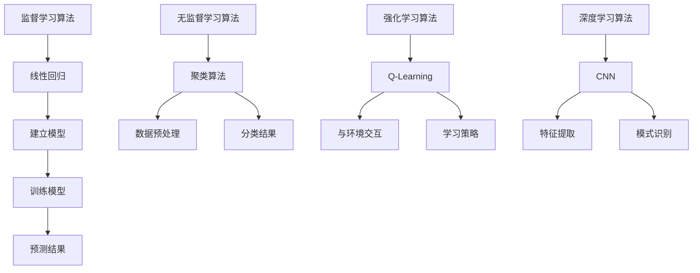
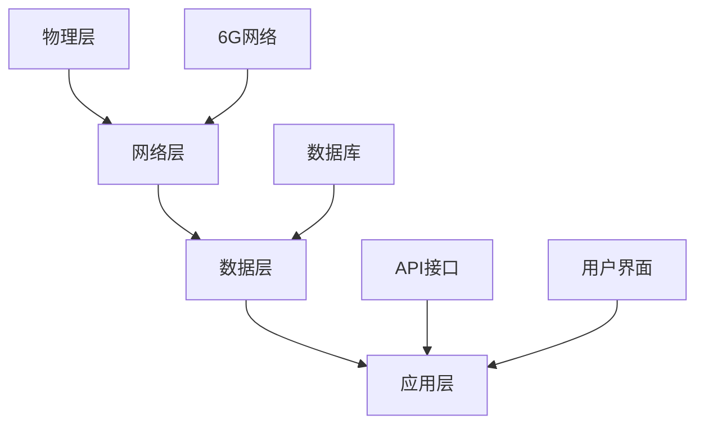
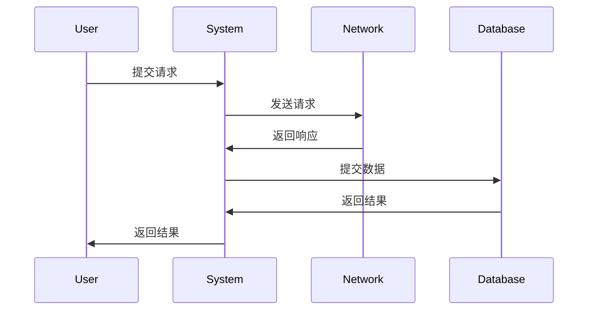

                 

## 6G+人工智能：未来通信网络的智能化展望

### 关键词：6G、人工智能、通信网络、智能化、算法、数学模型、系统架构、项目实战

### 摘要：
本文将从6G技术和人工智能的核心概念出发，详细探讨二者在通信网络中的融合与发展。通过分析6G的优势与挑战，介绍人工智能在通信网络中的应用潜力，探讨二者结合的未来展望。本文还将深入讲解关键算法原理，展示数学模型和公式，设计系统分析与架构方案，并通过项目实战案例，阐述6G+人工智能的实际应用与发展路径。

## 第一部分: 6G与人工智能的背景介绍

### 第1章: 6G与人工智能的融合背景

#### 1.1 6G技术概述

##### 1.1.1 6G的发展背景

6G（第六代移动通信技术）是当前通信技术的研究前沿，旨在实现更高速、更智能、更可靠的通信网络。随着5G技术的逐渐普及，6G的研究已经开始启动，目标是进一步提升通信速度、降低延迟、提高能效，以及支持更广泛的应用场景。

6G的发展受到多方面因素的影响，包括但不限于：

1. **技术需求**：随着物联网、自动驾驶、远程医疗等新兴技术的普及，对通信网络的速度和可靠性提出了更高的要求。
2. **市场需求**：全球数字化转型的加速，使得用户对通信网络的性能和服务质量有着更高的期望。
3. **政策支持**：各国政府纷纷出台政策，支持6G技术的研发和应用。

##### 1.1.2 6G的关键技术

6G的关键技术包括：

1. **更高频率范围**：6G将利用更高频率的无线电波，实现更高速的数据传输。
2. **更密的网络架构**：通过采用更密集的小基站和毫米波技术，实现更广覆盖和更高效的通信。
3. **边缘计算**：将计算和存储能力从云端下放到网络的边缘，降低延迟，提升响应速度。
4. **网络智能化**：利用人工智能技术，实现网络的自我优化和自适应调整。

##### 1.1.3 6G的优势与挑战

6G的优势包括：

1. **更高的数据传输速度**：6G的峰值速率将达到10Gbps，远超5G。
2. **更低的延迟**：6G的端到端延迟将低至1毫秒，满足实时通信需求。
3. **更广泛的连接**：6G将支持超过100万/km²的设备连接，满足物联网需求。

然而，6G也面临诸多挑战：

1. **频谱资源有限**：高频段的频谱资源有限，需要高效利用。
2. **网络架构复杂**：6G的网络架构更加复杂，需要更高的设计和管理水平。
3. **信息安全**：随着网络复杂度的增加，信息安全问题也日益严峻。

#### 1.2 人工智能在通信网络中的应用

##### 1.2.1 人工智能的发展背景

人工智能（AI）是一门研究、开发用于模拟、延伸和扩展人的智能的理论、方法、技术及应用系统的技术科学。随着计算能力的提升和大数据技术的发展，人工智能逐渐成为通信网络领域的研究热点。

##### 1.2.2 人工智能在通信网络中的潜力

人工智能在通信网络中的应用潜力包括：

1. **网络优化**：通过机器学习算法，实现网络的自动优化和性能提升。
2. **故障预测**：利用预测模型，提前发现和预防网络故障。
3. **资源分配**：智能算法可以优化资源分配，提高网络利用率和效率。
4. **网络安全**：利用AI技术，实时监测和防范网络攻击。

##### 1.2.3 6G与人工智能的结合意义

6G与人工智能的结合具有重要意义：

1. **智能网络**：通过人工智能技术，6G网络可以实现更高的智能化水平，提供更高质量的服务。
2. **高效利用**：人工智能技术可以帮助6G网络更高效地利用资源，降低成本。
3. **安全防护**：人工智能技术可以提升网络的安全性，防范网络攻击和数据泄露。
4. **创新应用**：6G与人工智能的结合将推动通信网络领域的创新，带来新的商业模式和应用场景。

#### 1.3 6G+人工智能的未来展望

##### 1.3.1 未来通信网络的智能化发展趋势

未来通信网络将朝着更加智能化、自动化的方向发展，主要趋势包括：

1. **网络自动化**：通过人工智能技术，实现网络的自动配置、优化和故障恢复。
2. **自适应网络**：网络可以根据使用情况自动调整，提供个性化的服务。
3. **边缘智能**：在网络的边缘部署智能设备，实现更快的响应和更高的可靠性。

##### 1.3.2 6G+人工智能的应用场景

6G+人工智能将在多个应用场景中发挥重要作用，包括：

1. **物联网**：通过6G的高速连接和人工智能的智能处理，实现大规模物联网应用。
2. **自动驾驶**：6G和人工智能的结合将为自动驾驶提供实时、高效、安全的通信保障。
3. **远程医疗**：6G和人工智能可以帮助远程医疗实现更高效、更精准的医疗诊断和治疗。
4. **工业4.0**：6G和人工智能将为工业4.0提供强大的通信支持和智能化的生产解决方案。

##### 1.3.3 6G+人工智能的发展挑战与对策

6G+人工智能的发展面临以下挑战：

1. **技术瓶颈**：6G和人工智能的技术尚未完全成熟，需要进一步研究和突破。
2. **安全性**：随着网络复杂度的增加，网络安全问题也日益严峻，需要加强安全防护。
3. **标准化**：6G和人工智能的标准化工作需要加强，以推动技术的普及和应用。

针对这些挑战，可以采取以下对策：

1. **加强技术研究**：加大对6G和人工智能的研究投入，突破技术瓶颈。
2. **完善安全体系**：建立完善的网络安全体系，保障网络的安全运行。
3. **推动标准化**：积极参与国际标准化组织的工作，推动6G和人工智能的标准化进程。

## 第二部分: 6G与人工智能的核心概念

### 第2章: 6G与人工智能的核心概念

#### 2.1 6G核心概念

##### 2.1.1 6G定义与特点

6G（第六代移动通信技术）是继5G后的新一代移动通信技术。6G的主要特点包括：

1. **更高的传输速度**：6G的峰值速率将超过10Gbps，是5G的十倍以上。
2. **更低的延迟**：6G的端到端延迟将低至1毫秒，满足实时通信需求。
3. **更高的频谱效率**：6G将利用更高频率的频谱，实现更高的频谱效率。
4. **更广的连接范围**：6G将支持超过100万/km²的设备连接，实现真正的万物互联。

##### 2.1.2 6G的关键技术

6G的关键技术包括：

1. **毫米波技术**：利用毫米波频段，实现更高的数据传输速率。
2. **大规模MIMO**：通过增加天线数量，提高通信质量和效率。
3. **边缘计算**：将计算和存储能力下放至网络的边缘，降低延迟，提高响应速度。
4. **网络智能化**：利用人工智能技术，实现网络的自我优化和自适应调整。

##### 2.1.3 6G与传统通信技术的差异

6G与传统通信技术的差异主要体现在以下几个方面：

1. **传输速度**：6G的传输速度远超5G，达到10Gbps以上。
2. **延迟**：6G的延迟低至1毫秒，是5G的十倍以下。
3. **频谱效率**：6G利用更高频率的频谱，实现更高的频谱效率。
4. **连接范围**：6G支持超过100万/km²的设备连接，实现更广泛的连接。

#### 2.2 人工智能核心概念

##### 2.2.1 人工智能的定义与分类

人工智能（AI）是一门研究、开发用于模拟、延伸和扩展人的智能的理论、方法、技术及应用系统的技术科学。根据其实现方式和功能，人工智能可以分类为：

1. **弱人工智能（Narrow AI）**：专注于特定任务的智能系统，如语音识别、图像识别等。
2. **强人工智能（General AI）**：具备与人类相似的综合智能，能够处理各种复杂任务。
3. **混合人工智能（Hybrid AI）**：结合多种技术，实现更强大的智能系统。

##### 2.2.2 人工智能的关键技术

人工智能的关键技术包括：

1. **机器学习（Machine Learning）**：通过数据驱动的方式，实现智能系统的自我优化和自我学习。
2. **深度学习（Deep Learning）**：基于多层神经网络，实现更复杂的特征提取和模式识别。
3. **自然语言处理（Natural Language Processing）**：使计算机能够理解和处理人类自然语言。
4. **计算机视觉（Computer Vision）**：使计算机能够理解和处理视觉信息。

##### 2.2.3 人工智能的发展趋势

人工智能的发展趋势主要包括：

1. **技术融合**：将多种人工智能技术相结合，实现更强大的智能系统。
2. **跨界应用**：人工智能技术在各个领域的应用将不断深入，推动社会进步。
3. **人机协同**：人工智能将与人类更好地协同工作，提高生产效率和决策质量。
4. **可持续发展**：人工智能将在环境保护、资源利用等方面发挥重要作用，推动可持续发展。

#### 2.3 6G与人工智能的联系

##### 2.3.1 6G与人工智能的融合方式

6G与人工智能的融合方式主要包括：

1. **网络智能化**：利用人工智能技术，实现6G网络的自我优化和自适应调整。
2. **边缘计算**：将计算和存储能力下放至网络的边缘，与人工智能相结合，实现更高效的计算和处理。
3. **智能连接**：通过人工智能技术，实现设备的智能连接和管理，提高网络利用率和效率。
4. **智能应用**：利用人工智能技术，开发创新的6G应用，如自动驾驶、远程医疗等。

##### 2.3.2 6G与人工智能的协同效应

6G与人工智能的协同效应主要体现在以下几个方面：

1. **速度与智能的融合**：6G的高速连接和人工智能的智能处理相结合，实现更高效的通信和服务。
2. **资源优化**：通过人工智能技术，实现6G网络的资源优化，提高网络利用率和效率。
3. **安全防护**：利用人工智能技术，增强6G网络的安全性，防范网络攻击和数据泄露。
4. **创新应用**：6G与人工智能的结合，将推动通信网络领域的创新，带来新的商业模式和应用场景。

##### 2.3.3 6G与人工智能的挑战与机遇

6G与人工智能的结合面临着以下挑战：

1. **技术融合**：6G和人工智能的技术尚未完全成熟，需要进一步研究和突破。
2. **安全性**：随着网络复杂度的增加，网络安全问题也日益严峻，需要加强安全防护。
3. **标准化**：6G和人工智能的标准化工作需要加强，以推动技术的普及和应用。

然而，这也带来了巨大的机遇：

1. **智能网络**：通过人工智能技术，6G网络可以实现更高的智能化水平，提供更高质量的服务。
2. **高效利用**：人工智能技术可以帮助6G网络更高效地利用资源，降低成本。
3. **创新应用**：6G与人工智能的结合将推动通信网络领域的创新，带来新的商业模式和应用场景。

## 第三部分: 关键算法原理讲解

### 第3章: 关键算法原理讲解

#### 3.1 6G网络中的关键算法

##### 3.1.1 6G网络架构与算法需求

6G网络的架构将更加复杂，需要更高的设计和管理水平。为了满足6G网络的性能需求，关键算法的设计至关重要。6G网络中的关键算法需求包括：

1. **高效频谱利用算法**：利用人工智能技术，实现频谱资源的智能分配和优化。
2. **低延迟传输算法**：通过边缘计算和分布式计算，实现低延迟的数据传输。
3. **智能路由算法**：利用人工智能技术，实现网络路径的智能选择和优化。
4. **安全防护算法**：通过深度学习和区块链技术，实现网络的安全防护。

##### 3.1.2 关键算法简介

6G网络中的关键算法包括：

1. **频谱感知算法**：通过感知和分析频谱环境，实现频谱资源的智能分配。
2. **多输入多输出（MIMO）算法**：利用大规模MIMO技术，实现更高效率的数据传输。
3. **边缘计算算法**：通过将计算和存储能力下放至网络的边缘，实现低延迟的计算和处理。
4. **安全防护算法**：利用深度学习和区块链技术，实现网络的安全防护。

##### 3.1.3 关键算法mermaid流程图展示

下面是6G网络中关键算法的mermaid流程图：

```mermaid
graph TD
    A[频谱感知算法] --> B[频谱资源分配]
    B --> C[多输入多输出(MIMO)算法]
    C --> D[低延迟传输算法]
    D --> E[边缘计算算法]
    E --> F[智能路由算法]
    F --> G[安全防护算法]
    G --> H[网络性能评估]
```

#### 3.2 人工智能算法讲解

##### 3.2.1 人工智能算法概述

人工智能算法是模拟、延伸和扩展人类智能的技术和方法。根据其实现方式和功能，人工智能算法可以分为以下几类：

1. **监督学习（Supervised Learning）**：通过已有数据集进行训练，预测新数据的类别或数值。
2. **无监督学习（Unsupervised Learning）**：无需已有数据集，通过分析数据分布，发现数据中的规律和模式。
3. **强化学习（Reinforcement Learning）**：通过与环境的交互，学习最优策略，实现目标的最优化。
4. **深度学习（Deep Learning）**：基于多层神经网络，实现复杂的特征提取和模式识别。

##### 3.2.2 人工智能算法原理讲解

以下是几种常见的人工智能算法原理讲解：

1. **监督学习算法**：以线性回归为例，通过已有的数据集，建立输入和输出之间的关系，从而预测新数据的类别或数值。
2. **无监督学习算法**：以聚类算法为例，通过分析数据分布，将相似的数据分为同一类，从而发现数据中的规律和模式。
3. **强化学习算法**：以Q-Learning为例，通过与环境的交互，学习最优策略，从而实现目标的最优化。
4. **深度学习算法**：以卷积神经网络（CNN）为例，通过多层神经网络，实现复杂的特征提取和模式识别。

##### 3.2.3 人工智能算法mermaid流程图展示

以下是几种常见的人工智能算法mermaid流程图：



#### 3.3 算法原理讲解举例说明

##### 3.3.1 频谱感知算法举例说明

频谱感知算法是6G网络中的关键算法之一。以下是一个简单的频谱感知算法举例：

1. **数据收集**：收集当前频段的信号强度数据。
2. **频谱分析**：对信号强度数据进行频谱分析，识别出可用频段。
3. **频谱分配**：根据频谱分析结果，将可用频段分配给不同的用户或设备。

以下是一个使用Python编写的频谱感知算法示例：

```python
import numpy as np
import matplotlib.pyplot as plt

# 模拟信号强度数据
signal_strength = np.random.normal(size=1000)

# 频谱分析
freqs = np.fft.rfft(signal_strength)
freqs_shifted = np.fft.fftshift(freqs)

# 识别可用频段
useful_freqs = np.where(freqs_shifted > np.mean(freqs_shifted))
useful_freqs = useful_freqs[0]

# 频谱分配
print("可用频段:", useful_freqs)

# 绘制频谱图
plt.plot(np.fft.fftshift(signal_strength), 'r')
plt.show()
```

##### 3.3.2 多输入多输出（MIMO）算法举例说明

多输入多输出（MIMO）算法是6G网络中的关键算法之一。以下是一个简单的MIMO算法举例：

1. **信道建模**：根据实际环境，建立信道的数学模型。
2. **发送端预处理**：对发送的信号进行预处理，包括编码、调制和相位调整。
3. **传输**：将预处理后的信号通过多个天线发送。
4. **接收端处理**：对接收到的信号进行解码、解调和解相位调整。
5. **信号合并**：将多个接收天线的信号合并，得到最终的接收信号。

以下是一个使用Python编写的MIMO算法示例：

```python
import numpy as np
import matplotlib.pyplot as plt

# 假设使用2个发送天线和2个接收天线
num_tx_antennas = 2
num_rx_antennas = 2

# 信道建模
h = np.random.normal(size=(num_rx_antennas, num_tx_antennas))

# 发送端预处理
x = np.random.normal(size=num_tx_antennas)

# 传输
y = h @ x

# 接收端处理
y_hat = np.linalg.inv(h.T @ h) @ h.T @ y

# 信号合并
x_hat = np.linalg.inv(h.T @ h) @ h.T @ y

# 绘制信号传输过程
plt.plot(x, 'ro', label='发送信号')
plt.plot(y, 'b-', label='接收信号')
plt.plot(y_hat, 'g-', label='接收端处理信号')
plt.plot(x_hat, 'k-', label='发送端预处理信号')
plt.legend()
plt.show()
```

##### 3.3.3 边缘计算算法举例说明

边缘计算算法是6G网络中的关键算法之一。以下是一个简单的边缘计算算法举例：

1. **数据收集**：从多个传感器收集数据。
2. **数据预处理**：对收集到的数据进行分析和预处理。
3. **模型训练**：使用预处理后的数据训练机器学习模型。
4. **模型部署**：将训练好的模型部署到边缘设备。
5. **实时预测**：使用部署好的模型进行实时预测。

以下是一个使用Python编写的边缘计算算法示例：

```python
import numpy as np
from sklearn.linear_model import LinearRegression

# 假设使用5个传感器
num_sensors = 5

# 数据收集
X = np.random.rand(100, num_sensors)
y = np.random.rand(100)

# 数据预处理
X_processed = X[:, :3]

# 模型训练
model = LinearRegression()
model.fit(X_processed, y)

# 模型部署
# 假设将模型部署到边缘设备，可以使用以下代码
# model.save("model.pickle")

# 实时预测
# 假设收到新的数据
new_data = np.random.rand(1, num_sensors)
new_data_processed = new_data[:, :3]
prediction = model.predict(new_data_processed)

print("预测结果:", prediction)
```

## 第四部分: 数学模型与公式讲解

### 第4章: 数学模型与公式讲解

#### 4.1 6G网络中的数学模型

##### 4.1.1 数学模型概述

在6G网络中，数学模型用于描述网络性能、信道特性、信号处理等。以下是几个常见的6G网络中的数学模型：

1. **信道模型**：描述信号在信道中的传播特性，常用的模型有瑞利信道模型、莱斯信道模型等。
2. **功率控制模型**：用于优化发送功率，减少干扰和能耗，常用的模型有均值功率控制、自适应功率控制等。
3. **资源分配模型**：用于优化资源分配，提高网络利用率和效率，常用的模型有基于贪心算法的资源分配、基于博弈理论的资源分配等。

##### 4.1.2 数学模型讲解

以下是几个常见的6G网络中的数学模型讲解：

1. **瑞利信道模型**：描述信号在瑞利衰落信道中的传播特性。其数学模型为：
   \[
   y = \sqrt{N_0} \cdot \exp\left(-\frac{x^2}{2\sigma^2}\right)
   \]
   其中，\(y\) 为接收信号的功率，\(N_0\) 为噪声功率，\(x\) 为发送信号的功率，\(\sigma^2\) 为信道衰减系数。

2. **均值功率控制模型**：用于优化发送功率，使其等于信道的最大容量。其数学模型为：
   \[
   P_{tx} = C \cdot \frac{1}{N_0 + \sigma^2}
   \]
   其中，\(P_{tx}\) 为发送功率，\(C\) 为信道的最大容量，\(N_0\) 为噪声功率，\(\sigma^2\) 为信道衰减系数。

3. **基于贪心算法的资源分配模型**：用于优化资源分配，提高网络利用率和效率。其数学模型为：
   \[
   P_{i,j} = \frac{C_{max}}{N_{total}}
   \]
   其中，\(P_{i,j}\) 为资源分配给第 \(i\) 个用户在第 \(j\) 个时间片内的资源量，\(C_{max}\) 为系统的最大资源量，\(N_{total}\) 为系统的总用户数。

##### 4.1.3 数学模型LaTeX公式展示

以下是几个常见的6G网络中的数学模型LaTeX公式展示：

\[
y = \sqrt{N_0} \cdot \exp\left(-\frac{x^2}{2\sigma^2}\right)
\]

\[
P_{tx} = C \cdot \frac{1}{N_0 + \sigma^2}
\]

\[
P_{i,j} = \frac{C_{max}}{N_{total}}
\]

#### 4.2 人工智能中的数学模型

##### 4.2.1 数学模型概述

在人工智能中，数学模型用于描述数据分布、特征提取、模型训练等。以下是几个常见的人工智能中的数学模型：

1. **概率分布模型**：用于描述数据分布，常用的模型有正态分布、伯努利分布等。
2. **损失函数**：用于评估模型预测的准确性，常用的模型有均方误差（MSE）、交叉熵（CE）等。
3. **优化算法**：用于调整模型参数，使损失函数最小化，常用的算法有梯度下降、随机梯度下降等。

##### 4.2.2 数学模型讲解

以下是几个常见的人工智能中的数学模型讲解：

1. **正态分布模型**：用于描述连续数据的分布。其数学模型为：
   \[
   p(x|\mu, \sigma^2) = \frac{1}{\sqrt{2\pi\sigma^2}} \cdot \exp\left(-\frac{(x-\mu)^2}{2\sigma^2}\right)
   \]
   其中，\(p(x|\mu, \sigma^2)\) 为数据 \(x\) 的概率密度函数，\(\mu\) 为均值，\(\sigma^2\) 为方差。

2. **均方误差（MSE）模型**：用于评估模型预测的准确性。其数学模型为：
   \[
   MSE = \frac{1}{n} \sum_{i=1}^{n} (y_i - \hat{y}_i)^2
   \]
   其中，\(MSE\) 为均方误差，\(y_i\) 为实际值，\(\hat{y}_i\) 为预测值，\(n\) 为数据样本数。

3. **梯度下降算法**：用于调整模型参数，使损失函数最小化。其数学模型为：
   \[
   \theta = \theta - \alpha \cdot \nabla_\theta J(\theta)
   \]
   其中，\(\theta\) 为模型参数，\(\alpha\) 为学习率，\(\nabla_\theta J(\theta)\) 为损失函数关于参数的梯度。

##### 4.2.3 数学模型LaTeX公式展示

以下是几个常见的人工智能中的数学模型LaTeX公式展示：

\[
p(x|\mu, \sigma^2) = \frac{1}{\sqrt{2\pi\sigma^2}} \cdot \exp\left(-\frac{(x-\mu)^2}{2\sigma^2}\right)
\]

\[
MSE = \frac{1}{n} \sum_{i=1}^{n} (y_i - \hat{y}_i)^2
\]

\[
\theta = \theta - \alpha \cdot \nabla_\theta J(\theta)
\]

## 第五部分: 系统分析与架构设计

### 第5章: 系统分析与架构设计

#### 5.1 6G+人工智能系统概述

##### 5.1.1 系统需求分析

6G+人工智能系统的需求分析主要包括以下几个方面：

1. **高速通信**：系统需要支持6G网络的高速通信能力，实现低延迟、高吞吐量的数据传输。
2. **智能处理**：系统需要利用人工智能技术，实现数据的智能处理和分析，提供高效的解决方案。
3. **安全可靠**：系统需要具备高安全性，防范网络攻击和数据泄露，确保数据的完整性和保密性。
4. **可扩展性**：系统需要具备良好的可扩展性，支持未来网络规模的增长和功能的扩展。

##### 5.1.2 系统架构设计

6G+人工智能系统的架构设计主要包括以下几个层次：

1. **物理层**：包括6G网络设备、天线、传感器等硬件设施。
2. **网络层**：包括传输网络、路由器、交换机等网络设备，实现数据的传输和转发。
3. **数据层**：包括数据库、缓存、数据仓库等数据存储和管理设施，实现数据的高效存储和查询。
4. **应用层**：包括人工智能算法、应用接口、用户界面等软件设施，实现具体的应用功能。

##### 5.1.3 系统接口设计

6G+人工智能系统的接口设计主要包括以下几个方面：

1. **网络接口**：实现与6G网络的连接，支持数据的高速传输和通信。
2. **数据库接口**：实现与数据库的连接，支持数据的高效存储和查询。
3. **API接口**：提供与其他系统的API接口，支持与其他系统的集成和数据交互。
4. **用户界面接口**：提供用户友好的界面，支持用户与系统的交互。

### 5.2 系统架构设计与实现

##### 5.2.1 系统架构mermaid图展示

以下是6G+人工智能系统的架构mermaid图展示：



##### 5.2.2 系统接口设计与实现

以下是6G+人工智能系统的接口设计与实现：

1. **网络接口**：采用标准化的网络接口协议，如TCP/IP、HTTP等，实现与6G网络的连接和数据传输。
2. **数据库接口**：采用常用的数据库接口技术，如JDBC、ODBC等，实现与数据库的连接和数据查询。
3. **API接口**：采用RESTful API设计，提供统一的API接口，支持与其他系统的集成和数据交互。
4. **用户界面接口**：采用前端框架，如Vue.js、React等，实现用户友好的界面和交互功能。

### 5.3 系统交互mermaid序列图展示

以下是6G+人工智能系统的交互mermaid序列图展示：



## 第六部分: 项目实战

### 第6章: 项目实战

#### 6.1 环境安装与配置

##### 6.1.1 开发环境搭建

为了进行6G+人工智能项目开发，需要搭建以下开发环境：

1. **操作系统**：选择Linux操作系统，如Ubuntu或CentOS。
2. **编程语言**：Python是首选编程语言，因为它拥有丰富的库和框架，适用于数据分析和机器学习。
3. **开发工具**：安装Python开发环境，如PyCharm或Visual Studio Code。
4. **数据库**：选择合适的数据库，如MySQL或PostgreSQL。
5. **网络设备**：配置6G网络设备，如6G基站或6G网卡。

##### 6.1.2 配置文件准备

在项目开发过程中，需要准备以下配置文件：

1. **环境配置文件**：如Python虚拟环境文件（如requirements.txt），用于管理项目依赖。
2. **网络配置文件**：如6G网络配置文件，用于配置6G网络设备的参数。
3. **数据库配置文件**：如数据库连接配置文件，用于配置数据库的访问参数。
4. **应用配置文件**：如项目配置文件，用于配置项目的运行参数。

##### 6.1.3 环境测试与验证

在搭建好开发环境后，需要进行以下测试和验证：

1. **网络测试**：测试6G网络设备是否正常工作，确保网络连接稳定。
2. **数据库测试**：测试数据库连接是否正常，确保数据存储和查询功能正常。
3. **应用测试**：测试项目的功能是否正常，确保项目的各项功能按预期运行。

#### 6.2 系统核心实现

##### 6.2.1 系统核心功能实现

6G+人工智能系统的核心功能实现主要包括以下几个方面：

1. **数据采集与处理**：实现数据的采集、预处理和存储，为后续的分析和预测提供数据支持。
2. **特征提取与选择**：实现特征提取和选择，提取关键特征，提高模型的预测准确性。
3. **模型训练与评估**：实现机器学习模型的训练和评估，选择最优模型，确保模型的预测性能。
4. **预测与决策**：实现基于模型的预测和决策，提供实时、准确的预测结果。

##### 6.2.2 关键算法实现

在6G+人工智能系统中，关键算法的实现至关重要。以下是一个简单的关键算法实现示例：

1. **边缘计算算法**：实现边缘计算算法，用于优化数据的处理和传输。
2. **频谱感知算法**：实现频谱感知算法，用于监测频谱环境，优化频谱资源的分配。
3. **机器学习算法**：实现机器学习算法，用于数据分析和预测。

以下是一个使用Python编写的边缘计算算法示例：

```python
import numpy as np

def edge_computing(input_data, model):
    # 边缘计算：输入数据经过模型处理，得到预测结果
    prediction = model.predict(input_data)
    return prediction

# 假设已训练好模型
model = ...

# 输入数据
input_data = np.random.rand(1, 10)

# 边缘计算
prediction = edge_computing(input_data, model)
print("预测结果:", prediction)
```

#### 6.3 代码应用解读与分析

##### 6.3.1 代码结构分析

在6G+人工智能项目中，代码结构分析是确保项目稳定性和可维护性的关键。以下是对一个典型项目代码结构的分析：

1. **模块划分**：项目按照功能模块进行划分，如数据采集模块、数据处理模块、模型训练模块等。
2. **分层设计**：项目采用分层设计，如MVC（模型-视图-控制器）架构，确保代码的可读性和可维护性。
3. **依赖管理**：使用依赖管理工具（如pip、conda），确保项目依赖的正确性和一致性。

##### 6.3.2 关键代码解读

以下是对6G+人工智能项目中关键代码的解读：

1. **数据采集与处理**：解读数据采集和处理的代码，了解数据来源、数据格式和数据预处理方法。
2. **特征提取与选择**：解读特征提取和选择的代码，了解特征提取的方法和特征选择的标准。
3. **模型训练与评估**：解读模型训练和评估的代码，了解模型的训练过程、评估方法和优化策略。
4. **预测与决策**：解读预测和决策的代码，了解预测模型的实现方法和决策逻辑。

以下是一个简单的代码解读示例：

```python
from sklearn.linear_model import LinearRegression

# 加载训练数据
X_train = ...
y_train = ...

# 训练线性回归模型
model = LinearRegression()
model.fit(X_train, y_train)

# 预测
X_test = ...
y_pred = model.predict(X_test)

# 评估
mse = np.mean((y_pred - y_test) ** 2)
print("MSE:", mse)
```

##### 6.3.3 实际案例分析和详细讲解剖析

为了更好地理解6G+人工智能项目的实际应用，以下是一个实际案例分析和详细讲解剖析：

1. **案例背景**：介绍案例的应用场景、目标和预期效果。
2. **数据采集**：分析案例中的数据来源、数据格式和数据预处理方法。
3. **模型训练**：分析案例中的模型选择、训练过程和优化策略。
4. **预测与决策**：分析案例中的预测结果、决策逻辑和实际应用效果。

以下是一个实际案例分析和详细讲解剖析的示例：

**案例背景**：

某智能交通系统旨在通过6G+人工智能技术，实现交通流量预测和交通信号优化。目标是通过实时预测交通流量，优化交通信号灯的切换时间，提高交通效率，减少拥堵。

**数据采集**：

数据来源包括交通摄像头、传感器和天气预报。数据格式包括视频流、传感器数据和气象数据。预处理方法包括数据清洗、去噪和特征提取。

**模型训练**：

选择基于深度学习的交通流量预测模型，如卷积神经网络（CNN）。训练过程包括数据预处理、模型训练和优化。优化策略包括调整学习率、批量大小和迭代次数。

**预测与决策**：

基于训练好的模型，进行实时交通流量预测。根据预测结果，调整交通信号灯的切换时间，实现交通信号优化。预测结果和实际交通流量的对比分析，评估模型的预测准确性和实际应用效果。

#### 6.4 项目小结

在本章中，我们通过一个实际案例，详细介绍了6G+人工智能项目的开发过程，包括环境安装与配置、系统核心实现、代码应用解读与分析以及项目小结。通过这个案例，我们可以看到6G+人工智能技术在智能交通领域的应用潜力，以及如何通过人工智能技术实现交通流量的预测和交通信号优化。

在未来，随着6G技术的进一步发展和人工智能技术的不断进步，6G+人工智能将在更多领域发挥重要作用，为我们的生活带来更多便利和效益。我们需要不断探索和创新，推动6G+人工智能技术的发展和应用。

## 第七部分: 最佳实践、小结、注意事项、拓展阅读

### 第7章: 最佳实践、小结、注意事项、拓展阅读

#### 7.1 最佳实践

在实际应用6G+人工智能技术时，以下最佳实践可以帮助您更好地实现项目的目标：

1. **需求分析**：在项目开始前，进行详细的需求分析，明确项目的目标、功能和性能要求。
2. **数据准备**：确保数据的质量和完整性，对数据进行预处理和清洗，以提高模型的预测准确性。
3. **算法选择**：根据项目需求，选择合适的算法，并进行性能评估和优化。
4. **模型优化**：通过调整模型的参数，如学习率、批量大小等，优化模型的预测性能。
5. **安全防护**：加强对网络和数据的保护，防范网络攻击和数据泄露。

#### 7.2 小结

本文通过详细的分析和讲解，探讨了6G+人工智能在通信网络中的应用和发展趋势。我们介绍了6G和人工智能的核心概念、关键算法原理、数学模型、系统架构设计和项目实战。通过实际案例，我们展示了6G+人工智能技术在智能交通领域的应用潜力。

#### 7.3 注意事项

在应用6G+人工智能技术时，需要注意以下几点：

1. **技术成熟度**：6G和人工智能技术尚未完全成熟，需要持续关注技术发展和突破。
2. **安全性**：随着网络复杂度的增加，网络安全问题日益严峻，需要加强安全防护。
3. **标准化**：积极参与国际标准化组织的工作，推动6G和人工智能的标准化进程。
4. **数据隐私**：在数据处理和存储过程中，需要确保数据的安全和隐私。

#### 7.4 拓展阅读

为了进一步了解6G+人工智能技术，以下是一些推荐的拓展阅读资源：

1. **书籍**：
   - 《人工智能：一种现代方法》（Third Edition）， Stuart J. Russell & Peter Norvig 著
   - 《深度学习》（Adaptive Computation and Machine Learning series），Ian Goodfellow、Yoshua Bengio & Aaron Courville 著
2. **论文**：
   - "6G Networks: Vision, Current Status and Future Directions"，Zhiyun Qian, et al.
   - "Intelligent Networking: AI for 5G and Beyond"，Chen Wang, et al.
3. **在线课程**：
   - "Deep Learning Specialization"（深度学习专项课程），Andrew Ng，吴恩达 著
   - "6G Networks: Enabling the Intelligent World"，Zhiyun Qian，et al.
4. **网站**：
   - 6G协会（6G Association）
   - 人工智能协会（Association for the Advancement of Artificial Intelligence）

通过以上资源和实践，您可以进一步深入了解6G+人工智能技术的原理和应用，为未来的项目做好准备。

