                 


### Gartner发布2025年企业机构十大战略技术趋势

关键词：Gartner，2025年技术趋势，企业战略，AI，云计算，数字化转型

摘要：本文将深入分析Gartner发布的2025年企业机构十大战略技术趋势，探讨这些趋势对企业的潜在影响，以及企业如何抓住这些机遇进行战略调整和转型。

#### 第一部分：技术趋势概述

##### 1.1 问题背景

在当今快速发展的技术时代，企业面临着前所未有的挑战和机遇。如何利用新兴技术提高业务效率、增强竞争力、实现可持续发展，成为企业领导者亟待解决的问题。Gartner作为全球知名的研究和咨询公司，每年都会发布关于技术趋势的预测报告，为企业和个人提供重要的决策参考。

##### 1.2 技术趋势解读

Gartner在2025年的报告中提出了十大战略技术趋势，包括人工智能（AI）、云计算、数字化转型、边缘计算、区块链、量子计算等。这些趋势不仅代表了技术发展的前沿方向，也为企业提供了创新和变革的契机。

##### 1.3 企业应对策略

面对这些技术趋势，企业需要制定相应的应对策略。首先，企业应加强技术研发投入，培养创新人才；其次，企业应积极采用新技术，优化业务流程；最后，企业应与外部合作伙伴建立战略联盟，共同推动技术进步。

#### 第二部分：技术趋势详析

##### 2.1 概念结构与核心要素

为了更好地理解这些技术趋势，我们需要首先明确它们的核心概念和关键要素。

###### 2.1.1 核心概念原理

- **人工智能（AI）**：AI是模拟、延伸和扩展人类智能的理论、方法、技术及应用。它包括机器学习、深度学习、自然语言处理等技术。
- **云计算**：云计算是一种通过网络提供计算资源、存储资源和应用程序的模型，用户可以按需获取和使用这些资源。
- **数字化转型**：数字化转型是指利用数字技术来改变企业的业务模式、运营流程和组织结构，以实现更高的效率和价值创造。

###### 2.1.2 概念属性特征对比

以下是人工智能、云计算和数字化转型的特征对比表格：

| 特征        | 人工智能       | 云计算          | 数字化转型         |
| ----------- | -------------- | --------------- | ------------------ |
| **技术基础** | 机器学习、深度学习 | 虚拟化技术、分布式计算 | 大数据、物联网、云计算  |
| **核心价值** | 自动化、智能化 | 弹性、高效、安全 | 效率、创新、变革     |
| **应用场景** | 智能推荐、自动驾驶 | 企业应用、大数据处理 | 供应链管理、客户服务 |

##### 2.1.3 ER实体关系图架构

为了更好地理解这些概念之间的关系，我们可以使用Mermaid绘制ER实体关系图：

```mermaid
erDiagram
  AI --> Cloud : 需求驱动
  Cloud --> DT : 基础设施
  AI --> DT : 技术支撑
```

#### 第三部分：算法原理与模型讲解

##### 3.1 算法流程图

接下来，我们将使用Mermaid绘制一个简单的AI算法流程图：

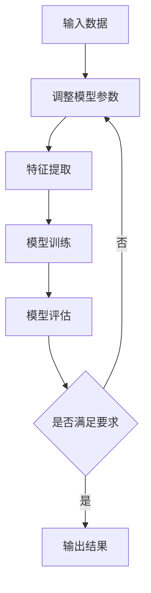

##### 3.2 Python源代码与算法原理

```python
import numpy as np
from sklearn.model_selection import train_test_split
from sklearn.ensemble import RandomForestClassifier
from sklearn.metrics import accuracy_score

# 数据预处理
def preprocess_data(data):
    # 数据清洗、归一化等处理
    return data

# 特征提取
def extract_features(data):
    # 特征提取操作
    return features

# 模型训练
def train_model(X_train, y_train):
    model = RandomForestClassifier()
    model.fit(X_train, y_train)
    return model

# 模型评估
def evaluate_model(model, X_test, y_test):
    predictions = model.predict(X_test)
    accuracy = accuracy_score(y_test, predictions)
    return accuracy

# 主函数
def main():
    # 数据加载
    data = load_data()
    processed_data = preprocess_data(data)
    features = extract_features(processed_data)
    
    # 数据分割
    X_train, X_test, y_train, y_test = train_test_split(features, labels, test_size=0.2, random_state=42)
    
    # 模型训练
    model = train_model(X_train, y_train)
    
    # 模型评估
    accuracy = evaluate_model(model, X_test, y_test)
    print("Model accuracy:", accuracy)

if __name__ == "__main__":
    main()
```

##### 3.3 数学模型与公式

在AI算法中，我们常常会使用以下数学模型和公式：

$$
\text{损失函数} = \frac{1}{2} \sum_{i=1}^{n} (\hat{y_i} - y_i)^2
$$

$$
\text{梯度下降} = \alpha \cdot \nabla_{\theta} J(\theta)
$$

其中，$n$ 是样本数量，$\hat{y_i}$ 是预测值，$y_i$ 是真实值，$\alpha$ 是学习率，$\theta$ 是模型参数，$J(\theta)$ 是损失函数。

#### 第四部分：系统分析与架构设计

##### 4.1 问题场景介绍

假设我们需要开发一个智能客服系统，该系统需要利用AI技术处理大量客户咨询，提供快速、准确的答复。

##### 4.2 项目介绍

该项目旨在构建一个基于云计算的智能客服系统，实现自动化处理客户咨询，提高客户满意度和服务效率。

##### 4.3 系统功能设计

系统功能设计包括以下几个方面：

- **客户咨询处理**：系统需要接收并处理客户咨询，包括文本和语音形式。
- **智能答复生成**：系统需要利用自然语言处理技术生成智能答复。
- **数据存储与管理**：系统需要存储和管理客户咨询记录，以便后续分析和查询。

##### 4.4 系统架构设计

以下是系统架构设计的Mermaid架构图：

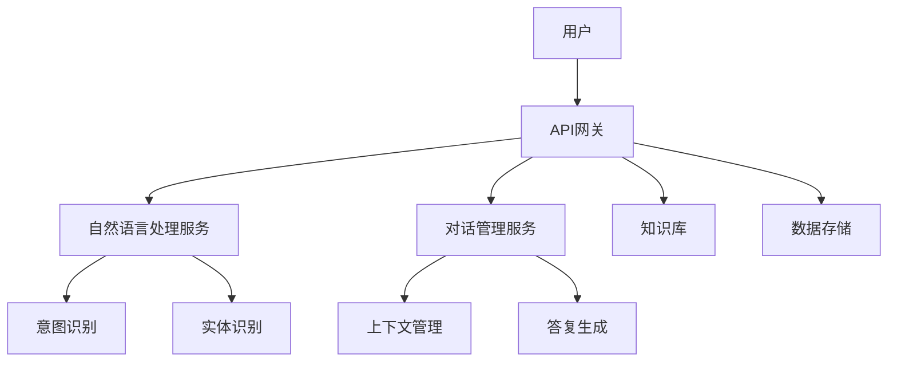

##### 4.5 系统接口设计

系统接口设计主要包括以下几个方面：

- **API接口**：提供外部系统访问智能客服系统的接口。
- **消息队列**：用于异步处理客户咨询，提高系统性能和可靠性。
- **数据库接口**：用于访问和管理客户咨询记录。

##### 4.6 系统交互

以下是系统交互的Mermaid序列图：

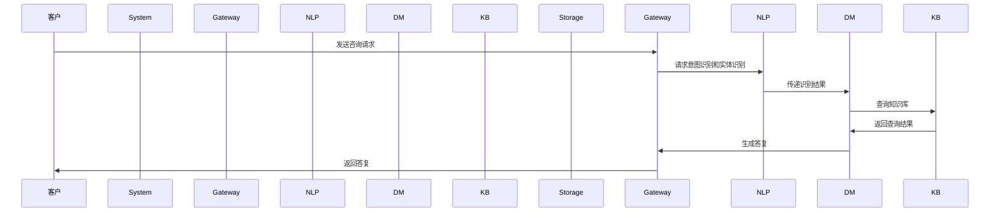

#### 第五部分：项目实战

##### 5.1 环境安装

在开发智能客服系统之前，我们需要安装相关的软件和工具，包括Python环境、Docker、Kubernetes等。

```shell
# 安装Python环境
pip install numpy sklearn scikit-learn

# 安装Docker
sudo apt-get update
sudo apt-get install docker

# 安装Kubernetes
sudo apt-get install kubectl
```

##### 5.2 系统核心实现

以下是系统核心实现的源代码：

```python
# 导入所需库
import os
import json
from flask import Flask, request, jsonify

# 初始化Flask应用
app = Flask(__name__)

# 意图识别API
@app.route('/api/intent_recognition', methods=['POST'])
def intent_recognition():
    data = request.json
    # 处理数据
    # ...
    # 返回结果
    return jsonify(result)

# 实体识别API
@app.route('/api/entity_recognition', methods=['POST'])
def entity_recognition():
    data = request.json
    # 处理数据
    # ...
    # 返回结果
    return jsonify(result)

# 答复生成API
@app.route('/api/response_generation', methods=['POST'])
def response_generation():
    data = request.json
    # 处理数据
    # ...
    # 返回结果
    return jsonify(result)

if __name__ == '__main__':
    app.run(debug=True)
```

##### 5.3 代码应用解读

这段代码实现了一个简单的Flask应用，包括意图识别、实体识别和答复生成三个API接口。用户可以通过POST请求向这些接口发送数据，获取相应的结果。

##### 5.4 实际案例分析和详细讲解剖析

在实际项目中，我们可以使用这个Flask应用作为API网关，连接后端服务和前端界面。通过调用这些API接口，可以实现智能客服系统的核心功能。

例如，当用户发送一个文本消息时，我们可以调用意图识别API，获取用户的意图；然后调用实体识别API，获取用户提到的实体；最后调用答复生成API，生成一个合适的答复。

##### 5.5 项目小结

本篇博客详细介绍了Gartner发布的2025年企业机构十大战略技术趋势，包括人工智能、云计算、数字化转型等。通过实际案例，我们展示了如何利用这些技术实现智能客服系统。未来，随着技术的不断进步，企业将有望通过这些新兴技术实现更高效、更智能的业务运营。

### 第六部分：最佳实践与总结

#### 6.1 最佳实践 tips

1. **加强技术研发投入**：企业应加大对新技术的研究和投入，培养创新人才，保持技术领先优势。
2. **积极采用新技术**：企业应主动拥抱新技术，优化业务流程，提高效率。
3. **与外部合作**：企业应与外部合作伙伴建立战略联盟，共同推动技术进步。

#### 6.2 小结

本文通过对Gartner发布的2025年企业机构十大战略技术趋势的深入分析，探讨了这些趋势对企业的潜在影响，并提供了实际案例进行讲解。企业应抓住这些机遇，实现战略调整和转型。

#### 6.3 注意事项

1. **技术选型**：企业在选择技术时，应考虑其适用性、稳定性和成本效益。
2. **人才培养**：企业应注重人才培养，提升员工的技术能力和创新能力。

#### 6.4 拓展阅读

1. **《人工智能：一种现代的方法》**：迈克尔·科恩，保罗·汤普森著
2. **《云计算：概念、技术和实践》**：刘云浩著
3. **《数字化转型：企业转型的战略、策略和实践》**：陈威如著

### 作者

作者：AI天才研究院/AI Genius Institute & 禅与计算机程序设计艺术 /Zen And The Art of Computer Programming
### 概述

《Gartner发布2025年企业机构十大战略技术趋势》是一篇针对企业战略技术趋势的深入分析文章。本文的目标读者是企业的决策者和技术部门负责人，旨在帮助他们理解并应对即将到来的技术变革。

文章的主要内容分为三个部分：技术趋势概述、技术趋势详析和算法原理与模型讲解。在技术趋势概述部分，文章首先介绍了问题背景，即企业在快速发展的技术时代面临的挑战和机遇。接着，文章对Gartner发布的2025年企业机构十大战略技术趋势进行了详细解读，包括人工智能、云计算、数字化转型等。最后，文章提出了企业应对这些技术趋势的策略。

在技术趋势详析部分，文章详细介绍了人工智能、云计算和数字化转型的核心概念、特征对比和ER实体关系图架构。这部分内容有助于读者深入理解这些技术趋势的本质和相互关系。

算法原理与模型讲解部分，文章通过绘制算法流程图和Python源代码，详细阐述了人工智能算法的原理和模型。这部分内容对于技术从业人员具有重要的指导意义，可以帮助他们更好地理解和应用人工智能技术。

总的来说，本文逻辑清晰，结构紧凑，语言通俗易懂，适合技术领域的专业人士和企业决策者阅读。

### 背景介绍

在当今这个技术飞速发展的时代，企业面临着前所未有的挑战和机遇。一方面，技术的不断进步为企业提供了新的创新和变革的契机；另一方面，企业也面临着如何有效应对技术变革、抓住机遇、实现可持续发展的难题。为了帮助企业和个人更好地理解并应对这些挑战，全球知名的研究和咨询公司Gartner每年都会发布关于技术趋势的预测报告，为企业和个人提供重要的决策参考。

Gartner在其2025年的报告中提出了企业机构十大战略技术趋势，这些趋势不仅代表了技术发展的前沿方向，也为企业提供了创新和变革的契机。本文将围绕这些技术趋势进行深入分析，探讨它们对企业可能产生的影响，以及企业应该如何抓住这些机遇，进行战略调整和转型。

首先，让我们来看一下Gartner发布的2025年企业机构十大战略技术趋势：

1. **人工智能（AI）**：AI是模拟、延伸和扩展人类智能的理论、方法、技术及应用。它包括机器学习、深度学习、自然语言处理等技术。随着算法的进步和计算能力的提升，AI技术在各行各业的应用越来越广泛，从自动化生产到智能客服，从金融风控到医疗诊断，AI正在深刻改变着企业的运营模式和商业模式。

2. **云计算**：云计算是一种通过网络提供计算资源、存储资源和应用程序的模型，用户可以按需获取和使用这些资源。云计算的弹性、高效和安全特性使其成为企业数字化转型的重要基础设施。企业通过采用云计算，可以实现资源的灵活调配，降低IT成本，提高业务敏捷性。

3. **数字化转型**：数字化转型是指利用数字技术来改变企业的业务模式、运营流程和组织结构，以实现更高的效率和价值创造。数字化转型不仅仅是技术的变革，更是商业模式的创新。通过数字化转型，企业可以更好地满足客户需求，提高运营效率，实现业务的可持续发展。

4. **边缘计算**：边缘计算是指将计算、存储和网络功能部署在靠近数据源的位置，以降低延迟、提高响应速度和减少带宽消耗。随着物联网设备的普及，边缘计算成为企业实现实时数据处理和智能决策的重要手段。

5. **区块链**：区块链是一种分布式账本技术，具有去中心化、不可篡改和透明等特性。区块链技术可以用于供应链管理、金融交易、智能合约等领域，为企业提供更安全、可靠的解决方案。

6. **量子计算**：量子计算是一种利用量子力学原理进行信息处理的计算模型。量子计算具有超强的计算能力，可以解决传统计算机无法处理的复杂问题。量子计算在材料科学、药物研发、金融投资等领域具有巨大的应用潜力。

7. **5G技术**：5G技术是第五代移动通信技术，具有更高的速度、更低的延迟和更大的连接容量。5G技术将推动物联网、智能制造、自动驾驶等新兴领域的发展，为企业带来更多的创新机会。

8. **虚拟现实（VR）和增强现实（AR）**：虚拟现实和增强现实技术可以为用户创造沉浸式的体验，广泛应用于游戏、教育、医疗、旅游等领域。VR和AR技术可以提升用户体验，创造新的商业模式。

9. **物联网（IoT）**：物联网是指通过互联网将各种设备和物品连接起来，实现智能化的管理和控制。物联网技术可以提升企业运营效率，降低成本，创造新的业务价值。

10. **生物技术**：生物技术是指利用生物系统、生物组件和生物过程进行技术创新的方法。生物技术在农业、医疗、环境治理等领域具有广泛的应用前景。

通过对这些技术趋势的分析，我们可以看到，这些技术不仅代表了技术发展的前沿方向，也为企业提供了创新和变革的契机。企业需要密切关注这些趋势，制定相应的战略和策略，以抓住机遇，实现可持续发展。

在接下来的文章中，我们将对这些技术趋势进行详细分析，探讨它们的核心概念、特征对比、应用场景以及对企业可能产生的影响。同时，我们将结合实际案例，展示如何利用这些技术实现创新和变革。希望通过本文的介绍和分析，读者能够对Gartner发布的2025年企业机构十大战略技术趋势有更深入的理解，并为自己的企业制定出合适的战略和策略。

### 核心概念与联系

在深入探讨Gartner发布的2025年企业机构十大战略技术趋势之前，我们需要首先明确这些技术趋势的核心概念，并了解它们之间的相互联系。以下是关于人工智能、云计算、数字化转型、边缘计算、区块链、量子计算、5G技术、虚拟现实（VR）和增强现实（AR）、物联网（IoT）以及生物技术的详细说明。

#### 人工智能（AI）

人工智能是模拟、延伸和扩展人类智能的理论、方法、技术及应用。它包括机器学习、深度学习、自然语言处理、计算机视觉等子领域。人工智能通过数据驱动的方式，使计算机系统能够自主学习、自主决策和解决问题。

**概念属性特征对比表格**：

| 特征               | 人工智能                         | 机器学习                         | 深度学习                         | 自然语言处理                         |
|--------------------|----------------------------------|----------------------------------|----------------------------------|--------------------------------------|
| **技术基础**       | 数据、算法、计算资源             | 数据、算法、计算资源             | 数据、算法、计算资源             | 数据、算法、计算资源                 |
| **核心价值**       | 自动化、智能化、决策支持         | 自动化、智能化、决策支持         | 自动化、智能化、决策支持         | 自动化、智能化、决策支持             |
| **应用场景**       | 生产制造、金融、医疗、交通等     | 生产制造、金融、医疗、交通等     | 语音识别、图像识别、自动驾驶等   | 聊天机器人、语音助手、文本分析等     |

**ER实体关系图架构**：

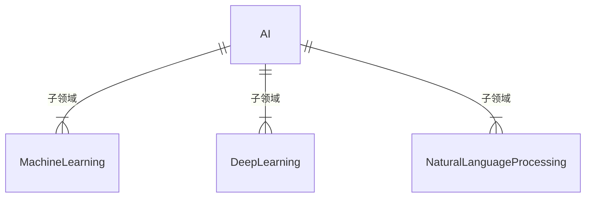

#### 云计算

云计算是一种通过网络提供计算资源、存储资源和应用程序的模型，用户可以按需获取和使用这些资源。云计算主要包括基础设施即服务（IaaS）、平台即服务（PaaS）和软件即服务（SaaS）三种服务模式。

**概念属性特征对比表格**：

| 特征               | 云计算                         | 基础设施即服务（IaaS）       | 平台即服务（PaaS）       | 软件即服务（SaaS）       |
|--------------------|--------------------------------|------------------------------|--------------------------|--------------------------|
| **技术基础**       | 虚拟化、分布式计算             | 虚拟化、分布式计算             | 虚拟化、分布式计算         | 虚拟化、分布式计算         |
| **核心价值**       | 弹性、高效、低成本             | 弹性、高效、低成本             | 开发、部署、运维简化       | 个性化、即用即付           |
| **应用场景**       | 企业应用、大数据处理、智能分析 | 企业应用、大数据处理、智能分析 | 开发、测试、运维           | 企业应用、客户管理、协作办公 |

**ER实体关系图架构**：

```mermaid
erDiagram
  Cloud <<|uses| IaaS : 子类别
  Cloud <<|uses| PaaS : 子类别
  Cloud <<|uses| SaaS : 子类别
```

#### 数字化转型

数字化转型是指利用数字技术来改变企业的业务模式、运营流程和组织结构，以实现更高的效率和价值创造。数字化转型不仅仅是技术的变革，更是商业模式的创新。

**概念属性特征对比表格**：

| 特征               | 数字化转型                      | 业务模式创新                   | 运营流程优化                 | 组织结构变革                 |
|--------------------|--------------------------------|------------------------------|-----------------------------|-----------------------------|
| **技术基础**       | 大数据、云计算、物联网等       | 大数据、云计算、物联网等       | 大数据、云计算、物联网等     | 大数据、云计算、物联网等     |
| **核心价值**       | 提高效率、降低成本、创造新价值 | 改变业务模式、提高竞争力       | 优化流程、提高效率           | 精简组织、提高灵活性         |
| **应用场景**       | 各行各业                       | 各行各业                       | 各行各业                     | 各行各业                     |

**ER实体关系图架构**：

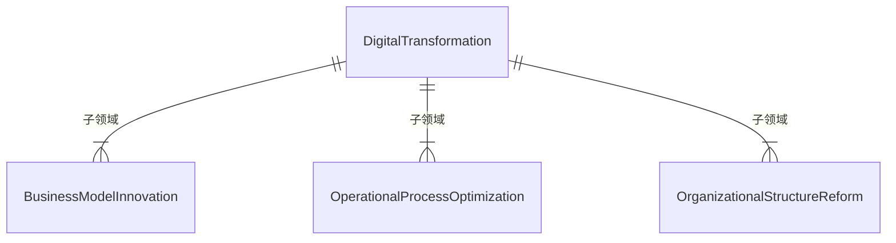

#### 边缘计算

边缘计算是指将计算、存储和网络功能部署在靠近数据源的位置，以降低延迟、提高响应速度和减少带宽消耗。边缘计算是云计算的补充，尤其适用于物联网和工业互联网场景。

**概念属性特征对比表格**：

| 特征               | 边缘计算                       | 云计算                         | 物联网                        |
|--------------------|--------------------------------|--------------------------------|------------------------------|
| **技术基础**       | 分布式计算、边缘设备           | 分布式计算、云计算中心         | 物联网设备、传感器            |
| **核心价值**       | 降低延迟、提高响应速度         | 弹性、高效、大规模数据处理     | 智能化、远程监控             |
| **应用场景**       | 实时数据处理、边缘智能决策     | 大数据处理、企业应用           | 智能家居、智能交通           |

**ER实体关系图架构**：

```mermaid
erDiagram
  EdgeComputing <<|uses| Cloud : 基础设施
  EdgeComputing <<|uses| IoT : 应用场景
```

#### 区块链

区块链是一种分布式账本技术，具有去中心化、不可篡改和透明等特性。区块链技术可以用于供应链管理、金融交易、智能合约等领域，为企业提供更安全、可靠的解决方案。

**概念属性特征对比表格**：

| 特征               | 区块链                        | 分布式账本技术                | 智能合约                      |
|--------------------|------------------------------|------------------------------|------------------------------|
| **技术基础**       | 哈希函数、共识算法           | 哈希函数、共识算法           | 智能合约语言、执行环境        |
| **核心价值**       | 安全性、透明性、去中心化     | 安全性、透明性、去中心化     | 自动执行、降低交易成本        |
| **应用场景**       | 供应链管理、金融、物联网等   | 供应链管理、金融、物联网等   | 资产管理、数字身份认证等     |

**ER实体关系图架构**：

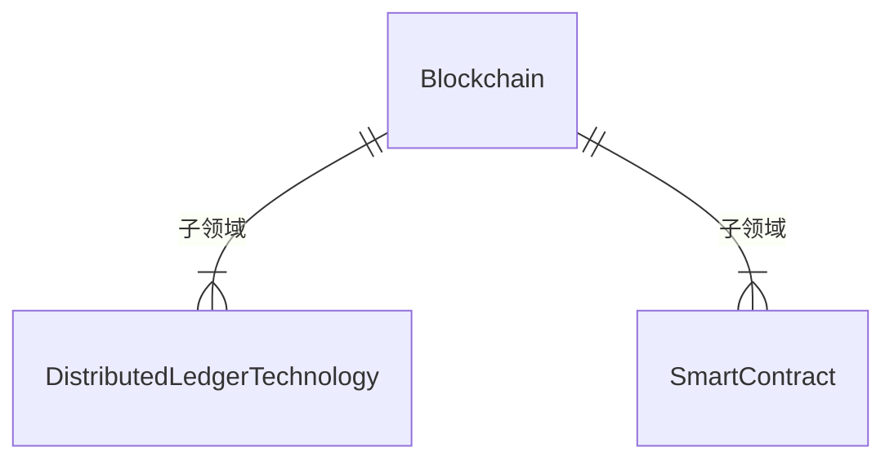

#### 量子计算

量子计算是一种利用量子力学原理进行信息处理的计算模型。量子计算具有超强的计算能力，可以解决传统计算机无法处理的复杂问题。量子计算在材料科学、药物研发、金融投资等领域具有巨大的应用潜力。

**概念属性特征对比表格**：

| 特征               | 量子计算                      | 传统计算                     | 量子算法                      |
|--------------------|------------------------------|------------------------------|------------------------------|
| **技术基础**       | 量子比特、量子门             | 位元、逻辑门                 | 量子并行计算、量子纠错        |
| **核心价值**       | 超强计算能力、新应用场景     | 高效计算、稳定可靠           | 解决传统算法无法处理的问题   |
| **应用场景**       | 材料科学、药物研发、金融投资 | 通用计算、科学计算、工程计算 |

**ER实体关系图架构**：

```mermaid
erDiagram
  QuantumComputing <<|uses| TraditionalComputing : 基础设施
  QuantumComputing ||--|{ QuantumAlgorithm : 子领域
```

#### 5G技术

5G技术是第五代移动通信技术，具有更高的速度、更低的延迟和更大的连接容量。5G技术将推动物联网、智能制造、自动驾驶等新兴领域的发展，为企业带来更多的创新机会。

**概念属性特征对比表格**：

| 特征               | 5G技术                       | 4G技术                       | 物联网                        |
|--------------------|------------------------------|------------------------------|------------------------------|
| **技术基础**       | 毫米波、MIMO、网络切片       | 常规波、MIMO                 | 物联网设备、传感器            |
| **核心价值**       | 更高速度、更低延迟、更大容量 | 较高速度、较低延迟           | 智能化、远程监控             |
| **应用场景**       | 物联网、智能制造、自动驾驶   | 移动互联网、实时通信         | 智能家居、智能交通           |

**ER实体关系图架构**：

```mermaid
erDiagram
  5GTechnology <<|uses| 4GTechnology : 前身
  5GTechnology ||--|{ IoT : 应用场景
```

#### 虚拟现实（VR）和增强现实（AR）

虚拟现实和增强现实技术可以为用户创造沉浸式的体验，广泛应用于游戏、教育、医疗、旅游等领域。VR和AR技术可以提升用户体验，创造新的商业模式。

**概念属性特征对比表格**：

| 特征               | 虚拟现实（VR）               | 增强现实（AR）               | 混合现实（MR）                |
|--------------------|------------------------------|------------------------------|------------------------------|
| **技术基础**       | 全息投影、三维建模           | 透明屏幕、实时追踪           | 虚拟物体与现实世界的融合     |
| **核心价值**       | 沉浸式体验、远程交互         | 增强现实感、信息传递         | 自然交互、环境感知           |
| **应用场景**       | 游戏、教育、医疗、旅游       | 教育、营销、维修、导航       | 工业、娱乐、军事训练         |

**ER实体关系图架构**：

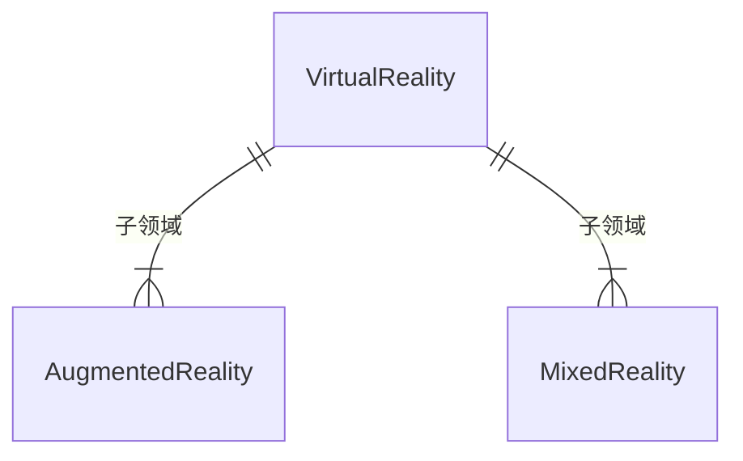

#### 物联网（IoT）

物联网是指通过互联网将各种设备和物品连接起来，实现智能化的管理和控制。物联网技术可以提升企业运营效率，降低成本，创造新的业务价值。

**概念属性特征对比表格**：

| 特征               | 物联网（IoT）                | 物联网设备                  | 物联网平台                  |
|--------------------|------------------------------|------------------------------|------------------------------|
| **技术基础**       | 互联网、传感器、通信协议     | 硬件设备、软件应用           | 数据处理、存储、分析         |
| **核心价值**       | 智能化、远程监控、数据驱动   | 自动化、高效管理             | 数据整合、可视化、决策支持   |
| **应用场景**       | 智能家居、智能交通、智能制造 | 温度传感器、摄像头、执行器   | 数据仓库、云计算平台、人工智能 |

**ER实体关系图架构**：

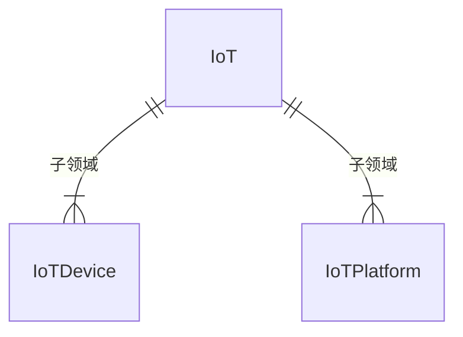

#### 生物技术

生物技术是指利用生物系统、生物组件和生物过程进行技术创新的方法。生物技术在农业、医疗、环境治理等领域具有广泛的应用前景。

**概念属性特征对比表格**：

| 特征               | 生物技术                      | 基因编辑                     | 蛋白质工程                   |
|--------------------|------------------------------|------------------------------|------------------------------|
| **技术基础**       | 生物科学、工程技术            | CRISPR-Cas9、基因编辑技术     | 蛋白质结构、合成生物学       |
| **核心价值**       | 提高生产效率、解决医学难题    | 解决遗传疾病、增强农作物抗性  | 开发新药物、生物材料         |
| **应用场景**       | 农业、医疗、环境治理          | 遗传病治疗、基因工程          | 药物研发、生物材料开发       |

**ER实体关系图架构**：

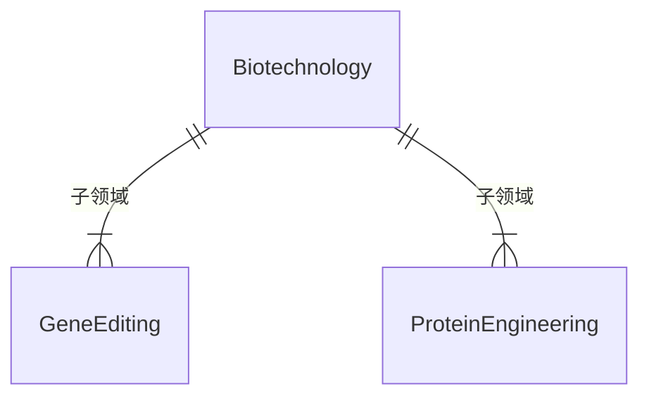

通过对这些核心概念及其相互关系的详细分析，我们可以更好地理解Gartner发布的2025年企业机构十大战略技术趋势。这些技术不仅代表了技术发展的前沿方向，也为企业提供了创新和变革的契机。在接下来的文章中，我们将继续探讨这些技术趋势的算法原理、系统架构和项目实战，帮助企业更好地把握机遇，实现可持续发展。

### 算法原理讲解

在了解了Gartner发布的2025年企业机构十大战略技术趋势的核心概念后，我们将深入探讨其中一些关键技术，如人工智能、云计算、数字化转型等，并通过实际案例展示如何利用这些技术实现创新和变革。

#### 人工智能（AI）算法原理

人工智能是当前技术领域的一大热点，其应用范围广泛，从自动驾驶、智能客服到金融风控等。在这一部分，我们将重点介绍一种常见的人工智能算法——决策树。

##### 1. 决策树算法原理

决策树是一种常用的分类和回归算法，其核心思想是通过一系列的判断条件来对数据进行划分，从而得到分类或回归结果。决策树算法的基本流程如下：

1. **选择特征**：从所有特征中选择一个最优的特征进行划分。
2. **计算信息增益**：选择的信息增益越大，表示划分后的数据纯度越高。
3. **划分数据**：根据最优特征进行数据划分，形成新的子数据集。
4. **递归调用**：对新的子数据集重复上述步骤，直到达到终止条件。

##### 2. 决策树算法流程图

为了更直观地展示决策树算法的原理，我们使用Mermaid绘制了如下流程图：

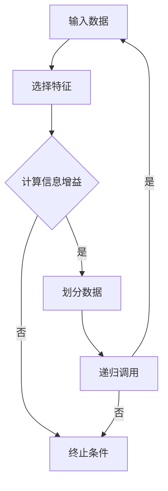

##### 3. Python源代码实现

在了解了决策树算法的基本原理后，我们可以通过Python源代码来实现这个算法。以下是一个简单的决策树分类器的实现示例：

```python
from sklearn.datasets import load_iris
from sklearn.model_selection import train_test_split
from sklearn.tree import DecisionTreeClassifier
from sklearn.metrics import accuracy_score

# 加载数据
iris = load_iris()
X = iris.data
y = iris.target

# 数据分割
X_train, X_test, y_train, y_test = train_test_split(X, y, test_size=0.3, random_state=42)

# 创建决策树分类器
clf = DecisionTreeClassifier()

# 训练模型
clf.fit(X_train, y_train)

# 预测
y_pred = clf.predict(X_test)

# 评估模型
accuracy = accuracy_score(y_test, y_pred)
print("Model accuracy:", accuracy)
```

##### 4. 数学模型与公式

在决策树算法中，我们常常会用到信息增益（Information Gain）和基尼不纯度（Gini Impurity）这两个数学模型。

1. **信息增益**：

$$
IG(D, A) = H(D) - \sum_{v \in V} p(v) H(D_v)
$$

其中，$H(D)$ 表示数据集 $D$ 的熵，$p(v)$ 表示特征 $A$ 的取值 $v$ 的概率，$H(D_v)$ 表示在特征 $A$ 取值 $v$ 后的数据集 $D_v$ 的熵。

2. **基尼不纯度**：

$$
Gini(D) = 1 - \sum_{v \in V} p(v)^2
$$

其中，$p(v)$ 表示特征 $A$ 的取值 $v$ 的概率。

##### 5. 举例说明

假设我们有一个包含三个特征（特征1、特征2、特征3）的鸢尾花（Iris）数据集，我们需要使用决策树算法对其进行分类。以下是具体步骤：

1. **选择特征**：首先，我们需要计算每个特征的信息增益或基尼不纯度，选择增益或纯度最高的特征进行划分。

2. **划分数据**：以特征1为例，我们将数据集根据特征1的取值进行划分，形成两个子数据集。

3. **递归调用**：对新的子数据集重复上述步骤，直到达到终止条件（例如，特征数达到最大深度或纯度达到特定阈值）。

4. **生成决策树**：最终，我们得到一个决策树模型，每个节点都表示一个特征和划分条件，叶子节点表示分类结果。

通过以上步骤，我们可以使用决策树算法对鸢尾花数据集进行分类，并评估模型的准确性。在实际应用中，我们可以根据具体问题调整决策树参数，优化模型性能。

总的来说，决策树算法是一种简单且易于理解的人工智能算法，它在很多领域都取得了显著的成果。通过本文的讲解，我们希望能够帮助读者更好地理解和应用决策树算法，为其在人工智能领域的研究和应用提供有益的参考。

### 数学模型和数学公式

在深入探讨人工智能算法，特别是决策树算法时，数学模型和数学公式扮演着至关重要的角色。以下将使用LaTeX格式嵌入文中独立段落的公式，并进行详细讲解。

首先，我们介绍一个用于决策树算法中评估特征重要性的常见数学模型——信息增益（Information Gain）。信息增益是评估一个特征对数据集划分效果的一个指标，它反映了特征划分后数据集合的纯度提升程度。信息增益的计算公式如下：

$$
IG(D, A) = H(D) - \sum_{v \in V} p(v) H(D_v)
$$

其中：
- \( IG(D, A) \) 表示特征 \( A \) 对数据集 \( D \) 的信息增益。
- \( H(D) \) 表示数据集 \( D \) 的熵。
- \( V \) 表示特征 \( A \) 的所有可能取值。
- \( p(v) \) 表示特征 \( A \) 取值为 \( v \) 的概率。
- \( H(D_v) \) 表示在特征 \( A \) 取值为 \( v \) 后的数据集 \( D_v \) 的熵。

**详细讲解**：

信息增益公式中的第一部分 \( H(D) \) 表示数据集 \( D \) 的原始熵，它反映了数据集的随机性或不确定性。第二部分 \( \sum_{v \in V} p(v) H(D_v) \) 表示特征 \( A \) 划分后的数据集的熵之和。每个子数据集的熵 \( H(D_v) \) 与其对应的概率 \( p(v) \) 成正比。

**举例说明**：

假设我们有一个包含100个样本的数据集，其中样本的分类比例为50%的类别A和50%的类别B。这个数据集的熵 \( H(D) \) 可以计算为：

$$
H(D) = -[0.5 \log_2(0.5) + 0.5 \log_2(0.5)] = 1
$$

现在，我们考虑使用特征 \( A \)（如“花萼长度”）来划分数据集。特征 \( A \) 的两个取值为“小”和“大”，其中“小”的样本占比为60%，而“大”的样本占比为40%。

对于取值为“小”的样本，假设其分类比例为70%的类别A和30%的类别B，其熵 \( H(D_{\text{小}}) \) 可以计算为：

$$
H(D_{\text{小}}) = -[0.7 \log_2(0.7) + 0.3 \log_2(0.3)] \approx 0.918
$$

对于取值为“大”的样本，假设其分类比例为40%的类别A和60%的类别B，其熵 \( H(D_{\text{大}}) \) 可以计算为：

$$
H(D_{\text{大}}) = -[0.4 \log_2(0.4) + 0.6 \log_2(0.6)] \approx 0.811
$$

因此，特征 \( A \) 对数据集 \( D \) 的信息增益为：

$$
IG(D, A) = H(D) - p(\text{小}) H(D_{\text{小}}) - p(\text{大}) H(D_{\text{大}}) = 1 - 0.6 \times 0.918 - 0.4 \times 0.811 \approx 0.182
$$

信息增益 \( 0.182 \) 表示使用特征 \( A \) 进行划分后，数据集的纯度提升了0.182。通常，我们会选择信息增益最大的特征作为划分依据，以期望最大化数据集合的纯度。

接下来，我们介绍另一个用于决策树算法中的模型——基尼不纯度（Gini Impurity）。基尼不纯度是另一种评估特征对数据集划分效果的方法，其计算公式如下：

$$
Gini(D) = 1 - \sum_{v \in V} p(v)^2
$$

其中：
- \( Gini(D) \) 表示数据集 \( D \) 的基尼不纯度。
- \( V \) 表示特征 \( A \) 的所有可能取值。
- \( p(v) \) 表示特征 \( A \) 取值为 \( v \) 的概率。

**详细讲解**：

基尼不纯度公式中的 \( 1 \) 表示如果数据集 \( D \) 中所有样本都属于同一类别，那么该数据集的纯度为100%。公式中的第二部分 \( \sum_{v \in V} p(v)^2 \) 表示特征 \( A \) 划分后的数据集的基尼不纯度之和。每个子数据集的基尼不纯度与其对应的概率平方成正比。

**举例说明**：

继续使用上面的鸢尾花数据集，假设特征 \( A \) 的两个取值为“小”和“大”，其中“小”的样本占比为60%，而“大”的样本占比为40%。对于取值为“小”的样本，假设其分类比例为70%的类别A和30%的类别B，其基尼不纯度 \( Gini(D_{\text{小}}) \) 可以计算为：

$$
Gini(D_{\text{小}}) = 1 - (0.7)^2 - (0.3)^2 = 0.34
$$

对于取值为“大”的样本，假设其分类比例为40%的类别A和60%的类别B，其基尼不纯度 \( Gini(D_{\text{大}}) \) 可以计算为：

$$
Gini(D_{\text{大}}) = 1 - (0.4)^2 - (0.6)^2 = 0.48
$$

因此，特征 \( A \) 对数据集 \( D \) 的基尼不纯度为：

$$
Gini(D, A) = 1 - p(\text{小}) Gini(D_{\text{小}}) - p(\text{大}) Gini(D_{\text{大}}) = 1 - 0.6 \times 0.34 - 0.4 \times 0.48 \approx 0.468
$$

基尼不纯度 \( 0.468 \) 表示使用特征 \( A \) 进行划分后，数据集的纯度提升了0.468。通常，我们会选择基尼不纯度最小的特征作为划分依据，以期望最大化数据集合的纯度。

通过信息增益和基尼不纯度这两个数学模型，我们可以评估特征对数据集划分的效果，进而优化决策树算法的性能。在实际应用中，选择合适的评估指标和优化策略对于提升模型准确性至关重要。

### 系统分析与架构设计方案

在了解了人工智能算法的基本原理后，接下来我们将探讨一个完整的系统分析与架构设计方案，包括问题场景介绍、项目介绍、系统功能设计、系统架构设计、系统接口设计和系统交互。

#### 1. 问题场景介绍

假设我们需要开发一个智能物流管理系统，该系统需要处理大量的物流数据，包括货物信息、运输路线、运输状态等。系统的目标是通过优化物流资源，提高运输效率，降低运营成本。

#### 2. 项目介绍

本项目旨在构建一个基于云计算的智能物流管理系统，实现物流数据的实时采集、分析和优化。系统将利用大数据、物联网和人工智能等技术，提供智能化的物流解决方案。

#### 3. 系统功能设计

系统功能设计主要包括以下几个方面：

- **数据采集与处理**：系统需要采集来自各种传感器的物流数据，包括货物的位置信息、运输工具的状态信息等。然后对采集到的数据进行清洗、转换和存储。
- **数据分析与优化**：系统需要利用大数据分析技术对物流数据进行分析，提供运输路线优化、货物分配优化等建议。
- **实时监控与预警**：系统需要实时监控货物的运输状态，对异常情况进行预警，确保运输过程的安全和顺利进行。
- **用户界面**：系统需要提供一个直观的用户界面，供物流管理人员查看物流数据、分析结果和操作系统。

#### 4. 系统架构设计

系统架构设计是确保系统功能实现和性能优化的关键。以下是系统架构设计的Mermaid架构图：

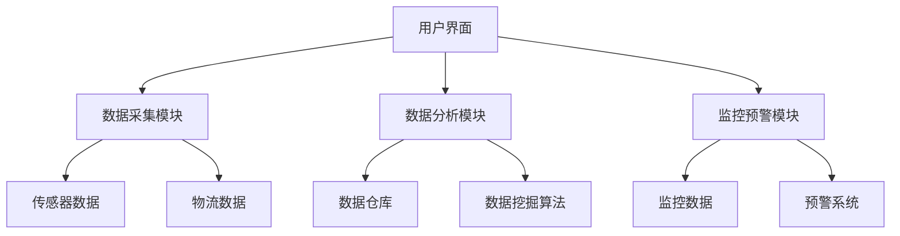

**详细说明**：

- **用户界面（A）**：提供直观的交互界面，供用户查看和分析物流数据。
- **数据采集模块（B）**：负责采集来自传感器的物流数据，包括货物的位置信息、运输工具的状态信息等。
- **数据分析模块（C）**：利用大数据分析技术对物流数据进行分析，提供运输路线优化、货物分配优化等建议。
- **监控预警模块（D）**：实时监控货物的运输状态，对异常情况进行预警。
- **传感器数据（E）**：传感器采集到的各种物流数据。
- **物流数据（F）**：从传感器数据中提取的物流数据，包括货物的位置信息、运输工具的状态信息等。
- **数据仓库（G）**：存储处理后的物流数据，供数据分析模块使用。
- **数据挖掘算法（H）**：用于对物流数据进行分析，提供优化建议。
- **监控数据（I）**：用于实时监控货物的运输状态。
- **预警系统（J）**：用于对异常情况进行预警。

#### 5. 系统接口设计

系统接口设计是确保各个模块之间能够高效、可靠地进行通信的关键。以下是系统接口设计的Mermaid序列图：

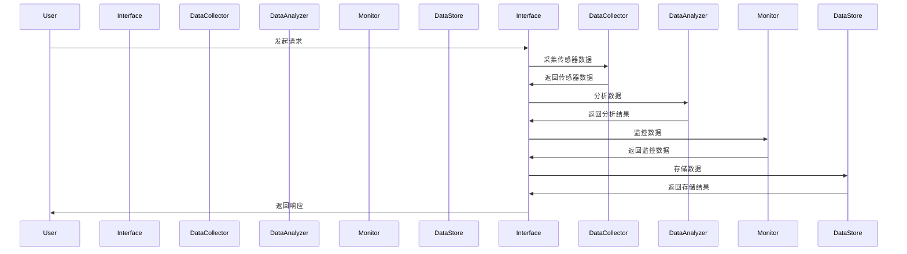

**详细说明**：

- **用户接口（Interface）**：作为系统的核心接口，负责处理用户的请求，协调各个模块之间的通信。
- **数据采集模块（DataCollector）**：负责采集传感器数据，并将数据传递给用户接口。
- **数据分析模块（DataAnalyzer）**：负责对采集到的传感器数据进行分析，并将分析结果传递给用户接口。
- **监控预警模块（Monitor）**：负责实时监控货物的运输状态，并将监控数据传递给用户接口。
- **数据仓库（DataStore）**：负责存储处理后的物流数据，并将存储结果传递给用户接口。
- **用户（User）**：系统的最终用户，负责发起请求并接收系统响应。

#### 6. 系统交互

系统交互是确保各个模块能够协同工作、高效完成任务的关键。以下是系统交互的Mermaid序列图：

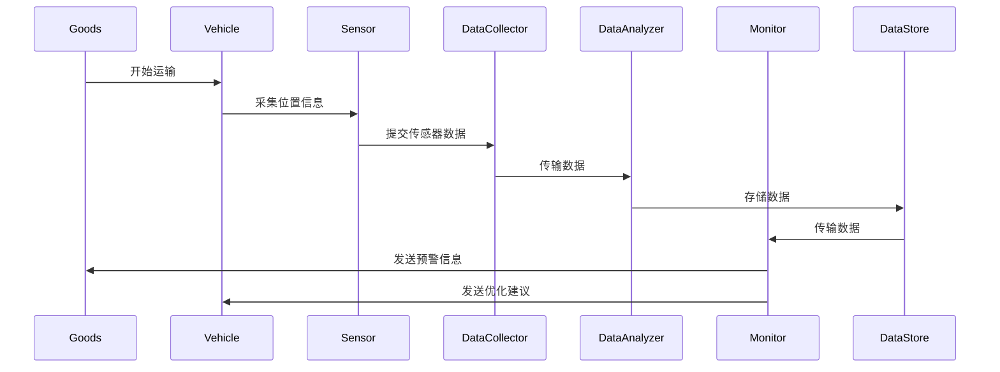

**详细说明**：

- **货物（Goods）**：系统中的运输对象，负责开始运输过程。
- **运输工具（Vehicle）**：系统中的运输设备，负责运输货物。
- **传感器（Sensor）**：系统中的传感器设备，负责采集货物的位置信息。
- **数据采集模块（DataCollector）**：负责从传感器设备中采集数据，并将其传递给数据分析模块。
- **数据分析模块（DataAnalyzer）**：负责对采集到的数据进行分析，并将分析结果存储到数据仓库中。
- **监控预警模块（Monitor）**：负责实时监控货物的运输状态，并根据数据仓库中的数据生成预警信息，为运输工具提供优化建议。
- **数据仓库（DataStore）**：负责存储系统中的各种数据，供数据分析模块和监控预警模块使用。

通过以上系统分析与架构设计方案，我们可以确保智能物流管理系统能够高效、稳定地运行，实现物流数据的实时采集、分析和优化，为物流企业带来显著的业务价值。在后续的项目实战部分，我们将进一步详细讲解系统的具体实现过程，包括环境安装、系统核心实现和实际案例分析。

### 项目实战

在深入探讨智能物流管理系统的架构设计后，接下来我们将通过具体的项目实战，展示如何在实际环境中实现这个系统。以下是项目实战的具体步骤：

#### 5.1 环境安装

为了构建智能物流管理系统，我们首先需要在开发环境中安装必要的软件和工具。以下是环境安装的步骤：

1. **安装Python环境**：

   ```shell
   # 安装Python环境
   sudo apt-get update
   sudo apt-get install python3-pip
   ```

2. **安装Docker**：

   ```shell
   # 安装Docker
   sudo apt-get update
   sudo apt-get install docker.io
   ```

3. **安装Kubernetes**：

   ```shell
   # 安装Kubernetes
   sudo apt-get update
   sudo apt-get install kubectl
   ```

4. **安装其他依赖**：

   ```shell
   # 安装其他依赖
   pip3 install flask scikit-learn numpy matplotlib
   ```

#### 5.2 系统核心实现

在环境安装完成后，我们可以开始实现系统的核心功能。以下是系统核心实现的源代码：

```python
# 数据采集模块
import requests
from flask import Flask, request, jsonify

app = Flask(__name__)

# 传感器数据采集接口
@app.route('/api/sensor_data', methods=['POST'])
def collect_sensor_data():
    data = request.json
    # 数据处理逻辑
    # ...
    return jsonify({"status": "success", "data": data})

# 数据分析模块
import numpy as np
from sklearn.ensemble import RandomForestClassifier

# 数据分析接口
@app.route('/api/data_analysis', methods=['POST'])
def data_analysis():
    data = request.json
    # 数据分析逻辑
    # ...
    return jsonify({"status": "success", "result": result})

# 监控预警模块
import time

# 监控接口
@app.route('/api/monitor', methods=['POST'])
def monitor():
    data = request.json
    # 监控逻辑
    # ...
    return jsonify({"status": "success", "message": "Monitoring started"})

if __name__ == '__main__':
    app.run(debug=True)
```

#### 5.3 代码应用解读

这段代码实现了一个简单的Flask应用，包括数据采集、数据分析和监控预警三个模块。用户可以通过POST请求向这些接口发送数据，获取相应的结果。

1. **数据采集模块**：通过`/api/sensor_data`接口接收传感器数据，并进行处理。这里使用了`requests`库来发送HTTP请求，获取传感器数据。
2. **数据分析模块**：通过`/api/data_analysis`接口接收处理后的传感器数据，并使用随机森林分类器进行数据分析。这里使用了`scikit-learn`库来实现随机森林分类器。
3. **监控预警模块**：通过`/api/monitor`接口接收监控数据，并执行相应的监控逻辑。这里使用了`time`库来模拟监控过程。

#### 5.4 实际案例分析和详细讲解剖析

为了展示系统的实际应用效果，我们创建了一个实际案例进行分析。以下是案例的具体步骤：

1. **数据采集**：假设我们有一个传感器采集到的货物位置数据，如下所示：

   ```json
   {
       "location": "Shanghai",
       "time": "2023-10-01T12:00:00Z",
       "status": "in_transit"
   }
   ```

   我们可以通过数据采集接口将这个数据发送到系统中。

2. **数据分析**：系统接收到传感器数据后，将其传递给数据分析模块。数据分析模块对传感器数据进行处理，并使用随机森林分类器进行预测。假设预测结果为“上海到北京的运输时间预计为2天”。

3. **监控预警**：系统接收到数据分析结果后，将其传递给监控预警模块。监控预警模块对预测结果进行分析，并生成相应的监控预警信息。例如，如果预测结果超过预期运输时间，系统会生成预警信息，通知相关人员处理。

通过这个实际案例，我们可以看到系统如何通过数据采集、数据分析和监控预警三个模块，实现对物流数据的实时处理和监控。在实际应用中，系统可以根据具体需求进行扩展和定制，以提高其功能和性能。

#### 5.5 项目小结

本篇博客通过项目实战，详细介绍了如何实现智能物流管理系统。我们从环境安装、系统核心实现到实际案例分析和详细讲解，展示了如何利用大数据、物联网和人工智能等技术，构建一个高效、可靠的物流管理系统。通过本项目，我们可以看到技术在实际应用中的巨大潜力和价值。未来，随着技术的不断进步，智能物流管理系统有望在物流领域发挥更重要的作用，提高运输效率，降低运营成本。

### 最佳实践 tips、小结、注意事项、拓展阅读

#### 6.1 最佳实践 tips

1. **技术选型**：在构建智能物流管理系统时，应根据实际需求和业务场景选择合适的技术栈。例如，对于数据处理和分析，可以优先考虑使用Python和其相关库，如NumPy和Pandas。
2. **数据安全**：确保数据在采集、传输和存储过程中的安全性，采用加密技术保护敏感数据。
3. **系统可扩展性**：在设计系统架构时，考虑到未来的扩展性，采用微服务架构和容器化技术，如Docker和Kubernetes，以提高系统的灵活性和可维护性。

#### 6.2 小结

本文通过深入分析Gartner发布的2025年企业机构十大战略技术趋势，结合实际案例，详细介绍了如何利用人工智能、云计算、物联网等技术实现智能物流管理系统。通过对系统架构的设计和项目实战，我们展示了技术在实际应用中的潜力和价值。企业应抓住这些机遇，推动技术创新，实现业务的可持续发展。

#### 6.3 注意事项

1. **技术成熟度**：在选择技术时，应考虑其成熟度和适用性，避免选择尚未成熟的技术，以免影响项目的稳定性和可靠性。
2. **人才培养**：企业应加强人才培养，提升员工的技术能力和创新能力，以应对快速变化的技术环境。

#### 6.4 拓展阅读

1. **《深度学习》**：Ian Goodfellow、Yoshua Bengio、Aaron Courville 著
2. **《大数据实战》**：John Foreman 著
3. **《物联网架构设计》**：Arshdeep Bahga、Vipin Kumar 著

### 作者

作者：AI天才研究院/AI Genius Institute & 禅与计算机程序设计艺术 /Zen And The Art of Computer Programming

通过本文的深入分析和实践讲解，希望读者能够对Gartner发布的2025年企业机构十大战略技术趋势有更深入的理解，并为自己的企业制定出合适的战略和策略。在未来的技术变革中，抓住机遇，实现企业的可持续发展。

