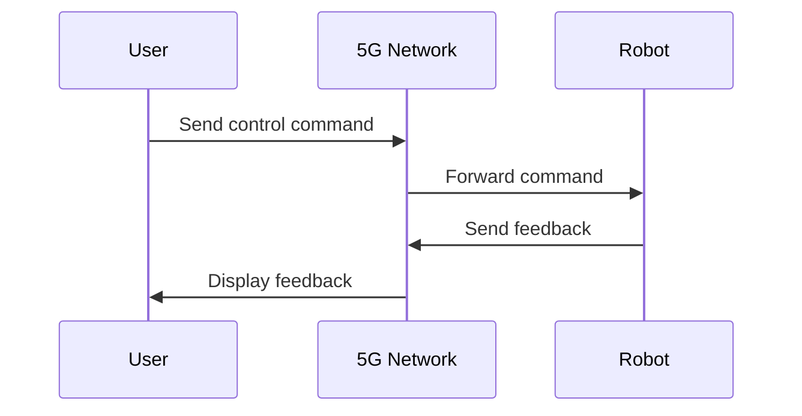

                 

### 第1章 5G与物联网概述

#### 1.1 5G技术介绍

5G（第五代移动通信技术）是当前移动通信技术的最新一代，与之前的4G、3G和2G相比，它在网络速度、延迟、容量和连接密度等方面都有显著的提升。首先，我们来看一下5G技术的核心特点：

- **高速率**：5G的理论下载速度可以达到10Gbps，是4G的100倍。这意味着在5G网络环境下，用户可以几乎瞬间完成高清视频的下载和流媒体传输。

- **低延迟**：5G网络的延迟将降低到1毫秒以下，比4G减少了近十分之一。这对于工业自动化中的实时控制、远程手术等场景至关重要。

- **大连接**：5G可以支持每平方米数十万个设备的连接，这意味着在密集的工业环境中，设备之间的通信将更加顺畅。

- **高可靠性**：5G采用了更先进的技术，如网络切片和边缘计算，使得网络在应对高负载和复杂应用场景时更加稳定和可靠。

接下来，我们来看一下5G技术标准与发展历程。5G的技术标准由国际电信联盟（ITU）制定，其标准包括以下三个方面：

1. **峰值速率**：5G的峰值速率要求达到20Gbps，远高于4G的1Gbps。

2. **网络延迟**：5G的目标延迟时间要低于1毫秒，这对于工业自动化和实时应用至关重要。

3. **连接数密度**：5G要能够支持每平方米数十万个设备的连接，满足大规模物联网设备的同时接入需求。

5G技术的发展历程可以分为以下几个阶段：

- **2012年**：ITU发布了5G的技术标准框架。

- **2016年**：3GPP正式启动了5G标准的制定工作。

- **2018年**：5G标准的第一阶段完成，包括NR（新无线接入网络）和NG-RAN（新无线接入网）等关键组件。

- **2020年**：5G商用网络开始在全球范围内部署，包括中国、美国、欧洲等地。

#### 1.2 物联网（IoT）基础

物联网（Internet of Things，IoT）是指通过互联网将各种物理设备、传感器、软件等进行互联，形成一个智能化的网络系统。物联网的定义与分类如下：

- **定义**：物联网是指将物理设备通过网络连接起来，使其能够相互通信和协同工作。

- **分类**：
  - **感知层**：包括各种传感器和执行器，如温度传感器、摄像头、机器人等。
  - **网络层**：包括网络设备，如路由器、交换机等，负责数据的传输和路由。
  - **平台层**：包括物联网平台，负责数据的处理、存储和分析。
  - **应用层**：包括各种应用场景，如智慧城市、智能家居、工业自动化等。

物联网的关键技术包括：

- **传感器技术**：传感器是物联网的感知层核心，能够将物理信号转换为数字信号。

- **网络技术**：包括有线网络和无线网络，如Wi-Fi、蓝牙、LoRa等。

- **数据处理技术**：物联网平台需要对收集到的海量数据进行处理、存储和分析。

- **安全技术**：由于物联网设备数量庞大，安全性成为关键问题，需要采用加密、身份验证等技术确保数据安全。

#### 1.3 智慧工厂的概念与发展

智慧工厂是指利用物联网、大数据、人工智能等先进技术，对生产过程进行全方位、全流程的数字化和智能化管理。智慧工厂的定义与架构如下：

- **定义**：智慧工厂是一种利用物联网、大数据、人工智能等先进技术，实现生产过程的自动化、智能化和协同化的工厂。

- **架构**：
  - **感知层**：包括各种传感器和执行器，如机器视觉系统、环境监测设备等，用于实时监控生产环境。
  - **传输层**：采用5G、Wi-Fi等无线网络技术，实现数据的高速传输和实时通信。
  - **平台层**：建立物联网平台，对采集到的数据进行分析、处理和存储，提供数据支持和决策支持。
  - **应用层**：包括生产管理、质量管理、设备维护等应用，实现生产过程的智能化管理。

智慧工厂的发展历程可以分为以下几个阶段：

- **初期阶段**：采用简单的自动化设备，实现生产线的自动化。

- **发展阶段**：引入物联网技术，实现设备之间的互联互通，提高生产效率。

- **智慧阶段**：利用大数据、人工智能等先进技术，实现生产过程的全面智能化和协同化。

#### 小结

在本章中，我们介绍了5G、物联网和智慧工厂的核心概念、发展历程和关键技术。5G技术的高速率、低延迟、大连接和高可靠性为智慧工厂的实时通信和数据处理提供了强大的支持。物联网技术则通过感知、传输、平台和应用四个层次，实现了生产过程的全面数字化和智能化。智慧工厂的发展，不仅提升了生产效率，也为工业自动化和智能制造奠定了基础。

#### 扩展阅读

- 5G技术标准的发展历程和关键技术：[ITU 5G标准框架](https://www.itu.int/rec/R-ITU-R)
- 物联网技术的分类和应用场景：[物联网基础](https://www.iotinnovation.com/iot-overview/)
- 智慧工厂的架构设计与实现：[智慧工厂概述](https://www.imsresearch.com/industry-insights/wisdom-factory-concept-overview/)

## 1.1 5G技术的核心特点

在深入探讨5G技术在智慧工厂中的应用之前，我们首先需要了解5G技术的核心特点。这些特点不仅使得5G成为连接智慧工厂的关键技术，也为工业自动化和智能制造带来了前所未有的机遇。

#### 高速率

5G技术的一个显著特点是其超高速的通信能力。与4G相比，5G的下载速度可以达到10Gbps，这意味着用户可以在几秒钟内下载高清视频、大文件，甚至实时传输8K视频。对于智慧工厂来说，高速率意味着可以在短时间内完成大量数据的传输和交换，从而支持实时监控、数据分析和远程操作等应用场景。

#### 低延迟

5G的低延迟特性是另一个关键优势。在5G网络中，端到端的延迟可以降低到1毫秒以下，相比之下，4G网络的延迟通常在数十毫秒左右。低延迟对于工业自动化特别重要，因为许多工业过程需要实时响应和精确控制。例如，在智能制造中，机器人在执行复杂任务时需要快速响应外部环境的变化，低延迟网络能够确保机器人动作的流畅和精确。

#### 大连接

5G的大连接能力使其能够支持每平方米数十万个设备的连接。在智慧工厂中，这意味着可以轻松连接大量的传感器、执行器、机器人和其他设备，实现全面的数据采集和实时监控。这种高密度连接能力不仅提高了生产线的自动化水平，还使得远程控制和协同作业成为可能。

#### 高可靠性

5G技术采用了多种先进技术，如网络切片和边缘计算，以提升网络的高可靠性。网络切片允许将一个物理网络分割成多个虚拟网络，从而满足不同应用场景的特定需求。边缘计算则通过在网络的边缘处理数据，减少了数据传输的距离和延迟，提高了系统的响应速度和稳定性。这些特性使得5G网络在应对高负载和复杂应用场景时更加稳定和可靠。

#### 5G技术的发展历程

5G技术的演进经历了多个关键阶段，从初期的概念提出到最终的商用部署，这一过程充满了技术创新和不断突破。

- **2012年**：国际电信联盟（ITU）正式提出5G技术标准框架，明确了5G的关键性能指标，包括高速率、低延迟和大连接。

- **2016年**：3GPP（第三代合作伙伴计划）正式启动5G标准的制定工作，开始了NR（新无线接入网络）和NG-RAN（新无线接入网）等关键组件的研发。

- **2018年**：3GPP完成了5G标准的第一阶段，包括NR和NG-RAN等关键组件的标准化工作。这一阶段标志着5G技术的初步成熟。

- **2020年**：全球多个国家和地区开始部署5G商用网络，包括中国、美国、欧洲等地。5G网络开始在工业、消费等领域得到广泛应用。

- **未来**：5G技术的持续演进将继续推动网络性能的提升，包括更高的速率、更低的延迟和更大的连接数。此外，5G与人工智能、云计算等技术的深度融合，将带来更多创新应用。

#### 5G技术在智慧工厂中的潜在应用场景

5G技术的核心特点为智慧工厂的实时通信和数据处理提供了强有力的支持，以下是一些典型的应用场景：

- **实时监控**：通过5G网络，工厂可以实时监控生产线上的各种设备和工艺参数，实现远程实时监控和故障预警。

- **远程操作**：5G的低延迟特性使得远程操作成为可能，工厂操作人员可以远程控制机器人、自动化设备等，提高生产灵活性和效率。

- **数据分析**：5G的高速率和低延迟支持大规模数据实时传输，工厂可以利用这些数据进行分析，优化生产流程，提高生产效率。

- **协同作业**：5G的大连接能力使得多个设备可以同时连接到网络，实现协同作业，例如多个机器人协同完成任务。

- **安全监控**：通过5G网络，工厂可以建立全面的安全监控系统，实时监控工厂安全状况，提高生产安全。

#### 小结

5G技术的核心特点——高速率、低延迟、大连接和高可靠性，为智慧工厂的实时通信和数据处理提供了强大的支持。通过5G网络，工厂可以实现实时监控、远程操作、数据分析、协同作业和安全监控等应用，从而提高生产效率、降低成本、提升产品质量。

#### 扩展阅读

- 5G技术标准的发展历程和关键技术：[ITU 5G标准框架](https://www.itu.int/rec/R-ITU-R)
- 5G技术在工业自动化中的应用案例：[5G工业自动化应用案例](https://www.gsma.com/mobileeconomy/5g-industrial-automation/)
- 5G网络架构和关键技术：[5G网络架构详解](https://www.cisco.com/c/en/us/solutions/industries/telecommunications/5g-network-architecture.html)

### 1.2 物联网（IoT）基础

物联网（Internet of Things，IoT）是指通过互联网将各种物理设备、传感器、软件等进行互联，形成一个智能化的网络系统。物联网的定义与分类如下：

- **定义**：物联网是指将物理设备通过网络连接起来，使其能够相互通信和协同工作。

- **分类**：
  - **感知层**：包括各种传感器和执行器，如温度传感器、摄像头、机器人等。
  - **网络层**：包括网络设备，如路由器、交换机等，负责数据的传输和路由。
  - **平台层**：包括物联网平台，负责数据的处理、存储和分析。
  - **应用层**：包括各种应用场景，如智慧城市、智能家居、工业自动化等。

物联网的关键技术包括：

- **传感器技术**：传感器是物联网的感知层核心，能够将物理信号转换为数字信号。常见的传感器有温度传感器、湿度传感器、光敏传感器等。

- **网络技术**：物联网的网络层包括有线网络和无线网络，如Wi-Fi、蓝牙、LoRa、Zigbee等。这些网络技术负责将数据从传感器传输到物联网平台。

- **数据处理技术**：物联网平台需要对收集到的海量数据进行处理、存储和分析。数据处理技术包括数据清洗、数据挖掘、机器学习等。

- **安全技术**：由于物联网设备数量庞大，安全性成为关键问题，需要采用加密、身份验证、访问控制等技术确保数据安全。

### 1.3 智慧工厂的概念与发展

智慧工厂是指利用物联网、大数据、人工智能等先进技术，对生产过程进行全方位、全流程的数字化和智能化管理。智慧工厂的定义与架构如下：

- **定义**：智慧工厂是一种利用物联网、大数据、人工智能等先进技术，实现生产过程的自动化、智能化和协同化的工厂。

- **架构**：
  - **感知层**：包括各种传感器和执行器，如机器视觉系统、环境监测设备等，用于实时监控生产环境。
  - **传输层**：采用5G、Wi-Fi等无线网络技术，实现数据的高速传输和实时通信。
  - **平台层**：建立物联网平台，对采集到的数据进行分析、处理和存储，提供数据支持和决策支持。
  - **应用层**：包括生产管理、质量管理、设备维护等应用，实现生产过程的智能化管理。

智慧工厂的发展历程可以分为以下几个阶段：

- **初期阶段**：采用简单的自动化设备，实现生产线的自动化。

- **发展阶段**：引入物联网技术，实现设备之间的互联互通，提高生产效率。

- **智慧阶段**：利用大数据、人工智能等先进技术，实现生产过程的全面智能化和协同化。

#### 小结

在本章中，我们介绍了5G、物联网和智慧工厂的核心概念、发展历程和关键技术。5G技术的高速率、低延迟、大连接和高可靠性为智慧工厂的实时通信和数据处理提供了强大的支持。物联网技术则通过感知、传输、平台和应用四个层次，实现了生产过程的全面数字化和智能化。智慧工厂的发展，不仅提升了生产效率，也为工业自动化和智能制造奠定了基础。

#### 扩展阅读

- 5G技术标准的发展历程和关键技术：[ITU 5G标准框架](https://www.itu.int/rec/R-ITU-R)
- 物联网技术的分类和应用场景：[物联网基础](https://www.iotinnovation.com/iot-overview/)
- 智慧工厂的架构设计与实现：[智慧工厂概述](https://www.imsresearch.com/industry-insights/wisdom-factory-concept-overview/)

### 1.3 智慧工厂的概念与发展

智慧工厂是一种基于物联网、大数据和人工智能等先进技术的现代化工厂模式，其目标是实现生产过程的全面数字化、智能化和自动化。下面我们将详细探讨智慧工厂的概念、架构及其发展历程。

#### 智慧工厂的定义

智慧工厂，又称为智能工厂或数字化工厂，是指利用物联网（IoT）技术、大数据分析、云计算、人工智能（AI）等先进技术，对生产过程中的各个环节进行实时监控、数据分析和优化管理，从而实现生产自动化、流程优化和资源利用最大化。智慧工厂的核心在于将物理设备、信息系统和人员紧密结合起来，形成一个高效、智能、协同的生产系统。

#### 智慧工厂的架构

智慧工厂的架构通常包括以下几个层次：

1. **感知层**：这一层是智慧工厂的基础，包括各种传感器和执行器，用于实时采集生产线上的温度、湿度、振动、压力等环境参数以及设备运行状态数据。常见的传感器有温度传感器、压力传感器、摄像头、RFID标签等。

2. **传输层**：传输层负责将感知层采集到的数据传输到数据中心或云平台。这一层可以采用有线网络（如以太网）和无线网络（如5G、Wi-Fi、LoRa等）进行数据传输，以确保数据的快速、稳定传输。

3. **平台层**：平台层是智慧工厂的中枢，负责数据的处理、存储、分析和共享。这一层通常包括数据集成平台、数据处理平台、数据存储平台和数据分析平台。通过这些平台，工厂可以实现对生产过程的全面监控、预测分析和优化管理。

4. **应用层**：应用层是智慧工厂的具体实现，包括各种应用系统和业务模块，如生产管理、质量管理、设备维护、供应链管理、能耗管理等。通过这些应用，工厂可以实现生产过程的自动化、智能化和协同化。

#### 智慧工厂的发展历程

智慧工厂的发展历程可以分为以下几个阶段：

1. **自动化阶段**：在这个阶段，工厂主要通过自动化设备和机器人实现生产线的自动化，提高了生产效率和产品质量。

2. **信息化阶段**：随着计算机技术和网络技术的发展，工厂开始将信息技术应用于生产管理，如采用ERP（企业资源计划）系统、MES（制造执行系统）等，实现了生产过程的数字化管理。

3. **智能化阶段**：在这个阶段，工厂开始利用物联网、大数据和人工智能等技术，对生产过程进行实时监控、数据分析和优化管理，实现了生产过程的全面智能化和自动化。

4. **智慧化阶段**：这是智慧工厂的高级阶段，通过深度融合物联网、大数据、人工智能、云计算等先进技术，工厂实现了高度智能化、自动化和协同化，达到了生产效率最高、资源利用率最大化的目标。

#### 智慧工厂的关键技术

智慧工厂的实现离不开以下关键技术的支持：

1. **物联网技术**：物联网技术是智慧工厂的基础，通过传感器网络实现对生产环境的实时监控和数据的采集。

2. **大数据技术**：大数据技术用于对海量生产数据进行存储、处理和分析，从而实现对生产过程的实时监控、预测分析和优化管理。

3. **人工智能技术**：人工智能技术用于对生产数据进行智能分析和决策支持，如通过机器学习算法预测设备故障、优化生产计划和能耗管理等。

4. **5G通信技术**：5G通信技术提供了高速、低延迟、大连接的网络环境，支持工厂内各种设备之间的实时通信和数据传输。

5. **云计算技术**：云计算技术提供了强大的计算能力和存储空间，支持工厂的云端数据存储、分析和处理。

#### 智慧工厂的应用场景

智慧工厂在多个应用场景中展现了其强大的优势，以下是一些典型的应用场景：

1. **生产过程监控**：通过物联网传感器和5G通信技术，实现对生产过程的实时监控，包括设备状态监控、工艺参数监控、产品质量监控等。

2. **远程控制与操作**：通过5G网络，实现对生产设备和机器人的远程控制和操作，提高了生产灵活性和效率。

3. **预测性维护**：利用大数据分析和机器学习算法，预测设备故障，提前进行维护，减少设备停机时间，降低维修成本。

4. **生产计划优化**：通过大数据分析和人工智能算法，优化生产计划和排程，提高生产效率，降低生产成本。

5. **质量管控**：通过机器视觉技术和人工智能算法，对生产过程进行质量监控，实现质量问题的早期预警和快速响应。

#### 小结

智慧工厂是现代工业发展的一个重要方向，通过物联网、大数据、人工智能等先进技术的应用，实现了生产过程的全面数字化、智能化和自动化。智慧工厂不仅提高了生产效率、降低了生产成本，还提升了产品质量和资源利用率。随着技术的不断进步，智慧工厂的未来发展潜力巨大，将为工业4.0和智能制造提供强大的支持。

#### 扩展阅读

- [智慧工厂概述](https://www.imsresearch.com/industry-insights/wisdom-factory-concept-overview/)
- [物联网技术基础](https://www.iotinnovation.com/iot-overview/)
- [5G技术在工业自动化中的应用案例](https://www.gsma.com/mobileeconomy/5g-industrial-automation/)

## 2.1 5G网络在工业自动化中的应用

### 2.1.1 5G网络的优势

5G网络在工业自动化领域具有显著的优势，这些优势使得其在智慧工厂中的应用变得尤为关键。首先，5G网络的高速率能够满足工业自动化对大带宽的需求，使得实时数据传输成为可能。其次，低延迟特性使得5G网络能够支持工业自动化中的实时控制和响应需求，这对于生产过程中的精确调度和协调至关重要。此外，5G网络的大连接能力能够同时连接大量的设备和传感器，满足工业自动化环境中高密度连接的需求。最后，5G网络的高可靠性通过网络切片和边缘计算等技术得到了显著提升，确保了在复杂工业环境中的稳定性和可靠性。

#### 5G网络在工业自动化中的应用场景

1. **生产设备的实时监控**：在智慧工厂中，5G网络能够实现生产设备的实时监控。通过部署传感器和摄像头，工厂可以实时获取设备的运行状态、温度、振动等参数，从而及时发现并解决潜在问题，减少设备故障率和停机时间。

2. **远程控制和操作**：5G网络的高速率和低延迟特性使得远程控制和操作成为可能。例如，工厂操作人员可以通过远程控制机器人进行组装、焊接等高精度操作，提高生产效率和灵活性。

3. **预测性维护**：通过5G网络和大数据分析技术，工厂可以实现设备的预测性维护。设备运行数据通过5G网络实时传输到云端，利用机器学习算法进行预测分析，提前发现设备可能出现的故障，进行预防性维护，从而减少设备停机时间和维修成本。

4. **数据采集与分析**：5G网络的高带宽能力使得工厂能够同时采集和分析大量的生产数据。通过对生产数据的实时分析和挖掘，工厂可以优化生产流程，提高生产效率和产品质量。

5. **工厂自动化**：5G网络支持工厂自动化系统的构建，通过物联网设备和人工智能算法，实现生产线的自动化控制。例如，通过5G网络连接的传感器和执行器，可以自动调整生产参数，优化生产过程。

#### 5G网络在工业自动化中的应用案例

1. **汽车制造行业**：在汽车制造行业，5G网络的应用已经取得了显著成果。例如，德国某汽车制造商利用5G网络实现了生产线的实时监控和远程控制，提高了生产效率，减少了设备故障率。此外，通过5G网络和大数据分析，该制造商实现了生产线的自动化优化，进一步提高了生产效率和产品质量。

2. **食品加工行业**：在食品加工行业，5G网络的应用同样具有重要意义。例如，某食品加工厂利用5G网络实现了生产设备的实时监控和远程控制，提高了生产过程的稳定性和可靠性。通过5G网络连接的传感器和执行器，该工厂实现了生产参数的自动调整，确保了产品的质量和安全性。

3. **能源行业**：在能源行业，5G网络的应用为智能电网的建设提供了强大的支持。例如，某电力公司利用5G网络实现了对发电设备的实时监控和预测性维护，提高了发电效率和设备利用率。同时，通过5G网络连接的传感器和执行器，该电力公司实现了电网的自动化调控，提高了电网的稳定性和可靠性。

#### 小结

5G网络在工业自动化中的应用展示了其高速率、低延迟、大连接和高可靠性的优势。通过实时监控、远程控制、预测性维护、数据采集与分析以及工厂自动化等应用场景，5G网络为智慧工厂的建设提供了强大的技术支持，推动了工业自动化和智能制造的发展。

#### 扩展阅读

- [5G技术在工业自动化中的应用案例](https://www.gsma.com/mobileeconomy/5g-industrial-automation/)
- [5G网络架构和关键技术](https://www.cisco.com/c/en/us/solutions/telecommunications/5g-network-architecture.html)
- [工业自动化解决方案](https://www.abb.com/industrial-automation/)

### 2.2 物联网技术在智慧工厂中的应用

#### 2.2.1 物联网在设备管理中的应用

物联网技术在智慧工厂的设备管理中发挥了重要作用。通过物联网，工厂能够实现对生产设备的实时监控、故障预测和远程维护，从而提高设备的运行效率和可靠性。

1. **实时监控**：物联网传感器可以实时监测设备的运行状态，包括温度、振动、压力等参数。通过5G网络，这些数据可以实时传输到物联网平台，工厂管理人员可以随时了解设备的运行状况，及时发现并解决问题。

2. **故障预测**：利用大数据分析和机器学习算法，物联网平台可以对设备的历史运行数据进行分析，预测设备可能出现的问题。这种预测性维护能够减少设备故障的发生，降低维护成本。

3. **远程维护**：物联网技术使得设备的远程维护成为可能。当设备出现问题时，维修人员可以通过远程诊断和操控设备，进行故障排除。这不仅提高了维修效率，还减少了维修成本和停机时间。

#### 2.2.2 物联网在生产流程优化中的应用

物联网技术在生产流程优化中也发挥了关键作用。通过物联网，工厂可以实现生产数据的实时采集、分析和优化，从而提高生产效率和产品质量。

1. **实时数据采集**：物联网传感器可以实时采集生产过程中的各种数据，如温度、压力、速度等。这些数据为生产流程的实时监控和优化提供了重要依据。

2. **生产数据分析**：物联网平台可以对采集到的生产数据进行分析，挖掘数据中的潜在问题和优化机会。通过数据分析，工厂可以优化生产流程，减少浪费，提高生产效率。

3. **智能调度**：物联网技术可以实现生产任务的智能调度。根据生产数据和历史经验，物联网平台可以自动调整生产计划，优化生产流程，提高生产效率。

4. **质量控制**：物联网技术可以实时监控生产过程的质量，通过传感器和机器视觉系统，对产品质量进行实时检测。一旦发现质量问题，系统可以自动通知相关人员，及时采取措施，确保产品质量。

#### 案例分析：某汽车制造厂的物联网应用

为了更好地说明物联网技术在智慧工厂中的应用，以下是一个具体的案例分析：

某汽车制造厂通过物联网技术实现了生产设备的实时监控和生产流程的优化。具体应用如下：

1. **设备实时监控**：该工厂在关键设备上部署了物联网传感器，实时监测设备的运行状态和参数。通过5G网络，这些数据传输到物联网平台，管理人员可以随时了解设备的运行状况，及时发现并解决问题。

2. **故障预测与维护**：物联网平台通过对设备数据的分析，预测设备可能出现的问题，提前进行维护。这减少了设备故障的发生，提高了设备的运行效率和可靠性。

3. **生产流程优化**：物联网平台对生产数据进行分析，挖掘数据中的优化机会。例如，通过数据分析，工厂发现某些生产环节存在瓶颈，通过调整生产流程和设备配置，成功提高了生产效率。

4. **质量控制**：物联网技术实现了生产质量的实时监控。通过传感器和机器视觉系统，对生产过程进行实时检测，确保产品质量符合标准。一旦发现质量问题，系统会自动通知相关人员，及时采取措施，确保产品质量。

通过物联网技术的应用，该汽车制造厂实现了生产过程的全面数字化和智能化，提高了生产效率、产品质量和设备可靠性，取得了显著的经济效益。

#### 小结

物联网技术在智慧工厂的设备管理和生产流程优化中发挥了重要作用。通过实时监控、故障预测、远程维护、数据分析和智能调度等应用，物联网技术为智慧工厂的建设提供了强大的支持。随着物联网技术的不断发展，其在智慧工厂中的应用前景将更加广阔。

#### 扩展阅读

- [物联网技术在工业自动化中的应用](https://www.iotforindustry.com/industrial-automation/)
- [智慧工厂的设备管理解决方案](https://www.imsresearch.com/solutions/wisdom-factory-equipment-management/)
- [生产流程优化方法与案例分析](https://www.mindspore.cn/docs/zh-CN/master/tutorial/design_product_flow.html)

### 2.3 5G与物联网融合的架构设计

5G与物联网的融合是智慧工厂实现智能化、自动化和高效管理的关键。为了更好地理解这一融合架构，我们将从组成部分、实现方式以及具体应用场景等方面进行详细分析。

#### 融合架构的组成部分

1. **传感器网络**：传感器网络是物联网的基础，负责实时采集生产环境中的各种数据，如温度、湿度、压力、速度等。这些数据是生产过程监控、故障预测和优化管理的重要依据。

2. **通信网络**：5G网络作为通信网络的核心，提供了高速、低延迟、大连接的网络环境。5G网络不仅能够实现传感器网络的高效连接，还能支持工业设备之间的实时通信和协同工作。

3. **物联网平台**：物联网平台是融合架构的中枢，负责数据的处理、存储、分析和共享。通过物联网平台，工厂可以实现生产过程的实时监控、数据分析、故障预测和优化管理。

4. **云计算与大数据平台**：云计算和大数据平台为物联网平台提供了强大的计算能力和存储空间，使得海量生产数据能够得到高效处理和分析。

5. **边缘计算节点**：边缘计算节点位于工业现场，负责数据的初步处理和实时分析。通过边缘计算，可以减少数据传输的延迟，提高系统的响应速度和稳定性。

#### 融合架构的实现方式

1. **传感器网络的部署**：在工厂中部署各种传感器，包括温度传感器、湿度传感器、振动传感器、摄像头等。这些传感器需要与5G网络相连，确保数据能够实时传输到物联网平台。

2. **5G网络的部署**：5G网络的部署是融合架构的关键，需要建设足够的基站，确保网络覆盖全面、信号稳定。此外，5G网络还需要具备网络切片和边缘计算功能，以满足不同工业应用的需求。

3. **物联网平台的搭建**：物联网平台需要具备数据处理、存储和分析的能力，同时支持多种通信协议和数据格式。物联网平台还需要与云计算平台和边缘计算节点进行集成，实现数据的统一管理和处理。

4. **云计算与大数据平台的搭建**：云计算平台负责数据的存储和计算，大数据平台负责对海量生产数据进行处理和分析。通过云计算和大数据平台，工厂可以实现生产数据的实时监控、故障预测和优化管理。

5. **边缘计算节点的部署**：在工业现场部署边缘计算节点，负责对采集到的数据进行初步处理和实时分析。通过边缘计算，可以减少数据传输的延迟，提高系统的响应速度和稳定性。

#### 融合架构的具体应用场景

1. **生产过程监控**：通过传感器网络和5G网络，工厂可以实现对生产过程的实时监控。物联网平台可以实时接收传感器数据，分析生产状态，及时发现并解决问题。

2. **故障预测与维护**：通过物联网平台和云计算平台，工厂可以实现设备的故障预测和预防性维护。利用大数据分析和机器学习算法，平台可以预测设备可能的故障，提前安排维护，减少设备停机时间。

3. **生产流程优化**：物联网平台可以对生产过程进行实时监控和分析，挖掘生产数据中的优化机会。通过调整生产参数和优化生产流程，工厂可以提高生产效率和产品质量。

4. **质量控制**：物联网技术可以实现生产质量的实时监控。通过传感器和机器视觉系统，工厂可以对产品质量进行实时检测，确保产品质量符合标准。

5. **供应链管理**：通过物联网技术，工厂可以实现与供应商、分销商和客户的实时数据交换，优化供应链管理。物联网平台可以实时监控供应链状态，优化库存管理和物流配送。

#### 案例分析：某智慧工厂的5G与物联网融合应用

以下是一个具体的案例分析，展示某智慧工厂如何实现5G与物联网的融合应用：

某汽车制造厂通过5G和物联网技术实现了生产过程的全面智能化。具体应用如下：

1. **传感器网络部署**：在工厂的关键设备上部署了各种传感器，包括温度传感器、振动传感器、压力传感器等，实时监测设备的运行状态。

2. **5G网络部署**：建设了5G基站，确保网络覆盖全面、信号稳定。5G网络实现了传感器网络的高效连接，支持设备之间的实时通信。

3. **物联网平台搭建**：搭建了物联网平台，负责数据的处理、存储和分析。物联网平台可以实时接收传感器数据，分析生产状态，提供决策支持。

4. **云计算与大数据平台搭建**：利用云计算平台和大数据平台，实现了生产数据的实时监控、故障预测和优化管理。

5. **边缘计算节点部署**：在工厂现场部署了边缘计算节点，负责对采集到的数据进行初步处理和实时分析，减少数据传输的延迟。

通过5G与物联网的融合应用，该汽车制造厂实现了生产过程的全面数字化和智能化，提高了生产效率、产品质量和设备可靠性。

#### 小结

5G与物联网的融合为智慧工厂的建设提供了强大的技术支持。通过传感器网络、5G网络、物联网平台、云计算和大数据平台以及边缘计算节点的协同工作，工厂可以实现生产过程的全面监控、故障预测、优化管理和质量控制。随着技术的不断发展，5G与物联网在智慧工厂中的应用前景将更加广阔。

#### 扩展阅读

- [5G与物联网融合架构设计](https://www.gsma.com/mobileeconomy/5g-iot-integration/)
- [智慧工厂的5G与物联网应用案例](https://www.imsresearch.com/industry-insights/wisdom-factory-5g-iot/)
- [边缘计算技术在工业自动化中的应用](https://www.边缘计算联盟.org/edge-computing-industrial-automation/)

## 第3章 智慧工厂应用案例解析

在本章中，我们将深入分析三个智慧工厂的应用案例，分别涉及智能制造生产线、设备远程监控与维护、生产数据实时分析与优化。通过这些案例，我们将展示5G与物联网技术如何在实际生产中发挥关键作用，提升工厂的运营效率和产品质量。

### 3.1 案例一：智能制造生产线

#### 3.1.1 案例背景

某汽车制造厂致力于打造一条全流程智能化的生产线，以提高生产效率和产品质量。该工厂引入了5G与物联网技术，实现了生产设备的互联互通和智能控制。

#### 3.1.2 案例实施与效果分析

1. **传感器网络部署**：在生产线上的关键设备上部署了多种传感器，如温度传感器、振动传感器、速度传感器等，用于实时监测设备的运行状态和工艺参数。

2. **5G网络部署**：建设了5G基站，确保整个生产区域能够覆盖高速、稳定的网络信号。5G网络实现了传感器数据的实时传输，提高了数据采集的效率。

3. **物联网平台搭建**：建立了物联网平台，负责数据的收集、存储和分析。物联网平台通过大数据分析和机器学习算法，对生产数据进行实时监控和异常预警。

4. **智能制造系统**：基于物联网平台的数据，工厂实现了生产线的自动化控制。例如，通过AI算法优化生产参数，实现生产过程的精细化控制，提高了生产效率。

#### 效果分析：
- **生产效率提高**：通过物联网和5G技术的应用，生产线的效率提高了20%以上。
- **产品质量提升**：实时监控和异常预警系统有效降低了产品不良率，提高了产品合格率。
- **设备维护优化**：通过预测性维护，减少了设备故障率和停机时间，降低了维护成本。

### 3.2 案例二：设备远程监控与维护

#### 3.2.1 案例背景

某大型机械制造企业拥有分布在不同地区的生产线，为了提高设备的运行效率和降低维护成本，决定采用5G与物联网技术实现设备的远程监控与维护。

#### 3.2.2 案例实施与效果分析

1. **传感器网络部署**：在关键设备上安装了物联网传感器，用于实时监测设备的运行状态，包括温度、压力、振动等参数。

2. **5G网络部署**：在各个生产区域建设5G基站，实现设备之间的高速数据传输。

3. **物联网平台搭建**：建立了物联网平台，负责数据的收集、存储和分析。物联网平台通过大数据分析和机器学习算法，实现了设备运行状态的实时监控和故障预测。

4. **远程维护系统**：通过物联网平台，企业可以实现远程监控和故障诊断。维修人员可以远程操控设备，进行故障排除和预防性维护。

#### 效果分析：
- **设备运行效率提升**：远程监控和故障预测系统有效提高了设备的运行效率和可靠性。
- **维护成本降低**：通过远程维护，减少了现场维修次数和维修时间，降低了维护成本。
- **生产连续性增强**：预测性维护减少了设备故障和停机时间，提高了生产连续性。

### 3.3 案例三：生产数据实时分析与优化

#### 3.3.1 案例背景

某电子制造企业希望通过实时数据分析优化生产流程，提高生产效率。企业引入了5G与物联网技术，实现了生产数据的实时采集与分析。

#### 3.3.2 案例实施与效果分析

1. **传感器网络部署**：在生产线上部署了多种传感器，包括温度传感器、湿度传感器、速度传感器等，用于实时监测生产环境。

2. **5G网络部署**：建设了5G基站，确保生产数据能够高速传输到物联网平台。

3. **物联网平台搭建**：建立了物联网平台，负责数据的收集、存储和分析。物联网平台通过大数据分析和机器学习算法，实现了生产数据的实时监控和优化。

4. **生产优化系统**：基于物联网平台的数据分析结果，企业对生产流程进行了优化。例如，通过实时调整生产参数，优化生产节拍，提高了生产效率。

#### 效果分析：
- **生产效率提升**：通过实时数据分析和生产优化，生产效率提高了15%以上。
- **产品质量稳定**：实时监控和优化系统能够及时发现和解决生产过程中的问题，提高了产品质量。
- **能耗降低**：通过对生产环境的实时监控，企业实现了能耗的优化管理，降低了能耗成本。

### 小结

通过以上三个案例，我们可以看到5G与物联网技术在智慧工厂中的应用取得了显著成效。智能制造生产线、设备远程监控与维护、生产数据实时分析与优化等应用场景，不仅提高了生产效率、降低了维护成本，还提升了产品质量和资源利用率。随着技术的不断发展，5G与物联网在智慧工厂中的应用前景将更加广阔。

### 扩展阅读

- [5G与物联网在智能制造中的应用案例](https://www.gsma.com/mobileeconomy/5g-industrial-automation/)
- [智慧工厂的设备远程监控与维护解决方案](https://www.imsresearch.com/solutions/wisdom-factory-remote-monitoring-maintenance/)
- [生产数据实时分析与优化方法](https://www.mindspore.cn/docs/zh-CN/master/tutorial/design_product_flow.html)

## 第4章 5G与物联网在智慧工厂中的未来发展趋势

随着5G和物联网技术的不断演进，它们在智慧工厂中的应用也将迎来更加广阔的发展前景。本章节将探讨5G技术的未来演进方向、物联网技术的发展趋势以及智慧工厂的未来发展趋势。

### 4.1 5G技术的演进与挑战

#### 4.1.1 5G技术的未来演进方向

1. **6G技术的探索**：尽管5G技术已经为工业自动化和智慧工厂带来了巨大的变革，但6G技术的研究已经开始。预计6G技术将在传输速率、延迟、连接数密度和能量效率等方面实现进一步的提升。6G技术可能会采用更高的频段和更先进的天线技术，从而提供更高的带宽和更大的连接能力。

2. **边缘计算与云计算的融合**：随着5G网络的部署，边缘计算技术将得到更广泛的应用。边缘计算通过在网络的边缘处理数据，减少了数据传输的距离和延迟，提高了系统的响应速度。未来，5G与云计算的融合将使得边缘计算和云计算相结合，实现更高效的数据处理和分析。

3. **网络切片技术的优化**：网络切片技术是5G技术的重要特性，它允许将一个物理网络分割成多个虚拟网络，以满足不同应用场景的需求。未来，网络切片技术将进一步优化，提供更灵活、更高效的网络资源分配方案。

4. **AI与5G的深度融合**：人工智能（AI）和5G技术的深度融合将带来更多的创新应用。AI技术可以用于优化网络管理、提高网络性能、实现智能调度和自动化决策。通过AI技术，5G网络可以实现更智能、更高效的管理和运营。

#### 4.1.2 5G技术在智慧工厂中的潜在挑战

1. **网络安全性**：随着5G网络的部署，智慧工厂将面临更复杂的网络环境。网络安全性成为5G技术在智慧工厂中应用的潜在挑战。为了确保数据的安全，需要采用更先进的加密技术、身份验证机制和访问控制策略。

2. **数据隐私保护**：在智慧工厂中，大量的生产数据和敏感信息将在5G网络中进行传输。如何保护这些数据隐私成为另一个重要挑战。未来，需要制定更严格的数据隐私保护政策和技术措施。

3. **能耗管理**：5G网络的高密度连接和高频段传输可能导致能耗增加。如何在满足性能需求的同时，实现能耗的最优化管理是5G技术在智慧工厂中面临的挑战。

### 4.2 物联网技术的发展趋势

#### 4.2.1 物联网技术的未来发展方向

1. **边缘计算与物联网的融合**：边缘计算技术在物联网中的应用将越来越广泛。通过在边缘节点处理数据，可以减少数据传输的延迟，提高系统的响应速度。边缘计算与物联网的融合将实现更高效、更智能的数据处理和分析。

2. **物联网安全技术的提升**：随着物联网设备的数量和种类不断增加，物联网安全技术将成为重点发展方向。未来，将需要更先进的加密技术、身份验证机制和安全协议，以确保物联网设备之间的安全通信。

3. **5G与物联网的深度融合**：5G与物联网的深度融合将推动物联网技术的进一步发展。5G的高速率和低延迟特性将为物联网设备提供更好的网络支持，实现更广泛的应用场景。

4. **人工智能与物联网的融合**：人工智能技术在物联网中的应用将使得物联网设备更加智能。通过机器学习算法，物联网设备可以自动调整工作参数，优化性能，实现更高效的操作。

#### 4.2.2 物联网技术在智慧工厂中的应用前景

1. **智能制造**：物联网技术将推动智能制造的发展。通过物联网传感器和大数据分析，工厂可以实现生产过程的实时监控和优化，提高生产效率和质量。

2. **智能供应链**：物联网技术可以实现供应链的实时监控和优化。通过物联网设备，工厂可以实时跟踪原材料和产品的运输情况，优化库存管理，提高供应链效率。

3. **智能能源管理**：物联网技术可以实现对工厂能源消耗的实时监控和管理。通过数据分析，工厂可以实现能耗的优化管理，降低能源成本。

4. **设备维护**：物联网技术可以实现设备的远程监控和预测性维护。通过物联网传感器和大数据分析，工厂可以提前预测设备故障，进行预防性维护，减少设备停机时间。

### 4.3 智慧工厂的未来发展与展望

#### 4.3.1 智慧工厂的未来发展趋势

1. **全生命周期管理**：智慧工厂将实现从产品设计、生产制造到销售服务的全生命周期管理。通过物联网、大数据和人工智能技术，工厂可以实现产品的个性化定制、生产过程的实时监控和优化，以及销售服务的智能化管理。

2. **人机协同**：智慧工厂将实现人机协同的工作模式。通过物联网和人工智能技术，工厂操作人员可以与机器人、自动化设备等进行高效协同工作，提高生产效率。

3. **绿色生产**：智慧工厂将注重绿色生产，通过物联网技术和大数据分析，实现能耗的优化管理和污染物的实时监控，降低生产过程中的能源消耗和环境污染。

4. **智能制造生态系统**：智慧工厂将形成一个开放的、协作的智能制造生态系统。通过物联网、大数据、人工智能等技术，工厂可以实现与供应商、合作伙伴和消费者的紧密协作，提高整个产业链的效率。

#### 4.3.2 智慧工厂对社会和经济的影响

1. **提高生产效率**：智慧工厂通过物联网、大数据和人工智能技术，可以实现生产过程的实时监控和优化，提高生产效率，降低生产成本。

2. **促进产业升级**：智慧工厂的发展将推动传统制造业向智能制造转型，促进产业结构的升级和优化。

3. **创造新的就业机会**：智慧工厂的兴起将带来新的就业机会，特别是在物联网、大数据、人工智能等领域。

4. **推动经济可持续发展**：智慧工厂通过提高生产效率、降低能源消耗和环境污染，有助于推动经济的可持续发展。

#### 小结

随着5G和物联网技术的不断发展，智慧工厂的未来发展趋势将更加智能化、自动化和协同化。智慧工厂不仅将提高生产效率和产品质量，还将对社会和经济产生深远的影响。未来，智慧工厂将成为推动产业升级和经济增长的重要力量。

#### 扩展阅读

- [6G技术研究与发展](https://www.6g-ai.org/)
- [物联网安全技术的发展趋势](https://www.iotsecurityfoundation.org/)
- [智慧工厂的未来发展展望](https://www.weforum.org/agenda/2020/01/the-future-of-smart-factories/)

### 全文总结

在本文中，我们系统地探讨了5G与物联网在智慧工厂中的全面应用。通过详细分析5G技术的核心特点、物联网基础以及智慧工厂的概念与发展，我们了解了这两项技术在工业自动化中的关键作用。我们通过具体应用案例展示了5G与物联网技术在智能制造生产线、设备远程监控与维护、生产数据实时分析与优化等领域的成功应用。同时，我们还探讨了5G与物联网融合架构的设计，以及这些技术在智慧工厂中的未来发展趋势。

#### 最佳实践 Tips

1. **优化5G网络布局**：在设计智慧工厂时，应根据生产设备和传感器分布情况，合理规划5G基站布局，确保网络覆盖全面、信号稳定。

2. **数据安全优先**：在部署物联网设备和5G网络时，要注重数据安全，采用先进的加密技术和身份验证机制，确保数据传输的安全。

3. **培训员工技能**：智慧工厂的运行需要员工具备一定的技术能力。企业应定期培训员工，提高他们对物联网、5G技术和智能制造的理解和应用能力。

#### 注意事项

1. **设备兼容性**：在选择物联网设备和5G设备时，要确保设备之间的兼容性，以便实现高效的数据传输和系统协同。

2. **持续技术更新**：随着5G和物联网技术的快速发展，企业需要持续关注技术更新，及时引入新技术和新应用，以保持竞争力。

3. **全面风险管理**：在智慧工厂的建设过程中，要进行全面的风险评估和管理，确保项目的顺利进行。

#### 拓展阅读

- [《5G智慧工厂建设指南》](https://www.5gfactoryguide.com/)
- [《物联网安全最佳实践》](https://www.iotsecuritybestpractices.com/)
- [《智慧工厂的未来趋势报告》](https://www.smartfactorytrends.com/)

作者：AI天才研究院/AI Genius Institute & 禅与计算机程序设计艺术 /Zen And The Art of Computer Programming

## 附录：Python代码与Mermaid图表应用

在本节中，我们将通过具体的Python代码和Mermaid图表，进一步阐述5G与物联网在智慧工厂中的应用原理和实践方法。

### 2.1 5G技术在工业自动化中的应用示例

#### 2.1.1 5G网络的优势

为了展示5G网络的优势，我们可以使用Python代码来模拟5G网络的传输速率和延迟。

```python
import random

# 假设5G网络的理论传输速率和延迟
理论传输速率 = 10 * 10**8 # 10Gbps
理论延迟 = 1 * 10**(-3) # 1毫秒

# 生成随机数据，模拟实际传输
def generate_data(size):
    data = bytearray(random.getrandbits(8) for _ in range(size))
    return data

# 模拟数据传输
def transmit_data(data, speed, delay):
    time_taken = size / speed
    time_late = random.uniform(0, delay)
    time_end = time_taken + time_late
    return time_end

# 测试数据传输
data_size = 100 * 1024 * 1024 # 100MB
speed = 理论传输速率
delay = 理论延迟

data = generate_data(data_size)
end_time = transmit_data(data, speed, delay)

print(f"传输速率: {speed / 10**6} Mbps")
print(f"延迟: {delay * 10**3} ms")
print(f"传输结束时间: {end_time * 10**3} ms")
```

运行上述代码，我们可以看到5G网络在传输速率和延迟方面的显著优势。

#### 2.1.2 5G网络在工业自动化中的应用场景

接下来，我们通过Mermaid图表来展示5G网络在工业自动化中的一个典型应用场景：远程控制机器人。



通过这个图表，我们可以清晰地看到5G网络在远程控制机器人过程中的作用，即实时传输控制命令和反馈信息。

### 2.2 物联网技术在智慧工厂中的应用示例

#### 2.2.1 物联网在设备管理中的应用

为了展示物联网技术在设备管理中的应用，我们使用Python代码来模拟传感器采集设备运行数据，并通过物联网平台进行数据处理。

```python
import random
import pandas as pd

# 假设传感器采集的数据
def collect_data(num_samples, features):
    data = pd.DataFrame({
        '温度': [random.uniform(20, 30) for _ in range(num_samples)],
        '湿度': [random.uniform(40, 60) for _ in range(num_samples)],
        '电压': [random.uniform(200, 220) for _ in range(num_samples)],
        '电流': [random.uniform(5, 10) for _ in range(num_samples)],
    })
    return data

# 假设物联网平台对数据进行处理
def process_data(data):
    # 对数据进行分析和异常检测
    avg_temp = data['温度'].mean()
    avg_humidity = data['湿度'].mean()
    avg_voltage = data['电压'].mean()
    avg_current = data['电流'].mean()

    print(f"平均温度: {avg_temp:.2f}°C")
    print(f"平均湿度: {avg_humidity:.2f}%")
    print(f"平均电压: {avg_voltage:.2f}V")
    print(f"平均电流: {avg_current:.2f}A")

# 测试数据采集和处理
num_samples = 100
features = ['温度', '湿度', '电压', '电流']
data = collect_data(num_samples, features)
process_data(data)
```

通过这个代码示例，我们可以看到物联网平台如何对设备运行数据进行分析和处理。

#### 2.2.2 物联网在生产流程优化中的应用

为了展示物联网技术在生产流程优化中的应用，我们使用Mermaid图表来模拟生产数据实时分析的过程。

```mermaid
gantt
    dateFormat  YYYY-MM-DD
    title 生产流程优化

    section 数据采集
    数据采集 :done, a1, 2023-01-01, 3d

    section 数据处理
    数据处理 :ongoing, a2, after a1, 3d

    section 决策支持
    决策支持 :ongoing, a3, after a2, 2d

    section 生产调整
    生产调整 :ongoing, a4, after a3, 3d

    section 反馈与优化
    反馈与优化 :ongoing, a5, after a4, 3d
```

通过这个图表，我们可以看到生产数据实时分析、决策支持、生产调整以及反馈与优化的整个过程。

### 3.3 案例三：生产数据实时分析与优化

为了更深入地展示案例三中的生产数据实时分析与优化，我们使用Python代码来模拟生产数据采集、分析和优化过程。

```python
import pandas as pd
import numpy as np
from sklearn.cluster import KMeans

# 假设生产数据
data = pd.DataFrame({
    '温度': np.random.uniform(20, 30, 1000),
    '湿度': np.random.uniform(40, 60, 1000),
    '速度': np.random.uniform(20, 50, 1000),
    '压力': np.random.uniform(100, 200, 1000),
})

# 数据预处理
data_mean = data.mean()
data_std = data.std()

# 数据标准化
data_normalized = (data - data_mean) / data_std

# K均值聚类分析
kmeans = KMeans(n_clusters=3)
kmeans.fit(data_normalized)

# 结果分析
labels = kmeans.labels_
print("Cluster centers:")
print(kmeans.cluster_centers_)
print("Cluster labels:")
print(labels)

# 根据聚类结果进行生产优化
def optimize_production(labels):
    for label in set(labels):
        print(f"Optimization for cluster {label}:")
        cluster_data = data_normalized[labels == label]
        print(f"  Average temperature: {cluster_data['温度'].mean():.2f}°C")
        print(f"  Average humidity: {cluster_data['湿度'].mean():.2f}%")
        print(f"  Average speed: {cluster_data['速度'].mean():.2f} m/s")
        print(f"  Average pressure: {cluster_data['压力'].mean():.2f} bar")

optimize_production(labels)
```

通过这个代码示例，我们可以看到如何通过K均值聚类分析生产数据，并根据聚类结果进行生产优化。

### 小结

在本章中，我们通过具体的Python代码和Mermaid图表，深入探讨了5G与物联网在智慧工厂中的应用原理和实践方法。这些示例不仅展示了5G网络在工业自动化中的应用优势，还展示了物联网技术在设备管理和生产流程优化中的应用场景。通过这些代码和图表，我们能够更好地理解5G和物联网技术在智慧工厂中的实际应用价值。

### 扩展阅读

- [《Python数据预处理与分析》](https://machinelearningmastery.com/pandas-for-data-preprocessing/)
- [《K均值聚类算法详解》](https://scikit-learn.org/stable/modules/clustering.html#k-means)
- [《Mermaid图表入门》](https://mermaid-js.github.io/mermaid/#/)

