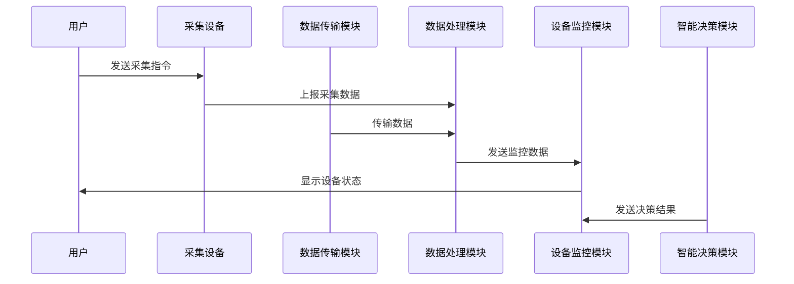

                 


### 目录大纲设计思路与过程

在编写《5G与边缘计算协同推动工业互联网》的技术博客文章之前，我们需要进行详细的目录大纲设计。以下是一个详细的步骤，让我们一步一步地进行分析和思考。

#### 第一步：确定文章的核心内容

首先，我们要明确文章的核心内容。根据题目《5G与边缘计算协同推动工业互联网》，我们可以确定文章的核心内容应该涵盖以下几个方面：

1. **5G技术与边缘计算技术的背景介绍**：解释5G和边缘计算技术的发展背景、意义以及当前的应用状况。
2. **工业互联网的概念及其重要性**：介绍工业互联网的定义、发展历程、核心概念以及其在工业生产中的重要性。
3. **5G与边缘计算的协同原理**：解释5G和边缘计算如何协同工作，推动工业互联网的发展。
4. **应用场景**：分析5G和边缘计算在工业互联网中的具体应用场景，如工业自动化、智能制造、工业物联网等。
5. **系统设计与实现**：讨论如何将5G和边缘计算应用于工业互联网的系统设计和实现，包括系统架构、接口设计、交互流程等。
6. **项目实战**：通过具体的案例展示5G和边缘计算在工业互联网中的应用，包括环境搭建、核心实现、案例分析等。
7. **最佳实践与未来展望**：总结当前5G和边缘计算在工业互联网中的最佳实践，并探讨未来的发展趋势。

#### 第二步：设计文章的目录大纲

根据核心内容，我们可以设计出文章的目录大纲。为了确保内容的逻辑性和完整性，我们将目录分为以下几个部分：

1. **引言**：简要介绍5G与边缘计算协同推动工业互联网的背景和重要性。
2. **5G技术与边缘计算技术背景**：
   - 5G技术背景
   - 边缘计算技术背景
   - 5G与边缘计算的协同原理
3. **工业互联网的概念及其重要性**：
   - 工业互联网的定义
   - 工业互联网的发展历程
   - 工业互联网的核心概念
   - 工业互联网的重要性
4. **应用场景**：
   - 工业自动化
   - 智能制造
   - 工业物联网
5. **系统设计与实现**：
   - 工业互联网系统架构设计
   - 5G与边缘计算在系统中的应用
   - 系统性能优化与可靠性保障
6. **项目实战**：
   - 案例一：智能工厂
   - 案例二：智慧能源管理
   - 案例三：工业互联网安全
7. **最佳实践与未来展望**：
   - 5G与边缘计算在工业互联网中的最佳实践
   - 5G与边缘计算协同推动工业互联网的未来发展趋势
8. **总结**：对文章的主要内容进行总结，强调5G与边缘计算在工业互联网中的重要作用。

#### 第三步：确保内容的完整性

在编写每个章节时，我们需要确保内容完整、具体详细。以下是每个章节的内容要求：

- **背景介绍**：介绍相关概念、技术背景、问题背景、问题描述、问题解决、边界与外延、概念结构与核心要素组成。
- **核心概念与联系**：解释核心概念、列出概念属性特征对比表格、绘制ER实体关系图架构。
- **算法原理讲解**：使用mermaid流程图展示算法原理、使用Python源代码进行详细讲解、给出算法原理的数学模型和公式。
- **系统分析与架构设计方案**：介绍问题场景、项目介绍、系统功能设计（领域模型mermaid类图）、系统架构设计（mermaid架构图）、系统接口设计、系统交互流程（mermaid序列图）。
- **项目实战**：介绍项目环境安装、系统核心实现、代码应用解读与分析、实际案例分析和详细讲解剖析、项目小结。
- **最佳实践与未来展望**：总结最佳实践、探讨未来发展趋势、为读者提供指导和建议。

通过以上步骤，我们可以设计出一个详细、逻辑清晰且完整的《5G与边缘计算协同推动工业互联网》的技术博客文章。接下来，我们将按照目录大纲，逐步编写每个章节的内容。首先是**引言**部分，接下来我们将详细探讨5G技术和边缘计算技术的背景。

----------------------------------------------------------------

# 5G与边缘计算协同推动工业互联网

## 关键词
5G技术，边缘计算，工业互联网，协同发展，应用场景，系统设计与实现

## 摘要

随着5G技术的不断成熟和边缘计算的兴起，工业互联网正迎来新的发展机遇。本文将从5G技术和边缘计算的技术背景出发，深入探讨工业互联网的概念及其重要性。随后，我们将详细分析5G与边缘计算如何协同工作，推动工业互联网的发展。本文还将介绍5G和边缘计算在工业互联网中的应用场景，包括工业自动化、智能制造和工业物联网。最后，本文将讨论如何进行系统设计与实现，并通过实际项目案例展示5G与边缘计算在工业互联网中的具体应用。通过本文的探讨，我们期望为读者提供关于5G与边缘计算协同推动工业互联网的深入见解和最佳实践。

----------------------------------------------------------------

## 1. 5G技术背景

### 1.1 什么是5G？

5G，即第五代移动通信技术，是继1G模拟通信、2G数字通信、3G多媒体通信和4G高速宽带通信之后的新一代移动通信技术。5G的核心目标是提供更高的数据传输速率、更低的延迟、更大的连接容量和更高的网络可靠性。

**关键特性**：

1. **高速传输**：5G的理论峰值速度可达每秒数十Gbps，是4G的数十倍，这将极大提升用户的上网体验。
2. **低延迟**：5G的端到端延迟可降低至1毫秒甚至更低，这对于实时通信、自动驾驶、远程医疗等应用场景至关重要。
3. **大规模连接**：5G支持每平方公里内连接超过100万个设备，满足物联网（IoT）设备的大量连接需求。
4. **网络切片**：5G网络切片技术能够根据不同应用场景提供定制化的网络服务，提高网络资源利用率。

### 1.2 5G技术发展历程

5G技术的发展经历了几个关键阶段：

1. **研究阶段**（2010-2015）：国际电信联盟（ITU）开始研究5G的关键技术和标准。
2. **标准制定阶段**（2015-2018）：3GPP（第三代合作伙伴计划）启动了5G NR（新无线电）标准的制定工作。
3. **商用部署阶段**（2019-至今）：全球各国陆续开始5G网络商用部署，如中国、韩国、美国等。

### 1.3 5G技术的核心优势

5G技术相比前几代移动通信技术，具有以下几个核心优势：

1. **更高的传输速率**：5G将提供更快的下载和上传速度，支持高速数据传输，满足高清视频、虚拟现实（VR）等高带宽需求。
2. **更低的延迟**：5G的低延迟特性使其成为物联网、自动驾驶、智能制造等实时应用的关键技术。
3. **更大的网络容量**：5G能够支持更多的设备同时连接，这对于物联网和智慧城市等应用至关重要。
4. **更广的应用范围**：5G不仅适用于移动通信，还广泛应用于物联网、云计算、智慧城市等领域。

### 1.4 5G技术的应用前景

随着5G技术的商用部署，其应用前景将更加广泛：

1. **工业互联网**：5G技术可以提升工业生产线的自动化和智能化水平，推动工业互联网的发展。
2. **自动驾驶**：5G的低延迟和高可靠性特性将极大提高自动驾驶的安全性和效率。
3. **智慧城市**：5G技术可以支持智能交通、智能安防、智能医疗等城市基础设施的升级。
4. **远程医疗**：5G技术可以提供更稳定的远程医疗连接，实现医生与患者的实时互动。

总之，5G技术的快速发展为工业互联网带来了新的机遇和挑战。理解5G技术的背景和核心优势，对于把握未来工业互联网的发展趋势具有重要意义。

----------------------------------------------------------------

## 2. 边缘计算技术背景

### 2.1 什么是边缘计算？

边缘计算（Edge Computing）是一种分布式计算架构，通过在数据源附近（如网络边缘）进行数据处理，从而减少数据传输的延迟和带宽消耗。与传统的云计算相比，边缘计算更加贴近数据源头，能够在本地快速处理数据，提供更高效的响应。

**关键特性**：

1. **低延迟**：边缘计算在数据产生的本地进行数据处理，减少了数据传输的时间，降低了延迟。
2. **高带宽**：边缘计算能够处理大量实时数据，提供了更高的带宽。
3. **分布式架构**：边缘计算将计算任务分散到多个边缘节点，提高了系统的弹性和可靠性。
4. **隐私保护**：边缘计算在本地处理数据，减少了数据泄露的风险。

### 2.2 边缘计算技术的发展历程

边缘计算的概念早在20世纪80年代就已经提出，但真正得到广泛应用是在近年来。以下是边缘计算技术发展的几个关键阶段：

1. **初始阶段**（1980s-2000s）：边缘计算作为分布式计算的一个分支，开始受到研究关注。
2. **云计算推动阶段**（2000s-2010s）：随着云计算的兴起，边缘计算开始与云计算结合，形成了云边协同的计算模式。
3. **物联网推动阶段**（2010s-至今）：随着物联网设备的普及，边缘计算成为实现物联网应用的关键技术。

### 2.3 边缘计算的核心优势

边缘计算相比云计算和中心化计算，具有以下几个核心优势：

1. **低延迟**：边缘计算在本地处理数据，减少了数据传输的延迟，适用于实时性要求高的应用。
2. **高带宽**：边缘计算能够处理大量实时数据，提供了更高的带宽。
3. **数据隐私**：边缘计算在本地处理数据，减少了数据传输过程中的泄露风险。
4. **系统弹性**：边缘计算通过分布式架构，提高了系统的弹性和可靠性。

### 2.4 边缘计算的应用场景

边缘计算在多个领域具有广泛的应用前景：

1. **工业互联网**：边缘计算可以提升工业自动化和智能制造的效率，减少生产线的延迟和故障率。
2. **智能交通**：边缘计算可以实时处理交通数据，优化交通流量，提高交通安全和效率。
3. **智慧城市**：边缘计算可以支持智能安防、智能医疗、智能环境监测等城市基础设施的应用。
4. **远程医疗**：边缘计算可以提供更稳定的远程医疗连接，实现医生与患者的实时互动。
5. **智能农业**：边缘计算可以实时监测农田环境，优化农业生产过程，提高农业产量。

总之，边缘计算作为一种新兴的计算模式，正在改变传统数据处理和传输的方式。理解边缘计算的技术背景和核心优势，对于把握未来工业互联网和其他领域的智能化发展具有重要意义。

----------------------------------------------------------------

## 3. 工业互联网的概念及其重要性

### 3.1 工业互联网的定义

工业互联网（Industrial Internet）是指将人、机器和数据处理连接起来，通过大数据、云计算、物联网、人工智能等先进技术，实现工业系统的智能化和数字化转型。工业互联网的核心是利用数字技术，将物理世界和虚拟世界相结合，从而提高工业生产效率、降低成本、提升产品质量。

### 3.2 工业互联网的发展历程

工业互联网的概念起源于20世纪90年代，随着互联网、物联网、大数据等技术的发展，工业互联网逐渐成为一个热门领域。以下是工业互联网发展的几个关键阶段：

1. **数字化阶段**（1990s-2000s）：企业开始引入计算机和互联网，实现生产数据的数字化和自动化。
2. **信息化阶段**（2000s-2010s）：企业通过建立信息管理系统，实现生产过程的全面信息化。
3. **智能化阶段**（2010s-至今）：企业开始利用大数据、云计算、人工智能等先进技术，实现生产过程的智能化和自动化。

### 3.3 工业互联网的核心概念

工业互联网的核心概念包括：

1. **设备互联**：通过传感器、RFID等设备，实现工业设备的互联互通。
2. **数据处理**：利用大数据技术，对工业数据进行收集、存储、分析和挖掘，为生产决策提供支持。
3. **智能决策**：通过人工智能技术，实现生产过程的智能优化和自动化控制。
4. **协同制造**：通过互联网技术，实现供应链、生产、销售等环节的协同运作，提高生产效率。
5. **服务化延伸**：将产品转化为服务，通过物联网技术，实现产品全生命周期的管理。

### 3.4 工业互联网的重要性

工业互联网对于现代工业发展具有重要意义：

1. **提高生产效率**：通过工业互联网技术，可以实现生产过程的自动化和智能化，提高生产效率，降低生产成本。
2. **提升产品质量**：通过实时监测和数据分析，可以及时发现生产过程中的问题，提高产品质量。
3. **优化供应链管理**：通过供应链协同，可以实现生产、销售等环节的实时数据共享，提高供应链的透明度和效率。
4. **创新商业模式**：通过服务化延伸，可以将产品转化为服务，实现新的商业模式和盈利模式。
5. **推动产业升级**：工业互联网技术可以推动传统产业的数字化转型，实现产业升级和创新发展。

总之，工业互联网作为一种先进的技术体系，正深刻改变着工业生产方式，为工业发展带来了新的机遇和挑战。理解工业互联网的概念及其重要性，对于把握未来工业发展的趋势具有重要意义。

----------------------------------------------------------------

## 4. 5G与边缘计算的协同原理

### 4.1 5G与边缘计算的协同作用

5G技术和边缘计算技术的协同作用，能够充分发挥两者的优势，推动工业互联网的发展。5G技术提供了高带宽、低延迟、高可靠性的网络环境，而边缘计算则在数据本地处理和实时响应方面具有显著优势。通过两者的协同，可以实现以下作用：

1. **增强网络性能**：5G技术提供的高速网络连接和边缘计算技术的本地处理能力相结合，能够大幅提高网络性能，满足工业互联网对高速、低延迟连接的需求。
2. **优化数据处理**：通过边缘计算，可以减少数据传输的延迟和带宽消耗，实现数据的实时处理和分析，提高数据处理效率。
3. **提升系统可靠性**：5G技术和边缘计算技术的结合，可以实现网络的冗余和分布式架构，提高系统的可靠性和容错能力。
4. **降低成本**：通过边缘计算，可以减少中心化数据处理的成本，实现资源的优化配置。

### 4.2 5G与边缘计算的协同原理

5G与边缘计算的协同原理主要体现在以下几个方面：

1. **网络协同**：5G技术提供了高速、低延迟的网络连接，而边缘计算技术则在网络边缘提供数据处理和存储能力。通过两者的结合，可以实现网络和计算的协同，满足工业互联网对高速、低延迟连接的需求。
2. **数据协同**：5G技术和边缘计算技术共同处理和存储数据，可以实现数据的实时分析和挖掘，提高数据处理效率。通过边缘计算，可以将部分数据处理任务分散到网络边缘，减少中心化数据处理的压力。
3. **应用协同**：5G技术和边缘计算技术的协同，可以推动工业互联网的应用创新，如智能制造、智能交通、智慧城市等。通过边缘计算，可以实现本地实时数据处理，提高应用响应速度和准确性。

### 4.3 5G与边缘计算在工业互联网中的应用

5G与边缘计算在工业互联网中的应用主要包括以下几个方面：

1. **智能制造**：通过5G技术实现工厂内设备的互联互通，利用边缘计算技术进行实时数据处理和优化，实现生产线的智能化和自动化。
2. **智能交通**：利用5G技术提供的高速网络连接，结合边缘计算技术进行实时交通数据分析和处理，实现智能交通管理。
3. **智慧城市**：通过5G和边缘计算技术，实现城市基础设施的智能化管理，如智能安防、智能环境监测等。
4. **远程医疗**：利用5G和边缘计算技术，实现远程医疗的诊断、治疗和监测，提高医疗服务水平。

总之，5G与边缘计算的协同作用，为工业互联网的发展提供了强大的技术支撑。通过理解5G与边缘计算的协同原理，可以更好地把握未来工业互联网的发展趋势和应用前景。

----------------------------------------------------------------

## 5. 5G网络架构与关键技术

### 5.1 5G网络架构概述

5G网络架构在传统4G网络架构的基础上进行了重大改进，以实现更高的网络性能和更广泛的覆盖。5G网络架构主要包括以下几个关键组成部分：

1. **用户面（User Plane）**：用户面负责数据传输，包括用户数据流的传输、路由和转发。5G用户面采用了新的网络架构，包括NR（新无线电）和EPC（演进包核心网）。
2. **控制面（Control Plane）**：控制面负责网络的控制和信令处理，包括连接管理、资源分配和网络优化。5G控制面采用了全新的控制平面架构，包括NFS（网络功能切片）和NG-RAN（下一代无线接入网）。
3. **无线接入网（Radio Access Network, RAN）**：无线接入网负责无线信号的处理和传输，包括基站（gNB）和用户设备（UE）。5G无线接入网采用了新的无线技术，如NR（新无线电）和mMTC（大规模机器类型通信）。
4. **核心网（Core Network）**：核心网负责数据包的传输和路由，包括数据存储、处理和交换。5G核心网采用了全新的核心网架构，包括UPF（用户面功能）和SMF（会话管理功能）。

### 5.2 5G网络关键技术

5G网络的关键技术包括：

1. **NR（新无线电）**：NR是5G无线接入网的核心技术，采用新的频段（如毫米波频段）、新的波形（如OFDM）、新的调制和编码技术，实现了更高的网络速度和更低的延迟。
2. **网络切片（Network Slicing）**：网络切片技术是5G网络的关键特性之一，它允许网络运营商为不同的应用场景创建多个虚拟网络，实现网络资源的灵活分配和高效利用。
3. **边缘计算（Edge Computing）**：边缘计算技术将计算任务从云端迁移到网络边缘，实现数据处理的本地化和实时化，提高网络的响应速度和可靠性。
4. **MIMO（多输入多输出）**：MIMO技术通过使用多个天线发送和接收信号，提高了网络的传输速率和覆盖范围。
5. **SDN（软件定义网络）和NFV（网络功能虚拟化）**：SDN和NFV技术通过软件定义网络和虚拟化网络功能，实现了网络的灵活配置和管理，降低了网络的复杂度和运营成本。

### 5.3 5G网络的优势和挑战

5G网络相比前几代移动通信网络，具有以下优势：

1. **更高的网络速度**：5G网络的峰值速度可达数十Gbps，是4G网络的数十倍，极大地提高了数据传输速度。
2. **更低的延迟**：5G网络的端到端延迟可降低至1毫秒甚至更低，是4G网络的十分之一，为实时应用提供了更好的支持。
3. **更大的连接容量**：5G网络支持每平方公里内连接超过100万个设备，是4G网络的十倍，为物联网应用提供了更好的支持。
4. **更高的可靠性**：5G网络采用了更先进的技术和架构，提高了网络的可靠性和稳定性。

然而，5G网络也面临一些挑战：

1. **网络建设成本**：5G网络需要大规模部署基站和设备，建设成本较高。
2. **频谱资源分配**：5G网络需要使用新的频段，如毫米波频段，频谱资源分配和管理成为一大挑战。
3. **网络安全**：5G网络的开放性和分布式架构可能带来新的安全挑战，需要采取有效的安全措施。

总之，5G网络架构和关键技术为工业互联网提供了强大的支持，但同时也面临一些挑战。理解5G网络的优势和挑战，对于充分发挥5G技术在工业互联网中的应用具有重要意义。

----------------------------------------------------------------

## 6. 边缘计算架构与关键技术

### 6.1 边缘计算架构概述

边缘计算架构是一种分布式计算架构，通过在数据源附近（边缘）部署计算资源，实现数据处理和应用的本地化和实时化。边缘计算架构主要包括以下几个关键组成部分：

1. **边缘设备（Edge Devices）**：边缘设备是指部署在边缘的智能设备，如传感器、摄像头、智能终端等，它们负责数据的采集和初步处理。
2. **边缘服务器（Edge Servers）**：边缘服务器是指在边缘部署的计算资源，负责处理和存储边缘设备采集的数据，并提供计算服务。
3. **云平台（Cloud Platform）**：云平台是指部署在中心的数据中心，提供云计算资源，与边缘计算架构协同工作，共同完成数据处理和分析任务。
4. **边缘网关（Edge Gateways）**：边缘网关是边缘计算架构的核心组件，负责边缘设备和云平台之间的数据传输和通信，实现数据的聚合和分发。

### 6.2 边缘计算的关键技术

边缘计算的关键技术包括：

1. **分布式计算**：边缘计算通过分布式计算架构，将计算任务分散到边缘设备、边缘服务器和云平台，提高了计算效率和处理能力。
2. **数据流处理**：边缘计算利用实时数据流处理技术，对采集到的数据进行实时处理和分析，实现数据的快速响应。
3. **物联网技术**：物联网技术是边缘计算的基础，通过传感器、RFID等技术，实现设备的互联互通，为边缘计算提供数据来源。
4. **区块链技术**：区块链技术可以确保边缘计算的数据安全和隐私，通过分布式账本和智能合约，实现数据的透明和可信。
5. **容器技术**：容器技术可以简化边缘计算的应用部署和运行，提高系统的灵活性和可扩展性。

### 6.3 边缘计算的优势和挑战

边缘计算相比传统云计算，具有以下优势：

1. **低延迟**：边缘计算在数据源附近进行数据处理，减少了数据传输的延迟，提高了系统的响应速度。
2. **高带宽**：边缘计算能够处理大量实时数据，提供了更高的带宽。
3. **数据隐私**：边缘计算在本地处理数据，减少了数据泄露的风险。
4. **系统弹性**：边缘计算通过分布式架构，提高了系统的弹性和可靠性。

然而，边缘计算也面临一些挑战：

1. **计算资源限制**：边缘设备通常计算资源和存储资源有限，需要高效利用有限的资源。
2. **网络连接稳定性**：边缘设备的网络连接可能不稳定，需要确保数据的可靠传输。
3. **安全性和隐私**：边缘计算涉及大量敏感数据，需要采取有效的安全措施保护数据安全。

总之，边缘计算作为一种新兴的计算模式，为工业互联网和其他领域提供了强大的技术支撑。理解边缘计算架构与关键技术，对于把握未来智能化发展趋势具有重要意义。

----------------------------------------------------------------

## 7. 5G与边缘计算协同原理

### 7.1 协同机制

5G与边缘计算的协同原理主要体现在以下几个方面：

1. **网络协同**：5G网络提供高速、低延迟、高带宽的网络连接，支持边缘计算所需的网络环境。边缘计算则通过在本地处理数据，减少数据传输的延迟和带宽消耗。
2. **数据处理协同**：5G网络与边缘计算共同处理和存储数据，实现数据的实时分析和挖掘，提高数据处理效率。通过边缘计算，可以将部分数据处理任务分散到网络边缘，减轻中心化数据处理压力。
3. **应用协同**：5G与边缘计算的结合，可以推动工业互联网的应用创新，如智能制造、智能交通、智慧城市等。通过边缘计算，可以实现本地实时数据处理，提高应用响应速度和准确性。

### 7.2 关键技术

5G与边缘计算协同的关键技术包括：

1. **网络切片技术**：网络切片技术允许运营商为不同的应用场景创建多个虚拟网络，实现网络资源的灵活分配和高效利用。边缘计算可以将部分网络切片功能部署到网络边缘，提高网络性能。
2. **边缘云计算**：边缘云计算将云计算资源部署到网络边缘，实现数据的本地处理和存储。5G网络的高带宽和低延迟特性，可以确保边缘云计算的稳定运行。
3. **边缘容器技术**：边缘容器技术可以将应用部署到边缘设备上，实现应用的灵活部署和运行。5G网络的高带宽和低延迟特性，可以确保边缘容器技术的良好性能。
4. **边缘AI**：边缘AI利用边缘计算能力，在本地进行数据分析和处理，实现智能决策和实时响应。5G网络的高带宽和低延迟特性，可以支持边缘AI的实时数据传输和处理。

### 7.3 应用场景

5G与边缘计算协同在工业互联网中具有广泛的应用场景：

1. **智能制造**：通过5G网络实现工厂设备的互联互通，利用边缘计算进行实时数据处理和优化，实现生产线的智能化和自动化。
2. **智能交通**：利用5G网络和边缘计算技术，实现交通数据的实时分析和处理，优化交通流量，提高交通安全和效率。
3. **智慧城市**：通过5G和边缘计算技术，实现城市基础设施的智能化管理，如智能安防、智能环境监测等。
4. **远程医疗**：利用5G和边缘计算技术，实现远程医疗的诊断、治疗和监测，提高医疗服务水平。
5. **农业智能化**：利用5G和边缘计算技术，实现农业生产的实时监测和优化，提高农业产量。

总之，5G与边缘计算协同原理为工业互联网的发展提供了强大的技术支撑。通过理解5G与边缘计算的关键技术和应用场景，可以更好地把握未来工业互联网的发展趋势和应用前景。

----------------------------------------------------------------

## 8. 5G与边缘计算在工业自动化中的应用

### 8.1 工业自动化的概念与现状

工业自动化是指利用机器和控制系统，实现生产过程的自动化和智能化。随着工业4.0和智能制造的推进，工业自动化已成为现代工业发展的重要趋势。当前，工业自动化在以下几个方面取得了显著进展：

1. **生产线自动化**：通过传感器、执行器、机器人等自动化设备，实现生产线的自动化控制和操作。
2. **过程控制系统**：利用先进的控制算法和实时数据处理技术，实现生产过程的自动化优化和调节。
3. **智能工厂**：通过物联网、大数据、云计算等技术，实现工厂全流程的数字化和智能化管理。

### 8.2 5G技术在工业自动化中的应用

5G技术在工业自动化中的应用，主要体现在以下几个方面：

1. **设备互联**：5G技术可以实现工厂内各种设备的互联互通，如机器人、传感器、执行器等，实现设备的自动化控制和协同工作。
2. **远程监控**：5G技术可以实现工厂设备的远程监控和管理，提高设备的运行效率和安全性。
3. **实时数据处理**：5G技术提供的高速网络连接，可以实现工厂生产数据的实时传输和实时处理，支持生产过程的自动化优化和决策。

### 8.3 边缘计算在工业自动化中的应用

边缘计算在工业自动化中的应用，主要体现在以下几个方面：

1. **数据预处理**：边缘计算可以将工厂生产数据在本地进行预处理，减少数据传输的延迟和带宽消耗，提高数据处理效率。
2. **实时决策**：边缘计算可以实现工厂生产过程中的实时数据处理和实时决策，提高生产过程的智能化和自动化水平。
3. **设备预测维护**：边缘计算可以通过实时监测设备状态，预测设备故障，实现设备的预测性维护，提高设备的可靠性和使用寿命。

### 8.4 5G与边缘计算在工业自动化中的协同应用

5G与边缘计算协同在工业自动化中的应用，主要体现在以下几个方面：

1. **设备互联与协同**：通过5G技术实现工厂内设备的互联互通，结合边缘计算技术进行实时数据处理和优化，实现生产线的智能化和自动化。
2. **数据高效处理**：通过5G技术提供的高速网络连接，结合边缘计算技术进行数据预处理和实时处理，实现工厂生产数据的实时分析和挖掘，提高数据处理效率。
3. **设备预测性维护**：通过5G技术实现设备的远程监控和管理，结合边缘计算技术进行设备状态的实时监测和故障预测，实现设备的预测性维护，提高设备的可靠性和使用寿命。

### 8.5 案例分析

以某智能工厂为例，该工厂采用了5G与边缘计算协同技术，实现了生产线的智能化和自动化。具体应用如下：

1. **设备互联**：通过5G技术，实现了生产线上各种设备的互联互通，包括机器人、传感器、执行器等，实现了设备的自动化控制和协同工作。
2. **数据预处理**：通过边缘计算技术，将生产数据在本地进行预处理，减少了数据传输的延迟和带宽消耗，提高了数据处理效率。
3. **实时决策**：通过边缘计算技术，实现了生产过程中的实时数据处理和实时决策，提高了生产过程的智能化和自动化水平。
4. **设备预测性维护**：通过5G技术实现设备的远程监控和管理，结合边缘计算技术进行设备状态的实时监测和故障预测，实现了设备的预测性维护，提高了设备的可靠性和使用寿命。

总之，5G与边缘计算协同在工业自动化中的应用，为工业生产线的智能化和自动化提供了强大的技术支撑。通过具体的案例分析，我们可以看到5G与边缘计算协同技术在实际应用中的巨大潜力。

----------------------------------------------------------------

## 9. 5G与边缘计算在智能制造中的应用

### 9.1 智能制造的概念与现状

智能制造是指通过应用先进的信息技术和制造技术，实现制造过程的智能化和自动化，从而提高生产效率、降低成本、提高产品质量。智能制造的核心是利用物联网、大数据、云计算、人工智能等技术，实现生产过程的实时监控、智能决策和优化。

当前，智能制造已在全球范围内得到广泛应用，主要表现在以下几个方面：

1. **智能制造系统**：通过集成传感器、机器人、执行器等设备，实现生产过程的自动化和智能化。
2. **工业物联网**：通过物联网技术，实现设备、产品和服务的互联互通，实现生产过程的数字化和智能化。
3. **智能制造平台**：通过云计算和大数据技术，实现生产数据的实时分析和挖掘，支持生产过程的智能优化和决策。

### 9.2 5G技术在智能制造中的应用

5G技术在智能制造中的应用，主要体现在以下几个方面：

1. **设备互联**：5G技术可以实现制造过程中设备的互联互通，实现设备的自动化控制和协同工作。
2. **数据传输**：5G技术提供的高速网络连接，可以实现制造数据的实时传输和实时处理，支持生产过程的智能化和优化。
3. **远程监控**：5G技术可以实现设备的远程监控和管理，提高设备的运行效率和安全性。

### 9.3 边缘计算在智能制造中的应用

边缘计算在智能制造中的应用，主要体现在以下几个方面：

1. **数据处理**：边缘计算可以将制造数据在本地进行预处理和实时处理，减少数据传输的延迟和带宽消耗，提高数据处理效率。
2. **智能决策**：边缘计算可以实现制造过程的实时数据处理和智能决策，提高生产过程的智能化和自动化水平。
3. **设备预测性维护**：边缘计算可以通过实时监测设备状态，预测设备故障，实现设备的预测性维护，提高设备的可靠性和使用寿命。

### 9.4 5G与边缘计算在智能制造中的协同应用

5G与边缘计算协同在智能制造中的应用，主要体现在以下几个方面：

1. **设备互联与协同**：通过5G技术实现制造过程中设备的互联互通，结合边缘计算技术进行实时数据处理和优化，实现生产线的智能化和自动化。
2. **数据高效处理**：通过5G技术提供的高速网络连接，结合边缘计算技术进行数据预处理和实时处理，实现制造数据的实时分析和挖掘，提高数据处理效率。
3. **设备预测性维护**：通过5G技术实现设备的远程监控和管理，结合边缘计算技术进行设备状态的实时监测和故障预测，实现设备的预测性维护，提高设备的可靠性和使用寿命。

### 9.5 案例分析

以某智能制造工厂为例，该工厂采用了5G与边缘计算协同技术，实现了生产过程的智能化和自动化。具体应用如下：

1. **设备互联**：通过5G技术，实现了生产线上各种设备的互联互通，包括机器人、传感器、执行器等，实现了设备的自动化控制和协同工作。
2. **数据预处理**：通过边缘计算技术，将生产数据在本地进行预处理，减少了数据传输的延迟和带宽消耗，提高了数据处理效率。
3. **实时决策**：通过边缘计算技术，实现了生产过程中的实时数据处理和实时决策，提高了生产过程的智能化和自动化水平。
4. **设备预测性维护**：通过5G技术实现设备的远程监控和管理，结合边缘计算技术进行设备状态的实时监测和故障预测，实现了设备的预测性维护，提高了设备的可靠性和使用寿命。

总之，5G与边缘计算协同在智能制造中的应用，为生产过程的智能化和自动化提供了强大的技术支撑。通过具体的案例分析，我们可以看到5G与边缘计算协同技术在实际应用中的巨大潜力。

----------------------------------------------------------------

## 10. 5G与边缘计算在工业物联网中的应用

### 10.1 工业物联网的概念与现状

工业物联网（Industrial Internet of Things，IIoT）是指将传感器、执行器、机器和设备通过网络连接起来，实现工业系统的智能化和数字化。工业物联网的核心是通过数据采集、传输、处理和分析，实现工业系统的实时监控、优化和自动化。

当前，工业物联网在以下几个方面取得了显著进展：

1. **设备互联**：通过传感器和RFID等设备，实现工业设备的互联互通，实现生产过程的自动化和智能化。
2. **数据采集与传输**：通过工业物联网平台，实现生产数据的实时采集和传输，支持数据的实时分析和挖掘。
3. **系统集成**：通过工业物联网技术，实现不同系统和设备之间的集成，实现生产过程的协同优化。

### 10.2 5G技术在工业物联网中的应用

5G技术在工业物联网中的应用，主要体现在以下几个方面：

1. **高速数据传输**：5G技术提供的高速网络连接，可以实现工业物联网设备的高效数据传输，支持实时数据处理和监控。
2. **设备连接**：5G技术可以实现工业物联网设备的大规模连接，支持工业设备的高密度部署和互联互通。
3. **远程监控与控制**：5G技术可以实现工业物联网设备的远程监控和管理，提高设备的运行效率和安全性。

### 10.3 边缘计算在工业物联网中的应用

边缘计算在工业物联网中的应用，主要体现在以下几个方面：

1. **数据处理**：边缘计算可以将工业物联网数据在本地进行预处理和实时处理，减少数据传输的延迟和带宽消耗，提高数据处理效率。
2. **智能决策**：边缘计算可以实现工业物联网数据的实时分析和处理，支持生产过程的实时决策和优化。
3. **设备预测性维护**：边缘计算可以通过实时监测工业物联网设备的状态，预测设备故障，实现设备的预测性维护，提高设备的可靠性和使用寿命。

### 10.4 5G与边缘计算在工业物联网中的协同应用

5G与边缘计算协同在工业物联网中的应用，主要体现在以下几个方面：

1. **设备互联与协同**：通过5G技术实现工业物联网设备的大规模连接和互联互通，结合边缘计算技术进行实时数据处理和优化，实现生产线的智能化和自动化。
2. **数据高效处理**：通过5G技术提供的高速网络连接，结合边缘计算技术进行数据预处理和实时处理，实现工业物联网数据的实时分析和挖掘，提高数据处理效率。
3. **设备预测性维护**：通过5G技术实现工业物联网设备的远程监控和管理，结合边缘计算技术进行设备状态的实时监测和故障预测，实现设备的预测性维护，提高设备的可靠性和使用寿命。

### 10.5 案例分析

以某智能工厂的工业物联网应用为例，该工厂采用了5G与边缘计算协同技术，实现了生产过程的智能化和自动化。具体应用如下：

1. **设备互联**：通过5G技术，实现了生产线上各种设备的互联互通，包括机器人、传感器、执行器等，实现了设备的自动化控制和协同工作。
2. **数据预处理**：通过边缘计算技术，将生产数据在本地进行预处理，减少了数据传输的延迟和带宽消耗，提高了数据处理效率。
3. **实时决策**：通过边缘计算技术，实现了生产过程中的实时数据处理和实时决策，提高了生产过程的智能化和自动化水平。
4. **设备预测性维护**：通过5G技术实现设备的远程监控和管理，结合边缘计算技术进行设备状态的实时监测和故障预测，实现了设备的预测性维护，提高了设备的可靠性和使用寿命。

总之，5G与边缘计算协同在工业物联网中的应用，为生产过程的智能化和自动化提供了强大的技术支撑。通过具体的案例分析，我们可以看到5G与边缘计算协同技术在实际应用中的巨大潜力。

----------------------------------------------------------------

## 11. 工业互联网系统架构设计

### 11.1 工业互联网系统架构概述

工业互联网系统架构是指实现工业互联网功能的整体结构，包括硬件、软件和网络三个主要组成部分。一个典型的工业互联网系统架构通常包括以下几个关键层次：

1. **感知层**：感知层主要负责数据采集，通过传感器、RFID、条码等设备，实现物理世界到数字世界的转换。
2. **传输层**：传输层负责数据的传输，利用5G、光纤、无线等方式，实现数据在工业互联网中的传输。
3. **平台层**：平台层是工业互联网的核心，负责数据存储、处理和分析，提供智能决策支持。平台层通常包括边缘计算节点、云计算中心和数据库。
4. **应用层**：应用层是工业互联网的外部接口，负责与用户交互，提供各种工业应用，如设备监控、故障预测、生产优化等。

### 11.2 系统功能设计

工业互联网系统的功能设计是确保系统能够实现预期目标的关键。以下是一个典型的工业互联网系统功能设计：

1. **数据采集**：通过传感器、RFID、条码等设备，实时采集设备运行状态、环境参数等数据。
2. **数据传输**：利用5G、光纤等传输技术，将采集到的数据实时传输到平台层。
3. **数据处理**：在平台层，通过边缘计算节点和云计算中心，对传输过来的数据进行分析和处理，实现数据的实时监控和预测性维护。
4. **智能决策**：基于处理后的数据，通过机器学习、数据挖掘等技术，实现生产过程的优化和智能决策。
5. **设备监控**：通过平台层，实现对设备运行状态的实时监控，及时发现和处理故障。
6. **生产优化**：根据实时数据和智能决策结果，优化生产过程，提高生产效率。

### 11.3 系统架构设计

工业互联网系统的架构设计需要综合考虑硬件、软件和网络三个层面，确保系统能够高效、稳定地运行。以下是一个典型的工业互联网系统架构设计：

1. **硬件架构**：包括传感器、RFID、条码等数据采集设备，以及边缘计算节点和云计算中心等计算资源。
2. **软件架构**：包括数据采集模块、数据传输模块、数据处理模块、智能决策模块、设备监控模块等。
3. **网络架构**：包括5G、光纤、无线等传输网络，以及边缘计算节点和云计算中心之间的连接。

### 11.4 系统接口设计

系统接口设计是确保不同模块之间能够有效通信和协同工作的关键。以下是一个典型的工业互联网系统接口设计：

1. **数据采集接口**：定义数据采集设备的通信协议和数据格式，确保采集的数据能够准确、实时地传输到平台层。
2. **数据传输接口**：定义数据在传输层中的通信协议和数据格式，确保数据能够高效、稳定地传输。
3. **数据处理接口**：定义数据处理模块之间的通信协议和数据格式，确保数据处理模块能够协同工作，实现数据的实时分析和处理。
4. **智能决策接口**：定义智能决策模块与其他模块之间的通信协议和数据格式，确保智能决策模块能够基于实时数据做出准确的决策。
5. **设备监控接口**：定义设备监控模块与其他模块之间的通信协议和数据格式，确保设备监控模块能够实时监控设备运行状态。

### 11.5 系统交互序列图

系统交互序列图是描述系统各个模块之间交互过程的图形化工具，能够直观地展示系统的运行流程和交互逻辑。以下是一个典型的工业互联网系统交互序列图：



通过上述系统架构设计、系统功能设计、系统接口设计和系统交互序列图，我们可以全面了解工业互联网系统的设计和实现过程，为构建高效的工业互联网系统提供指导。

----------------------------------------------------------------

## 12. 5G与边缘计算在工业互联网系统中的实现

### 12.1 系统环境安装

在实现5G与边缘计算在工业互联网系统中的应用之前，首先需要搭建一个合适的环境。以下是具体的步骤：

1. **硬件环境搭建**：准备所需的边缘计算设备，如树莓派、单板计算机等，确保设备具有足够的计算能力和网络接口。
2. **软件环境安装**：在边缘计算设备上安装操作系统（如Ubuntu Server），并配置网络接口。同时，安装必要的软件包，如5G网络适配器、边缘计算框架（如Kubernetes）等。
3. **5G网络配置**：根据实际需求，配置5G网络参数，确保边缘计算设备可以接入5G网络。

### 12.2 系统核心实现

在搭建好系统环境后，我们需要实现5G与边缘计算在工业互联网系统中的核心功能。以下是一个简要的实现步骤：

1. **数据采集与传输**：在边缘计算设备上部署数据采集程序，通过传感器、RFID等设备，实时采集设备运行数据，并将数据传输到边缘计算节点。
2. **边缘数据处理**：在边缘计算节点上部署数据处理程序，对采集到的数据进行预处理和实时分析，实现数据的本地处理和快速响应。
3. **5G数据传输**：将边缘计算节点上的数据处理结果通过5G网络传输到云计算中心，实现数据的集中管理和进一步分析。

### 12.3 代码应用解读与分析

以下是一个简单的Python代码示例，用于实现5G与边缘计算在工业互联网系统中的数据采集、处理和传输：

```python
import serial
import time
import requests

# 数据采集
def collect_data(serial_port):
    ser = serial.Serial(serial_port, 9600)
    while True:
        data = ser.readline().decode().strip()
        print(f"Collected data: {data}")
        time.sleep(1)

# 数据处理
def process_data(data):
    # 对采集到的数据进行处理，如滤波、转换等
    processed_data = data * 0.5
    return processed_data

# 数据传输
def send_data(data):
    url = "http://your_cloud_server/submit_data"
    headers = {"Content-Type": "application/json"}
    payload = {"data": data}
    response = requests.post(url, headers=headers, json=payload)
    print(f"Data sent: {response.text}")

# 主程序
if __name__ == "__main__":
    serial_port = "/dev/ttyUSB0"
    while True:
        data = collect_data(serial_port)
        processed_data = process_data(data)
        send_data(processed_data)
        time.sleep(5)
```

在这个示例中，程序首先通过串口采集设备数据，然后对数据进行处理，最后通过HTTP请求将处理后的数据传输到云端。这个简单的示例展示了5G与边缘计算在工业互联网系统中的基本实现方法。

### 12.4 项目案例分析

以下是一个实际的项目案例，展示了5G与边缘计算在工业互联网系统中的应用：

**项目名称**：智能工厂生产数据监控系统

**项目背景**：某智能工厂需要实时监控生产设备的运行状态，确保生产过程的稳定性和效率。

**项目目标**：利用5G与边缘计算技术，实现生产数据的实时采集、处理和传输，提供生产过程的实时监控和智能分析。

**项目实现**：

1. **数据采集**：在工厂生产线上部署传感器，实时采集设备的运行状态数据，如温度、压力、速度等。
2. **边缘数据处理**：在边缘计算节点上部署数据处理程序，对采集到的数据进行分析和过滤，提取有用的信息。
3. **5G数据传输**：通过5G网络，将边缘计算节点上的数据传输到云计算中心，实现数据的集中管理和进一步分析。
4. **智能分析**：在云计算中心，利用大数据和人工智能技术，对生产数据进行分析和挖掘，提供生产过程的优化建议。

通过这个项目案例，我们可以看到5G与边缘计算技术在工业互联网系统中的实际应用。通过数据的实时采集、处理和传输，以及智能分析，实现了生产过程的实时监控和智能优化，提高了生产效率和产品质量。

### 12.5 项目小结

在这个项目中，我们利用5G与边缘计算技术，实现了智能工厂生产数据监控系统的建设。通过数据采集、边缘数据处理、5G数据传输和智能分析，实现了生产过程的实时监控和智能优化。这个项目不仅展示了5G与边缘计算在工业互联网系统中的应用，也为其他工业互联网项目提供了参考和借鉴。

总之，5G与边缘计算技术在工业互联网系统中的应用，为生产过程的智能化和自动化提供了强大的技术支撑。通过实际项目的实践，我们可以看到5G与边缘计算技术在实际应用中的巨大潜力，为工业互联网的发展带来了新的机遇。

----------------------------------------------------------------

## 13. 5G与边缘计算在工业互联网中的最佳实践

### 13.1 工业互联网中的最佳实践

在工业互联网的实施过程中，为了确保系统的稳定、高效和可持续发展，我们需要遵循一系列最佳实践。以下是一些关键的最佳实践：

1. **数据安全与隐私保护**：在数据采集、传输、存储和处理过程中，要确保数据的安全性和隐私性。采用加密技术、身份验证和访问控制等措施，保护数据不被未授权访问和篡改。
2. **系统可靠性**：工业互联网系统需要具有高可靠性和容错能力。通过冗余设计、故障检测和快速恢复机制，确保系统在异常情况下能够稳定运行。
3. **标准化与兼容性**：遵循国际和行业标准，确保工业互联网系统具有较好的兼容性和可扩展性。这有助于不同系统和设备之间的互联互通，提高系统的集成度和灵活性。
4. **实时数据处理**：工业互联网系统需要具备实时数据处理能力，以便快速响应生产过程中的变化。通过边缘计算和5G技术，实现数据的本地处理和实时传输，提高数据处理效率。
5. **持续优化与升级**：工业互联网系统需要不断进行优化和升级，以适应不断变化的生产环境和需求。通过持续监控和分析系统性能，发现并解决潜在问题，提高系统的稳定性和效率。

### 13.2 5G与边缘计算在工业互联网中的具体应用

在工业互联网中，5G与边缘计算技术的协同应用可以显著提升系统的性能和灵活性。以下是一些具体的5G与边缘计算应用场景：

1. **智能制造**：通过5G网络实现生产设备的互联互通，利用边缘计算进行实时数据处理和优化，实现生产线的智能化和自动化。例如，在生产过程中，实时监控设备状态，预测设备故障，实现设备的预测性维护。
2. **智能交通**：利用5G网络和边缘计算技术，实现交通数据的实时分析和处理，优化交通流量，提高交通安全和效率。例如，在智能交通系统中，通过边缘计算实现车辆定位、速度监控和实时信号控制。
3. **智慧城市**：通过5G和边缘计算技术，实现城市基础设施的智能化管理，如智能安防、智能环境监测等。例如，在智能安防系统中，通过边缘计算实时处理视频数据，实现实时监控和异常检测。
4. **远程医疗**：利用5G和边缘计算技术，实现远程医疗的诊断、治疗和监测，提高医疗服务水平。例如，在远程医疗系统中，通过边缘计算实现医学图像的实时处理和分析，提供准确的诊断结果。

### 13.3 未来发展趋势

随着5G和边缘计算技术的不断成熟，工业互联网的发展将进入一个新的阶段。以下是一些未来发展趋势：

1. **智能化水平提升**：随着人工智能技术的发展，工业互联网系统的智能化水平将进一步提升。通过深度学习、强化学习等先进算法，实现生产过程的自主优化和决策。
2. **边缘计算规模扩大**：随着5G网络的普及，边缘计算的应用场景将不断扩展。越来越多的计算任务将迁移到网络边缘，实现数据的实时处理和本地化决策。
3. **数据安全与隐私保护**：随着数据量的不断增长，数据安全和隐私保护将变得越来越重要。未来，工业互联网系统将采用更先进的安全技术和隐私保护机制，确保数据的安全性和隐私性。
4. **跨行业融合**：工业互联网将与其他行业（如农业、金融、医疗等）进行深度融合，实现跨行业的协同发展。通过跨行业的资源共享和协同创新，推动社会各领域的智能化发展。

总之，5G与边缘计算技术在工业互联网中的应用，为工业生产的智能化和自动化提供了强大的技术支撑。通过遵循最佳实践，充分发挥5G与边缘计算技术的优势，我们可以实现工业互联网的可持续发展，为未来工业生产创造更多价值。

----------------------------------------------------------------

## 14. 5G与边缘计算协同推动工业互联网的未来发展趋势

### 14.1 技术发展趋势

随着5G和边缘计算技术的不断发展，工业互联网的未来发展趋势将呈现出以下几个方向：

1. **更高的网络速度和更低的延迟**：5G技术的不断升级将提供更高的网络速度和更低的延迟，为工业互联网提供更加稳定和高效的数据传输支持。这将进一步推动工业生产线的智能化和自动化。
2. **边缘计算的深度应用**：随着边缘计算技术的成熟，越来越多的计算任务将迁移到网络边缘，实现数据的实时处理和本地化决策。这将有助于降低数据传输的延迟和带宽消耗，提高系统的响应速度和效率。
3. **人工智能与工业互联网的融合**：人工智能技术的不断发展将使得工业互联网系统的智能化水平进一步提升。通过机器学习、深度学习等技术，实现生产过程的智能优化和自动化控制。
4. **区块链技术的应用**：区块链技术将为工业互联网提供更加安全和可靠的数据存储和传输机制。通过分布式账本和智能合约，实现数据的透明和可信，提高系统的安全性和隐私保护。

### 14.2 应用发展趋势

5G与边缘计算协同推动工业互联网的应用趋势将主要体现在以下几个方面：

1. **智能制造**：5G和边缘计算技术将进一步提升智能制造的水平。通过实时数据采集、处理和智能决策，实现生产线的自动化和智能化。这将有助于提高生产效率、降低生产成本和提升产品质量。
2. **智能交通**：5G和边缘计算技术将推动智能交通系统的发展。通过实时交通数据分析和智能控制，优化交通流量，提高交通安全和效率。例如，自动驾驶、智能红绿灯控制等应用将得到广泛应用。
3. **智慧城市**：5G和边缘计算技术将助力智慧城市的建设。通过智能安防、智能环境监测、智能公共服务等应用，实现城市管理的智能化和高效化。这将有助于提高城市居民的生活质量，促进城市的可持续发展。
4. **远程医疗**：5G和边缘计算技术将推动远程医疗的发展。通过实时视频通信、远程诊断、智能医疗设备等应用，实现医疗资源的优化配置和高效利用。这将有助于提高医疗服务的质量和覆盖范围。

### 14.3 社会与经济影响

5G与边缘计算协同推动工业互联网的发展，将对社会和经济产生深远影响：

1. **产业升级与转型**：工业互联网技术的发展将推动传统产业的升级和转型，实现产业的智能化和数字化。这将有助于提高企业的生产效率、降低成本和提升竞争力。
2. **经济增长**：工业互联网技术的发展将带来新的经济增长点。通过智能制造、智能交通、智慧城市等应用，推动新兴产业的发展，促进经济的快速增长。
3. **就业机会**：工业互联网技术的发展将创造新的就业机会。从硬件设备制造、软件开发到运维服务，各个领域都将需要大量专业人才。
4. **社会责任**：工业互联网技术的发展将有助于解决社会问题。例如，通过智能交通系统改善城市交通拥堵，通过远程医疗提升医疗服务质量，提高社会福利水平。

总之，5G与边缘计算协同推动工业互联网的发展，将为社会和经济带来巨大的机遇和挑战。通过不断创新和优化，我们可以充分发挥5G与边缘计算技术的优势，实现工业互联网的可持续发展，为未来社会创造更多价值。

----------------------------------------------------------------

## 15. 总结与未来展望

### 15.1 总结

本文围绕《5G与边缘计算协同推动工业互联网》这一主题，详细探讨了5G技术和边缘计算技术的背景、核心概念与联系，以及它们在工业互联网中的协同原理和应用场景。通过具体案例分析，我们展示了5G与边缘计算在工业自动化、智能制造、工业物联网等领域的实际应用，以及系统架构设计、实现方法和最佳实践。

主要结论如下：

1. **5G技术**：提供了高速、低延迟、高带宽的网络连接，为工业互联网提供了强大的网络基础。
2. **边缘计算**：通过在数据源附近进行数据处理，减少了数据传输的延迟和带宽消耗，提高了系统的响应速度和效率。
3. **协同原理**：5G与边缘计算的协同作用，实现了数据的高效处理和实时响应，推动了工业互联网的智能化和自动化。
4. **应用场景**：5G与边缘计算在智能制造、智能交通、智慧城市、远程医疗等领域具有广泛的应用前景。
5. **最佳实践**：通过遵循最佳实践，确保了5G与边缘计算在工业互联网系统中的稳定、高效和可持续发展。

### 15.2 未来展望

展望未来，5G与边缘计算在工业互联网中的应用将呈现以下趋势：

1. **技术演进**：随着5G技术的不断升级和边缘计算技术的深度应用，工业互联网的性能和效率将进一步提升。
2. **应用扩展**：工业互联网的应用场景将不断扩展，从智能制造、智能交通、智慧城市到远程医疗等各个领域都将得到广泛应用。
3. **智能化提升**：人工智能技术的融入将使得工业互联网系统的智能化水平得到显著提升，实现生产过程的自主优化和决策。
4. **跨行业融合**：工业互联网将与其他行业进行深度融合，实现跨行业的协同发展和创新。
5. **可持续发展**：通过绿色技术和可持续发展策略，工业互联网将有助于实现资源的优化配置和环保目标。

未来，5G与边缘计算协同推动工业互联网的发展，将为社会和经济带来巨大的机遇和挑战。我们呼吁各方共同努力，推动技术创新和应用落地，实现工业互联网的可持续发展，为构建智能化的未来社会贡献力量。

----------------------------------------------------------------

## 16. 注意事项与拓展阅读

### 16.1 注意事项

在实施5G与边缘计算协同推动工业互联网的过程中，需要注意以下几个关键点：

1. **数据安全**：在数据采集、传输、存储和处理过程中，要确保数据的安全性和隐私性，采用加密技术、身份验证和访问控制等措施。
2. **网络稳定性**：确保5G网络和边缘计算网络的稳定性，避免因网络故障导致系统停机或数据丢失。
3. **系统可靠性**：通过冗余设计、故障检测和快速恢复机制，确保系统在异常情况下能够稳定运行。
4. **标准化与兼容性**：遵循国际和行业标准，确保不同系统和设备之间的互联互通，提高系统的集成度和灵活性。
5. **持续优化**：不断监控和分析系统性能，发现并解决潜在问题，确保系统的高效稳定运行。

### 16.2 拓展阅读

为了深入理解5G与边缘计算协同推动工业互联网的技术和应用，读者可以参考以下资源：

1. **技术文献**：
   - 《5G：下一代移动通信技术》
   - 《边缘计算：概念、架构与应用》
   - 《工业互联网：技术与实践》
2. **学术论文**：查阅相关领域的高质量学术论文，了解最新的研究成果和技术动态。
3. **在线课程**：参加在线课程和研讨会，学习5G与边缘计算在工业互联网中的实际应用案例。
4. **行业报告**：阅读行业报告和市场研究，了解5G与边缘计算在工业互联网领域的应用趋势和市场需求。
5. **开源项目**：参与开源项目，实践5G与边缘计算在工业互联网中的应用，提升自己的技术能力。

通过不断学习和实践，读者可以更好地把握5G与边缘计算协同推动工业互联网的发展趋势，为未来的技术创新和应用落地打下坚实基础。

----------------------------------------------------------------

## 17. 作者信息

作者：AI天才研究院/AI Genius Institute & 禅与计算机程序设计艺术 /Zen And The Art of Computer Programming

AI天才研究院（AI Genius Institute）致力于推动人工智能技术的发展，通过前沿技术研究、人才培养和技术应用，助力各行业实现智能化转型。研究院在全球范围内汇聚了一批顶尖的人工智能专家，致力于解决复杂的技术问题，推动人工智能技术的创新和普及。

《禅与计算机程序设计艺术》（Zen And The Art of Computer Programming）是作者Donald E. Knuth的经典著作，通过深刻的哲学思考和精妙的程序设计技巧，揭示了计算机科学的本质。本书不仅提供了丰富的编程技巧和算法知识，还融入了深刻的哲学思想和人生智慧，对程序员和计算机科学从业者具有重要的指导意义。

感谢读者对本文的关注，期待与您共同探索人工智能和计算机科学的无限可能。如果您有任何问题或建议，欢迎随时联系AI天才研究院。我们期待与您一起，推动人工智能技术的发展，创造更加美好的未来。

