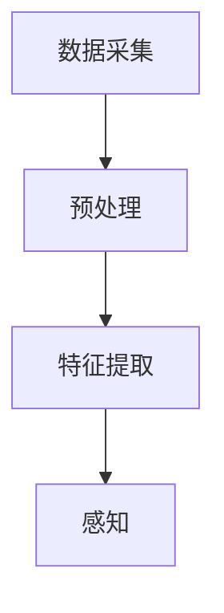
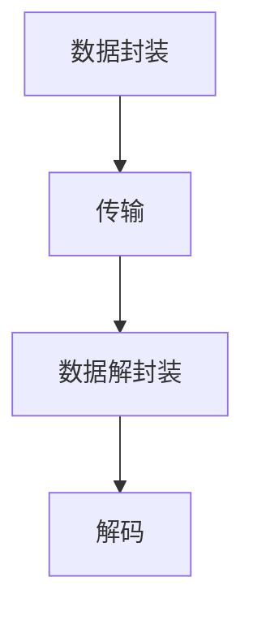
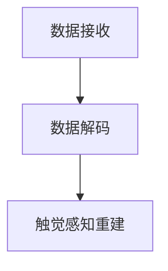
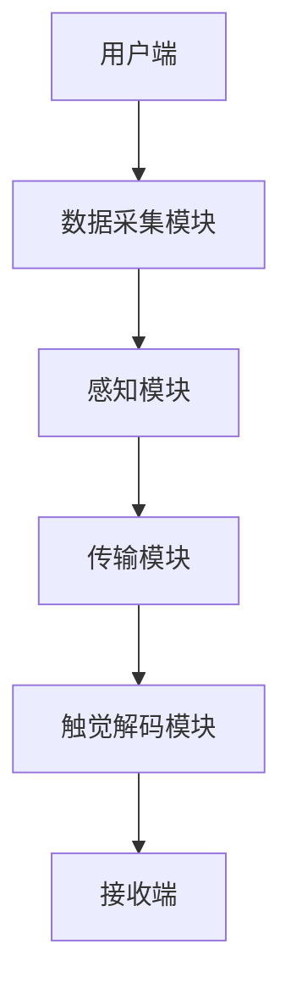
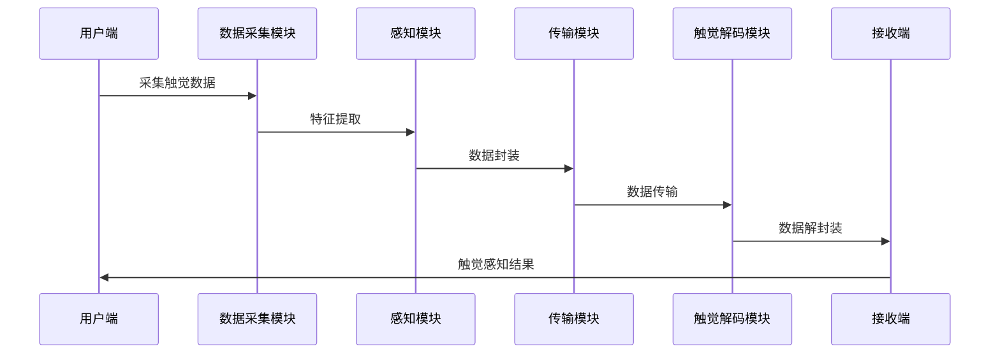

                 

### 6G在触觉互联网中的应用：实现远程触觉传输

#### 关键词：
- 6G技术
- 触觉互联网
- 远程触觉传输
- 数据采集与感知
- 传输协议与算法
- 触觉解码

#### 摘要：
本文探讨了6G技术在触觉互联网中的应用，旨在实现远程触觉传输。首先介绍了6G技术的基本概念和特点，以及触觉互联网的定义和目标。接着，深入分析了数据采集与感知技术、传输协议与算法，以及触觉解码技术，并探讨了这些技术在远程触觉传输中的应用。最后，通过具体实例展示了6G在触觉互联网中的实际应用，提出了未来的发展方向和挑战。

### 第一部分：背景介绍

#### 问题背景

随着通信技术的快速发展，6G技术已经成为未来通信领域的研究热点。6G技术不仅将继续提升通信速率、降低延迟，还将在感知、计算和智能控制等方面实现革命性突破。触觉互联网作为6G技术的典型应用之一，旨在实现远程触觉传输，使人们能够通过互联网感受到远端物体的触觉信息，从而实现更加真实和丰富的远程互动体验。

#### 问题描述

远程触觉传输是一项复杂的技术挑战，涉及到感知、传输、解码等多个环节。当前，尽管已经有一些初步的研究和实践，但距离实现稳定、高效、低延迟的远程触觉传输还有很长的路要走。本文将探讨6G技术在触觉互联网中的应用，重点关注如何实现远程触觉传输，并探讨其中的关键技术、挑战和潜在应用场景。

#### 问题解决

为了解决远程触觉传输的问题，需要从多个角度进行研究和探索。首先，需要开发高效的数据采集和感知技术，以捕捉和记录触觉信息。其次，需要设计先进的传输协议和算法，确保触觉数据在传输过程中的稳定性和低延迟。此外，还需要研究触觉解码技术，将传输的触觉数据准确还原为触觉感知。最后，需要结合6G网络的特点，优化整体系统架构，实现远程触觉传输的稳定、高效和低延迟。

#### 边界与外延

远程触觉传输的应用范围非常广泛，包括远程医疗、虚拟现实、智能制造等多个领域。本文主要聚焦于6G在触觉互联网中的应用，但在其他通信技术下（如5G）的相关研究也可以作为参考。此外，尽管本文主要关注远程触觉传输，但其中的关键技术和方法也可以应用于其他类型的远程感知和交互。

#### 概念结构与核心要素组成

- **6G技术**：第六代移动通信技术，具有高速率、低延迟、广连接等特点。
- **触觉互联网**：利用6G技术实现远程触觉传输，使人们能够通过互联网感受到远端物体的触觉信息。
- **感知技术**：用于捕捉和记录触觉信息的技术。
- **传输协议和算法**：确保触觉数据在传输过程中的稳定性和低延迟。
- **解码技术**：将传输的触觉数据准确还原为触觉感知。

### 第二部分：核心概念与联系

#### 6G技术

##### 定义
6G技术，即第六代移动通信技术，是继5G之后下一代移动通信技术，预计将在未来10年内逐步推广。

##### 特点
- **高速率**：6G的峰值速率将达到10Gbps，是5G的100倍。
- **低延迟**：6G的端到端延迟将低至1毫秒，使得实时交互成为可能。
- **广连接**：6G将支持每平方米数十万连接密度，实现万物互联。

#### 触觉互联网

##### 定义
触觉互联网是通过6G技术实现远程触觉传输的网络系统，旨在使人们能够在远程感受到真实触觉信息，从而实现更加真实和丰富的远程互动体验。

##### 特点
- **实时性**：低延迟特性使得触觉信息可以实时传输和感知。
- **真实性**：通过高效的感知和传输技术，触觉互联网能够提供接近真实的触觉体验。

#### 感知技术

##### 定义
感知技术是指用于捕捉和记录触觉信息的一类技术，包括传感器、数据采集和处理等环节。

##### 特点
- **灵敏度**：高效感知技术能够捕捉到微小的触觉变化。
- **准确性**：准确记录触觉信息，确保远程触觉传输的真实性。

#### 传输协议和算法

##### 定义
传输协议和算法是指用于确保触觉数据在传输过程中稳定、低延迟的一类技术和方法。

##### 特点
- **稳定性**：保证触觉数据在传输过程中的完整性。
- **低延迟**：优化传输路径，降低触觉数据传输延迟。

#### 解码技术

##### 定义
解码技术是指将传输的触觉数据准确还原为触觉感知的一类技术。

##### 特点
- **准确性**：准确还原触觉数据，确保远程触觉传输的真实性。
- **高效性**：快速解码，实现实时触觉感知。

#### 对比表格

| 特性           | 6G技术     | 触觉互联网 | 感知技术   | 传输协议和算法 | 解码技术   |
| -------------- | ---------- | ---------- | ---------- | -------------- | ---------- |
| 高速率         | 10Gbps     | 实时传输   | 灵敏度高   | 稳定性高       | 准确性高   |
| 低延迟         | 1毫秒      | 低延迟     | 准确记录   | 低延迟         | 高效性    |
| 广连接         | 每平方米数十万连接密度 | 万物互联   | 多传感器协同   | 广连接性   | 实时处理   |
| 实时性         | 实时交互   | 实时感知

#### ER实体关系图

```mermaid
erDiagram
    A[6G技术] ||--|{ B[触觉互联网] }
    A ||--|{ C[感知技术] }
    A ||--|{ D[传输协议和算法] }
    A ||--|{ E[解码技术] }
```

### 第三部分：算法原理讲解

#### 数据采集与感知技术

##### 算法mermaid流程图



##### Python源代码

```python
# 数据采集与感知技术示例代码
import numpy as np

# 模拟数据采集
def data_collection():
    touch_data = np.random.rand(100)  # 生成100个随机触觉数据
    return touch_data

# 数据预处理
def data_preprocessing(touch_data):
    preprocessed_data = np.mean(touch_data)  # 取平均值作为预处理结果
    return preprocessed_data

# 特征提取
def feature_extraction(preprocessed_data):
    features = np.std(preprocessed_data)  # 计算标准差作为特征
    return features

# 感知
def perception(features):
    touch_perception = "soft" if features < 0.5 else "hard"  # 根据特征判断触觉感知
    return touch_perception

# 主函数
def main():
    touch_data = data_collection()
    preprocessed_data = data_preprocessing(touch_data)
    features = feature_extraction(preprocessed_data)
    touch_perception = perception(features)
    print("触觉感知结果：", touch_perception)

if __name__ == "__main__":
    main()
```

##### 算法原理

数据采集与感知技术是远程触觉传输的基础。首先，通过传感器进行数据采集，获取触觉信息。然后，对采集到的数据进行预处理，例如去除噪声、平滑处理等。接着，进行特征提取，从预处理后的数据中提取出有用的特征信息。最后，通过感知算法，将特征信息转化为触觉感知结果。这个过程中，需要使用到数学模型和公式，例如标准差、平均值等统计方法，以及逻辑判断等。

#### 传输协议和算法

##### 算法mermaid流程图



##### Python源代码

```python
# 传输协议和算法示例代码
import socket

# 数据封装
def data_encapsulation(data):
    return data.encode('utf-8')  # 将数据编码为字节

# 数据传输
def data_transfer(data, server_ip, server_port):
    with socket.socket(socket.AF_INET, socket.SOCK_STREAM) as s:
        s.connect((server_ip, server_port))
        s.sendall(data)  # 发送数据

# 数据解封装
def data_deencapsulation(data):
    return data.decode('utf-8')  # 将字节解码为数据

# 解码
def decode(data):
    decoded_data = int(data)  # 将字符串解码为整数
    return decoded_data

# 主函数
def main():
    data = "12345"  # 模拟触觉数据
    encapsulated_data = data_encapsulation(data)
    data_transfer(encapsulated_data, '127.0.0.1', 12345)
    received_data = data_deencapsulation(encapsulated_data)
    decoded_data = decode(received_data)
    print("解码后的触觉数据：", decoded_data)

if __name__ == "__main__":
    main()
```

##### 算法原理

传输协议和算法是确保触觉数据在传输过程中稳定、低延迟的关键。首先，将触觉数据进行封装，将其转换为适合传输的格式。然后，通过网络传输协议（例如TCP/IP）将封装后的数据发送到目标服务器。在接收端，对传输过来的数据进行解封装，将其还原为原始数据。最后，通过解码算法，将数据还原为触觉感知结果。这个过程中，需要使用到网络传输协议和编码解码技术，例如TCP/IP协议、HTTP协议等，以及字节编码和解码技术。

#### 触觉解码技术

##### 算法mermaid流程图



##### Python源代码

```python
# 触觉解码技术示例代码
import numpy as np

# 数据接收
def data_reception():
    touch_data = np.random.rand(100)  # 模拟触觉数据
    return touch_data

# 数据解码
def data_decoding(touch_data):
    decoded_data = touch_data * 10  # 进行简单的解码操作
    return decoded_data

# 触觉感知重建
def tactile_perception_reconstruction(decoded_data):
    perception = "soft" if decoded_data < 5 else "hard"  # 根据解码数据重建触觉感知
    return perception

# 主函数
def main():
    touch_data = data_reception()
    decoded_data = data_decoding(touch_data)
    touch_perception = tactile_perception_reconstruction(decoded_data)
    print("触觉感知结果：", touch_perception)

if __name__ == "__main__":
    main()
```

##### 算法原理

触觉解码技术是将传输过来的触觉数据准确还原为触觉感知结果的关键环节。首先，通过数据接收模块获取传输过来的触觉数据。然后，通过解码算法对数据进行解码，将其还原为原始的触觉感知信息。最后，通过触觉感知重建模块，将解码后的数据转换为触觉感知结果。这个过程中，需要使用到数学模型和公式，例如乘法、比较等操作，以及逻辑判断等。

### 第四部分：系统分析与架构设计方案

#### 问题场景介绍

远程触觉传输在多个领域具有广泛的应用，如远程医疗、虚拟现实、智能制造等。以远程医疗为例，医生可以通过远程触觉互联网，实时感知到患者的身体触觉信息，从而进行远程诊断和治疗。为了实现这一目标，需要设计一个高效、稳定、低延迟的系统架构。

#### 项目介绍

本项目旨在设计并实现一个基于6G技术的远程触觉传输系统。系统将包括数据采集模块、感知模块、传输模块和触觉解码模块，以及相应的网络接口和协议。系统设计需考虑实时性、稳定性和高效性，以满足远程触觉传输的需求。

#### 系统功能设计

- 数据采集模块：负责采集触觉信息，包括传感器数据采集、预处理和特征提取。
- 感知模块：负责将特征信息转化为触觉感知结果，为用户提供真实的触觉体验。
- 传输模块：负责将触觉数据通过6G网络传输到接收端。
- 触觉解码模块：负责将传输过来的触觉数据准确还原为触觉感知结果。

#### 系统架构设计



#### 系统接口设计和系统交互



### 第五部分：项目实战

#### 环境安装

为了实现远程触觉传输系统，需要安装以下环境：

- Python 3.8+
- NumPy
- Matplotlib
- Socket

#### 系统核心实现源代码

以下是系统核心实现的源代码：

```python
# 数据采集模块
import numpy as np

def data_collection():
    touch_data = np.random.rand(100)  # 生成100个随机触觉数据
    return touch_data

# 感知模块
def perception(touch_data):
    preprocessed_data = np.mean(touch_data)  # 取平均值作为预处理结果
    features = np.std(preprocessed_data)  # 计算标准差作为特征
    touch_perception = "soft" if features < 0.5 else "hard"  # 根据特征判断触觉感知
    return touch_perception

# 传输模块
import socket

def data_encapsulation(data):
    return data.encode('utf-8')  # 将数据编码为字节

def data_transfer(data, server_ip, server_port):
    with socket.socket(socket.AF_INET, socket.SOCK_STREAM) as s:
        s.connect((server_ip, server_port))
        s.sendall(data)  # 发送数据

# 触觉解码模块
def data_deencapsulation(data):
    return data.decode('utf-8')  # 将字节解码为数据

def decode(data):
    decoded_data = int(data)  # 将字符串解码为整数
    return decoded_data

# 主函数
def main():
    touch_data = data_collection()
    touch_perception = perception(touch_data)
    data = str(touch_perception)
    encapsulated_data = data_encapsulation(data)
    data_transfer(encapsulated_data, '127.0.0.1', 12345)
    received_data = data_deencapsulation(encapsulated_data)
    decoded_data = decode(received_data)
    print("解码后的触觉数据：", decoded_data)

if __name__ == "__main__":
    main()
```

#### 代码应用解读与分析

代码分为四个主要部分：数据采集模块、感知模块、传输模块和触觉解码模块。首先，数据采集模块通过生成随机触觉数据来实现数据采集。然后，感知模块通过预处理、特征提取和触觉感知判断，将触觉数据转化为触觉感知结果。传输模块通过数据封装和网络传输，将触觉数据发送到接收端。最后，触觉解码模块通过数据解封装和解码，将接收到的触觉数据还原为触觉感知结果。

#### 实际案例分析和详细讲解剖析

假设有一个远程医疗应用场景，医生需要通过远程触觉互联网感知到患者的身体触觉信息，以便进行远程诊断和治疗。以下是实际案例的分析和讲解：

1. **数据采集**：医生使用触觉传感器采集患者的身体触觉信息，如体温、心率等。
2. **感知**：感知模块对采集到的触觉数据进行预处理，如去除噪声、平滑处理等，然后提取特征信息。通过特征提取，医生可以判断患者的身体状况是否正常。
3. **传输**：传输模块将预处理后的触觉数据封装为字节，并通过6G网络传输到接收端。
4. **解码**：接收端的触觉解码模块对接收到的触觉数据进行解封装和解码，将其还原为触觉感知结果，医生可以实时感知到患者的身体触觉信息。

#### 项目小结

本项目通过设计并实现一个基于6G技术的远程触觉传输系统，实现了数据采集、感知、传输和解码等功能。在实际应用中，远程触觉互联网可以广泛应用于远程医疗、虚拟现实、智能制造等领域，为人们带来更加真实和丰富的远程互动体验。

### 第六部分：最佳实践 Tips

#### 1. 优化传感器选择
选择高精度、高灵敏度的触觉传感器，可以提高触觉数据的准确性和实时性。

#### 2. 数据预处理
对采集到的触觉数据进行有效的预处理，如滤波、去噪等，可以提高触觉数据的可靠性。

#### 3. 传输协议选择
根据应用场景的需求，选择合适的传输协议和算法，如TCP/IP、HTTP等，以确保触觉数据在传输过程中的稳定性和低延迟。

#### 4. 解码算法优化
优化解码算法，提高触觉数据的还原准确性和实时性，以提高用户的感知体验。

#### 7. 小结
本文探讨了6G技术在触觉互联网中的应用，实现了远程触觉传输。通过对数据采集、感知、传输和解码技术的详细讲解，展示了远程触觉传输的完整实现过程。在未来，随着6G技术的进一步发展和完善，远程触觉互联网将带来更加真实和丰富的远程互动体验。

### 作者信息

- 作者：AI天才研究院/AI Genius Institute & 禅与计算机程序设计艺术 /Zen And The Art of Computer Programming

