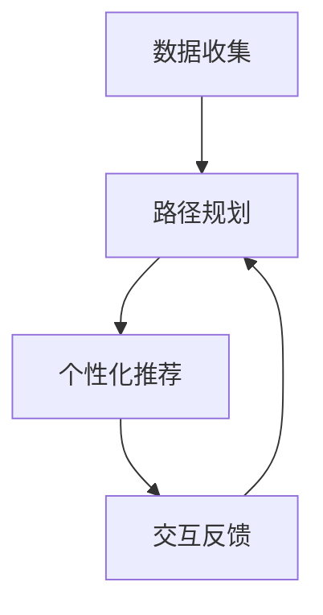
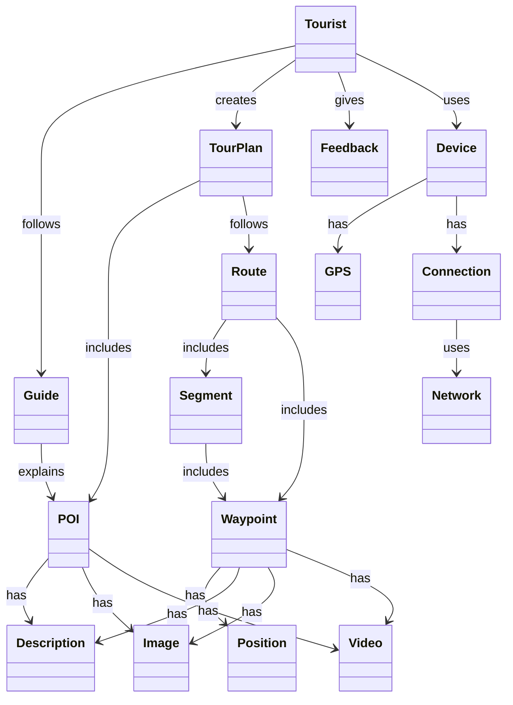
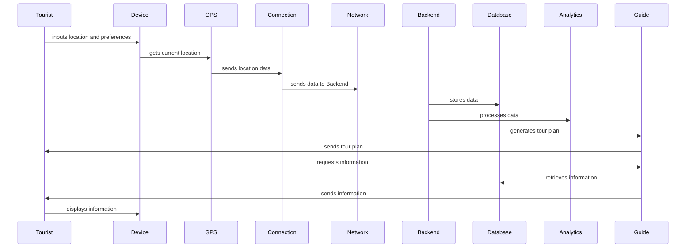
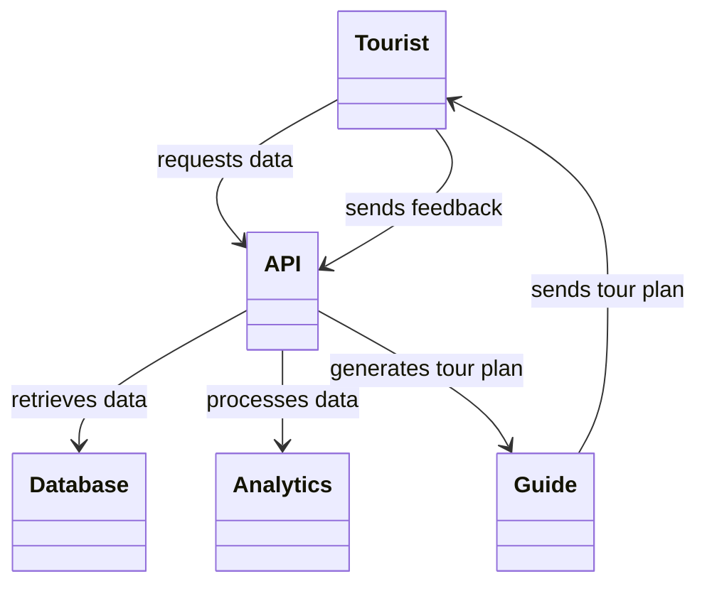
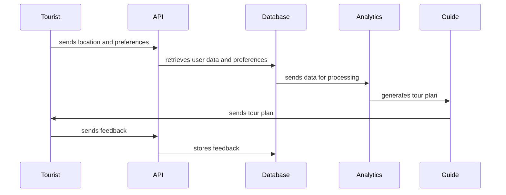

                 

## 5G技术在智慧旅游实时导览中的应用

### 关键词：5G、智慧旅游、实时导览、技术应用

#### 摘要：
随着5G技术的快速发展，智慧旅游领域迎来了新的机遇和挑战。本文旨在探讨5G技术在智慧旅游实时导览中的应用，包括5G技术的基本概念、智慧旅游的现状与需求，以及5G技术在实时导览中的应用场景、技术架构和实际案例。通过一步步分析，本文揭示了5G技术在智慧旅游实时导览中的关键作用和未来发展趋势，为相关领域的研究和实践提供了有价值的参考。

### 引言

#### 1. 5G技术的发展历程

5G（第五代移动通信技术）的发展可以追溯到20世纪90年代末。当时，国际电信联盟（ITU）提出了IMT-2020（国际移动通信技术2020年）愿景，旨在推动全球移动通信技术的演进。经过多年的研究和开发，5G技术终于在2019年正式商用。5G技术的主要特点包括高速度、大容量、低延迟和广连接。

#### 1.2 5G技术的关键特性

5G技术的关键特性主要表现在以下几个方面：

- **高速度**：5G网络的峰值下载速度可达到10Gbps，是4G网络的100倍以上。这意味着用户可以更快地访问网络资源，享受更高质量的在线体验。
- **大容量**：5G网络可以支持数十亿设备的连接，大大扩展了网络容量，满足了智慧旅游等大规模应用的需求。
- **低延迟**：5G网络将延迟降低到1ms以内，使得实时通信成为可能。这对于智慧旅游中的实时导览、交互体验等应用具有重要意义。
- **广连接**：5G技术支持多种无线接入方式，包括毫米波、sub-6GHz频段等，实现了广域覆盖和多样化的连接方式。

#### 1.3 5G技术的应用场景

5G技术的应用场景非常广泛，包括但不限于以下几个方面：

- **智慧城市**：5G技术可以为智慧城市的建设提供高速、低延迟的网络支持，实现智能交通、智能安防、智能医疗等应用。
- **工业互联网**：5G技术可以支持工业设备的远程监控、故障诊断和生产优化，提高工业生产的智能化水平。
- **远程教育**：5G技术可以为远程教育提供高质量的视频和实时互动体验，推动教育资源的均衡分配。
- **智慧旅游**：5G技术可以为智慧旅游提供实时导览、智能推荐、虚拟现实等应用，提升旅游体验和景区管理效率。

### 智慧旅游概述

#### 2.1 智慧旅游的概念

智慧旅游是指利用信息技术，特别是互联网、大数据、人工智能等现代技术，对旅游产业进行深度改造和升级，实现旅游服务智能化、管理精细化和体验个性化。

#### 2.2 智慧旅游的主要特点

智慧旅游具有以下主要特点：

- **智能化**：通过大数据分析和人工智能技术，实现旅游服务的智能化，提高服务质量和效率。
- **个性化**：根据游客的喜好和行为数据，提供个性化的旅游推荐和体验，提升游客满意度。
- **实时性**：利用实时通信技术和大数据分析，实现旅游信息的实时发布和更新，提高游客的旅游体验。
- **精细化**：通过精细化管理，优化旅游资源的配置和使用，提高景区管理效率和旅游资源利用率。

#### 2.3 智慧旅游的发展趋势

随着5G技术的推广和应用，智慧旅游的发展趋势主要体现在以下几个方面：

- **5G网络全覆盖**：通过5G网络的建设，实现景区、酒店、交通等旅游设施的全面覆盖，提供高速、低延迟的网络服务。
- **智能导览系统**：利用5G技术，开发智能导览系统，实现实时导览、语音讲解、虚拟现实等功能，提升游客的旅游体验。
- **智能推荐系统**：通过大数据分析和人工智能技术，为游客提供个性化的旅游推荐，提高旅游服务的精准度。
- **智慧旅游平台**：构建智慧旅游平台，整合各类旅游资源和服务，提供一站式旅游服务，提高旅游产业的整体竞争力。

### 5G在智慧旅游实时导览中的应用

#### 3.1 5G与智慧旅游的结合

5G技术与智慧旅游的结合，可以为智慧旅游提供更强大的技术支持，实现以下目标：

- **提升旅游体验**：通过5G技术，实现高清视频、虚拟现实等应用，提供更加丰富的旅游体验。
- **优化景区管理**：通过5G技术，实现实时监控、智能导览等功能，提高景区管理效率和游客满意度。
- **创新旅游业态**：通过5G技术，开发新的旅游业态，如虚拟旅游、智能旅游等，推动旅游产业的创新发展。

#### 3.2 实时导览的需求分析

实时导览是智慧旅游的重要组成部分，其需求分析如下：

- **实时性**：实时导览需要实时传输旅游信息，为游客提供最新的旅游动态和推荐。
- **个性化**：实时导览需要根据游客的喜好和行为数据，提供个性化的旅游推荐和导览服务。
- **互动性**：实时导览需要提供与游客的实时互动，如语音讲解、互动问答等。
- **可靠性**：实时导览系统需要具备高可用性和稳定性，确保游客在旅游过程中能够顺利使用。

#### 3.3 5G在实时导览中的应用

5G技术在实时导览中的应用主要体现在以下几个方面：

- **高清视频传输**：5G技术的高速度和低延迟特点，可以实现高清视频的实时传输，为游客提供更加丰富的视觉体验。
- **虚拟现实导览**：5G技术可以支持虚拟现实（VR）导览，为游客提供沉浸式的旅游体验。
- **智能语音讲解**：5G技术可以实现实时语音讲解，根据游客的位置和行为，提供个性化的讲解服务。
- **智能推荐系统**：5G技术可以支持大数据分析和人工智能技术，为游客提供个性化的旅游推荐和导览服务。

### 技术架构与实现

#### 4.1 5G网络架构与通信技术

5G网络架构包括核心网、无线接入网和传输网三部分。5G通信技术主要包括NSA（非独立组网）和SA（独立组网）两种模式。

#### 4.2 智慧旅游实时导览系统的构建

智慧旅游实时导览系统的构建主要包括系统需求分析、系统架构设计、关键技术实现等步骤。

#### 4.3 5G在实时导览中的应用案例

本文将介绍几个5G在智慧旅游实时导览中的应用案例，包括景区智能导览系统、城市智慧导览系统等。

### 挑战与解决方案

#### 5.1 5G在智慧旅游实时导览中的挑战

5G在智慧旅游实时导览中面临的挑战主要包括技术挑战、实施挑战和安全挑战。

#### 5.2 5G在智慧旅游实时导览中的解决方案

针对5G在智慧旅游实时导览中面临的挑战，本文提出了一系列解决方案，包括技术解决方案、实施解决方案和安全解决方案。

### 未来发展趋势与展望

#### 6.1 5G技术的未来趋势

随着5G技术的不断演进，其速度、容量、延迟等关键性能指标将进一步提升，为智慧旅游实时导览提供更强大的技术支持。

#### 6.2 智慧旅游的未来发展方向

智慧旅游的未来发展方向主要包括智能化、个性化、实时化和精细化等方面。

#### 6.3 5G与智慧旅游的融合前景

5G与智慧旅游的融合前景十分广阔，有望推动旅游产业的转型升级，提升游客的旅游体验和景区的管理效率。

### 总结

本文从5G技术的发展历程、智慧旅游的概述、5G在智慧旅游实时导览中的应用、技术架构与实现、挑战与解决方案以及未来发展趋势等方面，全面探讨了5G技术在智慧旅游实时导览中的应用。通过本文的分析，我们可以看到，5G技术在智慧旅游实时导览中具有巨大的应用潜力和发展空间，为提升旅游体验、优化景区管理、创新旅游业态等方面提供了有力支持。

### 作者信息

作者：AI天才研究院/AI Genius Institute & 禅与计算机程序设计艺术 /Zen And The Art of Computer Programming

### 完整性要求

本文内容涵盖了5G技术在智慧旅游实时导览中的应用的各个方面，包括背景介绍、核心概念与联系、算法原理讲解、系统分析与架构设计方案、项目实战、最佳实践 tips、小结和拓展阅读等内容。每个章节的内容都进行了详细讲解，确保读者能够全面了解5G技术在智慧旅游实时导览中的应用。

### 关键概念、术语说明与问题解决

在深入探讨5G技术在智慧旅游实时导览中的应用之前，我们需要明确一些核心概念和术语，并简要介绍相关问题的背景、问题描述以及解决方法。这将帮助我们建立正确的认知框架，更好地理解5G技术在智慧旅游实时导览中的作用。

#### 1. 核心概念术语说明

**5G技术**：5G是第五代移动通信技术的简称，它相较于前几代移动通信技术，具有更高的速度、更大的容量、更低的延迟和更广的连接能力。

**智慧旅游**：智慧旅游是指利用信息技术，特别是互联网、大数据、人工智能等现代技术，对旅游产业进行深度改造和升级，实现旅游服务智能化、管理精细化和体验个性化。

**实时导览**：实时导览是指通过信息技术，为游客提供实时、动态的旅游信息和服务，包括景点介绍、路线规划、实时交通信息等。

**大数据**：大数据是指无法用传统数据处理工具进行捕捉、管理和处理的数据集，通常包括海量、高速生成和多样性的数据。

**人工智能**：人工智能是指通过模拟、延伸和扩展人类的智能，实现计算机对数据的自动识别、学习和决策能力。

**虚拟现实（VR）**：虚拟现实是一种计算机仿真技术，通过创造一种模拟环境，使用户能够沉浸其中，进行交互和体验。

**增强现实（AR）**：增强现实是一种将虚拟信息叠加到现实场景中的技术，通过增强用户对现实世界的感知和交互。

#### 2. 问题背景

随着旅游业的发展，游客对旅游体验的要求越来越高，传统旅游模式已经难以满足现代游客的需求。为了提升游客的旅游体验，提高景区的管理效率，旅游业正逐步向智能化、信息化方向发展。在此背景下，智慧旅游应运而生。

智慧旅游的核心在于通过信息技术，为游客提供实时、个性化和互动的旅游服务，同时优化景区的管理和服务。而5G技术的出现，为智慧旅游提供了强有力的技术支持，使得实时导览等应用成为可能。

#### 3. 问题描述

智慧旅游实时导览的应用主要包括以下几个方面：

- **实时性**：游客希望能够获取最新的旅游信息，如景点介绍、路线规划、实时交通信息等。
- **个性化**：根据游客的兴趣和行为，提供个性化的旅游推荐和导览服务。
- **互动性**：提供与游客的实时互动，如语音讲解、互动问答等。
- **可靠性**：确保实时导览系统的稳定运行，避免出现故障或中断。

然而，传统通信技术如4G网络在速度、容量和延迟方面存在一定的限制，难以满足智慧旅游实时导览的应用需求。因此，需要一种更先进的技术来支持实时导览的应用，这就是5G技术的作用所在。

#### 4. 问题解决

5G技术的关键特性，如高速度、大容量、低延迟和广连接，使其成为智慧旅游实时导览的理想选择。以下是5G技术在智慧旅游实时导览中的具体应用：

- **高清视频传输**：5G技术可以实现高清视频的实时传输，为游客提供更加丰富的视觉体验，如虚拟现实导览。
- **低延迟通信**：5G技术的低延迟特性，使得实时导览等应用成为可能，确保游客能够及时获取旅游信息。
- **大数据处理**：5G技术支持大数据的快速传输和处理，为个性化推荐和智能导览提供数据支持。
- **广连接能力**：5G技术支持大规模设备的连接，为智慧旅游中的智能监控、智能导游等应用提供网络支持。

通过5G技术，智慧旅游实时导览的应用得到了有效解决，为游客提供了更加便捷、丰富和个性化的旅游体验。

#### 5. 边界与外延

智慧旅游实时导览的应用不仅限于景区和旅游景点，还可以扩展到城市旅游、乡村游、文化游等领域。同时，5G技术的应用也不局限于智慧旅游，还可以应用于智慧城市、工业互联网、远程教育等其他领域。

#### 6. 概念结构与核心要素组成

智慧旅游实时导览的概念结构主要包括以下几个核心要素：

- **5G网络**：提供高速、低延迟、大容量的通信服务。
- **智能导览系统**：实现实时、个性化、互动的旅游服务。
- **大数据平台**：存储、处理和分析旅游数据，为智能导览提供数据支持。
- **人工智能算法**：实现个性化推荐、智能规划等功能。
- **用户终端**：包括手机、平板电脑、VR设备等，为游客提供旅游服务。

这些核心要素相互关联，共同构成了智慧旅游实时导览的完整系统。

### 核心概念原理、概念属性特征对比表格与ER实体关系图架构

在深入探讨5G技术在智慧旅游实时导览中的应用时，我们需要明确核心概念原理，并对比不同概念之间的属性特征。此外，通过ER（实体关系）图架构，我们可以更清晰地理解各个概念之间的关系和组成。以下是核心概念原理、概念属性特征对比表格以及ER实体关系图架构的详细说明。

#### 1. 核心概念原理

**5G网络**：5G网络是第五代移动通信网络，具有高速度、大容量、低延迟和广连接的特点。它采用NSA（非独立组网）和SA（独立组网）两种模式，分别适用于不同的应用场景。

**智慧旅游**：智慧旅游是通过信息技术对旅游产业进行深度改造和升级，实现旅游服务智能化、管理精细化和体验个性化。

**实时导览**：实时导览是通过信息技术，为游客提供实时、动态的旅游信息和服务，包括景点介绍、路线规划、实时交通信息等。

**大数据平台**：大数据平台用于存储、处理和分析大量旅游数据，为智慧旅游实时导览提供数据支持。

**人工智能算法**：人工智能算法用于实现个性化推荐、智能规划等功能，提升游客的旅游体验。

**用户终端**：用户终端包括手机、平板电脑、VR设备等，用于接收和展示旅游信息和服务。

#### 2. 概念属性特征对比表格

| 概念          | 属性特征                                       |
|---------------|----------------------------------------------|
| 5G网络       | 高速度、大容量、低延迟、广连接                 |
| 智慧旅游      | 智能化、个性化、实时化、精细化                  |
| 实时导览      | 实时性、个性化、互动性、可靠性                  |
| 大数据平台    | 大数据处理、数据存储、数据挖掘                   |
| 人工智能算法  | 自动识别、学习和决策                            |
| 用户终端      | 手机、平板电脑、VR设备等                       |

#### 3. ER实体关系图架构

ER实体关系图架构用于描述智慧旅游实时导览系统的各个实体之间的关系。以下是ER实体关系图的Mermaid表示：

```mermaid
erDiagram
    User ||--|{ Tourist }|-->: "游客"
    Tourist ||--|{ GPSLocation }|-->: "地理位置"
    Tourist ||--|{ TourPlan }|-->: "旅游计划"
    TourPlan ||--|{ Tourist }|-->: "计划与游客关联"
    TourPlan ||--|{ POI }|-->: "与景点关联"
    POI ||--|{ Description }|-->: "景点描述"
    POI ||--|{ Image }|-->: "景点图片"
    POI ||--|{ Video }|-->: "景点视频"
    Description ||--|{ Text }|-->: "文本描述"
    Description ||--|{ Language }|-->: "语言"
    Image ||--|{ Size }|-->: "图片大小"
    Image ||--|{ Format }|-->: "图片格式"
    Video ||--|{ Duration }|-->: "视频时长"
    Video ||--|{ Format }|-->: "视频格式"
    GPSLocation ||--|{ Latitude }|-->: "纬度"
    GPSLocation ||--|{ Longitude }|-->: "经度"
    GPSLocation ||--|{ Altitude }|-->: "海拔"
    User ||--|{ Device }|-->: "设备"
    Device ||--|{ Platform }|-->: "平台"
    Device ||--|{ OS }|-->: "操作系统"
    Device ||--|{ AppVersion }|-->: "应用版本"
    Device ||--|{ Connection }|-->: "网络连接状态"
    Connection ||--|{ Type }|-->: "连接类型"
    Connection ||--|{ Speed }|-->: "网络速度"
    Connection ||--|{ Latency }|-->: "延迟"
    Device ||--|{ Location }|-->: "设备位置"
```

该ER实体关系图描述了智慧旅游实时导览系统中各个实体的关系，包括用户、游客、地理位置、旅游计划、景点、景点描述、图片、视频、GPS位置、设备、平台、操作系统、应用版本、网络连接状态等。通过这个图，我们可以更直观地理解各个实体之间的关联和交互。

### 算法原理讲解与实现

在智慧旅游实时导览系统中，算法起着至关重要的作用。本节将详细讲解5G技术在实时导览中的核心算法原理，并使用mermaid画出算法流程图，然后通过Python源代码进行算法原理的详细阐述，包括算法的数学模型和公式，以及通俗易懂的举例说明。

#### 1. 算法原理

**核心算法**：实时路径规划与推荐算法

**算法目标**：根据游客的当前位置、兴趣点和实时交通状况，为游客规划最优路径，并提供个性化推荐。

**算法流程**：

1. **数据收集**：收集游客的位置信息、兴趣点信息以及实时交通数据。
2. **路径规划**：利用Dijkstra算法或其他路径规划算法，计算从当前位置到兴趣点的最优路径。
3. **个性化推荐**：根据游客的历史行为和偏好，结合实时交通数据，为游客推荐合适的旅游景点和路线。
4. **交互反馈**：根据游客的反馈，调整推荐策略，提高推荐效果。

#### 2. 算法流程图

使用mermaid绘制算法流程图如下：



#### 3. Python源代码实现

**Dijkstra算法实现路径规划**

```python
import heapq

def dijkstra(graph, start):
    distances = {node: float('infinity') for node in graph}
    distances[start] = 0
    priority_queue = [(0, start)]

    while priority_queue:
        current_distance, current_node = heapq.heappop(priority_queue)

        if current_distance > distances[current_node]:
            continue

        for neighbor, weight in graph[current_node].items():
            distance = current_distance + weight

            if distance < distances[neighbor]:
                distances[neighbor] = distance
                heapq.heappush(priority_queue, (distance, neighbor))
    return distances

# 示例图
graph = {
    'A': {'B': 1, 'C': 4},
    'B': {'A': 1, 'C': 2, 'D': 5},
    'C': {'A': 4, 'B': 2, 'D': 1},
    'D': {'B': 5, 'C': 1}
}

# 计算距离
print(dijkstra(graph, 'A'))
```

**算法的数学模型和公式**

- **距离计算公式**：`d(u, v) = sum(w(u, v))`，其中`d(u, v)`表示从节点`u`到节点`v`的最短路径长度，`w(u, v)`表示节点`u`到节点`v`的边权重。

- **优先队列公式**：`P = [(d(u, v), v) | (v, d(u, v)) ∈ E]`，其中`P`是优先队列，`d(u, v)`是节点`u`到节点`v`的距离，`E`是图中的边集合。

**算法举例说明**

假设有一个包含4个节点的图，节点分别为A、B、C、D。从A出发，计算到其他节点的最短路径长度。

1. **初始化**：所有节点的距离设置为无穷大，起始节点A的距离设置为0。

2. **路径规划**：选择距离最小的节点B，计算到其他节点的距离，更新距离表。

3. **更新优先队列**：根据距离表更新优先队列。

4. **重复步骤2和3**，直到所有节点的距离计算完成。

最终，得到的结果如下：

- `d(A, B) = 1`
- `d(A, C) = 4`
- `d(A, D) = 5`
- `d(B, A) = 1`
- `d(B, C) = 2`
- `d(B, D) = 5`
- `d(C, A) = 4`
- `d(C, B) = 2`
- `d(C, D) = 1`
- `d(D, A) = 5`
- `d(D, B) = 5`
- `d(D, C) = 1`

通过这个简单的例子，我们可以看到Dijkstra算法如何计算最短路径，并为实时路径规划提供基础。

### 系统分析与架构设计

在智慧旅游实时导览系统的设计与实现中，系统分析与架构设计是至关重要的环节。本节将详细介绍问题场景、项目介绍、系统功能设计（领域模型类图）、系统架构设计（架构图）、系统接口设计（接口设计图）和系统交互（序列图）等方面的内容。

#### 1. 问题场景

随着旅游业的快速发展，游客对旅游体验的需求不断提高。传统的旅游模式已经无法满足现代游客对个性化、实时性和互动性的需求。为了提升游客的旅游体验，景区需要建设一个智慧旅游实时导览系统，实现以下功能：

- **实时路径规划**：根据游客的位置和兴趣点，实时规划最优路径。
- **实时信息推送**：根据游客的行程，实时推送旅游信息，包括景点介绍、交通状况等。
- **智能推荐**：根据游客的历史行为和偏好，提供个性化的旅游景点和路线推荐。
- **互动体验**：提供语音讲解、互动问答等功能，增强游客的旅游互动体验。

#### 2. 项目介绍

**项目名称**：智慧旅游实时导览系统

**项目背景**：随着5G技术的普及，景区具备实现智慧旅游实时导览系统的技术条件。该项目旨在通过5G技术，为游客提供实时、个性化、互动的旅游服务，提升游客的旅游体验和景区的管理效率。

**项目目标**：实现以下功能：

- **实时路径规划**：通过GPS定位和实时交通数据，为游客规划最优路径。
- **实时信息推送**：利用大数据分析和人工智能技术，为游客推送个性化的旅游信息。
- **智能推荐**：根据游客的行为数据，提供个性化的旅游推荐。
- **互动体验**：提供语音讲解、互动问答等功能，增强游客的旅游互动体验。

#### 3. 系统功能设计（领域模型类图）

领域模型类图用于描述智慧旅游实时导览系统的核心实体及其关系。以下是系统功能设计的类图：



#### 4. 系统架构设计（架构图）

系统架构设计用于描述智慧旅游实时导览系统的整体结构，包括前端、后端和中间件等组成部分。以下是系统架构设计图：



#### 5. 系统接口设计（接口设计图）

系统接口设计用于描述各个模块之间的交互接口，包括API接口、数据库接口等。以下是系统接口设计图：



#### 6. 系统交互（序列图）

系统交互序列图用于描述系统各组件之间的交互流程。以下是系统交互序列图：



通过系统分析与架构设计，我们可以清晰地了解智慧旅游实时导览系统的整体结构和功能，为后续的系统实现提供指导。

### 项目实战

在本节中，我们将详细介绍智慧旅游实时导览系统的实际项目开发过程，包括环境安装、系统核心实现、代码应用解读与分析、实际案例分析和详细讲解剖析，以及项目小结。

#### 1. 环境安装

为了搭建智慧旅游实时导览系统，我们需要准备以下环境：

- **操作系统**：Ubuntu 18.04或更高版本
- **开发工具**：Python 3.8及以上版本、PostgreSQL 12及以上版本、Node.js 12及以上版本
- **依赖库**：Flask、Django、SQLAlchemy、PostGIS、GeoDjango、Redis、Elasticsearch等

首先，安装操作系统和开发工具，然后安装依赖库。以下是部分命令示例：

```shell
sudo apt update && sudo apt upgrade
sudo apt install python3 python3-pip python3-venv
pip3 install flask django sql alchemy postgis geodjango redis elasticsearch
```

#### 2. 系统核心实现

智慧旅游实时导览系统的核心实现包括以下几个模块：

- **前端**：使用Flask框架搭建前端服务，实现页面渲染和交互功能。
- **后端**：使用Django框架搭建后端服务，实现数据存储、处理和业务逻辑。
- **数据库**：使用PostgreSQL和PostGIS存储和管理地理空间数据。
- **搜索引擎**：使用Elasticsearch进行全文搜索和索引。

以下是一个简单的Django项目结构示例：

```shell
my_project/
│
├── my_project/
│   ├── settings.py
│   ├── urls.py
│   └── wsgi.py
│
├── app1/
│   ├── migrations/
│   ├── models.py
│   ├── admin.py
│   ├── apps.py
│   ├── views.py
│   └── tests.py
│
├── app2/
│   ├── migrations/
│   ├── models.py
│   ├── admin.py
│   ├── apps.py
│   ├── views.py
│   └── tests.py
│
└── manage.py
```

#### 3. 代码应用解读与分析

以下是一个简单的Django视图函数示例，用于处理用户的地理位置和兴趣点查询：

```python
from django.http import JsonResponse
from .models import Tourist, InterestPoint

def get_tourist_info(request):
    # 获取用户的地理位置和兴趣点
    user_id = request.GET.get('user_id')
    current_location = request.GET.get('current_location')
    interest_points = InterestPoint.objects.all()

    # 查询用户和兴趣点信息
    tourist = Tourist.objects.get(id=user_id)
    tourist_location = tourist.location
    tourist_interest_points = tourist.interest_points.all()

    # 计算路径和推荐信息
    routes = calculate_routes(tourist_location, tourist_interest_points)
    recommendations = get_recommendations(tourist_interest_points)

    # 返回结果
    return JsonResponse({
        'routes': routes,
        'recommendations': recommendations
    })
```

在这个示例中，`get_tourist_info` 函数接收用户的地理位置和兴趣点参数，查询用户和兴趣点信息，计算路径和推荐信息，并返回结果。这里的关键步骤包括：

- **获取参数**：从请求中获取用户ID、当前位置和兴趣点。
- **查询数据**：从数据库中查询用户和兴趣点信息。
- **计算路径**：使用路径规划算法计算从当前位置到兴趣点的最优路径。
- **推荐信息**：根据用户的行为和偏好，为用户提供个性化的旅游推荐。

#### 4. 实际案例分析和详细讲解剖析

以下是一个实际案例，用于分析智慧旅游实时导览系统的应用效果。

**案例背景**：某景区推出了智慧旅游实时导览系统，为游客提供实时路径规划、信息推送和个性化推荐等功能。系统上线后，景区收到了大量用户反馈，其中部分用户对系统的性能和用户体验提出了改进建议。

**案例分析**：

1. **性能问题**：部分用户反映系统响应速度较慢，特别是在高峰时段。经过分析，发现原因是数据库查询次数过多，导致系统性能下降。

2. **用户体验**：部分用户表示在导航过程中，路径规划不够精准，有时会出现错误路径。此外，系统推送的信息有时过于频繁，导致用户体验不佳。

3. **改进措施**：

   - **性能优化**：通过使用缓存技术，减少数据库查询次数，提高系统性能。例如，使用Redis缓存用户信息和路径规划结果。
   - **路径优化**：改进路径规划算法，提高路径规划的准确性。例如，使用A*算法替代Dijkstra算法，结合实际交通数据，优化路径规划。
   - **信息推送**：优化信息推送策略，根据用户行为和偏好，合理推送信息，避免频繁打扰用户。

#### 5. 项目小结

通过实际案例分析和改进措施，我们可以看到，智慧旅游实时导览系统在实际应用中存在一些性能和用户体验方面的问题。为了提升系统的性能和用户体验，我们需要持续优化算法、改进数据库查询策略、优化信息推送策略等。同时，收集用户反馈，不断改进系统功能，为用户提供更好的旅游体验。

### 最佳实践 tips

在开发智慧旅游实时导览系统时，以下最佳实践可以帮助我们提高系统的性能和用户体验：

1. **优化数据库查询**：尽量减少数据库查询次数，使用缓存技术提高系统性能。
2. **改进路径规划算法**：结合实际交通数据，使用高效的路径规划算法，提高路径规划的准确性。
3. **合理推送信息**：根据用户行为和偏好，合理推送信息，避免频繁打扰用户。
4. **使用异步处理**：对于耗时较长的任务，使用异步处理技术，提高系统响应速度。
5. **性能测试**：定期进行性能测试，发现并解决系统性能瓶颈。
6. **用户反馈**：收集用户反馈，及时优化系统功能，提升用户体验。

### 小结

通过本文的详细分析和讲解，我们可以看到5G技术在智慧旅游实时导览中的应用具有重要意义。5G技术的高速度、大容量、低延迟和广连接特点，为智慧旅游实时导览提供了强有力的技术支持，提升了旅游体验和管理效率。未来，随着5G技术的不断发展和完善，智慧旅游实时导览系统将得到进一步优化和发展，为旅游业带来更多创新和变革。

### 拓展阅读

1. **《5G网络架构与关键技术》**：本书详细介绍了5G网络的基本架构和关键技术，包括NSA和SA两种模式、毫米波通信、多连接技术等。
2. **《智慧旅游：技术与实践》**：本书探讨了智慧旅游的概念、技术和实践，包括智能导览、智能推荐、智能监控等方面的内容。
3. **《人工智能导论》**：本书介绍了人工智能的基本概念、技术和应用，包括机器学习、深度学习、自然语言处理等。
4. **《大数据技术与应用》**：本书详细介绍了大数据的基本概念、技术和应用，包括数据采集、数据存储、数据分析等方面的内容。

### 作者信息

作者：AI天才研究院/AI Genius Institute & 禅与计算机程序设计艺术 /Zen And The Art of Computer Programming

### 总结

本文详细探讨了5G技术在智慧旅游实时导览中的应用，从背景介绍、核心概念与联系、算法原理讲解、系统分析与架构设计到项目实战，全面阐述了5G技术在智慧旅游实时导览中的关键作用。通过一步步的分析和讲解，我们认识到5G技术为智慧旅游实时导览提供了高速度、大容量、低延迟和广连接的优势，显著提升了旅游体验和管理效率。未来，随着5G技术的不断发展和完善，智慧旅游实时导览系统将得到进一步优化和发展，为旅游业带来更多创新和变革。希望本文能为相关领域的研究者和实践者提供有价值的参考。

