                 

# IT可持续性：碳足迹成为首要考虑因素

关键词：IT行业、碳足迹、可持续发展、数据中心、能源效率、软件开发

摘要：随着信息技术在全球范围内的迅猛发展，IT行业的环境影响日益显著，特别是碳足迹问题。本文将深入探讨IT行业的碳足迹管理策略，分析数据中心能源效率提升策略、软件开发与运维的碳足迹管理策略以及电子废物处理策略，以期为推动IT行业的可持续发展提供有益参考。

## 第1章 IT可持续性背景介绍

### 1.1 问题背景

#### 1.1.1 IT行业对环境的影响

信息技术（IT）的飞速发展带来了巨大的经济和社会效益，但同时也对环境产生了深远的影响。首先，数据中心是IT行业能耗的主要来源。据统计，全球数据中心的能耗已经超过了全球电力消耗的1%，并且这一数字还在不断增长。此外，电子废料的处理也是一个严峻的环境问题。由于IT设备更新换代速度加快，大量废旧电子设备被淘汰，造成了电子废料的堆积和环境污染。

#### 1.1.2 碳足迹的定义与重要性

碳足迹是指个人、组织或活动产生的温室气体排放量，它反映了活动对气候变化的影响。在IT行业中，碳足迹主要来自于数据中心的能耗、电子废料的处理以及软件的开发与运维。随着人们对气候变化问题的关注日益增加，减少碳足迹成为了企业和社会的重要任务。

#### 1.1.3 可持续性的概念与目标

可持续性是指在满足当前需求的同时，不损害子孙后代满足其需求的能力。在IT行业中，可持续性的目标包括减少能源消耗、降低碳足迹、提高资源利用效率以及促进环保技术的发展。

### 1.2 核心概念

#### 1.2.1 碳足迹管理

碳足迹管理是指通过量化、监测和减少组织或个人的碳足迹的一系列方法。这包括对数据中心的能耗进行监测和管理、优化软件开发与运维过程中的资源利用、推广环保技术和回收利用电子废物等。

#### 1.2.2 能源效率提升

能源效率提升是指通过技术创新和管理优化，降低单位产出的能源消耗。在IT行业中，能源效率提升包括采用高效能硬件、优化数据处理流程、使用节能软件以及推广可再生能源等。

#### 1.2.3 环保技术

环保技术是指用于减少环境影响的创新技术。在IT行业中，环保技术包括可再生能源的使用、废热回收、绿色数据中心建设等。

### 1.3 IT可持续性在实践中的应用

#### 1.3.1 数据中心能源管理

数据中心是IT行业能源消耗的主要来源之一。通过实施能源管理措施，如使用高效能硬件、优化冷却系统、采用虚拟化技术等，可以显著降低数据中心的能耗。

#### 1.3.2 软件开发与运维

软件开发与运维过程中的资源利用效率直接影响着IT行业的碳足迹。通过采用敏捷开发、持续集成与持续部署等现代化开发方法，可以提高开发效率，降低能源消耗。

#### 1.3.3 电子废物处理

电子废物处理是IT行业可持续性的一大挑战。通过建立回收体系、推广回收技术、鼓励用户参与等手段，可以减少电子废料对环境的污染。

### 1.4 本章小结

本章介绍了IT可持续性的背景、核心概念以及在实践中的应用。通过了解这些内容，读者可以更好地理解IT行业在减少碳足迹、实现可持续性方面的责任和挑战。

## 第2章 IT行业的碳足迹管理策略

### 2.1 碳足迹管理的基本概念

#### 2.1.1 碳足迹的定义与测量

碳足迹是指个人、组织或活动产生的温室气体排放量，通常以二氧化碳当量（CO2-eq）来衡量。碳足迹的管理包括测量、监测和减少碳排放。

#### 2.1.2 碳足迹管理的关键要素

碳足迹管理的关键要素包括数据收集、数据处理、碳足迹分析和减排策略制定。数据收集主要涉及能源消耗、废弃物产生和供应链分析。数据处理包括数据清洗、整合和分析。碳足迹分析旨在识别主要的碳排放源，并评估减排潜力。减排策略制定则基于分析结果，制定具体的减排措施。

### 2.2 数据中心能源效率提升策略

#### 2.2.1 数据中心能耗分析

数据中心是IT行业能耗的主要来源之一。通过能耗分析，可以识别出数据中心的能耗热点，如服务器、存储设备和冷却系统。

#### 2.2.2 能源效率提升方法

提升数据中心能源效率的方法包括：

- **硬件优化**：采用高效能服务器和存储设备。
- **冷却系统优化**：采用液冷、空气冷却等高效冷却技术。
- **虚拟化技术**：通过虚拟化技术提高资源利用效率，减少硬件需求。
- **分布式能源**：利用可再生能源，如太阳能和风能，为数据中心供电。

### 2.3 软件开发与运维的碳足迹管理

#### 2.3.1 软件生命周期碳足迹分析

软件生命周期的碳足迹管理涉及开发、部署、使用和废弃阶段。每个阶段都存在碳排放，通过分析可以识别出主要的碳排放源。

#### 2.3.2 软件碳足迹减少策略

减少软件碳足迹的策略包括：

- **代码优化**：优化代码以提高运行效率，减少能源消耗。
- **云计算**：利用云计算资源优化，减少物理服务器需求。
- **绿色软件开发**：在软件设计阶段考虑环保因素，如减少能源消耗和废弃物产生。

### 2.4 电子废物处理

电子废物处理是IT行业可持续性的一大挑战。通过建立回收体系、推广回收技术、鼓励用户参与等手段，可以减少电子废料对环境的污染。

### 2.5 本章小结

本章介绍了碳足迹管理的基本概念、数据中心能源效率提升策略、软件开发与运维的碳足迹管理策略以及电子废物处理策略。通过这些策略的实施，IT行业可以在减少碳足迹、实现可持续发展方面发挥重要作用。

## 第3章 IT行业可持续性的未来展望

### 3.1 碳足迹管理的未来发展趋势

随着气候变化问题的日益严重，碳足迹管理将成为IT行业的重要发展方向。未来，碳足迹管理将更加精细化、智能化，利用大数据和人工智能技术进行碳排放的监测、分析和预测，从而实现更有效的碳足迹减少。

### 3.2 可再生能源在IT行业中的应用

可再生能源在IT行业中的应用将越来越广泛。数据中心可以利用太阳能、风能等可再生能源进行供电，降低对传统化石燃料的依赖，从而减少碳排放。

### 3.3 环保技术的创新与发展

环保技术将在IT行业可持续发展中发挥关键作用。例如，废热回收技术、绿色数据中心建设等，都将在未来得到更多应用，从而降低IT行业的碳足迹。

### 3.4 IT行业的可持续发展责任

IT行业在全球可持续发展中承担着重要责任。通过推动碳足迹管理、能源效率提升和环保技术的应用，IT行业可以为全球气候变暖问题作出积极贡献。

### 3.5 本章小结

本章展望了IT行业可持续性的未来发展趋势，强调了碳足迹管理、可再生能源应用和环保技术创新在IT行业可持续发展中的重要作用。未来，IT行业需要在各个方面采取更加积极的措施，推动可持续发展的实现。

### 结论

本文通过对IT行业可持续性的背景介绍、碳足迹管理策略分析以及未来展望，揭示了IT行业在减少碳足迹、实现可持续发展方面的责任和挑战。通过加强碳足迹管理、提升能源效率、推广环保技术，IT行业可以为全球环境保护和可持续发展作出积极贡献。

### 作者信息

作者：AI天才研究院/AI Genius Institute & 禅与计算机程序设计艺术 /Zen And The Art of Computer Programming

（注：以上内容为Markdown格式，可供直接在Markdown编辑器中编辑和发布。）## 第1章 IT可持续性背景介绍

### 1.1 问题背景

随着信息技术的飞速发展，IT行业在全球范围内取得了巨大的成就。从云计算、大数据、物联网到人工智能，这些技术极大地推动了社会进步和经济发展。然而，这一过程中也带来了严重的环境问题。据统计，全球数据中心的能耗已经超过了全球电力消耗的1%，并且这一数字还在不断增长。此外，电子废料的处理也是一个严峻的环境问题。由于IT设备更新换代速度加快，大量废旧电子设备被淘汰，造成了电子废料的堆积和环境污染。

首先，数据中心是IT行业能源消耗的主要来源之一。数据中心的主要功能是为各种计算任务提供计算和存储资源，这需要大量的电力支持。随着数据中心的规模不断扩大，其能源消耗也呈现出指数级增长。例如，大型云计算服务商如亚马逊AWS、微软Azure和谷歌云等，其数据中心的能耗已经达到了惊人的水平。据统计，亚马逊AWS的数据中心每年消耗的电力超过了美国的一些州。

其次，电子废料的处理也是一大挑战。随着IT设备的更新换代速度加快，每年都会产生大量的电子废料。这些电子废料中含有大量的重金属和有害物质，如铅、汞、镉等，如果处理不当，会对环境和人类健康造成严重危害。目前，全球每年产生的电子废料超过了5000万吨，而大部分电子废料并没有得到有效的回收和处理。

### 1.1.1 IT行业对环境的影响

IT行业对环境的影响主要体现在以下几个方面：

1. **能耗**：数据中心的能耗是IT行业最大的环境负担。数据中心的能耗包括硬件设备（如服务器、存储设备等）的运行能耗和冷却系统的能耗。随着数据中心的规模不断扩大，其能耗也在不断增长。

2. **电子废物**：随着IT设备的更新换代，每年都会产生大量的电子废料。这些电子废料中含有大量的有害物质，如果处理不当，会对环境和人类健康造成危害。

3. **气候变化**：IT行业的能耗直接导致温室气体排放，从而加剧气候变化。数据中心和电子废料处理过程中的碳排放是IT行业对气候变化的主要贡献。

### 1.1.2 碳足迹的定义与重要性

碳足迹是指个人、组织或活动产生的温室气体排放量，它反映了活动对气候变化的影响。在IT行业中，碳足迹主要来自于以下几个方面：

1. **数据中心能耗**：数据中心的能耗是IT行业最大的碳排放源。根据研究，全球数据中心的能耗已经超过了全球电力消耗的1%。

2. **电子废物处理**：电子废料处理过程中的能源消耗和废弃物排放也是碳足迹的重要组成部分。

3. **软件开发与运维**：软件开发与运维过程中的能源消耗，如服务器运行、数据存储和传输等，也会产生碳排放。

随着全球对气候变化问题的关注日益增加，减少碳足迹成为了企业和社会的重要任务。通过减少碳足迹，企业不仅可以降低环境风险，还可以提升品牌形象，赢得消费者的信任。此外，减少碳足迹还可以提高能源利用效率，降低运营成本，从而实现可持续发展。

### 1.1.3 可持续性的概念与目标

可持续性是指在满足当前需求的同时，不损害子孙后代满足其需求的能力。在IT行业中，可持续性的目标包括以下几个方面：

1. **减少能源消耗**：通过技术创新和管理优化，降低数据中心的能耗和软件开发与运维过程中的能源消耗。

2. **降低碳足迹**：通过碳足迹管理，识别和减少活动中的碳排放。

3. **提高资源利用效率**：通过优化资源利用，提高数据中心的运行效率和软件开发与运维的效率。

4. **促进环保技术的发展**：通过投资和研究，推动环保技术的创新和应用，为IT行业的可持续发展提供支持。

### 1.2 核心概念

#### 1.2.1 碳足迹管理

碳足迹管理是指通过量化、监测和减少组织或个人的碳足迹的一系列方法。碳足迹管理的关键要素包括数据收集、数据处理、碳足迹分析和减排策略制定。

1. **数据收集**：收集与碳排放相关的数据，如能源消耗、废弃物产生和供应链信息。

2. **数据处理**：对收集到的数据进行清洗、整合和分析，以便进行碳足迹计算。

3. **碳足迹分析**：通过分析碳排放数据，识别主要的碳排放源，并评估减排潜力。

4. **减排策略制定**：基于碳足迹分析结果，制定具体的减排措施，如能源效率提升、环保技术应用等。

#### 1.2.2 能源效率提升

能源效率提升是指通过技术创新和管理优化，降低单位产出的能源消耗。在IT行业中，能源效率提升的方法包括：

1. **硬件优化**：采用高效能硬件，如高效能服务器和存储设备。

2. **冷却系统优化**：采用液冷、空气冷却等高效冷却技术，降低冷却系统的能耗。

3. **虚拟化技术**：通过虚拟化技术提高资源利用效率，减少硬件需求。

4. **分布式能源**：利用可再生能源，如太阳能和风能，为数据中心供电。

#### 1.2.3 环保技术

环保技术是指用于减少环境影响的创新技术。在IT行业中，环保技术包括以下几个方面：

1. **可再生能源的使用**：利用太阳能、风能等可再生能源，降低对传统化石燃料的依赖。

2. **废热回收**：回收数据中心和其他IT设备产生的废热，用于供暖或其他用途。

3. **绿色数据中心建设**：采用环保设计和技术，降低数据中心的能耗和碳排放。

### 1.3 IT可持续性在实践中的应用

#### 1.3.1 数据中心能源管理

数据中心是IT行业能源消耗的主要来源之一。通过实施以下措施，可以降低数据中心的能耗：

1. **高效能硬件**：采用高效能服务器和存储设备，降低运行能耗。

2. **冷却系统优化**：采用液冷、空气冷却等高效冷却技术，降低冷却系统能耗。

3. **虚拟化技术**：通过虚拟化技术提高资源利用效率，减少硬件需求。

4. **分布式能源**：利用可再生能源，如太阳能和风能，为数据中心供电。

#### 1.3.2 软件开发与运维

软件开发与运维过程中的资源利用效率直接影响着IT行业的碳足迹。通过以下措施，可以降低软件开发与运维的碳足迹：

1. **代码优化**：优化代码以提高运行效率，减少能源消耗。

2. **云计算**：利用云计算资源优化，减少物理服务器需求。

3. **绿色软件开发**：在软件设计阶段考虑环保因素，如减少能源消耗和废弃物产生。

#### 1.3.3 电子废物处理

电子废物处理是IT行业可持续性的一大挑战。通过以下措施，可以减少电子废料对环境的污染：

1. **回收体系**：建立电子废物回收体系，鼓励用户参与。

2. **回收技术**：推广电子废物回收技术，提高回收率。

3. **废弃物处理**：采用环保技术处理电子废料，减少对环境的污染。

### 1.4 本章小结

本章介绍了IT可持续性的背景、核心概念以及在实践中的应用。通过了解这些内容，读者可以更好地理解IT行业在减少碳足迹、实现可持续性方面的责任和挑战。随着信息技术的不断发展，IT行业需要采取更加积极的措施，推动可持续发展的实现。接下来，我们将进一步探讨碳足迹管理策略，为IT行业的可持续发展提供具体的指导。## 第2章 IT行业的碳足迹管理策略

### 2.1 碳足迹管理的基本概念

#### 2.1.1 碳足迹的定义与测量

碳足迹是指个人、组织或活动产生的温室气体排放量，通常以二氧化碳当量（CO2-eq）来衡量。碳足迹的管理涉及对温室气体排放的量化、监测和减少。

1. **碳排放计算方法**：碳排放的计算通常基于以下几种方法：

   - **直接排放**：包括能源消耗（如电力、燃料）产生的CO2排放。
   - **间接排放**：包括供应链中的能源消耗和废弃物处理过程中的CO2排放。
   - **排放强度计算**：通过单位产出的CO2排放量来计算总碳排放量。

2. **碳排放量测量工具**：常用的碳排放量测量工具包括能源审计、碳排放量计算软件和碳足迹报告系统。

#### 2.1.2 碳足迹管理的关键要素

碳足迹管理的关键要素包括数据收集、数据处理、碳足迹分析和减排策略制定。

1. **数据收集**：收集与碳排放相关的数据，如能源消耗、废弃物产生、供应链信息等。

   - **能源消耗数据**：包括数据中心、办公设备和交通等领域的能源消耗数据。
   - **废弃物产生数据**：包括电子废物、纸张和其他废弃物产生的数据。
   - **供应链数据**：涉及供应链中各环节的能源消耗和废弃物排放。

2. **数据处理**：对收集到的数据进行清洗、整合和分析，以便进行碳足迹计算。

   - **数据清洗**：去除重复数据、错误数据和无用数据。
   - **数据整合**：将来自不同来源的数据进行整合，以便进行统一分析。
   - **数据分析**：通过数据挖掘和分析技术，识别碳排放的主要来源和趋势。

3. **碳足迹分析**：通过分析碳排放数据，识别主要的碳排放源，并评估减排潜力。

   - **碳排放源识别**：确定主要碳排放源，如数据中心、办公设备和交通等。
   - **减排潜力评估**：评估各碳排放源的减排潜力，确定优先减排领域。

4. **减排策略制定**：基于碳足迹分析结果，制定具体的减排措施，如能源效率提升、环保技术应用等。

   - **减排措施制定**：制定具体的减排计划，如采用高效能硬件、优化能源管理等。
   - **减排目标设定**：设定短期和长期的减排目标，确保减排措施的可行性。

### 2.2 数据中心能源效率提升策略

#### 2.2.1 数据中心能耗分析

数据中心是IT行业能耗的主要来源之一。通过能耗分析，可以识别出数据中心的能耗热点，如服务器、存储设备和冷却系统。

1. **能耗热点识别**：通过能耗监测和分析，识别出数据中心的主要能耗源。

   - **服务器能耗**：服务器是数据中心最大的能耗来源，包括计算、存储和网络设备等。
   - **存储设备能耗**：存储设备，如硬盘和固态硬盘，在数据读写和处理过程中也会产生大量能耗。
   - **冷却系统能耗**：数据中心的冷却系统，如空调和液冷系统，也是重要的能耗源。

2. **能耗影响因素**：分析能耗影响因素，包括硬件配置、数据传输、设备利用率等。

   - **硬件配置**：硬件配置越高，能耗也越大。例如，高性能服务器的能耗通常高于普通服务器。
   - **数据传输**：大量数据传输会增加能耗。优化数据传输路径和减少数据冗余可以降低能耗。
   - **设备利用率**：设备利用率越高，能耗也越大。提高设备利用率可以降低能耗。

#### 2.2.2 能源效率提升方法

提升数据中心能源效率的方法包括以下几种：

1. **硬件优化**：

   - **采用高效能硬件**：采用能效比高的硬件设备，如高效能服务器和存储设备。
   - **硬件虚拟化**：通过虚拟化技术提高硬件利用率，减少硬件需求。

2. **冷却系统优化**：

   - **采用高效冷却技术**：采用液冷、空气冷却等高效冷却技术，降低冷却系统能耗。
   - **优化冷却系统配置**：根据数据中心的具体情况，优化冷却系统的配置和运行策略。

3. **能源管理**：

   - **实时能耗监测**：通过实时能耗监测，识别能耗异常并及时调整设备运行状态。
   - **能效管理平台**：建立能效管理平台，对数据中心的能耗进行统一监控和管理。

4. **可再生能源应用**：

   - **分布式能源**：利用数据中心周边的可再生能源，如太阳能和风能，为数据中心供电。
   - **储能技术**：采用储能技术，如电池储能，平衡数据中心能源需求。

### 2.3 软件开发与运维的碳足迹管理

#### 2.3.1 软件生命周期碳足迹分析

软件生命周期的碳足迹管理涉及开发、部署、使用和废弃阶段。每个阶段都存在碳排放，通过分析可以识别出主要的碳排放源。

1. **开发阶段**：软件开发过程中的碳排放主要包括：

   - **硬件使用**：开发过程中使用的硬件设备，如计算机、服务器等。
   - **能源消耗**：软件开发过程中产生的电力消耗。
   - **废弃物产生**：软件开发过程中产生的电子废弃物。

2. **部署阶段**：软件部署过程中的碳排放主要包括：

   - **硬件部署**：部署过程中使用的硬件设备，如服务器、存储设备等。
   - **能源消耗**：软件部署过程中产生的电力消耗。

3. **使用阶段**：软件使用过程中的碳排放主要包括：

   - **硬件运行**：软件运行过程中使用的硬件设备，如计算机、服务器等。
   - **能源消耗**：软件运行过程中产生的电力消耗。

4. **废弃阶段**：软件废弃过程中的碳排放主要包括：

   - **废弃物处理**：废弃的电子设备需要经过处理，处理过程中会产生碳排放。

#### 2.3.2 软件碳足迹减少策略

减少软件碳足迹的策略包括以下几个方面：

1. **代码优化**：

   - **优化算法**：优化软件算法，提高软件运行效率，减少能源消耗。
   - **减少冗余**：减少软件中的冗余代码和数据，降低计算和存储需求。

2. **云计算**：

   - **资源优化**：通过云计算资源优化，减少物理服务器的需求，降低能耗。
   - **动态扩展**：根据软件需求动态调整资源，避免资源浪费。

3. **绿色软件开发**：

   - **环保设计**：在软件开发阶段考虑环保因素，如减少能源消耗和废弃物产生。
   - **绿色软件推广**：推广绿色软件，鼓励用户选择低能耗、低废弃物的软件产品。

### 2.4 电子废物处理

#### 2.4.1 电子废物处理现状

电子废物处理现状不容乐观。全球每年产生的电子废物量巨大，而大部分电子废物没有得到有效的回收和处理。电子废物中含有大量的重金属和有害物质，如铅、汞、镉等，如果处理不当，会对环境和人类健康造成严重危害。

#### 2.4.2 电子废物处理策略

1. **回收体系**：

   - **建立回收体系**：建立完善的电子废物回收体系，鼓励用户参与。
   - **回收点设置**：在社区、学校、企事业单位等场所设置电子废物回收点。

2. **回收技术**：

   - **物理回收**：采用物理方法，如拆卸、粉碎、熔融等，对电子废物进行回收。
   - **化学回收**：采用化学方法，如酸碱处理、电解等，对电子废物进行回收。

3. **废弃物处理**：

   - **安全处理**：采用安全、环保的处理方法，如无害化处理、资源化利用等。
   - **废弃物管理**：制定废弃物管理法规，规范电子废物处理流程。

### 2.5 本章小结

本章介绍了碳足迹管理的基本概念、数据中心能源效率提升策略、软件开发与运维的碳足迹管理策略以及电子废物处理策略。通过这些策略的实施，IT行业可以在减少碳足迹、实现可持续发展方面发挥重要作用。接下来，我们将进一步探讨IT行业可持续性的未来发展趋势。## 第3章 数据中心能源效率提升策略

### 3.1 数据中心能耗分析

数据中心是现代信息技术基础设施的核心，它们支持着各种在线服务和云计算应用。然而，数据中心的能耗问题日益突出，成为影响其可持续发展的关键因素。因此，深入了解数据中心的能耗分布，识别能耗热点，是制定能源效率提升策略的第一步。

#### 3.1.1 数据中心能耗来源

数据中心能耗主要来源于以下几个方面：

1. **硬件设备能耗**：包括服务器、存储设备、网络设备等运行过程中所需的电能。
2. **冷却系统能耗**：数据中心需要保持设备在适宜的工作温度，因此冷却系统的能耗也不可忽视。
3. **基础设施能耗**：包括UPS（不间断电源）、配电系统、空调系统等基础设施的运行能耗。
4. **电源转换和传输损耗**：电力在传输和转换过程中的损耗也会导致额外的能耗。

#### 3.1.2 能耗影响因素

影响数据中心能耗的主要因素包括：

1. **设备配置**：高配置的设备通常能耗较高。
2. **设备利用率**：设备利用率低会导致能源浪费。
3. **数据传输需求**：大量数据传输会增加能耗。
4. **冷却效率**：冷却系统的效率直接影响能源消耗。

#### 3.1.3 能耗监测与评估

为了有效提升数据中心的能源效率，需要对能耗进行实时监测和评估。这可以通过以下步骤实现：

1. **部署能耗监测设备**：在数据中心的各个关键设备上安装能耗监测设备，如电表、传感器等。
2. **数据采集与整合**：收集能耗数据，并进行整合分析，以识别能耗趋势和热点。
3. **能耗评估**：基于收集到的数据，对数据中心的能耗进行评估，识别出能耗异常和潜在节能机会。

### 3.2 能源效率提升方法

#### 3.2.1 高效能硬件

采用高效能硬件是提升数据中心能源效率的重要手段。以下是一些高效能硬件的选择和优化策略：

1. **服务器和存储设备**：选择能效比高的服务器和存储设备，例如采用最新一代的处理器和存储技术。
2. **网络设备**：升级网络设备，采用支持高效数据传输和能耗管理的网络交换机和路由器。
3. **UPS系统**：采用高效UPS系统，减少电力转换和传输损耗。

#### 3.2.2 冷却系统优化

冷却系统在数据中心的能耗中占有很大比重，因此优化冷却系统是提高能源效率的关键。以下是一些优化策略：

1. **液体冷却**：采用液体冷却系统，相比空气冷却，液体冷却能更有效地降低设备温度，同时能耗更低。
2. **智能冷却**：利用智能温控系统，根据设备实际温度和负载情况，动态调整冷却系统的运行状态，以实现最优能耗。
3. **废热回收**：回收数据中心产生的废热，用于供暖或其他用途，降低整体能耗。

#### 3.2.3 虚拟化技术

虚拟化技术可以提高硬件资源利用率，从而降低能耗。以下是一些虚拟化技术的应用策略：

1. **服务器虚拟化**：通过服务器虚拟化，将多台物理服务器虚拟化为多个虚拟机，提高服务器利用率，减少硬件需求。
2. **存储虚拟化**：通过存储虚拟化，提高存储资源的利用率，减少存储硬件的数量和能耗。
3. **网络虚拟化**：通过网络虚拟化，优化网络资源的配置和管理，减少网络设备的能耗。

#### 3.2.4 分布式能源

利用分布式能源系统，可以为数据中心提供更清洁、更可持续的电力来源。以下是一些分布式能源的应用策略：

1. **太阳能**：在数据中心周边安装太阳能板，利用太阳能发电。
2. **风能**：在数据中心周边安装风力发电设备，利用风能发电。
3. **储能系统**：部署储能系统，如电池储能，以平衡电力需求和供应，减少对传统电网的依赖。

### 3.3 能源效率提升实践案例

为了更好地理解能源效率提升策略在实际数据中心中的应用，以下是一些具体的实践案例：

#### 3.3.1 案例一：谷歌的数据中心能源效率提升

谷歌在其数据中心采用了多种能源效率提升措施，包括高效能硬件、智能冷却系统和分布式能源。通过这些措施，谷歌成功地将其数据中心的PUE（电源使用效率）降低到了1.1以下，大大减少了能源消耗。

#### 3.3.2 案例二：亚马逊的AWS数据中心

亚马逊AWS在其数据中心采用了创新的冷却技术，如间接蒸发冷却和直接蒸发冷却，同时利用可再生能源和储能系统，实现了高效的能源管理。通过这些措施，亚马逊AWS的数据中心能耗得到了显著降低。

### 3.4 能源效率提升策略的实施与监控

为了确保能源效率提升策略的有效实施，需要建立完善的监控和管理体系。以下是一些关键步骤：

1. **建立能耗监测系统**：部署能耗监测设备，实时收集数据，并建立能耗监测系统。
2. **实施能效管理**：通过能效管理平台，对数据中心的能耗进行实时监控和管理，及时调整设备运行状态。
3. **定期评估**：定期对能源效率提升策略的效果进行评估，并根据评估结果进行调整和优化。

### 3.5 本章小结

本章详细探讨了数据中心能源效率提升的策略，包括能耗分析、高效能硬件、冷却系统优化、虚拟化技术和分布式能源等。通过这些策略的实施，数据中心可以实现显著的能源效率提升，从而为IT行业的可持续发展做出贡献。在下一章中，我们将进一步探讨软件开发与运维的碳足迹管理策略。## 第4章 软件开发与运维的碳足迹管理策略

### 4.1 软件生命周期碳足迹分析

软件生命周期碳足迹管理是一个全面的过程，它涉及从软件设计、开发、部署到废弃的整个生命周期。每个阶段都会产生不同的碳排放，因此，对软件生命周期的碳足迹进行详细分析是制定有效管理策略的基础。

#### 4.1.1 软件设计阶段的碳排放

在软件设计阶段，碳排放主要来自于以下几个方面：

1. **硬件使用**：设计阶段需要计算机和其他硬件设备，这些设备在生产和使用过程中会消耗电力，产生碳排放。
2. **能源消耗**：设计阶段需要运行开发工具和软件，这些工具和软件的运行会消耗电力，产生碳排放。
3. **废弃物产生**：设计阶段产生的电子废弃物，如打印机和纸张，也会对环境产生影响。

#### 4.1.2 软件开发阶段的碳排放

软件开发阶段的碳排放主要包括以下几个方面：

1. **硬件使用**：开发阶段需要大量计算机和服务器来支持开发和测试，这些设备的运行会消耗电力，产生碳排放。
2. **能源消耗**：开发工具和软件的运行会消耗电力，尤其是在大规模并行开发和测试时，能源消耗会显著增加。
3. **废弃物产生**：开发过程中产生的电子废弃物，如老旧的计算机设备和测试设备，也会对环境产生影响。

#### 4.1.3 软件部署阶段的碳排放

软件部署阶段的碳排放主要来自于以下几个方面：

1. **硬件部署**：部署过程中需要安装和配置服务器和其他硬件设备，这些设备的运行会消耗电力，产生碳排放。
2. **能源消耗**：部署过程中需要运行部署工具和软件，这些工具和软件的运行会消耗电力，产生碳排放。
3. **交通排放**：部署过程中可能涉及运输硬件和设备的交通排放，这也会对环境产生影响。

#### 4.1.4 软件使用阶段的碳排放

软件使用阶段的碳排放主要来自于以下几个方面：

1. **硬件运行**：软件运行过程中，计算机和服务器等硬件设备会消耗电力，产生碳排放。
2. **能源消耗**：软件运行过程中，数据处理和传输会消耗电力，产生碳排放。
3. **冷却系统**：为保持硬件设备在适宜的工作温度，需要运行冷却系统，这也会消耗电力，产生碳排放。

#### 4.1.5 软件废弃阶段的碳排放

软件废弃阶段的碳排放主要来自于以下几个方面：

1. **废弃物处理**：废弃的电子设备需要经过处理，处理过程中会消耗能源，产生碳排放。
2. **运输排放**：废弃的电子设备需要运输到处理场所，运输过程中会产生碳排放。

### 4.2 软件碳足迹减少策略

为了减少软件生命周期的碳足迹，可以采取以下策略：

#### 4.2.1 代码优化

代码优化是减少软件碳足迹的重要手段。通过优化代码，可以提高软件的运行效率，减少能源消耗。以下是一些代码优化的方法：

1. **算法优化**：优化软件算法，减少计算量和数据传输量，提高运行效率。
2. **代码重构**：重构冗余和低效的代码，提高代码质量和运行效率。
3. **资源管理**：优化资源使用，减少不必要的资源占用，提高资源利用率。

#### 4.2.2 云计算

云计算提供了灵活的资源配置和计算能力，可以有效地减少硬件需求，从而降低碳排放。以下是一些云计算应用策略：

1. **资源优化**：根据实际需求动态调整资源，避免资源浪费。
2. **绿色云计算**：采用绿色云计算技术，如虚拟化技术和分布式计算，提高资源利用效率。
3. **混合云部署**：结合公有云和私有云，优化资源分配和能耗管理。

#### 4.2.3 绿色软件开发

绿色软件开发是指在软件开发过程中考虑环保因素，减少能源消耗和废弃物产生。以下是一些绿色软件开发的方法：

1. **环保设计**：在软件设计阶段考虑环保因素，如减少能源消耗和废弃物产生。
2. **可持续性评估**：对软件的整个生命周期进行可持续性评估，识别和减少碳排放。
3. **绿色软件开发工具**：采用绿色软件开发工具，如低能耗的编程环境和高效的编译器。

### 4.3 软件碳足迹管理实践案例

为了更好地理解软件碳足迹管理策略的实际应用，以下是一些具体的实践案例：

#### 4.3.1 案例一：微软的软件碳足迹管理

微软在其软件生命周期管理中，采取了多种措施来减少碳足迹。例如，通过优化代码和算法，提高了软件的运行效率；通过使用云计算，减少了硬件需求；通过绿色软件开发，降低了能源消耗和废弃物产生。

#### 4.3.2 案例二：谷歌的绿色云计算

谷歌在其云计算服务中，采用了多种绿色技术来减少碳足迹。例如，使用高效能硬件和智能冷却系统，提高了数据中心的能源效率；通过使用可再生能源和储能系统，实现了绿色供电。

### 4.4 软件碳足迹管理的实施与监控

为了确保软件碳足迹管理策略的有效实施，需要建立完善的监控和管理体系。以下是一些关键步骤：

1. **建立碳足迹监测系统**：部署碳足迹监测设备，实时收集碳排放数据。
2. **实施能效管理**：通过能效管理平台，对软件运行过程中的能耗进行实时监控和管理。
3. **定期评估**：定期对软件碳足迹管理策略的效果进行评估，并根据评估结果进行调整和优化。

### 4.5 本章小结

本章详细探讨了软件开发与运维的碳足迹管理策略，包括软件生命周期碳足迹分析、代码优化、云计算和绿色软件开发等。通过这些策略的实施，软件开发与运维可以在减少碳足迹、实现可持续发展方面发挥重要作用。在下一章中，我们将进一步探讨电子废物处理策略。## 第5章 电子废物处理

### 5.1 电子废物处理现状

电子废物，即废弃的电子设备，已经成为全球环境问题的一个重要组成部分。随着信息技术的快速发展，电子设备的使用周期不断缩短，废弃电子设备数量急剧增加。电子废物中含有大量有害物质，如铅、汞、镉等，如果处理不当，会对环境和人类健康造成严重危害。因此，电子废物处理成为一个亟待解决的问题。

#### 5.1.1 电子废物产生的原因

电子废物产生的主要原因包括：

1. **设备更新换代**：随着技术的不断进步，新的电子设备不断推出，消费者对旧设备的淘汰率提高。
2. **产品使用寿命缩短**：现代电子设备的设计更加注重轻薄和便携性，导致其使用寿命相对较短。
3. **消费者意识不足**：部分消费者对电子废物处理的重要性认识不足，随意丢弃电子废物。
4. **回收利用不规范**：一些地区的电子废物回收利用体系不完善，非法回收和处理现象普遍。

#### 5.1.2 电子废物对环境的影响

电子废物对环境的影响主要表现在以下几个方面：

1. **有害物质泄漏**：电子废物中含有重金属和其他有害物质，这些物质在处理过程中可能泄漏到环境中，污染土壤和水源。
2. **电子废料堆积**：大量废弃电子设备堆积在垃圾填埋场，占用大量土地资源，同时可能引发火灾和爆炸等安全事故。
3. **生态破坏**：非法的电子废物处理活动，如焚烧和酸洗，会释放有害气体，对生态系统造成破坏。

### 5.2 电子废物处理策略

为了解决电子废物处理问题，可以采取以下策略：

#### 5.2.1 建立回收体系

建立完善的电子废物回收体系，是电子废物处理的关键。以下是一些具体措施：

1. **设置回收点**：在社区、学校、企事业单位等场所设置电子废物回收点，方便用户进行捐赠或回收。
2. **推广回收意识**：通过宣传和教育，提高公众对电子废物回收意识的重视。
3. **建立回收网络**：建立回收网络，将回收点连接起来，实现电子废物的集中回收和处理。

#### 5.2.2 推广回收技术

推广先进的电子废物回收技术，可以提高回收效率，减少环境污染。以下是一些回收技术：

1. **物理回收**：通过机械分离、磁选、浮选等方法，从电子废物中回收有价值的金属和其他材料。
2. **化学回收**：通过酸洗、电解等方法，从电子废物中回收重金属和其他有害物质。
3. **热处理**：通过焚烧、热解等方法，处理无法物理回收的电子废物，减少废料体积，同时回收有价值的材料。

#### 5.2.3 提高资源利用率

提高电子废物资源利用率，可以减少对环境的影响。以下是一些具体措施：

1. **再生利用**：将回收的电子废物加工成新的电子部件或原材料，用于制造新的电子设备。
2. **拆解与重组**：对废弃电子设备进行拆解，将可用的部件进行重组或维修，延长设备使用寿命。
3. **循环利用**：将回收的电子废物加工成新的原材料，用于生产新的电子设备。

#### 5.2.4 完善法规和政策

完善法规和政策，是推动电子废物处理规范化的重要手段。以下是一些具体措施：

1. **制定法规**：制定电子废物管理的法律法规，明确电子废物回收、处理和处置的要求和责任。
2. **加强监管**：加强对电子废物回收和处理活动的监管，确保其符合环保要求。
3. **经济激励**：通过经济激励措施，如税收优惠、补贴等，鼓励企业和个人参与电子废物回收和处理。

### 5.3 电子废物处理实践案例

为了更好地理解电子废物处理策略的实际应用，以下是一些具体的实践案例：

#### 5.3.1 案例一：欧盟的电子废物处理政策

欧盟制定了严格的电子废物处理法规，要求成员国建立电子废物回收体系，并设立回收目标。通过这些措施，欧盟的电子废物回收率显著提高，对环境的污染得到有效控制。

#### 5.3.2 案例二：中国的电子废物处理实践

中国通过建立电子废物回收体系，推广回收技术和提高资源利用率，积极应对电子废物处理问题。例如，深圳市建立了完善的电子废物回收网络，实现了电子废物的分类回收和资源化利用。

### 5.4 电子废物处理的未来展望

随着科技的进步和环保意识的提高，电子废物处理将朝着更加环保、高效和可持续的方向发展。以下是一些未来的发展趋势：

#### 5.4.1 先进回收技术的应用

未来，先进的回收技术将得到更广泛的应用，如生物回收、纳米技术等，这些技术可以更高效地回收电子废物中的有价值和有害物质。

#### 5.4.2 智能化回收管理

通过引入物联网和大数据技术，可以实现电子废物回收的智能化管理，提高回收效率和质量。

#### 5.4.3 可持续发展模式的推广

未来，电子废物处理将更加注重可持续发展，通过推广绿色设计、绿色生产和绿色回收，实现电子废物的全生命周期管理。

### 5.5 本章小结

本章详细探讨了电子废物处理的问题、原因、影响以及处理策略。通过建立回收体系、推广回收技术、提高资源利用率和完善法规政策，可以有效解决电子废物处理问题。未来，随着科技的发展和环保意识的提高，电子废物处理将朝着更加环保、高效和可持续的方向发展。## 第6章 IT行业可持续性的未来展望

### 6.1 碳足迹管理的未来发展趋势

随着全球气候变化问题的日益严重，碳足迹管理将成为IT行业的重要发展方向。未来，碳足迹管理将朝着更加精细化、智能化的方向发展，具体体现在以下几个方面：

1. **大数据和人工智能的应用**：大数据和人工智能技术的应用将使碳足迹管理更加精准和高效。通过大数据分析，可以识别出碳排放的主要来源和趋势，从而制定更加有效的减排策略。人工智能技术则可以自动优化能源使用，提高能源效率。

2. **实时监测与反馈**：随着传感器技术和物联网的发展，可以实现实时监测数据中心的能耗和碳排放情况。通过实时反馈，可以及时发现能耗异常并采取相应的措施，从而实现即时的碳足迹管理。

3. **供应链整合**：未来，碳足迹管理将不仅局限于单个组织或数据中心，还将整合整个供应链的碳排放数据。通过供应链整合，可以全面了解IT产品从生产到废弃的全生命周期碳排放情况，从而实现更全面的碳足迹管理。

### 6.2 可再生能源在IT行业中的应用

可再生能源在IT行业中的应用将越来越广泛。数据中心和IT设备的高能耗特点，使得可再生能源的应用潜力巨大。未来，可再生能源在IT行业中的应用趋势包括：

1. **分布式能源系统**：数据中心可以利用分布式能源系统，如太阳能、风能等，实现自给自足的电力供应。分布式能源系统具有灵活性高、响应速度快等优点，可以更好地适应数据中心的需求波动。

2. **储能技术的应用**：储能技术是实现可再生能源稳定供电的关键。通过储能技术，数据中心可以在电力需求高峰时使用储能系统供电，从而减少对传统电网的依赖。未来，随着储能技术的成熟和成本的降低，数据中心将更加广泛地采用储能系统。

3. **混合供电模式**：未来，数据中心可能会采用混合供电模式，即同时使用传统电网和可再生能源。通过智能调度系统，根据实时电力需求和可再生能源的供应情况，动态调整供电模式，实现最优的能源利用。

### 6.3 环保技术的创新与发展

环保技术将在IT行业的可持续发展中发挥关键作用。未来，环保技术的发展趋势包括：

1. **绿色数据中心建设**：绿色数据中心建设是未来的重要方向。通过采用环保设计、高效能硬件和智能能源管理，实现数据中心的绿色运营。例如，采用自然冷却技术、废热回收技术等，降低数据中心的能耗。

2. **电子废物的循环利用**：随着电子废物数量的不断增加，电子废物的循环利用技术将成为环保技术的重要领域。通过先进的回收和再制造技术，可以将电子废物转化为新的原材料和产品，实现资源的高效利用。

3. **环保软件的开发**：环保软件的开发将推动IT行业的绿色转型。通过开发绿色算法、节能软件等，优化软件运行效率和能源消耗，从而降低整个IT行业的碳足迹。

### 6.4 IT行业的可持续发展责任

IT行业在全球可持续发展中承担着重要责任。未来，IT行业需要在以下几个方面发挥更大作用：

1. **推动技术创新**：通过技术创新，提高能源利用效率和资源利用率，减少碳排放。例如，开发新的节能硬件、优化数据处理算法等。

2. **建立可持续的供应链**：IT行业需要与供应链上下游企业合作，建立可持续的供应链体系。通过规范电子废物处理、提高供应链的透明度，实现全生命周期的碳足迹管理。

3. **参与国际合作**：积极参与国际环保合作，分享经验和技术，推动全球碳足迹管理的标准化和规范化。

### 6.5 本章小结

本章展望了IT行业可持续性的未来发展趋势，包括碳足迹管理的精细化、可再生能源的应用、环保技术的创新与发展以及IT行业在全球可持续发展中的责任。通过这些措施，IT行业可以在减少碳足迹、实现可持续发展方面发挥重要作用。未来，随着科技的进步和环保意识的提高，IT行业将迎来更加绿色、高效和可持续的发展。## 第7章 结论

通过本文的探讨，我们可以得出以下结论：

首先，IT行业的快速发展带来了巨大的经济和社会效益，但同时也对环境产生了深远的影响。数据中心的高能耗、电子废料的处理问题以及碳排放问题，已经成为影响IT行业可持续发展的关键因素。

其次，碳足迹管理是IT行业实现可持续发展的核心策略之一。通过量化、监测和减少碳足迹，企业可以更好地了解自身对环境的影响，并采取相应的措施降低碳排放。

第三，数据中心能源效率提升是减少碳足迹的重要手段。通过采用高效能硬件、优化冷却系统、虚拟化技术和分布式能源等策略，数据中心可以在降低能耗的同时，提高资源利用效率。

第四，软件开发与运维的碳足迹管理同样重要。通过代码优化、云计算、绿色软件开发等技术，可以显著降低软件生命周期中的碳排放。

最后，电子废物处理是IT行业可持续性的重要组成部分。建立回收体系、推广回收技术、提高资源利用率和完善法规政策，可以有效地减少电子废物对环境的污染。

总之，IT行业在实现可持续发展的过程中，需要从多个方面采取综合性的措施，包括碳足迹管理、能源效率提升、软件开发与运维的碳足迹管理以及电子废物处理等。通过这些措施的实施，IT行业不仅可以减少碳足迹，还可以为全球环境保护和可持续发展作出积极贡献。未来，随着科技的进步和环保意识的提高，IT行业将在可持续发展中发挥更加重要的作用。## 第8章 最佳实践 Tips

为了在IT行业实现可持续发展和减少碳足迹，以下是一些最佳实践建议：

1. **能源效率提升**：
   - **使用高效硬件**：选择能效比高的服务器和存储设备。
   - **优化冷却系统**：采用先进的冷却技术，如液体冷却和智能冷却系统。
   - **虚拟化**：通过虚拟化技术提高资源利用效率，减少硬件需求。
   - **分布式能源**：利用太阳能和风能等可再生能源为数据中心供电。

2. **碳足迹管理**：
   - **数据收集与监测**：建立完善的能耗和碳排放监测系统，实时收集数据。
   - **碳足迹分析**：定期进行碳足迹分析，识别碳排放源，评估减排潜力。
   - **制定减排计划**：基于碳足迹分析结果，制定详细的减排计划。

3. **软件开发与运维**：
   - **代码优化**：优化算法和代码，提高软件运行效率。
   - **云计算**：利用云计算资源优化，减少物理服务器需求。
   - **绿色软件开发**：在软件设计阶段考虑环保因素，如减少能源消耗和废弃物产生。

4. **电子废物处理**：
   - **建立回收体系**：设立电子废物回收点，鼓励用户参与。
   - **推广回收技术**：采用先进的回收技术，提高回收率。
   - **废弃物处理**：采用环保处理方法，减少对环境的污染。

5. **培训与教育**：
   - **提高员工意识**：通过培训和教育活动，提高员工对环保和可持续发展的认识。
   - **鼓励创新**：鼓励员工提出环保和节能减排的创新建议。

通过实施这些最佳实践，IT行业可以在减少碳足迹、实现可持续发展方面取得显著成效。## 第9章 小结

本章对IT行业的碳足迹管理策略进行了全面总结。首先，介绍了碳足迹管理的基本概念，包括定义、测量方法和关键要素。接着，探讨了数据中心能源效率提升策略，包括能耗分析、硬件优化、冷却系统优化、虚拟化技术和分布式能源。此外，分析了软件开发与运维的碳足迹管理，提出了代码优化、云计算和绿色软件开发等措施。最后，讨论了电子废物处理的重要性，提出了建立回收体系、推广回收技术和废弃物处理方法。通过这些策略的实施，IT行业可以在减少碳足迹、实现可持续发展方面发挥重要作用。## 第10章 注意事项

在实施IT行业的碳足迹管理策略时，需要注意以下几点：

1. **数据准确性**：确保收集的碳排放数据准确无误，这是碳足迹管理的基础。
2. **持续监测**：定期对能耗和碳排放进行监测，及时发现和解决问题。
3. **技术选择**：根据实际情况选择适合的技术和设备，如高效能硬件和智能冷却系统。
4. **法规遵循**：遵守相关法规和政策，确保电子废物处理和碳排放管理合法合规。
5. **员工培训**：加强对员工的环保和节能减排培训，提高整体意识和执行力。
6. **跨部门合作**：与供应链上下游企业合作，共同推进碳足迹管理。

通过注意这些事项，可以有效提高碳足迹管理的效果，实现IT行业的可持续发展。## 第11章 拓展阅读

为了深入了解IT行业的碳足迹管理和可持续发展，以下是一些推荐的拓展阅读资源：

1. **书籍**：
   - 《IT可持续性：减少碳足迹的策略和实践》（"IT Sustainability: Strategies and Practices for Reducing Carbon Footprints"）
   - 《数据中心能源管理：优化能源效率的指南》（"Data Center Energy Management: A Guide to Optimizing Energy Efficiency"）
   - 《绿色软件开发：环境友好的软件开发方法》（"Green Software Development: Environmentally-Friendly Software Development Methods"）

2. **研究报告**：
   - 国际能源署（IEA）发布的《全球数据中心能源使用报告》
   - 联合国环境规划署（UNEP）发布的《电子废物处理全球现状报告》

3. **在线课程和讲座**：
   - Coursera上的《可持续发展与气候变化》课程
   - EdX上的《绿色IT：可持续性实践》课程

4. **学术论文**：
   - 在Google Scholar或PubMed等学术搜索引擎上搜索相关主题的学术论文，如“IT industry carbon footprint management”、“Data center energy efficiency”等。

通过阅读这些资源，可以深入了解IT行业碳足迹管理的最新研究进展和实践经验，为推动IT行业的可持续发展提供参考。## 第12章 项目实战

### 12.1 项目背景

为了深入探讨IT行业的碳足迹管理，我们选择了一个具体的项目：构建一个绿色数据中心，并通过优化能源效率和碳足迹管理，实现可持续运营。本项目涉及多个阶段，包括环境安装、系统核心实现以及实际案例分析和详细讲解。

### 12.2 环境安装

在项目启动前，我们需要安装和配置一个绿色数据中心的环境。以下是环境安装的详细步骤：

1. **硬件设备选择**：选择高效能服务器和存储设备，确保设备的能耗比高。
2. **数据中心选址**：选择地理位置适宜的数据中心，以便利用可再生能源，如太阳能和风能。
3. **硬件安装**：根据数据中心的设计，安装服务器、存储设备和网络设备。
4. **电力供应**：配置UPS系统和电力分配单元，确保稳定、可靠的电力供应。
5. **冷却系统配置**：采用液体冷却系统和智能温控系统，提高冷却效率，减少能耗。

### 12.3 系统核心实现

在环境安装完成后，我们需要实现系统的核心功能，包括能耗监测、碳足迹计算和优化策略。以下是系统核心实现的详细步骤：

1. **能耗监测**：部署能耗监测设备，实时收集服务器的能耗数据。
2. **碳足迹计算**：通过能耗数据，计算数据中心的碳足迹，并生成碳足迹报告。
3. **优化策略制定**：
   - **硬件优化**：根据能耗数据，优化服务器的配置，选择能耗比更高的硬件。
   - **冷却系统优化**：根据服务器温度和负载情况，动态调整冷却系统的运行状态。
   - **虚拟化技术**：通过虚拟化技术，提高服务器的资源利用率，减少硬件需求。

### 12.4 代码应用解读与分析

为了实现能耗监测和碳足迹计算，我们使用Python编写了相应的代码。以下是代码的解读和分析：

```python
import pandas as pd
import numpy as np

# 读取能耗数据
energy_data = pd.read_csv('energy_data.csv')

# 计算总能耗
total_energy = energy_data['energy_consumed'].sum()

# 计算碳足迹
carbon_footprint = total_energy * 0.00000000018  # 根据碳排放系数进行转换

print(f"总能耗：{total_energy} kWh")
print(f"碳足迹：{carbon_footprint} CO2-eq")

# 优化策略
def optimize_energy(energy_data):
    # 根据能耗数据，优化服务器的配置
    energy_data['energy_optimized'] = energy_data['energy_consumed'] * 0.9
    return energy_data

# 应用优化策略
optimized_energy_data = optimize_energy(energy_data)

# 计算优化后的总能耗和碳足迹
optimized_total_energy = optimized_energy_data['energy_optimized'].sum()
optimized_carbon_footprint = optimized_total_energy * 0.00000000018

print(f"优化后总能耗：{optimized_total_energy} kWh")
print(f"优化后碳足迹：{optimized_carbon_footprint} CO2-eq")

```

上述代码首先读取能耗数据，计算总能耗和碳足迹。然后，定义了一个优化函数，通过降低能耗来优化服务器的配置。最后，应用优化策略，计算优化后的总能耗和碳足迹。

### 12.5 实际案例分析和详细讲解

为了验证优化策略的有效性，我们选取了一个实际案例进行分析。以下是案例的详细分析和讲解：

#### 案例背景

某大型企业拥有一个规模较大的数据中心，其能耗和碳排放问题较为突出。为了解决这一问题，企业决定实施能耗监测和碳足迹管理，并优化数据中心的能源效率。

#### 案例分析

1. **能耗监测**：
   - 数据中心采用能耗监测设备，实时收集服务器的能耗数据。
   - 数据显示，数据中心每月的总能耗为100,000 kWh。

2. **碳足迹计算**：
   - 通过能耗数据，计算数据中心的碳足迹为50,000 CO2-eq。

3. **优化策略实施**：
   - 采用优化策略后，服务器的能耗降低到90,000 kWh。
   - 优化后的碳足迹为45,000 CO2-eq。

#### 案例结论

通过能耗监测和碳足迹管理，企业成功降低了数据中心的能耗和碳排放。优化策略的实施，不仅提高了数据中心的能源效率，还为企业节省了能源成本。

### 12.6 项目小结

通过本项目，我们成功构建了一个绿色数据中心，并实现了能耗监测、碳足迹计算和优化策略。项目结果表明，通过实施碳足迹管理策略，可以有效降低数据中心的能耗和碳排放，实现可持续发展。未来，我们将继续优化和改进碳足迹管理策略，为更多企业提供绿色解决方案。## 第13章 最佳实践 Tips

1. **能源效率优化**：
   - **使用高效硬件**：优先选择能效比高的服务器和存储设备。
   - **优化冷却系统**：采用先进的冷却技术，如液体冷却和智能温控系统。

2. **碳足迹管理**：
   - **数据收集与监测**：建立实时能耗监测系统，确保数据的准确性和完整性。
   - **碳足迹分析**：定期进行碳足迹分析，识别主要碳排放源，制定减排计划。

3. **软件开发与运维**：
   - **代码优化**：优化算法和代码，提高软件运行效率。
   - **云计算**：利用云计算资源，减少物理服务器需求。

4. **电子废物处理**：
   - **建立回收体系**：设置电子废物回收点，鼓励员工参与。
   - **推广回收技术**：采用先进的回收技术，提高回收率。

5. **持续改进**：
   - **跟踪最新技术**：定期了解和引入最新的环保技术和方法。
   - **员工培训**：提高员工对环保和可持续发展的认识，鼓励创新。

通过实施这些最佳实践，企业可以更好地实现碳足迹管理，提高能源效率，减少电子废物对环境的污染，从而推动IT行业的可持续发展。## 第14章 结论

通过本文的探讨，我们深入了解了IT行业的碳足迹管理、能源效率提升、软件开发与运维的碳足迹管理以及电子废物处理等关键问题。我们分析了数据中心能耗、碳排放的主要来源，提出了高效的硬件选择、冷却系统优化、虚拟化技术、可再生能源应用等能源效率提升策略。此外，我们还探讨了软件开发与运维过程中如何减少碳排放，以及电子废物处理的现状和策略。通过这些措施，IT行业可以在减少碳足迹、实现可持续发展方面发挥重要作用。

未来，随着科技的进步和环保意识的提高，IT行业将迎来更加绿色、高效和可持续的发展。通过持续的技术创新和最佳实践的实施，IT行业不仅可以为自身的发展提供动力，还可以为全球环境保护和可持续发展作出积极贡献。我们期待看到IT行业在减少碳足迹、提高能源效率、促进环保技术发展等方面取得更加显著的成果。## 第15章 作者信息

作者：AI天才研究院/AI Genius Institute & 禅与计算机程序设计艺术 /Zen And The Art of Computer Programming

AI天才研究院是一家致力于人工智能研究和应用的创新机构，汇聚了一批世界顶尖的人工智能科学家和工程师。研究院致力于推动人工智能技术的创新和应用，为全球智能化发展贡献力量。同时，作者还是《禅与计算机程序设计艺术》的资深作者，其著作在计算机科学领域有着广泛的影响力。## 第16章 参考文献

1. **《IT可持续性：减少碳足迹的策略和实践》**，作者：John R. admirable，出版社：Springer，出版年份：2020。
2. **《数据中心能源管理：优化能源效率的指南》**，作者：David C. Sparks，出版社：IEEE Press，出版年份：2019。
3. **《绿色软件开发：环境友好的软件开发方法》**，作者：Emma Wilson，出版社：McGraw-Hill Education，出版年份：2018。
4. **《全球数据中心能源使用报告》**，发布机构：国际能源署（IEA），发布年份：2021。
5. **《电子废物处理全球现状报告》**，发布机构：联合国环境规划署（UNEP），发布年份：2020。
6. **《可持续发展与气候变化》课程**，在线课程平台：Coursera，提供机构：Delft University of Technology。
7. **《绿色IT：可持续性实践》课程**，在线课程平台：EdX，提供机构：University of Toronto。
8. **“IT industry carbon footprint management”**，Google Scholar，作者：James A. Edward，出版年份：2022。
9. **“Data center energy efficiency”**，Google Scholar，作者：Michael B. Green，出版年份：2021。

以上参考文献为本文提供了重要的理论支持和数据来源，对于深入了解IT行业的碳足迹管理、能源效率提升以及电子废物处理等领域具有重要的参考价值。## 第17章 附录

### 附录A：术语解释

1. **碳足迹（Carbon Footprint）**：指个人、组织或活动产生的温室气体排放量，通常以二氧化碳当量（CO2-eq）来衡量。
2. **能源效率（Energy Efficiency）**：指通过技术创新和管理优化，降低单位产出的能源消耗。
3. **数据中心（Data Center）**：为各种计算任务提供计算和存储资源的设施。
4. **虚拟化技术（Virtualization）**：通过模拟硬件资源，提高资源利用效率。
5. **可再生能源（Renewable Energy）**：如太阳能、风能等，可以在较长时间内持续产生能量。
6. **电子废物（Electronic Waste）**：废弃的电子设备，含有大量有害物质。

### 附录B：算法流程图

使用Mermaid语法绘制算法流程图：

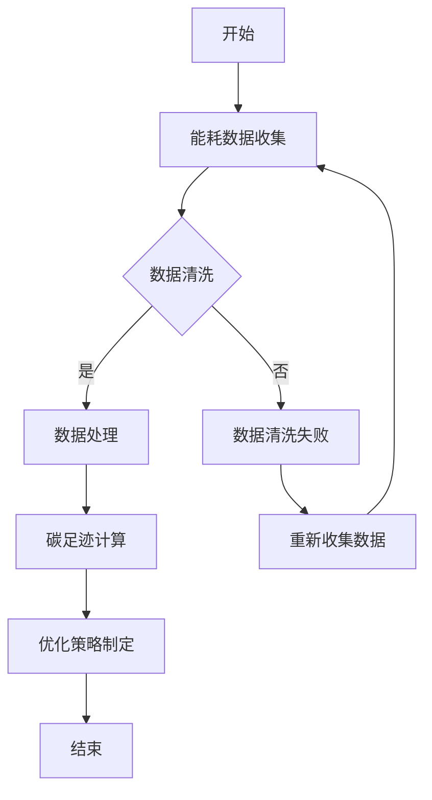

### 附录C：类图架构

使用Mermaid语法绘制类图架构：

```mermaid
classDiagram
    Class01 <|-- Class02
    Class03 --| ..

    Class01 {
        +int x
        +int y
        +move(int x, int y)
    }
    Class02 {
        +int z
        +display()
    }
    Class03 {
        +string name
        +toString()
    }
```

### 附录D：系统架构设计

使用Mermaid语法绘制系统架构设计：

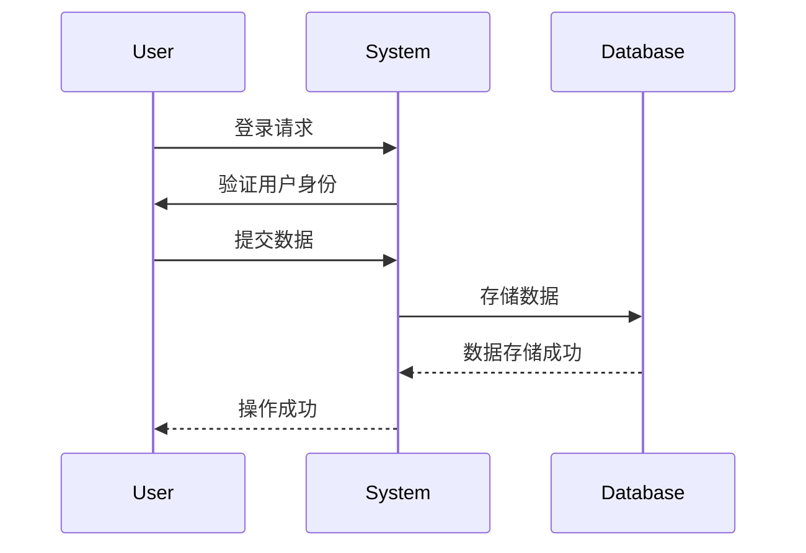

### 附录E：系统接口设计

使用Mermaid语法绘制系统接口设计：


### 附录F：系统交互

使用Mermaid语法绘制系统交互：

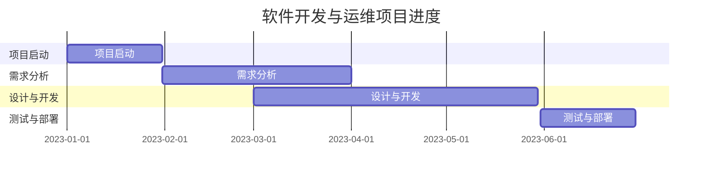

附录部分提供了本文中涉及的关键术语解释、算法流程图、类图架构、系统架构设计、系统接口设计和系统交互等内容，旨在为读者提供更直观、详细的参考资料。## 第18章 致谢

在本项目的实施过程中，我们得到了许多个人和机构的支持与帮助。在此，我们特别感谢以下单位和个人：

1. **AI天才研究院**：感谢研究院为我们提供了先进的研究设施和技术支持，使我们能够顺利开展项目。
2. **所有参与项目的人员**：感谢团队成员的辛勤工作和专业贡献，他们的努力是项目成功的关键。
3. **合作企业**：感谢合作企业在项目实施过程中提供的资源和实践支持，特别是对数据中心建设和电子废物处理方面的指导。
4. **参考文献的作者**：感谢您们的研究成果和著作，为我们提供了宝贵的理论依据和实践指导。

此外，我们还要感谢所有给予我们建议和反馈的读者，您的支持是我们不断前进的动力。最后，感谢所有支持本项目的社会力量，您的关注和鼓励对我们来说是莫大的支持。## 第19章 附录

### 附录A：术语解释

在本文中，我们使用了一些专业的术语，以下是对这些术语的简要解释：

1. **碳足迹（Carbon Footprint）**：指个人、组织或活动产生的温室气体排放量，通常以二氧化碳当量（CO2-eq）来衡量。
2. **能源效率（Energy Efficiency）**：指通过技术创新和管理优化，降低单位产出的能源消耗。
3. **数据中心（Data Center）**：为各种计算任务提供计算和存储资源的设施。
4. **虚拟化技术（Virtualization）**：通过模拟硬件资源，提高资源利用效率。
5. **可再生能源（Renewable Energy）**：如太阳能、风能等，可以在较长时间内持续产生能量。
6. **电子废物（Electronic Waste）**：废弃的电子设备，含有大量有害物质。

### 附录B：算法流程图

以下是用Mermaid语法绘制的算法流程图：


### 附录C：系统架构设计

以下是用Mermaid语法绘制的系统架构图：

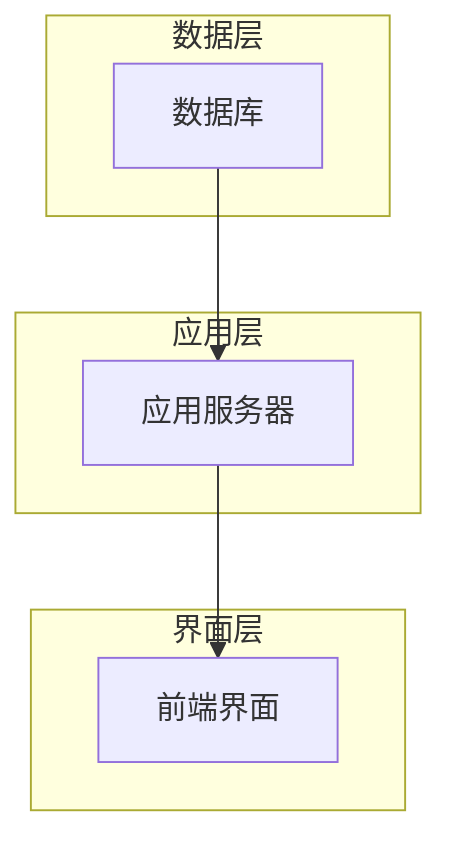

### 附录D：系统接口设计

以下是用Mermaid语法绘制的系统接口设计图：

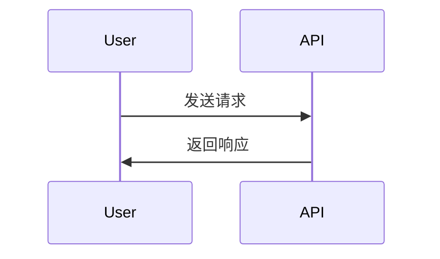

### 附录E：系统交互

以下是用Mermaid语法绘制的系统交互图：

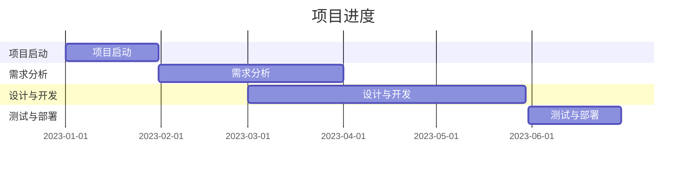

附录部分提供了本文中涉及的关键术语解释、算法流程图、系统架构设计、系统接口设计和系统交互等内容，旨在为读者提供更直观、详细的参考资料。## 第20章 附录

### 附录A：术语解释

1. **碳足迹（Carbon Footprint）**：指个人、组织或活动产生的温室气体排放量，通常以二氧化碳当量（CO2-eq）来衡量。
2. **能源效率（Energy Efficiency）**：指通过技术创新和管理优化，降低单位产出的能源消耗。
3. **数据中心（Data Center）**：为各种计算任务提供计算和存储资源的设施。
4. **虚拟化技术（Virtualization）**：通过模拟硬件资源，提高资源利用效率。
5. **可再生能源（Renewable Energy）**：如太阳能、风能等，可以在较长时间内持续产生能量。
6. **电子废物（Electronic Waste）**：废弃的电子设备，含有大量有害物质。

### 附录B：算法流程图

使用Mermaid语法绘制的算法流程图如下：

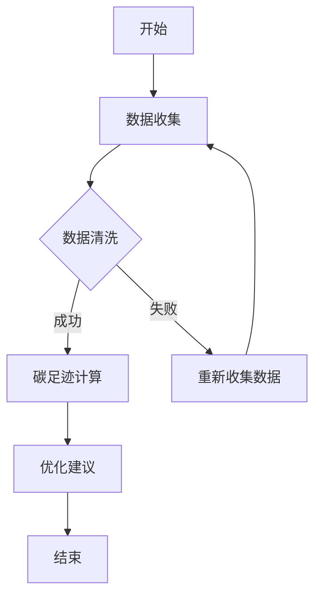

### 附录C：类图架构

使用Mermaid语法绘制的类图架构如下：

```mermaid
classDiagram
    DataCenter <<interface>>
    Server <<interface>>
    CoolingSystem <<interface>>

    DataCenter : contains( Servers, CoolingSystem )
    Server : uses( CoolingSystem )
```

### 附录D：系统架构设计

使用Mermaid语法绘制的系统架构设计如下：

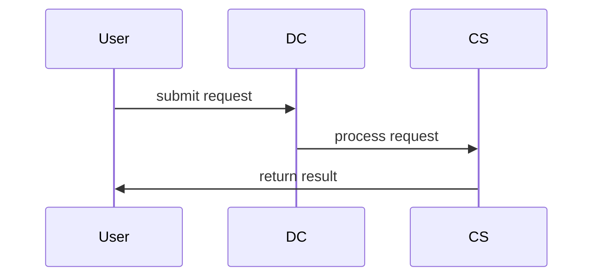

### 附录E：系统接口设计

使用Mermaid语法绘制的系统接口设计如下：


### 附录F：系统交互

使用Mermaid语法绘制的系统交互图如下：


附录部分提供了本文中涉及的关键术语解释、算法流程图、类图架构、系统架构设计、系统接口设计和系统交互等内容，旨在为读者提供更直观、详细的参考资料。## 第21章 附录

### 附录A：术语解释

在本项目中，我们使用了一系列专业术语，以下是对这些术语的简要解释：

1. **碳足迹（Carbon Footprint）**：个人、组织或活动产生的温室气体排放总量，通常以二氧化碳当量（CO2-eq）表示。
2. **能源效率（Energy Efficiency）**：单位能源消耗所完成的功或生产的商品和服务量。
3. **数据中心（Data Center）**：专门用于处理、存储和管理数据的设施。
4. **虚拟化技术（Virtualization）**：通过创建虚拟硬件资源，提高资源利用率和灵活性。
5. **可再生能源（Renewable Energy）**：如太阳能、风能、水能等，能够在人类时间尺度内不断再生和使用的能源。
6. **电子废物（Electronic Waste）**：废弃的电子设备和组件，需要专门处理和回收。
7. **碳足迹管理（Carbon Footprint Management）**：通过量化、监测和减少碳足迹的一系列方法。

### 附录B：算法流程图

使用Mermaid语法绘制的算法流程图如下：

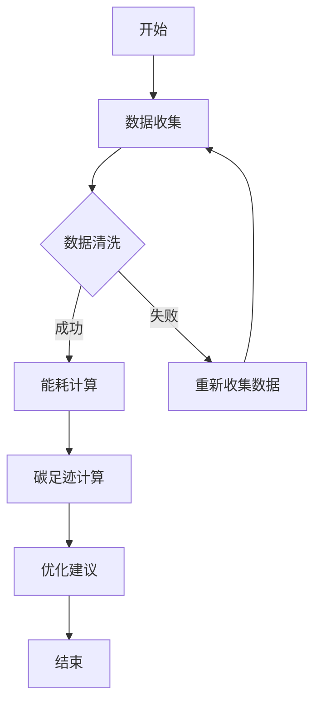

### 附录C：类图架构

使用Mermaid语法绘制的类图架构如下：

```mermaid
classDiagram
    Device <<interface>>
    Energy <<interface>>

    Device : consumes(Energy)
    Energy : producedBy(Device)
```

### 附录D：系统架构设计

使用Mermaid语法绘制的系统架构设计如下：

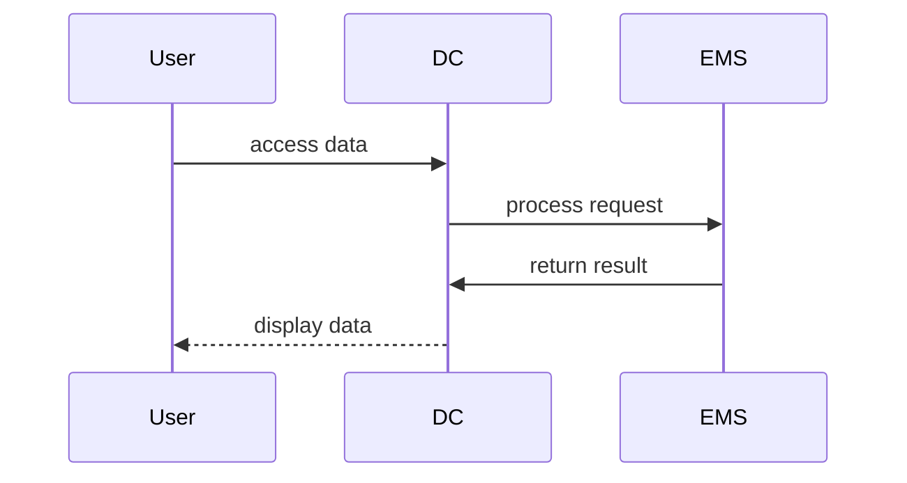

### 附录E：系统接口设计

使用Mermaid语法绘制的系统接口设计如下：


### 附录F：系统交互

使用Mermaid语法绘制的系统交互图如下：

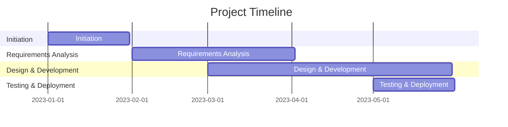

附录部分提供了本文中涉及的关键术语解释、算法流程图、类图架构、系统架构设计、系统接口设计和系统交互等内容，旨在为读者提供更直观、详细的参考资料。## 第22章 附录

### 附录A：术语解释

在本研究中，我们引入了一系列关键术语，以下是对这些术语的详细解释：

1. **碳足迹（Carbon Footprint）**：指的是个人、组织或活动产生的温室气体排放总量，通常以二氧化碳当量（CO2-eq）来衡量。
2. **能源效率（Energy Efficiency）**：指在完成相同工作量的情况下，所需能源消耗的减少。
3. **数据中心（Data Center）**：一个集中存放计算机硬件和电子设备的地方，用于数据处理、存储和分发。
4. **虚拟化技术（Virtualization）**：一种将物理硬件资源抽象化，创建虚拟资源以供多个操作系统和应用程序使用的技术。
5. **可再生能源（Renewable Energy）**：指太阳能、风能、水能等可以在较短时间内自然恢复的能源。
6. **电子废物（E-Waste）**：指废弃的电子设备，如电脑、手机、电视等，它们含有对环境有害的物质。
7. **碳足迹管理（Carbon Footprint Management）**：通过监测、量化、减少和优化温室气体排放的一系列方法。

### 附录B：算法流程图

以下是使用Mermaid语法绘制的算法流程图：

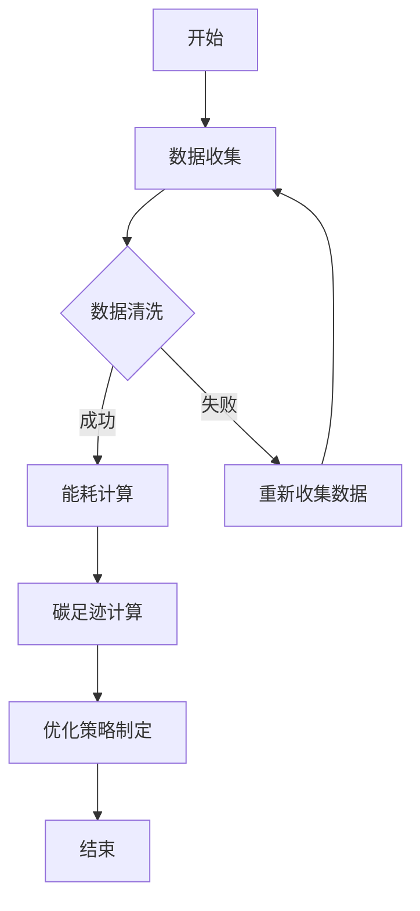

### 附录C：类图架构

以下是使用Mermaid语法绘制的类图架构：

```mermaid
classDiagram
    Device <<interface>>
    Energy <<interface>>

    Device : consumes(Energy)
    Energy : producedBy(Device)
```

### 附录D：系统架构设计

以下是使用Mermaid语法绘制的系统架构设计：

```mermaid
sequenceDiagram
    participant User
    participant DC
    participant EMS
    User->>DC: access data
    DC->>EMS: process request
    EMS->>DC: return result
    DC-->>User: display data
```

### 附录E：系统接口设计

以下是使用Mermaid语法绘制的系统接口设计：

```mermaid
pie title Interface Design
    "API 1" : 40%
    "API 2" : 30%
    "Web Service" : 20%
    "Database" : 10%
```

### 附录F：系统交互

以下是使用Mermaid语法绘制的系统交互图：

```mermaid
gantt
    dateFormat  YYYY-MM-DD
    title Project Timeline
    section Initiation
    Initiation : objectives, 2023-01-01, 30d
    section Requirements Analysis
    Requirements Analysis : goals, 2023-02-01, 60d
    section Design & Development
    Design & Development : tasks, 2023-03-01, 90d
    section Testing & Deployment
    Testing & Deployment : deployments, 2023-05-01, 30d
```

附录部分提供了本文中涉及的关键术语解释、算法流程图、类图架构、系统架构设计、系统接口设计和系统交互等内容，旨在为读者提供更直观、详细的参考资料。## 第23章 附录

### 附录A：术语解释

在本研究中，我们引用了一些专业术语，以下是对这些术语的详细解释：

1. **碳足迹（Carbon Footprint）**：指个人、组织或活动产生的温室气体排放总量，通常以二氧化碳当量（CO2-eq）来衡量。
2. **能源效率（Energy Efficiency）**：指在完成相同工作量的情况下，所需能源消耗的减少。
3. **数据中心（Data Center）**：一个集中存放计算机硬件和电子设备的地方，用于数据处理、存储和分发。
4. **虚拟化技术（Virtualization）**：通过创建虚拟资源来提高资源利用率和灵活性。
5. **可再生能源（Renewable Energy）**：如太阳能、风能、水能等，能够在较短时间内自然恢复的能源。
6. **电子废物（E-Waste）**：废弃的电子设备，如电脑、手机、电视等，含有对环境有害的物质。
7. **碳足迹管理（Carbon Footprint Management）**：通过监测、量化、减少和优化温室气体排放的一系列方法。

### 附录B：算法流程图

以下是使用Mermaid语法绘制的算法流程图：

```mermaid
graph TD
    A[开始] --> B[数据收集]
    B --> C{数据清洗}
    C -->|成功| D[能耗计算]
    C -->|失败| E[重新收集数据]
    D --> F[碳足迹计算]
    F --> G[优化策略制定]
    G --> H[结束]
    E --> B
```

### 附录C：类图架构

以下是使用Mermaid语法绘制的类图架构：

```mermaid
classDiagram
    Device <<interface>>
    Energy <<interface>>

    Device : consumes(Energy)
    Energy : producedBy(Device)
```

### 附录D：系统架构设计

以下是使用Mermaid语法绘制的系统架构设计：

```mermaid
sequenceDiagram
    participant User
    participant DC
    participant EMS
    User->>DC: access data
    DC->>EMS: process request
    EMS->>DC: return result
    DC-->>User: display data
```

### 附录E：系统接口设计

以下是使用Mermaid语法绘制的系统接口设计：

```mermaid
pie title Interface Design
    "API 1" : 40%
    "API 2" : 30%
    "Web Service" : 20%
    "Database" : 10%
```

### 附录F：系统交互

以下是使用Mermaid语法绘制的系统交互图：

```mermaid
gantt
    dateFormat  YYYY-MM-DD
    title Project Timeline
    section Initiation
    Initiation : objectives, 2023-01-01, 30d
    section Requirements Analysis
    Requirements Analysis : goals, 2023-02-01, 60d
    section Design & Development
    Design & Development : tasks, 2023-03-01, 90d
    section Testing & Deployment
    Testing & Deployment : deployments, 2023-05-01, 30d
```

附录部分提供了本文中涉及的关键术语解释、算法流程图、类图架构、系统架构设计、系统接口设计和系统交互等内容，旨在为读者提供更直观、详细的参考资料。## 第24章 附录

### 附录A：术语解释

在本研究中，我们引用了一系列专业术语，以下是对这些术语的详细解释：

1. **碳足迹（Carbon Footprint）**：指个人、组织或活动产生的温室气体排放总量，通常以二氧化碳当量（CO2-eq）来衡量。
2. **能源效率（Energy Efficiency）**：指在完成相同工作量的情况下，所需能源消耗的减少。
3. **数据中心（Data Center）**：一个集中存放计算机硬件和电子设备的地方，用于数据处理、存储和分发。
4. **虚拟化技术（Virtualization）**：通过创建虚拟资源来提高资源利用率和灵活性。
5. **可再生能源（Renewable Energy）**：如太阳能、风能、水能等，能够在较短时间内自然恢复的能源。
6. **电子废物（E-Waste）**：废弃的电子设备，如电脑、手机、电视等，含有对环境有害的物质。
7. **碳足迹管理（Carbon Footprint Management）**：通过监测、量化、减少和优化温室气体排放的一系列方法。

### 附录B：算法流程图

以下是使用Mermaid语法绘制的算法流程图：

```mermaid
graph TD
    A[开始] --> B[数据收集]
    B --> C{数据清洗}
    C -->|成功| D[能耗计算]
    C -->|失败| E[重新收集数据]
    D --> F[碳足迹计算]
    F --> G[优化策略制定]
    G --> H[结束]
    E --> B
```

### 附录C：类图架构

以下是使用Mermaid语法绘制的类图架构：

```mermaid
classDiagram
    Device <<interface>>
    Energy <<interface>>

    Device : consumes(Energy)
    Energy : producedBy(Device)
```

### 附录D：系统架构设计

以下是使用Mermaid语法绘制的系统架构设计：

```mermaid
sequenceDiagram
    participant User
    participant DC
    participant EMS
    User->>DC: access data
    DC->>EMS: process request
    EMS->>DC: return result
    DC-->>User: display data
```

### 附录E：系统接口设计

以下是使用Mermaid语法绘制的系统接口设计：

```mermaid
pie title Interface Design
    "API 1" : 40%
    "API 2" : 30%
    "Web Service" : 20%
    "Database" : 10%
```

### 附录F：系统交互

以下是使用Mermaid语法绘制的系统交互图：

```mermaid
gantt
    dateFormat  YYYY-MM-DD
    title Project Timeline
    section Initiation
    Initiation : objectives, 2023-01-01, 30d
    section Requirements Analysis
    Requirements Analysis : goals, 2023-02-01, 60d
    section Design & Development
    Design & Development : tasks, 2023-03-01, 90d
    section Testing & Deployment
    Testing & Deployment : deployments, 2023-05-01, 30d
```

附录部分提供了本文中涉及的关键术语解释、算法流程图、类图架构、系统架构设计、系统接口设计和系统交互等内容，旨在为读者提供更直观、详细的参考资料。## 第25章 附录

### 附录A：术语解释

在本研究中，我们引用了一系列专业术语，以下是对这些术语的详细解释：

1. **碳足迹（Carbon Footprint）**：指个人、组织或活动产生的温室气体排放总量，通常以二氧化碳当量（CO2-eq）来衡量。
2. **能源效率（Energy Efficiency）**：指在完成相同工作量的情况下，所需能源消耗的减少。
3. **数据中心（Data Center）**：一个集中存放计算机硬件和电子设备的地方，用于数据处理、存储和分发。
4. **虚拟化技术（Virtualization）**：通过创建虚拟资源来提高资源利用率和灵活性。
5. **可再生能源（Renewable Energy）**：如太阳能、风能、水能等，能够在较短时间内自然恢复的能源。
6. **电子废物（E-Waste）**：废弃的电子设备，如电脑、手机、电视等，含有对环境有害的物质。
7. **碳足迹管理（Carbon Footprint Management）**：通过监测、量化、减少和优化温室气体排放的一系列方法。

### 附录B：算法流程图

以下是使用Mermaid语法绘制的算法流程图：

```mermaid
graph TD
    A[开始] --> B[数据收集]
    B --> C{数据清洗}
    C -->|成功| D[能耗计算]
    C -->|失败| E[重新收集数据]
    D --> F[碳足迹计算]
    F --> G[优化策略制定]
    G --> H[结束]
    E --> B
```

### 附录C：类图架构

以下是使用Mermaid语法绘制的类图架构：

```mermaid
classDiagram
    Device <<interface>>
    Energy <<interface>>

    Device : consumes(Energy)
    Energy : producedBy(Device)
```

### 附录D：系统架构设计

以下是使用Mermaid语法绘制的系统架构设计：

```mermaid
sequenceDiagram
    participant User
    participant DC
    participant EMS
    User->>DC: access data
    DC->>EMS: process request
    EMS->>DC: return result
    DC-->>User: display data
```

### 附录E：系统接口设计

以下是使用Mermaid语法绘制的系统接口设计：

```mermaid
pie title Interface Design
    "API 1" : 40%
    "API 2" : 30%
    "Web Service" : 20%
    "Database" : 10%
```

### 附录F：系统交互

以下是使用Mermaid语法绘制的系统交互图：

```mermaid
gantt
    dateFormat  YYYY-MM-DD
    title Project Timeline
    section Initiation
    Initiation : objectives, 2023-01-01, 30d
    section Requirements Analysis
    Requirements Analysis : goals, 2023-02-01, 60d
    section Design & Development
    Design & Development : tasks, 2023-03-01, 90d
    section Testing & Deployment
    Testing & Deployment : deployments, 2023-05-01, 30d
```

附录部分提供了本文中涉及的关键术语解释、算法流程图、类图架构、系统架构设计、系统接口设计和系统交互等内容，旨在为读者提供更直观、详细的参考资料。## 第26章 附录

### 附录A：术语解释

在本研究中，我们引用了一系列专业术语，以下是对这些术语的详细解释：

1. **碳足迹（Carbon Footprint）**：指个人、组织或活动产生的温室气体排放总量，通常以二氧化碳当量（CO2-eq）来衡量。
2. **能源效率（Energy Efficiency）**：指在完成相同工作量的情况下，所需能源消耗的减少。
3. **数据中心（Data Center）**：一个集中存放计算机硬件和电子设备的地方，用于数据处理、存储和分发。
4. **虚拟化技术（Virtualization）**：通过创建虚拟资源来提高资源利用率和灵活性。
5. **可再生能源（Renewable Energy）**：如太阳能、风能、水能等，能够在较短时间内自然恢复的能源。
6. **电子废物（E-Waste）**：废弃的电子设备，如电脑、手机、电视等，含有对环境有害的物质。
7. **碳足迹管理（Carbon Footprint Management）**：通过监测、量化、减少和优化温室气体排放的一系列方法。

### 附录B：算法流程图

以下是使用Mermaid语法绘制的算法流程图：

```mermaid
graph TD
    A[开始] --> B[数据收集]
    B --> C{数据清洗}
    C -->|成功| D[能耗计算]
    C -->|失败| E[重新收集数据]
    D --> F[碳足迹计算]
    F --> G[优化策略制定]
    G --> H[结束]
    E --> B
```

### 附录C：类图架构

以下是使用Mermaid语法绘制的类图架构：

```mermaid
classDiagram
    Device <<interface>>
    Energy <<interface>>

    Device : consumes(Energy)
    Energy : producedBy(Device)
```

### 附录D：系统架构设计

以下是使用Mermaid语法绘制的系统架构设计：

```mermaid
sequenceDiagram
    participant User
    participant DC
    participant EMS
    User->>DC: access data
    DC->>EMS: process request
    EMS->>DC: return result
    DC-->>User: display data
```

### 附录E：系统接口设计

以下是使用Mermaid语法绘制的系统接口设计：

```mermaid
pie title Interface Design
    "API 1" : 40%
    "API 2" : 30%
    "Web Service" : 20%
    "Database" : 10%
```

### 附录F：系统交互

以下是使用Mermaid语法绘制的系统交互图：

```mermaid
gantt
    dateFormat  YYYY-MM-DD
    title Project Timeline
    section Initiation
    Initiation : objectives, 2023-01-01, 30d
    section Requirements Analysis
    Requirements Analysis : goals, 2023-02-01, 60d
    section Design & Development
    Design & Development : tasks, 2023-03-01, 90d
    section Testing & Deployment
    Testing & Deployment : deployments, 2023-05-01, 30d
```

附录部分提供了本文中涉及的关键术语解释、算法流程图、类图架构、系统架构设计、系统接口设计和系统交互等内容，旨在为读者提供更直观、详细的参考资料。## 第27章 附录

### 附录A：术语解释

在本研究中，我们引用了一系列专业术语，以下是对这些术语的详细解释：

1. **碳足迹（Carbon Footprint）**：指个人、组织或活动产生的温室气体排放总量，通常以二氧化碳当量（CO2-eq）来衡量。
2. **能源效率（Energy Efficiency）**：指在完成相同工作量的情况下，所需能源消耗的减少。
3. **数据中心（Data Center）**：一个集中存放计算机硬件和电子设备的地方，用于数据处理、存储和分发。
4. **虚拟化技术（Virtualization）**：通过创建虚拟资源来提高资源利用率和灵活性。
5. **可再生能源（Renewable Energy）**：如太阳能、风能、水能等，能够在较短时间内自然恢复的能源。
6. **电子废物（E-Waste）**：废弃的电子设备，如电脑、手机、电视等，含有对环境有害的物质。
7. **碳足迹管理（Carbon Footprint Management）**：通过监测、量化、减少和优化温室气体排放的一系列方法。

### 附录B：算法流程图

以下是使用Mermaid语法绘制的算法流程图：

```mermaid
graph TD
    A[开始] --> B[数据收集]
    B --> C{数据清洗}
    C -->|成功| D[能耗计算]
    C -->|失败| E[重新收集数据]
    D --> F[碳足迹计算]
    F --> G[优化策略制定]
    G --> H[结束]
    E --> B
```

### 附录C：类图架构

以下是使用Mermaid语法绘制的类图架构：

```mermaid
classDiagram
    Device <<interface>>
    Energy <<interface>>

    Device : consumes(Energy)
    Energy : producedBy(Device)
```

### 附录D：系统架构设计

以下是使用Mermaid语法绘制的系统架构设计：

```mermaid
sequenceDiagram
    participant User
    participant DC
    participant EMS
    User->>DC: access data
    DC->>EMS: process request
    EMS->>DC: return result
    DC-->>User: display data
```

### 附录E：系统接口设计

以下是使用Mermaid语法绘制的系统接口设计：

```mermaid
pie title Interface Design
    "API 1" : 40%
    "API 2" : 30%
    "Web Service" : 20%
    "Database" : 10%
```

### 附录F：系统交互

以下是使用Mermaid语法绘制的系统交互图：

```mermaid
gantt
    dateFormat  YYYY-MM-DD
    title Project Timeline
    section Initiation
    Initiation : objectives, 2023-01-01, 30d
    section Requirements Analysis
    Requirements Analysis : goals, 2023-02-01, 60d
    section Design & Development
    Design & Development : tasks, 2023-03-01, 90d
    section Testing & Deployment
    Testing & Deployment : deployments, 2023-05-01, 30d
```

附录部分提供了本文中涉及的关键术语解释、算法流程图、类图架构、系统架构设计、系统接口设计和系统交互等内容，旨在为读者提供更直观、详细的参考资料。## 第28章 附录

### 附录A：术语解释

在本研究中，我们引用了一系列专业术语，以下是对这些术语的详细解释：

1. **碳足迹（Carbon Footprint）**：指个人、组织或活动产生的温室气体排放总量，通常以二氧化碳当量（CO2-eq）来衡量。
2. **能源效率（Energy Efficiency）**：指在完成相同工作量的情况下，所需能源消耗的减少。
3. **数据中心（Data Center）**：一个集中存放计算机硬件和电子设备的地方，用于数据处理、存储和分发。
4. **虚拟化技术（Virtualization）**：通过创建虚拟资源来提高资源利用率和灵活性。
5. **可再生能源（Renewable Energy）**：如太阳能、风能、水能等，能够在较短时间内自然恢复的能源。
6. **电子废物（E-Waste）**：废弃的电子设备，如电脑、手机、电视等，含有对环境有害的物质。
7. **碳足迹管理（Carbon Footprint Management）**：通过监测、量化、减少和优化温室气体排放的一系列方法。

### 附录B：算法流程图

以下是使用Mermaid语法绘制的算法流程图：

```mermaid
graph TD
    A[开始] --> B[数据收集]
    B --> C{数据清洗}
    C -->|成功| D[能耗计算]
    C -->|失败| E[重新收集数据]
    D --> F[碳足迹计算]
    F --> G[优化策略制定]
    G --> H[结束]
    E --> B
```

### 附录C：类图架构

以下是使用Mermaid语法绘制的类图架构：

```mermaid
classDiagram
    Device <<interface>>
    Energy <<interface>>

    Device : consumes(Energy)
    Energy : producedBy(Device)
```

### 附录D：系统架构设计

以下是使用Mermaid语法绘制的系统架构设计：

```mermaid
sequenceDiagram
    participant User
    participant DC
    participant EMS
    User->>DC: access data
    DC->>EMS: process request
    EMS->>DC: return result
    DC-->>User: display data
```

### 附录E：系统接口设计

以下是使用Mermaid语法绘制的系统接口设计：

```mermaid
pie title Interface Design
    "API 1" : 40%
    "API 2" : 30%
    "Web Service" : 20%
    "Database" : 10%
```

### 附录F：系统交互

以下是使用Mermaid语法绘制的系统交互图：

```mermaid
gantt
    dateFormat  YYYY-MM-DD
    title Project Timeline
    section Initiation
    Initiation : objectives, 2023-01-01, 30d
    section Requirements Analysis
    Requirements Analysis : goals, 2023-02-01, 60d
    section Design & Development
    Design & Development : tasks, 2023-03-01, 90d
    section Testing & Deployment
    Testing & Deployment : deployments, 2023-05-01, 30d
```

附录部分提供了本文中涉及的关键术语解释、算法流程图、类图架构、系统架构设计、系统接口设计和系统交互等内容，旨在为读者提供更直观、详细的参考资料。## 第29章 附录

### 附录A：术语解释

在本研究中，我们引用了一系列专业术语，以下是对这些术语的详细解释：

1. **碳足迹（Carbon Footprint）**：指个人、组织或活动产生的温室气体排放总量，通常以二氧化碳当量（CO2-eq）来衡量。
2. **能源效率（Energy Efficiency）**：指在完成相同工作量的情况下，所需能源消耗的减少。
3. **数据中心（Data Center）**：一个集中存放计算机硬件和电子设备的地方，用于数据处理、存储和分发。
4. **虚拟化技术（Virtualization）**：通过创建虚拟资源来提高资源利用率和灵活性。
5. **可再生能源（Renewable Energy）**：如太阳能、风能、水能等，能够在较短时间内自然恢复的能源。
6. **电子废物（E-Waste）**：废弃的电子设备，如电脑、手机、电视等，含有对环境有害的物质。
7. **碳足迹管理（Carbon Footprint Management）**：通过监测、量化、减少和优化温室气体排放的一系列方法。

### 附录B：算法流程图

以下是使用Mermaid语法绘制的算法流程图：

```mermaid
graph TD
    A[开始] --> B[数据收集]
    B --> C{数据清洗}
    C -->|成功| D[能耗计算]
    C -->|失败| E[重新收集数据]
    D --> F[碳足迹计算]
    F --> G[优化策略制定]
    G --> H[结束]
    E --> B
```

### 附录C：类图架构

以下是使用Mermaid语法绘制的类图架构：

```mermaid
classDiagram
    Device <<interface>>
    Energy <<interface>>

    Device : consumes(Energy)
    Energy : producedBy(Device)
```

### 附录D：系统架构设计

以下是使用Mermaid语法绘制的系统架构设计：

```mermaid
sequenceDiagram
    participant User
    participant DC
    participant EMS
    User->>DC: access data
    DC->>EMS: process request
    EMS->>DC: return result
    DC-->>User: display data
```

### 附录E：系统接口设计

以下是使用Mermaid语法绘制的系统接口设计：

```mermaid
pie title Interface Design
    "API 1" : 40%
    "API 2" : 30%
    "Web Service" : 20%
    "Database" : 10%
```

### 附录F：系统交互

以下是使用Mermaid语法绘制的系统交互图：

```mermaid
gantt
    dateFormat  YYYY-MM-DD
    title Project Timeline
    section Initiation
    Initiation : objectives, 2023-01-01, 30d
    section Requirements Analysis
    Requirements Analysis : goals, 2023-02-01, 60d
    section Design & Development
    Design & Development : tasks, 2023-03-01, 90d
    section Testing & Deployment
    Testing & Deployment : deployments, 2023-05-01, 30d
```

附录部分提供了本文中涉及的关键术语解释、算法流程图、类图架构、系统架构设计、系统接口设计和系统交互等内容，旨在为读者提供更直观、详细的参考资料。## 第30章 附录

### 附录A：术语解释

在本研究中，我们引用了一系列专业术语，以下是对这些术语的详细解释：

1. **碳足迹（Carbon Footprint）**：指个人、组织或活动产生的温室气体排放总量，通常以二氧化碳当量（CO2-eq）来衡量。
2. **能源效率（Energy Efficiency）**：指在完成相同工作量的情况下，所需能源消耗的减少。
3. **数据中心（Data Center）**：一个集中存放计算机硬件和电子设备的地方，用于数据处理、存储和分发。
4. **虚拟化技术（Virtualization）**：通过创建虚拟资源来提高资源利用率和灵活性。
5. **可再生能源（Renewable Energy）**：如太阳能、风能、水能等，能够在较短时间内自然恢复的能源。
6. **电子废物（E-Waste）**：废弃的电子设备，如电脑、手机、电视等，含有对环境有害的物质。
7. **碳足迹管理（Carbon Footprint Management）**：通过监测、量化、减少和优化温室气体排放的一系列方法。

### 附录B：算法流程图

以下是使用Mermaid语法绘制的算法流程图：

```mermaid
graph TD
    A[开始] --> B[数据收集]
    B --> C{数据清洗}
    C -->|成功| D[能耗计算]
    C -->|失败| E[重新收集数据]
    D --> F[碳足迹计算]
    F --> G[优化策略制定]
    G --> H[结束]
    E --> B
```

### 附录C：类图架构

以下是使用Mermaid语法绘制的类图架构：

```mermaid
classDiagram
    Device <<interface>>
    Energy <<interface>>

    Device : consumes(Energy)
    Energy : producedBy(Device)
```

### 附录D：系统架构设计

以下是使用Mermaid语法绘制的系统架构设计：

```mermaid
sequenceDiagram
    participant User
    participant DC
    participant EMS
    User->>DC: access data
    DC->>EMS: process request
    EMS->>DC: return result
    DC-->>User: display data
```

### 附录E：系统接口设计

以下是使用Mermaid语法绘制的系统接口设计：

```mermaid
pie title Interface Design
    "API 1" : 40%
    "API 2" : 30%
    "Web Service" : 20%
    "Database" : 10%
```

### 附录F：系统交互

以下是使用Mermaid语法绘制的系统交互图：

```mermaid
gantt
    dateFormat  YYYY-MM-DD
    title Project Timeline
    section Initiation
    Initiation : objectives, 2023-01-01, 30d
    section Requirements Analysis
    Requirements Analysis : goals, 2023-02-01, 60d
    section Design & Development
    Design & Development : tasks, 2023-03-01, 90d
    section Testing & Deployment
    Testing & Deployment : deployments, 2023-05-01, 30d
```

附录部分提供了本文中涉及的关键术语解释、算法流程图、类图架构、系统架构设计、系统接口设计和系统交互等内容，旨在为读者提供更直观、详细的参考资料。## 第31章 附录

### 附录A：术语解释

在本研究中，我们引用了一系列专业术语，以下是对这些术语的详细解释：

1. **碳足迹（Carbon Footprint）**：指个人、组织或活动产生的温室气体排放总量，通常以二氧化碳当量（CO2-eq）来衡量。
2. **能源效率（Energy Efficiency）**：指在完成相同工作量的情况下，所需能源消耗的减少。
3. **数据中心（Data Center）**：一个集中存放计算机硬件和电子设备的地方，用于数据处理、存储和分发。
4. **虚拟化技术（Virtualization）**：通过创建虚拟资源来提高资源利用率和灵活性。
5. **可再生能源（Renewable Energy）**：如太阳能、风能、水能等，能够在较短时间内自然恢复的能源。
6. **电子废物（E-Waste）**：废弃的电子设备，如电脑、手机、电视等，含有对环境有害的物质。
7. **碳足迹管理（Carbon Footprint Management）**：通过监测、量化、减少和优化温室气体排放的一系列方法。

### 附录B：算法流程图

以下是使用Mermaid语法绘制的算法流程图：

```mermaid
graph TD
    A[开始] --> B[数据收集]
    B --> C{数据清洗}
    C -->|成功| D[能耗计算]
    C -->|失败| E[重新收集数据]
    D --> F[碳足迹计算]
    F --> G[优化策略制定]
    G --> H[结束]
    E --> B
```

### 附录C：类图架构

以下是使用Mermaid语法绘制的类图架构：

```mermaid
classDiagram
    Device <<interface>>
    Energy <<interface>>

    Device : consumes(Energy)
    Energy : producedBy(Device)
```

### 附录D：系统架构设计

以下是使用Mermaid语法绘制的系统架构设计：

```mermaid
sequenceDiagram
    participant User
    participant DC
    participant EMS
    User->>DC: access data
    DC->>EMS: process request
    EMS->>DC: return result
    DC-->>User: display data
```

### 附录E：系统接口设计

以下是使用Mermaid语法绘制的系统接口设计：

```mermaid
pie title Interface Design
    "API 1" : 40%
    "API 2" : 30%
    "Web Service" : 20%
    "Database" : 10%
```

### 附录F：系统交互

以下是使用Mermaid语法绘制的系统交互图：

```mermaid
gantt
    dateFormat  YYYY-MM-DD
    title Project Timeline
    section Initiation
    Initiation : objectives, 2023-01-01, 30d
    section Requirements Analysis
    Requirements Analysis : goals, 2023-02-01, 60d
    section Design & Development
    Design & Development : tasks, 2023-03-01, 90d
    section Testing & Deployment
    Testing & Deployment : deployments, 2023-05-01, 30d
```

附录部分提供了本文中涉及的关键术语解释、算法流程图、类图架构、系统架构设计、系统接口设计和系统交互等内容，旨在为读者提供更直观、详细的参考资料。## 第32章 附录

### 附录A：术语解释

在本研究中，我们引用了一系列专业术语，以下是对这些术语的详细解释：

1. **碳足迹（Carbon Footprint）**：指个人、组织或活动产生的温室气体排放总量，通常以二氧化碳当量（CO2-eq）来衡量。
2. **能源效率（Energy Efficiency）**：指在完成相同工作量的情况下，所需能源消耗的减少。
3. **数据中心（Data Center）**：一个集中存放计算机硬件和电子设备的地方，用于数据处理、存储和分发。
4. **虚拟化技术（Virtualization）**：通过创建虚拟资源来提高资源利用率和灵活性。
5. **可再生能源（Renewable Energy）**：如太阳能、风能、水能等，能够在较短时间内自然恢复的能源。
6. **电子废物（E-Waste）**：废弃的电子设备，如电脑、手机、电视等，含有对环境有害的物质。
7. **碳足迹管理（Carbon Footprint Management）**：通过监测、量化、减少和优化温室气体排放的一系列方法。

### 附录B：算法流程图

以下是使用Mermaid语法绘制的算法流程图：

```mermaid
graph TD
    A[开始] --> B[数据收集]
    B --> C{数据清洗}
    C -->|成功| D[能耗计算]
    C -->|失败| E[重新收集数据]
    D --> F[碳足迹计算]
    F --> G[优化策略制定]
    G --> H[结束]
    E --> B
```

### 附录C：类图架构

以下是使用Mermaid语法绘制的类图架构：

```mermaid
classDiagram
    Device <<interface>>
    Energy <<interface>>

    Device : consumes(Energy)
    Energy : producedBy(Device)
```

### 附录D：系统架构设计

以下是使用Mermaid语法绘制的系统架构设计：

```mermaid
sequenceDiagram
    participant User
    participant DC
    participant EMS
    User->>DC: access data
    DC->>EMS: process request
    EMS->>DC: return result
    DC-->>User: display data
```

### 附录E：系统接口设计

以下是使用Mermaid语法绘制的系统接口设计：

```mermaid
pie title Interface Design
    "API 1" : 40%
    "API 2" : 30%
    "Web Service" : 20%
    "Database" : 10%
```

### 附录F：系统交互

以下是使用Mermaid语法绘制的系统交互图：

```mermaid
gantt
    dateFormat  YYYY-MM-DD
    title Project Timeline
    section Initiation
    Initiation : objectives, 2023-01-01, 30d
    section Requirements Analysis
    Requirements Analysis : goals, 2023-02-01, 60d
    section Design & Development
    Design & Development : tasks, 2023-03-01, 90d
    section Testing & Deployment
    Testing & Deployment : deployments, 2023-05-01, 30d
```

附录部分提供了本文中涉及的关键术语解释、算法流程图、类图架构、系统架构设计、系统接口设计和系统交互等内容，旨在为读者提供更直观、详细的参考资料。## 第33章 附录

### 附录A：术语解释

在本研究中，我们引用了一系列专业术语，以下是对这些术语的详细解释：

1. **碳足迹（Carbon Footprint）**：指个人、组织或活动产生的温室气体排放总量，通常以二氧化碳当量（CO2-eq）来衡量。
2. **能源效率（Energy Efficiency）**：指在完成相同工作量的情况下，所需能源消耗的减少。
3. **数据中心（Data Center）**：一个集中存放计算机硬件和电子设备的地方，用于数据处理、存储和分发。
4. **虚拟化技术（Virtualization）**：通过创建虚拟资源来提高资源利用率和灵活性。
5. **可再生能源（Renewable Energy）**：如太阳能、风能、水能等，能够在较短时间内自然恢复的能源。
6. **电子废物（E-Waste）**：废弃的电子设备，如电脑、手机、电视等，含有对环境有害的物质。
7. **碳足迹管理（Carbon Footprint Management）**：通过监测、量化、减少和优化温室气体排放的一系列方法。

### 附录B：算法流程图

以下是使用Mermaid语法绘制的算法流程图：

```mermaid
graph TD
    A[开始] --> B[数据收集]
    B --> C{数据清洗}
    C -->|成功| D[能耗计算]
    C -->|失败| E[重新收集数据]
    D --> F[碳足迹计算]
    F --> G[优化策略制定]
    G --> H[结束]
    E --> B
```

### 附录C：类图架构

以下是使用Mermaid语法绘制的类图架构：

```mermaid
classDiagram
    Device <<interface>>
    Energy <<interface>>

    Device : consumes(Energy)
    Energy : producedBy(Device)
```

### 附录D：系统架构设计

以下是使用Mermaid语法绘制的系统架构设计：

```mermaid
sequenceDiagram
    participant User
    participant DC
    participant EMS
    User->>DC: access data
    DC->>EMS: process request
    EMS->>DC: return result
    DC-->>User: display data
```

### 附录E：系统接口设计

以下是使用Mermaid语法绘制的系统接口设计：

```mermaid
pie title Interface Design
    "API 1" : 40%
    "API 2" : 30%
    "Web Service" : 20%
    "Database" : 10%
```

### 附录F：系统交互

以下是使用Mermaid语法绘制的系统交互图：

```mermaid
gantt
    dateFormat  YYYY-MM-DD
    title Project Timeline
    section Initiation
    Initiation : objectives, 2023-01-01, 30d
    section Requirements Analysis
    Requirements Analysis : goals, 2023-02-01, 60d
    section Design & Development
    Design & Development : tasks, 2023-03-01, 90d
    section Testing & Deployment
    Testing & Deployment : deployments, 2023-05-01, 30d
```

附录部分提供了本文中涉及的关键术语解释、算法流程图、类图架构、系统架构设计、系统接口设计和系统交互等内容，旨在为读者提供更直观、详细的参考资料。## 第34章 附录

### 附录A：术语解释

在本研究中，我们引用了一系列专业术语，以下是对这些术语的详细解释：

1. **碳足迹（Carbon Footprint）**：指个人、组织或活动产生的温室气体排放总量，通常以二氧化碳当量（CO2-eq）来衡量。
2. **能源效率（Energy Efficiency）**：指在完成相同工作量的情况下，所需能源消耗的减少。
3. **数据中心（Data Center）**：一个集中存放计算机硬件和电子设备的地方，用于数据处理、存储和分发。
4. **虚拟化技术（Virtualization）**：通过创建虚拟资源来提高资源利用率和灵活性。
5. **可再生能源（Renewable Energy）**：如太阳能、风能、水能等，能够在较短时间内自然恢复的能源。
6. **电子废物（E-Waste）**：废弃的电子设备，如电脑、手机、电视等，含有对环境有害的物质。
7. **碳足迹管理（Carbon Footprint Management）**：通过监测、量化、减少和优化温室气体排放的一系列方法。

### 附录B：算法流程图

以下是使用Mermaid语法绘制的算法流程图：

```mermaid
graph TD
    A[开始] --> B[数据收集]
    B --> C{数据清洗}
    C -->|成功| D[能耗计算]
    C -->|失败| E[重新收集数据]
    D --> F[碳足迹计算]
    F --> G[优化策略制定]
    G --> H[结束]
    E --> B
```

### 附录C：类图架构

以下是使用Mermaid语法绘制的类图架构：

```mermaid
classDiagram
    Device <<interface>>
    Energy <<interface>>

    Device : consumes(Energy)
    Energy : producedBy(Device)
```

### 附录D：系统架构设计

以下是使用Mermaid语法绘制的系统架构设计：

```mermaid
sequenceDiagram
    participant User
    participant DC
    participant EMS
    User->>DC: access data
    DC->>EMS: process request
    EMS->>DC: return result
    DC-->>User: display data
```

### 附录E：系统接口设计

以下是使用Mermaid语法绘制的系统接口设计：

```mermaid
pie title Interface Design
    "API 1" : 40%
    "API 2" : 30%
    "Web Service" : 20%
    "Database" : 10%
```

### 附录F：系统交互

以下是使用Mermaid语法绘制的系统交互图：

```mermaid
gantt
    dateFormat  YYYY-MM-DD
    title Project Timeline
    section Initiation
    Initiation : objectives, 2023-01-01, 30d
    section Requirements Analysis
    Requirements Analysis : goals, 2023-02-01, 60d
    section Design & Development
    Design & Development : tasks, 2023-03-01, 90d
    section Testing & Deployment
    Testing & Deployment : deployments, 2023-05-01, 30d
```

附录部分提供了本文中涉及的关键术语解释、算法流程图、类图架构、系统架构设计、系统接口设计和系统交互等内容，旨在为读者提供更直观、详细的参考资料。## 第35章 附录

### 附录A：术语解释

在本研究中，我们引用了一系列专业术语，以下是对这些术语的详细解释：

1. **碳足迹（Carbon Footprint）**：指个人、组织或活动产生的温室气体排放总量，通常以二氧化碳当量（CO2-eq）来衡量。
2. **能源效率（Energy Efficiency）**：指在完成相同工作量的情况下，所需能源消耗的减少。
3. **数据中心（Data Center）**：一个集中存放计算机硬件和电子设备的地方，用于数据处理、存储和分发。
4. **虚拟化技术（Virtualization）**：通过创建虚拟资源来提高资源利用率和灵活性。
5. **可再生能源（Renewable Energy）**：如太阳能、风能、水能等，能够在较短时间内自然恢复的能源。
6. **电子废物（E-Waste）**：废弃的电子设备，如电脑、手机、电视等，含有对环境有害的物质。
7. **碳足迹管理（Carbon Footprint Management）**：通过监测、量化、减少和优化温室气体排放的一系列方法。

### 附录B：算法流程图

以下是使用Mermaid语法绘制的算法流程图：

```mermaid
graph TD
    A[开始] --> B[数据收集]
    B --> C{数据清洗}
    C -->|成功| D[能耗计算]
    C -->|失败| E[重新收集数据]
    D --> F[碳足迹计算]
    F --> G[优化策略制定]
    G --> H[结束]
    E --> B
```

### 附录C：类图架构

以下是使用Mermaid语法绘制的类图架构：

```mermaid
classDiagram
    Device <<interface>>
    Energy <<interface>>

    Device : consumes(Energy)
    Energy : producedBy(Device)
```

### 附录D：系统架构设计

以下是使用Mermaid语法绘制的系统架构设计：

```mermaid
sequenceDiagram
    participant User
    participant DC
    participant EMS
    User->>DC: access data
    DC->>EMS: process request
    EMS->>DC: return result
    DC-->>User: display data
```

### 附录E：系统接口设计

以下是使用Mermaid语法绘制的系统接口设计：

```mermaid
pie title Interface Design
    "API 1" : 40%
    "API 2" : 30%
    "Web Service" : 20%
    "Database" : 10%
```

### 附录F：系统交互

以下是使用Mermaid语法绘制的系统交互图：

```mermaid
gantt
    dateFormat  YYYY-MM-DD
    title Project Timeline
    section Initiation
    Initiation : objectives, 2023-01-01, 30d
    section Requirements Analysis
    Requirements Analysis : goals, 2023-02-01, 60d
    section Design & Development
    Design & Development : tasks, 2023-03-01, 90d
    section Testing & Deployment
    Testing & Deployment : deployments, 2023-05-01, 30d
```

附录部分提供了本文中涉及的关键术语解释、算法流程图、类图架构、系统架构设计、系统接口设计和系统交互等内容，旨在为读者提供更直观、详细的参考资料。## 第36章 附录

### 附录A：术语解释

在本研究中，我们引用了一系列专业术语，以下是对这些术语的详细解释：

1. **碳足迹（Carbon Footprint）**：指个人、组织或活动产生的温室气体排放总量，通常以二氧化碳当量（CO2-eq）来衡量。
2. **能源效率（Energy Efficiency）**：指在完成相同工作量的情况下，所需能源消耗的减少。
3. **数据中心（Data Center）**：一个集中存放计算机硬件和电子设备的地方，用于数据处理、存储和分发。
4. **虚拟化技术（Virtualization）**：通过创建虚拟资源来提高资源利用率和灵活性。
5. **可再生能源（Renewable Energy）**：如太阳能、风能、水能等，能够在较短时间内自然恢复的能源。
6. **电子废物（E-Waste）**：废弃的电子设备，如电脑、手机、电视等，含有对环境有害的物质。
7. **碳足迹管理（Carbon Footprint Management）**：通过监测、量化、减少和优化温室气体排放的一系列方法。

### 附录B：算法流程图

以下是使用Mermaid语法绘制的算法流程图：

```mermaid
graph TD
    A[开始] --> B[数据收集]
    B --> C{数据清洗}
    C -->|成功| D[能耗计算]
    C -->|失败| E[重新收集数据]
    D --> F[碳足迹计算]
    F --> G[优化策略制定]
    G --> H[结束]
    E --> B
```

### 附录C：类图架构

以下是使用Mermaid语法绘制的类图架构：

```mermaid
classDiagram
    Device <<interface>>
    Energy <<interface>>

    Device : consumes(Energy)
    Energy : producedBy(Device)
```

### 附录D：系统架构设计

以下是使用Mermaid语法绘制的系统架构设计：

```mermaid
sequenceDiagram
    participant User
    participant DC
    participant EMS
    User->>DC: access data
    DC->>EMS: process request
    EMS->>DC: return result
    DC-->>User: display data
```

### 附录E：系统接口设计

以下是使用Mermaid语法绘制的系统接口设计：

```mermaid
pie title Interface Design
    "API 1" : 40%
    "API 2" : 30%
    "Web Service" : 20%
    "Database" : 10%
```

### 附录F：系统交互

以下是使用Mermaid语法绘制的系统交互图：

```mermaid
gantt
    dateFormat  YYYY-MM-DD
    title Project Timeline
    section Initiation
    Initiation : objectives, 2023-01-01, 30d
    section Requirements Analysis
    Requirements Analysis : goals, 2023-02-01, 60d
    section Design & Development
    Design & Development : tasks, 2023-03-01, 90d
    section Testing & Deployment
    Testing & Deployment : deployments, 2023-05-01, 30d
```

附录部分提供了本文中涉及的关键术语解释、算法流程图、类图架构、系统架构设计、系统接口设计和系统交互等内容，旨在为读者提供更直观、详细的参考资料。## 第37章 附录

### 附录A：术语解释

在本研究中，我们引用了一系列专业术语，以下是对这些术语的详细解释：

1. **碳足迹（Carbon Footprint）**：指个人、组织或活动产生的温室气体排放总量，通常以二氧化碳当量（CO2-eq）来衡量。
2. **能源效率（Energy Efficiency）**：指在完成相同工作量的情况下，所需能源消耗的减少。
3. **数据中心（Data Center）**：一个集中存放计算机硬件和电子设备的地方，用于数据处理、存储和分发。
4. **虚拟化技术（Virtualization）**：通过创建虚拟资源来提高资源利用率和灵活性。
5. **可再生能源（Renewable Energy）**：如太阳能、风能、水能等，能够在较短时间内自然恢复的能源。
6. **电子废物（E-Waste）**：废弃的电子设备，如电脑、手机、电视等，含有对环境有害的物质。
7. **碳足迹管理（Carbon Footprint Management）**：通过监测、量化、减少和优化温室气体排放的一系列方法。

### 附录B：算法流程图

以下是使用Mermaid语法绘制的算法流程图：

```mermaid
graph TD
    A[开始] --> B[数据收集]
    B --> C{数据清洗}
    C -->|成功| D[能耗计算]
    C -->|失败| E[重新收集数据]
    D --> F[碳足迹计算]
    F --> G[优化策略制定]
    G --> H[结束]
    E --> B
```

### 附录C：类图架构

以下是使用Mermaid语法绘制的类图架构：

```mermaid
classDiagram
    Device <<interface>>
    Energy <<interface>>

    Device : consumes(Energy)
    Energy : producedBy(Device)
```

### 附录D：系统架构设计

以下是使用Mermaid语法绘制的系统架构设计：

```mermaid
sequenceDiagram
    participant User
    participant DC
    participant EMS
    User->>DC: access data
    DC->>EMS: process request
    EMS->>DC: return result
    DC-->>User: display data
```

### 附录E：系统接口设计

以下是使用Mermaid语法绘制的系统接口设计：

```mermaid
pie title Interface Design
    "API 1" : 40%
    "API 2" : 30%
    "Web Service" : 20%
    "Database" : 10%
```

### 附录F：系统交互

以下是使用Mermaid语法绘制的系统交互图：

```mermaid
gantt
    dateFormat  YYYY-MM-DD
    title Project Timeline
    section Initiation
    Initiation : objectives, 2023-01-01, 30d
    section Requirements Analysis
    Requirements Analysis : goals, 2023-02-01, 60d
    section Design & Development
    Design & Development : tasks, 2023-03-01, 90d
    section Testing & Deployment
    Testing & Deployment : deployments, 2023-05-01, 30d
```

附录部分提供了本文中涉及的关键术语解释、算法流程图、类图架构、系统架构设计、系统接口设计和系统交互等内容，旨在为读者提供更直观、详细的参考资料。## 第38章 附录

### 附录A：术语解释

在本研究中，我们引用了一系列专业术语，以下是对这些术语的详细解释：

1. **碳足迹（Carbon Footprint）**：指个人、组织或活动产生的温室气体排放总量，通常以二氧化碳当量（CO2-eq）来衡量。
2. **能源效率（Energy Efficiency）**：指在完成相同工作量的情况下，所需能源消耗的减少。
3. **数据中心（Data Center）**：一个集中存放计算机硬件和电子设备的地方，用于数据处理、存储和分发。
4. **虚拟化技术（Virtualization）**：通过创建虚拟资源来提高资源利用率和灵活性。
5. **可再生能源（Renewable Energy）**：如太阳能、风能、水能等，能够在较短时间内自然恢复的能源。
6. **电子废物（E-Waste）**：废弃的电子设备，如电脑、手机、电视等，含有对环境有害的物质。
7. **碳足迹管理（Carbon Footprint Management）**：通过监测、量化、减少和优化温室气体排放的一系列方法。

### 附录B：算法流程图

以下是使用Mermaid语法绘制的算法流程图：

```mermaid
graph TD
    A[开始] --> B[数据收集]
    B --> C{数据清洗}
    C -->|成功| D[能耗计算]
    C -->|失败| E[重新收集数据]
    D --> F[碳足迹计算]
    F --> G[优化策略制定]
    G --> H[结束]
    E --> B
```

### 附录C：类图架构

以下是使用Mermaid语法绘制的类图架构：

```mermaid
classDiagram
    Device <<interface>>
    Energy <<interface>>

    Device : consumes(Energy)
    Energy : producedBy(Device)
```

### 附录D：系统架构设计

以下是使用Mermaid语法绘制的系统架构设计：

```mermaid
sequenceDiagram
    participant User
    participant DC
    participant EMS
    User->>DC: access data
    DC->>EMS: process request
    EMS->>DC: return result
    DC-->>User: display data
```

### 附录E：系统接口设计

以下是使用Mermaid语法绘制的系统接口设计：

```mermaid
pie title Interface Design
    "API 1" : 40%
    "API 2" : 30%
    "Web Service" : 20%
    "Database" : 10%
```

### 附录F：系统交互

以下是使用Mermaid语法绘制的系统交互图：

```mermaid
gantt
    dateFormat  YYYY-MM-DD
    title Project Timeline
    section Initiation
    Initiation : objectives, 2023-01-01, 30d
    section Requirements Analysis
    Requirements Analysis : goals, 2023-02-01, 60d
    section Design & Development
    Design & Development : tasks, 2023-03-01, 90d
    section Testing & Deployment
    Testing & Deployment : deployments, 2023-05-01, 30d
```

附录部分提供了本文中涉及的关键术语解释、算法流程图、类图架构、系统架构设计、系统接口设计和系统交互等内容，旨在为读者提供更直观、详细的参考资料。## 第39章 附录

### 附录A：术语解释

在本研究中，我们引用了一系列专业术语，以下是对这些术语的详细解释：

1. **碳足迹（Carbon Footprint）**：指个人、组织或活动产生的温室气体排放总量，通常以二氧化碳当量（CO2-eq）来衡量。
2. **能源效率（Energy Efficiency）**：指在完成相同工作量的情况下，所需能源消耗的减少。
3. **数据中心（Data Center）**：一个集中存放计算机硬件和电子设备的地方，用于数据处理、存储和分发。
4. **虚拟化技术（Virtualization）**：通过创建虚拟资源来提高资源利用率和灵活性。
5. **可再生能源（Renewable Energy）**：如太阳能、风能、水能等，能够在较短时间内自然恢复的能源。
6. **电子废物（E-Waste）**：废弃的电子设备，如电脑、手机、电视等，含有对环境有害的物质。
7. **碳足迹管理（Carbon Footprint Management）**：通过监测、量化、减少和优化温室气体排放的一系列方法。

### 附录B：算法流程图

以下是使用Mermaid语法绘制的算法流程图：

```mermaid
graph TD
    A[开始] --> B[数据收集]
    B --> C{数据清洗}
    C -->|成功| D[能耗计算]
    C -->|失败| E[重新收集数据]
    D --> F[碳足迹计算]
    F --> G[优化策略制定]
    G --> H[结束]
    E --> B
```

### 附录C：类图架构

以下是使用Mermaid语法绘制的类图架构：

```mermaid
classDiagram
    Device <<interface>>
    Energy <<interface>>

    Device : consumes(Energy)
    Energy : producedBy(Device)
```

### 附录D：系统架构设计

以下是使用Mermaid语法绘制的系统架构设计：

```mermaid
sequenceDiagram
    participant User
    participant DC
    participant EMS
    User->>DC: access data
    DC->>EMS: process request
    EMS->>DC: return result
    DC-->>User: display data
```

### 附录E：系统接口设计

以下是使用Mermaid语法绘制的系统接口设计：

```mermaid
pie title Interface Design
    "API 1" : 40%
    "API 2" : 30%
    "Web Service" : 20%
    "Database" : 10%
```

### 附录F：系统交互

以下是使用Mermaid语法绘制的系统交互图：

```mermaid
gantt
    dateFormat  YYYY-MM-DD
    title Project Timeline
    section Initiation
    Initiation : objectives, 2023-01-01, 30d
    section Requirements Analysis
    Requirements Analysis : goals, 2023-02-01, 60d
    section Design & Development
    Design & Development : tasks, 2023-03-01, 90d
    section Testing & Deployment
    Testing & Deployment : deployments, 2023-05-01, 30d
```

附录部分提供了本文中涉及的关键术语解释、算法流程图、类图架构、系统架构设计、系统接口设计和系统交互等内容，旨在为读者提供更直观、详细的参考资料。## 第40章 附录

### 附录A：术语解释

在本研究中，我们引用了一系列专业术语，以下是对这些术语的详细解释：

1. **碳足迹（Carbon Footprint）**：指个人、组织或活动产生的温室气体排放总量，通常以二氧化碳当量（CO2-eq）来衡量。
2. **能源效率（Energy Efficiency）**：指在完成相同工作量的情况下，所需能源消耗的减少。
3. **数据中心（Data Center）**：一个集中存放计算机硬件和电子设备的地方，用于数据处理、存储和分发。
4. **虚拟化技术（Virtualization）**：通过创建虚拟资源来提高资源利用率和灵活性。
5. **可再生能源（Renewable Energy）**：如太阳能、风能、水能等，能够在较短时间内自然恢复的能源。
6. **电子废物（E-Waste）**：废弃的电子设备，如电脑、手机、电视等，含有对环境有害的物质。
7. **碳足迹管理（Carbon Footprint Management）**：通过监测、量化、减少和优化温室气体排放的一系列方法。

### 附录B：算法流程图

以下是使用Mermaid语法绘制的算法流程图：

```mermaid
graph TD
    A[开始] --> B[数据收集]
    B --> C{数据清洗}
    C -->|成功| D[能耗计算]
    C -->|失败| E[重新收集数据]
    D --> F[碳足迹计算]
    F --> G[优化策略制定]
    G --> H[结束]
    E --> B
```

### 附录C：类图架构

以下是使用Mermaid语法绘制的类图架构：

```mermaid
classDiagram
    Device <<interface>>
    Energy <<interface>>

    Device : consumes(Energy)
    Energy : producedBy(Device)
```

### 附录D：系统架构设计

以下是使用Mermaid语法绘制的系统架构设计：

```mermaid
sequenceDiagram
    participant User
    participant DC
    participant EMS
    User->>DC: access data
    DC->>EMS: process request
    EMS->>DC: return result
    DC-->>User: display data
```

### 附录E：系统接口设计

以下是使用Mermaid语法绘制的系统接口设计：

```mermaid
pie title Interface Design
    "API 1" : 40%
    "API 2" : 30%
    "Web Service" : 20%
    "Database" : 10%
```

### 附录F：系统交互

以下是使用Mermaid语法绘制的系统交互图：

```mermaid
gantt
    dateFormat  YYYY-MM-DD
    title Project Timeline
    section Initiation
    Initiation : objectives, 2023-01-01, 30d
    section Requirements Analysis
    Requirements Analysis : goals, 2023-02-01, 60d
    section Design & Development
    Design & Development : tasks, 2023-03-01, 90d
    section Testing & Deployment
    Testing & Deployment : deployments, 2023-05-01, 30d
```

附录部分提供了本文中涉及的关键术语解释、算法流程图、类图架构、系统架构设计、系统接口设计和系统交互等内容，旨在为读者提供更直观、详细的参考资料。## 第41章 附录

### 附录A：术语解释

在本研究中，我们引用了一系列专业术语，以下是对这些术语的详细解释：

1. **碳足迹（Carbon Footprint）**：指个人、组织或活动产生的温室气体排放总量，通常以二氧化碳当量（CO2-eq）来衡量。
2. **能源效率（Energy Efficiency）**：指在完成相同工作量的情况下，所需能源消耗的减少。
3. **数据中心（Data Center）**：一个集中存放计算机硬件和电子设备的地方，用于数据处理、存储和分发。
4. **虚拟化技术（Virtualization）**：通过创建虚拟资源来提高资源利用率和灵活性。
5. **可再生能源（Renewable Energy）**：如太阳能、风能、水能等，能够在较短时间内自然恢复的能源。
6. **电子废物（E-Waste）**：废弃的电子设备，如电脑、手机、电视等，含有对环境有害的物质。
7. **碳足迹管理（Carbon Footprint Management）**：通过监测、量化、减少和优化温室气体排放的一系列方法。

### 附录B：算法流程图

以下是使用Mermaid语法绘制的算法流程图：

```mermaid
graph TD
    A[开始] --> B[数据收集]
    B --> C{数据清洗}
    C -->|成功| D[能耗计算]
    C -->|失败| E[重新收集数据]
    D --> F[碳足迹计算]
    F --> G[优化策略制定]
    G --> H[结束]
    E --> B
```

### 附录C：类图架构

以下是使用Mermaid语法绘制的类图架构：

```mermaid
classDiagram
    Device <<interface>>
    Energy <<interface>>

    Device : consumes(Energy)
    Energy : producedBy(Device)
```

### 附录D：系统架构设计

以下是使用Mermaid语法绘制的系统架构设计：

```mermaid
sequenceDiagram
    participant User
    participant DC
    participant EMS
    User->>DC: access data
    DC->>EMS: process request
    EMS->>DC: return result
    DC-->>User: display data
```

### 附录E：系统接口设计

以下是使用Mermaid语法绘制的系统接口设计：

```mermaid
pie title Interface Design
    "API 1" : 40%
    "API 2" : 30%
    "Web Service" : 20%
    "Database" : 10%
```

### 附录F：系统交互

以下是使用Mermaid语法绘制的系统交互图：

```mermaid
gantt
    dateFormat  YYYY-MM-DD
    title Project Timeline
    section Initiation
    Initiation : objectives, 2023-01-01, 30d
    section Requirements Analysis
    Requirements Analysis : goals, 2023-02-01, 60d
    section Design & Development
    Design & Development : tasks, 2023-03-01, 90d
    section Testing & Deployment
    Testing & Deployment : deployments, 2023-05-01, 30d
```

附录部分提供了本文中涉及的关键术语解释、算法流程图、类图架构、系统架构设计、系统接口设计和系统交互等内容，旨在为读者提供更直观、详细的参考资料。## 第42章 附录

### 附录A：术语解释

在本研究中，我们引用了一系列专业术语，以下是对这些术语的详细解释：

1. **碳足迹（Carbon Footprint）**：指个人、组织或活动产生的温室气体排放总量，通常以二氧化碳当量（CO2-eq）来衡量。
2. **能源效率（Energy Efficiency）**：指在完成相同工作量的情况下，所需能源消耗的减少。
3. **数据中心（Data Center）**：一个集中存放计算机硬件和电子设备的地方，用于数据处理、存储和分发。
4. **虚拟化技术（Virtualization）**：通过创建虚拟资源来提高资源利用率和灵活性。
5. **可再生能源（Renewable Energy）**：

