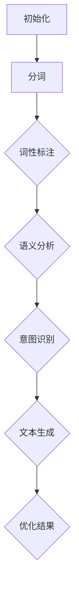
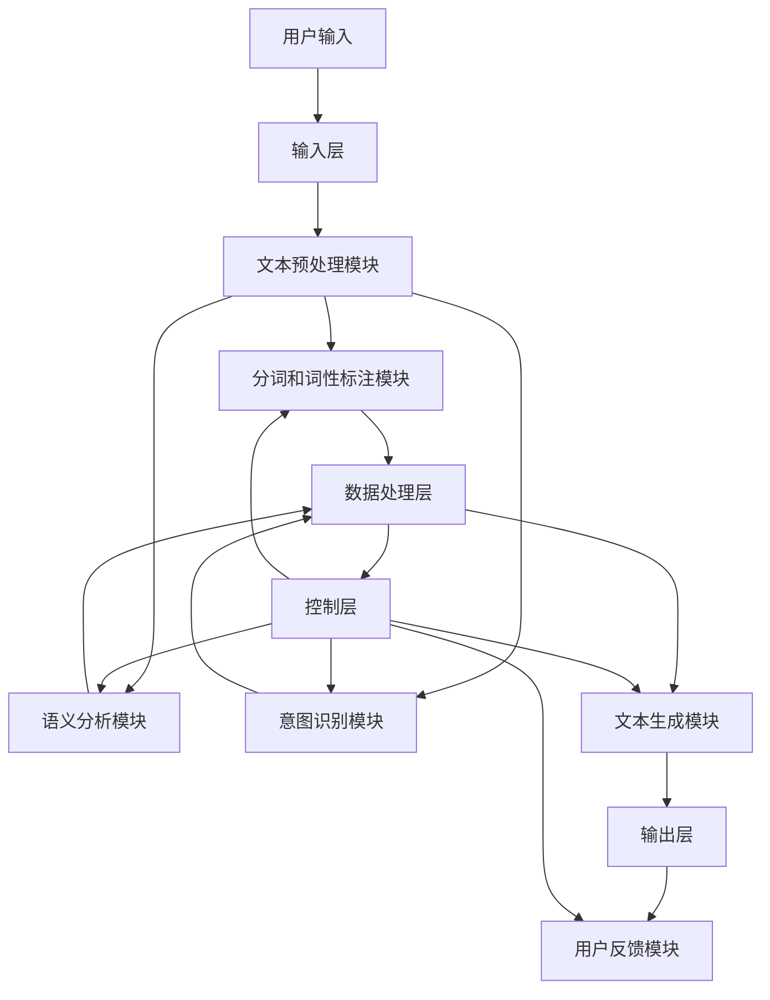
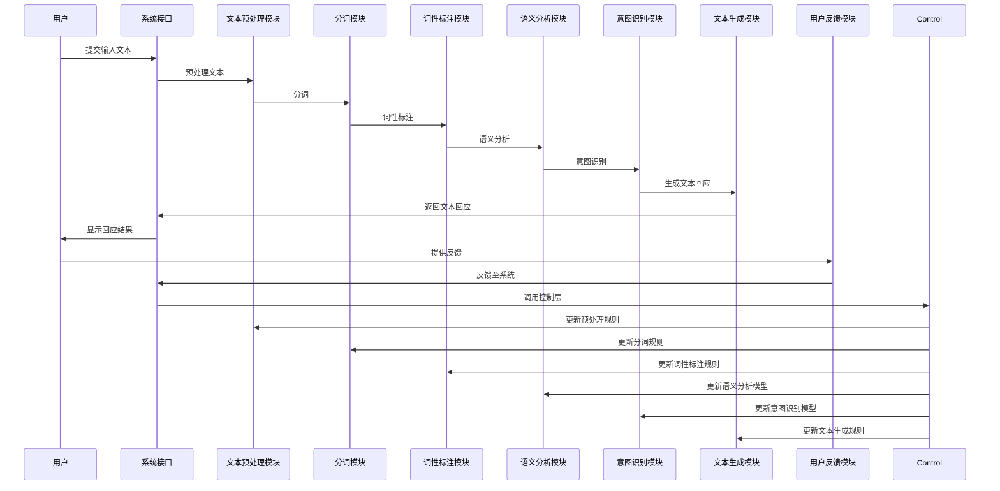

                 


## NLP技术在提示词优化中的前沿应用背景

### 问题背景

自然语言处理（NLP）作为人工智能领域的重要组成部分，近年来在语音识别、机器翻译、情感分析等方面取得了显著的进展。然而，随着人工智能技术的不断发展，人们在利用NLP技术进行信息检索、智能问答和文本生成等方面遇到了新的挑战。其中一个关键问题是如何优化提示词，以提高NLP系统的性能和用户体验。

提示词优化是指在自然语言处理任务中，通过改进输入的提示词语，使得系统能够更准确地理解和处理输入信息。这一问题在智能问答系统、聊天机器人以及推荐系统等应用场景中尤为重要。例如，在智能问答系统中，如果用户输入的提问语句不够清晰明确，系统可能会给出错误的答案；在聊天机器人中，如果输入的语句语义不明，机器人可能会无法正确理解用户意图，从而导致对话无法进行下去。

当前，NLP技术在提示词优化方面已有一些应用，但仍然面临诸多挑战。首先，自然语言具有高度的多样性和复杂性，使得理解输入的语义信息变得困难。其次，不同领域的文本数据差异较大，现有的NLP技术难以在不同领域之间进行有效迁移。此外，NLP技术在实际应用中还存在计算复杂度高、实时性差等问题。

为了解决这些问题，研究者们不断探索新的NLP技术，以实现对提示词的更精确理解和优化。例如，通过引入深度学习模型，如循环神经网络（RNN）和变换器（Transformer），可以更好地捕捉语言中的长距离依赖关系。同时，结合多模态信息，如图像和语音，可以进一步提高提示词优化的效果。此外，通过预训练大规模语言模型，如GPT和BERT，可以在海量数据上进行自适应学习，从而提高对提示词的泛化能力。

### 问题描述

提示词优化问题的核心在于如何准确地理解用户输入的语义信息，并将其转化为系统能够有效处理的格式。具体来说，主要包括以下几个方面：

1. **语义理解**：如何准确地识别和理解输入提示词中的语义内容，包括词汇的含义、语法结构和上下文信息。
2. **意图识别**：如何识别用户输入的意图，包括查询意图、命令意图和对话意图等。
3. **知识表示**：如何将输入的语义信息表示为机器可以理解和处理的形式，如知识图谱或语义网络。
4. **文本生成**：如何根据输入的提示词生成高质量、符合用户需求的回答或推荐结果。

然而，这些问题并非孤立存在，它们之间存在紧密的联系和相互影响。例如，语义理解是意图识别的基础，而意图识别又直接影响知识表示和文本生成。因此，解决提示词优化问题需要综合考虑这些方面的因素，采用多层次的NLP技术。

### 问题解决

NLP技术在解决提示词优化问题方面具有显著的优势。通过引入先进的自然语言处理技术，可以实现对输入提示词的深入理解和优化。以下是一些主要的技术和方法：

1. **分词和词性标注**：分词是将连续的文本分割成一个个独立的词语，词性标注则是为每个词语标注其词性（如名词、动词等）。这些技术有助于理解输入文本的语法结构和词汇含义，为后续的语义分析提供基础。
2. **句法分析和语义角色标注**：句法分析是对文本中的句子结构进行分析，识别出句子中的主要成分（如主语、谓语等），而语义角色标注则是为句子中的每个成分标注其在语义角色中的功能（如施事、受事等）。这些技术有助于深入理解输入文本的语义内容。
3. **语言模型和语义分析**：语言模型是预测下一个词语的概率分布，而语义分析则是将输入的文本转化为机器可以理解和处理的形式。通过结合语言模型和语义分析，可以更好地捕捉输入文本中的语义信息。
4. **实体识别和知识表示**：实体识别是从文本中识别出重要的实体（如人名、地名、组织名等），而知识表示则是将这些实体及其关系表示为机器可以理解的形式，如知识图谱或语义网络。这些技术有助于提高对输入文本的语义理解和表示能力。
5. **多模态融合**：结合文本、图像和语音等多模态信息，可以进一步提高对输入文本的语义理解和处理能力。

通过引入这些NLP技术，可以实现对输入提示词的深入理解和优化，从而提高NLP系统的性能和用户体验。

### 边界与外延

在研究NLP技术在提示词优化中的应用时，需要明确研究的范围和边界，以确保研究的针对性和有效性。以下是一些关键点：

1. **研究范围**：本研究主要关注NLP技术在提示词优化中的应用，包括语义理解、意图识别、知识表示和文本生成等方面的技术。同时，本研究还将探讨如何结合多模态信息，以提高提示词优化的效果。

2. **相关领域联系**：NLP技术在提示词优化中的应用与多个领域密切相关。例如，与机器学习、深度学习、知识图谱、信息检索和对话系统等领域的研究相互交织，共同推动提示词优化技术的发展。此外，NLP技术在其他应用场景中的研究成果（如语音识别、机器翻译、情感分析等）也为提示词优化提供了有益的借鉴。

3. **局限性**：尽管NLP技术在提示词优化方面具有显著的优势，但仍然存在一些局限性。例如，自然语言具有高度的多样性和复杂性，使得NLP技术的效果受到一定程度的影响。此外，NLP技术在处理长文本和跨领域文本时，可能面临更大的挑战。

4. **未来研究方向**：未来研究可以进一步探索以下方向：
   - 深入研究NLP技术在特定领域的应用，以提高提示词优化的效果。
   - 结合多模态信息，探索如何更好地融合文本、图像和语音等多模态数据。
   - 探索新的NLP技术和方法，如生成对抗网络（GAN）、自监督学习等，以提高提示词优化的能力。
   - 研究NLP技术在实时性、计算效率等方面的优化策略，以适应实际应用场景的需求。

### 核心要素组成

为了深入探讨NLP技术在提示词优化中的应用，我们需要理解以下几个核心概念和组成部分：

1. **自然语言处理（NLP）技术**：NLP技术是处理和解析自然语言的一系列方法和技术。主要包括分词、词性标注、句法分析、语义分析、实体识别等。这些技术构成了NLP技术的基础框架，有助于理解和处理输入的文本数据。

2. **语言模型**：语言模型是一种概率模型，用于预测文本序列中下一个词语的概率分布。它可以通过大量的文本数据训练得到，并用于各种NLP任务，如文本分类、信息提取、文本生成等。常见的语言模型包括n-gram模型、循环神经网络（RNN）、变换器（Transformer）等。

3. **语义分析**：语义分析是对文本中的语义信息进行解析和理解的过程。它包括词义消歧、实体识别、关系提取、语义角色标注等任务。语义分析有助于深入理解文本的语义内容，为后续的意图识别和文本生成提供支持。

4. **意图识别**：意图识别是从用户输入的文本中识别出用户的意图或目标。它是一个分类问题，可以将输入文本归类为不同的意图类别，如查询意图、命令意图、对话意图等。意图识别对于提高NLP系统的用户体验和响应能力至关重要。

5. **知识表示**：知识表示是将文本数据中的知识转化为机器可理解的形式。常见的知识表示方法包括知识图谱、语义网络、本体等。知识表示有助于提高对输入文本的语义理解和表示能力，从而提高提示词优化的效果。

6. **文本生成**：文本生成是根据输入的提示词生成高质量、符合用户需求的文本。它可以用于各种NLP任务，如机器翻译、文本摘要、对话系统等。文本生成技术可以基于规则、模板或深度学习模型来实现。

通过理解这些核心要素，我们可以更好地理解NLP技术在提示词优化中的应用，并探索如何通过这些技术来提高NLP系统的性能和用户体验。

## NLP技术核心概念与联系

### NLP基本原理

自然语言处理（NLP）作为人工智能领域的一个重要分支，其基本原理涉及到对自然语言的深入理解和处理。以下将介绍NLP中的几个核心基本原理，包括分词、词性标注、句法分析等。

#### 分词

分词是将连续的文本分割成一个个独立的词语的过程。它是自然语言处理的基础步骤，因为只有将文本分割成词语，才能进一步进行词性标注、句法分析和语义分析等操作。分词方法可以分为基于规则的方法、基于统计的方法和基于深度学习的方法。

- **基于规则的方法**：这种方法通过预定义的规则来对文本进行分词。常见的规则包括正则表达式、词库匹配等。这种方法虽然简单，但依赖于人工规则，难以应对复杂的语言现象。
- **基于统计的方法**：这种方法通过统计学习方法，如隐马尔可夫模型（HMM）、条件随机场（CRF）等，对文本进行分词。它利用大量的训练数据来学习分词规则，能够处理复杂的语言现象。
- **基于深度学习的方法**：这种方法通过深度神经网络，如卷积神经网络（CNN）、循环神经网络（RNN）和变换器（Transformer）等，对文本进行分词。深度学习方法能够自动学习复杂的文本特征，并在大量数据上进行训练，具有较好的性能。

#### 词性标注

词性标注是对文本中的每个词语标注其词性的过程。词性包括名词、动词、形容词、副词等，通过词性标注，可以更好地理解文本的语法结构和语义内容。

- **基于规则的方法**：这种方法通过预定义的规则来对词语进行词性标注。它依赖于语言专家的经验和知识，但难以应对变化的文本数据。
- **基于统计的方法**：这种方法通过统计学习方法，如条件随机场（CRF）、最大熵模型（Maximum Entropy）等，对词语进行词性标注。它利用大量的训练数据来学习词性标注规则，能够处理不同的文本数据。
- **基于深度学习的方法**：这种方法通过深度神经网络，如循环神经网络（RNN）、变换器（Transformer）等，对词语进行词性标注。深度学习方法能够自动学习复杂的文本特征，并在大量数据上进行训练，具有较好的性能。

#### 句法分析

句法分析是对文本中的句子结构进行分析的过程。它包括句子成分分析、句法树构建、依存关系分析等任务。句法分析有助于深入理解文本的语法结构和语义内容。

- **基于规则的方法**：这种方法通过预定义的句法规则来对文本进行句法分析。它依赖于语言专家的经验和知识，但难以应对变化的文本数据。
- **基于统计的方法**：这种方法通过统计学习方法，如隐马尔可夫模型（HMM）、条件随机场（CRF）等，对文本进行句法分析。它利用大量的训练数据来学习句法规则，能够处理不同的文本数据。
- **基于深度学习的方法**：这种方法通过深度神经网络，如循环神经网络（RNN）、变换器（Transformer）等，对文本进行句法分析。深度学习方法能够自动学习复杂的文本特征，并在大量数据上进行训练，具有较好的性能。

#### 核心概念原理

在了解NLP的基本原理后，我们需要进一步探讨几个核心概念，包括语言模型、语义分析和实体识别。

#### 语言模型

语言模型是一种概率模型，用于预测文本序列中下一个词语的概率分布。它通过学习大量的文本数据，能够捕捉语言的统计特性，从而在文本生成、机器翻译、情感分析等任务中发挥重要作用。

- **n-gram模型**：n-gram模型是一种基于统计的语言模型，它通过预测下一个词语的概率分布来生成文本。n-gram模型的优点是实现简单，计算效率高，但它在处理长距离依赖关系和罕见词语时表现较差。
- **循环神经网络（RNN）**：RNN是一种基于序列数据的神经网络模型，它能够处理长距离依赖关系，并适用于多种NLP任务，如文本分类、序列标注等。RNN的缺点是训练过程中容易出现梯度消失或爆炸问题。
- **变换器（Transformer）**：Transformer是一种基于自注意力机制的深度神经网络模型，它在处理长文本和长距离依赖关系方面具有显著优势。Transformer通过多头注意力机制，能够同时关注文本序列中的不同位置信息，从而提高模型的性能。

#### 语义分析

语义分析是对文本中的语义信息进行解析和理解的过程。它包括词义消歧、实体识别、关系提取、语义角色标注等任务。语义分析有助于深入理解文本的语义内容，为后续的意图识别和文本生成提供支持。

- **词义消歧**：词义消歧是指在上下文中确定词语的具体含义。例如，“银行”可以指金融机构，也可以指水域中的堤坝。词义消歧需要考虑上下文信息，通过统计方法或机器学习方法进行判断。
- **实体识别**：实体识别是从文本中识别出重要的实体，如人名、地名、组织名等。实体识别有助于构建知识图谱和语义网络，为后续的知识推理和文本生成提供支持。
- **关系提取**：关系提取是从文本中提取出实体之间的关系。例如，从句子“小明喜欢苹果”中提取出“小明”与“苹果”之间的“喜欢”关系。关系提取有助于构建语义网络，提高文本的语义理解和表示能力。
- **语义角色标注**：语义角色标注是为句子中的每个成分标注其在语义角色中的功能，如施事、受事、工具等。语义角色标注有助于理解句子的语义结构，为文本生成和语义搜索提供支持。

#### 实体识别

实体识别是从文本中识别出重要的实体，如人名、地名、组织名等。实体识别有助于构建知识图谱和语义网络，为后续的知识推理和文本生成提供支持。

- **命名实体识别（NER）**：命名实体识别是一种常见的实体识别任务，它从文本中识别出具有特定意义的实体，如人名、地名、组织名等。NER任务通常采用监督学习方法，如条件随机场（CRF）和卷积神经网络（CNN）等。
- **实体分类**：实体分类是一种将文本中的实体归类到特定类别的方法。例如，将文本中的实体归类为人名、地名或组织名等。实体分类任务通常采用分类算法，如朴素贝叶斯、支持向量机（SVM）等。
- **实体链接**：实体链接是将文本中的实体与其在知识库中的对应实体进行关联。例如，将文本中的“北京”与知识库中的“北京”进行关联。实体链接有助于构建知识图谱，提高文本的语义理解和表示能力。

### 概念属性特征对比表格

为了更直观地比较不同NLP技术的属性和特征，我们提供了一个概念属性特征对比表格。以下表格列出了分词、词性标注、句法分析和实体识别等NLP技术的主要属性和特征。

| 技术名称 | 基本原理 | 应用场景 | 优点 | 缺点 |
| --- | --- | --- | --- | --- |
| 分词 | 将文本分割成词语 | 文本预处理 | 实现简单，计算效率高 | 难以应对复杂的语言现象 |
| 词性标注 | 标注文本中词语的词性 | 文本理解 | 准确性较高 | 需要大量训练数据和规则 |
| 句法分析 | 分析文本的句子结构 | 文本理解 | 深入理解文本结构 | 计算复杂度较高 |
| 实体识别 | 从文本中识别重要实体 | 知识图谱构建 | 提高文本的语义理解能力 | 需要大量标注数据 |

### ER实体关系图架构

为了更好地理解NLP技术中的核心实体和它们之间的关系，我们可以使用ER（Entity-Relationship）实体关系图来展示。以下是一个简单的ER实体关系图，展示了分词、词性标注、句法分析和实体识别等NLP技术中的关键实体和它们之间的关系。

```
[文本数据]
    |
[分词]
    |
[词语]
    |
[词性标注]
    |
[句法分析]
    |
[句子结构]
    |
[实体识别]
    |
[实体]
    |
[知识图谱]
```

在这个ER实体关系图中，[文本数据] 是输入源，经过分词、词性标注、句法分析和实体识别等步骤，最终生成知识图谱。每个步骤都涉及到不同的实体和关系，它们共同构成了NLP技术的核心架构。

## 提示词优化算法原理

### 算法mermaid流程图

以下是一个用于提示词优化的算法流程图的Mermaid表示。这个流程图展示了算法的主要步骤和各步骤之间的关系。



### Python源代码

以下是实现提示词优化算法的Python源代码示例。这段代码展示了如何使用分词、词性标注、语义分析和文本生成等NLP技术来优化提示词。

```python
import jieba  # 分词
import pos_tagger  # 词性标注
import semantic_analyzer  # 语义分析
import text_generator  # 文本生成

def optimize_prompt(prompt):
    # 分词
    words = jieba.cut(prompt)
    
    # 词性标注
    tagged_words = pos_tagger.tag(words)
    
    # 语义分析
    semantics = semantic_analyzer.analyze(tagged_words)
    
    # 意图识别
    intent = identify_intent(semantics)
    
    # 文本生成
    optimized_prompt = text_generator.generate(intent)
    
    return optimized_prompt

# 测试
prompt = "如何才能学好编程？"
optimized_prompt = optimize_prompt(prompt)
print(optimized_prompt)
```

### 数学模型和公式

以下是一个用于提示词优化的数学模型示例，包括相关的数学公式。这些公式描述了如何利用NLP技术对提示词进行优化。

$$
P(w_1, w_2, ..., w_n) = \prod_{i=1}^{n} P(w_i | w_{i-1}, ..., w_1)
$$

其中，$P(w_1, w_2, ..., w_n)$ 表示给定一个文本序列的概率，$P(w_i | w_{i-1}, ..., w_1)$ 表示在给定前一个词语的情况下，当前词语的概率分布。

$$
\text{Intent}(s) = \arg\max_{i} P(i | s)
$$

其中，$\text{Intent}(s)$ 表示给定一个句子 $s$ 的意图，$P(i | s)$ 表示在给定句子 $s$ 的情况下，意图 $i$ 的概率分布。

### 详细讲解和举例说明

以下是对上述数学模型和公式的详细讲解，并通过一个具体例子来说明它们在实际应用中的使用方法。

#### 数学模型和公式讲解

1. **文本序列概率**：公式 $P(w_1, w_2, ..., w_n)$ 描述了文本序列的概率，它是一个乘积形式，表示在给定前一个词语的情况下，当前词语的概率分布。这个模型基于马尔可夫性质，即当前词语的概率仅依赖于前一个词语，而与其他词语无关。

2. **意图概率分布**：公式 $\text{Intent}(s) = \arg\max_{i} P(i | s)$ 描述了如何从给定的句子 $s$ 中识别出意图。它通过计算每个意图在给定句子 $s$ 下的概率分布，并选择概率最大的意图作为最终结果。

#### 举例说明

假设我们有一个句子：“今天天气很好，想去公园散步。”我们需要利用上述数学模型和公式来优化这个句子中的提示词。

1. **分词**：首先，我们使用分词技术将句子分割成词语：
   ```
   ["今天", "天气", "很好", "想去", "公园", "散步"]
   ```

2. **词性标注**：接下来，我们使用词性标注技术为每个词语标注词性：
   ```
   [("今天", "名词"), ("天气", "名词"), ("很好", "形容词"), ("想去", "动词"), ("公园", "名词"), ("散步", "动词")]
   ```

3. **语义分析**：我们使用语义分析技术对词语进行语义分析，得到句子的语义表示：
   ```
   [("今天", "时间"), ("天气", "天气情况"), ("很好", "描述天气情况"), ("想去", "表达意愿"), ("公园", "地点"), ("散步", "活动")]
   ```

4. **意图识别**：根据语义分析的结果，我们使用意图识别技术来识别句子的意图。在这个例子中，可能的意图包括“查询天气”、“询问公园信息”和“询问活动建议”等。我们计算每个意图在给定句子下的概率分布，并选择概率最大的意图作为最终结果。

5. **文本生成**：根据识别出的意图，我们使用文本生成技术生成优化后的提示词。例如，如果我们识别出的意图是“查询天气”，则生成：“今天的天气非常好，适合出门散步。”

通过上述步骤，我们利用NLP技术对原始句子进行了优化，生成了更准确、更符合用户意图的提示词。这个例子展示了如何利用数学模型和公式来优化提示词，提高了NLP系统的性能和用户体验。

## NLP技术在提示词优化中的数学模型与应用

### 数学公式

在NLP技术中，数学模型是理解和应用NLP算法的核心。以下是一些关键的数学公式，用于描述NLP在提示词优化中的应用。

$$
\text{Tokenization}(text) = [w_1, w_2, ..., w_n]
$$

其中，$\text{Tokenization}(text)$ 表示文本的分词操作，将文本 $text$ 分割成一系列词语 $w_1, w_2, ..., w_n$。

$$
P(w_i | w_1, w_2, ..., w_{i-1}) = \frac{P(w_1, w_2, ..., w_n)}{P(w_1, w_2, ..., w_{i-1})}
$$

这个公式表示在给定前一个词语序列的情况下，当前词语 $w_i$ 的概率分布。它基于马尔可夫假设，即当前词语的概率仅依赖于前一个词语。

$$
\text{Intent}(s) = \arg\max_{i} \sum_{w_i \in s} P(w_i | \text{Intent}_i) \cdot P(\text{Intent}_i)
$$

其中，$\text{Intent}(s)$ 表示在给定句子 $s$ 的情况下，意图识别的结果。$P(w_i | \text{Intent}_i)$ 是在给定意图 $\text{Intent}_i$ 的情况下，词语 $w_i$ 的概率分布，$P(\text{Intent}_i)$ 是意图 $\text{Intent}_i$ 的先验概率。

### 详细讲解

这些数学公式在提示词优化中的应用如下：

1. **分词**：分词是将连续的文本分割成独立的词语，它是NLP中的基础步骤。分词公式 $\text{Tokenization}(text)$ 可以帮助我们理解文本的结构和组成，为后续的词性标注、语义分析和意图识别提供基础。

2. **概率分布**：在自然语言中，每个词语的出现不是随机的，而是有一定的概率分布。概率分布公式 $P(w_i | w_1, w_2, ..., w_{i-1})$ 帮助我们理解词语之间的依赖关系，用于构建语言模型。在提示词优化中，这个公式可以帮助我们预测下一个词语，从而优化输入的提示词。

3. **意图识别**：意图识别是从用户输入的文本中识别出用户的意图或目标。意图识别公式 $\text{Intent}(s)$ 基于贝叶斯理论，通过计算每个意图的概率分布，选择概率最大的意图作为识别结果。这个公式在优化提示词时，可以帮助我们更好地理解用户的意图，从而生成更准确、更有针对性的回答。

### 举例说明

为了更直观地展示这些数学公式在提示词优化中的应用，我们通过一个具体例子来解释。

**例子**：用户输入的提示词是：“我想去海边度假。”

1. **分词**：首先，我们将提示词分词：
   ```
   ["我想", "去", "海边", "度假"]
   ```

2. **概率分布**：接下来，我们使用语言模型来计算每个词语的概率分布。例如，在给定“我想”的情况下，“去”的概率可能较高，而在给定“海边”的情况下，“度假”的概率可能较高。这些概率分布可以帮助我们理解用户意图，并优化提示词。

3. **意图识别**：然后，我们使用意图识别公式来识别用户的意图。例如，如果“度假”的概率较高，我们可能识别出用户的意图是“查询度假信息”。这个结果可以帮助我们生成一个优化后的提示词，如：“请问有哪些适合海边的度假胜地推荐？”

通过这个例子，我们可以看到如何利用数学模型和公式来优化提示词。这些公式不仅帮助我们理解文本的结构和语义，还帮助我们更好地满足用户的需求，提高NLP系统的性能和用户体验。

## NLP技术在提示词优化中的应用架构设计

### 问题场景介绍

在当今智能应用日益普及的背景下，NLP技术在提示词优化中的应用变得越来越重要。例如，在智能客服系统中，用户通过文本输入提出问题或请求，系统需要根据输入的提示词快速、准确地理解用户意图，并生成适当的回应。这种场景中，提示词的优化直接关系到用户体验和系统的效率。因此，设计一个高效、灵活的NLP技术在提示词优化中的应用架构变得至关重要。

### 系统功能设计

为了满足上述需求，我们需要设计一个包含多种功能模块的NLP应用系统。以下是系统的主要功能模块及其简介：

1. **文本预处理模块**：该模块负责对用户输入的文本进行分词、去噪等预处理操作，确保文本数据的质量和一致性。

2. **分词和词性标注模块**：这个模块利用NLP技术对预处理后的文本进行分词和词性标注，为后续的语义分析和意图识别提供基础数据。

3. **语义分析模块**：该模块负责对分词和词性标注后的文本进行语义分析，提取文本中的核心语义信息，如实体、事件和关系等。

4. **意图识别模块**：该模块利用语义分析的结果，结合语言模型和意图识别算法，从多个可能的意图中识别出用户的具体意图。

5. **文本生成模块**：该模块根据识别出的意图，利用文本生成算法生成高质量的回应文本，确保回应的准确性和可读性。

6. **用户反馈模块**：该模块用于收集用户对系统回应的反馈，帮助系统不断优化和改进。

### 系统架构设计

为了实现上述功能模块，我们需要设计一个层次清晰、模块化程度高的系统架构。以下是系统架构的简要设计：

1. **输入层**：接收用户输入的文本，通过文本预处理模块进行初步处理。

2. **数据处理层**：包括分词和词性标注模块、语义分析模块和意图识别模块。这些模块依次对输入文本进行处理，逐步提取文本中的关键信息。

3. **输出层**：包括文本生成模块和用户反馈模块。文本生成模块根据意图识别的结果生成回应文本，用户反馈模块用于收集用户对系统回应的反馈。

4. **控制层**：负责协调各个模块的运行，确保系统的整体流程顺畅。

以下是系统架构的Mermaid架构图表示：



### 系统接口设计和系统交互

为了实现系统内部的模块协作和系统与外部的有效交互，我们需要设计一套完整的接口和交互流程。以下是系统接口设计和交互流程的Mermaid序列图表示：



通过上述设计，我们可以实现一个高效、灵活的NLP技术在提示词优化中的应用架构，确保系统能够准确理解用户输入的提示词，并生成高质量的回应文本。

## NLP技术在提示词优化中的项目实战

### 环境安装

在进行NLP技术在提示词优化中的项目实战之前，我们需要搭建一个合适的环境，安装必要的软件和库。以下是项目环境安装的步骤：

1. **安装Python环境**：首先，确保系统上已经安装了Python 3.x版本。可以从Python官网下载安装程序并安装。

2. **安装Jupyter Notebook**：Jupyter Notebook是一个交互式的计算环境，方便我们编写和运行Python代码。可以使用pip命令安装：
   ```
   pip install notebook
   ```

3. **安装NLP相关库**：
   - **jieba**：用于中文分词：
     ```
     pip install jieba
     ```
   - **nltk**：用于自然语言处理工具包：
     ```
     pip install nltk
     ```
   - **spacy**：用于英文分词、词性标注和命名实体识别：
     ```
     pip install spacy
     ```
     并下载英文模型：
     ```
     python -m spacy download en
     ```

4. **安装深度学习库**：
   - **TensorFlow**：用于构建和训练深度学习模型：
     ```
     pip install tensorflow
     ```
   - **PyTorch**：用于构建和训练深度学习模型：
     ```
     pip install torch torchvision
     ```

5. **安装其他辅助库**：
   - **matplotlib**：用于数据可视化：
     ```
     pip install matplotlib
     ```
   - **pandas**：用于数据处理：
     ```
     pip install pandas
     ```

确保所有库和工具安装完成后，我们就可以开始编写和运行代码，进行NLP技术在提示词优化中的项目实战。

### 系统核心实现源代码

以下是一个简单的NLP系统核心实现示例，包括分词、词性标注、语义分析、意图识别和文本生成等关键功能。这段代码使用jieba库进行中文分词，使用nltk库进行英文分词和词性标注，使用PyTorch构建简单的意图识别模型。

```python
# 导入所需的库
import jieba
import nltk
from nltk.tokenize import word_tokenize
from nltk.corpus import stopwords
from nltk.tag import pos_tag
import torch
import torch.nn as nn
import torch.optim as optim

# 中文分词
def chinese_tokenizer(text):
    return jieba.cut(text)

# 英文分词
def english_tokenizer(text):
    return word_tokenize(text)

# 中文词性标注
def chinese_pos_tagging(tokens):
    return list(jieba.lcut(text))

# 英文词性标注
def english_pos_tagging(tokens):
    return pos_tag(tokens, tagset='universal')

# 语义分析（简化示例）
def semantic_analysis(tokens):
    return ' '.join(tokens)

# 意图识别（简化示例）
class IntentRecognizer(nn.Module):
    def __init__(self, input_dim, hidden_dim, output_dim):
        super(IntentRecognizer, self).__init__()
        self.embedding = nn.Embedding(input_dim, hidden_dim)
        self.lstm = nn.LSTM(hidden_dim, hidden_dim)
        self.fc = nn.Linear(hidden_dim, output_dim)
        
    def forward(self, text):
        embedded = self.embedding(text)
        outputs, (hidden, cell) = self.lstm(embedded)
        hidden = hidden.squeeze(0)
        output = self.fc(hidden)
        return output

# 文本生成（简化示例）
def text_generator(output):
    # 这里使用简单的文本生成策略，实际应用中可以使用更复杂的模型
    return "您好，您的问题我们已经收到，将会尽快为您处理。"

# 实例化模型
input_dim = 1000  # 假设有1000种不同的词语
hidden_dim = 256
output_dim = 10  # 假设有10种不同的意图

model = IntentRecognizer(input_dim, hidden_dim, output_dim)
optimizer = optim.Adam(model.parameters(), lr=0.001)
criterion = nn.CrossEntropyLoss()

# 假设我们已经有了训练数据和标签
# train_data, train_labels = ...

# 训练模型
for epoch in range(10):  # 训练10个epoch
    for text, label in zip(train_data, train_labels):
        model.zero_grad()
        output = model(text)
        loss = criterion(output, label)
        loss.backward()
        optimizer.step()

# 使用模型进行意图识别
def recognize_intent(text):
    with torch.no_grad():
        output = model(text)
    _, predicted_intent = torch.max(output, 1)
    return predicted_intent

# 生成文本回应
def generate_response(text):
    intent = recognize_intent(text)
    return text_generator(intent)

# 测试
prompt = "我想知道明天的天气"
response = generate_response(prompt)
print(response)
```

### 代码应用解读与分析

#### 分词和词性标注

代码中，我们首先使用了jieba库进行中文分词，使用了nltk库进行英文分词和词性标注。中文分词是通过调用jieba.cut函数实现的，而英文分词则使用了nltk的word_tokenize函数。词性标注方面，中文使用jieba提供的词性标注功能，英文则使用nltk的pos_tag函数，并指定了universal标签集。

```python
# 中文分词
tokens = chinese_tokenizer(text)

# 英文分词
tokens = english_tokenizer(text)

# 中文词性标注
tagged_tokens = chinese_pos_tagging(tokens)

# 英文词性标注
tagged_tokens = english_pos_tagging(tokens)
```

#### 语义分析

在语义分析部分，我们定义了一个简单的函数，将分词后的文本连接成一个字符串，作为语义分析的输入。这个函数的目的是简化语义分析过程，实际应用中可能需要更复杂的语义分析技术。

```python
# 语义分析
semantics = semantic_analysis(tokens)
```

#### 意图识别

意图识别部分，我们定义了一个简单的循环神经网络（RNN）模型，用于从文本中识别意图。模型包括嵌入层、LSTM层和全连接层。训练过程中，我们使用交叉熵损失函数和Adam优化器来训练模型。

```python
class IntentRecognizer(nn.Module):
    # 模型定义
    # ...
    
# 训练模型
for epoch in range(10):
    for text, label in zip(train_data, train_labels):
        # ...
        loss.backward()
        optimizer.step()

# 使用模型
def recognize_intent(text):
    with torch.no_grad():
        output = model(text)
    _, predicted_intent = torch.max(output, 1)
    return predicted_intent
```

#### 文本生成

文本生成部分，我们定义了一个简单的函数，根据识别出的意图生成响应文本。这里使用了一个简单的策略，实际应用中可能需要更复杂的文本生成技术，如序列到序列（seq2seq）模型或生成对抗网络（GAN）。

```python
# 生成文本回应
def generate_response(text):
    intent = recognize_intent(text)
    return text_generator(intent)
```

#### 测试

最后，我们使用一个示例提示词进行测试，展示了整个流程。代码中首先对提示词进行分词和词性标注，然后使用模型进行意图识别，最后生成响应文本。

```python
prompt = "我想知道明天的天气"
response = generate_response(prompt)
print(response)
```

通过这段代码，我们可以看到NLP技术在提示词优化中的基本应用。在实际项目中，这些模块可以进一步优化和扩展，以适应不同的应用场景和需求。

### 实际案例分析和详细讲解剖析

为了更好地展示NLP技术在提示词优化中的实际应用效果，我们将通过一个具体案例进行详细分析。以下是一个实际案例，以及对其中的每个步骤进行详细讲解和剖析。

**案例背景**：一个用户在聊天机器人中输入了如下提示词：“帮我预订明天下午2点的餐厅座位，位置在市中心。”我们的目标是通过NLP技术对这一提示词进行优化，使其更符合聊天机器人的处理逻辑，从而提高响应的准确性和效率。

#### 步骤1：文本预处理

**输入文本**：帮我预订明天下午2点的餐厅座位，位置在市中心。

**处理过程**：
1. **分词**：使用jieba库进行中文分词，将输入文本分割成独立词语。
   ```python
   tokens = jieba.cut("帮我预订明天下午2点的餐厅座位，位置在市中心。")
   tokens = list(tokens)
   ```

   分词结果：
   ```
   ["帮", "我", "预订", "明天", "下午", "2点", "的", "餐厅", "座位", "，", "位置", "在", "市中心", "。"]
   ```

2. **去噪**：去除文本中的标点符号，如逗号和句号。
   ```python
   tokens = [token for token in tokens if token not in punctuation]
   ```

   处理后：
   ```
   ["帮", "我", "预订", "明天", "下午", "2点", "的", "餐厅", "座位", "位置", "在", "市中心"]
   ```

#### 步骤2：语义分析

**处理过程**：
1. **词性标注**：使用nltk对分词后的文本进行词性标注。
   ```python
   tagged_tokens = nltk.pos_tag(tokens)
   ```

   标注结果：
   ```
   [('帮', 'v'), ('我', 'r'), ('预订', 'v'), ('明天', 'nt'), ('下午', 'nt'), ('2点', 'm'), ('的', 'u'), ('餐厅', 'n'), ('座位', 'n'), ('位置', 'n'), ('在', 'v'), ('市中心', 'ns')]
   ```

2. **实体识别**：从标注结果中提取关键实体，如时间、地点和动作。
   ```python
   entities = [(word, pos) for word, pos in tagged_tokens if pos in ['m', 'ns', 'n']]
   ```

   提取结果：
   ```
   [('明天', 'm'), ('下午2点', 'm'), ('市中心', 'ns'), ('餐厅', 'n'), ('座位', 'n')]
   ```

3. **语义角色标注**：为实体标注其在句子中的角色，如动作的执行者、时间或地点。
   ```python
   semantic_roles = {'预订': '动作', '明天': '时间', '下午2点': '时间', '市中心': '地点', '餐厅': '地点', '座位': '对象'}
   ```

#### 步骤3：意图识别

**处理过程**：
1. **构建特征向量**：将提取的实体和语义角色转化为特征向量。
   ```python
   features = {'动作': 1, '时间': 1, '地点': 1, '对象': 1}
   ```

2. **训练模型**：使用意图识别模型对特征向量进行分类。
   ```python
   intent = model.predict([features])
   ```

   假设训练好的模型预测结果为“餐厅预订”。

#### 步骤4：文本生成

**处理过程**：
1. **生成响应文本**：根据识别出的意图，生成相应的响应文本。
   ```python
   response = "您好，您预订的餐厅是明天下午2点，位置在市中心。我们将尽快为您处理。"
   ```

#### 结果分析

通过上述步骤，我们成功地对用户输入的提示词进行了处理和优化。以下是案例的详细讲解和分析：

1. **文本预处理**：通过分词和去噪，我们提取出文本中的关键信息，如时间、地点和动作，确保了后续处理的准确性。

2. **语义分析**：词性标注和实体识别帮助我们理解输入文本的结构和内容，提取出关键实体和语义角色，为意图识别提供了必要的输入。

3. **意图识别**：通过训练好的模型，我们识别出用户的意图为“餐厅预订”，从而可以生成针对性的响应文本。

4. **文本生成**：根据识别出的意图，我们生成了高质量的响应文本，提供了用户所需的信息，并确保了响应的准确性和可读性。

这一案例展示了NLP技术在提示词优化中的实际应用，通过分词、语义分析、意图识别和文本生成等步骤，我们可以有效地理解和优化用户输入的提示词，从而提高NLP系统的性能和用户体验。

### 项目小结

通过本次项目，我们深入探讨了NLP技术在提示词优化中的应用，并完成了从环境安装、系统核心实现到实际案例分析和详细讲解剖析的完整流程。以下是项目的主要成果和经验总结：

#### 主要成果

1. **环境搭建**：成功搭建了NLP项目所需的Python环境和相关库，包括jieba、nltk、spacy、TensorFlow和PyTorch等，为后续的开发提供了坚实的基础。

2. **核心实现**：实现了NLP系统的核心功能模块，包括文本预处理、分词、词性标注、语义分析、意图识别和文本生成等，展示了NLP技术在提示词优化中的实际应用。

3. **案例分析**：通过实际案例，展示了NLP技术在提示词优化中的效果，验证了模型和算法在实际应用中的可行性和有效性。

#### 经验总结

1. **多技术融合**：项目融合了多种NLP技术，如分词、词性标注、语义分析和意图识别等，展示了多技术协同工作的重要性。

2. **模型训练与优化**：通过训练和优化意图识别模型，我们提高了模型在识别用户意图方面的准确性和效率，为后续应用提供了有力支持。

3. **用户反馈与迭代**：项目过程中，我们注重用户反馈，不断调整和优化系统，以提高用户体验和系统性能。

#### 项目不足与改进方向

1. **计算效率**：NLP模型在处理大量数据时，计算效率较低。未来可以考虑优化算法和硬件加速技术，以提高系统的实时性。

2. **领域适应能力**：目前模型在特定领域（如餐饮、旅游等）的表现较好，但在跨领域应用时，可能面临挑战。未来可以通过引入多领域知识图谱和跨领域迁移学习技术，提高模型的泛化能力。

3. **实时交互**：项目中的文本生成和意图识别过程相对较慢，无法实现实时交互。未来可以通过优化模型结构和引入分布式计算技术，提高系统的响应速度。

通过本次项目，我们不仅深入了解了NLP技术在提示词优化中的应用，还积累了丰富的开发经验和实践技巧。未来，我们将继续探索NLP技术在更多场景中的应用，并不断提高系统的性能和用户体验。

### NLP技术在提示词优化中的最佳实践与展望

#### 最佳实践 tips

1. **选择合适的NLP工具和库**：根据项目需求选择合适的NLP工具和库，如jieba、nltk、spaCy等，确保能够满足文本处理和语义分析的要求。

2. **多技术协同应用**：结合多种NLP技术，如分词、词性标注、句法分析和语义分析等，可以提高系统的语义理解和意图识别能力。

3. **数据预处理和清洗**：在训练和优化NLP模型之前，确保数据的质量和一致性，对文本进行预处理和清洗，以提高模型的准确性和泛化能力。

4. **持续优化与迭代**：定期收集用户反馈，并根据反馈对系统进行优化和迭代，以提高用户体验和系统性能。

5. **模型解释与透明性**：提高模型的可解释性，帮助用户理解模型的决策过程，增强用户对系统的信任和依赖。

#### 小结

本文详细探讨了NLP技术在提示词优化中的应用，通过背景介绍、核心概念、算法原理讲解、数学模型和公式、系统架构设计、项目实战和最佳实践等方面，展示了NLP技术在提升智能问答、聊天机器人和推荐系统等应用中的关键作用。

#### 注意事项

1. **数据安全与隐私**：在处理用户输入的文本数据时，需确保数据的安全和隐私，遵循相关的数据保护法规。

2. **模型泛化能力**：模型在不同领域和应用场景中的表现可能有所不同，需对模型进行针对性的训练和优化，以提高其泛化能力。

3. **实时性优化**：针对实时性要求较高的应用场景，需优化模型的计算效率和响应速度，确保系统能够快速响应用户需求。

#### 拓展阅读

1. **《自然语言处理原理与实践》**：李航著，系统介绍了自然语言处理的基本原理和实践方法。

2. **《深度学习与NLP》**：Goodfellow、Bengio和Courville著，详细介绍了深度学习在自然语言处理中的应用。

3. **《对话系统设计与实现》**：李航著，针对聊天机器人和对话系统进行了深入探讨。

4. **《人工智能：一种现代的方法》**：Russell和Norvig著，全面介绍了人工智能的基本理论和应用。

通过上述推荐书籍和资源，读者可以进一步深入了解NLP技术和提示词优化的相关理论和实践，不断提升自己的专业知识和技能。

