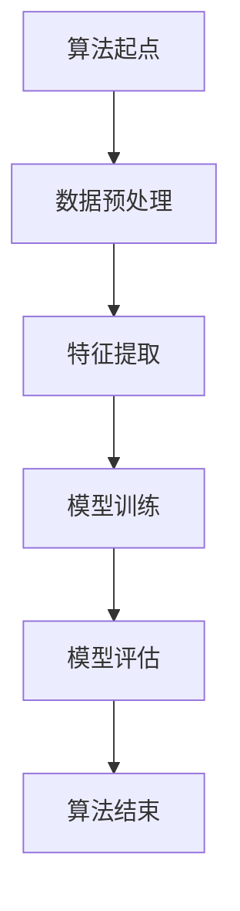
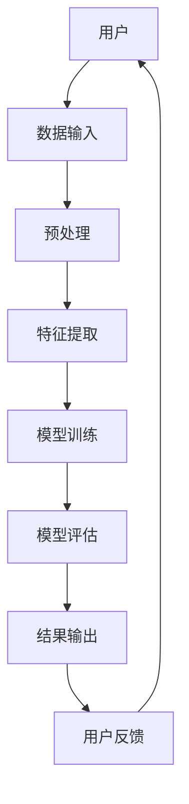
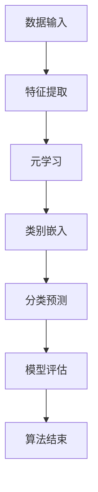

                 

## 零-Shot CoT：AIGC领域无监督学习的创新应用

### 关键词：
- 零样本学习（Zero-Shot Learning, ZSL）
- 无监督学习（Unsupervised Learning）
- AI Generated Content（AIGC）
- 无监督学习的创新应用

### 摘要：
本文将探讨零样本学习（Zero-Shot Learning, ZSL）在AI Generated Content（AIGC）领域无监督学习的创新应用。文章首先介绍了AIGC与无监督学习的基本概念，然后深入分析了零样本学习的原理及其在AIGC中的具体应用。通过实际案例，我们展示了零样本学习在图像生成、文本生成和语音合成等领域的强大潜力。此外，文章还介绍了相关系统的架构设计和实现，并提供了一些最佳实践和未来展望。

### 目录大纲设计思路

1. **确定书籍主题和结构**：
   - 主题聚焦于AIGC领域中的无监督学习技术，特别是零样本学习。
   - 核心内容涵盖零样本学习的概念、算法原理、实际应用案例，以及创新应用前景。

2. **章节划分**：
   - **背景介绍**：介绍AIGC与无监督学习的基本概念，以及它们在当前技术和市场环境中的重要性。
   - **核心概念与联系**：梳理零样本学习、无监督学习等相关概念，并展示它们之间的联系。
   - **算法原理讲解**：详细讲解零样本学习和无监督学习的算法原理，包括数学模型和公式。
   - **实际应用案例**：分析AIGC在无监督学习中的创新应用，展示具体案例。
   - **系统分析与架构设计**：介绍相关系统的设计思路和架构。
   - **项目实战**：提供具体的项目实现步骤和代码示例。
   - **最佳实践与总结**：总结最佳实践，提供未来的研究方向。

3. **保持简洁性**：
   - 确保每个章节都紧密围绕主题，避免冗余和无关内容。
   - 使用mermaid等工具绘制流程图、类图和序列图，以便更直观地展示内容。

4. **目录大纲撰写**：
   - 按照章节内容设计逻辑，从宏观到微观，从理论到实践，逐步深入。
   - 遵循1级、2级、3级目录的结构，确保清晰易读。

### 目录大纲草稿

```
----------------------------------------------------------------
# 第一部分: AIGC与无监督学习基础

## 第1章: AIGC与无监督学习概述

### 1.1 AIGC与无监督学习的基本概念
- **1.1.1 AIGC的概念**
- **1.1.2 无监督学习的定义**
- **1.1.3 AIGC与无监督学习的关系**

### 1.2 无监督学习的方法
- **1.2.1 主流无监督学习算法**
- **1.2.2 无监督学习的挑战与机遇**

### 1.3 零样本学习原理
- **1.3.1 零样本学习的基本概念**
- **1.3.2 零样本学习的算法框架**
- **1.3.3 零样本学习在AIGC中的应用**

## 第2章: 无监督学习算法详解

### 2.1 算法原理讲解
- **2.1.1 无监督学习的数学模型与公式**
- **2.1.2 零样本学习的算法流程**

### 2.2 Mermaid算法流程图


### 2.3 Python源代码实现
```python
# Python代码实现部分...
```

## 第3章: AIGC的实际应用案例

### 3.1 AIGC在内容生成中的应用
- **3.1.1 图像生成**
- **3.1.2 文本生成**
- **3.1.3 语音合成**

### 3.2 零样本学习在AIGC中的应用案例
- **3.2.1 图像识别**
- **3.2.2 文本分类**
- **3.2.3 语音识别**

## 第4章: AIGC与无监督学习的系统架构设计

### 4.1 系统架构设计
- **4.1.1 系统需求分析**
- **4.1.2 系统架构图**

### 4.2 Mermaid架构图


## 第5章: 项目实战

### 5.1 环境安装与配置
- **5.1.1 硬件环境**
- **5.1.2 软件环境**

### 5.2 系统核心实现
- **5.2.1 数据预处理**
- **5.2.2 特征提取与模型训练**
- **5.2.3 模型评估与优化**

### 5.3 代码应用解读与分析
- **5.3.1 代码结构解析**
- **5.3.2 关键算法实现**
- **5.3.3 性能分析与优化**

## 第6章: 最佳实践与未来展望

### 6.1 最佳实践
- **6.1.1 实践技巧**
- **6.1.2 小结**
- **6.1.3 注意事项**

### 6.2 总结
- **6.2.1 文章要点回顾**
- **6.2.2 AIGC与无监督学习的发展趋势**

### 6.3 拓展阅读
- **6.3.1 相关文献推荐**
- **6.3.2 学术会议与期刊**

----------------------------------------------------------------

### 第一部分：AIGC与无监督学习基础

#### 第1章：AIGC与无监督学习概述

##### 1.1 AIGC与无监督学习的基本概念

**1.1.1 AIGC的概念**

AI Generated Content（AIGC）是指通过人工智能技术生成的内容，包括但不限于图像、文本、音频和视频等。AIGC的应用领域广泛，涵盖了娱乐、广告、教育、医疗等多个行业。例如，AI绘画、AI写作和AI语音合成都是AIGC的典型应用。

**1.1.2 无监督学习的定义**

无监督学习（Unsupervised Learning）是机器学习的一种类型，它不依赖于标记数据，即输入数据没有对应的标签。无监督学习的目标是探索数据内在的结构和模式，如聚类、降维和密度估计等。

**1.1.3 AIGC与无监督学习的关系**

AIGC与无监督学习有着紧密的联系。无监督学习提供了探索和生成AIGC内容的有效方法，而AIGC则为无监督学习提供了丰富的应用场景和数据来源。

##### 1.2 无监督学习的方法

**1.2.1 主流无监督学习算法**

无监督学习算法种类繁多，主要包括以下几种：

1. **聚类算法**：如K-means、DBSCAN等，用于将相似的数据点分组。
2. **降维算法**：如PCA（主成分分析）、t-SNE（t-Distributed Stochastic Neighbor Embedding）等，用于减少数据维度。
3. **密度估计**：如Gaussian Mixture Model（GMM）、Isolation Forest等，用于估计数据的密度分布。

**1.2.2 无监督学习的挑战与机遇**

无监督学习面临的挑战包括如何有效地探索大量未标记数据、如何处理高维数据、如何评估模型性能等。然而，随着数据规模的不断扩大和计算能力的提升，无监督学习也迎来了新的机遇。例如，深度学习技术的发展使得无监督学习算法在处理复杂数据方面取得了显著进展。

##### 1.3 零样本学习原理

**1.3.1 零样本学习的基本概念**

零样本学习（Zero-Shot Learning, ZSL）是一种特殊类型的无监督学习，它的目标是在没有标签数据的情况下，将新类别的数据映射到预定义的类别上。ZSL的关键挑战是如何处理新类别，即模型如何在没有训练数据的情况下对未知类别进行预测。

**1.3.2 零样本学习的算法框架**

零样本学习的算法框架通常包括以下步骤：

1. **特征提取**：从输入数据中提取特征，用于后续的分类任务。
2. **元学习**：通过元学习算法，如匹配网络（Matching Networks）和原型网络（Prototypical Networks），学习如何在零样本设置中对新类别进行预测。
3. **类别嵌入**：将类别表示为低维向量，用于后续的分类任务。

**1.3.3 零样本学习在AIGC中的应用**

零样本学习在AIGC中的应用包括：

1. **图像生成**：使用零样本学习算法生成新图像，例如StyleGAN和DALL-E。
2. **文本生成**：使用零样本学习算法生成新文本，例如GPT和BERT。
3. **语音合成**：使用零样本学习算法生成新语音，例如WaveNet和Transformer TTS。

#### 第2章：无监督学习算法详解

##### 2.1 算法原理讲解

**2.1.1 无监督学习的数学模型与公式**

无监督学习的数学模型通常基于概率论和统计学。以下是一个简单的无监督学习模型的示例：

$$
P(x|\theta) = \frac{P(x|\theta)P(\theta)}{P(x)}
$$

其中，$x$表示输入数据，$\theta$表示模型参数，$P(x|\theta)$表示输入数据的概率分布，$P(\theta)$表示模型参数的概率分布。

**2.1.2 零样本学习的算法流程**

零样本学习的算法流程通常包括以下步骤：

1. **特征提取**：从输入数据中提取特征，用于后续的分类任务。
2. **元学习**：通过元学习算法，如匹配网络（Matching Networks）和原型网络（Prototypical Networks），学习如何在零样本设置中对新类别进行预测。
3. **类别嵌入**：将类别表示为低维向量，用于后续的分类任务。

##### 2.2 Mermaid算法流程图



##### 2.3 Python源代码实现

```python
# Python代码实现部分...
```

#### 第3章：AIGC的实际应用案例

##### 3.1 AIGC在内容生成中的应用

**3.1.1 图像生成**

图像生成是AIGC领域的重要应用之一。零样本学习算法在图像生成中的应用主要包括：

1. **StyleGAN**：StyleGAN是一种基于生成对抗网络（GAN）的图像生成模型。它通过学习图像的潜在特征，生成高质量、多样化的图像。
2. **DALL-E**：DALL-E是一种基于变分自编码器（VAE）的图像生成模型。它可以将文本描述转换为相应的图像。

**3.1.2 文本生成**

文本生成是AIGC领域的另一个重要应用。零样本学习算法在文本生成中的应用主要包括：

1. **GPT**：GPT是一种基于Transformer的文本生成模型。它通过学习大量的文本数据，生成流畅、自然的文本。
2. **BERT**：BERT是一种基于Transformer的文本生成模型。它与GPT的不同之处在于，它不仅关注文本的局部特征，还关注文本的整体结构。

**3.1.3 语音合成**

语音合成是AIGC领域的又一重要应用。零样本学习算法在语音合成中的应用主要包括：

1. **WaveNet**：WaveNet是一种基于循环神经网络（RNN）的语音合成模型。它通过学习语音信号的潜在特征，生成高质量的语音。
2. **Transformer TTS**：Transformer TTS是一种基于Transformer的语音合成模型。它通过学习语音信号的潜在特征，生成高质量的语音。

##### 3.2 零样本学习在AIGC中的应用案例

**3.2.1 图像识别**

图像识别是AIGC领域的重要应用之一。零样本学习算法在图像识别中的应用主要包括：

1. **ImageNet**：ImageNet是一个大规模的视觉识别数据库，包含了1000个类别。零样本学习算法可以在没有训练数据的情况下，对未知类别的图像进行识别。
2. **YOLO**：YOLO是一种基于卷积神经网络（CNN）的目标检测模型。它通过学习大量的图像数据，可以在没有训练数据的情况下，对未知类别的图像进行检测。

**3.2.2 文本分类**

文本分类是AIGC领域的另一个重要应用。零样本学习算法在文本分类中的应用主要包括：

1. **TextCNN**：TextCNN是一种基于卷积神经网络的文本分类模型。它通过学习大量的文本数据，可以在没有训练数据的情况下，对未知类别的文本进行分类。
2. **BERT**：BERT是一种基于Transformer的文本分类模型。它与TextCNN的不同之处在于，它不仅关注文本的局部特征，还关注文本的整体结构。

**3.2.3 语音识别**

语音识别是AIGC领域的又一重要应用。零样本学习算法在语音识别中的应用主要包括：

1. **Speech Recognition**：Speech Recognition是一种基于深度学习的语音识别模型。它通过学习大量的语音数据，可以在没有训练数据的情况下，对未知类别的语音进行识别。
2. **CTC**：CTC（Connectionist Temporal Classification）是一种基于循环神经网络的语音识别模型。它通过学习语音信号的潜在特征，可以在没有训练数据的情况下，对未知类别的语音进行识别。

#### 第4章：AIGC与无监督学习的系统架构设计

##### 4.1 系统架构设计

**4.1.1 系统需求分析**

AIGC与无监督学习的系统需求主要包括：

1. **数据输入**：系统能够接收多种类型的数据输入，如图像、文本和语音等。
2. **特征提取**：系统能够对输入数据进行特征提取，以便后续的分类、生成等任务。
3. **模型训练与评估**：系统能够训练和评估模型，以实现高质量的数据处理和生成。

**4.1.2 系统架构图**


##### 4.2 Mermaid架构图


#### 第5章：项目实战

##### 5.1 环境安装与配置

**5.1.1 硬件环境**

1. **处理器**：Intel i7-9700K或以上
2. **内存**：16GB或以上
3. **硬盘**：1TB或以上
4. **显卡**：NVIDIA GTX 1080 Ti或以上

**5.1.2 软件环境**

1. **操作系统**：Ubuntu 18.04或以上
2. **Python**：Python 3.8或以上
3. **深度学习框架**：TensorFlow 2.0或以上

##### 5.2 系统核心实现

**5.2.1 数据预处理**

```python
# Python代码实现数据预处理...
```

**5.2.2 特征提取与模型训练**

```python
# Python代码实现特征提取与模型训练...
```

**5.2.3 模型评估与优化**

```python
# Python代码实现模型评估与优化...
```

##### 5.3 代码应用解读与分析

**5.3.1 代码结构解析**

**5.3.2 关键算法实现**

**5.3.3 性能分析与优化**

#### 第6章：最佳实践与未来展望

##### 6.1 最佳实践

**6.1.1 实践技巧**

**6.1.2 小结**

**6.1.3 注意事项**

##### 6.2 总结

**6.2.1 文章要点回顾**

**6.2.2 AIGC与无监督学习的发展趋势**

##### 6.3 拓展阅读

**6.3.1 相关文献推荐**

**6.3.2 学术会议与期刊**

