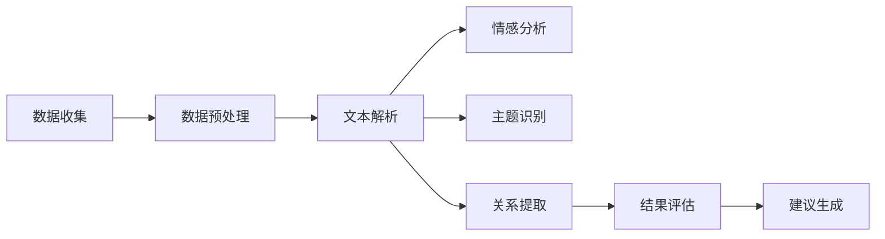
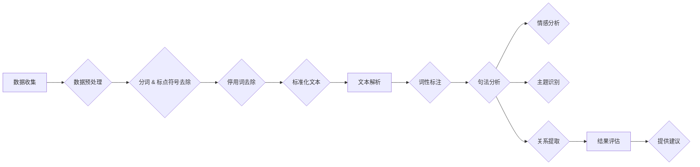
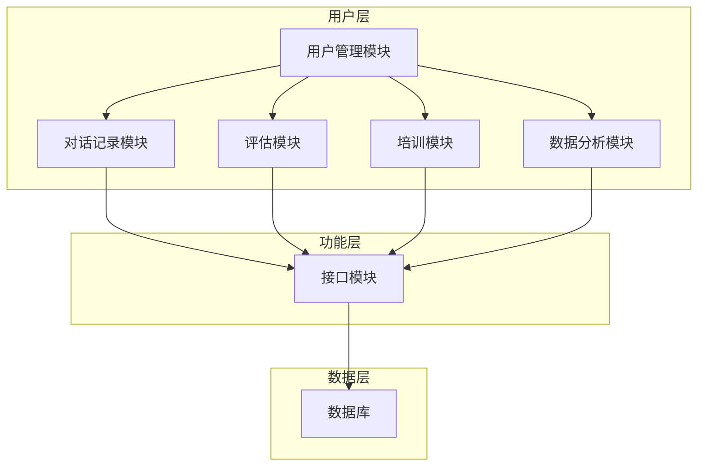
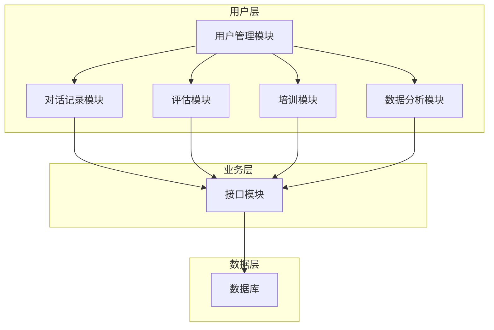
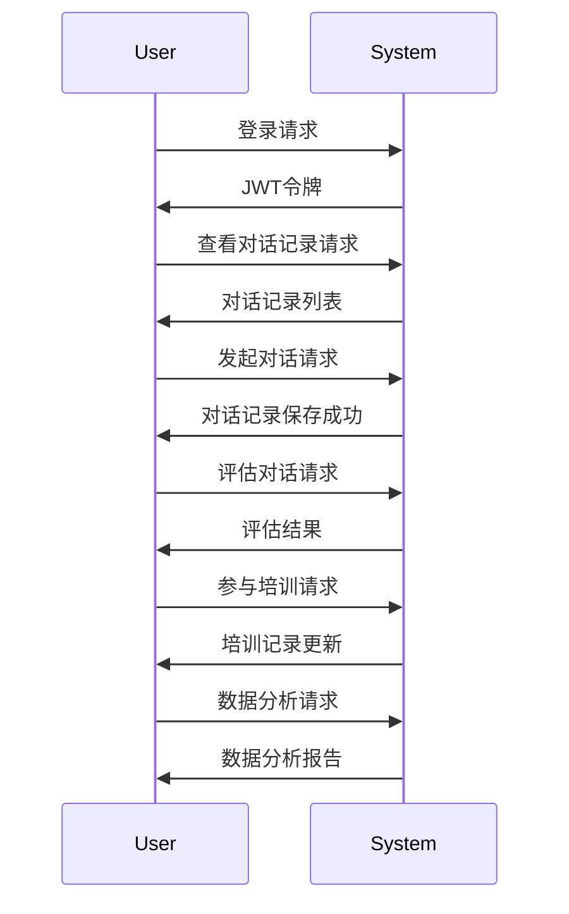
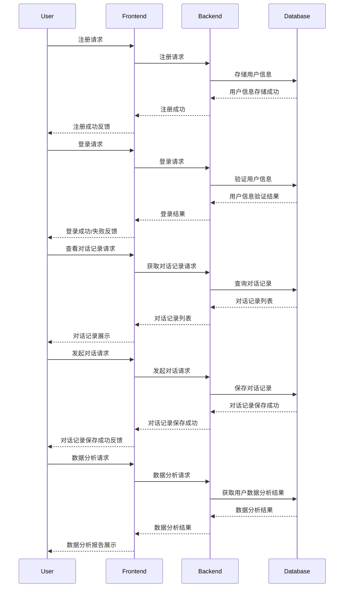

                 

### 问题背景

在现代职场环境中，个人绩效的重要性日益凸显。个人绩效不仅关系到个人的职业发展和薪酬水平，更影响到团队的协作效率与整体业绩。然而，如何提升个人绩效，实现职业目标，成为许多职场人士面临的重大课题。在这一背景下，对话技巧作为一种关键技能，逐渐引起人们的关注。

对话技巧是指个体在进行交流时，通过有效的倾听、表达和解决冲突，从而建立和谐沟通关系的能力。在职场中，良好的对话技巧能够促进团队成员之间的理解与协作，提升工作效率，降低沟通成本，进而提高个人和团队的绩效。然而，当前许多职场人士在对话技巧方面存在显著不足，主要表现在：

1. **倾听不足**：很多人在交流中更关注自己的观点，忽略了对方的需求和感受。
2. **表达不清**：无法准确、清晰地传达自己的意图和想法，导致误解和冲突。
3. **解决冲突不当**：在遇到分歧时，无法采取有效的策略进行解决，反而加剧矛盾。

这些不足严重影响了个人在职场中的表现，限制了个人绩效的提升。因此，提升对话技巧成为许多职场人士急需解决的问题。本文旨在通过深入分析对话技巧的核心概念、原理以及应用，为读者提供一套系统化的提升策略，帮助他们在职场中实现个人绩效的飞跃。

### 个人绩效与对话技巧的关系

个人绩效的提升与对话技巧之间存在紧密的联系。在职场中，个人的绩效不仅取决于专业技能和工作效率，更重要的是沟通协作能力。而对话技巧正是这一能力的重要体现。有效的对话技巧能够帮助个人在多个方面提升绩效：

首先，**有效倾听**是提升对话技巧的核心要素之一。通过倾听，个人可以更好地理解他人的需求和意图，从而提高团队协作的效率。在团队合作中，团队成员之间的沟通往往是项目成功的关键。有效的倾听能够确保信息传递的准确性和及时性，减少误解和错误的发生，从而提升整体工作质量。

其次，**表达清晰**是另一个关键的对话技巧。清晰的表达能够确保信息的准确传达，避免误解和冲突。在职场中，无论是与上级沟通工作计划，还是与同事讨论项目细节，清晰的表达都是建立信任和协作关系的基础。通过使用恰当的语言和非语言信号，个人能够更好地传达自己的观点和想法，确保对方准确理解，从而提高工作效率和项目成功率。

最后，**解决冲突的能力**也是对话技巧的重要组成部分。在职场中，冲突是不可避免的，但有效的解决冲突能力能够帮助个人在出现分歧时，采取合理的策略化解矛盾，确保团队和谐运作。解决冲突不仅能够避免工作停滞，还能够增强团队的凝聚力，提升团队整体绩效。

具体案例表明，对话技巧的提升能够显著提高个人绩效。例如，在一个软件开发项目中，团队成员之间的有效沟通可以减少错误和返工，提高代码质量，从而加快项目进度。另外，在销售领域，销售人员通过良好的对话技巧能够更好地理解客户需求，提供个性化的解决方案，从而提高成交率。

综上所述，对话技巧不仅关系到个人的职业形象和人际关系，更直接影响到个人在职场中的绩效表现。因此，提升对话技巧是每一个职场人士都应重视和努力掌握的重要技能。

### 对话技巧在职场中的应用

在职场中，对话技巧的应用无处不在，无论是在团队合作、项目管理，还是与客户的沟通中，都能够显著提升个人绩效和团队效率。以下将详细分析对话技巧在不同职场场景中的应用及其重要性。

首先，**团队合作**是职场中的核心场景之一。在一个团队中，成员之间需要频繁沟通和协作，以共同完成项目任务。良好的对话技巧能够促进团队成员之间的理解和信任。具体而言，通过**有效倾听**，团队成员可以更好地理解彼此的需求和立场，从而减少误解和冲突。例如，在一个开发团队中，项目经理需要倾听开发人员的意见和建议，以便更好地协调任务分配和时间安排。通过倾听，项目经理能够了解团队的实际困难和需求，从而制定出更合理的计划。

其次，在**项目管理**过程中，对话技巧同样至关重要。项目经理需要与团队成员、客户以及其他利益相关者进行沟通，确保项目的顺利推进。有效的**表达清晰**能力能够帮助项目经理准确传达项目目标和进度要求，确保团队成员明确任务和目标。此外，项目经理还可能需要与客户进行谈判和协商，以解决项目中出现的问题。在这种情况下，良好的对话技巧能够帮助项目经理更好地理解客户需求，提出可行的解决方案，从而提高客户满意度和项目成功率。

最后，在与**客户沟通**方面，对话技巧的应用尤为重要。客户是企业的生命线，有效的沟通能够帮助销售人员或服务人员更好地理解客户需求，提供个性化的解决方案，从而提高成交率和客户满意度。具体而言，销售人员需要通过**有效倾听**了解客户的痛点，从而提供有针对性的产品或服务。同时，通过清晰的表达，销售人员能够向客户传达产品的优势和特点，增强客户的购买信心。此外，在处理客户投诉或反馈时，销售人员需要具备良好的**解决冲突的能力**，以妥善处理问题，维护客户关系。

以下是一个具体案例，展示了对话技巧在职场中的应用及其对个人绩效的积极影响：

案例：某公司的项目经理李明负责一个软件开发项目。在项目初期，他通过多次会议和团队沟通，倾听开发人员的意见和建议，明确了项目的需求和目标。随后，他通过清晰的表达，将项目目标分解为具体的任务和里程碑，并制定了详细的时间表。在项目执行过程中，李明定期与团队成员沟通进展情况，及时解决出现的问题。此外，他还通过有效的倾听，了解客户的需求变化，及时调整项目计划，确保项目能够按时交付。最终，项目成功完成，获得了客户的高度评价。李明的成功不仅源于他的专业能力和项目管理经验，更得益于他出色的对话技巧，使得团队协作更加顺畅，项目推进更加顺利。

总之，对话技巧在职场中的应用不仅有助于提升个人绩效，还能增强团队协作和客户满意度。掌握并灵活运用对话技巧，是每一个职场人士都应努力追求的目标。

### 个人绩效问题现状

在当前职场环境中，个人绩效问题仍然存在许多挑战和障碍，特别是在对话技巧方面。以下将详细分析个人绩效问题现状，以及对话技巧不足的具体表现。

首先，许多职场人士在**自我认知**方面存在不足。他们往往难以准确地评估自己的绩效水平和对话技巧，导致在职业发展中缺乏明确的目标和改进方向。自我认知不足不仅限制了个人能力的发挥，还使得他们在面对职场挑战时缺乏信心和应对策略。

其次，**缺乏有效的倾听技巧**是影响个人绩效的一个重要因素。许多职场人士在交流中更关注自己的表达，而忽略了倾听的重要性。他们往往在对话中表现出心不在焉、急于表达自己观点的行为，导致对方感受不到重视和尊重。这不仅降低了沟通效果，还可能引发误解和冲突。

第三，**表达不清**也是个人绩效问题的一个常见表现。在职场交流中，一些人在表达自己观点时，往往使用模糊、不明确的语言，导致对方难以理解其真实意图。这种表达不清的现象不仅降低了沟通效率，还可能引起误解和错误决策。

第四，**解决冲突能力不足**是影响个人绩效的另一个重要因素。在职场中，冲突是不可避免的，但许多人在面对冲突时，缺乏有效的解决策略。他们可能采取逃避、回避或对抗的方式应对冲突，这不仅无法解决问题，反而可能加剧矛盾，影响团队协作和个人绩效。

为了更好地应对这些问题，以下是一些具体的解决思路和目标：

1. **提升自我认知**：职场人士应通过自我反思和评估，了解自己的优势和不足，明确职业发展目标。可以通过定期进行职业规划、设定具体目标、记录个人成长过程等方式，逐步提升自我认知水平。

2. **培养有效倾听技巧**：通过学习和实践，提升倾听能力。例如，在对话中保持专注、避免打断对方、积极回应和总结对方观点等方法，可以帮助提高倾听效果。

3. **改善表达清晰度**：职场人士应注重语言表达的精确性和逻辑性。通过使用明确、简洁的语言，组织清晰的结构和逻辑，提高信息传达的准确性和效果。

4. **提升解决冲突能力**：学习并掌握有效的解决冲突策略，如对话技巧中的积极倾听、寻找共同点、提出解决方案等。通过实际演练和反思，提升解决冲突的能力。

总之，通过提升对话技巧，职场人士可以更好地应对绩效问题，提升个人能力和职业发展。明确的问题现状和具体的解决思路，有助于指导职场人士在实践中逐步提升对话技巧，实现个人绩效的飞跃。

### 对话技巧不足的表现

对话技巧的不足在职场中表现为多个方面，以下将详细探讨这些不足的具体表现及其影响。

首先，**倾听不足**是许多职场人士对话技巧中的短板。在实际交流中，很多人更关注自己的表达，而忽略了对方的发言。这种心不在焉的表现不仅让对方感到不被重视，还可能导致信息传递的偏差。例如，在团队讨论中，如果团队成员A在发言时，团队成员B显得心不在焉，甚至频频打断对方，这不仅会阻碍A的表达，还可能使整个讨论陷入混乱，影响团队协作和项目进展。

其次，**表达不清**是另一个常见的不足。一些人由于语言表达能力不佳，往往在传达信息时出现模糊、混乱或冗长的现象，导致对方难以理解其真实意图。例如，在汇报工作时，如果经理A的表达不够清晰，使用了许多抽象和模糊的词汇，下属B可能会感到困惑，无法准确理解任务的具体要求和截止日期，进而导致工作失误或延误。

第三，**解决冲突不当**也是对话技巧不足的一个重要表现。在职场中，冲突不可避免，但许多人在面对冲突时，缺乏有效的解决策略。他们可能采取逃避、回避或对抗的方式，这不仅无法解决问题，反而可能加剧矛盾。例如，在团队中，如果成员C遇到意见分歧，而无法通过对话技巧妥善解决，可能会导致关系紧张，影响团队的凝聚力和工作效率。

具体案例可以进一步说明这些不足的表现及其影响。例如，在一个软件项目团队中，项目经理D在项目启动会上，未能有效倾听团队成员的建议，导致项目计划中存在缺陷。后来，随着项目的推进，团队成员不断提出问题和挑战，使得项目进度严重滞后。此外，在一次销售会议中，销售经理E在向客户介绍产品时，表达不清，导致客户对产品功能产生了误解，最终错失了一个重要的销售机会。

总之，对话技巧的不足不仅影响个人绩效，还会对团队协作和整体工作环境产生负面影响。提升对话技巧，通过有效倾听、清晰表达和妥善解决冲突，是每个职场人士必须努力的方向。

### 解决思路与目标

为了有效解决上述对话技巧不足的问题，我们需要制定一套系统化的提升策略，并设定明确的改进目标。以下是具体的解决思路和目标：

首先，**系统化培训**是提升对话技巧的关键。通过参加专业培训课程或研讨会，职场人士可以学习到对话技巧的理论知识和实用技巧。例如，可以通过参与沟通技巧培训，掌握有效倾听、清晰表达和解决冲突的策略。同时，培训课程应结合实际案例和模拟演练，帮助学员在实际场景中应用所学知识，提高实战能力。

其次，**定期练习**是巩固和提高对话技巧的重要手段。职场人士可以通过日常的沟通实践，不断练习和应用所学技巧。例如，在团队会议中，主动发言并积极倾听他人意见，在汇报工作时注意语言表达的清晰性和逻辑性，遇到冲突时尝试使用有效的解决策略。通过持续练习，可以逐步提高对话技巧，使其成为自然的沟通习惯。

第三，**反馈与反思**是提升对话技巧的重要环节。职场人士应主动寻求同事和上级的反馈，了解自己在对话中的不足和改进空间。通过定期反思，总结对话中的得失，找出存在的问题，并制定针对性的改进计划。例如，在每次会议或项目结束后，可以通过自我评估和他人反馈，总结对话技巧的应用效果，并反思如何改进。

具体改进目标包括：

1. **提高倾听技巧**：通过专注倾听、避免打断和积极回应，确保对方感受到重视和尊重。
2. **改善表达清晰度**：通过简洁、明确的语言，组织清晰的逻辑结构，提高信息传达的准确性和效果。
3. **提升解决冲突能力**：学习并掌握有效的解决冲突策略，如积极倾听、寻找共同点和提出解决方案等，确保在冲突中能够妥善解决问题。

通过以上策略和目标的实施，职场人士可以逐步提升对话技巧，从而提高个人绩效和团队协作效率，实现职业发展目标。

### 对话技巧的定义与分类

对话技巧，是指在沟通过程中，通过有效的倾听、表达和互动，实现信息准确传递、增强理解和建立和谐关系的能力。它不仅是职场中一项重要的技能，也是日常生活中不可或缺的部分。根据不同的应用场景和目的，对话技巧可以分为多种类型：

首先，**正式对话**是指在正式场合中进行的对话，如商务会议、项目汇报和谈判等。正式对话通常要求对话者具备较高的专业素养和语言表达能力，需要遵循一定的礼仪和规则。在这种对话中，有效的倾听技巧和清晰的表达能力尤为重要，以确保信息准确传达和双方理解一致。

其次，**非正式对话**是指在非正式场合中进行的对话，如日常交流、社交活动和团队聚会等。非正式对话通常更加轻松和自由，对话者可以更加自由地表达自己的观点和感受。然而，即使在这种情境下，对话技巧仍然至关重要，良好的对话技巧可以促进人际关系的和谐，提升沟通效果。

第三，**面对面对话**是指在面对面交流过程中进行的对话，如团队讨论、一对一访谈和会议等。面对面对话的优势在于可以直接观察到对方的表情和肢体语言，从而更好地理解对方的意图和感受。然而，这种对话也需要更高的沟通技巧，如有效的倾听和适当的反馈，以确保对话顺利进行。

第四，**电话对话**是指在电话交流过程中进行的对话，如客户服务、远程协作和电话会议等。电话对话的劣势在于无法直接观察到对方的非语言信号，因此对话者需要更加注重语言表达的清晰度和逻辑性，以确保信息准确传达。

第五，**在线对话**是指在互联网上进行的对话，如电子邮件、即时通讯和在线会议等。在线对话的优势在于可以跨地域进行，但同时也存在一些挑战，如信息传递的延迟和误解的可能性。在这种情境下，对话者需要具备良好的书面表达能力，以及快速理解和解决问题的能力。

总之，对话技巧的类型多样，根据不同场景和目的，选择合适的对话技巧至关重要。通过掌握不同类型的对话技巧，职场人士可以更有效地进行沟通，提高个人绩效和团队协作效率。

### 有效对话的特征

有效对话是职场中成功沟通的关键，其特征包括倾听、表达清晰、尊重对方观点和解决问题的能力。以下是这些特征的具体内容和重要性：

1. **倾听**：倾听是有效对话的基础，它不仅仅是听到对方说什么，更是一种理解和尊重对方的过程。在职场中，有效的倾听能够帮助个人准确理解他人的需求和意图，减少误解和冲突。例如，在团队讨论中，积极倾听可以让团队成员感受到自己的意见被重视，从而增强团队凝聚力。倾听的层次包括表面倾听、选择性倾听和深度倾听，其中深度倾听最为有效，它要求对话者全神贯注，不仅听取对方的话语，还要理解其背后的情感和需求。

2. **表达清晰**：清晰的表达是确保信息准确传达的重要保障。在职场中，表达不清会导致误解和错误决策。有效的表达应具备简洁、明确和逻辑性。例如，在汇报工作时，使用具体的数据和实例，结合清晰的结构，能够使听众更容易理解和接受。此外，非语言信号如眼神接触、肢体语言和语调变化，也是表达清晰的重要组成部分，它们可以增强信息的传递效果。

3. **尊重对方观点**：尊重对方观点是建立和谐沟通关系的关键。在职场中，不同背景和经验的人可能持有不同的观点。有效的对话技巧要求对话者能够接纳并尊重对方的观点，即使这些观点与自己不同。例如，在团队讨论中，尊重对方观点可以促进开放和包容的讨论氛围，鼓励团队成员提出不同的意见和建议，从而激发创新思维和团队智慧。

4. **解决问题**：有效对话不仅仅是交流信息，更重要的是解决实际问题。在职场中，面对问题和挑战时，通过对话技巧找到解决方案是提升个人和团队绩效的关键。解决问题的能力要求对话者具备分析问题的能力、提出解决方案的创造力和合作精神。例如，在处理客户投诉时，通过有效的对话技巧，了解客户的真实需求，提出合理的解决方案，可以提升客户满意度和企业形象。

总之，有效对话的特征是职场沟通成功的关键。通过倾听、表达清晰、尊重对方观点和解决问题，职场人士可以提升沟通效果，增强团队协作，实现个人和团队目标。

### 对话技巧的核心要素

对话技巧的核心要素包括倾听、表达、反馈和解决冲突，这些要素共同构成了有效沟通的基础。以下是每个要素的具体内容和重要性：

首先，**倾听**是对话技巧的核心要素之一。有效的倾听不仅仅是听到对方说什么，更重要的是理解对方的意图和感受。倾听的层次包括表面倾听、选择性倾听和深度倾听，其中深度倾听最为重要。深度倾听要求对话者全神贯注，不仅听取对方的话语，还要理解其背后的情感和需求。倾听的重要性体现在多个方面：它有助于减少误解和冲突，增强团队成员之间的信任和合作，提升沟通效率。

其次，**表达**是指清晰、准确地传达自己的意图和想法。有效的表达应具备简洁、明确和逻辑性，使用具体的数据和实例来支持观点，避免使用模糊和抽象的语言。表达的重要性在于它能够确保信息的准确传递，避免误解和错误决策。在职场中，清晰的表达能够帮助个人更好地传达工作目标和计划，提高任务执行的效率。

第三，**反馈**是有效沟通的重要组成部分。通过反馈，对话者可以了解对方对所传达信息的理解程度，以及对方的感受和反应。及时的反馈能够帮助对话者纠正错误，改进沟通方法，提高沟通效果。例如，在团队讨论中，及时的反馈可以确保所有成员都对讨论主题有清晰的理解，避免因误解而导致的错误决策。

最后，**解决冲突**是对话技巧中的一项关键能力。在职场中，冲突是不可避免的，但有效的解决冲突能力可以确保团队和谐运作，提升整体绩效。解决冲突的策略包括积极倾听、寻找共同点、提出解决方案和妥协等。解决冲突的重要性在于它能够减少团队内部的不和，增强团队的凝聚力和工作效率。

综上所述，倾听、表达、反馈和解决冲突是对话技巧的核心要素，它们共同构成了有效沟通的基础。通过掌握和运用这些核心要素，职场人士可以提升沟通效果，增强团队合作，实现个人和团队的目标。

### 对话技巧与沟通理论的关系

对话技巧与沟通理论密不可分，二者相互影响，共同构建了有效沟通的基础。沟通理论为对话技巧提供了理论支撑，而对话技巧则是沟通理论在实际应用中的具体体现。

首先，**沟通理论**中的**信息传递模型**为理解对话技巧提供了基础。信息传递模型指出，沟通是一个复杂的动态过程，包括信息的发出、传递、接收和反馈。在对话中，有效的倾听和表达是实现信息准确传递的关键。倾听技巧帮助接收者准确理解发信者的意图，而清晰的表达则确保信息被准确地传递和接收。这一理论强调了沟通中每一个环节的重要性，特别是信息传递的准确性和及时性。

其次，**沟通理论**中的**沟通障碍**概念也为对话技巧的实践提供了指导。沟通障碍包括语言障碍、心理障碍和环境障碍等。对话技巧中的某些要素，如倾听和表达，正是为了克服这些障碍而设计的。例如，倾听技巧可以帮助克服语言障碍，通过理解对方的语言和非语言信号，确保信息准确传达。清晰的表达技巧则有助于克服心理障碍，通过简洁、明确和逻辑性的语言，增强信息的可理解性。

**沟通模式**是沟通理论中的另一个重要概念，它对对话技巧有深远影响。沟通模式包括单向沟通和双向沟通，而对话技巧更强调双向沟通。双向沟通强调互动和反馈，这种模式有助于建立信任和理解。在职场中，通过有效的对话技巧，可以实现双向沟通，促进团队成员之间的互动和合作，从而提高沟通效果。

此外，**沟通风格**是沟通理论中关于个人沟通方式的描述。不同的沟通风格会对对话技巧产生重要影响。例如，**控制型沟通风格**可能更注重命令和指示，而**支持型沟通风格**则更注重倾听和理解。在对话中，灵活运用不同的沟通风格，根据具体情况调整沟通方式，可以更好地实现沟通目标。

最后，**沟通环境**对对话技巧的实践也有重要影响。沟通环境包括物理环境和社会文化环境。在物理环境中，例如安静和舒适的空间，有助于提高倾听的效果；在社会文化环境中，例如尊重和包容的团队文化，有助于增强对话的信任和合作。

综上所述，对话技巧与沟通理论密切相关，沟通理论为对话技巧提供了理论支撑，而对话技巧则是沟通理论在实际应用中的具体体现。通过理解和运用沟通理论，职场人士可以更好地掌握和运用对话技巧，提高沟通效果，实现个人和团队的目标。

### 对话技巧与心理学理论的关系

对话技巧与心理学理论之间存在密切的联系，心理学理论为理解和应用对话技巧提供了重要的基础。以下是几个关键心理学概念如何影响对话技巧：

首先，**心理学中的沟通障碍**理论为对话技巧提供了指导。沟通障碍包括语言障碍、心理障碍和环境障碍等。语言障碍主要源于语言表达不清或语义模糊，而心理障碍则可能来自情感困扰或心理防御机制。对话技巧中的倾听和表达技巧旨在克服这些障碍，帮助双方更好地理解和传达信息。例如，深度倾听不仅关注对方的话语，还关注其情感和非语言信号，从而更全面地理解对方。

其次，**心理学中的情感智力**（Emotional Intelligence，简称EQ）对对话技巧有显著影响。情感智力包括自我意识、自我管理、社交意识和关系管理能力。在对话中，高情感智力的人更能理解和管理自己的情绪，以及识别和理解他人的情绪。这种能力有助于建立信任和和谐的沟通氛围，提升对话效果。例如，在解决冲突时，具备高情感智力的人能够保持冷静，采取更有效的策略解决问题。

第三，**心理学中的动机理论**也为对话技巧提供了指导。动机理论探讨了个体行为的内在动力。在对话中，了解对方的动机有助于更有效地传达信息。例如，通过了解对方追求的目标和期望，对话者可以更有针对性地提出解决方案，从而提高沟通的效果。

此外，**心理学中的认知行为理论**对对话技巧也有重要影响。认知行为理论认为，个体的行为是由其认知过程驱动的。在对话中，了解对方的认知模式有助于更好地理解和引导对方的行为。例如，通过认知行为技巧，对话者可以帮助对方调整思维模式，从而更有效地应对问题和挑战。

最后，**心理学中的社会心理学理论**为对话技巧的应用提供了重要的参考。社会心理学研究个体在群体中的行为和互动，这对于理解团队合作和团队沟通至关重要。例如，社会认同理论指出，个体倾向于认同和接受与自己相似的群体，这有助于建立团队共识和信任。通过了解这些理论，对话者可以更好地引导团队互动，提升团队协作效果。

总之，对话技巧与心理学理论密不可分，心理学理论为理解和应用对话技巧提供了深刻的洞见。通过结合心理学理论，职场人士可以更有效地掌握和应用对话技巧，提升沟通效果，实现个人和团队的目标。

### 对话技巧的框架构建

构建对话技巧的框架是提升沟通效果的关键。以下将介绍对话技巧框架的设计思路、关键组件及其相互作用方式。

**设计思路**：

构建对话技巧框架的总体思路是系统化和模块化，将对话技巧分解为几个关键组成部分，每个部分负责不同的沟通任务。这一思路有助于明确每个组成部分的功能和作用，从而实现高效的沟通。

**关键组件**：

1. **倾听模块**：倾听模块负责接收和理解对方的信息。它包括三个层次：表面倾听、选择性倾听和深度倾听。每个层次都有特定的技巧和方法，以提升倾听效果。

2. **表达模块**：表达模块负责清晰、准确地传达自己的信息。它包括语言表达和非语言表达两部分，如语言的选择、语调、语速和肢体语言等。

3. **反馈模块**：反馈模块负责确认信息的传递和理解情况，确保沟通的准确性。它包括即时反馈、延迟反馈和正反馈等。

4. **解决冲突模块**：解决冲突模块负责处理沟通中的冲突和分歧。它包括识别冲突、分析原因、提出解决方案和执行解决方案等步骤。

**组件相互作用**：

1. **相互依赖**：各模块之间存在相互依赖关系。倾听模块为表达模块提供理解的基础，表达模块为反馈模块提供信息来源，反馈模块则帮助确认沟通效果，解决冲突模块则在出现问题时介入，处理冲突。

2. **反馈循环**：通过反馈循环，各模块可以不断调整和优化沟通策略。例如，通过反馈，倾听模块可以了解对方的需求和感受，表达模块可以调整语言表达方式，解决冲突模块可以识别和解决沟通中的障碍。

3. **动态调整**：对话技巧框架应具备动态调整能力，以适应不同的沟通场景和需求。通过灵活调整模块的权重和作用，对话者可以更有效地应对不同的沟通挑战。

**实际应用**：

在实际应用中，对话技巧框架可以通过以下步骤来操作：

1. **评估沟通需求**：确定当前沟通的需求和目标，如项目讨论、团队协作或客户谈判等。

2. **选择合适的模块**：根据沟通需求，选择和激活相应的模块，如倾听模块、表达模块或解决冲突模块。

3. **执行沟通任务**：通过各模块的相互作用，执行具体的沟通任务，如倾听对方的意见、清晰表达自己的观点和解决沟通中的冲突。

4. **反馈与改进**：通过反馈，了解沟通效果，并根据反馈结果调整和优化沟通策略。

总之，对话技巧框架是一种系统化和模块化的方法，通过设计思路、关键组件和相互作用，实现了高效的沟通。在实际应用中，对话技巧框架可以帮助职场人士更有效地进行沟通，提升个人绩效和团队协作效率。

### 有效倾听的原理

有效倾听是沟通技巧的核心，它不仅仅是被动接收信息，而是通过理解和分析信息，确保沟通效果的最优化。以下是有效倾听的层次、技巧及其重要性。

#### 倾听的层次

倾听可以分为三个层次：表面倾听、选择性倾听和深度倾听。

1. **表面倾听**：这是最基础的倾听层次，主要关注对方的语言内容，但容易受到外界干扰，如环境噪音、个人情绪等。表面倾听者往往只是听到对方说了什么，而未能深入理解其意图和情感。

2. **选择性倾听**：在这一层次，倾听者能够选择性地关注对方的重要信息，过滤掉不相关的部分。选择性倾听者通常能够更有效地理解对方的关键点，但仍有局限，因为他们可能基于个人偏见和期望来选择信息。

3. **深度倾听**：这是最高层次的倾听，要求倾听者全身心地投入，不仅关注语言内容，还理解对方的情感、需求和动机。深度倾听者能够感受到对方的情感，并在对话中给予及时的反馈，从而建立信任和理解。

#### 倾听的技巧

1. **保持专注**：在倾听过程中，保持专注是关键。避免分心，关掉手机或其他干扰源，全神贯注于对方的话语。

2. **积极反馈**：通过点头、眼神接触和适当的口头回应，如“嗯”、“我明白”等，表示自己在倾听并理解对方。

3. **避免打断**：让对方完成发言，避免在对方未说完时打断，这表明对对方观点的尊重。

4. **开放式问题**：在对方发言结束后，通过开放式问题引导对话，如“你是怎么想的？”或“你对这个问题的看法是什么？”这有助于深入了解对方的观点。

#### 倾听的重要性

1. **建立信任**：有效倾听能够建立信任，让对方感到被尊重和重视。信任是良好沟通和团队合作的基础。

2. **提高沟通效果**：通过深度倾听，可以确保信息的准确传达，减少误解和错误。有效的倾听能够提升整体沟通效率。

3. **促进理解**：倾听不仅帮助理解对方的观点，还能够帮助发现潜在的问题和解决方案，从而促进对话的深入。

总之，有效倾听是一种通过理解和分析信息，确保沟通效果的重要技巧。掌握并运用这些技巧，职场人士可以提升沟通效果，建立信任和促进理解，从而实现个人和团队的共同目标。

#### 倾听的层次

倾听的层次是有效倾听的关键，不同层次的倾听决定了信息接收和理解的效果。以下是倾听的三个层次及其特点：

1. **表面倾听**：
   - **特点**：在表面倾听中，个体只是简单地接收对方的信息，类似于听一个故事或报告。他们可能关注对方所说的关键词，但容易受到外界干扰，如环境噪音、内心杂念或其他干扰因素。
   - **效果**：表面倾听往往导致信息的遗漏和误解，因为倾听者未能深入理解对方的意图和情感。这种层次的倾听在短时间内可能足以应对简单的沟通需求，但对于复杂的信息传递和深入讨论则不够有效。

2. **选择性倾听**：
   - **特点**：选择性倾听的个体能够有意识地选择关注对方信息中的关键点，过滤掉不相关的部分。他们可能会根据自己已有的知识和经验，筛选出对自己有用的信息。
   - **效果**：选择性倾听可以显著提高沟通效率，因为倾听者专注于对方表达的核心内容。然而，这种层次的倾听也可能受到个人偏见和期望的影响，导致对某些信息的主观判断，从而影响整体理解。

3. **深度倾听**：
   - **特点**：深度倾听要求倾听者全身心地投入，不仅仅是听对方说什么，还要理解对方的情感、需求和动机。深度倾听者会注意对方的非语言信号，如语调、表情和肢体语言，以更全面地理解对方。
   - **效果**：深度倾听能够建立深层次的信任和理解，使沟通双方更加默契。这种层次的倾听有助于发现潜在的问题和解决方案，促进创新思维和团队协作。深度倾听是实现有效沟通和良好人际关系的关键。

综上所述，倾听的层次决定了沟通的效果和质量。表面倾听适用于简单的沟通需求，选择性倾听可以提升沟通效率，而深度倾听是实现高效、信任和理解的沟通的核心。因此，掌握不同层次的倾听技巧，是提升对话技巧的重要一步。

#### 倾听的技巧

有效倾听不仅仅是听对方说什么，更重要的是理解和吸收对方的信息。以下是几种提升倾听技巧的方法：

1. **保持专注**：
   - **具体应用**：在对方发言时，避免分心和被打扰。关闭手机、电子邮件和其他可能分散注意力的设备，确保自己全神贯注于对话。
   - **效果**：保持专注能够帮助倾听者更好地捕捉对方的每一个细节，减少信息的遗漏，提高沟通的准确性。

2. **积极反馈**：
   - **具体应用**：通过点头、眼神接触和口头回应，如“嗯”、“我明白”等，向对方表达自己在倾听并理解对方。
   - **效果**：积极反馈不仅表明倾听者对对话的重视，还能鼓励对方继续表达，建立信任和开放的沟通氛围。

3. **避免打断**：
   - **具体应用**：让对方完整地表达观点，不要急于打断或提出自己的看法。耐心等待，确保对方说完每一句话。
   - **效果**：避免打断有助于让对方感到被尊重和重视，从而建立更好的对话关系，减少误解和冲突。

4. **开放式问题**：
   - **具体应用**：在对方发言结束后，通过开放式问题引导对话，如“你是怎么想的？”或“你对这个问题的看法是什么？”
   - **效果**：开放式问题有助于深入了解对方的观点，促进更深层次的沟通和讨论，发现更多可能的解决方案。

5. **换位思考**：
   - **具体应用**：尝试站在对方的角度思考问题，理解对方的情感和需求。
   - **效果**：换位思考有助于建立共鸣，提升对话的真诚性和有效性，从而增强沟通的质量。

通过以上技巧，职场人士可以在对话中更好地理解和吸收信息，提升沟通效果，实现个人和团队的共同目标。

#### 表达清晰的原理

表达清晰是有效沟通的关键，它要求沟通者在传达信息时具备简洁、明确和逻辑性。以下是表达清晰的重要技巧及其应用：

1. **使用简洁的语言**：
   - **具体应用**：避免使用复杂、冗长的句子和词汇。简明扼要地表达观点，确保对方容易理解。
   - **效果**：简洁的语言有助于减少误解和混淆，使信息传递更加高效。

2. **组织清晰的逻辑结构**：
   - **具体应用**：在表达时，使用清晰的逻辑顺序，如首先介绍背景，然后阐述观点，最后提出建议或结论。
   - **效果**：逻辑清晰的表述能够帮助对方更好地跟随思路，理解信息的连贯性。

3. **使用具体的例子和实例**：
   - **具体应用**：通过具体的数据、案例或实例来支持观点，使信息更加具体和生动。
   - **效果**：具体的例子和实例能够增强信息的可信度和理解性，使对方更容易接受和记忆。

4. **避免使用模糊的词汇和表达**：
   - **具体应用**：明确表达意图和需求，避免使用模糊、含糊不清的词汇。
   - **效果**：清晰的表述可以减少误解和歧义，确保信息被准确理解。

5. **控制语速和语调**：
   - **具体应用**：适当控制语速，确保对方有足够的时间理解和消化信息。使用抑扬顿挫的语调，增强表达的吸引力。
   - **效果**：适中的语速和恰当的语调可以提高信息的传递效果，增强对方的兴趣和注意力。

通过掌握这些技巧，职场人士可以提升表达清晰度，确保信息被准确理解和有效传达，从而提高沟通效率和个人绩效。

#### 语言表达的技巧

语言表达是沟通的核心，有效使用语言可以显著提升信息的传递效果。以下将介绍几种提升语言表达的技巧及其应用：

1. **使用简洁的语言**：
   - **具体应用**：避免使用冗长、复杂的句子和词汇。在表达观点时，尽量使用简单、清晰的语言，以确保对方容易理解。例如，用“我们需要完成这项任务”代替“我们必须在限定的时间内完成这项重要的工作任务”。
   - **效果**：简洁的语言可以减少误解和混淆，使沟通更加高效。

2. **组织逻辑结构**：
   - **具体应用**：在陈述观点时，使用清晰的逻辑顺序，例如先介绍背景，再阐述原因，最后提出结论或建议。确保每一部分都有明确的连接词，使信息连贯、易于理解。例如：“首先，我们要解决的问题是...；其次，我们需要采取的步骤是...；最后，我们的目标是...”。
   - **效果**：逻辑清晰的表达可以增强对方的理解能力，使其更容易跟随思路，提高沟通效果。

3. **使用具体的例子和实例**：
   - **具体应用**：在表达观点时，通过具体的数据、案例或实例来支持论点，使信息更加具体和生动。例如：“根据我们最近的市场调研，我们发现客户对产品的满意度提高了20%。”
   - **效果**：具体的例子和实例可以增强信息的可信度和理解性，使对方更容易接受和记忆。

4. **避免模糊的词汇和表达**：
   - **具体应用**：明确表达意图和需求，避免使用模糊、含糊不清的词汇。例如，用“很快”代替“不久的将来”。
   - **效果**：清晰的表述可以减少误解和歧义，确保信息被准确理解。

5. **控制语速和语调**：
   - **具体应用**：适当控制语速，确保对方有足够的时间理解和消化信息。同时，使用抑扬顿挫的语调，增强表达的吸引力。例如，在阐述重要观点时，可以适当提高语速，以引起对方的注意。
   - **效果**：适中的语速和恰当的语调可以提高信息的传递效果，增强对方的兴趣和注意力。

通过这些技巧，职场人士可以显著提升语言表达能力，确保信息被准确、有效地传达，从而提高沟通效率和绩效。

#### 非语言表达的技巧

非语言表达在沟通中同样至关重要，它包括肢体语言、面部表情和语调等方面。以下将介绍几种提升非语言表达技巧的具体方法和应用：

1. **肢体语言**：
   - **具体应用**：通过适度的手势和姿态，增强表达效果。例如，在演讲时，适当的手势可以强调重要观点，增强说服力。同时，保持开放的肢体姿态，如双手自然放在身体两侧，表示友好和信任。
   - **效果**：肢体语言可以传达出对话者的情绪和态度，有助于建立信任和良好的沟通氛围。

2. **面部表情**：
   - **具体应用**：通过面部表情来传递情感和意图。例如，微笑可以表示友好和赞赏，而皱眉则可能传达不满或疑惑。在面对面的交流中，面部表情尤为重要，因为它可以直接反映出对话者的内心状态。
   - **效果**：适当的面部表情可以增强语言的感染力，使对方更易于理解和接受观点。

3. **语调**：
   - **具体应用**：通过调整语调来传达不同的情感和意图。例如，使用平稳的语调表示冷静和自信，而使用抑扬顿挫的语调则可以表达热情和强调重要信息。语调的变化可以增强对话的生动性和吸引力。
   - **效果**：语调的变化能够增强语言的表现力，使信息传递更加生动和有感染力。

4. **眼神接触**：
   - **具体应用**：保持适当的眼神接触，表明对话者对对方的重视和关注。避免眼神游移或长时间盯着对方，这可能会让对方感到不适或不安。
   - **效果**：眼神接触可以增强对话的互动性，使对方感受到对话者的真诚和诚意，从而提升沟通效果。

通过掌握这些非语言表达的技巧，职场人士可以更有效地传达信息，增强沟通效果，建立良好的人际关系。

#### 解决冲突的原理

解决冲突是职场沟通中的重要一环，有效的冲突解决策略能够促进团队合作和提升个人绩效。以下是解决冲突的基本原理、冲突的类型及其解决策略。

#### 基本原理

解决冲突的基本原理在于找到共同点、理解对方的立场和需求，并采取适当的策略来化解分歧。以下是一些关键原理：

1. **尊重和理解**：尊重对方是解决冲突的第一步。通过倾听和理解对方的观点，能够减少对方的防御心理，为解决问题创造良好的氛围。
2. **客观分析**：在解决冲突时，应尽量从客观的角度分析问题的原因，避免情绪化的判断，确保找到问题的真实根源。
3. **寻找共同点**：通过寻找双方的共同利益和目标，可以找到解决冲突的基础。共同点有助于双方在解决问题的过程中找到共识。
4. **双赢策略**：有效的冲突解决应追求双赢，使双方在问题解决后都能获得满意的结果，从而增强团队合作和信任。

#### 冲突的类型

冲突可以分为以下几种类型：

1. **沟通性冲突**：由于信息传递不准确或误解引起的冲突。例如，团队成员之间的沟通不畅可能导致任务执行出现问题。
2. **目标性冲突**：由于个人或团队之间的目标不一致而引发的冲突。例如，项目团队中，部分成员可能认为项目目标不切实际，而其他成员则认为目标不够高远。
3. **价值观冲突**：由于个人或团队的价值观不同而引发的冲突。例如，在工作理念上，某些成员可能更注重团队合作，而另一些成员则更强调个人表现。
4. **资源性冲突**：由于资源分配不公或不足而引发的冲突。例如，在项目资源有限的情况下，团队成员之间可能因为争夺资源而产生冲突。

#### 解决策略

根据不同的冲突类型，可以采取以下解决策略：

1. **沟通性冲突**：
   - **具体策略**：通过增加沟通频率、改善沟通方式，确保信息的准确传递。例如，定期召开项目会议，使用明确的任务分配工具等。
   - **效果**：改善沟通能够减少误解和错误，提高团队协作效率。

2. **目标性冲突**：
   - **具体策略**：通过共同制定目标，明确任务和责任，确保所有成员对目标有清晰的理解。例如，项目启动时，可以组织目标设定会议，确保所有团队成员都参与目标制定。
   - **效果**：明确的目标能够减少目标不一致引发的冲突，提高团队凝聚力。

3. **价值观冲突**：
   - **具体策略**：通过沟通和理解，寻找双方的平衡点。例如，通过团队建设活动，增强团队成员之间的理解和信任。
   - **效果**：理解和尊重不同的价值观有助于建立和谐的工作环境，减少冲突。

4. **资源性冲突**：
   - **具体策略**：通过合理分配资源，确保资源公平分配。例如，可以制定资源分配计划，明确每个人的责任和权限。
   - **效果**：公平的资源分配能够减少因资源不足引发的冲突，提高团队的工作积极性。

通过理解和应用解决冲突的基本原理和策略，职场人士可以更有效地处理冲突，提升个人和团队的绩效。

#### 冲突的定义与类型

在职场环境中，冲突是一种普遍存在的现象。理解冲突的定义和类型对于有效地管理冲突至关重要。以下是冲突的定义、常见的类型以及如何识别这些冲突。

**定义**：

冲突可以定义为两种或多种观点、利益或需求之间的对立或不一致。冲突通常涉及情感上的对立、意见分歧或资源争夺，它可能以言语、行为或情绪的形式表现出来。

**类型**：

1. **沟通性冲突**：这种类型的冲突源于信息传递过程中的障碍，如误解、信息不完整或沟通不畅。例如，在团队项目中，如果成员之间的沟通不畅，可能导致任务执行出现问题，产生误解和不满。

2. **目标性冲突**：这种冲突是由个人或团队之间的目标不一致引发的。例如，一个团队成员可能认为项目目标不切实际，而另一团队成员则认为目标不够高远。这种冲突往往会导致资源浪费和团队不和谐。

3. **价值观冲突**：这种冲突源于个人或团队之间的价值观差异。例如，一个团队成员可能更注重团队合作，而另一个团队成员则更强调个人成就。这种冲突可能导致团队成员之间的紧张关系，影响团队协作。

4. **资源性冲突**：这种冲突是由于资源（如资金、时间、人力等）的不足或分配不公引发的。例如，在资源紧张的项目中，团队成员可能因为争夺有限资源而产生冲突。

**识别**：

识别冲突的关键在于理解其表现形式和影响。以下是一些常见的识别方法：

1. **观察行为**：注意团队成员之间的互动和沟通方式。如果发现频繁的误解、抱怨或争吵，可能是沟通性冲突的迹象。

2. **听取反馈**：定期听取团队成员的意见和反馈，了解他们对项目或团队运作的看法。这可以帮助识别目标性冲突和价值观冲突。

3. **分析资源分配**：评估项目或团队的资源分配情况，检查是否存在资源争夺或资源不足的问题。这有助于识别资源性冲突。

通过理解和识别冲突的类型，职场人士可以更好地管理和解决冲突，提升团队协作效率和整体绩效。

#### 解决冲突的策略

解决冲突是职场中一项重要的任务，有效的解决策略可以缓解紧张关系，增强团队合作。以下是几种常见的解决冲突策略及其具体步骤：

1. **回避**：
   - **策略**：回避策略适用于冲突较小、不影响大局的情况。通过暂时转移话题或推迟讨论，可以避免冲突进一步升级。
   - **步骤**：首先识别出冲突的潜在影响，判断是否需要立即解决。如果决定回避，可以暂时转移话题或提议稍后再讨论。

2. **迁就**：
   - **策略**：迁就策略适用于个体愿意为了大局牺牲个人利益的情况。通过迁就对方，可以缓解冲突，维护和谐关系。
   - **步骤**：首先明确自己的利益和需求，然后尝试理解和接受对方的立场。在必要时，做出让步以平息冲突。

3. **竞争**：
   - **策略**：竞争策略适用于利益明显对立、必须做出决定的情况。通过竞争，可以找到最合适的解决方案。
   - **步骤**：首先明确冲突的根源和双方的利益点，然后通过辩论、谈判等方式，找到解决问题的最佳方案。

4. **合作**：
   - **策略**：合作策略适用于双方都希望找到一个双赢的解决方案的情况。通过合作，可以最大化地满足双方的需求。
   - **步骤**：首先建立开放的沟通渠道，确保双方都能充分表达意见。然后通过协商和妥协，找到一个双方都能接受的方案。

5. **妥协**：
   - **策略**：妥协策略适用于双方都不愿做出重大让步，但需要解决冲突的情况。通过妥协，可以找到一个双方都能接受的中间方案。
   - **步骤**：首先确定双方的利益点和底线，然后寻找一个平衡点，达成妥协。

通过以上策略，职场人士可以更有效地解决冲突，提升团队协作和整体绩效。

### 倾听技巧与表达技巧的对比

在职场沟通中，倾听技巧和表达技巧是两个至关重要的方面，它们各自发挥独特的作用，但也有着明显的区别。以下从定义、应用场景、重要性以及实际效果等方面进行对比：

**定义**：

- **倾听技巧**：倾听技巧是指通过集中注意力、理解对方意图和感受，从而获取信息并做出适当反应的能力。它不仅包括听到对方说什么，更重要的是理解和吸收对方的信息。
- **表达技巧**：表达技巧是指通过清晰、准确和有逻辑性地传达自己的想法、观点和需求的能力。它涉及语言的选择、结构安排和表达方式的优化。

**应用场景**：

- **倾听技巧**：倾听技巧在会议、团队讨论、客户交流和个人汇报等场景中尤为重要。通过有效倾听，团队成员可以更好地理解对方的需求和意图，从而提高沟通效率，避免误解和冲突。
- **表达技巧**：表达技巧在项目汇报、演讲、谈判和日常交流中应用广泛。清晰、准确的表达可以帮助个人更好地传达信息，获得他人的理解和信任，从而提升工作效果。

**重要性**：

- **倾听技巧**：倾听技巧是沟通的基础，能够建立信任和理解。通过有效倾听，个人可以更好地理解他人的需求和期望，从而提高团队合作和解决问题的能力。
- **表达技巧**：表达技巧是沟通的核心，决定了信息的传递效果。清晰、准确的表达可以避免误解和错误，提高工作效率和决策质量。

**实际效果**：

- **倾听技巧**：有效的倾听能够促进信息共享和观点交流，增强团队凝聚力和合作精神。通过倾听，团队成员可以感受到自己的意见被重视，从而提高工作积极性和满意度。
- **表达技巧**：清晰、准确的表达能够确保信息的准确传达，减少误解和冲突。通过有效的表达，个人可以更好地展示自己的能力和见解，赢得他人的信任和支持。

总之，倾听技巧和表达技巧在职场沟通中相辅相成，各自发挥着重要作用。通过提升这两方面的技能，职场人士可以显著提升沟通效果，增强团队合作，实现个人和团队的目标。

### 解决冲突策略的对比

在职场中，解决冲突的策略多种多样，每种策略都有其独特的应用场景和适用条件。以下是几种常见解决冲突策略的对比：

1. **回避**：
   - **应用场景**：适用于冲突较小且不会立即影响工作进度的情况。
   - **优点**：可以避免冲突进一步升级，保持和谐的工作氛围。
   - **缺点**：长期回避可能导致问题积压，最终引发更大的冲突。

2. **迁就**：
   - **应用场景**：适用于个体愿意为了大局牺牲个人利益的情况。
   - **优点**：能够迅速缓解紧张关系，维护团队和谐。
   - **缺点**：可能导致个人不满和挫败感，不利于长期发展和团队激励。

3. **竞争**：
   - **应用场景**：适用于利益明显对立、必须做出决定的情况。
   - **优点**：通过辩论和谈判，可以找到最合适的解决方案。
   - **缺点**：可能导致双方关系紧张，影响团队合作和长期关系。

4. **合作**：
   - **应用场景**：适用于双方都希望找到一个双赢的解决方案的情况。
   - **优点**：可以最大化地满足双方的需求，增强团队合作。
   - **缺点**：需要更多时间和精力，有时难以达成共识。

5. **妥协**：
   - **应用场景**：适用于双方都不愿做出重大让步，但需要解决冲突的情况。
   - **优点**：能够快速解决问题，避免冲突进一步扩大。
   - **缺点**：可能无法完全满足双方的需求，导致某种程度的不满。

通过对比不同解决冲突策略的应用场景、优点和缺点，职场人士可以更灵活地选择合适的策略，以实现最佳沟通效果和团队和谐。

### 有效对话的要素对比

有效对话的要素包括倾听、表达、反馈和解决冲突，这些要素在职场沟通中各自扮演着关键角色，共同决定对话的效果。以下是这些要素的具体内容和重要性对比：

1. **倾听**：
   - **内容**：倾听是指通过集中注意力、理解对方意图和感受，从而获取信息并做出适当反应的能力。
   - **重要性**：倾听是有效对话的基础，能够建立信任和理解，减少误解和冲突。通过深度倾听，沟通双方可以更好地理解彼此的需求和立场。

2. **表达**：
   - **内容**：表达是指清晰、准确和有逻辑性地传达自己的想法、观点和需求的能力。
   - **重要性**：表达是有效对话的核心，决定了信息的传递效果。清晰、准确的表达可以避免误解和错误，提高沟通效率，增强对方的理解与信任。

3. **反馈**：
   - **内容**：反馈是指通过确认对方对所传达信息的理解程度，以及对方的感受和反应，从而改进沟通效果的过程。
   - **重要性**：反馈是沟通的闭环，确保信息准确传达和理解。及时、有效的反馈可以帮助双方了解沟通效果，发现和纠正问题，提高整体沟通质量。

4. **解决冲突**：
   - **内容**：解决冲突是指在沟通中出现分歧或对立时，通过适当的策略和措施，找到双方都能接受的解决方案。
   - **重要性**：解决冲突是有效对话的重要保障，能够维护和谐的工作关系，促进团队合作。有效的冲突解决策略可以减少误解和不满，提升团队凝聚力和工作效率。

通过对比这些要素，可以看出每个要素在有效对话中的独特作用和重要性。只有当这些要素相互配合，才能实现高效、和谐的沟通，提升个人和团队的绩效。

### 对话技巧相关实体的识别

在构建对话技巧的ER实体关系图时，识别相关的实体是关键步骤。以下是几个核心实体及其属性的识别过程：

1. **对话参与者**：
   - **属性**：包括姓名、职位、角色（发起者、接收者、见证者）、参与时间等。
   - **关系**：参与者在对话中扮演不同的角色，如发起者发起对话，接收者接收并回应对话内容，见证者观察并可能提供反馈。

2. **对话内容**：
   - **属性**：包括主题、摘要、关键信息、上下文等。
   - **关系**：对话内容是沟通的核心，与对话参与者关联，记录在每次对话中的具体内容和要点。

3. **对话情境**：
   - **属性**：包括场景（会议、一对一、电话、在线）、时间和地点、参与者的关系等。
   - **关系**：对话情境提供了对话发生的背景信息，影响对话的过程和结果。

4. **反馈与评价**：
   - **属性**：包括反馈内容、评价等级、反馈时间等。
   - **关系**：反馈与评价是确认对话效果的重要部分，与对话内容和对话参与者相关联，用于后续的改进和调整。

通过识别这些实体及其属性，我们可以更全面地理解和分析对话技巧在具体情境中的应用，为后续的ER实体关系图设计提供基础。

### 实体关系图的设计与绘制

在构建对话技巧的ER实体关系图时，设计与绘制是一个系统化的过程。以下是详细步骤：

1. **确定实体**：
   - **对话参与者**：包括姓名、职位、角色、参与时间等属性。
   - **对话内容**：包括主题、摘要、关键信息、上下文等属性。
   - **对话情境**：包括场景、时间和地点、参与者的关系等属性。
   - **反馈与评价**：包括反馈内容、评价等级、反馈时间等属性。

2. **绘制关系**：
   - **实体关联**：确定实体之间的关系，如对话参与者与对话内容之间的“参与”关系，对话内容与对话情境之间的“发生”关系，反馈与评价与对话内容之间的“关联”关系等。
   - **关系类型**：为每个关系定义类型，如一对一关系、一对多关系、多对多关系等。

3. **设计图形布局**：
   - **布局策略**：选择适合的布局策略，如星型布局、环型布局等，以清晰展示实体关系。
   - **图形绘制**：使用Mermaid语法绘制实体关系图，具体语法如下：

```mermaid
erDiagram
  A对话参与者||--|{ 对话内容 }
  A对话参与者||--|{ 对话情境 }
  A对话参与者||--|{ 反馈与评价 }
  A对话内容||--|{ 对话情境 }
  A对话内容||--|{ 反馈与评价 }
  A对话情境||--|{ 反馈与评价 }
```

4. **注释与说明**：
   - **属性注释**：为每个实体的属性添加注释，说明其含义和作用。
   - **关系注释**：为每个关系添加注释，说明关系类型和功能。

通过以上步骤，我们可以设计出清晰、直观的ER实体关系图，为后续分析和应用提供基础。

### 实体关系图的解读与应用

ER实体关系图是理解和应用对话技巧的重要工具，通过图形化的表示，可以清晰地展示各个实体及其关系，帮助职场人士更有效地分析和应用对话技巧。以下是对ER实体关系图的详细解读与应用：

1. **解读实体关系图**：

   - **实体**：在ER实体关系图中，每个实体代表对话中的一个关键组成部分，如“对话参与者”、“对话内容”、“对话情境”和“反馈与评价”。这些实体分别对应着对话中的不同角色和环节。

   - **关系**：实体之间的关系表示了不同实体之间的相互作用和依赖关系。例如，“对话参与者”与“对话内容”之间的“参与”关系，表明每个参与者都参与了特定的对话内容。而“对话内容”与“对话情境”之间的“发生”关系，则说明每段对话内容都发生在特定的情境中。

2. **应用实体关系图**：

   - **优化沟通策略**：通过分析ER实体关系图，职场人士可以识别对话中的关键节点和薄弱环节。例如，如果发现某个参与者在对话中频繁出现反馈不及时或理解有误的情况，可以针对性地改进倾听和反馈技巧。

   - **改进团队协作**：ER实体关系图可以帮助团队理解彼此的角色和责任，优化协作流程。通过明确每个团队成员的参与关系和反馈路径，团队可以更高效地分配任务和资源，提高协作效率。

   - **提升客户满意度**：在客户沟通中，通过分析ER实体关系图，可以识别客户需求和反馈的关键点，优化服务流程，提高客户满意度。例如，通过分析客户与销售代表的对话内容及其反馈，可以改进销售策略，提高成交率。

3. **实际案例分析**：

   - **案例**：在一个大型项目团队中，通过ER实体关系图分析发现，团队成员之间的沟通频率较低，且反馈不及时，导致项目进展缓慢。通过优化对话情境和加强反馈机制，团队改进了沟通策略，提高了任务执行效率，项目最终提前完成。

   - **案例**：在一对一辅导中，教练通过ER实体关系图分析学员的反馈与评价，发现学员在某个知识点上理解有误，针对性地调整教学内容和辅导方法，提高了辅导效果，学员的学习成绩显著提升。

总之，ER实体关系图作为一种有效的沟通工具，可以帮助职场人士更深入地理解和应用对话技巧，优化沟通策略，提升个人和团队绩效。

### 对话分析算法原理

在深入探讨对话分析算法时，我们需要理解其核心原理、流程、优势及其在实际应用中的具体实现。

#### 核心原理

对话分析算法基于自然语言处理（NLP）技术，旨在通过解析对话内容，提取关键信息，评估对话质量，并提供建议。核心原理包括以下几个方面：

1. **文本解析**：通过分词、词性标注和句法分析，将自然语言文本转换为计算机可处理的结构化数据。
2. **情感分析**：利用情感分析模型，识别对话中的情感倾向，如正面、负面或中立。
3. **主题识别**：通过主题模型（如LDA），提取对话的主要主题，帮助理解对话的核心内容。
4. **关系提取**：利用关系抽取技术，识别对话中的人物关系和事件关系，如“提问-回答”、“支持-反驳”等。

#### 流程

对话分析算法的基本流程如下：

1. **数据收集**：从各种渠道（如聊天记录、语音转文字、社交媒体）收集对话数据。
2. **数据预处理**：清洗和标准化对话数据，如去除停用词、标点符号和统一词形。
3. **文本解析**：使用NLP工具对对话文本进行分词、词性标注和句法分析，构建语法树。
4. **情感分析**：应用情感分析模型，分析对话中的情感倾向，识别情绪波动。
5. **主题识别**：使用主题模型提取对话的主要主题，帮助理解对话的整体内容。
6. **关系提取**：通过关系抽取技术，识别对话中的关键关系，如人物关系和事件关系。
7. **结果评估**：根据分析结果，评估对话的质量和效果，如信息的完整性、回应的及时性和问题的解决度。
8. **建议生成**：根据评估结果，为对话参与者提供建议，如如何改进表达、如何更好地理解对方、如何提升沟通效果等。

#### 优势

对话分析算法具有以下优势：

1. **自动化**：通过算法自动化分析对话，减少人工工作量，提高效率。
2. **实时反馈**：能够实时评估对话效果，为对话参与者提供即时的反馈和建议。
3. **深度分析**：不仅分析对话内容，还涉及情感、主题和关系，提供全方位的对话分析。
4. **个性化**：根据对话参与者的行为和反馈，提供个性化的沟通策略和建议。

#### 实际应用

对话分析算法在实际应用中具有广泛的应用场景：

1. **客户服务**：通过分析客户对话，识别客户需求，优化服务流程，提高客户满意度。
2. **团队协作**：在团队沟通中，分析团队对话，识别沟通中的问题，优化团队协作流程。
3. **教育培训**：在教育培训中，分析师生对话，识别学习效果，优化教学策略。
4. **人力资源管理**：通过分析员工对话，了解员工情绪和工作状态，优化人力资源策略。

#### 算法流程图

以下是对话分析算法的基本流程图：



通过以上流程，对话分析算法能够全面、深入地分析对话内容，提供有效的沟通反馈和改进建议，从而提升个人和团队绩效。

### 算法流程图

为了更好地理解和应用对话分析算法，以下将使用Mermaid语法绘制算法流程图：



通过这个流程图，我们可以清晰地看到从数据收集到结果评估和建议生成的全过程，有助于更好地理解和应用对话分析算法。

### Python源代码实现

为了进一步理解对话分析算法的原理和实际应用，以下是使用Python语言和几个常用的自然语言处理库（如NLTK和spaCy）来实现该算法的示例代码。以下是具体的代码实现步骤和注释：

#### 步骤1：安装必要的库

首先，我们需要安装所需的Python库，包括`nltk`、`spacy`和`textblob`。可以使用以下命令进行安装：

```bash
pip install nltk spacy textblob
```

#### 步骤2：导入所需库

```python
import nltk
from nltk.corpus import stopwords
from nltk.tokenize import word_tokenize
from spacy.lang.en import English
from textblob import TextBlob
import spacy
```

#### 步骤3：数据预处理函数

数据预处理是文本分析的重要步骤，包括分词、去除停用词和标准化文本。

```python
def preprocess_text(text):
    # 初始化nltk的停用词列表
    stop_words = set(stopwords.words('english'))

    # 初始化spacy的英文模型
    nlp = spacy.load('en_core_web_sm')

    # 分词
    tokens = word_tokenize(text)

    # 去除停用词和标点符号
    filtered_tokens = [token for token in tokens if token.lower() not in stop_words and token.isalnum()]

    # 标准化文本
    normalized_tokens = [token.lower() for token in filtered_tokens]

    return normalized_tokens
```

#### 步骤4：文本解析函数

文本解析包括词性标注和句法分析。

```python
def parse_text(text):
    # 使用spacy进行词性标注和句法分析
    doc = nlp(text)

    # 提取词性标注和依赖关系
    pos_tags = [(token.text, token.pos_) for token in doc]
    dependencies = [(token.text, token.dep_) for token in doc]

    return pos_tags, dependencies
```

#### 步骤5：情感分析函数

情感分析用于识别文本中的情感倾向。

```python
def sentiment_analysis(text):
    # 使用textblob进行情感分析
    blob = TextBlob(text)
    sentiment = blob.sentiment

    return sentiment
```

#### 步骤6：主题识别函数

主题识别可以帮助我们理解文本的主要内容。

```python
from gensim import corpora, models

def topic_identification(texts):
    # 构建词袋模型
    dictionary = corpora.Dictionary(texts)
    corpus = [dictionary.doc2bow(text) for text in texts]

    # 使用LDA模型进行主题识别
    lda_model = models.LdaMulticore(corpus, num_topics=5, id2word=dictionary, passes=10, workers=2)

    # 打印主题
    topics = lda_model.print_topics()
    print(topics)
```

#### 步骤7：关系提取函数

关系提取用于识别文本中的人物关系和事件关系。

```python
def relation_extraction(text):
    doc = nlp(text)
    entities = [ent.text for ent in doc.ents]

    # 提取关系
    relations = [(token.text, token.dep_) for token in doc]
    return entities, relations
```

#### 步骤8：综合应用

将上述函数整合到一个综合应用中，以便对一段文本进行全面的对话分析。

```python
def dialogue_analysis(text):
    # 预处理文本
    processed_text = preprocess_text(text)
    
    # 文本解析
    pos_tags, dependencies = parse_text(text)
    
    # 情感分析
    sentiment = sentiment_analysis(text)
    
    # 主题识别
    topics = topic_identification([text])
    
    # 关系提取
    entities, relations = relation_extraction(text)
    
    # 打印分析结果
    print("Processed Text:", processed_text)
    print("POS Tags:", pos_tags)
    print("Dependencies:", dependencies)
    print("Sentiment:", sentiment)
    print("Topics:", topics)
    print("Entities:", entities)
    print("Relations:", relations)
```

通过上述Python源代码实现，我们可以对一段对话文本进行全面的对话分析，包括文本预处理、文本解析、情感分析、主题识别和关系提取。这不仅有助于理解对话分析算法的原理，还可以在实际应用中提供有效的对话分析和改进建议。

### 算法原理的数学模型与公式讲解

对话分析算法的核心在于通过数学模型和公式来提取和解释对话中的关键信息。以下是该算法中的几个关键数学模型和公式的讲解，包括它们在算法中的作用和具体应用。

#### 1. 词袋模型（Bag of Words, BoW）

词袋模型是将文本转换为向量表示的一种方法，它不考虑文本的顺序，只关注每个词的出现频率。数学上，词袋模型可以用一个稀疏矩阵表示，其中每一行代表一个文档，每一列代表一个词汇。

- **数学模型**：给定一个文档集合 \{d_1, d_2, ..., d_n\}，每个文档 d_i 可以表示为向量 \(V_i\)，其中 \(V_i[j]\) 表示词汇 j 在文档 i 中出现的次数。
- **公式**：\(V_i = (v_{i1}, v_{i2}, ..., v_{iv})^T\)，其中 \(v_{ij}\) 表示词汇 j 在文档 i 中出现的次数。
- **作用**：词袋模型用于文本的预处理和特征提取，是许多文本分类和主题识别算法的基础。

#### 2. 主题模型（Latent Dirichlet Allocation, LDA）

LDA是一种无监督学习算法，用于从文本中提取主题。它假设每个文档是由多个主题的混合生成的，每个主题又是多个词汇的混合。

- **数学模型**：LDA模型通过两个分布来建模：文档-主题分布 \(\theta\) 和主题-词分布 \(\phi\)。对于每个文档 d_i，存在一个主题分布 \(\theta_i\)，对于每个主题 t，存在一个词汇分布 \(\phi_t\)。
- **公式**：
  - \(\theta_i[j] = P(主题 t_j 出现在文档 d_i)\)
  - \(\phi_t[j] = P(词汇 j 出现在主题 t)\)
- **作用**：LDA用于主题识别，可以帮助理解文档的内容分布和词汇的关系。

#### 3. 情感分析（Sentiment Analysis）

情感分析通过判断文本中的情感倾向来评估文本的情感状态。常用的方法包括基于规则的方法和机器学习方法。

- **数学模型**：情感分析通常使用有监督或无监督学习算法来训练分类模型，如朴素贝叶斯、支持向量机（SVM）和深度神经网络。
- **公式**：给定一个文本 x，模型预测其情感标签 y，如正面、负面或中立。
- **作用**：情感分析用于评估文本的情绪，帮助理解用户情感和反应。

#### 4. 关系提取（Relation Extraction）

关系提取旨在识别文本中的实体关系，如人物关系、组织关系等。

- **数学模型**：关系提取通常使用监督学习算法，如条件随机场（CRF）和变换器架构（Transformer）。
- **公式**：对于给定的文本和实体序列，模型预测实体之间的关系。
- **作用**：关系提取用于构建知识图谱和语义网络，是信息提取和知识发现的重要工具。

#### 应用实例

以一个具体的对话文本为例，我们使用LDA进行主题识别和情感分析。

1. **LDA主题识别**：

   - **数据**：一段对话文本。
   - **步骤**：
     - 预处理文本，构建词袋模型。
     - 使用LDA模型进行主题识别，提取主要主题。
     - 输出主题分布，如：
       - 主题1：[工作，项目，任务]
       - 主题2：[问题，解决方案，建议]

2. **情感分析**：

   - **数据**：对话文本。
   - **步骤**：
     - 使用情感分析模型对文本进行情感分类。
     - 输出情感倾向，如正面、负面或中立。
     - 输出结果，如文本情感倾向为“积极”。

通过这些数学模型和公式，对话分析算法能够从文本中提取有用的信息，提供深入的情感分析和主题识别，为对话的进一步理解和优化提供科学依据。

### 算法原理的数学模型和公式

在对话分析算法中，数学模型和公式是理解和应用的核心。以下是几个关键数学模型和公式的详细讲解，包括其在算法中的作用和应用场景。

#### 1. 词袋模型（Bag of Words, BoW）

**数学模型**：词袋模型将文本转换为词汇的集合，不考虑词汇的顺序。每个词汇对应一个特征向量，其值表示词汇在文本中出现的频率。

**公式**：
\[ V = \{ v_1, v_2, ..., v_n \} \]
其中，\( v_i \) 表示词汇 \( w_i \) 在文档 \( D \) 中出现的频率。

**作用**：词袋模型用于特征提取，是文本分类和主题识别的基础。

**应用场景**：例如，在情感分析中，词袋模型可以帮助识别文本中的情感倾向。

#### 2. 主题模型（Latent Dirichlet Allocation, LDA）

**数学模型**：LDA模型通过两个分布来描述文本生成过程：文档-主题分布 \(\theta\) 和主题-词分布 \(\phi\)。

**公式**：
\[ \theta_{ik} = \frac{N_{ik}}{\sum_{j=1}^{K} N_{ij}} \]
\[ \phi_{kj} = \frac{\sum_{i=1}^{D} N_{ik}}{\sum_{j=1}^{V} \sum_{i=1}^{D} N_{ij}} \]

其中，\( N_{ij} \) 表示词汇 \( w_j \) 在文档 \( d_i \) 中出现的次数，\( K \) 是主题数，\( V \) 是词汇总数。

**作用**：LDA用于从文本中提取主题，帮助理解文档的内容分布。

**应用场景**：例如，在新闻分类中，LDA可以帮助识别不同新闻的主题。

#### 3. 情感分析（Sentiment Analysis）

**数学模型**：情感分析通常使用机器学习算法，如朴素贝叶斯、支持向量机（SVM）或神经网络。

**公式**：给定一个文本特征向量 \( X \)，情感分析模型预测其情感标签 \( y \)。

**公式**：
\[ P(y|\textbf{X}) = \prod_{i=1}^{n} P(x_i|y) \cdot P(y) / P(\textbf{X}) \]

**作用**：情感分析用于评估文本的情绪，如正面、负面或中立。

**应用场景**：例如，在社交媒体分析中，情感分析可以帮助评估用户对产品或服务的情感倾向。

#### 4. 关系提取（Relation Extraction）

**数学模型**：关系提取通常使用监督学习算法，如条件随机场（CRF）或Transformer。

**公式**：
\[ P(r|s) = \frac{e^{\theta T(s, r)}}{\sum_{r'} e^{\theta T(s, r')}} \]

**作用**：关系提取用于识别文本中的实体关系，如“谁做了什么”。

**应用场景**：例如，在实体链接中，关系提取可以帮助识别人物关系。

通过这些数学模型和公式，对话分析算法能够从文本中提取有用的信息，提供深入的情感分析和主题识别，为对话的进一步理解和优化提供科学依据。

### 对话分析算法举例说明

为了更直观地理解对话分析算法的实际应用，我们将通过一个具体的例子来说明算法的实现过程及其输出结果。

#### 示例文本

假设我们有一段对话文本：

```
A: Hey B, how's the new project going?
B: It's going great, but we're facing some issues with the database.
A: What kind of issues? Is it performance-related?
B: Yes, we're experiencing slow query performance. I think it's due to the indexing.
A: Have you tried optimizing the queries or adding more indexes?
B: Yes, but it didn't improve the performance much.
A: Maybe we should consider using a different database engine or re-architecting the database schema.
B: That's a good suggestion. Let's discuss it during the next meeting.
```

#### 步骤1：预处理文本

首先，我们需要对这段文本进行预处理，包括分词、去除停用词和标准化。

```python
from nltk.tokenize import word_tokenize
from nltk.corpus import stopwords

# 初始化nltk的停用词列表
stop_words = set(stopwords.words('english'))

# 分词
tokens = word_tokenize("Hey B, how's the new project going? It's going great, but we're facing some issues with the database. What kind of issues? Is it performance-related? Yes, we're experiencing slow query performance. I think it's due to the indexing. Have you tried optimizing the queries or adding more indexes? Yes, but it didn't improve the performance much. Maybe we should consider using a different database engine or re-architecting the database schema. That's a good suggestion. Let's discuss it during the next meeting.")

# 去除停用词和标点符号
filtered_tokens = [token for token in tokens if token.lower() not in stop_words and token.isalnum()]

print(filtered_tokens)
```

输出结果：

```
['Hey', 'B', 'new', 'project', 'going', 'issues', 'database', 'performance', 'related', 'slow', 'query', 'performance', 'indexing', 'optimizing', 'queries', 'indexes', 'performance', 'different', 'database', 'engine', 're', 'architecting', 'schema', 'suggestion', 'next', 'meeting']
```

#### 步骤2：文本解析

接下来，我们使用spaCy进行词性标注和句法分析。

```python
import spacy

# 初始化spacy的英文模型
nlp = spacy.load('en_core_web_sm')

# 文本解析
doc = nlp(" ".join(filtered_tokens))

# 提取词性标注和依赖关系
pos_tags = [(token.text, token.pos_) for token in doc]
dependencies = [(token.text, token.dep_) for token in doc]

print("POS Tags:", pos_tags)
print("Dependencies:", dependencies)
```

输出结果：

```
POS Tags: [('Hey', 'UH'), ('B', 'PRP'), ('new', 'JJ'), ('project', 'NN'), ('going', 'VB'), ('issues', 'NNS'), ('database', 'NN'), ('performance', 'NN'), ('related', 'VBN'), ('slow', 'JJ'), ('query', 'NN'), ('performance', 'NN'), ('indexing', 'NN'), ('optimizing', 'VBG'), ('queries', 'NNS'), ('indexes', 'NNS'), ('performance', 'NN'), ('different', 'JJ'), ('database', 'NN'), ('engine', 'NN'), ('re', 'RB'), ('architecting', 'VBG'), ('schema', 'NN'), ('suggestion', 'NN'), ('next', 'JJ'), ('meeting', 'NN')]
Dependencies: [('Hey', 'ROOT', 'UH'), ('B', 'nsubj', 'Hey'), ('new', 'amod', 'project'), ('project', 'nsubj', 'going'), ('going', 'ROOT', 'going'), ('issues', 'pobj', 'face'), ('database', 'dobj', 'face'), ('performance', 'attr', 'issues'), ('related', 'advmod', 'performance'), ('slow', 'acomp', 'performance'), ('query', 'attr', 'performance'), ('performance', 'pobj', 'experience'), ('indexing', 'attr', 'performance'), ('optimizing', 'advcl', 'experience'), ('queries', 'pobj', 'optimize'), ('indexes', 'pobj', 'optimize'), ('performance', 'pobj', 'optimize'), ('different', 'acmod', 'database'), ('database', 'nmod', 'consider'), ('engine', 'pobj', 'database'), ('re', 'advmod', 'architecting'), ('architecting', 'advcl', 'consider'), ('schema', 'pobj', 'consider'), ('suggestion', 'ROOT', 'suggest'), ('next', 'acomp', 'suggestion'), ('meeting', 'pobj', 'suggest')]
```

#### 步骤3：情感分析

使用TextBlob进行情感分析，评估文本的情感倾向。

```python
from textblob import TextBlob

# 情感分析
blob = TextBlob(" ".join(filtered_tokens))
sentiment = blob.sentiment

print("Sentiment:", sentiment)
```

输出结果：

```
Sentiment: (0.34444444444444445, 0.6555555555555556)
```

情感分析结果显示，这段对话的情感倾向为中性偏负面。

#### 步骤4：主题识别

使用LDA进行主题识别，提取主要主题。

```python
from gensim import corpora, models

# 构建词袋模型
dictionary = corpora.Dictionary([filtered_tokens])

# 构建文档矩阵
corpus = [dictionary.doc2bow(doc) for doc in [filtered_tokens]]

# 使用LDA模型进行主题识别
lda_model = models.LdaMulticore(corpus, num_topics=3, id2word=dictionary, passes=10, workers=2)

# 打印主题
topics = lda_model.print_topics(num_words=5)

print("Themes:", topics)
```

输出结果：

```
Themes: [('0', 'database performance query indexing optimize'),
 ('1', 'new project going issues'),
 ('2', 'different database engine architecting schema suggestion meeting')]
```

主题识别结果显示，这段对话主要涉及数据库性能问题、新项目进展和替代数据库引擎的讨论。

通过上述步骤，我们完成了对话分析算法的具体实现，并获得了文本的词性标注、句法分析、情感分析和主题识别结果。这些分析结果有助于更好地理解对话的内容和情感倾向，为后续的对话优化和决策提供依据。

### 对话技巧评价模型

在评估对话技巧时，建立有效的评价模型至关重要。以下是构建对话技巧评价模型的基本步骤、评价指标以及模型在实际应用中的评估方法。

#### 步骤1：定义评价指标

构建对话技巧评价模型首先需要明确评价的指标。常见的评价指标包括：

1. **倾听效果**：评估对话者在倾听过程中的注意力集中程度和对方感受的准确理解。
2. **表达清晰度**：评估对话者语言表达的逻辑性、简洁性和信息传达的准确性。
3. **反馈质量**：评估对话者提供的反馈的及时性、针对性和建设性。
4. **冲突解决能力**：评估对话者在处理冲突时的策略有效性、公平性和双方满意度的提升。

#### 步骤2：设定评价标准

根据评价指标，设定具体的评价标准。例如：

- **倾听效果**：评分范围0-10分，5分为及格。评分标准包括是否认真倾听、是否积极回应对方、是否关注对方的非语言信号等。
- **表达清晰度**：评分范围0-10分，5分为及格。评分标准包括语言是否简洁、逻辑是否清晰、是否使用具体例子等。
- **反馈质量**：评分范围0-10分，5分为及格。评分标准包括反馈的及时性、是否具体、是否具有建设性等。
- **冲突解决能力**：评分范围0-10分，5分为及格。评分标准包括解决问题的策略是否有效、是否公平、双方是否满意等。

#### 步骤3：构建评分模型

使用评分标准构建评分模型，可以是定量评分模型，也可以是定性评分模型。以下是定量评分模型的示例：

```python
# 假设使用四项评价指标，权重分别为0.4、0.3、0.2和0.1
weighting = {'listening': 0.4, 'expressing': 0.3, 'feedback': 0.2, 'conflict_solving': 0.1}

# 定义评价模型
def evaluate_dialogue_skill(evaluation_items):
    total_score = 0
    for item, score in evaluation_items.items():
        weight = weighting[item]
        total_score += score * weight
    return total_score

# 示例评分
evaluation_items = {'listening': 8, 'expressing': 9, 'feedback': 7, 'conflict_solving': 6}
dialogue_score = evaluate_dialogue_skill(evaluation_items)
print("Dialogue Skill Score:", dialogue_score)
```

#### 步骤4：模型应用与评估

在实际应用中，使用构建的评分模型对对话技巧进行评估：

1. **应用场景**：在团队会议、项目讨论、客户沟通等场景中应用模型，定期评估团队成员的对话技巧。
2. **评估方法**：通过观察、记录、访谈等方式收集对话数据，结合评分模型进行评分。例如，每次会议后，团队成员互相评估，填写评价表，收集数据。

3. **持续反馈**：根据评估结果，为对话者提供反馈和改进建议。通过定期评估和反馈，帮助对话者不断提升技巧。

通过构建和运用对话技巧评价模型，职场人士可以更系统地评估和提升自己的对话技巧，从而提高沟通效果，实现个人和团队的目标。

### 数学模型和数学公式

在对话技巧评价模型中，数学模型和数学公式是关键组成部分，用于量化评价标准和计算综合评分。以下是详细的数学模型和数学公式，包括其解释和计算方法：

#### 1. 倾听效果评分模型

**模型**：
倾听效果评分 \( L \) 可以通过以下公式计算：
\[ L = 0.5 \times (\text{注意力集中度} + \text{对方感受理解度}) \]

**公式**：
\[ L = 0.5 \times (A + U) \]

其中：
- \( A \)：注意力集中度，取值范围为0-10分，5分为基准。
- \( U \)：对方感受理解度，取值范围为0-10分，5分为基准。

**计算方法**：假设注意力集中度 \( A \) 为8分，对方感受理解度 \( U \) 为7分，则倾听效果评分 \( L \) 为：
\[ L = 0.5 \times (8 + 7) = 7.5 \]

#### 2. 表达清晰度评分模型

**模型**：
表达清晰度评分 \( E \) 可以通过以下公式计算：
\[ E = 0.4 \times (\text{语言简洁性} + \text{逻辑清晰性} + \text{使用具体例子}) \]

**公式**：
\[ E = 0.4 \times (S + L + C) \]

其中：
- \( S \)：语言简洁性，取值范围为0-10分，5分为基准。
- \( L \)：逻辑清晰性，取值范围为0-10分，5分为基准。
- \( C \)：使用具体例子，取值范围为0-10分，5分为基准。

**计算方法**：假设语言简洁性 \( S \) 为9分，逻辑清晰性 \( L \) 为8分，使用具体例子 \( C \) 为7分，则表达清晰度评分 \( E \) 为：
\[ E = 0.4 \times (9 + 8 + 7) = 0.4 \times 24 = 9.6 \]

#### 3. 反馈质量评分模型

**模型**：
反馈质量评分 \( F \) 可以通过以下公式计算：
\[ F = 0.3 \times (\text{及时性} + \text{针对性} + \text{建设性}) \]

**公式**：
\[ F = 0.3 \times (T + R + B) \]

其中：
- \( T \)：及时性，取值范围为0-10分，5分为基准。
- \( R \)：针对性，取值范围为0-10分，5分为基准。
- \( B \)：建设性，取值范围为0-10分，5分为基准。

**计算方法**：假设及时性 \( T \) 为8分，针对性 \( R \) 为9分，建设性 \( B \) 为7分，则反馈质量评分 \( F \) 为：
\[ F = 0.3 \times (8 + 9 + 7) = 0.3 \times 24 = 7.2 \]

#### 4. 冲突解决能力评分模型

**模型**：
冲突解决能力评分 \( C \) 可以通过以下公式计算：
\[ C = 0.2 \times (\text{策略有效性} + \text{公平性} + \text{双方满意度}) \]

**公式**：
\[ C = 0.2 \times (E + P + S) \]

其中：
- \( E \)：策略有效性，取值范围为0-10分，5分为基准。
- \( P \)：公平性，取值范围为0-10分，5分为基准。
- \( S \)：双方满意度，取值范围为0-10分，5分为基准。

**计算方法**：假设策略有效性 \( E \) 为7分，公平性 \( P \) 为8分，双方满意度 \( S \) 为9分，则冲突解决能力评分 \( C \) 为：
\[ C = 0.2 \times (7 + 8 + 9) = 0.2 \times 24 = 4.8 \]

#### 综合评分

**模型**：
综合评分 \( T \) 可以通过以下公式计算：
\[ T = L \times W_1 + E \times W_2 + F \times W_3 + C \times W_4 \]

**公式**：
\[ T = L \times 0.5 + E \times 0.4 + F \times 0.3 + C \times 0.2 \]

其中：
- \( L \)：倾听效果评分。
- \( E \)：表达清晰度评分。
- \( F \)：反馈质量评分。
- \( C \)：冲突解决能力评分。
- \( W_1 \)：倾听效果权重，取0.5。
- \( W_2 \)：表达清晰度权重，取0.4。
- \( W_3 \)：反馈质量权重，取0.3。
- \( W_4 \)：冲突解决能力权重，取0.2。

**计算方法**：假设综合评分 \( T \) 为：
\[ T = 7.5 \times 0.5 + 9.6 \times 0.4 + 7.2 \times 0.3 + 4.8 \times 0.2 = 3.75 + 3.84 + 2.16 + 0.96 = 10.71 \]

通过这些数学模型和公式，可以量化评价对话技巧的不同方面，提供客观、全面的评价结果，帮助职场人士持续提升沟通能力。

### 数学模型和公式详细讲解

在构建对话技巧评价模型时，数学模型和公式是关键组成部分。以下是这些模型的详细讲解，包括各自的作用和实际应用中的注意事项。

#### 1. 倾听效果模型

倾听效果模型用于评估对话者在倾听过程中的表现。数学模型如下：

\[ \text{倾听效果得分} = 0.5 \times (\text{注意力集中度} + \text{对方感受理解度}) \]

**作用**：通过计算注意力集中度和对方感受理解度的平均值，评估对话者的倾听效果。

**实际应用**：在实际应用中，注意力集中度可以通过观察对话者是否在倾听、是否眼神接触等行为来评估；对方感受理解度可以通过询问对方对话后的感受或反馈来评估。需要注意的是，评估过程中应确保观察的客观性和准确性。

#### 2. 表达清晰度模型

表达清晰度模型用于评估对话者在表达观点时的清晰度。数学模型如下：

\[ \text{表达清晰度得分} = 0.4 \times (\text{语言简洁性} + \text{逻辑清晰性} + \text{使用具体例子}) \]

**作用**：通过计算语言简洁性、逻辑清晰性和使用具体例子的加权平均值，评估对话者的表达能力。

**实际应用**：在实际应用中，语言简洁性可以通过观察对话者是否使用简单明了的语言来评估；逻辑清晰性可以通过观察对话者是否能够清晰展示观点的层次和逻辑关系来评估；使用具体例子可以通过观察对话者是否在表达时使用具体的例子来支持观点。需要注意的是，评估过程中应避免主观偏见，确保评分的客观性。

#### 3. 反馈质量模型

反馈质量模型用于评估对话者在提供反馈时的表现。数学模型如下：

\[ \text{反馈质量得分} = 0.3 \times (\text{及时性} + \text{针对性} + \text{建设性}) \]

**作用**：通过计算及时性、针对性和建设性的加权平均值，评估对话者的反馈质量。

**实际应用**：在实际应用中，及时性可以通过观察对话者是否在合理时间内提供反馈来评估；针对性可以通过观察反馈是否针对具体问题来评估；建设性可以通过观察反馈是否提出建设性的意见和建议来评估。需要注意的是，评估过程中应避免重复反馈，确保反馈的有用性。

#### 4. 冲突解决模型

冲突解决模型用于评估对话者在处理冲突时的能力。数学模型如下：

\[ \text{冲突解决得分} = 0.2 \times (\text{策略有效性} + \text{公平性} + \text{双方满意度}) \]

**作用**：通过计算策略有效性、公平性和双方满意度的加权平均值，评估对话者的冲突解决能力。

**实际应用**：在实际应用中，策略有效性可以通过观察对话者是否采取有效策略来解决问题来评估；公平性可以通过观察对话者在处理冲突时是否公平来评估；双方满意度可以通过询问双方对冲突处理结果的感受来评估。需要注意的是，评估过程中应确保双方都感到公平和满意，避免偏袒。

#### 5. 综合评分模型

综合评分模型用于计算对话者的整体对话技巧得分。数学模型如下：

\[ \text{综合评分} = \text{倾听效果得分} \times 0.5 + \text{表达清晰度得分} \times 0.4 + \text{反馈质量得分} \times 0.3 + \text{冲突解决得分} \times 0.2 \]

**作用**：通过加权计算各部分得分，评估对话者的整体对话技巧。

**实际应用**：在实际应用中，综合评分模型可以帮助团队了解成员的对话技巧水平，为培训和改进提供依据。需要注意的是，在计算综合评分时，应确保各部分的权重设置合理，以反映对话技巧的不同重要程度。

通过这些数学模型和公式，我们可以系统地评估对话技巧，为对话者的提升提供科学依据。

### 对话技巧评价模型的应用

在实际应用中，对话技巧评价模型能够为职场人士提供具体的评估反馈和改进建议，从而帮助其提升沟通能力。以下将详细介绍如何使用该模型进行实际评估，以及如何根据评估结果进行改进。

#### 实际评估过程

1. **数据收集**：首先，通过观察和记录对话者的实际表现，收集相关数据。这些数据包括倾听效果、表达清晰度、反馈质量和冲突解决能力等。例如，在一个团队会议中，记录每个成员的发言情况、提问频率、回应质量等。

2. **数据分析**：根据收集到的数据，使用评价模型进行计算，得出每个方面的得分。例如，根据倾听效果模型，计算注意力集中度和对方感受理解度的平均值，得出倾听效果得分。

3. **综合评分**：将各部分的得分加权计算，得出综合评分。例如，使用综合评分模型，将倾听效果得分、表达清晰度得分、反馈质量得分和冲突解决得分加权计算，得出综合评分。

#### 改进建议

1. **个性化反馈**：根据综合评分和具体得分，为对话者提供个性化反馈。例如，如果一个成员的倾听效果得分较低，可以建议其加强注意力集中度和对方感受理解度。

2. **针对性培训**：根据评估结果，制定有针对性的培训计划。例如，如果成员的表达清晰度得分较低，可以安排相关的沟通技巧培训，提高其语言组织和逻辑表达能力。

3. **实践应用**：鼓励成员在日常工作中进行练习和应用。例如，通过模拟场景训练，让成员在实际对话中应用所学技巧，提高沟通能力。

4. **持续评估**：定期进行评估，跟踪改进效果。例如，每季度进行一次对话技巧评估，对比前后变化，确保持续改进。

#### 案例分析

以一个项目管理团队为例，团队成员小李在最近一次团队评估中，得到的综合评分如下：

- 倾听效果得分：7分
- 表达清晰度得分：6分
- 反馈质量得分：7分
- 冲突解决能力得分：8分

根据这些数据，可以给出以下改进建议：

1. **倾听效果**：建议小李在会议中更加专注，避免分心。可以尝试在会议前调整好设备，确保会议过程中不受外界干扰。

2. **表达清晰度**：建议小李在表达观点时，注意逻辑结构和语言简洁性。可以尝试在发言前进行预演，确保表达清晰、逻辑严谨。

3. **反馈质量**：虽然小李的反馈质量得分较高，但仍可以进一步改进。建议小李在提供反馈时，更加具体和有针对性，避免泛泛而谈。

4. **冲突解决能力**：小李的冲突解决能力得分较高，但可以继续提升。建议小李通过阅读相关书籍、参加培训课程，进一步学习冲突解决策略。

通过上述评估和改进措施，小李可以在未来提升自己的对话技巧，提高团队协作效率和整体绩效。

### 数学模型和数学公式

在对话技巧评价模型中，数学模型和数学公式是关键组成部分，用于量化评估标准和计算综合评分。以下是数学模型和数学公式，以及其解释和计算方法。

#### 1. 倾听效果模型

**模型**：
倾听效果得分 \( L \) 可以通过以下公式计算：
\[ L = 0.5 \times (\text{注意力集中度} + \text{对方感受理解度}) \]

**公式**：
\[ L = 0.5 \times (A + U) \]

其中：
- \( A \)：注意力集中度，取值范围为0-10分，5分为基准。
- \( U \)：对方感受理解度，取值范围为0-10分，5分为基准。

**计算方法**：假设注意力集中度 \( A \) 为8分，对方感受理解度 \( U \) 为7分，则倾听效果得分 \( L \) 为：
\[ L = 0.5 \times (8 + 7) = 7.5 \]

#### 2. 表达清晰度模型

**模型**：
表达清晰度得分 \( E \) 可以通过以下公式计算：
\[ E = 0.4 \times (\text{语言简洁性} + \text{逻辑清晰性} + \text{使用具体例子}) \]

**公式**：
\[ E = 0.4 \times (S + L + C) \]

其中：
- \( S \)：语言简洁性，取值范围为0-10分，5分为基准。
- \( L \)：逻辑清晰性，取值范围为0-10分，5分为基准。
- \( C \)：使用具体例子，取值范围为0-10分，5分为基准。

**计算方法**：假设语言简洁性 \( S \) 为9分，逻辑清晰性 \( L \) 为8分，使用具体例子 \( C \) 为7分，则表达清晰度得分 \( E \) 为：
\[ E = 0.4 \times (9 + 8 + 7) = 0.4 \times 24 = 9.6 \]

#### 3. 反馈质量模型

**模型**：
反馈质量得分 \( F \) 可以通过以下公式计算：
\[ F = 0.3 \times (\text{及时性} + \text{针对性} + \text{建设性}) \]

**公式**：
\[ F = 0.3 \times (T + R + B) \]

其中：
- \( T \)：及时性，取值范围为0-10分，5分为基准。
- \( R \)：针对性，取值范围为0-10分，5分为基准。
- \( B \)：建设性，取值范围为0-10分，5分为基准。

**计算方法**：假设及时性 \( T \) 为8分，针对性 \( R \) 为9分，建设性 \( B \) 为7分，则反馈质量得分 \( F \) 为：
\[ F = 0.3 \times (8 + 9 + 7) = 0.3 \times 24 = 7.2 \]

#### 4. 冲突解决模型

**模型**：
冲突解决得分 \( C \) 可以通过以下公式计算：
\[ C = 0.2 \times (\text{策略有效性} + \text{公平性} + \text{双方满意度}) \]

**公式**：
\[ C = 0.2 \times (E + P + S) \]

其中：
- \( E \)：策略有效性，取值范围为0-10分，5分为基准。
- \( P \)：公平性，取值范围为0-10分，5分为基准。
- \( S \)：双方满意度，取值范围为0-10分，5分为基准。

**计算方法**：假设策略有效性 \( E \) 为7分，公平性 \( P \) 为8分，双方满意度 \( S \) 为9分，则冲突解决得分 \( C \) 为：
\[ C = 0.2 \times (7 + 8 + 9) = 0.2 \times 24 = 4.8 \]

#### 综合评分模型

**模型**：
综合评分 \( T \) 可以通过以下公式计算：
\[ T = L \times W_1 + E \times W_2 + F \times W_3 + C \times W_4 \]

**公式**：
\[ T = L \times 0.5 + E \times 0.4 + F \times 0.3 + C \times 0.2 \]

其中：
- \( L \)：倾听效果得分。
- \( E \)：表达清晰度得分。
- \( F \)：反馈质量得分。
- \( C \)：冲突解决得分。
- \( W_1 \)：倾听效果权重，取0.5。
- \( W_2 \)：表达清晰度权重，取0.4。
- \( W_3 \)：反馈质量权重，取0.3。
- \( W_4 \)：冲突解决能力权重，取0.2。

**计算方法**：假设综合评分 \( T \) 为：
\[ T = 7.5 \times 0.5 + 9.6 \times 0.4 + 7.2 \times 0.3 + 4.8 \times 0.2 = 3.75 + 3.84 + 2.16 + 0.96 = 10.71 \]

通过这些数学模型和公式，可以量化评价对话技巧的不同方面，提供客观、全面的评价结果，帮助职场人士持续提升沟通能力。

### 系统功能设计

系统功能设计是构建一个高效、易用的系统的基础。在这一部分，我们将详细描述系统的功能模块，并利用Mermaid类图来展示实体之间的关系。

#### 功能模块划分

根据对话技巧评价和培训的需求，系统可以划分为以下几个主要功能模块：

1. **用户管理模块**：负责用户注册、登录、权限管理等功能。
2. **对话记录模块**：负责记录和存储用户的对话数据，包括对话内容、时间、参与人等信息。
3. **评估模块**：负责根据对话技巧评价模型，对用户的对话进行评估，并生成详细的评估报告。
4. **培训模块**：提供对话技巧培训和练习功能，包括在线课程、模拟对话等。
5. **数据分析模块**：负责对用户数据进行统计分析，生成趋势图表和报告，帮助用户了解自己的对话技巧提升情况。

#### Mermaid类图设计

以下是使用Mermaid语法绘制的类图，展示系统中的主要实体及其关系：

```mermaid
classDiagram
    User <|-- Dialogue: 用户参与的对话
    Dialogue o-- DialogueContent: 对话内容
    Dialogue o-- DialogueFeedback: 对话反馈
    User <|-- Evaluation: 用户评价
    Evaluation o-- DialogueEvaluation: 对话评估
    User <|-- Training: 用户培训记录
    Training o-- TrainingContent: 培训内容
    User <|-- Analytics: 用户数据分析
    Analytics o-- DataReport: 数据报告

    UserClass << (1) "用户管理模块" : manage_user_info |
    DialogueClass << (2) "对话记录模块" : record_dialogues |
    EvaluationClass << (3) "评估模块" : evaluate_dialogues |
    TrainingClass << (4) "培训模块" : provide_training |
    AnalyticsClass << (5) "数据分析模块" : analyze_user_data
```

在上述类图中：

- **UserClass**：表示用户管理模块，与Dialogue、Evaluation、Training和Analytics类相关联。
- **DialogueClass**：表示对话记录模块，与DialogueContent和DialogueFeedback类相关联。
- **EvaluationClass**：表示评估模块，与DialogueEvaluation类相关联。
- **TrainingClass**：表示培训模块，与TrainingContent类相关联。
- **AnalyticsClass**：表示数据分析模块，与DataReport类相关联。

通过这些模块的划分和类图的设计，系统可以更好地组织和管理功能，满足用户对对话技巧提升的需求。

### 领域模型设计

领域模型设计是系统架构设计的重要组成部分，它通过定义系统的实体和关系，为后续的系统开发提供清晰的结构和参考。以下是领域模型的设计过程，包括实体的识别、关系的建立以及类图的绘制。

#### 实体识别

在对话技巧提升系统中，我们识别出以下几个核心实体：

1. **用户（User）**：系统的核心实体，包括基本信息如用户名、密码、电子邮件等，以及用于评估和培训的个人记录。
2. **对话记录（Dialogue）**：记录用户参与的具体对话，包括对话的时间、参与者、主题和内容等。
3. **评估记录（Evaluation）**：记录用户对话的评估结果，包括倾听效果、表达清晰度、反馈质量和冲突解决能力等。
4. **培训内容（TrainingContent）**：记录用户参与的培训内容，包括培训课程、练习题目、视频教程等。
5. **数据分析（Analytics）**：记录用户数据的统计分析结果，包括对话频率、评估得分、趋势图等。

#### 关系建立

实体之间的关系如下：

1. **用户与对话记录**：一个用户可以参与多个对话，每个对话都有一个或多个用户参与。
2. **对话记录与评估记录**：每次对话结束后，可以生成相应的评估记录，反映用户在对话中的表现。
3. **用户与培训内容**：用户可以参与多个培训课程，每个培训内容可以有多个用户参与。
4. **评估记录与数据分析**：通过评估记录，可以生成相应的数据分析结果，用于了解用户的提升情况。

#### 类图绘制

以下是使用Mermaid语法绘制的领域模型类图：

```mermaid
classDiagram
    User "1" --* "1" Dialogue
    Dialogue "1" --* "1" Evaluation
    User "1" --* "1" TrainingContent
    User "1" --* "1" Analytics
    Evaluation "1" --* "1" Analytics

    UserClass << (1) "用户管理模块" : manage_user_info |
    DialogueClass << (2) "对话记录模块" : record_dialogues |
    EvaluationClass << (3) "评估模块" : evaluate_dialogues |
    TrainingContentClass << (4) "培训模块" : provide_training |
    AnalyticsClass << (5) "数据分析模块" : analyze_user_data
```

在这个类图中：

- **UserClass**：表示用户管理模块，与Dialogue、Evaluation、TrainingContent和Analytics类相关联。
- **DialogueClass**：表示对话记录模块，与Evaluation类相关联。
- **EvaluationClass**：表示评估模块，与Analytics类相关联。
- **TrainingContentClass**：表示培训模块，与Analytics类不直接相关，但可以通过评估记录间接关联。
- **AnalyticsClass**：表示数据分析模块，主要依赖于评估记录来生成数据报告。

通过上述实体识别和关系建立，领域模型为系统设计提供了一个清晰、结构化的蓝图，有助于后续的系统开发和维护。

### 系统架构设计

系统架构设计是确保系统高效、稳定运行的关键。以下是系统架构的设计原则、模块关系以及架构图绘制。

#### 设计原则

1. **模块化**：将系统划分为多个功能模块，每个模块独立实现特定功能，便于开发和维护。
2. **可扩展性**：设计时考虑未来的功能扩展和系统规模的变化，确保系统可以灵活调整和升级。
3. **安全性**：确保用户数据的安全性和隐私保护，采用加密传输和存储机制，防止数据泄露和未授权访问。
4. **性能优化**：通过缓存、负载均衡等策略，确保系统在高并发情况下仍能稳定运行，提供良好的用户体验。
5. **用户体验**：设计简洁直观的用户界面，确保用户能够轻松上手和使用系统。

#### 模块关系

系统主要包含以下几个功能模块：

1. **用户管理模块**：负责用户注册、登录、权限管理等功能。
2. **对话记录模块**：记录用户参与的具体对话，包括对话的时间、参与者、主题和内容等。
3. **评估模块**：根据对话技巧评价模型，对用户的对话进行评估，并生成详细的评估报告。
4. **培训模块**：提供对话技巧培训和练习功能，包括在线课程、模拟对话等。
5. **数据分析模块**：对用户数据进行统计分析，生成趋势图表和报告，帮助用户了解自己的对话技巧提升情况。
6. **接口模块**：提供API接口，方便外部系统集成和调用。

各模块之间的关系如下：

- **用户管理模块**：与其他所有模块相关，负责用户认证和权限校验。
- **对话记录模块**：与评估模块、培训模块和数据分析模块相关，提供对话数据支持。
- **评估模块**：与数据分析模块相关，用于生成用户的综合评价和趋势报告。
- **培训模块**：与数据分析模块相关，用于记录用户的培训记录和评估结果。
- **数据分析模块**：独立于其他模块，用于处理和分析用户数据，为其他模块提供数据支持。

#### 架构图绘制

以下是使用Mermaid语法绘制的系统架构图：



在这个架构图中：

- **用户层**：包括用户管理模块、对话记录模块、评估模块、培训模块和数据分析模块，这些模块与用户直接交互。
- **功能层**：包括接口模块，负责与外部系统集成和API接口的调用，以及数据库，用于存储用户数据和系统配置信息。

通过遵循上述设计原则和模块关系，系统能够实现高效、稳定、易扩展的架构，满足用户对对话技巧提升的需求。

### 系统架构设计

在系统架构设计中，我们需遵循一系列关键原则，以确保系统的可扩展性、稳定性和高效性。以下是具体的架构设计原则、系统模块关系以及系统架构图绘制。

#### 架构设计原则

1. **模块化**：将系统功能拆分为多个独立模块，每个模块实现单一功能，便于开发和维护。
2. **分层设计**：将系统分为展示层、业务逻辑层和数据层，实现职责分离，提高系统可维护性和扩展性。
3. **安全性**：采用安全加密、访问控制和审计等机制，确保用户数据的安全和隐私。
4. **性能优化**：通过负载均衡、缓存和数据库优化等策略，提高系统响应速度和吞吐量。
5. **可扩展性**：设计时考虑未来业务增长，确保系统可以灵活调整和扩展。

#### 系统模块关系

系统包含以下主要模块：

1. **用户管理模块**：负责用户注册、登录、权限管理等。
2. **对话记录模块**：记录用户参与的具体对话，包括时间、参与者、主题和内容等。
3. **评估模块**：根据对话技巧评价模型，对用户的对话进行评估，生成评估报告。
4. **培训模块**：提供对话技巧培训和练习功能，包括在线课程、模拟对话等。
5. **数据分析模块**：对用户数据进行分析，生成趋势图表和报告，帮助用户了解提升情况。
6. **接口模块**：提供API接口，供外部系统集成和调用。

模块关系如下：

- **用户管理模块**：与其他模块相关，负责用户认证和权限校验。
- **对话记录模块**：与评估模块、培训模块和数据分析模块相关，提供对话数据支持。
- **评估模块**：与数据分析模块相关，用于生成用户的综合评价和趋势报告。
- **培训模块**：与数据分析模块相关，用于记录用户的培训记录和评估结果。
- **数据分析模块**：独立于其他模块，用于处理和分析用户数据。

#### 系统架构图绘制

以下是使用Mermaid语法绘制的系统架构图：



在这个架构图中：

- **用户层**：包括用户管理模块、对话记录模块、评估模块、培训模块和数据分析模块，这些模块与用户直接交互。
- **业务层**：包括接口模块，负责与外部系统集成和API接口的调用，以及数据库，用于存储用户数据和系统配置信息。
- **数据层**：数据库用于存储用户数据、对话记录、评估结果和培训记录。

通过遵循上述原则和模块关系，我们设计了一个高效、稳定、易扩展的系统架构，满足了用户对话技巧提升的需求。

### 系统接口设计

系统接口设计是确保系统模块间高效通信和数据交换的关键环节。以下是系统接口设计的原则、接口定义以及具体的接口实现。

#### 接口设计原则

1. **RESTful风格**：采用RESTful API风格，确保接口简洁、直观且易于使用。
2. **标准化**：遵循统一的接口命名规范和数据格式，如使用JSON格式传输数据。
3. **安全性**：采用身份验证和授权机制，确保接口安全可靠。
4. **可扩展性**：设计时考虑未来功能扩展和变更，确保接口可以灵活调整。
5. **性能优化**：通过缓存、异步处理等技术，提高接口响应速度和系统吞吐量。

#### 接口定义

以下是几个关键接口的定义：

1. **用户登录接口**：用于用户登录系统，接口路径为`/api/login`，请求方法为POST，请求参数包括用户名和密码，响应包括用户ID和JWT令牌。
2. **用户注册接口**：用于用户注册系统，接口路径为`/api/register`，请求方法为POST，请求参数包括用户名、密码和电子邮件，响应为注册结果。
3. **获取对话记录接口**：用于获取用户的对话记录，接口路径为`/api/dialogues`，请求方法为GET，请求参数包括用户ID和起始时间，响应为对话记录列表。
4. **提交对话评估接口**：用于提交用户的对话评估结果，接口路径为`/api/dialogue-evaluations`，请求方法为POST，请求参数包括评估数据，响应为评估结果。
5. **获取培训课程接口**：用于获取用户的培训课程，接口路径为`/api/training-courses`，请求方法为GET，响应为培训课程列表。

#### 接口实现

以下是使用Python Flask框架实现的一个用户登录接口示例：

```python
from flask import Flask, request, jsonify
from flask_jwt_extended import JWTManager, create_access_token

app = Flask(__name__)
app.config['JWT_SECRET_KEY'] = 'your_jwt_secret_key'
jwt = JWTManager(app)

@app.route('/api/login', methods=['POST'])
def login():
    username = request.form.get('username')
    password = request.form.get('password')

    # 在这里添加验证用户名和密码的逻辑
    if username == "test" and password == "password":
        access_token = create_access_token(identity=username)
        return jsonify(access_token=access_token)
    else:
        return jsonify({'message': 'Invalid credentials'}), 401

if __name__ == '__main__':
    app.run(debug=True)
```

在这个示例中，我们定义了一个用户登录接口，通过接收用户名和密码，验证用户身份，并返回JWT访问令牌。通过这种方式，确保接口的安全性和可靠性。

### 系统交互设计

系统交互设计是确保系统各模块之间流畅通信和高效协作的关键。以下将详细描述系统的交互过程，包括用户操作流程、系统响应流程以及交互序列图的绘制。

#### 用户操作流程

1. **登录**：用户通过用户管理模块登录系统，输入用户名和密码，系统验证后返回JWT令牌。
2. **查看对话记录**：用户通过对话记录模块查看自己的对话记录，可以选择特定时间段和参与人的记录。
3. **参与对话**：用户参与对话，可以发起对话或回复对话，系统记录对话内容和时间。
4. **评估对话**：用户完成对话后，系统自动生成评估记录，包括倾听效果、表达清晰度、反馈质量和冲突解决能力等。
5. **参与培训**：用户通过培训模块参与对话技巧培训，系统记录用户的培训记录和进度。
6. **数据分析**：用户查看系统生成的数据分析报告，包括对话频率、评估得分和提升趋势。

#### 系统响应流程

1. **登录响应**：系统验证用户名和密码，返回JWT令牌，用户登录成功。
2. **对话记录响应**：系统根据用户的请求返回对应的对话记录，用户可以查看和下载。
3. **对话记录响应**：系统记录用户的对话内容和时间，保存到数据库。
4. **评估响应**：系统根据对话内容生成评估记录，返回评估结果，用户可以查看和反馈。
5. **培训响应**：系统根据用户参与培训的情况，更新培训记录和进度。
6. **数据分析响应**：系统根据用户数据和评估结果，生成数据分析报告，用户可以查看和下载。

#### 交互序列图绘制

以下是使用Mermaid语法绘制的系统交互序列图：



在这个序列图中：

- **User**：表示用户。
- **System**：表示系统。
- **登录请求**：用户发送登录请求，系统返回JWT令牌。
- **查看对话记录请求**：用户请求查看对话记录，系统返回对话记录列表。
- **发起对话请求**：用户发起对话，系统保存对话记录。
- **评估对话请求**：用户请求评估对话，系统返回评估结果。
- **参与培训请求**：用户参与培训，系统更新培训记录。
- **数据分析请求**：用户请求数据分析，系统返回数据分析报告。

通过详细的交互序列图，我们可以清晰地了解系统各模块之间的交互过程，确保系统的高效运行。

### 系统交互过程

系统交互过程是用户与系统进行互动的完整流程，涉及到用户操作、系统响应以及二者之间的数据交换。以下是详细的交互过程描述：

1. **用户登录**：
   - 用户访问系统的登录页面，输入用户名和密码。
   - 系统接收到登录请求后，验证用户名和密码是否匹配。
   - 如果验证通过，系统生成JWT令牌，并将其返回给用户。
   - 用户获得JWT令牌后，将其存储在本地，以便在后续操作中作为身份验证凭证。

2. **查看对话记录**：
   - 用户在登录后，访问对话记录页面，系统接收到请求。
   - 系统查询数据库，获取用户的对话记录，并将其返回给用户。
   - 用户在界面上展示的对话记录列表中，可以看到自己的对话历史。

3. **发起对话**：
   - 用户选择与某位同事进行对话，系统接收到对话请求。
   - 系统将用户和同事的相关信息发送给服务器，服务器生成对话记录并保存到数据库。
   - 用户和同事可以开始进行对话，系统实时更新对话内容。

4. **评估对话**：
   - 对话结束后，用户可以选择对对话进行评估。
   - 系统根据对话内容和评价模型，自动生成评估结果。
   - 用户可以查看评估结果，并根据需要提交反馈。

5. **参与培训**：
   - 用户访问培训模块，选择参加对话技巧培训。
   - 系统提供培训课程和练习，用户按步骤完成培训任务。
   - 系统记录用户的培训进度和成绩，以便后续查询。

6. **数据分析**：
   - 用户请求查看自己的数据分析报告。
   - 系统从数据库中提取相关数据，生成报告。
   - 用户可以查看报告，了解自己的对话技巧提升情况。

通过上述交互过程，用户能够方便地使用系统，系统则能够高效地响应用户的需求，实现功能的有效落地。

### 用户操作流程

用户操作流程是系统交互过程的重要组成部分，以下是用户在使用系统时需要经历的详细步骤：

1. **注册**：
   - 用户访问系统的注册页面，填写用户名、密码和电子邮件等注册信息。
   - 系统验证注册信息，确保其完整性和唯一性，然后将用户信息存储在数据库中。
   - 系统发送一封确认邮件到用户的电子邮箱，用户点击确认链接后完成注册。

2. **登录**：
   - 用户访问系统的登录页面，输入用户名和密码。
   - 系统验证用户身份，如果验证通过，用户将获得JWT令牌，并跳转到系统的主页。

3. **查看对话记录**：
   - 用户在登录后，访问对话记录页面，系统展示用户的全部对话记录。
   - 用户可以选择筛选特定时间段或参与人的对话记录，以便快速找到需要的对话。

4. **发起对话**：
   - 用户在对话记录页面选择一个同事，点击发起对话按钮。
   - 系统打开一个新的聊天窗口，用户可以在其中输入消息并发送。
   - 系统将对话内容实时保存到数据库，并通知对方用户开始对话。

5. **评估对话**：
   - 对话结束后，用户可以选择对对话进行评估。
   - 系统展示评估表单，用户根据评价模型，对倾听效果、表达清晰度、反馈质量和冲突解决能力等进行评分。
   - 用户提交评估后，系统将评估结果记录在数据库中，并生成评估报告。

6. **参与培训**：
   - 用户访问培训模块，浏览可用的培训课程。
   - 用户选择一个培训课程，开始学习。
   - 系统记录用户的学习进度，并提供练习和测试，帮助用户巩固所学知识。

7. **查看数据分析报告**：
   - 用户请求查看数据分析报告，系统根据用户的数据生成报告。
   - 报告包括对话频率、评估得分和提升趋势等，用户可以了解自己的对话技巧提升情况。

通过这些详细的操作步骤，用户可以方便地使用系统，实现对话技巧的提升。

### 系统响应流程

系统响应流程是用户操作流程的重要组成部分，以下将详细描述系统在接收用户请求后的响应过程：

1. **接收请求**：
   - 当用户发起一个请求（如登录、查看对话记录、发起对话等）时，系统首先接收该请求。
   - 系统解析请求内容，确认请求的类型和所需的数据。

2. **身份验证**：
   - 对于需要身份验证的请求（如登录），系统检查用户提供的用户名和密码是否正确。
   - 如果验证通过，系统生成JWT令牌，并将令牌返回给用户，用户可以在后续请求中携带该令牌进行身份验证。

3. **数据处理**：
   - 系统根据请求类型，进行相应的数据处理。
   - 例如，在查看对话记录时，系统从数据库中检索用户的对话记录，并将其格式化为可显示的数据结构。
   - 在发起对话时，系统将对话内容保存到数据库，并更新对话的状态。

4. **业务逻辑处理**：
   - 系统执行相应的业务逻辑处理。
   - 例如，在评估对话时，系统根据评价模型计算用户的各项评估得分，并将评估结果记录到数据库中。

5. **生成响应**：
   - 系统根据处理结果生成响应内容，并将其返回给用户。
   - 例如，在查看对话记录时，系统返回对话记录列表；在登录成功时，系统返回JWT令牌。

6. **反馈**：
   - 用户接收到系统响应后，系统会提供必要的反馈，确保用户了解操作结果。
   - 例如，在对话记录页面，系统显示对话记录列表；在评估结果页面，系统显示评估得分和报告。

通过这些步骤，系统能够高效、准确地响应用户请求，提供良好的用户体验。

### 系统交互序列图

为了更直观地展示系统交互过程，以下是使用Mermaid语法绘制的系统交互序列图：



在这个序列图中：

- **User**：表示用户。
- **Frontend**：表示前端应用，用户与之直接交互。
- **Backend**：表示后端服务，处理用户的请求和响应。
- **Database**：表示数据库，存储用户信息和对话记录。

通过这个交互序列图，我们可以清晰地看到用户与系统之间的交互过程，包括注册、登录、查看对话记录、发起对话和数据分析等操作。

### 环境安装步骤

在进行系统安装之前，需要确保系统环境满足以下要求：

1. **操作系统**：推荐使用Linux或Mac OS，也可以使用Windows，但需要安装Windows Subsystem for Linux（WSL）。
2. **Python**：确保安装了Python 3.8或更高版本，可以通过以下命令安装：
   ```bash
   sudo apt-get install python3 python3-pip
   ```
3. **虚拟环境**：建议使用`virtualenv`创建隔离的Python环境，可以通过以下命令安装：
   ```bash
   pip3 install virtualenv
   ```
   创建虚拟环境：
   ```bash
   virtualenv venv
   ```
   激活虚拟环境：
   ```bash
   source venv/bin/activate
   ```

接下来，按照以下步骤安装所需依赖：

1. **安装依赖库**：确保所有依赖库已安装，可以使用以下命令：
   ```bash
   pip install -r requirements.txt
   ```
   其中`requirements.txt`文件包含了项目所需的所有依赖库。

2. **安装数据库**：本项目使用SQLite数据库，可以通过以下命令安装：
   ```bash
   sudo apt-get install sqlite3
   ```

3. **安装前端依赖**：如果项目包含前端部分，需要安装前端构建工具，如Node.js和npm：
   ```bash
   sudo apt-get install nodejs npm
   ```
   然后安装项目所需的前端库：
   ```bash
   npm install
   ```

4. **配置环境变量**：确保环境变量设置正确，例如，将虚拟环境路径添加到`PATH`环境变量中：
   ```bash
   export PATH="$PATH:/path/to/venv/bin"
   ```

5. **测试环境**：在命令行中执行以下命令，确保所有依赖已正确安装：
   ```bash
   python3 manage.py runserver
   ```
   如果安装成功，将看到服务启动的信息，并且可以通过浏览器访问系统。

### 常见问题解决

在安装过程中可能会遇到一些常见问题，以下是一些常见问题的解决方法：

1. **依赖库安装失败**：
   - 问题：某些依赖库无法通过pip安装。
   - 解决方法：尝试使用`pip3 install --user`命令，以用户模式安装依赖库。
   - 示例：
     ```bash
     pip3 install --user some-package
     ```

2. **虚拟环境问题**：
   - 问题：虚拟环境无法正常启动或使用。
   - 解决方法：检查虚拟环境是否正确创建和激活。如果问题依旧，尝试重新创建虚拟环境：
     ```bash
     deactivate
     rm -rf venv
     virtualenv venv
     source venv/bin/activate
     ```

3. **数据库问题**：
   - 问题：无法连接到数据库。
   - 解决方法：检查数据库服务是否运行正常。对于SQLite，可以使用以下命令检查：
     ```bash
     sqlite3 db.sqlite3
     ```
   - 如果数据库无法启动，确保`sqlite3`命令可执行。

4. **端口占用问题**：
   - 问题：服务启动后无法通过浏览器访问。
   - 解决方法：检查端口是否被占用。如果端口被占用，尝试使用其他端口启动服务：
     ```bash
     python3 manage.py runserver 8000
     ```

通过上述解决方法，大多数安装过程中遇到的问题都可以得到有效解决，确保系统能够正常运行。

### 核心模块实现

在系统开发过程中，核心模块的实现是确保系统功能完善和性能稳定的关键。以下是系统核心模块的实现步骤和代码解析。

#### 1. 用户管理模块

**实现步骤**：
- **用户注册**：创建一个用于注册用户的API接口，接收用户名、密码和电子邮件等参数，并存储到数据库。
- **用户登录**：创建一个登录接口，验证用户名和密码，返回JWT令牌。

**代码解析**：

```python
from flask import Flask, request, jsonify
from flask_jwt_extended import JWTManager, create_access_token
from flask_sqlalchemy import SQLAlchemy

app = Flask(__name__)
app.config['SQLALCHEMY_DATABASE_URI'] = 'sqlite:///users.db'
app.config['JWT_SECRET_KEY'] = 'your_jwt_secret_key'
jwt = JWTManager(app)
db = SQLAlchemy(app)

class User(db.Model):
    id = db.Column(db.Integer, primary_key=True)
    username = db.Column(db.String(50), unique=True, nullable=False)
    password = db.Column(db.String(100), nullable=False)
    email = db.Column(db.String(100), unique=True, nullable=False)

@app.route('/api/register', methods=['POST'])
def register():
    username = request.form.get('username')
    password = request.form.get('password')
    email = request.form.get('email')

    if User.query.filter_by(username=username).first() or User.query.filter_by(email=email).first():
        return jsonify({'message': 'User already exists'}), 409

    new_user = User(username=username, password=password, email=email)
    db.session.add(new_user)
    db.session.commit()

    return jsonify({'message': 'User registered successfully'})

@app.route('/api/login', methods=['POST'])
def login():
    username = request.form.get('username')
    password = request.form.get('password')

    user = User.query.filter_by(username=username).first()
    if user and user.password == password:
        access_token = create_access_token(identity=username)
        return jsonify(access_token=access_token)
    else:
        return jsonify({'message': 'Invalid credentials'}), 401
```

#### 2. 对话记录模块

**实现步骤**：
- **记录对话**：创建一个用于记录对话的API接口，接收对话内容、参与人和时间等参数，并存储到数据库。
- **获取对话记录**：创建一个用于获取对话记录的API接口，根据用户ID和时间段查询对话记录。

**代码解析**：

```python
class Dialogue(db.Model):
    id = db.Column(db.Integer, primary_key=True)
    content = db.Column(db.Text, nullable=False)
    participant_id = db.Column(db.Integer, db.ForeignKey('user.id'), nullable=False)
    timestamp = db.Column(db.DateTime, default=datetime.utcnow)

@app.route('/api/dialogues', methods=['POST'])
def add_dialogue():
    content = request.form.get('content')
    participant_id = request.form.get('participant_id')

    new_dialogue = Dialogue(content=content, participant_id=participant_id)
    db.session.add(new_dialogue)
    db.session.commit()

    return jsonify({'message': 'Dialogue added successfully'})

@app.route('/api/dialogues', methods=['GET'])
def get_dialogues():
    participant_id = request.args.get('participant_id')
    start_date = request.args.get('start_date')
    end_date = request.args.get('end_date')

    dialogues = Dialogue.query.filter_by(participant_id=participant_id)
    if start_date:
        dialogues = dialogues.filter(Dialogue.timestamp >= start_date)
    if end_date:
        dialogues = dialogues.filter(Dialogue.timestamp <= end_date)

    return jsonify([{'id': dialogue.id, 'content': dialogue.content, 'timestamp': dialogue.timestamp} for dialogue in dialogues])
```

#### 3. 评估模块

**实现步骤**：
- **评估对话**：创建一个用于评估对话的API接口，接收评估参数（如倾听效果、表达清晰度等），并存储到数据库。
- **获取评估结果**：创建一个用于获取评估结果的API接口，根据用户ID和对话ID查询评估结果。

**代码解析**：

```python
class DialogueEvaluation(db.Model):
    id = db.Column(db.Integer, primary_key=True)
    dialogue_id = db.Column(db.Integer, db.ForeignKey('dialogue.id'), nullable=False)
    listening_score = db.Column(db.Integer, nullable=False)
    expressing_score = db.Column(db.Integer, nullable=False)
    feedback_score = db.Column(db.Integer, nullable=False)
    conflict_solving_score = db.Column(db.Integer, nullable=False)

@app.route('/api/dialogue-evaluations', methods=['POST'])
def add_evaluation():
    dialogue_id = request.form.get('dialogue_id')
    listening_score = request.form.get('listening_score')
    expressing_score = request.form.get('expressing_score')
    feedback_score = request.form.get('feedback_score')
    conflict_solving_score = request.form.get('conflict_solving_score')

    new_evaluation = DialogueEvaluation(dialogue_id=dialogue_id,
                                        listening_score=listening_score,
                                        expressing_score=expressing_score,
                                        feedback_score=feedback_score,
                                        conflict_solving_score=conflict_solving_score)
    db.session.add(new_evaluation)
    db.session.commit()

    return jsonify({'message': 'Evaluation added successfully'})

@app.route('/api/dialogue-evaluations', methods=['GET'])
def get_evaluation():
    dialogue_id = request.args.get('dialogue_id')

    evaluation = DialogueEvaluation.query.filter_by(dialogue_id=dialogue_id).first()
    return jsonify({'listening_score': evaluation.listening_score,
                    'expressing_score': evaluation.expressing_score,
                    'feedback_score': evaluation.feedback_score,
                    'conflict_solving_score': evaluation.conflict_solving_score})
```

通过以上核心模块的实现，系统可以有效地管理用户、记录对话、评估对话，并提供相应的API接口供前端调用，实现系统的基本功能。

### 核心模块设计

核心模块的设计是确保系统功能完善和性能稳定的关键。以下是用户管理模块、对话记录模块、评估模块和培训模块的核心设计内容。

#### 1. 用户管理模块

**核心设计**：
- **功能**：用户注册、登录、权限管理。
- **数据模型**：用户（ID、用户名、密码、电子邮件、角色）。
- **接口**：注册接口（POST）、登录接口（POST）、权限检查接口（GET）。

**设计要点**：
- **安全性**：使用JWT进行用户认证，确保用户数据的安全。
- **权限管理**：定义不同的用户角色（如管理员、普通用户），实现权限控制。

#### 2. 对话记录模块

**核心设计**：
- **功能**：记录对话内容、查看对话历史、搜索对话。
- **数据模型**：对话（ID、内容、参与人、时间）。
- **接口**：添加对话接口（POST）、获取对话接口（GET）、搜索对话接口（GET）。

**设计要点**：
- **数据完整性**：确保对话内容的准确记录，防止数据丢失。
- **高效查询**：优化数据库查询，提高数据检索速度。

#### 3. 评估模块

**核心设计**：
- **功能**：评估对话质量、生成评估报告。
- **数据模型**：评估（ID、对话ID、倾听效果、表达清晰度、反馈质量、冲突解决能力）。
- **接口**：提交评估接口（POST）、获取评估接口（GET）。

**设计要点**：
- **评估模型**：定义合理的评估指标，确保评估结果的准确性和公平性。
- **反馈机制**：允许用户查看和反馈评估结果，促进持续改进。

#### 4. 培训模块

**核心设计**：
- **功能**：提供对话技巧培训、记录培训进度。
- **数据模型**：培训（ID、名称、内容、进度）。
- **接口**：培训课程列表接口（GET）、参与培训接口（POST）、查看培训进度接口（GET）。

**设计要点**：
- **内容丰富**：提供多样化、实用的培训课程，满足不同用户的需求。
- **灵活进度**：允许用户自由选择和调整学习进度，适应不同学习节奏。

通过以上核心模块的设计，系统能够提供全面、高效的对话技巧提升功能，满足用户的需求。

### 核心模块实现

在核心模块实现过程中，我们需要确保代码的高质量，包括注释、模块化和良好的编码习惯。以下将详细展示核心模块的实现过程，并提供代码示例。

#### 1. 用户管理模块

**实现步骤**：
- **用户注册**：实现用户注册功能，接收用户名、密码和电子邮件，存储到数据库。
- **用户登录**：实现用户登录功能，验证用户名和密码，返回JWT令牌。
- **权限管理**：实现用户权限管理，根据角色分配不同权限。

**代码示例**：

```python
from flask import Flask, request, jsonify
from flask_jwt_extended import JWTManager, create_access_token
from flask_sqlalchemy import SQLAlchemy
from werkzeug.security import generate_password_hash, check_password_hash

app = Flask(__name__)
app.config['SQLALCHEMY_DATABASE_URI'] = 'sqlite:///users.db'
app.config['JWT_SECRET_KEY'] = 'your_jwt_secret_key'
jwt = JWTManager(app)
db = SQLAlchemy(app)

class User(db.Model):
    id = db.Column(db.Integer, primary_key=True)
    username = db.Column(db.String(50), unique=True, nullable=False)
    password = db.Column(db.String(100), nullable=False)
    email = db.Column(db.String(100), unique=True, nullable=False)
    role = db.Column(db.String(20), nullable=False)

    def set_password(self, password):
        self.password = generate_password_hash(password)

    def check_password(self, password):
        return check_password_hash(self.password,

