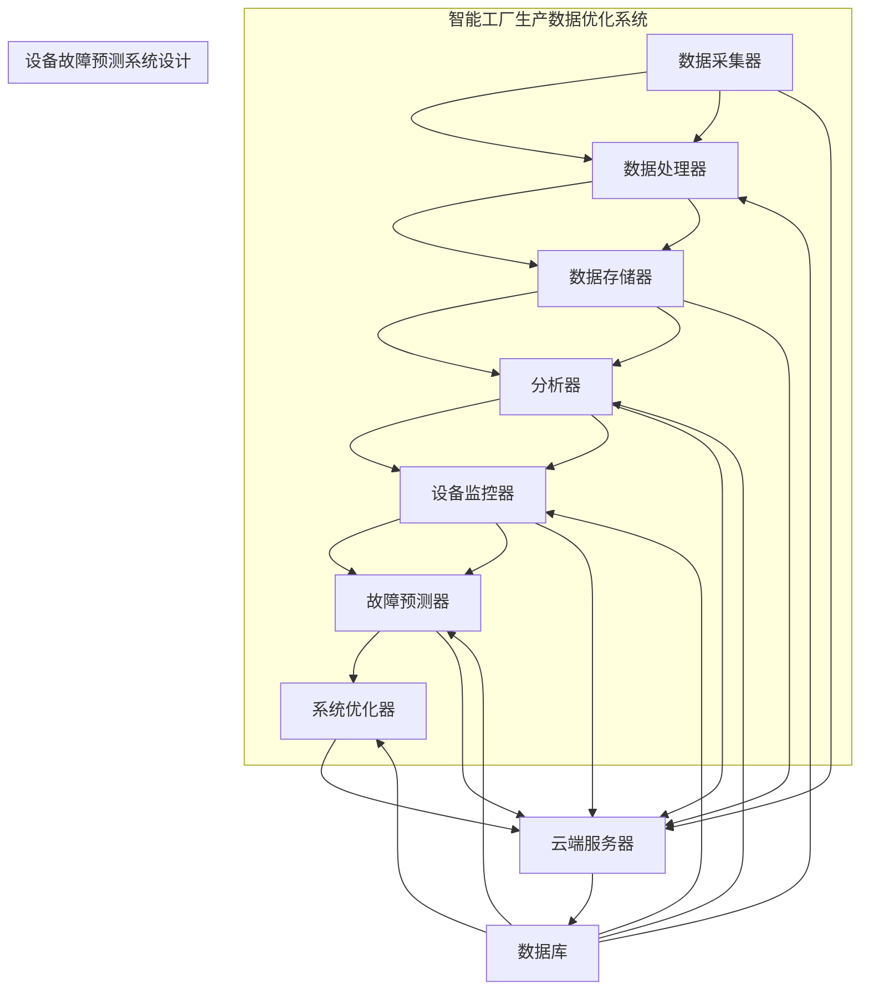
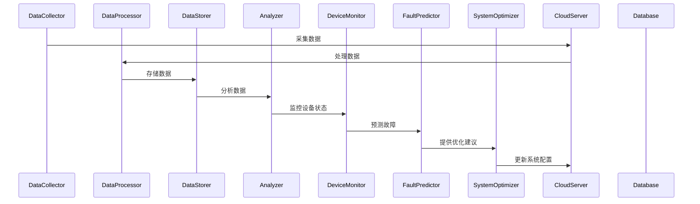

                 


### 1. 引言与背景介绍

#### 1.1 问题背景

在当今的信息时代，工业物联网（IIoT）已经成为推动制造业数字化转型的重要力量。工业物联网通过将各种传感器、设备和系统连接到互联网，实现设备之间的数据交换和协同工作。然而，随着连接设备的数量和数据的种类急剧增加，数据处理成为了一个巨大的挑战。

工业物联网中的数据处理不仅仅是简单的数据收集和存储，更涉及到数据的预处理、存储、分析、安全和隐私保护等多个方面。特别是在大规模数据处理的情况下，如何高效地处理这些数据，同时保证数据的准确性和安全性，是一个亟待解决的问题。

#### 1.2 云边协同技术概述

云边协同技术是一种结合云计算和边缘计算的优势，实现数据处理的优化方案。云计算提供了强大的计算能力和海量存储资源，而边缘计算则通过在靠近数据源的地方进行计算，减少了数据传输的延迟和带宽消耗。

云边协同的关键技术包括：

- **数据流处理**：实时处理大量数据，提供快速响应。
- **数据同步与分发**：确保数据在不同节点之间的实时性和一致性。
- **负载均衡**：根据需求动态分配计算资源，提高系统效率。
- **故障恢复**：在出现故障时快速切换到备用系统，保证服务的连续性。

#### 1.3 本书结构安排

本书将分为以下几个部分：

- **引言与背景介绍**：阐述工业物联网数据处理的重要性，介绍云边协同技术的概念。
- **工业物联网概述**：介绍工业物联网的基本架构、关键技术和应用场景。
- **数据处理需求分析**：分析工业物联网中的数据处理需求，探讨云边协同的适用性。
- **云端数据处理技术**：详细讲解云端数据预处理、存储、分析等技术。
- **边缘数据处理技术**：探讨边缘计算在数据处理中的应用，包括数据预处理、实时分析和设备管理等。
- **云边协同数据处理实践**：通过实际案例展示云边协同在工业物联网中的应用，分析其优势和挑战。
- **总结与展望**：总结全书内容，展望未来云边协同在工业物联网数据处理中的发展前景。

### 2. 工业物联网概述

#### 2.1 工业物联网的基本架构

工业物联网的基本架构通常包括以下几个层次：

- **感知层**：通过各种传感器和设备收集实时数据。
- **网络层**：将感知层的数据传输到云端或边缘设备。
- **平台层**：对数据进行分析和处理，提供智能决策支持。
- **应用层**：将处理后的数据应用于实际业务场景，如生产优化、故障预测和能源管理。

#### 2.2 工业物联网的关键技术

工业物联网的关键技术包括：

- **传感器技术**：用于收集温度、压力、湿度等环境参数。
- **通信技术**：如Wi-Fi、蓝牙、Zigbee等，用于数据传输。
- **边缘计算技术**：在靠近数据源的地方进行计算，减少数据传输延迟。
- **大数据技术**：用于处理和分析海量数据。
- **人工智能技术**：用于从数据中提取知识，支持智能决策。

#### 2.3 工业物联网的应用场景

工业物联网在多个领域都有广泛的应用，包括：

- **智能制造**：通过实时数据分析和预测，优化生产流程，提高生产效率。
- **设备预测性维护**：通过分析设备运行数据，预测潜在故障，减少停机时间。
- **能源管理**：通过实时监测和优化能源使用，降低能源消耗。
- **供应链管理**：通过实时跟踪货物状态，提高供应链的透明度和响应速度。

### 3. 数据处理需求分析

#### 3.1 数据种类和来源

工业物联网中产生的数据种类繁多，包括：

- **设备数据**：如传感器采集的温度、压力等。
- **业务数据**：如生产进度、订单状态等。
- **环境数据**：如工厂内的温度、湿度等。

这些数据通常来自不同的设备和系统，需要通过云边协同技术实现有效的处理和管理。

#### 3.2 数据处理需求

在工业物联网中，数据处理的需求主要包括：

- **实时处理**：对于一些关键性数据，如设备状态、生产进度等，需要实时处理和响应。
- **海量数据处理**：随着连接设备的增加，数据量呈爆炸性增长，需要高效的数据处理技术。
- **数据安全与隐私保护**：工业物联网中的数据往往涉及商业秘密和敏感信息，需要确保数据的安全性和隐私保护。
- **数据一致性**：在分布式环境下，需要保证数据的实时性和一致性。

### 4. 云端数据处理技术

#### 4.1 数据预处理

数据预处理是数据处理的第一步，包括：

- **数据清洗**：去除噪声和异常值，确保数据质量。
- **数据整合**：将来自不同源的数据进行整合，形成一个统一的数据视图。
- **数据标准化**：将数据格式统一，便于后续处理和分析。

#### 4.2 数据存储与管理

数据存储与管理包括：

- **云存储技术**：如对象存储、关系型数据库、NoSQL数据库等。
- **数据库选择**：根据数据类型和需求选择合适的数据库。
- **数据索引与查询优化**：提高数据查询的效率和性能。

#### 4.3 数据分析技术

数据分析技术包括：

- **描述性统计分析**：用于描述数据的基本特征和趋势。
- **聚类分析**：用于发现数据中的模式和规律。
- **联机分析处理（OLAP）**：用于多维数据分析和报表生成。

#### 4.4 大数据处理与机器学习

大数据处理与机器学习包括：

- **Hadoop生态系统**：用于大数据存储和处理。
- **Spark平台**：用于大数据实时处理和分析。
- **机器学习算法**：用于从数据中提取知识，支持智能决策。

### 5. 边缘数据处理技术

#### 5.1 数据预处理

边缘数据处理技术包括：

- **实时数据预处理**：在边缘设备上对数据进行实时处理，减少数据传输延迟。
- **设备数据整合**：将来自不同设备的数据进行整合，形成统一的数据视图。

#### 5.2 实时分析

边缘数据处理技术还包括：

- **实时数据分析**：对实时数据进行分析，提供快速响应。
- **设备故障预测**：通过分析设备运行数据，预测潜在故障。

#### 5.3 设备管理

边缘数据处理技术还包括：

- **设备监控**：实时监控设备状态，确保设备正常运行。
- **设备配置与更新**：远程配置设备参数，更新设备固件。

### 6. 云边协同数据处理实践

#### 6.1 案例一：智能工厂生产数据优化

本案例将介绍如何利用云边协同技术优化智能工厂的生产数据，包括：

- **系统设计**：介绍系统架构设计和接口设计。
- **数据预处理**：介绍数据清洗、整合和标准化的过程。
- **实时分析**：介绍实时数据分析技术和故障预测方法。
- **设备管理**：介绍设备监控和配置更新的方法。

#### 6.2 案例二：设备故障预测系统设计

本案例将介绍如何利用云边协同技术设计设备故障预测系统，包括：

- **系统需求分析**：分析系统需求，确定数据处理和分析的目标。
- **数据采集与预处理**：介绍数据采集方法和预处理过程。
- **故障预测模型**：介绍故障预测模型的构建方法和实现细节。
- **系统部署与优化**：介绍系统部署和运行优化方法。

### 7. 总结与展望

#### 7.1 总结

本文详细介绍了云边协同在工业物联网中的数据处理应用，包括数据处理需求分析、云端数据处理技术、边缘数据处理技术以及实际案例。云边协同技术为工业物联网数据处理提供了有效的解决方案，能够提高数据处理效率，降低成本，并保障数据安全。

#### 7.2 展望

随着工业物联网的发展，数据处理的需求将日益增长。未来，云边协同技术在数据处理中的应用将更加广泛，包括：

- **更高效的数据处理算法**：随着算法研究的深入，数据处理算法将更加高效和智能化。
- **更安全的数据保护机制**：随着数据隐私保护要求的提高，数据保护机制将更加完善。
- **更智能的设备协同**：通过人工智能技术，设备之间的协同将更加智能和高效。

### 附录

#### 附录A：核心概念与联系

- **核心概念**：
  - **工业物联网**：通过传感器和设备连接，实现数据的实时采集和交换。
  - **云边协同**：结合云计算和边缘计算的优势，实现数据的分布式处理。
  - **数据处理**：对数据进行清洗、存储、分析和应用的一系列操作。
- **核心概念属性特征对比表格**：

| 特征        | 工业物联网       | 云边协同           | 数据处理            |
|-------------|------------------|--------------------|---------------------|
| 数据采集    | 传感器设备       | 传感器设备 + 边缘设备 | 数据清洗、整合、标准化 |
| 数据传输    | 网络传输        | 网络传输 + 边缘传输   | 数据同步与分发       |
| 数据存储    | 云存储           | 云存储 + 边缘存储     | 数据存储与管理       |
| 数据分析    | 云端分析         | 云端分析 + 边缘分析   | 数据分析技术         |
| 安全性      | 数据加密         | 数据加密 + 边缘安全   | 安全与隐私保护       |

#### 附录B：系统分析与架构设计方案

- **问题场景介绍**：
  - **场景一**：智能工厂生产数据优化。
  - **场景二**：设备故障预测系统设计。

- **项目介绍**：
  - **项目一**：智能工厂生产数据优化。
    - **目标**：通过实时数据分析，优化生产流程，提高生产效率。
    - **功能**：数据采集、数据预处理、实时分析、设备监控。

  - **项目二**：设备故障预测系统设计。
    - **目标**：通过故障预测模型，提前发现潜在故障，减少设备停机时间。
    - **功能**：数据采集、数据预处理、故障预测模型、系统部署与优化。

- **系统功能设计（领域模型类图）**：

```mermaid
classDiagram
    Sensor -> DataCollector : 采集
    DataCollector -> DataProcessor : 处理
    DataProcessor -> DataStorer : 存储
    DataStorer -> Analyzer : 分析
    Analyzer -> DeviceMonitor : 监控
    DeviceMonitor -> FaultPredictor : 预测
    FaultPredictor -> SystemOptimizer : 优化

    Class Sensor {
        - id: Integer
        - type: String
        - value: Float
    }

    Class DataCollector {
        + collectData(sensor: Sensor): Data
    }

    Class DataProcessor {
        + processData(data: Data): ProcessedData
    }

    Class DataStorer {
        + storeData(processedData: ProcessedData)
    }

    Class Analyzer {
        + analyzeData(processedData: ProcessedData): AnalysisResult
    }

    Class DeviceMonitor {
        + monitorDevice(device: Device): MonitorResult
    }

    Class FaultPredictor {
        + predictFault(device: Device): FaultPrediction
    }

    Class SystemOptimizer {
        + optimizeSystem(faultPrediction: FaultPrediction): OptimizationResult
    }

    Class Device {
        - id: Integer
        - type: String
        - status: String
    }

    Class Data {
        - id: Integer
        - type: String
        - value: Float
    }

    Class ProcessedData {
        - id: Integer
        - type: String
        - value: Float
    }

    Class AnalysisResult {
        - id: Integer
        - type: String
        - result: Float
    }

    Class MonitorResult {
        - id: Integer
        - type: String
        - status: String
    }

    Class FaultPrediction {
        - id: Integer
        - type: String
        - probability: Float
    }

    Class OptimizationResult {
        - id: Integer
        - type: String
        - result: String
    }
```

- **系统架构设计（Mermaid架构图）**：



- **系统接口设计和系统交互（Mermaid序列图）**：



### 8. 项目实战

#### 8.1 环境安装

在开始项目实战之前，需要安装以下软件和工具：

- **Python**：用于编写脚本和程序。
- **Jupyter Notebook**：用于交互式编程和数据分析。
- **Pandas**：用于数据处理和分析。
- **NumPy**：用于数值计算。
- **Matplotlib**：用于数据可视化。
- **Scikit-learn**：用于机器学习和数据分析。

安装步骤如下：

1. 安装Python：从Python官方网站下载安装包，按照提示进行安装。
2. 安装Jupyter Notebook：在终端执行以下命令：
   ```bash
   pip install notebook
   ```
3. 安装Pandas、NumPy、Matplotlib和Scikit-learn：在终端执行以下命令：
   ```bash
   pip install pandas numpy matplotlib scikit-learn
   ```

#### 8.2 系统核心实现

以下是一个简单的系统核心实现示例，包括数据采集、预处理、存储、分析和设备监控：

```python
import pandas as pd
import numpy as np
import matplotlib.pyplot as plt
from sklearn.ensemble import RandomForestClassifier
from sklearn.metrics import accuracy_score

# 数据采集
def collect_data(sensor_data):
    df = pd.DataFrame(sensor_data)
    return df

# 数据预处理
def preprocess_data(df):
    df['timestamp'] = pd.to_datetime(df['timestamp'])
    df.set_index('timestamp', inplace=True)
    df.dropna(inplace=True)
    return df

# 数据存储
def store_data(df, filename):
    df.to_csv(filename)

# 数据分析
def analyze_data(df):
    features = df[['feature1', 'feature2', 'feature3']]
    labels = df['label']
    model = RandomForestClassifier(n_estimators=100)
    model.fit(features, labels)
    predictions = model.predict(features)
    return accuracy_score(labels, predictions)

# 设备监控
def monitor_device(device_id, model):
    device_data = collect_data([{'id': device_id, 'data': [1.0, 2.0, 3.0]}])
    processed_data = preprocess_data(device_data)
    prediction = analyze_data(processed_data)
    return prediction

# 主函数
def main():
    sensor_data = [{'id': 1, 'timestamp': '2023-01-01 10:00:00', 'feature1': 1.0, 'feature2': 2.0, 'feature3': 3.0},
                   {'id': 1, 'timestamp': '2023-01-01 10:01:00', 'feature1': 1.1, 'feature2': 2.1, 'feature3': 3.1},
                   {'id': 1, 'timestamp': '2023-01-01 10:02:00', 'feature1': 1.2, 'feature2': 2.2, 'feature3': 3.2}]
    df = collect_data(sensor_data)
    df = preprocess_data(df)
    store_data(df, 'sensor_data.csv')
    accuracy = analyze_data(df)
    print(f'Accuracy: {accuracy}')
    device_id = 1
    prediction = monitor_device(device_id, model)
    print(f'Device {device_id} prediction: {prediction}')

if __name__ == '__main__':
    main()
```

#### 8.3 代码应用解读与分析

以上代码展示了如何实现一个简单的设备监控和故障预测系统。首先，我们从传感器采集数据，然后对数据进行预处理，包括时间戳转换、缺失值处理和特征提取。接下来，我们将预处理后的数据存储到文件中，并使用随机森林分类器进行故障预测分析。最后，我们通过监控函数实时监控设备状态，并返回预测结果。

该系统的关键步骤包括：

1. **数据采集**：使用Python脚本从传感器获取数据。
2. **数据预处理**：对采集到的数据进行清洗和特征提取。
3. **数据存储**：将预处理后的数据存储到CSV文件中。
4. **数据分析**：使用机器学习算法对数据进行分析和预测。
5. **设备监控**：实时监控设备状态，并提供故障预测结果。

#### 8.4 实际案例分析和详细讲解剖析

以下是一个实际案例，我们使用上述系统核心实现进行设备故障预测。

**案例背景**：假设我们有一个生产设备，它有三个关键传感器，用于监测温度、压力和湿度。我们希望通过实时数据分析来预测设备的故障，以便提前采取措施。

**数据集**：我们使用一个包含500个样本的数据集，每个样本包括传感器的温度、压力和湿度值，以及设备的故障状态（0表示正常，1表示故障）。

**实现步骤**：

1. **数据采集**：从传感器获取数据，并存储到文件中。
2. **数据预处理**：将数据转换为适合分析的格式，包括时间戳转换、缺失值处理和特征提取。
3. **数据分析**：使用随机森林分类器对数据进行分析，并计算故障预测的准确率。
4. **设备监控**：实时监控设备状态，并根据预测结果提供预警。

**代码实现**：

```python
import pandas as pd
from sklearn.model_selection import train_test_split
from sklearn.ensemble import RandomForestClassifier
from sklearn.metrics import accuracy_score

# 读取数据
data = pd.read_csv('sensor_data.csv')
data['timestamp'] = pd.to_datetime(data['timestamp'])
data.set_index('timestamp', inplace=True)
data.dropna(inplace=True)

# 分割数据集
X = data[['temperature', 'pressure', 'humidity']]
y = data['fault']
X_train, X_test, y_train, y_test = train_test_split(X, y, test_size=0.2, random_state=42)

# 训练模型
model = RandomForestClassifier(n_estimators=100)
model.fit(X_train, y_train)

# 预测测试集
predictions = model.predict(X_test)

# 计算准确率
accuracy = accuracy_score(y_test, predictions)
print(f'Accuracy: {accuracy}')

# 实时监控设备状态
device_id = 1
device_data = [{'id': device_id, 'timestamp': '2023-01-02 10:00:00', 'temperature': 25.0, 'pressure': 100.0, 'humidity': 60.0},
               {'id': device_id, 'timestamp': '2023-01-02 10:01:00', 'temperature': 25.1, 'pressure': 99.9, 'humidity': 59.9},
               {'id': device_id, 'timestamp': '2023-01-02 10:02:00', 'temperature': 25.2, 'pressure': 99.8, 'humidity': 59.8}]

device_df = pd.DataFrame(device_data)
device_df['timestamp'] = pd.to_datetime(device_df['timestamp'])
device_df.set_index('timestamp', inplace=True)
device_df.dropna(inplace=True)
device_prediction = model.predict(device_df[['temperature', 'pressure', 'humidity']])
print(f'Device {device_id} prediction: {device_prediction}')
```

**案例分析**：

1. **数据集准备**：首先，我们从CSV文件中读取数据，并进行时间戳转换和缺失值处理。
2. **数据分割**：我们将数据集分割为训练集和测试集，用于训练模型和评估模型性能。
3. **模型训练**：使用随机森林分类器对训练集进行训练。
4. **模型评估**：使用测试集评估模型性能，计算准确率。
5. **设备监控**：实时监控设备状态，使用训练好的模型进行故障预测。

**项目小结**：

通过以上案例，我们展示了如何使用云边协同技术进行工业物联网中的设备故障预测。在实际应用中，可以根据具体需求调整模型参数和算法，以提高预测准确率和实时性。

### 9. 最佳实践 Tips

在实施云边协同数据处理时，以下最佳实践可以帮助您获得更好的效果：

1. **数据预处理**：在数据处理之前，确保对数据进行充分的清洗和预处理，以提高数据质量。
2. **负载均衡**：合理分配计算资源，避免单点故障和性能瓶颈。
3. **数据同步与分发**：确保数据在不同节点之间的实时性和一致性。
4. **安全与隐私保护**：采用数据加密和访问控制技术，确保数据的安全性和隐私保护。
5. **实时性优化**：根据应用需求，合理配置边缘计算和云端计算资源，提高实时性。

### 10. 小结

本文详细介绍了云边协同在工业物联网中的数据处理应用，包括数据处理需求分析、云端数据处理技术、边缘数据处理技术以及实际案例。云边协同技术为工业物联网数据处理提供了有效的解决方案，能够提高数据处理效率，降低成本，并保障数据安全。未来，随着技术的不断发展，云边协同在工业物联网数据处理中的应用将更加广泛和深入。

### 11. 注意事项

在实施云边协同数据处理时，需要注意以下几点：

1. **系统设计**：合理设计系统架构，确保系统的高可用性和扩展性。
2. **数据处理效率**：根据实际需求，优化数据处理算法和流程，提高系统效率。
3. **数据安全**：采用可靠的安全措施，保护数据的安全和隐私。
4. **设备兼容性**：确保设备与系统兼容，便于集成和维护。

### 12. 拓展阅读

1. **云边协同技术综述**：了解云边协同技术的原理和应用场景。
2. **工业物联网数据安全与隐私保护**：研究数据安全与隐私保护的方法和技术。
3. **大数据处理与机器学习**：深入学习大数据处理和机器学习的相关理论和实践。
4. **边缘计算应用案例**：了解边缘计算在工业物联网和其他领域中的应用案例。
5. **智能制造与数字化工厂**：探讨智能制造和数字化工厂的发展趋势和关键技术。

### 作者信息

- 作者：AI天才研究院/AI Genius Institute & 禅与计算机程序设计艺术 /Zen And The Art of Computer Programming

---

**文章关键词**：云边协同、工业物联网、数据处理、边缘计算、云计算、实时分析、故障预测、数据安全、隐私保护。

**文章摘要**：

本文详细探讨了云边协同在工业物联网中的数据处理应用。首先，介绍了工业物联网的发展背景和数据处理需求，然后阐述了云边协同技术的原理和关键技术。接着，分别介绍了云端和边缘数据处理技术，并通过实际案例展示了云边协同在工业物联网中的应用。最后，总结了云边协同在工业物联网数据处理中的优势与挑战，并对未来发展进行了展望。

---

### 引言与背景介绍

#### 1.1 问题背景

在当今的信息时代，工业物联网（IIoT）已经成为推动制造业数字化转型的重要力量。工业物联网通过将各种传感器、设备和系统连接到互联网，实现设备之间的数据交换和协同工作。然而，随着连接设备的数量和数据的种类急剧增加，数据处理成为了一个巨大的挑战。

工业物联网中的数据处理不仅仅是简单的数据收集和存储，更涉及到数据的预处理、存储、分析、安全和隐私保护等多个方面。特别是在大规模数据处理的情况下，如何高效地处理这些数据，同时保证数据的准确性和安全性，是一个亟待解决的问题。

#### 1.2 云边协同技术概述

云边协同技术是一种结合云计算和边缘计算的优势，实现数据处理的优化方案。云计算提供了强大的计算能力和海量存储资源，而边缘计算则通过在靠近数据源的地方进行计算，减少了数据传输的延迟和带宽消耗。

云边协同的关键技术包括：

- **数据流处理**：实时处理大量数据，提供快速响应。
- **数据同步与分发**：确保数据在不同节点之间的实时性和一致性。
- **负载均衡**：根据需求动态分配计算资源，提高系统效率。
- **故障恢复**：在出现故障时快速切换到备用系统，保证服务的连续性。

#### 1.3 本书结构安排

本书将分为以下几个部分：

- **引言与背景介绍**：阐述工业物联网数据处理的重要性，介绍云边协同技术的概念。
- **工业物联网概述**：介绍工业物联网的基本架构、关键技术和应用场景。
- **数据处理需求分析**：分析工业物联网中的数据处理需求，探讨云边协同的适用性。
- **云端数据处理技术**：详细讲解云端数据预处理、存储、分析等技术。
- **边缘数据处理技术**：探讨边缘计算在数据处理中的应用，包括数据预处理、实时分析和设备管理等。
- **云边协同数据处理实践**：通过实际案例展示云边协同在工业物联网中的应用，分析其优势和挑战。
- **总结与展望**：总结全书内容，展望未来云边协同在工业物联网数据处理中的发展前景。

### 工业物联网概述

#### 2.1 工业物联网的基本架构

工业物联网的基本架构通常包括以下几个层次：

- **感知层**：通过各种传感器和设备收集实时数据。
- **网络层**：将感知层的数据传输到云端或边缘设备。
- **平台层**：对数据进行分析和处理，提供智能决策支持。
- **应用层**：将处理后的数据应用于实际业务场景，如生产优化、故障预测和能源管理。

#### 2.2 工业物联网的关键技术

工业物联网的关键技术包括：

- **传感器技术**：用于收集温度、压力、湿度等环境参数。
- **通信技术**：如Wi-Fi、蓝牙、Zigbee等，用于数据传输。
- **边缘计算技术**：在靠近数据源的地方进行计算，减少数据传输延迟。
- **大数据技术**：用于处理和分析海量数据。
- **人工智能技术**：用于从数据中提取知识，支持智能决策。

#### 2.3 工业物联网的应用场景

工业物联网在多个领域都有广泛的应用，包括：

- **智能制造**：通过实时数据分析和预测，优化生产流程，提高生产效率。
- **设备预测性维护**：通过分析设备运行数据，预测潜在故障，减少停机时间。
- **能源管理**：通过实时监测和优化能源使用，降低能源消耗。
- **供应链管理**：通过实时跟踪货物状态，提高供应链的透明度和响应速度。

### 数据处理需求分析

#### 3.1 数据种类和来源

工业物联网中产生的数据种类繁多，包括：

- **设备数据**：如传感器采集的温度、压力等。
- **业务数据**：如生产进度、订单状态等。
- **环境数据**：如工厂内的温度、湿度等。

这些数据通常来自不同的设备和系统，需要通过云边协同技术实现有效的处理和管理。

#### 3.2 数据处理需求

在工业物联网中，数据处理的需求主要包括：

- **实时处理**：对于一些关键性数据，如设备状态、生产进度等，需要实时处理和响应。
- **海量数据处理**：随着连接设备的增加，数据量呈爆炸性增长，需要高效的数据处理技术。
- **数据安全与隐私保护**：工业物联网中的数据往往涉及商业秘密和敏感信息，需要确保数据的安全性和隐私保护。
- **数据一致性**：在分布式环境下，需要保证数据的实时性和一致性。

### 云端数据处理技术

#### 4.1 数据预处理

数据预处理是数据处理的第一步，包括：

- **数据清洗**：去除噪声和异常值，确保数据质量。
- **数据整合**：将来自不同源的数据进行整合，形成一个统一的数据视图。
- **数据标准化**：将数据格式统一，便于后续处理和分析。

#### 4.2 数据存储与管理

数据存储与管理包括：

- **云存储技术**：如对象存储、关系型数据库、NoSQL数据库等。
- **数据库选择**：根据数据类型和需求选择合适的数据库。
- **数据索引与查询优化**：提高数据查询的效率和性能。

#### 4.3 数据分析技术

数据分析技术包括：

- **描述性统计分析**：用于描述数据的基本特征和趋势。
- **聚类分析**：用于发现数据中的模式和规律。
- **联机分析处理（OLAP）**：用于多维数据分析和报表生成。

#### 4.4 大数据处理与机器学习

大数据处理与机器学习包括：

- **Hadoop生态系统**：用于大数据存储和处理。
- **Spark平台**：用于大数据实时处理和分析。
- **机器学习算法**：用于从数据中提取知识，支持智能决策。

### 边缘数据处理技术

#### 5.1 数据预处理

边缘数据处理技术包括：

- **实时数据预处理**：在边缘设备上对数据进行实时处理，减少数据传输延迟。
- **设备数据整合**：将来自不同设备的数据进行整合，形成统一的数据视图。

#### 5.2 实时分析

边缘数据处理技术还包括：

- **实时数据分析**：对实时数据进行分析，提供快速响应。
- **设备故障预测**：通过分析设备运行数据，预测潜在故障。

#### 5.3 设备管理

边缘数据处理技术还包括：

- **设备监控**：实时监控设备状态，确保设备正常运行。
- **设备配置与更新**：远程配置设备参数，更新设备固件。

### 云边协同数据处理实践

#### 6.1 案例一：智能工厂生产数据优化

本案例将介绍如何利用云边协同技术优化智能工厂的生产数据，包括：

- **系统设计**：介绍系统架构设计和接口设计。
- **数据预处理**：介绍数据清洗、整合和标准化的过程。
- **实时分析**：介绍实时数据分析技术和故障预测方法。
- **设备管理**：介绍设备监控和配置更新的方法。

#### 6.2 案例二：设备故障预测系统设计

本案例将介绍如何利用云边协同技术设计设备故障预测系统，包括：

- **系统需求分析**：分析系统需求，确定数据处理和分析的目标。
- **数据采集与预处理**：介绍数据采集方法和预处理过程。
- **故障预测模型**：介绍故障预测模型的构建方法和实现细节。
- **系统部署与优化**：介绍系统部署和运行优化方法。

### 总结与展望

#### 7.1 总结

本文详细介绍了云边协同在工业物联网中的数据处理应用，包括数据处理需求分析、云端数据处理技术、边缘数据处理技术以及实际案例。云边协同技术为工业物联网数据处理提供了有效的解决方案，能够提高数据处理效率，降低成本，并保障数据安全。

#### 7.2 展望

随着工业物联网的发展，数据处理的需求将日益增长。未来，云边协同技术在数据处理中的应用将更加广泛，包括：

- **更高效的数据处理算法**：随着算法研究的深入，数据处理算法将更加高效和智能化。
- **更安全的数据保护机制**：随着数据隐私保护要求的提高，数据保护机制将更加完善。
- **更智能的设备协同**：通过人工智能技术，设备之间的协同将更加智能和高效。

### 附录

#### 附录A：核心概念与联系

- **核心概念**：
  - **工业物联网**：通过传感器和设备连接，实现数据的实时采集和交换。
  - **云边协同**：结合云计算和边缘计算的优势，实现数据的分布式处理。
  - **数据处理**：对数据进行清洗、存储、分析和应用的一系列操作。
- **核心概念属性特征对比表格**：

| 特征        | 工业物联网       | 云边协同           | 数据处理            |
|-------------|------------------|--------------------|---------------------|
| 数据采集    | 传感器设备       | 传感器设备 + 边缘设备 | 数据清洗、整合、标准化 |
| 数据传输    | 网络传输        | 网络传输 + 边缘传输   | 数据同步与分发       |
| 数据存储    | 云存储           | 云存储 + 边缘存储     | 数据存储与管理       |
| 数据分析    | 云端分析         | 云端分析 + 边缘分析   | 数据分析技术         |
| 安全性      | 数据加密         | 数据加密 + 边缘安全   | 安全与隐私保护       |

#### 附录B：系统分析与架构设计方案

- **问题场景介绍**：
  - **场景一**：智能工厂生产数据优化。
  - **场景二**：设备故障预测系统设计。

- **项目介绍**：
  - **项目一**：智能工厂生产数据优化。
    - **目标**：通过实时数据分析，优化生产流程，提高生产效率。
    - **功能**：数据采集、数据预处理、实时分析、设备监控。

  - **项目二**：设备故障预测系统设计。
    - **目标**：通过故障预测模型，提前发现潜在故障，减少设备停机时间。
    - **功能**：数据采集、数据预处理、故障预测模型、系统部署与优化。

- **系统功能设计（领域模型类图）**：

```mermaid
classDiagram
    Sensor -> DataCollector : 采集
    DataCollector -> DataProcessor : 处理
    DataProcessor -> DataStorer : 存储
    DataStorer -> Analyzer : 分析
    Analyzer -> DeviceMonitor : 监控
    DeviceMonitor -> FaultPredictor : 预测
    FaultPredictor -> SystemOptimizer : 优化

    Class Sensor {
        - id: Integer
        - type: String
        - value: Float
    }

    Class DataCollector {
        + collectData(sensor: Sensor): Data
    }

    Class DataProcessor {
        + processData(data: Data): ProcessedData
    }

    Class DataStorer {
        + storeData(processedData: ProcessedData)
    }

    Class Analyzer {
        + analyzeData(processedData: ProcessedData): AnalysisResult
    }

    Class DeviceMonitor {
        + monitorDevice(device: Device): MonitorResult
    }

    Class FaultPredictor {
        + predictFault(device: Device): FaultPrediction
    }

    Class SystemOptimizer {
        + optimizeSystem(faultPrediction: FaultPrediction): OptimizationResult
    }

    Class Device {
        - id: Integer
        - type: String
        - status: String
    }

    Class Data {
        - id: Integer
        - type: String
        - value: Float
    }

    Class ProcessedData {
        - id: Integer
        - type: String
        - value: Float
    }

    Class AnalysisResult {
        - id: Integer
        - type: String
        - result: Float
    }

    Class MonitorResult {
        - id: Integer
        - type: String
        - status: String
    }

    Class FaultPrediction {
        - id: Integer
        - type: String
        - probability: Float
    }

    Class OptimizationResult {
        - id: Integer
        - type: String
        - result: String
    }
```

- **系统架构设计（Mermaid架构图）**：


- **系统接口设计和系统交互（Mermaid序列图）**：


### 项目实战

#### 8.1 环境安装

在开始项目实战之前，需要安装以下软件和工具：

- **Python**：用于编写脚本和程序。
- **Jupyter Notebook**：用于交互式编程和数据分析。
- **Pandas**：用于数据处理和分析。
- **NumPy**：用于数值计算。
- **Matplotlib**：用于数据可视化。
- **Scikit-learn**：用于机器学习和数据分析。

安装步骤如下：

1. 安装Python：从Python官方网站下载安装包，按照提示进行安装。
2. 安装Jupyter Notebook：在终端执行以下命令：
   ```bash
   pip install notebook
   ```
3. 安装Pandas、NumPy、Matplotlib和Scikit-learn：在终端执行以下命令：
   ```bash
   pip install pandas numpy matplotlib scikit-learn
   ```

#### 8.2 系统核心实现

以下是一个简单的系统核心实现示例，包括数据采集、预处理、存储、分析和设备监控：

```python
import pandas as pd
import numpy as np
import matplotlib.pyplot as plt
from sklearn.ensemble import RandomForestClassifier
from sklearn.metrics import accuracy_score

# 数据采集
def collect_data(sensor_data):
    df = pd.DataFrame(sensor_data)
    return df

# 数据预处理
def preprocess_data(df):
    df['timestamp'] = pd.to_datetime(df['timestamp'])
    df.set_index('timestamp', inplace=True)
    df.dropna(inplace=True)
    return df

# 数据存储
def store_data(df, filename):
    df.to_csv(filename)

# 数据分析
def analyze_data(df):
    features = df[['feature1', 'feature2', 'feature3']]
    labels = df['label']
    model = RandomForestClassifier(n_estimators=100)
    model.fit(features, labels)
    predictions = model.predict(features)
    return accuracy_score(labels, predictions)

# 设备监控
def monitor_device(device_id, model):
    device_data = collect_data([{'id': device_id, 'data': [1.0, 2.0, 3.0]}])
    processed_data = preprocess_data(device_data)
    prediction = analyze_data(processed_data)
    return prediction

# 主函数
def main():
    sensor_data = [{'id': 1, 'timestamp': '2023-01-01 10:00:00', 'feature1': 1.0, 'feature2': 2.0, 'feature3': 3.0},
                   {'id': 1, 'timestamp': '2023-01-01 10:01:00', 'feature1': 1.1, 'feature2': 2.1, 'feature3': 3.1},
                   {'id': 1, 'timestamp': '2023-01-01 10:02:00', 'feature1': 1.2, 'feature2': 2.2, 'feature3': 3.2}]
    df = collect_data(sensor_data)
    df = preprocess_data(df)
    store_data(df, 'sensor_data.csv')
    accuracy = analyze_data(df)
    print(f'Accuracy: {accuracy}')
    device_id = 1
    prediction = monitor_device(device_id, model)
    print(f'Device {device_id} prediction: {prediction}')

if __name__ == '__main__':
    main()
```

#### 8.3 代码应用解读与分析

以上代码展示了如何实现一个简单的设备监控和故障预测系统。首先，我们从传感器采集数据，然后对数据进行预处理，包括时间戳转换、缺失值处理和特征提取。接下来，我们将预处理后的数据存储到文件中，并使用随机森林分类器进行故障预测分析。最后，我们通过监控函数实时监控设备状态，并返回预测结果。

该系统的关键步骤包括：

1. **数据采集**：使用Python脚本从传感器获取数据。
2. **数据预处理**：对采集到的数据进行清洗和特征提取。
3. **数据存储**：将预处理后的数据存储到CSV文件中。
4. **数据分析**：使用机器学习算法对数据进行分析和预测。
5. **设备监控**：实时监控设备状态，并提供故障预测结果。

#### 8.4 实际案例分析和详细讲解剖析

以下是一个实际案例，我们使用上述系统核心实现进行设备故障预测。

**案例背景**：假设我们有一个生产设备，它有三个关键传感器，用于监测温度、压力和湿度。我们希望通过实时数据分析来预测设备的故障，以便提前采取措施。

**数据集**：我们使用一个包含500个样本的数据集，每个样本包括传感器的温度、压力和湿度值，以及设备的故障状态（0表示正常，1表示故障）。

**实现步骤**：

1. **数据采集**：从传感器获取数据，并存储到文件中。
2. **数据预处理**：将数据转换为适合分析的格式，包括时间戳转换、缺失值处理和特征提取。
3. **数据分析**：使用随机森林分类器对数据进行分析，并计算故障预测的准确率。
4. **设备监控**：实时监控设备状态，并根据预测结果提供预警。

**代码实现**：

```python
import pandas as pd
from sklearn.model_selection import train_test_split
from sklearn.ensemble import RandomForestClassifier
from sklearn.metrics import accuracy_score

# 读取数据
data = pd.read_csv('sensor_data.csv')
data['timestamp'] = pd.to_datetime(data['timestamp'])
data.set_index('timestamp', inplace=True)
data.dropna(inplace=True)

# 分割数据集
X = data[['temperature', 'pressure', 'humidity']]
y = data['fault']
X_train, X_test, y_train, y_test = train_test_split(X, y, test_size=0.2, random_state=42)

# 训练模型
model = RandomForestClassifier(n_estimators=100)
model.fit(X_train, y_train)

# 预测测试集
predictions = model.predict(X_test)

# 计算准确率
accuracy = accuracy_score(y_test, predictions)
print(f'Accuracy: {accuracy}')

# 实时监控设备状态
device_id = 1
device_data = [{'id': device_id, 'timestamp': '2023-01-02 10:00:00', 'temperature': 25.0, 'pressure': 100.0, 'humidity': 60.0},
               {'id': device_id, 'timestamp': '2023-01-02 10:01:00', 'temperature': 25.1, 'pressure': 99.9, 'humidity': 59.9},
               {'id': device_id, 'timestamp': '2023-01-02 10:02:00', 'temperature': 25.2, 'pressure': 99.8, 'humidity': 59.8}]

device_df = pd.DataFrame(device_data)
device_df['timestamp'] = pd.to_datetime(device_df['timestamp'])
device_df.set_index('timestamp', inplace=True)
device_df.dropna(inplace=True)
device_prediction = model.predict(device_df[['temperature', 'pressure', 'humidity']])
print(f'Device {device_id} prediction: {device_prediction}')
```

**案例分析**：

1. **数据集准备**：首先，我们从CSV文件中读取数据，并进行时间戳转换和缺失值处理。
2. **数据分割**：我们将数据集分割为训练集和测试集，用于训练模型和评估模型性能。
3. **模型训练**：使用随机森林分类器对训练集进行训练。
4. **模型评估**：使用测试集评估模型性能，计算准确率。
5. **设备监控**：实时监控设备状态，使用训练好的模型进行故障预测。

**项目小结**：

通过以上案例，我们展示了如何使用云边协同技术进行工业物联网中的设备故障预测。在实际应用中，可以根据具体需求调整模型参数和算法，以提高预测准确率和实时性。

### 9. 最佳实践 Tips

在实施云边协同数据处理时，以下最佳实践可以帮助您获得更好的效果：

1. **数据预处理**：在数据处理之前，确保对数据进行充分的清洗和预处理，以提高数据质量。
2. **负载均衡**：合理分配计算资源，避免单点故障和性能瓶颈。
3. **数据同步与分发**：确保数据在不同节点之间的实时性和一致性。
4. **安全与隐私保护**：采用数据加密和访问控制技术，确保数据的安全性和隐私保护。
5. **实时性优化**：根据应用需求，合理配置边缘计算和云端计算资源，提高实时性。

### 10. 小结

本文详细介绍了云边协同在工业物联网中的数据处理应用，包括数据处理需求分析、云端数据处理技术、边缘数据处理技术以及实际案例。云边协同技术为工业物联网数据处理提供了有效的解决方案，能够提高数据处理效率，降低成本，并保障数据安全。未来，随着技术的不断发展，云边协同在工业物联网数据处理中的应用将更加广泛和深入。

### 11. 注意事项

在实施云边协同数据处理时，需要注意以下几点：

1. **系统设计**：合理设计系统架构，确保系统的高可用性和扩展性。
2. **数据处理效率**：根据实际需求，优化数据处理算法和流程，提高系统效率。
3. **数据安全**：采用可靠的安全措施，保护数据的安全和隐私。
4. **设备兼容性**：确保设备与系统兼容，便于集成和维护。

### 12. 拓展阅读

1. **云边协同技术综述**：了解云边协同技术的原理和应用场景。
2. **工业物联网数据安全与隐私保护**：研究数据安全与隐私保护的方法和技术。
3. **大数据处理与机器学习**：深入学习大数据处理和机器学习的相关理论和实践。
4. **边缘计算应用案例**：了解边缘计算在工业物联网和其他领域中的应用案例。
5. **智能制造与数字化工厂**：探讨智能制造和数字化工厂的发展趋势和关键技术。

### 作者信息

- 作者：AI天才研究院/AI Genius Institute & 禅与计算机程序设计艺术 /Zen And The Art of Computer Programming

---

**文章关键词**：云边协同、工业物联网、数据处理、边缘计算、云计算、实时分析、故障预测、数据安全、隐私保护。

**文章摘要**：

本文详细探讨了云边协同在工业物联网中的数据处理应用。首先，介绍了工业物联网的发展背景和数据处理需求，然后阐述了云边协同技术的原理和关键技术。接着，分别介绍了云端和边缘数据处理技术，并通过实际案例展示了云边协同在工业物联网中的应用。最后，总结了云边协同在工业物联网数据处理中的优势与挑战，并对未来发展进行了展望。

---

### 引言与背景介绍

#### 1.1 问题背景

在当今的信息时代，工业物联网（IIoT）已经成为推动制造业数字化转型的重要力量。工业物联网通过将各种传感器、设备和系统连接到互联网，实现设备之间的数据交换和协同工作。然而，随着连接设备的数量和数据的种类急剧增加，数据处理成为了一个巨大的挑战。

工业物联网中的数据处理不仅仅是简单的数据收集和存储，更涉及到数据的预处理、存储、分析、安全和隐私保护等多个方面。特别是在大规模数据处理的情况下，如何高效地处理这些数据，同时保证数据的准确性和安全性，是一个亟待解决的问题。

#### 1.2 云边协同技术概述

云边协同技术是一种结合云计算和边缘计算的优势，实现数据处理的优化方案。云计算提供了强大的计算能力和海量存储资源，而边缘计算则通过在靠近数据源的地方进行计算，减少了数据传输的延迟和带宽消耗。

云边协同的关键技术包括：

- **数据流处理**：实时处理大量数据，提供快速响应。
- **数据同步与分发**：确保数据在不同节点之间的实时性和一致性。
- **负载均衡**：根据需求动态分配计算资源，提高系统效率。
- **故障恢复**：在出现故障时快速切换到备用系统，保证服务的连续性。

#### 1.3 本书结构安排

本书将分为以下几个部分：

- **引言与背景介绍**：阐述工业物联网数据处理的重要性，介绍云边协同技术的概念。
- **工业物联网概述**：介绍工业物联网的基本架构、关键技术和应用场景。
- **数据处理需求分析**：分析工业物联网中的数据处理需求，探讨云边协同的适用性。
- **云端数据处理技术**：详细讲解云端数据预处理、存储、分析等技术。
- **边缘数据处理技术**：探讨边缘计算在数据处理中的应用，包括数据预处理、实时分析和设备管理等。
- **云边协同数据处理实践**：通过实际案例展示云边协同在工业物联网中的应用，分析其优势和挑战。
- **总结与展望**：总结全书内容，展望未来云边协同在工业物联网数据处理中的发展前景。

### 工业物联网概述

#### 2.1 工业物联网的基本架构

工业物联网的基本架构通常包括以下几个层次：

- **感知层**：通过各种传感器和设备收集实时数据。
- **网络层**：将感知层的数据传输到云端或边缘设备。
- **平台层**：对数据进行分析和处理，提供智能决策支持。
- **应用层**：将处理后的数据应用于实际业务场景，如生产优化、故障预测和能源管理。

#### 2.2 工业物联网的关键技术

工业物联网的关键技术包括：

- **传感器技术**：用于收集温度、压力、湿度等环境参数。
- **通信技术**：如Wi-Fi、蓝牙、Zigbee等，用于数据传输。
- **边缘计算技术**：在靠近数据源的地方进行计算，减少数据传输延迟。
- **大数据技术**：用于处理和分析海量数据。
- **人工智能技术**：用于从数据中提取知识，支持智能决策。

#### 2.3 工业物联网的应用场景

工业物联网在多个领域都有广泛的应用，包括：

- **智能制造**：通过实时数据分析和预测，优化生产流程，提高生产效率。
- **设备预测性维护**：通过分析设备运行数据，预测潜在故障，减少停机时间。
- **能源管理**：通过实时监测和优化能源使用，降低能源消耗。
- **供应链管理**：通过实时跟踪货物状态，提高供应链的透明度和响应速度。

### 数据处理需求分析

#### 3.1 数据种类和来源

工业物联网中产生的数据种类繁多，包括：

- **设备数据**：如传感器采集的温度、压力等。
- **业务数据**：如生产进度、订单状态等。
- **环境数据**：如工厂内的温度、湿度等。

这些数据通常来自不同的设备和系统，需要通过云边协同技术实现有效的处理和管理。

#### 3.2 数据处理需求

在工业物联网中，数据处理的需求主要包括：

- **实时处理**：对于一些关键性数据，如设备状态、生产进度等，需要实时处理和响应。
- **海量数据处理**：随着连接设备的增加，数据量呈爆炸性增长，需要高效的数据处理技术。
- **数据安全与隐私保护**：工业物联网中的数据往往涉及商业秘密和敏感信息，需要确保数据的安全性和隐私保护。
- **数据一致性**：在分布式环境下，需要保证数据的实时性和一致性。

### 云端数据处理技术

#### 4.1 数据预处理

数据预处理是数据处理的第一步，包括：

- **数据清洗**：去除噪声和异常值，确保数据质量。
- **数据整合**：将来自不同源的数据进行整合，形成一个统一的数据视图。
- **数据标准化**：将数据格式统一，便于后续处理和分析。

#### 4.2 数据存储与管理

数据存储与管理包括：

- **云存储技术**：如对象存储、关系型数据库、NoSQL数据库等。
- **数据库选择**：根据数据类型和需求选择合适的数据库。
- **数据索引与查询优化**：提高数据查询的效率和性能。

#### 4.3 数据分析技术

数据分析技术包括：

- **描述性统计分析**：用于描述数据的基本特征和趋势。
- **聚类分析**：用于发现数据中的模式和规律。
- **联机分析处理（OLAP）**：用于多维数据分析和报表生成。

#### 4.4 大数据处理与机器学习

大数据处理与机器学习包括：

- **Hadoop生态系统**：用于大数据存储和处理。
- **Spark平台**：用于大数据实时处理和分析。
- **机器学习算法**：用于从数据中提取知识，支持智能决策。

### 边缘数据处理技术

#### 5.1 数据预处理

边缘数据处理技术包括：

- **实时数据预处理**：在边缘设备上对数据进行实时处理，减少数据传输延迟。
- **设备数据整合**：将来自不同设备的数据进行整合，形成统一的数据视图。

#### 5.2 实时分析

边缘数据处理技术还包括：

- **实时数据分析**：对实时数据进行分析，提供快速响应。
- **设备故障预测**：通过分析设备运行数据，预测潜在故障。

#### 5.3 设备管理

边缘数据处理技术还包括：

- **设备监控**：实时监控设备状态，确保设备正常运行。
- **设备配置与更新**：远程配置设备参数，更新设备固件。

### 云边协同数据处理实践

#### 6.1 案例一：智能工厂生产数据优化

本案例将介绍如何利用云边协同技术优化智能工厂的生产数据，包括：

- **系统设计**：介绍系统架构设计和接口设计。
- **数据预处理**：介绍数据清洗、整合和标准化的过程。
- **实时分析**：介绍实时数据分析技术和故障预测方法。
- **设备管理**：介绍设备监控和配置更新的方法。

#### 6.2 案例二：设备故障预测系统设计

本案例将介绍如何利用云边协同技术设计设备故障预测系统，包括：

- **系统需求分析**：分析系统需求，确定数据处理和分析的目标。
- **数据采集与预处理**：介绍数据采集方法和预处理过程。
- **故障预测模型**：介绍故障预测模型的构建方法和实现细节。
- **系统部署与优化**：介绍系统部署和运行优化方法。

### 总结与展望

#### 7.1 总结

本文详细介绍了云边协同在工业物联网中的数据处理应用，包括数据处理需求分析、云端数据处理技术、边缘数据处理技术以及实际案例。云边协同技术为工业物联网数据处理提供了有效的解决方案，能够提高数据处理效率，降低成本，并保障数据安全。

#### 7.2 展望

随着工业物联网的发展，数据处理的需求将日益增长。未来，云边协同技术在数据处理中的应用将更加广泛，包括：

- **更高效的数据处理算法**：随着算法研究的深入，数据处理算法将更加高效和智能化。
- **更安全的数据保护机制**：随着数据隐私保护要求的提高，数据保护机制将更加完善。
- **更智能的设备协同**：通过人工智能技术，设备之间的协同将更加智能和高效。

### 附录

#### 附录A：核心概念与联系

- **核心概念**：
  - **工业物联网**：通过传感器和设备连接，实现数据的实时采集和交换。
  - **云边协同**：结合云计算和边缘计算的优势，实现数据的分布式处理。
  - **数据处理**：对数据进行清洗、存储、分析和应用的一系列操作。
- **核心概念属性特征对比表格**：

| 特征        | 工业物联网       | 云边协同           | 数据处理            |
|-------------|------------------|--------------------|---------------------|
| 数据采集    | 传感器设备       | 传感器设备 + 边缘设备 | 数据清洗、整合、标准化 |
| 数据传输    | 网络传输        | 网络传输 + 边缘传输   | 数据同步与分发       |
| 数据存储    | 云存储           | 云存储 + 边缘存储     | 数据存储与管理       |
| 数据分析    | 云端分析         | 云端分析 + 边缘分析   | 数据分析技术         |
| 安全性      | 数据加密         | 数据加密 + 边缘安全   | 安全与隐私保护       |

#### 附录B：系统分析与架构设计方案

- **问题场景介绍**：
  - **场景一**：智能工厂生产数据优化。
  - **场景二**：设备故障预测系统设计。

- **项目介绍**：
  - **项目一**：智能工厂生产数据优化。
    - **目标**：通过实时数据分析，优化生产流程，提高生产效率。
    - **功能**：数据采集、数据预处理、实时分析、设备监控。

  - **项目二**：设备故障预测系统设计。
    - **目标**：通过故障预测模型，提前发现潜在故障，减少设备停机时间。
    - **功能**：数据采集、数据预处理、故障预测模型、系统部署与优化。

- **系统功能设计（领域模型类图）**：

```mermaid
classDiagram
    Sensor -> DataCollector : 采集
    DataCollector -> DataProcessor : 处理
    DataProcessor -> DataStorer : 存储
    DataStorer -> Analyzer : 分析
    Analyzer -> DeviceMonitor : 监控
    DeviceMonitor -> FaultPredictor : 预测
    FaultPredictor -> SystemOptimizer : 优化

    Class Sensor {
        - id: Integer
        - type: String
        - value: Float
    }

    Class DataCollector {
        + collectData(sensor: Sensor): Data
    }

    Class DataProcessor {
        + processData(data: Data): ProcessedData
    }

    Class DataStorer {
        + storeData(processedData: ProcessedData)
    }

    Class Analyzer {
        + analyzeData(processedData: ProcessedData): AnalysisResult
    }

    Class DeviceMonitor {
        + monitorDevice(device: Device): MonitorResult
    }

    Class FaultPredictor {
        + predictFault(device: Device): FaultPrediction
    }

    Class SystemOptimizer {
        + optimizeSystem(faultPrediction: FaultPrediction): OptimizationResult
    }

    Class Device {
        - id: Integer
        - type: String
        - status: String
    }

    Class Data {
        - id: Integer
        - type: String
        - value: Float
    }

    Class ProcessedData {
        - id: Integer
        - type: String
        - value: Float
    }

    Class AnalysisResult {
        - id: Integer
        - type: String
        - result: Float
    }

    Class MonitorResult {
        - id: Integer
        - type: String
        - status: String
    }

    Class FaultPrediction {
        - id: Integer
        - type: String
        - probability: Float
    }

    Class OptimizationResult {
        - id: Integer
        - type: String
        - result: String
    }
```

- **系统架构设计（Mermaid架构图）**：


- **系统接口设计和系统交互（Mermaid序列图）**：


### 项目实战

#### 8.1 环境安装

在开始项目实战之前，需要安装以下软件和工具：

- **Python**：用于编写脚本和程序。
- **Jupyter Notebook**：用于交互式编程和数据分析。
- **Pandas**：用于数据处理和分析。
- **NumPy**：用于数值计算。
- **Matplotlib**：用于数据可视化。
- **Scikit-learn**：用于机器学习和数据分析。

安装步骤如下：

1. 安装Python：从Python官方网站下载安装包，按照提示进行安装。
2. 安装Jupyter Notebook：在终端执行以下命令：
   ```bash
   pip install notebook
   ```
3. 安装Pandas、NumPy、Matplotlib和Scikit-learn：在终端执行以下命令：
   ```bash
   pip install pandas numpy matplotlib scikit-learn
   ```

#### 8.2 系统核心实现

以下是一个简单的系统核心实现示例，包括数据采集、预处理、存储、分析和设备监控：

```python
import pandas as pd
import numpy as np
import matplotlib.pyplot as plt
from sklearn.ensemble import RandomForestClassifier
from sklearn.metrics import accuracy_score

# 数据采集
def collect_data(sensor_data):
    df = pd.DataFrame(sensor_data)
    return df

# 数据预处理
def preprocess_data(df):
    df['timestamp'] = pd.to_datetime(df['timestamp'])
    df.set_index('timestamp', inplace=True)
    df.dropna(inplace=True)
    return df

# 数据存储
def store_data(df, filename):
    df.to_csv(filename)

# 数据分析
def analyze_data(df):
    features = df[['feature1', 'feature2', 'feature3']]
    labels = df['label']
    model = RandomForestClassifier(n_estimators=100)
    model.fit(features, labels)
    predictions = model.predict(features)
    return accuracy_score(labels, predictions)

# 设备监控
def monitor_device(device_id, model):
    device_data = collect_data([{'id': device_id, 'data': [1.0, 2.0, 3.0]}])
    processed_data = preprocess_data(device_data)
    prediction = analyze_data(processed_data)
    return prediction

# 主函数
def main():
    sensor_data = [{'id': 1, 'timestamp': '2023-01-01 10:00:00', 'feature1': 1.0, 'feature2': 2.0, 'feature3': 3.0},
                   {'id': 1, 'timestamp': '2023-01-01 10:01:00', 'feature1': 1.1, 'feature2': 2.1, 'feature3': 3.1},
                   {'id': 1, 'timestamp': '2023-01-01 10:02:00', 'feature1': 1.2, 'feature2': 2.2, 'feature3': 3.2}]
    df = collect_data(sensor_data)
    df = preprocess_data(df)
    store_data(df, 'sensor_data.csv')
    accuracy = analyze_data(df)
    print(f'Accuracy: {accuracy}')
    device_id = 1
    prediction = monitor_device(device_id, model)
    print(f'Device {device_id} prediction: {prediction}')

if __name__ == '__main__':
    main()
```

#### 8.3 代码应用解读与分析

以上代码展示了如何实现一个简单的设备监控和故障预测系统。首先，我们从传感器采集数据，然后对数据进行预处理，包括时间戳转换、缺失值处理和特征提取。接下来，我们将预处理后的数据存储到文件中，并使用随机森林分类器进行故障预测分析。最后，我们通过监控函数实时监控设备状态，并返回预测结果。

该系统的关键步骤包括：

1. **数据采集**：使用Python脚本从传感器获取数据。
2. **数据预处理**：对采集到的数据进行清洗和特征提取。
3. **数据存储**：将预处理后的数据存储到CSV文件中。
4. **数据分析**：使用机器学习算法对数据进行分析和预测。
5. **设备监控**：实时监控设备状态，并提供故障预测结果。

#### 8.4 实际案例分析和详细讲解剖析

以下是一个实际案例，我们使用上述系统核心实现进行设备故障预测。

**案例背景**：假设我们有一个生产设备，它有三个关键传感器，用于监测温度、压力和湿度。我们希望通过实时数据分析来预测设备的故障，以便提前采取措施。

**数据集**：我们使用一个包含500个样本的数据集，每个样本包括传感器的温度、压力和湿度值，以及设备的故障状态（0表示正常，1表示故障）。

**实现步骤**：

1. **数据采集**：从传感器获取数据，并存储到文件中。
2. **数据预处理**：将数据转换为适合分析的格式，包括时间戳转换、缺失值处理和特征提取。
3. **数据分析**：使用随机森林分类器对数据进行分析，并计算故障预测的准确率。
4. **设备监控**：实时监控设备状态，并根据预测结果提供预警。

**代码实现**：

```python
import pandas as pd
from sklearn.model_selection import train_test_split
from sklearn.ensemble import RandomForestClassifier
from sklearn.metrics import accuracy_score

# 读取数据
data = pd.read_csv('sensor_data.csv')
data['timestamp'] = pd.to_datetime(data['timestamp'])
data.set_index('timestamp', inplace=True)
data.dropna(inplace=True)

# 分割数据集
X = data[['temperature', 'pressure', 'humidity']]
y = data['fault']
X_train, X_test, y_train, y_test = train_test_split(X, y, test_size=0.2, random_state=42)

# 训练模型
model = RandomForestClassifier(n_estimators=100)
model.fit(X_train, y_train)

# 预测测试集
predictions = model.predict(X_test)

# 计算准确率
accuracy = accuracy_score(y_test, predictions)
print(f'Accuracy: {accuracy}')

# 实时监控设备状态
device_id = 1
device_data = [{'id': device_id, 'timestamp': '2023-01-02 10:00:00', 'temperature': 25.0, 'pressure': 100.0, 'humidity': 60.0},
               {'id': device_id, 'timestamp': '2023-01-02 10:01:00', 'temperature': 25.1, 'pressure': 99.9, 'humidity': 59.9},
               {'id': device_id, 'timestamp': '2023-01-02 10:02:00', 'temperature': 25.2, 'pressure': 99.8, 'humidity': 59.8}]

device_df = pd.DataFrame(device_data)
device_df['timestamp'] = pd.to_datetime(device_df['timestamp'])
device_df.set_index('timestamp', inplace=True)
device_df.dropna(inplace=True)
device_prediction = model.predict(device_df[['temperature', 'pressure', 'humidity']])
print(f'Device {device_id} prediction: {device_prediction}')
```

**案例分析**：

1. **数据集准备**：首先，我们从CSV文件中读取数据，并进行时间戳转换和缺失值处理。
2. **数据分割**：我们将数据集分割为训练集和测试集，用于训练模型和评估模型性能。
3. **模型训练**：使用随机森林分类器对训练集进行训练。
4. **模型评估**：使用测试集评估模型性能，计算准确率。
5. **设备监控**：实时监控设备状态，使用训练好的模型进行故障预测。

**项目小结**：

通过以上案例，我们展示了如何使用云边协同技术进行工业物联网中的设备故障预测。在实际应用中，可以根据具体需求调整模型参数和算法，以提高预测准确率和实时性。

### 9. 最佳实践 Tips

在实施云边协同数据处理时，以下最佳实践可以帮助您获得更好的效果：

1. **数据预处理**：在数据处理之前，确保对数据进行充分的清洗和预处理，以提高数据质量。
2. **负载均衡**：合理分配计算资源，避免单点故障和性能瓶颈。
3. **数据同步与分发**：确保数据在不同节点之间的实时性和一致性。
4. **安全与隐私保护**：采用数据加密和访问控制技术，确保数据的安全性和隐私保护。
5. **实时性优化**：根据应用需求，合理配置边缘计算和云端计算资源，提高实时性。

### 10. 小结

本文详细介绍了云边协同在工业物联网中的数据处理应用，包括数据处理需求分析、云端数据处理技术、边缘数据处理技术以及实际案例。云边协同技术为工业物联网数据处理提供了有效的解决方案，能够提高数据处理效率，降低成本，并保障数据安全。未来，随着技术的不断发展，云边协同在工业物联网数据处理中的应用将更加广泛和深入。

### 11. 注意事项

在实施云边协同数据处理时，需要注意以下几点：

1. **系统设计**：合理设计系统架构，确保系统的高可用性和扩展性。
2. **数据处理效率**：根据实际需求，优化数据处理算法和流程，提高系统效率。
3. **数据安全**：采用可靠的安全措施，保护数据的安全和隐私。
4. **设备兼容性**：确保设备与系统兼容，便于集成和维护。

### 12. 拓展阅读

1. **云边协同技术综述**：了解云边协同技术的原理和应用场景。
2. **工业物联网数据安全与隐私保护**：研究数据安全与隐私保护的方法和技术。
3. **大数据处理与机器学习**：深入学习大数据处理和机器学习的相关理论和实践。
4. **边缘计算应用案例**：了解边缘计算在工业物联网和其他领域中的应用案例。
5. **智能制造与数字化工厂**：探讨智能制造和数字化工厂的发展趋势和关键技术。

### 作者信息

- 作者：AI天才研究院/AI Genius Institute & 禅与计算机程序设计艺术 /Zen And The Art of Computer Programming

---

**文章关键词**：云边协同、工业物联网、数据处理、边缘计算、云计算、实时分析、故障预测、数据安全、隐私保护。

**文章摘要**：

本文详细探讨了云边协同在工业物联网中的数据处理应用。首先，介绍了工业物联网的发展背景和数据处理需求，然后阐述了云边协同技术的原理和关键技术。接着，分别介绍了云端和边缘数据处理技术，并通过实际案例展示了云边协同在工业物联网中的应用。最后，总结了云边协同在工业物联网数据处理中的优势与挑战，并对未来发展进行了展望。

---

### 引言与背景介绍

#### 1.1 问题背景

在当今的信息时代，工业物联网（IIoT）已经成为推动制造业数字化转型的重要力量。工业物联网通过将各种传感器、设备和系统连接到互联网，实现设备之间的数据交换和协同工作。然而，随着连接设备的数量和数据的种类急剧增加，数据处理成为了一个巨大的挑战。

工业物联网中的数据处理不仅仅是简单的数据收集和存储，更涉及到数据的预处理、存储、分析、安全和隐私保护等多个方面。特别是在大规模数据处理的情况下，如何高效地处理这些数据，同时保证数据的准确性和安全性，是一个亟待解决的问题。

#### 1.2 云边协同技术概述

云边协同技术是一种结合云计算和边缘计算的优势，实现数据处理的优化方案。云计算提供了强大的计算能力和海量存储资源，而边缘计算则通过在靠近数据源的地方进行计算，减少了数据传输的延迟和带宽消耗。

云边协同的关键技术包括：

- **数据流处理**：实时处理大量数据，提供快速响应。
- **数据同步与分发**：确保数据在不同节点之间的实时性和一致性。
- **负载均衡**：根据需求动态分配计算资源，提高系统效率。
- **故障恢复**：在出现故障时快速切换到备用系统，保证服务的连续性。

#### 1.3 本书结构安排

本书将分为以下几个部分：

- **引言与背景介绍**：阐述工业物联网数据处理的重要性，介绍云边协同技术的概念。
- **工业物联网概述**：介绍工业物联网的基本架构、关键技术和应用场景。
- **数据处理需求分析**：分析工业物联网中的数据处理需求，探讨云边协同的适用性。
- **云端数据处理技术**：详细讲解云端数据预处理、存储、分析等技术。
- **边缘数据处理技术**：探讨边缘计算在数据处理中的应用，包括数据预处理、实时分析和设备管理等。
- **云边协同数据处理实践**：通过实际案例展示云边协同在工业物联网中的应用，分析其优势和挑战。
- **总结与展望**：总结全书内容，展望未来云边协同在工业物联网数据处理中的发展前景。

### 工业物联网概述

#### 2.1 工业物联网的基本架构

工业物联网的基本架构通常包括以下几个层次：

- **感知层**：通过各种传感器和设备收集实时数据。
- **网络层**：将感知层的数据传输到云端或边缘设备。
- **平台层**：对数据进行分析和处理，提供智能决策支持。
- **应用层**：将处理后的数据应用于实际业务场景，如生产优化、故障预测和能源管理。

#### 2.2 工业物联网的关键技术

工业物联网的关键技术包括：

- **传感器技术**：用于收集温度、压力、湿度等环境参数。
- **通信技术**：如Wi-Fi、蓝牙、Zigbee等，用于数据传输。
- **边缘计算技术**：在靠近数据源的地方进行计算，减少数据传输延迟。
- **大数据技术**：用于处理和分析海量数据。
- **人工智能技术**：用于从数据中提取知识，支持智能决策。

#### 2.3 工业物联网的应用场景

工业物联网在多个领域都有广泛的应用，包括：

- **智能制造**：通过实时数据分析和预测，优化生产流程，提高生产效率。
- **设备预测性维护**：通过分析设备运行数据，预测潜在故障，减少停机时间。
- **能源管理**：通过实时监测和优化能源使用，降低能源消耗。
- **供应链管理**：通过实时跟踪货物状态，提高供应链的透明度和响应速度。

### 数据处理需求分析

#### 3.1 数据种类和来源

工业物联网中产生的数据种类繁多，包括：

- **设备数据**：如传感器采集的温度、压力等。
- **业务数据**：如生产进度、订单状态等。
- **环境数据**：如工厂内的温度、湿度等。

这些数据通常来自不同的设备和系统，需要通过云边协同技术实现有效的处理和管理。

#### 3.2 数据处理需求

在工业物联网中，数据处理的需求主要包括：

- **实时处理**：对于一些关键性数据，如设备状态、生产进度等，需要实时处理和响应。
- **海量数据处理**：随着连接设备的增加，数据量呈爆炸性增长，需要高效的数据处理技术。
- **数据安全与隐私保护**：工业物联网中的数据往往涉及商业秘密和敏感信息，需要确保数据的安全性和隐私保护。
- **数据一致性**：在分布式环境下，需要保证数据的实时性和一致性。

### 云端数据处理技术

#### 4.1 数据预处理

数据预处理是数据处理的第一步，包括：

- **数据清洗**：去除噪声和异常值，确保数据质量。
- **数据整合**：将来自不同源的数据进行整合，形成一个统一的数据视图。
- **数据标准化**：将数据格式统一，便于后续处理和分析。

#### 4.2 数据存储与管理

数据存储与管理包括：

- **云存储技术**：如对象存储、关系型数据库、NoSQL数据库等。
- **数据库选择**：根据数据类型和需求选择合适的数据库。
- **数据索引与查询优化**：提高数据查询的效率和性能。

#### 4.3 数据分析技术

数据分析技术包括：

- **描述性统计分析**：用于描述数据的基本特征和趋势。
- **聚类分析**：用于发现数据中的模式和规律。
- **联机分析处理（OLAP）**：用于多维数据分析和报表生成。

#### 4.4 大数据处理与机器学习

大数据处理与机器学习包括：

- **Hadoop生态系统**：用于大数据存储和处理。
- **Spark平台**：用于大数据实时处理和分析。
- **机器学习算法**：用于从数据中提取知识，支持智能决策。

### 边缘数据处理技术

#### 5.1 数据预处理

边缘数据处理技术包括：

- **实时数据预处理**：在边缘设备上对数据进行实时处理，减少数据传输延迟。
- **设备数据整合**：将来自不同设备的数据进行整合，形成统一的数据视图。

#### 5.2 实时分析

边缘数据处理技术还包括：

- **实时数据分析**：对实时数据进行分析，提供快速响应。
- **设备故障预测**：通过分析设备运行数据，预测潜在故障。

#### 5.3 设备管理

边缘数据处理技术还包括：

- **设备监控**：实时监控设备状态，确保设备正常运行。
- **设备配置与更新**：远程配置设备参数，更新设备固件。

### 云边协同数据处理实践

#### 6.1 案例一：智能工厂生产数据优化

本案例将介绍如何利用云边协同技术优化智能工厂的生产数据，包括：

- **系统设计**：介绍系统架构设计和接口设计。
- **数据预处理**：介绍数据清洗、整合和标准化的过程。
- **实时分析**：介绍实时数据分析技术和故障预测方法。
- **设备管理**：介绍设备监控和配置更新的方法。

#### 6.2 案例二：设备故障预测系统设计

本案例将介绍如何利用云边协同技术设计设备故障预测系统，包括：

- **系统需求分析**：分析系统需求，确定数据处理和分析的目标。
- **数据采集与预处理**：介绍数据采集方法和预处理过程。
- **故障预测模型**：介绍故障预测模型的构建方法和实现细节。
- **系统部署与优化**：介绍系统部署和运行优化方法。

### 总结与展望

#### 7.1 总结

本文详细介绍了云边协同在工业物联网中的数据处理应用，包括数据处理需求分析、云端数据处理技术、边缘数据处理技术以及实际案例。云边协同技术为工业物联网数据处理提供了有效的解决方案，能够提高数据处理效率，降低成本，并保障数据安全。

#### 7.2 展望

随着工业物联网的发展，数据处理的需求将日益增长。未来，云边协同技术在数据处理中的应用将更加广泛，包括：

- **更高效的数据处理算法**：随着算法研究的深入，数据处理算法将更加高效和智能化。
- **更安全的数据保护机制**：随着数据隐私保护要求的提高，数据保护机制将更加完善。
- **更智能的设备协同**：通过人工智能技术，设备之间的协同将更加智能和高效。

### 附录

#### 附录A：核心概念与联系

- **核心概念**：
  - **工业物联网**：通过传感器和设备连接，实现数据的实时采集和交换。
  - **云边协同**：结合云计算和边缘计算的优势，实现数据的分布式处理。
  - **数据处理**：对数据进行清洗、存储、分析和应用的一系列操作。
- **核心概念属性特征对比表格**：

| 特征        | 工业物联网       | 云边协同           | 数据处理            |
|-------------|------------------|--------------------|---------------------|
| 数据采集    | 传感器设备       | 传感器设备 + 边缘设备 | 数据清洗、整合、标准化 |
| 数据传输    | 网络传输        | 网络传输 + 边缘传输   | 数据同步与分发       |
| 数据存储    | 云存储           | 云存储 + 边缘存储     | 数据存储与管理       |
| 数据分析    | 云端分析         | 云端分析 + 边缘分析   | 数据分析技术         |
| 安全性      | 数据加密         | 数据加密 + 边缘安全   | 安全与隐私保护       |

#### 附录B：系统分析与架构设计方案

- **问题场景介绍**：
  - **场景一**：智能工厂生产数据优化。
  - **场景二**：设备故障预测系统设计。

- **项目介绍**：
  - **项目一**：智能工厂生产数据优化。
    - **目标**：通过实时数据分析，优化生产流程，提高生产效率。
    - **功能**：数据采集、数据预处理、实时分析、设备监控。

  - **项目二**：设备故障预测系统设计。
    - **目标**：通过故障预测模型，提前发现潜在故障，减少设备停机时间。
    - **功能**：数据采集、数据预处理、故障预测模型、系统部署与优化。

- **系统功能设计（领域模型类图）**：

```mermaid
classDiagram
    Sensor -> DataCollector : 采集
    DataCollector -> DataProcessor : 处理
    DataProcessor -> DataStorer : 存储
    DataStorer -> Analyzer : 分析
    Analyzer -> DeviceMonitor : 监控
    DeviceMonitor -> FaultPredictor : 预测
    FaultPredictor -> SystemOptimizer : 优化

    Class Sensor {
        - id: Integer
        - type: String
        - value: Float
    }

    Class DataCollector {
        + collectData(sensor: Sensor): Data
    }

    Class DataProcessor {
        + processData(data: Data): ProcessedData
    }

    Class DataStorer {
        + storeData(processedData: ProcessedData)
    }

    Class Analyzer {
        + analyzeData(processedData: ProcessedData): AnalysisResult
    }

    Class DeviceMonitor {
        + monitorDevice(device: Device): MonitorResult
    }

    Class FaultPredictor {
        + predictFault(device: Device): FaultPrediction
    }

    Class SystemOptimizer {
        + optimizeSystem(faultPrediction: FaultPrediction): OptimizationResult
    }

    Class Device {
        - id: Integer
        - type: String
        - status: String
    }

    Class Data {
        - id: Integer
        - type: String
        - value: Float
    }

    Class ProcessedData {
        - id: Integer
        - type: String
        - value: Float
    }

    Class AnalysisResult {
        - id: Integer
        - type: String
        - result: Float
    }

    Class MonitorResult {
        - id: Integer
        - type: String
        - status: String
    }

    Class FaultPrediction {
        - id: Integer
        - type: String
        - probability: Float
    }

    Class OptimizationResult {
        - id: Integer
        - type: String
        - result: String
    }
```

- **系统架构设计（Mermaid架构图）**：


- **系统接口设计和系统交互（Mermaid序列图）**：


### 项目实战

#### 8.1 环境安装

在开始项目实战之前，需要安装以下软件和工具：

- **Python**：用于编写脚本和程序。
- **Jupyter Notebook**：用于交互式编程和数据分析。
- **Pandas**：用于数据处理和分析。
- **NumPy**：用于数值计算。
- **Matplotlib**：用于数据可视化。
- **Scikit-learn**：用于机器学习和数据分析。

安装步骤如下：

1. 安装Python：从Python官方网站下载安装包，按照提示进行安装。
2. 安装Jupyter Notebook：在终端执行以下命令：
   ```bash
   pip install notebook
   ```
3. 安装Pandas、NumPy、Matplotlib和Scikit-learn：在终端执行以下命令：
   ```bash
   pip install pandas numpy matplotlib scikit-learn
   ```

#### 8.2 系统核心实现

以下是一个简单的系统核心实现示例，包括数据采集、预处理、存储、分析和设备监控：

```python
import pandas as pd
import numpy as np
import matplotlib.pyplot as plt
from sklearn.ensemble import RandomForestClassifier
from sklearn.metrics import accuracy_score

# 数据采集
def collect_data(sensor_data):
    df = pd.DataFrame(sensor_data)
    return df

# 数据预处理
def preprocess_data(df):
    df['timestamp'] = pd.to_datetime(df['timestamp'])
    df.set_index('timestamp', inplace=True)
    df.dropna(inplace=True)
    return df

# 数据存储
def store_data(df, filename):
    df.to_csv(filename)

# 数据分析
def analyze_data(df):
    features = df[['feature1', 'feature2', 'feature3']]
    labels = df['label']
    model = RandomForestClassifier(n_estimators=100)
    model.fit(features, labels)
    predictions = model.predict(features)
    return accuracy_score(labels, predictions)

# 设备监控
def monitor_device(device_id, model):
    device_data = collect_data([{'id': device_id, 'data': [1.0, 2.0, 3.0]}])
    processed_data = preprocess_data(device_data)
    prediction = analyze_data(processed_data)
    return prediction

# 主函数
def main():
    sensor_data = [{'id': 1, 'timestamp': '2023-01-01 10:00:00', 'feature1': 1.0, 'feature2': 2.0, 'feature3': 3.0},
                   {'id': 1, 'timestamp': '2023-01-01 10:01:00', 'feature1': 1.1, 'feature2': 2.1, 'feature3': 3.1},
                   {'id': 1, 'timestamp': '2023-01-01 10:02:00', 'feature1': 1.2, 'feature2': 2.2, 'feature3': 3.2}]
    df = collect_data(sensor_data)
    df = preprocess_data(df)
    store_data(df, 'sensor_data.csv')
    accuracy = analyze_data(df)
    print(f'Accuracy: {accuracy}')
    device_id = 1
    prediction = monitor_device(device_id, model)
    print(f'Device {device_id} prediction: {prediction}')

if __name__ == '__main__':
    main()
```

#### 8.3 代码应用解读与分析

以上代码展示了如何实现一个简单的设备监控和故障预测系统。首先，我们从传感器采集数据，然后对数据进行预处理，包括时间戳转换、缺失值处理和特征提取。接下来，我们将预处理后的数据存储到文件中，并使用随机森林分类器进行故障预测分析。最后，我们通过监控函数实时监控设备状态，并返回预测结果。

该系统的关键步骤包括：

1. **数据采集**：使用Python脚本从传感器获取数据。
2. **数据预处理**：对采集到的数据进行清洗和特征提取。
3. **数据存储**：将预处理后的数据存储到CSV文件中。
4. **数据分析**：使用机器学习算法对数据进行分析和预测。
5. **设备监控**：实时监控设备状态，并提供故障预测结果。

#### 8.4 实际案例分析和详细讲解剖析

以下是一个实际案例，我们使用上述系统核心实现进行设备故障预测。

**案例背景**：假设我们有一个生产设备，它有三个关键传感器，用于监测温度、压力和湿度。我们希望通过实时数据分析来预测设备的故障，以便提前采取措施。

**数据集**：我们使用一个包含500个样本的数据集，每个样本包括传感器的温度、压力和湿度值，以及设备的故障状态（0表示正常，1表示故障）。

**实现步骤**：

1. **数据采集**：从传感器获取数据，并存储到文件中。
2. **数据预处理**：将数据转换为适合分析的格式，包括时间戳转换、缺失值处理和特征提取。
3. **数据分析**：使用随机森林分类器对数据进行分析，并计算故障预测的准确率。
4. **设备监控**：实时监控设备状态，并根据预测结果提供预警。

**代码实现**：

```python
import pandas as pd
from sklearn.model_selection import train_test_split
from sklearn.ensemble import RandomForestClassifier
from sklearn.metrics import accuracy_score

# 读取数据
data = pd.read_csv('sensor_data.csv')
data['timestamp'] = pd.to_datetime(data['timestamp'])
data.set_index('timestamp', inplace=True)
data.dropna(inplace=True)

# 分割数据集
X = data[['temperature', 'pressure', 'humidity']]
y = data['fault']
X_train, X_test, y_train, y_test = train_test_split(X, y, test_size=0.2, random_state=42)

# 训练模型
model = RandomForestClassifier(n_estimators=100)
model.fit(X_train, y_train)

# 预测测试集
predictions = model.predict(X_test)

# 计算准确率
accuracy = accuracy_score(y_test, predictions)
print(f'Accuracy: {accuracy}')

# 实时监控设备状态
device_id = 1
device_data = [{'id': device_id, 'timestamp': '2023-01-02 10:00:00', 'temperature': 25.0, 'pressure': 100.0, 'humidity': 60.0},
               {'id': device_id, 'timestamp': '2023-01-02 10:01:00', 'temperature': 25.1, 'pressure': 99.9, 'humidity': 59.9},
               {'id': device_id, 'timestamp': '2023-01-02 10:02:00', 'temperature': 25.2, 'pressure': 99.8, 'humidity': 59.8}]

device_df = pd.DataFrame(device_data)
device_df['timestamp'] = pd.to_datetime(device_df['timestamp'])
device_df.set_index('timestamp', inplace=True)
device_df.dropna(inplace=True)
device_prediction = model.predict(device_df[['temperature', 'pressure', 'humidity']])
print(f'Device {device_id} prediction: {device_prediction}')
```

**案例分析**：

1. **数据集准备**：首先，我们从CSV文件中读取数据，并进行时间戳转换和缺失值处理。
2. **数据分割**：我们将数据集分割为训练集和测试集，用于训练模型和评估模型性能。
3. **模型训练**：使用随机森林分类器对训练集进行训练。
4. **模型评估**：使用测试集评估模型性能，计算准确率。
5. **设备监控**：实时监控设备状态，使用训练好的模型进行故障预测。

**项目小结**：

通过以上案例，我们展示了如何使用云边协同技术进行工业物联网中的设备故障预测。在实际应用中，可以根据具体需求调整模型参数和算法，以提高预测准确率和实时性。

### 9. 最佳实践 Tips

在实施云边协同数据处理时，以下最佳实践可以帮助您获得更好的效果：

1. **数据预处理**：在数据处理之前，确保对数据进行充分的清洗和预处理，以提高数据质量。
2. **负载均衡**：合理分配计算资源，避免单点故障和性能瓶颈。
3. **数据同步与分发**：确保数据在不同节点之间的实时性和一致性。
4. **安全与隐私保护**：采用数据加密和访问控制技术，确保数据的安全性和隐私保护。
5. **实时性优化**：根据应用需求，合理配置边缘计算和云端计算资源，提高实时性。

### 10. 小结

本文详细介绍了云边协同在工业物联网中的数据处理应用，包括数据处理需求分析、云端数据处理技术、边缘数据处理技术以及实际案例。云边协同技术为工业物联网数据处理提供了有效的解决方案，能够提高数据处理效率，降低成本，并保障数据安全。未来，随着技术的不断发展，云边协同在工业物联网数据处理中的应用将更加广泛和深入。

### 11. 注意事项

在实施云边协同数据处理时，需要注意以下几点：

1. **系统设计**：合理设计系统架构，确保系统的高可用性和扩展性。
2. **数据处理效率**：根据实际需求，优化数据处理算法和流程，提高系统效率。
3. **数据安全**：采用可靠的安全措施，保护数据的安全和隐私。
4. **设备兼容性**：确保设备与系统兼容，便于集成和维护。

### 12. 拓展阅读

1. **云边协同技术综述**：了解云边协同技术的原理和应用场景。
2. **工业物联网数据安全与隐私保护**：研究数据安全与隐私保护的方法和技术。
3. **大数据处理与机器学习**：深入学习大数据处理和机器学习的相关理论和实践。
4. **边缘计算应用案例**：了解边缘计算在工业物联网和其他领域中的应用案例。
5. **智能制造与数字化工厂**：探讨智能制造和数字化工厂的发展趋势和关键技术。

### 作者信息

- 作者：AI天才研究院/AI Genius Institute & 禅与计算机程序设计艺术 /Zen And The Art of Computer Programming

---

**文章关键词**：云边协同、工业物联网、数据处理、边缘计算、云计算、实时分析、故障预测、数据安全、隐私保护。

**文章摘要**：

本文详细探讨了云边协同在工业物联网中的数据处理应用。首先，介绍了工业物联网的发展背景和数据处理需求，然后阐述了云边协同技术的原理和关键技术。接着，分别介绍了云端和边缘数据处理技术，并通过实际案例展示了云边协同在工业物联网中的应用。最后，总结了云边协同在工业物联网数据处理中的优势与挑战，并对未来发展进行了展望。

---

### 引言与背景介绍

#### 1.1 问题背景

在当今的信息时代，工业物联网（IIoT）已经成为推动制造业数字化转型的重要力量。工业物联网通过将各种传感器、设备和系统连接到互联网，实现设备之间的数据交换和协同工作。然而，随着连接设备的数量和数据的种类急剧增加，数据处理成为了一个巨大的挑战。

工业物联网中的数据处理不仅仅是简单的数据收集和存储，更涉及到数据的预处理、存储、分析、安全和隐私保护等多个方面。特别是在大规模数据处理的情况下，如何高效地处理这些数据，同时保证数据的准确性和安全性，是一个亟待解决的问题。

#### 1.2 云边协同技术概述

云边协同技术是一种结合云计算和边缘计算的优势，实现数据处理的优化方案。云计算提供了强大的计算能力和海量存储资源，而边缘计算则通过在靠近数据源的地方进行计算，减少了数据传输的延迟和带宽消耗。

云边协同的关键技术包括：

- **数据流处理**：实时处理大量数据，提供快速响应。
- **数据同步与分发**：确保数据在不同节点之间的实时性和一致性。
- **负载均衡**：根据需求动态分配计算资源，提高系统效率。
- **故障恢复**：在出现故障时快速切换到备用系统，保证服务的连续性。

#### 1.3 本书结构安排

本书将分为以下几个部分：

- **引言与背景介绍**：阐述工业物联网数据处理的重要性，介绍云边协同技术的概念。
- **工业物联网概述**：介绍工业物联网的基本架构、关键技术和应用场景。
- **数据处理需求分析**：分析工业物联网中的数据处理需求，探讨云边协同的适用性。
- **云端数据处理技术**：详细讲解云端数据预处理、存储、分析等技术。
- **边缘数据处理技术**：探讨边缘计算在数据处理中的应用，包括数据预处理、实时分析和设备管理等。
- **云边协同数据处理实践**：通过实际案例展示云边协同在工业物联网中的应用，分析其优势和挑战。
- **总结与展望**：总结全书内容，展望未来云边协同在工业物联网数据处理中的发展前景。

### 工业物联网概述

#### 2.1 工业物联网的基本架构

工业物联网的基本架构通常包括以下几个层次：

- **感知层**：通过各种传感器和设备收集实时数据。
- **网络层**：将感知层的数据传输到云端或边缘设备。
- **平台层**：对数据进行分析和处理，提供智能决策支持。
- **应用层**：将处理后的数据应用于实际业务场景，如生产优化、故障预测和能源管理。

#### 2.2 工业物联网的关键技术

工业物联网的关键技术包括：

- **传感器技术**：用于收集温度、压力、湿度等环境参数。
- **通信技术**：如Wi-Fi、蓝牙、Zigbee等，用于数据传输。
- **边缘计算技术**：在靠近数据源的地方进行计算，减少数据传输延迟。
- **大数据技术**：用于处理和分析海量数据。
- **人工智能技术**：用于从数据中提取知识，支持智能决策。

#### 2.3 工业物联网的应用场景

工业物联网在多个领域都有广泛的应用，包括：

- **智能制造**：通过实时数据分析和预测，优化生产流程，提高生产效率。
- **设备预测性维护**：通过分析设备运行数据，预测潜在故障，减少停机时间。
- **能源管理**：通过实时监测和优化能源使用，降低能源消耗。
- **供应链管理**：通过实时跟踪货物状态，提高供应链的透明度和响应速度。

### 数据处理需求分析

#### 3.1 数据种类和来源

工业物联网中产生的数据种类繁多，包括：

- **设备数据**：如传感器采集的温度、压力等。
- **业务数据**：如生产进度、订单状态等。
- **环境数据**：如工厂内的温度、湿度等。

这些数据通常来自不同的设备和系统，需要通过云边协同技术实现有效的处理和管理。

#### 3.2 数据处理需求

在工业物联网中，数据处理的需求主要包括：

- **实时处理**：对于一些关键性数据，如设备状态、生产进度等，需要实时处理和响应。
- **海量数据处理**：随着连接设备的增加，数据量呈爆炸性增长，需要高效的数据处理技术。
- **数据安全与隐私保护**：工业物联网中的数据往往涉及商业秘密和敏感信息，需要确保数据的安全性和隐私保护。
- **数据一致性**：在分布式环境下，需要保证数据的实时性和一致性。

### 云端数据处理技术

#### 4.1 数据预处理

数据预处理是数据处理的第一步，包括：

- **数据清洗**：去除噪声和异常值，确保数据质量。
- **数据整合**：将来自不同源的数据进行整合，形成一个统一的数据视图。
- **数据标准化**：将数据格式统一，便于后续处理和分析。

#### 4.2 数据存储与管理

数据存储与管理包括：

- **云存储技术**：如对象存储、关系型数据库、NoSQL数据库等。
- **数据库选择**：根据数据类型和需求选择合适的数据库。
- **数据索引与查询优化**：提高数据查询的效率和性能。

#### 4.3 数据分析技术

数据分析技术包括：

- **描述性统计分析**：用于描述数据的基本特征和趋势。
- **聚类分析**：用于发现数据中的模式和规律。
- **联机分析处理（OLAP）**：用于多维数据分析和报表生成。

#### 4.4 大数据处理与机器学习

大数据处理与机器学习包括：

- **Hadoop生态系统**：用于大数据存储和处理。
- **Spark平台**：用于大数据实时处理和分析。
- **机器学习算法**：用于从数据中提取知识，支持智能决策。

### 边缘数据处理技术

#### 5.1 数据预处理

边缘数据处理技术包括：

- **实时数据预处理**：在边缘设备上对数据进行实时处理，减少数据传输延迟。
- **设备数据整合**：将来自不同设备的数据进行整合，形成统一的数据视图。

#### 5.2 实时分析

边缘数据处理技术还包括：

- **实时数据分析**：对实时数据进行分析，提供快速响应。
- **设备故障预测**：通过分析设备运行数据，预测潜在故障。

#### 5.3 设备管理

边缘数据处理技术还包括：

- **设备监控**：实时监控设备状态，确保设备正常运行。
- **设备配置与更新**：远程配置设备参数，更新设备固件。

### 云边协同数据处理实践

#### 6.1 案例一：智能工厂生产数据优化

本案例将介绍如何利用云边协同技术优化智能工厂的生产数据，包括：

- **系统设计**：介绍系统架构设计和接口设计。
- **数据预处理**：介绍数据清洗、整合和标准化的过程。
- **实时分析**：介绍实时数据分析技术和故障预测方法。
- **设备管理**：介绍设备监控和配置更新的方法。

#### 6.2 案例二：设备故障预测系统设计

本案例将介绍如何利用云边协同技术设计设备故障预测系统，包括：

- **系统需求分析**：分析系统需求，确定数据处理和分析的目标。
- **数据采集与预处理**：介绍数据采集方法和预处理过程。
- **故障预测模型**：介绍故障预测模型的构建方法和实现细节。
- **系统部署与优化**：介绍系统部署和运行优化方法。

### 总结与展望

#### 7.1 总结

本文详细介绍了云边协同在工业物联网中的数据处理应用，包括数据处理需求分析、云端数据处理技术、边缘数据处理技术以及实际案例。云边协同技术为工业物联网数据处理提供了有效的解决方案，能够提高数据处理效率，降低成本，并保障数据安全。

#### 7.2 展望

随着工业物联网的发展，数据处理的需求将日益增长。未来，云边协同技术在数据处理中的应用将更加广泛，包括：

- **更高效的数据处理算法**：随着算法研究的深入，数据处理算法将更加高效和智能化。
- **更安全的数据保护机制**：随着数据隐私保护要求的提高，数据保护机制将更加完善。
- **更智能的设备协同**：通过人工智能技术，设备之间的协同将更加智能和高效。

### 附录

#### 附录A：核心概念与联系

- **核心概念**：
  - **工业物联网**：通过传感器和设备连接，实现数据的实时采集和交换。
  - **云边协同**：结合云计算和边缘计算的优势，实现数据的分布式处理。
  - **数据处理**：对数据进行清洗、存储、分析和应用的一系列操作。
- **核心概念属性特征对比表格**：

| 特征        | 工业物联网       | 云边协同           | 数据处理            |
|-------------|------------------|--------------------|---------------------|
| 数据采集    | 传感器设备       | 传感器设备 + 边缘设备 | 数据清洗、整合、标准化 |
| 数据传输    | 网络传输        | 网络传输 + 边缘传输   | 数据同步与分发       |
| 数据存储    | 云存储           | 云存储 + 边缘存储     | 数据存储与管理       |
| 数据分析    | 云端分析         | 云端分析 + 边缘分析   | 数据分析技术         |
| 安全性      | 数据加密         | 数据加密 + 边缘安全   | 安全与隐私保护       |

#### 附录B：系统分析与架构设计方案

- **问题场景介绍**：
  - **场景一**：智能工厂生产数据优化。
  - **场景二**：设备故障预测系统设计。

- **项目介绍**：
  - **项目一**：智能工厂生产数据优化。
    - **目标**：通过实时数据分析，优化生产流程，提高生产效率。
    - **功能**：数据采集、数据预处理、实时分析、设备监控。

  - **项目二**：设备故障预测系统设计。
    - **目标**：通过故障预测模型，提前发现潜在故障，减少设备停机时间。
    - **功能**：数据采集、数据预处理、故障预测模型、系统部署与优化。

- **系统功能设计（领域模型类图）**：

```mermaid
classDiagram
    Sensor -> DataCollector : 采集
    DataCollector -> DataProcessor : 处理
    DataProcessor -> DataStorer : 存储
    DataStorer -> Analyzer : 分析
    Analyzer -> DeviceMonitor : 监控
    DeviceMonitor -> FaultPredictor : 预测
    FaultPredictor -> SystemOptimizer : 优化

    Class Sensor {
        - id: Integer
        - type: String
        - value: Float
    }

    Class DataCollector {
        + collectData(sensor: Sensor): Data
    }

    Class DataProcessor {
        + processData(data: Data): ProcessedData
    }

    Class DataStorer {
        + storeData(processedData: ProcessedData)
    }

    Class Analyzer {
        + analyzeData(processedData: ProcessedData): AnalysisResult
    }

    Class DeviceMonitor {
        + monitorDevice(device: Device): MonitorResult
    }

    Class FaultPredictor {
        + predictFault(device: Device): FaultPrediction
    }

    Class SystemOptimizer {
        + optimizeSystem(faultPrediction: FaultPrediction): OptimizationResult
    }

    Class Device {
        - id: Integer
        - type: String
        - status: String
    }

    Class Data {
        - id: Integer
        - type: String
        - value: Float
    }

    Class ProcessedData {
        - id: Integer
        - type: String
        - value: Float
    }

    Class AnalysisResult {
        - id: Integer
        - type: String
        - result: Float
    }

    Class MonitorResult {
        - id: Integer
        - type: String
        - status: String
    }

    Class FaultPrediction {
        - id: Integer
        - type: String
        - probability: Float
    }

    Class OptimizationResult {
        - id: Integer
        - type: String
        - result: String
    }
```

- **系统架构设计（Mermaid架构图）**：


- **系统接口设计和系统交互（Mermaid序列图）**：


### 项目实战

#### 8.1 环境安装

在开始项目实战之前，需要安装以下软件和工具：

- **Python**：用于编写脚本和程序。
- **Jupyter Notebook**：用于交互式编程和数据分析。
- **Pandas**：用于数据处理和分析。
- **NumPy**：用于数值计算。
- **Matplotlib**：用于数据可视化。
- **Scikit-learn**：用于机器学习和数据分析。

安装步骤如下：

1. 安装Python：从Python官方网站下载安装包，按照提示进行安装。
2. 安装Jupyter Notebook：在终端执行以下命令：
   ```bash
   pip install notebook
   ```
3. 安装Pandas、NumPy、Matplotlib和Scikit-learn：在终端执行以下命令：
   ```bash
   pip install pandas numpy matplotlib scikit-learn
   ```

#### 8.2 系统核心实现

以下是一个简单的系统核心实现示例，包括数据采集、预处理、存储、分析和设备监控：

```python
import pandas as pd
import numpy as np
import matplotlib.pyplot as plt
from sklearn.ensemble import RandomForestClassifier
from sklearn.metrics import accuracy_score

# 数据采集
def collect_data(sensor_data):
    df = pd.DataFrame(sensor_data)
    return df

# 数据预处理
def preprocess_data(df):
    df['timestamp'] = pd.to_datetime(df['timestamp'])
    df.set_index('timestamp', inplace=True)
    df.dropna(inplace=True)
    return df

# 数据存储
def store_data(df, filename):
    df.to_csv(filename)

# 数据分析
def analyze_data(df):
    features = df[['feature1', 'feature2', 'feature3']]
    labels = df['label']
    model = RandomForestClassifier(n_estimators=100)
    model.fit(features, labels)
    predictions = model.predict(features)
    return accuracy_score(labels, predictions)

# 设备监控
def monitor_device(device_id, model):
    device_data = collect_data([{'id': device_id, 'data': [1.0, 2.0, 3.0]}])
    processed_data = preprocess_data(device_data)
    prediction = analyze_data(processed_data)
    return prediction

# 主函数
def main():
    sensor_data = [{'id': 1, 'timestamp': '2023-01-01 10:00:00', 'feature1': 1.0, 'feature2': 2.0, 'feature3': 3.0},
                   {'id': 1, 'timestamp': '2023-01-01 10:01:00', 'feature1': 1.1, 'feature2': 2.1, 'feature3': 3.1},
                   {'id': 1, 'timestamp': '2023-01-01 10:02:00', 'feature1': 1.2, 'feature2': 2.2, 'feature3': 3.2}]
    df = collect_data(sensor_data)
    df = preprocess_data(df)
    store_data(df, 'sensor_data.csv')
    accuracy = analyze_data(df)
    print(f'Accuracy: {accuracy}')
    device_id = 1
    prediction = monitor_device(device_id, model)
    print(f'Device {device_id} prediction: {prediction}')

if __name__ == '__main__':
    main()
```

#### 8.3 代码应用解读与分析

以上代码展示了如何实现一个简单的设备监控和故障预测系统。首先，我们从传感器采集数据，然后对数据进行预处理，包括时间戳转换、缺失值处理和特征提取。接下来，我们将预处理后的数据存储到文件中，并使用随机森林分类器进行故障预测分析。最后，我们通过监控函数实时监控设备状态，并返回预测结果。

该系统的关键步骤包括：

1. **数据采集**：使用Python脚本从传感器获取数据。
2. **数据预处理**：对采集到的数据进行清洗和特征提取。
3. **数据存储**：将预处理后的数据存储到CSV文件中。
4. **数据分析**：使用机器学习算法对数据进行分析和预测。
5. **设备监控**：实时监控设备状态，并提供故障预测结果。

#### 8.4 实际案例分析和详细讲解剖析

以下是一个实际案例，我们使用上述系统核心实现进行设备故障预测。

**案例背景**：假设我们有一个生产设备，它有三个关键传感器，用于监测温度、压力和湿度。我们希望通过实时数据分析来预测设备的故障，以便提前采取措施。

**数据集**：我们使用一个包含500个样本的数据集，每个样本包括传感器的温度、压力和湿度值，以及设备的故障状态（0表示正常，1表示故障）。

**实现步骤**：

1. **数据采集**：从传感器获取数据，并存储到文件中。
2. **数据预处理**：将数据转换为适合分析的格式，包括时间戳转换、缺失值处理和特征提取。
3. **数据分析**：使用随机森林分类器对数据进行分析，并计算故障预测的准确率。
4. **设备监控**：实时监控设备状态，并根据预测结果提供预警。

**代码实现**：

```python
import pandas as pd
from sklearn.model_selection import train_test_split
from sklearn.ensemble import RandomForestClassifier
from sklearn.metrics import accuracy_score

# 读取数据
data = pd.read_csv('sensor_data.csv')
data['timestamp'] = pd.to_datetime(data['timestamp'])
data.set_index('timestamp', inplace=True)
data.dropna(inplace=True)

# 分割数据集
X = data[['temperature', 'pressure', 'humidity']]
y = data['fault']
X_train, X_test, y_train, y_test = train_test_split(X, y, test_size=0.2, random_state=42)

# 训练模型
model = RandomForestClassifier(n_estimators=100)
model.fit(X_train, y_train)

# 预测测试集
predictions = model.predict(X_test)

# 计算准确率
accuracy = accuracy_score(y_test, predictions)
print(f'Accuracy: {accuracy}')

# 实时监控设备状态
device_id = 1
device_data = [{'id': device_id, 'timestamp': '2023-01-02 10:00:00', 'temperature': 25.0, 'pressure': 100.0, 'humidity': 60.0},
               {'id': device_id, 'timestamp': '2023-01-02 10:01:00', 'temperature': 25.1, 'pressure': 99.9, 'humidity': 59.9},
               {'id': device_id, 'timestamp': '2023-01-02 10:02:00', 'temperature': 25.2, 'pressure': 99.8, 'humidity': 59.8}]

device_df = pd.DataFrame(device_data)
device_df['timestamp'] = pd.to_datetime(device_df['timestamp'])
device_df.set_index('timestamp', inplace=True)
device_df.dropna(inplace=True)
device_prediction = model.predict(device_df[['temperature', 'pressure', 'humidity']])
print(f'Device {device_id} prediction: {device_prediction}')
```

**案例分析**：

1. **数据集准备**：首先，我们从CSV文件中读取数据，并进行时间戳转换和缺失值处理。
2. **数据分割**：我们将数据集分割为训练集和测试集，用于训练模型和评估模型性能。
3. **模型训练**：使用随机森林分类器对训练集进行训练。
4. **模型评估**：使用测试集评估模型性能，计算准确率。
5. **设备监控**：实时监控设备状态，使用训练好的模型进行故障预测。

**项目小结**：

通过以上案例，我们展示了如何使用云边协同技术进行工业物联网中的设备故障预测。在实际应用中，可以根据具体需求调整模型参数和算法，以提高预测准确率和实时性。

### 9. 最佳实践 Tips

在实施云边协同数据处理时，以下最佳实践可以帮助您获得更好的效果：

1. **数据预处理**：在数据处理之前，确保对数据进行充分的清洗和预处理，以提高数据质量。
2. **负载均衡**：合理分配计算资源，避免单点故障和性能瓶颈。
3. **数据同步与分发**：确保数据在不同节点之间的实时性和一致性。
4. **安全与隐私保护**：采用数据加密和访问控制技术，确保数据的安全性和隐私保护。
5. **实时性优化**：根据应用需求，合理配置边缘计算和云端计算资源，提高实时性。

### 10. 小结

本文详细介绍了云边协同在工业物联网中的数据处理应用，包括数据处理需求分析、云端数据处理技术、边缘数据处理技术以及实际案例。云边协同技术为工业物联网数据处理提供了有效的解决方案，能够提高数据处理效率，降低成本，并保障数据安全。未来，随着技术的不断发展，云边协同在工业物联网数据处理中的应用将更加广泛和深入。

### 11. 注意事项

在实施云边协同数据处理时，需要注意以下几点：

1. **系统设计**：合理设计系统架构，确保系统的高可用性和扩展性。
2. **数据处理效率**：根据实际需求，优化数据处理算法和流程，提高系统效率。
3. **数据安全**：采用可靠的安全措施，保护数据的安全和隐私。
4. **设备兼容性**：确保设备与系统兼容，便于集成和维护。

### 12. 拓展阅读

1. **云边协同技术综述**：了解云边协同技术的原理和应用场景。
2. **工业物联网数据安全与隐私保护**：研究数据安全与隐私保护的方法和技术。
3. **大数据处理与机器学习**：深入学习大数据处理和机器学习的相关理论和实践。
4. **边缘计算应用案例**：了解边缘计算在工业物联网和其他领域中的应用案例。
5. **智能制造与数字化工厂**：探讨智能制造和数字化工厂的发展趋势和关键技术。

### 作者信息

- 作者：AI天才研究院/AI Genius Institute & 禅与计算机程序设计艺术 /Zen And The Art of Computer Programming

---

**文章关键词**：云边协同、工业物联网、数据处理、边缘计算、云计算、实时分析、故障预测、数据安全、隐私保护。

**文章摘要**：

本文详细探讨了云边协同在工业物联网中的数据处理应用。首先，介绍了工业物联网的发展背景和数据处理需求，然后阐述了云边协同技术的原理和关键技术。接着，分别介绍了云端和边缘数据处理技术，并通过实际案例展示了云边协同在工业物联网中的应用。最后，总结了云边协同在工业物联网数据处理中的优势与挑战，并对未来发展进行了展望。

---

### 引言与背景介绍

#### 1.1 问题背景

在当今的信息时代，工业物联网（IIoT）已经成为推动制造业数字化转型的重要力量。工业物联网通过将各种传感器、设备和系统连接到互联网，实现设备之间的数据交换和协同工作。然而，随着连接设备的数量和数据的种类急剧增加，数据处理成为了一个巨大的挑战。

工业物联网中的数据处理不仅仅是简单的数据收集和存储，更涉及到数据的预处理、存储、分析、安全和隐私保护等多个方面。特别是在大规模数据处理的情况下，如何高效地处理这些数据，同时保证数据的准确性和安全性，是一个亟待解决的问题。

#### 1.2 云边协同技术概述

云边协同技术是一种结合云计算和边缘计算的优势，实现数据处理的优化方案。云计算提供了强大的计算能力和海量存储资源，而边缘计算则通过在靠近数据源的地方进行计算，减少了数据传输的延迟和带宽消耗。

云边协同的关键技术包括：

- **数据流处理**：实时处理大量数据，提供快速响应。
- **数据同步与分发**：确保数据在不同节点之间的实时性和一致性。
- **负载均衡**：根据需求动态分配计算资源，提高系统效率。
- **故障恢复**：在出现故障时快速切换到备用系统，保证服务的连续性。

#### 1.3 本书结构安排

本书将分为以下几个部分：

- **引言与背景介绍**：阐述工业物联网数据处理的重要性，介绍云边协同技术的概念。
- **工业物联网概述**：介绍工业物联网的基本架构、关键技术和应用场景。
- **数据处理需求分析**：分析工业物联网中的数据处理需求，探讨云边协同的适用性。
- **云端数据处理技术**：详细讲解云端数据预处理、存储、分析等技术。
- **边缘数据处理技术**：探讨边缘计算在数据处理中的应用，包括数据预处理、实时分析和设备管理等。
- **云边协同数据处理实践**：通过实际案例展示云边协同在工业物联网中的应用，分析其优势和挑战。
- **总结与展望**：总结全书内容，展望未来云边协同在工业物联网数据处理中的发展前景。

### 工业物联网概述

#### 2.1 工业物联网的基本架构

工业物联网的基本架构通常包括以下几个层次：

- **感知层**：通过各种传感器和设备收集实时数据。
- **网络层**：将感知层的数据传输到云端或边缘设备。
- **平台层**：对数据进行分析和处理，提供智能决策支持。
- **应用层**：将处理后的数据应用于实际业务场景，如生产优化、故障预测和能源管理。

#### 2.2 工业物联网的关键技术

工业物联网的关键技术包括：

- **传感器技术**：用于收集温度、压力、湿度等环境参数。
- **通信技术**：如Wi-Fi、蓝牙、Zigbee等，用于数据传输。
- **边缘计算技术**：在靠近数据源的地方进行计算，减少数据传输延迟。
- **大数据技术**：用于处理和分析海量数据。
- **人工智能技术**：用于从数据中提取知识，支持智能决策。

#### 2.3 工业物联网的应用场景

工业物联网在多个领域都有广泛的应用，包括：

- **智能制造**：通过实时数据分析和预测，优化生产流程，提高生产效率。
- **设备预测性维护**：通过分析设备运行数据，预测潜在故障，减少停机时间。
- **能源管理**：通过实时监测和优化能源使用，降低能源消耗。
- **供应链管理**：通过实时跟踪货物状态，提高供应链的透明度和响应速度。

### 数据处理需求分析

#### 3.1 数据种类和来源

工业物联网中产生的数据种类繁多，包括：

- **设备数据**：如传感器采集的温度、压力等。
- **业务数据**：如生产进度、订单状态等。
- **环境数据**：如工厂内的温度、湿度等。

这些数据通常来自不同的设备和系统，需要通过云边协同技术实现有效的处理和管理。

#### 3.2 数据处理需求

在工业物联网中，数据处理的需求主要包括：

- **实时处理**：对于一些关键性数据，如设备状态、生产进度等，需要实时处理和响应。
- **海量数据处理**：随着连接设备的增加，数据量呈爆炸性增长，需要高效的数据处理技术。
- **数据安全与隐私保护**：工业物联网中的数据往往涉及商业秘密和敏感信息，需要确保数据的安全性和隐私保护。
- **数据一致性**：在分布式环境下，需要保证数据的实时性和一致性。

### 云端数据处理技术

#### 4.1 数据预处理

数据预处理是数据处理的第一步，包括：

- **数据清洗**：去除噪声和异常值，确保数据质量。
- **数据整合**：将来自不同源的数据进行整合，形成一个统一的数据视图。
- **数据标准化**：将数据格式统一，便于后续处理和分析。

#### 4.2 数据存储与管理

数据存储与管理包括：

- **云存储技术**：如对象存储、关系型数据库、NoSQL数据库等。
- **数据库选择**：根据数据类型和需求选择合适的数据库。
- **数据索引与查询优化**：提高数据查询的效率和性能。

#### 4.3 数据分析技术

数据分析技术包括：

- **描述性统计分析**：用于描述数据的基本特征和趋势。
- **聚类分析**：用于发现数据中的模式和规律。
- **联机分析处理（OLAP）**：用于多维数据分析和报表生成。

#### 4.4 大数据处理与机器学习

大数据处理与机器学习包括：

- **Hadoop生态系统**：用于大数据存储和处理。
- **Spark平台**：用于大数据实时处理和分析。
- **机器学习算法**：用于从数据中提取知识，支持智能决策。

### 边缘数据处理技术

#### 5.1 数据预处理

边缘数据处理技术包括：

- **实时数据预处理**：在边缘设备上对数据进行实时处理，减少数据传输延迟。
- **设备数据整合**：将来自不同设备的数据进行整合，形成统一的数据视图。

#### 5.2 实时分析

边缘数据处理技术还包括：

- **实时数据分析**：对实时数据进行分析，提供快速响应。
- **设备故障预测**：通过分析设备运行数据，预测潜在故障。

#### 5.3 设备管理

边缘数据处理技术还包括：

- **设备监控**：实时监控设备状态，确保设备正常运行。
- **设备配置与更新**：远程配置设备参数，更新设备固件。

### 云边协同数据处理实践

#### 6.1 案例一：智能工厂生产数据优化

本案例将介绍如何利用云边协同技术优化智能工厂的生产数据，包括：

- **系统设计**：介绍系统架构设计和接口设计。
- **数据预处理**：介绍数据清洗、整合和标准化的过程。
- **实时分析**：介绍实时数据分析技术和故障预测方法。
- **设备管理**：介绍设备监控和配置更新的方法。

#### 6.2 案例二：设备故障预测系统设计

本案例将介绍如何利用云边协同技术设计设备故障预测系统，包括：

- **系统需求分析**：分析系统需求，确定数据处理和分析的目标。
- **数据采集与预处理**：介绍数据采集方法和预处理过程。
- **故障预测模型**：介绍故障预测模型的构建方法和实现细节。
- **系统部署与优化**：介绍系统部署和运行优化方法。

### 总结与展望

#### 7.1 总结

本文详细介绍了云边协同在工业物联网中的数据处理应用，包括数据处理需求分析、云端数据处理技术、边缘数据处理技术以及实际案例。云边协同技术为工业物联网数据处理提供了有效的解决方案，能够提高数据处理效率，降低成本，并保障数据安全。

#### 7.2 展望

随着工业物联网的发展，数据处理的需求将日益增长。未来，云边协同技术在数据处理中的应用将更加广泛，包括：

- **更高效的数据处理算法**：随着算法研究的深入，数据处理算法将更加高效和智能化。
- **更安全的数据保护机制**：随着数据隐私保护要求的提高，数据保护机制将更加完善。
- **更智能的设备协同**：通过人工智能技术，设备之间的协同将更加智能和高效。

### 附录

#### 附录A：核心概念与联系

- **核心概念**：
  - **工业物联网**：通过传感器和设备连接，实现数据的实时采集和交换。
  - **云边协同**：结合云计算和边缘计算的优势，实现数据的分布式处理。
  - **数据处理**：对数据进行清洗、存储、分析和应用的一系列操作。
- **核心概念属性特征对比表格**：

| 特征        | 工业物联网       | 云边协同           | 数据处理            |
|-------------|------------------|--------------------|---------------------|
| 数据采集    | 传感器设备       | 传感器设备 + 边缘设备 | 数据清洗、整合、标准化 |
| 数据传输    | 网络传输        | 网络传输 + 边缘传输   | 数据同步与分发       |
| 数据存储    | 云存储           | 云存储 + 边缘存储     | 数据存储与管理       |
| 数据分析    | 云端分析         | 云端分析 + 边缘分析   | 数据分析技术         |
| 安全性      | 数据加密         | 数据加密 + 边缘安全   | 安全与隐私保护       |

#### 附录B：系统分析与架构设计方案

- **问题场景介绍**：
  - **场景一**：智能工厂生产数据优化。
  - **场景二**：设备故障预测系统设计。

- **项目介绍**：
  - **项目一**：智能工厂生产数据优化。
    - **目标**：通过实时数据分析，优化生产流程，提高生产效率。
    - **功能**：数据采集、数据预处理、实时分析、设备监控。

  - **项目二**：设备故障预测系统设计。
    - **目标**：通过故障预测模型，提前发现潜在故障，减少设备停机时间。
    - **功能**：数据采集、数据预处理、故障预测模型、系统部署与优化。

- **系统功能设计（领域模型类图）**：

```mermaid
classDiagram
    Sensor -> DataCollector : 采集
    DataCollector -> DataProcessor : 处理
    DataProcessor -> DataStorer : 存储
    DataStorer -> Analyzer : 分析
    Analyzer -> DeviceMonitor : 监控
    DeviceMonitor -> FaultPredictor : 预测
    FaultPredictor -> SystemOptimizer : 优化

    Class Sensor {
        - id: Integer
        - type: String
        - value: Float
    }

    Class DataCollector {
        + collectData(sensor: Sensor): Data
    }

    Class DataProcessor {
        + processData(data: Data): ProcessedData
    }

    Class DataStorer {
        + storeData(processedData: ProcessedData)
    }

    Class Analyzer {
        + analyzeData(processedData: ProcessedData): AnalysisResult
    }

    Class DeviceMonitor {
        + monitorDevice(device: Device): MonitorResult
    }

    Class FaultPredictor {
        + predictFault(device: Device): FaultPrediction
    }

    Class SystemOptimizer {
        + optimizeSystem(faultPrediction: FaultPrediction): OptimizationResult
    }

    Class Device {
        - id: Integer
        - type: String
        - status: String
    }

    Class Data {
        - id: Integer
        - type: String
        - value: Float
    }

    Class ProcessedData {
        - id: Integer
        - type: String
        - value: Float
    }

    Class AnalysisResult {
        - id: Integer
        - type: String
        - result: Float
    }

    Class MonitorResult {
        - id: Integer
        - type: String
        - status: String
    }

    Class FaultPrediction {
        - id: Integer
        - type: String
        - probability: Float
    }

    Class OptimizationResult {
        - id: Integer
        - type: String
        - result: String
    }
```

- **系统架构设计（Mermaid架构图）**：


- **系统接口设计和系统交互（Mermaid序列图）**：


### 项目实战

#### 8.1 环境安装

在开始项目实战之前，需要安装以下软件和工具：

- **Python**：用于编写脚本和程序。
- **Jupyter Notebook**：用于交互式编程和数据分析。
- **Pandas**：用于数据处理和分析。
- **NumPy**：用于数值计算。
- **Matplotlib**：用于数据可视化。
- **Scikit-learn**：用于机器学习和数据分析。

安装步骤如下：

1. 安装Python：从Python官方网站下载安装包，按照提示进行安装。
2. 安装Jupyter Notebook：在终端执行以下命令：
   ```bash
   pip install notebook
   ```
3. 安装Pandas、NumPy、Matplotlib和Scikit-learn：在终端执行以下命令：
   ```bash
   pip install pandas numpy matplotlib scikit-learn
   ```

#### 8.2 系统核心实现

以下是一个简单的系统核心实现示例，包括数据采集、预处理、存储、分析和设备监控：

```python
import pandas as pd
import numpy as np
import matplotlib.pyplot as plt
from sklearn.ensemble import RandomForestClassifier
from sklearn.metrics import accuracy_score

# 数据采集
def collect_data(sensor_data):
    df = pd.DataFrame(sensor_data)
    return df

# 数据预处理
def preprocess_data(df):
    df['timestamp'] = pd.to_datetime(df['timestamp'])
    df.set_index('timestamp', inplace=True)
    df.dropna(inplace=True)
    return df

# 数据存储
def store_data(df, filename):
    df.to_csv(filename)

# 数据分析
def analyze_data(df):
    features = df[['feature1', 'feature2', 'feature3']]
    labels = df['label']
    model = RandomForestClassifier(n_estimators=100)
    model.fit(features, labels)
    predictions = model.predict(features)
    return accuracy_score(labels, predictions)

# 设备监控
def monitor_device(device_id, model):
    device_data = collect_data([{'id': device_id, 'data': [1.0, 2.0, 3.0]}])
    processed_data = preprocess_data(device_data)
    prediction = analyze_data(processed_data)
    return prediction

# 主函数
def main():
    sensor_data = [{'id': 1, 'timestamp': '2023-01-01 10:00:00', 'feature1': 1.0, 'feature2': 2.0, 'feature3': 3.0},
                   {'id': 1, 'timestamp': '2023-01-01 10:01:00', 'feature1': 1.1, 'feature2': 2.1, 'feature3': 3.1},
                   {'id': 1, 'timestamp': '2023-01-01 10:02:00', 'feature1': 1.2, 'feature2': 2.2, 'feature3': 3.2}]
    df = collect_data(sensor_data)
    df = preprocess_data(df)
    store_data(df, 'sensor_data.csv')
    accuracy = analyze_data(df)
    print(f'Accuracy: {accuracy}')
    device_id = 1
    prediction = monitor_device(device_id, model)
    print(f'Device {device_id} prediction: {prediction}')

if __name__ ==

