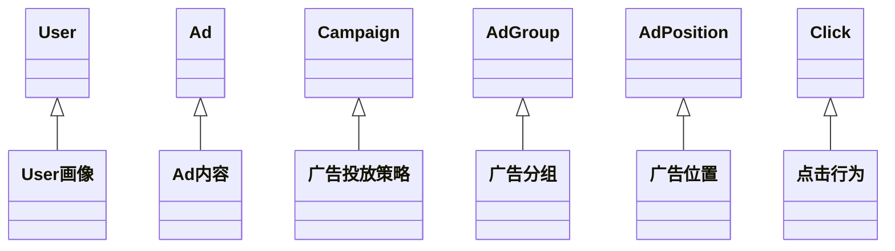
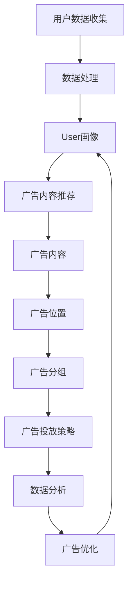
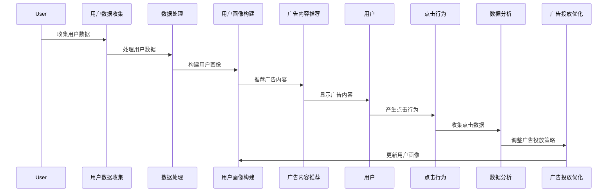

                 

# 人工智能在个性化广告投放中的精准应用

> 关键词：人工智能、个性化广告、精准投放、算法、系统架构、项目实战

> 摘要：本文深入探讨人工智能在个性化广告投放中的应用，从背景介绍、核心概念、算法原理、系统分析与架构设计、项目实战等多个角度，详细解析了个性化广告投放的技术实现和最佳实践，旨在为读者提供全面的技术参考和实操指导。

## 第1章：问题背景与核心概念

### 1.1.1 问题背景

#### 1.1.1.1 广告投放现状

广告投放是现代市场营销中不可或缺的一环，传统的广告投放方式主要依赖于媒体平台和广告主的预算分配，往往存在一定的盲目性和随机性。随着互联网的普及和信息爆炸时代的到来，广告投放的方式和效果也发生了巨大变化。近年来，随着人工智能技术的快速发展，个性化广告投放逐渐成为广告领域的重要研究方向。

#### 1.1.1.2 个性化广告投放的意义

个性化广告投放能够根据用户的兴趣、行为、地理位置等多维度信息，精准定位目标用户，提高广告投放的效果。与传统广告投放方式相比，个性化广告投放具有更高的投放精准度和转化率，能够有效降低广告投放成本，提高广告主的投放回报。

#### 1.1.1.3 人工智能在广告投放中的应用

人工智能技术在广告投放中的应用主要体现在用户画像构建、广告推荐算法、广告投放优化等方面。通过大数据分析和机器学习算法，人工智能能够实现用户兴趣的精准识别和广告内容的个性化推荐，提高广告投放的精准度和用户体验。

### 1.1.2 核心概念

#### 1.1.2.1 人工智能概述

人工智能（Artificial Intelligence，简称AI）是指模拟、延伸和扩展人类智能的理论、方法、技术及应用。人工智能技术主要包括机器学习、深度学习、自然语言处理、计算机视觉等。

#### 1.1.2.2 个性化广告投放概述

个性化广告投放是指利用人工智能技术，通过对用户数据的分析和挖掘，实现广告内容、投放时间和投放渠道的个性化定制，提高广告投放的精准度和效果。

#### 1.1.2.3 相关技术概念介绍

- 用户画像：用户画像是指通过对用户的基本信息、行为数据、兴趣偏好等多维度数据进行分析，构建出用户的全貌。
- 广告推荐算法：广告推荐算法是指利用机器学习、深度学习等技术，根据用户的行为数据、兴趣标签等信息，为用户推荐个性化的广告内容。
- 广告投放优化：广告投放优化是指通过调整广告投放策略，如投放时间、投放渠道、投放预算等，提高广告投放的效果。

## 第2章：核心概念与联系

### 2.1.1 概念原理

#### 2.1.1.1 人工智能原理

人工智能的核心在于模拟和延伸人类智能。其基本原理包括感知、认知、决策和执行等。感知是指通过传感器获取外部信息；认知是指处理和理解感知到的信息；决策是指基于认知结果做出合理的决策；执行是指实施决策，达到目标。

#### 2.1.1.2 个性化广告投放原理

个性化广告投放的原理在于通过对用户数据的分析和挖掘，构建用户画像，然后利用广告推荐算法，为用户推荐个性化的广告内容，从而提高广告投放的精准度和效果。

### 2.1.2 概念属性特征对比

#### 2.1.2.1 人工智能技术对比

| 技术名称 | 特点 | 应用场景 |
| :---: | :---: | :---: |
| 机器学习 | 自动从数据中学习规律和模式，无需显式编程 | 数据分析、预测建模、分类等 |
| 深度学习 | 基于多层神经网络，自动提取数据特征 | 图像识别、语音识别、自然语言处理等 |
| 自然语言处理 | 对自然语言文本进行理解和生成 | 文本分类、机器翻译、问答系统等 |
| 计算机视觉 | 对图像和视频进行处理和分析 | 人脸识别、物体检测、图像分割等 |

#### 2.1.2.2 广告投放策略对比

| 策略名称 | 特点 | 适用场景 |
| :---: | :---: | :---: |
| 广告竞价 | 以出价高低决定广告展示位置 | 高频次、高竞争的广告投放 |
| 广告定位 | 根据用户兴趣和行为定位广告 | 个性化、精准投放 |
| 广告展示频次控制 | 控制广告展示的频次，避免过度骚扰 | 长期广告投放，保持用户粘性 |

### 2.1.3 ER实体关系图

```mermaid
erDiagram
    User ||--|{ Ad } : receives
    User ||--|{ AdHistory } : history of
    Ad ||--|{ Campaign } : part of
    Ad ||--|{ AdGroup } : in
    AdHistory ||--|{ Click } : generates
    AdGroup ||--|{ AdPosition } : places
```

## 第3章：算法原理讲解

### 3.1.1 算法概述

个性化广告投放的核心在于推荐算法和投放优化算法。本文将重点介绍基于协同过滤的推荐算法和基于深度学习的投放优化算法。

#### 3.1.1.1 算法类型

- 协同过滤算法：基于用户的历史行为和相似用户的行为进行推荐。
- 深度学习算法：基于神经网络模型，自动提取用户特征和广告特征。

#### 3.1.1.2 算法应用场景

- 协同过滤算法：适用于推荐系统、电商网站、社交媒体等。
- 深度学习算法：适用于图像识别、语音识别、自然语言处理等。

### 3.1.2 算法原理详细讲解

#### 3.1.2.1 协同过滤算法原理

协同过滤算法主要通过计算用户之间的相似度，找到与目标用户相似的其他用户，然后根据这些用户的喜好推荐商品或内容。

- 评分矩阵：用户-物品评分矩阵，表示用户对物品的评分。
- 相似度计算：计算用户之间的相似度，常用的相似度计算方法有皮尔逊相关系数、余弦相似度等。
- 推荐列表生成：根据相似度计算结果，生成推荐列表。

#### 3.1.2.2 深度学习算法原理

深度学习算法主要通过构建多层神经网络，自动提取用户和物品的特征，然后利用这些特征进行预测。

- 神经网络结构：包括输入层、隐藏层和输出层。
- 损失函数：用于评估模型预测结果与真实结果之间的差距。
- 反向传播：通过反向传播算法，不断调整模型参数，使损失函数值最小化。

### 3.1.3 Python源代码

```python
# 协同过滤算法代码示例
import numpy as np

# 用户-物品评分矩阵
rating_matrix = np.array([[5, 3, 0, 1],
                          [4, 0, 0, 1],
                          [1, 2, 3, 0]])

# 计算用户之间的相似度
def cosine_similarity(ratings):
    similarity_matrix = np.dot(ratings, ratings.T) / (np.linalg.norm(ratings) * np.linalg.norm(ratings.T))
    return similarity_matrix

similarity_matrix = cosine_similarity(rating_matrix)

# 生成推荐列表
def generate_recommendations(similarity_matrix, user_index, top_n=5):
    user_similarity = similarity_matrix[user_index]
    recommendation_scores = np.dot(user_similarity, rating_matrix) - user_similarity[user_index] * rating_matrix[user_index]
    top_n_indices = np.argsort(recommendation_scores)[::-1][:top_n]
    return top_n_indices

# 为用户1生成推荐列表
user_index = 0
top_n = 5
recommendations = generate_recommendations(similarity_matrix, user_index, top_n)
print("推荐列表：", recommendations)
```

## 第4章：系统分析与架构设计方案

### 4.1.1 问题场景介绍

广告投放系统需要实现以下功能：

1. 用户数据收集与处理：收集用户的兴趣、行为、地理位置等数据，并进行数据清洗、去重、分类等处理。
2. 用户画像构建：根据用户数据，构建用户画像，包括用户的基本信息、兴趣标签、行为特征等。
3. 广告内容推荐：利用用户画像和广告特征，为用户推荐个性化的广告内容。
4. 广告投放优化：根据广告投放效果，实时调整广告投放策略，提高广告投放的精准度和效果。

### 4.1.2 系统功能设计

#### 4.1.2.1 领域模型Mermaid类图



### 4.1.3 系统架构设计

#### 4.1.3.1 Mermaid架构图



### 4.1.4 系统接口设计

#### 4.1.4.1 接口设计原则

1. RESTful API风格：采用统一的RESTful API风格，方便前端调用。
2. 参数验证：对输入参数进行严格的验证，确保数据的有效性和安全性。
3. 异步处理：对于耗时较长的任务，采用异步处理方式，提高系统性能。

#### 4.1.4.2 接口设计实现

- 用户数据收集接口：接收用户数据，进行初步处理。
- 用户画像构建接口：根据用户数据，构建用户画像。
- 广告内容推荐接口：根据用户画像和广告特征，为用户推荐广告内容。
- 广告投放优化接口：根据广告投放效果，调整广告投放策略。

### 4.1.5 系统交互

#### 4.1.5.1 Mermaid序列图



## 第5章：项目实战

### 5.1.1 环境安装

#### 5.1.1.1 系统环境搭建

- Python环境：安装Python 3.8及以上版本。
- 数据库：安装MySQL数据库。
- 依赖库：安装pandas、numpy、scikit-learn、tensorflow等依赖库。

```bash
pip install pandas numpy scikit-learn tensorflow
```

#### 5.1.1.2 开发工具安装

- IDE：安装PyCharm或VSCode等Python开发工具。
- Git：安装Git版本控制工具。

### 5.1.2 系统核心实现

#### 5.1.2.1 源代码解读

```python
# user_data_collection.py
import requests
import json
from sklearn.model_selection import train_test_split

def collect_user_data():
    # 发送HTTP请求，获取用户数据
    response = requests.get("https://example.com/user_data")
    user_data = json.loads(response.text)
    return user_data

# 读取用户数据
user_data = collect_user_data()

# 分割训练集和测试集
train_data, test_data = train_test_split(user_data, test_size=0.2, random_state=42)
```

#### 5.1.2.2 代码应用分析

```python
# user_data_processing.py
import pandas as pd
from sklearn.preprocessing import LabelEncoder

def preprocess_user_data(user_data):
    # 将用户数据转换为Pandas DataFrame
    df = pd.DataFrame(user_data)

    # 对分类特征进行编码
    encoder = LabelEncoder()
    df["interest_label"] = encoder.fit_transform(df["interest"])

    return df

# 预处理用户数据
df = preprocess_user_data(train_data)
```

### 5.1.3 实际案例剖析

#### 5.1.3.1 案例介绍

假设我们有一个电商网站，用户数据包括用户ID、年龄、性别、兴趣标签等。我们需要为用户推荐感兴趣的商品。

#### 5.1.3.2 案例分析

1. 数据收集：从电商网站的后台获取用户数据。
2. 数据预处理：对用户数据进行清洗、去重、编码等处理。
3. 用户画像构建：根据用户数据，构建用户画像，包括用户的基本信息、兴趣标签、行为特征等。
4. 广告内容推荐：利用用户画像和商品特征，为用户推荐感兴趣的广告内容。
5. 广告投放优化：根据广告投放效果，实时调整广告投放策略，提高广告投放的精准度和效果。

## 第6章：最佳实践 tips

### 6.1.1 技术选型

1. 选择合适的编程语言和框架，如Python和TensorFlow。
2. 选择合适的数据库和缓存系统，如MySQL和Redis。

### 6.1.2 部署与维护

1. 使用容器化技术，如Docker，简化部署和扩展。
2. 实时监控系统性能和健康状态，确保系统稳定运行。

## 第7章：小结与拓展阅读

### 7.1.1 小结

本文从背景介绍、核心概念、算法原理、系统架构设计、项目实战等多个角度，详细解析了人工智能在个性化广告投放中的应用。通过本文的介绍，读者可以了解到个性化广告投放的基本原理和实现方法，以及如何在实际项目中应用这些技术。

### 7.1.2 注意事项

1. 个性化广告投放需要充分保护用户隐私，遵循相关法律法规。
2. 在实际应用中，需要根据具体业务需求，不断优化和调整广告投放策略。

### 7.1.3 拓展阅读

1. 《Python数据分析》
2. 《深度学习》
3. 《大数据技术原理与应用》

作者：AI天才研究院/AI Genius Institute & 禅与计算机程序设计艺术 /Zen And The Art of Computer Programming

