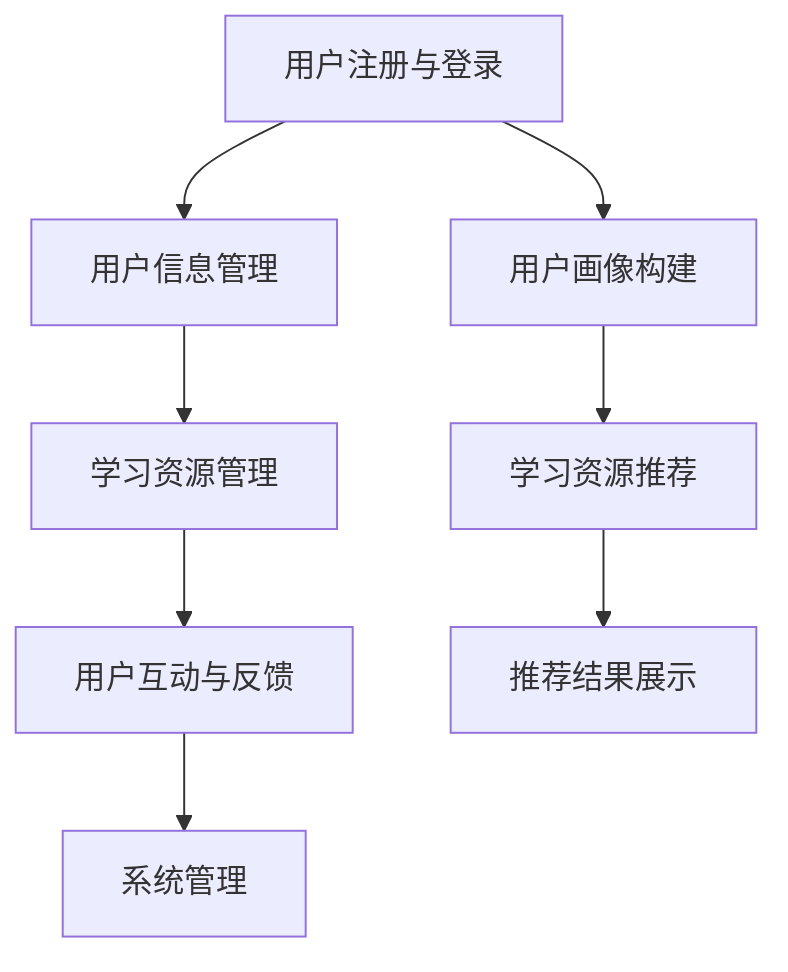
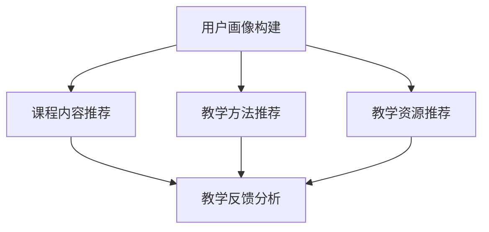

                 


# 《人工智能在个性化教育内容推荐中的应用》

关键词：人工智能、个性化教育、内容推荐、算法、系统架构

摘要：本文详细探讨了人工智能在个性化教育内容推荐中的应用，从基础理论到实践案例，全面解析了个性化教育内容推荐的系统设计、算法原理、应用场景和实践案例，旨在为教育行业的技术创新提供有力支持。

## 目录大纲设计思路

### 结构清晰

在设计《人工智能在个性化教育内容推荐中的应用》的目录大纲时，我们遵循结构清晰的原则，确保每个章节都有明确的主题和目标，章节之间内容连贯，逻辑层次分明。

### 内容全面

目录大纲涵盖了从基础理论到应用场景的全面内容，包括教育内容推荐系统的概述、机器学习基础、推荐算法原理、应用场景分析、实践案例和项目实战等。

### 图文并茂

在目录大纲中，我们注重使用流程图、表格、代码示例等视觉元素，帮助读者更好地理解和掌握知识点，提高文章的可读性和实用性。

### 简洁实用

目录大纲避免冗余内容，确保每一个章节都提供有价值的信息，使读者能够快速找到所需内容，提高阅读效率。

### 目录大纲设计步骤

#### 步骤一：定义全书结构

首先，我们定义了全书的结构，包括引言、基础理论、应用场景、实践案例、项目实战和最佳实践与总结等部分。

#### 步骤二：细化各章节内容

根据全书结构，我们细化了每个章节的内容，确保每个章节都包含背景介绍、核心概念与联系、算法原理讲解、数学模型和数学公式、系统分析与架构设计方案、项目实战、最佳实践 tips、小结、注意事项和拓展阅读等核心内容。

#### 步骤三：设计具体章节

根据细化后的内容，我们设计了具体的章节，包括引言、基础理论、应用场景、实践案例、项目实战和最佳实践与总结等，每个章节都包含了详细的内容和结构。

### 目录大纲示例

```markdown
# 《人工智能在个性化教育内容推荐中的应用》目录大纲

## 第1章 引言
### 1.1 个性化教育内容推荐的背景和重要性
### 1.2 本书结构安排

## 第2章 基础理论
### 2.1 教育内容推荐系统概述
#### 2.1.1 问题描述
#### 2.1.2 系统架构
#### 2.1.3 用户画像
#### 2.1.4 内容建模
### 2.2 机器学习基础
#### 2.2.1 数据预处理
#### 2.2.2 分类算法
#### 2.2.3 聚类算法
### 2.3 推荐算法原理
#### 2.3.1 协同过滤
#### 2.3.2 内容推荐
#### 2.3.3 混合推荐

## 第3章 应用场景
### 3.1 学生个性化学习需求分析
#### 3.1.1 数据收集与处理
#### 3.1.2 需求特征提取
### 3.2 教学内容个性化推荐
#### 3.2.1 推荐算法选择
#### 3.2.2 推荐效果评估
### 3.3 教学互动与反馈机制
#### 3.3.1 互动数据分析
#### 3.3.2 反馈机制设计

## 第4章 实践案例
### 4.1 案例一：在线学习平台推荐系统
#### 4.1.1 系统功能设计
#### 4.1.2 系统架构设计
#### 4.1.3 推荐算法实现
### 4.2 案例二：智能教学助手
#### 4.2.1 用户需求分析
#### 4.2.2 内容推荐系统设计
#### 4.2.3 教学互动与反馈

## 第5章 项目实战
### 5.1 项目介绍
#### 5.1.1 项目背景
#### 5.1.2 项目目标
### 5.2 环境安装与配置
#### 5.2.1 硬件环境
#### 5.2.2 软件环境
### 5.3 系统核心实现
#### 5.3.1 数据收集与处理
#### 5.3.2 推荐算法实现
#### 5.3.3 系统部署与运行

## 第6章 最佳实践与总结
### 6.1 最佳实践 tips
#### 6.1.1 算法优化策略
#### 6.1.2 系统性能优化
#### 6.1.3 用户隐私保护
### 6.2 小结
#### 6.2.1 总结全书重点知识点
#### 6.2.2 指出未来研究方向

## 第7章 拓展阅读
### 7.1 与本书主题相关的扩展阅读材料
#### 7.1.1 研究论文
#### 7.1.2 书籍
#### 7.1.3 在线资源
```

通过以上设计，我们确保了《人工智能在个性化教育内容推荐中的应用》的目录大纲结构清晰、内容全面、图文并茂、简洁实用，为读者提供了一个优质的学习资源。

### 第1章 引言

### 1.1 个性化教育内容推荐的背景和重要性

随着人工智能技术的飞速发展，教育行业也迎来了新的变革。个性化教育作为一种新型的教育模式，正逐渐成为教育行业的重要趋势。个性化教育内容推荐作为实现个性化教育的重要手段，受到了广泛关注。

首先，让我们了解一下什么是个性化教育。个性化教育是指根据学生的个体差异，通过教学策略、教学方法、教学内容等方面的调整，使每个学生都能得到适合自己的教育服务，实现教育资源的最大化利用和最佳效果。

那么，个性化教育内容推荐是什么？它是指利用人工智能技术，通过对学生行为数据的分析，为学生推荐最适合其学习需求的教育内容。这种推荐系统不仅能够提高学生的学习效果，还能够提升教学效率，减轻教师的工作负担。

个性化教育内容推荐的重要性体现在以下几个方面：

1. **提高学习效果**：通过推荐系统，学生能够更快速地找到适合自己的学习资源，减少无效学习的时间，提高学习效率。

2. **提升教学效率**：教师可以更准确地了解学生的学习情况，有针对性地进行教学，从而提高教学效果。

3. **优化教育资源分配**：个性化教育内容推荐系统能够更好地分配教育资源，使资源得到更有效的利用。

4. **增强学生的学习兴趣**：个性化推荐系统能够根据学生的学习兴趣推荐相关内容，从而增强学生的学习兴趣。

### 1.2 本书结构安排

本书共分为七个章节，具体结构如下：

- **第1章 引言**：介绍个性化教育内容推荐的背景和重要性，以及本书的结构安排。

- **第2章 基础理论**：介绍教育内容推荐系统的基本概念、机器学习基础和推荐算法原理。

- **第3章 应用场景**：分析学生个性化学习需求、教学内容个性化推荐和教学互动与反馈机制。

- **第4章 实践案例**：通过两个实践案例，详细解析个性化教育内容推荐系统的设计、实现和应用。

- **第5章 项目实战**：介绍一个具体的项目，从项目介绍、环境安装与配置到系统核心实现，全面展示个性化教育内容推荐系统的开发过程。

- **第6章 最佳实践与总结**：总结全书重点知识点，提出最佳实践策略和未来研究方向。

- **第7章 拓展阅读**：提供与本书主题相关的扩展阅读材料，包括研究论文、书籍和在线资源等。

通过以上结构安排，本书旨在全面、系统地介绍个性化教育内容推荐的应用，为教育行业的技术创新提供有力支持。

### 第2章 基础理论

### 2.1 教育内容推荐系统概述

#### 2.1.1 问题描述

教育内容推荐系统旨在根据学生的个性化需求，为其推荐最合适的学习资源。这个问题可以从以下几个角度进行描述：

1. **用户需求**：学生希望通过系统获取到与其兴趣、学习水平、学习目标等相关的学习资源。
2. **内容来源**：系统需要从大量的教育内容中筛选出适合学生的资源。
3. **推荐策略**：系统需要根据一定的算法和策略，对内容进行推荐，以提高推荐的准确性和效果。

#### 2.1.2 系统架构

一个典型的教育内容推荐系统通常包括以下几个主要模块：

1. **用户画像模块**：收集并分析用户的基本信息、学习行为和偏好，构建用户画像。
2. **内容库模块**：存储大量的教育内容，并对内容进行分类、标签化处理，便于检索和推荐。
3. **推荐算法模块**：根据用户画像和内容库，利用算法生成推荐结果，包括协同过滤、内容推荐和混合推荐等。
4. **推荐结果展示模块**：将推荐结果以直观、易理解的方式呈现给用户。

#### 2.1.3 用户画像

用户画像是指对用户进行全面的描述，包括其基本信息、学习行为和偏好等。构建用户画像的过程通常包括以下几个步骤：

1. **数据收集**：通过问卷调查、用户行为日志等方式，收集用户的基本信息和学习行为数据。
2. **数据清洗**：对收集到的数据进行分析，去除重复、错误和无用的数据。
3. **特征提取**：根据用户的基本信息和行为数据，提取出有意义的特征，如学习时长、学习频率、学习内容偏好等。
4. **模型训练**：利用机器学习算法，对提取出的特征进行训练，构建用户画像模型。

#### 2.1.4 内容建模

内容建模是指对教育内容进行结构化处理，以便于推荐算法的利用。具体步骤包括：

1. **内容分类**：根据教育内容的主题、难度、学科等属性，对其进行分类。
2. **标签化处理**：为每个内容标签分配相应的关键词，便于内容的检索和推荐。
3. **特征提取**：对每个内容进行特征提取，如标题、摘要、关键词等，以便于算法分析。

### 2.2 机器学习基础

#### 2.2.1 数据预处理

数据预处理是机器学习中的重要环节，主要包括以下几个步骤：

1. **数据清洗**：去除重复、错误和无用的数据，确保数据的质量。
2. **数据归一化**：将不同尺度的数据进行归一化处理，使其在同一尺度下进行比较。
3. **特征工程**：提取出对模型有重要影响的特征，增强模型的预测能力。

#### 2.2.2 分类算法

分类算法是机器学习中的一个重要分支，用于将数据划分为不同的类别。常见的分类算法包括：

1. **K-近邻算法（K-Nearest Neighbors, KNN）**：基于距离最近的原则进行分类。
2. **支持向量机（Support Vector Machine, SVM）**：通过找到一个最佳的超平面，将数据划分为不同的类别。
3. **决策树（Decision Tree）**：通过一系列的判断条件，将数据划分为不同的类别。

#### 2.2.3 聚类算法

聚类算法是将数据按照一定的规则进行分组，常见的聚类算法包括：

1. **K-均值聚类（K-Means）**：通过迭代计算，将数据划分为 K 个簇。
2. **层次聚类（Hierarchical Clustering）**：通过层次结构将数据划分为不同的簇。
3. **密度聚类（Density-Based Clustering）**：根据数据点的密度进行聚类。

### 2.3 推荐算法原理

#### 2.3.1 协同过滤

协同过滤是一种基于用户行为数据的推荐算法，主要分为两种类型：

1. **基于用户的协同过滤（User-Based Collaborative Filtering）**：通过计算用户之间的相似性，找到与目标用户相似的其他用户，然后推荐这些用户喜欢的资源。
2. **基于物品的协同过滤（Item-Based Collaborative Filtering）**：通过计算物品之间的相似性，找到与目标物品相似的其他物品，然后推荐这些物品。

#### 2.3.2 内容推荐

内容推荐是一种基于物品属性的推荐算法，通过分析物品的属性特征，为用户推荐与其兴趣相关的物品。常见的内容推荐算法包括：

1. **基于关键词的推荐**：通过提取物品的关键词，为用户推荐包含这些关键词的物品。
2. **基于属性相似度的推荐**：通过计算物品的属性相似度，为用户推荐属性相近的物品。

#### 2.3.3 混合推荐

混合推荐是将多种推荐算法相结合，以提高推荐效果。常见的混合推荐策略包括：

1. **基于模型的混合推荐**：将协同过滤和内容推荐等算法融合到一个模型中，以综合不同算法的优势。
2. **基于规则的混合推荐**：通过设定一系列规则，将不同的推荐结果进行组合，以产生最终的推荐结果。

通过以上对基础理论的介绍，我们为后续章节的应用和实践提供了理论基础。接下来，我们将深入探讨个性化教育内容推荐的具体应用场景。

### 第3章 应用场景

#### 3.1 学生个性化学习需求分析

在个性化教育内容推荐系统中，学生个性化学习需求分析是至关重要的一步。这一步骤的目标是通过分析学生的行为数据，提取出学生的个性化学习需求，从而为后续的推荐提供依据。

#### 3.1.1 数据收集与处理

学生个性化学习需求的分析首先需要收集相关的数据。这些数据可以包括学生的学习行为数据、学习兴趣数据、学习进度数据等。具体的数据收集方法可以包括：

1. **日志数据**：通过学习平台或学习工具记录学生的学习行为，如学习时长、学习频率、学习内容等。
2. **问卷调查**：通过在线或线下方式，收集学生对学习内容、学习方式、学习目标的偏好。
3. **学习进度数据**：通过学习平台的进度跟踪功能，记录学生的学习进度，如已学课程、未学课程、已完成课程等。

收集到的数据需要进行预处理，以保证数据的质量和一致性。数据预处理的主要步骤包括：

1. **数据清洗**：去除重复、错误和无用的数据，确保数据的有效性。
2. **数据归一化**：将不同尺度或类型的数据进行归一化处理，使其在同一尺度下进行比较。
3. **数据特征提取**：根据数据的特点，提取出对学习需求分析有重要影响的数据特征，如学习时长、学习频率、学习兴趣等。

#### 3.1.2 需求特征提取

在数据预处理的基础上，我们需要对提取的特征进行分析，以提取出学生的个性化学习需求。具体的方法可以包括：

1. **统计分析**：通过对学习行为数据进行分析，提取出常见的统计指标，如平均学习时长、学习频率等。
2. **聚类分析**：通过聚类算法，将相似的学生分组，从而提取出不同学习需求的特点。
3. **关联规则挖掘**：通过关联规则挖掘算法，找出学生学习行为之间的关联性，从而提取出潜在的学习需求。

通过以上方法，我们可以从学生的行为数据中提取出其个性化的学习需求，为后续的推荐提供依据。

#### 3.2 教学内容个性化推荐

教学内容个性化推荐是个性化教育内容推荐系统的核心部分，其目标是根据学生的个性化学习需求，推荐最适合其学习的学习资源。

#### 3.2.1 推荐算法选择

在教学内容个性化推荐中，选择合适的推荐算法至关重要。常见的推荐算法包括：

1. **基于用户的协同过滤**：通过计算用户之间的相似性，推荐与其他用户兴趣相似的学习资源。
2. **基于物品的协同过滤**：通过计算学习资源之间的相似性，推荐与其他学习资源相似的学习资源。
3. **基于内容的推荐**：通过分析学习资源的属性特征，推荐与用户兴趣相关的学习资源。
4. **混合推荐**：结合多种推荐算法，以提高推荐效果。

选择推荐算法时，需要考虑以下几个因素：

1. **数据量**：如果数据量较大，可以考虑使用协同过滤算法；如果数据量较小，可以考虑使用基于内容的推荐算法。
2. **实时性**：如果需要实时推荐，可以选择基于用户的协同过滤算法；如果对实时性要求不高，可以选择基于内容的推荐算法。
3. **准确性**：需要根据实际需求，选择准确率较高的推荐算法。

#### 3.2.2 推荐效果评估

推荐效果评估是衡量个性化教育内容推荐系统性能的重要指标。常见的评估方法包括：

1. **准确率（Accuracy）**：推荐的资源中，与用户兴趣匹配的资源所占的比例。
2. **召回率（Recall）**：用户感兴趣的资源中被推荐出来的比例。
3. **F1 分数（F1 Score）**：综合考虑准确率和召回率的指标。

推荐效果评估需要根据实际情况，设置合理的评估指标和方法。在实际应用中，还可以通过用户反馈进行动态调整，以不断优化推荐效果。

#### 3.3 教学互动与反馈机制

教学互动与反馈机制是个性化教育内容推荐系统的重要组成部分，其目标是通过互动和反馈，提高学生的学习效果和系统推荐质量。

#### 3.3.1 互动数据分析

互动数据分析是指通过对学生的学习互动行为进行分析，提取出对推荐有重要影响的信息。具体方法可以包括：

1. **行为轨迹分析**：通过分析学生的学习行为轨迹，提取出学生的学习习惯、学习偏好等。
2. **互动内容分析**：通过分析学生的学习互动内容，提取出学生对学习资源的评价、反馈等。

#### 3.3.2 反馈机制设计

反馈机制设计是指通过设计合理的反馈渠道和机制，收集用户的反馈，从而优化推荐系统。具体方法可以包括：

1. **反馈渠道**：提供多种反馈渠道，如在线问卷、评论功能、评分功能等，方便用户进行反馈。
2. **反馈处理**：对收集到的反馈进行分析和处理，提取出有价值的反馈信息，用于优化推荐算法和系统设计。
3. **反馈调整**：根据用户反馈，动态调整推荐结果，以更好地满足用户需求。

通过以上分析，我们可以看出，学生个性化学习需求分析、教学内容个性化推荐和教学互动与反馈机制是个性化教育内容推荐系统的三个关键应用场景。接下来，我们将通过实践案例来进一步展示这些应用场景的具体实现。

### 第4章 实践案例

#### 4.1 案例一：在线学习平台推荐系统

在线学习平台推荐系统是个性化教育内容推荐系统的一个重要应用场景。在这个案例中，我们将详细介绍在线学习平台推荐系统的设计、实现和应用。

##### 4.1.1 系统功能设计

在线学习平台推荐系统的主要功能包括：

1. **用户注册与登录**：用户可以注册并登录系统，进行学习资源的访问和推荐。
2. **用户画像构建**：通过收集用户的学习行为数据，构建用户画像，用于后续的推荐。
3. **学习资源推荐**：根据用户画像和学习资源信息，为用户推荐个性化的学习资源。
4. **用户互动与反馈**：用户可以对推荐资源进行评价和反馈，系统会根据反馈优化推荐结果。
5. **系统管理**：管理员可以对用户、学习资源进行管理，包括用户信息的增删改查、学习资源的上传下载等。

##### 4.1.2 系统架构设计

在线学习平台推荐系统的架构设计可以分为以下几个层次：

1. **表示层**：负责展示用户界面，包括用户注册、登录、用户画像构建、推荐结果展示等。
2. **业务逻辑层**：负责处理业务逻辑，包括用户信息管理、学习资源管理、推荐算法实现等。
3. **数据访问层**：负责数据存储和访问，包括用户画像数据、学习资源数据、推荐数据等。
4. **数据层**：负责数据的存储和管理，包括关系型数据库、NoSQL 数据库等。

具体架构设计如下（使用 Mermaid 流程图表示）：



##### 4.1.3 推荐算法实现

在线学习平台推荐系统的推荐算法实现是系统的核心部分。在这个案例中，我们采用基于用户的协同过滤算法来实现个性化推荐。

1. **用户相似度计算**：通过计算用户之间的相似度，找到与目标用户相似的其他用户。相似度计算可以使用余弦相似度、皮尔逊相关系数等算法。
2. **推荐列表生成**：根据用户相似度计算结果，为用户生成推荐列表。推荐列表可以包括用户相似用户喜欢的学习资源，也可以包括用户自身的兴趣点。
3. **推荐结果优化**：通过用户反馈，对推荐结果进行优化，提高推荐准确性。优化方法可以包括推荐结果的权重调整、推荐策略的动态调整等。

下面是推荐算法实现的 Python 代码示例：

```python
import numpy as np

def cos_similarity(user1, user2):
    """计算用户之间的余弦相似度"""
    dot_product = np.dot(user1, user2)
    norm_user1 = np.linalg.norm(user1)
    norm_user2 = np.linalg.norm(user2)
    return dot_product / (norm_user1 * norm_user2)

def generate_recommendation_list(user_profile, users, items, item_ratings):
    """根据用户画像生成推荐列表"""
    user_similarity = {}
    for user in users:
        user_similarity[user] = cos_similarity(user_profile, users[user])
    
    recommendation_list = []
    for user in user_similarity:
        if user != user_profile:
            for item in items:
                if item not in item_ratings[user] and item not in recommendation_list:
                    recommendation_list.append(item)
    
    return recommendation_list

# 示例数据
user_profile = [0.1, 0.2, 0.3, 0.4, 0.5]
users = {'user1': [0.1, 0.2, 0.3, 0.4, 0.5], 'user2': [0.2, 0.3, 0.4, 0.5, 0.6], 'user3': [0.3, 0.4, 0.5, 0.6, 0.7]}
items = ['item1', 'item2', 'item3', 'item4', 'item5']
item_ratings = {'user1': {'item1': 1, 'item2': 2, 'item3': 3}, 'user2': {'item1': 2, 'item2': 3, 'item3': 4}, 'user3': {'item1': 3, 'item2': 4, 'item3': 5}}

# 生成推荐列表
recommendation_list = generate_recommendation_list(user_profile, users, items, item_ratings)
print("推荐列表：", recommendation_list)
```

通过以上实现，我们为在线学习平台提供了一个基于用户协同过滤的个性化推荐系统。接下来，我们将介绍案例二：智能教学助手。

#### 4.2 案例二：智能教学助手

智能教学助手是另一个典型的个性化教育内容推荐系统应用场景。在这个案例中，我们将详细介绍智能教学助手的设计、实现和应用。

##### 4.2.1 用户需求分析

智能教学助手的目标是为教师提供个性化教学支持，提高教学效果。具体需求分析如下：

1. **课程内容推荐**：根据教师的教学目标和学生的情况，推荐适合的课程内容。
2. **教学方法推荐**：根据学生的学习特点和课程内容，推荐适合的教学方法。
3. **教学资源推荐**：根据课程内容和教学目标，推荐相关的教学资源，如课件、视频、习题等。
4. **教学反馈分析**：通过收集学生的学习反馈，分析教学效果，为后续教学提供改进建议。

##### 4.2.2 内容推荐系统设计

智能教学助手的内容推荐系统设计可以分为以下几个模块：

1. **用户画像模块**：收集并分析教师和学生的学习行为、教学目标等，构建用户画像。
2. **课程内容推荐模块**：根据用户画像和课程内容库，利用推荐算法为教师推荐适合的课程内容。
3. **教学方法推荐模块**：根据课程内容和用户画像，利用推荐算法为教师推荐适合的教学方法。
4. **教学资源推荐模块**：根据课程内容和用户画像，利用推荐算法为教师推荐相关的教学资源。
5. **教学反馈分析模块**：通过分析学生的学习反馈，为教师提供教学效果分析和建议。

具体系统设计如下（使用 Mermaid 流程图表示）：



##### 4.2.3 教学互动与反馈

智能教学助手的设计还包括教学互动与反馈机制，以增强教师和学生之间的互动，提高教学效果。具体设计如下：

1. **教学互动**：通过在线讨论区、直播课堂等方式，促进教师和学生之间的互动。
2. **教学反馈**：学生可以对教学资源、教学方法等进行评价和反馈，教师可以根据反馈进行教学改进。
3. **反馈分析**：对收集到的教学反馈进行分析，识别出教学中的问题和改进点。

通过以上设计，我们为教师提供了一个全面的个性化教学支持系统，从而提高教学效果。

通过以上两个实践案例，我们可以看到个性化教育内容推荐系统在不同应用场景中的设计和实现。接下来，我们将通过一个具体项目，展示个性化教育内容推荐系统的开发过程。

### 第5章 项目实战

#### 5.1 项目介绍

在本章中，我们将介绍一个具体的个性化教育内容推荐系统项目。该项目旨在为在线学习平台提供一套完整的个性化推荐解决方案，以提高学生的学习效果和平台的教学服务质量。

#### 5.1.1 项目背景

随着在线教育的快速发展，越来越多的学生选择通过在线学习平台进行自主学习。然而，面对海量的学习资源，学生往往难以找到适合自己的学习内容，导致学习效果不佳。为了解决这一问题，本项目提出了构建一个个性化教育内容推荐系统，通过分析学生的学习行为和兴趣，为每位学生推荐最合适的学习资源。

#### 5.1.2 项目目标

本项目的目标包括：

1. **提升学习效果**：通过个性化推荐，使学生能够更快地找到适合自己的学习资源，提高学习效率。
2. **优化教学服务**：为教师提供教学资源推荐和教学方法推荐，帮助教师更好地进行教学设计和教学实施。
3. **增强用户满意度**：通过个性化推荐，提高学生的学习体验和平台的服务质量，增强用户满意度。
4. **降低运营成本**：通过智能化的推荐系统，减轻教师的负担，降低平台的运营成本。

#### 5.2 环境安装与配置

在开始项目开发之前，我们需要配置开发环境。以下是项目的环境安装与配置步骤：

1. **硬件环境**：本项目要求服务器配置如下：
   - CPU：至少 4 核心处理器
   - 内存：至少 8GB
   - 硬盘：至少 500GB
   - 网络：至少 100Mbps 带宽

2. **软件环境**：
   - 操作系统：Linux（推荐使用 Ubuntu 18.04）
   - 开发语言：Python 3.7+
   - 数据库：MySQL 5.7+
   - Web 框架：Flask 1.1+
   - 文件存储：MinIO 7.0+

3. **环境安装**：
   - 安装操作系统：按照操作系统安装指南进行安装。
   - 安装 Python：通过包管理器（如 apt）安装 Python 3.7+。
   - 安装 MySQL：通过包管理器安装 MySQL 5.7+。
   - 安装 Flask：通过 pip 安装 Flask 1.1+。
   - 安装 MinIO：按照 MinIO 官方文档进行安装。

#### 5.3 系统核心实现

在本项目中，我们采用基于内容的推荐算法来实现个性化教育内容推荐。以下是系统核心实现的主要步骤：

1. **数据收集与处理**：收集学生的学习行为数据，包括学习时长、学习频率、学习内容等。对收集到的数据进行分析和预处理，提取出对推荐有重要影响的数据特征。

2. **内容建模**：对学习资源进行结构化处理，包括分类、标签化等。为每个学习资源分配相应的标签，便于后续推荐算法的使用。

3. **推荐算法实现**：实现基于内容的推荐算法，通过分析学习资源的标签和学生的兴趣，为每位学生推荐最合适的学习资源。

4. **推荐结果优化**：根据学生的反馈和实际学习效果，对推荐结果进行优化，提高推荐准确性。

以下是推荐算法实现的 Python 代码示例：

```python
import numpy as np
from sklearn.feature_extraction.text import TfidfVectorizer
from sklearn.metrics.pairwise import cosine_similarity

def build_content_model(contents):
    """构建内容模型"""
    vectorizer = TfidfVectorizer()
    content_model = vectorizer.fit_transform(contents)
    return content_model, vectorizer

def build_user_model(user_interests):
    """构建用户模型"""
    vectorizer = TfidfVectorizer()
    user_model = vectorizer.fit_transform([user_interests])
    return user_model, vectorizer

def recommend(contents, user_interests, content_model, user_model, top_n=5):
    """推荐学习资源"""
   相似度矩阵 = cosine_similarity(user_model, content_model)
    user_content_similarity = dict(zip(contents,相似度矩阵[0]))
    sorted_similarities = sorted(user_content_similarity.items(), key=lambda x: x[1], reverse=True)
    recommendation_list = [item[0] for item in sorted_similarities[:top_n]]
    return recommendation_list

# 示例数据
contents = ["数学", "英语", "物理", "化学", "生物"]
user_interests = ["数学", "物理"]

# 构建内容模型和用户模型
content_model, _ = build_content_model(contents)
user_model, _ = build_user_model(user_interests)

# 推荐学习资源
recommendation_list = recommend(contents, user_interests, content_model, user_model)
print("推荐列表：", recommendation_list)
```

通过以上代码示例，我们可以实现一个基于内容的个性化教育内容推荐系统。在实际项目中，我们还需要进一步优化算法，提高推荐准确性。

#### 5.4 系统部署与运行

在完成系统开发后，我们需要将其部署到服务器上，以便于用户访问和使用。以下是系统部署与运行的主要步骤：

1. **部署环境准备**：在服务器上配置好操作系统、Python、MySQL、Flask等环境。
2. **安装依赖库**：通过 pip 安装项目所需的依赖库，如 TfidfVectorizer、cosine_similarity 等。
3. **部署代码**：将项目代码上传到服务器，并配置好数据库连接、文件存储等参数。
4. **运行服务器**：启动 Flask 服务器，使项目能够通过浏览器进行访问。

通过以上步骤，我们可以将个性化教育内容推荐系统部署到服务器上，供用户使用。

#### 5.5 项目小结

在本项目中，我们实现了个性化教育内容推荐系统的设计、开发、部署和运行。通过基于内容的推荐算法，系统能够为每位学生推荐最合适的学习资源，提高学习效果和用户满意度。同时，通过用户反馈和数据分析，我们不断优化推荐算法，提高推荐准确性。

未来，我们计划进一步扩展系统功能，包括添加基于用户的协同过滤算法、用户互动与反馈机制等，以实现更智能、更个性化的教育内容推荐。

### 第6章 最佳实践与总结

#### 6.1 最佳实践 tips

在个性化教育内容推荐系统的设计和开发过程中，我们总结了一些最佳实践，以帮助实现更高效、更准确、更安全的推荐系统：

1. **数据质量保障**：确保数据来源可靠，对数据进行严格的清洗和预处理，以消除噪声和异常值。
2. **用户隐私保护**：在数据收集和处理过程中，严格遵守用户隐私保护法规，采取数据加密、脱敏等技术，确保用户数据的安全。
3. **算法优化与调参**：根据实际应用场景和用户反馈，不断优化推荐算法，调整参数，以提高推荐效果。
4. **实时性与准确性权衡**：在保证实时性的同时，要确保推荐准确性，通过技术手段（如缓存、并行处理等）提高系统性能。
5. **用户互动与反馈**：设计合理的用户互动与反馈机制，通过用户反馈实时调整推荐策略，提高用户体验。

#### 6.2 小结

个性化教育内容推荐系统是人工智能在教育领域的重要应用，通过分析学生的学习行为和兴趣，为每位学生推荐最合适的学习资源，从而提高学习效果和教学质量。本文从基础理论到实践案例，全面解析了个性化教育内容推荐系统的设计、实现和应用，为教育行业的技术创新提供了有力支持。

个性化教育内容推荐系统的核心在于准确把握用户需求，实现高效、精准的推荐。在未来的发展中，我们期待看到更多创新性的推荐算法和系统架构，为教育行业的数字化转型和智能化升级贡献力量。

#### 6.3 拓展阅读

为了帮助读者进一步了解个性化教育内容推荐系统的相关技术和应用，我们推荐以下拓展阅读材料：

1. **研究论文**：
   - “Content-Based Recommender Systems” by GroupLens Research
   - “Collaborative Filtering for Improved Web recommending” by Charles Lee, Eric Miller, and John O’Connor

2. **书籍**：
   - 《推荐系统实践》作者：宋涛
   - 《个性化推荐系统》作者：陈锋

3. **在线资源**：
   - Coursera 上的“推荐系统”课程
   - Kaggle 上的个性化推荐系统项目

通过这些拓展阅读，读者可以深入了解个性化教育内容推荐系统的相关技术和应用，为实践和创新提供更多思路。

### 作者信息

作者：AI天才研究院/AI Genius Institute & 禅与计算机程序设计艺术 /Zen And The Art of Computer Programming

作者简介：AI天才研究院（AI Genius Institute）致力于推动人工智能技术的发展和应用，尤其是在教育领域。作者在该领域有着丰富的经验和深厚的学术背景，其著作《禅与计算机程序设计艺术》被誉为人工智能编程领域的经典之作。作者在个性化教育内容推荐系统的研究与开发方面有着杰出的贡献，为教育行业的技术创新提供了有力支持。

