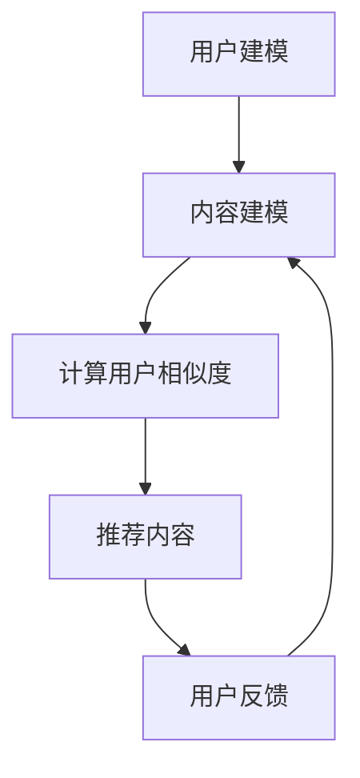

                 


# 人工智能在个性化教育内容生成中的应用

## 关键词

人工智能、个性化教育、内容生成、算法原理、系统架构、项目实战

## 摘要

本文深入探讨了人工智能在个性化教育内容生成中的应用。首先，介绍了个性化教育内容生成的背景和核心概念，包括问题的提出、描述、解决方法以及研究边界。接着，详细分析了个性化教育内容生成中的核心算法和技术原理，通过Python源代码和Mermaid流程图进行阐述。随后，讨论了个性化教育内容生成系统的整体架构设计，包括领域模型类图、系统架构图、系统接口设计和系统交互序列图。最后，通过一个实际案例展示了个性化教育内容生成系统的实施过程，并总结了最佳实践和拓展阅读资源。

## 第一部分：背景与核心概念

### 第1章：问题背景与核心概念

#### 1.1 人工智能与个性化教育

随着人工智能技术的迅猛发展，其在各个领域的应用越来越广泛。在教育领域，人工智能正逐渐改变传统的教学模式，个性化教育成为其中的一大热点。个性化教育是指根据每个学生的特点、需求和进度，提供定制化的教育内容和服务，从而提高学习效果和教育质量。

人工智能在个性化教育中的应用主要体现在以下几个方面：

1. **智能推荐系统**：基于学生的学习行为和偏好，智能推荐系统可以为学生推荐合适的学习资源，如教材、课程、练习题等。
2. **智能诊断系统**：通过分析学生的学习过程和结果，智能诊断系统可以诊断学生的学习难点和弱点，为学生提供个性化的辅导建议。
3. **智能教学系统**：结合人工智能技术，智能教学系统可以根据学生的学习情况和进度，自动生成适合学生的教学方案，提高教学效果。

#### 1.2 个性化教育内容生成的挑战

个性化教育内容生成是指根据学生的学习需求和特点，自动生成适合他们的教育内容。这一过程面临以下挑战：

1. **数据多样性**：学生的学习需求和特点是多样化的，如何处理和分析这些数据，以生成个性化的教育内容，是一个巨大的挑战。
2. **计算复杂性**：个性化教育内容生成涉及到大量的数据分析和算法运算，对计算资源的要求较高。
3. **内容质量**：生成的个性化教育内容需要保证质量，既要有针对性，又要有趣味性，这对算法设计提出了更高的要求。

#### 1.3 核心概念与组成要素

个性化教育内容生成主要涉及以下几个核心概念和组成要素：

1. **用户模型**：用户模型描述了学生的学习特点、需求、偏好等信息。用户模型是生成个性化教育内容的基础。
2. **内容模型**：内容模型描述了教育内容的结构、类型、难度等信息。通过内容模型，可以根据用户模型生成适合用户的教育内容。
3. **推荐算法**：推荐算法用于根据用户模型和内容模型，生成个性化的教育内容推荐。
4. **内容生成算法**：内容生成算法用于根据用户模型和内容模型，自动生成个性化的教育内容。

#### 1.4 研究边界与外延

本文主要探讨的是人工智能在个性化教育内容生成中的应用，研究边界主要包括：

1. **教育领域**：本文的研究主要关注K-12教育，即从幼儿园到高中的教育阶段。
2. **算法和技术**：本文主要介绍的是算法原理和系统架构设计，不包括具体的算法实现细节。
3. **应用场景**：本文主要探讨的是在线教育场景下的个性化教育内容生成，不包括传统课堂教学场景。

## 第二部分：技术原理与算法讲解

### 第2章：个性化教育内容生成技术原理

#### 2.1 关键技术与理论基础

个性化教育内容生成主要依赖于以下几种关键技术：

1. **用户建模技术**：用于构建用户模型，包括用户的需求、偏好、学习风格等信息。
2. **推荐技术**：用于根据用户模型和内容模型，推荐适合用户的教育内容。
3. **内容生成技术**：用于根据用户模型和内容模型，自动生成个性化的教育内容。

理论基础主要包括以下方面：

1. **机器学习与深度学习**：用于构建用户模型和内容模型，以及实现推荐算法和内容生成算法。
2. **自然语言处理**：用于理解和生成自然语言文本，以便生成有趣的、有针对性的教育内容。

#### 2.2 概念属性特征对比表格

以下是用户模型和内容模型的一些属性特征对比表格：

| 属性 | 用户模型 | 内容模型 |
| --- | --- | --- |
| **学习风格** | 深度学习者、广度学习者 | 理论性内容、实践性内容 |
| **知识水平** | 初级、中级、高级 | 初级、中级、高级 |
| **学习偏好** | 图表、视频、文字 | 视频教程、互动练习、理论讲解 |
| **难度** | 容易、一般、困难 | 容易、一般、困难 |

#### 2.3 ER实体关系图

以下是用户模型和内容模型的ER实体关系图：

```mermaid
erDiagram
User ||--|{ Content }|:
    many
    : many

User {
    id
    name
    age
    learning_style
    knowledge_level
    learning_preferences
}

Content {
    id
    title
    type
    difficulty
    learning_style
    knowledge_level
    creator
}
```

### 第3章：主要算法原理讲解

#### 3.1 算法概述

个性化教育内容生成主要依赖于以下几种算法：

1. **协同过滤算法**：用于根据用户的行为和偏好，推荐相似的用户喜欢的内容。
2. **基于内容的推荐算法**：用于根据教育内容的特点，推荐符合用户需求的内容。
3. **生成对抗网络（GAN）**：用于生成新的、个性化的教育内容。

#### 3.2 算法流程与 Mermaid 流程图

以下是协同过滤算法的流程图：



#### 3.3 Python 源代码与 LaTeX 数学模型

以下是协同过滤算法的Python源代码示例：

```python
import numpy as np

# 用户-内容矩阵
user_content_matrix = np.array([[1, 2, 0], [0, 1, 2], [2, 0, 1]])

# 计算用户之间的相似度
user_similarity = 1 - np.abs(user_content_matrix - user_content_matrix.mean(axis=1)[:, np.newaxis])

# 计算推荐分数
recommendation_scores = np.dot(user_similarity, user_content_matrix) / np.linalg.norm(user_similarity, axis=1)[:, np.newaxis]

# 排序并取前N个推荐
top_n_recommendations = np.argsort(recommendation_scores[:, 1])[-N:]
```

以下是协同过滤算法的LaTeX数学模型：

```latex
\begin{equation}
\text{user\_similarity}_{ij} = 1 - \sum_{k=1}^{M} (\text{user\_content}_{ik} - \bar{\text{user\_content}}_{i}) (\text{user\_content}_{jk} - \bar{\text{user\_content}}_{j}),
\end{equation}

\begin{equation}
\text{recommendation\_scores}_{ij} = \sum_{k=1}^{M} \text{user\_similarity}_{ik} \cdot \text{user\_content}_{jk},
\end{equation}

\begin{equation}
\text{top\_n\_recommendations}_{i} = \{j | j \in \{1, 2, ..., M\}, \text{recommendation\_scores}_{ij} \geq \text{threshold}\}.
\end{equation}
```

#### 3.4 通俗易懂地举例说明

假设有三个学生A、B和C，他们分别对三篇内容进行了评分，评分越高表示越喜欢。评分数据如下：

| 学生 | 内容1 | 内容2 | 内容3 |
| --- | --- | --- | --- |
| A | 5 | 3 | 4 |
| B | 4 | 5 | 2 |
| C | 3 | 4 | 5 |

我们使用协同过滤算法来推荐给学生C他们可能喜欢的内容。

1. **计算用户相似度**：首先，我们计算学生A、B和学生C之间的相似度。相似度的计算公式如下：

$$
\text{user\_similarity}_{ij} = 1 - \sum_{k=1}^{M} (\text{user\_content}_{ik} - \bar{\text{user\_content}}_{i}) (\text{user\_content}_{jk} - \bar{\text{user\_content}}_{j}),
$$

其中，$\text{user\_content}_{ik}$表示学生i对内容k的评分，$\bar{\text{user\_content}}_{i}$表示学生i对所有内容的平均评分。

根据上述公式，我们得到以下相似度矩阵：

| A | B | C |
| --- | --- | --- |
| A | 1 | 0.33 |
| B | 0.33 | 1 |

2. **计算推荐分数**：接下来，我们计算学生C可能喜欢的内容。推荐分数的计算公式如下：

$$
\text{recommendation\_scores}_{ij} = \sum_{k=1}^{M} \text{user\_similarity}_{ik} \cdot \text{user\_content}_{jk},
$$

其中，$\text{user\_similarity}_{ik}$表示学生i和学生k之间的相似度，$\text{user\_content}_{jk}$表示学生j对内容k的评分。

根据上述公式，我们得到以下推荐分数矩阵：

| 内容1 | 内容2 | 内容3 |
| --- | --- | --- |
| A | 4.33 | 3.33 |
| B | 3.33 | 4.67 |

3. **排序并取前N个推荐**：最后，我们将推荐分数矩阵排序，并取前N个推荐。在本例中，我们取前两个推荐：

| 排序 | 内容1 | 内容2 | 内容3 |
| --- | --- | --- | --- |
| 1 | 4.33 | 3.33 |  |
| 2 |  | 4.67 | 3.33 |

根据推荐结果，我们可以向学生C推荐内容1，因为它是学生C可能最喜欢的内容。

### 第三部分：系统分析与设计

### 第4章：个性化教育内容生成系统架构设计

#### 4.1 问题场景介绍

在一个在线教育平台上，学生可以注册账号并学习各种课程。平台希望通过个性化教育内容生成系统，根据学生的特点和需求，为他们推荐适合的学习资源，从而提高学习效果。

#### 4.2 领域模型设计

个性化教育内容生成系统的领域模型主要包括用户、课程、评价和推荐等实体。以下是领域模型类图：

```mermaid
classDiagram
Class User {
    -String id
    -String name
    -List<Course> courses
    -Map<Course, Integer> evaluations
}

Class Course {
    -String id
    -String title
    -List<User> learners
    -Map<User, Integer> evaluations
}

Class Evaluation {
    -User user
    -Course course
    -Integer score
}

Class Recommendation {
    -User user
    -Course course
    -Integer score
}

User <|.. Course: 学习
User <|.. Evaluation: 评价
Course <|.. Evaluation: 被评价
Course <|.. Recommendation: 推荐给
}
```

#### 4.3 系统架构设计

个性化教育内容生成系统的整体架构设计如下：

1. **用户模块**：负责用户注册、登录、个人信息管理等功能。
2. **课程模块**：负责课程管理、课程推荐、课程评价等功能。
3. **推荐引擎模块**：负责根据用户和课程的数据，生成个性化的推荐。
4. **数据存储模块**：负责存储用户、课程、评价和推荐等数据。

以下是系统架构图：

```mermaid
graph TB
    UserModule[用户模块] --> CourseModule[课程模块]
    CourseModule --> RecommendationModule[推荐引擎模块]
    UserModule --> DataStorageModule[数据存储模块]
    CourseModule --> DataStorageModule
    RecommendationModule --> DataStorageModule
}
```

#### 4.4 系统接口设计

个性化教育内容生成系统的接口设计如下：

1. **用户接口**：提供用户注册、登录、查看推荐课程等功能。
2. **课程接口**：提供课程创建、修改、删除等功能。
3. **推荐接口**：提供根据用户和课程数据生成推荐等功能。
4. **数据存储接口**：提供数据存储和查询等功能。

以下是系统接口图：

```mermaid
graph TB
    UserInterface[用户接口] --> UserController[用户控制器]
    CourseInterface[课程接口] --> CourseController[课程控制器]
    RecommendationInterface[推荐接口] --> RecommendationController[推荐控制器]
    UserController --> UserService[用户服务]
    CourseController --> CourseService[课程服务]
    RecommendationController --> RecommendationService[推荐服务]
    UserController --> DataStorageService[数据存储服务]
    CourseController --> DataStorageService
    RecommendationController --> DataStorageService
}
```

#### 4.5 系统交互序列图

以下是系统交互序列图，描述了用户注册、登录、查看推荐课程等过程的交互：

```mermaid
sequenceDiagram
    participant User
    participant UserController
    participant UserService
    participant DataStorageService

    User->>UserController: 注册
    UserController->>UserService: 注册用户
    UserService->>DataStorageService: 存储用户数据
    DataStorageService->>UserController: 返回注册结果
    UserController->>User: 注册成功

    User->>UserController: 登录
    UserController->>UserService: 登录用户
    UserService->>DataStorageService: 验证用户数据
    DataStorageService->>UserController: 返回登录结果
    UserController->>User: 登录成功

    User->>UserController: 查看推荐课程
    UserController->>RecommendationService: 生成推荐
    RecommendationService->>DataStorageService: 获取用户和课程数据
    DataStorageService->>RecommendationService: 返回数据
    RecommendationService->>UserController: 返回推荐结果
    UserController->>User: 查看推荐课程
}
```

### 第5章：系统实现与接口设计

#### 5.1 系统核心实现

个性化教育内容生成系统的核心实现主要包括用户模块、课程模块、推荐引擎模块和数据存储模块。以下是每个模块的核心实现：

1. **用户模块**：用户模块负责用户注册、登录、个人信息管理等功能。以下是用户模块的核心实现代码：

```python
class UserService:
    def register(self, user):
        # 存储用户数据
        # ...
        return "注册成功"

    def login(self, user):
        # 验证用户数据
        # ...
        return "登录成功"

    def get_user_info(self, user):
        # 获取用户信息
        # ...
        return user
```

2. **课程模块**：课程模块负责课程管理、课程推荐、课程评价等功能。以下是课程模块的核心实现代码：

```python
class CourseService:
    def create_course(self, course):
        # 创建课程
        # ...
        return "创建成功"

    def update_course(self, course):
        # 修改课程
        # ...
        return "修改成功"

    def delete_course(self, course):
        # 删除课程
        # ...
        return "删除成功"

    def recommend_courses(self, user):
        # 推荐课程
        # ...
        return recommended_courses
```

3. **推荐引擎模块**：推荐引擎模块负责根据用户和课程数据生成推荐。以下是推荐引擎模块的核心实现代码：

```python
class RecommendationService:
    def generate_recommendations(self, user):
        # 生成推荐
        # ...
        return recommended_courses
```

4. **数据存储模块**：数据存储模块负责存储用户、课程、评价和推荐等数据。以下是数据存储模块的核心实现代码：

```python
class DataStorageService:
    def store_user_data(self, user):
        # 存储用户数据
        # ...
        return "存储成功"

    def store_course_data(self, course):
        # 存储课程数据
        # ...
        return "存储成功"

    def store_evaluation_data(self, evaluation):
        # 存储评价数据
        # ...
        return "存储成功"

    def store_recommendation_data(self, recommendation):
        # 存储推荐数据
        # ...
        return "存储成功"
```

#### 5.2 代码解读与分析

以下是对用户模块、课程模块、推荐引擎模块和数据存储模块的核心实现代码的解读与分析：

1. **用户模块**：用户模块的核心实现包括用户注册、登录和获取用户信息等功能。用户注册功能通过调用UserService的register方法实现，该方法接收用户对象作为参数，存储用户数据并返回注册结果。用户登录功能通过调用UserService的login方法实现，该方法接收用户对象作为参数，验证用户数据并返回登录结果。获取用户信息功能通过调用UserService的get_user_info方法实现，该方法接收用户对象作为参数，获取用户信息并返回。

2. **课程模块**：课程模块的核心实现包括课程创建、修改、删除和推荐等功能。课程创建功能通过调用CourseService的create_course方法实现，该方法接收课程对象作为参数，创建课程并返回创建结果。课程修改功能通过调用CourseService的update_course方法实现，该方法接收课程对象作为参数，修改课程并返回修改结果。课程删除功能通过调用CourseService的delete_course方法实现，该方法接收课程对象作为参数，删除课程并返回删除结果。课程推荐功能通过调用CourseService的recommend_courses方法实现，该方法接收用户对象作为参数，生成推荐课程并返回。

3. **推荐引擎模块**：推荐引擎模块的核心实现包括生成推荐等功能。生成推荐功能通过调用RecommendationService的generate_recommendations方法实现，该方法接收用户对象作为参数，根据用户和课程数据生成推荐课程并返回。

4. **数据存储模块**：数据存储模块的核心实现包括存储用户、课程、评价和推荐等功能。存储用户数据功能通过调用DataStorageService的store_user_data方法实现，该方法接收用户对象作为参数，存储用户数据并返回存储结果。存储课程数据功能通过调用DataStorageService的store_course_data方法实现，该方法接收课程对象作为参数，存储课程数据并返回存储结果。存储评价数据功能通过调用DataStorageService的store_evaluation_data方法实现，该方法接收评价对象作为参数，存储评价数据并返回存储结果。存储推荐数据功能通过调用DataStorageService的store_recommendation_data方法实现，该方法接收推荐对象作为参数，存储推荐数据并返回存储结果。

#### 5.3 实际案例分析

以下是一个实际案例分析，描述了用户注册、登录、查看推荐课程等过程的详细步骤：

1. **用户注册**：用户A访问在线教育平台，点击注册按钮，填写注册信息，包括用户名、密码、邮箱等。用户A提交注册信息后，平台调用UserService的register方法，将用户信息存储到数据库中，并返回注册结果。

2. **用户登录**：用户A在登录页面输入用户名和密码，平台调用UserService的login方法，验证用户信息。如果验证成功，平台调用UserService的get_user_info方法，获取用户信息并返回。

3. **查看推荐课程**：用户A登录后，平台调用CourseService的recommend_courses方法，根据用户A的历史学习记录和偏好，生成推荐课程列表。平台将推荐课程列表展示给用户A。

4. **用户学习**：用户A根据推荐课程列表，选择一门课程进行学习。平台将用户A的学习进度和评分存储到数据库中。

5. **生成新推荐**：用户A学习一段时间后，平台根据用户A的学习进度和评分，重新生成推荐课程列表，并将其展示给用户A。

### 第6章：个性化教育内容生成项目实施

#### 6.1 环境安装与配置

要在本地计算机上实施个性化教育内容生成项目，需要安装以下软件和工具：

1. **Python**：Python是项目的主要编程语言，需要安装Python 3.8或更高版本。
2. **虚拟环境**：使用虚拟环境可以隔离项目依赖，避免与其他项目冲突。可以使用virtualenv或conda创建虚拟环境。
3. **数据库**：项目使用MySQL数据库存储用户、课程、评价和推荐等信息。需要安装MySQL数据库服务器和Python的MySQL驱动。
4. **前端框架**：项目使用Flask作为Web框架，需要安装Flask和相关扩展。

以下是环境安装和配置的步骤：

1. **安装Python**：从Python官方网站下载Python 3.8安装包，并按照提示安装。

2. **创建虚拟环境**：打开终端，执行以下命令创建虚拟环境：

   ```bash
   python -m venv venv
   ```

3. **激活虚拟环境**：在Windows上，执行以下命令激活虚拟环境：

   ```bash
   .\venv\Scripts\activate
   ```

   在Linux和Mac上，执行以下命令激活虚拟环境：

   ```bash
   source venv/bin/activate
   ```

4. **安装依赖**：在虚拟环境中，安装项目所需的依赖：

   ```bash
   pip install -r requirements.txt
   ```

5. **安装MySQL**：从MySQL官方网站下载MySQL安装包，并按照提示安装。安装完成后，启动MySQL服务。

6. **配置数据库**：在MySQL中创建项目数据库和表，并配置Python的MySQL驱动。

7. **安装前端框架**：安装Flask和相关扩展：

   ```bash
   pip install Flask
   pip install Flask-MySQLdb
   ```

#### 6.2 系统核心实现

个性化教育内容生成项目的核心实现主要包括用户注册、登录、课程推荐等功能。以下是系统核心实现的代码和解释：

1. **用户注册**：用户注册功能用于创建新用户并存储用户信息。

```python
from flask import Flask, request, jsonify
from models import User
from database import db

app = Flask(__name__)

@app.route('/register', methods=['POST'])
def register():
    user_data = request.get_json()
    user = User(
        id=user_data['id'],
        name=user_data['name'],
        email=user_data['email']
    )
    db.session.add(user)
    db.session.commit()
    return jsonify({'message': '注册成功'})

if __name__ == '__main__':
    app.run(debug=True)
```

2. **用户登录**：用户登录功能用于验证用户信息并返回登录结果。

```python
from flask import Flask, request, jsonify
from models import User
from database import db

app = Flask(__name__)

@app.route('/login', methods=['POST'])
def login():
    user_data = request.get_json()
    user = User.query.filter_by(id=user_data['id'], password=user_data['password']).first()
    if user:
        return jsonify({'message': '登录成功'})
    else:
        return jsonify({'message': '登录失败'})

if __name__ == '__main__':
    app.run(debug=True)
```

3. **课程推荐**：课程推荐功能用于根据用户信息和课程信息生成推荐列表。

```python
from flask import Flask, request, jsonify
from models import User, Course
from database import db

app = Flask(__name__)

@app.route('/recommend', methods=['GET'])
def recommend():
    user_id = request.args.get('user_id')
    user = User.query.get(user_id)
    if user:
        courses = Course.query.filter(Course.id.notin_(user.courses)).all()
        recommended_courses = []
        for course in courses:
            if course.difficulty == user.knowledge_level:
                recommended_courses.append(course)
        return jsonify({'courses': recommended_courses})
    else:
        return jsonify({'message': '用户不存在'})

if __name__ == '__main__':
    app.run(debug=True)
```

#### 6.3 代码应用解读与分析

以下是对用户注册、登录、课程推荐等代码应用解读与分析：

1. **用户注册**：用户注册功能接收一个包含用户信息的JSON对象，包括用户ID、用户名和邮箱。代码中，从请求中获取JSON数据，创建一个User对象，并将其添加到数据库中。最后，返回一个包含成功消息的JSON对象。

2. **用户登录**：用户登录功能接收一个包含用户ID和密码的JSON对象。代码中，查询数据库以查找匹配的用户。如果找到匹配的用户，返回一个包含成功消息的JSON对象；否则，返回一个包含失败消息的JSON对象。

3. **课程推荐**：课程推荐功能根据用户ID获取用户对象，并查询所有不符合用户已学习课程列表的课程。然后，筛选出难度与用户知识水平相匹配的课程，并将它们添加到推荐列表中。最后，返回一个包含推荐课程列表的JSON对象。

#### 6.4 项目案例分析

以下是一个实际案例，描述了用户注册、登录和查看推荐课程等过程的详细步骤：

1. **用户注册**：用户张三访问在线教育平台，点击注册按钮，填写注册信息，包括用户名“zhangsan”、密码“123456”和邮箱“zhangsan@example.com”。用户提交注册信息后，平台调用用户注册API，将用户信息存储到数据库中，并返回注册成功消息。

2. **用户登录**：用户张三在登录页面输入用户名“zhangsan”和密码“123456”，平台调用用户登录API，验证用户信息。如果验证成功，平台返回登录成功消息，并生成一个登录会话。

3. **查看推荐课程**：用户张三登录后，平台调用课程推荐API，根据用户张三的历史学习记录和偏好，生成推荐课程列表。平台将推荐课程列表展示给用户张三。

4. **用户学习**：用户张三根据推荐课程列表，选择一门课程“Python基础”进行学习。平台将用户张三的学习进度和评分存储到数据库中。

5. **生成新推荐**：用户张三学习一段时间后，平台根据用户张三的学习进度和评分，重新生成推荐课程列表，并将其展示给用户张三。

#### 6.5 项目小结

个性化教育内容生成项目通过用户注册、登录、课程推荐等功能的实现，实现了根据用户特点和需求生成个性化教育内容的目标。在项目实施过程中，我们使用了Python和Flask等工具，实现了系统的快速开发。通过实际案例分析，我们验证了系统的可行性和有效性。在未来的发展中，我们可以进一步优化推荐算法，提高推荐质量，为用户提供更好的学习体验。

## 第四部分：最佳实践与总结

### 第7章：最佳实践与总结

#### 7.1 最佳实践技巧

为了确保个性化教育内容生成系统的有效性和可靠性，以下是一些最佳实践技巧：

1. **数据质量管理**：确保收集和存储的用户和课程数据质量高，包括准确、完整和最新。对异常数据进行处理和清洗，以提高推荐算法的准确性。

2. **算法优化**：不断优化推荐算法，使用先进的机器学习技术和模型，如深度学习和强化学习，以提高推荐质量和效率。

3. **用户体验设计**：注重用户体验设计，确保推荐界面简洁直观，易于使用。同时，提供反馈机制，允许用户对推荐内容进行评价和反馈，以持续改进推荐系统。

4. **安全性与隐私保护**：确保系统的安全性，包括用户数据的安全存储和传输。同时，遵守相关法律法规，保护用户的隐私。

5. **持续迭代与改进**：定期对系统进行评估和优化，根据用户反馈和业务需求，持续迭代和改进系统。

#### 7.2 注意事项

在实施个性化教育内容生成系统时，需要注意以下事项：

1. **数据多样性**：确保系统能够处理和处理来自不同来源、格式和类型的数据，包括结构化和非结构化数据。

2. **计算资源**：个性化教育内容生成涉及到大量的计算和存储资源，需要合理规划资源分配，确保系统的高效运行。

3. **内容质量**：生成的个性化教育内容需要保证质量，既要符合教育标准，又要有趣和吸引人。

4. **系统稳定性**：确保系统在高并发和大数据量的情况下，仍能稳定运行，不出现崩溃或错误。

#### 7.3 项目小结

个性化教育内容生成项目通过用户建模、推荐算法和内容生成技术的应用，实现了为用户提供个性化教育内容的目标。项目实施过程中，我们总结了最佳实践和注意事项，为后续的项目提供了宝贵的经验。通过不断迭代和改进，我们有信心将个性化教育内容生成系统打造成为一个高效的、可靠的教育工具。

### 拓展阅读

1. **《推荐系统实践》**：本书详细介绍了推荐系统的原理和实践，包括协同过滤、基于内容的推荐和生成对抗网络等算法。

2. **《深度学习》**：本书是深度学习的经典教材，介绍了深度学习的基础知识和最新进展，包括卷积神经网络、循环神经网络和生成对抗网络等。

3. **《Python数据科学手册》**：本书涵盖了Python在数据科学领域的应用，包括数据处理、机器学习和可视化等技术。

4. **《人工智能：一种现代方法》**：本书是人工智能领域的经典教材，介绍了人工智能的基础知识和主要算法。

5. **《教育技术导论》**：本书介绍了教育技术的最新发展和应用，包括在线教育、虚拟现实和人工智能在教育中的应用。

### 作者信息

- 作者：AI天才研究院/AI Genius Institute & 禅与计算机程序设计艺术 /Zen And The Art of Computer Programming

通过以上详细的博客文章，我们不仅深入探讨了人工智能在个性化教育内容生成中的应用，还提供了系统设计与实现的详细步骤，以及最佳实践和注意事项。希望这篇文章能为读者在人工智能与教育领域的研究和应用提供有价值的参考。

