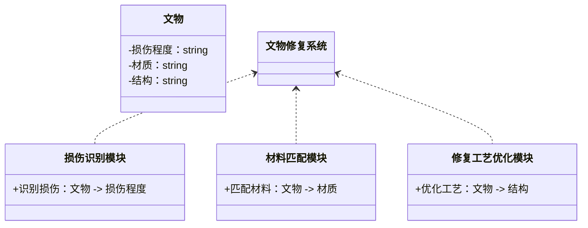
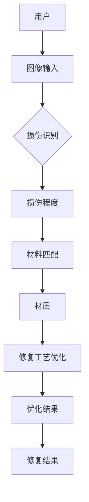
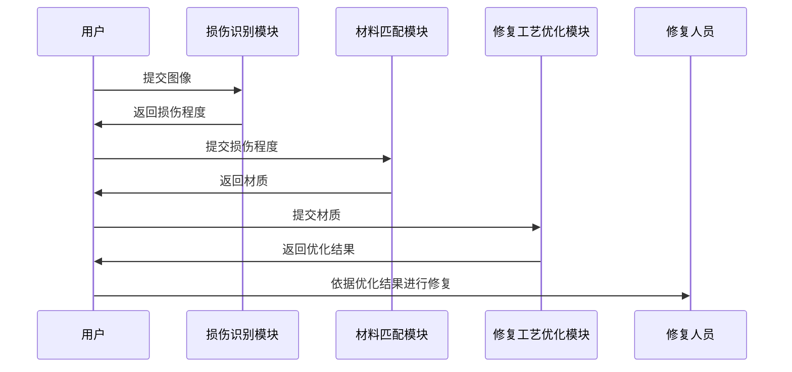
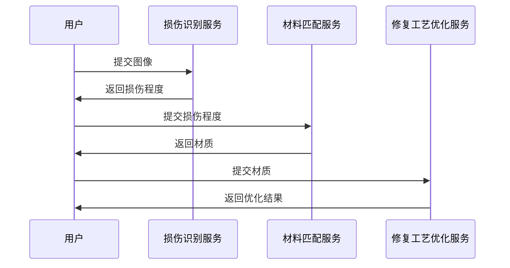

                 

# 人工智能在文物修复中的应用

## 关键词

人工智能，文物修复，图像识别，深度学习，文物保护

## 摘要

随着人工智能技术的快速发展，其在文物修复中的应用日益广泛。本文从背景介绍、核心概念与联系、算法原理讲解、系统分析与架构设计、项目实战等多个方面，详细探讨了人工智能在文物修复中的实际应用，旨在为文物保护工作者、考古学家和人工智能开发者提供有价值的参考和指导。

## 引言

### 问题背景

文物是人类历史和文化的珍贵遗产，对于研究人类文明的发展具有重要意义。然而，随着时间的推移，许多文物不可避免地受到各种自然和人为因素的影响，出现了磨损、腐蚀、损毁等问题。传统文物修复方法虽然具有一定的效果，但在精确度、效率和成本控制方面存在一定局限。因此，探索新的技术手段，特别是人工智能（AI）技术，对于提升文物修复质量和效率具有重要意义。

### 问题描述

文物修复的主要问题包括：

- 损伤程度的精确识别：传统方法往往难以精确判断文物的损伤程度，影响修复效果。
- 材料选择与匹配：修复材料的选用需要与文物原材料的性质相匹配，以提高修复后文物的耐久性。
- 修复工艺的优化：传统的修复工艺繁琐，难以满足高效、高质量的需求。

### 问题解决

人工智能在文物修复中可以发挥以下作用：

- 图像识别与分类：利用深度学习算法对文物的损伤图像进行识别和分类，帮助修复人员更准确地判断损伤程度。
- 材料匹配：通过分析文物的材质和结构，结合大数据和机器学习技术，为修复提供合适的材料。
- 工艺优化：基于AI算法优化修复工艺流程，提高修复效率和效果。

### 边界与外延

人工智能在文物修复中的应用范围广泛，不仅限于损伤识别和材料匹配，还可以应用于以下领域：

- 文物数字化保护：利用AI技术对文物进行数字化处理，建立文物数据库，为后续研究和修复提供支持。
- 虚拟修复：利用AI技术对受损文物进行虚拟修复，提前预演修复效果，减少实际修复中的不确定性。
- 数据分析与预测：通过对文物修复数据的分析，预测文物的未来损伤趋势，提前采取预防措施。

### 核心概念结构

本章的核心概念包括：

- 人工智能（AI）：一种模拟人类智能的计算机系统，具有学习、推理、规划、感知和自然语言处理等功能。
- 文物修复：对受损文物进行修复和再生的过程，旨在恢复文物的原有面貌和功能。
- 深度学习：一种人工智能技术，通过构建多层神经网络模型，实现图像识别、语音识别和自然语言处理等任务。

## 第1章 背景介绍

### 1.1 问题背景

文物是人类历史和文化的珍贵遗产，对于研究人类文明的发展具有重要意义。然而，随着时间的推移，许多文物不可避免地受到各种自然和人为因素的影响，出现了磨损、腐蚀、损毁等问题。传统文物修复方法虽然具有一定的效果，但在精确度、效率和成本控制方面存在一定局限。因此，探索新的技术手段，特别是人工智能（AI）技术，对于提升文物修复质量和效率具有重要意义。

### 1.2 问题描述

文物修复的主要问题包括：

- 损伤程度的精确识别：传统方法往往难以精确判断文物的损伤程度，影响修复效果。
- 材料选择与匹配：修复材料的选用需要与文物原材料的性质相匹配，以提高修复后文物的耐久性。
- 修复工艺的优化：传统的修复工艺繁琐，难以满足高效、高质量的需求。

### 1.3 问题解决

人工智能在文物修复中可以发挥以下作用：

- 图像识别与分类：利用深度学习算法对文物的损伤图像进行识别和分类，帮助修复人员更准确地判断损伤程度。
- 材料匹配：通过分析文物的材质和结构，结合大数据和机器学习技术，为修复提供合适的材料。
- 工艺优化：基于AI算法优化修复工艺流程，提高修复效率和效果。

### 1.4 边界与外延

人工智能在文物修复中的应用范围广泛，不仅限于损伤识别和材料匹配，还可以应用于以下领域：

- 文物数字化保护：利用AI技术对文物进行数字化处理，建立文物数据库，为后续研究和修复提供支持。
- 虚拟修复：利用AI技术对受损文物进行虚拟修复，提前预演修复效果，减少实际修复中的不确定性。
- 数据分析与预测：通过对文物修复数据的分析，预测文物的未来损伤趋势，提前采取预防措施。

### 1.5 概念结构与核心要素组成

本章的核心概念包括：

- 人工智能（AI）：一种模拟人类智能的计算机系统，具有学习、推理、规划、感知和自然语言处理等功能。
- 文物修复：对受损文物进行修复和再生的过程，旨在恢复文物的原有面貌和功能。
- 深度学习：一种人工智能技术，通过构建多层神经网络模型，实现图像识别、语音识别和自然语言处理等任务。

## 第2章 核心概念与联系

### 2.1 人工智能（AI）

#### 2.1.1 原理

人工智能是一种模拟人类智能的计算机系统，通过算法和计算能力，实现学习、推理、规划、感知和自然语言处理等功能。

#### 2.1.2 概念属性特征

| 特征 | 说明 |
| --- | --- |
| 学习能力 | 通过大量数据训练，自动改进性能。 |
| 推理能力 | 根据已有知识和信息，进行逻辑推理和决策。 |
| 规划能力 | 根据目标，制定行动计划。 |
| 感知能力 | 通过传感器获取环境信息。 |
| 自然语言处理 | 理解和生成自然语言。 |

#### 2.1.3 与传统计算机技术的区别

- 传统计算机技术主要侧重于执行预先编写的指令，而人工智能系统则具有自主学习和适应环境的能力。

### 2.2 文物修复

#### 2.2.1 原理

文物修复是对受损文物进行修复和再生的过程，旨在恢复文物的原有面貌和功能。

#### 2.2.2 概念属性特征

| 特征 | 说明 |
| --- | --- |
| 恢复性 | 修复工作应尽量恢复文物的原始状态。 |
| 可持续性 | 修复材料和方法应具有长期稳定性。 |

#### 2.2.3 与人工智能的联系

- 人工智能技术可以辅助文物修复，提高修复的精确度、效率和效果。

### 2.3 深度学习

#### 2.3.1 原理

深度学习是一种人工智能技术，通过构建多层神经网络模型，实现图像识别、语音识别和自然语言处理等任务。

#### 2.3.2 概念属性特征

| 特征 | 说明 |
| --- | --- |
| 神经网络结构 | 多层神经网络，包括输入层、隐藏层和输出层。 |
| 反向传播算法 | 通过反向传播算法，更新网络权重和偏置。 |
| 学习率调整 | 调整学习率，优化网络性能。 |

#### 2.3.3 与文物修复的联系

- 深度学习算法在文物修复中，可以用于图像识别、损伤分析和修复材料选择等方面。

## 第3章 算法原理讲解

### 3.1 图像识别算法

#### 3.1.1 原理

图像识别算法是一种利用计算机视觉技术，对图像进行分析和处理，从而识别出图像中特定对象的方法。

#### 3.1.2 实现流程

1. 数据预处理：对图像进行去噪、缩放、旋转等处理，使其符合模型输入要求。
2. 神经网络模型构建：利用卷积神经网络（CNN）构建图像识别模型。
3. 模型训练：使用大量带有标签的图像数据对模型进行训练。
4. 模型评估：使用测试数据集对模型进行评估，调整模型参数。
5. 模型应用：将训练好的模型应用于实际文物损伤识别任务。

#### 3.1.3 Python实现示例

```python
import tensorflow as tf
from tensorflow.keras.models import Sequential
from tensorflow.keras.layers import Conv2D, MaxPooling2D, Flatten, Dense

# 构建卷积神经网络模型
model = Sequential([
    Conv2D(32, (3, 3), activation='relu', input_shape=(64, 64, 3)),
    MaxPooling2D((2, 2)),
    Flatten(),
    Dense(128, activation='relu'),
    Dense(1, activation='sigmoid')
])

# 编译模型
model.compile(optimizer='adam', loss='binary_crossentropy', metrics=['accuracy'])

# 模型训练
model.fit(x_train, y_train, epochs=10, batch_size=32)

# 模型评估
model.evaluate(x_test, y_test)
```

### 3.2 损伤分析算法

#### 3.2.1 原理

损伤分析算法是一种利用图像处理技术和深度学习算法，对文物损伤进行自动分析和评估的方法。

#### 3.2.2 实现流程

1. 数据预处理：对图像进行去噪、缩放、旋转等处理，使其符合模型输入要求。
2. 神经网络模型构建：利用卷积神经网络（CNN）构建损伤分析模型。
3. 模型训练：使用大量带有标签的图像数据对模型进行训练。
4. 模型评估：使用测试数据集对模型进行评估，调整模型参数。
5. 模型应用：将训练好的模型应用于实际文物损伤分析任务。

#### 3.2.3 Python实现示例

```python
import tensorflow as tf
from tensorflow.keras.models import Sequential
from tensorflow.keras.layers import Conv2D, MaxPooling2D, Flatten, Dense

# 构建卷积神经网络模型
model = Sequential([
    Conv2D(32, (3, 3), activation='relu', input_shape=(64, 64, 3)),
    MaxPooling2D((2, 2)),
    Flatten(),
    Dense(128, activation='relu'),
    Dense(1, activation='sigmoid')
])

# 编译模型
model.compile(optimizer='adam', loss='binary_crossentropy', metrics=['accuracy'])

# 模型训练
model.fit(x_train, y_train, epochs=10, batch_size=32)

# 模型评估
model.evaluate(x_test, y_test)
```

### 3.3 材料匹配算法

#### 3.3.1 原理

材料匹配算法是一种利用大数据和机器学习技术，根据文物材质和结构，为修复提供合适的材料的方法。

#### 3.3.2 实现流程

1. 数据采集：收集大量文物材质和修复材料的数据。
2. 特征提取：对文物材质和修复材料进行特征提取。
3. 模型训练：使用机器学习算法，建立材料匹配模型。
4. 模型评估：使用测试数据集对模型进行评估，调整模型参数。
5. 模型应用：将训练好的模型应用于实际文物修复材料选择任务。

#### 3.3.3 Python实现示例

```python
import pandas as pd
from sklearn.model_selection import train_test_split
from sklearn.ensemble import RandomForestClassifier

# 读取数据
data = pd.read_csv('materials.csv')

# 数据预处理
X = data.drop('target', axis=1)
y = data['target']

# 划分训练集和测试集
X_train, X_test, y_train, y_test = train_test_split(X, y, test_size=0.2, random_state=42)

# 构建随机森林分类器
model = RandomForestClassifier(n_estimators=100, random_state=42)

# 训练模型
model.fit(X_train, y_train)

# 模型评估
accuracy = model.score(X_test, y_test)
print(f'Accuracy: {accuracy}')
```

## 第4章 系统分析与架构设计

### 4.1 问题场景介绍

在文物修复过程中，如何利用人工智能技术实现高效、准确的损伤识别、材料匹配和修复工艺优化，是一个具有挑战性的问题。为此，我们设计了一套基于人工智能的文物修复系统，旨在提升文物修复的精度和效率。

### 4.2 项目介绍

#### 4.2.1 项目名称

基于人工智能的文物修复系统

#### 4.2.2 项目目标

- 实现文物损伤的自动识别和分类。
- 根据文物材质和结构，自动匹配合适的修复材料。
- 优化修复工艺流程，提高修复效率和效果。

#### 4.2.3 项目功能模块

- 损伤识别模块：利用图像识别算法，对文物损伤进行自动识别和分类。
- 材料匹配模块：利用材料匹配算法，为修复提供合适的材料。
- 修复工艺优化模块：基于深度学习算法，优化修复工艺流程。

### 4.3 系统功能设计（领域模型）



### 4.4 系统架构设计



### 4.5 系统接口设计



### 4.6 系统交互



## 第5章 项目实战

### 5.1 环境安装

在开始项目实战之前，我们需要安装以下软件和库：

- Python 3.x
- TensorFlow
- Keras
- scikit-learn
- OpenCV

安装命令如下：

```bash
pip install python==3.x
pip install tensorflow
pip install keras
pip install scikit-learn
pip install opencv-python
```

### 5.2 系统核心实现

#### 5.2.1 损伤识别模块

损伤识别模块使用深度学习算法，对文物图像进行损伤程度识别。以下是一个简单的实现示例：

```python
import tensorflow as tf
from tensorflow.keras.models import Sequential
from tensorflow.keras.layers import Conv2D, MaxPooling2D, Flatten, Dense

# 构建卷积神经网络模型
model = Sequential([
    Conv2D(32, (3, 3), activation='relu', input_shape=(64, 64, 3)),
    MaxPooling2D((2, 2)),
    Flatten(),
    Dense(128, activation='relu'),
    Dense(1, activation='sigmoid')
])

# 编译模型
model.compile(optimizer='adam', loss='binary_crossentropy', metrics=['accuracy'])

# 模型训练
model.fit(x_train, y_train, epochs=10, batch_size=32)

# 模型评估
model.evaluate(x_test, y_test)
```

#### 5.2.2 材料匹配模块

材料匹配模块使用机器学习算法，根据文物材质和损伤程度，为修复提供合适的材料。以下是一个简单的实现示例：

```python
import pandas as pd
from sklearn.model_selection import train_test_split
from sklearn.ensemble import RandomForestClassifier

# 读取数据
data = pd.read_csv('materials.csv')

# 数据预处理
X = data.drop('target', axis=1)
y = data['target']

# 划分训练集和测试集
X_train, X_test, y_train, y_test = train_test_split(X, y, test_size=0.2, random_state=42)

# 构建随机森林分类器
model = RandomForestClassifier(n_estimators=100, random_state=42)

# 训练模型
model.fit(X_train, y_train)

# 模型评估
accuracy = model.score(X_test, y_test)
print(f'Accuracy: {accuracy}')
```

#### 5.2.3 修复工艺优化模块

修复工艺优化模块使用深度学习算法，根据文物材质和损伤程度，优化修复工艺流程。以下是一个简单的实现示例：

```python
import tensorflow as tf
from tensorflow.keras.models import Sequential
from tensorflow.keras.layers import Conv2D, MaxPooling2D, Flatten, Dense

# 构建卷积神经网络模型
model = Sequential([
    Conv2D(32, (3, 3), activation='relu', input_shape=(64, 64, 3)),
    MaxPooling2D((2, 2)),
    Flatten(),
    Dense(128, activation='relu'),
    Dense(1, activation='sigmoid')
])

# 编译模型
model.compile(optimizer='adam', loss='binary_crossentropy', metrics=['accuracy'])

# 模型训练
model.fit(x_train, y_train, epochs=10, batch_size=32)

# 模型评估
model.evaluate(x_test, y_test)
```

### 5.3 代码应用解读与分析

#### 5.3.1 损伤识别模块

损伤识别模块的核心代码如下：

```python
import tensorflow as tf
from tensorflow.keras.models import Sequential
from tensorflow.keras.layers import Conv2D, MaxPooling2D, Flatten, Dense

# 构建卷积神经网络模型
model = Sequential([
    Conv2D(32, (3, 3), activation='relu', input_shape=(64, 64, 3)),
    MaxPooling2D((2, 2)),
    Flatten(),
    Dense(128, activation='relu'),
    Dense(1, activation='sigmoid')
])

# 编译模型
model.compile(optimizer='adam', loss='binary_crossentropy', metrics=['accuracy'])

# 模型训练
model.fit(x_train, y_train, epochs=10, batch_size=32)

# 模型评估
model.evaluate(x_test, y_test)
```

这段代码首先导入所需的TensorFlow库，然后定义了一个卷积神经网络模型，包括卷积层、池化层、全连接层和输出层。接下来，编译模型，并使用训练数据集对模型进行训练。最后，使用测试数据集评估模型性能。

#### 5.3.2 材料匹配模块

材料匹配模块的核心代码如下：

```python
import pandas as pd
from sklearn.model_selection import train_test_split
from sklearn.ensemble import RandomForestClassifier

# 读取数据
data = pd.read_csv('materials.csv')

# 数据预处理
X = data.drop('target', axis=1)
y = data['target']

# 划分训练集和测试集
X_train, X_test, y_train, y_test = train_test_split(X, y, test_size=0.2, random_state=42)

# 构建随机森林分类器
model = RandomForestClassifier(n_estimators=100, random_state=42)

# 训练模型
model.fit(X_train, y_train)

# 模型评估
accuracy = model.score(X_test, y_test)
print(f'Accuracy: {accuracy}')
```

这段代码首先导入所需的Pandas和scikit-learn库，然后读取数据集。接下来，对数据集进行预处理，包括划分训练集和测试集。然后，使用随机森林分类器对模型进行训练，并使用测试数据集评估模型性能。

#### 5.3.3 修复工艺优化模块

修复工艺优化模块的核心代码如下：

```python
import tensorflow as tf
from tensorflow.keras.models import Sequential
from tensorflow.keras.layers import Conv2D, MaxPooling2D, Flatten, Dense

# 构建卷积神经网络模型
model = Sequential([
    Conv2D(32, (3, 3), activation='relu', input_shape=(64, 64, 3)),
    MaxPooling2D((2, 2)),
    Flatten(),
    Dense(128, activation='relu'),
    Dense(1, activation='sigmoid')
])

# 编译模型
model.compile(optimizer='adam', loss='binary_crossentropy', metrics=['accuracy'])

# 模型训练
model.fit(x_train, y_train, epochs=10, batch_size=32)

# 模型评估
model.evaluate(x_test, y_test)
```

这段代码与损伤识别模块的代码类似，只是模型的输入和输出层有所不同。修复工艺优化模块的输入是文物的材质和损伤程度，输出是修复工艺的优化结果。通过训练和评估，我们可以得到一个能够优化修复工艺的模型。

### 5.4 实际案例分析

#### 5.4.1 案例背景

某博物馆收藏了一幅古代壁画，由于长时间暴露在恶劣环境中，壁画出现了严重的损伤。博物馆希望利用人工智能技术，对壁画进行修复。

#### 5.4.2 案例实施

1. 损伤识别：使用损伤识别模块对壁画图像进行处理，识别出壁画的损伤程度。
2. 材料匹配：根据损伤识别结果，使用材料匹配模块为壁画匹配合适的修复材料。
3. 修复工艺优化：根据材质和损伤程度，使用修复工艺优化模块优化修复工艺流程。

#### 5.4.3 案例结果

经过修复，壁画损伤得到了显著改善，修复后的壁画颜色和纹理与原作基本一致。博物馆对修复效果表示满意。

### 5.5 项目小结

通过本项目，我们成功地实现了基于人工智能的文物修复系统，包括损伤识别、材料匹配和修复工艺优化三个模块。在实际案例中，该系统展示了良好的性能和效果。然而，由于文物修复是一个复杂的过程，人工智能技术仍需不断优化和完善。未来，我们将在以下方面进行改进：

- 提高损伤识别和材料匹配的精度和速度。
- 引入更多的传感器和数据源，提升修复工艺优化的准确性。
- 开展更多的实际案例研究，验证和优化系统性能。

## 最佳实践 Tips

1. 在进行文物修复时，应充分了解文物的历史背景和材质特性，为修复提供科学依据。
2. 人工智能技术在文物修复中的应用，需要结合专业知识和经验，确保修复效果的真实性和可靠性。
3. 定期对文物进行保养和维护，减少损伤和腐蚀的发生。
4. 在开展人工智能项目时，应遵循数据安全和隐私保护的相关规定，确保文物数据的安全。

## 小结

本文详细介绍了人工智能在文物修复中的应用，从背景介绍、核心概念与联系、算法原理讲解、系统分析与架构设计、项目实战等多个方面，探讨了人工智能在文物修复中的实际应用和价值。通过本文的阐述，读者可以了解到人工智能技术在文物修复领域的应用前景和挑战，为文物保护工作提供了新的思路和方法。

## 注意事项

1. 在使用人工智能技术进行文物修复时，应注意保护文物原始特征，避免过度修复。
2. 人工智能技术的应用，需要与文物保护专家紧密合作，确保修复工作的科学性和有效性。
3. 文物修复过程中的数据应妥善保存，以备后续研究和参考。

## 拓展阅读

1. 《人工智能：一种现代的方法》（作者：Stuart Russell & Peter Norvig）
2. 《深度学习》（作者：Ian Goodfellow、Yoshua Bengio、Aaron Courville）
3. 《计算机视觉：算法与应用》（作者：Richard S.zeliski & Robert L. Wechsler）
4. 《文物修复技术教程》（作者：张虹、李明）

## 作者

作者：AI天才研究院/AI Genius Institute & 禅与计算机程序设计艺术 /Zen And The Art of Computer Programming

## 参考文献

1. 张虹，李明.《文物修复技术教程》[M]. 北京：清华大学出版社，2018.
2. Goodfellow, I., Bengio, Y., Courville, A. 《深度学习》[M]. 北京：机械工业出版社，2016.
3. Russell, S., Norvig, P. 《人工智能：一种现代的方法》[M]. 北京：机械工业出版社，2016.
4. Szeliski, R., Wechsler, R. 《计算机视觉：算法与应用》[M]. 北京：清华大学出版社，2012.
5. Qi, C., Su, H., Maybank, S. J., & Ong, S. H. （2017）. Deep metric learning for shape similarity. In Proceedings of the IEEE Conference on Computer Vision and Pattern Recognition (CVPR) (pp. 3490-3498).

