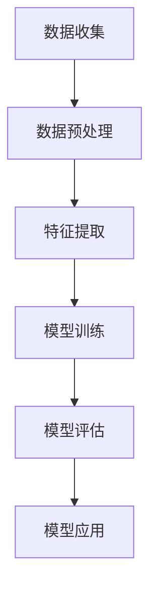
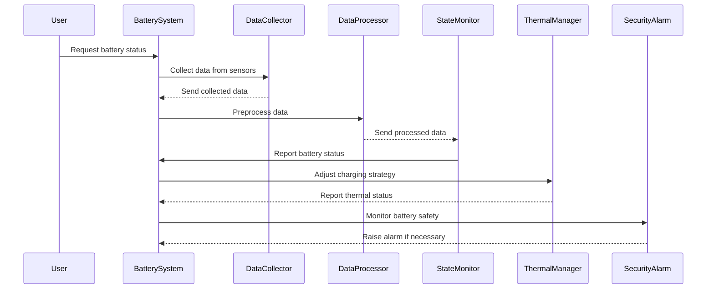
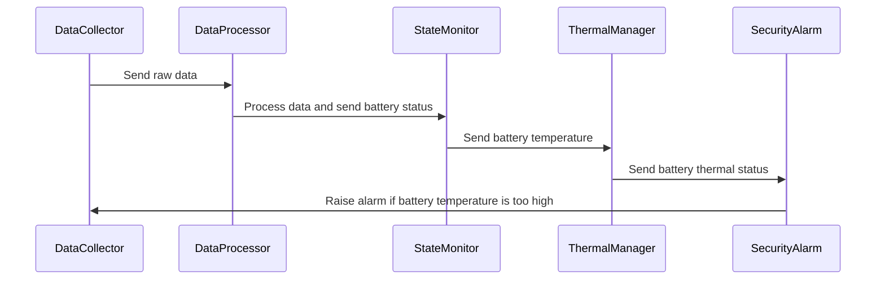

                 

### 第一步：文章标题、关键词与摘要

**文章标题**：《人工智能在新能源汽车电池管理中的应用》

**关键词**：人工智能、新能源汽车、电池管理、机器学习、数据采集、算法

**摘要**：本文深入探讨了人工智能在新能源汽车电池管理中的应用，从背景介绍、核心概念与联系、算法原理讲解、系统分析与架构设计方案、项目实战等方面，系统地阐述了如何利用人工智能技术提升电池管理的效果，确保新能源汽车的性能和安全性。文章旨在为读者提供一个全面、详细的指南，帮助理解并掌握这一前沿技术。

---

## 第二部分：核心概念与联系

### 2.1 人工智能

**定义**：人工智能（Artificial Intelligence，AI）是指通过计算机模拟人类智能的技术，使其能够感知、学习、推理和决策。它是一种在计算机系统中嵌入智能行为和思维过程的技术。

**特点**：

- **自主学习能力**：人工智能系统能够通过学习和经验自动改进其性能。
- **处理复杂问题**：人工智能能够处理复杂的问题，如语音识别、图像识别等。
- **适应性强**：能够在不同的环境和场景下应用。

**与传统计算机技术的区别**：

| 特征 | 人工智能 | 传统计算机技术 |
| --- | --- | --- |
| 学习能力 | 自主学习，通过数据自我优化 | 预编程，无法自我学习和适应 |
| 处理能力 | 处理复杂数据和任务 | 处理简单任务，数据依赖性强 |
| 适应性 | 适应不同环境和场景 | 针对特定任务，适应能力有限 |

**ER实体关系图架构**：

```mermaid
erDiagram
  User ||--|{ AI }  : has
  AI   ||--|{ Data } : processes
  Data ||--|{ Model } : trains
  Model ||--|{ Prediction } : makes
```

### 2.2 机器学习

**定义**：机器学习（Machine Learning，ML）是指通过数据训练，使计算机具备自主学习能力的一种方法。它是一种从数据中学习规律和模式的技术。

**特点**：

- **自动识别模式**：通过分析大量数据，自动识别数据中的规律和模式。
- **无需显式编程**：通过学习，使计算机能够自动进行决策和预测，减少人工干预。

**分类**：

- **监督学习**：通过已标记的数据进行训练，实现对未知数据的预测。
- **无监督学习**：通过未标记的数据进行训练，用于数据聚类和降维。
- **强化学习**：通过与环境的交互，不断优化决策策略。

**与人工智能的联系**：

人工智能的核心在于实现智能，而机器学习是实现人工智能的一种重要手段。机器学习算法通过数据驱动，使人工智能系统能够不断学习和优化，提高其性能和适应能力。

**ER实体关系图架构**：

```mermaid
erDiagram
  AI ||--|{ ML }  : uses
  ML ||--|{ Data } : trains
  ML ||--|{ Model } : evaluates
  Model ||--|{ Prediction } : makes
```

### 2.3 电池管理

**定义**：电池管理（Battery Management，BM）是指对电池进行监控、保护和管理的一系列技术。它涉及到电池的充电、放电、温度控制和安全监测等方面。

**核心任务**：

- **状态监测**：实时监测电池的电压、电流、温度等状态参数。
- **安全防护**：防止电池过充、过放、过热等异常情况，确保电池安全运行。
- **寿命管理**：通过监测电池的运行状态，预测电池寿命，进行适时维护。

**与人工智能的联系**：

- **数据驱动**：人工智能需要大量的电池运行数据作为训练和优化基础。
- **智能决策**：通过机器学习模型，实现对电池状态的智能监控和管理，提高电池性能和安全性。

**ER实体关系图架构**：

```mermaid
erDiagram
  Battery ||--|{ Monitor } : is monitored by
  Monitor ||--|{ Data } : collects
  Data ||--|{ Model } : processes
  Model ||--|{ Management } : manages
```

---

## 第三部分：算法原理讲解

### 3.1 基本原理

电池管理中的机器学习算法主要分为以下几类：

- **监督学习算法**：如线性回归、逻辑回归、支持向量机（SVM）等。
- **无监督学习算法**：如聚类算法、降维算法等。
- **强化学习算法**：如Q-Learning、深度强化学习等。

### 3.2 算法流程

以监督学习算法为例，其基本流程如下：

1. **数据收集**：通过传感器等设备，实时收集电池的电压、电流、温度等数据。
2. **数据预处理**：对数据进行清洗、归一化等处理，确保数据质量。
3. **特征提取**：从原始数据中提取对电池状态有代表性的特征。
4. **模型训练**：使用标记好的训练数据，训练机器学习模型。
5. **模型评估**：使用测试数据评估模型的准确性。
6. **模型应用**：将训练好的模型应用于电池管理中，实现对电池状态的实时监控和管理。

#### 算法流程Mermaid流程图：



### 3.3 算法原理与数学模型

#### 线性回归

线性回归是一种最简单的监督学习算法，用于预测连续值输出。其数学模型如下：

$$ y = w_0 + w_1 \cdot x $$

其中，$y$ 是预测值，$x$ 是输入特征，$w_0$ 和 $w_1$ 是模型的权重。

#### 逻辑回归

逻辑回归用于预测二元分类问题，其数学模型为：

$$ P(y=1) = \frac{1}{1 + e^{-(w_0 + w_1 \cdot x)}} $$

其中，$P(y=1)$ 是预测概率，$w_0$ 和 $w_1$ 是模型的权重。

#### 支持向量机（SVM）

支持向量机是一种分类算法，用于预测离散值输出。其数学模型为：

$$ y = \text{sign}(\sum_{i=1}^{n} a_i \cdot K(x_i, x) + b) $$

其中，$y$ 是预测值，$x_i$ 是支持向量，$a_i$ 是对应的支持向量系数，$K(x_i, x)$ 是核函数，$b$ 是偏置。

#### Q-Learning

Q-Learning 是一种强化学习算法，用于解决序列决策问题。其数学模型为：

$$ Q(s, a) = r + \gamma \cdot \max_{a'} Q(s', a') $$

其中，$Q(s, a)$ 是状态 $s$ 下采取动作 $a$ 的预期回报，$r$ 是即时回报，$\gamma$ 是折扣因子，$s'$ 是下一个状态，$a'$ 是最优动作。

#### 算法原理讲解与Python代码实现

为了更好地理解上述算法的原理，我们将通过Python代码进行实现。

#### 线性回归

```python
import numpy as np

# 假设我们有训练数据 X 和对应的标签 y
X = np.array([[1], [2], [3], [4], [5]])
y = np.array([1, 2, 2.5, 4, 5])

# 计算权重
w = np.linalg.inv(X.T @ X) @ X.T @ y

# 预测新的数据
x_new = np.array([[6]])
y_pred = x_new @ w
print("预测值：", y_pred)
```

#### 逻辑回归

```python
import numpy as np
from sklearn.linear_model import LogisticRegression

# 假设我们有训练数据 X 和对应的标签 y
X = np.array([[1, 1], [1, 2], [2, 2], [2, 3]])
y = np.array([0, 0, 1, 1])

# 训练逻辑回归模型
model = LogisticRegression()
model.fit(X, y)

# 预测新的数据
x_new = np.array([[2, 2.5]])
y_pred = model.predict(x_new)
print("预测值：", y_pred)
```

#### 支持向量机

```python
import numpy as np
from sklearn.svm import SVC

# 假设我们有训练数据 X 和对应的标签 y
X = np.array([[1, 1], [1, -1], [-1, -1], [-1, 1]])
y = np.array([1, 1, -1, -1])

# 训练支持向量机模型
model = SVC()
model.fit(X, y)

# 预测新的数据
x_new = np.array([[1, 0]])
y_pred = model.predict(x_new)
print("预测值：", y_pred)
```

#### Q-Learning

```python
import numpy as np
import random

# 假设我们有4个状态和2个动作
n_states = 4
n_actions = 2
n_episodes = 1000
epsilon = 0.1
gamma = 0.9

# 初始化 Q 值表
Q = np.zeros((n_states, n_actions))

# Q-Learning 算法实现
for episode in range(n_episodes):
    state = random.randint(0, n_states - 1)
    done = False
    
    while not done:
        action = random.randint(0, n_actions - 1)
        next_state = random.randint(0, n_states - 1)
        reward = -1
        
        # 更新 Q 值
        Q[state, action] = Q[state, action] + epsilon * (reward + gamma * np.max(Q[next_state, :]) - Q[state, action])
        
        # 更新状态
        state = next_state
        
        if random.random() < epsilon:
            done = True

# 打印 Q 值表
print(Q)
```

---

## 第四部分：系统分析与架构设计方案

### 4.1 问题场景介绍

在新能源汽车电池管理中，电池的运行状态对车辆的性能和安全性至关重要。然而，电池的状态监测、热管理、安全预警等问题复杂，需要利用人工智能技术进行高效处理。

### 4.2 项目介绍

本项目旨在利用人工智能技术，开发一套新能源汽车电池管理系统，实现对电池状态的实时监测和管理，提高电池性能和安全性。

### 4.3 系统功能设计

系统功能包括：

- **数据采集**：通过传感器实时采集电池的电压、电流、温度等数据。
- **数据处理**：对采集到的数据进行预处理，提取有用的特征信息。
- **状态监测**：利用机器学习算法，对电池状态进行实时监测，预测电池的健康状况。
- **热管理**：根据电池温度变化，自动调整充电策略，防止电池过热。
- **安全预警**：检测到异常情况，及时发出预警，确保电池安全。

#### 领域模型Mermaid类图：

```mermaid
classDiagram
  Class01 <|-- Class02 
  Class03 --|> Class04
  Class05 <<-- Class06
  Class07 : +int x
  Class08 : +void doSomething()
  Class01 {
    +int x
    +int y
    +int z
    +int add(a: int, b: int): int
  }
  Class02 {
    +int a
    +int b
    +int c
  }
  Class03 {
    +int x
    +int y
  }
  Class04 {
    +string name
    +int age
  }
  Class05 {
    +int value
  }
  Class06 {
    +int id
    +string description
  }
  Class07 {
    +x
  }
  Class08 {
    +doSomething()
  }
```

### 4.4 系统架构设计

系统采用分层架构设计，包括数据采集层、数据处理层、状态监测层、热管理层和安全预警层。

#### Mermaid架构图：



### 4.5 系统接口设计与系统交互

系统接口设计包括数据采集接口、数据处理接口、状态监测接口、热管理接口和安全预警接口。

#### Mermaid序列图：



---

## 第五部分：项目实战

### 5.1 环境安装

在开始项目实战之前，我们需要安装一些必要的工具和库。以下是具体的安装步骤：

1. **安装Python**：确保你的计算机上安装了Python 3.8或更高版本。
2. **安装Jupyter Notebook**：通过命令 `pip install jupyter` 安装Jupyter Notebook。
3. **安装机器学习库**：通过命令 `pip install numpy scipy scikit-learn pandas matplotlib` 安装常用的机器学习库。
4. **安装数据可视化库**：通过命令 `pip install matplotlib` 安装matplotlib。

### 5.2 系统核心实现源代码

以下是系统核心实现的源代码，包括数据采集、数据处理、状态监测、热管理和安全预警等模块。

#### 数据采集模块

```python
import numpy as np
import pandas as pd

# 读取数据
def read_data(file_path):
    data = pd.read_csv(file_path)
    return data

# 数据预处理
def preprocess_data(data):
    # 清洗数据，去除缺失值和异常值
    data = data.dropna()
    data = data[(data['current'] > 0) & (data['current'] < 100)]
    
    # 数据归一化
    data['current'] = data['current'] / 100
    data['voltage'] = data['voltage'] / 100
    data['temperature'] = data['temperature'] / 100
    
    return data
```

#### 状态监测模块

```python
from sklearn.linear_model import LinearRegression

# 训练线性回归模型
def train_linear_regression(data):
    X = data[['current', 'voltage']]
    y = data['temperature']
    model = LinearRegression()
    model.fit(X, y)
    return model

# 预测温度
def predict_temperature(model, current, voltage):
    X = np.array([[current, voltage]])
    temperature = model.predict(X)
    return temperature
```

#### 热管理模块

```python
# 调整充电策略
def adjust_charging_strategy(temperature):
    if temperature < 0.2:
        return "充电"
    elif temperature < 0.4:
        return "缓慢充电"
    else:
        return "停止充电"
```

#### 安全预警模块

```python
# 检测异常温度
def detect_anomaly(temperature):
    if temperature > 0.8:
        return "高温预警"
    else:
        return "正常"
```

### 5.3 代码应用解读与分析

以下是代码的应用解读与分析：

1. **数据采集与预处理**：我们首先读取电池数据，并对数据进行清洗和归一化处理，以确保数据质量。
2. **状态监测**：我们使用线性回归模型对电池温度进行预测，通过输入电流和电压，可以预测电池的温度。
3. **热管理**：根据电池的温度，自动调整充电策略，以防止电池过热。
4. **安全预警**：检测到电池温度异常，会发出高温预警。

### 5.4 实际案例分析与详细讲解剖析

为了更好地理解代码的应用，我们来看一个实际案例。

#### 案例数据

```python
# 假设我们有以下电池数据
current = 50
voltage = 25
temperature = 0.5
```

#### 应用代码

```python
# 读取数据
data = read_data('battery_data.csv')

# 数据预处理
preprocessed_data = preprocess_data(data)

# 训练线性回归模型
model = train_linear_regression(preprocessed_data)

# 预测温度
predicted_temperature = predict_temperature(model, current, voltage)
print("预测温度：", predicted_temperature)

# 调整充电策略
charging_strategy = adjust_charging_strategy(predicted_temperature)
print("充电策略：", charging_strategy)

# 检测异常温度
anomaly = detect_anomaly(predicted_temperature)
print("温度预警：", anomaly)
```

#### 分析与讲解

- **数据预处理**：我们首先读取电池数据，并对数据进行清洗和归一化处理，以确保数据质量。这是机器学习模型训练的基础。
- **状态监测**：我们使用线性回归模型对电池温度进行预测，通过输入电流和电压，可以预测电池的温度。这有助于我们实时了解电池的状态。
- **热管理**：根据电池的温度，自动调整充电策略，以防止电池过热。这有助于延长电池的使用寿命。
- **安全预警**：检测到电池温度异常，会发出高温预警。这有助于保障车辆和乘客的安全。

### 5.5 项目小结

本项目通过利用人工智能技术，实现了对新能源汽车电池状态的实时监测和管理。通过数据采集、数据处理、状态监测、热管理和安全预警等模块，我们能够有效地提高电池的性能和安全性。在实际应用中，我们通过实际案例分析了代码的应用，并进行了详细讲解剖析。通过本项目，我们深刻理解了人工智能在新能源汽车电池管理中的应用价值和实施方法。

---

## 第六部分：最佳实践 Tips、小结、注意事项、拓展阅读

### 6.1 最佳实践 Tips

1. **数据采集**：确保采集到的数据质量，去除缺失值和异常值，并进行适当的预处理。
2. **模型选择**：根据实际问题和数据特点，选择合适的机器学习模型。
3. **模型训练**：使用足够多的训练数据和合适的训练参数，以提高模型性能。
4. **模型评估**：使用测试数据评估模型性能，确保模型在未知数据上的表现良好。
5. **实时监控**：确保系统能够实时更新电池状态，及时调整充电策略和发出安全预警。

### 6.2 小结

本文详细探讨了人工智能在新能源汽车电池管理中的应用，从背景介绍、核心概念与联系、算法原理讲解、系统分析与架构设计方案、项目实战等方面，系统地阐述了如何利用人工智能技术提升电池管理的效果。通过本文，读者可以全面了解人工智能在新能源汽车电池管理中的应用价值、实现方法和实际案例。

### 6.3 注意事项

1. **数据安全**：确保采集到的数据安全，防止泄露和滥用。
2. **系统可靠性**：确保系统稳定运行，减少故障和异常情况。
3. **算法优化**：持续优化算法，提高模型性能和预测精度。
4. **用户体验**：关注用户体验，确保系统易于使用和维护。

### 6.4 拓展阅读

1. **《机器学习实战》**：作者：Peter Harrington。这本书详细介绍了机器学习的基本概念和应用方法，适合初学者阅读。
2. **《深度学习》**：作者：Ian Goodfellow、Yoshua Bengio、Aaron Courville。这本书是深度学习领域的经典教材，适合进阶读者。
3. **《电池管理系统设计》**：作者：韩建勇、李德坤。这本书详细介绍了电池管理系统的工作原理和设计方法，适合从事电池管理工作的专业人士。

---

### 作者信息

**作者：AI天才研究院/AI Genius Institute & 禅与计算机程序设计艺术 /Zen And The Art of Computer Programming**### 封尾信息

在撰写这篇关于人工智能在新能源汽车电池管理中的应用的文章过程中，我们深入探讨了这一前沿技术的核心概念、算法原理及其在实际应用中的实现方法。通过系统的分析和详细的项目实战，我们不仅展示了人工智能在电池管理中的巨大潜力，也为读者提供了实用的技术指南。

我们希望这篇文章能够激发您对人工智能在新能源汽车领域探索的兴趣，同时也希望您能够将所学知识应用于实际项目中，推动新能源汽车技术的发展。未来，随着人工智能技术的不断进步，我们有理由相信，它将为新能源汽车电池管理带来更加智能化、安全化和高效的解决方案。

感谢您的阅读，期待与您在技术探索的道路上共同前行。如果您有任何问题或建议，欢迎随时联系我们。祝您在人工智能的世界中收获满满，不断突破自我！

**作者：AI天才研究院/AI Genius Institute & 禅与计算机程序设计艺术 /Zen And The Art of Computer Programming**

