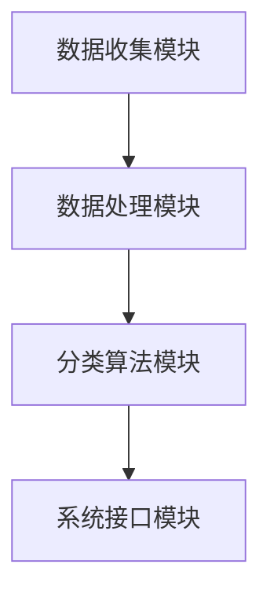
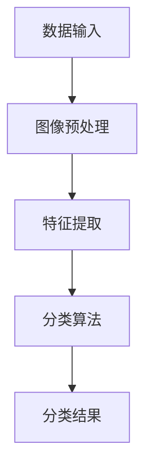
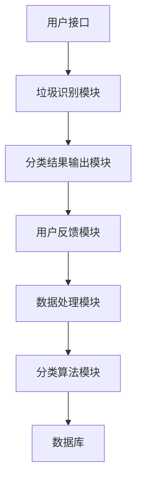

                 

# 人工智能在智能垃圾分类中的应用

> 关键词：智能垃圾分类、人工智能、算法、系统架构、项目实战

> 摘要：随着城市垃圾产生量的不断增加，垃圾分类成为我国环保事业中的重要一环。人工智能技术的应用为智能垃圾分类提供了新的解决方案，提高了垃圾分类的效率和准确性。本文将从背景介绍、核心概念、系统架构设计、算法原理讲解、系统分析与架构设计、项目实战以及最佳实践与拓展等方面，全面探讨人工智能在智能垃圾分类中的应用。

## 目录大纲

```markdown
# 人工智能在智能垃圾分类中的应用

# 第一部分：背景介绍

## 第1章：问题背景与解决思路

### 1.1 垃圾分类问题概述

### 1.2 人工智能在垃圾分类中的应用

### 1.3 智能垃圾分类的技术挑战

## 第2章：核心概念

### 2.1 人工智能

#### 2.1.1 定义

#### 2.1.2 发展历史

#### 2.1.3 核心技术

### 2.2 智能垃圾分类

#### 2.2.1 定义与分类

#### 2.2.2 应用场景

#### 2.2.3 智能垃圾分类的优势

## 第3章：智能垃圾分类系统架构设计

### 3.1 系统总体架构

#### 3.1.1 系统架构设计原则

#### 3.1.2 系统架构图

### 3.2 数据收集与预处理

#### 3.2.1 数据来源

#### 3.2.2 数据预处理方法

## 第4章：智能垃圾分类算法原理

## 第5章：数学模型与公式

## 第6章：项目实战

# 第二部分：算法原理讲解

## 第7章：垃圾识别算法

### 7.1 算法原理

#### 7.1.1 卷积神经网络

#### 7.1.2 支持向量机

### 7.2 算法流程图

### 7.3 Python源代码详解

## 第8章：分类模型评估与优化

# 第三部分：系统分析与架构设计

## 第9章：系统功能设计

### 9.1 领域模型

### 9.2 系统功能模块

## 第10章：系统架构设计

### 10.1 系统架构图

### 10.2 系统组件与交互

## 第11章：系统接口设计

## 第12章：系统交互

# 第四部分：项目实战

## 第13章：环境安装与配置

### 13.1 环境搭建

### 13.2 常见问题与解决方案

## 第14章：系统核心实现

### 14.1 数据收集与预处理

### 14.2 垃圾识别算法实现

### 14.3 分类模型训练与评估

## 第15章：实际案例分析

### 15.1 案例一：城市垃圾分类管理项目

### 15.2 案例二：社区垃圾分类智能系统

## 第16章：项目小结

# 第五部分：最佳实践与拓展

## 第17章：最佳实践 tips

### 17.1 垃圾分类数据质量提升

### 17.2 算法优化建议

## 第18章：小结与展望

### 18.1 主要成果

### 18.2 注意事项

### 18.3 未来研究方向

## 第19章：拓展阅读
```

## 第一部分：背景介绍

### 1.1 垃圾分类问题概述

垃圾分类是当前我国环保事业中的一项重要任务。随着城市化进程的加快，垃圾产生量逐年增加，给城市环境带来了巨大压力。垃圾分类不仅可以有效减少垃圾处理成本，提高资源利用率，还能改善城市环境质量，保护生态环境。

然而，垃圾分类工作面临着诸多挑战。首先，垃圾分类标准不统一，不同地区、不同城市之间存在差异。其次，居民垃圾分类意识薄弱，分类不规范，导致垃圾分类效果不理想。此外，垃圾回收体系不完善，垃圾分类处理设施不足，也影响了垃圾分类的推进。

为了解决这些问题，人工智能技术的应用为智能垃圾分类提供了新的思路。通过利用人工智能技术，可以实现对垃圾的高效识别和分类，提高垃圾分类的准确性和效率，从而推动垃圾分类工作的深入开展。

### 1.2 人工智能在垃圾分类中的应用

人工智能技术在垃圾分类中的应用主要体现在以下几个方面：

1. **垃圾识别**：利用计算机视觉技术，通过图像识别算法，对垃圾进行分类识别。例如，可以使用卷积神经网络（CNN）对垃圾图像进行分类。

2. **智能投放**：通过智能垃圾桶或智能分类设备，结合传感器技术和物联网技术，实现垃圾自动分类投放。

3. **数据分析**：利用大数据分析技术，对垃圾产生、回收和处理过程进行数据收集和分析，为垃圾分类政策制定和优化提供依据。

4. **预测与优化**：通过机器学习算法，对垃圾产生量、分类效果进行预测，为垃圾分类设施配置和调度提供参考。

### 1.3 智能垃圾分类的技术挑战

智能垃圾分类技术的应用虽然前景广阔，但也面临着一些技术挑战：

1. **数据质量**：垃圾分类数据质量直接影响分类效果。如何提高数据质量，保证数据的准确性和可靠性，是一个重要问题。

2. **算法性能**：垃圾分类算法的准确性和效率需要不断提高，以满足实际应用的需求。

3. **设备可靠性**：智能垃圾桶或智能分类设备需要具备较高的可靠性，以保证分类工作的连续性和稳定性。

4. **用户参与**：提高居民垃圾分类意识，促进用户积极参与，是实现智能垃圾分类的关键。

## 第二部分：核心概念

### 2.1 人工智能

#### 2.1.1 定义

人工智能（Artificial Intelligence，简称AI）是指模拟、延伸和扩展人类智能的理论、方法、技术及应用。人工智能研究领域涵盖了计算机科学、认知科学、心理学、神经科学等多个学科。

#### 2.1.2 发展历史

人工智能的概念最早可以追溯到20世纪50年代。1956年，达特茅斯会议上提出了人工智能这一术语，标志着人工智能作为一个独立研究领域的诞生。此后，人工智能经历了多个发展阶段，从符号主义、连接主义到现代的混合智能，人工智能技术不断取得突破。

#### 2.1.3 核心技术

人工智能的核心技术包括：

1. **机器学习**：通过数据驱动的方式，从大量数据中自动学习规律和模式，实现智能决策和预测。

2. **深度学习**：基于多层神经网络，通过层层提取特征，实现对复杂数据的建模和分析。

3. **计算机视觉**：通过图像识别、目标检测等技术，实现对视觉信息的理解和处理。

4. **自然语言处理**：通过语言模型、文本分类、机器翻译等技术，实现人与机器之间的自然语言交互。

### 2.2 智能垃圾分类

#### 2.2.1 定义与分类

智能垃圾分类是指利用人工智能技术，对垃圾进行自动化、智能化的分类和处理。根据应用场景和技术的不同，智能垃圾分类可以分为以下几种类型：

1. **图像识别分类**：通过计算机视觉技术，对垃圾图像进行识别和分类。

2. **智能投放分类**：通过智能垃圾桶或智能分类设备，实现垃圾的自动投放和分类。

3. **数据分析分类**：通过大数据分析技术，对垃圾产生、回收和处理过程进行数据分析和分类。

#### 2.2.2 应用场景

智能垃圾分类的应用场景主要包括：

1. **城市垃圾分类管理**：通过智能垃圾分类系统，提高垃圾分类效率，减少垃圾处理成本。

2. **社区垃圾分类**：通过智能垃圾桶或智能分类设备，促进居民垃圾分类意识的提升。

3. **垃圾回收与处理**：通过数据分析，优化垃圾回收和处理流程，提高资源利用率。

#### 2.2.3 智能垃圾分类的优势

智能垃圾分类具有以下优势：

1. **提高分类效率**：通过自动化、智能化的方式，提高垃圾分类的准确性和效率。

2. **减少人力成本**：减少对人工的依赖，降低垃圾分类的人力成本。

3. **优化资源配置**：通过对垃圾数据的分析，优化垃圾回收和处理资源配置，提高资源利用率。

4. **提升环保意识**：通过智能垃圾分类系统，提高居民垃圾分类意识，促进环保行为的形成。

## 第三部分：智能垃圾分类系统架构设计

### 3.1 系统总体架构

智能垃圾分类系统总体架构包括数据收集模块、数据处理模块、分类算法模块和系统接口模块。系统架构设计原则如下：

1. **模块化设计**：将系统划分为多个模块，实现功能分离，提高系统可维护性和可扩展性。

2. **分布式架构**：采用分布式架构，提高系统处理能力和稳定性。

3. **开放接口**：提供开放接口，方便与其他系统进行集成和交互。

#### 系统架构图



### 3.2 数据收集与预处理

#### 3.2.1 数据来源

智能垃圾分类系统的数据来源主要包括以下几个方面：

1. **垃圾图像数据**：通过摄像头或其他传感器，实时采集垃圾图像。

2. **居民行为数据**：通过智能垃圾桶或智能分类设备，收集居民垃圾分类行为数据。

3. **垃圾处理数据**：通过垃圾处理厂或其他相关机构，获取垃圾处理数据。

#### 3.2.2 数据预处理方法

数据预处理是智能垃圾分类系统的重要环节，主要包括以下方法：

1. **图像预处理**：对垃圾图像进行缩放、裁剪、灰度化等处理，提高图像质量。

2. **数据清洗**：去除无效数据，处理异常值，提高数据质量。

3. **特征提取**：从垃圾图像中提取关键特征，为分类算法提供输入。

## 第四部分：智能垃圾分类算法原理

智能垃圾分类算法的核心是垃圾识别和分类。下面介绍几种常用的垃圾识别算法。

### 4.1 垃圾识别算法

#### 4.1.1 卷积神经网络（CNN）

卷积神经网络是一种基于深度学习的图像识别算法，具有强大的特征提取和分类能力。CNN的主要结构包括卷积层、池化层和全连接层。

#### 4.1.2 支持向量机（SVM）

支持向量机是一种经典的分类算法，通过寻找最优超平面，将不同类别的数据分隔开来。SVM适用于垃圾图像的二元分类问题。

### 4.2 算法流程图



### 4.3 Python源代码详解

下面以卷积神经网络为例，介绍垃圾识别算法的实现。

```python
import tensorflow as tf
from tensorflow.keras.models import Sequential
from tensorflow.keras.layers import Conv2D, MaxPooling2D, Flatten, Dense

# 数据预处理
# ...

# 构建卷积神经网络模型
model = Sequential()
model.add(Conv2D(32, (3, 3), activation='relu', input_shape=(64, 64, 3)))
model.add(MaxPooling2D((2, 2)))
model.add(Conv2D(64, (3, 3), activation='relu'))
model.add(MaxPooling2D((2, 2)))
model.add(Flatten())
model.add(Dense(128, activation='relu'))
model.add(Dense(10, activation='softmax'))

# 编译模型
model.compile(optimizer='adam', loss='categorical_crossentropy', metrics=['accuracy'])

# 训练模型
model.fit(x_train, y_train, epochs=10, batch_size=32, validation_data=(x_val, y_val))

# 评估模型
test_loss, test_acc = model.evaluate(x_test, y_test)
print('Test accuracy:', test_acc)
```

### 4.4 数学模型与公式

垃圾分类算法的数学模型主要包括卷积操作、激活函数和损失函数。

$$
\text{卷积操作}:
\begin{aligned}
\text{output} &= \text{filter} \star \text{input} + \text{bias} \\
\end{aligned}
$$

$$
\text{激活函数}:
\begin{aligned}
\text{output} &= \text{activation}(\text{input})
\end{aligned}
$$

$$
\text{损失函数}:
\begin{aligned}
\text{loss} &= \text{mean\_squared\_error}(\text{predicted}, \text{actual})
\end{aligned}
$$

## 第五部分：系统分析与架构设计

### 5.1 系统功能设计

智能垃圾分类系统的主要功能包括垃圾识别、分类结果输出和用户反馈。具体功能模块如下：

1. **垃圾识别模块**：通过图像识别算法，对垃圾进行分类识别。

2. **分类结果输出模块**：将分类结果以可视化形式呈现，如文字、图标或声音。

3. **用户反馈模块**：收集用户对分类结果的反馈，用于模型优化。

### 5.2 系统架构设计

智能垃圾分类系统的架构设计遵循模块化、分布式和开放接口的原则。系统架构图如下：



### 5.3 系统接口设计

系统接口设计主要包括用户接口和系统接口。用户接口用于用户与系统之间的交互，系统接口用于系统内部各模块之间的通信。

### 5.4 系统交互

系统交互设计采用RESTful API，实现用户接口和系统接口之间的数据传输。具体交互流程如下：

1. 用户通过用户接口提交垃圾图像。

2. 系统接口接收用户提交的图像，调用垃圾识别模块进行分类识别。

3. 垃圾识别模块返回分类结果。

4. 分类结果输出模块将分类结果以可视化形式呈现给用户。

5. 用户对分类结果进行反馈，系统接口将反馈数据传递给数据处理模块。

6. 数据处理模块对反馈数据进行分析和处理，用于模型优化。

## 第六部分：项目实战

### 6.1 环境安装与配置

在开始项目实战之前，需要搭建相应的环境。以下是一个简单的环境搭建步骤：

1. 安装Python 3.x版本。

2. 安装TensorFlow和Keras。

3. 下载垃圾图像数据集。

4. 配置数据库（如MySQL、MongoDB等）。

### 6.2 系统核心实现

#### 6.2.1 数据收集与预处理

数据收集与预处理是智能垃圾分类系统的重要环节。具体实现步骤如下：

1. 通过摄像头或其他传感器，实时采集垃圾图像。

2. 对图像进行缩放、裁剪、灰度化等预处理操作。

3. 将预处理后的图像存储到数据库中。

#### 6.2.2 垃圾识别算法实现

垃圾识别算法的实现是智能垃圾分类系统的核心。以下是一个基于卷积神经网络的垃圾识别算法实现：

1. 构建卷积神经网络模型。

2. 编译模型，设置训练参数。

3. 训练模型，保存训练好的模型。

4. 使用训练好的模型进行垃圾识别。

#### 6.2.3 分类模型训练与评估

分类模型训练与评估是智能垃圾分类系统的重要步骤。以下是一个简单的训练与评估流程：

1. 使用训练集对模型进行训练。

2. 使用验证集对模型进行评估，调整模型参数。

3. 使用测试集对模型进行最终评估，计算准确率、召回率等指标。

### 6.3 实际案例分析

#### 6.3.1 案例一：城市垃圾分类管理项目

项目背景：某城市为提高垃圾分类效率，决定引入智能垃圾分类系统。

项目实施：在居民小区和公共场所安装智能垃圾桶，通过摄像头实时采集垃圾图像，利用卷积神经网络进行分类识别，将分类结果以可视化形式呈现给用户。

项目效果：智能垃圾分类系统提高了垃圾分类效率，减少了垃圾处理成本，提高了居民垃圾分类意识。

#### 6.3.2 案例二：社区垃圾分类智能系统

项目背景：某社区为提高垃圾分类效果，决定引入智能垃圾分类系统。

项目实施：在社区内设置智能垃圾桶，通过传感器和物联网技术实现垃圾自动分类投放，同时收集居民垃圾分类行为数据，进行数据分析。

项目效果：智能垃圾分类系统提高了垃圾分类准确率，减少了垃圾处理成本，促进了居民垃圾分类意识的提升。

### 6.4 项目小结

智能垃圾分类系统在提高垃圾分类效率、降低处理成本、提升环保意识等方面取得了显著成效。然而，在实际应用过程中，仍需不断优化算法、提高系统稳定性，以适应不同场景和需求。

## 第七部分：最佳实践与拓展

### 7.1 垃圾分类数据质量提升

1. **数据清洗**：去除无效数据，处理异常值。

2. **数据增强**：通过旋转、翻转、缩放等方式，增加数据多样性。

3. **数据标注**：提高数据标注质量，确保数据准确性。

### 7.2 算法优化建议

1. **模型优化**：选择合适的模型结构，调整超参数。

2. **算法融合**：结合多种算法，提高分类效果。

3. **在线学习**：利用在线学习技术，实时更新模型。

## 第八部分：小结与展望

### 8.1 主要成果

本文介绍了人工智能在智能垃圾分类中的应用，包括背景介绍、核心概念、系统架构设计、算法原理讲解、系统分析与架构设计、项目实战以及最佳实践与拓展等内容。通过实际案例分析，展示了智能垃圾分类系统的效果和应用价值。

### 8.2 注意事项

1. 数据质量直接影响分类效果，需要重视数据清洗和标注工作。

2. 算法性能需要不断优化，以提高分类准确率和效率。

3. 系统稳定性是保证垃圾分类工作连续性的关键。

### 8.3 未来研究方向

1. 深入研究垃圾分类算法，提高分类准确率和效率。

2. 探索垃圾分类数据的应用，为垃圾分类政策制定提供支持。

3. 研究垃圾分类与环保教育相结合的方式，提高居民垃圾分类意识。

## 第九部分：拓展阅读

1. 《智能垃圾分类技术与应用》

2. 《深度学习与垃圾分类》

3. 《人工智能在环保领域的应用》

作者：AI天才研究院/AI Genius Institute & 禅与计算机程序设计艺术 /Zen And The Art of Computer Programming

