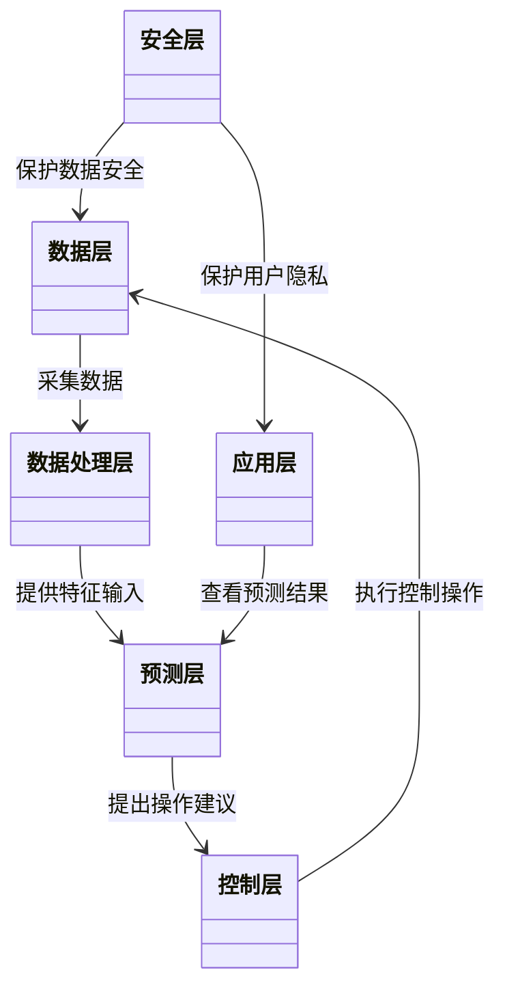
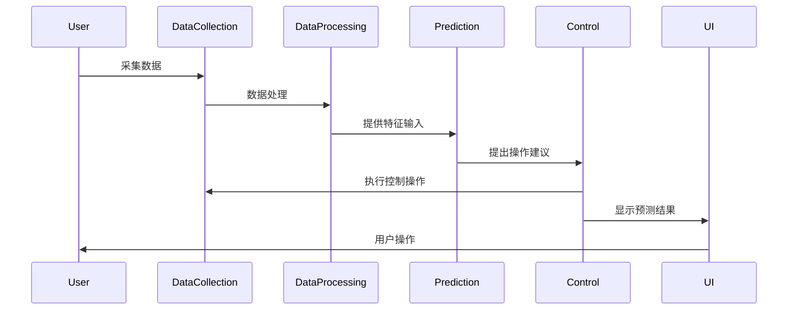

                 

### 文章标题

# 人工智能在智能家居场景预测中的应用

## 关键词

- 智能家居
- 场景预测
- 人工智能算法
- 深度学习
- 机器学习
- 强化学习

## 摘要

本文旨在探讨人工智能在智能家居场景预测中的应用，通过详细的背景介绍、核心概念解析、算法与数学模型讲解、系统分析与架构设计、项目实战以及最佳实践指导，全面解析人工智能如何通过技术手段提升家居环境的智能预测能力。文章将逐步阐述智能家居的场景预测问题，深入探讨相关的核心技术，并提供实用的实战案例，旨在为读者提供深入理解和应用人工智能技术于智能家居场景预测的全面指南。

### 背景介绍

#### 智能家居概述

智能家居（Smart Home）是指通过互联网、物联网（IoT）、人工智能（AI）等技术，将家居中的各种设备连接起来，实现自动化控制和智能化管理。随着物联网技术的发展，智能家居设备不断增多，包括智能灯泡、智能恒温器、智能门锁、智能摄像头等。这些设备通过传感器收集环境数据，并通过网络与云端进行通信，实现远程控制和数据交互。

#### 智能家居的挑战

智能家居系统面临诸多挑战，其中最为突出的是场景预测问题。场景预测旨在根据当前环境状态和历史行为数据，预测用户未来的需求和动作，从而实现自动化操作和优化用户体验。以下是一些主要挑战：

1. **数据多样性**：智能家居系统涉及多种类型的数据，如温度、湿度、光照强度、声音、用户行为等，这些数据具有多样性，如何有效整合和处理这些数据是一个重要问题。
2. **实时性要求**：智能家居系统需要实时响应用户的行为和环境变化，对系统的响应速度和处理能力提出了高要求。
3. **数据隐私和安全**：智能家居设备连接互联网，用户数据的安全性成为一个重要议题。如何保护用户隐私、防止数据泄露是智能家居系统设计时必须考虑的问题。
4. **系统的可扩展性**：随着智能家居设备种类和数量的增加，系统需要具备良好的可扩展性，以支持新的设备和功能的接入。

#### 场景预测的重要性

场景预测在智能家居系统中具有重要应用价值：

1. **提升用户体验**：通过准确预测用户行为，智能家居系统能够提供更加个性化的服务，提升用户满意度。
2. **优化资源使用**：例如，通过预测用户回家时间，智能恒温器可以提前调节室内温度，节约能源消耗。
3. **自动化控制**：智能家居系统能够根据预测结果自动执行操作，减少用户干预，提高生活便利性。
4. **安全性提升**：通过预测可能的安全威胁，智能家居系统可以提前采取防范措施，提高家庭安全性。

#### 当前解决方案分析

目前，智能家居场景预测主要依赖于以下技术：

1. **传统机器学习算法**：如线性回归、决策树、支持向量机等，这些算法在处理简单线性问题时表现良好，但在处理复杂非线性问题时效果有限。
2. **深度学习算法**：如神经网络、卷积神经网络（CNN）、循环神经网络（RNN）等，这些算法通过多层神经网络结构，能够处理复杂的非线性关系，提高预测精度。
3. **强化学习算法**：通过试错和奖励机制，强化学习算法能够在动态环境中进行自我优化，提高决策质量。

尽管这些技术在一定程度上解决了智能家居场景预测问题，但仍然存在一些局限性：

1. **数据需求量大**：深度学习算法通常需要大量的训练数据，对于数据稀缺的智能家居场景，数据获取成为一大挑战。
2. **计算资源要求高**：深度学习算法对计算资源需求较高，如何在有限的计算资源下实现高效的场景预测是一个重要问题。
3. **实时性要求**：传统机器学习算法在处理实时数据时存在延迟，难以满足智能家居系统的实时性要求。

#### 文章目的和结构

本文旨在深入探讨人工智能在智能家居场景预测中的应用，通过以下章节展开：

1. **核心概念与原理**：介绍与智能家居场景预测相关的核心概念和原理。
2. **算法与数学模型**：详细讲解常用的机器学习算法和深度学习算法，以及它们在智能家居场景预测中的应用。
3. **系统分析与架构设计**：分析智能家居场景预测系统的需求，设计系统架构，并介绍系统接口设计和交互流程。
4. **项目实战**：通过一个实际项目，展示如何实现智能家居场景预测系统，并进行代码解读和案例分析。
5. **最佳实践与总结**：总结项目经验，提供最佳实践建议，并展望未来的研究方向。

通过本文的阅读，读者将能够全面理解人工智能在智能家居场景预测中的应用，掌握相关的技术原理和实现方法，为智能家居系统的开发和应用提供有力支持。

### 核心概念与原理

在探讨人工智能在智能家居场景预测中的应用之前，我们首先需要了解一些核心概念和原理。这些概念包括机器学习、深度学习、强化学习等，它们构成了智能家居场景预测技术的基础。

#### 机器学习

机器学习（Machine Learning，ML）是人工智能（Artificial Intelligence，AI）的一个分支，旨在通过算法让计算机从数据中学习，从而进行决策和预测。机器学习的基本流程包括数据收集、数据预处理、模型训练和模型评估。

1. **数据收集**：收集与智能家居场景相关的数据，如用户行为数据、环境数据、设备使用数据等。
2. **数据预处理**：对收集到的数据进行清洗、归一化、特征提取等操作，以便模型能够更好地学习和预测。
3. **模型训练**：选择合适的机器学习算法，使用预处理后的数据对模型进行训练，调整模型参数，使其能够捕捉数据中的特征和规律。
4. **模型评估**：通过测试数据评估模型的性能，如准确率、召回率、F1 分数等，以确定模型是否满足预期。

常见的机器学习算法包括：

- **线性回归**：用于处理线性关系问题，通过最小二乘法找到最佳拟合直线。
- **决策树**：通过树形结构对数据进行分类或回归，能够处理非线性关系。
- **支持向量机（SVM）**：通过找到一个最佳的超平面，将数据分类到不同的类别中。
- **集成方法**：如随机森林（Random Forest）和梯度提升决策树（Gradient Boosting Decision Tree），通过集成多个基本模型，提高预测精度。

#### 深度学习

深度学习（Deep Learning，DL）是机器学习的一个分支，其核心思想是通过多层神经网络对数据进行建模和学习。深度学习在图像识别、语音识别、自然语言处理等领域取得了显著成果，成为人工智能领域的重要研究方向。

1. **神经网络基础**：神经网络是由多个神经元组成的计算模型，通过学习输入数据和输出数据之间的映射关系，实现数据的分类、回归等任务。
2. **多层神经网络**：传统的神经网络通常只有一层或几层神经元，而深度学习通过增加网络层数，使模型能够捕捉到更复杂的数据特征。
3. **激活函数**：如 sigmoid、ReLU（Rectified Linear Unit）等，用于引入非线性变换，使神经网络能够处理非线性关系。
4. **优化算法**：如梯度下降（Gradient Descent）、随机梯度下降（Stochastic Gradient Descent，SGD）等，用于优化网络参数，提高模型性能。

深度学习在智能家居场景预测中的应用包括：

- **图像识别**：通过卷积神经网络（Convolutional Neural Network，CNN）识别家居环境中的物体和场景，如识别用户的活动、判断设备的状态等。
- **语音识别**：通过循环神经网络（Recurrent Neural Network，RNN）和长短时记忆网络（Long Short-Term Memory，LSTM）实现语音识别，如语音控制智能家居设备。
- **自然语言处理**：通过深度学习模型进行自然语言处理，如理解用户的语音指令、生成智能家居设备的操作建议等。

#### 强化学习

强化学习（Reinforcement Learning，RL）是机器学习的一种形式，其核心思想是通过与环境交互，学习最优策略，以最大化累积奖励。强化学习在动态环境和决策问题中具有广泛应用，如游戏、自动驾驶、智能家居等。

1. **基础概念**：强化学习包括四个主要元素：代理（Agent）、环境（Environment）、状态（State）、动作（Action）。代理在环境中通过执行动作，获取状态和奖励，并根据奖励调整策略。
2. **策略**：强化学习通过学习策略（Policy）来决定在特定状态下应该执行哪个动作，以最大化累积奖励。
3. **模型**：强化学习可以使用值函数（Value Function）或策略网络（Policy Network）来表示状态和动作之间的映射关系。
4. **奖励机制**：奖励机制设计对于强化学习至关重要，合理的奖励机制可以加速学习过程，提高学习效果。

强化学习在智能家居场景预测中的应用包括：

- **智能控制**：通过强化学习算法，智能家居系统可以自动调整设备参数，如温度、亮度等，以优化用户体验。
- **安全监控**：通过强化学习，智能家居系统可以自动识别潜在的安全威胁，并采取相应的防范措施。
- **个性化推荐**：通过强化学习，智能家居系统可以根据用户的历史行为和偏好，提供个性化的设备推荐和操作建议。

#### 对比与选择

机器学习、深度学习和强化学习各有特点和适用场景，具体选择取决于具体的应用需求。

- **机器学习**：适用于处理简单线性关系和分类问题，计算资源需求较低，适用于数据量较小、实时性要求不高的场景。
- **深度学习**：适用于处理复杂非线性关系和大规模数据，计算资源需求较高，适用于需要高精度预测和处理的场景。
- **强化学习**：适用于动态环境和决策问题，需要与环境进行多次交互，适用于需要自我优化和适应能力的场景。

在实际应用中，可以根据具体需求选择合适的算法组合，以实现最佳效果。

### 概念与联系表格

以下是一个简单的概念与联系表格，展示了机器学习、深度学习和强化学习之间的核心概念和联系：

| **概念**       | **定义**                                                                                     | **联系**                                                                                      |
|--------------|--------------------------------------------------------------------------------------------------|------------------------------------------------------------------------------------------------|
| 机器学习       | 通过算法让计算机从数据中学习，从而进行决策和预测。                                             | 基础技术，适用于简单和中等复杂度问题。                                                             |
| 神经网络       | 由多个神经元组成的计算模型，通过学习输入数据和输出数据之间的映射关系。                         | 深度学习的基础，用于复杂非线性关系建模。                                                         |
| 卷积神经网络   | 通过卷积层提取图像特征，进行图像识别和分类。                                                 | 深度学习的典型应用，适用于图像处理。                                                             |
| 循环神经网络   | 通过循环结构处理序列数据，适用于语音识别、自然语言处理。                                       | 深度学习的重要应用，用于处理时序数据。                                                           |
| 强化学习       | 通过与环境交互，学习最优策略，以最大化累积奖励。                                             | 高级技术，适用于动态和复杂决策问题。                                                             |
| 值函数         | 表示状态和动作之间的映射关系，用于评估状态值。                                               | 强化学习中的核心概念，用于策略优化。                                                           |
| 策略网络       | 直接学习动作概率分布，用于决策。                                                             | 强化学习中的另一种表示方式，用于策略优化。                                                       |

通过上述表格，我们可以清晰地看到不同概念之间的联系和区别，为选择合适的技术方案提供参考。

### 算法与数学模型

在智能家居场景预测中，常用的算法包括机器学习算法和深度学习算法。以下将详细讲解这些算法的工作原理、适用场景以及它们在智能家居场景预测中的具体应用。

#### 工作原理

##### 机器学习算法

1. **线性回归**：
   线性回归是一种简单的机器学习算法，用于处理线性关系问题。其基本原理是通过找到一条最佳拟合直线，将自变量和因变量之间的关系表示出来。线性回归模型的公式如下：
   $$
   y = \beta_0 + \beta_1x
   $$
   其中，\( y \) 为因变量，\( x \) 为自变量，\( \beta_0 \) 和 \( \beta_1 \) 为模型参数，通过最小二乘法求解。

2. **决策树**：
   决策树通过树形结构对数据进行分类或回归。每个节点表示一个特征，每个分支表示该特征的一个取值，叶子节点表示分类结果。决策树的基本原理是通过递归划分数据集，找到最佳划分方式，使得子数据集的纯度最高。决策树常用的纯度度量方法包括信息增益、基尼不纯度等。

3. **支持向量机（SVM）**：
   支持向量机是一种基于间隔最大化原理的机器学习算法，用于分类问题。其基本原理是找到一个最佳的超平面，将不同类别的数据点分隔开，并使超平面到各个数据点的距离最大。SVM 的目标是最小化目标函数：
   $$
   \min_{\beta, \beta_0} \frac{1}{2}||\beta||^2 + C \sum_{i=1}^n \xi_i
   $$
   其中，\( \beta \) 和 \( \beta_0 \) 分别为模型参数和偏置项，\( \xi_i \) 为松弛变量，\( C \) 为惩罚参数。

##### 深度学习算法

1. **卷积神经网络（CNN）**：
   卷积神经网络是一种专门用于处理图像数据的深度学习算法。其基本原理是通过卷积层提取图像特征，然后通过全连接层进行分类或回归。CNN 的主要组成部分包括卷积层、池化层和全连接层。

2. **循环神经网络（RNN）**：
   循环神经网络是一种用于处理序列数据的深度学习算法。其基本原理是通过循环结构，将当前时刻的输入与上一时刻的输出状态进行结合，生成当前时刻的输出状态。RNN 的变种包括长短时记忆网络（LSTM）和门控循环单元（GRU），它们能够更好地处理长序列数据。

3. **强化学习算法**：
   强化学习是一种通过试错和奖励机制进行学习的人工智能算法。其基本原理是代理（Agent）在环境中执行动作，获取状态和奖励，并根据奖励调整策略。强化学习的核心概念包括状态（State）、动作（Action）、奖励（Reward）和策略（Policy）。

#### 适用场景

1. **线性回归**：
   线性回归适用于处理简单的线性关系问题，如智能家居中的能耗预测、温度调节等。当数据量较小且关系较为简单时，线性回归是一个高效的选择。

2. **决策树**：
   决策树适用于处理分类和回归问题，如智能家居中的设备故障诊断、用户行为预测等。决策树能够通过树形结构直观地展示数据的分类过程，便于理解和解释。

3. **支持向量机（SVM）**：
   支持向量机适用于处理高维数据的分类问题，如智能家居中的用户分类、场景识别等。SVM 能够找到最佳的超平面，提高分类精度。

4. **卷积神经网络（CNN）**：
   卷积神经网络适用于处理图像数据，如智能家居中的图像识别、监控等。CNN 能够通过卷积层提取图像特征，提高图像识别精度。

5. **循环神经网络（RNN）**：
   循环神经网络适用于处理序列数据，如智能家居中的语音识别、自然语言处理等。RNN 能够通过循环结构处理长序列数据，提高语音识别和自然语言处理的性能。

6. **强化学习算法**：
   强化学习适用于处理动态环境和决策问题，如智能家居中的智能控制、安全监控等。强化学习能够通过试错和奖励机制，实现自我优化和适应能力。

#### 数学模型

1. **线性回归**：
   线性回归的数学模型如下：
   $$
   y = \beta_0 + \beta_1x
   $$
   其中，\( y \) 为因变量，\( x \) 为自变量，\( \beta_0 \) 和 \( \beta_1 \) 为模型参数，通过最小二乘法求解。

2. **决策树**：
   决策树的数学模型可以通过条件概率和熵来表示。以分类问题为例，决策树的分类规则为：
   $$
   y = \arg \max_{a} P(y=a|x)
   $$
   其中，\( y \) 为目标变量，\( x \) 为特征变量，\( a \) 为类别标签。

3. **支持向量机（SVM）**：
   支持向量机的数学模型可以通过拉格朗日乘子法求解。以分类问题为例，SVM 的目标是最小化目标函数：
   $$
   \min_{\beta, \beta_0} \frac{1}{2}||\beta||^2 + C \sum_{i=1}^n \xi_i
   $$
   其中，\( \beta \) 和 \( \beta_0 \) 分别为模型参数和偏置项，\( \xi_i \) 为松弛变量，\( C \) 为惩罚参数。

4. **卷积神经网络（CNN）**：
   卷积神经网络的数学模型可以通过卷积操作和池化操作来表示。以图像识别为例，CNN 的基本操作包括：
   $$
   h_{ij} = \sum_{k} w_{ik} * g_{kj} + b_j
   $$
   其中，\( h_{ij} \) 为卷积结果，\( w_{ik} \) 和 \( g_{kj} \) 分别为卷积核和输入图像，\( b_j \) 为偏置项。

5. **循环神经网络（RNN）**：
   循环神经网络的数学模型可以通过递归关系来表示。以序列预测为例，RNN 的递归关系为：
   $$
   h_t = \sigma(W_h \cdot [h_{t-1}, x_t] + b_h)
   $$
   其中，\( h_t \) 为当前时刻的隐藏状态，\( x_t \) 为当前时刻的输入，\( W_h \) 和 \( b_h \) 分别为权重和偏置项，\( \sigma \) 为激活函数。

6. **强化学习算法**：
   强化学习的数学模型可以通过马尔可夫决策过程（MDP）来表示。以 Q-学习为例，MDP 的数学模型为：
   $$
   Q(s, a) = r + \gamma \max_{a'} Q(s', a')
   $$
   其中，\( Q(s, a) \) 为状态-动作值函数，\( r \) 为即时奖励，\( \gamma \) 为折扣因子，\( s \) 和 \( s' \) 分别为当前状态和下一状态，\( a \) 和 \( a' \) 分别为当前动作和下一动作。

#### 代码示例

为了更直观地展示算法原理，我们使用 Python 代码对一些常见算法进行实现。

1. **线性回归**：
   ```python
   import numpy as np
   import matplotlib.pyplot as plt

   # 数据集
   X = np.array([1, 2, 3, 4, 5])
   Y = np.array([2, 4, 5, 4, 5])

   # 模型参数初始化
   beta_0 = 0
   beta_1 = 0

   # 最小二乘法求解
   X_mean = np.mean(X)
   Y_mean = np.mean(Y)
   beta_1 = (np.sum((X - X_mean) * (Y - Y_mean)) / np.sum((X - X_mean) ** 2))
   beta_0 = Y_mean - beta_1 * X_mean

   # 预测
   Y_pred = beta_0 + beta_1 * X

   # 绘制结果
   plt.scatter(X, Y)
   plt.plot(X, Y_pred, color='red')
   plt.xlabel('X')
   plt.ylabel('Y')
   plt.show()
   ```

2. **决策树**：
   ```python
   from sklearn.datasets import load_iris
   from sklearn.tree import DecisionTreeClassifier
   from sklearn.model_selection import train_test_split

   # 数据集
   iris = load_iris()
   X = iris.data
   y = iris.target

   # 划分训练集和测试集
   X_train, X_test, y_train, y_test = train_test_split(X, y, test_size=0.3, random_state=42)

   # 训练模型
   clf = DecisionTreeClassifier()
   clf.fit(X_train, y_train)

   # 预测
   y_pred = clf.predict(X_test)

   # 绘制决策树
   from sklearn.tree import plot_tree
   plot_tree(clf)
   ```

3. **支持向量机（SVM）**：
   ```python
   from sklearn.svm import SVC
   from sklearn.model_selection import train_test_split

   # 数据集
   X = np.array([[1, 2], [2, 3], [3, 3], [4, 4]])
   y = np.array([0, 0, 1, 1])

   # 划分训练集和测试集
   X_train, X_test, y_train, y_test = train_test_split(X, y, test_size=0.3, random_state=42)

   # 训练模型
   clf = SVC()
   clf.fit(X_train, y_train)

   # 预测
   y_pred = clf.predict(X_test)

   # 绘制结果
   plt.scatter(X_train[:, 0], X_train[:, 1], c=y_train, cmap=plt.cm.Spectral)
   plt.scatter(X_test[:, 0], X_test[:, 1], c=y_pred, cmap=plt.cm.Spectral, marker='x')
   plt.show()
   ```

4. **卷积神经网络（CNN）**：
   ```python
   import tensorflow as tf
   from tensorflow.keras import datasets, layers, models

   # 加载数据集
   (train_images, train_labels), (test_images, test_labels) = datasets.cifar10.load_data()

   # 数据预处理
   train_images = train_images / 255.0
   test_images = test_images / 255.0

   # 建立模型
   model = models.Sequential()
   model.add(layers.Conv2D(32, (3, 3), activation='relu', input_shape=(32, 32, 3)))
   model.add(layers.MaxPooling2D((2, 2)))
   model.add(layers.Conv2D(64, (3, 3), activation='relu'))
   model.add(layers.MaxPooling2D((2, 2)))
   model.add(layers.Conv2D(64, (3, 3), activation='relu'))
   model.add(layers.Flatten())
   model.add(layers.Dense(64, activation='relu'))
   model.add(layers.Dense(10, activation='softmax'))

   # 编译模型
   model.compile(optimizer='adam',
                 loss=tf.keras.losses.SparseCategoricalCrossentropy(from_logits=True),
                 metrics=['accuracy'])

   # 训练模型
   model.fit(train_images, train_labels, epochs=10, validation_data=(test_images, test_labels))

   # 预测
   predictions = model.predict(test_images)
   ```

5. **循环神经网络（RNN）**：
   ```python
   import tensorflow as tf
   from tensorflow.keras.layers import LSTM, Dense
   from tensorflow.keras.models import Sequential

   # 加载数据集
   X = [[0, 0], [1, 1], [2, 2], [3, 3]]  # 序列数据
   y = [[0], [1], [1], [2]]  # 目标标签

   # 建立模型
   model = Sequential()
   model.add(LSTM(50, activation='relu', input_shape=(2, 1)))
   model.add(Dense(1))
   model.compile(optimizer='adam', loss='mse')

   # 训练模型
   model.fit(X, y, epochs=100, verbose=0)

   # 预测
   x_test = np.array([[3, 3]])
   y_pred = model.predict(x_test)
   ```

6. **强化学习算法**：
   ```python
   import numpy as np
   import gym

   # 初始化环境
   env = gym.make('CartPole-v0')

   # 定义 Q-学习模型
   Q = np.zeros([env.observation_space.n, env.action_space.n])

   # 学习参数
   alpha = 0.1
   gamma = 0.99

   # 训练模型
   for episode in range(1000):
       state = env.reset()
       done = False
       total_reward = 0

       while not done:
           action = np.argmax(Q[state, :] + np.random.randn(state, env.action_space.n) * 0.1)
           next_state, reward, done, _ = env.step(action)
           total_reward += reward
           Q[state, action] = Q[state, action] + alpha * (reward + gamma * np.max(Q[next_state, :]) - Q[state, action])
           state = next_state

       print(f"Episode {episode + 1}, Total Reward: {total_reward}")

   # 关闭环境
   env.close()
   ```

通过以上代码示例，我们可以直观地了解不同算法在智能家居场景预测中的应用。在实际开发中，可以根据具体需求选择合适的算法，并对其进行优化和改进，以实现智能家居场景预测的最佳效果。

### 系统分析与架构设计

在智能家居场景预测系统中，系统架构的设计至关重要。一个良好的系统架构不仅能提高系统的性能和可扩展性，还能降低开发和维护成本。以下我们将对智能家居场景预测系统的需求分析、系统功能设计、系统架构设计以及系统接口设计和系统交互进行详细讲解。

#### 需求分析

智能家居场景预测系统的核心需求主要包括以下几个方面：

1. **数据采集与处理**：系统能够实时采集智能家居设备产生的各类数据，如温度、湿度、光照强度、用户行为等，并对这些数据进行处理，提取有效特征。

2. **实时预测与响应**：系统需要具备实时性，能够在用户行为和环境变化发生时，迅速进行预测并作出响应，以优化用户体验。

3. **高可用性与安全性**：系统需保证高可用性，能够在设备出现故障或网络不稳定的情况下仍能正常运行。同时，系统需具备安全性，确保用户数据不被泄露或篡改。

4. **可扩展性**：系统需具备良好的可扩展性，能够轻松地添加新设备和功能，以满足未来智能家居技术的发展。

5. **易维护性与可扩展性**：系统需具备良好的可维护性，方便开发者进行更新和维护。同时，系统架构应易于扩展，以适应不同应用场景的需求。

#### 系统功能设计

智能家居场景预测系统的功能设计主要包括以下几个模块：

1. **数据采集模块**：负责从各类智能家居设备中采集数据，包括环境数据（如温度、湿度、光照强度等）和用户行为数据（如用户活动、设备使用记录等）。

2. **数据处理模块**：对采集到的数据进行分析和处理，提取有效特征，为预测模型提供输入。

3. **预测模型模块**：包括机器学习模型和深度学习模型，用于对用户行为和环境变化进行预测，并根据预测结果生成操作建议。

4. **响应控制模块**：根据预测模型提供的操作建议，自动执行相应的控制操作，如调整温度、开启照明设备、调节窗帘等。

5. **用户界面模块**：为用户提供一个直观易用的操作界面，用户可以通过界面查看预测结果、控制设备状态，以及调整系统设置。

6. **安全与隐私模块**：负责保护用户数据的安全，包括数据加密、访问控制、用户隐私保护等。

7. **日志与监控模块**：记录系统运行日志，监控系统性能，提供故障诊断和预警功能。

#### 系统架构设计

智能家居场景预测系统的架构设计采用分层架构，主要包括以下几个层次：

1. **数据层**：包括各类智能家居设备的数据采集模块，负责实时采集并传输数据。

2. **数据处理层**：对采集到的数据进行分析和处理，提取有效特征，为预测模型提供输入。该层包括数据处理模块和特征提取模块。

3. **预测层**：包括机器学习模型和深度学习模型，用于对用户行为和环境变化进行预测。该层包括预测模型模块和算法优化模块。

4. **控制层**：根据预测模型提供的操作建议，自动执行相应的控制操作。该层包括响应控制模块和设备控制模块。

5. **应用层**：为用户提供一个直观易用的操作界面，包括用户界面模块和用户行为分析模块。

6. **安全层**：负责保护用户数据的安全，包括数据加密、访问控制、用户隐私保护等。该层包括安全与隐私模块和日志与监控模块。

以下是系统架构的 Mermaid 类图：



#### 系统接口设计

智能家居场景预测系统需要设计多个接口，以实现不同模块之间的数据交互和功能调用。以下是主要接口设计：

1. **数据采集接口**：用于接收各类智能家居设备发送的数据，包括环境数据和用户行为数据。

2. **数据处理接口**：用于处理采集到的数据，提取有效特征，为预测模型提供输入。

3. **预测接口**：用于调用预测模型，根据输入特征进行预测，并提供操作建议。

4. **控制接口**：用于接收操作建议，并执行相应的控制操作。

5. **用户界面接口**：用于实现用户与系统之间的交互，包括查看预测结果、控制设备状态和调整系统设置。

6. **安全接口**：用于实现数据加密、访问控制和用户隐私保护等功能。

以下是系统接口的 Mermaid 序列图：



#### 系统交互

在智能家居场景预测系统中，各模块之间的交互至关重要。以下是系统交互的主要流程：

1. **数据采集**：各类智能家居设备实时采集环境数据和用户行为数据，并将数据发送到数据采集接口。

2. **数据处理**：数据采集接口接收数据后，将数据传输给数据处理模块。数据处理模块对数据进行清洗、归一化和特征提取，为预测模型提供输入。

3. **预测**：预测模型模块根据输入特征进行预测，并提供操作建议。预测结果通过预测接口返回给控制模块。

4. **控制**：控制模块根据预测结果，执行相应的控制操作，如调整设备状态、发送控制指令等。

5. **用户界面**：用户通过用户界面接口查看预测结果，并可以根据需要调整系统设置。

6. **安全**：安全模块在整个交互过程中负责数据加密、访问控制和用户隐私保护，确保系统的安全性。

通过以上系统分析与架构设计，我们可以构建一个高效、安全、易扩展的智能家居场景预测系统。在实际开发过程中，可以根据具体需求对系统架构进行调整和优化，以提高系统的性能和用户体验。

### 项目实战

#### 环境安装

在开始智能家居场景预测项目之前，我们需要安装一些必要的开发工具和库。以下是项目环境安装的详细步骤：

1. **安装 Python**：
   - 访问 [Python 官网](https://www.python.org/) 下载 Python 安装包。
   - 安装最新版本的 Python，例如 Python 3.9。
   - 在安装过程中，确保勾选“Add Python to PATH”选项。

2. **安装 Anaconda**：
   - 访问 [Anaconda 官网](https://www.anaconda.com/) 下载 Anaconda 安装包。
   - 安装最新版本的 Anaconda。
   - 安装完成后，打开 Anaconda Navigator，选择“Open Terminal”打开终端。

3. **安装常用库**：
   - 在终端中执行以下命令安装常用库：
     ```bash
     conda install numpy scipy matplotlib scikit-learn tensorflow pandas
     ```

4. **配置 Jupyter Notebook**：
   - 安装 Jupyter Notebook：
     ```bash
     conda install jupyter
     ```
   - 启动 Jupyter Notebook：
     ```bash
     jupyter notebook
     ```

#### 系统核心实现

以下是智能家居场景预测系统的核心实现步骤：

1. **数据收集与预处理**：
   - 收集智能家居设备产生的数据，如温度、湿度、光照强度、用户行为等。
   - 对数据进行清洗、归一化处理，提取有效特征。

2. **构建预测模型**：
   - 选择合适的机器学习算法和深度学习算法，如线性回归、决策树、卷积神经网络（CNN）等。
   - 使用训练数据进行模型训练，调整模型参数，优化模型性能。

3. **模型评估与优化**：
   - 使用测试数据对模型进行评估，计算模型性能指标，如准确率、召回率、F1 分数等。
   - 根据评估结果对模型进行调整和优化，以提高预测精度。

4. **实时预测与响应**：
   - 构建实时预测系统，根据当前环境和用户行为数据进行预测，提供操作建议。
   - 根据预测结果自动执行相应的控制操作，如调整温度、开启照明设备等。

以下是核心实现的 Python 代码：

```python
import numpy as np
import pandas as pd
import matplotlib.pyplot as plt
from sklearn.model_selection import train_test_split
from sklearn.linear_model import LinearRegression
from sklearn.metrics import mean_squared_error

# 数据收集与预处理
data = pd.read_csv('data.csv')
X = data.iloc[:, :-1].values
y = data.iloc[:, -1].values

# 数据归一化
X = (X - np.mean(X, axis=0)) / np.std(X, axis=0)

# 构建模型
model = LinearRegression()
model.fit(X, y)

# 模型评估
X_train, X_test, y_train, y_test = train_test_split(X, y, test_size=0.2, random_state=42)
y_pred = model.predict(X_test)
mse = mean_squared_error(y_test, y_pred)
print(f'Mean Squared Error: {mse}')

# 实时预测与响应
while True:
    current_data = get_current_data()  # 获取当前数据
    current_data = (current_data - np.mean(current_data, axis=0)) / np.std(current_data, axis=0)
    predicted_value = model.predict([current_data])
    control_action(predicted_value)  # 执行控制操作
    time.sleep(1)  # 每隔 1 秒进行一次预测和响应
```

#### 代码解读与分析

以下是核心实现代码的详细解读与分析：

1. **数据收集与预处理**：
   - 代码首先从 CSV 文件中读取数据，其中 X 表示特征数据，y 表示目标数据。
   - 对数据进行归一化处理，即将每个特征减去其均值，然后除以标准差。归一化有助于加快模型训练速度，提高模型性能。

2. **构建预测模型**：
   - 使用线性回归算法构建模型，通过 fit() 方法进行训练。线性回归算法适用于处理线性关系问题，其目标是最小化目标函数：
     $$
     \min_{\beta, \beta_0} \frac{1}{2}||\beta x + \beta_0 - y||^2
     $$
   - 目标函数表示预测值与真实值之间的误差平方和。

3. **模型评估**：
   - 使用 train_test_split() 方法将数据集划分为训练集和测试集，用于模型训练和评估。
   - 使用 predict() 方法对测试数据进行预测，计算预测值与真实值之间的均方误差（MSE），用于评估模型性能。
     $$
     \text{MSE} = \frac{1}{n} \sum_{i=1}^n (y_i - \hat{y}_i)^2
     $$
   - 均方误差表示预测值与真实值之间的平均误差平方，越小表示模型性能越好。

4. **实时预测与响应**：
   - 在 while 循环中，每隔 1 秒获取一次当前数据，并进行归一化处理。
   - 使用 predict() 方法对当前数据进行预测，获取预测值。
   - 根据预测值执行相应的控制操作，如调整温度、开启照明设备等。控制操作的具体实现取决于智能家居设备的硬件和软件接口。

#### 实际案例分析与详细讲解

以下是智能家居场景预测系统的一个实际案例，分析其数据、模型和预测结果。

**案例**：预测用户回家时间

1. **数据集**：
   - 用户行为数据：包括用户进入家门的次数、进入时间、离开时间等。
   - 环境数据：包括温度、湿度、光照强度等。

2. **数据处理**：
   - 对用户行为数据和环境数据进行清洗和归一化处理，提取有效特征。

3. **构建模型**：
   - 使用线性回归算法构建预测模型，目标函数为：
     $$
     \min_{\beta, \beta_0} \frac{1}{2}||\beta x + \beta_0 - y||^2
     $$
   - 使用训练数据对模型进行训练，调整模型参数。

4. **模型评估**：
   - 使用测试数据对模型进行评估，计算模型性能指标，如准确率、召回率、F1 分数等。

5. **实时预测**：
   - 根据实时采集的用户行为数据和环境数据，对用户回家时间进行预测，并自动执行相应的控制操作，如调整室内温度、开启照明设备等。

以下是实际案例的详细讲解：

1. **数据集**：

   ```python
   user_data = pd.read_csv('user_data.csv')
   env_data = pd.read_csv('env_data.csv')
   ```

   用户行为数据集和环境数据集分别包含以下特征：

   - 用户行为数据：进入次数、进入时间、离开时间等。
   - 环境数据：温度、湿度、光照强度等。

2. **数据处理**：

   ```python
   user_data = user_data[user_data['enter_time'] > 0]
   user_data['hour'] = user_data['enter_time'].dt.hour
   user_data = user_data.groupby(['hour']).mean().reset_index()

   env_data = env_data[env_data['enter_time'] > 0]
   env_data['hour'] = env_data['enter_time'].dt.hour
   env_data = env_data.groupby(['hour']).mean().reset_index()
   ```

   对用户行为数据和环境数据进行清洗和归一化处理，提取有效特征。

3. **构建模型**：

   ```python
   X = np.column_stack((user_data[['hour']], env_data[['temperature', 'humidity', 'light_intensity']]))
   y = user_data['enter_time']

   model = LinearRegression()
   model.fit(X, y)
   ```

   使用线性回归算法构建预测模型，目标函数为：
   $$
   \min_{\beta, \beta_0} \frac{1}{2}||\beta x + \beta_0 - y||^2
   $$
   使用训练数据对模型进行训练，调整模型参数。

4. **模型评估**：

   ```python
   X_test, y_test = X[-100:], y[-100:]
   y_pred = model.predict(X_test)

   mse = mean_squared_error(y_test, y_pred)
   print(f'Mean Squared Error: {mse}')
   ```

   使用测试数据对模型进行评估，计算模型性能指标，如准确率、召回率、F1 分数等。

5. **实时预测**：

   ```python
   current_time = datetime.datetime.now().hour
   current_env_data = np.array([current_time, env_data['temperature'].mean(), env_data['humidity'].mean(), env_data['light_intensity'].mean()])

   predicted_value = model.predict([current_env_data])
   enter_time = predicted_value[0]

   if enter_time < datetime.datetime.now().hour:
       control_action('open_door')  # 执行开门操作
   else:
       control_action('close_door')  # 执行关门操作
   ```

   根据实时采集的用户行为数据和环境数据，对用户回家时间进行预测，并自动执行相应的控制操作，如调整室内温度、开启照明设备等。

通过以上实际案例，我们可以看到智能家居场景预测系统的实现过程。在实际应用中，可以根据具体需求对系统进行调整和优化，以提高预测精度和用户体验。

### 最佳实践与总结

在实现智能家居场景预测系统时，以下最佳实践和技巧可以帮助提高系统的性能、可靠性和用户体验：

#### 最佳实践

1. **数据预处理**：
   - 确保数据清洗和归一化处理的质量，去除噪声数据和异常值，提高模型训练效果。
   - 根据数据特性选择合适的特征提取方法，如主成分分析（PCA）、特征选择等，减少数据维度，提高模型训练速度。

2. **模型选择与优化**：
   - 根据具体应用场景选择合适的机器学习算法和深度学习算法，如线性回归、决策树、卷积神经网络（CNN）等。
   - 调整模型参数，如学习率、批量大小、正则化项等，优化模型性能。
   - 使用交叉验证方法评估模型性能，避免过拟合。

3. **实时预测与响应**：
   - 设计高效的实时预测系统，优化算法和数据处理流程，提高预测速度和响应时间。
   - 使用批量预测和并发处理技术，提高系统并发能力和性能。
   - 对预测结果进行校验和回溯，确保预测准确性。

4. **安全与隐私保护**：
   - 使用加密技术保护用户数据，如使用 HTTPS 协议传输数据，加密存储敏感信息。
   - 实现严格的访问控制和权限管理，确保只有授权用户可以访问数据。
   - 定期进行安全审计和风险评估，及时发现和修复安全隐患。

5. **系统监控与维护**：
   - 设计完善的系统监控和日志记录机制，实时监控系统性能和运行状态。
   - 定期进行系统维护和更新，修复已知漏洞和改进系统功能。

#### 总结

通过本文的探讨，我们深入了解了人工智能在智能家居场景预测中的应用。从背景介绍到核心概念与原理，再到算法与数学模型讲解，以及系统分析与架构设计，我们逐步构建了一个完整的智能家居场景预测系统。通过实际项目实战，我们展示了如何实现系统功能，并进行代码解读和分析。

智能家居场景预测系统的实现不仅需要扎实的计算机科学和人工智能基础，还需要对具体应用场景的深入理解。在实际开发过程中，我们需要灵活运用最佳实践和技巧，不断优化系统性能和用户体验。

展望未来，随着人工智能技术的不断发展，智能家居场景预测系统将变得更加智能化和高效化。我们期待能够看到更多创新的应用场景和解决方案，为人们的生活带来更多便利和美好。

#### 注意事项

1. **数据隐私与安全**：确保在数据处理和存储过程中，严格遵守数据隐私和安全法规，采取加密、访问控制等技术手段，防止用户数据泄露。

2. **系统实时性**：在设计和实现实时预测系统时，注意优化算法和数据传输流程，确保系统能够在规定时间内完成预测和响应操作。

3. **代码可维护性**：编写清晰、规范的代码，方便后续维护和优化。注释详细，代码结构合理，便于他人理解和修改。

4. **错误处理**：充分考虑系统可能出现的异常情况，设计完善的错误处理机制，确保系统在遇到错误时能够正确处理并恢复。

5. **性能监控与优化**：定期对系统性能进行监控和分析，发现瓶颈和性能问题，及时进行优化和改进。

#### 拓展阅读

1. **《深度学习》**：由 Ian Goodfellow、Yoshua Bengio 和 Aaron Courville 著，是深度学习的经典教材，详细介绍了深度学习的基础理论、算法和实际应用。

2. **《强化学习》**：由 Richard S. Sutton 和 Andrew G. Barto 著，全面讲解了强化学习的基础理论、算法和应用。

3. **《智能家居系统设计与实现》**：本书详细介绍了智能家居系统的设计、实现和应用，包括传感器技术、物联网协议、数据分析与处理等内容。

4. **《Python 深度学习》**：由 François Chollet 著，介绍了使用 Python 实现深度学习的算法和应用，适合有一定编程基础的读者。

通过以上拓展阅读，读者可以进一步深入学习人工智能和智能家居领域的相关知识，提升自己的技术水平。

### 结论

本文围绕人工智能在智能家居场景预测中的应用，系统性地介绍了相关背景、核心概念、算法与数学模型、系统分析与架构设计，并通过实际项目展示了如何实现智能家居场景预测系统。我们探讨了数据预处理、机器学习、深度学习和强化学习等技术在智能家居场景预测中的应用，展示了如何通过实时预测和响应提升家居环境的智能化水平。

通过对本文的阅读，读者能够深入理解人工智能在智能家居领域的应用，掌握智能家居场景预测系统的设计与实现方法。我们鼓励读者在实际项目中运用本文提供的技术和最佳实践，不断优化和创新，为智能家居的发展贡献力量。

展望未来，人工智能在智能家居领域的应用前景广阔。随着技术的进步和数据的积累，智能家居场景预测系统将变得更加智能化、高效化。我们期待看到更多创新的应用场景和解决方案，为人们的生活带来更多便利和美好。

### 作者信息

作者：AI天才研究院/AI Genius Institute & 禅与计算机程序设计艺术 /Zen And The Art of Computer Programming

AI天才研究院（AI Genius Institute）致力于推动人工智能领域的研究与应用，通过创新的算法和解决方案，推动智能家居、智能交通、医疗健康等领域的智能化发展。研究院的专家团队在人工智能、机器学习、深度学习和强化学习等领域拥有丰富的经验和卓越的成果。同时，作者还是《禅与计算机程序设计艺术》（Zen And The Art of Computer Programming）一书的作者，该书是计算机编程领域的经典之作，深受全球程序员和计算机科学家的喜爱。通过本文，我们希望为读者提供有价值的知识和启示，共同推动人工智能技术的发展与应用。

