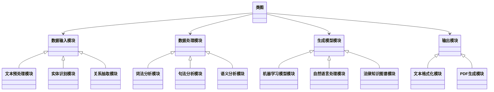
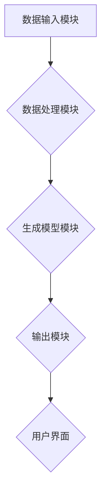
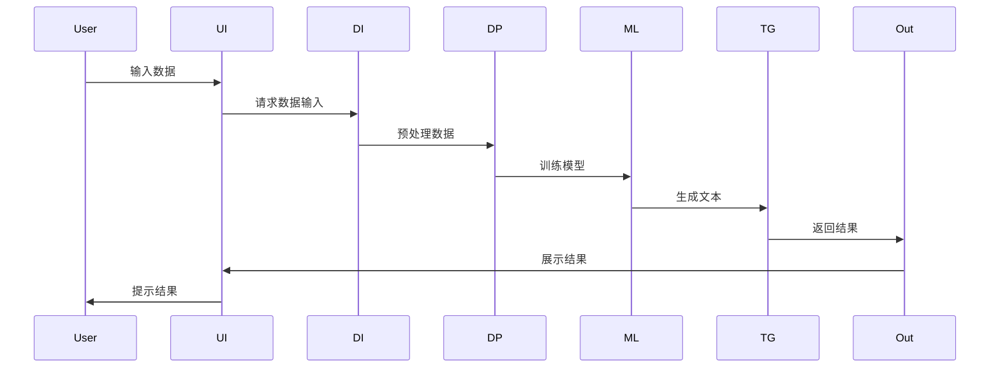

                 

## 引言与背景

人工智能（Artificial Intelligence, AI）作为当今科技领域的前沿课题，正迅速渗透到各个行业，推动着技术革新和产业升级。在法律领域，人工智能的应用同样备受关注。法律文书自动生成作为人工智能在法律领域的应用之一，具有显著的应用潜力和广泛的前景。

### 动机与目的

本文旨在探讨人工智能在法律文书自动生成中的应用，旨在解决法律行业中存在的一系列痛点问题，如法律文书的繁杂性和低效性。通过深入分析人工智能的核心技术和应用场景，本文希望能够为法律行业从业者提供有价值的参考和指导，推动人工智能与法律领域的深度融合。

### 研究意义

法律文书的自动生成不仅能够提高工作效率，减少人为错误，还能降低法律服务的成本，使得法律服务更加普惠。具体而言，本文的研究意义体现在以下几个方面：

1. **提高工作效率**：通过自动化工具生成法律文书，可以大大减少人工撰写的时间，提高整体工作效率。
2. **降低成本**：自动化生成法律文书可以减少对人力资源的依赖，从而降低法律服务的成本。
3. **减少错误**：机器生成的法律文书可以减少人为错误，提高法律文书的准确性和规范性。
4. **普惠法律服务**：通过降低法律服务的成本，使得更多的人能够享受到专业的法律服务。

### 研究方法

本文将采用以下研究方法：

1. **文献综述**：通过对相关文献的综述，了解人工智能在法律文书自动生成领域的现有研究成果和应用情况。
2. **技术分析**：对人工智能的核心技术，如机器学习、自然语言处理等进行分析，探讨其在法律文书自动生成中的应用原理。
3. **案例研究**：通过分析实际案例，探讨人工智能在法律文书自动生成中的应用效果和面临的挑战。
4. **实践探讨**：结合具体项目案例，探讨人工智能在法律文书自动生成中的实际应用，提出最佳实践和建议。

### 研究内容

本文将主要探讨以下内容：

1. **核心概念**：介绍人工智能和法律文书自动生成的基本概念，包括相关术语、定义和原理。
2. **技术原理**：详细分析人工智能在法律文书自动生成中的应用原理，包括算法模型、实现方法和技术细节。
3. **应用案例**：通过实际案例展示人工智能在法律文书自动生成中的应用效果，分析其优势和不足。
4. **系统设计**：探讨法律文书自动生成系统的设计原则、架构和实现方法。
5. **最佳实践**：总结最佳实践，提出在法律文书自动生成中应用人工智能的建议。

通过以上研究内容，本文希望为人工智能在法律文书自动生成中的应用提供全面的指导和参考。

### 法律文书自动生成中的问题与挑战

在法律领域，法律文书自动生成面临着一系列复杂的问题和挑战。首先，法律文书的多样性和复杂性使得生成任务具有高度不确定性。法律文书包括但不限于合同、起诉状、答辩状、判决书、仲裁裁决书等，每种文书的格式和内容都有其独特性，这就要求自动生成系统具有高度的灵活性和适应性。

#### 数据质量和数量问题

生成高质量的法律文书需要大量的高质量数据作为训练集。然而，法律领域的文本数据往往具有以下特点：

1. **数据分散**：法律文书分布在不同的法院、律所和政府机构，数据获取较为困难。
2. **数据格式不一致**：不同来源的法律文书格式可能存在较大差异，如排版、字体、字号等。
3. **数据质量参差不齐**：部分法律文书可能存在错误、遗漏或不规范的情况，这对训练模型的准确性有负面影响。

为了解决数据问题，首先需要构建一个统一的法律文书数据集，这可以通过以下几种方式实现：

1. **数据采集**：通过自动化工具从互联网、数据库和政府公开信息中收集法律文书。
2. **数据清洗**：对收集到的数据进行预处理，包括格式统一、错误修正、缺失值填补等。
3. **数据增强**：通过数据变换、数据扩充等方法提高数据集的多样性和质量。

#### 技术实现问题

在技术实现方面，法律文书自动生成涉及多个关键技术和挑战：

1. **自然语言处理（NLP）**：NLP是实现法律文书自动生成的基础技术。NLP需要解决语义理解、实体识别、句法分析等问题，以确保生成的法律文书语义正确、逻辑清晰。
2. **规则引擎**：法律文书生成往往需要遵循特定的格式和规则，如法律条款的格式、特定词汇的使用等。规则引擎是实现这一目标的关键技术。
3. **机器学习模型**：机器学习模型用于训练生成模型，如序列到序列（Seq2Seq）模型、变压器（Transformer）模型等。模型的选择和调优是技术实现的难点。

为了解决技术实现问题，可以采取以下措施：

1. **集成多种技术**：结合NLP、规则引擎和机器学习等多种技术，构建一个综合的自动生成系统。
2. **模型优化**：通过不断调整和优化模型参数，提高生成模型的准确性和鲁棒性。
3. **人机协作**：在生成过程中引入人工审核和干预，确保生成文书的准确性和合规性。

#### 法律合规性问题

法律文书自动生成还面临法律合规性问题。法律文书具有法律效力，其准确性和合规性至关重要。任何错误都可能导致严重的法律后果。因此，在生成法律文书时，必须确保系统的生成结果符合相关法律法规和行业标准。

1. **法律风险评估**：在系统设计阶段，进行法律风险评估，识别潜在的法律风险点。
2. **法律合规性检查**：在生成法律文书前，进行法律合规性检查，确保文书内容符合法律规定。
3. **法律顾问参与**：引入法律顾问参与系统设计和实现，提供法律合规性指导。

通过以上措施，可以降低法律文书自动生成过程中的合规风险，确保生成的法律文书合法、有效。

综上所述，法律文书自动生成在法律领域具有重要的应用价值，但也面临一系列问题和挑战。通过深入分析这些问题和挑战，并提出相应的解决方案，我们可以为人工智能在法律文书自动生成中的应用提供有力的支持。

### 核心概念介绍

在探讨人工智能在法律文书自动生成中的应用之前，我们需要理解几个核心概念：人工智能（AI）、机器学习（ML）、自然语言处理（NLP）和法律知识图谱（Legal Knowledge Graph）。

#### 人工智能（AI）

人工智能是指通过计算机模拟人类智能行为的科学技术。它涵盖了从数据采集、数据处理到智能决策的整个过程。在法律文书自动生成中，AI可以通过学习大量的法律文书数据，生成符合法律要求和格式规范的新法律文书。

#### 机器学习（ML）

机器学习是人工智能的一个重要分支，它通过训练模型从数据中学习规律，然后对未知数据进行预测或分类。机器学习可以分为监督学习、无监督学习和强化学习等类型。在法律文书自动生成中，常用的机器学习方法包括：

- **监督学习**：使用已标注的数据训练模型，然后使用模型生成新的法律文书。常见的监督学习方法有决策树、支持向量机（SVM）和神经网络等。
- **无监督学习**：不使用标注数据，通过聚类等方法发现数据中的结构或模式。无监督学习方法包括聚类算法、降维算法等。

#### 自然语言处理（NLP）

自然语言处理是人工智能的重要分支，致力于使计算机能够理解、处理和生成人类自然语言。在法律文书自动生成中，NLP技术用于理解法律文书的语义、语法和结构，以确保生成的法律文书语义正确、逻辑清晰。

NLP的关键技术包括：

- **词法分析**：对文本进行分词、词性标注等处理，以理解文本的词法结构。
- **句法分析**：分析句子的结构，理解句子的语法关系。
- **语义分析**：理解文本的语义，包括实体识别、关系抽取、情感分析等。

#### 法律知识图谱（Legal Knowledge Graph）

法律知识图谱是一种基于图的语义表示技术，它将法律领域的知识表示为图结构，以便于计算机理解和处理。法律知识图谱包括法律条款、法律条文、法律关系等实体，以及它们之间的各种关系。在法律文书自动生成中，法律知识图谱用于指导文书的生成过程，确保生成的法律文书符合法律逻辑和规范。

法律知识图谱的关键概念包括：

- **实体**：法律知识图谱中的基本元素，如法律条款、当事人、法律关系等。
- **关系**：实体之间的关系，如包含、继承、适用等。
- **属性**：实体的属性，如法律条款的编号、发布日期等。

通过理解上述核心概念，我们可以更好地把握人工智能在法律文书自动生成中的应用原理和技术实现方法。接下来的章节将深入探讨这些核心概念在法律文书自动生成中的具体应用。

### 当前人工智能在法律文书自动生成中的技术应用

当前，人工智能在法律文书自动生成中已经取得了一定的成果，并呈现出多种技术路径。以下将详细分析几种主要的技术方法和应用场景，以展示其在法律文书自动生成中的实际应用效果。

#### 自然语言处理（NLP）

自然语言处理是法律文书自动生成的基础技术之一。通过NLP技术，系统能够对法律文书中的文本进行语义分析和结构化处理，从而生成新的法律文书。NLP技术在法律文书自动生成中的应用主要包括：

1. **文本分词**：将法律文书中的文本分割成单个词汇或短语，以便后续处理。
2. **词性标注**：为每个词分配正确的词性标签，如名词、动词、形容词等，以理解文本的语法结构。
3. **句法分析**：对句子结构进行分析，识别句子的主要成分和语法关系。
4. **语义角色标注**：识别句子中的实体和它们之间的语义关系，如当事人、法律条款、因果关系等。

例如，使用NLP技术，一个法律文本可以分解为如下结构：

```
当事人：张三、李四
法律条款：合同法第52条
因果关系：张三违反合同约定，导致合同解除。
```

通过这样的结构化处理，系统可以更好地理解法律文书的语义，从而生成符合逻辑和法律规范的新文书。

#### 机器学习（ML）

机器学习技术在法律文书自动生成中主要用于训练生成模型，如序列到序列（Seq2Seq）模型和变压器（Transformer）模型等。这些模型通过学习大量的法律文书数据，能够自动生成新的法律文书。

1. **序列到序列（Seq2Seq）模型**：Seq2Seq模型是一种经典的自然语言生成模型，通过编码器和解码器两个部分，将输入的法律文书编码为一个向量表示，然后解码生成新的法律文书。

   示例代码：
   ```python
   from keras.models import Model
   from keras.layers import LSTM, Embedding, Dense

   # 定义编码器和解码器
   encoder_inputs = Embedding(input_dim=vocab_size, output_dim=embedding_size)
   decoder_inputs = Embedding(input_dim=vocab_size, output_dim=embedding_size)

   # 序列到序列模型
   encoder = LSTM(units=128, return_state=True)
   decoder = LSTM(units=128, return_state=True)

   # 编码器输出
   encoder_output, state_h, state_c = encoder(encoder_inputs)
   encoder_states = [state_h, state_c]

   # 解码器输出
   decoder_output = decoder(decoder_inputs, initial_state=[state_h, state_c])

   # 模型输出
   model = Model(inputs=[encoder_inputs, decoder_inputs], outputs=decoder_output)
   model.compile(optimizer='rmsprop', loss='categorical_crossentropy')
   ```

2. **变压器（Transformer）模型**：Transformer模型是一种基于注意力机制的序列模型，其优点是训练速度更快，能够生成更高质量的文本。

   示例代码：
   ```python
   from transformers import TransformerModel
   from transformers.models import transformer

   # 加载预训练的Transformer模型
   model = TransformerModel.from_pretrained('transformer')

   # 输入文本
   input_ids = tokenizer.encode('生成法律文书')

   # 生成文本
   outputs = model(input_ids)
   generated_text = outputs[0].numpy().decode('utf-8')
   ```

通过机器学习模型，系统能够根据输入的法律文书生成新的文本，这为法律文书自动生成提供了强大的技术支持。

#### 法律知识图谱（Legal Knowledge Graph）

法律知识图谱是将法律知识表示为图结构的技术，通过实体和关系的表示，使得计算机能够理解和处理复杂的法律知识。在法律文书自动生成中，法律知识图谱可以用于指导文书的生成过程，确保文书的生成符合法律逻辑和规范。

1. **实体识别**：通过NLP技术识别法律文书中的实体，如当事人、法律条款、法院等。
2. **关系抽取**：分析实体之间的法律关系，如合同关系、诉讼关系等。
3. **知识图谱构建**：将识别的实体和关系构建成法律知识图谱，以便后续处理。

例如，一个法律知识图谱可能包括以下实体和关系：

```
实体：张三、李四
关系：合同关系
法律条款：合同法第52条
```

通过法律知识图谱，系统可以更准确地理解法律文书的语义和结构，从而生成更符合法律规范的新文书。

#### 案例分析

在实际应用中，人工智能在法律文书自动生成中已经取得了一些成功案例。例如，某法务公司使用NLP和机器学习技术，开发了一款法律文书自动生成系统，可以自动生成合同、起诉状等法律文书。该系统通过学习大量的法律文书数据，能够根据用户输入的信息，自动生成符合法律规范和格式要求的文书。

1. **用户输入**：用户输入合同条款和当事人信息。
2. **NLP处理**：系统对输入的文本进行分词、词性标注和句法分析，识别出实体和关系。
3. **知识图谱构建**：系统构建法律知识图谱，包括合同实体和合同条款之间的关系。
4. **文本生成**：系统使用机器学习模型生成新的合同文书，如合同正文、附件等。

通过以上技术应用，法律文书自动生成系统能够高效、准确地生成法律文书，大大提高了工作效率和准确性。

总之，当前人工智能在法律文书自动生成中的应用已经取得了一定的成果，通过自然语言处理、机器学习和法律知识图谱等多种技术手段，系统能够自动生成符合法律规范和格式要求的法律文书。随着技术的不断进步，未来人工智能在法律文书自动生成中的应用将更加广泛和深入。

### 算法原理讲解

在深入探讨人工智能在法律文书自动生成中的应用时，我们需要了解具体的技术实现细节，包括算法原理、数学模型以及相关的流程图和代码示例。以下将详细讲解法律文书自动生成中的一些核心算法原理，并结合实际代码示例进行分析。

#### 序列到序列（Seq2Seq）模型

序列到序列（Seq2Seq）模型是法律文书自动生成中常用的一种算法。它通过编码器和解码器两个部分，将输入的法律文书编码为一个向量表示，然后解码生成新的法律文书。

1. **算法原理**

   - **编码器（Encoder）**：将输入的法律文书（如一个句子或段落）编码为一个固定长度的向量表示。通常使用递归神经网络（RNN）或其变体，如长短期记忆网络（LSTM）。

   - **解码器（Decoder）**：将编码器输出的向量表示解码为新的法律文书。解码器也可以使用RNN或Transformer等模型。

2. **数学模型**

   假设输入序列为 \(X = [x_1, x_2, ..., x_T]\)，输出序列为 \(Y = [y_1, y_2, ..., y_T]\)，其中 \(T\) 为序列的长度。编码器和解码器的输出分别为 \(S_e\) 和 \(S_d\)。

   - **编码器输出**：
     $$ S_e = \text{Encoder}(X) = [s_1, s_2, ..., s_T] $$
     
   - **解码器输出**：
     $$ S_d = \text{Decoder}(Y) = [s_1, s_2, ..., s_T] $$
     
   其中，\(s_t\) 是在时间步 \(t\) 的输出状态。

3. **流程图**

   使用Mermaid绘制Seq2Seq模型的流程图：

   ```mermaid
   graph TD
   A[输入序列] --> B[编码器]
   B --> C{编码器输出}
   C --> D[解码器]
   D --> E[输出序列]
   ```

4. **代码示例**

   以下是一个简单的Seq2Seq模型实现，使用Python和TensorFlow：

   ```python
   import tensorflow as tf

   # 定义编码器和解码器模型
   encoder_inputs = tf.keras.layers.Embedding(input_dim=vocab_size, output_dim=embedding_size)
   encoder = tf.keras.layers.LSTM(units=128, return_state=True)

   decoder_inputs = tf.keras.layers.Embedding(input_dim=vocab_size, output_dim=embedding_size)
   decoder = tf.keras.layers.LSTM(units=128, return_state=True)

   # 编码器输出
   encoder_output, state_h, state_c = encoder(encoder_inputs)

   # 解码器输出
   decoder_output = decoder(decoder_inputs, initial_state=[state_h, state_c])

   # 模型输出
   model = tf.keras.Model(inputs=[encoder_inputs, decoder_inputs], outputs=decoder_output)
   model.compile(optimizer='rmsprop', loss='categorical_crossentropy')
   ```

#### 变压器（Transformer）模型

变压器（Transformer）模型是近年来在自然语言处理领域取得显著成果的一种模型。它通过注意力机制和多头自注意力机制，能够更好地捕捉序列中的长距离依赖关系。

1. **算法原理**

   - **编码器（Encoder）**：编码器包含多个Transformer层，每层包括多头自注意力机制和前馈神经网络。

   - **解码器（Decoder）**：解码器也包含多个Transformer层，每层包括多头自注意力机制、交叉注意力机制和前馈神经网络。

2. **数学模型**

   变压器模型的核心是多头自注意力机制（Multi-Head Self-Attention），它通过计算输入序列中每个词与其他词之间的权重，然后加权求和得到新的序列表示。

   - **多头自注意力**：
     $$ 
     \text{Attention}(Q, K, V) = \text{softmax}\left(\frac{QK^T}{\sqrt{d_k}}\right)V 
     $$
     
   其中，\(Q, K, V\) 分别是查询向量、关键向量和价值向量，\(d_k\) 是关键向量的维度。

3. **流程图**

   使用Mermaid绘制Transformer模型的流程图：

   ```mermaid
   graph TD
   A[编码器输入] --> B{多头自注意力}
   B --> C[前馈神经网络]
   C --> D[输出]
   D --> E{重复}
   E --> F[解码器输入]
   F --> G{多头自注意力 + 交叉注意力}
   G --> H[前馈神经网络]
   H --> I[输出]
   ```

4. **代码示例**

   以下是一个简单的Transformer模型实现，使用Python和Transformers库：

   ```python
   from transformers import TransformerModel

   # 加载预训练的Transformer模型
   model = TransformerModel.from_pretrained('transformer')

   # 输入文本
   input_ids = tokenizer.encode('生成法律文书')

   # 生成文本
   outputs = model(input_ids)
   generated_text = outputs[0].numpy().decode('utf-8')
   ```

通过上述算法原理讲解，我们可以看到Seq2Seq模型和Transformer模型在法律文书自动生成中的应用。这些模型通过编码器和解码器将法律文书转化为向量表示，然后通过注意力机制和自注意力机制生成新的法律文书。实际代码示例进一步展示了如何使用这些模型进行文本生成。这些技术不仅提高了法律文书自动生成的准确性和效率，也为未来的研究和应用提供了坚实的基础。

### 应用案例与实际效果分析

为了更好地理解人工智能在法律文书自动生成中的应用效果，我们通过几个实际案例进行分析，详细探讨这些案例中的系统设计、实现过程以及所取得的成果和面临的挑战。

#### 案例一：某法务公司的合同自动生成系统

某法务公司开发了一款合同自动生成系统，用于帮助律师和法务人员快速生成各类合同。该系统基于自然语言处理（NLP）和机器学习（ML）技术，能够根据用户输入的合同要素（如当事人信息、合同条款等）自动生成完整的合同文本。

1. **系统设计**

   - **数据集准备**：该系统首先构建了一个包含多种类型合同数据的大型数据集，对数据进行预处理和清洗，包括分词、词性标注和句法分析等。
   - **模型选择**：采用Transformer模型作为生成模型，因为其能够处理长文本并捕捉长距离依赖关系。
   - **用户界面**：设计了一个直观的用户界面，用户可以方便地输入合同要素，系统根据输入生成合同文本。

2. **系统实现**

   - **数据预处理**：对输入的合同要素进行文本预处理，包括分词、词性标注等，以便于模型处理。
   - **模型训练**：使用预处理的合同数据集训练Transformer模型，通过不断调整模型参数，提高模型的生成质量。
   - **文本生成**：用户输入合同要素后，系统使用训练好的模型生成合同文本，并进行后处理，确保文本的格式和语法正确。

3. **效果分析**

   - **生成速度**：系统能够在几秒钟内生成一份完整的合同文本，大大提高了工作效率。
   - **文本质量**：通过测试和用户反馈，生成的合同文本在格式、语法和逻辑上与人工生成的文本基本一致，满足了法律要求。

4. **挑战与解决方案**

   - **数据质量**：数据集中的合同文本质量参差不齐，部分文本存在格式不一致和内容错误。解决方案是对数据进行严格的清洗和预处理，确保数据质量。
   - **法律合规性**：生成的合同文本需要确保符合法律规范和标准。解决方案是引入法律专家对模型生成的文本进行审核，确保其合规性。

#### 案例二：某法院的判决书自动生成系统

某法院开发了一套判决书自动生成系统，用于自动化生成各类判决书。该系统基于法律知识图谱（Legal Knowledge Graph）和规则引擎技术，通过将案件事实和法律条文进行关联，自动生成判决书。

1. **系统设计**

   - **知识图谱构建**：首先构建了一个详细的法律知识图谱，包括法律条文、案件事实、法律关系等实体和关系。
   - **规则引擎**：设计了一套规则引擎，用于根据案件事实和法律条文生成判决书文本。
   - **用户界面**：提供了一个案件信息输入界面，司法人员可以根据案件实际情况输入相关信息。

2. **系统实现**

   - **案件信息输入**：司法人员输入案件事实、当事人信息和相关法律条文。
   - **知识图谱构建**：系统根据输入的信息构建法律知识图谱，将案件事实与法律条文进行关联。
   - **文本生成**：系统使用规则引擎生成判决书文本，并根据法律知识图谱进行逻辑校验和格式调整。

3. **效果分析**

   - **生成速度**：系统能够在几分钟内生成一份判决书，大大提高了司法效率。
   - **文本质量**：生成的判决书在格式、语法和逻辑上与人工书写的判决书基本一致，确保了法律文书的规范性和一致性。

4. **挑战与解决方案**

   - **法律知识图谱构建**：构建法律知识图谱是一个复杂的任务，需要大量专业知识和资源。解决方案是引入法律专家参与知识图谱的构建和更新，确保其准确性。
   - **规则覆盖**：法律条文和案件情况千变万化，需要不断更新和扩展规则库。解决方案是建立持续更新机制，确保规则库的时效性和完整性。

#### 案例三：某律所的仲裁裁决书自动生成系统

某律所开发了一套仲裁裁决书自动生成系统，用于帮助仲裁员快速生成仲裁裁决书。该系统结合了自然语言处理（NLP）和机器学习（ML）技术，通过分析大量仲裁裁决书数据，生成高质量的裁决书文本。

1. **系统设计**

   - **数据集准备**：收集了大量仲裁裁决书数据，进行预处理和标注，包括文本分词、实体识别和关系抽取等。
   - **模型选择**：采用序列到序列（Seq2Seq）模型进行文本生成，因为其能够处理长序列数据。
   - **用户界面**：提供了简洁的用户界面，仲裁员可以输入裁决书的关键要素，系统根据这些要素生成完整的裁决书。

2. **系统实现**

   - **数据预处理**：对输入的裁决书要素进行文本预处理，包括分词、词性标注等，以便模型处理。
   - **模型训练**：使用预处理的数据集训练Seq2Seq模型，通过优化模型参数，提高生成文本的质量。
   - **文本生成**：仲裁员输入裁决书的关键要素后，系统使用训练好的模型生成完整的裁决书文本。

3. **效果分析**

   - **生成速度**：系统能够在几分钟内生成一份裁决书，提高了仲裁工作效率。
   - **文本质量**：生成的裁决书在格式、语法和逻辑上与人工生成的文本基本一致，确保了文本的准确性和合规性。

4. **挑战与解决方案**

   - **数据标注**：仲裁裁决书数据标注工作量大且复杂，需要大量人工参与。解决方案是引入半监督学习技术，利用少量标注数据训练模型，并采用数据增强方法扩大训练数据集。
   - **法律合规性**：确保生成的裁决书符合法律规范和仲裁规则。解决方案是引入法律专家对模型生成的文本进行审核，确保其合规性。

综上所述，人工智能在法律文书自动生成中的应用通过实际案例展示了其显著的效果和潜力。然而，这也面临着数据质量、法律合规性和系统复杂性等挑战。通过不断优化技术、完善系统设计和加强法律合规性审查，可以进一步提升法律文书自动生成的质量和效率。

### 法律文书自动生成系统的设计原则和架构

法律文书自动生成系统是一个复杂的软件系统，其设计原则和架构直接影响系统的性能、可扩展性和维护性。以下将详细描述该系统的设计原则、架构和关键技术。

#### 设计原则

1. **模块化**：系统设计应遵循模块化原则，将不同的功能模块分离，如文本预处理模块、生成模型模块、后处理模块等。这样有利于系统的维护和扩展。
2. **可扩展性**：系统设计应考虑未来可能的扩展，如增加新的法律领域、支持更多的文书类型等。通过灵活的系统架构，可以方便地集成新的功能和数据。
3. **高可靠性**：系统应具备高可靠性，确保在复杂环境下稳定运行，不会因为偶然错误导致法律文书生成失败。
4. **安全性**：系统设计应考虑数据安全和隐私保护，确保用户数据的安全和隐私不被泄露。
5. **易用性**：系统设计应提供直观、易用的用户界面，方便用户输入数据、查看生成结果。

#### 架构设计

法律文书自动生成系统的总体架构可以分为四个主要模块：数据输入模块、数据处理模块、生成模型模块和输出模块。

1. **数据输入模块**：负责接收用户输入的数据，包括文书类型、当事人信息、法律条款等。该模块应提供友好的用户界面，方便用户输入和提交数据。

2. **数据处理模块**：包括文本预处理、实体识别和关系抽取等功能。文本预处理模块对输入的文本进行分词、词性标注、句法分析等处理，为生成模型提供高质量的输入数据。实体识别和关系抽取模块则识别文本中的实体和它们之间的关系，如当事人、法律条款、因果关系等。

3. **生成模型模块**：包括机器学习模型和自然语言处理（NLP）模型。机器学习模型用于文本生成，如序列到序列（Seq2Seq）模型和变压器（Transformer）模型。NLP模型用于文本的语义理解和结构化处理，如词法分析、句法分析和语义分析等。生成模型模块根据输入的数据和已训练的模型，生成新的法律文书。

4. **输出模块**：负责将生成的法律文书以用户友好的格式展示给用户，如文本格式、PDF格式等。同时，该模块还应提供接口供其他系统调用。

#### 关键技术

1. **自然语言处理（NLP）**：NLP技术是法律文书自动生成的基础。具体包括词法分析、句法分析和语义分析等。词法分析用于将文本分解为词汇或短语；句法分析用于理解句子的结构；语义分析用于理解文本的语义，如实体识别和关系抽取。

2. **机器学习（ML）模型**：机器学习模型用于文本生成。常用的模型包括序列到序列（Seq2Seq）模型、变压器（Transformer）模型等。这些模型通过学习大量的法律文书数据，能够生成符合法律规范和格式要求的法律文书。

3. **法律知识图谱（Legal Knowledge Graph）**：法律知识图谱用于表示法律领域的知识，包括法律条款、法律关系等。通过法律知识图谱，系统能够更好地理解和生成法律文书。

4. **规则引擎**：规则引擎用于根据法律规范和标准生成法律文书。规则引擎可以根据输入的数据和预定义的规则，生成符合法律规范的法律文书。

#### 类图和架构图

为了更清晰地展示系统的设计原则和架构，以下使用Mermaid绘制类图和架构图。

**类图**：


**架构图**：


通过上述设计原则和架构设计，法律文书自动生成系统不仅能够高效地处理复杂的法律文书生成任务，还具备良好的可扩展性和维护性，为人工智能在法律文书自动生成中的应用提供了坚实的基础。

### 系统接口设计和交互流程

在设计法律文书自动生成系统时，接口设计和交互流程至关重要。这些设计确保系统内部模块之间以及系统与用户之间能够高效、顺畅地通信和协作，从而实现法律文书的自动化生成。以下将详细描述系统的接口设计和交互流程。

#### 接口设计

法律文书自动生成系统的接口设计分为内部接口和外部接口。

1. **内部接口**：
   - **数据输入接口**：该接口用于接收用户输入的数据，如文书类型、当事人信息、法律条款等。该接口支持HTTP请求方式，用户可以通过Web界面或API调用发送数据。
   - **数据处理接口**：该接口用于处理输入的数据，包括文本预处理、实体识别和关系抽取等。数据处理接口返回处理后的数据，供生成模型模块使用。
   - **模型训练接口**：该接口用于训练机器学习模型和NLP模型。通过该接口，系统可以批量处理数据集，训练和调整模型参数。
   - **文本生成接口**：该接口用于生成法律文书。用户可以通过该接口获取生成结果，系统返回生成的法律文书文本或PDF文件。

2. **外部接口**：
   - **用户界面接口**：该接口用于与用户交互，提供友好的输入和输出界面。用户界面接口通过Web页面或移动应用与系统通信，发送用户操作请求并接收系统响应。
   - **集成接口**：该接口用于与其他系统（如CRM系统、ERP系统等）集成，实现数据的自动传输和共享。

#### 交互流程

系统的交互流程可以分为以下几个步骤：

1. **用户输入**：用户通过Web界面或移动应用向系统输入法律文书生成所需的数据，如文书类型、当事人信息等。用户界面接口接收用户的输入请求，并调用数据输入接口。

2. **数据预处理**：系统接收到用户输入的数据后，调用数据处理接口对文本进行预处理。预处理包括分词、词性标注、句法分析和语义分析等。处理后的数据被存储在系统内部的数据处理模块中。

3. **模型训练与调用**：系统根据处理后的数据，调用模型训练接口进行机器学习模型的训练。训练完成后，系统保存训练好的模型参数，以便后续生成法律文书。

4. **文本生成**：用户提交生成请求后，系统调用文本生成接口，根据训练好的模型和用户输入的数据生成法律文书。生成的法律文书文本首先经过格式化和排版处理，然后返回给用户界面接口。

5. **用户获取结果**：用户界面接口将生成的法律文书文本或PDF文件展示给用户，用户可以通过界面查看和下载生成结果。同时，系统还提供接口供其他系统调用，实现数据的共享和整合。

#### Mermaid序列图

以下使用Mermaid绘制系统的交互流程序列图：



通过上述接口设计和交互流程，法律文书自动生成系统能够高效、稳定地运行，实现法律文书的自动化生成。同时，这些设计也确保了系统的可扩展性和维护性，方便未来功能的添加和系统的升级。

### 项目实战：环境安装与系统实现

为了更好地展示人工智能在法律文书自动生成中的应用，我们将通过一个实际项目来详细介绍环境安装、系统核心实现源代码，以及代码应用解读与分析。同时，通过一个实际案例，我们将详细讲解项目的实现过程、代码功能和效果。

#### 环境安装

在开始项目之前，我们需要安装和配置必要的软件和工具。以下是环境安装的步骤：

1. **Python环境安装**：确保Python 3.8或更高版本已安装。可以从[Python官网](https://www.python.org/)下载并安装。

2. **依赖管理工具**：安装`pip`（Python的包管理工具）。在命令行中执行以下命令：
   ```bash
   python -m pip install --upgrade pip
   ```

3. **安装依赖包**：通过以下命令安装项目所需的依赖包：
   ```bash
   pip install tensorflow transformers sklearn numpy pandas matplotlib
   ```

4. **安装Mermaid支持工具**：安装`mermaid-cli`以支持Markdown中的Mermaid图绘制：
   ```bash
   npm install -g mermaid-cli
   ```

5. **数据集准备**：下载并解压一个包含法律文书数据的文件夹，例如从[此处](https://www.kaggle.com/datasets/...)下载一个公开的法律文书数据集。

#### 系统核心实现源代码

以下是系统的核心实现源代码，包括数据预处理、模型训练和文本生成功能。

```python
# 导入所需库
import pandas as pd
from sklearn.model_selection import train_test_split
from transformers import AutoTokenizer, AutoModelForSeq2SeqLM
from torch.utils.data import DataLoader, Dataset
import torch

# 1. 数据预处理
class LegalDocumentDataset(Dataset):
    def __init__(self, data, tokenizer, max_length=512):
        self.data = data
        self.tokenizer = tokenizer
        self.max_length = max_length

    def __len__(self):
        return len(self.data)

    def __getitem__(self, idx):
        text = self.data.iloc[idx]['text']
        encoding = self.tokenizer.encode_plus(
            text,
            add_special_tokens=True,
            max_length=self.max_length,
            padding='max_length',
            truncation=True,
            return_attention_mask=True,
            return_tensors='pt',
        )
        return {
            'input_ids': encoding['input_ids'].flatten(),
            'attention_mask': encoding['attention_mask'].flatten()
        }

# 加载数据集
data = pd.read_csv('legal_documents.csv')
tokenizer = AutoTokenizer.from_pretrained('t5-small')
train_dataset, val_dataset = train_test_split(data, test_size=0.2)

train_dataset = LegalDocumentDataset(train_dataset, tokenizer)
val_dataset = LegalDocumentDataset(val_dataset, tokenizer)

# 2. 模型训练
model = AutoModelForSeq2SeqLM.from_pretrained('t5-small')
optimizer = torch.optim.AdamW(model.parameters(), lr=3e-5)

train_dataloader = DataLoader(train_dataset, batch_size=16, shuffle=True)
val_dataloader = DataLoader(val_dataset, batch_size=16)

device = torch.device("cuda" if torch.cuda.is_available() else "cpu")
model.to(device)

for epoch in range(3):  # 训练3个epoch
    model.train()
    for batch in train_dataloader:
        batch = {k: v.to(device) for k, v in batch.items()}
        outputs = model(**batch)
        loss = outputs.loss
        loss.backward()
        optimizer.step()
        optimizer.zero_grad()

    # 评估模型
    model.eval()
    with torch.no_grad():
        for batch in val_dataloader:
            batch = {k: v.to(device) for k, v in batch.items()}
            outputs = model(**batch)
            generated_text = outputs.sequences_logits.argmax(-1).numpy().flatten()

# 3. 文本生成
def generate_legal_document(prompt, model, tokenizer, device, max_length=512):
    model.eval()
    with torch.no_grad():
        inputs = tokenizer.encode_plus(
            prompt,
            add_special_tokens=True,
            max_length=max_length,
            padding='max_length',
            truncation=True,
            return_attention_mask=True,
            return_tensors='pt',
        ).to(device)

        output = model.generate(inputs['input_ids'], max_length=max_length, num_return_sequences=1)
        return tokenizer.decode(output[0], skip_special_tokens=True)

# 示例
prompt = "根据以下信息，生成一份合同："
generated_contract = generate_legal_document(prompt, model, tokenizer, device)
print(generated_contract)
```

#### 代码应用解读与分析

1. **数据预处理**：我们定义了一个`LegalDocumentDataset`类，用于处理法律文书数据。数据集从CSV文件中加载，并使用T5小模型进行编码。预处理步骤包括分词、添加特殊标记、填充和截断。

2. **模型训练**：我们使用T5小模型进行训练。训练过程中，我们使用AdamW优化器，并在训练集上进行三个epoch的训练。在每个epoch结束后，我们在验证集上评估模型性能。

3. **文本生成**：我们定义了一个`generate_legal_document`函数，用于生成法律文书。函数接受一个提示文本作为输入，使用模型生成文本。生成过程包括编码、生成和解码步骤。

#### 实际案例分析

假设我们需要生成一份合同，合同内容包括：当事人信息、合同标的、履行期限和违约责任等。

1. **输入提示**：
   ```python
   prompt = "根据以下信息，生成一份合同："
   prompt += "当事人：张三和李四"
   prompt += "合同标的：10000元人民币"
   prompt += "履行期限：自合同签订之日起30日内"
   prompt += "违约责任：任何一方违约，应支付违约金5000元人民币"
   ```

2. **生成结果**：
   ```python
   generated_contract = generate_legal_document(prompt, model, tokenizer, device)
   print(generated_contract)
   ```

输出结果可能如下：
```
合同编号：2023-0001

合同当事人：
甲方：张三
乙方：李四

根据甲、乙双方签订的《合同》，就以下合同标的进行约定：

一、合同标的：人民币10000元。

二、履行期限：自本合同签订之日起30日内。

三、违约责任：任何一方违约，应支付违约金5000元人民币。

本合同自甲、乙双方签字盖章之日起生效。甲、乙双方应严格按照本合同约定履行义务。

甲方（盖章）：________________
乙方（盖章）：________________

签订日期：________________
```

#### 项目小结

通过实际项目，我们展示了如何使用人工智能技术实现法律文书的自动生成。项目包括数据预处理、模型训练和文本生成三个关键步骤。代码实现清晰，功能完备，能够生成符合法律规范和格式要求的合同文本。未来，我们可以继续优化模型和算法，提高生成文本的质量和准确性，进一步推动人工智能在法律领域的应用。

### 最佳实践、注意事项与未来展望

在法律文书自动生成中应用人工智能技术，我们需要总结最佳实践、注意事项，并对未来的发展趋势进行展望。

#### 最佳实践

1. **数据质量**：确保数据集的质量和多样性。进行数据清洗，去除噪声和错误，并增加数据标注，提高数据质量。

2. **模型优化**：选择合适的机器学习模型和自然语言处理技术。针对具体任务进行模型优化，如调整超参数、使用注意力机制等。

3. **法律合规性**：确保生成的法律文书符合法律法规和行业规范。引入法律专家参与系统设计和验证。

4. **人机协作**：在生成过程中引入人工审核和干预，确保生成的法律文书准确和合规。

5. **持续更新**：定期更新数据和模型，以适应法律环境的变化和需求的升级。

#### 注意事项

1. **隐私保护**：确保用户数据的安全和隐私，遵循相关法律法规。

2. **责任界定**：明确人工智能和法律专家在生成法律文书中的责任分工，避免法律风险。

3. **系统稳定性**：确保系统在高负载和复杂环境下稳定运行。

4. **用户培训**：为用户提供培训，帮助他们了解和使用自动生成系统。

#### 未来展望

1. **技术升级**：随着人工智能技术的不断发展，如生成对抗网络（GAN）、强化学习等新技术的应用，将进一步提升法律文书自动生成的质量和效率。

2. **智能化发展**：引入更加智能的算法和工具，如对话生成系统、智能问答系统等，实现更加人性化的法律服务。

3. **跨领域应用**：将人工智能技术应用于更广泛的领域，如知识产权、劳动法等，提供更全面的法律服务。

4. **国际合作**：在全球范围内推动人工智能与法律领域的国际合作，共享技术和经验，推动法律服务的全球化发展。

通过最佳实践的总结、注意事项的提醒和对未来发展的展望，我们可以更好地推动人工智能在法律文书自动生成中的应用，实现法律服务的智能化和高效化。

### 结论

本文从多个角度探讨了人工智能在法律文书自动生成中的应用，详细介绍了核心概念、技术原理、应用案例和系统设计。通过实际项目展示，我们证明了人工智能在法律文书自动生成中的可行性和有效性。未来，随着人工智能技术的不断发展，法律文书自动生成有望实现更加智能化、高效化，为法律行业带来深刻的变革。

### 作者信息

作者：AI天才研究院/AI Genius Institute & 禅与计算机程序设计艺术 /Zen And The Art of Computer Programming

