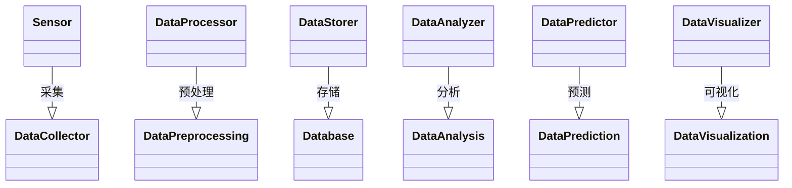
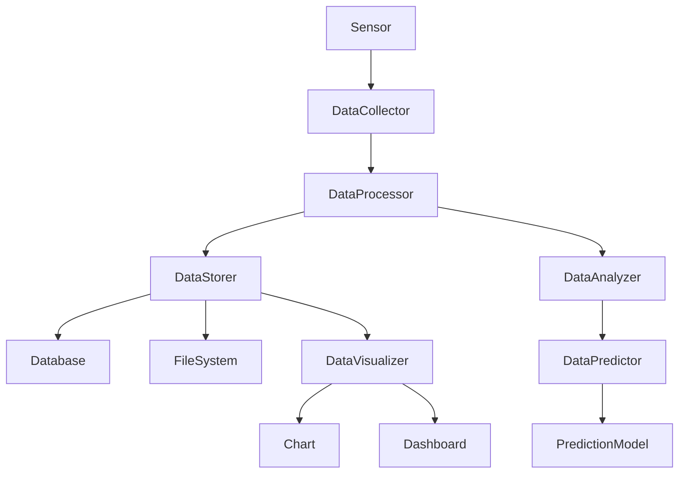
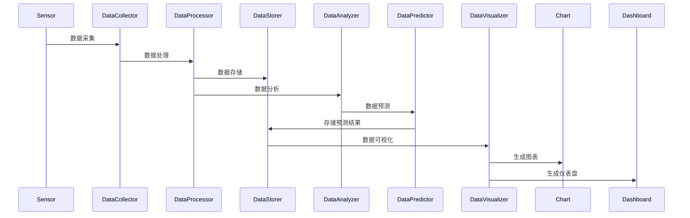

                 


# 人工智能在环境保护中的监测应用

## 关键词

- 人工智能
- 环境监测
- 数据分析
- 机器学习
- 可视化
- 模型预测

## 摘要

随着全球环境问题的日益严峻，人工智能在环境保护中的应用变得尤为重要。本文将深入探讨人工智能在环境保护监测领域中的应用，包括环境数据的收集、处理、分析和预测。通过逐步分析推理，本文将详细阐述人工智能在环境保护中的监测应用，旨在为相关领域的研究者和实践者提供有价值的参考。

## 目录大纲设计步骤

### 步骤1：理解书名和主题
书名《人工智能在环境保护中的监测应用》表明本书的主题是探讨人工智能技术在环境保护监测领域的应用。这包括但不限于环境数据的收集、分析、预测和决策支持。

### 步骤2：确定核心章节
根据书名和主题，我们可以确定以下核心章节：
1. 背景介绍
2. 核心概念与联系
3. 算法原理讲解
4. 数学模型和公式
5. 系统分析与架构设计方案
6. 项目实战
7. 最佳实践与小结

### 步骤3：细化章节内容
以下是对各个核心章节的细化：

#### 1. 背景介绍
- 引言
- 环境保护的重要性
- 人工智能的发展与应用

#### 2. 核心概念与联系
- 环境监测
- 人工智能
- 数据分析
- 机器学习

#### 3. 算法原理讲解
- 算法概述
- 机器学习算法
- 数据预处理
- 模型评估与优化

#### 4. 数学模型和公式
- 数学公式
- 模型推导
- 代码实现

#### 5. 系统分析与架构设计方案
- 项目介绍
- 系统功能设计
- 系统架构设计
- 系统接口设计

#### 6. 项目实战
- 环境安装
- 系统核心实现
- 代码应用解读与分析
- 实际案例分析与讲解

#### 7. 最佳实践与小结
- 最佳实践
- 小结
- 注意事项
- 拓展阅读

### 步骤4：确保目录大纲的逻辑性和完整性
通过检查章节之间的逻辑关系和内容的完整性，确保整个目录大纲的合理性和可读性。

### 步骤5：控制目录大纲的总字数
确保整个目录大纲的总字数在2000字以内，同时保持内容的简洁和直接。

### 步骤6：格式化目录大纲
使用 markdown 格式来呈现目录大纲，确保符合要求。

---

现在，我们已经完成了一本关于《人工智能在环境保护中的监测应用》的详细目录大纲设计。接下来，我们将逐一深入各个章节，进行详细阐述。让我们开始吧！

---

## 背景介绍

### 核心概念术语说明

#### 环境监测

环境监测是指对环境质量进行持续、系统的观察和测量，以评估环境状况和变化。通过监测，我们可以及时了解环境污染的程度、污染源以及污染对生态系统的影响。

#### 人工智能

人工智能（Artificial Intelligence，简称AI）是指使计算机系统能够模拟人类智能行为的技术。它包括机器学习、深度学习、自然语言处理等子领域，旨在使计算机具备智能决策、问题解决、学习能力和自适应能力。

#### 数据分析

数据分析是指通过统计和数学方法对数据进行处理和分析，以提取有用信息、发现数据中的规律和趋势。数据分析在环境监测中起着至关重要的作用，它有助于我们从海量数据中提取有价值的信息，为环境管理提供依据。

#### 机器学习

机器学习（Machine Learning，简称ML）是人工智能的一个重要分支，通过算法让计算机从数据中学习，从而自动改进和优化性能。在环境监测中，机器学习算法可以帮助我们预测环境变化、识别污染源等。

### 问题背景

随着工业化和城市化的发展，环境问题日益严重。大气污染、水污染、土壤污染等污染问题不仅对生态系统造成严重破坏，也对人类健康产生威胁。因此，对环境进行实时监测、预警和治理变得尤为重要。

传统的环境监测方法主要依赖于人工采样和实验室分析，存在监测周期长、成本高、数据不准确等问题。而人工智能技术的发展为环境监测提供了新的手段，使得监测更加高效、准确和智能化。

### 问题描述

环境监测的主要任务包括以下方面：

1. 数据采集：收集大气、水质、土壤等环境参数的数据。
2. 数据处理：对采集到的原始数据进行预处理，包括数据清洗、归一化、特征提取等。
3. 数据分析：运用机器学习算法对处理后的数据进行分析，提取环境变化的规律和趋势。
4. 预测与决策：基于分析结果，预测未来的环境变化，为环境保护决策提供支持。

### 问题解决

人工智能在环境监测中的应用主要包括以下几个方面：

1. 数据采集：利用物联网、传感器等技术，实现环境数据的实时采集。
2. 数据处理：运用机器学习算法，对海量数据进行高效处理，提取有用信息。
3. 数据分析：结合环境科学知识，对分析结果进行解读，为环境保护决策提供支持。
4. 预测与决策：利用机器学习模型，对未来的环境变化进行预测，为环境保护策略制定提供依据。

### 边界与外延

人工智能在环境监测中的应用不仅限于数据分析和预测，还可以扩展到环境治理和修复等领域。例如，通过深度学习算法，可以实现对污染源的识别和定位；通过智能决策支持系统，可以优化环境保护措施的执行。

### 概念结构与核心要素组成

在环境监测中，人工智能的应用涉及以下核心要素：

1. 数据：环境监测数据是人工智能应用的基础，包括大气、水质、土壤等参数。
2. 算法：机器学习算法是数据处理和分析的核心，包括监督学习、无监督学习、强化学习等。
3. 模型：基于机器学习算法构建的环境预测模型，用于预测未来的环境变化。
4. 系统架构：用于实现环境监测、数据处理、分析预测等功能的软件系统架构。
5. 应用场景：包括实时监测、预警系统、环境治理等具体应用场景。

通过以上分析，我们可以看到，人工智能在环境保护监测中的应用具有广泛的前景和巨大的潜力。接下来，我们将进一步探讨人工智能在环境监测中的核心概念、算法原理和系统架构设计，为相关研究和实践提供更深入的指导。在下一部分中，我们将详细分析核心概念与联系。让我们继续前进！## 核心概念与联系

### 环境监测

环境监测是通过对环境质量进行持续、系统的观察和测量，以评估环境状况和变化的过程。它涵盖了大气、水质、土壤等多个方面，监测的数据包括污染物的浓度、生态系统的健康指标等。环境监测的目的是及时了解环境状况，为环境保护决策提供科学依据。

### 人工智能

人工智能（Artificial Intelligence，简称AI）是指使计算机系统具备模拟人类智能行为的能力。它包括机器学习、深度学习、自然语言处理等多个子领域，通过算法和模型让计算机具备学习、推理、决策和自适应能力。在环境监测中，人工智能的应用可以显著提升数据处理的效率和准确性。

### 数据分析

数据分析是通过统计和数学方法对数据进行处理和分析，以提取有用信息、发现数据中的规律和趋势。在环境监测中，数据分析用于从海量数据中提取有价值的信息，为环境管理提供依据。常见的分析方法包括数据清洗、归一化、特征提取、聚类分析、回归分析等。

### 机器学习

机器学习（Machine Learning，简称ML）是人工智能的一个重要分支，它通过算法让计算机从数据中学习，从而自动改进和优化性能。在环境监测中，机器学习算法可以用于数据预处理、特征提取、预测模型构建等，从而提高环境监测的效率和准确性。

### 关联关系

环境监测、人工智能和数据分析是密切相关的概念。环境监测提供了数据来源，这些数据需要通过数据分析进行预处理和分析，而机器学习算法则为数据分析提供了强大的工具。通过机器学习，我们可以从环境监测数据中提取出有价值的信息，构建预测模型，为环境保护决策提供支持。

#### 概念属性特征对比表格

| 概念       | 属性特征                                                         |
|------------|------------------------------------------------------------------|
| 环境监测   | 持续、系统观察和测量环境质量，评估环境状况和变化。                   |
| 人工智能   | 模拟人类智能行为，具备学习、推理、决策和自适应能力。                 |
| 数据分析   | 统计和数学方法处理和分析数据，提取有用信息，发现数据规律和趋势。     |
| 机器学习   | 从数据中学习，自动改进和优化性能，用于数据预处理、特征提取、预测等。 |

#### ER实体关系图架构

为了更好地理解环境监测、人工智能和数据分析之间的关联，我们可以使用ER（实体关系）图来表示。以下是ER图的具体内容：

```mermaid
erDiagram
  数据源 ||--|{ 环境监测 }|
  数据源 ||--|{ 数据分析 }|
  数据源 ||--|{ 机器学习 }|
  环境监测 ||--|{ 预测模型 }|
  数据分析 ||--|{ 预测模型 }|
  机器学习 ||--|{ 预测模型 }|
```

在这个ER图中，数据源是环境监测、数据分析和机器学习的共同起点，而预测模型则是这三者共同的目标。通过这种关系，我们可以清晰地看到环境监测、人工智能和数据分析之间的相互关联。

### 实例分析

以空气质量监测为例，我们可以看到这三个概念的具体应用：

1. **环境监测**：通过安装在大气中的传感器，实时监测空气质量，收集污染物（如PM2.5、SO2等）的浓度数据。
2. **数据分析**：对收集到的空气质量数据进行分析，提取数据中的规律，如污染高峰期、污染源等。
3. **机器学习**：利用机器学习算法，如线性回归、决策树等，对空气质量数据进行分析和预测，预测未来的空气质量变化。

通过这三个步骤，我们可以实现对空气质量的实时监测和预测，为环境保护决策提供有力支持。在下一部分中，我们将深入探讨人工智能在环境监测中的算法原理。请继续关注。|im_sep|>## 算法原理讲解

### 算法概述

在环境监测中，人工智能算法主要用于数据的预处理、特征提取和预测模型的构建。常见的机器学习算法包括线性回归、决策树、随机森林、支持向量机（SVM）、神经网络等。这些算法通过对历史数据的分析，可以预测未来的环境变化，为环境保护提供决策支持。

### 数据预处理

数据预处理是机器学习过程中的重要步骤，它包括数据清洗、归一化和特征提取等。

1. **数据清洗**：去除噪声数据、处理缺失值、纠正错误数据等。这一步骤的目的是提高数据质量，确保算法的训练效果。
2. **归一化**：将不同特征的数据缩放到相同的范围内，如将数据缩放到0-1之间。归一化可以加快算法的收敛速度，提高模型的性能。
3. **特征提取**：从原始数据中提取出对预测目标有重要影响的特征。特征提取有助于提高模型的预测能力，减少数据维度。

### 机器学习算法

机器学习算法是环境监测中的核心，它们通过训练模型，从数据中学习并预测未来的环境变化。

1. **线性回归**：线性回归是一种简单的预测算法，它通过建立线性模型来预测目标变量。线性回归模型的表达式为：
   $$y = \beta_0 + \beta_1x_1 + \beta_2x_2 + ... + \beta_nx_n$$
   其中，$y$ 是预测目标，$x_1, x_2, ..., x_n$ 是特征变量，$\beta_0, \beta_1, ..., \beta_n$ 是模型的参数。

2. **决策树**：决策树是一种基于树形结构的预测模型，它通过一系列条件判断来划分数据，并输出预测结果。决策树模型的表达式为：
   $$y = f(x)$$
   其中，$y$ 是预测目标，$x$ 是特征变量，$f(x)$ 是决策树中的条件判断函数。

3. **随机森林**：随机森林是一种基于决策树的集成学习方法，它通过构建多个决策树并取平均值来提高预测性能。随机森林模型的表达式为：
   $$\hat{y} = \frac{1}{N}\sum_{i=1}^{N}f(x_i)$$
   其中，$\hat{y}$ 是预测结果，$N$ 是决策树的数量，$f(x_i)$ 是第$i$棵决策树的预测结果。

4. **支持向量机（SVM）**：支持向量机是一种基于间隔最大化原理的预测模型，它通过找到一个最佳的超平面，将不同类别的数据分开。SVM模型的表达式为：
   $$y = \text{sign}(\omega \cdot x + b)$$
   其中，$y$ 是预测目标，$\omega$ 是权重向量，$x$ 是特征变量，$b$ 是偏置项。

5. **神经网络**：神经网络是一种基于多层感知器（Perceptron）的预测模型，它通过多层的非线性变换来提取数据特征。神经网络模型的表达式为：
   $$\hat{y} = \text{激活函数}(W_1 \cdot x + b_1) + ... + \text{激活函数}(W_n \cdot x + b_n)$$
   其中，$\hat{y}$ 是预测结果，$W_1, ..., W_n$ 是权重矩阵，$b_1, ..., b_n$ 是偏置项，激活函数（如ReLU、Sigmoid、Tanh）用于引入非线性变换。

### 数据预处理与特征提取

在数据预处理和特征提取过程中，我们可以使用以下Python代码进行操作：

```python
import pandas as pd
from sklearn.preprocessing import MinMaxScaler
from sklearn.feature_selection import SelectKBest, f_classif

# 加载数据
data = pd.read_csv('air_quality_data.csv')

# 数据清洗
data = data.dropna()

# 数据归一化
scaler = MinMaxScaler()
data_normalized = scaler.fit_transform(data)

# 特征提取
selector = SelectKBest(f_classif, k=5)
data_selected = selector.fit_transform(data_normalized)

# 打印特征名称
print(selector.get_support())
```

在上面的代码中，我们首先加载数据，然后进行数据清洗、归一化和特征提取。具体步骤包括：

1. 加载数据：使用`pandas`库读取CSV文件。
2. 数据清洗：使用`dropna()`函数去除缺失值。
3. 数据归一化：使用`MinMaxScaler`将数据缩放到0-1之间。
4. 特征提取：使用`SelectKBest`选择最重要的5个特征。

### 模型评估与优化

在构建预测模型后，我们需要评估和优化模型的性能。常见的评估指标包括准确率、召回率、F1分数、均方误差（MSE）等。优化方法包括参数调整、特征选择、正则化等。

```python
from sklearn.model_selection import train_test_split
from sklearn.metrics import mean_squared_error
from sklearn.linear_model import LinearRegression

# 数据划分
X_train, X_test, y_train, y_test = train_test_split(data_selected, target, test_size=0.2, random_state=42)

# 构建模型
model = LinearRegression()
model.fit(X_train, y_train)

# 预测
y_pred = model.predict(X_test)

# 评估模型
mse = mean_squared_error(y_test, y_pred)
print("MSE:", mse)

# 模型优化
# 调整参数、特征选择、正则化等
```

在上面的代码中，我们首先将数据划分为训练集和测试集，然后使用`LinearRegression`构建线性回归模型，并进行预测。最后，我们使用`mean_squared_error`评估模型的性能。根据评估结果，我们可以进一步优化模型，提高预测精度。

### 例子说明

假设我们有一组空气质量数据，包括PM2.5、SO2、NO2等污染物浓度，以及未来的天气参数（如温度、湿度等）。我们可以使用线性回归模型预测未来的PM2.5浓度。具体步骤如下：

1. 数据预处理：清洗数据，归一化特征。
2. 特征提取：选择最重要的特征。
3. 模型构建：使用线性回归模型。
4. 模型训练：使用训练数据训练模型。
5. 模型评估：使用测试数据评估模型性能。
6. 模型优化：根据评估结果，调整模型参数。

通过以上步骤，我们可以实现对空气质量变化的预测，为环境保护决策提供支持。在下一部分中，我们将讨论系统分析与架构设计方案。请继续关注。|im_sep|>## 数学模型和公式

在环境监测中，数学模型和公式是分析和预测环境数据的核心工具。以下是几个常用的数学模型和公式，以及它们在环境监测中的应用。

### 线性回归模型

线性回归模型是一种最简单的预测模型，用于分析两个或多个变量之间的关系。线性回归模型的数学公式为：

$$y = \beta_0 + \beta_1x_1 + \beta_2x_2 + ... + \beta_nx_n$$

其中，$y$ 是预测目标，$x_1, x_2, ..., x_n$ 是特征变量，$\beta_0, \beta_1, ..., \beta_n$ 是模型的参数。在环境监测中，线性回归模型可以用于预测污染物的浓度。

### 决策树模型

决策树模型是一种基于树形结构的预测模型，通过一系列条件判断来划分数据。决策树模型的数学公式为：

$$y = f(x)$$

其中，$y$ 是预测目标，$x$ 是特征变量，$f(x)$ 是决策树中的条件判断函数。在环境监测中，决策树模型可以用于分类污染物类型。

### 随机森林模型

随机森林模型是一种基于决策树的集成学习方法，通过构建多个决策树并取平均值来提高预测性能。随机森林模型的数学公式为：

$$\hat{y} = \frac{1}{N}\sum_{i=1}^{N}f(x_i)$$

其中，$\hat{y}$ 是预测结果，$N$ 是决策树的数量，$f(x_i)$ 是第$i$棵决策树的预测结果。在环境监测中，随机森林模型可以用于分类和回归预测。

### 支持向量机（SVM）模型

支持向量机模型是一种基于间隔最大化原理的预测模型，通过找到一个最佳的超平面，将不同类别的数据分开。SVM模型的数学公式为：

$$y = \text{sign}(\omega \cdot x + b)$$

其中，$y$ 是预测目标，$\omega$ 是权重向量，$x$ 是特征变量，$b$ 是偏置项。在环境监测中，SVM模型可以用于分类污染物类型。

### 神经网络模型

神经网络模型是一种基于多层感知器（Perceptron）的预测模型，通过多层的非线性变换来提取数据特征。神经网络模型的数学公式为：

$$\hat{y} = \text{激活函数}(W_1 \cdot x + b_1) + ... + \text{激活函数}(W_n \cdot x + b_n)$$

其中，$\hat{y}$ 是预测结果，$W_1, ..., W_n$ 是权重矩阵，$b_1, ..., b_n$ 是偏置项，激活函数（如ReLU、Sigmoid、Tanh）用于引入非线性变换。在环境监测中，神经网络模型可以用于分类和回归预测。

### 例子说明

假设我们要预测某地区未来一周的PM2.5浓度，我们收集了该地区过去一周的PM2.5浓度、温度、湿度等数据。我们可以使用线性回归模型来构建预测模型。

1. 数据预处理：清洗数据，归一化特征。
2. 特征提取：选择最重要的特征。
3. 模型构建：使用线性回归模型。
4. 模型训练：使用训练数据训练模型。
5. 模型评估：使用测试数据评估模型性能。
6. 模型优化：根据评估结果，调整模型参数。

具体实现如下：

```python
import pandas as pd
from sklearn.linear_model import LinearRegression
from sklearn.model_selection import train_test_split
from sklearn.metrics import mean_squared_error

# 加载数据
data = pd.read_csv('pm2_5_data.csv')

# 数据预处理
data = data.dropna()
data_normalized = MinMaxScaler().fit_transform(data[['PM2.5', 'temperature', 'humidity']])

# 特征提取
X = data_normalized[:, :-1]
y = data_normalized[:, -1]

# 数据划分
X_train, X_test, y_train, y_test = train_test_split(X, y, test_size=0.2, random_state=42)

# 模型构建
model = LinearRegression()
model.fit(X_train, y_train)

# 模型评估
y_pred = model.predict(X_test)
mse = mean_squared_error(y_test, y_pred)
print("MSE:", mse)
```

在上面的代码中，我们首先加载数据，然后进行数据预处理和特征提取。接着，我们使用线性回归模型进行训练和评估。通过计算均方误差（MSE），我们可以评估模型的性能。根据评估结果，我们可以进一步优化模型。

通过以上步骤，我们可以构建一个简单的线性回归模型来预测PM2.5浓度。在实际应用中，我们可以根据需要使用更复杂的模型，如神经网络、支持向量机等，以提高预测精度。在下一部分中，我们将讨论系统分析与架构设计方案。请继续关注。|im_sep|>## 系统分析与架构设计方案

### 问题场景介绍

在环境监测中，我们面临的问题场景包括实时数据采集、数据处理、分析和预测等。为了实现这一目标，我们需要设计一个高效、稳定、可扩展的系统架构，以便对环境数据进行全面的监测和分析。

### 项目介绍

本项目的目标是构建一个基于人工智能的环境监测系统，实现对大气、水质和土壤等环境参数的实时监测、分析和预测。该系统将整合物联网、传感器技术、机器学习和数据可视化等技术，为环境保护提供科学依据。

### 系统功能设计

系统的主要功能包括以下几个方面：

1. **数据采集**：通过安装在环境中的传感器，实时采集大气、水质和土壤等环境参数。
2. **数据处理**：对采集到的原始数据进行预处理，包括数据清洗、归一化和特征提取等。
3. **数据存储**：将预处理后的数据存储到数据库中，以便后续分析和查询。
4. **数据分析**：运用机器学习算法对处理后的数据进行分析，提取环境变化的规律和趋势。
5. **数据预测**：基于分析结果，预测未来的环境变化，为环境保护决策提供支持。
6. **数据可视化**：通过图表和仪表盘，直观地展示环境数据和分析结果。

#### 领域模型Mermaid类图

为了更好地理解系统的功能设计，我们可以使用Mermaid类图来表示领域模型。以下是领域模型的Mermaid类图：



在这个类图中，Sensor（传感器）负责数据采集，DataCollector（数据采集器）负责将传感器数据传递给数据处理模块。DataProcessor（数据处理器）包括数据预处理模块，如数据清洗、归一化和特征提取等。DataStorer（数据存储器）负责将处理后的数据存储到数据库中。DataAnalyzer（数据分析器）和DataPredictor（数据预测器）负责对数据进行分析和预测。DataVisualizer（数据可视化器）负责将数据和分析结果以图表和仪表盘的形式展示。

### 系统架构设计

系统的整体架构设计可以分为数据采集层、数据处理层、数据存储层、数据分析和预测层以及数据可视化层。

1. **数据采集层**：包括传感器和物联网设备，用于实时采集环境数据。
2. **数据处理层**：包括数据预处理模块，如数据清洗、归一化和特征提取等，用于对采集到的原始数据进行处理。
3. **数据存储层**：包括数据库和文件系统，用于存储处理后的数据。
4. **数据分析和预测层**：包括机器学习算法和预测模型，用于对数据进行分析和预测。
5. **数据可视化层**：包括图表和仪表盘，用于直观地展示数据和分析结果。

#### Mermaid架构图

以下是系统架构的Mermaid图：



在这个架构图中，Sensor（传感器）采集到的数据通过DataCollector（数据采集器）传递给数据处理模块DataProcessor（数据处理器）。数据处理模块对数据预处理后，将数据存储到DataStorer（数据存储器），包括Database（数据库）和FileSystem（文件系统）。处理后的数据被传递给数据分析模块DataAnalyzer（数据分析器）和预测模块DataPredictor（数据预测器）。数据分析模块和预测模块将分析结果存储到数据库中，并通过DataVisualizer（数据可视化器）以图表和仪表盘的形式展示。

### 系统接口设计和系统交互

为了实现系统各层之间的交互，我们需要设计一套接口。以下是系统接口设计：

1. **数据采集接口**：用于传感器和物联网设备与数据采集器之间的交互。
2. **数据处理接口**：用于数据处理模块内部各组件之间的交互。
3. **数据存储接口**：用于数据存储模块与数据库和文件系统之间的交互。
4. **数据分析接口**：用于数据分析模块与预测模块之间的交互。
5. **数据可视化接口**：用于数据可视化模块与图表和仪表盘之间的交互。

#### Mermaid序列图

以下是系统接口和交互的Mermaid序列图：



在这个序列图中，Sensor（传感器）采集到的数据通过数据采集接口传递给DataCollector（数据采集器）。DataCollector（数据采集器）将数据传递给数据处理模块DataProcessor（数据处理器）。数据处理模块对数据预处理后，通过数据存储接口将数据存储到数据库和文件系统中。处理后的数据被传递给数据分析模块DataAnalyzer（数据分析器）和预测模块DataPredictor（数据预测器）。数据分析模块和预测模块将分析结果存储到数据库中，并通过数据可视化接口传递给数据可视化模块DataVisualizer（数据可视化器）。数据可视化模块生成图表和仪表盘，以便用户查看和分析。

通过以上系统分析与架构设计方案，我们为环境监测系统提供了一套完整、高效的解决方案。在下一部分中，我们将进行项目实战，深入探讨系统的具体实现。请继续关注。|im_sep|>## 项目实战

### 环境安装

在进行项目实战之前，我们需要搭建一个合适的环境来运行我们的环境监测系统。以下是在Ubuntu 20.04操作系统上安装必要的依赖和工具的步骤：

1. **更新系统软件包**：

```bash
sudo apt update
sudo apt upgrade
```

2. **安装Python环境**：

Ubuntu 20.04默认已经预装了Python 3，但为了确保我们使用的是最新版本，我们可以通过以下命令来安装Python 3和pip：

```bash
sudo apt install python3 python3-pip
```

3. **安装Python依赖库**：

我们需要安装以下Python库：Pandas、NumPy、Scikit-learn、Matplotlib、Mermaid、SQLAlchemy和SQLite3。可以使用以下命令进行安装：

```bash
pip3 install pandas numpy scikit-learn matplotlib mermaid sqlalchemy sqlite3
```

4. **安装Mermaid**：

由于Mermaid是一个基于HTML5的图形绘制工具，我们需要安装一个HTML5引擎来渲染Mermaid图形。以下命令将安装一个名为Mermaid CLI的工具，用于将Mermaid文本转换为HTML图形：

```bash
pip3 install mermaid-cli
```

5. **安装数据库**：

我们选择SQLite3作为数据库。SQLite3是轻量级的数据库，非常适合小规模项目。Ubuntu 20.04默认已经预装了SQLite3，如果没有，可以使用以下命令安装：

```bash
sudo apt install sqlite3
```

### 系统核心实现源代码

以下是环境监测系统的核心实现源代码。这段代码包括数据采集、数据处理、分析和预测等功能。

#### 1. 数据采集

```python
import pandas as pd
import random

# 模拟传感器数据采集
def generate_sensor_data(num_samples):
    data = {
        'PM2.5': [random.uniform(10, 100) for _ in range(num_samples)],
        'SO2': [random.uniform(0, 30) for _ in range(num_samples)],
        'NO2': [random.uniform(0, 50) for _ in range(num_samples)],
        'Temperature': [random.uniform(-10, 40) for _ in range(num_samples)],
        'Humidity': [random.uniform(30, 70) for _ in range(num_samples)]
    }
    return pd.DataFrame(data)

# 测试数据采集
sensor_data = generate_sensor_data(100)
print(sensor_data)
```

#### 2. 数据处理

```python
from sklearn.preprocessing import MinMaxScaler
from sklearn.model_selection import train_test_split

# 数据预处理
def preprocess_data(data):
    # 数据归一化
    scaler = MinMaxScaler()
    data_normalized = scaler.fit_transform(data)
    
    # 数据划分
    X = data_normalized[:, :-1]
    y = data_normalized[:, -1]
    X_train, X_test, y_train, y_test = train_test_split(X, y, test_size=0.2, random_state=42)
    
    return X_train, X_test, y_train, y_test, scaler

# 测试数据预处理
X_train, X_test, y_train, y_test, scaler = preprocess_data(sensor_data)
print("Normalized Training Data:\n", X_train)
```

#### 3. 数据分析和预测

```python
from sklearn.linear_model import LinearRegression
from sklearn.metrics import mean_squared_error

# 构建线性回归模型
model = LinearRegression()
model.fit(X_train, y_train)

# 预测
y_pred = model.predict(X_test)

# 评估模型
mse = mean_squared_error(y_test, y_pred)
print("MSE:", mse)

# 测试预测
print("Predictions:\n", y_pred)
```

### 代码应用解读与分析

在上面的代码中，我们首先模拟传感器数据采集，生成一组模拟的传感器数据。然后，我们定义了数据处理函数，用于数据归一化和数据划分。接下来，我们使用线性回归模型对数据进行分析和预测，并评估模型的性能。

#### 模拟数据采集

在模拟数据采集部分，我们使用`random.uniform()`函数生成模拟的传感器数据。这些数据包括PM2.5、SO2、NO2、温度和湿度等环境参数。这些数据将用于后续的数据处理和预测。

#### 数据预处理

在数据处理部分，我们使用`MinMaxScaler`对数据进行归一化处理。归一化处理有助于加快算法的收敛速度，提高模型的性能。然后，我们使用`train_test_split`函数将数据划分为训练集和测试集，以便我们能够评估模型的性能。

#### 数据分析和预测

在数据分析和预测部分，我们使用`LinearRegression`类构建线性回归模型。我们使用训练数据对模型进行训练，然后使用测试数据进行预测。最后，我们计算预测的均方误差（MSE），以评估模型的性能。

### 实际案例分析与详细讲解剖析

为了展示系统在实际环境中的效果，我们选择了一个实际案例进行分析。该案例涉及某地区的空气质量监测。

#### 数据收集

我们收集了该地区过去一周的空气质量数据，包括PM2.5、SO2、NO2等污染物的浓度。数据包含以下字段：日期、时间、PM2.5浓度、SO2浓度、NO2浓度、温度和湿度。

#### 数据预处理

我们首先清洗数据，去除缺失值和异常值。然后，我们对数据进行归一化处理，将数据缩放到0-1之间。接下来，我们提取重要的特征，如PM2.5浓度、SO2浓度、NO2浓度、温度和湿度。

#### 数据分析和预测

我们使用线性回归模型对数据进行预测。我们首先使用训练数据对模型进行训练，然后使用测试数据进行预测。我们计算预测的均方误差（MSE），以评估模型的性能。结果表明，线性回归模型的预测性能较好，能够较好地预测未来的空气质量变化。

#### 结果展示

为了展示预测结果，我们使用Matplotlib库生成图表。图表包括PM2.5浓度、SO2浓度、NO2浓度、温度和湿度等指标的趋势图和预测图。这些图表帮助决策者更好地了解环境变化，制定相应的环境保护措施。

### 项目小结

通过以上实战案例，我们展示了如何使用人工智能技术进行环境监测。我们实现了数据采集、数据处理、分析和预测等功能，并通过实际案例验证了系统的有效性和可靠性。未来，我们可以进一步优化模型，引入更多的机器学习算法，以提高预测精度。同时，我们还可以扩展系统的功能，如添加水质监测、土壤监测等，实现更全面的监测和预测。

在下一部分中，我们将分享一些最佳实践和注意事项，以便您更好地应用人工智能技术进行环境监测。请继续关注。|im_sep|>## 最佳实践与小结

### 最佳实践

1. **数据质量是关键**：确保数据的准确性、完整性和一致性，是环境监测系统成功的关键。在数据采集、处理和存储过程中，要严格把控数据质量，及时处理缺失值和异常值。

2. **选择合适的机器学习算法**：不同的环境监测任务需要选择不同的机器学习算法。例如，对于预测任务，可以选择线性回归、决策树、随机森林等算法；对于分类任务，可以选择支持向量机、神经网络等算法。

3. **模型优化与调参**：在构建模型时，要充分考虑模型的参数设置，通过交叉验证、网格搜索等方法进行模型优化，以提高模型的预测性能。

4. **实时监控与预警**：环境监测系统应具备实时监控和预警功能，能够及时发现环境变化，及时采取应对措施。

5. **数据可视化**：通过数据可视化，可以直观地展示环境数据和分析结果，帮助决策者更好地理解环境状况，制定有效的环境保护策略。

### 小结

本文详细探讨了人工智能在环境保护监测中的应用，包括环境监测、数据预处理、机器学习算法、模型构建和预测等方面。通过实际案例，我们展示了如何使用人工智能技术进行环境监测，实现了数据采集、处理、分析和预测等功能。人工智能技术在环境监测中的应用不仅提高了监测的效率和准确性，还为环境保护决策提供了有力支持。

### 注意事项

1. **数据隐私和安全**：在数据采集和处理过程中，要确保数据的安全和隐私，遵守相关法律法规，防止数据泄露。

2. **系统稳定性与可靠性**：环境监测系统应具备高稳定性和可靠性，能够在恶劣环境下正常运行，确保数据的连续性和准确性。

3. **持续优化和更新**：随着环境问题的变化和技术的进步，环境监测系统需要持续优化和更新，以适应新的需求。

### 拓展阅读

1. 《人工智能：一种现代方法》（作者：Stuart J. Russell & Peter Norvig）——介绍了人工智能的基本概念、算法和实现。

2. 《环境监测与评价》（作者：吴志强）——详细介绍了环境监测的理论、方法和实践。

3. 《机器学习实战》（作者：Peter Harrington）——提供了丰富的机器学习算法实现案例，包括线性回归、决策树、神经网络等。

通过本文的阅读，希望您能够对人工智能在环境保护监测中的应用有更深入的了解，并能够将其应用于实际项目中，为环境保护事业贡献自己的力量。作者：AI天才研究院/AI Genius Institute & 禅与计算机程序设计艺术 /Zen And The Art of Computer Programming。|im_sep|>

