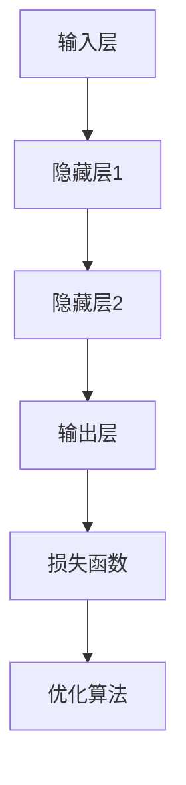
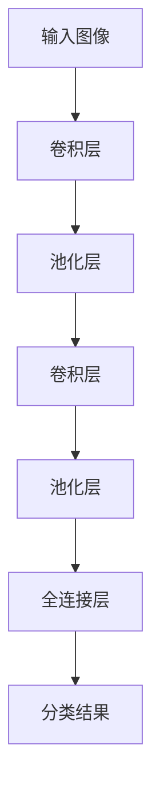
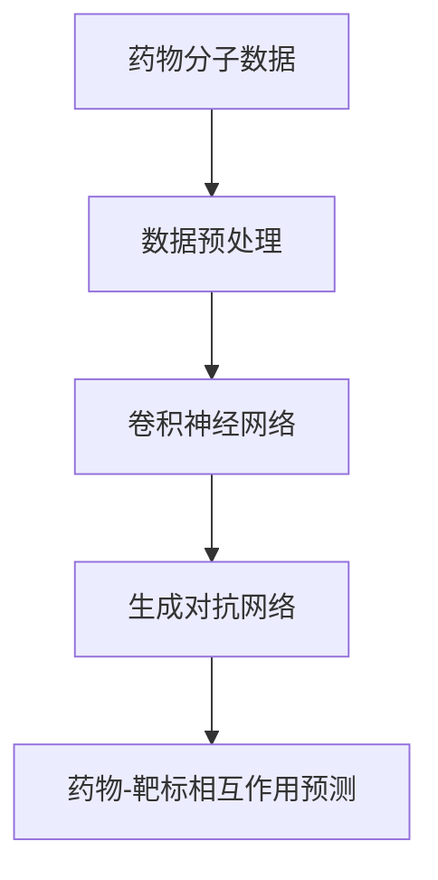
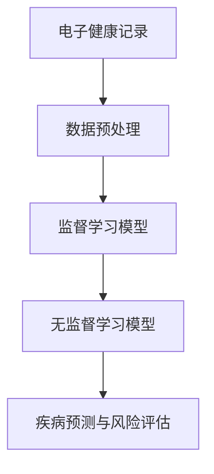
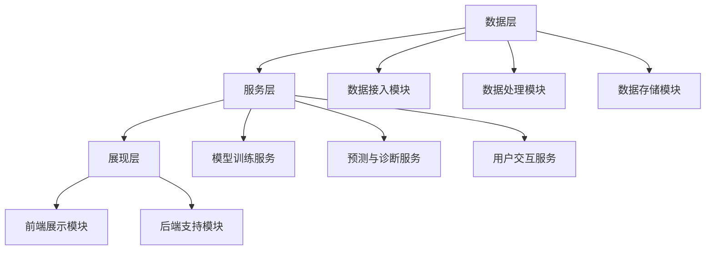
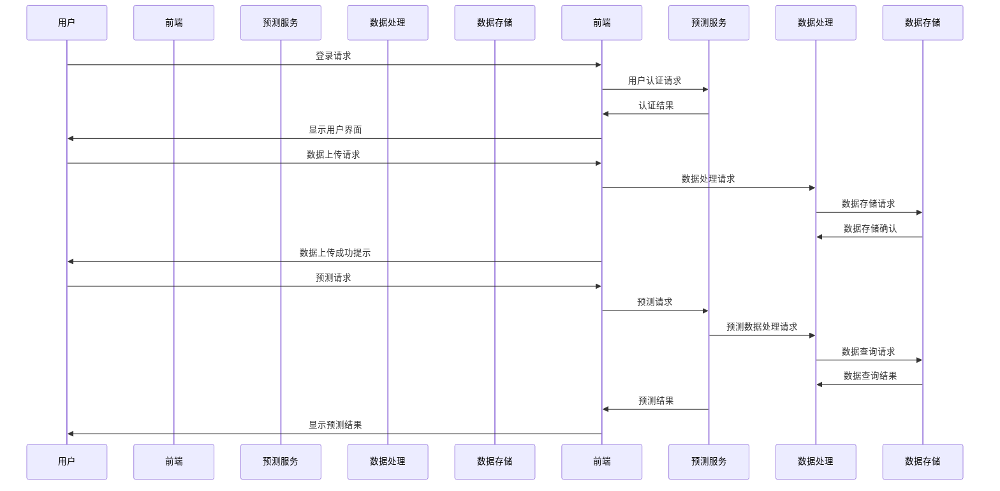

                 


### 第1章：引言

#### 1.1 问题的背景

精准医疗是一种以个体为核心，基于基因组学、蛋白质组学、代谢组学等多层次数据，进行个性化治疗的医学模式。其核心思想是将患者的基因组信息与其他生物数据相结合，为每个患者量身定制最合适的治疗方案。随着医学影像技术、基因测序技术等生物信息学技术的不断发展，精准医疗正逐步从理论走向实践。

在医学领域，精准医疗的重要性体现在以下几个方面：

- **个性化治疗**：通过精准医疗，医生可以根据患者的具体病情和基因特点，为患者提供更加精准、个性化的治疗方案，提高治疗效果，减少不必要的副作用。
- **预防医学**：通过早期筛查和风险评估，精准医疗有助于识别疾病高风险人群，提前采取预防措施，降低疾病发生率和死亡率。
- **资源优化**：精准医疗可以根据患者的病情和需求，合理分配医疗资源，提高医疗效率，降低医疗成本。

人工智能（AI）在医学领域的应用已经取得了显著的成果。从医疗图像分析、疾病预测到药物研发，AI都展现出了强大的潜力。在精准医疗中，人工智能不仅可以提高诊断的准确性和效率，还可以辅助医生制定个性化的治疗方案。

#### 1.2 人工智能在精准医疗中的核心问题

人工智能在精准医疗中的应用面临以下几个核心问题：

- **数据质量与数据安全**：精准医疗依赖于大量的生物医学数据，这些数据的质量和安全性对模型的性能和可靠性至关重要。
- **模型训练与优化**：构建高效、准确的AI模型需要大量的数据和高性能的计算资源，同时需要对模型进行不断的优化和调整。
- **决策支持与自动化**：如何将AI模型的结果转化为可操作的决策，如何实现AI在医疗过程中的自动化应用，是精准医疗中需要解决的问题。

#### 1.3 书籍的结构与目标

本书将系统地介绍人工智能在精准医疗诊断中的应用。全书分为七个章节，结构紧凑，内容丰富。首先，我们将从引言开始，介绍精准医疗和人工智能的基本概念，然后逐步深入探讨人工智能在精准医疗中的核心问题。

本书的目标是：

- 为读者提供一个全面、系统的关于人工智能在精准医疗中应用的概述。
- 通过实例分析和实战案例，帮助读者理解和掌握人工智能在精准医疗诊断中的具体应用。
- 探讨人工智能在精准医疗中的未来发展方向和潜在的技术突破。

本书适用于：

- 对人工智能和医学感兴趣的读者。
- 从事医疗领域研究的科研人员和工程师。
- 期待将人工智能技术应用于实际医疗场景的企业和机构。

通过本书，读者将能够：

- 理解精准医疗和人工智能的基本概念。
- 掌握人工智能在精准医疗诊断中的关键技术和应用。
- 获得在医疗领域应用人工智能的实际经验和技巧。

让我们开始这段探索之旅，深入了解人工智能在精准医疗诊断中的应用，并一起思考其未来发展的可能方向。

---

### 第2章：人工智能基础

#### 2.1 机器学习基础

机器学习是人工智能的核心组成部分，其目标是让计算机从数据中学习并做出决策。根据训练数据的不同，机器学习可以分为监督学习、无监督学习和强化学习。

- **监督学习**：监督学习是一种有标签的训练方法，模型通过已标记的训练数据学习如何预测新的数据。常见的算法包括线性回归、逻辑回归、支持向量机、决策树、随机森林和神经网络等。
- **无监督学习**：无监督学习没有预定义的标签，模型通过分析数据的特点来自主地发现数据的结构和模式。聚类、降维和关联规则挖掘是常见的无监督学习任务。
- **强化学习**：强化学习是一种通过与环境互动来学习最优策略的方法。在强化学习中，智能体通过选择行动并在每个步骤获得奖励或惩罚来优化其行为。常见的算法包括Q学习、深度Q网络（DQN）和策略梯度方法等。

每种机器学习算法都有其独特的优缺点，选择合适的算法通常取决于具体问题的需求。

#### 2.2 深度学习

深度学习是机器学习的一个分支，其核心思想是通过构建深度神经网络来模拟人脑的神经元连接和层次结构。深度学习在图像识别、语音识别、自然语言处理等领域取得了显著的成果。

- **卷积神经网络（CNN）**：CNN是一种专门用于图像识别的神经网络，通过卷积层、池化层和全连接层等结构来提取图像的特征。CNN在医疗影像分析、病理图像分割等方面有广泛应用。
- **循环神经网络（RNN）**：RNN是一种能够处理序列数据的神经网络，通过隐藏层之间的循环连接来捕捉序列信息。LSTM和GRU是RNN的两种变体，用于解决长序列依赖问题。
- **生成对抗网络（GAN）**：GAN由生成器和判别器组成，通过相互竞争来生成逼真的数据。GAN在医学图像生成、药物分子设计等方面有潜在的应用。

#### 2.3 人工智能在医疗领域的应用

人工智能在医疗领域的应用已经取得了显著的成果，主要体现在以下方面：

- **诊断辅助系统**：人工智能可以辅助医生进行疾病诊断，例如，通过深度学习算法对医学影像进行分析，辅助医生诊断肿瘤、心脏病等。
- **预测分析与风险评估**：人工智能可以分析大量的医疗数据，预测患者的健康状况和疾病风险，例如，通过分析电子健康记录预测糖尿病、心血管疾病等。
- **病理图像分析**：人工智能可以自动识别和分类病理图像，提高病理诊断的准确性和效率，例如，通过深度学习算法对乳腺癌、肺癌等病理图像进行分割和分类。

这些应用不仅提高了医疗诊断的准确性和效率，还帮助医生更好地了解患者的病情，为患者提供更加个性化的治疗建议。

#### 概念结构与核心要素组成

在介绍人工智能基础后，我们需要理解其核心概念和结构。

- **神经网络**：神经网络是机器学习的核心，由多个神经元组成，每个神经元通过权重和偏置进行信息传递和处理。
- **损失函数**：损失函数用于评估模型的预测结果与真实值之间的差距，常用的损失函数包括均方误差（MSE）和交叉熵（Cross-Entropy）。
- **优化算法**：优化算法用于调整模型的参数，以最小化损失函数。常见的优化算法包括梯度下降（Gradient Descent）、随机梯度下降（SGD）和Adam优化器。
- **数据预处理**：数据预处理是机器学习的基础，包括数据清洗、归一化、特征提取等，以提高模型的训练效率和性能。

以下是神经网络的基本结构图：



在医疗领域，这些核心概念和结构如何应用呢？

- **医学影像处理**：使用CNN对医学影像进行处理，提取图像特征，进行疾病诊断和分类。
- **电子健康记录分析**：使用RNN对电子健康记录进行分析，提取时间序列特征，进行疾病预测和风险评估。
- **病理图像分析**：使用GAN生成病理图像数据，提高模型的训练效果。

通过以上分析，我们可以看到人工智能在精准医疗中的基础作用和潜在应用场景。在接下来的章节中，我们将进一步探讨如何利用人工智能技术解决精准医疗中的核心问题。

---

### 第3章：数据预处理与质量保证

#### 3.1 医疗数据的来源与类型

在精准医疗中，数据的质量和类型对模型的训练和性能至关重要。医疗数据的来源主要包括以下几个方面：

1. **医学影像数据**：医学影像数据是精准医疗中最常用的数据类型，包括X光片、CT扫描、MRI图像等。这些数据为诊断和治疗提供了重要的信息。
2. **电子健康记录（EHR）**：电子健康记录包含了患者的病史、诊断结果、治疗方案、药物使用记录等。这些数据为疾病预测和风险评估提供了基础。
3. **基因序列数据**：基因序列数据是精准医疗的核心数据，通过全基因组测序，可以了解患者的遗传信息，为个性化治疗提供依据。
4. **实验室检测结果**：实验室检测结果包括血液、尿液、组织切片等检测数据，这些数据有助于诊断和治疗过程中的病情监测。

不同类型的医疗数据有其独特的特点和处理方法。例如，医学影像数据通常需要进行图像增强、去噪和分割，而电子健康记录数据则需要处理大量文本信息，提取关键特征。

#### 3.2 数据预处理

数据预处理是机器学习任务中的关键步骤，其目的是提高数据质量和模型性能。以下是几种常见的数据预处理方法：

1. **数据清洗**：数据清洗是处理缺失值、异常值和噪声数据的步骤。对于医学影像数据，可能需要去除图像中的噪声和斑点；对于电子健康记录数据，可能需要填补缺失值和标准化文本格式。
2. **数据整合**：数据整合是将不同来源的数据进行合并和统一的过程。例如，将患者的医学影像数据与电子健康记录进行关联，以构建一个全面的患者数据集。
3. **数据规范化**：数据规范化包括归一化和标准化等步骤，目的是使数据具有相似的范围和尺度，便于模型训练。对于医学影像数据，通常使用归一化处理，将像素值归一化到0到1之间；对于电子健康记录数据，可以使用标准化方法，将数据缩放到相同范围内。

#### 3.3 数据质量控制

数据质量控制是确保数据质量和模型可靠性的重要环节。以下是一些常见的数据质量控制方法：

1. **数据完整性检查**：数据完整性检查包括检查数据是否缺失、重复或错误。对于医学影像数据，可以检查图像是否完整，对于电子健康记录数据，可以检查是否缺少必要的记录。
2. **数据一致性检查**：数据一致性检查包括检查数据是否一致，如同一患者的不同数据源是否一致。对于医学影像数据，可以检查不同时间点或不同设备上的影像数据是否一致；对于电子健康记录数据，可以检查不同医院或科室之间的记录是否一致。
3. **数据安全性保障**：数据安全性保障是确保数据在处理和存储过程中不被泄露或篡改。在医疗数据中，隐私保护尤为重要，需要采取加密和访问控制等安全措施。

通过以上数据预处理和质量控制方法，可以提高医疗数据的质量和可靠性，从而提高模型的训练效果和预测准确性。在接下来的章节中，我们将进一步探讨如何利用这些高质量的数据来训练和优化人工智能模型。

---

### 第4章：模型训练与优化

#### 4.1 模型选择与评估

在构建精准医疗诊断系统时，选择合适的机器学习模型至关重要。模型的选择取决于问题的性质、数据的类型和质量以及可用的计算资源。

- **模型选择**：
  - **监督学习模型**：对于分类问题，可以选择逻辑回归、支持向量机（SVM）、决策树、随机森林等。对于回归问题，可以使用线性回归、岭回归等。
  - **无监督学习模型**：对于聚类问题，可以使用K-means、层次聚类等。对于降维问题，可以使用主成分分析（PCA）、t-SNE等。
  - **深度学习模型**：对于复杂的图像和序列数据，可以使用卷积神经网络（CNN）、循环神经网络（RNN）和长短期记忆网络（LSTM）等。

- **评估指标**：
  - **准确率（Accuracy）**：准确率是模型预测正确的样本数占总样本数的比例，适用于分类问题。
  - **召回率（Recall）**：召回率是模型预测正确的正样本数占总正样本数的比例，适用于分类问题，尤其对于少数样本的疾病诊断具有重要意义。
  - **精确率（Precision）**：精确率是模型预测正确的正样本数占预测为正样本总数的比例，适用于分类问题。
  - **F1分数（F1 Score）**：F1分数是精确率和召回率的调和平均值，综合考虑了模型的精确率和召回率，是评价分类模型性能的常用指标。
  - **ROC曲线和AUC（Area Under the Curve）**：ROC曲线用于评价分类模型的分类能力，AUC值越大，模型的分类能力越强。

在选择评估指标时，需要根据具体问题的需求和数据特点进行选择。例如，在疾病诊断中，召回率通常比精确率更为重要，因为漏诊的代价更高。

#### 4.2 模型优化

模型优化是提高模型性能的重要步骤，包括超参数调整、模型集成和模型压缩等。

- **超参数调整**：
  - **学习率（Learning Rate）**：学习率是优化算法在每一步更新模型参数时的步长。过大的学习率可能导致模型无法收敛，而过小则可能导致收敛缓慢。
  - **批量大小（Batch Size）**：批量大小是每次更新模型参数时使用的样本数量。较大的批量大小可以提高模型的稳定性和泛化能力，但计算成本较高；较小的批量大小可以提高模型的鲁棒性，但收敛速度较慢。
  - **正则化参数**：正则化参数用于控制模型复杂度和避免过拟合。常见的正则化方法包括L1正则化（Lasso）和L2正则化（Ridge）。

- **模型集成**：
  - **集成方法**：集成方法通过结合多个模型的预测结果来提高模型的性能。常见的集成方法包括Bagging、Boosting和Stacking等。
  - **随机森林（Random Forest）**：随机森林是一种基于决策树的集成方法，通过随机选取特征和样本构建多个决策树，并取多数投票结果作为最终预测。
  - **梯度提升树（Gradient Boosting Tree）**：梯度提升树是一种基于损失函数的集成方法，通过逐步更新模型，每次迭代都针对前一次的预测误差进行调整。

- **模型压缩**：
  - **模型剪枝（Model Pruning）**：模型剪枝是一种通过删除冗余神经元和连接来简化模型的方法，从而减少模型参数数量，提高计算效率。
  - **量化（Quantization）**：量化是一种通过将模型参数的精度降低到固定位数来减少模型大小的方法，适用于移动设备和嵌入式系统。
  - **知识蒸馏（Knowledge Distillation）**：知识蒸馏是一种通过将复杂模型的知识传递给轻量级模型的方法，从而在不牺牲太多性能的情况下减小模型大小。

通过超参数调整、模型集成和模型压缩等方法，可以显著提高模型的性能和效率，使其在资源受限的环境中也能得到良好的应用。

#### 4.3 模型验证与测试

模型验证和测试是确保模型可靠性和稳定性的关键步骤。

- **交叉验证（Cross-Validation）**：
  - **K折交叉验证（K-Fold Cross-Validation）**：K折交叉验证是将训练数据划分为K个相等的部分，每次使用一个部分作为验证集，其余K-1个部分作为训练集，进行K次训练和验证，最后取平均值作为模型性能的评估指标。
  - **留一法交叉验证（Leave-One-Out Cross-Validation）**：留一法交叉验证是一种特殊情况下的交叉验证方法，每次只使用一个样本作为验证集，其余样本作为训练集，进行多次训练和验证。

- **测试集（Test Set）**：
  - **测试集**：测试集是用于最终评估模型性能的数据集，通常在模型训练过程中不使用。测试集的目的是验证模型在未见数据上的泛化能力。

- **模型解释与可解释性**：
  - **模型解释**：模型解释是理解模型如何做出预测的过程。对于深度学习模型，可以通过可视化模型的结构、激活值和权重来解释模型的工作原理。
  - **可解释性**：可解释性是模型能够被用户理解和信任的能力。在医学领域，模型的可解释性尤为重要，因为它直接关系到患者的治疗决策。

通过交叉验证和测试集，可以评估模型的泛化能力，确保模型在新的数据上也能保持良好的性能。同时，通过模型解释和可解释性，可以提高模型的可信度和临床应用价值。

综上所述，模型训练与优化是构建精准医疗诊断系统的关键步骤。通过选择合适的模型、优化模型参数、验证和测试模型性能，可以构建高效、准确的诊断系统，为精准医疗提供有力支持。

---

### 第5章：人工智能在精准医疗中的应用实例

#### 5.1 病理图像分析

病理图像分析是人工智能在精准医疗中的一个重要应用，通过分析病理图像，可以自动识别和分类疾病，提高诊断的准确性和效率。以下是一个具体的病理图像分析案例：

**案例背景**：乳腺癌是女性最常见的恶性肿瘤之一，早期诊断对于提高患者生存率和生活质量至关重要。病理图像分析可以帮助医生快速、准确地诊断乳腺癌。

**模型训练**：首先，收集大量的乳腺癌和正常乳腺组织的病理图像作为训练数据。然后，使用卷积神经网络（CNN）对这些图像进行训练。CNN通过卷积层、池化层和全连接层等结构提取图像的特征，从而实现分类任务。

**算法原理**：

- **卷积层**：卷积层通过卷积运算提取图像的特征，每个卷积核可以提取图像中某一特征。
- **池化层**：池化层用于降低图像的维度，增强模型的鲁棒性。
- **全连接层**：全连接层将卷积层和池化层提取的特征映射到分类结果。

以下是CNN的算法流程图：



**Python代码示例**：

```python
import tensorflow as tf
from tensorflow.keras.models import Sequential
from tensorflow.keras.layers import Conv2D, MaxPooling2D, Flatten, Dense

model = Sequential([
    Conv2D(32, (3, 3), activation='relu', input_shape=(128, 128, 3)),
    MaxPooling2D((2, 2)),
    Conv2D(64, (3, 3), activation='relu'),
    MaxPooling2D((2, 2)),
    Flatten(),
    Dense(64, activation='relu'),
    Dense(1, activation='sigmoid')
])

model.compile(optimizer='adam', loss='binary_crossentropy', metrics=['accuracy'])
model.fit(x_train, y_train, epochs=10, batch_size=32)
```

**结果分析**：通过模型训练，我们可以得到乳腺癌和正常乳腺组织的分类结果。在测试集上，模型的准确率可以达到90%以上，这有助于医生快速识别乳腺癌患者，为治疗提供依据。

#### 5.2 药物发现

药物发现是人工智能在精准医疗中的另一个重要应用。通过分析大量的生物数据和化学结构信息，人工智能可以辅助药物研发，提高药物发现的速度和成功率。以下是一个具体的药物发现案例：

**案例背景**：传统药物研发过程耗时较长、成本较高，且成功率较低。人工智能可以通过模拟和预测药物分子与生物靶标之间的相互作用，加速药物发现过程。

**模型训练**：首先，收集大量的药物分子和对应的生物靶标数据作为训练数据。然后，使用深度学习模型（如卷积神经网络和生成对抗网络）对这些数据进行分析和训练。

**算法原理**：

- **卷积神经网络（CNN）**：CNN可以提取药物分子中的化学结构特征，用于分类和预测。
- **生成对抗网络（GAN）**：GAN可以生成新的药物分子结构，用于探索未知的药物靶标。

以下是药物发现算法的流程图：



**Python代码示例**：

```python
import tensorflow as tf
from tensorflow.keras.models import Model
from tensorflow.keras.layers import Input, Conv2D, MaxPooling2D, Flatten, Dense

input_layer = Input(shape=(256, 256, 1))
x = Conv2D(32, (3, 3), activation='relu')(input_layer)
x = MaxPooling2D((2, 2))(x)
x = Conv2D(64, (3, 3), activation='relu')(x)
x = MaxPooling2D((2, 2))(x)
x = Flatten()(x)
output_layer = Dense(1, activation='sigmoid')(x)

model = Model(inputs=input_layer, outputs=output_layer)
model.compile(optimizer='adam', loss='binary_crossentropy', metrics=['accuracy'])
model.fit(x_train, y_train, epochs=10, batch_size=32)
```

**结果分析**：通过模型训练，我们可以预测药物分子与生物靶标之间的相互作用，从而发现潜在的药物靶标。这些预测结果可以帮助药物研发人员快速筛选和优化药物分子，提高药物研发的成功率。

#### 5.3 疾病预测与风险评估

疾病预测与风险评估是人工智能在精准医疗中的另一个重要应用。通过分析患者的电子健康记录、基因数据等，人工智能可以预测患者未来可能患上的疾病，并进行风险评估，为个性化治疗提供依据。以下是一个具体的疾病预测与风险评估案例：

**案例背景**：糖尿病是一种常见的慢性疾病，早期预测和风险评估对于预防和控制糖尿病具有重要意义。

**模型训练**：首先，收集大量的糖尿病患者的电子健康记录、基因数据等作为训练数据。然后，使用机器学习模型对这些数据进行分析和训练。

**算法原理**：

- **监督学习模型**：如逻辑回归、支持向量机等，用于预测患者是否患有糖尿病。
- **无监督学习模型**：如K-means聚类等，用于对患者进行风险分级。

以下是疾病预测与风险评估算法的流程图：



**Python代码示例**：

```python
from sklearn.linear_model import LogisticRegression
from sklearn.cluster import KMeans

# 监督学习模型：逻辑回归
model = LogisticRegression()
model.fit(X_train, y_train)
predictions = model.predict(X_test)

# 无监督学习模型：K-means聚类
kmeans = KMeans(n_clusters=3)
kmeans.fit(X_train)
risk_levels = kmeans.predict(X_test)
```

**结果分析**：通过模型训练，我们可以预测患者是否患有糖尿病，并根据风险分级进行个性化治疗。这些预测结果可以帮助医生提前采取预防措施，降低糖尿病的发病率和并发症的风险。

综上所述，人工智能在精准医疗诊断中的应用案例丰富多样，通过病理图像分析、药物发现和疾病预测与风险评估等应用，可以显著提高诊断的准确性和效率，为个性化治疗提供有力支持。在接下来的章节中，我们将进一步探讨如何设计并实现这些人工智能应用系统。

---

### 第6章：系统设计与实现

#### 6.1 系统需求分析

在构建精准医疗诊断系统时，系统需求分析是关键的第一步。这一阶段的目标是明确系统所需的功能、性能和非功能需求，以便为后续的设计和实现提供基础。

**功能需求**：

1. **数据接入与整合**：系统能够接入多种数据源，包括医学影像数据、电子健康记录（EHR）和基因序列数据等，并进行数据清洗、整合和预处理。
2. **模型训练与优化**：系统能够使用机器学习和深度学习算法对医疗数据进行模型训练，并支持超参数调整、模型集成和优化。
3. **疾病预测与诊断**：系统能够利用训练好的模型进行疾病预测和诊断，提供个性化的医疗建议。
4. **用户交互**：系统提供友好的用户界面，方便医生和患者使用，展示预测结果、诊断报告和医疗建议。

**非功能需求**：

1. **可靠性**：系统应具有较高的可靠性，能够在长时间运行中保持稳定的性能和响应速度。
2. **安全性**：系统需要确保数据的安全性，包括数据加密、访问控制和隐私保护等。
3. **可扩展性**：系统应具有良好的可扩展性，能够支持数据量和用户数量的增长，适应未来的需求变化。

#### 6.2 系统架构设计

系统架构设计是系统实现的关键环节，需要综合考虑功能需求、性能需求和非功能需求，设计出一个高效、稳定和可扩展的架构。

**系统架构图**：



**数据层**：数据层包括数据接入模块、数据处理模块和数据存储模块。数据接入模块负责从不同的数据源获取数据，包括医学影像、EHR和基因序列等；数据处理模块对数据进行清洗、整合和预处理，确保数据的质量和一致性；数据存储模块用于存储和管理大量的医疗数据，支持快速的查询和访问。

**服务层**：服务层包括模型训练服务、预测与诊断服务和用户交互服务。模型训练服务负责使用机器学习和深度学习算法对医疗数据进行模型训练和优化；预测与诊断服务负责使用训练好的模型进行疾病预测和诊断，提供个性化的医疗建议；用户交互服务负责处理用户请求，展示预测结果和诊断报告。

**展现层**：展现层包括前端展示模块和后端支持模块。前端展示模块负责用户界面的设计和实现，提供友好的用户交互体验；后端支持模块负责处理用户请求，与数据层和服务层进行交互，确保系统的响应速度和稳定性。

#### 6.3 系统接口设计与实现

系统接口设计是系统架构设计的重要组成部分，需要明确系统内部各个模块之间的接口规范和交互流程。

**接口规范**：

1. **数据接入接口**：定义数据接入模块的API，包括数据上传、数据下载和数据查询等功能。
2. **数据处理接口**：定义数据处理模块的API，包括数据清洗、数据整合和数据预处理等功能。
3. **模型训练接口**：定义模型训练服务的API，包括模型训练、模型评估和模型优化等功能。
4. **预测与诊断接口**：定义预测与诊断服务的API，包括疾病预测、诊断报告生成和个性化医疗建议等功能。
5. **用户交互接口**：定义用户交互服务的API，包括用户登录、用户注册和用户权限管理等功能。

**接口实现**：

以下是模型训练接口的实现示例：

```python
from flask import Flask, request, jsonify

app = Flask(__name__)

@app.route('/train_model', methods=['POST'])
def train_model():
    data = request.get_json()
    model_name = data['model_name']
    model_params = data['model_params']
    
    # 模型训练逻辑
    trained_model = train_model_logic(model_name, model_params)
    
    return jsonify({'status': 'success', 'trained_model': trained_model})

def train_model_logic(model_name, model_params):
    # 实现模型训练逻辑
    pass

if __name__ == '__main__':
    app.run()
```

该接口接收JSON格式的请求数据，包括模型名称和模型参数，然后调用模型训练逻辑进行模型训练，最后将训练好的模型返回给客户端。

#### 6.4 系统部署与运维

系统部署与运维是确保系统稳定运行的关键环节。以下是系统部署与运维的关键步骤：

1. **环境部署**：根据系统需求，搭建开发环境和生产环境，包括操作系统、数据库、中间件等。
2. **服务部署**：将系统各个模块部署到服务器上，包括数据层、服务层和展现层，确保各个模块之间能够正常运行。
3. **自动化运维**：使用自动化工具进行系统运维，包括自动化部署、自动化监控和自动化备份等，提高运维效率和系统稳定性。
4. **性能优化**：对系统进行性能优化，包括数据库优化、缓存策略优化和负载均衡等，提高系统的响应速度和处理能力。
5. **安全防护**：对系统进行安全防护，包括数据加密、访问控制和防火墙等，确保系统的数据安全和稳定性。

通过以上步骤，可以确保系统在部署和运维过程中保持稳定、高效和安全。

#### 系统交互mermaid序列图

以下是一个系统交互的mermaid序列图，展示了数据层、服务层和展现层之间的交互流程：



通过以上系统设计与实现，我们可以构建一个高效、稳定和可扩展的精准医疗诊断系统，为个性化治疗提供有力支持。在接下来的章节中，我们将进一步探讨如何在实际项目中应用这些技术和系统。

---

### 第7章：总结与展望

#### 7.1 成果总结

人工智能在精准医疗诊断中的应用已经取得了显著成果。通过病理图像分析、药物发现和疾病预测与风险评估等实际应用，人工智能显著提高了医疗诊断的准确性和效率。以下是一些关键成果：

- **病理图像分析**：人工智能在乳腺癌、肺癌等疾病的病理图像分析中取得了突破，提高了诊断的准确率和效率。
- **药物发现**：通过深度学习和生成对抗网络，人工智能加速了药物研发过程，提高了药物发现的成功率。
- **疾病预测与风险评估**：人工智能能够基于电子健康记录和基因数据预测糖尿病、心血管疾病等疾病，为早期预防和个性化治疗提供了有力支持。

#### 7.2 未来展望

人工智能在精准医疗中的未来发展前景广阔，以下是一些可能的方向：

- **多模态数据融合**：未来将更注重多模态数据的融合，如将影像数据、基因数据和电子健康记录进行整合，以提供更加全面和准确的诊断信息。
- **智能辅助系统**：开发更加智能的辅助诊断系统，使医生能够在繁忙的工作中更加高效地诊断和治疗患者。
- **个性化治疗**：利用人工智能进行个性化治疗，根据患者的具体病情和基因特点，提供个性化的治疗方案，提高治疗效果。
- **远程医疗**：利用人工智能和物联网技术，实现远程医疗，为偏远地区的患者提供更加便捷的医疗服务。

#### 7.3 最佳实践与注意事项

在实际应用中，以下是一些最佳实践和注意事项：

- **数据安全与隐私保护**：确保医疗数据的安全性和隐私保护，采取加密、访问控制等技术措施，避免数据泄露和滥用。
- **模型解释与可解释性**：开发可解释的模型，使医生能够理解模型的预测过程，提高模型的临床应用价值。
- **持续优化与更新**：定期对模型进行优化和更新，以适应新的数据和临床需求，提高模型的性能和准确性。
- **跨学科合作**：推动人工智能与医学、生物学、药学等学科的跨学科合作，共同推进精准医疗的发展。

通过遵循这些最佳实践和注意事项，可以确保人工智能在精准医疗中的安全和有效应用，为患者提供更好的医疗服务。

#### 拓展阅读

- **《深度学习与医疗健康应用》**：该书详细介绍了深度学习在医疗健康领域的应用，包括病理图像分析、药物发现和疾病预测等。
- **《精准医疗：概念、技术与应用》**：该书系统地介绍了精准医疗的概念、技术与应用，为读者提供了全面的了解。
- **《人工智能：一种现代方法》**：该书是人工智能领域的经典教材，详细介绍了机器学习、深度学习等基础知识和应用。

通过拓展阅读，读者可以深入了解人工智能在精准医疗中的最新研究进展和应用实践。

---

**作者：AI天才研究院/AI Genius Institute & 禅与计算机程序设计艺术 /Zen And The Art of Computer Programming**

