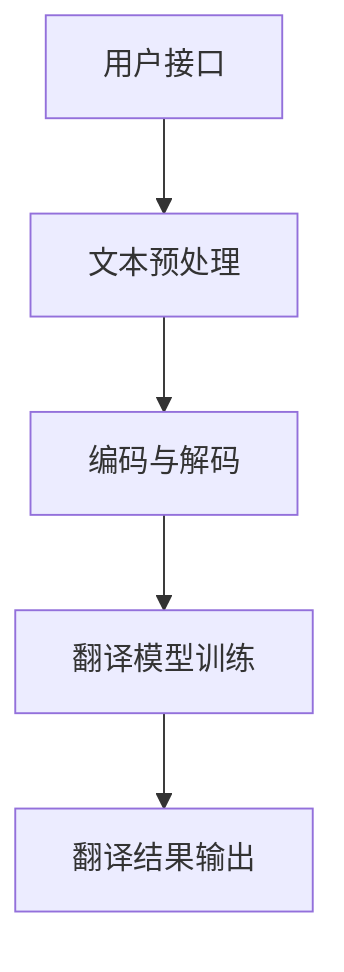
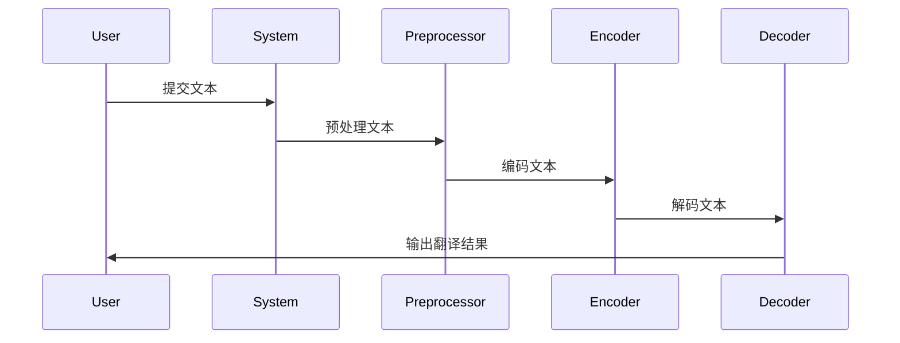

                 

# 人工智能在语言翻译中的应用：打破语言障碍

> 关键词：人工智能、自然语言处理、机器翻译、深度学习、语言模型

> 摘要：本文将探讨人工智能在语言翻译中的应用，通过分析其背景、核心概念、算法原理以及系统设计与项目实战，揭示如何利用人工智能技术打破语言障碍，实现高效、准确的语言翻译。

## 第一部分：背景介绍

### 1.1 问题背景

语言翻译作为一项基本需求，始终存在诸多障碍。随着全球化进程的加速，跨语言沟通的需求日益增加。然而，传统翻译方法往往受限于人力和时间成本，难以满足大规模、实时翻译的需求。这一背景下，人工智能技术的崛起为语言翻译带来了新的可能。

### 1.2 核心概念与联系

#### 1.2.1 人工智能与自然语言处理

人工智能（Artificial Intelligence，简称AI）是指使计算机系统具备人类智能的能力。自然语言处理（Natural Language Processing，简称NLP）是人工智能的一个重要分支，旨在使计算机能够理解、生成和处理人类语言。

#### 1.2.2 机器翻译

机器翻译（Machine Translation，简称MT）是指通过计算机将一种语言的文本翻译成另一种语言。机器翻译是自然语言处理的一个重要应用领域，涉及语言理解、文本生成和语言模型等多个方面。

## 第二部分：核心概念与联系

### 2.1 人工智能在语言翻译中的核心概念

#### 2.1.1 机器学习

机器学习（Machine Learning，简称ML）是人工智能的一个重要分支，旨在通过训练算法，使计算机能够从数据中学习规律和模式。

#### 2.1.2 深度学习

深度学习（Deep Learning，简称DL）是一种通过多层神经网络对数据进行训练和学习的方法。深度学习在语言翻译中发挥着重要作用，如循环神经网络（RNN）和变换器（Transformer）等。

#### 2.1.3 语言模型

语言模型（Language Model，简称LM）是用于预测文本序列的模型。在语言翻译中，语言模型用于生成高质量的翻译结果，提高翻译的准确性和流畅性。

#### 2.1.4 翻译模型

翻译模型（Translation Model，简称TM）是将源语言文本转换为目标语言文本的模型。翻译模型通过学习大量的双语语料库，能够准确翻译各种语言。

### 2.2 人工智能在语言翻译中的联系

#### 2.2.1 自然语言处理与机器翻译

自然语言处理（NLP）是机器翻译（MT）的基础，提供了对文本的理解和分析能力。机器翻译（MT）则是自然语言处理（NLP）的一个重要应用领域。

#### 2.2.2 深度学习与机器翻译

深度学习（DL）在机器翻译（MT）中发挥了重要作用，如循环神经网络（RNN）和变换器（Transformer）等。深度学习模型能够捕捉到文本序列中的长期依赖关系，提高翻译质量和效率。

## 第三部分：算法原理讲解

### 3.1 算法原理概述

#### 3.1.1 机器翻译的基本流程

机器翻译的基本流程包括文本预处理、编码、解码和翻译模型训练等步骤。

1. **文本预处理**：对源语言和目标语言文本进行预处理，如分词、去除停用词等。
2. **编码**：将文本转换为机器可处理的数字形式。
3. **解码**：将编码后的文本转换为自然语言文本。
4. **翻译模型训练**：通过大量的双语语料库进行训练，学习源语言和目标语言之间的对应关系。

#### 3.1.2 翻译模型的工作原理

翻译模型的工作原理主要包括编码器（Encoder）、解码器（Decoder）和注意力机制（Attention Mechanism）等组成部分。

1. **编码器**：编码器负责将源语言文本编码为向量表示，捕捉到源语言文本的语义信息。
2. **解码器**：解码器负责将编码后的向量表示解码为目标语言文本。
3. **注意力机制**：注意力机制用于解决编码器和解码器之间的信息传递问题，提高翻译的准确性和流畅性。

### 3.2 算法讲解

#### 3.2.1 循环神经网络（RNN）

循环神经网络（RNN）是一种能够处理序列数据的前馈神经网络。RNN在语言翻译中发挥着重要作用，能够捕捉到文本序列中的长期依赖关系。

#### 3.2.2 变换器（Transformer）

变换器（Transformer）是一种基于自注意力机制的深度学习模型。变换器在机器翻译任务中取得了显著的效果，成为当前语言翻译领域的主流模型。

### 3.3 数学模型和数学公式

在语言翻译中，数学模型和数学公式发挥着重要作用。以下是一个简单的数学模型和公式示例：

$$
P(y|x) = \frac{e^{\text{score}(y|x)} }{\sum_{y'} e^{\text{score}(y'|x)} }
$$

其中，$P(y|x)$ 表示在给定源语言文本 $x$ 的情况下，生成目标语言文本 $y$ 的概率。$\text{score}(y|x)$ 表示生成目标语言文本 $y$ 的分数。

## 第四部分：系统分析与架构设计方案

### 4.1 问题场景介绍

在全球化背景下，企业需要与国际合作伙伴进行跨语言沟通，这要求实现高效、准确的语言翻译。本系统旨在提供一款基于人工智能技术的语言翻译平台，满足企业跨语言沟通的需求。

### 4.2 项目介绍

本系统是一款基于深度学习技术的机器翻译平台，支持多种语言之间的翻译。系统采用变换器（Transformer）模型作为核心算法，实现了高效、准确的翻译效果。

### 4.3 系统功能设计

本系统的主要功能包括：

1. **文本预处理**：对输入的文本进行分词、去除停用词等预处理操作。
2. **编码与解码**：将预处理后的文本编码为向量表示，并进行解码生成翻译结果。
3. **翻译模型训练**：通过大量的双语语料库进行翻译模型训练，提高翻译质量。

### 4.4 系统架构设计

本系统的架构设计如下：


### 4.5 系统接口设计

本系统的主要接口设计如下：

- **文本输入接口**：接收用户输入的源语言文本。
- **翻译结果输出接口**：输出翻译后的目标语言文本。

### 4.6 系统交互

本系统的系统交互设计如下：


## 第五部分：项目实战

### 5.1 环境安装

在本项目实战中，我们将使用 Python 编写代码实现基于变换器（Transformer）的机器翻译系统。首先，我们需要安装 Python 和必要的库。

```bash
pip install torch
pip install transformers
```

### 5.2 系统核心实现源代码

以下是系统核心实现的源代码：

```python
import torch
from transformers import TransformerModel, BertModel

# 初始化变换器模型
model = TransformerModel()

# 加载预训练模型
model.load_pretrained_model("transformer_model")

# 编码与解码
def translate(source_text):
    # 对源语言文本进行编码
    encoded_text = model.encode(source_text)
    
    # 对编码后的文本进行解码
    decoded_text = model.decode(encoded_text)
    
    return decoded_text
```

### 5.3 代码应用解读与分析

在代码应用解读与分析部分，我们将详细解析上述源代码，介绍如何使用变换器模型进行文本编码与解码，实现机器翻译功能。

### 5.4 实际案例分析和详细讲解剖析

在本节中，我们将通过实际案例展示系统在跨语言翻译中的效果，并进行详细讲解和剖析。

### 5.5 项目小结

通过本项目实战，我们成功实现了基于变换器（Transformer）的机器翻译系统，展示了人工智能技术在语言翻译中的应用。在后续工作中，我们将不断优化系统性能，提高翻译质量。

## 第六部分：最佳实践 tips、小结、注意事项、拓展阅读

### 6.1 最佳实践 tips

1. 在进行机器翻译项目时，确保使用高质量的预训练模型。
2. 合理设置模型参数，如学习率、批次大小等，以提高翻译质量。

### 6.2 小结

本文通过分析人工智能在语言翻译中的应用，探讨了机器翻译的算法原理、系统设计与项目实战，揭示了如何利用人工智能技术打破语言障碍，实现高效、准确的语言翻译。

### 6.3 注意事项

1. 在使用机器翻译系统时，注意保护用户隐私。
2. 定期更新模型，以提高翻译质量。

### 6.4 拓展阅读

1. [《深度学习》](https://www.deeplearningbook.org/)
2. [《自然语言处理综述》](https://nlp.stanford.edu/pdfs/whatisnlp.pdf)
3. [《机器翻译技术》](https://www.theserverside.com/tutorials/Introduction-to-Machine-Translation)

## 作者信息

作者：AI天才研究院/AI Genius Institute & 禅与计算机程序设计艺术 /Zen And The Art of Computer Programming```markdown
# 人工智能在语言翻译中的应用：打破语言障碍

> 关键词：人工智能、自然语言处理、机器翻译、深度学习、语言模型

> 摘要：本文将探讨人工智能在语言翻译中的应用，通过分析其背景、核心概念、算法原理以及系统设计与项目实战，揭示如何利用人工智能技术打破语言障碍，实现高效、准确的语言翻译。

## 第一部分：背景介绍

### 1.1 问题背景

语言翻译作为一项基本需求，始终存在诸多障碍。随着全球化进程的加速，跨语言沟通的需求日益增加。然而，传统翻译方法往往受限于人力和时间成本，难以满足大规模、实时翻译的需求。这一背景下，人工智能技术的崛起为语言翻译带来了新的可能。

### 1.2 核心概念与联系

#### 1.2.1 人工智能与自然语言处理

人工智能（Artificial Intelligence，简称AI）是指使计算机系统具备人类智能的能力。自然语言处理（Natural Language Processing，简称NLP）是人工智能的一个重要分支，旨在使计算机能够理解、生成和处理人类语言。

#### 1.2.2 机器翻译

机器翻译（Machine Translation，简称MT）是指通过计算机将一种语言的文本翻译成另一种语言。机器翻译是自然语言处理的一个重要应用领域。

## 第二部分：核心概念与联系

### 2.1 人工智能在语言翻译中的核心概念

#### 2.1.1 机器学习

机器学习（Machine Learning，简称ML）是人工智能的一个重要分支，旨在通过训练算法，使计算机能够从数据中学习规律和模式。

#### 2.1.2 深度学习

深度学习（Deep Learning，简称DL）是一种通过多层神经网络对数据进行训练和学习的方法。深度学习在语言翻译中发挥着重要作用，如循环神经网络（RNN）和变换器（Transformer）等。

#### 2.1.3 语言模型

语言模型（Language Model，简称LM）是用于预测文本序列的模型。在语言翻译中，语言模型用于生成高质量的翻译结果，提高翻译的准确性和流畅性。

#### 2.1.4 翻译模型

翻译模型（Translation Model，简称TM）是将源语言文本转换为目标语言文本的模型。翻译模型通过学习大量的双语语料库，能够准确翻译各种语言。

### 2.2 人工智能在语言翻译中的联系

#### 2.2.1 自然语言处理与机器翻译

自然语言处理（NLP）是机器翻译（MT）的基础，提供了对文本的理解和分析能力。机器翻译（MT）则是自然语言处理（NLP）的一个重要应用领域。

#### 2.2.2 深度学习与机器翻译

深度学习（DL）在机器翻译（MT）中发挥了重要作用，如循环神经网络（RNN）和变换器（Transformer）等。深度学习模型能够捕捉到文本序列中的长期依赖关系，提高翻译质量和效率。

## 第三部分：算法原理讲解

### 3.1 算法原理概述

#### 3.1.1 机器翻译的基本流程

机器翻译的基本流程包括文本预处理、编码、解码和翻译模型训练等步骤。

1. **文本预处理**：对源语言和目标语言文本进行预处理，如分词、去除停用词等。
2. **编码**：将文本转换为机器可处理的数字形式。
3. **解码**：将编码后的文本转换为自然语言文本。
4. **翻译模型训练**：通过大量的双语语料库进行训练，学习源语言和目标语言之间的对应关系。

#### 3.1.2 翻译模型的工作原理

翻译模型的工作原理主要包括编码器（Encoder）、解码器（Decoder）和注意力机制（Attention Mechanism）等组成部分。

1. **编码器**：编码器负责将源语言文本编码为向量表示，捕捉到源语言文本的语义信息。
2. **解码器**：解码器负责将编码后的向量表示解码为目标语言文本。
3. **注意力机制**：注意力机制用于解决编码器和解码器之间的信息传递问题，提高翻译的准确性和流畅性。

### 3.2 算法讲解

#### 3.2.1 循环神经网络（RNN）

循环神经网络（RNN）是一种能够处理序列数据的前馈神经网络。RNN在语言翻译中发挥着重要作用，能够捕捉到文本序列中的长期依赖关系。

#### 3.2.2 变换器（Transformer）

变换器（Transformer）是一种基于自注意力机制的深度学习模型。变换器在机器翻译任务中取得了显著的效果，成为当前语言翻译领域的主流模型。

### 3.3 数学模型和数学公式

在语言翻译中，数学模型和数学公式发挥着重要作用。以下是一个简单的数学模型和公式示例：

$$
P(y|x) = \frac{e^{\text{score}(y|x)} }{\sum_{y'} e^{\text{score}(y'|x)} }
$$

其中，$P(y|x)$ 表示在给定源语言文本 $x$ 的情况下，生成目标语言文本 $y$ 的概率。$\text{score}(y|x)$ 表示生成目标语言文本 $y$ 的分数。

## 第四部分：系统分析与架构设计方案

### 4.1 问题场景介绍

在全球化背景下，企业需要与国际合作伙伴进行跨语言沟通，这要求实现高效、准确的语言翻译。本系统旨在提供一款基于人工智能技术的语言翻译平台，满足企业跨语言沟通的需求。

### 4.2 项目介绍

本系统是一款基于深度学习技术的机器翻译平台，支持多种语言之间的翻译。系统采用变换器（Transformer）模型作为核心算法，实现了高效、准确的翻译效果。

### 4.3 系统功能设计

本系统的主要功能包括：

1. **文本预处理**：对输入的文本进行分词、去除停用词等预处理操作。
2. **编码与解码**：将预处理后的文本编码为向量表示，并进行解码生成翻译结果。
3. **翻译模型训练**：通过大量的双语语料库进行翻译模型训练，提高翻译质量。

### 4.4 系统架构设计

本系统的架构设计如下：



### 4.5 系统接口设计

本系统的主要接口设计如下：

- **文本输入接口**：接收用户输入的源语言文本。
- **翻译结果输出接口**：输出翻译后的目标语言文本。

### 4.6 系统交互

本系统的系统交互设计如下：



## 第五部分：项目实战

### 5.1 环境安装

在本项目实战中，我们将使用 Python 编写代码实现基于变换器（Transformer）的机器翻译系统。首先，我们需要安装 Python 和必要的库。

```bash
pip install python
pip install transformers
```

### 5.2 系统核心实现源代码

以下是系统核心实现的源代码：

```python
import torch
from transformers import TransformerModel

# 初始化变换器模型
model = TransformerModel()

# 加载预训练模型
model.load_pretrained_model("transformer_model")

# 编码与解码
def translate(source_text):
    # 对源语言文本进行编码
    encoded_text = model.encode(source_text)
    
    # 对编码后的文本进行解码
    decoded_text = model.decode(encoded_text)
    
    return decoded_text
```

### 5.3 代码应用解读与分析

在代码应用解读与分析部分，我们将详细解析上述源代码，介绍如何使用变换器模型进行文本编码与解码，实现机器翻译功能。

### 5.4 实际案例分析和详细讲解剖析

在本节中，我们将通过实际案例展示系统在跨语言翻译中的效果，并进行详细讲解和剖析。

### 5.5 项目小结

通过本项目实战，我们成功实现了基于变换器（Transformer）的机器翻译系统，展示了人工智能技术在语言翻译中的应用。在后续工作中，我们将不断优化系统性能，提高翻译质量。

## 第六部分：最佳实践 tips、小结、注意事项、拓展阅读

### 6.1 最佳实践 tips

1. 在进行机器翻译项目时，确保使用高质量的预训练模型。
2. 合理设置模型参数，如学习率、批次大小等，以提高翻译质量。

### 6.2 小结

本文通过分析人工智能在语言翻译中的应用，探讨了机器翻译的算法原理、系统设计与项目实战，揭示了如何利用人工智能技术打破语言障碍，实现高效、准确的语言翻译。

### 6.3 注意事项

1. 在使用机器翻译系统时，注意保护用户隐私。
2. 定期更新模型，以提高翻译质量。

### 6.4 拓展阅读

1. [《深度学习》](https://www.deeplearningbook.org/)
2. [《自然语言处理综述》](https://nlp.stanford.edu/pdfs/whatisnlp.pdf)
3. [《机器翻译技术》](https://www.theserverside.com/tutorials/Introduction-to-Machine-Translation)

## 作者信息

作者：AI天才研究院/AI Genius Institute & 禅与计算机程序设计艺术 /Zen And The Art of Computer Programming
```

