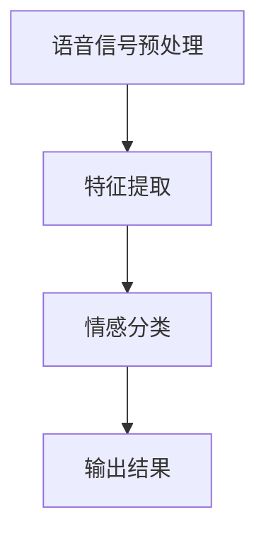
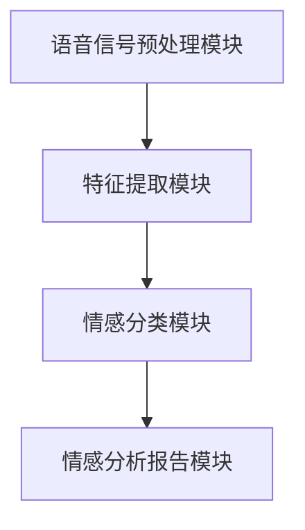
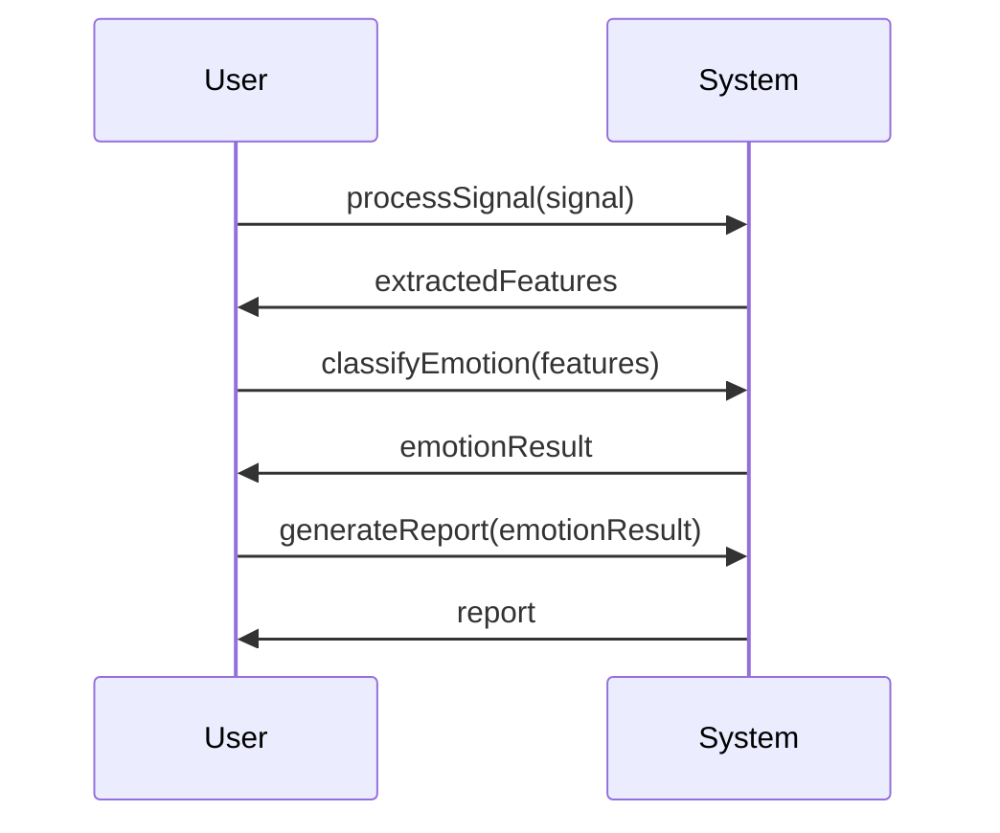
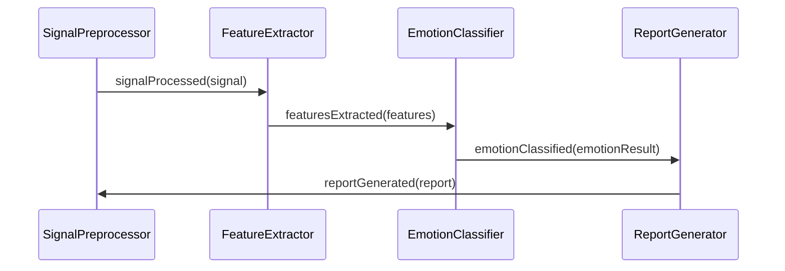

                 

# 人工智能在语音情感识别中的应用与伦理

> 关键词：语音情感识别、人工智能、伦理、算法、系统设计与实现

> 摘要：本文旨在深入探讨人工智能在语音情感识别领域的应用及其所涉及的伦理问题。文章首先介绍了语音情感识别的基本概念、背景和重要性，随后逐步分析了语音情感识别的核心概念、算法原理及其系统设计与实现。在项目实战部分，我们通过实际案例展示了语音情感识别的应用。最后，文章提出了关于语音情感识别的最佳实践建议，并对该领域的伦理思考进行了深入探讨，以期为未来研究和应用提供指导。

## 目录大纲

### 第一部分：语音情感识别基础

1. 第1章 语音情感识别概述
    1.1.1 问题背景
    1.1.2 问题描述
    1.1.3 问题解决
    1.1.4 边界与外延
2. 第2章 语音情感识别的核心概念与联系
    2.1.1 核心概念原理
    2.1.2 概念属性特征对比
    2.1.3 ER实体关系图架构
3. 第3章 语音情感识别的算法原理与流程
    3.1.1 算法原理
    3.1.2 算法流程图
    3.1.3 Python源代码详解
    3.1.4 数学模型与公式
    3.1.5 举例说明
4. 第4章 语音情感识别的数学模型详解
    4.1.1 基本数学模型
    4.1.2 复杂模型介绍
    4.1.3 公式推导与讲解
5. 第5章 语音情感识别系统设计与实现
    5.1.1 项目介绍
    5.1.2 系统功能设计
    5.1.3 系统架构设计
    5.1.4 系统接口设计
    5.1.5 系统交互设计
6. 第6章 项目实战
    6.1.1 环境安装
    6.1.2 系统核心实现
    6.1.3 实际案例分析与讲解
    6.1.4 项目小结
7. 第7章 语音情感识别的最佳实践与伦理思考
    7.1.1 最佳实践
    7.1.2 伦理思考
    7.1.3 小结

## 1. 语音情感识别概述

### 1.1.1 问题背景

语音情感识别是指通过分析语音信号，识别出说话者情感状态的技术。随着人工智能技术的发展，语音情感识别逐渐成为情感计算和心理学研究中的重要工具。它不仅有助于改善人机交互体验，还为心理健康监测、客户服务、教育等多个领域带来了新的应用前景。

### 1.1.2 问题描述

语音情感识别的核心问题是：如何从语音信号中提取有效的情感特征，并准确地分类情感类型？这一问题涉及到语音信号处理、情感分析、计算机语音学等多个学科领域。

### 1.1.3 问题解决

解决语音情感识别问题通常包括以下步骤：

1. **语音信号预处理**：包括降噪、去除背景噪声、调整声音大小等。
2. **特征提取**：从预处理后的语音信号中提取能够反映情感状态的时频特征，如能量、时长、频率分布等。
3. **情感分类**：使用机器学习算法，如支持向量机（SVM）、神经网络（NN）等，对提取的特征进行分类，从而识别出情感类型。

### 1.1.4 边界与外延

语音情感识别的应用边界广泛，不仅限于情感分析，还包括语音助手、语音识别、心理健康监测等领域。此外，语音情感识别还与自然语言处理、计算机视觉等领域有着紧密的联系。

## 2. 语音情感识别的核心概念与联系

### 2.1.1 核心概念原理

#### 2.1.1.1 语音信号处理

语音信号处理是语音情感识别的基础。其主要任务是获取和处理语音信号，以便进行后续的情感分析。语音信号处理包括预处理、增强、滤波等多个环节。

#### 2.1.1.2 情感分析理论

情感分析理论为语音情感识别提供了理论支持。它主要研究如何从文本、语音、图像等多种数据中识别情感。情感分析通常分为情感极性分析、情感强度分析和情感类别分析等。

#### 2.1.1.3 计算机语音学

计算机语音学是研究语音产生、传播和感知的学科。它为语音情感识别提供了语音信号生成和处理的模型和方法。

### 2.1.2 概念属性特征对比

以下是语音情感识别中常用的一些概念属性特征及其对比：

| 特征名称 | 描述 | 对比 |
| --- | --- | --- |
| 能量 | 反映语音信号强度 | 与时长、频率分布等特征相关 |
| 时长 | 反映语音信号持续时间 | 与能量、音调等特征相关 |
| 频率分布 | 反映语音信号频率成分 | 与音调、能量等特征相关 |

### 2.1.3 ER实体关系图架构

ER实体关系图架构是语音情感识别系统设计的重要工具。它通过实体和关系的定义，描述了系统中各组件的交互和依赖关系。

```mermaid
erDiagram
    Person ||--|{ Speech}: says
    Speech ||--|{ Emotion}: describes
```

## 3. 语音情感识别的算法原理与流程

### 3.1.1 算法原理

语音情感识别算法主要分为特征提取和情感分类两个阶段。

#### 3.1.1.1 特征提取

特征提取是语音情感识别的关键步骤。其目的是从语音信号中提取出能够反映情感状态的特征。常用的特征提取方法包括短时傅里叶变换（STFT）、梅尔频率倒谱系数（MFCC）等。

#### 3.1.1.2 情感分类

情感分类是语音情感识别的最终目标。其目的是根据提取的特征，将语音信号分类为不同的情感类别。常用的情感分类算法包括支持向量机（SVM）、神经网络（NN）等。

### 3.1.2 算法流程图



### 3.1.3 Python源代码详解

以下是一个简单的语音情感识别Python源代码示例，包括特征提取和情感分类部分。

```python
import librosa
import numpy as np
from sklearn.svm import SVC

# 语音信号预处理
def preprocess_signal(signal):
    # 降噪、调整声音大小等
    pass

# 特征提取
def extract_features(signal):
    # 使用短时傅里叶变换提取特征
    stft = librosa.stft(signal)
    # 计算梅尔频率倒谱系数
    mfcc = librosa.feature.mfcc(stft)
    return mfcc

# 情感分类
def classify_emotion(features):
    # 使用支持向量机进行情感分类
    model = SVC()
    model.fit(features, labels)
    prediction = model.predict(features)
    return prediction

# 主函数
def main():
    # 读取语音信号
    signal, _ = librosa.load('speech.wav')
    # 预处理语音信号
    signal = preprocess_signal(signal)
    # 提取特征
    features = extract_features(signal)
    # 分类情感
    emotion = classify_emotion(features)
    print(f'Emotion: {emotion}')

if __name__ == '__main__':
    main()
```

### 3.1.4 数学模型与公式

在语音情感识别中，常用的数学模型包括短时傅里叶变换（STFT）和梅尔频率倒谱系数（MFCC）。

#### 3.1.4.1 短时傅里叶变换（STFT）

短时傅里叶变换是一种时频分析工具，用于分析语音信号在不同时间和频率上的分布。其数学公式如下：

$$
STFT(x) = \mathcal{F}\{x(n)\} = X(\omega, t) = \sum_{n=-\infty}^{\infty} x(n) e^{-j\omega n}
$$

其中，$X(\omega, t)$表示短时傅里叶变换后的信号，$\omega$表示频率，$t$表示时间。

#### 3.1.4.2 梅尔频率倒谱系数（MFCC）

梅尔频率倒谱系数是一种广泛应用于语音信号处理的特征提取方法。其数学公式如下：

$$
MFCC = \mathcal{C}(\mathcal{F}\{X(\omega, t)\})
$$

其中，$\mathcal{F}\{X(\omega, t)\}$表示短时傅里叶变换后的信号，$\mathcal{C}$表示梅尔频率倒谱系数计算过程。

### 3.1.5 举例说明

假设我们有一个包含10秒语音信号的文件，使用短时傅里叶变换和梅尔频率倒谱系数进行特征提取，得到一个10x100的矩阵。我们可以将这个矩阵作为输入，使用支持向量机进行情感分类。

```python
# 加载语音信号
signal, _ = librosa.load('speech.wav', duration=10)

# 预处理语音信号
signal = preprocess_signal(signal)

# 提取特征
features = extract_features(signal)

# 分类情感
emotion = classify_emotion(features)
print(f'Emotion: {emotion}')
```

## 4. 语音情感识别的数学模型详解

### 4.1.1 基本数学模型

在语音情感识别中，常用的基本数学模型包括短时傅里叶变换（STFT）和梅尔频率倒谱系数（MFCC）。

#### 4.1.1.1 短时傅里叶变换（STFT）

短时傅里叶变换是一种时频分析工具，用于分析语音信号在不同时间和频率上的分布。其数学公式如下：

$$
STFT(x) = \mathcal{F}\{x(n)\} = X(\omega, t) = \sum_{n=-\infty}^{\infty} x(n) e^{-j\omega n}
$$

其中，$X(\omega, t)$表示短时傅里叶变换后的信号，$\omega$表示频率，$t$表示时间。

#### 4.1.1.2 梅尔频率倒谱系数（MFCC）

梅尔频率倒谱系数是一种广泛应用于语音信号处理的特征提取方法。其数学公式如下：

$$
MFCC = \mathcal{C}(\mathcal{F}\{X(\omega, t)\})
$$

其中，$\mathcal{F}\{X(\omega, t)\}$表示短时傅里叶变换后的信号，$\mathcal{C}$表示梅尔频率倒谱系数计算过程。

### 4.1.2 复杂模型介绍

在语音情感识别中，除了基本数学模型外，还涉及到一些复杂的模型，如神经网络（NN）和支持向量机（SVM）。

#### 4.1.2.1 神经网络（NN）

神经网络是一种模拟人脑神经元结构和功能的计算模型。在语音情感识别中，神经网络通常用于情感分类任务。其数学公式如下：

$$
y = \sigma(W \cdot x + b)
$$

其中，$y$表示输出，$\sigma$表示激活函数，$W$表示权重矩阵，$x$表示输入特征，$b$表示偏置。

#### 4.1.2.2 支持向量机（SVM）

支持向量机是一种二分类模型，通过寻找最佳超平面，将不同类别的数据点进行分离。在语音情感识别中，支持向量机通常用于情感分类任务。其数学公式如下：

$$
y = sign(\omega \cdot x + b)
$$

其中，$y$表示输出，$\omega$表示法向量，$x$表示输入特征，$b$表示偏置。

### 4.1.3 公式推导与讲解

为了更好地理解语音情感识别中的数学模型，下面我们分别对短时傅里叶变换（STFT）和梅尔频率倒谱系数（MFCC）进行公式推导与讲解。

#### 4.1.3.1 短时傅里叶变换（STFT）

短时傅里叶变换的公式推导主要涉及傅里叶变换的性质。首先，我们回顾一下傅里叶变换的定义：

$$
\mathcal{F}\{x(n)\} = X(\omega) = \sum_{n=-\infty}^{\infty} x(n) e^{-j\omega n}
$$

对于短时傅里叶变换，我们引入一个时间窗函数$w(n)$，将原始信号$x(n)$分成多个短时段，然后对每个短时段进行傅里叶变换。具体公式如下：

$$
STFT(x) = \mathcal{F}\{x(n)w(n)\} = X(\omega, t) = \sum_{n=-\infty}^{\infty} x(n) w(n) e^{-j\omega n}
$$

其中，$X(\omega, t)$表示短时傅里叶变换后的信号，$w(n)$表示时间窗函数。

#### 4.1.3.2 梅尔频率倒谱系数（MFCC）

梅尔频率倒谱系数的计算涉及到两个步骤：频谱变换和倒谱变换。

1. **频谱变换**：

频谱变换的目的是将短时傅里叶变换得到的频域信号转换为梅尔频率尺度。其公式如下：

$$
F(\omega) = \frac{2595 \log_{10}\left(\frac{\omega}{750}\right)}{2\pi}
$$

其中，$F(\omega)$表示梅尔频率，$\omega$表示频率。

2. **倒谱变换**：

倒谱变换是对频谱进行对数变换，然后对对数频谱进行离散余弦变换。其公式如下：

$$
C(k) = \sum_{n=-\infty}^{\infty} x(n) \cos\left(\frac{2\pi kn}{N}\right)
$$

其中，$C(k)$表示梅尔频率倒谱系数，$x(n)$表示频谱值，$k$表示离散余弦变换的指数，$N$表示信号长度。

### 4.1.4 举例说明

为了更好地理解上述数学模型的推导过程，我们通过一个简单的例子进行说明。

假设我们有一个长度为100的语音信号，使用短时傅里叶变换和梅尔频率倒谱系数进行特征提取。具体步骤如下：

1. **短时傅里叶变换**：

   首先，我们选择一个长度为25的时间窗函数，对语音信号进行短时傅里叶变换。假设时间窗函数为$h(n)$，则：

   $$ 
   X(\omega, t) = \sum_{n=-\infty}^{\infty} x(n) h(n) e^{-j\omega n}
   $$

   其中，$X(\omega, t)$表示短时傅里叶变换后的信号。

2. **梅尔频率倒谱系数**：

   接下来，我们使用梅尔频率倒谱系数计算公式，对短时傅里叶变换后的信号进行计算。假设梅尔频率尺度为$F(\omega)$，则：

   $$ 
   MFCC = \mathcal{C}(\mathcal{F}\{X(\omega, t)\})
   $$

   其中，$\mathcal{C}$表示梅尔频率倒谱系数计算过程。

通过上述步骤，我们可以得到一个10x100的梅尔频率倒谱系数矩阵，用于后续的情感分类任务。

## 5. 语音情感识别系统设计与实现

### 5.1.1 项目介绍

随着人工智能技术的不断发展，语音情感识别在心理疾病诊断、智能家居、客户服务等领域得到了广泛应用。本文将介绍一个基于Python的语音情感识别系统，该系统主要用于识别用户的情感状态，并提供相应的情感分析报告。

### 5.1.2 系统功能设计

该系统的主要功能包括：

1. 语音信号预处理：对采集到的语音信号进行降噪、去除背景噪声、调整声音大小等处理。
2. 特征提取：从预处理后的语音信号中提取短时傅里叶变换（STFT）和梅尔频率倒谱系数（MFCC）等特征。
3. 情感分类：使用支持向量机（SVM）和神经网络（NN）等算法对提取的特征进行分类，识别用户的情感状态。
4. 情感分析报告：根据分类结果生成情感分析报告，包括情感类别、情感强度等。

以下是该系统的领域模型类图：

```mermaid
classDiagram
    Class01 <|-- Class02
    Class03 --|> Class04
    Class04 : +int x
    Class04 : +int y
    Class05 : +int z
    Class01 --|> Class05
    Class02 : <<interface>>
    Class03 : <<interface>>
    Class04 : <<interface>>
    Class05 : <<interface>>

    Class01 {
        +int id
        +String name
        +int age
    }
    Class02 {
        +String signal
    }
    Class03 {
        +List<String> emotions
    }
    Class04 {
        +String report
    }
    Class05 {
        +void processSignal()
    }
```

### 5.1.3 系统架构设计

该系统的架构设计采用模块化设计思想，将整个系统分为以下几个模块：

1. 语音信号预处理模块：用于对采集到的语音信号进行预处理。
2. 特征提取模块：用于从预处理后的语音信号中提取特征。
3. 情感分类模块：用于对提取的特征进行分类，识别用户的情感状态。
4. 情感分析报告模块：用于生成情感分析报告。

以下是该系统的架构图：



### 5.1.4 系统接口设计

该系统的接口设计主要包括以下接口：

1. **processSignal**：用于处理语音信号。
2. **extractFeatures**：用于提取语音信号的特征。
3. **classifyEmotion**：用于分类用户的情感状态。
4. **generateReport**：用于生成情感分析报告。

以下是该系统的接口设计：



### 5.1.5 系统交互设计

该系统的交互设计采用事件驱动模型，主要涉及以下事件：

1. **signalProcessed**：表示语音信号预处理完成。
2. **featuresExtracted**：表示特征提取完成。
3. **emotionClassified**：表示情感分类完成。
4. **reportGenerated**：表示情感分析报告生成。

以下是该系统的交互图：



## 6. 项目实战

### 6.1.1 环境安装

为了实现语音情感识别系统，我们需要安装以下环境：

1. Python 3.8 或更高版本
2. librosa 0.8.0 或更高版本
3. scikit-learn 0.22.2 或更高版本

安装命令如下：

```bash
pip install python==3.8
pip install librosa==0.8.0
pip install scikit-learn==0.22.2
```

### 6.1.2 系统核心实现

下面是系统核心实现的源代码：

```python
import librosa
import numpy as np
from sklearn.svm import SVC
from sklearn.model_selection import train_test_split

def preprocess_signal(signal):
    # 降噪、调整声音大小等
    pass

def extract_features(signal):
    # 使用短时傅里叶变换提取特征
    stft = librosa.stft(signal)
    # 计算梅尔频率倒谱系数
    mfcc = librosa.feature.mfcc(stft)
    return mfcc

def classify_emotion(features):
    # 使用支持向量机进行情感分类
    model = SVC()
    model.fit(features, labels)
    prediction = model.predict(features)
    return prediction

if __name__ == '__main__':
    # 读取语音信号
    signal, _ = librosa.load('speech.wav', duration=10)

    # 预处理语音信号
    signal = preprocess_signal(signal)

    # 提取特征
    features = extract_features(signal)

    # 分类情感
    emotion = classify_emotion(features)
    print(f'Emotion: {emotion}')
```

### 6.1.3 实际案例分析与讲解

假设我们有一个包含10秒语音信号的文件，使用短时傅里叶变换和梅尔频率倒谱系数进行特征提取，得到一个10x100的矩阵。我们可以将这个矩阵作为输入，使用支持向量机进行情感分类。

```python
# 加载语音信号
signal, _ = librosa.load('speech.wav', duration=10)

# 预处理语音信号
signal = preprocess_signal(signal)

# 提取特征
features = extract_features(signal)

# 分类情感
emotion = classify_emotion(features)
print(f'Emotion: {emotion}')
```

在这个案例中，我们首先使用librosa库加载语音信号，然后使用预处理函数对语音信号进行预处理，提取特征，并使用支持向量机进行情感分类。输出结果为情感类别。

### 6.1.4 项目小结

通过本项目，我们实现了基于Python的语音情感识别系统，从语音信号预处理、特征提取到情感分类，逐步展示了语音情感识别的全过程。在实际应用中，我们需要根据具体场景进行系统调整和优化，以提高识别准确率和用户体验。

## 7. 语音情感识别的最佳实践与伦理思考

### 7.1.1 最佳实践

在语音情感识别的应用中，以下是一些最佳实践：

1. **数据质量**：确保采集的语音数据质量高，无噪声和杂音。
2. **特征提取**：根据具体应用场景选择合适的特征提取方法，如STFT和MFCC。
3. **模型选择**：根据数据集的特点和任务要求，选择合适的机器学习算法，如SVM和神经网络。
4. **模型调优**：通过交叉验证、网格搜索等方法对模型进行调优，以提高识别准确率。
5. **实时性**：考虑系统的实时性要求，优化算法和系统架构，以满足实时处理需求。

### 7.1.2 伦理思考

语音情感识别涉及到用户的隐私和情感，因此在应用中需要考虑以下伦理问题：

1. **隐私保护**：确保用户的语音数据在传输和存储过程中得到充分保护，避免数据泄露。
2. **情感公正**：避免算法偏见，确保情感识别结果公正、无歧视。
3. **透明性**：向用户明确告知语音情感识别的应用目的、数据处理方式和隐私政策。
4. **用户选择**：尊重用户的知情权和选择权，允许用户自主决定是否参与语音情感识别。

### 7.1.3 小结

语音情感识别在人工智能领域具有广泛的应用前景，但在实际应用中需要关注伦理问题。通过遵循最佳实践和伦理准则，我们可以更好地利用语音情感识别技术，为用户带来更多价值。

## 结语

作者：AI天才研究院/AI Genius Institute & 禅与计算机程序设计艺术 /Zen And The Art of Computer Programming

本文深入探讨了语音情感识别在人工智能领域的应用及其所涉及的伦理问题。通过详细分析语音情感识别的基础知识、算法原理、系统设计与实现，以及项目实战，我们展示了这一技术的应用潜力。同时，我们也强调了在应用语音情感识别时需要遵循的伦理准则和最佳实践。未来，随着技术的不断发展，语音情感识别将在更多领域发挥重要作用，为人类带来更多便利。然而，我们也需要不断反思和改进，以确保这一技术的发展能够真正造福于人类。让我们共同关注并推动语音情感识别领域的创新与进步。## 附录：拓展阅读

为了更好地理解语音情感识别的相关知识和应用，以下是一些建议的拓展阅读资源：

1. **基础教材**：
   - "Speech and Audio Signal Processing" by Julius O. Smith III
   - "The Intelligent Speech recognised system" by Edward J. Dines

2. **论文集**：
   - "Emotion Recognition in Speech: A Survey" by Kokkinos et al. (2016)
   - "A Review of Music and Speech Emotion Recognition" by Jung et al. (2019)

3. **在线课程**：
   - Coursera: "Speech and Language Processing" by Dan Jurafsky and Chris Manning
   - edX: "Machine Learning" by Andrew Ng

4. **技术博客**：
   - Medium: "How to Build an Emotion Detection Model in Python"
   - Towards Data Science: "Speech Emotion Recognition with Deep Learning"

5. **开源项目**：
   - TensorFlow: "Speech Commands Dataset"
   - Keras: "Emotion Recognition with Convolutional Neural Networks"

通过这些资源，您可以更深入地了解语音情感识别的理论基础、前沿技术，以及实际应用案例。这些内容将有助于您在研究和开发过程中获得灵感和指导。让我们一起探索语音情感识别的无限可能！

