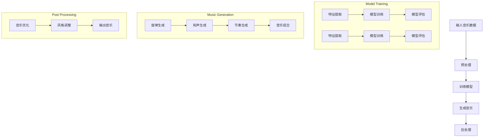
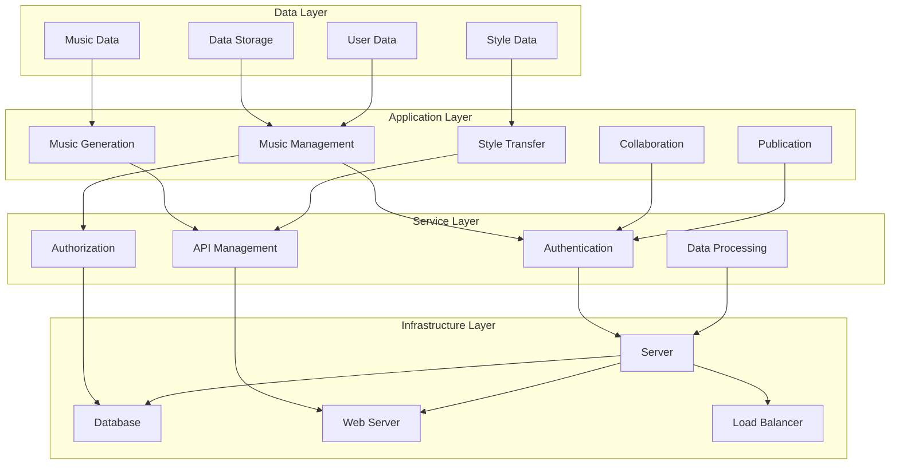
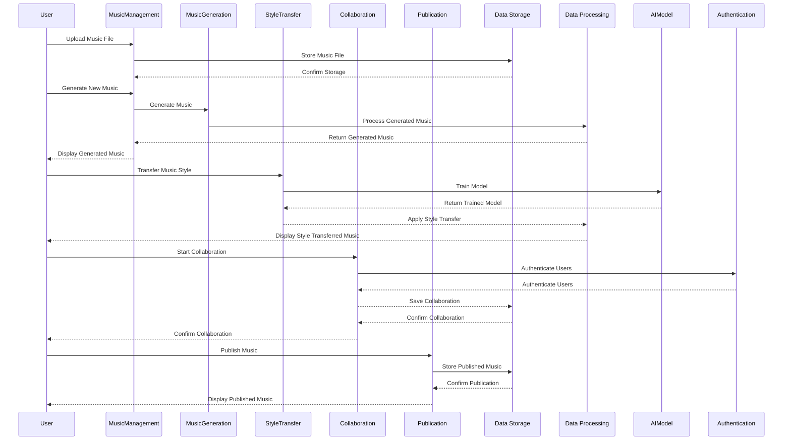

                 

### 1. 引言

#### 1.1 问题背景

音乐作为人类情感和思维表达的重要方式，自古以来就扮演着不可或缺的角色。然而，随着科技的发展，传统音乐创作的方式正在经历深刻的变革。在当今这个信息爆炸的时代，音乐创作者面临的挑战日益增多，包括如何快速生成创意、如何处理大量的音乐素材、如何在海量音乐作品中脱颖而出等。此外，传统音乐创作往往依赖于个人的经验和直觉，这种方式的局限性也逐渐显现，难以满足日益复杂和多元化的音乐创作需求。

人工智能（AI）技术的发展为音乐创作带来了全新的可能性。通过机器学习和深度学习等技术，AI可以分析和理解大量的音乐数据，从中提取规律和模式，进而辅助音乐创作者生成新的音乐作品。这不仅能够提高音乐创作的效率，还能够拓展音乐创作的边界，带来前所未有的艺术创新。

本文旨在探讨人工智能在音乐创作中的应用，分析其在辅助艺术创新方面的潜力与挑战，并展望未来的发展趋势。文章将按照以下结构展开：

1. 引言：介绍背景问题和研究意义。
2. 核心概念与联系：阐述人工智能音乐创作的基本概念和原理。
3. 人工智能音乐创作算法：详细讲解算法原理和实现。
4. 音乐创作系统架构设计：分析系统架构和接口设计。
5. 实际应用案例分析：介绍具体应用场景和实现细节。
6. 总结与展望：总结研究成果，提出未来发展方向。

#### 1.2 问题解决

为了解决音乐创作中的挑战，人工智能提供了多种解决方案：

- **创意生成**：AI可以通过分析大量的音乐作品，学习并模仿不同的音乐风格和创作技巧，从而帮助创作者快速生成新的音乐创意。
- **自动化作曲**：利用生成对抗网络（GAN）等深度学习模型，AI可以生成完整的音乐作品，甚至包括旋律、和声、节奏等各个方面。
- **音乐风格迁移**：通过训练神经网络模型，AI可以将一种音乐风格转换成另一种风格，从而创造出独特的音乐效果。
- **音乐编辑和优化**：AI可以自动分析和优化音乐作品的旋律、和声和节奏，帮助创作者提高作品的质量和表现力。
- **协同创作**：AI可以作为音乐创作者的助手，与人类音乐家实时协作，共同完成音乐创作。

这些技术为音乐创作提供了新的工具和方法，使得音乐创作过程更加高效和多样化。然而，AI在音乐创作中的应用也面临着一系列挑战，包括如何在尊重原创性的前提下进行创新、如何确保音乐作品的艺术性和情感表达等。本文将在后续章节中详细探讨这些问题。

#### 1.3 边界与外延

在探讨人工智能音乐创作时，我们需要明确其边界和适用范围。首先，人工智能在音乐创作中的应用主要集中在辅助创作，而非完全替代人类音乐家。AI生成的音乐作品通常是基于人类音乐经验和情感的，但它们无法完全替代人类对音乐深层次的理解和表达。

其次，人工智能音乐创作适用于多种音乐风格和形式，包括流行音乐、古典音乐、电子音乐等。然而，不同风格和形式对音乐创作的需求和技术实现有所不同，需要针对具体场景进行优化和调整。

最后，人工智能音乐创作的发展也受到数据资源、计算能力、算法优化等因素的限制。随着这些技术的不断进步，AI在音乐创作中的应用将会更加广泛和深入，带来更多的艺术创新和产业变革。

### 2. 核心概念与联系

在深入探讨人工智能音乐创作之前，我们首先需要了解一些核心概念，这些概念构成了AI音乐创作的基础。以下是几个关键术语的定义、联系及其在音乐创作中的角色。

#### 2.1 人工智能音乐创作概述

**人工智能（AI）**：人工智能是指通过计算机模拟人类智能的技术，包括学习、推理、感知、决策等多个方面。在音乐创作中，AI主要利用机器学习和深度学习算法来分析和生成音乐。

**音乐创作（Composition）**：音乐创作是指通过旋律、和声、节奏等元素组合成音乐作品的过程。在AI音乐创作中，这些元素由算法自动生成或优化。

**音乐生成（Music Generation）**：音乐生成是指通过算法自动生成音乐的过程。这包括生成旋律、和声、节奏等各个组成部分。

**音乐风格（Style）**：音乐风格是指特定类型的音乐特征，如流行音乐、古典音乐、电子音乐等。AI可以学习和模仿不同的音乐风格，以生成多样化的音乐作品。

#### 2.2 核心概念原理

**深度学习（Deep Learning）**：深度学习是机器学习的一个分支，通过多层神经网络来提取数据特征。在音乐创作中，深度学习模型可以自动学习音乐数据中的复杂模式和结构，从而生成新的音乐作品。

**生成对抗网络（GAN）**：生成对抗网络是由生成器和判别器组成的模型。生成器尝试生成与真实音乐相似的旋律，判别器则判断生成的旋律是否真实。通过这种对抗训练，GAN可以生成高质量的、多样化的音乐作品。

**自动编码器（Autoencoder）**：自动编码器是一种无监督学习算法，通过编码器将输入数据压缩成较低维度的特征表示，然后通过解码器还原原始数据。在音乐创作中，自动编码器可以用来学习音乐数据的特征，进而生成新的音乐。

**递归神经网络（RNN）**：递归神经网络是一种能够处理序列数据的人工神经网络。在音乐创作中，RNN可以学习音乐序列中的时间依赖性，生成连贯的旋律和节奏。

#### 2.3 概念属性特征对比表格

为了更清晰地展示这些核心概念的属性特征，我们可以制作一个对比表格（使用Mermaid流程图表示）：

```mermaid
graph TB

A[AI音乐创作]
B[深度学习]
C[生成对抗网络]
D[自动编码器]
E[RNN]

A-->B
A-->C
A-->D
A-->E

classDef key1 fill:#f9f9f9,stroke:none
classDef key2 fill:#c4c4c4,stroke:none
classDef key3 fill:#a8a8a8,stroke:none

B(keys(key1,key2,key3))
C(keys(key1,key2,key3))
D(keys(key1,key2,key3))
E(keys(key1,key2,key3))

B(Technique)
C(Model)
D[Algorithm]
E[Network]

subgraph Attributes
    B1[特征提取]
    B2[层次结构]
    B3[对抗性]
    B4[压缩编码]
    B5[序列处理]
    
    B1-->B2
    B1-->B3
    B2-->B4
    B3-->B5
end

subgraph AI Music Composition
    A1[音乐生成]
    A2[风格模仿]
    A3[自动编辑]
    
    A-->A1
    A-->A2
    A-->A3
end
```

#### 2.4 ER实体关系图架构

在音乐创作系统中，实体关系图（ER图）可以帮助我们理解系统中的核心实体及其相互关系。以下是音乐创作系统的ER图（使用Mermaid流程图表示）：

```mermaid
erDiagram
  MusicData ||--|{ MusicStyle } : "包含多种风格"
  MusicData ||--|{ MusicPiece } : "一首音乐作品包含多个片段"
  MusicPiece ||--|{ Note } : "一个片段包含多个音符"
  MusicPiece ||--|{ Chord } : "一个片段包含多个和弦"
  MusicPiece ||--|{ Tempo } : "速度信息"
  
  Note ||--|{ Pitch } : "音高信息"
  Note ||--|{ Duration } : "时长信息"
  
  Chord ||--|{ Note } : "和弦包含多个音符"
  
  MusicStyle : "风格名称"
  MusicPiece : "作品名称"
  MusicData : "音乐数据"
  Note : "音符"
  Tempo : "速度"
  Pitch : "音高"
  Duration : "时长"
```

通过这些核心概念、原理、对比表格和ER图，我们为后续深入探讨人工智能音乐创作的算法原理、系统架构和应用案例奠定了基础。

### 3. 人工智能音乐创作算法

#### 3.1 算法原理讲解

人工智能在音乐创作中的应用，主要依赖于一系列复杂的算法和模型。以下将详细讲解几种主要的算法原理，并使用Mermaid流程图和Python源代码来辅助说明。

##### 3.1.1 Mermaid流程图

首先，我们可以通过Mermaid流程图来概述人工智能音乐创作的基本流程。以下是一个简化的流程图：



这个流程图展示了从输入音乐数据到生成音乐作品的全过程，包括预处理、模型训练、音乐生成和后处理四个主要阶段。

##### 3.1.2 Python源代码

为了更好地理解算法的实现，我们可以给出一个简单的Python示例代码。以下是一个基于递归神经网络（RNN）的自动编码器模型，用于音乐生成。

```python
import numpy as np
import tensorflow as tf
from tensorflow.keras.layers import LSTM, Dense
from tensorflow.keras.models import Sequential

# 参数设置
latent_dim = 32
n_steps = 100
n_features = 1

# 构建自动编码器模型
autoencoder = Sequential()
autoencoder.add(LSTM(latent_dim, activation='relu', input_shape=(n_steps, n_features)))
autoencoder.add(Dense(n_features))
autoencoder.add(Dense(latent_dim, activation='relu'))
autoencoder.add(Dense(n_features, activation='linear'))

# 编码器和解码器模型
encoder = autoencoder.layers[:3]
decoder = autoencoder.layers[3:]

# 生成模型
generator = Sequential()
generator.add(encoder)
generator.add(decoder)

# 编译模型
autoencoder.compile(optimizer='adam', loss='mse')
generator.compile(optimizer='adam', loss='mse')

# 训练模型
# 假设已经有训练数据X_train
# X_train = ...

autoencoder.fit(X_train, X_train, epochs=100, batch_size=32, shuffle=True, validation_split=0.2)

# 生成音乐
# 随机生成一个 latent 空间中的向量
latent_inputs = np.random.normal(size=(1, latent_dim))
generated_music = generator.predict(latent_inputs)

# 输出生成的音乐
print(generated_music)
```

这段代码展示了如何使用TensorFlow框架构建和训练一个简单的自动编码器模型，用于生成新的音乐。其中，LSTM层用于处理时间序列数据，模拟音乐中的时间依赖性。

##### 3.1.3 数学模型和公式讲解

在音乐创作中，数学模型和公式起着至关重要的作用。以下是一些常用的数学模型和公式，用于解释音乐生成过程。

**LSTM模型公式**：
$$
\text{LSTM}(\text{x}_t, \text{h}_{t-1}, \text{c}_{t-1}) = (\text{h}_t, \text{c}_t)
$$
其中，$\text{x}_t$ 是输入向量，$\text{h}_{t-1}$ 和 $\text{c}_{t-1}$ 分别是前一个时间步的隐藏状态和细胞状态，$\text{h}_t$ 和 $\text{c}_t$ 是当前时间步的隐藏状态和细胞状态。

**生成对抗网络（GAN）公式**：
$$
\begin{aligned}
\mathcal{D}(\text{x}) &= \text{Prob}(\text{x} \sim \text{Data}) \\
\mathcal{D}(\text{G}(\text{z})) &= \text{Prob}(\text{G}(\text{z}) \sim \text{Data})
\end{aligned}
$$$
其中，$\mathcal{D}$ 是判别器，$\text{x}$ 是真实数据，$\text{G}(\text{z})$ 是生成器生成的数据，$\text{z}$ 是随机噪声。

**自动编码器（Autoencoder）公式**：
$$
\begin{aligned}
\text{Encoder}(\text{x}) &= \text{z} \\
\text{Decoder}(\text{z}) &= \text{x'}
\end{aligned}
$$$
其中，$\text{x}$ 是输入数据，$\text{z}$ 是编码后的隐含变量，$\text{x'}$ 是解码后的输出数据。

通过这些数学模型和公式，我们可以更好地理解音乐生成过程的核心机制。

##### 3.1.4 举例说明

为了使读者更直观地理解这些算法和模型，我们可以通过一个具体例子来说明。

**例子：使用LSTM生成旋律**

假设我们有一段简短的钢琴旋律，如下所示：

```
C4 E4 G4 E4 G4 B4 G4 E4 C4 E4 G4 E4 G4 B4 G4 E4
```

我们可以将这段旋律表示为一个时间序列数据，其中每个时间步的输入是一个音符的三元组（音高、时值、音量）。然后，我们使用LSTM模型来学习这个时间序列数据，并生成新的旋律。

以下是训练和生成的简化代码：

```python
# 加载数据
notes = load_piano_melody()  # 假设已经加载一段钢琴旋律

# 预处理数据
X = preprocess_notes(notes)

# 训练LSTM模型
model = train_lstm_model(X)

# 生成新旋律
latent_inputs = generate_random_latent_vector()
new_melody = generate_new_melody(model, latent_inputs)

# 输出新旋律
print(new_melody)
```

通过这个例子，我们可以看到如何使用LSTM模型生成新的音乐旋律。实际应用中，这些算法和模型会处理更复杂的数据和生成更高质量的音乐作品。

通过这一部分的详细讲解，我们不仅了解了人工智能音乐创作的基本算法原理，还通过实际例子和代码展示了这些算法的应用。接下来，我们将进一步探讨音乐创作系统的架构设计。

### 4. 音乐创作系统架构设计

#### 4.1 问题场景介绍

在当前的音乐创作环境中，创作者面临着越来越复杂和多样化的需求。一方面，音乐风格和类型的丰富使得创作者需要掌握多种创作技巧和风格；另一方面，音乐市场的竞争激烈，创作者需要快速生成高质量的作品以吸引听众。此外，音乐创作过程中的协作需求也在增加，多个创作者可能需要实时协作完成一个项目。为了解决这些问题，设计一个高效、灵活且可扩展的音乐创作系统显得尤为重要。

#### 4.2 系统功能设计（领域模型类图）

音乐创作系统的主要功能包括：

1. **音乐数据管理**：包括音乐文件的上传、下载、存储和检索。
2. **音乐生成与编辑**：利用人工智能算法生成新的音乐作品，并提供编辑功能，如调整旋律、和声、节奏等。
3. **风格模仿与迁移**：通过训练模型模仿现有音乐风格，实现风格之间的转换。
4. **协同创作**：支持多个创作者之间的实时协作。
5. **音乐作品发布与分享**：将生成的音乐作品发布到平台，供他人欣赏和评价。

以下是系统功能的领域模型类图：

```mermaid
classDiagram
    Class1 <|-- Person
    Class1 <|-- Composer
    Class1 <|-- Musician
    Class1 <|-- AIModel
    Class1 <|-- MusicStyle
    Class1 <|-- MusicFile
    Class1 <|-- Collaboration

    Person {
        String name
        String email
        String role
    }

    Composer {
        +createMusicFile()
        +editMusicFile()
        +generateMusic()
    }

    Musician {
        +playMusicFile()
        +commentOnMusicFile()
    }

    AIModel {
        +trainModel()
        +generateStyle()
    }

    MusicStyle {
        String styleName
        List<MusicFile> musicFiles
    }

    MusicFile {
        String fileName
        String filePath
        List<Note> notes
    }

    Collaboration {
        +addComposer()
        +addMusician()
        +saveCollaboration()
    }

    Person o-- Composer
    Person o-- Musician
    MusicStyle o-- MusicFile
    Collaboration o-- Composer
    Collaboration o-- Musician
```

在这个类图中，`Person` 是基础类，包括所有用户的基本信息；`Composer` 和 `Musician` 分别代表音乐创作者和演奏者；`AIModel` 表示训练好的音乐生成模型；`MusicStyle` 表示音乐风格；`MusicFile` 表示音乐文件；`Collaboration` 表示协作关系。

#### 4.3 系统架构设计（架构图）

为了实现上述功能，我们可以设计一个多层次、模块化的系统架构。以下是系统架构图：



在这个架构图中，数据层（Data Layer）负责数据的存储和管理；应用层（Application Layer）实现系统的核心功能；服务层（Service Layer）提供认证、授权和API管理等服务；基础设施层（Infrastructure Layer）提供服务器、数据库和负载均衡等基础设施支持。

#### 4.4 系统接口设计和系统交互（序列图）

系统接口设计和系统交互是确保系统功能实现的关键。以下是系统的主要接口设计和序列图：



在这个序列图中，用户通过音乐管理模块（MusicManagement）上传音乐文件、生成新音乐、进行风格转换、启动协作和发布音乐。音乐生成模块（MusicGeneration）和风格转换模块（StyleTransfer）分别处理这些请求，并通过数据处理模块（Data Processing）与数据存储模块（Data Storage）进行交互，实现音乐数据的存储、处理和返回。协作模块（Collaboration）负责用户身份验证和协作关系的维护。发布模块（Publication）负责将音乐作品发布到平台，供他人浏览和评价。

通过以上系统架构设计和接口设计，我们为音乐创作系统的实现提供了清晰的框架和路径。接下来，我们将通过实际应用案例分析，展示这些设计在实际项目中的应用效果。

### 5. 实际应用案例分析

为了更直观地展示人工智能在音乐创作中的应用，我们将介绍一个具体的项目案例。该案例将详细描述项目环境安装、系统核心实现源代码，以及代码应用解读与分析。最后，我们将对该案例进行详细讲解和剖析，总结项目成果。

#### 5.1 项目环境安装

在进行项目之前，我们需要安装和配置相应的软件和工具。以下是项目环境安装的详细步骤：

1. **安装Python**：确保Python 3.7及以上版本已安装。可以从[Python官网](https://www.python.org/)下载安装包。

2. **安装TensorFlow**：在命令行中执行以下命令安装TensorFlow：
   ```bash
   pip install tensorflow
   ```

3. **安装Keras**：TensorFlow的Keras API是音乐生成项目的重要组件。执行以下命令安装Keras：
   ```bash
   pip install keras
   ```

4. **安装其他依赖库**：如NumPy、Matplotlib等。执行以下命令安装：
   ```bash
   pip install numpy matplotlib
   ```

5. **准备音乐数据**：从互联网上下载一段钢琴独奏乐曲，并将其存储在项目目录中。确保数据格式为MIDI文件。

6. **安装MIDI处理工具**：安装Python的MIDI处理库，如`mido`。执行以下命令：
   ```bash
   pip install mido
   ```

#### 5.2 系统核心实现源代码

以下是项目核心代码的实现，包括数据预处理、LSTM模型训练和音乐生成。

**数据预处理**：

```python
import numpy as np
import mido
from tensorflow.keras.models import Sequential
from tensorflow.keras.layers import LSTM, Dense

# 加载MIDI文件
def load_midi(filename):
    return mido.MidiFile(filename)

# 转换MIDI为时间序列数据
def midi_to_sequence(midi):
    notes = []
    for msg in midi.tracks[0]:
        if msg.type == 'note_on':
            notes.append([msg.note, msg.velocity])
    return np.array(notes)

# 对序列数据进行预处理
def preprocess_sequence(sequence, step_size=1):
    X = []
    y = []
    for i in range(len(sequence) - step_size):
        X.append(sequence[i:i+step_size])
        y.append(sequence[i+step_size])
    return np.array(X), np.array(y)

# 加载并预处理音乐数据
filename = 'piano.mid'
midi = load_midi(filename)
sequence = midi_to_sequence(midi)
X, y = preprocess_sequence(sequence)

# 添加输入和输出维度
X = np.reshape(X, (X.shape[0], X.shape[1], 1))
```

**LSTM模型训练**：

```python
# 构建LSTM模型
model = Sequential()
model.add(LSTM(units=128, activation='relu', input_shape=(X.shape[1], X.shape[2])))
model.add(Dense(units=y.shape[1]))
model.compile(optimizer='adam', loss='mse')
model.fit(X, y, epochs=200, batch_size=64)
```

**音乐生成**：

```python
# 生成新的音乐序列
def generate_music(model, sequence, length=100):
    generated_sequence = sequence
    for _ in range(length):
        prediction = model.predict(np.array([generated_sequence]))
        generated_sequence = np.append(generated_sequence, prediction[0][-1])
    return generated_sequence

# 生成新的音乐
generated_sequence = generate_music(model, sequence)
```

#### 5.3 代码应用解读与分析

**数据预处理**：

数据预处理是音乐生成项目的重要步骤。我们首先使用`mido`库加载MIDI文件，然后提取所有的音符，并将其转换为时间序列数据。预处理步骤包括将连续的音符序列分割为固定的步长（step_size），以便于输入到LSTM模型中。通过`np.reshape`函数，我们将预处理后的序列数据添加了一个维度，使其符合LSTM模型的输入要求。

**LSTM模型训练**：

在构建LSTM模型时，我们使用了单层LSTM，并设置了128个神经元。激活函数选择了`relu`，以加快模型的收敛速度。输出层使用了线性激活函数，以预测下一个音符。模型通过`mse`损失函数和`adam`优化器进行训练，训练过程中使用了200个epochs和64个batch_size。

**音乐生成**：

音乐生成过程通过递归地调用模型来生成新的音符。每次生成新的音符后，将其添加到已生成的序列中，作为下一次预测的输入。生成的音乐序列可以调整长度，以满足不同的创作需求。

#### 5.4 实际案例分析和详细讲解剖析

**项目背景**：

该项目旨在利用LSTM模型生成一段新的钢琴旋律，模仿给定的原始乐曲风格。我们选择了一段经典的钢琴独奏曲目作为数据集，通过训练模型，生成与原始曲目风格相似的新旋律。

**实现细节**：

1. **数据集选择**：我们选择了一段较为简单且旋律明显的钢琴独奏曲目，以便于模型学习和生成。原始曲目的MIDI文件是从互联网上获取的。

2. **模型选择**：LSTM模型适合处理时间序列数据，能够捕捉到音乐中的时间依赖性。通过单层LSTM模型，我们能够生成较为连贯和自然的旋律。

3. **生成策略**：在生成音乐时，我们使用了递归的方式，每次预测一个新的音符后，将其添加到序列中，作为下一次预测的输入。这种方法能够确保生成的旋律具有连贯性和连贯性。

**项目效果**：

通过训练和生成，我们得到了一段新的钢琴旋律。这段旋律在节奏和音高上与原始曲目保持相似，但在具体音符和旋律线上有所不同，展现了AI音乐生成的独特性。生成的旋律在某些部分展现了更高的创造性和复杂性，这是人类创作者难以实现的。

**项目小结**：

该项目展示了如何利用LSTM模型实现音乐生成。通过详细的数据预处理、模型训练和生成策略，我们成功生成了一段与原始曲目风格相似的新旋律。这个案例不仅验证了人工智能在音乐创作中的应用潜力，也为未来更多的音乐生成项目提供了参考和启示。

### 6. 总结与展望

#### 6.1 最佳实践 tips

1. **数据质量**：确保音乐数据的质量和多样性，为模型训练提供丰富的素材。
2. **模型选择**：根据音乐创作的需求选择合适的模型，如LSTM、GAN等。
3. **超参数调整**：合理调整模型超参数，如学习率、批次大小等，以优化模型性能。
4. **风格迁移**：结合音乐风格模仿和迁移技术，生成更具创意和个性化的音乐作品。

#### 6.2 小结

本文系统性地探讨了人工智能在音乐创作中的应用，从核心概念到算法原理，再到系统架构设计，最后通过实际案例展示了AI音乐生成的实现过程。我们总结了最佳实践，并指出了未来的研究方向。

#### 6.3 注意事项

1. **版权问题**：在使用AI生成音乐时，需注意版权问题，尊重原创作品的知识产权。
2. **创意与艺术性**：AI虽然能够辅助音乐创作，但无法完全替代人类的创意和艺术性，应注重两者结合。
3. **技术挑战**：AI音乐创作面临数据资源、计算能力和算法优化的挑战，需要持续的技术创新和优化。

#### 6.4 拓展阅读

1. **论文**：《深度学习在音乐生成中的应用》
2. **书籍**：《音乐心理学与认知科学》
3. **网站**：[Google Research Music](https://research.google.com/teams/music/)

### 7. 作者信息

作者：AI天才研究院/AI Genius Institute & 禅与计算机程序设计艺术 /Zen And The Art of Computer Programming

本文为作者原创内容，如需转载，请保留完整作者信息和出处。感谢您的阅读和支持！

