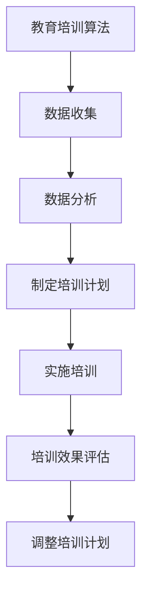
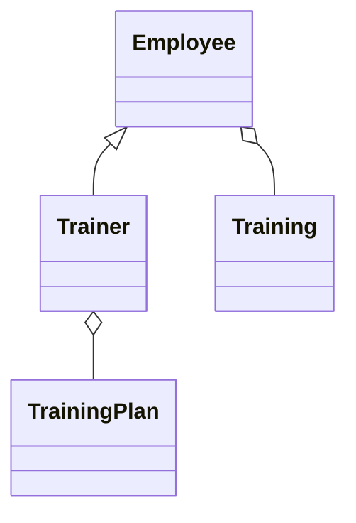
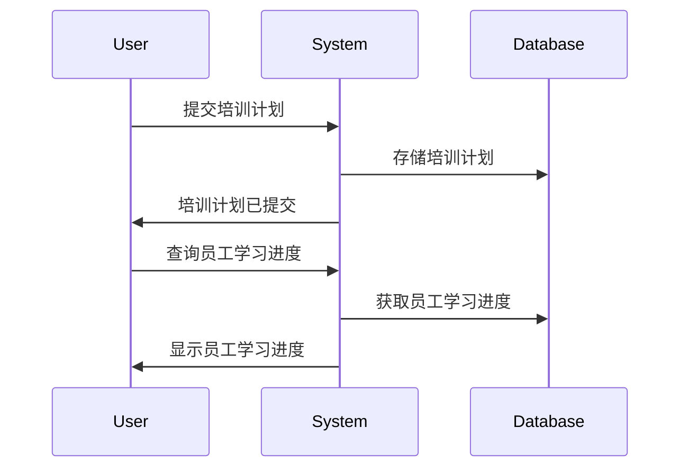
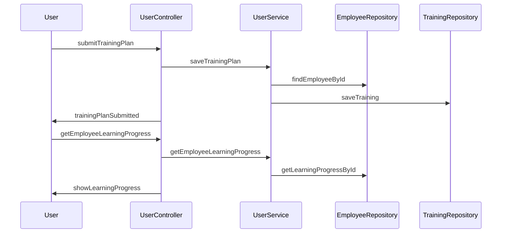

                 

# 人才发展战略：培养下一代领导者

关键词：人才发展、领导者培养、企业战略、教育培训算法

摘要：本文将从背景介绍、核心概念与联系、算法原理讲解等方面，探讨如何通过人才发展战略培养下一代领导者，以帮助企业应对未来挑战。

## 第1章 引言

### 1.1 问题背景

在全球经济竞争日益激烈的环境下，企业的发展面临着诸多挑战，其中之一就是人才短缺。如何培养下一代领导者，以适应企业未来的发展需求，成为亟待解决的问题。

### 1.2 问题描述

人才培养是一个长期、复杂的过程，涉及到教育、培训、选拔等多个环节。如何有效地整合这些环节，构建一个科学、系统的人才培养体系，是当前企业面临的重大课题。

### 1.3 问题解决

本书旨在通过深入剖析人才发展的核心概念，提供一套切实可行的人才培养战略，帮助企业解决人才短缺问题。

### 1.4 边界与外延

本书主要关注企业内部的人才培养问题，但不排除外部环境对企业人才发展的影响。

### 1.5 概念结构与核心要素组成

- 人才发展：包括人才选拔、培养、激励等多个环节。
- 领导者培养：重点探讨如何培养具有领导力的下一代领导者。
- 企业战略：结合企业实际情况，制定相应的人才培养策略。

## 第2章 核心概念与联系

### 2.1 人才发展的定义与特征

**定义**：人才发展是指通过培训、选拔、激励等手段，提升员工的综合素质和职业能力，以满足企业发展的需求。

**特征**：
- 系统性：人才发展不是孤立的现象，而是与企业战略、文化、管理等各个层面紧密相连。
- 长期性：人才发展需要长时间的投入和积累，不能一蹴而就。
- 动态性：人才发展是一个不断变化的过程，需要根据企业内外部环境的变化进行调整。

### 2.2 领导者培养的定义与特征

**定义**：领导者培养是指通过一系列的培训和实践活动，培养具备领导力、战略思维、团队管理能力等素质的领导者。

**特征**：
- 复杂性：领导者培养涉及多个方面，包括个人素质、团队管理、战略决策等。
- 实践性：领导者培养需要通过实践来检验和提升，不能仅停留在理论层面。
- 个性化：不同的领导者有不同的培养路径和需求，需要因材施教。

### 2.3 企业战略与人才培养的关系

**关系**：企业战略决定了人才培养的方向和目标，而人才培养则是实现企业战略的重要手段。

**影响**：
- 战略明确：有助于企业确定人才培养的重点和优先级。
- 资源配置：影响企业对人才培养的投入和资源分配。
- 风险管理：有助于企业识别和应对人才发展的潜在风险。

## 第3章 算法原理讲解

### 3.1 教育培训算法

**Mermaid 流程图**：


**算法原理**：

教育培训算法的核心在于通过数据分析，制定出符合员工实际需求的培训计划，并实施培训，最后通过效果评估来调整培训计划。

**Python 源代码**：

```python
# 教育培训算法示例
def educate_train(data):
    # 数据收集
    collected_data = data['training_data']
    
    # 数据分析
    analyzed_data = analyze_data(collected_data)
    
    # 制定培训计划
    training_plan = create_plan(analyzed_data)
    
    # 实施培训
    execute_training(training_plan)
    
    # 培训效果评估
    evaluation_result = evaluate_training()
    
    # 调整培训计划
    updated_plan = adjust_plan(evaluation_result)
    
    return updated_plan

# 示例
data = {
    'training_data': ['data1', 'data2', 'data3']
}
train_plan = educate_train(data)
print(train_plan)
```

**数学模型和公式**：

教育培训算法的核心在于预测员工的学习进度和效果，从而制定出最优的培训计划。其数学模型可以表示为：

$$
\hat{P}(t) = f(x_1, x_2, \ldots, x_n) + \epsilon
$$

其中，$P(t)$ 表示员工在时间 $t$ 的学习进度，$x_1, x_2, \ldots, x_n$ 表示影响员工学习进度的各种因素，$\epsilon$ 表示随机误差。

**举例说明**：

假设一个员工的学习进度受到以下因素影响：

- 培训内容：0.5
- 培训时长：0.3
- 员工自身素质：0.2

那么，该员工的学习进度可以表示为：

$$
\hat{P}(t) = 0.5 \times x_1 + 0.3 \times x_2 + 0.2 \times x_3
$$

其中，$x_1$ 表示培训内容得分，$x_2$ 表示培训时长，$x_3$ 表示员工自身素质得分。

通过不断调整这些因素，可以制定出最优的培训计划，从而提升员工的学习进度和效果。

## 第4章 系统分析与架构设计方案

### 4.1 问题场景介绍

在当今数字化时代，企业需要具备快速响应市场变化的能力，这就要求企业拥有一支高效的人才队伍。为了实现这一目标，企业需要构建一个完善的人才培养体系。

### 4.2 项目介绍

本项目旨在为企业搭建一个人才发展平台，通过教育培训算法，实现对员工学习进度的实时跟踪和评估，从而制定出最优的培训计划。

### 4.3 系统功能设计

**领域模型 Mermaid 类图**：


**系统功能描述**：

1. 员工管理：实现员工的增删改查功能，包括员工基本信息、学习进度等。
2. 培训管理：实现培训计划的管理，包括培训计划的制定、执行、评估等。
3. 数据分析：通过对员工学习进度的数据分析，为培训计划的制定提供依据。

### 4.4 系统架构设计

**系统架构 Mermaid 架构图**：


**系统架构描述**：

系统采用 B/S 架构，前端使用 Vue.js 开发，后端使用 Spring Boot 框架。系统分为三个模块：用户模块、培训模块、数据分析模块。用户模块负责员工的注册、登录和权限管理；培训模块负责培训计划的制定、执行和评估；数据分析模块负责对员工学习进度的数据分析。

### 4.5 系统接口设计和系统交互

**系统接口设计 Mermaid 序列图**：


**系统交互描述**：

用户通过前端界面提交培训计划，后端通过 UserController 接收请求，然后调用 UserService 处理业务逻辑，最终将结果返回给前端。

## 第5章 项目实战

### 5.1 环境安装

在本项目中，我们使用以下技术栈：

- 前端：Vue.js
- 后端：Spring Boot
- 数据库：MySQL

安装步骤如下：

1. 安装 Node.js 和 npm
2. 安装 MySQL 数据库
3. 创建数据库和表
4. 配置 Spring Boot 项目

### 5.2 系统核心实现源代码

**前端 Vue.js 代码**：
```html
<template>
  <div>
    <h1>教育培训平台</h1>
    <h2>提交培训计划</h2>
    <form @submit.prevent="submitTrainingPlan">
      <label for="trainingPlan">培训计划：</label>
      <input type="text" id="trainingPlan" v-model="trainingPlan" required>
      <button type="submit">提交</button>
    </form>
  </div>
</template>

<script>
export default {
  data() {
    return {
      trainingPlan: '',
    };
  },
  methods: {
    submitTrainingPlan() {
      // 调用后端接口提交培训计划
      this.$http.post('/api/training-plan', { trainingPlan: this.trainingPlan })
        .then(response => {
          alert('培训计划已提交');
        })
        .catch(error => {
          console.error('提交培训计划失败：', error);
        });
    },
  },
};
</script>
```

**后端 Spring Boot 代码**：
```java
@RestController
@RequestMapping("/api")
public class UserController {
  
  @Autowired
  private UserService userService;
  
  @PostMapping("/training-plan")
  public ResponseEntity<?> submitTrainingPlan(@RequestBody TrainingPlanDto trainingPlanDto) {
    userService.saveTrainingPlan(trainingPlanDto);
    return ResponseEntity.ok().body("培训计划已提交");
  }
  
}
```

**数据库 MySQL 代码**：
```sql
CREATE TABLE IF NOT EXISTS `employee` (
  `id` int(11) NOT NULL AUTO_INCREMENT,
  `name` varchar(255) NOT NULL,
  `age` int(11) NOT NULL,
  PRIMARY KEY (`id`)
);

CREATE TABLE IF NOT EXISTS `training` (
  `id` int(11) NOT NULL AUTO_INCREMENT,
  `employee_id` int(11) NOT NULL,
  `training_plan` varchar(255) NOT NULL,
  PRIMARY KEY (`id`),
  FOREIGN KEY (`employee_id`) REFERENCES `employee` (`id`)
);
```

### 5.3 代码应用解读与分析

**前端解读**：

1. 创建 Vue 组件，包含表单和按钮。
2. 使用 v-model 实现表单数据绑定。
3. 使用 @submit.prevent 阻止表单默认提交行为。
4. 使用 axios 发送 POST 请求到后端接口。

**后端解读**：

1. 创建 UserController，定义 submitTrainingPlan 方法。
2. 使用 @RestController 注解，将类标记为 RESTful API 控制器。
3. 使用 @PostMapping 注解，将 submitTrainingPlan 方法映射到 /api/training-plan 路径。
4. 使用 @RequestBody 注解，将接收到的 JSON 数据转换为 TrainingPlanDto 对象。
5. 调用 UserService 保存培训计划。

**数据库解读**：

1. 创建 employee 表，存储员工基本信息。
2. 创建 training 表，存储培训计划和员工关系。

### 5.4 实际案例分析和详细讲解剖析

**案例 1**：员工 A 提交培训计划

- 员工 A 登录系统
- 员工 A 在表单中输入培训计划内容
- 员工 A 提交表单
- 前端将培训计划发送到后端接口
- 后端接收培训计划，保存到数据库

**案例 2**：管理员查询员工 B 的学习进度

- 管理员登录系统
- 管理员选择员工 B
- 管理员点击查询按钮
- 后端根据员工 B 的 ID，从数据库获取学习进度
- 后端将学习进度返回给前端
- 前端显示员工 B 的学习进度

### 5.5 项目小结

本项目通过前端 Vue.js、后端 Spring Boot 和数据库 MySQL，实现了教育培训平台的基本功能。在实际应用中，可以根据企业需求，扩展更多的功能，如培训效果评估、学习进度跟踪等。

## 第6章 最佳实践 tips、小结、注意事项、拓展阅读等内容

### 6.1 最佳实践 tips

1. 在设计人才培养体系时，要充分考虑企业实际情况，避免一刀切。
2. 定期对员工进行培训需求调研，确保培训计划的针对性。
3. 加强培训过程中的反馈机制，及时调整培训策略。

### 6.2 小结

本文从背景介绍、核心概念与联系、算法原理讲解、系统分析与架构设计方案、项目实战等方面，详细探讨了如何通过人才发展战略培养下一代领导者。

### 6.3 注意事项

1. 人才培养是一个长期过程，需要持续投入和关注。
2. 人才培养要注重个性化，因材施教。
3. 人才培养要与企业发展战略紧密结合。

### 6.4 拓展阅读

1. 《人才发展：企业战略的基石》
2. 《领导者培养：理论与实践》
3. 《企业战略管理：理论与实践》

作者：AI天才研究院/AI Genius Institute & 禅与计算机程序设计艺术 /Zen And The Art of Computer Programming

