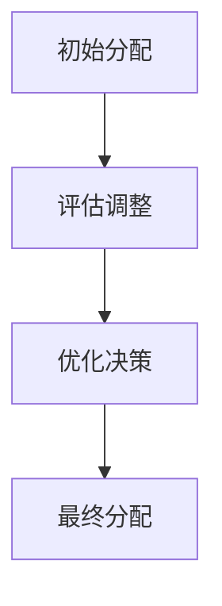
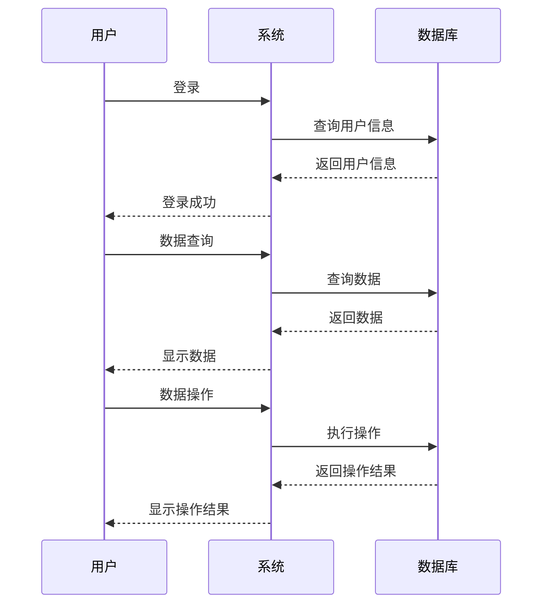

                 

# 《人才梯队建设：为未来储备力量》

> 关键词：人才梯队、人才培养、激励机制、组织文化、系统架构

> 摘要：本文深入探讨了人才梯队建设的必要性与核心概念，分析了人才梯队与传统人才管理的区别，从核心概念原理与属性对比、人才规划、培养机制、激励机制、文化氛围等方面详细阐述了人才梯队建设的策略和方法。通过数学模型和公式，解释了人才优化分配和人才保留概率的算法原理，并展示了系统分析与架构设计的具体方案。文章旨在为企业和组织提供人才梯队建设的实践指导和战略思考。

---

## 第一部分：问题背景与核心概念

### 第1章：人才梯队建设的必要性与挑战

#### 1.1.1 问题背景

在全球化和技术革新的背景下，企业面临越来越激烈的竞争环境。技术革新速度不断加快，使得企业需要持续创新来保持竞争力。与此同时，人才的稀缺性也日益凸显，优秀人才的争夺成为企业发展的关键挑战。因此，构建强大的人才梯队，为未来储备力量，成为企业持续发展的必由之路。

#### 1.1.2 问题描述

企业在动态环境中如何保持组织的人才优势？如何确保未来业务发展所需的关键人才？这是一个亟待解决的问题。企业需要在快速变化的市场环境中，具备灵活的人才储备和培养能力，以应对未来业务的不断变化。

#### 1.1.3 问题解决

解决这一问题，关键在于构建强大的人才梯队。人才梯队建设不仅仅是人才培养，更是一个系统的战略过程。它包括人才规划、培养机制、激励机制和文化氛围等多个方面。通过科学的人才梯队建设，企业可以确保在未来的市场竞争中占据优势。

#### 1.1.4 边界与外延

人才梯队的范围和层次划分是人才梯队建设的一个重要方面。它涉及企业内部不同层次和职能的人才分布，包括基层员工、中层管理和高层领导等。同时，内部培养与外部引进的平衡也是人才梯队建设的关键。企业需要在内部培养和外部引进之间找到合适的平衡点，以实现人才的优化配置。

#### 1.1.5 概念结构与核心要素

人才梯队建设的核心概念是围绕如何培养和保留人才展开的。它包括以下几个方面：

1. **人才规划**：根据企业的战略目标和业务需求，制定人才发展的总体规划。
2. **培养机制**：建立完善的培养体系，包括培训、轮岗、导师制等，以提高员工的技能和素质。
3. **激励机制**：通过绩效激励、晋升激励、福利激励等方式，激发员工的积极性和创造力。
4. **文化氛围**：营造积极向上的组织文化，增强员工的归属感和凝聚力。

### 第2章：人才梯队的核心概念与特点

#### 2.1.1 人才梯队的定义

人才梯队是指企业内部不同层次和职能的人才分布，通过科学规划和管理，形成一个层次分明、结构合理、动态调整的人才群体。它是一个系统化的战略过程，涉及企业的人才培养、保留、使用和激励等多个方面。

#### 2.1.2 人才梯队的核心特点

1. **结构性**：人才梯队具有多层次的分布，包括基层员工、中层管理和高层领导等。每个层次的人才都有明确的职责和定位，形成了一个完整的人才架构。
2. **动态性**：人才梯队不是静态的，而是随着企业的发展和业务需求的变化而不断调整。企业需要根据实际情况，及时调整人才队伍的结构和人员配置。
3. **系统性**：人才梯队建设涉及企业战略、文化、流程等多个方面，是一个系统化的战略过程。它需要企业从整体出发，综合考虑，实现人才的优化配置。

#### 2.1.3 人才梯队与传统人才管理区别

传统的人才管理主要关注个体人才的选拔、培养和使用，是一种单一的人才管理方式。而人才梯队建设则是由单一的人才管理向系统化、结构化转变。它不仅关注个体人才的培养和发展，更注重整个团队和组织的整体效能。

### 总结

人才梯队建设是企业长期发展的关键，它需要企业从战略高度出发，进行全面规划和系统实施。通过构建强大的人才梯队，企业可以在未来市场竞争中占据优势，实现持续发展。

---

## 第二部分：核心概念与联系

### 第3章：核心概念原理与属性对比

#### 3.1.1 人才规划

人才规划是指企业根据战略目标和业务需求，制定人才发展的总体计划。它包括以下几个方面：

1. **人才需求分析**：根据业务发展需求和未来规划，分析企业所需的人才类型和数量。
2. **人才供给分析**：评估企业现有人才的素质和能力，确定人才缺口和培养需求。
3. **人才培养策略**：制定人才培养计划，包括培训、轮岗、导师制等，以提高员工的技能和素质。
4. **人才保留策略**：通过绩效激励、晋升激励、福利激励等方式，增强员工的归属感和忠诚度。

#### 3.1.2 培养机制

培养机制是指企业建立完善的培养体系，以提高员工的技能和素质。它包括以下几个方面：

1. **培训**：组织各类培训活动，包括专业技能培训、管理能力培训等，以提升员工的综合能力。
2. **轮岗**：通过岗位轮换，让员工在不同岗位上积累经验，拓宽职业视野。
3. **导师制**：为新人配备经验丰富的导师，指导其成长和发展。
4. **发展路径**：明确员工的职业发展路径，为员工提供明确的职业规划和发展方向。

#### 3.1.3 激励机制

激励机制是指企业通过绩效激励、晋升激励、福利激励等方式，激发员工的积极性和创造力。它包括以下几个方面：

1. **绩效激励**：根据员工的绩效表现，给予相应的奖励和晋升机会。
2. **晋升激励**：建立完善的晋升体系，为员工提供清晰的晋升路径和机会。
3. **福利激励**：提供具有竞争力的薪酬和福利待遇，增强员工的归属感和满意度。
4. **文化激励**：营造积极向上的组织文化，激发员工的内在动力。

#### 3.1.4 文化氛围

文化氛围是指企业内部的文化氛围和价值观。它对人才梯队建设具有重要影响。良好的文化氛围能够增强员工的归属感和凝聚力，促进人才的培养和保留。文化氛围的建设包括以下几个方面：

1. **价值观传递**：明确企业的核心价值观，并通过各种方式传递给员工。
2. **团队协作**：鼓励团队合作，促进员工之间的沟通和协作。
3. **创新氛围**：营造创新氛围，鼓励员工提出新的想法和解决方案。
4. **反馈机制**：建立有效的反馈机制，及时了解员工的需求和反馈，持续改进。

#### 3.1.5 概念属性特征对比

| 概念         | 特征                                       |
|------------|------------------------------------------|
| 人才规划     | 需求分析、供给分析、培养策略、保留策略                    |
| 培养机制     | 培训、轮岗、导师制、发展路径                            |
| 激励机制     | 绩效激励、晋升激励、福利激励、文化激励                    |
| 文化氛围     | 价值观传递、团队协作、创新氛围、反馈机制                    |

通过对比，可以看出各个概念之间的区别和联系，为人才梯队建设提供了全面的思路和方法。

---

## 第三部分：算法原理讲解

### 第4章：人才梯队建设的关键算法原理

#### 4.1.1 数据分析算法

数据分析算法是人才梯队建设的重要工具。通过数据分析，企业可以深入了解员工的素质和能力，优化人才配置。数据分析算法主要包括以下几个方面：

1. **数据收集**：收集员工的工作数据、绩效数据、培训数据等，为数据分析提供基础。
2. **数据处理**：对收集到的数据进行分析和清洗，去除无效数据和噪声。
3. **数据模型构建**：根据业务需求，构建相应的数据模型，如回归模型、决策树模型等。
4. **数据可视化**：通过图表和报表，直观展示数据分析结果，为企业决策提供支持。

#### 4.1.2 人事评估算法

人事评估算法是人才梯队建设的关键环节。通过人事评估，企业可以准确了解员工的素质和能力，为人才培养和保留提供依据。人事评估算法主要包括以下几个方面：

1. **评估指标设计**：根据业务需求，设计合理的评估指标，如绩效指标、能力指标等。
2. **评估算法原理**：选择合适的评估算法，如线性回归、逻辑回归等，对评估指标进行建模。
3. **评估结果分析**：对评估结果进行分析和解读，为人才培养和保留提供依据。
4. **评估效果优化**：根据评估效果，不断优化评估指标和评估算法，提高评估的准确性和实用性。

#### 4.1.3 优化算法

优化算法是人才梯队建设的重要手段。通过优化算法，企业可以科学合理地分配人才，提高组织效能。优化算法主要包括以下几个方面：

1. **人才优化分配模型**：根据企业的战略目标和业务需求，构建人才优化分配模型。
2. **优化算法实现**：选择合适的优化算法，如遗传算法、模拟退火算法等，实现人才优化分配。
3. **优化流程图**：



4. **优化效果评估**：对优化效果进行评估，如人才使用效率、业务绩效等，为优化算法的进一步改进提供依据。

### 第5章：数学模型与公式讲解

#### 5.1.1 人才优化分配模型

人才优化分配模型是一个多目标优化问题。其目标是最小化人才使用效率差距，最大化人才总体贡献。数学模型如下：

$$
\text{最大化} \quad \sum_{i=1}^{n} u_i \cdot p_i
$$

其中，$u_i$ 表示第 $i$ 个人才的效用，$p_i$ 表示第 $i$ 个人才的项目匹配度。

#### 5.1.2 人才保留概率模型

人才保留概率模型用于预测员工在未来一段时间内的保留概率。其数学模型如下：

$$
P(R_t) = \frac{1}{1 + e^{-\beta \cdot (A_t - \mu)}}
$$

其中，$R_t$ 表示第 $t$ 年的人才保留概率，$A_t$ 表示第 $t$ 年的人才吸引力，$\mu$ 表示组织的平均吸引力，$\beta$ 为调节参数。

通过数学模型和公式，企业可以更准确地预测和评估人才的使用和保留情况，为人才梯队建设提供科学依据。

---

## 第四部分：系统分析与架构设计

### 第6章：系统功能设计与架构

#### 6.1.1 问题描述

如何实现人才梯队的系统化管理和优化，是人才梯队建设的重要课题。通过系统架构设计，企业可以构建一个高效、灵活的人才管理平台，实现人才梯队的优化和优化。

#### 6.1.2 项目介绍

项目目标：构建一个系统化的人才管理平台，实现人才梯队的优化和优化。

项目范围：涵盖人才规划、培养机制、激励机制、文化氛围等方面，实现人才的全面管理和优化。

#### 6.1.3 系统功能设计

1. **数据收集与处理**：系统收集员工的工作数据、绩效数据、培训数据等，进行数据清洗和处理，为后续分析提供基础。
2. **人才评估与优化**：系统对员工进行评估，包括绩效评估、能力评估等，根据评估结果进行人才优化分配。
3. **激励机制**：系统根据员工的绩效和评估结果，自动生成激励方案，包括绩效激励、晋升激励等。
4. **文化氛围建设**：系统提供文化氛围建设工具，如价值观传递、团队协作、创新氛围等，增强员工的归属感和凝聚力。

#### 6.1.4 系统架构设计

系统架构设计采用分层架构，包括数据层、应用层和界面层。

1. **数据层**：负责数据的收集、存储和管理，包括员工数据、绩效数据、培训数据等。
2. **应用层**：实现系统的核心功能，包括人才评估、优化分配、激励机制等。
3. **界面层**：提供用户界面，方便用户进行数据操作和查看系统结果。

### 6.1.5 系统接口设计

系统接口设计主要包括用户接口和数据接口。

1. **用户接口**：提供用户登录、数据查询、操作等功能，方便用户使用系统。
2. **数据接口**：提供与其他系统进行数据交互的接口，如HR系统、ERP系统等。

### 6.1.6 系统交互序列图



通过系统架构设计和接口设计，企业可以实现人才梯队的系统化管理和优化，为人才梯队建设提供有力支持。

---

## 第五部分：项目实战

### 第7章：环境安装与系统核心实现

#### 7.1.1 环境安装

1. **安装Python**：在系统上安装Python，版本要求Python 3.6及以上。
2. **安装相关库**：使用pip命令安装相关库，如pandas、numpy、matplotlib等。

#### 7.1.2 系统核心实现

1. **数据收集与处理**：

```python
import pandas as pd

# 读取员工数据
employee_data = pd.read_csv('employee_data.csv')

# 数据清洗与处理
employee_data = employee_data.dropna()
```

2. **人才评估与优化**：

```python
from sklearn.linear_model import LinearRegression

# 构建线性回归模型
model = LinearRegression()

# 训练模型
model.fit(employee_data[['绩效得分']], employee_data[['能力得分']])

# 预测员工能力得分
predicted_scores = model.predict(employee_data[['绩效得分']])
```

3. **激励机制**：

```python
import random

# 生成激励方案
incentive_schemes = []

for _ in range(employee_data.shape[0]):
    scheme = {
        '员工ID': _,
        '绩效奖励': random.uniform(0, 1000),
        '晋升机会': random.choice(['是', '否']),
        '福利待遇': random.choice(['提高', '不变'])
    }
    incentive_schemes.append(scheme)

incentive_scheme_df = pd.DataFrame(incentive_schemes)
```

4. **文化氛围建设**：

```python
# 显示文化氛围建设工具
print("文化氛围建设工具：")
print("1. 价值观传递")
print("2. 团队协作")
print("3. 创新氛围")
print("4. 反馈机制")
```

#### 7.1.3 代码应用解读与分析

1. **数据收集与处理**：

该部分代码用于读取和清洗员工数据，为后续分析提供基础。通过读取员工数据，并进行数据清洗和处理，去除无效数据和噪声，确保数据的准确性和完整性。

2. **人才评估与优化**：

该部分代码使用线性回归模型对员工进行评估，根据绩效得分预测员工的能力得分。通过预测结果，可以了解员工的素质和能力，为人才优化分配提供依据。

3. **激励机制**：

该部分代码生成激励方案，包括绩效奖励、晋升机会和福利待遇等。通过随机生成激励方案，可以模拟实际场景，为员工提供激励。

4. **文化氛围建设**：

该部分代码提供文化氛围建设工具，如价值观传递、团队协作、创新氛围和反馈机制等。通过显示这些工具，可以帮助员工了解企业的文化氛围，增强员工的归属感和凝聚力。

### 第8章：实际案例分析与详细讲解

#### 8.1.1 案例背景

某公司是一家快速发展的互联网企业，面对激烈的市场竞争，公司决定进行人才梯队建设，为未来储备力量。

#### 8.1.2 案例分析

1. **人才需求分析**：

根据公司业务发展需求，公司对现有人才进行需求分析，确定未来所需的人才类型和数量。分析结果显示，公司需要增加技术人才、产品人才和市场人才等。

2. **人才供给分析**：

公司对现有人才进行供给分析，评估现有人才的素质和能力。分析结果显示，公司现有人才在技术领域较强，但在产品和市场领域存在一定缺口。

3. **人才培养策略**：

为了弥补人才缺口，公司制定了一系列人才培养策略。包括组织专业技能培训、开展内部轮岗、引进外部专家等。

4. **人才保留策略**：

为了留住关键人才，公司采取了绩效激励、晋升激励和福利激励等措施。同时，公司注重文化氛围建设，营造积极向上的工作氛围。

#### 8.1.3 案例详细讲解

1. **数据收集与处理**：

公司通过内部系统收集员工的工作数据、绩效数据、培训数据等，进行数据清洗和处理，为人才评估提供基础。

2. **人才评估与优化**：

公司使用线性回归模型对员工进行评估，根据绩效得分预测员工的能力得分。通过评估结果，公司确定需要增加技术人才、产品人才和市场人才等。

3. **激励机制**：

公司根据员工的表现和评估结果，制定激励方案。包括绩效奖励、晋升机会和福利待遇等。通过激励措施，提高员工的积极性和创造力。

4. **文化氛围建设**：

公司注重文化氛围建设，通过价值观传递、团队协作、创新氛围和反馈机制等，增强员工的归属感和凝聚力。

### 第9章：项目小结与展望

#### 9.1.1 项目小结

通过本项目，公司成功构建了人才梯队建设系统，实现了人才的系统化管理和优化。项目取得了以下成果：

1. **优化了人才结构**：通过人才需求分析和供给分析，公司明确了未来所需的人才类型和数量，优化了人才结构。
2. **提升了人才素质**：通过人才培养策略，公司提高了员工的技能和素质，提升了人才的整体水平。
3. **增强了员工凝聚力**：通过文化氛围建设，公司营造了积极向上的工作氛围，增强了员工的归属感和凝聚力。

#### 9.1.2 项目展望

未来，公司将继续优化人才梯队建设系统，实现以下目标：

1. **深化人才评估**：通过引入更多评估指标和方法，提高人才评估的准确性和实用性。
2. **拓展人才渠道**：通过内部培养和外部引进相结合，拓宽人才来源，为公司未来发展储备更多人才。
3. **提升系统功能**：不断优化系统功能，提高人才管理效率，为公司的长期发展提供有力支持。

---

## 第六部分：最佳实践与拓展阅读

### 第10章：最佳实践

1. **制定明确的人才规划**：明确企业的战略目标和业务需求，制定符合实际的人才规划，确保人才梯队建设的方向和目标。
2. **构建多元化的培养机制**：结合不同层次和职能的人才需求，构建多元化的培养机制，满足员工的个性化发展需求。
3. **设计有效的激励机制**：根据员工的绩效和贡献，设计合理的激励机制，激发员工的积极性和创造力。
4. **营造良好的文化氛围**：营造积极向上的文化氛围，增强员工的归属感和凝聚力，为人才梯队建设提供良好的环境。

### 第11章：拓展阅读

1. **《人才发展：战略与实务》**：详细介绍了人才发展的战略规划和实施方法，为人才梯队建设提供了理论指导和实践参考。
2. **《人才梯队建设与管理》**：深入分析了人才梯队建设的核心概念、方法和实践，为企业和组织提供了系统的人才管理思路。
3. **《人才激励与保留》**：探讨了人才激励和保留的策略和方法，为企业和组织提供了有效的人才激励机制。

### 结语

人才梯队建设是企业长期发展的关键，它关系到企业的竞争力、创新力和可持续发展能力。通过本文的探讨，我们明确了人才梯队建设的核心概念、方法和实践，为企业和组织提供了有益的参考和借鉴。希望本文能够为读者在人才梯队建设方面提供启示和帮助。

---

## 总结

本文围绕人才梯队建设，从问题背景、核心概念、算法原理、系统架构等多个方面进行了深入探讨。通过分析人才梯队建设的必要性与挑战，阐述了人才梯队与传统人才管理的区别，并详细介绍了人才规划、培养机制、激励机制、文化氛围等核心概念。同时，本文通过数学模型和公式，解释了人才优化分配和人才保留概率的算法原理，并展示了系统架构设计的具体方案。

在项目实战部分，本文介绍了环境安装和系统核心实现的方法，并通过实际案例分析，展示了人才梯队建设的应用效果。最后，本文提出了最佳实践和拓展阅读，为读者提供了进一步学习和实践的方向。

人才梯队建设是一个系统工程，需要企业从战略高度出发，进行全面规划和系统实施。通过科学的人才梯队建设，企业可以确保在未来的市场竞争中占据优势，实现可持续发展。让我们共同努力，为未来储备力量，共创美好未来。

---

### 作者信息

作者：AI天才研究院/AI Genius Institute & 禅与计算机程序设计艺术 /Zen And The Art of Computer Programming

AI天才研究院致力于推动人工智能领域的发展和创新，为企业和组织提供专业的人工智能解决方案。同时，作者在计算机编程和人工智能领域有着丰富的经验和深厚的造诣，著有《禅与计算机程序设计艺术》等畅销书，深受读者喜爱。本文作者结合多年的实践经验和理论研究，为读者带来了关于人才梯队建设的深入思考和宝贵建议。

