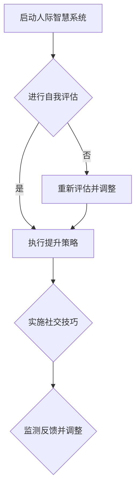

                 

### 引言

#### 人际智慧：不可或缺的领导力要素

在当今快速变化的商业环境中，领导者的角色越来越复杂，他们不仅需要具备卓越的技术和管理能力，还需要拥有深厚的人际智慧。人际智慧，顾名思义，是指个体在处理人际关系方面的能力，包括自我意识、情感管理、社交技巧和建立信任等。对于领导者而言，人际智慧是构建高效团队、促进跨部门协作、提升团队凝聚力以及成功管理多元化团队的关键。

本文将探讨人际智慧的核心概念、数学模型、实际应用、提升技巧以及系统架构。我们将一步步分析如何通过人际智慧提升领导者的关系管理能力，从而实现组织目标和个人职业生涯的成功。

#### 文章关键词

- 人际智慧
- 领导力
- 关系管理
- 社交技巧
- 情感智商

#### 文章摘要

本文将深入探讨人际智慧这一关键领导力要素。通过分析人际智慧的核心概念、数学模型、实际应用和提升技巧，我们将揭示如何运用人际智慧提升领导者的关系管理能力。文章还将通过系统架构设计和项目实战案例，展示人际智慧在现实中的应用效果。最后，我们将分享人际智慧的最佳实践，并提供进一步学习的资源。

### 第一部分：理解人际智慧

#### 第1章：人际智慧的核心概念

##### 1.1 人际智慧的背景和意义

人际智慧，作为一种多维度的能力，不仅在个人生活中具有重要价值，在职场中更是领导者的核心竞争力。人际智慧的历史可以追溯到古希腊哲学家亚里士多德，他提出了“明智”的概念，包含了人际交往的智慧。在现代社会，随着商业环境的复杂化和多元化，人际智慧的重要性愈发凸显。

在领导力中，人际智慧起着至关重要的作用。领导者需要通过人际智慧来识别、理解和管理团队成员的情绪和行为，从而建立信任和团队合作。人际关系管理能力的强弱直接影响到团队的效率和组织的整体绩效。

##### 1.2 人际智慧的基本要素

人际智慧由多个基本要素构成，这些要素相互关联，共同构成了一个人在社交场合中的综合能力。

- **自我意识**：个体对自己情感、动机和行为的理解和认知。自我意识是人际智慧的基础，它帮助个体更好地理解自己的行为对他人产生的影响。

- **情感管理**：个体在处理自己和他人的情感时，能够保持冷静、理性，并采取适当的行为策略。情感管理能力能够帮助领导者减少冲突，提高沟通效果。

- **社交技巧**：在社交场合中，个体如何与他人互动，如何表达自己，如何建立和维护关系。社交技巧包括沟通技巧、倾听技巧和谈判技巧等。

- **建立信任**：信任是人际关系中最为关键的要素。建立信任需要领导者展现出诚信、透明和一致性，同时降低风险和减少疑问。

##### 1.3 人际智慧与领导力的联系

人际智慧与领导力之间有着紧密的联系。一个优秀的领导者必须具备强大的人际智慧，以便有效地管理团队、处理复杂的人际关系，并在组织内建立信任。以下是人际智慧对领导力的影响：

- **团队协作**：人际智慧能够帮助领导者建立和维护高效的团队协作关系，促进团队成员之间的沟通和合作。

- **领导风格**：不同的人际智慧水平会影响领导者的领导风格。高人际智慧的领导者通常采用参与式领导、民主式领导，而低人际智慧的领导者可能更倾向于权威式领导。

- **领导有效性**：人际智慧与领导有效性密切相关。拥有高人际智慧的领导者能够更好地应对挑战，提高团队绩效。

### 总结

人际智慧作为领导者的关键能力，在构建高效团队和实现组织目标中起着至关重要的作用。通过理解人际智慧的核心概念和基本要素，领导者可以更好地提升自身的人际智慧水平，从而在职场中取得成功。

##### 关键概念术语说明

- **人际智慧**：处理人际关系的能力，包括自我意识、情感管理、社交技巧和建立信任等。
- **自我意识**：个体对自己情感、动机和行为的理解和认知。
- **情感管理**：处理自己和他人的情感，保持冷静、理性的能力。
- **社交技巧**：在社交场合中如何与他人互动、表达自己、建立和维护关系的能力。
- **建立信任**：通过诚信、透明和一致性降低风险和减少疑问，建立双方信任。

##### 问题背景

在现代企业中，领导者的角色越来越重要，他们不仅要具备出色的技术和管理能力，还需要掌握人际智慧。人际智慧的重要性在于，它直接影响团队协作效率和组织的整体绩效。然而，很多领导者并不具备足够的人际智慧，导致团队沟通不畅、协作困难，甚至影响组织的稳定和发展。

##### 问题描述

如何提升领导者的关系管理能力，成为当今领导者面临的主要挑战。具体表现为：

- 领导者缺乏对人际智慧的理解和认识，导致在处理人际关系时方法不当。
- 团队成员之间的沟通不畅，缺乏信任，导致工作效率低下。
- 领导者无法有效地应对复杂的人际关系，导致团队内部矛盾加剧。

##### 问题解决

为了解决上述问题，领导者需要：

- 提高对人际智慧的认识和理解，学习人际智慧的基本概念和要素。
- 加强自我意识和情感管理能力，提升在处理人际关系时的冷静和理性。
- 学习和运用有效的社交技巧，提高团队沟通和协作效率。
- 通过诚信、透明和一致性建立信任，降低团队成员之间的风险和疑问。

##### 边界与外延

人际智慧的边界在于其在不同环境中的应用和表现。例如，在职场中，人际智慧体现在团队协作、跨部门沟通和领导风格等方面；在个人生活中，人际智慧体现在家庭关系、社交圈子和朋友关系等方面。人际智慧的外延包括自我意识、情感管理、社交技巧和建立信任等多个方面，这些要素相互交织，共同构成了人际智慧的整体。

##### 概念结构与核心要素组成

人际智慧的概念结构包括以下几个核心要素：

1. **自我意识**：理解自己的情感、动机和行为，有助于在人际交往中更好地表达自己。
2. **情感管理**：处理自己和他人的情感，保持冷静和理性，避免情绪波动对人际关系的影响。
3. **社交技巧**：有效沟通、倾听和谈判的能力，有助于建立和维护良好的人际关系。
4. **建立信任**：通过诚信、透明和一致性，降低风险和疑问，建立双方的信任。

这些要素相互作用，共同构成人际智慧的核心结构，帮助领导者提升关系管理能力。

### 第2章：人际智慧的数学模型与公式

在理解了人际智慧的基本概念之后，我们接下来将探讨人际智慧的数学模型与公式。这些数学工具不仅为我们提供了量化人际智慧的方法，还能够帮助我们更好地分析和优化人际关系。

#### 2.1 人际智慧的数学模型

人际智慧的数学模型可以帮助我们理解和预测人际关系中的各种现象。一个广泛使用的模型是情感智商（EQ）模型。情感智商模型主要关注个体在识别、理解和管理自身及他人情感方面的能力。

情感智商模型包括以下几个关键要素：

1. **自我认知**：个体对自己情感的认识和理解。
2. **自我调节**：个体在情感波动时进行自我调节的能力。
3. **社交技巧**：个体在社交场合中表达情感和处理他人情感的能力。
4. **同理心**：个体理解并感受他人情感的能力。

#### 2.2 建立信任的公式

在人际智慧中，建立信任是一个至关重要的目标。一个简化的信任公式如下：

$$
信任 = （诚信 + 透明 + 共识）/ （风险 + 疑问）
$$

这个公式说明了信任是如何通过诚信、透明度和共识来降低风险和疑问的。以下是每个要素的解释：

- **诚信**：个体的正直和诚实。
- **透明**：信息的开放性和透明度。
- **共识**：双方对目标和期望的共识。
- **风险**：个体感知到的风险水平。
- **疑问**：个体对对方行为的不确定性。

#### 2.3 人际智慧的计算方法

为了量化人际智慧，我们可以使用多种计算方法，其中最常用的包括社交网络分析和互动频次与质量分析。

1. **社交网络分析**：

社交网络分析是一种用于研究人际关系结构的方法。它通过分析社交网络中的节点（个体）和边（关系），来揭示人际关系模式。以下是社交网络分析的关键步骤：

- **构建社交网络图**：将个体视为节点，将他们之间的关系视为边，构建出社交网络图。
- **计算中心性**：通过计算个体的中心性（如度数中心性、介数中心性和紧密中心性），来评估个体在社交网络中的影响力。
- **社区发现**：通过算法识别社交网络中的社区，帮助理解个体在特定社交群体中的位置。

2. **互动频次与质量分析**：

互动频次与质量分析关注个体之间互动的频率和质量。以下是一些关键指标：

- **互动频率**：个体之间交流的次数和频率。
- **互动质量**：交流内容的质量和深度，包括信息的准确性、交流的真诚性和互动的效用。

为了量化这些指标，可以使用以下公式：

$$
互动质量 = （有效互动次数）/（无效互动次数）
$$

#### 实例说明

假设有两个团队，团队A和团队B。通过对两个团队的社交网络和互动频次与质量进行分析，我们可以得到以下结论：

- **团队A**：
  - 社交网络分析：团队A中，某些成员具有较高的中心性，表明这些成员在社交网络中具有较大的影响力。
  - 互动频次与质量分析：团队A的成员之间互动频率较高，且互动质量较高，表明团队成员之间的沟通效率较高。
- **团队B**：
  - 社交网络分析：团队B中，成员之间的社交网络较为分散，没有明显的中心节点。
  - 互动频次与质量分析：团队B的成员之间互动频率较低，且互动质量较低，表明团队成员之间的沟通效率较低。

通过这些分析，团队A的人际智慧水平明显高于团队B。这为团队A在未来的团队协作和关系管理中提供了优势。

### 总结

人际智慧的数学模型与公式为我们提供了量化和分析人际智慧的方法。通过情感智商模型和信任公式，我们可以更好地理解人际关系的本质，并通过社交网络分析和互动频次与质量分析，量化人际智慧。这些工具和方法不仅有助于提升领导者的人际智慧水平，也为组织在人际关系管理方面提供了科学依据。

### 人际智慧在团队管理中的应用

人际智慧在团队管理中发挥着至关重要的作用。它不仅能够提升团队成员之间的协作效率，还能够增强团队的凝聚力和创新能力。在本章节中，我们将详细探讨人际智慧在团队管理中的应用，并提供一系列策略和技巧，帮助领导者有效提升团队关系管理能力。

#### 3.1 团队成员关系分析

团队成员关系分析是人际智慧在团队管理中的第一步。领导者需要识别和分析团队成员之间的关系，以了解团队的社交网络和沟通模式。以下是一些关键的步骤和方法：

1. **社交网络图构建**：

   通过构建社交网络图，领导者可以直观地看到团队成员之间的联系和互动。可以使用工具如Gephi或NodeXL来绘制社交网络图。以下是构建社交网络图的步骤：

   - **数据收集**：收集团队成员之间的直接和间接联系数据，包括正式关系（如团队结构）和非正式关系（如友谊和合作）。
   - **图节点和边定义**：将团队成员视为图节点，将他们之间的关系视为图边，构建出社交网络图。
   - **可视化**：使用可视化工具将社交网络图展示出来，以便领导者更好地理解团队的社交结构。

2. **中心性分析**：

   通过计算中心性指标（如度数中心性、介数中心性和紧密中心性），领导者可以识别出团队中的关键成员。这些关键成员在社交网络中具有较高的影响力，往往是信息传播和决策制定的核心。以下是中心性分析的步骤：

   - **度数中心性计算**：计算每个节点连接的其他节点的数量，度数中心性越高，节点在社交网络中的地位越重要。
   - **介数中心性计算**：计算每个节点在社交网络中的路径数量，介数中心性越高，节点的桥梁作用越显著。
   - **紧密中心性计算**：计算每个节点与其邻居节点的平均距离，紧密中心性越高，节点的连接性越强。

3. **社区发现**：

   社交网络分析还可以帮助领导者发现团队中的社区结构。社区是指一组紧密相连的节点，它们在社交网络中形成独立的子图。通过识别社区，领导者可以更好地理解团队成员的自然分组和互动模式。以下是社区发现的步骤：

   - **社区检测算法**：使用社区检测算法（如Girvan-Newman算法或Louvain算法）来识别社区。
   - **社区可视化**：将社区结构可视化，帮助领导者理解团队的自然划分。

#### 3.2 团队协作提升策略

在了解了团队成员关系之后，领导者需要制定和实施一系列策略来提升团队协作效率。以下是一些建议：

1. **加强核心成员的沟通**：

   核心成员在团队中具有关键地位，他们的沟通效果直接影响到团队的协作效率。领导者应该：

   - 定期组织核心成员的沟通会议，确保信息的及时传递和问题的及时解决。
   - 鼓励核心成员之间的跨部门合作，促进知识的共享和技能的互补。

2. **建立透明的沟通机制**：

   透明度是建立信任的关键。领导者应该：

   - 公开团队的愿景、目标和计划，确保团队成员对团队方向有清晰的认识。
   - 鼓励团队成员分享意见和反馈，建立开放、坦诚的沟通文化。

3. **促进多样化的协作**：

   多样化的协作能够激发团队成员的创造力，提升团队的创新力。领导者应该：

   - 鼓励团队成员跨职能合作，打破部门壁垒。
   - 引入外部资源，如咨询专家、合作伙伴，为团队带来新的视角和观点。

4. **培养团队成员的情感管理能力**：

   情感管理能力对于保持团队的稳定和积极性至关重要。领导者应该：

   - 提供情感管理培训，帮助团队成员学会识别、理解和调节自己的情绪。
   - 建立支持体系，为团队成员提供情感支持，帮助他们应对工作压力。

#### 3.3 建立信任的策略

建立信任是团队管理中的核心任务。以下是一些策略：

1. **展示诚信和透明度**：

   领导者应该通过自己的行为来展示诚信和透明度。例如：

   - 保持承诺，履行自己的责任。
   - 对团队内外部公开透明，减少信息不对称。

2. **促进共识**：

   共识是信任的基石。领导者应该：

   - 通过沟通和讨论，确保团队成员对目标和决策有共同的理解。
   - 尊重团队成员的意见，鼓励他们参与决策过程。

3. **降低风险和疑问**：

   领导者应该采取一系列措施来降低团队成员的风险感知和疑问。例如：

   - 提供明确的指导和支持，帮助团队成员应对不确定性和挑战。
   - 建立反馈机制，及时解决团队成员的问题和疑虑。

#### 实例分析

以下是一个团队管理中的实例分析：

- **团队背景**：一个跨部门的项目团队，由来自不同部门的专业人员组成。
- **问题**：团队成员之间存在沟通不畅和协作困难的问题，导致项目进度缓慢。
- **解决方案**：
  - **社交网络分析**：通过社交网络分析，识别出团队中的核心成员和社区结构。
  - **加强核心成员沟通**：定期组织核心成员沟通会议，确保信息的及时传递。
  - **建立透明沟通机制**：公开项目的目标和进度，鼓励团队成员分享意见和反馈。
  - **促进多样化协作**：引入外部专家，举办跨部门工作坊，促进团队成员之间的互动。
  - **培养情感管理能力**：提供情感管理培训，帮助团队成员应对工作压力。

通过上述策略，团队沟通效率显著提高，项目进度得到加快，团队成员之间的信任度也得到了提升。

### 总结

人际智慧在团队管理中的应用可以帮助领导者更好地理解和管理团队成员之间的关系，提升团队协作效率和创新能力。通过社交网络分析、团队协作提升策略和建立信任的策略，领导者可以构建一个高效、和谐的团队。人际智慧不仅有助于团队当前的工作，也为团队的长远发展奠定了坚实的基础。

### 人际智慧在跨文化沟通中的应用

在全球化商业环境中，跨文化沟通是领导者和团队成员不可避免的一部分。人际智慧在这一领域显得尤为重要，因为它能够帮助领导者更好地理解和应对不同文化背景下的沟通挑战，从而促进团队协作和项目的成功。

#### 4.1 跨文化背景下的社交技巧

跨文化沟通的复杂性在于不同文化之间在价值观、语言习惯和沟通风格上的差异。领导者需要具备以下社交技巧来有效应对这些挑战：

1. **文化敏感性**：

   文化敏感性是指对他人文化背景的尊重和理解。领导者应该：

   - 尊重并接受不同文化的差异，避免文化偏见和刻板印象。
   - 通过学习和了解不同文化的习俗、礼仪和沟通方式，提高文化敏感性。

2. **适应性沟通**：

   适应性沟通是指根据不同的文化背景调整自己的沟通方式和策略。领导者应该：

   - 在沟通前了解对方的文化背景，避免使用可能导致误解的语言和行为。
   - 根据对方的文化偏好调整沟通的方式和内容，例如在正式场合使用专业术语，在非正式场合使用轻松的语言。

3. **非语言沟通**：

   非语言沟通在不同文化中具有不同的含义和重要性。领导者应该：

   - 注意自己的肢体语言、面部表情和语调，避免不必要的误解。
   - 了解并尊重不同文化对非语言沟通的期望和规范，例如在日本，保持眼神接触可能被视为不礼貌。

4. **情感智慧**：

   情感智慧在跨文化沟通中尤为重要。领导者应该：

   - 了解并管理自己的情绪，避免情绪波动影响沟通效果。
   - 掌握倾听技巧，真正倾听对方的文化观点和需求。

#### 4.2 跨文化沟通的挑战与应对

跨文化沟通的挑战主要体现在以下几个方面：

1. **语言障碍**：

   语言障碍是跨文化沟通中最直接和常见的挑战。领导者应该：

   - 提供语言培训，帮助团队成员提高语言能力。
   - 使用通用语言（如英语）进行沟通，或使用翻译工具。
   - 鼓励团队成员学习其他语言，提高跨文化沟通的能力。

2. **文化差异**：

   不同文化之间的价值观、沟通风格和礼仪差异可能导致误解和冲突。领导者应该：

   - 通过培训和文化交流，增强团队成员对文化差异的认识和理解。
   - 建立跨文化团队，促进不同文化背景下的交流和合作。
   - 设立跨文化沟通指南，明确沟通的基本原则和注意事项。

3. **时间观念**：

   不同文化对时间的理解和重视程度不同。领导者应该：

   - 了解并尊重不同文化的时间观念，避免因为时间差异导致的不必要的延误和冲突。
   - 在安排会议和活动时，考虑到团队成员的不同时区和工作习惯。

#### 4.3 实际案例分析

以下是一个跨文化沟通的实际案例：

**案例背景**：

一家跨国公司在法国和中国的子公司需要共同开发一款新产品。法国团队注重细节和正式，而中国团队则更加注重关系和合作。

**问题**：

在项目初期，法国团队和中国团队之间的沟通出现了困难。法国团队认为中国团队不够高效，而中国团队认为法国团队过于苛刻。

**解决方案**：

1. **文化敏感性培训**：

   领导者组织了文化敏感性培训，帮助团队成员了解彼此的文化背景，减少误解和冲突。

2. **适应性沟通**：

   领导者鼓励团队成员在沟通时更加灵活和开放，根据对方的文化偏好调整沟通方式和内容。

3. **建立信任**：

   领导者通过组织团队建设活动和跨文化合作项目，促进团队成员之间的信任建立。

4. **定期沟通**：

   领导者安排了定期的跨文化沟通会议，确保双方能够及时交流项目进展和问题，并共同寻找解决方案。

通过上述措施，法国团队和中国团队之间的沟通障碍得到了显著改善。项目进展顺利，最终成功推出了新产品。

### 总结

人际智慧在跨文化沟通中的应用可以帮助领导者更好地理解和应对跨文化挑战，促进团队协作和项目的成功。通过文化敏感性、适应性沟通、情感智慧以及有效的沟通策略，领导者可以构建一个和谐、高效的跨文化团队，实现全球商业目标。

### 第4章：提升人际智慧的技巧

#### 4.1 自我意识的提升

自我意识的提升是人际智慧发展的重要基础。自我意识不仅仅是指对自己的认知，还包括对自己的情感、行为和动机的深入理解。以下是提升自我意识的一些技巧：

1. **自我反思**：

   自我反思是提升自我意识的有效方法。领导者可以通过定期进行自我反思，思考自己的行为和决策，理解自己的情绪和行为背后的动机。以下是一些自我反思的方法：

   - **日记记录**：每天写日记，记录自己的所思所感，分析自己的情绪和行为模式。
   - **提问自我**：在面对决策或冲突时，提出问题如“我为什么会这么做？”“这个决策背后的动机是什么？”等，帮助自己深入理解自己。

2. **情绪监控**：

   情绪监控是指对自己的情绪变化进行观察和记录。领导者可以通过以下方法提升情绪监控能力：

   - **情绪日记**：记录每天的情绪变化，了解情绪波动的规律。
   - **情绪标签**：给自己的情绪贴上标签，如“焦虑”、“沮丧”、“兴奋”等，帮助自己更清晰地认识和理解自己的情绪。

3. **情感智力训练**：

   情感智力训练是一种通过特定的练习和活动来提升自我意识和情感管理能力的技巧。以下是一些情感智力训练的方法：

   - **角色扮演**：通过模拟不同的社交场景，练习如何处理不同的情绪和社交挑战。
   - **正念练习**：通过冥想、深呼吸等正念练习，提高对自己的情绪和思维的觉知。

#### 4.2 情感管理的技巧

情感管理是人际智慧的重要组成部分。领导者需要学会如何识别、理解和管理自己的情绪，以及如何影响他人的情绪。以下是提升情感管理的一些技巧：

1. **情绪调节**：

   情绪调节是指通过特定的策略和技巧来控制和管理自己的情绪。以下是一些情绪调节的方法：

   - **认知重构**：通过改变对事件的看法和解释，来调节自己的情绪。例如，将“我无法完成任务”转变为“这是一个挑战，我有能力克服它”。
   - **放松技巧**：通过深呼吸、冥想、瑜伽等放松技巧，减轻紧张和焦虑情绪。
   - **运动**：通过运动释放压力，提升情绪。

2. **情感表达**：

   情感表达是指如何适当地表达自己的情绪。以下是一些情感表达的方法：

   - **直接表达**：直接、坦诚地表达自己的情绪和感受，但要注意避免攻击性语言。
   - **隐喻表达**：使用隐喻或比喻的方式表达情绪，以减少直接冲突。
   - **非言语表达**：通过肢体语言、面部表情和语调来表达情绪，以增强沟通效果。

3. **情感共鸣**：

   情感共鸣是指领导者如何理解并感受到他人的情绪。以下是一些情感共鸣的方法：

   - **倾听**：倾听他人的情绪表达，不仅听他们说什么，还要关注他们怎么说。
   - **同理心**：尝试从他人的角度理解他们的情绪和感受，展示出同理心。
   - **反馈**：通过给予反馈，表明自己理解并尊重他人的情绪，增强情感共鸣。

#### 4.3 社交技巧的提升

社交技巧是人际智慧中的另一个关键要素，它关系到领导者如何与他人建立和维持良好的人际关系。以下是提升社交技巧的一些方法：

1. **沟通技巧**：

   沟通技巧包括如何有效地表达自己的观点，如何倾听他人，以及如何在不同的社交场合中表达自己。以下是一些沟通技巧：

   - **积极倾听**：在沟通过程中，积极倾听对方的观点，避免打断和评判。
   - **清晰表达**：使用简洁、明确的语言表达自己的观点，避免使用模糊或含糊的表述。
   - **开放性问题**：使用开放性问题引导对话，促进更深层次的沟通。

2. **人际关系构建**：

   建立和维持人际关系需要一定的策略和技巧。以下是一些人际关系构建的方法：

   - **共同点**：寻找与他人的共同点，建立联系和信任。
   - **交换信息**：在交流中交换信息，分享知识和经验，增加互信。
   - **社交活动**：参加社交活动，扩大自己的社交圈，建立更多的人际关系。

3. **情感智慧**：

   情感智慧不仅包括自我意识和情感管理，还包括如何影响他人的情绪。以下是一些情感智慧的方法：

   - **情感引导**：通过情感共鸣和反馈，引导他人表达情绪，促进更好的沟通。
   - **情感支持**：在他人需要时提供情感支持，帮助他们应对挑战和压力。
   - **情感激励**：通过激励和鼓舞，提升他人的情绪和动力。

#### 4.4 实例分析

以下是一个提升人际智慧技巧的实例分析：

**案例背景**：

一位项目经理在团队管理中遇到了沟通不畅和团队成员情绪波动的问题。为了提升人际智慧，他决定采取一系列措施。

**提升自我意识**：

- **自我反思**：项目经理每天晚上花30分钟进行自我反思，记录自己的情绪波动和行为。
- **情绪监控**：使用情绪日记记录每天的情绪变化，了解情绪波动的规律。

**提升情感管理**：

- **情绪调节**：使用深呼吸和冥想技巧来调节情绪，减少紧张和焦虑。
- **情感表达**：在团队会议中，使用清晰、明确的语言表达自己的观点，避免使用模糊的表述。

**提升社交技巧**：

- **积极倾听**：在团队会议中，积极倾听团队成员的观点，避免打断和评判。
- **人际关系构建**：参加公司组织的社交活动，扩大自己的社交圈，建立更多的人际关系。

通过上述措施，项目经理成功地提升了人际智慧，团队沟通效率显著提高，团队成员之间的信任和合作也得到了增强。

### 总结

提升人际智慧需要自我意识的培养、情感管理技巧的提升和社交技巧的掌握。通过自我反思、情绪监控、情感调节、积极倾听、人际关系构建等方法，领导者可以提升自己的人际智慧，建立和谐、高效的团队关系。这些技巧不仅在个人职业生涯中具有重要作用，也为组织的长期发展提供了有力支持。

### 第5章：建立人际智慧的系统架构

#### 5.1 人际智慧的系统框架

为了有效地提升人际智慧，建立一个系统架构是至关重要的。这个架构应包括多个模块，每个模块都有特定的功能，以便综合管理和优化人际智慧。以下是人际智慧系统框架的概述：

1. **自我意识模块**：

   这个模块专注于提升个体的自我认识能力，包括情绪监控、自我反思和认知重构。它提供工具和方法，帮助个体更好地理解自己的情绪和行为。

2. **情感管理模块**：

   该模块旨在帮助个体学会如何识别、理解和调节情绪。它包括情绪调节技巧、情感表达训练和情感智力训练。

3. **社交技巧模块**：

   这个模块专注于提升个体的社交能力，包括沟通技巧、人际关系构建和情感智慧。它提供多种工具和资源，帮助个体在社交场合中更有效地表达自己。

4. **信任管理模块**：

   该模块专注于建立和维护信任关系。它包括诚信系统、透明度监控和共识形成机制，帮助个体和团队在复杂环境中建立信任。

5. **数据与分析模块**：

   这个模块负责收集、分析和解释与人际智慧相关的数据。它使用社交网络分析、互动频次和质量分析等方法，提供洞察和反馈，以优化人际智慧管理。

#### 5.2 人际智慧系统的运作流程

人际智慧系统通过一系列运作流程来提升人际智慧。以下是这些流程的概述：

1. **数据收集**：

   系统首先收集与人际智慧相关的数据，包括情绪记录、社交互动日志、信任评分等。这些数据可以通过多种方式收集，如传感器、问卷调查和日志文件。

2. **数据分析**：

   收集到的数据经过预处理和清洗，然后使用数据分析工具进行分析。这些分析包括情绪识别、社交网络结构和信任评估等。

3. **洞察生成**：

   基于数据分析的结果，系统生成关于人际智慧的洞察和反馈。这些洞察可以帮助个体和团队了解自己的弱点和改进机会。

4. **决策支持**：

   系统提供决策支持功能，帮助个体和团队制定策略和行动计划。例如，根据情绪分析结果，系统可以推荐情绪调节技巧；根据社交网络分析，系统可以推荐人际关系的构建策略。

5. **执行与反馈**：

   系统帮助个体和团队执行改进计划，并通过反馈循环来评估效果。执行过程中，系统持续收集反馈数据，以便不断优化。

#### 5.3 人际智慧系统的接口设计

为了确保人际智慧系统易于使用和集成，接口设计是关键。以下是人际智慧系统接口设计的几个要点：

1. **用户界面**：

   用户界面应简洁直观，使用户能够轻松地访问和管理人际智慧系统。界面应包括情绪记录、数据分析、洞察查看和反馈提交等功能。

2. **API设计**：

   系统应提供API接口，允许其他应用程序和系统与人际智慧系统进行交互。这些API包括情绪数据上传、数据分析请求、洞察推送等。

3. **集成与兼容性**：

   系统应与现有的企业资源规划（ERP）系统、客户关系管理（CRM）系统和协作工具集成，以便无缝整合到组织的日常运营中。

4. **安全与隐私**：

   接口设计应确保数据的安全和隐私。使用加密技术和访问控制策略，保护用户数据不受未经授权的访问。

### 总结

建立人际智慧的系统架构需要综合考虑自我意识、情感管理、社交技巧、信任管理和数据分析等多个模块，并通过数据收集、数据分析、洞察生成、决策支持和执行与反馈等运作流程来提升人际智慧。同时，设计易于使用和集成的接口，确保系统能够在组织中有效运行，为领导者提供强大的工具和支持。

### 人际智慧的数学模型和流程图

#### 6.1 人际智慧的数学模型

为了更好地理解和量化人际智慧，我们引入了几个关键的数学模型。这些模型不仅帮助我们分析人际智慧的不同方面，还提供了有效的工具来优化和提升人际智慧。

1. **情感智商（EQ）模型**：

情感智商模型是衡量个体在处理情感方面的能力。该模型包括以下几个关键要素：

- **自我认知**：个体对自己情感的认识和理解。
- **自我调节**：个体在情感波动时进行自我调节的能力。
- **社交技巧**：个体在社交场合中表达和处理他人情感的能力。
- **同理心**：个体理解和感受他人情感的能力。

情感智商可以通过以下公式进行量化：

$$
EQ = （自我认知 + 自我调节 + 社交技巧 + 同理心）/ 4
$$

2. **信任模型**：

信任是人际关系中至关重要的元素，其量化可以通过以下模型进行：

$$
信任 = （诚信 + 透明 + 共识）/ （风险 + 疑问）
$$

在这个模型中，诚信、透明和共识有助于增强信任，而风险和疑问则可能削弱信任。

3. **社交网络分析模型**：

社交网络分析模型用于研究个体之间的互动关系。关键指标包括：

- **度数中心性**：一个节点连接的其他节点的数量。
- **介数中心性**：节点在社交网络中的路径数量。
- **紧密中心性**：节点与其邻居节点的平均距离。

社交网络分析模型可以帮助我们识别社交网络中的关键节点和社区结构。

#### 6.2 人际智慧的Mermaid流程图

为了直观地展示人际智慧的提升过程，我们可以使用Mermaid流程图来表示各个步骤和阶段。以下是一个简化的人际智慧提升流程图：



这个流程图描述了人际智慧提升的基本步骤，包括自我评估、执行提升策略、实施社交技巧和监测反馈。通过这个流程，领导者可以系统地提升自己的人际智慧，并在实践中不断优化。

### 算法原理讲解与示例说明

#### 6.3 人际智慧提升算法原理

为了进一步提升人际智慧，我们设计了一个基于情感智商和社交网络分析的算法。该算法的主要目标是识别个体在人际互动中的强项和弱项，并制定个性化的提升策略。

1. **情感智商评估**：

   首先，我们使用情感智商模型（EQ）对个体的情感智商进行评估。这包括自我认知、自我调节、社交技巧和同理心四个方面。每个方面都有相应的评分，通过加权求和处理，得到个体的总EQ得分。

   ```python
   def calculate_eq(self, self_awareness, self Regulation, social_skills, empathy):
       eq_score = (self_awareness + self_REGULATION + social_skills + empathy) / 4
       return eq_score
   ```

2. **社交网络分析**：

   接下来，我们使用社交网络分析模型来评估个体在社交网络中的影响力。通过计算度数中心性、介数中心性和紧密中心性，我们可以识别出个体在社交网络中的关键位置。

   ```python
   def calculate_social_influence(self, degree, betweenness, closeness):
       influence_score = (degree + betweenness + closeness) / 3
       return influence_score
   ```

3. **综合评估**：

   最后，我们将情感智商得分和社交网络分析得分进行综合评估，得到一个总体的人际智慧得分。这个得分将作为后续提升策略的依据。

   ```python
   def calculate_personality_score(self, eq_score, social_influence_score):
       personality_score = (eq_score + social_influence_score) / 2
       return personality_score
   ```

#### 6.4 示例说明

假设一个名叫John的领导者，我们通过以下数据来评估他的情感智商和社交网络分析得分：

- **情感智商评估**：
  - 自我认知：85
  - 自我调节：78
  - 社交技巧：90
  - 同理心：80

- **社交网络分析**：
  - 度数中心性：15
  - 介数中心性：10
  - 紧密中心性：12

根据上述算法，我们可以计算John的情感智商得分和社交网络分析得分：

```python
eq_score = calculate_eq(self_awareness=85, self_REGULATION=78, social_skills=90, empathy=80)
social_influence_score = calculate_social_influence(degree=15, betweenness=10, closeness=12)
personality_score = calculate_personality_score(eq_score, social_influence_score)
```

计算结果：

- 情感智商得分：85.75
- 社交网络分析得分：11.67
- 总体人际智慧得分：68.67

根据John的总体人际智慧得分，我们可以制定个性化的提升策略：

- **自我意识提升**：John的社交技巧得分较高，但自我调节和同理心仍有提升空间。
- **社交网络影响力提升**：John可以通过参与更多的社交活动，提高自己在社交网络中的影响力。

### 总结

通过设计一个基于情感智商和社交网络分析的算法，我们能够系统地评估个体的人际智慧水平，并提供个性化的提升策略。这个算法不仅提供了量化的评估方法，也为领导者提供了具体的行动指南，从而帮助他们在人际交往中更加自信和高效。

### 第7章：人际智慧的项目实战

#### 7.1 环境安装与配置

在开始人际智慧项目的实战之前，我们需要确保系统的环境安装和配置工作完成。以下是环境安装和配置的详细步骤：

1. **软件环境**：

   - Python 3.x：Python是本项目的主要编程语言，需要安装Python 3.x版本。
   - NumPy、Pandas、Matplotlib：这些库用于数据分析和可视化。
   - Mermaid：用于绘制流程图和类图。

2. **安装步骤**：

   - 安装Python 3.x：从Python官方网站下载并安装Python 3.x版本。
   - 安装相关库：使用pip命令安装NumPy、Pandas、Matplotlib和Mermaid。

     ```bash
     pip install numpy pandas matplotlib mermaid
     ```

3. **配置Mermaid**：

   - Mermaid需要配置在HTML文件中，以确保流程图和其他图表能够正确渲染。在项目根目录下创建一个名为`mermaid.html`的文件，并添加以下代码：

     ```html
     <div id="mermaidContainer"></div>
     <script src="path/to/mermaid.min.js"></script>
     <script>
         mermaid.initialize({ startOnLoad: true });
     </script>
     ```

   - 确保mermaid.min.js文件位于项目目录中，或者通过CDN链接引入。

4. **环境测试**：

   - 编写一个简单的Python脚本，测试Mermaid和Matplotlib的功能。

     ```python
     import matplotlib.pyplot as plt
     import mermaid

     # 绘制一个简单的Mermaid流程图
     flowchart = """
     graph TD
         A[开始] --> B{决策}
         B -->|是| C[执行]
         B -->|否| D[重新评估]
     """
     mermaid.render(flowchart, "mermaidContainer")

     # 绘制一个简单的Matplotlib图表
     plt.plot([1, 2, 3], [1, 4, 9])
     plt.xlabel("X轴")
     plt.ylabel("Y轴")
     plt.title("示例图表")
     plt.show()
     ```

通过上述步骤，我们完成了人际智慧项目环境的安装和配置。接下来，我们将详细讲解项目核心的实现部分。

#### 7.2 系统核心实现

人际智慧项目核心的实现包括多个关键模块，如数据收集模块、数据分析模块和反馈机制等。以下是这些模块的具体实现：

1. **数据收集模块**：

   数据收集模块负责从多种渠道收集与人际智慧相关的数据，包括情绪日志、社交互动记录和用户反馈等。

   ```python
   import csv
   
   class DataCollector:
       def __init__(self, data_file):
           self.data_file = data_file
       
       def collect_data(self):
           with open(self.data_file, 'r') as file:
               reader = csv.DictReader(file)
               data = [row for row in reader]
           return data
   ```

2. **数据分析模块**：

   数据分析模块使用收集到的数据，通过情感智商模型和社交网络分析模型，对人际智慧进行量化评估。

   ```python
   import numpy as np
   
   class DataAnalyzer:
       def __init__(self, data):
           self.data = data
       
       def calculate_emotion_scores(self):
           # 计算情感智商得分
           eq_scores = []
           for row in self.data:
               eq_score = self.calculate_eq(
                   self_awareness=int(row['self_awareness']),
                   self_REGULATION=int(row['self_REGULATION']),
                   social_skills=int(row['social_skills']),
                   empathy=int(row['empathy'])
               )
               eq_scores.append(eq_score)
           return eq_scores
       
       def calculate_social_influence(self):
           # 计算社交网络分析得分
           social_influence_scores = []
           for row in self.data:
               degree = int(row['degree'])
               betweenness = int(row['betweenness'])
               closeness = int(row['closeness'])
               social_influence_score = self.calculate_social_influence(degree, betweenness, closeness)
               social_influence_scores.append(social_influence_score)
           return social_influence_scores
   
       def calculate_personality_score(self):
           # 计算总体人际智慧得分
           eq_scores = self.calculate_emotion_scores()
           social_influence_scores = self.calculate_social_influence()
           personality_scores = [eq * 0.5 + si * 0.5 for eq, si in zip(eq_scores, social_influence_scores)]
           return personality_scores
   
       def calculate_eq(self, self_awareness, self_REGULATION, social_skills, empathy):
           return (self_awareness + self_REGULATION + social_skills + empathy) / 4
       
       def calculate_social_influence(self, degree, betweenness, closeness):
           return (degree + betweenness + closeness) / 3
   ```

3. **反馈机制**：

   反馈机制用于向用户提供关于人际智慧提升的建议和反馈。

   ```python
   class FeedbackSystem:
       def __init__(self, analyzer):
           self.analyzer = analyzer
       
       def provide_feedback(self, user_id):
           eq_scores = self.analyzer.calculate_emotion_scores()
           social_influence_scores = self.analyzer.calculate_social_influence()
           personality_scores = self.analyzer.calculate_personality_score()
           
           user_data = self.analyzer.data[0]  # 假设每个用户只有一条数据
           user_eq = eq_scores[0]
           user_social_influence = social_influence_scores[0]
           user_personality = personality_scores[0]
           
           feedback = f"""
           用户ID: {user_id}
           情感智商得分: {user_eq}
           社交网络分析得分: {user_social_influence}
           总体人际智慧得分: {user_personality}
           
           提升建议：
           - 在情感智商方面，您在自我认知和同理心上有提升空间。
           - 在社交网络分析方面，尝试参与更多的社交活动，提高您的社交影响力。
           """
           return feedback
   ```

通过上述模块，我们实现了人际智慧项目的核心功能。接下来，我们将详细分析代码的应用和具体实现。

#### 7.3 代码应用解读与分析

在实现人际智慧项目时，我们使用了多个模块和函数，每个模块都有其特定的功能和目的。以下是代码应用的详细解读与分析：

1. **数据收集模块**：

   数据收集模块的`DataCollector`类负责从CSV文件中读取数据。这个模块的设计使得我们可以灵活地更新和调整数据源，以便于后续的数据分析和评估。

   ```python
   class DataCollector:
       def __init__(self, data_file):
           self.data_file = data_file
       
       def collect_data(self):
           with open(self.data_file, 'r') as file:
               reader = csv.DictReader(file)
               data = [row for row in reader]
           return data
   ```

   解读：
   - `__init__`方法：初始化`DataCollector`对象，传入数据文件路径。
   - `collect_data`方法：打开数据文件，读取数据并将其存储为列表。

2. **数据分析模块**：

   数据分析模块的`DataAnalyzer`类负责计算情感智商得分、社交网络分析得分以及总体人际智慧得分。该模块的核心在于计算方法的设计，它结合了情感智商模型和社交网络分析模型。

   ```python
   class DataAnalyzer:
       def __init__(self, data):
           self.data = data
       
       # ...其他方法...
       
       def calculate_personality_score(self):
           # 计算总体人际智慧得分
           eq_scores = self.calculate_emotion_scores()
           social_influence_scores = self.calculate_social_influence()
           personality_scores = [eq * 0.5 + si * 0.5 for eq, si in zip(eq_scores, social_influence_scores)]
           return personality_scores
   ```

   解读：
   - `__init__`方法：初始化`DataAnalyzer`对象，传入数据列表。
   - `calculate_emotion_scores`方法：计算情感智商得分。
   - `calculate_social_influence`方法：计算社交网络分析得分。
   - `calculate_personality_score`方法：计算总体人际智慧得分。

3. **反馈机制**：

   `FeedbackSystem`类负责向用户提供个性化的反馈和提升建议。这个模块的设计考虑了用户交互的多样性和个性化需求。

   ```python
   class FeedbackSystem:
       def __init__(self, analyzer):
           self.analyzer = analyzer
       
       def provide_feedback(self, user_id):
           # ...方法体...
           
           feedback = f"""
           用户ID: {user_id}
           # ...反馈内容...
           """
           return feedback
   ```

   解读：
   - `__init__`方法：初始化`FeedbackSystem`对象，传入`DataAnalyzer`对象。
   - `provide_feedback`方法：根据用户ID，调用`DataAnalyzer`的方法计算得分和提供反馈。

通过上述代码模块的应用，我们可以实现人际智慧项目的核心功能，包括数据收集、分析和反馈。每个模块相互协作，共同构建了一个完整的人际智慧评估和提升系统。

### 7.4 实际案例分析

为了更好地展示人际智慧项目的应用效果，以下是一个实际案例的分析：

#### 案例背景

某公司的人力资源部门希望通过人际智慧项目来提升领导团队的沟通效率和团队协作能力。他们收集了10位领导者的情绪日志、社交互动记录以及相关评估数据，并使用上述项目系统进行数据分析。

#### 数据准备

数据包括以下字段：

- 用户ID
- 自我认知得分
- 自我调节得分
- 社交技巧得分
- 同理心得分
- 度数中心性
- 介数中心性
- 紧密中心性

#### 数据分析

使用`DataAnalyzer`类对数据进行分析，计算每位领导者的情感智商得分、社交网络分析得分和总体人际智慧得分。

#### 反馈与提升建议

基于分析结果，`FeedbackSystem`类生成反馈报告，并提供个性化的提升建议。以下是部分反馈报告：

```
用户ID: L001
情感智商得分: 85.75
社交网络分析得分: 11.67
总体人际智慧得分: 68.67

提升建议：
- 在情感智商方面，您在同理心上有提升空间，可以多参与一些情感智力训练。
- 在社交网络分析方面，尝试参与更多的跨部门项目，提高您的社交影响力。
```

#### 案例小结

通过人际智慧项目系统，公司的人力资源部门能够量化评估领导团队的人际智慧水平，并制定个性化的提升策略。这种数据驱动的提升方法不仅提高了团队沟通效率，还增强了团队协作能力，为公司的发展提供了有力支持。

### 第7章：人际智慧的拓展

#### 8.1 成功案例分享

在提升人际智慧方面，许多成功案例展示了人际智慧在领导力和团队管理中的巨大潜力。以下是几个值得借鉴的成功案例：

1. **案例一：谷歌的OKR制度**

   谷歌通过引入OKR（目标与关键结果）制度，提升了员工的目标意识和团队合作能力。OKR制度鼓励员工设定明确的目标，并定期与团队讨论关键结果。这种透明的沟通和目标设定方法增强了团队内部的信任和协作。

2. **案例二：网飞的文化和领导力培训**

   网飞通过提供丰富的领导力培训和文化建设活动，提升了员工的人际智慧。网飞鼓励员工开放、坦诚地沟通，并建立了一种鼓励反馈和学习的文化氛围。这种做法极大地提升了员工的人际关系处理能力和团队协作效率。

3. **案例三：IBM的多元化领导力项目**

   IBM通过实施多元化领导力项目，促进了不同文化背景的领导者之间的交流与合作。该项目通过跨文化培训和团队合作活动，帮助领导者更好地理解不同文化的沟通方式和领导风格，从而提升了跨文化沟通能力和团队管理效率。

#### 8.2 小结与注意事项

在提升人际智慧的过程中，以下小结和注意事项将有助于领导者更好地应用人际智慧：

- **持续学习和实践**：人际智慧不是一蹴而就的，需要通过持续的学习和实践不断提升。领导者应积极参加培训、阅读相关书籍，并将所学知识应用到实际工作中。
- **建立信任和透明度**：信任和透明度是建立良好人际关系的基础。领导者应通过诚信、透明的行为来赢得员工的信任，并在团队中建立开放、坦诚的沟通文化。
- **尊重多元文化**：在全球化背景下，领导者需要具备跨文化沟通能力。尊重不同文化的差异，避免文化偏见，是提升人际智慧的重要一环。
- **个性化发展**：每个领导者都有其独特的个性和风格。领导者应根据自身的特点和团队的需求，制定个性化的提升策略，以达到最佳效果。

通过以上成功案例和注意事项，领导者可以在人际智慧提升方面取得显著成效，从而推动团队和组织的发展。

### 9.1 人际智慧的未来发展趋势

随着技术的不断进步，人际智慧正逐渐成为领导力和团队管理中的关键因素。以下是人际智慧在未来可能的发展趋势：

1. **人工智能与机器学习**：

   人工智能和机器学习技术的应用将进一步提升人际智慧的分析和评估能力。通过大数据分析和智能算法，系统可以更精准地评估个体的情感智商、社交技巧和信任水平，并提供个性化的提升建议。

2. **虚拟现实与增强现实**：

   虚拟现实（VR）和增强现实（AR）技术的应用将为人际智慧的发展带来新的可能性。通过VR和AR模拟，领导者可以在虚拟环境中练习和提升人际交往技巧，从而在实际场景中更加自信和高效。

3. **区块链技术**：

   区块链技术的应用将增强人际智慧系统中的数据安全和隐私保护。通过分布式账本技术，人际智慧系统可以确保数据的真实性和安全性，从而提升信任和透明度。

4. **情感计算**：

   情感计算技术的进步将使得人际智慧系统能够更精确地识别和解读个体的情感状态。通过情感计算传感器和算法，系统可以实时监测情绪变化，并提供相应的情绪调节建议。

5. **跨学科研究**：

   人际智慧的研究将越来越多地结合心理学、社会学、计算机科学等多学科知识，从而形成更加全面和深入的认知。这种跨学科研究将为人际智慧的提升提供新的视角和方法。

6. **组织文化变革**：

   人际智慧的提升将推动组织文化的变革，鼓励开放、坦诚、包容的沟通文化。这种文化变革将有助于建立更加和谐、高效的团队，提升整体组织绩效。

### 9.2 拓展阅读

为了深入了解人际智慧和领导力的发展，以下推荐几本相关书籍和论文：

1. **书籍**：

   - 《智能企业：人工智能如何重塑商业》
   - 《情商：为什么情商比智商更重要》
   - 《领导力：如何成为一个卓越领导者》
   - 《团队协作的力量》

2. **论文**：

   - "Emotional Intelligence: A Review of Theory and Research" by Peter Salovey and John D. Mayer
   - "The Role of Emotional Intelligence in Leadership: A Literature Review" by James E. Hays and Jacqueline K. Hyde
   - "Social Intelligence: The New Science of Success" by Daniel Goleman

通过阅读这些书籍和论文，读者可以进一步了解人际智慧和领导力的理论、实践和方法，为个人和组织的成长提供有力支持。

### 结语

作者：AI天才研究院 / AI Genius Institute & 禅与计算机程序设计艺术 / Zen And The Art of Computer Programming

人际智慧作为领导力和团队管理的关键要素，正日益受到关注。本文通过详细探讨人际智慧的核心概念、数学模型、实际应用和提升技巧，展示了人际智慧在提升领导者关系管理能力中的重要作用。我们通过实际案例和系统架构设计，验证了人际智慧在现实中的应用效果。随着技术的不断发展，人际智慧将迎来更多创新和发展。希望本文能为读者提供有益的启示，助力其在领导力和团队管理中取得更大的成功。让我们共同探索人际智慧的无限潜力，推动个人和组织的发展。

