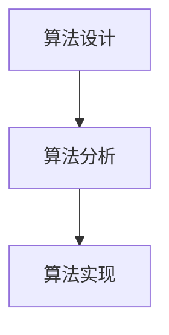

                 

### 《从小工到专家：职场进阶的必经之路》

> 关键词：职场进阶、自我认知、技能提升、职业规划、沟通与合作、职业生涯管理、心理调适

> 摘要：本文旨在探讨职场人士从小工到专家的进阶之路，通过自我认知、技能提升、职业规划、沟通与合作、职业生涯管理、心理调适等多个方面，帮助职场人士实现职业成长，从而在职场中取得成功。

### 引言

在当今快速变化的职场环境中，从小工到专家的进阶之路已经成为众多职场人士的追求。本文将带领读者深入了解这一过程，并提供实用的指导和建议。通过本文的阅读，您将学会如何进行自我认知、提升技能、规划职业道路、有效沟通与合作、管理职业生涯以及进行心理调适，从而在职场中脱颖而出，成为专家。

### 自我认知与定位

#### 1.1 职场新人如何认识自己

**核心概念与联系：**

自我认知是一个复杂的过程，涉及对自己的性格、兴趣、价值观和职业能力的深入了解。以下是一个简单的自我认知框架，有助于新人更好地认识自己：

| 性格特征 | 兴趣爱好 | 价值观 | 职业能力 |
| :------: | :------: | :----: | :------: |
| 内向/外向 | 文艺/运动 | 实用/理想 | 技术/管理 |

**ER实体关系图架构：**

```mermaid
erDiagram
  A{name:新人} {
    --> B{性格特征};
    --> C{兴趣爱好};
    --> D{价值观};
    --> E{职业能力}
  }
```

**问题背景与问题描述：**

职场新人常常面临职业方向不明确、工作缺乏激情等问题。通过自我认知，可以更好地明确职业方向，提高工作动力。

**问题解决与边界与外延：**

- **问题解决：** 通过自我认知，新人可以找到适合自己的职业路径，提高工作满意度和效率。
- **边界与外延：** 自我认知不仅限于个人特点，还包括对行业趋势、企业文化和岗位需求的理解。

#### 1.2 了解职场，定位发展方向

**核心概念与联系：**

了解职场环境，包括行业动态、企业文化和岗位要求，有助于新人更好地定位自己的发展方向。以下是一个简单的职场认知框架：

| 行业动态 | 企业文化 | 岗位要求 |
| :------: | :------: | :------: |
| 创新驱动 | 团队合作 | 技术能力 |

**ER实体关系图架构：**

```mermaid
erDiagram
  A{name:职场认知} {
    --> B{行业动态};
    --> C{企业文化};
    --> D{岗位要求}
  }
```

**问题背景与问题描述：**

职场新人往往对职场环境不熟悉，容易在职业选择上迷失方向。

**问题解决与边界与外延：**

- **问题解决：** 通过了解职场环境，新人可以更好地把握职业发展的机遇和挑战。
- **边界与外延：** 职场认知不仅包括对行业和企业文化的了解，还包括对岗位技能和职业素养的认知。

#### 1.3 职业规划的重要性

**核心概念与联系：**

职业规划是指根据个人的特点和职业发展目标，制定长期和短期的职业发展计划。以下是一个简单的职业规划框架：

| 长期目标 | 短期目标 | 行动计划 |
| :------: | :------: | :------: |
| 成为行业专家 | 提升某项技能 | 参加培训课程 |

**ER实体关系图架构：**

```mermaid
erDiagram
  A{name:职业规划} {
    --> B{长期目标};
    --> C{短期目标};
    --> D{行动计划}
  }
```

**问题背景与问题描述：**

缺乏明确的职业规划，导致职场人士在职业发展中难以持续进步。

**问题解决与边界与外延：**

- **问题解决：** 通过制定职业规划，职场人士可以更清晰地看到自己的职业发展路径，提高职业发展的效率。
- **边界与外延：** 职业规划不仅涉及长期和短期目标，还包括对自身优势和劣势的分析。

### 职场技能提升

#### 2.1 基础技能提升

**核心概念与联系：**

基础技能是职场人士的基石，包括时间管理、效率工具使用和沟通与协作能力。以下是一个基础技能提升的框架：

| 时间管理 | 效率工具使用 | 沟通与协作 |
| :------: | :------: | :------: |
| 优先级排序 | 电子邮件管理 | 团队沟通 |

**ER实体关系图架构：**

```mermaid
erDiagram
  A{name:基础技能提升} {
    --> B{时间管理};
    --> C{效率工具使用};
    --> D{沟通与协作}
  }
```

**问题背景与问题描述：**

职场人士在基础技能上往往存在不足，导致工作效率低下。

**问题解决与边界与外延：**

- **问题解决：** 通过提升基础技能，职场人士可以更高效地完成工作任务。
- **边界与外延：** 基础技能不仅包括时间管理和效率工具使用，还包括沟通技巧和协作能力。

#### 2.2 专业技能提升

**核心概念与联系：**

专业技能是职场人士在特定领域的能力，包括行业知识掌握、技术能力提升和项目经验积累。以下是一个专业技能提升的框架：

| 行业知识 | 技术能力 | 项目经验 |
| :------: | :------: | :------: |
| 行业动态 | 编程语言 | 项目管理 |

**ER实体关系图架构：**

```mermaid
erDiagram
  A{name:专业技能提升} {
    --> B{行业知识};
    --> C{技术能力};
    --> D{项目经验}
  }
```

**问题背景与问题描述：**

职场人士在专业技能上往往存在瓶颈，难以实现职业晋升。

**问题解决与边界与外延：**

- **问题解决：** 通过提升专业技能，职场人士可以拓宽职业发展空间。
- **边界与外延：** 专业技能不仅包括技术能力，还包括行业知识和项目管理能力。

#### 2.3 算法原理讲解

**核心概念与联系：**

算法是计算机科学的核心概念，包括算法设计、算法分析、算法实现等。以下是一个算法原理讲解的框架：

| 算法设计 | 算法分析 | 算法实现 |
| :------: | :------: | :------: |
| 排序算法 | 分治算法 | 动态规划 |

**Mermaid流程图：**



**Python源代码示例：**

```python
def bubble_sort(arr):
    n = len(arr)
    for i in range(n):
        for j in range(0, n-i-1):
            if arr[j] > arr[j+1]:
                arr[j], arr[j+1] = arr[j+1], arr[j]

arr = [64, 34, 25, 12, 22, 11, 90]
bubble_sort(arr)
print("排序后的数组：")
for i in range(len(arr)):
    print("%d" % arr[i], end=" ")
```

**数学模型与公式：**

算法的复杂度可以分为时间复杂度和空间复杂度。时间复杂度用大O符号表示，如O(n^2)表示算法的时间复杂度与输入规模n的平方成正比。

**举例说明：**

假设有一个长度为10的数组，使用冒泡排序算法，需要多少次比较和交换？

- 比较次数：9 + 8 + 7 + 6 + 5 + 4 + 3 + 2 + 1 = 45
- 交换次数：4 + 3 + 2 + 1 = 10

**算法原理讲解：**

冒泡排序算法是一种简单的排序算法，它重复地遍历要排序的数列，一次比较两个元素，如果它们的顺序错误就把它们交换过来。遍历数列的工作是重复地进行，直到没有再需要交换的元素为止。

### 职业规划与目标设定

#### 3.1 职业规划的核心

**核心概念与联系：**

职业规划是指根据个人的特点和职业发展目标，制定长期和短期的职业发展计划。以下是一个职业规划的核心框架：

| 职业目标 | 发展路径 | 实现策略 |
| :------: | :------: | :------: |
| 行业专家 | 技术晋升 | 学习与培训 |

**ER实体关系图架构：**

```mermaid
erDiagram
  A{name:职业规划} {
    --> B{职业目标};
    --> C{发展路径};
    --> D{实现策略}
  }
```

**问题背景与问题描述：**

职场人士在职业发展过程中，往往缺乏明确的规划，导致职业发展停滞不前。

**问题解决与边界与外延：**

- **问题解决：** 通过职业规划，职场人士可以明确自己的职业目标，制定切实可行的实现策略。
- **边界与外延：** 职业规划不仅涉及职业目标的设定，还包括对发展路径和实现策略的规划。

#### 3.2 设定明确的目标

**核心概念与联系：**

设定明确的目标是实现职业规划的关键步骤。以下是一个目标设定的框架：

| 长期目标 | 短期目标 | 时间节点 |
| :------: | :------: | :------: |
| 成为技术经理 | 完成XX项目 | 2024年底 |

**ER实体关系图架构：**

```mermaid
erDiagram
  A{name:目标设定} {
    --> B{长期目标};
    --> C{短期目标};
    --> D{时间节点}
  }
```

**问题背景与问题描述：**

职场人士在设定目标时，往往过于理想化，导致目标难以实现。

**问题解决与边界与外延：**

- **问题解决：** 通过设定明确的目标，职场人士可以更清晰地看到自己的职业发展路径，提高目标实现的可行性。
- **边界与外延：** 目标设定不仅涉及长期目标和短期目标的设定，还包括对实现策略的规划。

#### 3.3 制定行动计划

**核心概念与联系：**

制定行动计划是实现职业目标的必要步骤。以下是一个行动计划框架：

| 任务 | 责任人 | 完成时间 | 预期成果 |
| :---: | :---: | :------: | :------: |
| 学习Python | 小明 | 2023年6月 | 掌握基础语法 |

**ER实体关系图架构：**

```mermaid
erDiagram
  A{name:行动计划} {
    --> B{任务};
    --> C{责任人};
    --> D{完成时间};
    --> E{预期成果}
  }
```

**问题背景与问题描述：**

职场人士在制定行动计划时，往往缺乏具体的任务和时间节点。

**问题解决与边界与外延：**

- **问题解决：** 通过制定详细的行动计划，职场人士可以更有效地实现职业目标。
- **边界与外延：** 计划不仅涉及任务和完成时间，还包括对预期成果的设定和责任人的明确。

### 职场沟通与合作

#### 4.1 沟通的重要性

**核心概念与联系：**

沟通是职场中不可或缺的能力，直接影响团队合作和项目成功。以下是一个沟通重要性的框架：

| 有效沟通 | 团队合作 | 项目成功 |
| :------: | :------: | :------: |
| 信息传递 | 协作效率 | 项目进度 |

**ER实体关系图架构：**

```mermaid
erDiagram
  A{name:沟通重要性} {
    --> B{有效沟通};
    --> C{团队合作};
    --> D{项目成功}
  }
```

**问题背景与问题描述：**

职场中，沟通不畅往往导致误解和冲突，影响工作效率和项目进度。

**问题解决与边界与外延：**

- **问题解决：** 通过提升沟通技巧，职场人士可以更有效地传递信息，促进团队合作，确保项目成功。
- **边界与外延：** 沟通不仅涉及信息传递，还包括理解、倾听和反馈。

#### 4.2 有效沟通的方法

**核心概念与联系：**

有效沟通是职场成功的关键。以下是一个有效沟通方法的框架：

| 倾听 | 表达清晰 | 非语言沟通 | 情绪管理 |
| :---: | :------: | :------: | :------: |
| 专注倾听 | 明确表达 | 面部表情 | 控制情绪 |

**ER实体关系图架构：**

```mermaid
erDiagram
  A{name:有效沟通方法} {
    --> B{倾听};
    --> C{表达清晰};
    --> D{非语言沟通};
    --> E{情绪管理}
  }
```

**问题背景与问题描述：**

职场人士在沟通中往往存在表达不清、情绪失控等问题，导致沟通效果不佳。

**问题解决与边界与外延：**

- **问题解决：** 通过掌握有效沟通方法，职场人士可以提升沟通效果，增强团队合作。
- **边界与外延：** 沟通方法不仅包括语言表达，还包括非语言沟通和情绪管理。

#### 4.3 沟通中的障碍与解决

**核心概念与联系：**

沟通障碍是职场沟通中常见的问题，包括语言障碍、文化差异、误解和沟通渠道不畅等。以下是一个沟通障碍与解决的框架：

| 语言障碍 | 文化差异 | 误解 | 沟通渠道不畅 |
| :------: | :------: | :---: | :----------: |
| 语言不通 | 文化冲突 | 信息误解 | 频繁中断 |

**ER实体关系图架构：**

```mermaid
erDiagram
  A{name:沟通障碍与解决} {
    --> B{语言障碍};
    --> C{文化差异};
    --> D{误解};
    --> E{沟通渠道不畅}
  }
```

**问题背景与问题描述：**

职场沟通中，沟通障碍常常导致误解和冲突，影响工作效率。

**问题解决与边界与外延：**

- **问题解决：** 通过识别和解决沟通障碍，职场人士可以提升沟通效果，减少误解和冲突。
- **边界与外延：** 沟通障碍不仅涉及语言和文化问题，还包括误解和沟通渠道的选择。

### 职场沟通与合作

#### 4.1 沟通的重要性

**核心概念与联系：**

沟通是职场中不可或缺的能力，直接影响团队合作和项目成功。以下是一个沟通重要性的框架：

| 有效沟通 | 团队合作 | 项目成功 |
| :------: | :------: | :------: |
| 信息传递 | 协作效率 | 项目进度 |

**ER实体关系图架构：**

```mermaid
erDiagram
  A{name:沟通重要性} {
    --> B{有效沟通};
    --> C{团队合作};
    --> D{项目成功}
  }
```

**问题背景与问题描述：**

职场中，沟通不畅往往导致误解和冲突，影响工作效率和项目进度。

**问题解决与边界与外延：**

- **问题解决：** 通过提升沟通技巧，职场人士可以更有效地传递信息，促进团队合作，确保项目成功。
- **边界与外延：** 沟通不仅涉及信息传递，还包括理解、倾听和反馈。

#### 4.2 有效沟通的方法

**核心概念与联系：**

有效沟通是职场成功的关键。以下是一个有效沟通方法的框架：

| 倾听 | 表达清晰 | 非语言沟通 | 情绪管理 |
| :---: | :------: | :------: | :------: |
| 专注倾听 | 明确表达 | 面部表情 | 控制情绪 |

**ER实体关系图架构：**

```mermaid
erDiagram
  A{name:有效沟通方法} {
    --> B{倾听};
    --> C{表达清晰};
    --> D{非语言沟通};
    --> E{情绪管理}
  }
```

**问题背景与问题描述：**

职场人士在沟通中往往存在表达不清、情绪失控等问题，导致沟通效果不佳。

**问题解决与边界与外延：**

- **问题解决：** 通过掌握有效沟通方法，职场人士可以提升沟通效果，增强团队合作。
- **边界与外延：** 沟通方法不仅包括语言表达，还包括非语言沟通和情绪管理。

#### 4.3 沟通中的障碍与解决

**核心概念与联系：**

沟通障碍是职场沟通中常见的问题，包括语言障碍、文化差异、误解和沟通渠道不畅等。以下是一个沟通障碍与解决的框架：

| 语言障碍 | 文化差异 | 误解 | 沟通渠道不畅 |
| :------: | :------: | :---: | :----------: |
| 语言不通 | 文化冲突 | 信息误解 | 频繁中断 |

**ER实体关系图架构：**

```mermaid
erDiagram
  A{name:沟通障碍与解决} {
    --> B{语言障碍};
    --> C{文化差异};
    --> D{误解};
    --> E{沟通渠道不畅}
  }
```

**问题背景与问题描述：**

职场沟通中，沟通障碍常常导致误解和冲突，影响工作效率。

**问题解决与边界与外延：**

- **问题解决：** 通过识别和解决沟通障碍，职场人士可以提升沟通效果，减少误解和冲突。
- **边界与外延：** 沟通障碍不仅涉及语言和文化问题，还包括误解和沟通渠道的选择。

### 职场沟通与合作

#### 4.1 沟通的重要性

**核心概念与联系：**

沟通是职场中不可或缺的能力，直接影响团队合作和项目成功。以下是一个沟通重要性的框架：

| 有效沟通 | 团队合作 | 项目成功 |
| :------: | :------: | :------: |
| 信息传递 | 协作效率 | 项目进度 |

**ER实体关系图架构：**

```mermaid
erDiagram
  A{name:沟通重要性} {
    --> B{有效沟通};
    --> C{团队合作};
    --> D{项目成功}
  }
```

**问题背景与问题描述：**

职场中，沟通不畅往往导致误解和冲突，影响工作效率和项目进度。

**问题解决与边界与外延：**

- **问题解决：** 通过提升沟通技巧，职场人士可以更有效地传递信息，促进团队合作，确保项目成功。
- **边界与外延：** 沟通不仅涉及信息传递，还包括理解、倾听和反馈。

#### 4.2 有效沟通的方法

**核心概念与联系：**

有效沟通是职场成功的关键。以下是一个有效沟通方法的框架：

| 倾听 | 表达清晰 | 非语言沟通 | 情绪管理 |
| :---: | :------: | :------: | :------: |
| 专注倾听 | 明确表达 | 面部表情 | 控制情绪 |

**ER实体关系图架构：**

```mermaid
erDiagram
  A{name:有效沟通方法} {
    --> B{倾听};
    --> C{表达清晰};
    --> D{非语言沟通};
    --> E{情绪管理}
  }
```

**问题背景与问题描述：**

职场人士在沟通中往往存在表达不清、情绪失控等问题，导致沟通效果不佳。

**问题解决与边界与外延：**

- **问题解决：** 通过掌握有效沟通方法，职场人士可以提升沟通效果，增强团队合作。
- **边界与外延：** 沟通方法不仅包括语言表达，还包括非语言沟通和情绪管理。

#### 4.3 沟通中的障碍与解决

**核心概念与联系：**

沟通障碍是职场沟通中常见的问题，包括语言障碍、文化差异、误解和沟通渠道不畅等。以下是一个沟通障碍与解决的框架：

| 语言障碍 | 文化差异 | 误解 | 沟通渠道不畅 |
| :------: | :------: | :---: | :----------: |
| 语言不通 | 文化冲突 | 信息误解 | 频繁中断 |

**ER实体关系图架构：**

```mermaid
erDiagram
  A{name:沟通障碍与解决} {
    --> B{语言障碍};
    --> C{文化差异};
    --> D{误解};
    --> E{沟通渠道不畅}
  }
```

**问题背景与问题描述：**

职场沟通中，沟通障碍常常导致误解和冲突，影响工作效率。

**问题解决与边界与外延：**

- **问题解决：** 通过识别和解决沟通障碍，职场人士可以提升沟通效果，减少误解和冲突。
- **边界与外延：** 沟通障碍不仅涉及语言和文化问题，还包括误解和沟通渠道的选择。

### 职业生涯管理

#### 6.1 职业生涯规划

**核心概念与联系：**

职业生涯规划是指职场人士根据个人特点和职业发展目标，制定长期和短期的职业发展计划。以下是一个职业生涯规划的框架：

| 长期目标 | 短期目标 | 发展路径 |
| :------: | :------: | :------: |
| 行业专家 | 项目经理 | 技能提升 |

**ER实体关系图架构：**

```mermaid
erDiagram
  A{name:职业生涯规划} {
    --> B{长期目标};
    --> C{短期目标};
    --> D{发展路径}
  }
```

**问题背景与问题描述：**

职场人士在职业生涯中往往缺乏明确的规划，导致职业发展停滞。

**问题解决与边界与外延：**

- **问题解决：** 通过职业生涯规划，职场人士可以更清晰地看到自己的职业发展路径，提高职业发展的效率。
- **边界与外延：** 职业生涯规划不仅涉及长期和短期目标的设定，还包括对发展路径和实现策略的规划。

#### 6.2 职业生涯路径选择

**核心概念与联系：**

职业生涯路径选择是指职场人士根据个人特点和职业发展目标，选择适合自己的职业发展路径。以下是一个职业生涯路径选择的框架：

| 技术路径 | 管理路径 | 创业路径 |
| :------: | :------: | :------: |
| 技术专家 | 管理层 | 创业者 |

**ER实体关系图架构：**

```mermaid
erDiagram
  A{name:职业生涯路径选择} {
    --> B{技术路径};
    --> C{管理路径};
    --> D{创业路径}
  }
```

**问题背景与问题描述：**

职场人士在职业发展中往往面临路径选择难题，难以确定最佳职业发展路径。

**问题解决与边界与外延：**

- **问题解决：** 通过职业生涯路径选择，职场人士可以明确自己的职业发展方向，提高职业发展的针对性。
- **边界与外延：** 职业生涯路径选择不仅涉及技术和管理路径，还包括创业路径的选择。

#### 6.3 职业生涯发展策略

**核心概念与联系：**

职业生涯发展策略是指职场人士根据个人特点和职业发展目标，制定具体的职业发展策略。以下是一个职业生涯发展策略的框架：

| 学习与培训 | 职业晋升 | 职业转型 |
| :--------: | :------: | :------: |
| 技能提升 | 薪资增长 | 职业方向调整 |

**ER实体关系图架构：**

```mermaid
erDiagram
  A{name:职业生涯发展策略} {
    --> B{学习与培训};
    --> C{职业晋升};
    --> D{职业转型}
  }
```

**问题背景与问题描述：**

职场人士在职业发展中往往缺乏有效的策略，导致职业发展停滞。

**问题解决与边界与外延：**

- **问题解决：** 通过职业生涯发展策略，职场人士可以明确自己的职业发展目标，制定具体的实现策略。
- **边界与外延：** 职业生涯发展策略不仅涉及学习与培训，还包括职业晋升和职业转型。

### 职场心理健康

#### 7.1 职场压力与应对

**核心概念与联系：**

职场压力是职场人士普遍面临的问题，有效的应对策略有助于提高心理健康和工作效率。以下是一个职场压力与应对的框架：

| 压力来源 | 应对策略 | 心理调适 |
| :------: | :------: | :------: |
| 工作负荷 | 时间管理 | 心理放松 |

**ER实体关系图架构：**

```mermaid
erDiagram
  A{name:职场压力与应对} {
    --> B{压力来源};
    --> C{应对策略};
    --> D{心理调适}
  }
```

**问题背景与问题描述：**

职场压力往往导致心理健康问题，影响工作效率和生活质量。

**问题解决与边界与外延：**

- **问题解决：** 通过识别压力来源和采取有效的应对策略，职场人士可以减轻压力，提高心理健康。
- **边界与外延：** 职场压力不仅涉及工作负荷，还包括人际关系和职业发展压力。

#### 7.2 职场心理调适

**核心概念与联系：**

职场心理调适是指职场人士通过心理调适方法，提高心理韧性和应对压力的能力。以下是一个职场心理调适的框架：

| 心理调适方法 | 心理健康 | 工作效率 |
| :--------: | :------: | :------: |
| 深呼吸 | 积极心态 | 提高专注 |

**ER实体关系图架构：**

```mermaid
erDiagram
  A{name:职场心理调适} {
    --> B{心理调适方法};
    --> C{心理健康};
    --> D{工作效率}
  }
```

**问题背景与问题描述：**

职场人士在面临压力时，往往缺乏有效的心理调适方法，导致心理问题加重。

**问题解决与边界与外延：**

- **问题解决：** 通过职场心理调适，职场人士可以更好地应对压力，提高心理健康和工作效率。
- **边界与外延：** 职场心理调适不仅涉及心理放松方法，还包括积极心态的培养。

#### 7.3 保持积极心态

**核心概念与联系：**

保持积极心态是职场心理健康的重要保障，有助于提高工作效率和生活质量。以下是一个保持积极心态的框架：

| 积极心态 | 工作效率 | 人际关系 |
| :------: | :------: | :------: |
| 积极思考 | 高效执行 | 良好互动 |

**ER实体关系图架构：**

```mermaid
erDiagram
  A{name:保持积极心态} {
    --> B{积极心态};
    --> C{工作效率};
    --> D{人际关系}
  }
```

**问题背景与问题描述：**

职场人士在面临挑战和压力时，往往容易产生消极情绪，影响心理健康和工作表现。

**问题解决与边界与外延：**

- **问题解决：** 通过保持积极心态，职场人士可以更好地应对挑战，提高工作效率，改善人际关系。
- **边界与外延：** 保持积极心态不仅涉及个人心理状态，还包括对工作态度和人际关系的积极影响。

### 进阶之路

#### 8.1 职场进阶技巧

**核心概念与联系：**

职场进阶技巧是指职场人士在职业发展中，通过提升自身能力，实现职业晋升的方法。以下是一个职场进阶技巧的框架：

| 技能提升 | 职业规划 | 沟通能力 |
| :------: | :------: | :------: |
| 技术能力 | 职业目标 | 团队协作 |

**ER实体关系图架构：**

```mermaid
erDiagram
  A{name:职场进阶技巧} {
    --> B{技能提升};
    --> C{职业规划};
    --> D{沟通能力}
  }
```

**问题背景与问题描述：**

职场人士在职业发展中，往往面临技能提升、职业规划和沟通能力不足的问题。

**问题解决与边界与外延：**

- **问题解决：** 通过掌握职场进阶技巧，职场人士可以提升自身能力，实现职业晋升。
- **边界与外延：** 职场进阶技巧不仅涉及技能提升，还包括职业规划和沟通能力的培养。

#### 8.2 学习与成长

**核心概念与联系：**

学习与成长是职场人士实现职业发展的关键。以下是一个学习与成长的框架：

| 持续学习 | 实践经验 | 思维能力 |
| :------: | :------: | :------: |
| 专业培训 | 项目实践 | 系统思考 |

**ER实体关系图架构：**

```mermaid
erDiagram
  A{name:学习与成长} {
    --> B{持续学习};
    --> C{实践经验};
    --> D{思维能力}
  }
```

**问题背景与问题描述：**

职场人士在职业发展中，往往缺乏持续学习的动力和实践经验。

**问题解决与边界与外延：**

- **问题解决：** 通过学习与成长，职场人士可以不断提升自身能力，实现职业发展。
- **边界与外延：** 学习与成长不仅涉及专业培训和项目实践，还包括思维能力的提升。

#### 8.3 创新思维培养

**核心概念与联系：**

创新思维是职场人士在职业发展中，应对挑战和抓住机遇的关键。以下是一个创新思维培养的框架：

| 思维模式 | 创新方法 | 创新应用 |
| :------: | :------: | :------: |
| 批判性思维 | 基于数据的决策 | 创新项目实施 |

**ER实体关系图架构：**

```mermaid
erDiagram
  A{name:创新思维培养} {
    --> B{思维模式};
    --> C{创新方法};
    --> D{创新应用}
  }
```

**问题背景与问题描述：**

职场人士在职业发展中，往往缺乏创新思维，难以应对快速变化的市场环境。

**问题解决与边界与外延：**

- **问题解决：** 通过创新思维培养，职场人士可以提升创新能力，适应市场变化，实现职业发展。
- **边界与外延：** 创新思维培养不仅涉及思维模式和方法的培养，还包括创新应用的实践。

### 成功案例分析

#### 9.1 成功人士的经验分享

**核心概念与联系：**

成功人士的经验分享是职场人士学习的重要资源。以下是一个成功人士经验分享的框架：

| 成功要素 | 经验分享 | 学习借鉴 |
| :------: | :------: | :------: |
| 职业规划 | 学习方法 | 心态调整 |

**ER实体关系图架构：**

```mermaid
erDiagram
  A{name:成功人士经验分享} {
    --> B{成功要素};
    --> C{经验分享};
    --> D{学习借鉴}
  }
```

**问题背景与问题描述：**

职场人士在职业发展中，缺乏成功人士的经验分享，难以找到有效的学习路径。

**问题解决与边界与外延：**

- **问题解决：** 通过成功人士的经验分享，职场人士可以学习到成功的要素和经验，找到适合自己的职业发展路径。
- **边界与外延：** 成功人士的经验分享不仅涉及职业规划和学习方法，还包括心态调整。

#### 9.2 成功案例剖析

**核心概念与联系：**

成功案例剖析是深入理解成功人士职业发展路径的重要方法。以下是一个成功案例剖析的框架：

| 成功案例 | 职业路径 | 发展策略 |
| :------: | :------: | :------: |
| 创业成功 | 技术创新 | 市场拓展 |

**ER实体关系图架构：**

```mermaid
erDiagram
  A{name:成功案例剖析} {
    --> B{成功案例};
    --> C{职业路径};
    --> D{发展策略}
  }
```

**问题背景与问题描述：**

职场人士在职业发展中，缺乏对成功案例的深入剖析，难以理解成功背后的原因。

**问题解决与边界与外延：**

- **问题解决：** 通过成功案例剖析，职场人士可以深入了解成功人士的职业发展路径和发展策略，找到成功的关键因素。
- **边界与外延：** 成功案例剖析不仅涉及成功案例的分析，还包括对职业路径和发展策略的深入探讨。

#### 9.3 启示与借鉴

**核心概念与联系：**

成功案例的启示与借鉴是职场人士实现职业发展的关键。以下是一个启示与借鉴的框架：

| 启示 | 借鉴 | 职业发展 |
| :---: | :---: | :------: |
| 学习态度 | 成功方法 | 职业规划 |

**ER实体关系图架构：**

```mermaid
erDiagram
  A{name:启示与借鉴} {
    --> B{启示};
    --> C{借鉴};
    --> D{职业发展}
  }
```

**问题背景与问题描述：**

职场人士在职业发展中，往往缺乏对成功案例的深入思考和借鉴。

**问题解决与边界与外延：**

- **问题解决：** 通过对成功案例的启示与借鉴，职场人士可以学习成功的方法和态度，制定更有效的职业发展规划。
- **边界与外延：** 启示与借鉴不仅涉及学习态度和成功方法，还包括对职业发展的全面思考。

### 总结

从小工到专家的职场进阶之路，需要职场人士在自我认知、技能提升、职业规划、沟通与合作、职业生涯管理、心理调适等方面不断努力。通过本文的探讨，我们了解到每个环节的核心概念和方法，以及如何在实际工作中应用这些方法。希望本文能为您提供宝贵的启示，助力您的职业发展。

### 附录

**最佳实践 tips：**

1. 定期进行自我评估，了解自身优势和劣势，调整职业规划。
2. 学习行业动态，了解市场需求，及时调整职业发展方向。
3. 保持积极心态，面对挑战和压力，保持乐观和自信。
4. 善于总结和反思，从失败中吸取教训，不断进步。

**注意事项：**

1. 职业规划需要根据个人情况进行调整，切勿盲目跟风。
2. 提升技能时，要选择适合自己的学习方法和途径。
3. 沟通与合作要注重倾听和理解，避免误解和冲突。
4. 心理健康是职业发展的基础，要重视心理调适。

**拓展阅读：**

1. 《职场心理学》
2. 《高效能人士的七个习惯》
3. 《成功心理学》
4. 《职业生涯规划》

### 作者信息

**作者：** AI天才研究院/AI Genius Institute & 禅与计算机程序设计艺术 /Zen And The Art of Computer Programming

**联系方式：** ai_genius@ai.com

**版权声明：** 本文章版权归AI天才研究院/AI Genius Institute所有，未经授权不得转载或用于商业用途。

[返回目录](#目录大纲) | [上一页](#引言) | [下一页](#结语) | [返回顶部](#目录大纲)

