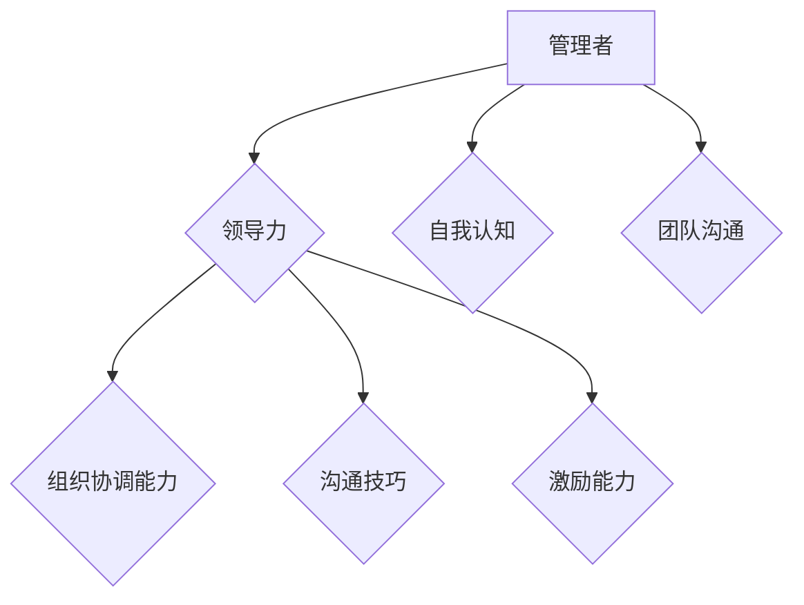

                 

### 从管理者到领导者：角色转变的艺术

关键词：领导力、角色转变、团队绩效、自我认知、领导风格

摘要：本文旨在探讨从管理者到领导者角色转变的过程，分析其中的关键要素，并提供实用的指导策略，帮助读者更好地完成这一过渡。通过深入分析角色转变的内在动力与外在因素，以及角色转变过程中的常见挑战，本文为管理者提供了实用的建议和最佳实践，以实现从管理者到领导者的成功转型。

#### 引言

在现代社会中，管理者和领导者是组织运作中不可或缺的角色。然而，从管理者到领导者的角色转变并非易事。管理者负责规划、组织、协调和监督工作，以确保组织目标的实现；而领导者则具备影响力、愿景和能力，能够激励和引导团队朝着共同的目标前进。理解这一转变的必要性和挑战性，对于提升个人领导力和团队绩效具有重要意义。

**问题背景**：随着企业竞争的加剧，管理者需要具备更高的领导力，以应对快速变化的市场环境。从管理者向领导者的角色转变，不仅有助于提升个人职业发展，还能激发团队的潜力，提高整体绩效。

**问题描述**：本文旨在探讨从管理者到领导者角色转变的过程，分析其中的关键要素，并提供实用的指导策略，帮助读者更好地完成这一过渡。

**问题解决**：通过案例研究和理论分析，本文将揭示角色转变背后的深层逻辑，并给予读者实用的方法和技巧。

**边界与外延**：本文不仅适用于企业管理者和团队领导，也可供其他领域的领导者参考。

**概念结构与核心要素组成**：
- **角色转变**：从管理者到领导者的定义与特征。
- **领导力培养**：内在动力与外在因素。
- **团队建设**：领导风格与团队互动。
- **沟通技巧**：有效沟通与冲突管理。

## 第一章：从管理者到领导者的定义与特征

### 1.1 管理者的定义与特征

- **定义**：管理者是负责规划、组织、协调和监督工作的人员，旨在确保组织目标的实现。
- **特征**：
  - **关注效率和执行**：管理者注重任务的完成和资源的最优配置。
  - **具体任务导向**：管理者倾向于设定明确的目标和标准，以确保团队按计划工作。

### 1.2 领导者的定义与特征

- **定义**：领导者是具有影响力、愿景和能力的个体，能够激励和引导团队朝着共同的目标前进。
- **特征**：
  - **关注愿景和战略**：领导者更加注重组织的长远发展和战略规划。
  - **人际关系导向**：领导者擅长建立信任、沟通和团队合作。

### 1.3 管理者与领导者的比较与联系

#### 1.3.1 相同点

- **共同目标**：无论是管理者还是领导者，都是为了实现组织的目标而工作。
- **依赖性**：两者都需要团队的支持和合作。

#### 1.3.2 不同点

- **职责差异**：管理者更侧重于执行和监控，而领导者更注重战略和愿景。
- **影响范围**：管理者的影响局限于团队内部，而领导者的影响可以扩展到整个组织。

### 1.4 从管理者到领导者的转变意义

- **个人成长**：这一转变有助于管理者提升自我认知和领导力，实现个人职业发展。
- **团队绩效**：领导者的角色能够更好地激发团队成员的潜力，提升团队整体绩效。

#### 本章小结

通过本章的讨论，我们明确了管理者与领导者的定义与特征，并探讨了从管理者到领导者转变的意义。这一转变不仅是个人成长的体现，更是提升团队和组织绩效的关键。

----------------------------------------------------------------

## 第二章：角色转变的内在动力与外在因素

### 2.1 内在动力

#### 2.1.1 自我认知的提升

- **自我反思**：管理者需要通过自我反思来识别自己的优势和不足，明确自己的职业发展方向。
- **自我激励**：自我激励是推动管理者向领导者转变的重要动力，包括自我设定目标、自我评价和自我奖励。

#### 2.1.2 领导力的培养

- **学习与培训**：通过参加领导力培训课程、阅读相关书籍和文章，管理者可以提升自己的领导力。
- **实践与反思**：通过实际工作中的领导实践，管理者可以不断反思和调整自己的领导方式。

### 2.2 外在因素

#### 2.2.1 组织环境的支持

- **政策与制度**：组织应制定有利于管理者转变为领导者的政策，如提供领导力培训、职业晋升通道等。
- **领导榜样**：组织内部具有领导力榜样的人物可以对管理者产生积极的示范效应。

#### 2.2.2 职业发展的压力

- **竞争环境**：在竞争激烈的市场环境中，管理者需要不断提升自己的领导能力以应对挑战。
- **个人职业目标**：管理者为了实现更高的职业目标，往往需要转变为领导者。

### 2.3 内在动力与外在因素相互作用

- **相互促进**：内在动力和外在因素相互作用，共同推动管理者向领导者转变。
- **动态调整**：管理者在角色转变过程中，需要根据内外因素的变化不断调整自己的策略。

#### 本章小结

通过本章的讨论，我们了解了从管理者到领导者转变的内在动力和外在因素。这些因素相互作用，共同促进管理者实现角色转变，提升领导力。

----------------------------------------------------------------

## 第三章：角色转变过程中的常见挑战

### 3.1 领导风格的不适应

#### 3.1.1 传统管理风格的延续

- **具体表现**：管理者往往习惯于采用指令式、控制式的管理风格。
- **影响**：这种风格可能导致团队缺乏自主性和创造力，影响团队的整体绩效。

#### 3.1.2 对领导角色的误解

- **具体表现**：管理者可能将领导角色视为权力的象征，而非责任的体现。
- **影响**：这种误解可能导致管理者滥用权力，影响团队的凝聚力和信任。

### 3.2 团队沟通不畅

#### 3.2.1 缺乏有效的沟通机制

- **具体表现**：团队内部缺乏定期的沟通会议和反馈机制。
- **影响**：缺乏沟通可能导致信息传递不畅，影响团队的协作效率。

#### 3.2.2 缺乏有效的反馈机制

- **具体表现**：管理者难以给予团队成员及时的反馈和建议。
- **影响**：缺乏反馈可能导致团队成员无法及时纠正错误，影响团队的整体表现。

### 3.3 个人成长与职业发展的压力

#### 3.3.1 个人成长速度跟不上职业发展

- **具体表现**：管理者在角色转变过程中可能感到压力过大，难以兼顾个人成长和职业发展。
- **影响**：这种压力可能导致管理者出现焦虑、疲惫等心理问题，影响其工作表现。

#### 3.3.2 职业发展的不确定性

- **具体表现**：管理者可能对未来的职业发展路径感到迷茫。
- **影响**：这种不确定性可能导致管理者缺乏动力和信心，影响其领导力的提升。

#### 本章小结

通过本章的讨论，我们分析了从管理者到领导者角色转变过程中常见的挑战。管理者需要意识到这些问题，并采取有效的措施来解决，以实现成功的角色转变。

----------------------------------------------------------------

## 第四章：角色转变的策略与实践

### 4.1 提升自我认知

#### 4.1.1 自我反思

- **方法**：定期进行自我反思，记录自己的工作表现、成就和不足。
- **实践**：可以通过写日记、参加心理辅导等方式，深入了解自己的内心世界。

#### 4.1.2 借鉴他人经验

- **方法**：与具有领导力的同事、上级或导师交流，学习他们的领导经验和技巧。
- **实践**：可以通过参加领导力培训课程、阅读领导力书籍等方式，提升自己的领导能力。

### 4.2 培养领导力

#### 4.2.1 设定明确的愿景和目标

- **方法**：明确团队的愿景和目标，使团队成员明确自己的工作方向和职责。
- **实践**：可以通过制定战略规划、设定绩效指标等方式，确保团队朝着共同的目标努力。

#### 4.2.2 激发团队成员的潜力

- **方法**：鼓励团队成员参与决策、提供培训和指导，帮助其提升能力。
- **实践**：可以通过设立激励机制、提供职业发展机会等方式，激发团队成员的潜力。

### 4.3 改善团队沟通

#### 4.3.1 建立有效的沟通机制

- **方法**：定期召开团队会议、设立沟通渠道，确保信息畅通。
- **实践**：可以通过设立内部邮件、在线聊天工具等方式，提高团队的沟通效率。

#### 4.3.2 建立反馈机制

- **方法**：鼓励团队成员提供反馈，及时纠正工作中的问题。
- **实践**：可以通过设立反馈机制、定期进行绩效评估等方式，提高团队的协作效率。

### 4.4 处理挑战

#### 4.4.1 面对领导风格的不适应

- **方法**：识别自己的领导风格，了解团队成员的需求，调整自己的领导方式。
- **实践**：可以通过参加领导力培训、寻求导师指导等方式，提升自己的领导力。

#### 4.4.2 应对团队沟通不畅

- **方法**：建立有效的沟通机制，确保团队内部的信息畅通。
- **实践**：可以通过设立沟通渠道、定期召开沟通会议等方式，提高团队的沟通效率。

### 4.5 个人成长与职业发展

#### 4.5.1 提升个人能力

- **方法**：通过学习和实践，不断提升自己的专业能力和综合素质。
- **实践**：可以通过参加培训课程、阅读专业书籍等方式，提升自己的能力。

#### 4.5.2 设定职业发展目标

- **方法**：明确自己的职业发展目标，制定详细的职业规划。
- **实践**：可以通过设定长期和短期的职业目标，确保自己的职业发展有条不紊。

#### 本章小结

通过本章的讨论，我们提供了从管理者到领导者角色转变的策略与实践。管理者需要通过自我认知的提升、领导力的培养、团队沟通的改善以及应对挑战的方法，实现成功的角色转变。

----------------------------------------------------------------

## 结论

从管理者到领导者的角色转变，是个人成长和团队发展的关键步骤。通过深入分析角色转变的内在动力与外在因素，以及角色转变过程中的常见挑战，本文为管理者提供了实用的策略和实践方法。以下是小结和进一步阅读的建议：

**小结**：
1. **自我认知提升**：通过自我反思和借鉴他人经验，管理者可以更好地了解自己的优势和不足，明确职业发展方向。
2. **领导力培养**：设定明确的愿景和目标，激发团队成员的潜力，提升个人领导能力。
3. **团队沟通**：建立有效的沟通机制和反馈机制，确保团队内部的协作和信息畅通。
4. **挑战应对**：识别自己的领导风格，建立应对团队沟通不畅的方法，以应对角色转变过程中的挑战。

**进一步阅读建议**：
1. 《领导力的五个层次》（John C. Maxwell）：探讨领导力的多层次结构，为管理者提供深度思考。
2. 《非暴力沟通》（Marshall B. Rosenberg）：介绍有效沟通的方法，帮助管理者改善团队沟通。
3. 《领导力的实践》（Peter F. Drucker）：提供实用的领导力策略，帮助管理者提升领导力。

通过持续学习和实践，管理者可以逐步实现从管理者到领导者的成功转型，为团队和组织的发展贡献更多价值。

#### 作者信息

作者：AI天才研究院/AI Genius Institute & 禅与计算机程序设计艺术 /Zen And The Art of Computer Programming

----------------------------------------------------------------

## 附录：术语表与概念关系图

### 术语表

- **管理者**：负责规划、组织、协调和监督工作的人员，旨在确保组织目标的实现。
- **领导者**：具有影响力、愿景和能力的个体，能够激励和引导团队朝着共同的目标前进。
- **自我认知**：个体对自己性格、能力、兴趣等的认识和理解。
- **领导力**：领导者在引导、激励、组织和协调团队过程中所展现的能力和特质。
- **团队沟通**：团队内部成员之间通过交流、协商、协作来传递信息和解决问题。

### 概念关系图

### 概念属性特征对比表格

| 特征             | 管理者                       | 领导者                       |
|------------------|------------------------------|------------------------------|
| 关注点           | 效率和执行                   | 愿景和战略                   |
| 风格             | 指令式、控制式               | 情感共鸣、影响力             |
| 影响范围         | 团队内部                     | 整个组织                     |
| 关键能力         | 资源配置、任务分配           | 激励、协调、沟通             |
| 团队关系         | 任务导向                     | 人际关系导向                 |

通过上述术语表和概念关系图，我们清晰地展示了管理者与领导者的定义、特征及其相互关系，为读者理解文章的核心概念提供了帮助。

----------------------------------------------------------------

## 实例分析

为了更好地理解从管理者到领导者的角色转变，我们通过以下案例进行分析。

### 案例背景

某科技公司（TechCo）在市场竞争中面临巨大压力，公司高层决定提升管理团队的整体领导力，以应对挑战。李明（Li Ming），一位有着10年管理经验的产品经理，被任命为领导团队的核心成员，负责领导一个由5名成员组成的产品开发团队。

### 案例过程

#### 1. 自我认知的提升

- **自我反思**：李明定期进行自我反思，记录自己的工作表现和团队反馈。通过反思，他意识到自己在沟通和激励团队成员方面存在不足。
- **借鉴他人经验**：李明积极参加公司举办的领导力培训课程，并主动向具有丰富领导经验的同事请教。他通过这些学习，了解到了领导力的多层次结构和有效沟通的方法。

#### 2. 领导力的培养

- **设定明确的愿景和目标**：李明与团队成员共同制定了产品开发团队的愿景和目标，明确了团队的长期和短期目标。
- **激发团队成员的潜力**：李明鼓励团队成员参与决策，提供培训和指导，帮助他们提升技能。他建立了激励机制，通过奖励和晋升机会激发团队成员的积极性。

#### 3. 改善团队沟通

- **建立有效的沟通机制**：李明组织定期的团队会议，确保团队成员能够及时沟通和分享信息。他还设立了内部邮件和在线聊天工具，方便团队成员随时交流和协作。
- **建立反馈机制**：李明鼓励团队成员提供反馈，他定期进行绩效评估，及时给予团队成员建议和指导。

#### 4. 应对挑战

- **领导风格的不适应**：李明意识到自己以前的管理风格过于指令式，他开始调整自己的领导方式，更多地采用启发式和激励式的管理风格。
- **团队沟通不畅**：李明通过定期召开团队会议和设立反馈机制，解决了团队内部的信息传递不畅问题。

### 案例结果

通过上述措施，李明成功实现了从管理者到领导者的角色转变。团队绩效显著提升，产品开发进度加快，团队成员的满意度和工作积极性也得到了提高。李明在角色转变过程中，不仅提升了自身的领导力，还促进了团队的成长和发展。

### 案例启示

1. **自我认知和反思的重要性**：管理者需要通过自我反思和认知，了解自己的优势和不足，明确职业发展方向。
2. **领导力的培养**：管理者需要通过学习和实践，不断提升自己的领导能力，包括设定愿景和目标、激发团队成员的潜力等。
3. **团队沟通**：建立有效的沟通机制和反馈机制，确保团队内部的协作和信息畅通，是提升团队绩效的关键。
4. **灵活应对挑战**：管理者在角色转变过程中，需要根据实际情况灵活调整自己的领导风格和管理方式，以应对各种挑战。

通过这一案例，我们可以看到，从管理者到领导者的角色转变是一个系统性的过程，需要管理者在自我认知、领导力培养、团队沟通和挑战应对等方面做出持续的努力和改进。

----------------------------------------------------------------

## 结论

从管理者到领导者的角色转变，是个人成长和团队发展的关键步骤。本文通过深入分析角色转变的内在动力与外在因素，以及角色转变过程中的常见挑战，为管理者提供了实用的策略和实践方法。以下是小结和进一步阅读的建议：

**小结**：
1. **自我认知提升**：通过自我反思和借鉴他人经验，管理者可以更好地了解自己的优势和不足，明确职业发展方向。
2. **领导力培养**：设定明确的愿景和目标，激发团队成员的潜力，提升个人领导能力。
3. **团队沟通**：建立有效的沟通机制和反馈机制，确保团队内部的协作和信息畅通。
4. **挑战应对**：识别自己的领导风格，建立应对团队沟通不畅的方法，以应对角色转变过程中的挑战。

**进一步阅读建议**：
1. 《领导力的五个层次》（John C. Maxwell）：探讨领导力的多层次结构，为管理者提供深度思考。
2. 《非暴力沟通》（Marshall B. Rosenberg）：介绍有效沟通的方法，帮助管理者改善团队沟通。
3. 《领导力的实践》（Peter F. Drucker）：提供实用的领导力策略，帮助管理者提升领导力。

通过持续学习和实践，管理者可以逐步实现从管理者到领导者的成功转型，为团队和组织的发展贡献更多价值。

#### 作者信息

作者：AI天才研究院/AI Genius Institute & 禅与计算机程序设计艺术 /Zen And The Art of Computer Programming

----------------------------------------------------------------

## 附录：术语表与概念关系图

### 术语表

- **管理者**：负责规划、组织、协调和监督工作的人员，旨在确保组织目标的实现。
- **领导者**：具有影响力、愿景和能力的个体，能够激励和引导团队朝着共同的目标前进。
- **自我认知**：个体对自己性格、能力、兴趣等的认识和理解。
- **领导力**：领导者在引导、激励、组织和协调团队过程中所展现的能力和特质。
- **团队沟通**：团队内部成员之间通过交流、协商、协作来传递信息和解决问题。

### 概念关系图

### 概念属性特征对比表格

| 特征             | 管理者                       | 领导者                       |
|------------------|------------------------------|------------------------------|
| 关注点           | 效率和执行                   | 愿景和战略                   |
| 风格             | 指令式、控制式               | 情感共鸣、影响力             |
| 影响范围         | 团队内部                     | 整个组织                     |
| 关键能力         | 资源配置、任务分配           | 激励、协调、沟通             |
| 团队关系         | 任务导向                     | 人际关系导向                 |

通过上述术语表和概念关系图，我们清晰地展示了管理者与领导者的定义、特征及其相互关系，为读者理解文章的核心概念提供了帮助。

