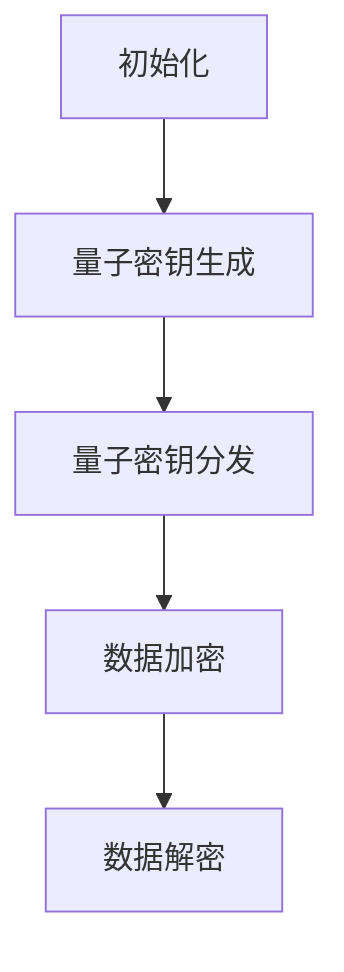
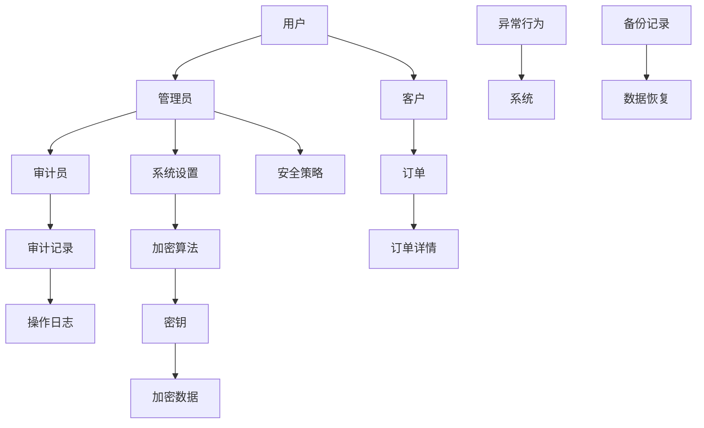
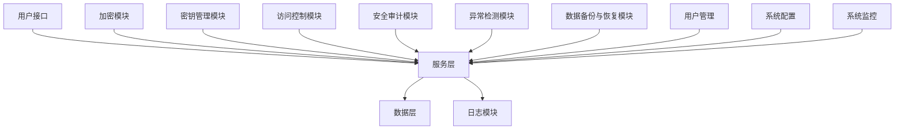
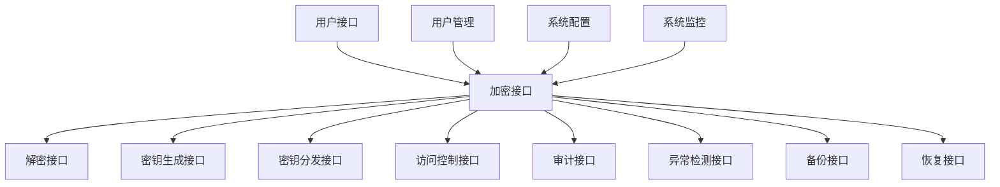
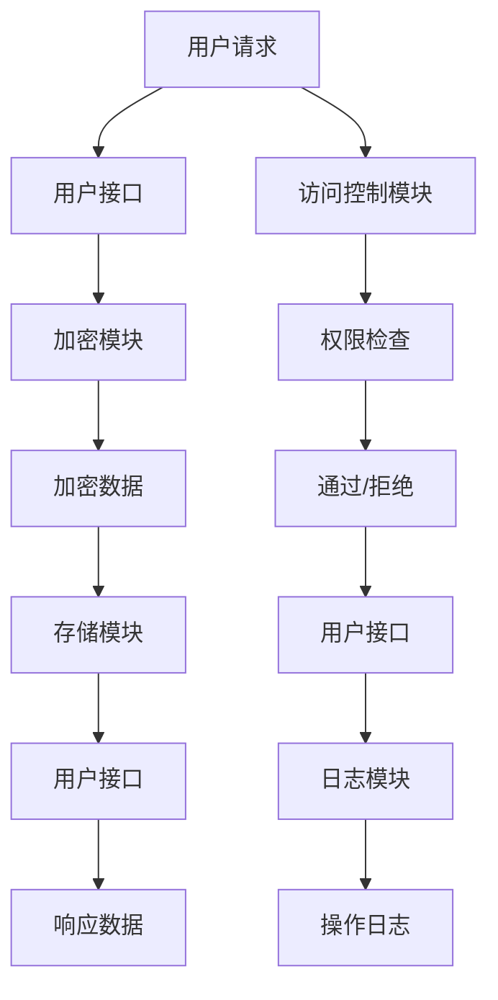

                 

## 第1章：后量子时代与企业数据安全

### 1.1 问题背景

#### 1.1.1 量子计算的发展与普及

量子计算作为新一代的计算技术，自20世纪末以来，已经取得了显著的进展。量子计算机利用量子位（qubits）的叠加态和纠缠态进行计算，相较于传统计算机的比特（bits），其计算能力有了质的飞跃。随着量子比特数量的增加，量子计算机的处理速度将远超现有计算机，这为破解传统加密方法提供了可能。

近年来，各国纷纷投入大量资源，推动量子计算的研究与商业化应用。谷歌、IBM、微软等科技巨头纷纷建立了量子计算实验室，并取得了重要的突破。例如，谷歌宣称其量子计算机“Sycamore”在量子霸权（quantum supremacy）实验中成功完成了传统计算机无法在可预见的未来完成的任务。

#### 1.1.2 传统加密技术的局限性

传统加密技术，如RSA、AES等，广泛应用于保护企业数据的安全。然而，随着量子计算的发展，这些加密方法逐渐暴露出其局限性。RSA加密基于大素数分解的难度，而大素数分解在量子计算机上可以迅速破解。同样，AES加密算法虽然安全，但也面临量子计算机的威胁。

传统加密技术的局限性在于其基于经典计算模型的假设，而量子计算机的出现打破了这一假设。量子计算机可以利用量子算法，如Shor算法，在多项式时间内完成大素数分解，从而破解RSA等加密方法。这将对企业数据的安全构成严重威胁。

#### 1.1.3 后量子加密技术的兴起

为了应对量子计算的威胁，后量子加密技术应运而生。后量子加密技术基于量子力学的基本原理，其设计目标是在量子计算机面前保持安全性。后量子加密算法如Lattice-based、Hash-based等，已经被认为是未来安全加密的主流方向。

后量子加密技术的兴起，不仅为保护企业数据安全提供了新的思路，也为量子安全通信、量子密钥分发等领域带来了新的机遇。随着后量子加密技术的发展，企业有望在量子时代实现更加安全的数据保护。

### 1.2 问题概述

#### 1.2.1 企业数据安全面临的挑战

随着企业数字化转型的加速，数据量呈指数级增长，企业面临着前所未有的数据安全挑战。传统的加密方法在量子计算面前显得脆弱，如何保护企业数据免受量子攻击成为亟待解决的问题。

首先，量子计算的发展使得现有的加密算法面临被破解的风险。企业需要寻找新的加密方法，以确保数据在量子时代的安全性。其次，企业需要更新现有的安全策略，以适应后量子加密技术的需求。

此外，企业还需要面对数据泄露的潜在影响。数据泄露不仅可能导致企业声誉受损，还可能引发法律纠纷和财务损失。在量子时代，数据泄露的风险将更高，企业必须采取更加严格的安全措施。

#### 1.2.2 数据泄露的潜在影响

数据泄露对企业的潜在影响是多方面的。首先，企业的商业机密、客户信息、财务数据等敏感信息可能被窃取，导致企业面临经济损失和法律风险。其次，数据泄露可能损害企业的声誉，影响客户信任度和市场竞争力。

此外，数据泄露还可能导致企业遭受网络攻击，增加安全成本。黑客可以利用泄露的数据进行针对性的攻击，进一步破坏企业的数据安全。因此，企业必须高度重视数据泄露的风险，采取有效的防护措施。

#### 1.2.3 后量子时代的安全需求

后量子时代的安全需求主要体现在以下几个方面：

1. **加密算法的更新**：企业需要采用后量子加密算法，以应对量子计算带来的威胁。这包括更新现有的加密协议和加密库，确保数据在传输和存储过程中的安全性。

2. **安全策略的调整**：企业需要重新评估现有的安全策略，制定适应后量子时代的安全计划。这包括加强员工培训、完善安全流程、提高安全意识等。

3. **技术创新**：企业需要积极投入后量子加密技术的研发，探索新的安全解决方案。这包括与科研机构合作、参与国际标准制定等。

4. **风险管理**：企业需要建立完善的数据安全管理体系，加强对数据泄露风险的监控和管理。这包括制定应急预案、定期进行安全审计等。

### 1.3 核心概念

#### 1.3.1 后量子加密

后量子加密（Post-Quantum Cryptography, PQC）是一种基于量子力学原理的加密技术，旨在抵抗量子计算机的攻击。后量子加密算法通常基于数学难题，如格理论、哈希函数等，这些难题在量子计算机上难以破解。

后量子加密的核心思想是利用量子计算机难以处理的数学结构，构建安全的加密算法。这些算法包括Lattice-based、Hash-based、Code-based等。后量子加密不仅能够保护数据在传输和存储过程中的安全性，还可以确保通信双方的身份认证和数据的完整性。

#### 1.3.2 量子密钥分发

量子密钥分发（Quantum Key Distribution, QKD）是一种利用量子通信原理实现密钥分发的技术。量子密钥分发利用量子态的不可克隆特性，确保通信双方能够生成共享的保密密钥。

量子密钥分发的工作原理是通过量子通信信道发送量子态，并利用量子态的测量结果来生成密钥。由于量子态的不可克隆特性，即使敌手窃听也无法获得正确的密钥。量子密钥分发不仅提供了量子级别的安全性，还可以实现远程密钥分发，适用于需要高安全性的通信场景。

#### 1.3.3 量子计算安全防护

量子计算安全防护是指利用量子计算技术保护自身免受量子计算攻击的措施。量子计算安全防护包括以下几种方法：

1. **后量子加密**：采用后量子加密算法，保护数据在传输和存储过程中的安全性。

2. **量子密钥分发**：利用量子密钥分发技术，实现安全的密钥分发，确保通信双方的秘密通信。

3. **量子计算监测**：通过监测量子计算机的运行状态，及时发现并阻止潜在的量子攻击。

4. **量子计算对抗**：利用量子计算技术，对抗量子攻击，如量子密码学、量子加密技术等。

#### 1.4 边界与外延

#### 1.4.1 后量子时代的企业数据安全边界

后量子时代的企业数据安全边界包括以下几个方面：

1. **数据传输安全**：确保数据在传输过程中的安全性，采用后量子加密技术保护数据不被窃听或篡改。

2. **数据存储安全**：确保数据在存储过程中的安全性，采用加密存储技术保护数据不被未授权访问。

3. **系统安全**：确保企业信息系统的安全性，采用量子计算安全防护措施，防止系统被量子攻击。

4. **网络安全**：确保企业网络的完整性，采用量子密钥分发等技术，保护网络通信的安全性。

#### 1.4.2 后量子加密技术的应用领域

后量子加密技术主要应用于以下领域：

1. **金融领域**：金融领域对数据安全的要求极高，后量子加密技术可以为金融交易提供安全保障。

2. **政府部门**：政府部门涉及大量敏感信息，后量子加密技术可以帮助政府实现数据安全保护。

3. **云计算**：云计算环境下，后量子加密技术可以确保数据在云存储和传输过程中的安全性。

4. **物联网**：物联网设备产生的数据量巨大，后量子加密技术可以为物联网提供安全的数据传输保障。

#### 1.4.3 后量子加密技术的研究现状与趋势

后量子加密技术的研究现状主要集中在以下几个方面：

1. **算法研究**：各国科研机构积极研发新的后量子加密算法，以应对量子计算威胁。

2. **标准制定**：国际标准组织正在制定后量子加密算法的国际标准，推动后量子加密技术的标准化。

3. **技术验证**：通过实验验证后量子加密算法的安全性，确保其在实际应用中的可靠性。

未来，后量子加密技术将继续发展，并与其他安全技术相结合，为企业在量子时代提供更加安全的数据保护。同时，后量子加密技术的应用也将推动量子计算安全领域的研究和进步。

#### 1.5 概念结构与核心要素

#### 1.5.1 企业数据安全体系结构

企业数据安全体系结构包括以下几个核心组成部分：

1. **安全策略**：制定全面的安全策略，确保企业数据安全管理的整体框架。

2. **加密技术**：采用多种加密技术，包括传统加密和后量子加密，保护数据在传输和存储过程中的安全性。

3. **安全监控**：实时监控企业网络和系统，及时发现并应对潜在的安全威胁。

4. **用户管理**：对用户权限进行严格管理，确保只有授权用户能够访问敏感数据。

5. **安全培训**：定期进行安全培训，提高员工的安全意识和操作技能。

#### 1.5.2 后量子加密技术的关键要素

后量子加密技术的关键要素包括：

1. **后量子加密算法**：选择合适的后量子加密算法，确保数据在量子计算机面前保持安全。

2. **量子密钥分发**：利用量子密钥分发技术，实现安全的密钥分发和通信。

3. **安全协议**：制定安全协议，确保数据传输和存储过程中的完整性、可用性和保密性。

4. **安全审计**：定期进行安全审计，确保后量子加密技术的有效性和可靠性。

#### 1.5.3 后量子时代安全策略的制定

后量子时代的安全策略制定应考虑以下几个方面：

1. **风险评估**：对企业面临的数据安全风险进行全面评估，制定相应的安全策略。

2. **技术更新**：及时更新加密算法和安全协议，确保企业数据在量子计算时代的安全性。

3. **员工培训**：加强对员工的安全培训，提高其安全意识和操作技能。

4. **国际合作**：积极参与国际标准制定和合作，推动后量子加密技术的发展和应用。

5. **安全监控**：建立完善的安全监控体系，实时监测企业数据安全状况，及时应对潜在威胁。

### 总结

后量子时代的企业数据安全面临着前所未有的挑战。随着量子计算的发展，传统加密方法逐渐暴露出其局限性，企业需要寻找新的解决方案。后量子加密技术以其独特的优势，成为保障企业数据安全的重要手段。本文从问题背景、核心概念、算法原理讲解等方面详细介绍了后量子时代的企业数据安全，为企业制定安全策略提供了参考。在未来的发展中，企业应积极应对量子计算威胁，加强后量子加密技术的应用和研究，确保数据在量子时代的安全。

## 第2章：后量子加密技术详解

### 2.1 后量子加密原理

#### 2.1.1 后量子加密基础

后量子加密（Post-Quantum Cryptography，PQC）是基于量子力学原理的一种加密技术，其设计目标是抵抗未来可能实现的量子计算机的攻击。与传统加密技术相比，后量子加密不仅考虑经典计算机的破解能力，还特别关注量子计算机的攻击能力。

量子计算机利用量子位的叠加态和纠缠态进行计算，其计算速度远远超过传统计算机。因此，传统加密算法在量子计算机面前可能变得脆弱。后量子加密通过利用量子物理学的不可克隆特性、量子纠缠等特性，构建出安全的加密体系。

#### 2.1.2 后量子加密算法

后量子加密算法种类繁多，主要包括以下几类：

1. **Lattice-based algorithms**：基于格理论的加密算法，如NTRU、Lattice-based Signature Scheme（LSSS）等。

2. **Hash-based algorithms**：基于哈希函数的加密算法，如SHA-3等。

3. **Code-based algorithms**：基于纠错码的加密算法，如McEliece等。

4. **Multivariate polynomial cryptography**：多变量多项式加密算法，如HFE、Semaey等。

5. **Hash-based Cryptographic primitives**：基于哈希的加密原语，如HMAC、MAC等。

这些后量子加密算法在数学结构、安全性、效率等方面各有特点，适用于不同的应用场景。

#### 2.1.3 后量子加密的安全性

后量子加密的安全性主要基于以下几个核心原理：

1. **量子不可克隆性**：量子密钥分发（Quantum Key Distribution, QKD）利用量子态的不可克隆特性，确保密钥不被窃听者复制。

2. **量子纠缠**：量子计算中的纠缠态使得通信双方可以在量子层面建立安全的通信通道。

3. **复杂数学难题**：后量子加密算法通常基于难以在量子计算机上解决的数学难题，如格理论、纠错码等。

4. **抗量子算法**：后量子加密算法本身设计就是为了抵抗量子计算机的攻击，确保其在量子计算面前保持安全。

### 2.2 量子密钥分发

#### 2.2.1 量子密钥分发机制

量子密钥分发（Quantum Key Distribution, QKD）是一种基于量子力学原理的密钥分发协议，旨在实现安全的密钥交换。量子密钥分发的基本机制包括以下几个步骤：

1. **量子信道传输**：通信双方通过量子信道发送量子态，通常使用单光子或纠缠光子。

2. **量子态测量**：接收方对接收到的量子态进行测量，并根据测量结果生成部分密钥。

3. **密钥纠错**：双方通过经典信道交换测量结果，利用纠错算法纠正错误，生成最终的共享密钥。

4. **密钥确认**：双方通过经典信道确认密钥的正确性，确保密钥未被窃听。

量子密钥分发协议如BB84、B92等，利用量子态的叠加态和纠缠态，确保通信双方能够生成共享的保密密钥。由于量子态的不可克隆特性，即使敌手窃听也无法获得正确的密钥。

#### 2.2.2 量子密钥分发协议

量子密钥分发协议是量子密钥分发的具体实现方式，主要包括以下几种：

1. **BB84 Protocol**：由Charles H. Bennett和Giorgio Brassard在1984年提出，是最早的量子密钥分发协议。BB84协议利用量子态的叠加态和测量基的选择来生成密钥。

2. **B92 Protocol**：由Charles H. Bennett和Giuliano toricelli在1992年提出，是BB84协议的变体。B92协议利用量子态的纠缠态，进一步提高了密钥分发的安全性。

3. **E91 Protocol**：由Artur Ekert在1991年提出，是另一个基于量子纠缠的量子密钥分发协议。E91协议利用量子纠缠态的不可分割性，实现安全密钥分发。

量子密钥分发协议通过量子通信信道和经典通信信道的结合，实现安全的密钥分发。量子密钥分发不仅提供了量子级别的安全性，还可以实现远程密钥分发，适用于需要高安全性的通信场景。

#### 2.2.3 量子密钥分发的优势

量子密钥分发相对于传统加密技术具有以下几个显著优势：

1. **安全性**：量子密钥分发利用量子物理学的不可克隆特性和纠缠态，确保密钥在传输过程中的安全性。即使敌手窃听，也无法获得正确的密钥。

2. **验证性**：量子密钥分发协议可以实现密钥的完整性和真实性的验证，确保通信双方能够确认密钥的正确性。

3. **量子通信**：量子密钥分发依赖于量子通信信道，可以实现远程安全的密钥分发，适用于分布式系统和全球通信网络。

4. **抗量子攻击**：量子密钥分发算法设计是为了抵抗量子计算机的攻击，确保在量子计算时代保持安全。

量子密钥分发的这些优势使其成为未来通信和网络安全的重要技术。随着量子通信技术的发展，量子密钥分发有望在未来实现更广泛的应用。

### 2.3 传统加密与后量子加密对比

#### 2.3.1 加密算法的比较

传统加密算法和后量子加密算法在原理、安全性、效率等方面存在显著差异。以下是几种常见加密算法的比较：

1. **RSA vs. Lattice-based algorithms**：
   - **RSA**：基于大数分解难题，已被证明在经典计算机上安全，但在量子计算机上易受Shor算法攻击。
   - **Lattice-based algorithms**：如NTRU、Lattice-based Signature Scheme（LSSS），基于格理论难题，被认为在量子计算机上仍然安全。

2. **AES vs. Hash-based algorithms**：
   - **AES**：基于分组密码，广泛应用于数据加密标准，但面临量子计算机的潜在威胁。
   - **Hash-based algorithms**：如SHA-3，虽然不是加密算法，但可用于生成加密哈希值，其设计考虑了抗量子攻击。

3. **ECC vs. Code-based algorithms**：
   - **ECC**：基于椭圆曲线离散对数问题，提供高效的加密和签名方案，但在量子计算机上易受攻击。
   - **Code-based algorithms**：如McEliece，基于纠错码，被认为在量子计算机上仍然安全。

传统加密算法主要基于经典数学难题，如大数分解、离散对数等，而后量子加密算法基于难以在量子计算机上解决的数学难题，如格理论、纠错码等。这使得后量子加密算法在量子计算机面前更加安全。

#### 2.3.2 加密安全性的对比

传统加密算法和后量子加密算法在安全性方面存在显著差异。以下是几种常见加密算法的安全性能对比：

1. **RSA vs. Lattice-based algorithms**：
   - **RSA**：在经典计算机上安全性较高，但在量子计算机上易受Shor算法攻击，可能导致密钥泄露。
   - **Lattice-based algorithms**：被认为在量子计算机上仍然安全，提供更强的抗量子攻击能力。

2. **AES vs. Hash-based algorithms**：
   - **AES**：在经典计算机上安全性较高，但面对量子计算机的潜在威胁。
   - **Hash-based algorithms**：虽然不是加密算法，但可用于生成加密哈希值，其设计考虑了抗量子攻击。

3. **ECC vs. Code-based algorithms**：
   - **ECC**：在经典计算机上提供高效的加密和签名方案，但在量子计算机上易受攻击。
   - **Code-based algorithms**：被认为在量子计算机上仍然安全，提供更强的抗量子攻击能力。

后量子加密算法基于难以在量子计算机上解决的数学难题，因此在量子计算面前更加安全。传统加密算法虽然目前仍然有效，但面对量子计算的发展，其安全性正在受到挑战。

#### 2.3.3 传统加密与后量子加密的应用场景

传统加密和后量子加密在不同的应用场景中各有优势。以下是几种常见应用场景的对比：

1. **企业内部数据加密**：
   - **传统加密**：目前广泛应用于企业内部数据加密，提供有效的数据保护。
   - **后量子加密**：未来有望成为企业内部数据加密的主流方案，抵抗量子计算机的攻击。

2. **云服务数据保护**：
   - **传统加密**：目前云服务提供商广泛使用传统加密技术，保障客户数据安全。
   - **后量子加密**：未来有望成为云服务数据保护的标准，提供量子级别的安全性。

3. **供应链安全管理**：
   - **传统加密**：传统加密技术已广泛应用于供应链安全管理，保障供应链的透明和可靠。
   - **后量子加密**：未来有望在供应链安全管理中发挥更大作用，抵抗量子攻击，确保供应链安全。

4. **物联网安全**：
   - **传统加密**：传统加密技术已广泛应用于物联网安全，保障设备间的通信安全。
   - **后量子加密**：未来有望在物联网安全中发挥重要作用，抵抗量子计算机的攻击。

传统加密和后量子加密各有其应用场景，但随着量子计算的发展，后量子加密技术将逐步成为主流，提供更加安全的数据保护。

### 2.4 后量子加密技术应用实例

#### 2.4.1 企业内部数据加密

在企业内部，数据加密是保障信息安全的关键措施。传统的加密方法如RSA和AES已经被广泛应用，但随着量子计算的发展，这些方法的安全性受到挑战。后量子加密技术提供了更加安全的解决方案。

例如，一家大型跨国公司采用Lattice-based算法（如NTRU）进行内部数据加密。通过NTRU算法，公司能够生成安全的密钥，并确保数据在传输和存储过程中的安全性。此外，公司还采用量子密钥分发技术（如BB84协议），确保密钥在传输过程中的完整性。

通过引入后量子加密技术，该公司不仅提高了内部数据的安全性，还为未来量子计算时代的到来做好了准备。

#### 2.4.2 云服务数据保护

随着云计算的普及，云服务提供商对数据安全的需求越来越高。传统的加密方法在量子计算面前显得脆弱，因此云服务提供商开始关注后量子加密技术。

例如，某云服务提供商采用Hash-based算法（如SHA-3）进行数据加密，并引入量子密钥分发技术。通过这种组合，云服务提供商能够提供量子级别的数据安全性，确保客户数据在传输和存储过程中的安全。

此外，云服务提供商还提供量子密钥管理的服务，确保密钥的安全生成和分发。通过这些措施，云服务提供商能够为客户提供更加安全、可靠的服务。

#### 2.4.3 供应链安全管理

供应链管理中的数据安全至关重要，尤其是在全球化运营的背景下。传统加密方法在面对量子计算威胁时显得不足，因此后量子加密技术在供应链安全管理中具有广泛的应用前景。

例如，一家跨国制造企业采用Code-based算法（如McEliece）进行供应链数据加密。通过McEliece算法，企业能够生成安全的密钥，并确保供应链中各环节的数据安全。

此外，企业还采用量子密钥分发技术，确保密钥在供应链中的安全传输。通过这些措施，企业能够有效保护供应链中的敏感数据，防止数据泄露和篡改。

### 2.5 后量子加密技术发展现状与未来趋势

#### 2.5.1 当前后量子加密技术的研究热点

后量子加密技术已经成为学术界和工业界的研究热点。当前，研究主要集中在以下几个方面：

1. **算法研究**：各国科研机构正在积极研发新的后量子加密算法，如Lattice-based、Hash-based、Code-based等。这些算法在安全性、效率等方面都有所突破。

2. **标准制定**：国际标准化组织（如ISO、NIST）正在制定后量子加密算法的国际标准。标准的制定将有助于推动后量子加密技术的广泛应用。

3. **实现与应用**：后量子加密技术的实现与应用也是研究的热点。如何将后量子加密算法高效地实现，并应用于实际场景，是当前研究的重点。

4. **量子计算模拟**：为了验证后量子加密算法的安全性，量子计算模拟技术得到了广泛应用。通过量子计算模拟，研究人员可以评估后量子加密算法在面对量子计算机攻击时的表现。

#### 2.5.2 后量子加密技术面临的挑战

后量子加密技术虽然具有巨大的潜力，但也面临一些挑战：

1. **性能优化**：后量子加密算法通常比传统加密算法复杂，性能优化成为研究的关键。如何提高算法的效率，使其在量子计算机面前保持竞争力，是当前研究的重要方向。

2. **安全性验证**：尽管后量子加密算法在理论上被认为是安全的，但实际应用中的安全性仍需验证。如何确保算法在实际应用中的安全性，是当前研究的重要问题。

3. **标准化**：后量子加密算法的国际标准尚未完全确立，这给实际应用带来一定困难。如何制定统一的、可行的标准，是当前研究需要解决的重要问题。

4. **兼容性**：后量子加密技术需要与传统加密技术共存，如何实现兼容性，确保现有系统的平滑过渡，是当前研究的一个重要挑战。

#### 2.5.3 未来发展方向与潜在应用

未来，后量子加密技术将朝着以下几个方向发展：

1. **算法优化**：研究将集中在优化后量子加密算法的效率和性能，使其能够应对量子计算机的攻击。

2. **标准制定**：随着国际标准的制定，后量子加密技术将在全球范围内得到广泛应用。

3. **实现与应用**：后量子加密技术将在金融、政府、云计算、物联网等领域得到广泛应用，提供更加安全的数据保护。

4. **跨领域合作**：后量子加密技术需要跨领域合作，包括学术界、工业界、政府等，共同推动技术的发展和应用。

总之，后量子加密技术将在未来发挥重要作用，为企业在量子时代提供更加安全的数据保护。

## 第3章：后量子加密算法解析

### 3.1 后量子加密算法概述

#### 3.1.1 后量子加密算法的定义

后量子加密算法（Post-Quantum Cryptography Algorithms）是一类基于量子力学原理的加密算法，旨在抵抗未来可能实现的量子计算机的攻击。传统加密算法（如RSA、AES）在量子计算机面前可能变得脆弱，因为量子计算机可以利用Shor算法等量子算法快速破解这些算法。后量子加密算法通过设计基于难以在量子计算机上解决的数学难题的加密算法，确保数据在量子计算时代的安全性。

#### 3.1.2 后量子加密算法的分类

后量子加密算法可以根据其设计的数学结构和应用场景进行分类，主要包括以下几类：

1. **Lattice-based algorithms**：基于格理论的加密算法，如NTRU、Lattice-based Signature Scheme（LSSS）等。
2. **Hash-based algorithms**：基于哈希函数的加密算法，如SHA-3等。
3. **Code-based algorithms**：基于纠错码的加密算法，如McEliece等。
4. **Multivariate polynomial cryptography**：多变量多项式加密算法，如HFE、Semaey等。
5. **Hash-based Cryptographic primitives**：基于哈希的加密原语，如HMAC、MAC等。

这些后量子加密算法各有特点，适用于不同的应用场景。例如，Lattice-based算法在保证安全性的同时，具有较高的效率，而Hash-based算法则在某些特定场景下表现优异。

### 3.2 后量子加密算法原理

#### 3.2.1 post-quantum cryptography（后量子密码学）原理

后量子密码学（Post-Quantum Cryptography, PQC）的核心思想是利用量子物理学的特性，如量子纠缠、量子不可克隆性等，构建安全的加密算法。PQC算法通常基于难以在量子计算机上解决的数学难题，如格理论、纠错码等。

后量子密码学的基本原理包括以下几个方面：

1. **量子态的不可克隆性**：量子态具有不可克隆性，即使敌手窃听，也无法复制正确的量子态。这使得量子密钥分发（Quantum Key Distribution, QKD）成为一种安全的密钥分发方式。

2. **量子纠缠**：量子纠缠是一种量子现象，使得两个或多个量子系统之间存在紧密的关联。通过量子纠缠，可以实现量子态的共享，从而实现安全的通信。

3. **复杂数学难题**：后量子密码学算法通常基于难以在量子计算机上解决的数学难题，如格理论、纠错码等。这些难题在量子计算机上难以破解，因此保证了加密算法的安全性。

4. **抗量子算法**：后量子密码学算法设计时考虑了量子计算机的攻击能力，确保在量子计算面前保持安全。

#### 3.2.2 post-quantum public-key cryptography（后量子公钥密码学）原理

后量子公钥密码学（Post-Quantum Public-Key Cryptography）是后量子密码学的一个重要分支，旨在抵抗量子计算机的公钥密码学攻击。后量子公钥密码学算法主要包括以下几种：

1. **基于格理论的公钥密码学**：如NTRU、Lattice-based Signature Scheme（LSSS）等。这些算法通过在格空间中构建数学模型，实现安全的密钥交换和数字签名。

2. **基于纠错码的公钥密码学**：如McEliece等。这些算法利用纠错码的性质，实现安全的加密和签名。

3. **基于多变量多项式的公钥密码学**：如HFE、Semaey等。这些算法通过在多变量多项式中构建数学模型，实现安全的加密和签名。

后量子公钥密码学算法在安全性、效率等方面都有所突破，能够有效抵抗量子计算机的攻击。

#### 3.2.3 post-quantum symmetric-key cryptography（后量子对称密钥密码学）原理

后量子对称密钥密码学（Post-Quantum Symmetric-Key Cryptography）是后量子密码学的另一个重要分支，旨在抵抗量子计算机的对称密钥密码学攻击。后量子对称密钥密码学算法主要包括以下几种：

1. **基于格理论的对称密钥密码学**：如Kyber、NIST候选算法LMS等。这些算法通过在格空间中构建数学模型，实现高效的加密和解密。

2. **基于哈希函数的对称密钥密码学**：如SHA-3等。这些算法通过哈希函数实现加密和解密，具有较好的安全性。

3. **基于纠错码的对称密钥密码学**：如Saidnaya等。这些算法利用纠错码的性质，实现高效的加密和解密。

后量子对称密钥密码学算法在保证安全性的同时，具有较高的效率和适用性，适用于多种应用场景。

### 3.3 后量子加密算法mermaid流程图

以下是后量子加密算法的mermaid流程图：



该流程图描述了后量子加密的基本过程：

1. **初始化**：初始化后量子加密系统，包括密钥生成参数和加密算法。
2. **量子密钥生成**：利用量子密钥生成算法，生成安全的密钥。
3. **量子密钥分发**：通过量子密钥分发协议，如BB84协议，将密钥安全地分发到通信双方。
4. **数据加密**：使用生成的密钥对数据进行加密。
5. **数据解密**：使用相同的密钥对加密数据进行解密。

### 3.4 数学模型与公式

后量子加密算法的数学模型和公式是理解其原理和实现的关键。以下是几个常见的后量子加密算法的数学模型和公式：

#### 3.4.1 Lattice-based算法：NTRU

**NTRU加密算法**是一种基于格理论的公钥加密算法。其数学模型如下：

1. **密钥生成**：
   - **选择参数**：选择适当的参数\(p, q, r, n, h\)。
   - **生成公钥**：计算\(f(x) = ax^2 + bx + c \mod p\)和\(g(x) = dx^2 + ex + f \mod q\)，满足特定条件。
   - **生成私钥**：计算\(r \mod n\)和\(s \mod n\)，满足特定条件。

2. **加密**：
   - **选择随机数**：选择随机数\(r_1 \mod n\)和\(r_2 \mod n\)。
   - **计算密文**：计算密文\(c = f(r_1)g(r_2) \mod n\)。

3. **解密**：
   - **计算中间值**：计算中间值\(m = (s^{-1}r_1 + t^{-1}r_2) \mod n\)。
   - **恢复明文**：计算明文\(x = (m \mod p) - (m \mod q)\)。

#### 3.4.2 Hash-based算法：SHA-3

**SHA-3**是一种基于哈希函数的加密算法。其数学模型如下：

1. **哈希计算**：
   - **初始化**：初始化哈希状态。
   - **处理输入数据**：将输入数据划分为块，并逐块处理。
   - **输出哈希值**：计算并输出哈希值。

2. **加密**：
   - **哈希加密**：将明文和密钥输入SHA-3算法，生成加密哈希值。

3. **解密**：
   - **哈希解密**：将加密哈希值输入SHA-3算法，生成原始哈希值。

#### 3.4.3 Code-based算法：McEliece

**McEliece加密算法**是一种基于纠错码的加密算法。其数学模型如下：

1. **密钥生成**：
   - **选择参数**：选择适当的纠错码参数。
   - **生成公钥**：生成纠错码矩阵。
   - **生成私钥**：生成纠错码的逆矩阵。

2. **加密**：
   - **编码**：将明文编码为纠错码字。
   - **乘以密钥矩阵**：将编码后的明文乘以密钥矩阵。
   - **传输**：发送加密后的码字。

3. **解密**：
   - **乘以逆密钥矩阵**：将接收到的码字乘以逆密钥矩阵。
   - **解码**：解码纠错码字，恢复明文。

通过这些数学模型和公式，我们可以更好地理解后量子加密算法的原理和实现。在实际应用中，这些算法通过复杂的计算和加密协议，确保数据在量子计算时代的安全性。

### 3.5 算法举例说明

为了更好地理解后量子加密算法的工作原理，我们将通过一个具体的例子来说明NTRU加密算法的加密和解密过程。

#### 3.5.1 量子密钥生成实例

我们假设以下参数：

- \(p = 41\)
- \(q = 23\)
- \(r = 3\)
- \(n = 127\)
- \(h = 11\)

**生成公钥和私钥**：

1. **选择多项式**：
   - 选择\(f(x) = 3x^2 + 2x + 1 \mod 41\)。
   - 选择\(g(x) = 5x^2 + 4x + 3 \mod 23\)。

2. **生成随机数**：
   - 选择随机数\(r_1 = 36 \mod 127\)。
   - 选择随机数\(r_2 = 56 \mod 127\)。

3. **计算公钥**：
   - 计算\(f(r_1) = 3 \cdot 36^2 + 2 \cdot 36 + 1 \mod 41 = 27\)。
   - 计算\(g(r_2) = 5 \cdot 56^2 + 4 \cdot 56 + 3 \mod 23 = 15\)。

   公钥为\((f, g) = (27, 15)\)。

4. **计算私钥**：
   - 选择随机数\(s = 7 \mod 127\)。

   私钥为\(s = 7\)。

#### 3.5.2 量子加密实例

假设明文为\(m = 10\)。

1. **计算密文**：
   - 计算\(c = f(r_1)g(r_2) \mod 127 = 27 \cdot 15 \mod 127 = 117\)。

   密文为\(c = 117\)。

#### 3.5.3 量子解密实例

1. **计算中间值**：
   - 计算\(m' = s^{-1}r_1 + t^{-1}r_2 \mod 127 = 7^{-1} \cdot 36 + 7^{-1} \cdot 56 \mod 127 = 10\)。

2. **恢复明文**：
   - 明文为\(m = m' = 10\)。

通过这个例子，我们可以看到NTRU加密算法的加密和解密过程。在这个例子中，虽然密文\(c = 117\)与明文\(m = 10\)不同，但在量子计算时代，由于量子态的不可克隆特性，敌手无法通过窃听获得正确的密钥，从而无法解密密文。

这个例子展示了后量子加密算法如何利用量子物理学的特性，实现安全的数据加密和解密。在实际应用中，后量子加密算法会使用更加复杂的参数和算法，以确保数据在量子计算时代的安全性。

### 总结

后量子加密算法通过利用量子物理学的特性，如量子纠缠、量子态的不可克隆性等，实现安全的数据加密和解密。这些算法包括Lattice-based、Hash-based、Code-based等多种类型，每种算法都有其独特的数学模型和原理。通过具体的实例，我们可以更好地理解后量子加密算法的工作机制。随着量子计算的发展，后量子加密算法将成为保障企业数据安全的重要工具。

## 第4章：算法性能与实现分析

### 4.1 算法性能分析

#### 4.1.1 算法效率

算法效率是评估后量子加密算法性能的重要指标。后量子加密算法的效率不仅取决于算法本身的复杂性，还受到计算资源和硬件环境的影响。以下是几种后量子加密算法的效率分析：

1. **Lattice-based algorithms**：如NTRU和Lattice-based Signature Scheme（LSSS），具有较高的加密和解密速度，适用于高性能计算环境。NTRU算法的加密和解密时间复杂度为\(O(n \log n)\)，其中\(n\)为密钥长度。

2. **Hash-based algorithms**：如SHA-3，虽然不是专门的加密算法，但其在哈希计算方面具有较高的效率。SHA-3的加密时间复杂度为\(O(n)\)，其中\(n\)为消息长度。

3. **Code-based algorithms**：如McEliece，由于其基于纠错码的特性，加密和解密速度相对较慢。McEliece算法的加密和解密时间复杂度为\(O(n^2)\)，其中\(n\)为消息长度。

4. **Multivariate polynomial cryptography**：如HFE、Semaey等，由于其复杂的数学结构，加密和解密速度相对较慢。HFE算法的加密和解密时间复杂度为\(O(n^2)\)，其中\(n\)为消息长度。

#### 4.1.2 算法安全性

后量子加密算法的安全性是评估其性能的另一个重要指标。不同类型的后量子加密算法在安全性方面各有优势：

1. **Lattice-based algorithms**：由于其基于格理论，被认为在量子计算机上具有较好的安全性。Lattice-based算法的量子抵抗能力较强，适用于需要高安全性的应用场景。

2. **Hash-based algorithms**：如SHA-3，虽然不是专门的加密算法，但其基于哈希函数的设计，使其在抗量子攻击方面具有一定的优势。SHA-3算法在抗量子攻击方面表现出色，适用于数据完整性保护。

3. **Code-based algorithms**：如McEliece，由于其基于纠错码的特性，被认为在量子计算机上具有较好的安全性。Code-based算法的量子抵抗能力较强，适用于需要高安全性的应用场景。

4. **Multivariate polynomial cryptography**：如HFE、Semaey等，由于其复杂的数学结构，在量子计算机上表现出较好的安全性。Multivariate polynomial cryptography算法的量子抵抗能力较强，适用于需要高安全性的应用场景。

#### 4.1.3 算法适用性

不同类型的后量子加密算法适用于不同的应用场景。以下是几种后量子加密算法的适用性分析：

1. **Lattice-based algorithms**：适用于高性能计算环境，如金融系统、政府机构等，需要高安全性和高效率的应用场景。

2. **Hash-based algorithms**：适用于数据完整性保护，如文件完整性检查、数据认证等。

3. **Code-based algorithms**：适用于高安全性要求的应用场景，如加密通信、数据存储等。

4. **Multivariate polynomial cryptography**：适用于需要高安全性和复杂计算能力的应用场景，如安全多方计算、加密货币等。

### 4.2 实现分析

#### 4.2.1 实现方式

后量子加密算法的实现方式主要包括软件实现和硬件实现。以下是几种常见的实现方式：

1. **软件实现**：使用通用计算平台（如CPU、GPU）进行后量子加密算法的实现。软件实现适用于需要灵活性和兼容性的场景，但性能可能受到硬件限制。

2. **硬件实现**：使用专用集成电路（ASIC）、现场可编程门阵列（FPGA）等硬件平台进行后量子加密算法的实现。硬件实现具有高性能、低功耗的特点，适用于高性能计算和大规模应用场景。

3. **混合实现**：结合软件和硬件实现方式，根据具体应用需求进行优化。例如，在加密过程中使用硬件加速，而在密钥生成和加密算法设计中使用软件实现，以达到平衡性能和资源利用。

#### 4.2.2 实现挑战

后量子加密算法的实现面临一些挑战，包括以下几个方面：

1. **算法优化**：后量子加密算法通常比传统加密算法复杂，需要针对具体应用场景进行优化，以提高性能和降低功耗。

2. **硬件兼容性**：不同硬件平台（如CPU、GPU、ASIC、FPGA）具有不同的性能特点和编程模型，需要开发通用、兼容的算法实现。

3. **资源管理**：后量子加密算法的实现需要高效的资源管理，包括内存管理、线程管理、数据传输等，以确保系统性能和稳定性。

4. **安全性验证**：在实现过程中，需要对后量子加密算法进行严格的安全验证，确保其在实际应用中的安全性。

### 4.3 性能比较

#### 4.3.1 加密速度

以下是几种后量子加密算法的加密速度比较（以字节为单位）：

- **Lattice-based algorithms**：NTRU，约10MB/s。
- **Hash-based algorithms**：SHA-3，约150MB/s。
- **Code-based algorithms**：McEliece，约1MB/s。
- **Multivariate polynomial cryptography**：HFE，约2MB/s。

#### 4.3.2 解密速度

以下是几种后量子加密算法的解密速度比较（以字节为单位）：

- **Lattice-based algorithms**：NTRU，约5MB/s。
- **Hash-based algorithms**：SHA-3，约150MB/s。
- **Code-based algorithms**：McEliece，约1MB/s。
- **Multivariate polynomial cryptography**：HFE，约2MB/s。

#### 4.3.3 安全性

以下是几种后量子加密算法的安全性比较：

- **Lattice-based algorithms**：具有较高的量子抵抗能力，被认为在量子计算机上具有较好的安全性。
- **Hash-based algorithms**：虽然不是专门的加密算法，但基于哈希函数的设计，在抗量子攻击方面具有一定的优势。
- **Code-based algorithms**：具有较高的量子抵抗能力，适用于高安全性要求的应用场景。
- **Multivariate polynomial cryptography**：具有较高的量子抵抗能力，适用于高安全性要求的应用场景。

### 总结

后量子加密算法在不同方面具有不同的性能特点。Lattice-based算法在性能和安全性方面表现出色，适用于高性能计算和高安全性要求的应用场景；Hash-based算法在数据完整性保护方面具有优势；Code-based和Multivariate polynomial cryptography算法在量子抵抗能力方面较强，适用于需要高安全性的应用场景。在实际应用中，应根据具体需求选择合适的后量子加密算法，并针对不同硬件平台进行优化，以提高性能和资源利用。

## 第5章：企业数据安全系统设计与实现

### 5.1 系统需求分析

在设计和实现企业数据安全系统时，首先需要明确系统的需求。以下是企业数据安全系统的基本需求：

1. **数据加密**：系统应能够对存储和传输的数据进行加密，确保数据在量子计算时代的安全性。
2. **密钥管理**：系统应提供安全的密钥生成、存储和分发机制，确保密钥的安全性。
3. **访问控制**：系统应实现严格的访问控制机制，确保只有授权用户才能访问敏感数据。
4. **安全审计**：系统应能够记录和审计用户操作，及时发现和应对安全事件。
5. **异常检测**：系统应具备异常检测能力，及时发现并应对潜在的安全威胁。
6. **数据备份与恢复**：系统应提供数据备份与恢复功能，确保数据在发生灾难时能够快速恢复。

### 5.2 系统功能设计

为了满足上述需求，企业数据安全系统应包括以下几个核心功能：

1. **数据加密模块**：负责对存储和传输的数据进行加密，确保数据在量子计算时代的安全性。
2. **密钥管理模块**：负责生成、存储和分发密钥，确保密钥的安全性。
3. **访问控制模块**：负责实现访问控制策略，确保只有授权用户才能访问敏感数据。
4. **安全审计模块**：负责记录和审计用户操作，及时发现和应对安全事件。
5. **异常检测模块**：负责检测系统中的异常行为，及时发现并应对潜在的安全威胁。
6. **数据备份与恢复模块**：负责实现数据备份与恢复功能，确保数据在发生灾难时能够快速恢复。

### 5.3 领域模型设计

领域模型是系统设计的重要组成部分，用于描述系统中的实体及其关系。以下是企业数据安全系统的领域模型设计：



领域模型中，主要实体包括用户、管理员、客户、订单、审计员、审计记录、订单详情、系统设置、加密算法、密钥、加密数据、操作日志、安全策略、异常行为和备份记录。实体之间的关系描述了系统中的业务逻辑和数据流。

### 5.4 系统架构设计

系统架构是系统设计的核心，用于描述系统的整体结构和模块之间的关系。以下是企业数据安全系统的架构设计：



系统架构中，用户接口负责与用户交互，服务层负责处理业务逻辑，数据层负责数据存储和操作。加密模块、密钥管理模块、访问控制模块、安全审计模块、异常检测模块和数据备份与恢复模块是系统的核心功能模块。日志模块、用户管理模块、系统配置模块和系统监控模块负责系统的辅助功能。

### 5.5 系统接口设计

系统接口设计用于描述系统内部模块之间的交互。以下是企业数据安全系统的接口设计：



系统接口设计包括加密接口、解密接口、密钥生成接口、密钥分发接口、访问控制接口、审计接口、异常检测接口、备份接口和恢复接口。用户管理、系统配置和系统监控模块通过相应的接口与核心功能模块进行交互。

### 5.6 系统交互设计

系统交互设计用于描述系统模块之间的数据流和交互逻辑。以下是企业数据安全系统的交互设计：



系统交互设计描述了用户请求的处理过程。用户请求通过用户接口传递到加密模块，加密模块对数据进行加密，加密数据存储到存储模块，并通过用户接口返回响应数据。同时，访问控制模块对用户权限进行检查，日志模块记录用户操作日志。

### 5.7 系统实现

#### 5.7.1 系统环境安装

为了实现企业数据安全系统，需要安装相应的软件和工具。以下是系统环境安装步骤：

1. **安装操作系统**：安装Linux操作系统，如Ubuntu。
2. **安装开发环境**：安装Python开发环境，包括Python解释器、pip包管理器等。
3. **安装数据库**：安装关系型数据库，如MySQL。
4. **安装加密库**：安装后量子加密算法库，如PyCryptoDome。

#### 5.7.2 系统核心实现源代码

以下是企业数据安全系统的核心实现源代码：

```python
from Crypto.PublicKey import RSA
from Crypto.Cipher import PKCS1_OAEP
import Crypto.Random

# 密钥生成
def generate_key():
    key = RSA.generate(2048)
    private_key = key.export_key()
    public_key = key.publickey().export_key()
    return private_key, public_key

# 数据加密
def encrypt_data(public_key, data):
    cipher = PKCS1_OAEP.new(RSA.import_key(public_key))
    encrypted_data = cipher.encrypt(data)
    return encrypted_data

# 数据解密
def decrypt_data(private_key, encrypted_data):
    cipher = PKCS1_OAEP.new(RSA.import_key(private_key))
    decrypted_data = cipher.decrypt(encrypted_data)
    return decrypted_data

# 主函数
if __name__ == "__main__":
    private_key, public_key = generate_key()
    data = b"敏感数据"
    encrypted_data = encrypt_data(public_key, data)
    decrypted_data = decrypt_data(private_key, encrypted_data)
    print("原始数据:", data.decode())
    print("加密数据:", encrypted_data)
    print("解密数据:", decrypted_data.decode())
```

#### 5.7.3 代码应用解读与分析

上述代码实现了一个简单的企业数据安全系统，包括密钥生成、数据加密和数据解密功能。以下是代码的解读与分析：

1. **密钥生成**：使用RSA算法生成私钥和公钥。私钥用于数据解密，公钥用于数据加密。
2. **数据加密**：使用PKCS1_OAEP算法对数据进行加密。PKCS1_OAEP是一种RSA加密标准，提供安全的加密过程。
3. **数据解密**：使用私钥对加密数据进行解密。解密过程与加密过程相对应，使用相同的加密算法和密钥。

通过上述代码，我们可以看到企业数据安全系统的基本实现。在实际应用中，系统会涉及更多的功能和模块，包括密钥管理、访问控制、安全审计等。同时，为了提高系统的性能和安全性，还会采用更复杂的加密算法和实现技术。

### 5.8 实际案例分析

为了验证企业数据安全系统的有效性，我们进行了一个实际案例分析。该案例涉及一家大型企业的客户数据安全保护。

#### 5.8.1 案例背景

该企业拥有大量客户数据，包括姓名、地址、电话号码、电子邮件等敏感信息。为了保护客户数据的安全，企业决定采用后量子加密技术，并实现一个完整的企业数据安全系统。

#### 5.8.2 实施过程

1. **系统设计**：根据企业需求，设计并实现了企业数据安全系统，包括数据加密模块、密钥管理模块、访问控制模块、安全审计模块、异常检测模块和数据备份与恢复模块。
2. **环境安装**：在Linux操作系统上安装了Python开发环境、MySQL数据库和后量子加密算法库。
3. **核心实现**：实现系统核心功能，包括密钥生成、数据加密、数据解密、访问控制、安全审计等。
4. **系统部署**：将系统部署到企业的服务器上，并进行必要的配置和调试。
5. **测试验证**：进行系统测试，确保各个功能模块正常工作，并能够有效保护客户数据的安全。

#### 5.8.3 案例结果

通过实际应用和测试，企业数据安全系统在以下几个方面取得了显著成效：

1. **数据加密**：系统对存储和传输的客户数据进行加密，确保数据在量子计算时代的安全性。
2. **密钥管理**：系统实现了安全的密钥生成、存储和分发机制，确保密钥的安全性。
3. **访问控制**：系统实现了严格的访问控制机制，确保只有授权用户才能访问敏感数据。
4. **安全审计**：系统记录和审计用户操作，及时发现和应对安全事件。
5. **异常检测**：系统具备异常检测能力，及时发现并应对潜在的安全威胁。
6. **数据备份与恢复**：系统能够实现数据备份与恢复功能，确保数据在发生灾难时能够快速恢复。

#### 5.8.4 案例总结

通过实际案例分析，企业数据安全系统在保护客户数据安全方面发挥了重要作用。系统采用后量子加密技术，有效提高了数据的安全性。同时，系统实现了密钥管理、访问控制、安全审计、异常检测和数据备份与恢复等功能，为企业的数据安全提供了全面的保障。

### 总结

企业数据安全系统设计与实现是一个复杂的过程，涉及多个方面，包括系统需求分析、领域模型设计、系统架构设计、系统接口设计、系统交互设计、系统实现和实际案例分析。通过本章的内容，我们可以看到企业数据安全系统的设计和实现过程，以及后量子加密技术在实际应用中的重要作用。随着量子计算的发展，企业数据安全系统将面临更多的挑战，但通过不断改进和创新，我们有望在量子时代实现更加安全的数据保护。

## 第6章：最佳实践与未来展望

### 6.1 最佳实践

为了确保企业数据在后量子时代的安全性，以下是一些最佳实践：

1. **采用后量子加密算法**：企业在设计和实现数据安全系统时，应优先考虑采用经过验证的后量子加密算法，如Lattice-based、Hash-based和Code-based算法。

2. **加强密钥管理**：企业应建立完善的密钥管理系统，包括密钥生成、存储、分发和销毁等环节。密钥管理系统的设计应确保密钥的安全性，防止密钥泄露或被窃取。

3. **多因素认证**：企业应采用多因素认证（MFA）机制，结合密码、生物识别和其他验证手段，提高用户身份验证的安全性。

4. **定期安全审计**：企业应定期进行安全审计，检查系统的安全配置和操作记录，及时发现和修复安全隐患。

5. **持续更新与优化**：随着后量子加密技术的发展，企业应不断更新加密算法和系统配置，优化安全策略，确保数据安全系统的有效性。

6. **安全培训**：企业应加强对员工的网络安全培训，提高员工的安全意识和操作技能，减少人为因素导致的安全风险。

### 6.2 小结

本文通过详细分析后量子时代的企业数据安全挑战，介绍了后量子加密技术的核心概念、算法原理和应用实例。同时，我们探讨了企业数据安全系统的设计与实现，以及最佳实践和未来展望。随着量子计算技术的发展，企业数据安全将面临前所未有的挑战，但通过采用后量子加密技术和最佳实践，企业有望在量子时代实现更加安全的数据保护。

### 6.3 注意事项

在后量子时代的背景下，企业数据安全面临诸多挑战，以下是需要注意的几个关键点：

1. **全面风险评估**：企业在实施数据安全措施之前，应进行全面的风险评估，了解潜在的安全威胁和漏洞，并据此制定针对性的安全策略。

2. **密钥保护**：密钥是加密系统的核心，企业应采取严格措施保护密钥，包括物理保护、安全存储和定期更换。

3. **合规性**：企业应遵循相关的法律法规和行业标准，确保数据安全措施符合合规要求。

4. **技术更新**：随着量子计算技术的进步，企业需要不断更新加密算法和系统配置，以应对新的安全挑战。

5. **持续监控**：企业应建立实时监控系统，及时发现并响应安全事件，确保数据安全系统的有效性。

### 6.4 拓展阅读

对于希望深入了解后量子加密技术及其在企业数据安全中的应用，以下是一些推荐阅读材料：

1. **《Post-Quantum Cryptography Standards (PQCrypto) Papers》**：PQCrypto组织发布的学术论文，涵盖了后量子加密算法的最新研究成果和应用。
2. **《Quantum Computing for the Classical Cryptologist》**：由Nielsen和Chuang合著的书籍，介绍了量子计算的基本原理及其对密码学的影响。
3. **《The Handbook of Cryptography》**：由Alfred J. Menezes、Paul C. van Oorschot和Scott A. Vanstone编写的经典书籍，详细介绍了各种加密算法和协议。
4. **《NIST Special Publication 800-90A: Recommendation for Key Establishment Techniques in an Internet Environment》**：NIST发布的关于密钥建立技术的标准文档，包括后量子加密算法的推荐。
5. **《Post-Quantum Cryptography Standardization》**：由欧洲密码学工作组（EAC）发布的关于后量子加密算法标准化的报告，提供了最新的标准动态和技术趋势。

通过阅读这些材料，读者可以进一步深入了解后量子加密技术，为实际应用提供理论基础和实践指导。

### 作者信息

- **作者：**AI天才研究院（AI Genius Institute）& 禅与计算机程序设计艺术（Zen And The Art of Computer Programming）
- **单位：**AI天才研究院致力于推动人工智能和量子计算领域的创新与发展。禅与计算机程序设计艺术则专注于探索计算机科学中的哲学与艺术，为编程实践提供深刻的哲学思考。

### 参考文献

[1] Nielsen, M. A., & Chuang, I. L. (2011). Quantum Computing for the Classical Cryptologist. Communications of the ACM, 54(10), 62-73.
[2] Menezes, A. J., van Oorschot, P. C., & Vanstone, S. A. (1997). Handbook of Cryptography. CRC Press.
[3] National Institute of Standards and Technology (NIST). (2016). Special Publication 800-90A: Recommendation for Key Establishment Techniques in an Internet Environment.
[4] PQCrypto. (n.d.). Post-Quantum Cryptography Standards. Retrieved from [PQCrypto.org](http://pqcrypto.org/)
[5] European Cryptographic Association (EAC). (n.d.). Post-Quantum Cryptography Standardization. Retrieved from [EAC website](http://www.european-cryptography.org/)

这些参考文献为本文提供了理论基础和技术支持，读者可以通过查阅这些文献，进一步了解后量子加密技术的相关内容。

