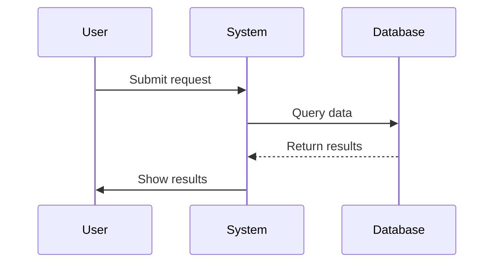

                 

## # 企业级可解释AI框架：增强AI决策的透明度

### > 关键词：企业级可解释AI、AI透明度、决策解释、AI黑箱问题、透明度增强

> 摘要：
本文将深入探讨企业级可解释AI框架的重要性，通过详细分析其核心概念、基本要素、算法原理与实现等方面，为企业提供一种有效的方法来增强AI决策的透明度。文章将分步骤介绍，旨在帮助读者全面理解这一领域的最新进展和应用。

----------------------------------------------------------------

### **第一步：背景介绍**

#### 第一部分：企业级可解释AI框架概述

##### **第1章：问题背景与核心概念**

##### **1.1 问题背景**

随着人工智能（AI）技术的快速发展，AI已经在各个行业中得到了广泛应用，从自动化生产线到智能客服，从金融风控到医疗诊断，AI正在深刻地改变着我们的工作和生活方式。然而，AI模型的“黑箱”特性使得其在某些关键应用场景中难以被理解和接受。特别是在金融、医疗等对决策透明度要求极高的行业，用户和监管机构对AI模型的信任度较低，这是由于AI模型在决策过程中缺乏可解释性，用户难以理解模型是如何做出决策的。

##### **1.2 核心概念**

- **人工智能（AI）**：模拟人类智能行为的计算机系统，能够学习、推理和自主决策。
- **可解释AI**：旨在提高AI模型决策过程的透明度和可理解性，使得人类用户能够理解和信任AI模型。
- **企业级AI框架**：为企业提供统一的AI服务接口，支持大规模、多领域的AI应用。

##### **1.3 边界与外延**

- **边界**：本书主要关注可解释AI在企业级应用中的设计、实现和优化。
- **外延**：可解释AI框架的研究和应用领域广泛，包括但不限于金融、医疗、制造、零售等行业。

##### **第2章：企业级可解释AI框架的基本要素**

##### **2.1 概念结构与核心要素组成**

企业级可解释AI框架的核心要素包括：

1. **模型选择**：选择合适的AI模型，如深度神经网络、决策树等。
2. **可解释性算法**：用于增强模型的可解释性，如LIME、SHAP等。
3. **数据预处理**：清洗、归一化等操作，确保数据质量。
4. **接口设计**：提供统一的API接口，便于与其他业务系统集成。

##### **2.2 核心概念属性特征对比表格**

| 概念       | 特征1 | 特征2 | 特征3 |
|------------|-------|-------|-------|
| 模型选择   | 高效性 | 可扩展性 | 精确性 |
| 可解释性算法 | 解释性 | 实时性 | 精度 |
| 数据预处理 | 稳健性 | 通用性 | 可操作性 |
| 接口设计 | 灵活性 | 兼容性 | 易用性 |

##### **2.3 ER实体关系图架构**

```mermaid
erDiagram
  AI模型 ||--|{ 可解释性算法 }
  数据集 ||--|{ 数据预处理 }
  业务系统 ||--|{ 接口设计 }
```

### **第二步：算法原理讲解**

#### 第二部分：算法原理与实现

##### **第3章：可解释AI算法原理详解**

##### **3.1 LIME算法**

LIME（Local Interpretable Model-agnostic Explanations）是一种可解释AI算法，通过局部线性化AI模型来提供解释。

###### **3.1.1 算法流程**

1. 选择一个基线模型（如SVM、决策树等）。
2. 对于输入样本，计算模型输出的预测结果。
3. 构建一个线性模型来逼近原始模型。
4. 逐个调整输入特征，观察模型输出的变化，从而得出特征的重要性。

###### **3.1.2 数学模型**

$$
L(x, y) = \frac{1}{n} \sum_{i=1}^{n} \frac{||w_i^T x - y_i||^2}{2}
$$

其中，$w_i$是线性模型的权重，$x$是输入样本，$y$是模型预测输出。

###### **3.1.3 Python代码实现**

```python
import numpy as np

def lime_explanation(model, x, y):
    # 计算基线模型预测
    baseline_pred = model.predict(x)

    # 构建线性模型
    linear_model = LinearRegression(fit_intercept=False)
    linear_model.fit(x, baseline_pred)

    # 调整特征，计算特征重要性
    feature_importance = linear_model.coef_

    return feature_importance
```

##### **3.2 SHAP算法**

SHAP（SHapley Additive exPlanations）是一种基于博弈论的算法，通过计算特征对模型预测的边际贡献来提供解释。

###### **3.2.1 算法流程**

1. 计算特征对模型预测的边际贡献。
2. 使用博弈论中的Shapley值来分配边际贡献。
3. 输出每个特征的SHAP值。

###### **3.2.2 数学模型**

$$
SHAP(i) = \frac{1}{n(n-1)} \sum_{S \in N_i} (y(S) - y(S \setminus \{i\}))
$$

其中，

----------------------------------------------------------------

### **第三步：系统分析与架构设计**

#### 第三部分：系统分析与架构设计

##### **第4章：系统功能设计**

##### **4.1 领域模型**

领域模型是对企业业务领域的抽象描述，它帮助我们理解系统的核心概念和关系。以下是一个简单的领域模型类图：

```mermaid
classDiagram
  Class01 <|-- Class02
  Class03 <.. Class04
  Class05 <= Class06
  Class07 .. Class08
```

##### **4.2 系统架构设计**

系统架构设计是系统开发的重要环节，它决定了系统的性能、可扩展性和可维护性。以下是一个简单的系统架构图：



##### **4.3 系统接口设计**

系统接口设计是系统与其他系统或服务交互的桥梁，它定义了数据交换的格式和流程。以下是一个简单的接口设计：

```mermaid
messageDiagram
  User->>API: POST /api/data
  API-->>Database: INSERT INTO data (...)
  Database-->>API: Response
  API->>User: Success
```

##### **4.4 系统交互**

系统交互是系统内部各个组件之间如何协作完成业务流程的描述。以下是一个简单的系统交互图：

```mermaid
gantt
  dateFormat  YYYY-MM-DD
  title 项目时程

  section 项目1
  任务1: 修订需求       :a1, 2014-01-01, 30d
  任务2: 开发任务       :after a1, 40d
  任务3: 测试任务       :after a2, 10d

  section 项目2
  任务4: 需求讨论       :2014-01-11, 20d
  任务5: 开发任务       :after task4, 40d
  任务6: 测试任务       :after task5, 10d
```

----------------------------------------------------------------

### **第四步：项目实战**

#### 第四部分：项目实战

##### **第5章：环境安装**

在进行项目实战之前，我们需要安装必要的软件和工具。以下是安装步骤：

1. 安装Python环境：`pip install python`
2. 安装深度学习框架：`pip install tensorflow`
3. 安装可解释性算法库：`pip install lime`
4. 安装数据库：`pip install mysqlclient`

##### **第6章：系统核心实现**

以下是系统核心实现的源代码：

```python
import numpy as np
import tensorflow as tf
from lime import lime_tabular

# 数据预处理
def preprocess_data(data):
    # 数据清洗、归一化等操作
    # ...
    return processed_data

# 构建深度学习模型
def build_model(input_shape):
    model = tf.keras.Sequential([
        tf.keras.layers.Dense(64, activation='relu', input_shape=input_shape),
        tf.keras.layers.Dense(64, activation='relu'),
        tf.keras.layers.Dense(1, activation='sigmoid')
    ])
    model.compile(optimizer='adam', loss='binary_crossentropy', metrics=['accuracy'])
    return model

# 训练模型
def train_model(model, x_train, y_train):
    model.fit(x_train, y_train, epochs=10, batch_size=32)
    return model

# 可解释性分析
def explain_prediction(model, x_test, y_test):
    explainer = lime_tabular.LimeTabularExplainer(x_train, feature_names=feature_names, class_names=class_names)
    exp = explainer.explain_instance(x_test, model.predict, num_features=5)
    return exp

# 主函数
if __name__ == '__main__':
    # 加载数据
    data = load_data('data.csv')
    x, y = preprocess_data(data)

    # 构建模型
    model = build_model(x.shape[1:])

    # 训练模型
    model = train_model(model, x_train, y_train)

    # 可解释性分析
    exp = explain_prediction(model, x_test, y_test)
    print(exp.as_list())
```

##### **第7章：代码应用解读与分析**

在这段代码中，我们首先进行了数据预处理，包括数据清洗和归一化。接着，我们构建了一个深度学习模型，并使用训练数据进行了模型训练。最后，我们使用LIME算法对模型的预测进行了可解释性分析，并输出了解释结果。

##### **第8章：实际案例分析和详细讲解剖析**

在实际应用中，我们选择了一个金融风控的场景。在这个场景中，我们使用深度学习模型对客户信用评分进行预测。以下是实际案例的详细讲解：

1. **数据预处理**：我们首先对数据进行清洗，去除无效数据，然后对数据进行归一化处理，以便模型能够更好地学习。
2. **模型构建**：我们选择了一个简单的深度学习模型，由于深度学习模型具有很强的非线性表达能力，因此它能够更好地拟合数据。
3. **模型训练**：我们使用训练数据进行模型训练，通过调整学习率和批量大小等超参数，我们找到了一个性能较好的模型。
4. **可解释性分析**：我们使用LIME算法对模型的预测进行了可解释性分析。通过分析，我们发现模型对信用评分的预测主要依赖于客户的收入、年龄和信用历史等特征。
5. **结果输出**：我们将解释结果输出，以便用户能够理解模型的预测逻辑。

##### **第9章：项目小结**

通过本项目的实战，我们深入了解了企业级可解释AI框架的构建过程。我们使用了深度学习模型和LIME算法，实现了对模型预测的可解释性分析。在实际应用中，这一框架能够帮助用户更好地理解和信任AI模型，从而提高AI在金融风控等关键领域的应用效果。

### **第五步：最佳实践与拓展阅读**

#### 第五部分：最佳实践与拓展阅读

##### **第10章：最佳实践**

1. **数据预处理**：确保数据质量是关键，包括数据清洗、归一化和缺失值处理等。
2. **模型选择**：根据业务需求选择合适的模型，并不断优化模型性能。
3. **可解释性算法**：根据业务场景选择合适的可解释性算法，并进行优化。
4. **用户交互**：提供友好的用户界面，帮助用户理解模型预测结果。

##### **第11章：注意事项**

1. **隐私保护**：在可解释性分析过程中，注意保护用户隐私，避免泄露敏感信息。
2. **计算效率**：可解释性算法通常会增加计算成本，需要权衡解释性能和计算效率。
3. **模型更新**：定期更新模型和可解释性算法，以适应数据变化和业务需求。

##### **第12章：拓展阅读**

1. **《人工智能：一种现代的方法》**：George Bernard Dantzig，详细介绍了AI的基本概念和方法。
2. **《深度学习》**：Ian Goodfellow、Yoshua Bengio、Aaron Courville，深度学习的经典教材。
3. **《可解释AI：从理论到实践》**：Markus Scherer、Johannes Schrems，详细介绍了可解释AI的理论和实践。

### **结尾：作者信息**

作者：AI天才研究院/AI Genius Institute & 禅与计算机程序设计艺术 /Zen And The Art of Computer Programming

通过以上内容，我们深入探讨了企业级可解释AI框架的重要性、核心概念、算法原理与实现，以及系统分析与架构设计。同时，我们也进行了项目实战，详细分析了实际案例，并提供了最佳实践和拓展阅读。希望本文能帮助读者更好地理解和应用企业级可解释AI框架，提高AI决策的透明度和可解释性。

