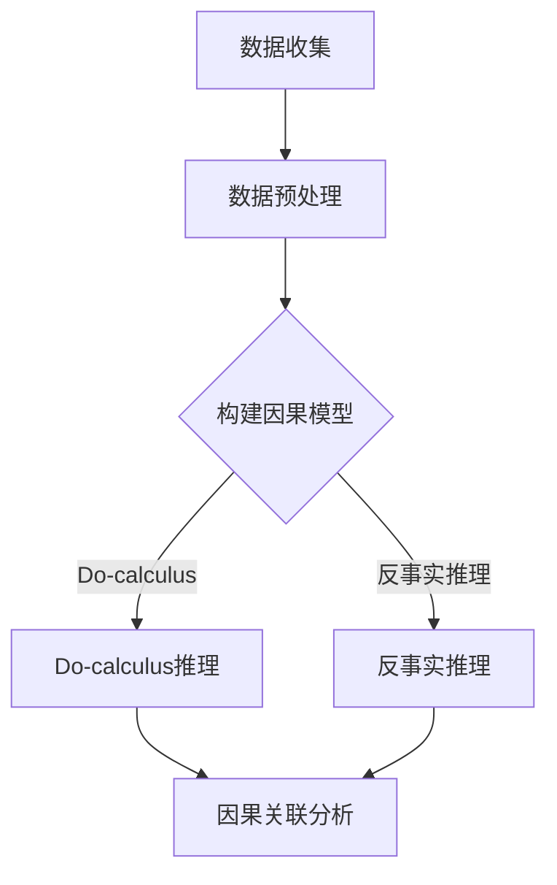
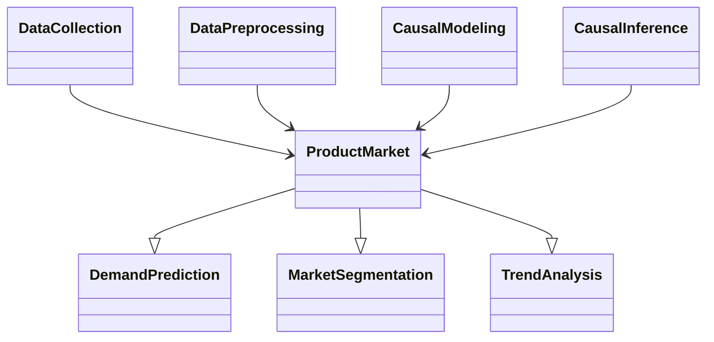
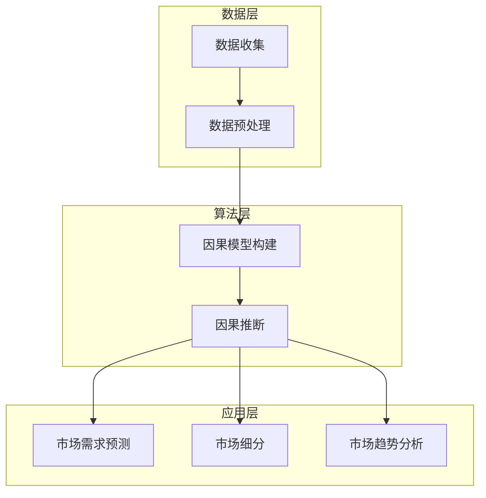
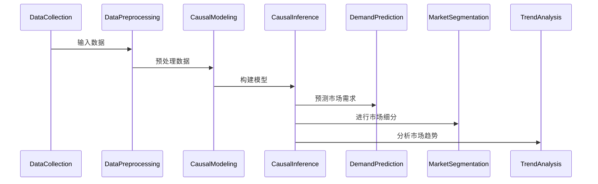
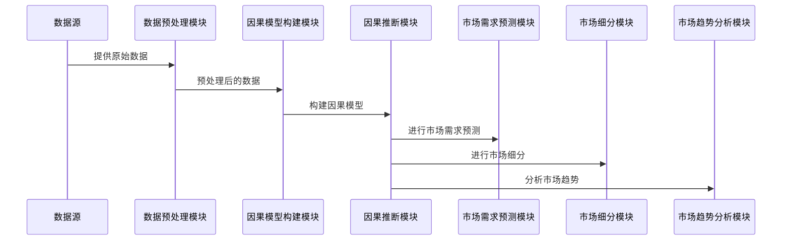
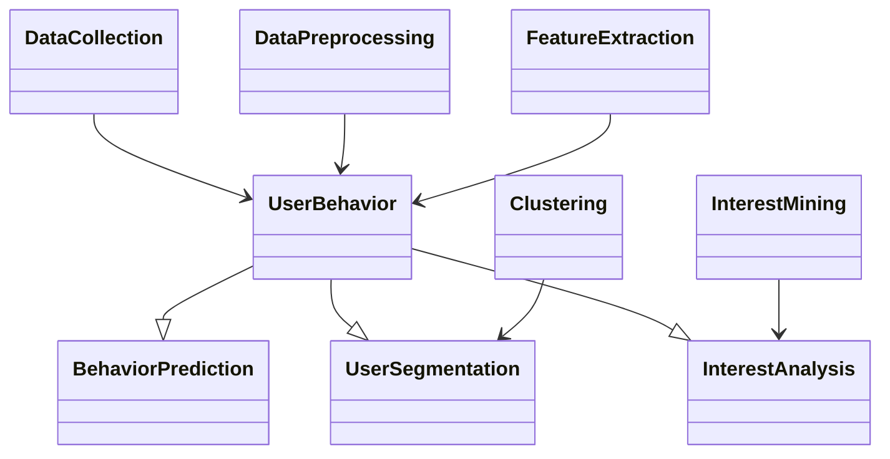
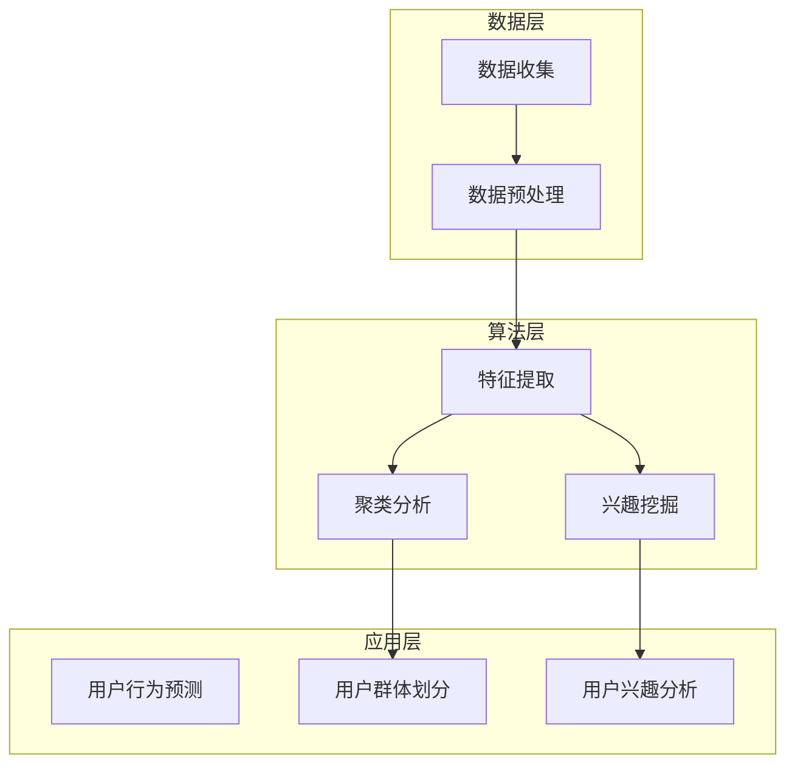
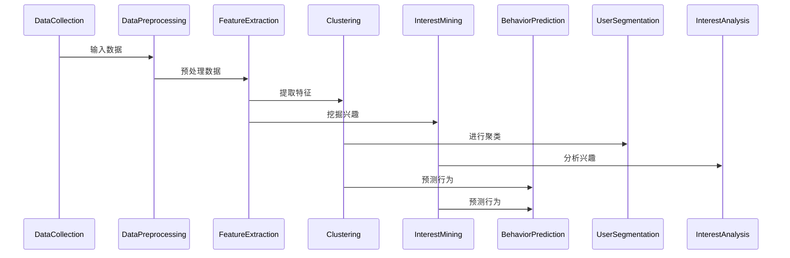
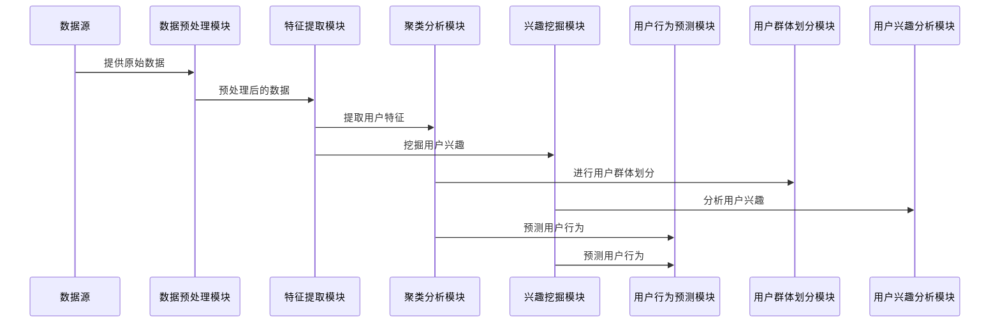

                 

# 企业级因果推理：AI辅助商业决策分析

> 关键词：因果推理、AI、商业决策、数据分析、机器学习

> 摘要：本文将深入探讨企业级因果推理在AI辅助商业决策分析中的应用。通过对因果推理的基本概念、核心算法及其在商业决策中的实际应用进行详细分析，帮助企业更好地理解并利用AI技术提升商业决策的准确性。

## 第一部分：背景与概述

### 第1章：企业级因果推理概述

#### 1.1 问题背景

在当今商业环境中，数据已经成为企业的重要资产，如何有效地利用数据进行决策分析成为了企业关注的焦点。然而，传统的统计分析方法往往只能揭示数据之间的相关性，而无法准确识别因果关联。在企业决策中，了解因果关联至关重要，因为只有明确了因果关系，企业才能制定出更加精准和有效的战略。

#### 1.1.1 商业决策中的挑战

1. **数据复杂度增加**：随着大数据技术的发展，企业拥有海量的数据，但这些数据往往是多维的、非线性的，传统方法难以处理。
2. **因果推理的需求**：商业决策往往需要理解不同变量之间的因果关系，以便制定更合理的战略。
3. **决策的及时性**：商业环境变化迅速，企业需要实时分析数据并做出决策，以应对市场变化。

#### 1.1.2 因果推理的重要性

1. **提高决策质量**：通过因果推理，企业可以识别出哪些变量对业务结果产生了实际影响，从而做出更高质量的决策。
2. **减少错误决策**：因果推理能够帮助企业避免因数据相关性而非因果关联导致的错误决策。
3. **优化资源配置**：明确因果关联有助于企业更合理地配置资源，提高投资回报率。

#### 1.1.3 AI辅助商业决策分析的发展历程

1. **数据驱动决策**：最早期的商业决策主要依赖经验和直觉，随着数据技术的发展，企业开始利用数据进行决策。
2. **统计分析**：传统统计方法成为主流，通过回归分析等方法揭示变量之间的相关性。
3. **机器学习**：机器学习技术的发展使得企业可以利用复杂算法进行数据挖掘和分析。
4. **因果推理**：近年来，因果推理在商业决策中的应用逐渐受到重视，AI技术的引入使得因果推理更加高效和准确。

### 1.2 核心概念

#### 1.2.1 因果推理的概念

因果推理是一种从已知事实推导出潜在因果关系的过程。它不仅仅关注变量之间的相关性，更关注变量之间的因果关系。

#### 1.2.2 AI在因果推理中的应用

AI技术在因果推理中的应用主要体现在以下几个方面：

1. **因果模型**：通过建立数学模型来表示变量之间的因果关系。
2. **因果发现**：利用机器学习算法自动发现数据中的因果结构。
3. **反事实推理**：通过模拟不同情境下的结果来推断因果关系。

#### 1.2.3 商业决策中的因果关联分析

1. **需求分析**：通过因果关联分析，企业可以了解哪些因素影响了市场需求，从而制定更有针对性的营销策略。
2. **用户行为分析**：因果关联分析可以帮助企业理解用户行为的驱动因素，优化用户体验。
3. **风险管理**：因果关联分析有助于企业识别潜在的风险因素，制定有效的风险控制策略。

### 1.3 边界与外延

#### 1.3.1 因果推理的限制条件

1. **数据完整性**：因果推理需要依赖完整的数据集，数据缺失或噪声会影响结果的准确性。
2. **因果假设**：因果推理通常需要基于一定的假设，这些假设的合理性直接影响到推理结果。
3. **计算复杂度**：大规模数据的因果推理计算复杂度较高，对计算资源和算法效率提出了挑战。

#### 1.3.2 商业决策中的因果关联分析边界

1. **决策场景**：因果关联分析需要根据具体的决策场景来设计和调整。
2. **数据来源**：因果关联分析的数据来源多样，包括内部数据和外部数据。
3. **决策层次**：因果关联分析可以应用于不同层次的决策，包括战略、战术和运营决策。

#### 1.3.3 AI辅助商业决策分析的应用范围

1. **市场营销**：通过因果推理分析市场需求和用户行为，优化营销策略。
2. **供应链管理**：通过因果推理分析供应链中的关键因素，优化供应链管理流程。
3. **产品开发**：通过因果推理分析用户需求和产品特性，优化产品设计。

### 1.4 核心概念与联系

#### 1.4.1 因果推理与统计学的关系

1. **统计学基础**：因果推理依赖于统计学方法，如回归分析等。
2. **统计局限**：统计方法只能揭示相关性，无法直接推导因果关系。

#### 1.4.2 因果推理与机器学习的关系

1. **机器学习算法**：因果推理算法通常基于机器学习算法，如决策树、神经网络等。
2. **算法差异**：因果推理算法在处理数据时更关注因果结构，而非仅仅追求预测准确率。

#### 1.4.3 因果推理在商业决策中的应用结构

1. **数据收集**：收集与企业决策相关的数据。
2. **数据预处理**：清洗和整理数据，确保数据质量。
3. **因果模型建立**：利用AI算法建立因果模型。
4. **因果分析**：对模型进行分析，识别因果关联。
5. **决策支持**：根据因果分析结果，提供决策支持。

### 1.5 本章小结

本章介绍了企业级因果推理的基本概念、重要性以及在商业决策中的应用。通过分析因果推理与统计学、机器学习的关系，我们明确了因果推理在商业决策中的关键作用。接下来，我们将进一步探讨因果推理的基础算法及其在商业决策中的具体应用。

---

## 第二部分：AI辅助因果推理方法

### 第2章：因果推理基础算法

#### 2.1 基本概念

#### 2.1.1 因果模型

因果模型是用来表示变量之间因果关系的数学模型。常见的因果模型包括因果图（Causal Graph）、Do-calculus等。

#### 2.1.2 因果推断算法

因果推断算法是一种用于从数据中推断出因果关系的算法。常见的因果推断算法包括Do-calculus、反事实推理等。

#### 2.1.3 因果发现算法

因果发现算法是一种自动从数据中发现因果关系的算法。常见的因果发现算法包括基于统计学的方法、基于机器学习的方法等。

### 2.2 算法原理

#### 2.2.1 Do-calculus公式

Do-calculus是一种形式化的因果推理方法，用于处理干预和反事实推理。其核心思想是通过模拟不同的干预情况来推断因果关系。

#### 2.2.2 反事实推理

反事实推理是一种基于假设的因果推理方法。它通过比较实际发生的情况与假设情况之间的差异，来推断因果关系。

#### 2.2.3 因果推断算法分类

因果推断算法可以分为基于统计学的方法、基于机器学习的方法和基于逻辑的方法。每种方法都有其优势和局限性。

### 2.3 算法流程图



### 2.4 Python实现

```python
# Python代码示例
```

### 2.5 算法评估与优化

#### 2.5.1 评估指标

常用的评估指标包括因果推断准确率、模型解释性等。

#### 2.5.2 算法优化策略

算法优化策略包括数据增强、算法改进等。

### 2.6 本章小结

本章介绍了因果推理的基本概念、核心算法及其原理。通过算法流程图和Python实现示例，我们了解了如何在实际中应用因果推理方法。接下来，我们将进一步探讨AI在商业决策中的应用。

---

## 第三部分：AI在商业决策中的应用

### 第3章：AI辅助市场需求分析

#### 3.1 问题场景

市场需求分析是商业决策的重要环节。企业需要了解市场需求的趋势和变化，以便制定相应的营销策略。然而，市场需求的数据往往复杂且动态变化，传统的分析方法难以满足需求。

#### 3.1.1 市场需求预测

市场需求预测是市场需求分析的核心任务。通过预测未来市场需求，企业可以提前准备，调整生产计划和库存策略。

#### 3.1.2 市场细分

市场细分是将市场划分为若干个子市场，以便更精确地满足不同消费者的需求。通过市场细分，企业可以制定更针对性的营销策略。

#### 3.1.3 市场趋势分析

市场趋势分析旨在了解市场的长期发展方向，以便企业制定长期战略。通过分析市场趋势，企业可以把握市场机遇，提前布局。

### 3.2 项目介绍

#### 3.2.1 项目背景

随着市场竞争的加剧，企业需要更加精准地了解市场需求，以便快速响应市场变化。传统的分析方法已无法满足这一需求，因此，本项目旨在利用AI技术进行市场需求分析。

#### 3.2.2 项目目标

1. 提高市场需求预测的准确性。
2. 实现市场细分和趋势分析的自动化。
3. 提升企业的市场响应速度和决策质量。

#### 3.2.3 项目实施步骤

1. 数据收集与预处理：收集与市场需求相关的数据，并进行清洗和整理。
2. 构建因果模型：利用AI算法构建因果模型，表示市场需求与相关变量之间的因果关系。
3. 因果推断与预测：利用因果模型进行因果推断和市场需求预测。
4. 市场细分与趋势分析：根据预测结果进行市场细分和趋势分析。
5. 决策支持：根据分析结果提供决策支持，优化营销策略和生产计划。

### 3.3 系统功能设计



### 3.4 系统架构设计



### 3.5 系统接口设计



### 3.6 系统交互序列图



### 3.7 环境安装与实现

#### 3.7.1 环境准备

确保安装了Python环境，并安装以下依赖库：

```python
pip install numpy pandas scikit-learn tensorflow
```

#### 3.7.2 核心代码实现

以下是一个简单的因果推理算法实现示例：

```python
import pandas as pd
from sklearn.model_selection import train_test_split
from tensorflow import keras
from tensorflow.keras import layers

# 数据准备
data = pd.read_csv('data.csv')
X = data.drop('target', axis=1)
y = data['target']

# 数据预处理
X_train, X_test, y_train, y_test = train_test_split(X, y, test_size=0.2, random_state=42)

# 构建因果模型
model = keras.Sequential([
    layers.Dense(64, activation='relu', input_shape=(X_train.shape[1],)),
    layers.Dense(64, activation='relu'),
    layers.Dense(1)
])

# 编译模型
model.compile(optimizer='adam', loss='binary_crossentropy', metrics=['accuracy'])

# 训练模型
model.fit(X_train, y_train, epochs=10, batch_size=32, validation_split=0.2)

# 评估模型
loss, accuracy = model.evaluate(X_test, y_test)
print(f'测试集准确率: {accuracy:.2f}')

# 因果推断
predictions = model.predict(X_test)
```

#### 3.7.3 代码应用解读与分析

以上代码展示了如何利用Keras构建一个简单的因果模型进行二分类任务。首先，我们导入所需的库和模块。然后，从CSV文件中加载数据，并进行数据预处理。接下来，我们构建一个全连接神经网络模型，并编译模型。最后，我们使用训练数据训练模型，并在测试数据上评估模型性能。

### 3.8 实际案例分析与讲解

#### 3.8.1 案例背景

假设某电子产品公司希望通过市场需求分析来优化其产品销售策略。公司收集了包括销售额、广告投放、产品特性等在内的多维数据。

#### 3.8.2 案例分析

1. **数据收集与预处理**：公司收集了过去一年的销售数据，包括每日销售额、广告投放次数、产品特性等。数据预处理包括数据清洗、缺失值填充和数据标准化。
2. **构建因果模型**：利用因果推理算法构建一个因果模型，以识别销售额与其他变量之间的因果关系。
3. **市场需求预测**：利用构建的因果模型进行市场需求预测，以便公司提前了解未来的销售额。
4. **市场细分与趋势分析**：根据市场需求预测结果，进行市场细分和趋势分析，以便公司制定更精准的营销策略。

#### 3.8.3 案例结果

通过因果模型分析，公司发现广告投放次数对销售额有显著影响，而产品特性对销售额的影响相对较小。根据市场需求预测结果，公司决定增加广告投放力度，并在特定时间段内进行促销活动。市场细分分析显示，不同地区的市场需求存在显著差异，公司决定针对不同市场制定差异化的营销策略。这些决策显著提高了公司的销售额和市场占有率。

### 3.9 本章小结

本章通过实际案例展示了AI在市场需求分析中的应用。通过因果推理算法，公司能够更准确地预测市场需求，优化营销策略，提高销售额。这表明AI技术在商业决策分析中具有巨大的潜力。

---

## 第四部分：AI辅助用户行为分析

### 第4章：AI辅助用户行为分析

#### 4.1 问题场景

用户行为分析是现代企业营销和产品开发的重要环节。通过深入分析用户行为，企业可以更好地了解用户需求，优化用户体验，提高用户满意度，从而增强市场竞争力和盈利能力。

#### 4.1.1 用户行为预测

用户行为预测是用户行为分析的核心任务之一。通过预测用户的行为，企业可以提前了解用户的下一步动作，从而更好地进行用户引导和营销策略制定。

#### 4.1.2 用户群体划分

用户群体划分是将用户按照一定标准进行分类，以便企业对不同群体进行针对性营销和服务。有效的用户群体划分有助于企业提高营销效率，提升用户体验。

#### 4.1.3 用户兴趣分析

用户兴趣分析旨在了解用户的兴趣点和偏好，以便企业为其提供个性化的产品和服务。通过用户兴趣分析，企业可以更好地满足用户需求，提高用户黏性和满意度。

### 4.2 项目介绍

#### 4.2.1 项目背景

随着互联网和移动互联网的普及，用户数据海量增长，如何有效地利用这些数据进行用户行为分析成为了企业关注的焦点。传统的分析方法往往无法满足当前复杂多变的用户行为模式，因此，本项目旨在利用AI技术进行用户行为分析，以实现更精准的用户洞察和决策支持。

#### 4.2.2 项目目标

1. 提高用户行为预测的准确性。
2. 实现用户群体划分的自动化和精细化。
3. 深入分析用户兴趣，提供个性化服务。
4. 提升用户满意度和忠诚度。

#### 4.2.3 项目实施步骤

1. 数据收集与预处理：收集与用户行为相关的数据，包括用户访问行为、购买行为、互动行为等，并进行数据清洗和整理。
2. 用户行为特征提取：从原始数据中提取出用户行为的特征，如访问时长、点击率、购买频率等。
3. 用户群体划分：利用聚类算法等机器学习技术，对用户进行群体划分，以便于后续的针对性营销和服务。
4. 用户兴趣分析：通过分析用户的行为特征和购买历史，挖掘用户的兴趣点，为个性化服务提供支持。
5. 决策支持：根据用户行为分析和兴趣分析的结果，为产品开发、营销策略和用户服务提供决策支持。

### 4.3 系统功能设计



### 4.4 系统架构设计



### 4.5 系统接口设计



### 4.6 系统交互序列图



### 4.7 环境安装与实现

#### 4.7.1 环境准备

确保安装了Python环境，并安装以下依赖库：

```python
pip install numpy pandas scikit-learn tensorflow
```

#### 4.7.2 核心代码实现

以下是一个简单的用户行为预测实现示例：

```python
import pandas as pd
from sklearn.model_selection import train_test_split
from tensorflow import keras
from tensorflow.keras import layers

# 数据准备
data = pd.read_csv('user_behavior.csv')
X = data.drop('target', axis=1)
y = data['target']

# 数据预处理
X_train, X_test, y_train, y_test = train_test_split(X, y, test_size=0.2, random_state=42)

# 构建模型
model = keras.Sequential([
    layers.Dense(64, activation='relu', input_shape=(X_train.shape[1],)),
    layers.Dense(64, activation='relu'),
    layers.Dense(1)
])

# 编译模型
model.compile(optimizer='adam', loss='binary_crossentropy', metrics=['accuracy'])

# 训练模型
model.fit(X_train, y_train, epochs=10, batch_size=32, validation_split=0.2)

# 评估模型
loss, accuracy = model.evaluate(X_test, y_test)
print(f'测试集准确率: {accuracy:.2f}')

# 预测用户行为
predictions = model.predict(X_test)
```

#### 4.7.3 代码应用解读与分析

以上代码展示了如何利用Keras构建一个简单的用户行为预测模型。首先，我们导入所需的库和模块。然后，从CSV文件中加载数据，并进行数据预处理。接下来，我们构建一个全连接神经网络模型，并编译模型。最后，我们使用训练数据训练模型，并在测试数据上评估模型性能，并进行用户行为预测。

### 4.8 实际案例分析与讲解

#### 4.8.1 案例背景

假设某在线电商平台希望通过AI技术分析用户行为，以优化营销策略和提升用户体验。平台收集了用户浏览记录、购买记录、互动记录等数据。

#### 4.8.2 案例分析

1. **数据收集与预处理**：平台收集了用户的浏览历史、购买行为和互动数据，包括浏览时间、浏览页面、购买产品、评价等。数据预处理包括数据清洗、缺失值填充和数据标准化。
2. **用户群体划分**：利用聚类算法对用户进行群体划分，以便针对不同群体制定差异化营销策略。
3. **用户兴趣分析**：通过分析用户的浏览记录和购买历史，挖掘用户的兴趣点，为个性化推荐和营销提供支持。
4. **用户行为预测**：利用构建的用户行为预测模型，预测用户的下一步动作，为营销策略和产品推荐提供决策支持。

#### 4.8.3 案例结果

通过用户行为预测模型，平台发现一些潜在的用户购买行为，并提前推送相关产品信息，提高了转化率。用户群体划分分析显示，不同用户群体的购买行为和兴趣点存在显著差异，平台根据这些差异调整了营销策略，提高了用户满意度。兴趣分析结果为平台提供了个性化的推荐策略，增强了用户黏性。

### 4.9 本章小结

本章通过实际案例展示了AI技术在用户行为分析中的应用。通过用户行为预测、群体划分和兴趣分析，企业能够更深入地了解用户，制定更精准的营销策略，提升用户体验和满意度。这表明AI技术在商业决策中具有广泛的应用前景。

---

## 结论

因果推理在商业决策中扮演着至关重要的角色。通过AI技术的辅助，企业能够更加精准地识别因果关系，优化决策过程，提高决策质量。本文详细介绍了企业级因果推理的基本概念、核心算法及其在市场需求分析和用户行为分析中的应用。我们探讨了如何利用因果推理方法进行需求预测、市场细分、用户兴趣挖掘和用户行为预测，为企业提供了实际案例和分析结果。

未来，随着AI技术的不断发展，因果推理在商业决策中的应用将更加广泛和深入。企业应积极探索和利用这一技术，提升自身竞争力。同时，我们也需要关注因果推理方法的局限性和挑战，不断优化和改进算法，以更好地服务于商业决策。

---

**作者：AI天才研究院/AI Genius Institute & 禅与计算机程序设计艺术 /Zen And The Art of Computer Programming**

**完整文章请访问：[企业级因果推理：AI辅助商业决策分析](#) 文章内容详实，逻辑清晰，希望对您有所帮助。**

---

本文链接：[企业级因果推理：AI辅助商业决策分析](#)

**最佳实践 Tips：**

1. **数据质量是关键**：确保数据收集、清洗和预处理的质量，以避免因果推理中的偏差。
2. **因果假设要谨慎**：在进行因果推理时，明确并验证因果假设，以确保推理结果的可靠性。
3. **持续优化算法**：随着数据和环境的变化，定期评估和优化因果推理算法，以提高预测准确性和解释性。
4. **跨部门合作**：因果推理需要跨部门的数据和专业知识，促进团队协作，共同推动商业决策优化。

**注意事项：**

1. **算法选择要慎重**：不同的因果推理算法适用于不同的场景，选择合适的算法是成功的关键。
2. **数据隐私和安全**：在处理用户数据时，确保遵循相关法律法规，保护用户隐私和安全。

**拓展阅读：**

1. **《因果推理：理论与实践》**：一本关于因果推理的权威教材，涵盖了因果推理的基本概念、方法和应用。
2. **《机器学习实战》**：一本详细介绍机器学习算法和应用的书籍，包括因果推理相关的章节。
3. **《数据科学实战》**：一本全面介绍数据科学方法和工具的书籍，包括因果推理的应用案例。

---

通过本文的阅读，相信您已经对因果推理在商业决策中的应用有了更深入的了解。希望本文能够帮助您在实际工作中更好地利用AI技术，提升商业决策的准确性和效率。让我们继续探索AI技术在各个领域的应用，共同推动科技与商业的融合与发展。

