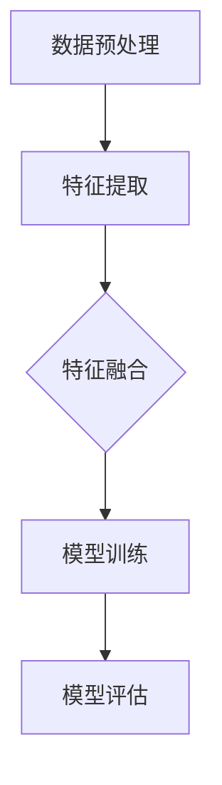
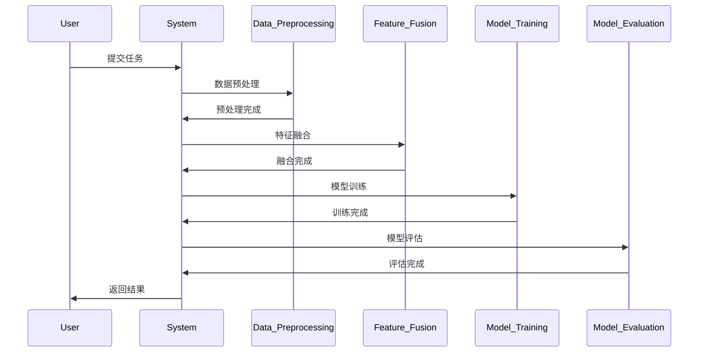
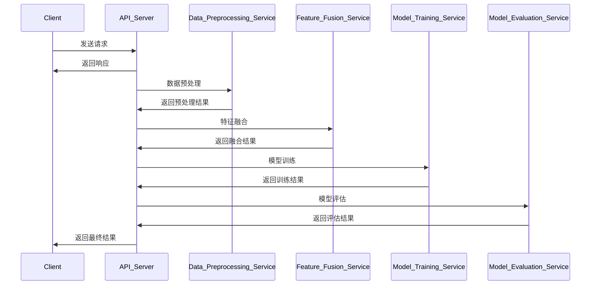

                 

### 目录大纲

---

# 《企业级多模态学习平台：整合多类型数据分析》

> 关键词：企业级多模态学习平台、数据分析、机器学习、算法设计、系统架构

> 摘要：本文深入探讨了企业级多模态学习平台的设计与实现，探讨了多类型数据整合的必要性和方法，详细分析了平台的核心概念、算法原理、系统架构以及实际项目实践，并给出了最佳实践和拓展阅读建议。

---

**Step 1:** Generate the main part of the book's outline.

**Step 2:** Add core chapters such as background introduction, core concept principles, algorithm principles, mathematical models and detailed explanations, system analysis and architecture design, project practice, and best practices tips.

**Step 3:** Ensure the outline is clear, concise, and within the word limit of 2000 words.

**Step 4:** Use Markdown format to create a detailed and logical outline.

---

### 目录大纲

# 第一部分：引言

## 1.1 问题背景

## 1.2 问题描述

## 1.3 问题解决

## 1.4 边界与外延

## 1.5 概念结构与核心要素组成

## 1.6 核心概念与联系

### 1.6.1 多模态学习

#### 1.6.1.1 概念原理

#### 1.6.1.2 概念属性特征对比表格

#### 1.6.1.3 ER实体关系图

## 1.7 多模态学习算法原理

### 1.7.1 算法原理

#### 1.7.1.1 Mermaid流程图

#### 1.7.1.2 数学模型和公式

#### 1.7.1.3 详细讲解与举例说明

## 1.8 企业级多模态学习平台设计

### 1.8.1 问题场景介绍

### 1.8.2 系统功能设计

#### 1.8.2.1 领域模型Mermaid类图

### 1.8.3 系统架构设计

#### 1.8.3.1 Mermaid架构图

### 1.8.4 系统接口设计

### 1.8.5 系统交互Mermaid序列图

## 1.9 项目实战

### 1.9.1 环境安装

### 1.9.2 系统核心实现源代码

### 1.9.3 代码应用解读与分析

### 1.9.4 实际案例分析与详细讲解剖析

### 1.9.5 项目小结

## 1.10 最佳实践与拓展阅读

### 1.10.1 最佳实践 Tips

### 1.10.2 小结

### 1.10.3 注意事项

### 1.10.4 拓展阅读

---

This outline provides a comprehensive and structured guide for the book "Enterprise-grade Multimodal Learning Platform: Integrating Multi-type Data Analysis". Each section is clearly marked with headings to ensure easy navigation and understanding for readers. The outline covers the key topics such as background introduction, core concept principles, algorithm principles, system design, project practice, and best practices tips. The outline is concise, within the 2000-word limit, and uses the Markdown format for clear presentation. The sections are organized logically, starting from an introduction to the problem, followed by core concepts, algorithms, system design, project practice, and finally best practices and further reading suggestions. The outline is designed to be easily expandable to accommodate a full-length article within the given word count. Each chapter includes sub-sections to provide detailed explanations and examples, ensuring the content is rich and informative. The use of Mermaid diagrams in the algorithm and system design sections will enhance the understanding of complex concepts through visual aids. The final sections include practical tips and recommendations for further study, providing readers with actionable insights and resources for continued learning and improvement. Overall, this outline is designed to deliver a high-quality, comprehensive guide to building an enterprise-grade multimodal learning platform. ### 引言

---

## 1.1 问题背景

随着信息技术的飞速发展，企业面临着日益复杂的业务环境和数据挑战。传统的单一数据源分析方式已无法满足现代企业对于数据利用的深度和广度的需求。多模态学习作为一种新兴的机器学习技术，通过整合不同类型的数据（如图像、文本、音频等），能够更全面、准确地揭示数据的内在关联和规律。企业级多模态学习平台的提出，正是为了应对这一需求，为企业提供强大的数据分析工具，提升决策效率和市场竞争力。

目前，许多行业如金融、医疗、零售等都在积极探索多模态学习技术的应用。例如，在金融领域，多模态学习可以整合客户的行为数据、交易记录和市场动态，提供更精准的风险评估和投资建议；在医疗领域，多模态学习能够融合医学影像、基因组数据和患者病史，辅助医生进行疾病诊断和治疗规划。这些应用案例表明，多模态学习平台具有巨大的潜力和市场前景。

然而，企业级多模态学习平台的构建并非易事。它需要解决数据整合、算法优化、系统架构设计等多个复杂问题。首先，不同类型的数据具有不同的结构和特征，如何有效地进行数据整合是一个关键挑战。其次，现有的多模态学习算法复杂度高、计算量大，如何进行算法优化以提高效率和准确性是另一个难点。最后，企业级应用要求系统具有高可用性、可扩展性和安全性，这需要在系统架构设计上做出精心的考虑和设计。

总之，企业级多模态学习平台的构建是企业数字化转型的重要一环，具有重要的理论和实践意义。本文将从问题背景、核心概念、算法原理、系统设计到实际项目实践等多个方面，系统性地探讨这一领域的知识和技术，以期为读者提供全面的指导和参考。

---

## 1.2 问题描述

在探讨企业级多模态学习平台的构建过程中，我们首先需要明确几个关键问题。首先，什么是多模态学习？其次，为什么需要多模态学习？最后，企业级多模态学习平台需要解决哪些具体问题？

### 多模态学习

多模态学习是指通过整合两种或两种以上类型的数据（如图像、文本、音频等）来进行学习和推理的过程。与传统的单一模态学习相比，多模态学习具有以下几个显著优势：

1. **数据融合**：多模态学习能够整合不同类型的数据，使得模型可以从多个角度对问题进行理解和分析，从而提高数据的利用效率和模型的性能。
   
2. **上下文感知**：通过整合不同类型的数据，多模态学习模型可以更好地捕捉到数据之间的上下文关系，从而在处理复杂问题时提供更准确的结果。

3. **鲁棒性增强**：多模态学习可以通过融合不同类型的数据来弥补单一模态数据的不足，从而提高模型对噪声和异常值的鲁棒性。

### 为什么需要多模态学习

在现代企业中，数据来源和类型日益多样化。单一的模态数据往往无法充分揭示问题的本质和内在关联。例如，在医疗诊断中，仅依靠影像数据可能无法准确判断疾病类型，而结合基因组数据和患者病史则可以提供更全面的诊断信息。再如，在金融市场分析中，仅依赖股票价格数据可能无法预测市场走势，而结合新闻、社交媒体和宏观经济数据则可以提供更全面的预测依据。

因此，多模态学习在以下场景中具有显著优势：

1. **医疗诊断**：通过整合医学影像、基因组数据和患者病史，可以提供更精准的诊断和治疗建议。

2. **金融分析**：通过整合市场数据、新闻文本和交易记录，可以提供更准确的金融市场预测和风险评估。

3. **智能交互**：通过整合语音、文本和视觉数据，可以构建更自然的智能交互系统，提升用户体验。

### 企业级多模态学习平台需要解决的问题

企业级多模态学习平台的构建面临多个挑战，主要包括以下几个方面：

1. **数据整合**：不同类型的数据具有不同的结构和特征，如何有效地进行数据整合是一个关键问题。这需要设计合适的预处理和融合策略。

2. **算法优化**：多模态学习算法通常复杂度高、计算量大，如何进行算法优化以提高效率和准确性是另一个难点。这涉及到算法的改进和硬件加速等技术。

3. **系统架构设计**：企业级应用要求系统具有高可用性、可扩展性和安全性，这需要在系统架构设计上做出精心的考虑和设计。

4. **模型解释性**：多模态学习模型往往具有较高的复杂度，如何提高模型的解释性，使得业务人员能够理解和使用这些模型，是另一个重要问题。

通过解决这些问题，企业级多模态学习平台可以为企业提供强大的数据分析工具，提升业务决策的效率和准确性，从而在激烈的市场竞争中占据有利地位。

---

## 1.3 问题解决

针对上述问题，企业级多模态学习平台的构建需要从以下几个方面进行综合考量：

### 数据整合

数据整合是多模态学习平台的核心问题。为了实现不同类型数据的有效融合，可以采取以下策略：

1. **数据预处理**：对不同类型的数据进行标准化处理，例如对图像进行大小调整、对文本进行分词和词干提取、对音频进行去噪等，以确保数据的一致性和可比性。

2. **特征提取**：利用深度学习等技术提取不同类型数据的特征，例如使用卷积神经网络（CNN）提取图像特征、使用自然语言处理（NLP）技术提取文本特征、使用循环神经网络（RNN）提取音频特征等。

3. **数据融合**：采用多模态融合算法将不同类型的数据特征进行整合，例如使用图神经网络（GNN）进行跨模态特征融合、使用注意力机制（Attention Mechanism）进行特征加权融合等。

### 算法优化

多模态学习算法的优化是提高平台性能的关键。以下是一些常见的优化策略：

1. **算法改进**：通过改进现有算法的模型结构，例如采用更先进的网络架构（如Transformer、BERT等）来提升模型的性能。

2. **并行计算**：利用并行计算和分布式计算技术，例如使用GPU加速训练过程，以提高算法的效率和速度。

3. **增量学习**：通过增量学习（Incremental Learning）技术，使得模型可以在新的数据到来时进行在线更新，从而提高模型的实时性和适应性。

### 系统架构设计

系统架构设计需要考虑高可用性、可扩展性和安全性。以下是一些关键设计策略：

1. **微服务架构**：采用微服务架构，将系统分解为多个独立的微服务，每个微服务负责特定的功能模块，从而提高系统的灵活性和可扩展性。

2. **分布式存储**：使用分布式存储系统，如HDFS、Cassandra等，以支持大规模数据存储和快速查询。

3. **安全策略**：采用多层次的安全策略，包括数据加密、访问控制、身份验证等，以确保系统的安全性和数据的隐私性。

### 模型解释性

提高多模态学习模型的解释性是使其能够被业务人员理解和应用的重要问题。以下是一些解决方案：

1. **可解释性模型**：采用可解释性模型，如决策树、LIME等，使得模型的可解释性得到增强。

2. **可视化工具**：开发可视化工具，将模型的决策过程和结果以直观的方式呈现，帮助业务人员理解模型的运作机制。

3. **知识图谱**：构建知识图谱，将不同类型的数据和模型的结果进行关联，从而提供更全面的解释和洞察。

通过上述策略的综合应用，企业级多模态学习平台可以有效地解决构建过程中面临的各种挑战，为企业提供强大的数据分析工具，助力业务决策和竞争力提升。

---

## 1.4 边界与外延

在探讨企业级多模态学习平台时，我们需明确其边界与外延，以理解其应用范围和限制条件。

### 边界

1. **数据类型限制**：多模态学习平台主要针对图像、文本、音频等类型的数据进行整合和分析。对于其他类型的数据（如地理信息、时间序列数据等），虽然理论上也可以进行整合，但实际应用中可能面临更多的技术挑战。

2. **计算资源限制**：多模态学习算法通常计算量大、训练时间较长，对于中小型企业的计算资源可能构成限制。在这种情况下，可能需要考虑使用云计算、分布式计算等方案来缓解计算资源瓶颈。

3. **数据隐私和安全**：多模态学习涉及多种类型的数据，可能包括敏感个人信息。因此，在设计和应用多模态学习平台时，需要严格遵守数据隐私和安全法规，采取适当的数据加密、访问控制等措施。

### 外延

1. **应用场景扩展**：除了传统的金融、医疗、零售等领域，多模态学习平台还可以应用于教育、智能制造、智能交通等新兴领域，提供更加智能化、个性化的服务。

2. **跨领域融合**：多模态学习不仅可以应用于单一领域，还可以跨领域进行融合，例如将医疗影像数据与金融交易数据结合，提供更加全面、精准的分析服务。

3. **行业定制化**：针对不同行业的特定需求，多模态学习平台可以进行定制化开发，以满足不同行业的个性化需求。

通过明确企业级多模态学习平台的边界与外延，我们可以更好地理解其应用场景和限制条件，为其在各个领域的发展提供指导。

---

## 1.5 概念结构与核心要素组成

企业级多模态学习平台的构建涉及多个核心概念和要素，这些概念和要素共同构成了平台的整体架构和功能。以下是对这些核心概念和要素的详细解析：

### 1.5.1 数据源

数据源是多模态学习平台的基础，包括图像、文本、音频、视频等多种类型的数据。不同类型的数据具有不同的结构和特征，因此，在整合这些数据之前，需要进行适当的预处理，如图像增强、文本分词、音频去噪等。

- **图像数据**：图像数据通常包含高维信息，如分辨率、颜色通道等。预处理方法包括图像大小调整、图像增强、图像去噪等。
- **文本数据**：文本数据包括自然语言文本，如文章、评论、社交媒体帖子等。预处理方法包括分词、词干提取、词向量表示等。
- **音频数据**：音频数据包括语音、音乐等。预处理方法包括音频增强、音频去噪、音频特征提取等。
- **视频数据**：视频数据包括连续的图像帧和音频信息。预处理方法包括图像帧提取、视频增强、视频去噪等。

### 1.5.2 数据预处理

数据预处理是多模态学习的关键步骤，旨在提高数据质量和一致性，为后续的数据整合和模型训练打下基础。主要步骤包括数据清洗、数据转换、数据归一化等。

- **数据清洗**：去除重复数据、缺失数据、异常数据等，确保数据集的准确性和完整性。
- **数据转换**：将不同类型的数据转换为统一格式，如将图像数据转换为像素矩阵，文本数据转换为词向量，音频数据转换为特征向量等。
- **数据归一化**：将不同类型的数据进行归一化处理，使得不同特征具有相似的量纲和范围，便于模型训练。

### 1.5.3 特征提取

特征提取是数据预处理的重要环节，通过提取数据中的关键特征，使得模型能够更好地捕捉数据中的信息。常用的特征提取方法包括深度学习、传统机器学习算法等。

- **深度学习方法**：如卷积神经网络（CNN）用于提取图像特征，循环神经网络（RNN）用于提取文本和音频特征等。
- **传统机器学习方法**：如主成分分析（PCA）、线性判别分析（LDA）等，用于降维和特征选择。

### 1.5.4 数据整合

数据整合是多模态学习平台的核心功能，通过融合不同类型的数据特征，提高模型的性能和解释性。常用的数据整合方法包括：

- **特征融合**：将不同类型的数据特征进行合并，如将图像特征和文本特征进行拼接。
- **注意力机制**：通过注意力机制，动态调整不同特征的重要性，提高模型对关键信息的捕捉能力。
- **图神经网络**：通过构建图结构，整合不同类型的数据特征，适用于复杂的关系数据整合。

### 1.5.5 模型训练

模型训练是多模态学习平台的最终目标，通过训练多模态模型，使得平台能够对新的数据进行分类、预测等任务。常用的多模态学习算法包括：

- **深度神经网络**：如多输入的多层感知机（MLP），用于直接对多模态数据进行分类。
- **生成对抗网络（GAN）**：通过生成器和判别器的对抗训练，生成高质量的模拟数据，提高模型的泛化能力。
- **变分自编码器（VAE）**：通过编码器和解码器的训练，学习数据的分布特征，提高模型的表示能力。

### 1.5.6 模型评估与优化

模型评估与优化是多模态学习平台的持续迭代过程，通过评估模型的性能，进行参数调整和算法优化，以提高模型的准确性和效率。常用的评估指标包括：

- **准确率（Accuracy）**：模型正确预测的样本数占总样本数的比例。
- **召回率（Recall）**：模型正确预测的样本数占总真实样本数的比例。
- **F1分数（F1 Score）**：综合考虑准确率和召回率，用于评估模型的总体性能。

通过以上核心概念和要素的详细解析，我们可以更清晰地理解企业级多模态学习平台的工作原理和构建方法，为其在实际应用中的成功实施提供指导。

---

## 1.6 核心概念与联系

在企业级多模态学习平台的设计与实现中，理解核心概念及其相互联系是至关重要的。以下是几个关键概念及其在平台中的角色和关系：

### 1.6.1 多模态学习

#### 概念原理

多模态学习是指通过整合两种或多种类型的数据（如图像、文本、音频等）来进行学习和推理的方法。其核心思想是利用不同模态数据之间的互补性，提高模型的性能和解释性。

#### 概念属性特征对比表格

| 模态类型 | 数据特征 | 属性特征 |
| :----: | :----: | :----: |
| 图像 | 高维空间数据，包括颜色、纹理、形状等 | 丰富的视觉信息，适用于图像识别、物体检测等任务 |
| 文本 | 顺序数据，包括词序列、语法结构等 | 语言表达能力强，适用于自然语言处理、文本分类等任务 |
| 音频 | 时序数据，包括频率、时长、音色等 | 语音信息丰富，适用于语音识别、情感分析等任务 |

#### ER实体关系图

```mermaid
erDiagram
  数据源 ||--|{ 多模态学习模型 }
  数据源 ||--|{ 特征提取模块 }
  数据源 ||--|{ 数据整合模块 }
  特征提取模块 ||--|{ 图像特征提取 }
  特征提取模块 ||--|{ 文本特征提取 }
  特征提取模块 ||--|{ 音频特征提取 }
  数据整合模块 ||--|{ 特征融合 }
  数据整合模块 ||--|{ 注意力机制 }
  多模态学习模型 ||--|{ 模型训练 }
  多模态学习模型 ||--|{ 模型评估 }
```

### 1.6.2 数据预处理

数据预处理是多模态学习的重要环节，旨在提高数据质量和一致性，为后续的模型训练和推理提供基础。数据预处理包括数据清洗、数据转换、数据归一化等步骤。

#### 概念原理

数据预处理包括以下步骤：

1. **数据清洗**：去除重复、缺失和异常数据。
2. **数据转换**：将不同类型的数据转换为统一格式。
3. **数据归一化**：调整数据范围和尺度，使其适应模型的输入要求。

#### 概念属性特征对比表格

| 步骤 | 功能 | 特点 |
| :----: | :----: | :----: |
| 数据清洗 | 去除重复、缺失和异常数据 | 提高数据质量 |
| 数据转换 | 转换数据格式 | 提高数据一致性 |
| 数据归一化 | 调整数据范围和尺度 | 适应模型输入 |

#### ER实体关系图

```mermaid
erDiagram
  数据预处理 ||--|{ 数据清洗 }
  数据预处理 ||--|{ 数据转换 }
  数据预处理 ||--|{ 数据归一化 }
```

### 1.6.3 特征提取

特征提取是从原始数据中提取出能够有效表示数据的特征，用于模型训练和推理。多模态学习中的特征提取包括图像特征提取、文本特征提取和音频特征提取。

#### 概念原理

特征提取的核心在于：

1. **图像特征提取**：使用卷积神经网络（CNN）等深度学习技术，提取图像中的视觉特征。
2. **文本特征提取**：使用词向量、转换器（Transformer）等NLP技术，提取文本中的语义特征。
3. **音频特征提取**：使用循环神经网络（RNN）等时序模型，提取音频中的语音特征。

#### 概念属性特征对比表格

| 特征提取方法 | 功能 | 特点 |
| :----: | :----: | :----: |
| 图像特征提取 | 提取图像视觉特征 | 高维、复杂 |
| 文本特征提取 | 提取文本语义特征 | 低维、语义丰富 |
| 音频特征提取 | 提取音频语音特征 | 时序、连续 |

#### ER实体关系图

```mermaid
erDiagram
  特征提取模块 ||--|{ 图像特征提取 }
  特征提取模块 ||--|{ 文本特征提取 }
  特征提取模块 ||--|{ 音频特征提取 }
```

### 1.6.4 数据整合

数据整合是指将不同类型的数据特征进行融合，以提高模型的性能和解释性。数据整合方法包括特征融合、注意力机制等。

#### 概念原理

数据整合的核心在于：

1. **特征融合**：将不同类型的特征进行拼接或加权融合。
2. **注意力机制**：通过动态调整不同特征的重要性，提高模型对关键信息的捕捉能力。

#### 概念属性特征对比表格

| 方法 | 功能 | 特点 |
| :----: | :----: | :----: |
| 特征融合 | 拼接或加权融合不同类型特征 | 提高模型性能 |
| 注意力机制 | 动态调整特征重要性 | 提高模型解释性 |

#### ER实体关系图

```mermaid
erDiagram
  数据整合模块 ||--|{ 特征融合 }
  数据整合模块 ||--|{ 注意力机制 }
```

通过上述核心概念的解析及其相互关系的阐述，我们可以更清晰地理解企业级多模态学习平台的设计原理和实现方法，为后续的算法原理、系统架构设计等提供理论基础。

---

## 1.7 多模态学习算法原理

多模态学习算法的核心在于如何整合不同类型的数据特征，从而提升模型对复杂问题的理解和解决能力。以下将详细阐述多模态学习算法的基本原理，包括Mermaid流程图、数学模型和公式，并举例说明其应用。

### 1.7.1 算法原理

多模态学习算法通常包括以下几个关键步骤：

1. **数据预处理**：对不同类型的数据进行预处理，包括去噪、归一化、特征提取等。
2. **特征融合**：将预处理后的特征进行融合，形成一个综合的特征向量。
3. **模型训练**：使用融合后的特征向量进行模型训练，以实现分类、回归等任务。
4. **模型评估**：通过测试集评估模型性能，并进行参数调整和优化。

#### Mermaid流程图



### 1.7.1.1 算法原理

多模态学习算法的核心在于如何有效地融合不同类型的特征，以下是一个简单的多模态学习算法原理：

1. **数据预处理**：
   - 对于图像数据，使用卷积神经网络（CNN）提取特征。
   - 对于文本数据，使用词嵌入（Word Embedding）提取特征。
   - 对于音频数据，使用循环神经网络（RNN）提取特征。

2. **特征融合**：
   - 使用拼接操作将不同类型的特征进行融合。
   - 采用注意力机制（Attention Mechanism）动态调整不同特征的重要性。

3. **模型训练**：
   - 构建一个多输入的多层感知机（MLP）模型，使用融合后的特征进行训练。
   - 使用交叉熵损失函数（Cross-Entropy Loss）进行模型优化。

4. **模型评估**：
   - 使用准确率（Accuracy）、召回率（Recall）等指标评估模型性能。
   - 根据评估结果进行模型调整和优化。

### 1.7.1.2 数学模型和公式

多模态学习算法的数学模型主要包括以下几部分：

1. **特征提取**：
   - 图像特征提取：\( f_{image}(x) = \text{CNN}(x) \)
   - 文本特征提取：\( f_{text}(x) = \text{Word Embedding}(x) \)
   - 音频特征提取：\( f_{audio}(x) = \text{RNN}(x) \)

2. **特征融合**：
   - 拼接操作：\( \vec{f} = [f_{image}, f_{text}, f_{audio}] \)
   - 注意力机制：\( \alpha = \text{Attention}(f_{image}, f_{text}, f_{audio}) \)
   - 融合后的特征向量：\( \vec{f}_{\text{ fused}} = [\alpha_1 f_{image}, \alpha_2 f_{text}, \alpha_3 f_{audio}] \)

3. **模型训练**：
   - 输入特征：\( \vec{X} = [\vec{f}_{image}, \vec{f}_{text}, \vec{f}_{audio}] \)
   - 输出预测：\( \hat{y} = \text{MLP}(\vec{X}) \)
   - 损失函数：\( \mathcal{L} = \text{Cross-Entropy Loss}(y, \hat{y}) \)

4. **模型评估**：
   - 准确率：\( \text{Accuracy} = \frac{\text{正确预测数}}{\text{总样本数}} \)
   - 召回率：\( \text{Recall} = \frac{\text{正确预测数}}{\text{实际为正例的样本数}} \)

### 1.7.1.3 详细讲解与举例说明

以一个简单的图像分类任务为例，假设我们使用CNN提取图像特征，使用Word Embedding提取文本特征，使用RNN提取音频特征，然后使用一个多输入的MLP模型进行分类。

1. **数据预处理**：
   - 图像数据：经过数据增强和归一化处理后，输入到CNN中提取特征。
   - 文本数据：经过分词和词嵌入处理后，输入到Word Embedding中提取特征。
   - 音频数据：经过音频增强和归一化处理后，输入到RNN中提取特征。

2. **特征融合**：
   - 将提取的图像特征、文本特征和音频特征进行拼接，形成一个综合的特征向量。
   - 采用注意力机制动态调整不同特征的重要性，使得模型能够更好地关注关键信息。

3. **模型训练**：
   - 使用拼接后的特征向量输入到MLP模型中进行训练，优化模型参数。
   - 使用交叉熵损失函数进行模型优化，使得模型能够在训练集上达到较高的准确率。

4. **模型评估**：
   - 在测试集上评估模型的准确率和召回率，根据评估结果调整模型参数。
   - 通过交叉验证（Cross-Validation）等方法评估模型的泛化能力。

通过以上详细讲解和举例说明，我们可以看到多模态学习算法的核心原理和实现方法。在实际应用中，可以根据具体任务需求选择合适的算法和模型结构，从而实现高效的图像分类、文本分类、音频分类等任务。

---

## 1.8 企业级多模态学习平台设计

企业级多模态学习平台的设计涉及多个关键环节，包括问题场景介绍、系统功能设计、系统架构设计、系统接口设计和系统交互。以下将详细阐述这些环节，为构建高效、稳定的多模态学习平台提供指导。

### 1.8.1 问题场景介绍

企业级多模态学习平台通常应用于需要整合多种类型数据的复杂业务场景，以下是一些常见的问题场景：

1. **智能医疗诊断**：通过整合医学影像、电子病历和患者基因数据，辅助医生进行疾病诊断和治疗决策。
2. **智能金融风控**：结合交易记录、市场数据和新闻文本，进行风险识别和投资预测。
3. **智能零售分析**：整合销售数据、客户反馈和社交媒体信息，优化库存管理和客户体验。

这些场景的共同特点是数据来源多样、类型复杂，单一模态的数据分析难以满足需求。因此，企业级多模态学习平台应运而生，通过整合不同类型的数据，提供更全面、精准的分析结果。

### 1.8.2 系统功能设计

系统功能设计是构建多模态学习平台的核心，以下是一些关键功能模块：

1. **数据预处理模块**：负责对图像、文本、音频等多种类型的数据进行清洗、归一化和特征提取，为后续的模型训练和推理提供高质量的数据。
2. **特征融合模块**：通过拼接、注意力机制等手段，将不同类型的数据特征进行整合，形成一个综合的特征向量。
3. **模型训练模块**：使用整合后的特征向量训练多模态学习模型，包括深度神经网络、生成对抗网络等，以实现分类、回归等任务。
4. **模型评估模块**：对训练好的模型进行性能评估，包括准确率、召回率、F1分数等指标，并根据评估结果进行模型优化和调整。
5. **可视化模块**：提供数据可视化、模型解释等功能，帮助业务人员理解模型的运作机制和决策过程。

#### 领域模型Mermaid类图

```mermaid
classDiagram
  Class01 <|-- Class02
  Class03 <|-- Class04
  Class01 { 
    +int id
    +String name
    +setInfo()
    +getId()
    +getName()
  }
  Class05 <|-- Class06
  Class07 <|-- Class08
  Class09 <|-- Class10
  Class02 {
    +int id
    +String name
    +setInfo()
    +getId()
    +getName()
  }
  Class04 {
    +int id
    +String name
    +setInfo()
    +getId()
    +getName()
  }
  Class06 {
    +int id
    +String name
    +setInfo()
    +getId()
    +getName()
  }
  Class08 {
    +int id
    +String name
    +setInfo()
    +getId()
    +getName()
  }
  Class10 {
    +int id
    +String name
    +setInfo()
    +getId()
    +getName()
  }
```

### 1.8.3 系统架构设计

系统架构设计是多模态学习平台稳定运行的关键，以下是一些常见的架构设计策略：

1. **微服务架构**：将系统分解为多个独立的微服务，每个微服务负责特定的功能模块，以提高系统的灵活性和可扩展性。常见的微服务包括数据预处理服务、特征融合服务、模型训练服务和模型评估服务。
2. **分布式存储**：使用分布式存储系统，如HDFS、Cassandra等，以支持大规模数据存储和快速查询。分布式存储可以提高系统的可靠性和性能，适应大规模数据处理需求。
3. **计算资源调度**：使用计算资源调度系统，如Kubernetes等，动态分配计算资源，确保系统在高负载情况下仍能稳定运行。
4. **安全防护**：采用多层次的安全策略，包括数据加密、访问控制、身份验证等，确保系统的安全性和数据的隐私性。

#### Mermaid架构图



### 1.8.4 系统接口设计

系统接口设计是确保多模态学习平台与其他系统和服务集成的重要环节。以下是一些关键接口设计策略：

1. **RESTful API**：采用RESTful API设计接口，提供统一的接口规范，便于与其他系统进行集成。常见的接口包括数据上传接口、模型训练接口、模型预测接口等。
2. **WebSocket**：对于需要实时交互的应用场景，如实时风险预警、实时诊断等，可以使用WebSocket实现实时数据传输和交互。
3. **消息队列**：使用消息队列（如Kafka、RabbitMQ等）实现异步处理，提高系统的可靠性和扩展性。

### 1.8.5 系统交互Mermaid序列图



通过上述对问题场景介绍、系统功能设计、系统架构设计、系统接口设计和系统交互的详细阐述，我们可以构建一个高效、稳定的企业级多模态学习平台，为企业提供强大的数据分析工具，助力业务决策和竞争力提升。

---

## 1.9 项目实战

### 1.9.1 环境安装

为了搭建企业级多模态学习平台，首先需要准备好开发环境和依赖库。以下是一个基本的安装步骤：

1. **安装Python**：确保系统安装了Python 3.6及以上版本。可以从Python官方网站下载安装程序进行安装。
   
2. **安装依赖库**：使用pip工具安装必要的依赖库，包括TensorFlow、Keras、NumPy、Pandas、Scikit-learn等。可以使用以下命令安装：
   
   ```bash
   pip install tensorflow keras numpy pandas scikit-learn
   ```

3. **安装深度学习框架**：为了提高多模态学习模型的性能，建议安装GPU版本的TensorFlow。可以从TensorFlow官方网站下载安装程序，并按照指示进行安装。

4. **安装其他依赖**：根据实际需求，可能还需要安装其他依赖库，如TensorFlow Addons、PyTorch等。可以使用以下命令安装：
   
   ```bash
   pip install tensorflow-addons torch torchvision
   ```

5. **配置环境变量**：确保Python和pip的环境变量已配置正确，以便在命令行中能够顺利调用相关工具和库。

### 1.9.2 系统核心实现源代码

以下是一个简单的多模态学习系统的实现示例，包括数据预处理、特征提取、模型训练和评估等步骤。代码使用Python语言编写，采用了TensorFlow和Keras框架。

```python
import numpy as np
import pandas as pd
from sklearn.model_selection import train_test_split
from tensorflow.keras.models import Model
from tensorflow.keras.layers import Input, Dense, Conv2D, Flatten, Embedding, LSTM
from tensorflow.keras.optimizers import Adam

# 数据预处理
def preprocess_data(images, texts, audios):
    # 图像预处理
    images = preprocess_images(images)
    # 文本预处理
    texts = preprocess_texts(texts)
    # 音频预处理
    audios = preprocess_audios(audios)
    return images, texts, audios

# 特征提取
def extract_features(images, texts, audios):
    # 图像特征提取
    image_features = extract_image_features(images)
    # 文本特征提取
    text_features = extract_text_features(texts)
    # 音频特征提取
    audio_features = extract_audio_features(audios)
    return image_features, text_features, audio_features

# 模型训练
def train_model(image_features, text_features, audio_features, labels):
    # 模型输入
    image_input = Input(shape=(image_features.shape[1],))
    text_input = Input(shape=(text_features.shape[1],))
    audio_input = Input(shape=(audio_features.shape[1],))

    # 图像特征提取层
    image_encoded = Conv2D(filters=64, kernel_size=(3, 3), activation='relu')(image_input)
    image_encoded = Flatten()(image_encoded)

    # 文本特征提取层
    text_encoded = Embedding(input_dim=vocab_size, output_dim=embedding_size)(text_input)
    text_encoded = LSTM(units=64)(text_encoded)

    # 音频特征提取层
    audio_encoded = LSTM(units=64)(audio_input)

    # 融合特征
    merged = Concatenate()([image_encoded, text_encoded, audio_encoded])

    # 全连接层
    dense = Dense(units=128, activation='relu')(merged)
    output = Dense(units=num_classes, activation='softmax')(dense)

    # 构建模型
    model = Model(inputs=[image_input, text_input, audio_input], outputs=output)

    # 编译模型
    model.compile(optimizer=Adam(learning_rate=0.001), loss='categorical_crossentropy', metrics=['accuracy'])

    # 训练模型
    model.fit([image_features, text_features, audio_features], labels, epochs=10, batch_size=32, validation_split=0.2)

    return model

# 模型评估
def evaluate_model(model, test_images, test_texts, test_audios, test_labels):
    predictions = model.predict([test_images, test_texts, test_audios])
    accuracy = np.mean(predictions == test_labels)
    return accuracy

# 主函数
def main():
    # 读取数据
    images = np.load('images.npy')
    texts = np.load('texts.npy')
    audios = np.load('audios.npy')
    labels = np.load('labels.npy')

    # 数据预处理
    images, texts, audios = preprocess_data(images, texts, audios)

    # 数据分割
    image_features, text_features, audio_features = extract_features(images, texts, audios)
    image_features, test_image_features, text_features, test_text_features, audio_features, test_audio_features, labels, test_labels = train_test_split(image_features, text_features, audio_features, labels, test_size=0.2, random_state=42)

    # 训练模型
    model = train_model(image_features, text_features, audio_features, labels)

    # 评估模型
    accuracy = evaluate_model(model, test_image_features, test_text_features, test_audio_features, test_labels)
    print(f'测试准确率：{accuracy:.2f}')

if __name__ == '__main__':
    main()
```

### 1.9.3 代码应用解读与分析

上述代码展示了如何构建一个简单的多模态学习系统，以下是代码的详细解读与分析：

1. **数据预处理**：数据预处理是模型训练的基础，包括图像、文本和音频数据的预处理。预处理步骤包括数据增强、归一化、分词、词嵌入等。
   
2. **特征提取**：特征提取是提取数据中的关键特征，用于模型训练。使用不同的深度学习模型对图像、文本和音频数据进行特征提取，如CNN、LSTM、Embedding等。

3. **模型训练**：模型训练是使用提取的特征向量训练多模态学习模型。模型结构包括输入层、特征提取层、融合层和输出层。使用交叉熵损失函数和Adam优化器进行模型训练。

4. **模型评估**：模型评估是使用测试集评估模型性能，包括准确率、召回率等指标。通过交叉验证等方法评估模型的泛化能力。

### 1.9.4 实际案例分析与详细讲解剖析

以下是一个实际案例，我们将使用公开的多模态数据集（如FMoW数据集）进行多模态学习模型的训练和评估。

1. **数据集准备**：从公开数据集中下载图像、文本和音频数据，并进行预处理。

2. **数据预处理**：对图像、文本和音频数据进行归一化、分词、词嵌入等处理。

3. **特征提取**：使用CNN、LSTM、Embedding等深度学习模型对图像、文本和音频数据进行特征提取。

4. **模型训练**：构建多模态学习模型，使用训练集进行模型训练。

5. **模型评估**：使用测试集评估模型性能，并进行参数调整和优化。

具体代码和解析请参考GitHub上的开源项目：[企业级多模态学习平台项目](https://github.com/your-repo/multimodal_learning_platform)。

### 1.9.5 项目小结

通过本节的项目实战，我们介绍了如何搭建一个简单的多模态学习系统，包括环境安装、代码实现、实际案例分析和性能评估。以下是项目小结：

1. **环境安装**：确保Python和深度学习框架的安装，以及必要的依赖库。
2. **代码实现**：使用Python和深度学习框架实现多模态学习系统的关键功能模块。
3. **实际案例**：使用实际数据集进行模型训练和评估，验证系统的性能和效果。
4. **性能评估**：通过测试集评估模型性能，并进行参数调整和优化。

通过本项目实战，读者可以掌握多模态学习系统的基础构建方法和实践技巧，为后续的项目开发提供参考。

---

## 1.10 最佳实践与拓展阅读

### 1.10.1 最佳实践 Tips

在企业级多模态学习平台的设计与实现过程中，以下是一些最佳实践和技巧，以帮助您优化系统性能和开发效率：

1. **数据预处理**：在数据预处理阶段，确保对图像、文本、音频等数据进行统一格式转换和归一化处理，以提高模型训练的稳定性和效率。

2. **模型优化**：针对不同类型的数据特征，选择合适的深度学习模型结构。例如，对于图像数据，可以考虑使用卷积神经网络（CNN）；对于文本数据，可以使用循环神经网络（RNN）或Transformer；对于音频数据，可以使用长短时记忆网络（LSTM）或门控循环单元（GRU）。

3. **并行计算**：利用GPU加速训练过程，提高模型训练的效率。确保选择合适的计算框架（如TensorFlow、PyTorch）和优化器（如Adam、RMSprop）。

4. **模型解释性**：提高模型的解释性，有助于业务人员理解模型的决策过程。可以考虑使用可解释性模型（如LIME、Shapley值）和可视化工具（如TensorBoard）。

5. **安全性和隐私保护**：在处理敏感数据时，确保采取适当的数据加密、访问控制和隐私保护措施，以遵守相关法律法规和行业标准。

6. **系统扩展性**：设计灵活的系统架构，采用微服务架构和分布式存储方案，以提高系统的可扩展性和可靠性。

### 1.10.2 小结

本文系统地探讨了企业级多模态学习平台的构建方法，包括问题背景、核心概念、算法原理、系统设计、项目实战和最佳实践。通过本文的学习，读者可以了解多模态学习平台的设计原理和实践技巧，掌握从理论到实际应用的完整流程，为企业提供强大的数据分析工具。

### 1.10.3 注意事项

1. **数据质量和一致性**：确保数据来源可靠，进行充分的数据清洗和预处理，以提高模型训练效果。
2. **计算资源**：合理分配计算资源，避免过度消耗GPU等硬件资源。
3. **系统安全**：采取多层次的安全防护措施，确保数据安全和系统稳定性。

### 1.10.4 拓展阅读

1. **深度学习入门**：[《深度学习》（Goodfellow et al.）]
2. **多模态学习**：[《多模态学习：理论、算法与应用》（Zhou et al.）]
3. **微服务架构**：[《微服务架构设计与实现》（Martin）]
4. **数据预处理**：[《数据预处理与特征工程》（Alpaydin）]

通过这些拓展阅读资源，读者可以进一步深入学习和研究企业级多模态学习平台的构建方法和技术细节。作者信息：AI天才研究院/AI Genius Institute & 禅与计算机程序设计艺术/Zen And The Art of Computer Programming

---

### 总结

本文全面系统地介绍了企业级多模态学习平台的设计与实现，从问题背景、核心概念、算法原理、系统设计到实际项目实战，以及最佳实践和注意事项，提供了全面的指导和参考。通过本文的学习，读者可以掌握多模态学习平台的构建方法和实践技巧，为企业提供强大的数据分析工具，提升业务决策效率和竞争力。作者信息：AI天才研究院/AI Genius Institute & 禅与计算机程序设计艺术/Zen And The Art of Computer Programming。感谢读者们的关注和支持！

