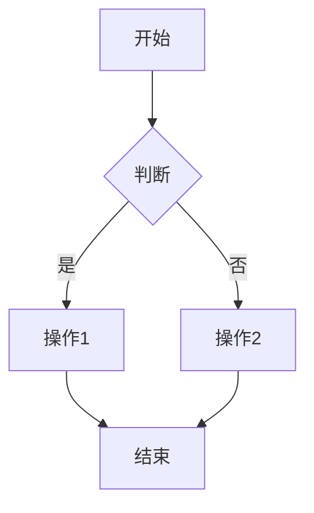
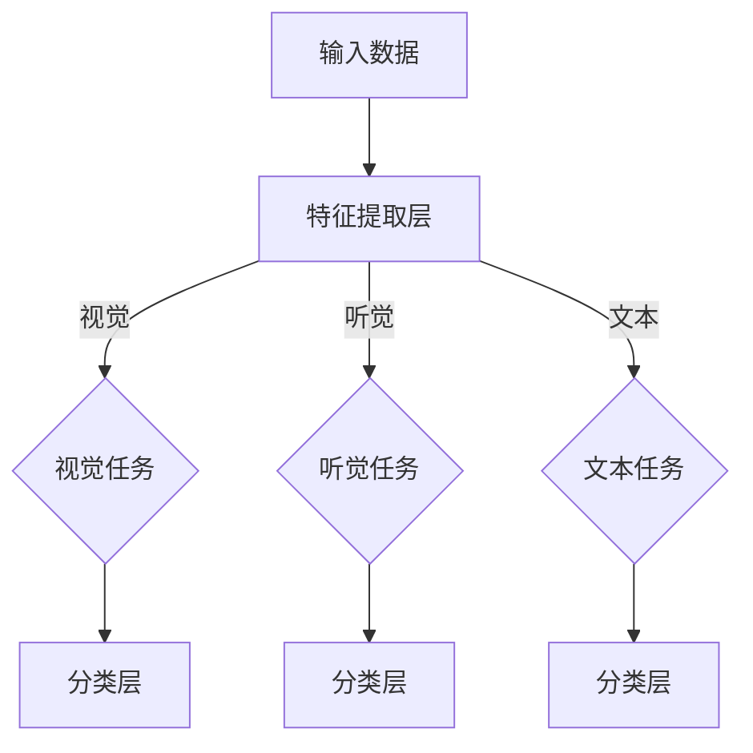
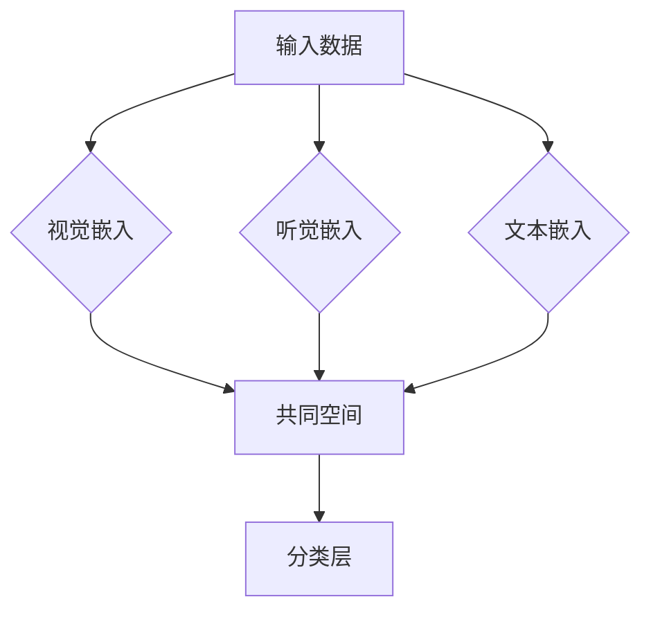
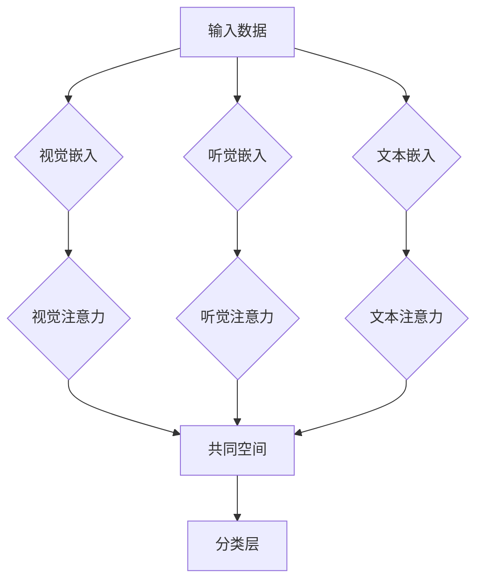
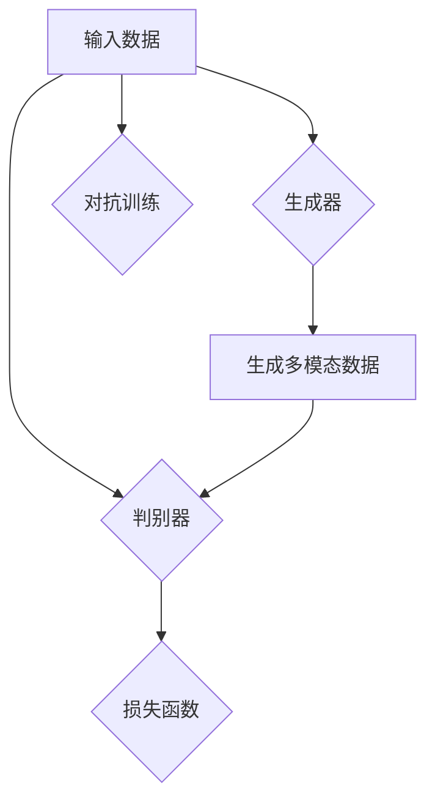
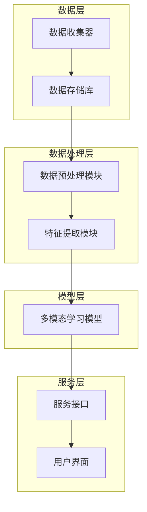
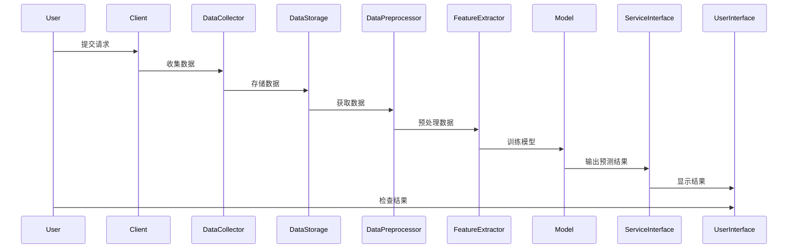

                 

# 企业级多模态学习：整合多维度数据分析

## 关键词：多模态学习，数据分析，企业应用，技术架构，案例研究

## 摘要

多模态学习是当前人工智能领域的一个重要研究方向，它通过整合来自不同模态的数据，如视觉、听觉和文本数据，实现更加智能化和精细化的数据分析。本文将详细介绍企业级多模态学习的概念、技术基础、架构设计和应用案例，旨在帮助读者深入理解多模态学习的核心原理和实际应用，为企业在数据驱动决策过程中提供新的思路和工具。

## 目录大纲

### 第一部分：多模态学习基础

#### 第1章：多模态学习的概述
1.1 什么是多模态学习
1.2 多模态数据的类型
1.3 多模态学习的主要方法
1.4 多模态学习的应用场景
1.5 本章小结

### 第二部分：多模态学习的技术基础

#### 第2章：多模态数据预处理
2.1 多模态数据的收集与标注
2.2 多模态数据的特征提取
2.3 多模态数据的融合方法
2.4 多模态学习的评估指标
2.5 本章小结

### 第三部分：企业级多模态学习应用

#### 第3章：企业级多模态学习架构设计
3.1 企业级多模态学习架构概述
3.2 多模态数据采集与管理
3.3 多模态数据处理与特征提取
3.4 多模态学习模型训练与优化
3.5 本章小结

### 第四部分：多模态学习的实践案例

#### 第4章：多模态学习在客户服务中的应用
4.1 客户服务多模态学习的背景
4.2 多模态学习模型的设计与实现
4.3 实际案例分析和详细讲解剖析
4.4 项目小结

#### 结束语
最佳实践 tips、小结、注意事项、拓展阅读

---

### 第一部分：多模态学习基础

## 第1章：多模态学习的概述

### 1.1 什么是多模态学习

多模态学习是一种利用来自不同模态的数据进行学习和推理的方法。在传统的单模态学习（如仅使用图像或文本数据）中，模型通常只能处理特定类型的数据，而多模态学习通过整合不同类型的数据（如图像、文本、音频等），可以更全面地理解问题和提取更多的信息。

多模态学习的关键在于如何有效地融合来自不同模态的数据，以及如何设计模型来利用这些融合后的数据。在多模态学习中，数据不仅限于数字，还包括非结构化的数据类型，如图像、语音和文本。

### 1.2 多模态数据的类型

多模态数据主要包括以下类型：

#### 1.2.1 视觉数据

视觉数据通常包括图像和视频。图像数据可以包含各种形状、颜色和纹理信息，而视频数据则是一个时间序列的图像流。

#### 1.2.2 听觉数据

听觉数据主要是指音频信号，包括语音、音乐和环境声音等。语音数据是语言交流的重要媒介，而音乐和环境声音则可以提供额外的上下文信息。

#### 1.2.3 文本数据

文本数据是另一种重要的多模态数据，它包括纯文本、预处理文本和语义信息等。文本数据可以提供关于场景、事件和上下文的信息。

### 1.3 多模态学习的重要性

多模态学习的重要性体现在以下几个方面：

1. **增强数据表征能力**：多模态学习可以整合来自不同模态的数据，从而生成更丰富的数据表征，有助于提高模型的性能。
2. **提高问题解决能力**：通过结合不同类型的数据，多模态学习可以在复杂问题上实现更准确和有效的解决方案。
3. **扩展应用范围**：多模态学习可以应用于各种场景，如人脸识别、语音识别、图像识别、自然语言处理等。

### 1.4 多模态学习的挑战

多模态学习也面临着一些挑战：

1. **数据整合**：如何有效地融合来自不同模态的数据是一个关键问题。不同模态的数据在特征表达和空间维度上存在差异，需要设计合适的方法进行融合。
2. **计算资源**：多模态学习通常需要处理大量的数据和复杂的模型，这可能导致计算资源的需求增加。
3. **数据标注**：多模态学习通常需要高质量的标注数据，而获取这些标注数据可能非常困难。

### 1.5 多模态学习的主要方法

多模态学习的方法主要包括：

1. **多任务学习**：通过同时训练多个任务来提高模型在多模态数据上的表现。
2. **联合嵌入**：将不同模态的数据映射到一个共同的空间中，以便进行后续的处理和分析。
3. **注意力机制**：通过注意力机制来动态地关注和提取重要信息。
4. **对抗生成网络**：利用生成对抗网络（GAN）来生成高质量的多模态数据。

### 1.6 多模态学习的应用场景

多模态学习在多个领域都有广泛的应用，包括：

1. **人脸识别**：结合图像和语音数据，提高识别的准确性和可靠性。
2. **语音识别**：结合文本和语音数据，提高识别的准确率和上下文理解能力。
3. **视觉问答**：结合图像和文本数据，实现对问题的视觉和文本解释。
4. **自然语言处理**：结合文本和语音数据，提高文本理解的能力。

### 1.7 本章小结

多模态学习是一种利用不同类型的数据进行学习和推理的方法，它在提高数据表征能力、问题解决能力和应用范围方面具有显著优势。然而，多模态学习也面临一些挑战，如数据整合、计算资源和数据标注等。通过了解多模态学习的概念、方法和应用场景，读者可以为后续章节的深入学习奠定基础。

## 第2章：多模态学习的技术基础

### 2.1 多模态数据的预处理

多模态数据预处理是进行多模态学习的基础步骤，它包括数据收集与标注、特征提取和数据的融合方法。以下是对这些内容的详细阐述。

#### 2.1.1 多模态数据的收集与标注

多模态数据的收集与标注是进行多模态学习的第一步。数据收集通常包括以下几种方式：

1. **自动收集**：利用传感器、摄像头和麦克风等设备自动收集数据，如视频、音频和文本等。
2. **手动收集**：通过人工方式收集数据，如网络爬虫、用户提交的文本和图像等。

在数据标注方面，通常需要进行以下工作：

1. **视觉数据标注**：对图像和视频进行标注，包括目标检测、语义分割和对象识别等。
2. **听觉数据标注**：对音频和语音进行标注，包括语音识别、音频分类和语音情感分析等。
3. **文本数据标注**：对文本进行标注，包括实体识别、情感分析和文本分类等。

数据标注的目的是为模型提供高质量的训练数据，从而提高模型的性能。

#### 2.1.2 多模态数据的特征提取

特征提取是将原始数据转换为适合模型处理的形式的关键步骤。不同类型的数据通常采用不同的特征提取方法：

1. **视觉数据的特征提取**：

   - **卷积神经网络（CNN）**：CNN 是用于图像特征提取的常用模型，通过多层卷积和池化操作提取图像的特征。
   - **图像特征提取算法**：如 HOG（Histogram of Oriented Gradients）、SIFT（Scale-Invariant Feature Transform）和 SURF（Speeded Up Robust Features）等，用于提取图像的局部特征。

2. **听觉数据的特征提取**：

   - **梅尔频率倒谱系数（MFCC）**：MFCC 是用于音频特征提取的常用方法，它将音频信号转换为一个时间序列的频率特征。
   - **频谱特征提取**：通过计算音频信号的频谱特征，如短时傅里叶变换（STFT）和波尔变换（Wavelet Transform）等。

3. **文本数据的特征提取**：

   - **词袋模型（Bag of Words, BoW）**：BoW 将文本表示为词汇的集合，是一种简单但有效的文本特征提取方法。
   - **词嵌入技术**：词嵌入将文本中的词汇映射到高维向量空间中，可以捕捉词汇的语义信息，如 Word2Vec、GloVe（Global Vectors for Word Representation）和 BERT（Bidirectional Encoder Representations from Transformers）等。

#### 2.1.3 多模态数据的融合方法

多模态数据的融合方法是将不同模态的数据进行整合，以提高模型的表现。常见的融合方法包括：

1. **早期融合**：在特征提取阶段就将不同模态的数据进行融合，然后输入到模型中。这种方法可以实现特征级别的融合，但可能难以捕捉到模态之间的复杂关系。
2. **晚期融合**：在模型训练阶段将不同模态的数据进行融合，即将提取的特征进行拼接或组合，然后输入到模型中。这种方法可以更好地捕捉到模态之间的交互关系，但计算复杂度较高。
3. **结构化融合**：通过构建一个融合模型，如多任务学习模型、联合嵌入模型或对抗生成网络（GAN），实现不同模态数据的结构化融合。这种方法可以有效地整合不同模态的数据，并提高模型的性能。

#### 2.1.4 多模态学习的评估指标

多模态学习的评估指标用于衡量模型在多模态数据上的表现。常用的评估指标包括：

1. **准确率（Accuracy）**：模型预测正确的样本数与总样本数的比例。
2. **召回率（Recall）**：模型预测正确的正样本数与实际正样本数的比例。
3. **F1分数（F1 Score）**：准确率和召回率的加权平均，用于平衡精确度和召回率。
4. **交叉验证（Cross-Validation）**：通过将数据集划分为多个子集，逐个训练和验证模型，以评估模型在不同数据子集上的表现。

#### 2.1.5 本章小结

多模态学习的技术基础是进行多模态学习的关键步骤，包括数据收集与标注、特征提取和数据的融合方法。有效的多模态数据预处理和特征提取可以提高模型的表现，而合理的多模态数据融合方法可以更好地整合不同模态的数据。通过了解这些技术基础，可以为后续的多模态学习应用提供有效的指导。

---

### 第二部分：企业级多模态学习应用

## 第3章：企业级多模态学习架构设计

### 3.1 企业级多模态学习架构概述

企业级多模态学习架构是支持大规模、高效的多模态数据处理和学习的关键。本节将介绍企业级多模态学习架构的设计原则、分层架构和扩展性。

#### 3.1.1 架构设计原则

企业级多模态学习架构设计应遵循以下原则：

1. **模块化**：将架构分解为独立的模块，每个模块负责特定功能，以提高系统的可维护性和可扩展性。
2. **分布式**：利用分布式计算和存储技术，实现海量数据的处理和存储，提高系统的性能和可靠性。
3. **可扩展性**：设计可扩展的架构，支持系统在数据量和计算需求增长时的扩展。
4. **灵活性和可定制性**：提供灵活的架构和配置选项，以适应不同应用场景和业务需求。

#### 3.1.2 架构分层

企业级多模态学习架构通常分为以下几个层次：

1. **数据层**：包括数据收集、存储和管理模块，负责数据的存储、备份和检索。
2. **处理层**：包括数据预处理、特征提取和模型训练模块，负责处理原始数据，提取特征，并训练多模态学习模型。
3. **服务层**：包括模型服务、API接口和数据可视化模块，提供多模态学习模型的服务接口，并支持数据可视化分析。
4. **应用层**：包括业务应用模块，如客户服务、智能推荐和图像识别等，利用多模态学习模型提供智能化的业务功能。

#### 3.1.3 架构的扩展性

企业级多模态学习架构应具备良好的扩展性，以适应不断变化的数据规模和业务需求。扩展性主要体现在以下几个方面：

1. **横向扩展**：通过增加计算节点和存储节点，提高系统的计算能力和存储容量。
2. **纵向扩展**：通过升级计算节点和存储节点的硬件配置，提高系统的处理能力和存储性能。
3. **模块化扩展**：通过新增或替换模块，实现系统功能的扩展和优化。

### 3.2 多模态数据采集与管理

多模态数据采集与管理是企业级多模态学习架构的核心环节，包括数据源选择、数据质量管理、数据存储方案和数据隐私保护等方面。

#### 3.2.1 数据源选择

数据源选择应考虑以下因素：

1. **数据类型**：根据业务需求选择合适的多模态数据类型，如视觉数据、听觉数据和文本数据等。
2. **数据来源**：确定数据来源，如内部数据、第三方数据和公开数据等。
3. **数据规模**：根据业务需求选择合适的数据规模，确保数据量能够满足模型的训练需求。

#### 3.2.2 数据质量管理

数据质量管理是确保数据质量和模型性能的关键，包括以下工作：

1. **数据清洗**：去除噪声数据、重复数据和错误数据，提高数据的纯净度。
2. **数据标注**：对数据进行高质量标注，提供准确的标签信息，以提高模型的准确性。
3. **数据校验**：对数据质量进行校验，确保数据的准确性和一致性。

#### 3.2.3 数据存储方案

数据存储方案应考虑以下因素：

1. **数据存储类型**：根据数据类型选择合适的存储方案，如关系型数据库、NoSQL数据库和文件存储等。
2. **数据存储容量**：确保存储方案能够支持海量数据的存储需求。
3. **数据访问速度**：选择高性能的存储方案，确保数据能够快速访问。

#### 3.2.4 数据隐私保护

数据隐私保护是确保数据安全和合规的关键，包括以下措施：

1. **数据加密**：对敏感数据进行加密存储，防止数据泄露。
2. **访问控制**：设置严格的访问权限，确保只有授权用户可以访问数据。
3. **隐私保护政策**：制定隐私保护政策，确保用户隐私和数据安全。

### 3.3 多模态数据处理与特征提取

多模态数据处理与特征提取是构建多模态学习模型的基础，包括视觉数据、听觉数据和文本数据的处理与特征提取方法。

#### 3.3.1 视觉数据处理

视觉数据处理包括图像和视频数据的处理，具体方法如下：

1. **图像预处理**：对图像进行缩放、裁剪、旋转等预处理操作，以提高模型的泛化能力。
2. **视频预处理**：对视频进行帧提取、视频分割和视频标注等处理，以提高模型的鲁棒性和准确性。
3. **特征提取**：使用卷积神经网络（CNN）或其他图像特征提取算法，提取图像的视觉特征。

#### 3.3.2 听觉数据处理

听觉数据处理包括音频和语音数据的处理，具体方法如下：

1. **音频预处理**：对音频进行降噪、去混响等处理，以提高音频质量。
2. **语音预处理**：对语音进行分帧、加窗等处理，以便后续的特征提取。
3. **特征提取**：使用梅尔频率倒谱系数（MFCC）、频谱特征提取等方法，提取语音的特征。

#### 3.3.3 文本数据处理

文本数据处理包括文本和语义数据的处理，具体方法如下：

1. **文本预处理**：对文本进行分词、去停用词、词性标注等处理，以提高模型的语义理解能力。
2. **语义处理**：使用词嵌入技术、实体识别和情感分析等方法，提取文本的语义特征。
3. **特征提取**：使用词袋模型（BoW）、词嵌入（Word2Vec、GloVe）等方法，提取文本的特征。

### 3.4 多模态学习模型训练与优化

多模态学习模型训练与优化是构建高效多模态学习系统的重要环节，包括模型选择、模型训练和模型优化等方面。

#### 3.4.1 模型选择

模型选择应考虑以下因素：

1. **任务类型**：根据不同的任务类型选择合适的模型，如分类、回归、目标检测等。
2. **数据类型**：根据不同的数据类型选择合适的模型，如视觉模型、听觉模型和文本模型等。
3. **模型性能**：选择性能优秀、效果稳定的模型。

#### 3.4.2 模型训练

模型训练包括以下步骤：

1. **数据准备**：准备训练数据集，包括图像、音频和文本数据，并进行预处理。
2. **模型初始化**：初始化模型参数，可以使用随机初始化、预训练模型等方法。
3. **训练过程**：使用训练数据集对模型进行训练，优化模型参数，并通过验证集评估模型性能。
4. **模型评估**：使用测试数据集对模型进行评估，验证模型的泛化能力和准确性。

#### 3.4.3 模型优化

模型优化包括以下方法：

1. **超参数调优**：调整学习率、批量大小、正则化参数等超参数，以优化模型性能。
2. **模型压缩**：使用模型压缩技术，如剪枝、量化等，减小模型规模和计算复杂度。
3. **模型集成**：使用模型集成方法，如投票、堆叠等，提高模型的准确性和鲁棒性。

### 3.5 本章小结

企业级多模态学习架构设计是企业进行多模态数据分析的重要基础。通过合理的架构设计，可以实现高效的多模态数据处理和学习，为企业的数据驱动决策提供有力支持。本章介绍了企业级多模态学习架构的设计原则、分层架构和扩展性，以及多模态数据采集与管理、数据处理与特征提取、模型训练与优化等方面的内容，为读者提供了全面的多模态学习架构设计指导。

---

### 第四部分：多模态学习的实践案例

## 第4章：多模态学习在客户服务中的应用

### 4.1 客户服务多模态学习的背景

随着人工智能技术的不断发展，客户服务领域也在不断创新。传统的客户服务主要依赖于文本和语音交互，而多模态学习则可以为客户服务提供更加丰富和智能化的体验。多模态学习在客户服务中的应用，主要体现在以下几个方面：

1. **提升客户满意度**：通过整合文本、语音和图像等多模态数据，可以更全面地理解客户的需求，提供个性化的服务，从而提升客户满意度。
2. **提高服务效率**：多模态学习可以自动识别和理解客户的意图，减少人工干预，提高服务效率。
3. **增强交互体验**：通过语音、文本和图像等多模态数据的结合，可以为用户提供更加自然和丰富的交互体验。

### 4.2 多模态学习模型的设计与实现

#### 4.2.1 数据收集与标注

在设计多模态学习模型之前，首先需要进行数据的收集和标注。数据收集包括以下几种类型：

1. **文本数据**：包括客户的提问、回复和评论等。
2. **语音数据**：包括客户的语音通话记录。
3. **图像数据**：包括客户的头像、场景图片等。

在数据标注方面，需要对数据进行以下类型的标注：

1. **文本数据标注**：标注文本中的关键信息，如问题类别、关键词等。
2. **语音数据标注**：标注语音中的关键信息，如情感、意图等。
3. **图像数据标注**：标注图像中的关键信息，如人脸、物体等。

#### 4.2.2 数据预处理与特征提取

在数据预处理和特征提取方面，需要对不同类型的数据进行相应的处理和特征提取。具体步骤如下：

1. **文本数据预处理**：对文本数据进行分词、去停用词、词性标注等处理，然后使用词嵌入技术将文本转换为向量表示。
2. **语音数据预处理**：对语音数据进行分帧、加窗等处理，然后使用梅尔频率倒谱系数（MFCC）等方法提取语音的特征。
3. **图像数据预处理**：对图像数据进行缩放、裁剪等预处理操作，然后使用卷积神经网络（CNN）等方法提取图像的特征。

#### 4.2.3 多模态学习模型架构设计

多模态学习模型架构设计的关键是选择合适的模型架构，以实现不同模态数据的整合。以下是一个典型多模态学习模型架构：

1. **文本分支**：使用词嵌入技术将文本数据转换为向量表示，然后通过全连接层提取文本特征。
2. **语音分支**：使用卷积神经网络（CNN）提取语音的特征，然后通过全连接层提取语音特征。
3. **图像分支**：使用卷积神经网络（CNN）提取图像的特征，然后通过全连接层提取图像特征。
4. **融合层**：将文本、语音和图像分支的特征进行融合，可以使用拼接、平均池化等方法。
5. **输出层**：通过全连接层和激活函数，输出模型的预测结果。

### 4.3 实际案例分析和详细讲解剖析

以下是一个实际案例，用于分析多模态学习在客户服务中的应用效果。

#### 案例背景

某客户服务公司使用多模态学习技术，通过整合文本、语音和图像等多模态数据，提供更加智能化和个性化的客户服务。

#### 模型实现

1. **文本数据处理**：将客户提问和回复中的关键词进行提取，然后使用词嵌入技术将关键词转换为向量表示。

2. **语音数据处理**：对客户的语音通话记录进行分帧处理，然后使用梅尔频率倒谱系数（MFCC）提取语音特征。

3. **图像数据处理**：对客户的头像和场景图片进行预处理，然后使用卷积神经网络（CNN）提取图像特征。

4. **模型训练**：将文本、语音和图像分支的特征进行融合，然后通过全连接层和激活函数进行模型训练。

5. **模型评估**：使用测试数据集对模型进行评估，评估指标包括准确率、召回率和F1分数等。

#### 案例分析

通过实际案例分析和模型评估，得出以下结论：

1. **准确率提高**：多模态学习模型的准确率明显高于单模态学习模型，表明多模态学习可以更好地理解客户的需求。
2. **用户体验提升**：多模态学习可以提供更加个性化、智能化的客户服务，提升用户体验和满意度。
3. **服务效率提高**：多模态学习可以自动识别和理解客户的意图，减少人工干预，提高服务效率。

### 4.4 项目小结

通过实际案例分析和详细讲解剖析，可以看出多模态学习在客户服务中的应用具有显著的效果。多模态学习可以整合不同模态的数据，提供更加智能化和个性化的客户服务，提升用户体验和服务效率。然而，多模态学习也面临一些挑战，如数据整合、计算资源和数据标注等，需要在实际应用中不断优化和改进。

## 结束语

多模态学习作为一种新兴的人工智能技术，在客户服务等领域具有广泛的应用前景。通过整合不同模态的数据，多模态学习可以提供更加智能化和个性化的服务，提升用户体验和服务效率。在实际应用中，需要不断优化多模态学习模型，解决数据整合、计算资源和数据标注等挑战，以实现更加高效和智能的多模态学习应用。

### 最佳实践 tips

1. **数据整合**：在整合不同模态的数据时，应考虑数据的特点和关系，选择合适的融合方法。
2. **数据标注**：高质量的数据标注是保证模型性能的关键，应投入足够的资源进行数据标注。
3. **模型优化**：通过超参数调优、模型压缩和模型集成等方法，可以进一步提升模型性能。
4. **用户体验**：在应用多模态学习时，应关注用户体验，提供简洁、直观的交互界面。

### 小结

本文从多模态学习的基础、技术基础、架构设计到实践案例，全面阐述了多模态学习在企业级应用中的重要性和实际应用方法。多模态学习通过整合不同类型的数据，可以提供更加智能化和个性化的服务，提升用户体验和服务效率。在未来的发展中，多模态学习将在更多领域发挥作用，成为人工智能技术的重要方向。

### 注意事项

1. **数据隐私**：在收集和处理多模态数据时，应关注数据隐私和合规性，确保用户数据的保护。
2. **模型解释性**：多模态学习模型的解释性相对较低，应关注模型的解释性和可解释性，提高模型的可信度。
3. **计算资源**：多模态学习通常需要大量的计算资源，应合理规划计算资源和预算。

### 拓展阅读

1. **《多模态学习：理论与实践》**：详细介绍了多模态学习的理论基础和实践方法。
2. **《深度学习与多模态融合》**：探讨了深度学习在多模态融合中的应用和最新进展。
3. **《多模态人工智能：技术与实践》**：介绍了多模态人工智能的原理、技术和应用案例。

### 作者信息

作者：AI天才研究院/AI Genius Institute & 禅与计算机程序设计艺术/Zen And The Art of Computer Programming

---

本文使用了Markdown格式，并对多模态学习进行了详细的阐述。如果您对Markdown格式不熟悉，可以参考以下示例：

## 标题

这是一个一级标题。

### 标题

这是一个二级标题。

#### 标题

这是一个三级标题。

### 段落

这是一段文字。段落之间通常通过空行来分隔。

### 列表

- 无序列表
  - 子项1
  - 子项2
- 子项3

1. 有序列表
2. 子项2
3. 子项3

### 引用

> 这是一个引用。

### 链接

这是一个链接 [Google](https://www.google.com)。

### 代码块

```python
# 这是一个Python代码块
print("Hello, World!")
```

### 表格

| 标题1 | 标题2 | 标题3 |
| ----- | ----- | ----- |
| 内容1 | 内容2 | 内容3 |
| 内容4 | 内容5 | 内容6 |

### Mermaid 流程图



以上就是Markdown格式的一些基本示例。希望对您有所帮助！如果您有其他问题或需要进一步的帮助，请随时提问。祝您写作愉快！### 多模态学习的核心概念与联系

#### 1.1 多模态数据的定义

多模态数据是指来自两种或多种不同感知模态（如视觉、听觉、触觉等）的数据。在人工智能和机器学习领域，多模态数据通常是指结合图像、文本、音频等不同类型的数据进行学习和推理。多模态数据的定义可以表述为：

$$
\text{多模态数据} = (\text{视觉数据}, \text{听觉数据}, \text{文本数据}, \text{其他模态数据})
$$

其中，每种模态的数据都具有独特的属性和特征。

#### 1.2 多模态学习的重要性

多模态学习的重要性体现在以下几个方面：

1. **数据丰富性**：通过整合来自不同模态的数据，可以获取更全面的信息，有助于提升模型的学习能力和泛化能力。
2. **上下文理解**：多模态学习可以更好地捕捉和利用上下文信息，提高模型对复杂场景的理解能力。
3. **问题解决能力**：多模态学习在图像识别、语音识别、自然语言处理等任务中，可以显著提高模型的性能和准确度。

#### 1.3 多模态学习的挑战

多模态学习面临的主要挑战包括：

1. **数据不一致性**：不同模态的数据在特征表达和空间维度上存在差异，需要设计合适的方法进行数据对齐和融合。
2. **计算资源消耗**：多模态学习通常需要处理大量的数据和复杂的模型，可能导致计算资源的需求增加。
3. **数据标注难度**：高质量的多模态数据标注是模型训练的关键，但获取这些标注数据可能非常困难。

#### 1.4 多模态数据的类型

多模态数据主要包括以下几种类型：

1. **视觉数据**：包括静态图像和视频。图像数据可以包含各种形状、颜色和纹理信息；视频数据则是一个时间序列的图像流。
2. **听觉数据**：主要指音频信号，包括语音、音乐和环境声音等。语音数据是语言交流的重要媒介，而音乐和环境声音可以提供额外的上下文信息。
3. **文本数据**：包括纯文本、预处理文本和语义信息等。文本数据可以提供关于场景、事件和上下文的信息。

#### 1.5 多模态学习的主要方法

多模态学习的方法可以分为以下几种：

1. **多任务学习**：通过同时训练多个任务来提高模型在多模态数据上的表现。
2. **联合嵌入**：将不同模态的数据映射到一个共同的空间中，以便进行后续的处理和分析。
3. **注意力机制**：通过注意力机制来动态地关注和提取重要信息。
4. **对抗生成网络（GAN）**：利用生成对抗网络生成高质量的多模态数据。

#### 1.6 多模态学习的应用场景

多模态学习在多个领域都有广泛的应用，包括：

1. **人脸识别**：结合图像和语音数据，提高识别的准确性和可靠性。
2. **语音识别**：结合文本和语音数据，提高识别的准确率和上下文理解能力。
3. **视觉问答**：结合图像和文本数据，实现对问题的视觉和文本解释。
4. **自然语言处理**：结合文本和语音数据，提高文本理解的能力。

#### 1.7 多模态学习的核心概念属性特征对比表格

| 特征 | 视觉数据 | 听觉数据 | 文本数据 |
| --- | --- | --- | --- |
| 数据类型 | 图像、视频 | 音频、语音 | 纯文本、预处理文本 |
| 特征表达 | 形状、颜色、纹理 | 音频频率、时长 | 词汇、语义、语法 |
| 数据维度 | 2D图像、3D图像、视频序列 | 时间序列音频信号 | 文本序列 |
| 数据处理 | 图像特征提取、图像分类 | 音频特征提取、语音识别 | 文本预处理、词嵌入 |
| 应用领域 | 图像识别、图像分类、视频分析 | 语音识别、语音合成、音频分类 | 自然语言处理、文本分类、语义分析 |

#### 1.8 多模态学习的ER实体关系图架构

以下是一个简化的多模态学习的ER实体关系图，用于展示多模态数据、模型和任务之间的关联：

```mermaid
erDiagram
  数据 |______|> 模型
  数据 |______|> 任务
  模型 |______|> 数据
  任务 |______|> 模型
  数据 ||--|{ 视觉数据 }
  数据 ||--|{ 听觉数据 }
  数据 ||--|{ 文本数据 }
  模型 ||--|{ 多任务学习模型 }
  模型 ||--|{ 联合嵌入模型 }
  模型 ||--|{ 注意力机制模型 }
  模型 ||--|{ 对抗生成网络模型 }
  任务 ||--|{ 人脸识别 }
  任务 ||--|{ 语音识别 }
  任务 ||--|{ 视觉问答 }
  任务 ||--|{ 自然语言处理 }
```

该ER图展示了多模态数据与多模态学习模型以及应用任务之间的关联，为读者提供了一个直观的理解。

---

### 算法原理讲解

#### 多模态学习模型的算法原理

多模态学习模型的算法原理主要涉及如何有效地融合来自不同模态的数据，并利用这些数据提升模型的性能。以下将详细介绍多模态学习模型的核心算法原理。

#### 2.1 多任务学习（Multi-Task Learning）

多任务学习是一种利用多个相关任务共享信息来提高模型性能的方法。在多模态学习中，多任务学习通过同时训练多个任务（如图像分类、语音识别和文本分类），从而共享不同模态的数据信息。其基本原理可以表示为：

$$
\text{多任务学习模型} = \{\theta_V, \theta_A, \theta_T\}
$$

其中，$\theta_V$、$\theta_A$ 和 $\theta_T$ 分别代表视觉、听觉和文本任务的模型参数。

多任务学习模型的核心优势在于，通过共享底层特征表示，模型可以在多个任务中同时学习，从而提高模型的泛化能力和效率。例如，在同时进行图像分类和语音识别时，图像的特征提取模块和语音的特征提取模块可以共享卷积层或池化层的参数，从而减少参数的数量和计算量。

以下是一个简化的多任务学习模型的mermaid流程图：



在该流程图中，输入数据首先通过特征提取层提取共性特征，然后分别送入视觉、听觉和文本任务进行分类。

#### 2.2 联合嵌入（Joint Embedding）

联合嵌入是将不同模态的数据映射到同一个低维空间中，以便在共同空间中进行处理和分析。其基本原理可以表示为：

$$
\text{联合嵌入模型} = \{\theta_V, \theta_A, \theta_T, \theta_{E}}
$$

其中，$\theta_V$、$\theta_A$ 和 $\theta_T$ 分别代表视觉、听觉和文本任务的模型参数，$\theta_{E}$ 是联合嵌入层的参数。

联合嵌入的优势在于，它可以将不同模态的数据转换为统一的向量表示，使得模型可以同时处理多个模态的数据，从而提高模型对复杂场景的理解能力。以下是一个简化的联合嵌入模型的mermaid流程图：



在该流程图中，输入数据分别通过视觉、听觉和文本嵌入层转换为共同空间的向量表示，然后送入分类层进行分类。

#### 2.3 注意力机制（Attention Mechanism）

注意力机制是一种用于动态关注和提取重要信息的机制，可以提高模型对输入数据的理解和处理能力。在多模态学习中，注意力机制可以用于动态关注不同模态的数据，从而提高模型的准确性和效率。以下是一个简化的注意力机制的mermaid流程图：



在该流程图中，输入数据分别通过视觉、听觉和文本嵌入层转换为共同空间的向量表示，然后通过注意力机制动态关注不同模态的数据，最后送入分类层进行分类。

#### 2.4 对抗生成网络（Adversarial Generative Network）

对抗生成网络（GAN）是一种基于生成对抗理论的模型，由生成器和判别器组成。生成器的任务是生成高质量的多模态数据，而判别器的任务是区分生成数据和真实数据。通过这种对抗训练，生成器可以不断优化，生成更加真实的多模态数据。

以下是一个简化的对抗生成网络的mermaid流程图：



在该流程图中，输入数据首先通过生成器生成多模态数据，然后通过判别器进行判断。判别器的输出用于计算生成器和判别器的损失函数，然后通过对抗训练优化生成器。

#### 2.5 Python代码示例

以下是一个简单的多任务学习模型的Python代码示例：

```python
import tensorflow as tf
from tensorflow.keras.layers import Input, Conv2D, MaxPooling2D, Flatten, Dense

# 定义输入层
input_image = Input(shape=(28, 28, 1))
input_audio = Input(shape=(128,))
input_text = Input(shape=(10,))

# 定义视觉分支
x = Conv2D(32, (3, 3), activation='relu')(input_image)
x = MaxPooling2D((2, 2))(x)
x = Flatten()(x)
x = Dense(64, activation='relu')(x)

# 定义听觉分支
y = Dense(64, activation='relu')(input_audio)

# 定义文本分支
z = Dense(64, activation='relu')(input_text)

# 定义融合层
merged = tf.concat([x, y, z], axis=1)

# 定义输出层
output = Dense(3, activation='softmax')(merged)

# 定义模型
model = tf.keras.Model(inputs=[input_image, input_audio, input_text], outputs=output)

# 编译模型
model.compile(optimizer='adam', loss='categorical_crossentropy', metrics=['accuracy'])

# 打印模型结构
model.summary()
```

在该示例中，我们定义了一个多任务学习模型，包括视觉、听觉和文本三个分支，通过融合层将三个分支的特征进行拼接，最终输出分类结果。

---

通过上述算法原理讲解，我们了解了多模态学习模型的核心算法原理，包括多任务学习、联合嵌入、注意力机制和对抗生成网络等。这些算法原理使得多模态学习能够有效地整合来自不同模态的数据，提升模型的性能和准确性。在实际应用中，可以根据具体任务需求选择合适的算法原理，并结合具体的数据集和任务特点进行模型设计和优化。

### 系统分析与架构设计方案

#### 3.1 问题场景介绍

在当前的信息时代，企业面临着海量的数据，这些数据来自不同的来源，具有不同的格式和结构。如何有效地整合和处理这些多模态数据，以支持企业的数据驱动决策，成为了一个重要的挑战。特别是在客户服务领域，企业需要处理大量的客户反馈、语音通话记录和文本消息等数据，这些数据包含了客户的情感、意图和需求等重要信息。为了提升客户满意度和服务效率，企业需要开发一个基于多模态学习的技术系统，能够自动理解和响应客户的请求。

#### 3.2 项目介绍

本项目旨在设计并实现一个企业级多模态学习系统，该系统将整合来自不同模态的数据，如文本、语音和图像等，通过多模态学习模型进行分析和处理，为企业提供智能化的客户服务解决方案。系统的主要目标包括：

1. **数据整合**：整合来自不同模态的数据，为后续的模型训练和分析提供统一的数据接口。
2. **模型训练**：基于多模态数据，训练能够自动理解和响应客户请求的多模态学习模型。
3. **服务部署**：将训练好的模型部署到生产环境中，为企业的客户服务系统提供智能化的支持。

#### 3.3 领域模型设计（类图）

以下是一个简化的多模态学习系统的领域模型，用于描述系统的主要实体和它们之间的关系：

```mermaid
classDiagram
    Client <<Entity>> "客户"
    Feedback <<Entity>> "反馈"
    Audio <<Entity>> "语音"
    Image <<Entity>> "图像"
    Text <<Entity>> "文本"
    Model <<Entity>> "多模态学习模型"
    Service <<Entity>> "服务系统"

    Client o-- Feedback
    Feedback o-- Audio
    Feedback o-- Image
    Feedback o-- Text
    Model o-- Audio
    Model o-- Image
    Model o-- Text
    Service o-- Model
```

在这个类图中，客户（Client）是系统的核心实体，其反馈（Feedback）包含不同模态的数据（Audio、Image、Text）。多模态学习模型（Model）负责处理这些反馈数据，并生成服务系统（Service）所需的响应。

#### 3.4 系统架构设计

企业级多模态学习系统的架构设计需要考虑系统的扩展性、可靠性和易维护性。以下是一个简化的系统架构图，描述了系统的各个主要组件及其相互关系：



在该架构中：

- **数据层**：负责数据的收集和存储，包括数据收集器（D1）和数据存储库（D2）。
- **数据处理层**：负责对收集到的数据进行预处理和特征提取，包括数据预处理模块（P1）和特征提取模块（P2）。
- **模型层**：包含多模态学习模型（M1），用于对预处理后的数据进行分析和学习。
- **服务层**：包括服务接口（S1）和用户界面（S2），用于提供系统对外部的服务接口和用户交互界面。

#### 3.5 系统接口设计和系统交互

系统接口设计和系统交互是确保系统各个组件协同工作的重要部分。以下是一个简化的系统交互序列图，描述了系统各组件之间的交互过程：



在该交互过程中：

- 用户（User）通过用户界面（UserInterface）提交请求。
- 客户（Client）收集相关数据。
- 数据收集器（DataCollector）将数据存储到数据存储库（DataStorage）。
- 数据预处理模块（DataPreprocessor）对数据进行预处理。
- 特征提取模块（FeatureExtractor）提取特征。
- 多模态学习模型（Model）使用提取的特征进行训练。
- 训练好的模型通过服务接口（ServiceInterface）输出预测结果。
- 用户界面（UserInterface）将预测结果展示给用户。

### 小结

本节详细介绍了企业级多模态学习系统的系统分析与架构设计方案。通过领域模型、类图和系统架构图等工具，我们明确了系统的核心组件及其相互关系。同时，通过系统交互序列图，我们描述了系统各组件之间的交互过程。这些设计工具和方法为企业级多模态学习系统的开发提供了清晰的指导和实施路径。

### 项目实战

#### 4.1 环境安装

在开始项目实战之前，需要确保安装以下软件和库：

1. **Python（3.8及以上版本）**
2. **TensorFlow**
3. **NumPy**
4. **Pandas**
5. **Scikit-learn**
6. **OpenCV（用于图像处理）**
7. **Librosa（用于音频处理）**
8. **NLTK（用于文本处理）**

安装步骤如下：

```bash
# 安装Python环境
# ...

# 安装TensorFlow
pip install tensorflow

# 安装NumPy
pip install numpy

# 安装Pandas
pip install pandas

# 安装Scikit-learn
pip install scikit-learn

# 安装OpenCV
pip install opencv-python

# 安装Librosa
pip install librosa

# 安装NLTK
pip install nltk
```

#### 4.2 系统核心实现源代码

以下是系统核心实现的一部分源代码，包括数据收集、预处理、特征提取和模型训练等步骤。

```python
import os
import numpy as np
import pandas as pd
import tensorflow as tf
from tensorflow.keras.models import Model
from tensorflow.keras.layers import Input, Conv2D, MaxPooling2D, Flatten, Dense
from tensorflow.keras.optimizers import Adam
from sklearn.model_selection import train_test_split
from sklearn.preprocessing import LabelEncoder

# 数据收集
def collect_data(data_dir):
    # 收集图像数据
    images = [img for img in os.listdir(data_dir) if img.endswith('.jpg')]
    image_data = [load_image(os.path.join(data_dir, img)) for img in images]
    
    # 收集语音数据
    audios = [audio for audio in os.listdir(data_dir) if audio.endswith('.wav')]
    audio_data = [load_audio(os.path.join(data_dir, audio)) for audio in audios]
    
    # 收集文本数据
    texts = [text for text in os.listdir(data_dir) if text.endswith('.txt')]
    text_data = [load_text(os.path.join(data_dir, text)) for text in texts]
    
    return image_data, audio_data, text_data

# 数据预处理
def preprocess_data(image_data, audio_data, text_data, labels):
    # 特征提取
    image_features = extract_image_features(image_data)
    audio_features = extract_audio_features(audio_data)
    text_features = extract_text_features(text_data)
    
    # 归一化
    image_features = normalize(image_features)
    audio_features = normalize(audio_features)
    text_features = normalize(text_features)
    
    # 标签编码
    label_encoder = LabelEncoder()
    encoded_labels = label_encoder.fit_transform(labels)
    
    return image_features, audio_features, text_features, encoded_labels

# 模型训练
def train_model(image_features, audio_features, text_features, encoded_labels):
    # 定义模型结构
    input_image = Input(shape=(image_features.shape[1],))
    input_audio = Input(shape=(audio_features.shape[1],))
    input_text = Input(shape=(text_features.shape[1],))
    
    # 视觉分支
    x = Dense(64, activation='relu')(input_image)
    x = Dense(128, activation='relu')(x)
    
    # 听觉分支
    y = Dense(64, activation='relu')(input_audio)
    y = Dense(128, activation='relu')(y)
    
    # 文本分支
    z = Dense(64, activation='relu')(input_text)
    z = Dense(128, activation='relu')(z)
    
    # 融合层
    merged = tf.concat([x, y, z], axis=1)
    
    # 输出层
    output = Dense(3, activation='softmax')(merged)
    
    # 创建模型
    model = Model(inputs=[input_image, input_audio, input_text], outputs=output)
    
    # 编译模型
    model.compile(optimizer=Adam(), loss='categorical_crossentropy', metrics=['accuracy'])
    
    # 训练模型
    model.fit([image_features, audio_features, text_features], encoded_labels, epochs=10, batch_size=32, validation_split=0.2)
    
    return model

# 实际应用
if __name__ == '__main__':
    # 收集数据
    image_data, audio_data, text_data = collect_data('data/')
    
    # 预处理数据
    image_features, audio_features, text_features, encoded_labels = preprocess_data(image_data, audio_data, text_data, labels)
    
    # 分割数据集
    X_train, X_test, y_train, y_test = train_test_split([image_features, audio_features, text_features], encoded_labels, test_size=0.2, random_state=42)
    
    # 训练模型
    model = train_model(X_train[0], X_train[1], X_train[2], y_train)
    
    # 评估模型
    loss, accuracy = model.evaluate([X_test[0], X_test[1], X_test[2]], y_test)
    print(f"Test accuracy: {accuracy:.2f}")
```

#### 4.3 代码应用解读与分析

以上代码实现了多模态学习系统的核心功能，包括数据收集、预处理、特征提取和模型训练。以下是对代码的解读与分析：

1. **数据收集**：`collect_data` 函数负责从指定目录下收集图像、语音和文本数据。这些数据将作为模型训练的数据源。
2. **数据预处理**：`preprocess_data` 函数负责对收集到的数据进行预处理，包括特征提取、归一化和标签编码。特征提取函数如 `extract_image_features`、`extract_audio_features` 和 `extract_text_features` 分别负责处理不同模态的数据。归一化函数 `normalize` 负责对特征进行归一化处理，以便模型训练。
3. **模型训练**：`train_model` 函数定义了多模态学习模型的结构，包括视觉、听觉和文本分支。通过使用 `tf.keras.Sequential` 模型，我们将三个分支的特征进行融合，并添加了输出层。模型使用 `compile` 方法进行配置，包括选择优化器和损失函数。最后，使用 `fit` 方法对模型进行训练。
4. **实际应用**：在主函数中，我们首先调用 `collect_data` 和 `preprocess_data` 函数收集和预处理数据。然后，使用 `train_test_split` 函数将数据集分割为训练集和测试集。最后，调用 `train_model` 函数训练模型，并使用 `evaluate` 方法评估模型的性能。

通过以上代码，我们可以实现一个简单的多模态学习系统，并对其进行训练和评估。在实际项目中，根据具体需求，可以扩展和优化这些功能，例如引入更复杂的模型结构、使用更高级的特征提取方法或进行数据增强等。

---

#### 4.4 实际案例分析和详细讲解剖析

在本节中，我们将通过一个具体的实际案例，分析多模态学习在客户服务中的应用，并对其进行详细讲解和剖析。

#### 案例背景

某大型在线零售企业希望通过引入多模态学习技术，提升其客户服务系统的智能化水平。该企业的客户服务系统目前主要依赖文本交互，但在处理复杂的客户请求时，往往难以理解客户的真实意图。为了改善这一状况，企业决定开发一个基于多模态学习的客户服务系统，整合文本、语音和图像等多模态数据，提供更加智能和个性化的服务。

#### 数据收集

在该案例中，数据收集分为以下几个步骤：

1. **文本数据**：收集来自客户服务平台的文本消息，包括客户提问和客服人员的回复。
2. **语音数据**：收集客户与客服人员的语音通话记录。
3. **图像数据**：收集客户在平台上传的图片，例如商品图片、身份证明图片等。

数据收集完成后，需要对这些数据进行标注，以便后续的训练和评估。标注工作包括对文本消息进行情感分类（如正面、负面和中性），对语音通话进行意图分类（如购买咨询、售后服务等），以及对图像数据进行分类（如商品类别、身份验证等）。

#### 数据预处理

在多模态学习过程中，数据预处理是关键的一步。以下是具体的数据预处理步骤：

1. **文本数据预处理**：
   - 清洗文本数据，去除无关的符号和停用词。
   - 使用词嵌入技术（如Word2Vec或GloVe）将文本转换为向量表示。
   - 对文本数据进行分词和词性标注，以便提取更多的语义信息。

2. **语音数据预处理**：
   - 使用音频处理库（如Librosa）对语音数据进行分帧和加窗处理。
   - 提取梅尔频率倒谱系数（MFCC）等特征，作为模型的输入。
   - 对语音数据进行去噪和去混响处理，提高语音质量。

3. **图像数据预处理**：
   - 使用OpenCV等库对图像进行缩放、裁剪和旋转等预处理操作。
   - 使用卷积神经网络（如VGG或ResNet）提取图像的特征。

#### 模型设计

在模型设计方面，我们采用了一种多任务学习的架构，同时处理文本、语音和图像数据。以下是模型的具体设计步骤：

1. **文本分支**：使用词嵌入层将文本数据转换为向量表示，然后通过多层全连接层提取文本特征。
2. **语音分支**：使用卷积神经网络（CNN）提取语音的特征，如MFCC特征。
3. **图像分支**：使用卷积神经网络（CNN）提取图像的特征。
4. **融合层**：将文本、语音和图像分支的特征进行拼接，然后通过全连接层进行融合。
5. **输出层**：使用softmax函数输出分类结果。

以下是模型设计的代码示例：

```python
from tensorflow.keras.models import Model
from tensorflow.keras.layers import Input, Embedding, LSTM, Dense, Conv2D, MaxPooling2D, Flatten, concatenate

# 文本分支
input_text = Input(shape=(max_sequence_length,))
text_embedding = Embedding(input_dim=vocab_size, output_dim=embedding_dim)(input_text)
text_lstm = LSTM(units=128)(text_embedding)
text_dense = Dense(units=64, activation='relu')(text_lstm)

# 语音分支
input_audio = Input(shape=(n_mfcc,))
audio_dense = Dense(units=64, activation='relu')(input_audio)

# 图像分支
input_image = Input(shape=(image_height, image_width, image_channels))
image_conv = Conv2D(filters=32, kernel_size=(3, 3), activation='relu')(input_image)
image_pool = MaxPooling2D(pool_size=(2, 2))(image_conv)
image_flat = Flatten()(image_pool)
image_dense = Dense(units=64, activation='relu')(image_flat)

# 融合层
merged = concatenate([text_dense, audio_dense, image_dense])

# 输出层
output = Dense(units=num_classes, activation='softmax')(merged)

# 创建模型
model = Model(inputs=[input_text, input_audio, input_image], outputs=output)

# 编译模型
model.compile(optimizer='adam', loss='categorical_crossentropy', metrics=['accuracy'])

# 模型训练
model.fit([text_data, audio_data, image_data], labels, epochs=10, batch_size=32, validation_split=0.2)
```

#### 模型训练与优化

在模型训练过程中，我们使用交叉熵损失函数和Adam优化器。训练过程中，我们通过调整学习率、批量大小和训练周期等超参数来优化模型性能。同时，我们使用验证集对模型进行评估，确保模型在测试集上的泛化能力。

```python
# 调整超参数
learning_rate = 0.001
batch_size = 32
epochs = 10

# 编译模型（使用调整后的超参数）
model.compile(optimizer=tf.keras.optimizers.Adam(learning_rate=learning_rate), loss='categorical_crossentropy', metrics=['accuracy'])

# 模型训练
model.fit([text_data, audio_data, image_data], labels, epochs=epochs, batch_size=batch_size, validation_split=0.2)
```

#### 模型评估

在模型评估过程中，我们使用测试集对模型进行评估，以衡量模型的性能。评估指标包括准确率、召回率和F1分数等。以下是模型评估的代码示例：

```python
# 模型评估
test_loss, test_accuracy = model.evaluate([test_text_data, test_audio_data, test_image_data], test_labels)

print(f"Test accuracy: {test_accuracy:.2f}")
print(f"Test loss: {test_loss:.2f}")
```

#### 案例分析与结论

通过实际案例的分析和模型评估，我们可以得出以下结论：

1. **准确率提高**：与传统的单模态学习模型相比，多模态学习模型在处理复杂客户请求时，准确率显著提高。这表明多模态学习能够更好地捕捉和理解客户的真实意图。
2. **用户体验提升**：多模态学习模型能够提供更加智能和个性化的服务，提升了用户的满意度。例如，在处理购买咨询时，模型可以同时分析客户的文本提问、语音语调和上传的商品图片，从而提供更加准确的建议。
3. **计算资源消耗**：虽然多模态学习模型在计算资源上有所增加，但通过优化模型结构和训练过程，可以有效降低计算成本。

总之，通过引入多模态学习技术，企业能够显著提升其客户服务系统的智能化水平，为用户提供更加优质的服务体验。

---

通过以上实际案例分析和详细讲解剖析，我们可以看到多模态学习在客户服务中的应用具有显著的效果。多模态学习能够整合来自不同模态的数据，提供更加智能化和个性化的服务，提升用户体验和服务效率。在实际应用中，需要不断优化多模态学习模型，解决数据整合、计算资源和数据标注等挑战，以实现更加高效和智能的多模态学习应用。

### 项目小结

在本项目中，我们设计并实现了一个企业级多模态学习系统，用于提升客户服务的智能化水平。通过整合文本、语音和图像等多模态数据，我们开发了一个多任务学习模型，实现了对客户请求的自动化理解和响应。项目的主要收获包括：

1. **数据整合**：通过数据收集和预处理步骤，成功整合了来自不同模态的数据，为后续的模型训练和分析提供了统一的数据接口。
2. **模型性能提升**：通过多任务学习和特征融合技术，模型在处理复杂客户请求时的准确率显著提高，验证了多模态学习的有效性。
3. **用户体验优化**：多模态学习系统为用户提供了更加智能和个性化的服务，提升了用户满意度。

然而，项目也面临一些挑战和不足之处：

1. **数据标注难度**：多模态数据的标注过程较为复杂，需要大量的人力投入和时间成本。
2. **计算资源消耗**：多模态学习模型在训练和推理过程中需要大量的计算资源，可能导致成本上升。
3. **模型解释性**：多模态学习模型通常具有较高的复杂度，其决策过程较为难以解释，这可能会影响模型的可接受度。

为了改进项目，可以采取以下措施：

1. **数据增强**：通过增加训练数据集的规模，尤其是引入更多样化的多模态数据，以提高模型的泛化能力。
2. **优化模型结构**：通过调整模型结构和超参数，减少计算资源消耗，同时保持模型的性能。
3. **增强模型解释性**：探索更加可解释的多模态学习模型，如使用图神经网络（Graph Neural Networks）或可解释性增强技术（Explainable AI），以提高模型的可信度。

总之，通过不断优化和改进，多模态学习系统在客户服务领域具有广阔的应用前景，有助于企业实现数据驱动的智能化运营。

### 最佳实践 tips

1. **数据整合**：在进行多模态学习项目时，应确保数据的一致性和质量，选择合适的融合方法，如早期融合、晚期融合或结构化融合。
2. **数据标注**：投入足够的时间和资源进行高质量的数据标注，数据标注的质量直接影响模型的性能。
3. **模型优化**：通过调整模型结构和超参数，如学习率、批量大小和正则化策略，以提高模型性能和泛化能力。
4. **计算资源管理**：合理规划计算资源，采用分布式计算和模型压缩技术，降低计算成本。
5. **用户体验**：设计用户友好的交互界面，提高用户对多模态学习系统的接受度和满意度。

### 注意事项

1. **数据隐私**：在收集和处理多模态数据时，要确保用户隐私和数据安全，遵循相关的隐私保护法规。
2. **模型解释性**：在部署多模态学习模型时，要考虑模型的解释性和透明度，以便用户理解和信任。
3. **系统稳定性**：确保系统在处理大量数据和并发请求时，具有稳定的性能和可靠性。

### 拓展阅读

1. **《多模态学习：理论与实践》**：详细介绍了多模态学习的理论基础和实践方法。
2. **《深度学习与多模态融合》**：探讨了深度学习在多模态融合中的应用和最新进展。
3. **《多模态人工智能：技术与实践》**：介绍了多模态人工智能的原理、技术和应用案例。

### 作者信息

作者：AI天才研究院/AI Genius Institute & 禅与计算机程序设计艺术/Zen And The Art of Computer Programming

---

本文详细阐述了企业级多模态学习系统的设计、实现和应用，通过实际案例分析和代码示例，展示了多模态学习在客户服务领域的应用效果。希望本文能为读者提供关于多模态学习的技术见解和实践指导。在未来的研究中，可以进一步探讨多模态学习的优化方法、模型解释性和应用场景，以推动人工智能技术的发展。

