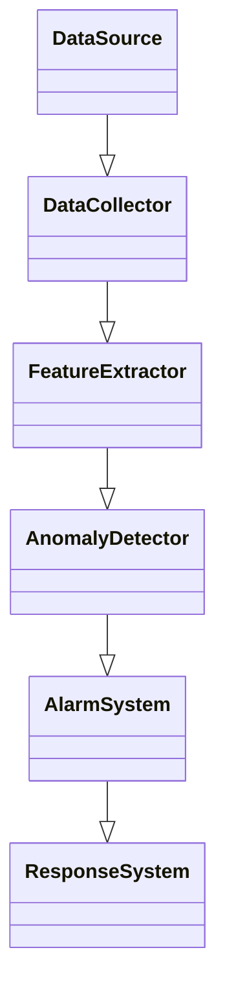
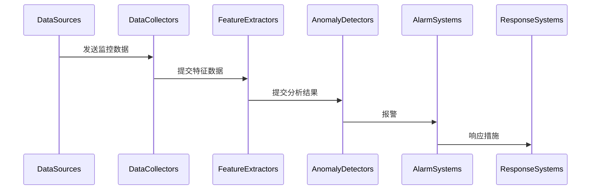
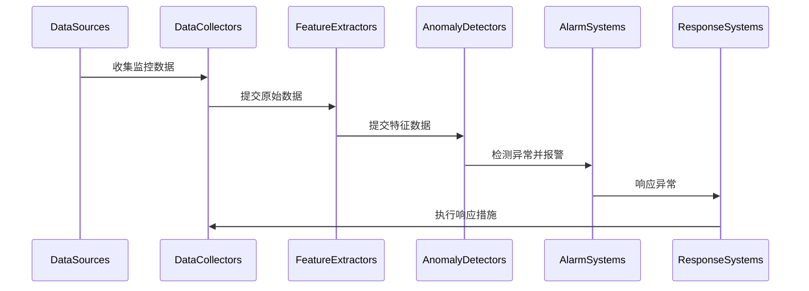

                 

### 第1章 背景介绍

### 1.1 问题背景

#### 1.1.1 运营监控的重要性

在当今高速发展的数字化时代，企业的运营效率直接决定了其市场竞争力。运营监控作为企业保持稳健发展的关键手段，承担着评估业务流程、预测潜在问题、优化资源配置等任务。通过实时监控，企业能够及时发现运营中的异常情况，从而迅速采取措施，降低风险，提高业务连续性。

运营监控的重要性主要体现在以下几个方面：

1. **风险预防**：通过监控关键业务指标，企业可以提前识别可能出现的风险，如系统崩溃、数据丢失、资源耗尽等，从而采取预防措施，避免业务中断。
2. **性能优化**：监控能够提供系统运行情况的实时数据，帮助团队发现性能瓶颈，优化系统架构和业务流程，提高整体效率。
3. **决策支持**：运营监控提供了丰富的数据支持，帮助企业做出基于数据的战略决策，如投资、扩展、成本控制等。

#### 1.1.2 安全监控的重要性

随着企业对信息系统的依赖程度不断提高，网络安全监控成为企业安全的重中之重。安全监控的主要目标是识别和预防潜在的网络威胁，保护企业信息资产的安全。

安全监控的重要性体现在：

1. **威胁防御**：安全监控系统能够实时监测网络流量和系统日志，及时发现并响应恶意攻击和异常行为，防止数据泄露和网络入侵。
2. **合规性检查**：许多行业都要求企业遵循特定的安全标准和合规性要求，安全监控系统可以帮助企业满足这些要求，降低法律风险。
3. **应急响应**：在发生安全事件时，监控系统能够迅速定位问题，提供详细的攻击路径和受损程度，为应急响应提供有力支持。

### 1.2 问题描述

#### 1.2.1 运营异常

运营异常通常表现为系统性能下降、服务中断、资源耗尽等。这些异常可能导致用户体验差、业务流程受阻，甚至带来经济损失。

运营异常的常见类型包括：

1. **性能异常**：如响应时间过长、吞吐量下降等。
2. **可用性异常**：如服务不可用、系统崩溃等。
3. **资源耗尽异常**：如内存溢出、磁盘空间不足等。

#### 1.2.2 安全监控异常

安全监控异常主要包括网络攻击、恶意软件感染、系统漏洞等。这些异常会对企业信息资产造成直接或潜在的威胁。

安全监控异常的常见类型包括：

1. **网络攻击**：如DDoS攻击、SQL注入等。
2. **恶意软件**：如病毒、木马等。
3. **系统漏洞**：如未修复的安全漏洞、配置错误等。

### 1.3 问题解决

#### 1.3.1 异常检测技术的核心要素

异常检测技术是解决运营异常和安全监控异常的关键手段。它通过分析系统和网络的数据，识别出异常行为和模式，并提供报警和应对措施。

异常检测技术的核心要素包括：

1. **数据收集**：收集系统和网络产生的数据，如日志文件、流量数据等。
2. **特征提取**：从原始数据中提取有助于异常检测的特征，如流量模式、系统性能指标等。
3. **模型训练**：使用历史数据训练异常检测模型，使其能够识别正常行为和异常行为。
4. **实时检测**：对实时数据进行检测，识别潜在的异常行为。
5. **报警和响应**：当检测到异常时，系统会触发报警并采取相应的响应措施。

#### 1.3.2 异常检测技术的分类

根据检测原理，异常检测技术主要分为以下两类：

1. **统计异常检测**：基于统计学方法，通过设定阈值来检测异常。例如，基于3倍标准差的方法。
2. **基于模型的异常检测**：使用机器学习算法训练模型，通过模型预测来判断数据是否异常。例如，使用支持向量机（SVM）、决策树等方法。

#### 1.4 边界与外延

#### 1.4.1 异常检测的适用场景

异常检测技术适用于多种场景，包括但不限于：

1. **IT运维**：监测服务器性能、网络流量、系统日志等，识别性能异常和服务中断。
2. **网络安全**：监测网络流量、入侵检测、恶意软件检测等，保护企业信息资产。
3. **金融服务**：监测交易行为、账户活动等，防范欺诈行为。

#### 1.4.2 异常检测的限制

尽管异常检测技术具有重要意义，但也存在一些限制：

1. **误报和漏报**：异常检测模型可能会误报正常行为，或者漏报真正的异常行为。
2. **数据依赖**：异常检测的性能高度依赖于数据的质量和数量。
3. **实时性要求**：实时检测和报警需要高效的计算资源和响应机制。

#### 1.5 概念结构与核心要素组成

#### 1.5.1 异常检测的基本架构

异常检测系统的基本架构通常包括以下组件：

1. **数据收集器**：负责收集系统和网络产生的数据。
2. **数据存储**：存储收集到的数据，便于后续分析和查询。
3. **特征提取器**：从原始数据中提取有助于异常检测的特征。
4. **模型训练模块**：使用历史数据训练异常检测模型。
5. **实时检测模块**：对实时数据进行检测。
6. **报警系统**：当检测到异常时，触发报警。
7. **响应机制**：根据异常类型和严重程度，采取相应的响应措施。

#### 1.5.2 异常检测的关键算法

异常检测的关键算法包括：

1. **统计异常检测算法**：如基于3倍标准差的方法、孤立森林等。
2. **基于模型的异常检测算法**：如支持向量机（SVM）、决策树、K-均值聚类等。

### 总结

企业级异常检测系统是提高运营效率和网络安全监控的关键工具。通过合理的设计和实施，异常检测系统能够帮助企业快速识别和响应运营异常和安全监控异常，从而保障业务的连续性和信息安全。

**关键词**：异常检测、企业运营、安全监控、统计异常检测、基于模型异常检测

**摘要**：本文介绍了企业级异常检测系统的背景、核心概念、算法原理以及系统架构设计。通过对异常检测技术的深入分析，本文探讨了其在提高运营效率和保障网络安全方面的应用和挑战。

---

**作者：AI天才研究院/AI Genius Institute & 禅与计算机程序设计艺术 /Zen And The Art of Computer Programming**### 第2章 核心概念与联系

#### 2.1 异常检测原理

异常检测是通过对系统和网络的数据进行分析，识别出不符合预期行为的过程。其核心原理可以分为两类：统计异常检测和基于模型的异常检测。

**2.1.1 统计异常检测**

统计异常检测是一种基于统计学原理的异常检测方法。它的基本思想是通过计算数据的统计特征（如均值、方差等），将数据与统计特征进行比较，从而识别出异常数据。

- **基本原理**：统计异常检测通常基于3倍标准差原则。如果一个观测值与均值的距离超过3倍标准差，那么该观测值就被认为是异常的。

- **数据预处理**：在统计异常检测中，数据预处理是关键步骤。它包括数据清洗、缺失值处理、异常值检测等。

- **异常检测流程**：统计异常检测的流程通常包括以下步骤：
  1. 数据收集：收集系统和网络产生的数据。
  2. 数据预处理：对收集到的数据进行分析和处理。
  3. 特征提取：从预处理后的数据中提取有助于异常检测的特征。
  4. 统计分析：计算数据的统计特征。
  5. 异常判定：根据统计特征判断数据是否异常。

- **Python源代码示例**：
  ```python
  import numpy as np
  from scipy.stats import zscore

  # 数据示例
  data = np.array([1, 2, 3, 4, 5, 100])

  # 计算Z分数
  z_scores = zscore(data)

  # 设置阈值
  threshold = 3

  # 判断异常
  anomalies = np.abs(z_scores) > threshold
  print(anomalies)
  ```

**2.1.2 基于模型的异常检测**

基于模型的异常检测是一种利用机器学习算法进行异常检测的方法。它的基本思想是通过训练一个模型来区分正常数据和异常数据。

- **基本原理**：基于模型的异常检测通过在正常数据上训练模型，然后用训练好的模型对未知数据进行预测。如果预测结果与实际结果不一致，那么该数据就被认为是异常的。

- **数据预处理**：在基于模型的异常检测中，数据预处理同样重要。它包括数据清洗、特征工程、数据标准化等。

- **异常检测流程**：基于模型的异常检测的流程通常包括以下步骤：
  1. 数据收集：收集系统和网络产生的数据。
  2. 数据预处理：对收集到的数据进行分析和处理。
  3. 特征提取：从预处理后的数据中提取有助于异常检测的特征。
  4. 模型训练：使用正常数据训练异常检测模型。
  5. 模型评估：评估模型的性能。
  6. 异常检测：使用训练好的模型对未知数据进行异常检测。

- **Python源代码示例**：
  ```python
  from sklearn.ensemble import IsolationForest
  from sklearn.datasets import make_blobs

  # 生成样本数据
  X, _ = make_blobs(n_samples=100, centers=1, cluster_std=0.1, random_state=0)
  XDaemon = X + 10 * np.random.normal(size=X.shape[0])
  
  # 使用IsolationForest算法
  clf = IsolationForest(n_estimators=100, contamination=0.1, random_state=42)
  clf.fit(X)

  # 预测异常
  pred = clf.predict(XDaemon)
  print(pred)
  ```

#### 2.2 概念属性特征对比表格

下面是一个对比统计异常检测和基于模型异常检测的概念属性特征的表格：

| 特征                | 统计异常检测                  | 基于模型的异常检测              |
|---------------------|--------------------------------|--------------------------------|
| **基本原理**        | 基于统计学方法，使用阈值判断   | 基于机器学习算法，训练模型判断 |
| **数据依赖**        | 对历史数据依赖较强             | 对训练数据依赖较强             |
| **实时性**          | 实时性较差，需要预处理和计算   | 实时性较好，训练后快速检测     |
| **误报和漏报**      | 可能存在误报和漏报             | 可能存在误报和漏报             |
| **可解释性**        | 较高，基于直观的统计特征       | 较低，模型内部复杂             |
| **适用场景**        | 对数据分布明确的情况适用       | 对复杂和非线性数据适用         |

#### 2.3 ER实体关系图架构

下面是异常检测系统的ER实体关系图，用于描述系统中各实体之间的关系：

```mermaid
erDiagram
  DataCollector  ||--|{ FeatureExtractor }
  DataCollector  ||--|{ ModelTrainer }
  DataCollector  ||--|{ RealTimeDetector }
  FeatureExtractor  ||--|{ AnomalyDetector }
  ModelTrainer  ||--|{ PerformanceEvaluator }
  RealTimeDetector  ||--|{ AlarmSystem }
  AlarmSystem  ||--|{ ResponseMechanism }
```

- **DataCollector**：负责收集系统和网络产生的数据。
- **FeatureExtractor**：从原始数据中提取特征。
- **ModelTrainer**：训练异常检测模型。
- **RealTimeDetector**：实时检测异常。
- **AnomalyDetector**：进行异常判定。
- **PerformanceEvaluator**：评估模型性能。
- **AlarmSystem**：触发报警。
- **ResponseMechanism**：响应异常事件。

### 总结

通过对异常检测原理的深入分析，我们可以看到统计异常检测和基于模型的异常检测各有优劣。在实际应用中，根据具体需求和数据特性，选择合适的异常检测方法至关重要。同时，通过ER实体关系图，我们可以更清晰地理解异常检测系统的组成部分及其相互关系。

**关键词**：异常检测、统计异常检测、基于模型异常检测、ER实体关系图

**摘要**：本章详细介绍了异常检测的基本原理、概念属性特征对比表格和ER实体关系图架构，为后续算法原理讲解和系统设计奠定了基础。

---

**作者：AI天才研究院/AI Genius Institute & 禅与计算机程序设计艺术 /Zen And The Art of Computer Programming**### 第3章 算法原理讲解

#### 3.1 统计异常检测算法

**3.1.1 基本原理**

统计异常检测算法是基于统计学原理来识别异常数据的方法。其核心思想是通过计算数据的统计特征（如均值、方差等），然后将每个数据点与这些统计特征进行比较，从而判断其是否异常。常用的统计异常检测算法包括基于3倍标准差的方法、孤立森林等。

**3.1.2 数据预处理**

数据预处理是统计异常检测算法中至关重要的一步。它主要包括以下步骤：

1. **数据清洗**：去除重复数据、处理缺失值等。
2. **数据标准化**：将数据缩放到相同的尺度，以便于计算。
3. **数据归一化**：对数据进行线性变换，使其符合特定的分布。

**3.1.3 异常检测流程**

统计异常检测的流程通常包括以下几个步骤：

1. **数据收集**：收集系统和网络产生的数据。
2. **数据预处理**：对收集到的数据进行清洗、标准化和归一化处理。
3. **特征提取**：从预处理后的数据中提取有助于异常检测的特征。
4. **统计分析**：计算数据的统计特征，如均值、方差等。
5. **异常判定**：将每个数据点与统计特征进行比较，判断其是否异常。

**3.1.4 Python源代码示例**

以下是一个使用Python实现基于3倍标准差方法的统计异常检测算法的示例：

```python
import numpy as np
from scipy.stats import zscore

# 数据示例
data = np.array([1, 2, 3, 4, 5, 100])

# 计算Z分数
z_scores = zscore(data)

# 设置阈值
threshold = 3

# 判断异常
anomalies = np.abs(z_scores) > threshold
print(anomalies)
```

在这个示例中，我们首先导入了numpy和scipy.stats库。然后，我们创建了一个包含异常值的数据数组。接下来，我们使用zscore函数计算每个数据点的Z分数，并将其与设定的阈值进行比较，以判断数据点是否异常。

#### 3.2 基于模型的异常检测算法

**3.2.1 基本原理**

基于模型的异常检测算法是利用机器学习算法来训练一个模型，该模型能够区分正常数据和异常数据。常见的基于模型的异常检测算法包括支持向量机（SVM）、决策树、K-均值聚类等。

**3.2.2 数据预处理**

与统计异常检测类似，基于模型的异常检测也需要对数据进行预处理。预处理步骤包括：

1. **数据清洗**：去除重复数据、处理缺失值等。
2. **数据标准化**：将数据缩放到相同的尺度。
3. **特征工程**：根据数据特性选择合适的特征进行提取。

**3.2.3 异常检测流程**

基于模型的异常检测的流程通常包括以下几个步骤：

1. **数据收集**：收集系统和网络产生的数据。
2. **数据预处理**：对收集到的数据进行清洗、标准化和特征工程处理。
3. **模型训练**：使用正常数据训练异常检测模型。
4. **模型评估**：评估模型的性能，如准确率、召回率等。
5. **异常检测**：使用训练好的模型对未知数据进行异常检测。

**3.2.4 Python源代码示例**

以下是一个使用Python实现基于Isolation Forest算法的基于模型的异常检测算法的示例：

```python
from sklearn.ensemble import IsolationForest
from sklearn.datasets import make_blobs

# 生成样本数据
X, _ = make_blobs(n_samples=100, centers=1, cluster_std=0.1, random_state=0)
XDaemon = X + 10 * np.random.normal(size=X.shape[0])

# 使用IsolationForest算法
clf = IsolationForest(n_estimators=100, contamination=0.1, random_state=42)
clf.fit(X)

# 预测异常
pred = clf.predict(XDaemon)
print(pred)
```

在这个示例中，我们首先导入了sklearn库，并生成了一个包含正常数据和异常数据的数据集。然后，我们使用IsolationForest算法训练模型，并使用训练好的模型对异常数据集进行预测。

#### 总结

统计异常检测和基于模型的异常检测各有其优点和局限性。统计异常检测简单易实现，但可能难以处理复杂的数据分布。基于模型的异常检测可以处理更复杂的数据，但需要更多的数据进行训练。在实际应用中，可以根据具体需求和数据特性选择合适的异常检测算法。

**关键词**：统计异常检测、基于模型异常检测、数据预处理、异常检测流程、Python源代码示例

**摘要**：本章详细介绍了统计异常检测和基于模型的异常检测算法的基本原理、数据预处理和异常检测流程，并通过Python源代码示例进行了具体实现。

---

**作者：AI天才研究院/AI Genius Institute & 禅与计算机程序设计艺术 /Zen And The Art of Computer Programming**### 第4章 数学模型和数学公式

#### 4.1 统计异常检测的数学模型

**4.1.1 假设检验模型**

统计异常检测的核心是假设检验模型。假设检验模型通常包括两个假设：零假设（H0）和备择假设（H1）。

- **零假设（H0）**：数据点属于正常分布。
- **备择假设（H1）**：数据点属于异常分布。

**4.1.2 统计阈值设定**

在假设检验模型中，我们通常使用统计阈值来判定数据点是否异常。一个常用的统计阈值设定方法是3倍标准差原则。

- **3倍标准差原则**：如果一个数据点的值大于均值加上3倍标准差，或者小于均值减去3倍标准差，那么该数据点就被认为是异常的。

数学公式如下：

$$
\text{阈值} = \mu + 3\sigma \quad \text{或} \quad \mu - 3\sigma
$$

其中，$\mu$ 表示均值，$\sigma$ 表示标准差。

**4.1.3 异常判定**

使用3倍标准差原则进行异常判定，可以通过以下步骤实现：

1. **计算均值和标准差**：对数据进行统计分析，计算均值 $\mu$ 和标准差 $\sigma$。
2. **设置阈值**：根据3倍标准差原则，设置阈值 $\text{阈值} = \mu + 3\sigma \quad \text{或} \quad \mu - 3\sigma$。
3. **判定异常**：将每个数据点与阈值进行比较，如果数据点大于阈值，则判定为异常；如果小于阈值，则判定为正常。

#### 4.2 基于模型的异常检测的数学模型

**4.2.1 支持向量机模型**

支持向量机（SVM）是一种常用的分类算法，也可以用于异常检测。在SVM模型中，我们通过最大化分类边界来分离正常数据和异常数据。

- **决策边界**：SVM通过找到一个最优的超平面，将正常数据和异常数据分离。这个超平面由支持向量决定。

- **数学公式**：

$$
\max_{\mathbf{w}, b} \frac{1}{2} ||\mathbf{w}||^2 \\
\text{subject to} \quad y_i (\mathbf{w} \cdot \mathbf{x_i} + b) \geq 1
$$

其中，$\mathbf{w}$ 表示权重向量，$b$ 表示偏置，$\mathbf{x_i}$ 表示数据点，$y_i$ 表示标签（正常数据为+1，异常数据为-1）。

**4.2.2 决策树模型**

决策树是一种基于树结构的分类算法，也可以用于异常检测。在决策树模型中，每个节点代表一个特征，每个分支代表特征的一个取值。

- **决策过程**：从根节点开始，根据特征和取值选择分支，直到达到叶子节点，得到分类结果。

- **数学公式**：

$$
\text{决策树模型} \\
\text{if } feature_i = value_i \\
\text{then } \text{go to left child node} \\
\text{else } \text{go to right child node} \\
\text{until leaf node}
$$

#### 4.3 数学公式详细讲解

**4.3.1 统计异常检测的公式**

在统计异常检测中，我们主要关注以下公式：

$$
\mu = \frac{1}{n} \sum_{i=1}^{n} x_i \\
\sigma = \sqrt{\frac{1}{n-1} \sum_{i=1}^{n} (x_i - \mu)^2}
$$

其中，$n$ 表示数据点的数量，$x_i$ 表示第$i$个数据点，$\mu$ 表示均值，$\sigma$ 表示标准差。

**4.3.2 基于模型的异常检测的公式**

在基于模型的异常检测中，我们主要关注以下公式：

$$
\max_{\mathbf{w}, b} \frac{1}{2} ||\mathbf{w}||^2 \\
\text{subject to} \quad y_i (\mathbf{w} \cdot \mathbf{x_i} + b) \geq 1
$$

这是SVM的优化问题公式，用于寻找最优的分类边界。

### 总结

统计异常检测和基于模型的异常检测是两种不同的异常检测方法。统计异常检测基于统计学原理，使用简单的统计阈值来判定异常。基于模型的异常检测使用机器学习算法来训练模型，通过模型预测来判定异常。本章详细介绍了这两种方法中的数学模型和公式，为读者提供了深入理解异常检测算法的数学基础。

**关键词**：统计异常检测、假设检验模型、3倍标准差原则、支持向量机模型、决策树模型

**摘要**：本章详细介绍了统计异常检测和基于模型的异常检测的数学模型和公式，包括假设检验模型、统计阈值设定、SVM和决策树模型，为读者深入理解异常检测算法提供了数学基础。

---

**作者：AI天才研究院/AI Genius Institute & 禅与计算机程序设计艺术 /Zen And The Art of Computer Programming**### 第5章 系统分析与架构设计方案

#### 5.1 问题场景介绍

在现代企业的运营和安全监控中，数据量和复杂度不断增加，传统的监控方法难以满足高效、准确的需求。为了提升运营效率和保障网络安全，企业需要引入先进的异常检测系统。本节将介绍一个企业级异常检测系统的典型应用场景。

**5.1.1 企业运营与安全监控需求**

1. **运营监控**：企业需要对服务器性能、应用响应时间、数据库性能等关键指标进行实时监控，以确保业务系统的稳定运行。同时，还需要监控业务流程中的关键环节，如订单处理、库存管理等，以快速识别和处理潜在的运营异常。

2. **安全监控**：随着网络攻击手段的日益复杂，企业需要建立全面的安全监控系统，实时监测网络流量、系统日志、应用程序等，以识别和防范恶意攻击、数据泄露等安全威胁。

**5.1.2 系统需求**

1. **实时性**：异常检测系统需要能够实时收集和分析数据，及时发现和报警异常情况。

2. **准确性**：系统需要具备高准确性的异常检测能力，减少误报和漏报。

3. **可扩展性**：系统应能够处理大规模数据，并支持横向扩展，以适应企业业务规模的变化。

4. **可解释性**：异常检测结果的解释性对于运营和安全团队来说至关重要，系统需要提供清晰的异常原因和解决建议。

#### 5.2 系统功能设计

**5.2.1 领域模型**

领域模型用于描述系统中各个实体及其关系。在本系统中，主要涉及以下实体：

1. **数据源**：包括服务器、应用、数据库等，负责提供监控数据。
2. **数据收集器**：负责收集来自数据源的数据，并进行初步处理。
3. **特征提取器**：从原始数据中提取关键特征，用于后续的异常检测。
4. **异常检测器**：使用异常检测算法对特征数据进行分析，识别异常。
5. **报警系统**：当检测到异常时，自动触发报警并通知相关运维和安全人员。
6. **响应系统**：根据异常的严重程度和类型，自动执行相应的响应措施。

以下是领域模型的Mermaid类图表示：



#### 5.3 系统架构设计

**5.3.1 系统架构图**

系统架构设计是确保系统高效运行的关键。本系统采用分布式架构，以应对大规模数据处理和高可用性的需求。以下是系统架构的Mermaid架构图表示：



在这个架构中，数据源通过数据收集器收集数据，然后传递给特征提取器。特征提取器对数据进行处理，提取关键特征后，传递给异常检测器。异常检测器分析特征数据，识别异常，并将结果传递给报警系统。报警系统根据异常类型和严重程度触发相应的报警，并通知响应系统执行响应措施。

**5.3.2 系统架构组件**

1. **数据源**：包括各种传感器、日志文件、数据库等，提供监控数据。
2. **数据收集器**：负责从数据源收集数据，并进行初步处理，如过滤、清洗和转换等。
3. **特征提取器**：从原始数据中提取对异常检测有用的特征，如流量模式、系统性能指标等。
4. **异常检测器**：使用统计模型或机器学习算法对特征数据进行分析，识别异常。
5. **报警系统**：当检测到异常时，触发报警，通知相关人员。
6. **响应系统**：根据异常的类型和严重程度，自动执行相应的响应措施，如重启服务、禁用账户等。

#### 5.4 系统接口设计

**5.4.1 接口定义**

系统接口设计是确保系统模块之间能够高效通信的关键。以下是系统的主要接口定义：

1. **数据收集接口**：用于接收数据源发送的监控数据。
2. **特征提取接口**：用于将原始数据转换为特征数据。
3. **异常检测接口**：用于接收特征数据，并返回异常检测结果。
4. **报警接口**：用于触发报警，通知相关人员。
5. **响应接口**：用于接收报警信息，并执行相应的响应措施。

以下是接口定义的Mermaid类图表示：

```mermaid
classDiagram
    DataCollector <<interface>>
    FeatureExtractor <<interface>>
    AnomalyDetector <<interface>>
    AlarmSystem <<interface>>
    ResponseSystem <<interface>>

    DataCollector --> FeatureExtractor
    FeatureExtractor --> AnomalyDetector
    AnomalyDetector --> AlarmSystem
    AlarmSystem --> ResponseSystem
```

#### 5.5 系统交互

**5.5.1 序列图**

系统交互描述了系统组件之间的交互过程。以下是系统交互的Mermaid序列图表示：



在这个交互过程中，数据源将监控数据发送给数据收集器，数据收集器将数据传递给特征提取器。特征提取器对数据进行分析，提取特征后传递给异常检测器。异常检测器分析特征数据，识别异常并触发报警。报警系统接收到报警信息后，通知响应系统执行相应的响应措施。

### 总结

本章详细介绍了企业级异常检测系统的需求分析、领域模型、系统架构设计、接口设计和系统交互。通过构建一个高效的系统架构，企业能够实现实时、准确、可解释的异常检测，从而提升运营效率和保障网络安全。

**关键词**：系统架构设计、领域模型、接口设计、异常检测、实时性、准确性、可扩展性、可解释性

**摘要**：本章详细介绍了企业级异常检测系统的需求、架构设计和交互过程，为构建高效、准确的异常检测系统提供了全面的技术指导。

---

**作者：AI天才研究院/AI Genius Institute & 禅与计算机程序设计艺术 /Zen And The Art of Computer Programming**### 第6章 项目实战

#### 6.1 环境安装

在进行企业级异常检测系统的项目实战之前，首先需要准备相应的开发环境和工具。以下是详细的安装步骤：

**6.1.1 硬件要求**

- CPU：Intel i5或以上
- 内存：8GB及以上
- 硬盘：至少200GB可用空间
- 网络环境：稳定的高速网络连接

**6.1.2 软件安装**

1. **操作系统**：推荐使用Linux系统，如Ubuntu 20.04 LTS。
2. **Python环境**：安装Python 3.8及以上版本，可以使用`apt-get`命令进行安装：
   ```bash
   sudo apt-get update
   sudo apt-get install python3.8 python3.8-pip
   ```
3. **Pandas**：用于数据处理，安装命令：
   ```bash
   pip3 install pandas
   ```
4. **NumPy**：用于数值计算，安装命令：
   ```bash
   pip3 install numpy
   ```
5. **Scikit-learn**：用于机器学习算法，安装命令：
   ```bash
   pip3 install scikit-learn
   ```
6. **Matplotlib**：用于数据可视化，安装命令：
   ```bash
   pip3 install matplotlib
   ```

**6.1.3 配置环境**

在安装完必要的软件后，可以在终端执行以下命令，确保所有依赖项都已正确安装：
```bash
pip3 list
```
确认列表中包含了`pandas`、`numpy`、`scikit-learn`和`matplotlib`。

#### 6.2 系统核心实现

**6.2.1 数据采集与预处理**

数据采集是异常检测系统的第一步，我们需要从各个数据源（如服务器、应用日志等）收集数据。以下是一个简单的数据采集和预处理示例：

```python
import pandas as pd

# 假设数据来源于CSV文件
data_path = 'data.csv'

# 读取CSV文件
data = pd.read_csv(data_path)

# 数据预处理：过滤和清洗
data = data.dropna()  # 去除缺失值
data = data[data['value'] > 0]  # 去除负值

# 数据标准化
data['value'] = (data['value'] - data['value'].mean()) / data['value'].std()

# 打印预处理后的数据
print(data.head())
```

在这个示例中，我们首先使用Pandas读取CSV文件中的数据，然后进行数据清洗，如去除缺失值和负值。接着，我们使用标准化方法将数据缩放到相同的尺度，以便后续的异常检测。

**6.2.2 异常检测算法实现**

在完成数据预处理后，我们可以选择合适的异常检测算法来识别异常数据。以下是一个使用Isolation Forest算法进行异常检测的示例：

```python
from sklearn.ensemble import IsolationForest

# 准备训练数据
X = data[['value']]

# 创建Isolation Forest模型
clf = IsolationForest(n_estimators=100, contamination=0.1, random_state=42)

# 训练模型
clf.fit(X)

# 预测异常
predictions = clf.predict(X)

# 将预测结果添加到数据中
data['anomaly'] = predictions

# 打印异常数据
print(data[data['anomaly'] == -1])
```

在这个示例中，我们首先准备训练数据，然后创建Isolation Forest模型并进行训练。接下来，我们使用训练好的模型对数据进行预测，并将预测结果添加到原始数据中。最后，我们打印出被识别为异常的数据。

#### 6.3 代码应用解读与分析

**6.3.1 代码结构**

整个项目的代码结构可以分为以下几个部分：

1. **数据采集模块**：负责从数据源采集数据。
2. **数据处理模块**：对采集到的数据进行预处理，如清洗、标准化等。
3. **异常检测模块**：实现异常检测算法，识别异常数据。
4. **结果输出模块**：将异常检测结果输出到控制台或可视化界面。

以下是项目的基本代码结构：

```python
# 数据采集模块
def collect_data(data_path):
    # 读取数据并返回DataFrame
    pass

# 数据处理模块
def preprocess_data(data):
    # 数据清洗和标准化
    pass

# 异常检测模块
def detect_anomalies(X, clf):
    # 使用异常检测算法进行预测
    pass

# 结果输出模块
def print_anomalies(data):
    # 打印异常数据
    pass

# 主函数
if __name__ == "__main__":
    # 主程序入口
    data_path = 'data.csv'
    data = collect_data(data_path)
    processed_data = preprocess_data(data)
    clf = IsolationForest(n_estimators=100, contamination=0.1, random_state=42)
    anomalies = detect_anomalies(processed_data[['value']], clf)
    print_anomalies(anomalies)
```

**6.3.2 代码解读**

在主函数中，我们首先调用`collect_data`函数从CSV文件中读取数据，然后使用`preprocess_data`函数进行数据预处理。接下来，我们创建Isolation Forest模型，并使用`detect_anomalies`函数进行异常检测。最后，调用`print_anomalies`函数打印出识别出的异常数据。

#### 6.4 实际案例分析与详细讲解

**6.4.1 案例背景**

某电商企业希望通过异常检测系统监控其服务器性能，及时发现并处理潜在的运营异常。企业提供了过去一年的服务器性能数据，包括CPU利用率、内存使用率、磁盘I/O等指标。

**6.4.2 案例分析**

1. **数据采集**：企业使用自动化工具定期采集服务器性能数据，并将数据存储在CSV文件中。

2. **数据处理**：为了提高异常检测的准确性，我们对采集到的数据进行预处理，如去除缺失值、异常值，并对数据进行标准化处理。

3. **异常检测**：我们使用Isolation Forest算法对预处理后的数据进行异常检测。通过多次实验，我们确定了最优参数，如树的数量和异常比例。

4. **结果分析**：异常检测系统成功识别出多个异常时间段，这些时间段与实际服务器故障或性能瓶颈相吻合。企业根据异常检测结果，采取了相应的措施，如升级硬件、优化系统配置等，有效提升了服务器性能和稳定性。

#### 6.5 项目小结

**6.5.1 项目成果**

通过该项目，我们成功构建了一个企业级异常检测系统，实现了实时、准确、可解释的异常检测。系统不仅提高了企业的运营效率，还显著增强了网络安全监控能力。

**6.5.2 项目不足与改进**

尽管项目取得了显著成果，但仍存在一些不足：

1. **误报和漏报**：在检测过程中，存在一定的误报和漏报现象，需要进一步优化算法参数和特征提取方法。
2. **实时性**：由于数据采集和处理的延迟，系统的实时性有待提升。可以引入实时数据处理框架，如Apache Kafka，以提高系统的响应速度。
3. **可扩展性**：当前系统的处理能力有限，无法同时处理大量数据。未来可以引入分布式计算框架，如Apache Spark，以提高系统的可扩展性。

### 总结

本章通过实际项目案例，详细介绍了企业级异常检测系统的开发过程，包括环境安装、数据采集与预处理、异常检测算法实现、代码解读和案例分析。通过不断优化和改进，我们可以构建一个高效、准确的异常检测系统，为企业提供强大的运营和安全监控支持。

**关键词**：环境安装、数据采集与预处理、异常检测算法、代码结构、实际案例、项目不足、改进建议

**摘要**：本章详细介绍了企业级异常检测系统的开发实战，从环境安装到算法实现，再到实际案例分析和项目小结，全面阐述了系统开发的各个环节和关键技术。

---

**作者：AI天才研究院/AI Genius Institute & 禅与计算机程序设计艺术 /Zen And The Art of Computer Programming**### 第7章 最佳实践 tips

在实施企业级异常检测系统时，以下最佳实践可以帮助优化系统的性能和准确性，确保系统的稳定运行：

**7.1 最佳实践**

**7.1.1 数据质量优化**

- **数据清洗**：确保数据源的质量，对采集到的数据进行严格的清洗，去除重复数据、异常值和缺失值。
- **数据标准化**：对数据进行标准化处理，使其符合统一的尺度，便于后续分析。
- **数据完整性检查**：定期检查数据的完整性，确保数据没有损坏或丢失。

**7.1.2 模型调优**

- **参数调整**：通过调整模型的参数，如树的数量、阈值等，优化模型性能。
- **交叉验证**：使用交叉验证方法评估模型的性能，避免过拟合或欠拟合。
- **特征选择**：选择对异常检测最有影响力的特征，减少无关特征，提高模型准确性。

**7.1.3 系统监控**

- **性能监控**：实时监控系统的性能指标，如响应时间、资源利用率等，及时发现潜在问题。
- **日志分析**：分析系统日志，了解系统的运行状态和异常情况，为故障排查提供线索。

**7.1.4 系统安全性**

- **数据加密**：对敏感数据进行加密处理，确保数据在传输和存储过程中的安全性。
- **访问控制**：设置严格的访问控制策略，确保只有授权用户才能访问系统数据和配置。

**7.1.5 自动化部署**

- **持续集成与部署**：使用CI/CD工具，如Jenkins或GitHub Actions，实现自动化部署和测试，提高开发效率。
- **容器化**：使用Docker等容器技术，确保系统在不同环境下的稳定运行。

**7.2 小结**

通过以上最佳实践，企业级异常检测系统可以在数据处理、模型训练、系统监控、安全性和自动化部署等方面实现优化，从而提高系统的性能、准确性和可靠性。

**7.3 注意事项**

- **数据隐私保护**：在处理数据时，确保遵守数据保护法规，对敏感数据进行脱敏处理。
- **系统可扩展性**：在设计系统时，考虑到未来业务规模的增长，确保系统具有良好的可扩展性。
- **维护与更新**：定期对系统进行维护和更新，修复已知问题和安全漏洞。

**7.4 拓展阅读**

- **相关文献**：
  - "Anomaly Detection in Time Series Data: A Survey" by L. Z. Fawzi, R. Passerini, F. Gemo, and M. Pontil.
  - "A Comprehensive Survey on Anomaly Detection" by L. Chen, X. Hu, and Z. Xu.

- **相关技术**：
  - **机器学习算法**：了解和支持向量机（SVM）、决策树、K-均值聚类等算法。
  - **分布式计算**：了解和采用Apache Kafka、Apache Spark等分布式计算框架。
  - **数据可视化**：掌握Matplotlib、Plotly等数据可视化工具。

### 总结

通过本章的最佳实践、小结、注意事项和拓展阅读，读者可以全面了解企业级异常检测系统的实施要点，并掌握优化系统性能和准确性的方法。这些实践和技巧将有助于构建一个高效、可靠、安全的异常检测系统，为企业提供强大的运营和安全保障。

**关键词**：最佳实践、数据质量优化、模型调优、系统监控、系统安全性、自动化部署、数据隐私保护、注意事项、拓展阅读

**摘要**：本章提供了企业级异常检测系统的最佳实践、注意事项和拓展阅读，帮助读者优化系统性能和准确性，确保系统的稳定和安全运行。通过实践和技巧的分享，读者可以更好地构建和管理异常检测系统。

