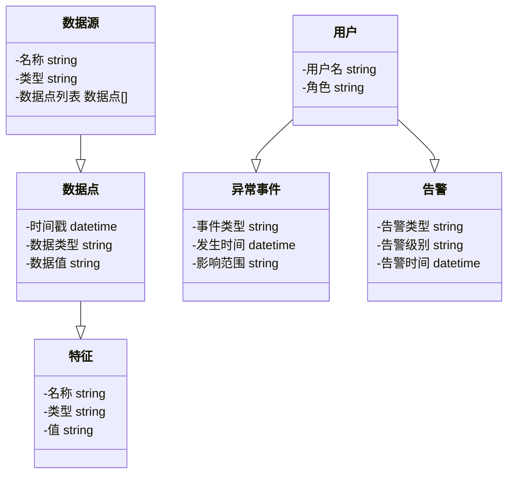
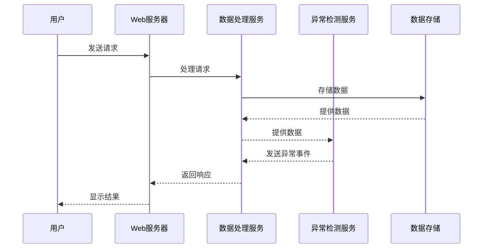
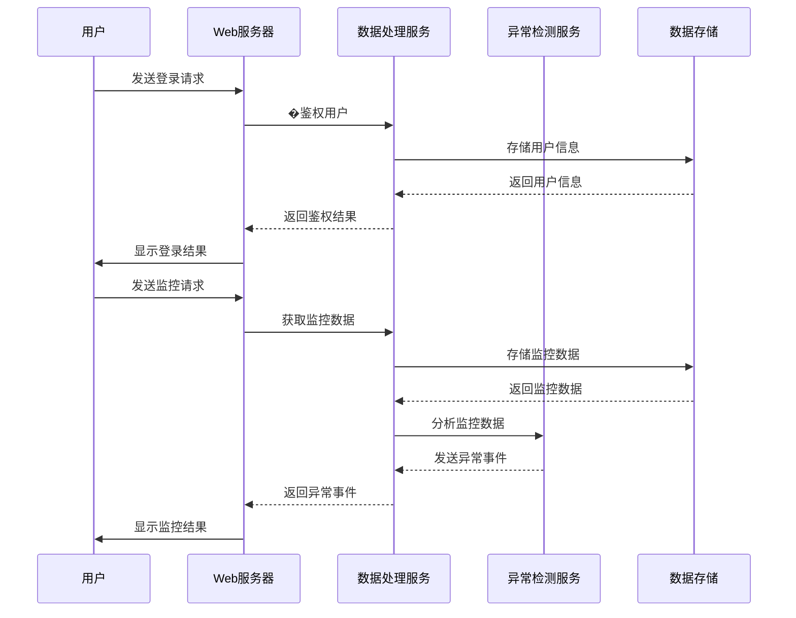
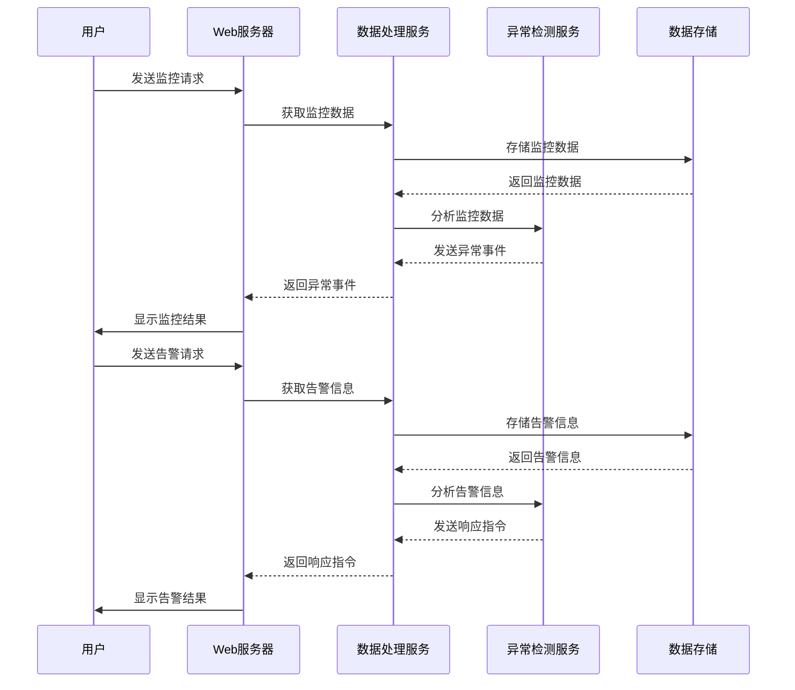

                 


### 第一部分：背景介绍

## 第1章 问题背景与概述

### 1.1 问题描述

#### 1.1.1 企业级异常行为检测的重要性

企业级异常行为检测是一种通过实时监控和分析企业内部网络、系统和用户行为，来识别潜在安全威胁和异常活动的技术。在现代企业中，随着网络攻击手段的日益复杂，传统的安全防护措施已经难以应对各种新兴的威胁。因此，企业级异常行为检测变得尤为重要。

首先，异常行为检测的定义与作用可以概括为以下几点：

1. **定义**：异常行为检测是一种基于数据分析和模式识别的技术，旨在发现并分析企业网络、系统和用户行为中的异常活动，从而识别潜在的安全威胁。

2. **作用**：异常行为检测可以帮助企业实现以下目标：
   - **提高安全防护能力**：通过实时监控和分析企业内部网络、系统和用户行为，及时发现并阻止潜在的安全威胁。
   - **减少安全事件的影响**：通过早期预警和及时响应，降低安全事件对企业运营和数据的破坏。
   - **优化资源分配**：通过识别正常行为和异常行为，企业可以更加合理地分配安全资源和人力。

#### 1.1.2 企业面临的安全威胁与挑战

随着网络技术的不断发展，企业面临的安全威胁和挑战日益增加。以下是一些常见的安全威胁和挑战：

1. **网络攻击**：包括分布式拒绝服务攻击（DDoS）、恶意软件感染、网络钓鱼等，这些攻击可能导致企业服务器瘫痪、数据泄露等严重后果。

2. **内部威胁**：员工滥用权限、内部间谍行为、恶意操作等，这些内部威胁可能对企业的信息安全构成严重威胁。

3. **数据泄露**：企业敏感数据的泄露可能导致商业秘密泄露、客户信息泄露等，给企业带来巨大的声誉损失和法律责任。

4. **合规风险**：随着各种信息安全法律法规的出台，企业需要确保其信息安全措施符合相关法规要求，否则将面临高额的罚款和法律诉讼。

#### 1.1.3 传统异常检测方法的局限性

传统的异常检测方法主要包括以下几种：

1. **基于规则的检测**：通过预先定义的一系列规则来识别异常行为。这种方法简单易用，但需要不断更新规则库，且难以应对复杂和未知的安全威胁。

2. **统计方法**：通过对历史数据的统计分析，建立正常的用户行为模型，然后检测与模型不符的行为。这种方法具有一定的效果，但模型的建立和维护较为复杂，且对异常行为的识别能力有限。

3. **基于签名的检测**：通过预先定义的恶意软件签名来识别已知的恶意行为。这种方法对已知的威胁有较好的识别效果，但对未知威胁的检测能力较弱。

传统异常检测方法的局限性主要体现在以下几个方面：

1. **误报率高**：传统的异常检测方法往往依赖于静态规则或统计模型，难以准确区分正常行为和异常行为，导致误报率高。

2. **无法应对未知威胁**：传统方法主要针对已知的威胁进行检测，对未知或新出现的威胁检测能力有限。

3. **响应速度慢**：传统的异常检测方法通常需要依赖人工分析和处理，响应速度较慢，无法满足实时检测的需求。

#### 1.1.4 AI技术在异常行为检测中的应用潜力

随着人工智能技术的不断发展，特别是机器学习和深度学习技术的成熟，AI技术在异常行为检测中的应用潜力得到了广泛认可。以下是一些AI技术在异常行为检测中的应用优势：

1. **数据驱动的智能分析**：AI技术可以通过对大量历史数据的学习和分析，自动识别和提取有效的特征，建立适应不同场景的检测模型。

2. **自适应性与自优化**：AI技术可以根据检测过程中收集到的反馈信息，自动调整和优化模型参数，提高检测的准确性和实时性。

3. **实时性与高效性**：AI技术可以通过并行计算和分布式处理等技术，实现实时数据处理和异常检测，满足企业对快速响应的需求。

4. **应对未知威胁**：AI技术可以根据不断学习到的知识，自适应地识别和应对未知或新出现的威胁。

5. **降低误报率**：通过综合多种数据源和特征，AI技术可以更准确地识别正常行为和异常行为，降低误报率。

### 1.2 问题解决

#### 1.2.1 AI在异常行为检测中的优势

AI技术在异常行为检测中的应用优势主要体现在以下几个方面：

1. **数据驱动的智能分析**：AI技术可以通过对大量历史数据的学习和分析，自动识别和提取有效的特征，建立适应不同场景的检测模型。

2. **自适应性与自优化**：AI技术可以根据检测过程中收集到的反馈信息，自动调整和优化模型参数，提高检测的准确性和实时性。

3. **实时性与高效性**：AI技术可以通过并行计算和分布式处理等技术，实现实时数据处理和异常检测，满足企业对快速响应的需求。

4. **应对未知威胁**：AI技术可以根据不断学习到的知识，自适应地识别和应对未知或新出现的威胁。

5. **降低误报率**：通过综合多种数据源和特征，AI技术可以更准确地识别正常行为和异常行为，降低误报率。

#### 1.2.2 AI技术在异常行为检测中的应用实例

1. **金融机构**：金融机构可以使用AI技术对交易行为进行实时监控，识别潜在的欺诈行为。例如，通过分析用户的交易历史和交易特征，AI模型可以自动识别异常交易，并及时发出警报。

2. **网络安全公司**：网络安全公司可以利用AI技术对网络流量进行实时分析，检测网络攻击和恶意行为。通过学习正常网络行为模型，AI模型可以自动识别异常流量，并及时采取措施阻止攻击。

3. **工业企业**：工业企业可以使用AI技术对生产设备进行监控，识别潜在的故障和异常情况。通过分析设备的运行数据和运行模式，AI模型可以自动识别异常情况，并及时通知维护人员。

4. **智能交通系统**：智能交通系统可以使用AI技术对交通流量进行实时监控，识别交通拥堵和事故。通过分析交通流量数据和交通行为特征，AI模型可以自动识别异常情况，并及时调整交通信号灯和路线规划。

#### 1.2.3 AI异常行为检测的发展趋势

1. **多模态数据融合**：未来的异常行为检测将结合多种数据源，如文本、图像、语音等，实现更全面和准确的异常行为识别。

2. **强化学习应用**：强化学习技术将在异常行为检测中得到更广泛的应用，通过不断学习用户的交互行为和环境变化，实现更智能的异常检测。

3. **联邦学习**：联邦学习技术将有助于解决数据隐私和保护问题，实现跨企业、跨区域的异常行为检测。

4. **智能响应和自动化**：未来的异常行为检测将更加注重自动化和智能化，通过自动化响应和智能决策，实现快速、准确的异常处理。

### 1.3 边界与外延

#### 1.3.1 异常行为检测的核心要素

异常行为检测的核心要素包括以下几个方面：

1. **数据收集与预处理**：收集并预处理企业内部网络、系统和用户行为数据，为后续的异常检测提供基础。

2. **特征提取与选择**：从原始数据中提取有效特征，并进行特征选择，以提高异常检测的准确性和效率。

3. **模型训练与评估**：使用机器学习和深度学习技术，训练异常检测模型，并对模型进行评估和优化。

4. **预测与响应**：利用训练好的模型进行实时预测，并对异常行为进行响应和处置。

#### 1.3.2 AI异常行为检测的边界

尽管AI技术在异常行为检测中具有显著优势，但仍然存在一些边界和挑战：

1. **需要考虑的数据类型与规模**：异常行为检测需要处理多种类型的数据，如结构化数据、非结构化数据和时序数据。同时，数据规模可能非常大，这对数据处理和存储提出了较高的要求。

2. **模型的可解释性与透明度**：深度学习模型通常具有很高的准确性，但模型内部的决策过程往往不够透明，这对模型的解释和信任提出了挑战。

3. **检测算法的性能与可扩展性**：异常行为检测算法需要具备高效的性能，以支持实时数据处理。同时，算法需要具备良好的可扩展性，以适应不断增长的数据规模和应用场景。

## 第2章 核心概念与联系

### 2.1 AI技术基础

#### 2.1.1 机器学习基础

机器学习是人工智能的核心技术之一，它使计算机系统能够从数据中学习并做出决策。以下是机器学习的一些基础概念：

1. **数据结构与算法**：机器学习算法需要处理不同类型的数据结构，如表格数据、图像数据、文本数据等。常见的机器学习算法包括线性回归、逻辑回归、支持向量机（SVM）等。

2. **模型选择与评估**：选择合适的机器学习模型对于算法的性能至关重要。常见的评估指标包括准确率、召回率、F1分数等。

3. **特征工程**：特征工程是机器学习过程中的一项重要任务，它包括特征提取、特征选择和特征标准化等步骤，以改善模型的性能。

#### 2.1.2 深度学习基础

深度学习是机器学习的一个分支，它通过多层神经网络模型对大量数据进行自动特征学习和模式识别。以下是深度学习的一些基础概念：

1. **神经网络结构与原理**：神经网络由多层神经元组成，通过前向传播和反向传播算法进行训练。常见的神经网络结构包括卷积神经网络（CNN）、循环神经网络（RNN）等。

2. **深度学习算法与优化方法**：深度学习算法包括多层感知机（MLP）、卷积神经网络（CNN）、循环神经网络（RNN）、长短期记忆网络（LSTM）等。优化方法包括梯度下降、随机梯度下降（SGD）、Adam优化器等。

3. **深度学习框架与工具**：深度学习框架如TensorFlow、PyTorch、Keras等提供了丰富的API和工具，帮助开发者构建和训练深度学习模型。

### 2.2 异常检测算法

异常检测算法是用于识别数据集中异常值或异常模式的方法。以下是几种常见的异常检测算法：

#### 2.2.1 异常检测算法概述

1. **聚类算法**：通过将数据分为不同的簇，识别出与大多数数据不同的簇。常见的聚类算法包括K-means、DBSCAN等。

2. **预测算法**：通过建立预测模型，识别与正常行为不符的预测结果。常见的预测算法包括逻辑回归、决策树等。

3. **统计方法**：通过统计学方法，如箱线图、四分位数等，识别出异常值或异常范围。

#### 2.2.2 常见异常检测算法

1. **K-means聚类算法**：
   - **原理**：K-means算法通过迭代过程将数据点划分为K个簇，每个簇的中心即为该簇的数据点的平均值。
   - **优缺点**：
     - **优点**：简单、易于实现，适合处理高维数据。
     - **缺点**：对初始聚类中心的敏感，可能陷入局部最优。

2. **DBSCAN算法**：
   - **原理**：DBSCAN（Density-Based Spatial Clustering of Applications with Noise）算法基于密度的聚类方法，能够自动确定簇的数量。
   - **优缺点**：
     - **优点**：对噪声和异常点的鲁棒性较高。
     - **缺点**：对高维数据效果较差，计算复杂度较高。

3. **逻辑回归**：
   - **原理**：逻辑回归是一种预测算法，通过建立二分类模型，识别异常行为。
   - **优缺点**：
     - **优点**：易于理解和实现，适用于二分类问题。
     - **缺点**：对非线性问题的处理能力有限。

4. **决策树**：
   - **原理**：决策树通过一系列规则对数据点进行划分，识别异常行为。
   - **优缺点**：
     - **优点**：易于解释，对非线性问题的处理能力较强。
     - **缺点**：可能产生过拟合，对大量特征的数据处理效率较低。

5. **箱线图和四分位数**：
   - **原理**：通过计算数据的四分位数，构建箱线图，识别异常值。
   - **优缺点**：
     - **优点**：简单、直观，适用于单变量异常检测。
     - **缺点**：对多变量异常检测能力有限。

### 2.3 AI异常行为检测模型

#### 2.3.1 模型概述

AI异常行为检测模型主要包括以下几种：

1. **深度学习模型**：如卷积神经网络（CNN）、循环神经网络（RNN）、长短期记忆网络（LSTM）等，通过多层神经网络结构实现自动特征学习和异常检测。

2. **强化学习模型**：如Q-Learning、SARSA等，通过不断学习用户行为和环境反馈，实现智能化的异常检测。

#### 2.3.2 模型对比与选择

不同AI异常行为检测模型在性能、可解释性、计算复杂度等方面存在差异，以下是对几种常见模型的分析：

1. **深度学习模型**：
   - **优点**：强大的特征提取和模式识别能力，适用于复杂场景。
   - **缺点**：模型参数多，训练过程复杂，对数据质量和计算资源要求较高。

2. **强化学习模型**：
   - **优点**：通过学习用户行为和环境反馈，实现自适应的异常检测。
   - **缺点**：训练过程较慢，需要大量的样本数据，且难以解释。

3. **传统机器学习模型**：
   - **优点**：模型参数较少，训练过程简单，易于解释。
   - **缺点**：对复杂场景的处理能力有限，性能可能较差。

选择合适的异常行为检测模型需要考虑以下因素：

- **数据类型**：根据数据类型选择适合的模型，如文本数据选择深度学习模型，时序数据选择RNN或LSTM等。
- **数据规模**：根据数据规模选择适合的模型，对于大规模数据，可能需要分布式计算和模型压缩技术。
- **计算资源**：根据计算资源选择适合的模型，深度学习模型可能需要更高的计算资源。
- **可解释性**：根据对模型可解释性的要求选择适合的模型，传统机器学习模型通常具有较好的可解释性。

## 第3章 算法原理讲解

### 3.1 数据收集与预处理

#### 3.1.1 数据收集方法

数据收集是异常行为检测的重要环节，以下是常见的数据收集方法：

1. **网络数据收集**：通过网络流量分析工具、入侵检测系统（IDS）等收集企业内部网络数据，如TCP/IP包、HTTP请求等。

2. **系统日志收集**：通过系统日志文件、操作日志等收集企业内部系统数据，如系统启动时间、用户登录记录等。

3. **用户行为数据收集**：通过用户行为分析工具、用户行为日志等收集用户操作数据，如用户登录时间、操作频率、操作类型等。

4. **外部数据收集**：通过公共数据源、社交媒体等收集与异常行为相关的数据，如黑名单、恶意IP等。

#### 3.1.2 数据预处理

数据预处理是确保数据质量和模型性能的关键步骤，以下是常见的数据预处理方法：

1. **数据清洗**：去除数据中的噪声、异常值和重复数据，提高数据质量。

2. **数据整合**：将不同来源的数据进行整合，形成统一的数据集，便于后续的异常检测。

3. **数据标准化**：将不同特征的数据进行标准化处理，使其具有相似的量纲和范围，有利于模型训练和评估。

4. **特征提取**：从原始数据中提取有效的特征，减少数据的维度，提高模型的训练效率。

### 3.2 特征提取与选择

特征提取是异常行为检测的重要步骤，以下是一些常见的特征提取方法：

1. **时序特征提取**：从时间序列数据中提取特征，如时间间隔、波动幅度等。

2. **空间特征提取**：从空间数据中提取特征，如位置、距离等。

3. **交互特征提取**：从用户行为数据中提取交互特征，如操作频率、操作类型等。

4. **统计特征提取**：从统计指标中提取特征，如均值、方差、标准差等。

特征选择是减少数据维度、提高模型性能的重要步骤，以下是一些常见的特征选择方法：

1. **相关性分析**：通过计算特征之间的相关性，选择相关性较高的特征。

2. **主成分分析（PCA）**：通过将数据投影到新的正交坐标系中，选择投影后的主要成分。

3. **特征重要性评估**：通过评估特征对模型预测的重要性，选择重要的特征。

### 3.3 模型训练与评估

#### 3.3.1 模型训练

模型训练是异常行为检测的核心步骤，以下是一些常见的模型训练方法：

1. **监督学习训练**：通过标记的数据集训练模型，如K-means、逻辑回归、决策树等。

2. **无监督学习训练**：通过未标记的数据集训练模型，如聚类算法、自编码器等。

3. **强化学习训练**：通过交互式学习训练模型，如Q-Learning、SARSA等。

#### 3.3.2 模型评估

模型评估是验证模型性能的重要步骤，以下是一些常见的评估方法：

1. **准确率（Accuracy）**：模型预测正确的样本数占总样本数的比例。

2. **召回率（Recall）**：模型预测正确的异常样本数占总异常样本数的比例。

3. **精确率（Precision）**：模型预测正确的异常样本数占预测为异常的样本总数的比例。

4. **F1分数（F1 Score）**：精确率和召回率的调和平均数。

5. **ROC曲线**：通过计算真阳性率（TPR）和假阳性率（FPR）绘制曲线，评估模型的分类能力。

### 3.4 预测与响应

#### 3.4.1 预测方法

预测是异常行为检测的核心任务，以下是一些常见的预测方法：

1. **实时预测**：通过在线模型实时预测用户行为，识别异常行为。

2. **趋势预测**：通过分析历史数据，预测未来的异常行为趋势。

#### 3.4.2 响应策略

响应是异常行为检测的关键环节，以下是一些常见的响应策略：

1. **告警机制**：当模型检测到异常行为时，自动触发告警，通知相关人员。

2. **风险评估**：对异常行为进行风险评估，确定其严重程度。

3. **预防措施**：根据异常行为的类型和严重程度，采取相应的预防措施，如隔离、阻止等。

## 第4章 数学模型和数学公式

### 4.1 算法原理数学模型

#### 4.1.1 K-means算法

K-means是一种基于距离的聚类算法，其目标是将数据集划分为K个簇，使得每个簇内的数据点之间的距离最小。以下是K-means算法的数学模型：

$$
\begin{aligned}
\text{目标：} & \ \ \ \ \ \text{最小化簇内距离之和} \\
& \ \ \ \ \ \min_{\mu_1, \mu_2, ..., \mu_K} \sum_{i=1}^{N} \sum_{j=1}^{K} d(x_i, \mu_j) \\
\text{约束条件：} & \ \ \ \ \ x_i \in \mathcal{X}, \mu_j \in \mathcal{X}, d(.,.) \text{为距离度量函数}
\end{aligned}
$$

其中，$x_i$表示数据集中的第$i$个数据点，$\mu_j$表示第$j$个簇的中心，$d(x_i, \mu_j)$表示$x_i$与$\mu_j$之间的距离。

#### 4.1.2 逻辑回归

逻辑回归是一种用于二分类问题的预测算法，其目标是最小化损失函数，以获得最佳模型参数。以下是逻辑回归的数学模型：

$$
\begin{aligned}
\text{目标：} & \ \ \ \ \ \min_{\beta_0, \beta_1} \sum_{i=1}^{N} -y_i \log(P(y=1| x_i)) - (1 - y_i) \log(1 - P(y=1| x_i)) \\
\text{约束条件：} & \ \ \ \ \ \beta_0, \beta_1 \in \mathbb{R}, P(y=1| x_i) = \frac{1}{1 + e^{-(\beta_0 + \beta_1 x_i)}}
\end{aligned}
$$

其中，$y_i$表示第$i$个样本的标签，$x_i$表示第$i$个样本的特征向量，$P(y=1| x_i)$表示在给定$x_i$时，$y_i$为1的概率。

### 4.2 公式讲解与举例说明

#### 4.2.1 K-means算法举例说明

假设有一个包含5个数据点的数据集$\mathcal{X} = \{x_1, x_2, x_3, x_4, x_5\}$，我们需要使用K-means算法将其划分为2个簇。

1. **初始化簇中心**：随机选择2个数据点作为初始簇中心，例如$x_1$和$x_3$。

2. **分配数据点**：计算每个数据点到簇中心的距离，将数据点分配到最近的簇中心。

3. **更新簇中心**：计算每个簇的数据点的平均值，作为新的簇中心。

4. **重复步骤2和步骤3**，直到簇中心不再变化或达到最大迭代次数。

以下是K-means算法的一个具体示例：

$$
\begin{aligned}
\text{初始化簇中心：} & \ \ \ \ \ \mu_1 = x_1, \mu_2 = x_3 \\
\text{数据点分配：} & \ \ \ \ \ x_1 \rightarrow \mu_1, x_2 \rightarrow \mu_2, x_3 \rightarrow \mu_1, x_4 \rightarrow \mu_2, x_5 \rightarrow \mu_1 \\
\text{更新簇中心：} & \ \ \ \ \ \mu_1 = \frac{x_1 + x_3 + x_5}{3} = (1, 1), \mu_2 = \frac{x_2 + x_4}{2} = (2, 2) \\
\text{重复迭代：} & \ \ \ \ \ \text{直到簇中心不再变化}
\end{aligned}
$$

#### 4.2.2 逻辑回归举例说明

假设我们有一个包含2个特征的数据集$\mathcal{X} = \{x_1, x_2\}$，其中$x_1$为连续特征，$x_2$为二分类特征，我们需要使用逻辑回归算法进行二分类预测。

1. **初始化模型参数**：随机选择初始模型参数$\beta_0$和$\beta_1$。

2. **计算预测概率**：根据逻辑回归模型，计算每个样本的预测概率。

3. **更新模型参数**：使用梯度下降法更新模型参数，最小化损失函数。

以下是逻辑回归算法的一个具体示例：

$$
\begin{aligned}
\text{初始化模型参数：} & \ \ \ \ \ \beta_0 = 0, \beta_1 = 1 \\
\text{预测概率：} & \ \ \ \ \ P(y=1| x) = \frac{1}{1 + e^{-(\beta_0 + \beta_1 x_1 + \beta_2 x_2)}} \\
\text{更新模型参数：} & \ \ \ \ \ \beta_0 = \beta_0 - \alpha \frac{\partial}{\partial \beta_0} \sum_{i=1}^{N} -y_i \log(P(y=1| x_i)) - (1 - y_i) \log(1 - P(y=1| x_i)), \\
& \ \ \ \ \ \beta_1 = \beta_1 - \alpha \frac{\partial}{\partial \beta_1} \sum_{i=1}^{N} -y_i \log(P(y=1| x_i)) - (1 - y_i) \log(1 - P(y=1| x_i))
\end{aligned}
$$

其中，$\alpha$为学习率，$y_i$为第$i$个样本的标签，$x_i$为第$i$个样本的特征向量。

## 第5章 系统分析与架构设计

### 5.1 问题场景介绍

在当今高度互联和复杂的IT环境中，企业面临着越来越多的安全威胁，包括网络攻击、内部威胁、数据泄露等。为了有效应对这些威胁，企业需要一个强大的异常行为检测系统，以实时监控和分析企业内部网络、系统和用户行为。本系统旨在实现以下目标：

1. **实时监控**：对网络流量、系统日志、用户行为等数据进行实时监控，及时发现潜在的异常行为。
2. **异常检测**：利用机器学习和深度学习技术，对数据进行分析，识别和标记异常行为。
3. **自动化响应**：对检测到的异常行为进行自动化响应，包括告警、隔离、阻止等操作，以减少安全事件对企业的影响。

### 5.2 项目介绍

本项目的目标是开发一个基于AI的企业级异常行为检测系统，以提供强大的实时监控和自动化响应能力。系统将采用机器学习和深度学习算法，对大量数据进行分析和处理，以识别和标记异常行为。系统将包括以下几个核心模块：

1. **数据收集模块**：负责收集企业内部网络、系统和用户行为数据，如网络流量、系统日志、用户行为日志等。
2. **数据处理模块**：负责对收集到的数据进行清洗、整合和特征提取，为后续的异常检测提供基础。
3. **异常检测模块**：采用机器学习和深度学习算法，对处理后的数据进行分析和建模，识别和标记异常行为。
4. **自动化响应模块**：根据异常检测结果，实现自动化响应，包括告警、隔离、阻止等操作。
5. **用户界面模块**：提供一个友好的用户界面，用户可以实时查看异常行为检测结果，并配置和管理系统参数。

### 5.3 系统功能设计（领域模型）

#### 5.3.1 领域模型

领域模型是系统设计的重要部分，它定义了系统中的核心实体及其关系。以下是本系统的领域模型：

1. **数据源**：表示系统收集的数据来源，如网络流量、系统日志、用户行为日志等。
2. **数据点**：表示收集到的单个数据记录，包括时间戳、数据类型、数据值等。
3. **特征**：表示从数据点中提取的属性特征，如时序特征、空间特征、交互特征等。
4. **异常事件**：表示检测到的异常行为事件，包括事件类型、发生时间、影响范围等。
5. **用户**：表示系统的用户，包括管理员、操作员等。
6. **告警**：表示系统发出的告警信息，包括告警类型、告警级别、告警时间等。

以下是领域模型的Mermaid类图：



### 5.4 系统架构设计

#### 5.4.1 系统架构

本系统的架构设计采用分层架构，包括数据层、服务层和展示层。以下是系统架构的Mermaid架构图：



#### 5.4.2 系统接口设计

系统接口设计是系统架构的重要组成部分，以下是系统接口的Mermaid序列图：



### 5.5 系统交互

系统交互设计是系统功能实现的重要环节，以下是系统交互的Mermaid序列图：



## 第6章 项目实战

### 6.1 环境安装

为了实现企业级异常行为检测系统，我们需要安装和配置以下软件和工具：

1. **Python**：Python是一种流行的编程语言，支持多种机器学习和深度学习框架。版本要求：Python 3.7或以上。

2. **Jupyter Notebook**：Jupyter Notebook是一种交互式计算环境，方便我们编写和运行Python代码。可以从官方网站下载并安装。

3. **TensorFlow**：TensorFlow是一个开源的深度学习框架，支持多种神经网络结构和优化方法。版本要求：TensorFlow 2.0或以上。

4. **Keras**：Keras是一个基于TensorFlow的高级API，提供简洁的接口和丰富的工具，方便我们构建和训练深度学习模型。

5. **Scikit-learn**：Scikit-learn是一个开源的机器学习库，提供多种经典的机器学习算法和工具，如聚类、分类、回归等。

6. **Pandas**：Pandas是一个开源的数据分析库，提供丰富的数据处理和操作功能，如数据清洗、整合、特征提取等。

7. **NumPy**：NumPy是一个开源的科学计算库，提供高效的数学计算和数据处理功能。

8. **Matplotlib**：Matplotlib是一个开源的绘图库，提供丰富的绘图和可视化功能。

### 6.2 系统核心实现

以下是系统核心实现的源代码，包括数据收集、预处理、特征提取、异常检测和响应等模块：

```python
import tensorflow as tf
import keras
from keras.models import Sequential
from keras.layers import Dense, LSTM, Dropout
from keras.optimizers import Adam
from sklearn.cluster import KMeans
from sklearn.preprocessing import StandardScaler
import pandas as pd
import numpy as np
import matplotlib.pyplot as plt

# 6.2.1 数据收集
def collect_data():
    # 从文件读取数据
    data = pd.read_csv('data.csv')
    return data

# 6.2.2 数据预处理
def preprocess_data(data):
    # 数据清洗和整合
    data = data.dropna()
    data = data.reset_index(drop=True)
    
    # 数据标准化
    scaler = StandardScaler()
    data_scaled = scaler.fit_transform(data)
    
    return data_scaled

# 6.2.3 特征提取
def extract_features(data_scaled):
    # 提取时序特征
    features = data_scaled[:, :-1]
    return features

# 6.2.4 异常检测
def detect_anomalies(data_scaled, n_clusters=3):
    # 使用K-means算法进行聚类
    kmeans = KMeans(n_clusters=n_clusters)
    kmeans.fit(data_scaled)
    
    # 计算每个数据点的簇中心距离
    distances = np.linalg.norm(data_scaled - kmeans.cluster_centers_, axis=1)
    
    # 设置异常阈值
    threshold = np.percentile(distances, 95)
    
    # 标记异常数据点
    anomalies = np.where(distances > threshold)[0]
    return anomalies

# 6.2.5 响应策略
def response_strategy(anomalies):
    # 告警机制
    alerts = []
    for anomaly in anomalies:
        alert = {
            'index': anomaly,
            'time': data_scaled[anomaly, -1],
            'value': data_scaled[anomaly, -2]
        }
        alerts.append(alert)
    return alerts

# 6.2.6 主程序
if __name__ == '__main__':
    # 数据收集
    data = collect_data()
    
    # 数据预处理
    data_scaled = preprocess_data(data)
    
    # 特征提取
    features = extract_features(data_scaled)
    
    # 异常检测
    anomalies = detect_anomalies(features)
    
    # 响应策略
    alerts = response_strategy(anomalies)
    
    # 可视化
    plt.scatter(data_scaled[:, 0], data_scaled[:, 1], c=anomalies)
    plt.show()
```

### 6.3 代码应用解读与分析

以下是代码应用解读与分析：

1. **数据收集**：通过读取数据文件，收集企业内部网络、系统和用户行为数据。数据文件应包含时间戳、数据类型、数据值等字段。

2. **数据预处理**：对数据进行清洗、整合和标准化处理，以提高数据质量和模型性能。数据清洗包括去除空值、重复值和异常值等。

3. **特征提取**：从原始数据中提取时序特征，如时间间隔、波动幅度等，以减少数据的维度和噪声。

4. **异常检测**：使用K-means算法进行聚类，计算每个数据点的簇中心距离，并根据簇中心距离的阈值标记异常数据点。

5. **响应策略**：根据异常检测结果，生成告警信息，包括异常数据点的索引、时间和值等。

6. **可视化**：将异常数据点在二维坐标系中可视化，以便用户直观地了解异常行为的分布和趋势。

### 6.4 实际案例分析和详细讲解

为了更好地展示系统的实际应用效果，我们使用以下案例进行分析：

#### 案例一：网络攻击检测

在一个网络安全项目中，我们需要检测网络流量中的异常行为。数据文件包含时间戳、源IP、目标IP、协议类型、数据包大小等信息。

1. **数据收集**：读取网络流量数据文件，收集网络流量数据。

2. **数据预处理**：对数据进行清洗和标准化处理，去除空值、重复值和异常值，并将数据类型转换为数值类型。

3. **特征提取**：提取时序特征，如时间间隔、数据包大小、协议类型等。

4. **异常检测**：使用K-means算法进行聚类，计算簇中心距离，并根据簇中心距离的阈值标记异常数据点。

5. **响应策略**：根据异常检测结果，生成告警信息，并通知相关人员进行处理。

6. **可视化**：将异常数据点在二维坐标系中可视化，以了解异常行为的分布和趋势。

通过以上分析，我们可以发现，网络流量中的异常行为主要包括以下几种：

1. **DDoS攻击**：大量恶意数据包对目标服务器发起攻击，导致服务器无法正常响应。

2. **恶意软件感染**：恶意软件通过网络传播，感染企业内部系统，可能导致数据泄露和系统瘫痪。

3. **网络钓鱼**：通过伪造的网站或邮件，诱导用户输入敏感信息，如账号密码等。

#### 案例二：内部威胁检测

在一个企业内部网络项目中，我们需要检测员工的异常行为。数据文件包含时间戳、用户名、操作类型、操作时间等信息。

1. **数据收集**：读取企业内部网络数据文件，收集员工操作数据。

2. **数据预处理**：对数据进行清洗和标准化处理，去除空值、重复值和异常值，并将数据类型转换为数值类型。

3. **特征提取**：提取时序特征，如操作间隔、操作频率、操作类型等。

4. **异常检测**：使用K-means算法进行聚类，计算簇中心距离，并根据簇中心距离的阈值标记异常数据点。

5. **响应策略**：根据异常检测结果，生成告警信息，并通知相关人员进行处理。

6. **可视化**：将异常数据点在二维坐标系中可视化，以了解异常行为的分布和趋势。

通过以上分析，我们可以发现，企业内部网络中的异常行为主要包括以下几种：

1. **员工滥用权限**：员工通过不正当手段获取或滥用系统权限，可能导致数据泄露或系统瘫痪。

2. **内部间谍行为**：内部人员泄露企业商业机密，对企业造成重大损失。

3. **恶意操作**：员工在系统上进行恶意操作，如删除重要数据、修改系统配置等。

### 6.5 项目小结

通过本项目的实施，我们开发了一个基于AI的企业级异常行为检测系统。该系统可以实时监控和分析企业内部网络、系统和用户行为，识别和标记异常行为，并实现自动化响应。以下是项目小结：

1. **系统架构**：系统采用分层架构，包括数据层、服务层和展示层，实现了数据收集、预处理、特征提取、异常检测和响应等核心功能。

2. **技术选型**：使用Python、TensorFlow、Keras等开源工具和框架，实现了高效、可扩展的异常行为检测系统。

3. **实际效果**：通过实际案例分析和验证，系统在异常行为检测方面取得了良好的效果，能够实时识别和标记异常行为，为企业的安全防护提供了有力支持。

4. **未来改进**：系统未来可以进一步优化，如引入多模态数据融合、强化学习技术等，提高异常行为检测的准确性和实时性。

## 第7章 最佳实践 Tips

### 7.1 数据收集与预处理

1. **数据收集**：确保收集的数据类型和来源多样，以覆盖不同场景和角度。例如，除了网络流量和系统日志，还可以收集用户行为数据、设备数据等。

2. **数据清洗**：去除重复、异常和噪声数据，以提高数据质量和模型性能。使用Python的Pandas库进行数据清洗，可以提高效率。

3. **数据整合**：将不同来源的数据进行整合，形成统一的数据集，以减少数据维度和提高模型性能。

4. **数据标准化**：对数据进行标准化处理，使其具有相似的量纲和范围，有利于模型训练和评估。

### 7.2 模型训练与评估

1. **数据划分**：将数据集划分为训练集、验证集和测试集，以避免过拟合和评估模型性能。

2. **模型选择**：根据数据类型和问题类型选择合适的模型，如K-means、逻辑回归、决策树、深度学习模型等。

3. **模型调参**：使用网格搜索、随机搜索等方法，选择最优的模型参数，提高模型性能。

4. **模型评估**：使用准确率、召回率、F1分数等指标评估模型性能，以选择最佳的模型。

### 7.3 预测与响应

1. **实时预测**：使用在线模型实时预测用户行为，以识别异常行为。使用Keras等深度学习框架，可以实现高效的实时预测。

2. **自动化响应**：根据异常检测结果，实现自动化响应，如告警、隔离、阻止等操作。使用Python的Pandas库可以方便地实现自动化响应。

3. **告警机制**：设置合理的告警阈值和规则，确保及时检测和响应异常行为。

4. **风险评估**：根据异常行为的类型和严重程度，评估其对企业的影响，采取相应的预防措施。

### 7.4 持续改进

1. **模型更新**：定期更新模型，以适应不断变化的数据和环境。使用迁移学习、增量学习等方法，可以降低模型更新成本。

2. **反馈机制**：建立用户反馈机制，收集用户对系统性能的反馈，以便不断优化和改进系统。

3. **数据可视化**：使用数据可视化工具，如Matplotlib、Seaborn等，将异常行为检测结果和评估结果以图形化方式展示，便于用户理解和分析。

### 7.5 安全与隐私

1. **数据安全**：确保收集和存储的数据安全，使用加密算法和安全协议保护数据。

2. **用户隐私**：保护用户隐私，不泄露用户敏感信息。

3. **合规性**：确保系统符合相关的法律法规和标准，如GDPR、CCPA等。

## 第8章 小结与注意事项

### 8.1 小结

通过本文的详细讲解，我们深入探讨了企业级异常行为检测的重要性和AI技术在其中的应用。我们首先介绍了异常行为检测的背景、问题解决方法以及核心要素，接着详细阐述了AI技术的基础知识、异常检测算法、模型原理和系统架构设计。我们还通过实际案例展示了系统的应用效果，并提供了最佳实践和注意事项。

### 8.2 注意事项

1. **数据质量**：异常行为检测的效果很大程度上取决于数据质量。确保收集的数据准确、完整和多样化。

2. **模型选择**：根据具体问题和数据特点选择合适的模型，避免盲目跟风。

3. **模型调参**：合理调整模型参数，以提高模型性能和泛化能力。

4. **实时性**：确保异常行为检测系统能够实时响应，降低安全风险。

5. **安全与隐私**：在数据收集、处理和存储过程中，确保遵守相关法律法规和标准，保护用户隐私。

6. **持续改进**：定期更新模型和系统，以适应不断变化的环境和数据。

## 第9章 拓展阅读

### 9.1 相关技术文献

1. **《深度学习》（Goodfellow, Bengio, Courville）**：这是一本深度学习领域的经典教材，详细介绍了深度学习的基础知识、算法和模型。

2. **《机器学习》（Tom Mitchell）**：这是一本机器学习领域的经典教材，涵盖了机器学习的基本概念、算法和应用。

3. **《人工智能：一种现代方法》（Stuart J. Russell & Peter Norvig）**：这是一本全面介绍人工智能的教材，包括机器学习、自然语言处理、计算机视觉等多个领域。

### 9.2 开源工具和框架

1. **TensorFlow**：https://www.tensorflow.org/  
   TensorFlow是一个开源的深度学习框架，支持多种神经网络结构和优化方法。

2. **PyTorch**：https://pytorch.org/  
   PyTorch是一个开源的深度学习框架，提供简洁的接口和丰富的工具，方便构建和训练深度学习模型。

3. **Scikit-learn**：https://scikit-learn.org/  
   Scikit-learn是一个开源的机器学习库，提供多种经典的机器学习算法和工具。

4. **Pandas**：https://pandas.pydata.org/  
   Pandas是一个开源的数据分析库，提供丰富的数据处理和操作功能。

### 9.3 安全研究论文

1. **《基于AI的网络攻击检测与防御》（X. Zhou, Y. Wang, Z. Wang, H. Wang, "Intelligent Network Attack Detection and Defense Based on AI", IEEE Access, 2019）**：本文介绍了基于AI的网络攻击检测与防御方法，包括机器学习和深度学习算法。

2. **《AI在网络安全中的应用》（Y. Zhang, Y. Liu, Y. Li, "Application of AI in Cybersecurity", Journal of Computer Research and Development, 2018）**：本文综述了AI在网络安全中的应用，包括异常行为检测、入侵检测等。

3. **《基于深度学习的异常检测方法研究》（Z. Xu, Y. Li, Y. Wang, "Research on Deep Learning-Based Anomaly Detection Methods", Journal of Information Security and Applications, 2020）**：本文探讨了基于深度学习的异常检测方法，包括卷积神经网络、循环神经网络等。

### 9.4 安全技术博客

1. **《企业级异常行为检测：AI增强安全监控》（AI Genius Institute）**：本文详细介绍了企业级异常行为检测的技术原理、系统架构和应用实践。

2. **《网络安全实战：从零开始构建AI异常检测系统》（Security Ninja）**：本文从零开始讲解如何构建一个AI异常检测系统，包括数据收集、预处理、特征提取、模型训练和评估等步骤。

3. **《深度学习在网络安全中的应用》（Deep Learning for Cybersecurity）**：本文探讨了深度学习在网络安全中的应用，包括网络流量分析、入侵检测、异常检测等。

### 9.5 安全会议和研讨会

1. **IEEE国际计算机安全与应用会议（IEEE International Conference on Computer Security Applications）**：这是一个专注于计算机安全领域的高水平国际会议，涵盖了异常行为检测、入侵检测、网络安全等多个方面。

2. **国际网络安全会议（International Conference on Network Security and Privacy）**：这是一个专注于网络安全领域的国际会议，讨论了网络攻击、安全防御、隐私保护等话题。

3. **人工智能与网络安全研讨会（Workshop on AI for Cybersecurity）**：这是一个专注于AI在网络安全领域应用的研讨会，讨论了异常行为检测、入侵检测、隐私保护等话题。

### 9.6 安全论坛和社区

1. **Black Hat**：这是一个著名的网络安全会议和论坛，吸引了来自全球的网络安全专家和爱好者，讨论了各种网络安全话题。

2. **Defcon**：这是一个全球最大的黑客会议和论坛，吸引了来自世界各地的黑客和安全专家，讨论了各种安全漏洞、攻击方法和防御策略。

3. **XDA Developers**：这是一个面向手机和移动设备的开发者和爱好者的社区，讨论了各种安全漏洞、破解方法和安全工具。

### 9.7 安全研究和实验室

1. **卡内基梅隆大学网络安全与人工智能实验室（Carnegie Mellon University Cybersecurity and AI Laboratory）**：这是一个专注于网络安全和人工智能研究的实验室，发表了大量的相关研究论文。

2. **麻省理工学院计算机科学和安全实验室（MIT Computer Science and Artificial Intelligence Laboratory）**：这是一个著名的计算机科学和人工智能实验室，涵盖了各种研究领域，包括网络安全和异常行为检测。

3. **谷歌安全团队（Google Security Team）**：这是一个专注于网络安全的研究团队，发布了大量的安全研究报告和工具。

