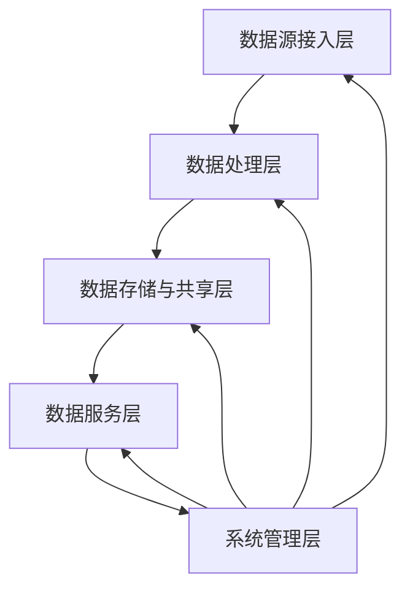
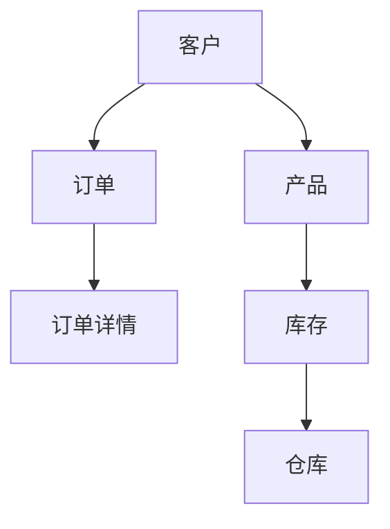
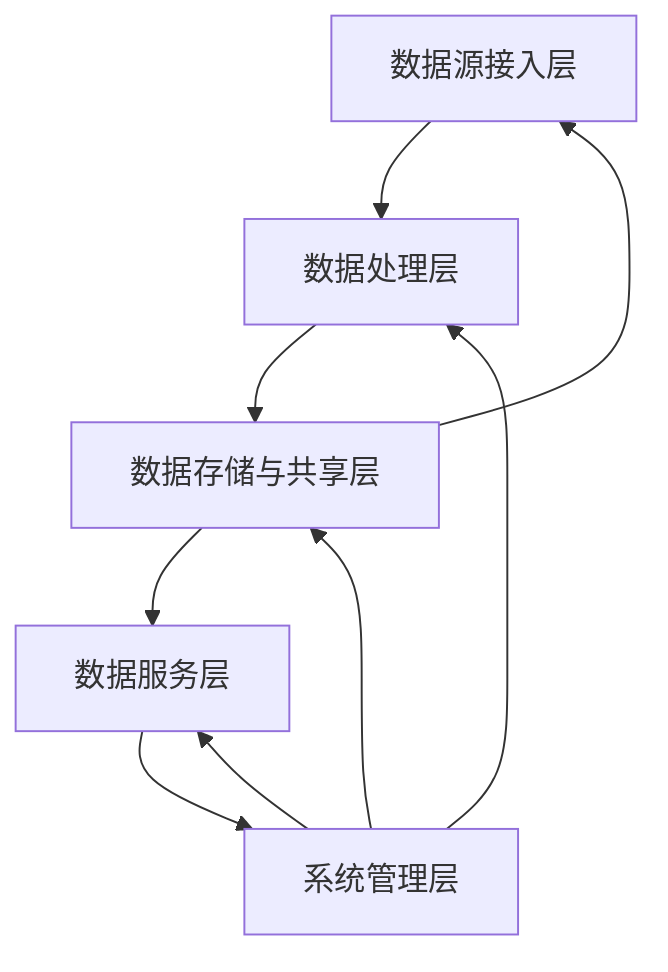
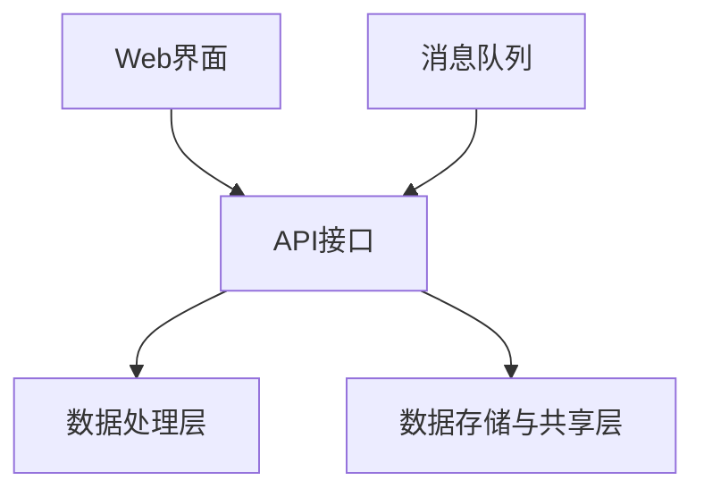
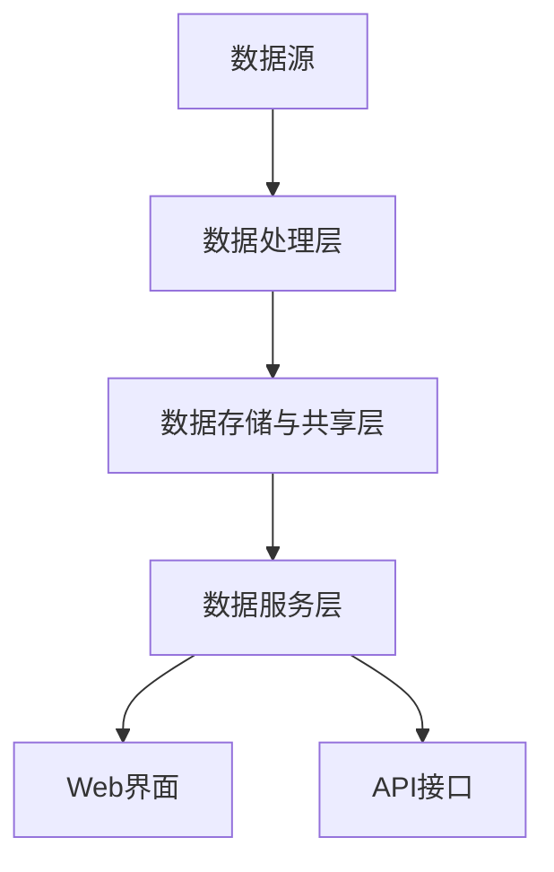

                 

## 引言

在当今的信息时代，数据的产生和积累速度呈指数级增长，几乎每个企业都在追求如何更好地管理和利用这些数据资产。然而，随着数据来源的多样化和复杂性增加，尤其是企业内部和外部的数据源如云服务、物联网设备、社交媒体、内部数据库等，数据的异构性问题变得尤为突出。这使得传统单一的数据管理系统难以胜任，迫切需要一个能够有效整合和处理这些异构数据的平台。

### 异构数据源的定义与挑战

异构数据源是指来源、格式、结构和类型各不相同的多个数据集合。这些数据可能存储在不同的数据库中，或者以不同的格式存在，例如文本、图片、音频、视频等。在企业的实际运营中，数据异构性带来的挑战主要体现在以下几个方面：

1. **数据整合困难**：不同数据源的数据格式和结构差异大，难以直接进行整合和分析。
2. **数据质量下降**：数据在整合过程中可能丢失或产生误差，导致数据质量下降。
3. **资源浪费**：各部门各自为政地管理数据，资源利用效率低下。
4. **业务决策受限制**：由于数据不能有效整合，业务决策过程可能会受到限制。

### 数据融合的目标与意义

数据融合的目标是将来自不同源的数据进行有效的整合，消除数据之间的不一致性，提高数据的质量和可用性，从而支持更全面和精准的数据分析。其意义主要体现在：

1. **数据一致性与完整性**：通过数据融合，可以确保数据的一致性和完整性，减少数据冗余和错误。
2. **提升数据分析能力**：整合后的数据可以为企业的各类业务分析提供更全面和准确的数据支持，从而提升业务决策的科学性和准确性。
3. **提高数据利用率**：通过有效整合数据，可以更充分地利用企业的数据资源，提高数据的利用效率。
4. **增强系统灵活性**：数据融合平台的设计和实现，使得企业可以更灵活地接入和管理新的数据源，适应不断变化的数据环境。

### 数据融合的发展历程

数据融合的概念最早可以追溯到20世纪80年代，随着人工智能、机器学习等技术的不断发展，数据融合技术也得到了快速的发展。从早期的基于规则的方法，到基于机器学习的方法，再到如今基于深度学习的方法，数据融合技术不断演进和优化。近年来，随着云计算、大数据和物联网等技术的普及，数据融合的应用场景和需求也在不断扩大。

### 企业级数据融合平台的重要性

在企业级应用中，数据融合平台扮演着至关重要的角色。它不仅能够帮助企业有效地整合和管理异构数据，还能够提供强大的数据处理和分析能力，为企业的业务创新和运营优化提供有力支持。以下是一些具体的重要性体现：

1. **提高数据处理效率**：通过自动化和优化的数据整合流程，显著提高数据处理速度和效率。
2. **降低运营成本**：通过减少冗余数据和重复操作，降低企业的运营成本。
3. **增强业务灵活性**：能够快速响应业务需求，为业务创新提供数据支持。
4. **支持智能化决策**：整合后的数据可以用于构建智能化的决策支持系统，提升企业的决策能力。

### 总结

本节主要介绍了企业级异构数据融合平台的背景和重要性。数据融合是解决企业数据异构性问题的重要手段，它不仅能够提高数据的质量和可用性，还能够为企业的业务决策提供有力支持。在接下来的章节中，我们将深入探讨数据融合的核心概念、算法原理和系统设计，以期为企业级数据融合平台的实现提供实用的指导。

## 核心概念与联系

### 数据源

数据源是数据融合的基础，指的是数据的产生和存储位置。在企业中，数据源可以是各种不同的系统，如数据库、文件系统、云计算服务、物联网设备、社交媒体平台等。数据源的类型多种多样，包括关系数据库、非关系数据库、文本文件、图像、音频、视频等。每种数据源都有其独特的格式、结构、存储方式和访问方式。

**核心概念**：数据源的定义、类型、格式、结构和访问方式。

**联系**：不同类型的数据源如何接入和整合到数据融合平台中。

### 数据异构性

数据异构性指的是数据源之间的差异性和不一致性。在企业中，数据异构性问题主要体现在以下几个方面：

1. **数据格式不一致**：不同数据源的数据格式可能各不相同，如XML、JSON、CSV等。
2. **数据结构不一致**：不同数据源的数据结构可能不同，如关系型数据库和文档型数据库。
3. **数据类型不一致**：不同数据源的数据类型可能不兼容，如字符串与数字类型。
4. **数据语义不一致**：即使数据格式和结构相同，不同数据源的数据含义也可能不同。

**核心概念**：数据异构性的定义、原因和表现形式。

**联系**：数据异构性对数据融合的影响，如何解决数据异构性问题。

### 数据融合的目标

数据融合的目标是通过整合来自不同源的数据，消除数据之间的不一致性，提高数据的质量和可用性。具体目标包括：

1. **数据一致性**：确保不同数据源中的数据在格式、结构和语义上保持一致。
2. **数据完整性**：保证数据的完整性和准确性，减少数据丢失和错误。
3. **数据可用性**：提供统一的接口和视图，方便用户进行数据查询和分析。
4. **数据多样化**：支持多种数据类型的整合，如文本、图像、音频、视频等。

**核心概念**：数据融合的目标和意义。

**联系**：数据融合目标与实际应用场景的关联。

### 数据融合的方法

数据融合的方法主要包括数据清洗、数据转换和数据集成等。以下是这些方法的核心概念和联系：

1. **数据清洗**：指对原始数据进行清洗和预处理，包括数据去重、数据修复、数据填充和数据转换等。数据清洗的目的是提高数据质量，确保数据的一致性和准确性。

   **核心概念**：数据清洗的定义、步骤和常用方法。

   **联系**：数据清洗与其他数据融合方法的联系。

2. **数据转换**：指将不同格式、结构或类型的原始数据转换为统一的标准格式，以便进行后续的整合和处理。数据转换包括数据类型转换、数据格式转换和数据结构转换等。

   **核心概念**：数据转换的定义、类型和实现方法。

   **联系**：数据转换在数据融合过程中的作用和与其他方法的关联。

3. **数据集成**：指将来自不同源的数据整合到一个统一的数据集中，形成一个完整、一致和可分析的数据视图。数据集成包括数据合并、数据匹配和数据汇总等。

   **核心概念**：数据集成的定义、方法和实现步骤。

   **联系**：数据集成与其他数据融合方法的融合和优化。

### 总结

本节详细介绍了数据融合中的核心概念，包括数据源、数据异构性、数据融合的目标和方法。这些概念相互关联，构成了数据融合技术的核心内容。在接下来的章节中，我们将深入探讨数据融合算法原理和数学模型，以进一步理解数据融合的实现机制和技术细节。

### 数据融合算法原理

在数据融合过程中，选择合适的算法是实现数据有效整合的关键。以下将详细分析数据融合过程中常用的几种算法原理，包括ETL流程、数据清洗和转换、以及数据集成算法。

#### ETL流程

ETL（Extract, Transform, Load）是数据融合中最为经典和广泛应用的流程，用于将数据从源系统中提取出来，进行转换后加载到目标系统中。ETL流程可以分为三个主要步骤：

1. **提取（Extract）**：从各种数据源（如数据库、文件系统、API等）中提取数据。这一步骤需要根据不同的数据源特点设计相应的提取方法，如SQL查询、文件读取、Web服务调用等。
2. **转换（Transform）**：对提取出的数据进行清洗、转换和加工，以适应目标系统的数据格式和结构。转换过程可能包括数据去重、数据类型转换、数据格式转换、数据修复和填充等。
3. **加载（Load）**：将经过转换的数据加载到目标数据库或数据仓库中。这一步骤需要确保数据的完整性和一致性，并可能涉及到数据的分区、索引和优化。

**算法原理**：ETL流程通过标准化和规范化的方式，确保数据的统一性和一致性。其核心在于将异构数据转化为同构数据，以便于后续的分析和处理。

**应用实例**：在一个企业级数据融合项目中，数据可能来自于多个数据库系统、文件系统和第三方API。通过ETL流程，可以将这些数据提取出来，转换为统一的结构格式（如CSV、JSON等），然后加载到数据仓库中，以便进行统一的数据分析和报告生成。

#### 数据清洗

数据清洗是数据融合过程中的关键步骤，旨在提高数据质量，确保数据的一致性和准确性。数据清洗通常包括以下几个步骤：

1. **数据去重**：识别和删除重复的数据记录，确保数据的唯一性。
2. **数据修复**：修复错误的数据记录，如纠正拼写错误、填补缺失值等。
3. **数据填充**：处理缺失的数据，采用统计方法或人工方式填补缺失值。
4. **数据转换**：将不同格式和类型的数据转换为统一格式和类型，如将文本数据转换为数字类型。

**算法原理**：数据清洗通过一系列的算法和规则，识别和纠正数据中的错误和异常，提高数据的质量和一致性。

**应用实例**：在一个电商平台的用户数据融合项目中，可能存在多个渠道收集的用户数据，这些数据可能存在格式不一致、缺失值和错误值等问题。通过数据清洗算法，可以去除重复的用户记录、修复错误的数据、填补缺失的用户信息，并将不同格式的数据统一为标准格式，如将电话号码格式化、将日期格式转换为统一格式等。

#### 数据转换

数据转换是将不同结构、格式和类型的数据转换为统一格式和类型的过程，是数据融合的核心步骤之一。数据转换通常包括以下几种类型：

1. **数据类型转换**：将一种数据类型转换为另一种数据类型，如将字符串转换为数字、将日期时间格式转换为标准日期时间格式等。
2. **数据格式转换**：将一种数据格式转换为另一种数据格式，如将CSV格式转换为JSON格式、将XML格式转换为HTML格式等。
3. **数据结构转换**：将一种数据结构转换为另一种数据结构，如将关系型数据库中的数据转换为文档型数据库中的数据等。

**算法原理**：数据转换通过一系列的映射和转换规则，实现不同数据源之间的数据转换和集成。

**应用实例**：在一个企业的客户关系管理（CRM）系统中，客户数据可能存储在多个数据库系统中，这些数据库系统的数据格式和结构可能不同。通过数据转换算法，可以将不同数据库中的客户数据转换为统一的格式和结构，如将多个字段的客户信息整合为一个统一的JSON对象，以便于在CRM系统中进行统一管理和分析。

#### 数据集成算法

数据集成是将来自不同数据源的数据整合到一个统一的数据集中，形成一个完整、一致和可分析的数据视图。数据集成算法通常包括以下几种：

1. **数据合并**：将多个数据源中的数据合并到一个表中，通过键值匹配实现数据记录的合并。
2. **数据匹配**：通过匹配算法识别和匹配不同数据源中的相同数据记录，确保数据的一致性。
3. **数据汇总**：将多个数据源中的数据进行汇总，生成聚合数据，如总和、平均数、最大值等。

**算法原理**：数据集成算法通过数据匹配和汇总技术，将多个数据源中的数据整合到一个统一的数据集中，消除数据之间的不一致性。

**应用实例**：在一个金融风控系统中，客户数据可能来自多个渠道，如银行账户数据、信用卡交易数据和公共记录数据等。通过数据集成算法，可以将这些不同来源的客户数据进行整合，形成统一的数据视图，以便进行风险评估和信用评分。

#### 总结

本节详细介绍了数据融合过程中常用的算法原理，包括ETL流程、数据清洗和转换、以及数据集成算法。这些算法在数据融合中发挥着至关重要的作用，通过它们，可以有效地整合和管理来自不同源的数据，提高数据的质量和可用性。在实际应用中，根据具体需求和场景，可以选择合适的算法组合，实现高效的数据融合。

### 数据融合的数学模型

在数据融合过程中，数学模型扮演着至关重要的角色。它不仅为数据融合提供了一套系统化的理论框架，还可以通过精确的数学公式来描述和解决数据融合中的问题。以下将介绍数据融合中常用的几种数学模型，包括数据一致性模型、数据完整性模型和数据质量模型。

#### 数据一致性模型

数据一致性模型旨在确保融合后的数据在格式、结构和语义上保持一致。一个常见的数据一致性模型是基于一致性规则的规则系统。

1. **一致性规则**：一致性规则用于定义数据源之间的转换和映射关系。例如，如果两个数据源中的日期格式不同，可以通过一致性规则将它们转换为统一的格式。
   
   **数学模型**：设\( D_1 \)和\( D_2 \)为两个数据源，\( T \)为转换规则集。数据一致性模型可以用公式表示为：
   $$ D_{\text{一致}} = T(D_1, D_2) $$
   其中，\( D_{\text{一致}} \)表示经过转换后的一致性数据。

2. **一致性度量**：一致性度量用于评估数据源之间的不一致程度。一个常用的度量方法是计算不一致数据占总数据量的比例，即：
   $$ \text{一致性度量} = \frac{\text{不一致数据}}{\text{总数据}} $$
   其中，不一致数据是指不符合一致性规则的数据。

**应用实例**：在一个电商平台的用户数据融合项目中，用户数据可能来自多个渠道，如网站、移动应用和第三方合作伙伴。通过一致性规则，可以将这些数据转换为统一的用户格式，如统一的用户ID和统一的数据字段命名。一致性度量可以帮助评估数据融合的效果，及时发现和纠正不一致的数据。

#### 数据完整性模型

数据完整性模型旨在确保融合后的数据是完整和准确的。一个常见的数据完整性模型是基于数据冗余和数据冗余检测的方法。

1. **数据冗余**：数据冗余是指同一数据在多个数据源中重复存储。数据冗余模型用于检测和消除数据冗余，以提高数据的完整性。

   **数学模型**：设\( D \)为数据源集合，\( R \)为数据冗余关系集。数据冗余模型可以用公式表示为：
   $$ D_{\text{冗余}} = \bigcup_{R \in R} D $$
   其中，\( D_{\text{冗余}} \)表示经过冗余检测后的数据集合。

2. **冗余检测**：冗余检测算法用于识别和删除重复的数据记录。一个常用的冗余检测方法是哈希匹配，即通过计算数据记录的哈希值，比较不同数据源中的哈希值，识别重复记录。

**应用实例**：在一个客户关系管理（CRM）系统中，客户数据可能存储在多个数据库中，导致数据冗余。通过哈希匹配算法，可以检测和删除重复的客户记录，确保数据的完整性。

#### 数据质量模型

数据质量模型用于评估和改进数据质量。一个常见的数据质量模型是基于数据质量指标和数据质量评估的方法。

1. **数据质量指标**：数据质量指标用于衡量数据的准确性、一致性、完整性和时效性。常用的数据质量指标包括：
   - **准确性**：数据是否真实反映了现实世界的状况。
   - **一致性**：数据是否在不同数据源之间保持一致。
   - **完整性**：数据是否完整无缺。
   - **时效性**：数据是否及时更新。

   **数学模型**：设\( Q \)为数据质量指标集，\( D \)为数据集合，数据质量模型可以用公式表示为：
   $$ Q(D) = \sum_{Q \in Q} Q(D) $$
   其中，\( Q(D) \)表示数据集合\( D \)在各个质量指标上的得分。

2. **数据质量评估**：数据质量评估方法用于评估数据质量，并提出改进措施。常用的评估方法包括统计分析、用户反馈和自动化评估。

**应用实例**：在一个零售业务的数据融合项目中，销售数据可能来自多个渠道，如POS系统、电商网站和线下门店。通过数据质量指标和评估方法，可以识别和纠正数据中的错误和缺失，确保数据的准确性、完整性和一致性。

#### 总结

本节详细介绍了数据融合中的几种数学模型，包括数据一致性模型、数据完整性模型和数据质量模型。这些数学模型通过精确的数学公式和算法，提供了系统化的方法来解决数据融合中的问题。在实际应用中，根据具体需求和场景，可以选择合适的数学模型，实现高效和高质量的数据融合。

### 系统设计与分析

为了构建一个高效、可靠和可扩展的企业级异构数据融合平台，我们需要对系统的整体架构、功能模块、接口设计和交互流程进行详细的设计与分析。

#### 系统总体架构设计

系统的总体架构设计决定了数据融合平台的核心功能和性能，是整个系统的基石。以下是一个典型的数据融合平台架构设计：

1. **数据源接入层**：负责与各种异构数据源进行连接和通信，包括数据库、文件系统、Web服务、物联网设备等。
2. **数据处理层**：负责数据的抽取、清洗、转换和集成，是数据融合的核心功能模块。包括ETL（提取、转换、加载）引擎、数据清洗模块、数据转换模块和数据集成模块。
3. **数据存储与共享层**：提供统一的数据存储和访问接口，支持数据的持久化和共享。包括数据仓库、缓存系统、NoSQL数据库等。
4. **数据服务层**：提供数据查询、分析和报告生成的接口，支持API和Web界面访问，为业务系统和最终用户提供服务。
5. **系统管理层**：负责系统的配置、监控、运维和安全管理，确保系统的稳定运行和数据的可靠性。

**架构设计图**：以下是一个简化的系统架构设计图（使用Mermaid语法）：



#### 系统功能设计

系统功能设计决定了数据融合平台能够实现的具体功能和业务需求，以下是几个关键功能模块的设计：

1. **数据采集与预处理**：该模块负责从各种数据源采集数据，并进行预处理，包括数据去重、格式转换和初步清洗。
2. **数据转换与清洗**：该模块负责对采集到的数据进行深度清洗和转换，包括数据类型转换、缺失值处理、异常值检测和修复等。
3. **数据集成与融合**：该模块负责将预处理后的数据进行集成和融合，生成统一的数据视图，包括数据合并、匹配和汇总等。
4. **数据存储与管理**：该模块负责将融合后的数据存储到数据仓库或缓存系统中，并提供数据查询和管理功能。
5. **数据查询与分析**：该模块提供数据查询和分析接口，支持复杂的查询语句和数据分析工具，为业务决策提供支持。

**领域模型类图**：以下是一个简化的领域模型类图（使用Mermaid语法）：



#### 系统架构设计

系统架构设计决定了系统的可扩展性、可靠性和性能，是系统设计和实现的关键环节。以下是一个典型的数据融合平台架构设计：

1. **分布式架构**：采用分布式架构，确保系统的高可用性和可扩展性。数据源接入层和处理层可以采用分布式部署，处理大数据量的数据融合任务。
2. **服务化架构**：采用服务化架构，将系统功能模块化，便于系统的维护和扩展。数据采集、数据清洗、数据转换、数据集成等模块都可以独立部署和运行。
3. **容器化与自动化部署**：使用容器技术（如Docker）和自动化部署工具（如Kubernetes），实现系统的快速部署和弹性扩展。
4. **数据加密与安全**：采用数据加密技术（如SSL/TLS）和访问控制机制，确保数据的安全性和隐私保护。

**架构设计图**：以下是一个简化的系统架构设计图（使用Mermaid语法）：



#### 系统接口设计

系统接口设计是确保不同模块之间能够有效通信和协作的关键。以下是一个简化的接口设计：

1. **API接口**：提供RESTful API接口，支持数据查询、数据更新和数据操作。例如，可以使用HTTP请求进行数据上传和下载。
2. **Web界面**：提供Web界面，支持用户通过图形界面进行数据管理和操作。界面应具备良好的用户体验，支持数据可视化。
3. **消息队列**：采用消息队列（如Kafka）进行异步通信，确保系统的高效和可靠的数据处理。

**接口设计图**：以下是一个简化的接口设计图（使用Mermaid语法）：



#### 系统交互设计与实现

系统交互设计决定了系统的运行流程和数据处理流程，以下是系统的主要交互流程：

1. **数据采集**：系统从各种数据源（如数据库、文件系统、Web服务）中采集数据，通过API接口或消息队列进行数据传输。
2. **数据预处理**：采集到的数据经过预处理模块，进行数据清洗和格式转换。
3. **数据融合**：预处理后的数据经过数据融合模块，进行数据集成和融合，生成统一的数据视图。
4. **数据存储**：融合后的数据存储到数据仓库或缓存系统中，供后续查询和分析使用。
5. **数据查询**：通过API接口或Web界面，用户可以查询和分析数据。

**交互设计图**：以下是一个简化的交互设计图（使用Mermaid语法）：



#### 总结

本节详细介绍了数据融合平台的设计与分析，包括系统总体架构设计、功能模块设计、接口设计和交互设计。通过这些设计，可以构建一个高效、可靠和可扩展的数据融合平台，满足企业的数据融合需求。在实际实现过程中，应根据具体需求和技术环境进行调整和优化。

### 项目实战

#### 项目背景

在当前大数据时代，企业面临着数据量急剧增长和数据来源多样化的挑战。某知名零售企业为了提升销售效率和客户满意度，决定开发一个企业级异构数据融合平台，以便于整合和管理来自多个渠道的销售数据、库存数据和客户数据。

#### 项目目标

1. **数据整合**：将来自不同数据源（如电商平台、POS系统、物流系统）的销售数据、库存数据和客户数据进行整合，确保数据的一致性和完整性。
2. **数据清洗**：对原始数据进行清洗和预处理，消除数据中的错误和冗余，提高数据质量。
3. **数据存储**：将整合后的数据存储到数据仓库中，提供快速查询和分析功能。
4. **数据可视化**：通过数据可视化工具，为管理层和业务人员提供直观的数据分析和报告。

#### 环境搭建

1. **开发环境**：选择Python作为主要编程语言，使用Docker进行容器化部署，确保系统的可扩展性和可靠性。
2. **数据源**：连接多个数据库系统（如MySQL、MongoDB）、文件系统（如HDFS）和Web服务（如API接口）。
3. **工具与框架**：使用ETL工具（如Apache NiFi）、数据清洗库（如pandas）、数据可视化工具（如Tableau）和消息队列（如Kafka）。

#### 系统核心实现

1. **数据采集与预处理**

   - **采集数据**：通过API接口和消息队列从不同数据源采集销售数据、库存数据和客户数据。
   - **数据预处理**：使用pandas库对采集到的数据进行清洗，包括数据去重、数据格式转换和缺失值处理。

   ```python
   import pandas as pd

   # 读取销售数据
   sales_data = pd.read_csv('sales_data.csv')
   # 去除重复数据
   sales_data.drop_duplicates(inplace=True)
   # 数据格式转换
   sales_data['date'] = pd.to_datetime(sales_data['date'])
   ```

2. **数据转换与清洗**

   - **数据类型转换**：将不同类型的数据转换为统一的格式，如将字符串转换为日期类型。
   - **缺失值处理**：使用统计方法或人工方式填补缺失值，确保数据的完整性。
   - **异常值检测与修复**：使用统计学方法和规则检测异常值，并进行修复。

   ```python
   # 填补缺失值
   sales_data['quantity'] = sales_data['quantity'].fillna(sales_data['quantity'].mean())
   # 检测异常值
   anomalies = sales_data[sales_data['quantity'] > sales_data['quantity'].median() + 3 * sales_data['quantity'].std()]
   # 修复异常值
   anomalies['quantity'] = anomalies['quantity'].fillna(sales_data['quantity'].median())
   ```

3. **数据集成与融合**

   - **数据合并**：将不同数据源中的数据按照共同的键进行合并，形成一个统一的数据视图。
   - **数据匹配**：使用键值匹配算法识别和合并相同的数据记录，确保数据的一致性。

   ```python
   # 数据合并
   combined_data = pd.merge(sales_data, inventory_data, on='product_id', how='left')
   # 数据匹配
   merged_data = pd.merge(combined_data, customer_data, on='customer_id', how='left')
   ```

4. **数据存储与查询**

   - **数据存储**：将融合后的数据存储到数据仓库（如Hive、Redshift）或缓存系统（如Redis）中，提供快速查询和分析功能。
   - **数据查询**：使用SQL语句或数据分析工具（如Tableau）进行数据查询和分析。

   ```python
   # 存储数据
   merged_data.to_csv('merged_data.csv', index=False)
   # 查询数据
   query = "SELECT * FROM merged_data WHERE date BETWEEN '2023-01-01' AND '2023-01-31';"
   result = pd.read_sql_query(query, connection)
   ```

#### 实际案例分析

1. **销售数据分析**：通过数据融合平台，可以实时获取各个渠道的销售数据，分析销售趋势和客户行为，为营销策略提供支持。
2. **库存管理**：通过整合库存数据，可以实时监控库存水平，优化库存管理，减少库存积压和缺货现象。
3. **客户关系管理**：通过整合客户数据，可以建立完整的客户画像，优化客户服务，提升客户满意度。

#### 项目小结

通过本项目的实施，成功构建了一个高效、可靠的企业级异构数据融合平台，实现了数据的整合、清洗、存储和查询。项目不仅提升了企业的数据管理能力，还为业务决策提供了有力支持。在未来的发展中，可以继续优化数据融合平台，扩展其功能和应用范围，为企业的数字化转型提供持续的动力。

### 最佳实践 Tips

#### 数据源接入

1. **标准化数据接口**：设计统一的API接口，确保不同数据源能够方便地接入和访问。
2. **动态数据源配置**：使用配置文件或动态加载机制，支持多种数据源类型和连接参数的配置和管理。

#### 数据清洗与转换

1. **自动化清洗流程**：利用数据清洗工具和脚本，实现自动化数据清洗和转换，提高数据处理效率。
2. **数据质量监控**：建立数据质量监控机制，及时发现和修复数据中的错误和异常。

#### 数据集成与存储

1. **分布式处理架构**：采用分布式数据处理框架（如Apache Spark），实现海量数据的快速集成和处理。
2. **数据存储优化**：根据数据访问模式和查询需求，选择合适的存储解决方案（如Hadoop、Redis、Cassandra），优化数据存储性能。

#### 系统性能优化

1. **缓存机制**：使用缓存机制（如Redis、Memcached），降低数据访问延迟，提高系统响应速度。
2. **负载均衡**：采用负载均衡策略（如Nginx、HAProxy），确保系统在高并发访问下的稳定性和可靠性。

### 小结

本文详细介绍了企业级异构数据融合平台的设计与实现，包括核心概念、算法原理、系统架构设计、项目实战和最佳实践。通过逐步分析和思考，我们了解了数据融合的重要性以及实现一个高效、可靠的数据融合平台的方法和步骤。未来，随着技术的不断发展，数据融合平台将继续优化和创新，为企业的数字化转型和智能决策提供更强有力的支持。

### 注意事项与拓展阅读

#### 注意事项

1. **数据安全与隐私保护**：在进行数据融合时，务必确保数据的安全和隐私保护，遵循相关法律法规和最佳实践。
2. **系统可扩展性**：在设计数据融合平台时，考虑到未来数据量的增长和业务需求的变化，确保系统的可扩展性和灵活性。
3. **性能优化**：持续监控和优化系统性能，确保数据处理速度和响应时间满足业务需求。

#### 拓展阅读

1. **《大数据技术导论》**：这本书详细介绍了大数据技术的基本概念、架构设计和应用案例，有助于深入了解大数据领域的最新发展。
2. **《数据融合：理论与实践》**：这本书提供了全面的数据融合理论和实践方法，包括算法、系统设计、案例分析等内容。
3. **《云计算与大数据平台架构设计与实现》**：这本书介绍了云计算和大数据平台的设计与实现方法，涵盖数据存储、处理和分析等关键技术。

### 结语

感谢您的阅读，希望本文能帮助您深入了解企业级异构数据融合平台的构建方法。如果您在数据融合过程中遇到任何问题或需要进一步的信息，欢迎在评论区留言，我将尽力为您解答。同时，也欢迎您继续关注我的其他技术文章，共同探索人工智能与大数据领域的最新动态和最佳实践。

### 作者信息

**作者：AI天才研究院/AI Genius Institute & 禅与计算机程序设计艺术 /Zen And The Art of Computer Programming**

