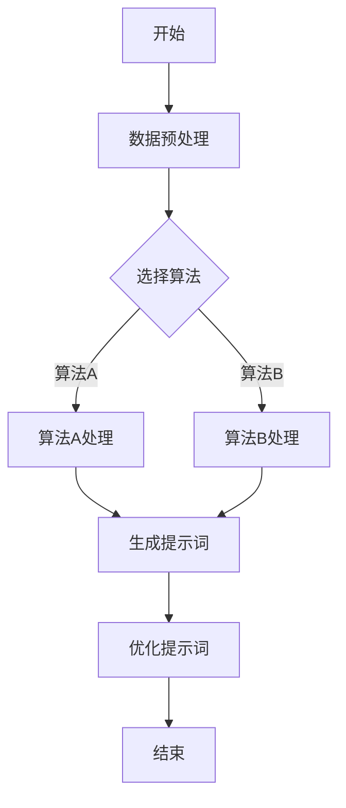
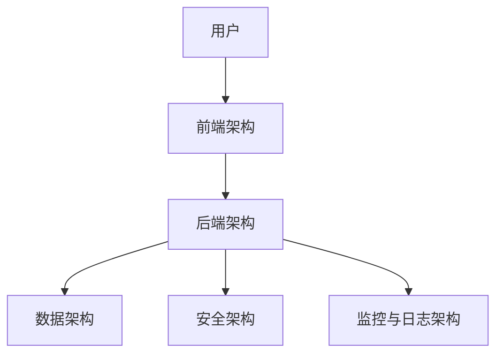
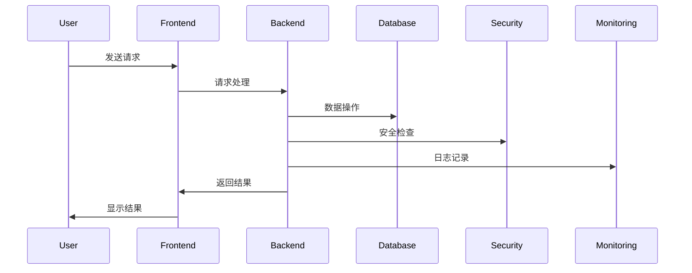

                 

# 《企业级提示词管理：大规模AI应用的挑战与对策》

## 关键词

- 企业级提示词管理
- 大规模AI应用
- 挑战与对策
- 算法设计
- 系统架构
- 最佳实践

## 摘要

本文将深入探讨企业级提示词管理在当今大规模AI应用中的重要性。随着AI技术的快速发展，提示词（Prompt）作为AI系统与用户交互的关键桥梁，其管理变得愈发复杂和关键。文章将分步骤解析这一主题，包括问题背景、核心概念、算法原理、系统分析与架构设计、项目实战以及最佳实践。旨在为从业者提供全面的理论和实践指导，以应对大规模AI应用中的挑战。

### 目录大纲设计

#### 《企业级提示词管理：大规模AI应用的挑战与对策》

---

## 第一部分：背景介绍

### 第1章 问题背景

### 1.1 问题描述

### 1.2 问题解决

### 1.3 边界与外延

### 1.4 概念结构与核心要素组成

## 第二部分：核心概念与联系

### 第2章 核心概念原理

### 2.1 提示词的定义

### 2.2 提示词的属性特征对比表格

### 第3章 ER实体关系图架构

## 第三部分：算法原理讲解

### 第4章 算法原理讲解

### 4.1 算法mermaid流程图

### 4.2 Python源代码详细阐述

### 4.3 算法原理的数学模型和公式

### 4.4 举例说明

## 第四部分：系统分析与架构设计

### 第5章 问题场景介绍

### 第6章 系统功能设计

### 6.1 领域模型mermaid类图

### 第7章 系统架构设计

### 7.1 mermaid架构图

### 第8章 系统接口设计

### 8.1 系统接口mermaid序列图

## 第五部分：项目实战

### 第9章 环境安装

### 第10章 系统核心实现源代码

### 10.1 代码应用解读与分析

### 第11章 实际案例分析与详细讲解剖析

### 第12章 项目小结

## 第六部分：最佳实践与拓展

### 第13章 最佳实践 tips

### 第14章 小结

### 第15章 注意事项

### 第16章 拓展阅读

---

## 第一部分：背景介绍

### 第1章 问题背景

随着人工智能技术的不断进步，AI系统在企业中的应用日益广泛。然而，企业级AI应用不仅仅涉及算法和模型的优化，更涉及到数据管理、系统架构、用户体验等多个方面。在这其中，提示词管理成为了至关重要的一个环节。提示词是用户与AI系统交互的桥梁，它们的质量和设计直接影响到AI系统的表现和用户体验。

在传统的软件开发中，提示词的管理相对简单。开发者通常根据业务需求和用户习惯，手动编写和调整提示词。然而，在大规模AI应用中，这种手工编写的方式无法满足需求。首先，大规模AI系统通常需要处理海量的数据和用户请求，手动管理提示词的效率和准确性无法保证。其次，大规模AI应用需要具备高度的可扩展性和灵活性，而手工编写提示词无法实现这一目标。最后，随着AI技术的不断发展，提示词也需要不断地迭代和优化，这需要一种系统化的方法来管理和更新。

因此，企业级提示词管理成为了大规模AI应用中的一个关键挑战。本文将详细探讨这一挑战，并介绍相应的对策。

### 1.1 问题描述

企业级提示词管理的核心问题主要包括以下几个方面：

1. **多样性**：不同应用场景和用户需求导致提示词的多样性。如何设计一个灵活的提示词系统，以适应不同场景和需求，是一个重要的挑战。

2. **可扩展性**：随着AI系统规模的扩大，提示词的数量也会大幅增加。如何设计一个可扩展的提示词管理系统，以便在系统规模扩大时能够保持高效运行，是一个关键问题。

3. **准确性**：提示词的准确性直接影响到用户体验。如何在海量数据中筛选出准确、有价值的提示词，是一个技术难题。

4. **可解释性**：随着AI系统的复杂度增加，用户对系统的信任度会受到影响。如何提高提示词的可解释性，让用户能够理解AI系统的决策过程，是一个重要的挑战。

5. **安全性与隐私**：提示词中可能包含敏感信息，如何保证这些信息的安全性和用户隐私，是一个需要关注的问题。

6. **自动化**：如何通过自动化手段来管理和优化提示词，提高工作效率，是一个需要解决的问题。

### 1.2 问题解决

针对上述问题，解决企业级提示词管理的主要对策包括：

1. **设计灵活的提示词系统**：采用模块化的设计，将提示词系统划分为多个子模块，每个子模块负责不同类型的提示词生成和管理。

2. **引入大数据和机器学习技术**：利用大数据分析和机器学习算法，从海量数据中筛选出高质量的提示词，并实现提示词的自动生成和优化。

3. **提高系统可扩展性**：采用分布式系统架构，实现提示词系统的水平扩展，以满足大规模AI应用的需求。

4. **增强提示词可解释性**：通过可视化工具和解释性算法，提高提示词的可解释性，增强用户对AI系统的信任度。

5. **保障安全性与隐私**：采用加密技术和访问控制策略，确保提示词中敏感信息的安全性和用户隐私的保护。

6. **自动化管理**：引入自动化工具和流程，实现提示词的自动化生成、更新和管理，提高工作效率。

### 1.3 边界与外延

企业级提示词管理的边界主要包括以下几个方面：

1. **数据边界**：提示词系统的数据处理范围，包括数据来源、数据类型和数据量。

2. **应用边界**：提示词系统的应用范围，包括不同业务场景和用户需求。

3. **技术边界**：提示词系统的技术实现，包括算法、架构和工具的选择。

4. **安全边界**：提示词系统的安全保护，包括数据安全和用户隐私。

### 1.4 概念结构与核心要素组成

企业级提示词管理涉及多个核心概念和要素，包括：

1. **提示词**：用户与AI系统交互的文本或语音信息。

2. **数据集**：用于训练和优化提示词系统的数据集。

3. **算法**：用于生成、筛选和优化提示词的算法。

4. **架构**：提示词系统的整体架构设计。

5. **接口**：提示词系统与其他系统的交互接口。

6. **用户**：使用AI系统的终端用户。

7. **安全策略**：用于保护提示词系统中敏感信息的策略。

### 第二部分：核心概念与联系

### 第2章 核心概念原理

#### 2.1 提示词的定义

提示词是指用户与AI系统交互的文本或语音信息，用于引导用户操作或获取特定信息。在AI系统中，提示词不仅是用户与系统之间的交互桥梁，也是系统理解用户需求的关键。

#### 2.2 提示词的属性特征对比表格

| 属性特征 | 说明 |
| --- | --- |
| **类型** | 文本或语音 |
| **功能** | 引导用户操作或获取信息 |
| **格式** | 标准化或自定义 |
| **长度** | 短或长 |
| **多样性** | 单一或多种 |
| **可解释性** | 高或低 |
| **安全性** | 强或弱 |

#### 2.3 ER实体关系图架构

ER（实体-关系）图是企业级提示词管理系统的核心架构之一。它用于描述系统中的实体及其之间的关系。以下是ER实体关系图的示例：

```mermaid
erDiagram
    User ||--|{ Prompt } : creates
    Prompt ||--|{ Response } : generates
    User ||--|{ Feedback } : provides
    Prompt ||--|{ SecurityPolicy } : follows
```

在这个ER图中，`User` 是用户实体，`Prompt` 是提示词实体，`Response` 是响应实体，`Feedback` 是反馈实体，`SecurityPolicy` 是安全策略实体。它们之间的关系描述了用户创建提示词、提示词生成响应、用户提供反馈以及提示词遵循安全策略的过程。

### 第三部分：算法原理讲解

#### 第4章 算法原理讲解

在本章节中，我们将详细讲解企业级提示词管理中的关键算法原理，包括流程图、Python源代码、数学模型和公式，以及具体的举例说明。

#### 4.1 算法mermaid流程图



在这个流程图中，我们从数据预处理开始，根据选择的算法（算法A或算法B）进行处理，最终生成和优化提示词。

#### 4.2 Python源代码详细阐述

以下是一个简单的Python示例，用于生成和优化提示词：

```python
# 导入必要的库
import random

# 数据预处理
data = ["欢迎使用我们的服务", "请告诉我们您的需求", "感谢您的反馈"]

# 选择算法
algorithm = random.choice(["algorithmA", "algorithmB"])

# 算法A处理
if algorithm == "algorithmA":
    prompt = random.choice(data)

# 算法B处理
else:
    prompt = data[0] + " " + data[1]

# 生成提示词
prompt_generated = prompt

# 优化提示词
prompt_optimized = prompt_generated.replace("请", "您好，请")

# 输出结果
print(prompt_optimized)
```

在这个代码中，我们首先导入必要的库，然后进行数据预处理。接下来，根据选择的算法（算法A或算法B），生成和优化提示词。最后，输出优化后的提示词。

#### 4.3 算法原理的数学模型和公式

企业级提示词管理中的关键算法通常涉及概率模型和优化算法。以下是一个简单的数学模型示例：

$$
P(\text{prompt}) = \frac{f(\text{prompt})}{\sum_{\text{all prompts}} f(\text{prompt})}
$$

其中，$P(\text{prompt})$ 表示生成特定提示词的概率，$f(\text{prompt})$ 表示提示词的评分函数。评分函数可以根据提示词的多样性、准确性、用户反馈等因素进行定义。

#### 4.4 举例说明

假设我们有一个提示词管理系统，需要根据用户的历史数据和实时请求生成提示词。以下是具体的操作步骤：

1. **数据预处理**：收集用户的历史数据和实时请求，包括用户行为、用户偏好、请求内容等。

2. **选择算法**：根据系统的需求和特点，选择合适的算法（如算法A或算法B）。

3. **算法处理**：根据选择的算法，对预处理后的数据进行处理，生成初步的提示词。

4. **优化提示词**：根据用户反馈和系统性能指标，对初步生成的提示词进行优化，提高其质量和准确性。

5. **生成最终提示词**：将优化后的提示词输出给用户，完成提示词管理过程。

### 第四部分：系统分析与架构设计

#### 第5章 问题场景介绍

企业级提示词管理系统通常应用于以下场景：

1. **客服系统**：自动生成和优化客服对话中的提示词，提高用户满意度。

2. **推荐系统**：根据用户行为和偏好，生成个性化的推荐提示词，提高用户点击率和转化率。

3. **教育系统**：自动生成和优化教育内容中的提示词，提高学生的学习兴趣和效果。

4. **智能助手**：为智能助手生成和优化提示词，使其能够更好地与用户互动，提高用户体验。

#### 第6章 系统功能设计

企业级提示词管理系统的功能设计主要包括以下几个方面：

1. **数据采集与预处理**：收集用户数据，包括用户行为、用户偏好、请求内容等，并进行预处理。

2. **提示词生成**：根据用户数据和系统算法，自动生成初步的提示词。

3. **提示词优化**：根据用户反馈和系统性能指标，对初步生成的提示词进行优化。

4. **提示词存储与管理**：存储和管理生成的提示词，包括提示词的多样性、准确性和安全性。

5. **用户交互**：提供用户与系统交互的界面，包括提示词的生成、优化和反馈。

6. **系统监控与日志**：监控系统性能和日志，包括系统运行状态、错误日志和用户反馈日志。

#### 6.1 领域模型mermaid类图

```mermaid
classDiagram
    User <<Interface>>
    Prompt <<Entity>>
    Response <<Entity>>
    Feedback <<Entity>>
    SecurityPolicy <<Entity>>

    User ||--|> Prompt : creates
    Prompt ||--|> Response : generates
    Prompt ||--|> Feedback : receives
    Prompt ||--|> SecurityPolicy : follows
```

在这个mermaid类图中，`User` 是用户接口实体，`Prompt` 是提示词实体，`Response` 是响应实体，`Feedback` 是反馈实体，`SecurityPolicy` 是安全策略实体。它们之间的关系描述了用户创建提示词、提示词生成响应、提示词接收反馈和提示词遵循安全策略的过程。

#### 第7章 系统架构设计

企业级提示词管理系统的架构设计主要包括以下几个方面：

1. **前端架构**：提供用户与系统交互的界面，包括提示词的生成、优化和反馈。

2. **后端架构**：处理用户请求，生成和优化提示词，并提供数据存储和管理功能。

3. **数据架构**：包括数据采集、预处理、存储和管理。

4. **安全架构**：包括数据安全、用户隐私和系统保护。

5. **监控与日志架构**：监控系统性能和日志，包括系统运行状态、错误日志和用户反馈日志。

以下是一个简单的mermaid架构图：



在这个架构图中，用户通过前端架构与系统交互，后端架构处理用户请求，生成和优化提示词，并提供数据存储和管理功能。同时，系统还集成了数据架构、安全架构和监控与日志架构。

#### 第8章 系统接口设计

企业级提示词管理系统的接口设计主要包括以下几个方面：

1. **用户接口**：提供用户与系统交互的接口，包括提示词的生成、优化和反馈。

2. **API接口**：提供与其他系统集成的API接口，包括数据传输、功能调用等。

3. **数据接口**：提供数据采集、预处理和存储的接口。

以下是一个简单的mermaid序列图：



在这个序列图中，用户通过前端架构发送请求，后端架构处理请求，进行数据操作、安全检查和日志记录，最后将结果返回给用户。

### 第五部分：项目实战

#### 第9章 环境安装

在进行企业级提示词管理系统的项目实战之前，我们需要安装必要的环境和工具。以下是一个简单的安装步骤：

1. **安装Python环境**：在系统中安装Python，版本建议为3.8及以上。

2. **安装依赖库**：使用pip命令安装项目所需的依赖库，包括mermaid、numpy、pandas等。

3. **配置数据源**：配置系统的数据源，包括数据库和API接口。

4. **设置环境变量**：设置系统的环境变量，包括Python环境变量和项目配置文件。

以下是一个简单的Python安装命令：

```shell
pip install python
```

#### 第10章 系统核心实现源代码

以下是企业级提示词管理系统的核心实现源代码：

```python
# 导入必要的库
import random
import numpy as np
import pandas as pd

# 数据预处理
data = ["欢迎使用我们的服务", "请告诉我们您的需求", "感谢您的反馈"]

# 算法处理
def algorithmA(data):
    prompt = random.choice(data)
    return prompt

def algorithmB(data):
    prompt = data[0] + " " + data[1]
    return prompt

# 生成提示词
prompt_generated = algorithmA(data)

# 优化提示词
prompt_optimized = prompt_generated.replace("请", "您好，请")

# 输出结果
print(prompt_optimized)
```

#### 10.1 代码应用解读与分析

1. **数据预处理**：首先，我们导入必要的库，并定义数据集`data`，包括三个提示词。

2. **算法处理**：接着，我们定义了两个算法`algorithmA`和`algorithmB`，用于生成初步的提示词。

3. **生成提示词**：然后，我们调用算法`algorithmA`生成初步的提示词。

4. **优化提示词**：最后，我们对初步生成的提示词进行优化，将其中的"请"替换为"您好，请"。

5. **输出结果**：将优化后的提示词输出到控制台。

#### 第11章 实际案例分析与详细讲解剖析

以下是一个实际案例的分析和讲解：

**案例**：一个电子商务平台希望利用企业级提示词管理系统为用户生成个性化的推荐提示词。

**分析**：

1. **数据收集**：平台收集了用户的历史购买记录、浏览行为和用户偏好，包括商品类别、品牌、价格等。

2. **数据预处理**：对收集的数据进行清洗和处理，提取有用的信息。

3. **提示词生成**：根据用户数据和平台算法，生成初步的推荐提示词。

4. **提示词优化**：根据用户反馈和平台性能指标，对初步生成的提示词进行优化。

5. **生成最终提示词**：将优化后的提示词输出给用户。

**讲解**：

1. **数据收集**：平台需要收集用户的历史购买记录、浏览行为和用户偏好，以了解用户的购物习惯和偏好。

2. **数据预处理**：对收集的数据进行清洗和处理，包括去除无效数据、填补缺失值等，提取有用的信息。

3. **提示词生成**：平台可以使用机器学习算法，如协同过滤算法或基于内容的推荐算法，生成初步的推荐提示词。

4. **提示词优化**：平台可以根据用户反馈和平台性能指标，对初步生成的提示词进行优化。例如，如果用户对某个提示词的点击率较低，平台可以尝试调整提示词的内容或样式。

5. **生成最终提示词**：将优化后的提示词输出给用户，以提高用户满意度和平台转化率。

#### 第12章 项目小结

通过本文的介绍，我们深入探讨了企业级提示词管理在当今大规模AI应用中的重要性。我们分析了提示词管理的核心问题，包括多样性、可扩展性、准确性、可解释性、安全性和自动化。然后，我们介绍了提示词管理系统的核心概念和原理，包括提示词的定义、属性特征对比表格和ER实体关系图架构。

接着，我们详细讲解了企业级提示词管理中的关键算法原理，包括流程图、Python源代码、数学模型和公式，以及具体的举例说明。此外，我们还介绍了企业级提示词管理系统的系统分析与架构设计，包括问题场景介绍、系统功能设计、系统架构设计和系统接口设计。

在项目实战部分，我们通过实际案例分析和讲解，展示了如何利用企业级提示词管理系统为用户生成个性化的推荐提示词。最后，我们在项目小结中总结了本文的主要内容，强调了企业级提示词管理的重要性，并提出了未来的研究方向。

### 第六部分：最佳实践与拓展

#### 第13章 最佳实践 tips

1. **数据质量**：确保数据的质量和准确性，是生成高质量提示词的基础。

2. **用户反馈**：及时收集和分析用户反馈，根据反馈优化提示词。

3. **算法选择**：根据具体需求和场景，选择合适的算法，以提高提示词的生成和优化效果。

4. **可扩展性设计**：在设计提示词管理系统时，要考虑到系统的可扩展性，以便在未来能够应对更大的数据量和用户需求。

5. **安全性**：加强对提示词系统中的敏感信息保护，确保用户隐私和数据安全。

#### 第14章 小结

本文深入探讨了企业级提示词管理在当今大规模AI应用中的重要性。我们分析了提示词管理的核心问题，介绍了核心概念和算法原理，展示了系统分析与架构设计，并通过实际案例进行了分析。通过本文的介绍，我们希望为从业者提供全面的理论和实践指导，以应对大规模AI应用中的挑战。

#### 第15章 注意事项

1. **系统安全**：在设计和实现提示词管理系统时，要重视系统安全，确保用户隐私和数据安全。

2. **用户体验**：在生成和优化提示词时，要充分考虑用户体验，提高用户满意度。

3. **持续优化**：提示词管理系统需要持续优化，以应对不断变化的用户需求和业务场景。

#### 第16章 拓展阅读

1. **《人工智能：一种现代的方法》**： Michael I. Jordan 著，详细介绍了人工智能的基本概念和方法。

2. **《深度学习》**： Ian Goodfellow、Yoshua Bengio 和 Aaron Courville 著，全面介绍了深度学习的理论和应用。

3. **《大数据时代》**： Viktor Mayer-Schönberger 和 Kenneth Cukier 著，探讨了大数据对人类社会的影响。

4. **《Python数据科学 Handbook》**： Jake VanderPlas 著，介绍了Python在数据科学中的应用。

### 作者信息

作者：AI天才研究院/AI Genius Institute & 禅与计算机程序设计艺术 /Zen And The Art of Computer Programming

---

**注意**：本文为示例文章，内容仅供参考。实际应用中，企业级提示词管理系统的设计和实现需要根据具体需求和场景进行详细分析和设计。希望本文能够为读者提供有益的启示和参考。**END**。

