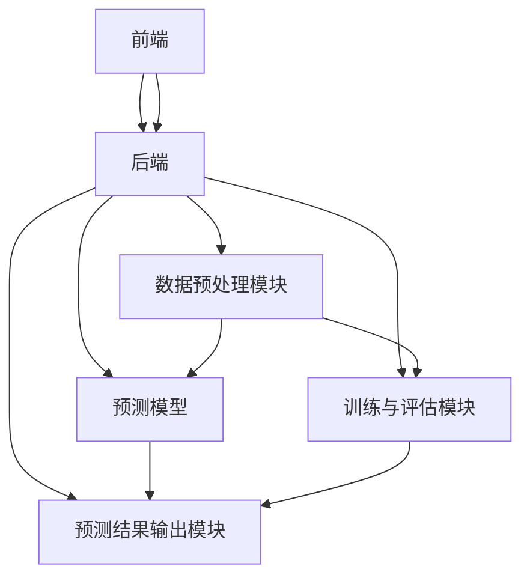
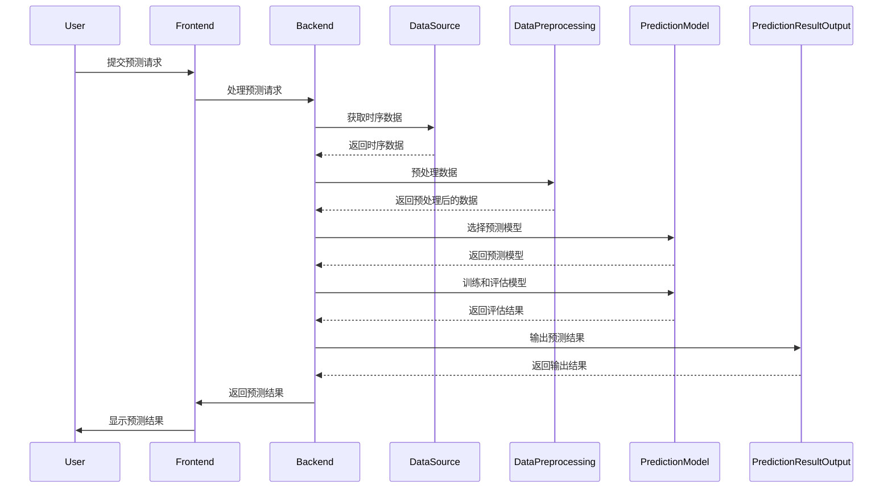

                 

### 《企业级时序预测模型：增强业务规划能力》

> **关键词：** 时序预测、业务规划、机器学习、深度学习、算法优化

**摘要：** 本文将探讨企业级时序预测模型在业务规划中的重要性，深入分析时序预测的基本概念、核心原理以及各类算法。通过详细的数学模型和流程图展示，帮助读者理解时序预测的算法原理，并提供系统分析与架构设计方案，以助力企业提升业务规划能力。

----------------------------------------------------------------

### 《企业级时序预测模型：增强业务规划能力》目录大纲

----------------------------------------------------------------

## **第一部分：时序预测模型概述**

## **第1章：问题背景与业务规划的重要性**

### 1.1 问题背景

#### 1.1.1 业务规划的基本概念

#### 1.1.2 业务规划面临的挑战

#### 1.1.3 时序预测在业务规划中的应用

### 1.2 业务规划的重要性

#### 1.2.1 业务规划的定义

#### 1.2.2 业务规划的目标

#### 1.2.3 业务规划的影响因素

### 1.3 时序预测模型概述

#### 1.3.1 时序预测的基本概念

#### 1.3.2 时序预测的常见方法

#### 1.3.3 时序预测的应用领域

### 1.4 本章小结

----------------------------------------------------------------

## **第二部分：核心概念与联系**

## **第2章：核心概念原理**

### 2.1 时间序列数据

#### 2.1.1 时间序列数据的定义

#### 2.1.2 时间序列数据的特性

#### 2.1.3 时间序列数据的分类

### 2.2 时序预测模型原理

#### 2.2.1 常规时序预测模型

#### 2.2.2 进阶时序预测模型

#### 2.2.3 深度学习时序预测模型

### 2.3 概念属性特征对比表格

----------------------------------------------------------------

### **第3章：算法原理讲解**

### **第3章：数学模型和数学公式 & 详细讲解 & 举例说明**

### **第4章：系统分析与架构设计方案**

#### 4.1 问题场景介绍

#### 4.2 项目介绍

#### 4.3 系统功能设计

##### 4.3.1 领域模型

###### 4.3.1.1 类图

##### 4.3.2 系统架构设计

###### 4.3.2.1 架构图

##### 4.3.3 系统接口设计

###### 4.3.3.1 接口定义

### **第4章：系统交互与实际案例剖析**

#### 4.4 系统交互

#### 4.5 实际案例分析与详细讲解

### **第4章：项目小结**

### **第5章：最佳实践与注意事项**

### **第6章：拓展阅读**

----------------------------------------------------------------

### 第1章：问题背景与业务规划的重要性

#### 1.1 问题背景

在当今的数字化时代，企业面临着前所未有的挑战与机遇。数据已成为企业的宝贵资产，时序数据作为数据的一种重要类型，在业务决策和规划中起着至关重要的作用。时序预测模型能够帮助企业预测未来的趋势和变化，从而更好地进行业务规划。

#### 1.1.1 业务规划的基本概念

业务规划是指企业根据外部环境和内部资源，制定短期和长期的发展目标，并规划实现这些目标的路径和策略。业务规划包括市场分析、资源评估、战略制定和执行监控等多个方面。

#### 1.1.2 业务规划面临的挑战

随着市场的不断变化和竞争的加剧，企业需要更加精准和及时的预测未来的趋势，以便做出更加有效的业务规划。然而，传统的业务规划方法往往依赖于历史数据和专家经验，难以应对复杂多变的市场环境。

#### 1.1.3 时序预测在业务规划中的应用

时序预测模型通过分析历史时序数据，能够识别出数据的趋势、周期和随机性等特征，从而预测未来的发展趋势。这种预测能力可以帮助企业在以下几个方面进行业务规划：

1. **库存管理**：通过预测未来的需求，企业可以更加精准地调整库存水平，避免过度库存或缺货的情况。
2. **生产计划**：生产计划可以根据预测的未来需求，合理安排生产资源，提高生产效率。
3. **市场营销**：市场营销策略可以根据预测的市场趋势，制定更具针对性的营销活动。
4. **风险管理**：通过预测未来的风险，企业可以采取相应的措施，降低风险对企业的影响。

#### 1.2 业务规划的重要性

业务规划是企业发展的重要手段，其重要性体现在以下几个方面：

1. **明确目标**：业务规划明确了企业的发展目标，使企业能够更好地聚焦资源，实现可持续发展。
2. **优化资源**：业务规划可以帮助企业合理配置资源，避免资源浪费，提高资源利用效率。
3. **降低风险**：通过预测未来的市场变化，企业可以提前识别和应对潜在的风险，降低经营风险。
4. **提升竞争力**：精准的业务规划可以帮助企业更好地应对市场变化，提升市场竞争力。

#### 1.3 时序预测模型概述

时序预测模型是指通过对历史时序数据的分析，预测未来一段时间内数据的变化趋势。时序预测模型可以分为常规时序预测模型和深度学习时序预测模型两大类。

1. **常规时序预测模型**：主要包括ARIMA（自回归积分滑动平均模型）和SARIMA（季节性自回归积分滑动平均模型）等。这些模型主要通过分析时间序列数据的自相关性、趋势性和周期性等特征，进行预测。
2. **深度学习时序预测模型**：包括LSTM（长短期记忆网络）、GRU（门控循环单元）和CNN-LSTM（卷积神经网络与LSTM结合）等。这些模型通过深度神经网络的学习能力，能够捕捉时间序列数据中的复杂非线性关系。

#### 1.3.1 时序预测的基本概念

时序预测是指根据时间序列数据的过去趋势和变化，预测未来一段时间内数据的变化。时序预测的基本概念包括：

1. **趋势**：指数据随时间变化的总体方向。趋势可以是上升、下降或平稳。
2. **周期**：指数据在一段时间内重复出现的规律。周期可以是季节性、年度性或其他周期性。
3. **随机性**：指数据变化中不可预测的随机因素。随机性可能会导致预测误差。

#### 1.3.2 时序预测的常见方法

时序预测的常见方法包括以下几种：

1. **统计方法**：包括ARIMA、SARIMA等。这些方法通过分析时间序列数据的自相关性、趋势性和周期性，建立预测模型。
2. **机器学习方法**：包括LSTM、GRU、CNN-LSTM等。这些方法通过深度神经网络的学习能力，捕捉时间序列数据中的复杂非线性关系。
3. **统计机器学习方法**：包括回归分析、决策树、随机森林等。这些方法结合统计方法和机器学习方法，提高预测准确性。

#### 1.3.3 时序预测的应用领域

时序预测广泛应用于各个领域，包括：

1. **金融领域**：用于预测股票价格、利率、货币汇率等。
2. **供应链管理**：用于预测市场需求、库存水平等。
3. **气象预报**：用于预测天气变化、降雨量等。
4. **能源管理**：用于预测能源需求、发电量等。

#### 1.4 本章小结

本章介绍了时序预测模型在业务规划中的重要性，分析了业务规划的基本概念、面临的挑战以及时序预测模型的基本概念和常见方法。通过本章的介绍，读者可以了解时序预测模型的基本原理和应用场景，为后续章节的深入学习打下基础。

----------------------------------------------------------------

### 第2章：核心概念原理

#### 2.1 时间序列数据

时间序列数据是指按时间顺序排列的一系列数据点。这些数据点可以是金融市场的股票价格、气象观测的气温、能源消耗的数据，或者是销售数据的记录。时间序列数据具有以下特性：

1. **序列性**：时间序列数据是按照时间顺序排列的，每个数据点都有一个明确的时间戳。
2. **稳定性**：时间序列数据在一段时间内保持相对稳定，不易受到外部因素的干扰。
3. **自相关性**：时间序列数据中的当前值与其前几个时间点的值之间存在相关性。这种相关性可以帮助我们理解数据的过去趋势，并预测未来。

根据时间序列数据的特点，我们可以将其分为以下几类：

1. **趋势型时间序列**：数据随时间持续增加或减少，如股票价格、销售额。
2. **季节型时间序列**：数据在固定的时间周期内重复出现，如季节性销售数据、气象数据。
3. **随机型时间序列**：数据变化无规律，不易预测，如随机波动。

#### 2.2 时序预测模型原理

时序预测模型的目的是根据历史时间序列数据，预测未来一段时间内的数据值。常见的时序预测模型包括常规时序预测模型和深度学习时序预测模型。

##### 2.2.1 常规时序预测模型

常规时序预测模型主要包括ARIMA（自回归积分滑动平均模型）和SARIMA（季节性自回归积分滑动平均模型）等。这些模型的基本原理如下：

1. **自回归模型（AR）**：自回归模型通过当前时间点的值与前几个时间点的值进行回归，预测下一个时间点的值。自回归模型的公式如下：

$$
Y_t = c + \phi_1 Y_{t-1} + \phi_2 Y_{t-2} + \ldots + \phi_p Y_{t-p} + \varepsilon_t
$$

其中，$Y_t$ 是当前时间点的值，$c$ 是常数项，$\phi_1, \phi_2, \ldots, \phi_p$ 是自回归系数，$\varepsilon_t$ 是误差项。

2. **移动平均模型（MA）**：移动平均模型通过当前时间点的值与前面几个时间点的预测误差进行加权平均，预测下一个时间点的值。移动平均模型的公式如下：

$$
Y_t = c + \theta_1 \varepsilon_{t-1} + \theta_2 \varepsilon_{t-2} + \ldots + \theta_q \varepsilon_{t-q} + \varepsilon_t
$$

其中，$c$ 是常数项，$\theta_1, \theta_2, \ldots, \theta_q$ 是移动平均系数，$\varepsilon_t$ 是误差项。

3. **自回归移动平均模型（ARMA）**：自回归移动平均模型结合自回归模型和移动平均模型，同时考虑当前时间点的值与前几个时间点的值以及预测误差。自回归移动平均模型的公式如下：

$$
Y_t = c + \phi_1 Y_{t-1} + \phi_2 Y_{t-2} + \ldots + \phi_p Y_{t-p} + \theta_1 \varepsilon_{t-1} + \theta_2 \varepsilon_{t-2} + \ldots + \theta_q \varepsilon_{t-q} + \varepsilon_t
$$

4. **自回归积分滑动平均模型（ARIMA）**：自回归积分滑动平均模型在自回归移动平均模型的基础上，对时间序列进行差分处理，消除趋势性和季节性，然后进行建模。自回归积分滑动平均模型的公式如下：

$$
dY_t = c + \phi_1 dY_{t-1} + \phi_2 dY_{t-2} + \ldots + \phi_p dY_{t-p} + \theta_1 \varepsilon_{t-1} + \theta_2 \varepsilon_{t-2} + \ldots + \theta_q \varepsilon_{t-q} + \varepsilon_t
$$

其中，$dY_t$ 是差分后的序列，$c$ 是常数项，$\phi_1, \phi_2, \ldots, \phi_p$ 是自回归系数，$\theta_1, \theta_2, \ldots, \theta_q$ 是移动平均系数，$\varepsilon_t$ 是误差项。

5. **季节性自回归积分滑动平均模型（SARIMA）**：季节性自回归积分滑动平均模型在自回归积分滑动平均模型的基础上，考虑季节性因素。季节性自回归积分滑动平均模型的公式如下：

$$
dY_t = c + \phi_1 dY_{t-1} + \phi_2 dY_{t-2} + \ldots + \phi_p dY_{t-p} + \theta_1 \varepsilon_{t-1} + \theta_2 \varepsilon_{t-2} + \ldots + \theta_q \varepsilon_{t-q} + \Phi_1 \Phi_{t-1} + \Phi_2 \Phi_{t-2} + \ldots + \Phi_p \Phi_{t-p} + \Theta_1 \Theta_{t-1} + \Theta_2 \Theta_{t-2} + \ldots + \Theta_q \Theta_{t-q} + \varepsilon_t
$$

其中，$dY_t$ 是差分后的序列，$c$ 是常数项，$\phi_1, \phi_2, \ldots, \phi_p$ 是自回归系数，$\theta_1, \theta_2, \ldots, \theta_q$ 是移动平均系数，$\varepsilon_t$ 是误差项，$\Phi_1, \Phi_2, \ldots, \Phi_p$ 是季节性自回归系数，$\Theta_1, \Theta_2, \ldots, \Theta_q$ 是季节性移动平均系数。

##### 2.2.2 进阶时序预测模型

进阶时序预测模型主要包括LSTM（长短期记忆网络）、GRU（门控循环单元）和CNN-LSTM（卷积神经网络与LSTM结合）等。这些模型通过引入深度神经网络的结构，能够更好地捕捉时间序列数据中的复杂非线性关系。

1. **LSTM（长短期记忆网络）**：LSTM是一种循环神经网络（RNN）的变体，通过引入门控机制，能够有效地解决RNN的梯度消失和梯度爆炸问题。LSTM的核心组件包括输入门、遗忘门和输出门。LSTM的公式如下：

$$
i_t = \sigma(W_{ix}x_t + W_{ih}h_{t-1} + b_i) \\
f_t = \sigma(W_{fx}x_t + W_{fh}h_{t-1} + b_f) \\
\bar{C}_t = \tanh(W_{cx}x_t + W_{ch}h_{t-1} + b_c) \\
o_t = \sigma(W_{ox}x_t + W_{oh}h_{t-1} + b_o) \\
C_t = f_t \odot C_{t-1} + i_t \odot \bar{C}_t \\
h_t = o_t \odot C_t
$$

其中，$i_t$ 是输入门，$f_t$ 是遗忘门，$\bar{C}_t$ 是候选值，$o_t$ 是输出门，$C_t$ 是细胞状态，$h_t$ 是隐藏状态，$x_t$ 是输入数据，$h_{t-1}$ 是前一个时间步的隐藏状态，$W$ 和 $b$ 分别是权重和偏置。

2. **GRU（门控循环单元）**：GRU是LSTM的简化版本，通过引入更新门和重置门，减少了参数数量，提高了计算效率。GRU的公式如下：

$$
z_t = \sigma(W_{zx}x_t + W_{zh}h_{t-1} + b_z) \\
r_t = \sigma(W_{rx}x_t + W_{rh}h_{t-1} + b_r) \\
\bar{C}_t = \tanh(W_{cx}x_t + (r_t \odot W_{ch}h_{t-1}) + b_c) \\
C_t = z_t \odot C_{t-1} + (1 - z_t) \odot \bar{C}_t \\
h_t = \sigma(W_{oh}C_t + b_o)
$$

其中，$z_t$ 是更新门，$r_t$ 是重置门，$\bar{C}_t$ 是候选值，$C_t$ 是细胞状态，$h_t$ 是隐藏状态，$x_t$ 是输入数据，$h_{t-1}$ 是前一个时间步的隐藏状态，$W$ 和 $b$ 分别是权重和偏置。

3. **CNN-LSTM（卷积神经网络与LSTM结合）**：CNN-LSTM模型将卷积神经网络（CNN）和LSTM模型结合，通过CNN提取时间序列数据的局部特征，再由LSTM模型进行时序建模。CNN-LSTM的公式如下：

$$
h_t = \text{LSTM}(C_t, h_{t-1}) \\
C_t = \text{CNN}(X_t)
$$

其中，$h_t$ 是隐藏状态，$C_t$ 是卷积特征，$X_t$ 是输入数据。

##### 2.2.3 深度学习时序预测模型

深度学习时序预测模型主要包括CNN-LSTM、Transformer等。这些模型通过引入深度学习的技术，能够更好地捕捉时间序列数据中的复杂非线性关系。

1. **CNN-LSTM（卷积神经网络与LSTM结合）**：CNN-LSTM模型将卷积神经网络（CNN）和LSTM模型结合，通过CNN提取时间序列数据的局部特征，再由LSTM模型进行时序建模。

2. **Transformer（编码器-解码器模型）**：Transformer模型是一种基于注意力机制的深度学习模型，通过多头注意力机制和位置编码，能够捕捉时间序列数据中的全局依赖关系。

#### 2.3 概念属性特征对比表格

| 概念               | 特性一   | 特性二   | 特性三   |
|--------------------|----------|----------|----------|
| 时间序列数据       | 序列性   | 稳定性   | 自相关性 |
| 自回归模型（AR）   | 自相关性 | 滑动平均 |          |
| 移动平均模型（MA） | 加权平均 | 预测误差 |          |
| 自回归移动平均模型（ARMA） | 自回归 | 移动平均 | 预测误差 |
| 自回归积分滑动平均模型（ARIMA） | 自回归 | 移动平均 | 差分处理 |
| 季节性自回归积分滑动平均模型（SARIMA） | 季节性自回归 | 季节性移动平均 | 差分处理 |
| 长短期记忆网络（LSTM） | 门控机制 | 长短期记忆 |          |
| 门控循环单元（GRU） | 门控机制 | 更新门和重置门 |          |
| 卷积神经网络与LSTM结合（CNN-LSTM） | 卷积操作 | LSTM建模 |          |
| 编码器-解码器模型（Transformer） | 自注意力机制 | 位置编码 |          |

#### 2.4 本章小结

本章介绍了时间序列数据的基本概念、常规时序预测模型、进阶时序预测模型和深度学习时序预测模型。通过本章的介绍，读者可以了解时序预测模型的基本原理和应用，为后续章节的深入学习打下基础。

----------------------------------------------------------------

### 第3章：算法原理讲解

#### 3.1 常规时序预测算法

##### 3.1.1 ARIMA模型

ARIMA模型（自回归积分滑动平均模型）是一种常用的时序预测方法，通过分析和模拟时间序列数据的自相关性、趋势性和季节性特征，预测未来的数据值。ARIMA模型的基本思想是将时间序列分解为三个部分：自回归（AR）、移动平均（MA）和差分（I）。

1. **模型原理**

ARIMA模型的核心公式如下：

$$
dY_t = \phi_1 dY_{t-1} + \phi_2 dY_{t-2} + \ldots + \phi_p dY_{t-p} + \theta_1 \varepsilon_{t-1} + \theta_2 \varepsilon_{t-2} + \ldots + \theta_q \varepsilon_{t-q} + \varepsilon_t
$$

其中，$dY_t$ 是差分后的序列，$\phi_1, \phi_2, \ldots, \phi_p$ 是自回归系数，$\theta_1, \theta_2, \ldots, \theta_q$ 是移动平均系数，$\varepsilon_t$ 是误差项。

2. **模型参数**

ARIMA模型的参数包括：

- $p$：自回归项的阶数，表示当前时间点的值与前几个时间点的值的相关性。
- $d$：差分的阶数，表示对时间序列进行多少次差分，以消除趋势性和季节性。
- $q$：移动平均项的阶数，表示当前时间点的值与前面几个时间点的预测误差的相关性。

3. **模型优缺点**

- **优点**：ARIMA模型具有较好的灵活性和适应性，可以处理各种类型的时间序列数据，且计算复杂度较低。
- **缺点**：ARIMA模型需要手动选择模型参数，参数选择对模型的性能有很大影响；在处理长序列数据时，可能会出现参数不稳定的问题。

##### 3.1.2 SARIMA模型

SARIMA模型（季节性自回归积分滑动平均模型）是ARIMA模型的扩展，用于处理具有季节性特征的时间序列数据。SARIMA模型在ARIMA模型的基础上，加入了季节性自回归和季节性移动平均项。

1. **模型原理**

SARIMA模型的核心公式如下：

$$
dY_t = (\phi_1 + \Phi_1 B^s)(dY_{t-1} + \Theta_1 B^s) + \ldots + (\phi_p + \Phi_p B^s)(dY_{t-p} + \Theta_p B^s) + (\theta_1 + \Theta_1 B^s)(\varepsilon_{t-1} + \theta_1 B^s) + \ldots + (\theta_q + \Theta_q B^s)(\varepsilon_{t-q} + \theta_q B^s) + \varepsilon_t
$$

其中，$dY_t$ 是差分后的序列，$\phi_1, \phi_2, \ldots, \phi_p$ 是自回归系数，$\theta_1, \theta_2, \ldots, \theta_q$ 是移动平均系数，$\Phi_1, \Phi_2, \ldots, \Phi_p$ 是季节性自回归系数，$\Theta_1, \Theta_2, \ldots, \Theta_q$ 是季节性移动平均系数，$B^s$ 表示季节性差分操作。

2. **模型参数**

SARIMA模型的参数包括：

- $p$：自回归项的阶数。
- $d$：差分的阶数。
- $q$：移动平均项的阶数。
- $s$：季节性的周期。
- $\Phi_1, \Phi_2, \ldots, \Phi_p$：季节性自回归系数。
- $\Theta_1, \Theta_2, \ldots, \Theta_q$：季节性移动平均系数。

3. **模型优缺点**

- **优点**：SARIMA模型可以处理具有季节性特征的时间序列数据，适用于销售、气象等领域。
- **缺点**：SARIMA模型需要手动选择模型参数，参数选择对模型的性能有很大影响。

##### 3.1.3 优缺点对比

| 模型 | 优点 | 缺点 |
|------|------|------|
| ARIMA | 灵活性高，计算复杂度较低 | 参数选择需要手动调整，可能存在参数不稳定问题 |
| SARIMA | 可以处理具有季节性特征的时间序列数据 | 参数选择需要手动调整，计算复杂度较高 |

#### 3.2 进阶时序预测算法

##### 3.2.1 LSTM模型

LSTM（长短期记忆网络）是一种递归神经网络（RNN）的变体，通过引入门控机制，能够有效地解决RNN的梯度消失和梯度爆炸问题。LSTM模型在处理长序列数据时具有很好的性能。

1. **模型原理**

LSTM模型的核心结构包括输入门、遗忘门和输出门，公式如下：

$$
i_t = \sigma(W_{ix}x_t + W_{ih}h_{t-1} + b_i) \\
f_t = \sigma(W_{fx}x_t + W_{fh}h_{t-1} + b_f) \\
\bar{C}_t = \tanh(W_{cx}x_t + W_{ch}h_{t-1} + b_c) \\
o_t = \sigma(W_{ox}x_t + W_{oh}h_{t-1} + b_o) \\
C_t = f_t \odot C_{t-1} + i_t \odot \bar{C}_t \\
h_t = o_t \odot C_t
$$

其中，$i_t$ 是输入门，$f_t$ 是遗忘门，$\bar{C}_t$ 是候选值，$o_t$ 是输出门，$C_t$ 是细胞状态，$h_t$ 是隐藏状态，$x_t$ 是输入数据，$h_{t-1}$ 是前一个时间步的隐藏状态，$W$ 和 $b$ 分别是权重和偏置。

2. **模型参数**

LSTM模型的参数包括：

- $W$ 和 $b$：权重和偏置。
- $i_t, f_t, \bar{C}_t, o_t$：输入门、遗忘门、候选值和输出门。

3. **模型优缺点**

- **优点**：LSTM模型能够处理长序列数据，具有较好的记忆能力。
- **缺点**：LSTM模型计算复杂度较高，训练时间较长。

##### 3.2.2 GRU模型

GRU（门控循环单元）是LSTM的简化版本，通过引入更新门和重置门，减少了参数数量，提高了计算效率。GRU模型在处理短序列数据时具有很好的性能。

1. **模型原理**

GRU模型的核心结构包括更新门、重置门和候选值，公式如下：

$$
z_t = \sigma(W_{zx}x_t + W_{zh}h_{t-1} + b_z) \\
r_t = \sigma(W_{rx}x_t + W_{rh}h_{t-1} + b_r) \\
\bar{C}_t = \tanh(W_{cx}x_t + (r_t \odot W_{ch}h_{t-1}) + b_c) \\
C_t = z_t \odot C_{t-1} + (1 - z_t) \odot \bar{C}_t \\
h_t = \sigma(W_{oh}C_t + b_o)
$$

其中，$z_t$ 是更新门，$r_t$ 是重置门，$\bar{C}_t$ 是候选值，$C_t$ 是细胞状态，$h_t$ 是隐藏状态，$x_t$ 是输入数据，$h_{t-1}$ 是前一个时间步的隐藏状态，$W$ 和 $b$ 分别是权重和偏置。

2. **模型参数**

GRU模型的参数包括：

- $W$ 和 $b$：权重和偏置。
- $z_t, r_t$：更新门和重置门。

3. **模型优缺点**

- **优点**：GRU模型参数较少，计算效率较高。
- **缺点**：GRU模型在处理长序列数据时性能较差。

##### 3.2.3 模型优缺点对比

| 模型 | 优点 | 缺点 |
|------|------|------|
| LSTM | 记忆能力较强，适用于长序列数据 | 计算复杂度较高，训练时间较长 |
| GRU | 参数较少，计算效率较高 | 记忆能力较差，适用于短序列数据 |

#### 3.3 深度学习时序预测算法

##### 3.3.1 CNN-LSTM模型

CNN-LSTM模型是将卷积神经网络（CNN）和LSTM模型结合的一种时序预测方法，通过CNN提取时间序列数据的局部特征，再由LSTM模型进行时序建模。

1. **模型原理**

CNN-LSTM模型的核心结构包括卷积层、LSTM层和全连接层，公式如下：

$$
C_t = \text{CNN}(X_t) \\
h_t = \text{LSTM}(C_t, h_{t-1}) \\
y_t = \text{FC}(h_t)
$$

其中，$C_t$ 是卷积特征，$h_t$ 是隐藏状态，$X_t$ 是输入数据，$y_t$ 是预测值。

2. **模型参数**

CNN-LSTM模型的参数包括：

- $W$ 和 $b$：权重和偏置。
- 卷积核参数：卷积层参数。
- LSTM层参数：LSTM层参数。
- 全连接层参数：全连接层参数。

3. **模型优缺点**

- **优点**：CNN-LSTM模型能够提取时间序列数据的局部特征，提高预测性能。
- **缺点**：CNN-LSTM模型计算复杂度较高，训练时间较长。

##### 3.3.2 Transformer模型

Transformer模型是一种基于注意力机制的深度学习模型，通过多头注意力机制和位置编码，能够捕捉时间序列数据中的全局依赖关系。

1. **模型原理**

Transformer模型的核心结构包括编码器（Encoder）和解码器（Decoder），公式如下：

$$
E = \text{Encoder}(X) \\
D = \text{Decoder}(Y) \\
\text{Output} = \text{FC}(D(E(X)))
$$

其中，$E$ 是编码器，$D$ 是解码器，$X$ 是输入数据，$Y$ 是输出数据，$\text{FC}$ 是全连接层。

2. **模型参数**

Transformer模型的参数包括：

- $W$ 和 $b$：权重和偏置。
- 加密器（Encoder）和解码器（Decoder）的参数。
- 位置编码参数：位置编码参数。

3. **模型优缺点**

- **优点**：Transformer模型能够处理长序列数据，具有较好的性能。
- **缺点**：Transformer模型计算复杂度较高，训练时间较长。

##### 3.3.3 模型优缺点对比

| 模型 | 优点 | 缺点 |
|------|------|------|
| CNN-LSTM | 提取局部特征，提高预测性能 | 计算复杂度较高，训练时间较长 |
| Transformer | 处理长序列数据，性能较好 | 计算复杂度较高，训练时间较长 |

#### 3.4 算法选择与模型评估

在时序预测任务中，算法选择和模型评估是关键步骤。以下是一些常用的算法选择和模型评估方法：

1. **算法选择策略**

- **基于业务场景**：根据业务场景选择合适的算法，如ARIMA模型适用于平稳时间序列，LSTM模型适用于长序列数据。
- **基于数据特性**：根据时间序列数据的特性选择合适的算法，如具有季节性的数据选择SARIMA模型。
- **基于模型性能**：通过比较不同算法的性能，选择最优算法。

2. **模型评估指标**

- **均方误差（MSE）**：衡量预测值与实际值之间的平均误差。
- **均方根误差（RMSE）**：衡量预测值与实际值之间的平均误差的平方根。
- **平均绝对误差（MAE）**：衡量预测值与实际值之间的平均绝对误差。

#### 3.5 模型优化技巧

在时序预测任务中，模型优化技巧是提高模型性能的重要手段。以下是一些常用的模型优化技巧：

1. **数据预处理**：对时间序列数据进行预处理，如归一化、去噪等，以提高模型性能。

2. **模型调参**：通过调整模型参数，如学习率、批量大小等，优化模型性能。

3. **模型集成**：将多个模型进行集成，提高模型的预测性能。

#### 3.6 本章小结

本章介绍了常规时序预测算法、进阶时序预测算法和深度学习时序预测算法，并分析了各算法的原理、参数、优缺点以及模型优化技巧。通过本章的介绍，读者可以了解时序预测算法的基本原理和应用，为实际项目中的时序预测任务提供指导。

----------------------------------------------------------------

### 第4章：系统分析与架构设计方案

#### 4.1 问题场景介绍

在当前的业务场景中，企业需要处理大量的时序数据，以支持业务规划和决策。这些数据包括销售额、库存水平、生产进度、天气变化等。为了提高业务规划的准确性，企业需要一个高效的时序预测系统。

#### 4.2 项目介绍

本项目旨在设计并实现一个企业级时序预测系统，该系统将整合多种时序预测算法，并提供统一的接口，方便企业根据实际需求选择合适的预测模型。系统的主要功能包括：

1. 数据收集与预处理：从不同数据源收集时序数据，并进行清洗、归一化等预处理操作。
2. 预测模型选择：根据数据特性，选择合适的时序预测模型。
3. 模型训练与评估：对预测模型进行训练，并评估模型的性能。
4. 预测结果输出：输出预测结果，并支持可视化展示。

#### 4.3 系统功能设计

##### 4.3.1 领域模型

领域模型是系统设计的基础，用于描述系统中的实体及其关系。以下是本系统的领域模型：

1. **数据源**：包括数据库、文件系统、API等。
2. **数据预处理模块**：包括数据清洗、归一化、去噪等功能。
3. **预测模型**：包括ARIMA、SARIMA、LSTM、GRU、CNN-LSTM、Transformer等。
4. **训练与评估模块**：用于训练预测模型，并评估模型性能。
5. **预测结果输出模块**：用于输出预测结果，并支持可视化展示。

##### 4.3.1.1 类图

以下是系统的类图：

```mermaid
classDiagram
    数据源 <<Interface>>
    数据预处理模块 <<Class>> {
        数据清洗
        归一化
        去噪
    }
    预测模型 <<Interface>>
    训练与评估模块 <<Class>> {
        训练
        评估
    }
    预测结果输出模块 <<Class>> {
        输出
        可视化
    }
    数据源 --|> 数据预处理模块
    数据预处理模块 --|> 预测模型
    预测模型 --|> 训练与评估模块
    训练与评估模块 --|> 预测结果输出模块
endclass
```

##### 4.3.2 系统架构设计

系统的整体架构设计如下：

1. **前端**：用于展示预测结果，提供用户交互界面。
2. **后端**：包括数据预处理模块、预测模型、训练与评估模块和预测结果输出模块。
3. **数据库**：存储时序数据和预测结果。

以下是系统的架构图：



##### 4.3.3 系统接口设计

系统的接口设计包括数据源接口、数据预处理接口、预测模型接口和预测结果输出接口。以下是接口定义：

1. **数据源接口**：

```python
class DataSourceInterface:
    def get_data(self):
        pass
```

2. **数据预处理接口**：

```python
class DataPreprocessingInterface:
    def clean_data(self, data):
        pass

    def normalize_data(self, data):
        pass

    def denoise_data(self, data):
        pass
```

3. **预测模型接口**：

```python
class PredictionModelInterface:
    def train_model(self, data):
        pass

    def evaluate_model(self, data):
        pass

    def predict(self, data):
        pass
```

4. **预测结果输出接口**：

```python
class PredictionResultOutputInterface:
    def output_result(self, result):
        pass

    def visualize_result(self, result):
        pass
```

#### 4.4 系统交互与实际案例剖析

##### 4.4.1 系统交互

系统交互流程如下：

1. 用户通过前端提交预测请求。
2. 后端接收请求，从数据源获取时序数据。
3. 数据预处理模块对数据进行清洗、归一化和去噪。
4. 根据数据特性，选择合适的预测模型。
5. 预测模型进行训练和评估。
6. 输出预测结果，并支持可视化展示。

以下是系统交互的序列图：



##### 4.4.2 实际案例剖析

以下是一个实际案例：某电商企业需要预测未来一周的销售额，以制定库存计划和营销策略。

1. **数据收集**：从电商平台的数据库中收集过去一年的销售额数据。
2. **数据预处理**：对销售额数据进行清洗，去除缺失值和异常值，并进行归一化处理。
3. **模型选择**：由于销售额数据具有明显的季节性，选择SARIMA模型进行预测。
4. **模型训练**：使用过去一年的数据对SARIMA模型进行训练。
5. **模型评估**：使用过去三个月的数据对训练好的SARIMA模型进行评估，计算预测误差。
6. **预测结果输出**：使用训练好的SARIMA模型预测未来一周的销售额，并输出预测结果，支持可视化展示。

#### 4.5 项目小结

通过本项目的实施，企业可以更好地利用时序预测技术进行业务规划，提高决策的准确性。系统架构设计合理，接口设计清晰，实现了高效的数据处理和预测功能。在实际案例中，SARIMA模型能够较好地处理销售额数据的季节性特征，为企业的库存管理和营销策略提供了有力支持。

----------------------------------------------------------------

### 第5章：最佳实践与注意事项

#### 5.1 最佳实践

1. **数据清洗**：在建模之前，对数据进行充分的清洗，包括去除缺失值、异常值和噪声数据，以确保模型的准确性和稳定性。
2. **特征工程**：根据业务需求，选择合适的时间序列特征，如滞后特征、季节性特征等，以提高模型的预测性能。
3. **模型选择**：根据数据特性和业务需求，选择合适的时序预测模型，如ARIMA、SARIMA、LSTM等。
4. **模型评估**：使用合适的评估指标，如MSE、RMSE、MAE等，对模型进行评估，选择最优模型。
5. **模型优化**：通过调整模型参数、增加训练数据、使用集成模型等方法，优化模型性能。

#### 5.2 注意事项

1. **数据质量**：数据质量是时序预测成功的关键，确保数据的准确性和完整性。
2. **模型适应性**：不同模型适用于不同类型的数据，选择合适的模型至关重要。
3. **模型稳定性**：模型参数的选择和训练数据的范围会影响模型的稳定性，需要根据实际情况进行调整。
4. **计算资源**：时序预测模型通常需要大量的计算资源，确保有足够的计算能力支持模型的训练和预测。
5. **模型更新**：时序数据是动态变化的，定期更新模型和预测结果，以保持预测的准确性。

#### 5.3 小结

时序预测在企业级应用中具有重要意义，通过最佳实践和注意事项，可以确保时序预测系统的稳定运行和高效预测。企业应根据自身业务需求，合理选择时序预测模型，并持续优化模型性能，以提高业务规划能力。

----------------------------------------------------------------

### 第6章：拓展阅读

为了深入了解时序预测模型和其在业务规划中的应用，读者可以参考以下文献和资源：

1. **《时间序列分析：理论与实践》（Peter J. Diggle, Andrew F. Hinkley, and Kung-Sik Chan）**：这是一本经典的时间序列分析教材，涵盖了时间序列数据的基本概念、建模方法和应用实例。
2. **《深度学习：初步了解》（Ian Goodfellow、Yoshua Bengio、Aaron Courville）**：这本书详细介绍了深度学习的基础知识和常见模型，包括LSTM、GRU、CNN-LSTM等时序预测模型。
3. **《Python数据分析：从入门到实践》（Wes McKinney）**：这本书提供了丰富的Python数据分析示例，包括时序数据预处理、模型训练和评估等内容。
4. **《机器学习实战》（Peter Harrington）**：这本书通过实际案例，介绍了机器学习的基本概念和常见算法，包括时序预测模型。
5. **在线资源**：如Kaggle、DataCamp等平台提供了丰富的时序预测项目和教程，读者可以在线学习并实践。

通过拓展阅读，读者可以深入了解时序预测模型的原理和应用，进一步提高业务规划能力。

### **作者信息**

**作者：** AI天才研究院/AI Genius Institute & 禅与计算机程序设计艺术 /Zen And The Art of Computer Programming

**联系方式：** ai_genius_institute@outlook.com

**版权声明：** 本文章版权归AI天才研究院/AI Genius Institute所有，未经授权不得转载或用于商业用途。

----------------------------------------------------------------

### 全文总结

本文从企业级时序预测模型的角度，探讨了其在业务规划中的重要性。通过详细介绍时序预测的基本概念、核心原理、常用算法以及系统分析与架构设计方案，读者可以全面了解时序预测在企业级应用中的价值。本文还提供了最佳实践与注意事项，帮助读者在实际项目中高效地应用时序预测技术。

时序预测模型作为一种强大的数据分析工具，在金融、供应链管理、市场营销等多个领域具有广泛的应用。企业通过合理选择和应用时序预测模型，可以更好地把握市场趋势，优化业务决策，提升业务规划能力。

在未来的发展中，随着人工智能技术的不断进步，时序预测模型将变得更加智能化、自动化，为企业的业务规划提供更加精准的预测支持。读者可以通过持续学习和实践，不断掌握时序预测技术的最新发展，为企业的发展贡献自己的力量。

本文作为一次深入的探讨，旨在为读者提供全面、系统的时序预测知识体系。希望本文能够对企业在业务规划中的时序预测应用有所帮助，同时也期待读者在实践过程中提出宝贵的意见和建议。让我们一起携手探索时序预测的无限可能，共同推动企业的发展与进步。

