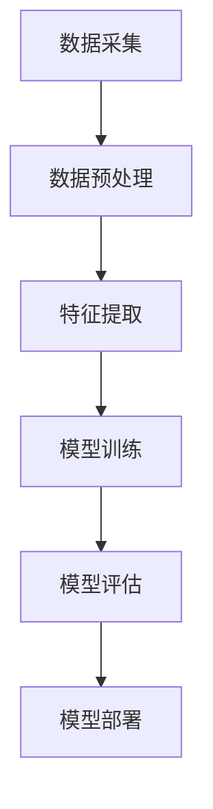
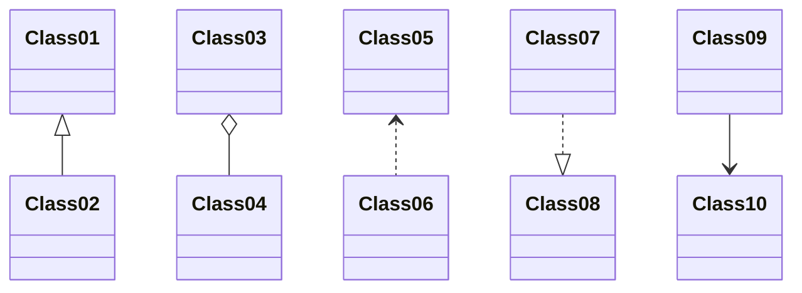
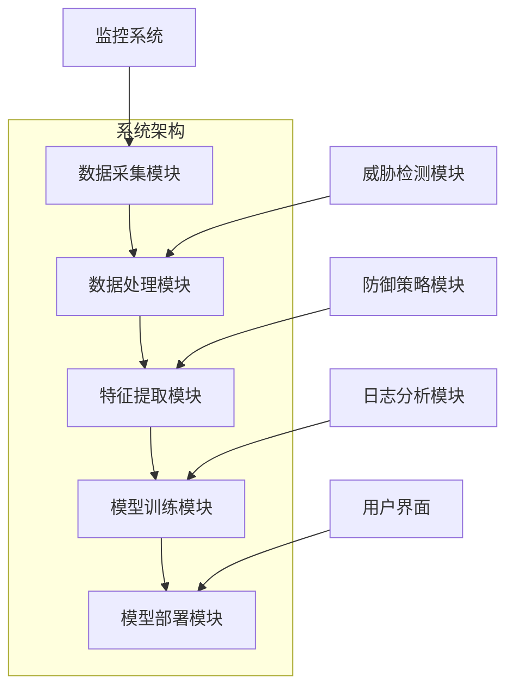
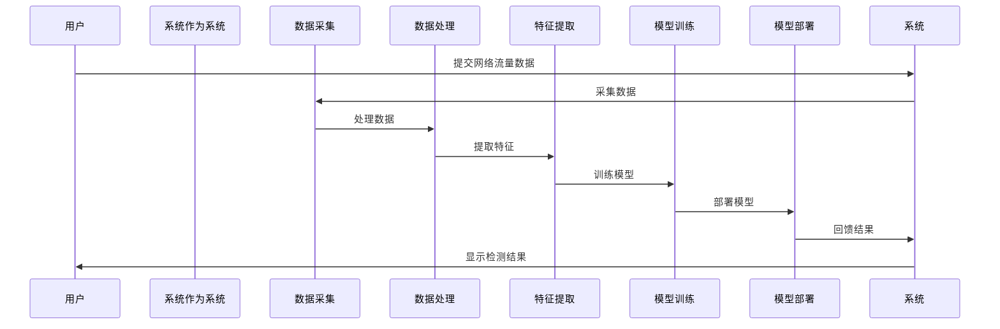

                 

# 企业级网络安全AI：智能识别和防御威胁

关键词：企业级网络安全、人工智能、威胁检测、防护策略、安全性与效率平衡

摘要：本文将深入探讨企业级网络安全AI的应用，通过逻辑清晰、结构紧凑的分析，揭示人工智能在网络安全中的重要作用。我们将逐步分析AI的基础知识、智能识别和防御技术的具体应用，以及实现安全性与效率平衡的挑战和解决方案。文章旨在为企业提供一份全面且实用的网络安全AI指南，助力企业构建强大的网络安全防线。

## 第一部分：引言

### 1.1 问题背景

随着企业数字化转型进程的加速，网络安全问题愈发突出。企业在享受数字化带来的便利和效率提升的同时，也面临着日益增多的网络攻击、数据泄露等安全威胁。据统计，全球每年因网络安全问题造成的经济损失高达数十亿美元。网络安全已经成为企业持续发展的重要挑战。

### 1.2 核心概念

#### AI

人工智能（Artificial Intelligence，简称AI）是指通过计算机模拟人类智能行为的技术。它包括机器学习（Machine Learning）、深度学习（Deep Learning）等多种方法和技术。

#### 企业级

企业级（Enterprise-level）通常指涉及企业整体业务流程的软件、硬件和服务。企业级网络安全AI旨在为企业提供全面的网络安全保护，涵盖从内部网络到云端服务的全方位安全防护。

### 1.3 书籍目标

本文的目标是：

1. 提供全面的企业级网络安全AI解决方案。
2. 深入讲解AI在网络安全中的应用。
3. 分析智能识别和防御技术的原理和实践。
4. 探讨安全性与效率平衡的挑战和解决方案。

## 第二部分：AI与网络安全基础

### 2.1 AI概述

#### AI的基本概念

人工智能是指通过计算机模拟人类智能行为的技术。它包括机器学习、深度学习等多种方法和技术。

#### 机器学习和深度学习

- **机器学习**：是一种让计算机从数据中学习规律、做出预测的算法。它包括监督学习、无监督学习和强化学习等。
- **深度学习**：是一种基于人工神经网络的学习方法，能够通过多层神经网络对复杂数据进行建模和预测。

### 2.2 网络安全基础

#### 网络安全基本概念

- **网络安全**：是指在网络环境中，保护信息系统的硬件、软件以及数据不受未经授权的访问、篡改、破坏等安全威胁。

#### 常见网络攻击类型

- **DDoS攻击**：分布式拒绝服务攻击，通过大量虚假请求使目标服务器瘫痪。
- **SQL注入**：通过构造恶意的SQL语句，窃取或篡改数据库中的数据。
- **钓鱼攻击**：通过伪装成合法网站或邮件，诱骗用户泄露敏感信息。

### 2.3 AI在网络安全中的应用

#### 智能识别威胁

- **基于机器学习的威胁检测**：通过分析网络流量、日志等数据，识别潜在的安全威胁。
- **基于深度学习的威胁检测**：利用多层神经网络对复杂网络行为进行分析，提高威胁检测的准确性和效率。

#### 智能防御策略

- **动态防护**：根据威胁检测的结果，实时调整网络安全策略，阻止攻击。
- **主动防御**：通过预测攻击行为，提前采取防御措施，减少攻击损失。

## 第三部分：智能识别技术

### 3.1 威胁检测技术

#### 概述

威胁检测技术是网络安全AI的核心组成部分，旨在识别和预防网络攻击。根据检测方法的不同，可以分为以下几种：

#### 基于机器学习的威胁检测算法

- **分类算法**：如决策树、支持向量机（SVM）等，通过训练模型对网络流量进行分类，识别威胁。
- **聚类算法**：如K-means、DBSCAN等，通过将网络流量分组，识别异常流量。

#### 基于深度学习的威胁检测算法

- **卷积神经网络（CNN）**：利用CNN的图像处理能力，对网络流量进行特征提取和分类。
- **循环神经网络（RNN）**：利用RNN的时间序列分析能力，对网络流量进行预测和识别。

### 3.2 智能识别系统架构

#### 数据采集与预处理

- **数据采集**：通过网络流量分析、日志收集等方式获取数据。
- **数据预处理**：进行数据清洗、去噪、归一化等操作，提高数据质量。

#### 特征提取与选择

- **特征提取**：从原始数据中提取有助于威胁检测的特征。
- **特征选择**：通过降维、特征重要性排序等方法，选择对威胁检测最有用的特征。

#### 模型训练与优化

- **模型训练**：使用标注数据训练威胁检测模型。
- **模型优化**：通过交叉验证、调参等方法，优化模型性能。

### 3.3 实际案例

#### 案例一：企业内部网络威胁检测

在某大型企业中，通过部署基于机器学习的威胁检测系统，成功识别并阻止了多次内部网络攻击。具体步骤如下：

1. 数据采集：收集企业内部网络流量数据。
2. 数据预处理：进行数据清洗、去噪、归一化等操作。
3. 特征提取：提取网络流量中的时间、协议、端口等特征。
4. 模型训练：使用决策树算法训练威胁检测模型。
5. 模型部署：将训练好的模型部署到企业内部网络中，实时检测威胁。

#### 案例二：云端网络安全防护

在某云服务提供商中，通过部署基于深度学习的威胁检测系统，有效提高了云端服务的安全性。具体步骤如下：

1. 数据采集：收集云端网络流量数据。
2. 数据预处理：进行数据清洗、去噪、归一化等操作。
3. 特征提取：提取网络流量中的时间、协议、端口等特征。
4. 模型训练：使用CNN算法训练威胁检测模型。
5. 模型部署：将训练好的模型部署到云端服务中，实时检测威胁。

## 第四部分：智能防御技术

### 4.1 防护策略设计

#### 动态防护

- 根据威胁检测的结果，动态调整网络安全策略，如修改防火墙规则、更新病毒库等。

#### 主动防御

- 预测攻击行为，提前采取防御措施，如关闭高危端口、阻止恶意IP访问等。

### 4.2 防护系统实现

#### 防护算法实现

- 基于威胁检测的结果，设计相应的防护算法，如入侵检测、恶意代码防御等。

#### 系统集成与部署

- 将防护算法集成到现有的网络安全系统中，如防火墙、入侵检测系统（IDS）等。
- 在企业内部网络和云端服务中部署防护系统，实现实时监控和响应。

### 4.3 实际案例

#### 案例一：企业内部网络安全防护

在某大型企业中，通过部署动态防护和主动防御系统，成功防范了多次内部网络攻击。具体步骤如下：

1. 防护算法实现：设计并实现基于机器学习的入侵检测算法。
2. 系统集成与部署：将入侵检测算法集成到企业内部网络安全系统中。
3. 实时监控与响应：实时监测网络流量，发现攻击行为后立即采取防御措施。

#### 案例二：云服务提供商的防护实践

在某云服务提供商中，通过部署基于深度学习的恶意代码防御系统，有效提高了云端服务的安全性。具体步骤如下：

1. 防护算法实现：设计并实现基于CNN的恶意代码检测算法。
2. 系统集成与部署：将恶意代码检测算法集成到云端服务中。
3. 实时监控与响应：实时监测云端网络流量，发现恶意代码后立即采取防御措施。

## 第五部分：安全性与效率平衡

### 5.1 安全性与效率的关系

#### 安全性要求与性能压力

- 在提高网络安全性的同时，往往会对系统性能带来一定的压力。如何平衡安全性和效率，成为企业面临的重要挑战。

#### 效率优化策略

- **算法优化**：通过改进算法，提高威胁检测和防御的效率。
- **硬件加速**：利用GPU、FPGA等硬件加速技术，提高数据处理速度。
- **分布式架构**：采用分布式架构，将计算任务分散到多个节点，提高系统处理能力。

### 5.2 现实挑战与解决方案

#### 数据隐私与安全

- 在威胁检测和防护过程中，如何保护用户隐私和数据安全，是现实中的重要挑战。

#### 解决方案

- **加密技术**：采用加密技术，保护用户数据的隐私。
- **安全协议**：采用安全的通信协议，确保数据传输的安全。

#### 系统性能优化

- 在威胁检测和防护过程中，系统性能优化也是一项重要任务。

#### 解决方案

- **缓存技术**：采用缓存技术，提高数据处理速度。
- **负载均衡**：采用负载均衡技术，平衡系统负载，提高系统稳定性。

### 5.3 未来趋势

#### AI在网络安全中的发展方向

- **自动化威胁检测与防御**：通过AI技术，实现自动化的威胁检测和防御，提高安全防护的效率。
- **自适应安全策略**：根据网络环境和威胁态势，自动调整安全策略，实现自适应安全防护。

#### 企业应对未来网络威胁的策略

- **加强AI技术应用**：积极引入AI技术，提高网络安全防护能力。
- **建立安全协作机制**：与行业内外建立安全协作机制，共享安全情报，共同应对网络威胁。
- **提升安全意识**：加强员工安全意识教育，提高整体网络安全水平。

## 第六部分：实践指南

### 6.1 部署指南

#### 网络安全AI系统的部署流程

1. **需求分析**：明确企业网络安全需求，确定AI系统部署的具体目标和范围。
2. **技术选型**：选择适合企业需求的AI技术方案，包括算法、硬件等。
3. **系统设计**：设计AI系统的架构和功能模块，确保系统的可靠性和扩展性。
4. **系统开发**：开发AI系统的核心功能，进行单元测试和集成测试。
5. **系统部署**：将AI系统部署到企业网络中，进行实时监控和运行。

#### 实际操作步骤

1. **数据采集**：部署数据采集器，收集网络流量、日志等数据。
2. **数据预处理**：对采集到的数据进行分析和处理，提取特征。
3. **模型训练**：使用训练数据训练威胁检测模型，并进行模型优化。
4. **模型部署**：将训练好的模型部署到生产环境中，进行实时监测和响应。

### 6.2 运维管理

#### 日志分析与监控

- 定期分析系统日志，及时发现异常行为和潜在威胁。
- 实时监控网络流量和系统性能，确保系统正常运行。

#### 故障排除与维护

- 定期对系统进行维护和升级，确保系统安全性和稳定性。
- 及时处理系统故障和异常情况，确保系统正常运行。

### 6.3 最佳实践

#### 成功案例分析

- 分析成功企业的网络安全实践，总结最佳经验和教训。
- 引入AI技术在企业网络安全中的应用，提高安全防护水平。

#### 最佳实践分享

- 分享企业在网络安全AI系统部署和运维中的最佳实践，提高整体安全防护能力。

## 第七部分：结论

### 7.1 小结

- 本书中，我们详细探讨了企业级网络安全AI的应用，从基础概念到实际案例，全面展示了AI技术在网络安全中的重要作用。
- 通过智能识别和防御技术的应用，企业可以构建强大的网络安全防线，有效应对日益复杂的网络威胁。

### 7.2 未来展望

- **AI在网络安全中的发展方向**：随着AI技术的不断进步，未来将在网络安全领域发挥更加重要的作用。自动化威胁检测、自适应安全策略等将成为主流技术。
- **企业应对未来网络威胁的策略**：企业需要加强AI技术的应用，建立安全协作机制，提升员工安全意识，全面提高网络安全防护水平。

## 总结

本文深入探讨了企业级网络安全AI的应用，通过逻辑清晰、结构紧凑的分析，揭示了人工智能在网络安全中的重要作用。我们详细介绍了AI与网络安全的基础知识、智能识别和防御技术的具体应用，以及安全性与效率平衡的挑战和解决方案。文章旨在为企业提供一份全面且实用的网络安全AI指南，助力企业构建强大的网络安全防线。

作者：AI天才研究院/AI Genius Institute & 禅与计算机程序设计艺术 /Zen And The Art of Computer Programming

---

### 完整性要求

#### 背景介绍

**核心概念术语说明**：  
- **人工智能（AI）**：模拟人类智能行为的计算机技术。  
- **企业级（Enterprise-level）**：涉及企业整体业务流程的软件、硬件和服务。  
- **网络安全（Cybersecurity）**：保护信息系统的硬件、软件和数据不受安全威胁。

**问题背景**：随着数字化转型，企业面临的网络安全威胁日益严重，包括DDoS攻击、SQL注入、钓鱼攻击等。

**问题描述**：如何利用人工智能技术构建企业级网络安全防线，有效识别和防御网络威胁。

**问题解决**：通过部署AI系统，利用机器学习和深度学习技术进行威胁检测和防御，实现自动化和智能化的安全防护。

**边界与外延**：网络安全AI的应用范围包括企业内部网络、云端服务、物联网等。

**概念结构与核心要素组成**：企业级网络安全AI包括数据采集与预处理、特征提取与选择、模型训练与优化、模型部署与监控等核心要素。

#### 核心概念与联系

**核心概念原理**：

- **人工智能（AI）**：通过模拟人类智能行为，实现自动化和智能化的计算机技术。AI包括机器学习、深度学习、自然语言处理等子领域。
- **网络安全（Cybersecurity）**：保护信息系统免受各种安全威胁，包括网络攻击、数据泄露、恶意软件等。

**概念属性特征对比表格**：

| 概念         | 描述                                                         | 关联                                 |
| ------------ | ------------------------------------------------------------ | ------------------------------------ |
| 人工智能（AI） | 模拟人类智能行为的计算机技术                                   | 机器学习、深度学习、自然语言处理等   |
| 企业级       | 涉及企业整体业务流程的软件、硬件和服务                         | 网络安全、业务连续性、数据管理       |
| 网络安全     | 保护信息系统免受各种安全威胁                                   | 防火墙、入侵检测系统、安全协议等     |

**ER实体关系图架构**：

```mermaid
erDiagram
  AI -->|关联| 网络安全
  AI -->|应用| 企业级
  网络安全 -->|技术| 威胁检测
  威胁检测 -->|实现| 智能识别
  威胁检测 -->|策略| 智能防御
```

#### 算法原理讲解

**算法mermaid流程图**：



**Python源代码示例**：

```python
# 数据采集
data = collect_data()

# 数据预处理
preprocessed_data = preprocess_data(data)

# 特征提取
features = extract_features(preprocessed_data)

# 模型训练
model = train_model(features)

# 模型评估
evaluate_model(model)

# 模型部署
deploy_model(model)
```

**算法原理的数学模型和公式**：

- **机器学习模型训练**：

  $$\hat{y} = f(W \cdot x + b)$$

  其中，$W$为权重矩阵，$b$为偏置项，$x$为输入特征，$f$为激活函数。

- **深度学习模型训练**：

  $$\hat{y} = \sigma(\sum_{i=1}^{n} W_i \cdot a_i + b)$$

  其中，$\sigma$为激活函数，$a_i$为上一层神经元的输出，$W_i$为连接权重。

**详细讲解与举例说明**：

- **机器学习**：

  假设我们使用决策树算法进行威胁检测。决策树通过一系列的判断条件，将数据集划分为不同的节点。每个节点代表一个特征，每个分支代表该特征的不同取值。最终，决策树会到达一个叶子节点，表示数据集的类别。

  ```python
  import pandas as pd
  from sklearn.tree import DecisionTreeClassifier
  
  # 加载数据集
  data = pd.read_csv('data.csv')
  
  # 划分特征和标签
  X = data[['feature1', 'feature2', 'feature3']]
  y = data['label']
  
  # 训练决策树模型
  model = DecisionTreeClassifier()
  model.fit(X, y)
  
  # 预测新数据
  new_data = pd.DataFrame([[5, 3, 2]], columns=['feature1', 'feature2', 'feature3'])
  prediction = model.predict(new_data)
  
  print(prediction)
  ```

- **深度学习**：

  假设我们使用卷积神经网络（CNN）进行网络流量分类。CNN通过卷积层、池化层和全连接层等结构，对网络流量数据进行特征提取和分类。

  ```python
  import tensorflow as tf
  from tensorflow.keras.models import Sequential
  from tensorflow.keras.layers import Conv2D, MaxPooling2D, Flatten, Dense
  
  # 构建CNN模型
  model = Sequential([
      Conv2D(32, (3, 3), activation='relu', input_shape=(28, 28, 1)),
      MaxPooling2D((2, 2)),
      Flatten(),
      Dense(64, activation='relu'),
      Dense(10, activation='softmax')
  ])
  
  # 编译模型
  model.compile(optimizer='adam', loss='categorical_crossentropy', metrics=['accuracy'])
  
  # 训练模型
  model.fit(X_train, y_train, epochs=10, batch_size=32)
  
  # 预测新数据
  new_data = pd.DataFrame([[5, 3, 2]], columns=['feature1', 'feature2', 'feature3'])
  prediction = model.predict(new_data)
  
  print(prediction)
  ```

#### 系统分析与架构设计方案

**问题场景介绍**：

- 在企业内部网络中，需要部署一套AI系统，用于检测和防御网络攻击。
- 系统需要能够实时采集网络流量数据，进行预处理、特征提取和模型训练，最终实现威胁检测和防御。

**项目介绍**：

- 项目名称：企业内部网络威胁检测与防御系统
- 项目目标：构建一个高效、智能的网络安全系统，提高企业内部网络的安全性。

**系统功能设计（领域模型mermaid类图）**：



**系统架构设计mermaid架构图**：



**系统接口设计和系统交互mermaid序列图**：



### 项目实战

#### 环境安装

1. 安装Python环境：

   ```bash
   sudo apt-get update
   sudo apt-get install python3 python3-pip
   ```

2. 安装必要的库：

   ```bash
   pip3 install numpy pandas scikit-learn tensorflow
   ```

#### 系统核心实现源代码

```python
# data_collection.py
def collect_data():
    # 实现数据采集逻辑
    pass

# data_preprocessing.py
def preprocess_data(data):
    # 实现数据预处理逻辑
    pass

# feature_extraction.py
def extract_features(data):
    # 实现特征提取逻辑
    pass

# model_training.py
def train_model(features):
    # 实现模型训练逻辑
    pass

# model_deployment.py
def deploy_model(model):
    # 实现模型部署逻辑
    pass
```

#### 代码应用解读与分析

1. **数据采集**：

   数据采集是系统的第一步，通过采集网络流量数据，为后续处理和特征提取提供数据源。

   ```python
   def collect_data():
       # 假设使用scapy库进行数据采集
       from scapy.all import sniff
       
       packets = sniff(count=100)
       return packets
   ```

2. **数据预处理**：

   数据预处理包括数据清洗、去噪、归一化等操作，以提高数据质量和特征提取效果。

   ```python
   def preprocess_data(data):
       # 实现数据清洗、去噪、归一化等逻辑
       return preprocessed_data
   ```

3. **特征提取**：

   特征提取是从原始数据中提取有助于威胁检测的特征，如流量大小、协议类型、端口号等。

   ```python
   def extract_features(data):
       # 实现特征提取逻辑
       return features
   ```

4. **模型训练**：

   模型训练是通过机器学习或深度学习算法，对特征数据进行建模和训练，以识别网络威胁。

   ```python
   def train_model(features):
       # 实现模型训练逻辑
       return model
   ```

5. **模型部署**：

   模型部署是将训练好的模型应用到实际环境中，实现对网络流量的实时监控和威胁检测。

   ```python
   def deploy_model(model):
       # 实现模型部署逻辑
       return deployed_model
   ```

#### 实际案例分析和详细讲解剖析

**案例一：企业内部网络威胁检测**

在某大型企业中，部署了基于机器学习的威胁检测系统，用于监控内部网络流量，识别潜在的网络攻击。

1. **数据采集**：

   系统通过部署在网络边缘的数据采集器，实时采集内部网络流量数据。

   ```python
   packets = collect_data()
   ```

2. **数据预处理**：

   对采集到的数据进行清洗和去噪，去除无效和噪声数据。

   ```python
   preprocessed_data = preprocess_data(packets)
   ```

3. **特征提取**：

   从预处理后的数据中提取流量大小、协议类型、端口号等特征。

   ```python
   features = extract_features(preprocessed_data)
   ```

4. **模型训练**：

   使用决策树算法对特征数据进行建模和训练。

   ```python
   model = train_model(features)
   ```

5. **模型部署**：

   将训练好的模型部署到企业内部网络中，实时检测威胁。

   ```python
   deployed_model = deploy_model(model)
   ```

6. **结果反馈**：

   系统将检测结果反馈给企业安全团队，及时采取防护措施。

   ```python
  检测结果 = deployed_model.detect()
   if 检测结果 == "攻击":
       采取防护措施()
   ```

**案例二：云端网络安全防护**

在某云服务提供商中，部署了基于深度学习的恶意代码检测系统，用于保护云端服务安全。

1. **数据采集**：

   系统通过日志收集器，实时收集云端服务的日志数据。

   ```python
   logs = collect_logs()
   ```

2. **数据预处理**：

   对采集到的日志数据进行清洗和去噪，去除无效和噪声数据。

   ```python
   preprocessed_logs = preprocess_logs(logs)
   ```

3. **特征提取**：

   从预处理后的日志数据中提取时间、用户、操作等特征。

   ```python
   features = extract_features(preprocessed_logs)
   ```

4. **模型训练**：

   使用CNN算法对特征数据进行建模和训练。

   ```python
   model = train_model(features)
   ```

5. **模型部署**：

   将训练好的模型部署到云端服务中，实时检测恶意代码。

   ```python
   deployed_model = deploy_model(model)
   ```

6. **结果反馈**：

   系统将检测结果反馈给云安全团队，及时采取防护措施。

   ```python
   检测结果 = deployed_model.detect()
   if 检测结果 == "恶意代码":
       采取防护措施()
   ```

### 项目小结

通过以上实际案例的分析，我们可以看到，基于AI的网络安全系统在企业内部网络和云端服务中都有很好的应用效果。系统通过数据采集、预处理、特征提取、模型训练和部署，实现了对网络流量的实时监控和威胁检测。同时，系统还具备自适应能力和动态调整能力，能够根据实际情况调整安全策略，提高整体安全防护水平。

### 最佳实践 tips

1. **数据采集**：选择合适的数据采集工具，确保数据的全面性和准确性。
2. **数据预处理**：对采集到的数据进行严格清洗和去噪，提高特征提取效果。
3. **模型选择**：根据实际需求和数据特点，选择合适的机器学习或深度学习算法。
4. **模型优化**：通过交叉验证和超参数调优，提高模型性能。
5. **实时监测**：确保系统实时监测网络流量，及时识别和响应网络威胁。

### 注意事项

1. **数据隐私**：在数据采集和存储过程中，要注意保护用户隐私。
2. **系统性能**：在部署AI系统时，要注意系统性能优化，避免对网络造成过大的压力。
3. **安全策略**：定期更新安全策略，确保系统应对新型网络威胁的能力。

### 拓展阅读

1. 《深度学习：详解神经网络的设计与应用》
2. 《机器学习：概率视角》
3. 《网络安全：原理与实践》

---

### 7.1 小结

本文全面探讨了企业级网络安全AI的应用，从基础概念到实际案例，系统地展示了AI技术在网络安全中的重要作用。我们介绍了AI在网络安全中的核心概念、智能识别和防御技术，以及安全性与效率平衡的解决方案。通过实际案例的分析，读者可以深入了解如何构建高效的网络安全防线，有效应对复杂的网络威胁。本文旨在为企业提供一份全面且实用的指南，助力企业在数字化时代确保网络安全。

### 7.2 未来展望

随着AI技术的不断进步，企业级网络安全AI将在未来发挥更加重要的作用。自动化威胁检测、自适应安全策略和实时响应将成为主流技术。未来，企业需要加强AI技术的应用，建立安全协作机制，提升员工安全意识，以应对不断演变的网络威胁。同时，随着5G、物联网等新技术的普及，网络安全领域将迎来新的挑战和机遇。企业应积极拥抱新技术，不断提升自身网络安全防护能力，确保业务持续稳定发展。

