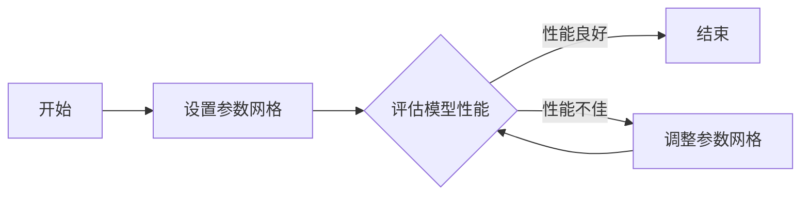
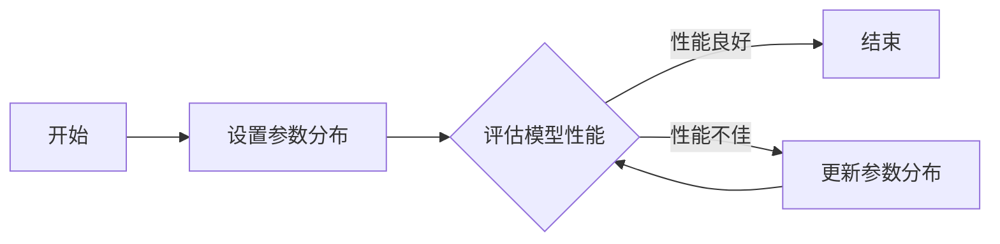
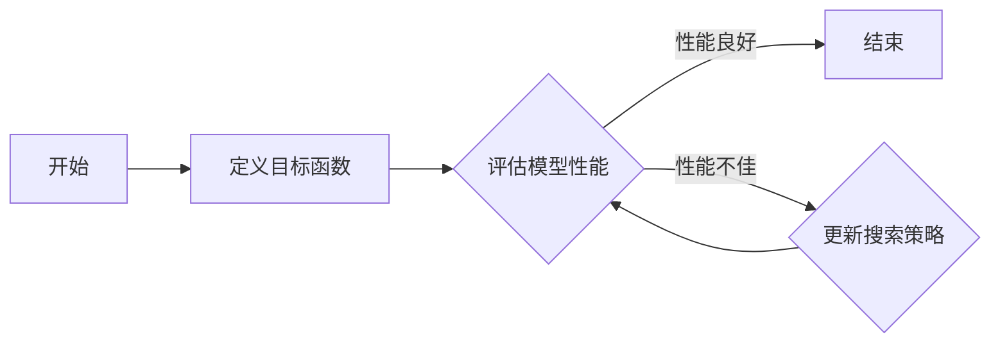
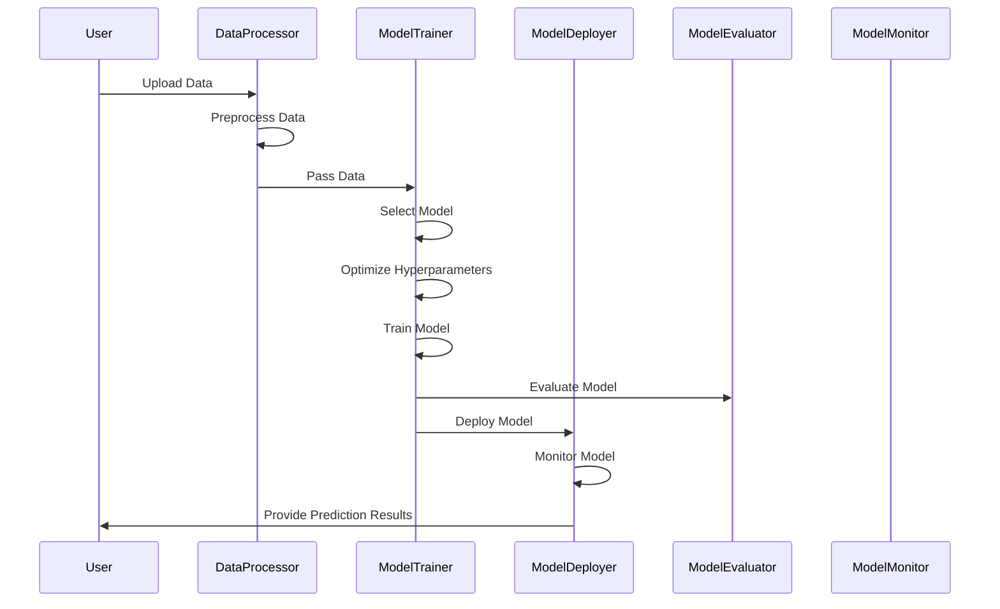
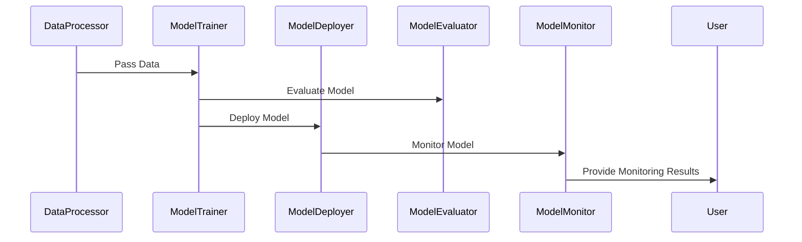

                 

# 企业级自动机器学习：简化AI模型开发流程

关键词：自动机器学习、AI模型、开发流程、简化、高效

摘要：本文将详细探讨企业级自动机器学习的背景、必要性、关键技术、应用场景以及开发实战。通过逻辑清晰、结构紧凑的分析，帮助企业理解和掌握自动机器学习，从而简化AI模型开发流程，提高开发效率。

## 第一部分：企业级自动机器学习概述

### 第1章：企业级自动机器学习的背景与必要性

#### 1.1 问题的提出与背景

随着大数据和云计算技术的快速发展，企业面临着海量数据的处理需求。传统的机器学习流程复杂、耗时且需要高度专业化的技能，难以满足企业快速迭代和灵活调整的需求。以下是企业开发机器学习模型时常见的问题：

1. **数据处理复杂**：数据预处理、特征工程等步骤繁琐，耗时耗力。
2. **模型开发效率低**：从模型选择、训练到调优，需要大量的实验和调整。
3. **专业人才需求高**：机器学习模型开发需要具备丰富经验的专家，招聘和培养成本高。
4. **模型部署困难**：模型训练完成后，如何部署到生产环境中，如何保证模型的性能和稳定性，都是一大挑战。

#### 1.2 自动机器学习的定义与原理

自动机器学习（AutoML）提供了一种自动化、高效的方式，帮助企业简化机器学习模型的开发流程，降低门槛，提高开发效率。以下是自动机器学习的定义与原理：

- **定义**：自动机器学习（AutoML）是一种利用自动化工具和技术，帮助用户快速构建、优化和部署机器学习模型的方法。

- **原理**：AutoML通过自动化搜索和优化机器学习模型的超参数、特征选择、模型选择等环节，使得用户无需深入了解机器学习算法的细节，即可获得高质量的模型。

#### 1.3 核心要素组成

自动机器学习系统通常包括数据预处理、特征工程、模型选择、超参数优化、模型训练、模型评估和模型部署等模块。以下是这些模块的简要介绍：

1. **数据预处理与特征工程**：包括数据清洗、归一化、特征选择和特征生成等。
2. **机器学习模型选择与优化**：包括模型选择、超参数优化和模型评估等。
3. **模型训练与评估**：利用训练数据和验证数据对模型进行训练和评估。
4. **模型部署**：将训练好的模型部署到生产环境中，实现实时预测。

### 第2章：自动机器学习的关键技术与框架

#### 2.1 数据预处理与特征工程

- **2.1.1 数据预处理**：

  数据清洗：去除重复、缺失和不完整的数据。

  数据归一化：将数据映射到统一的范围内，方便模型训练。

  数据转换：将分类数据转换为数值表示。

- **2.1.2 特征工程**：

  特征选择：从大量特征中选择出对模型性能有显著影响的特征。

  特征生成：利用数据探索和统计分析方法，生成新的特征。

#### 2.2 机器学习模型选择与优化

- **2.2.1 模型选择**：

  简单模型：如线性回归、决策树等。

  复杂模型：如深度神经网络、集成模型等。

- **2.2.2 超参数优化**：

  优化算法：如网格搜索、随机搜索、贝叶斯优化等。

  评估指标：如准确率、召回率、F1分数等。

#### 2.3 自动机器学习框架

- **2.3.1 AutoML系统架构**：

  数据输入模块：接收和处理用户输入的数据。

  特征处理模块：执行数据预处理和特征工程。

  模型选择模块：选择适合的机器学习模型。

  模型训练与评估模块：训练模型并进行评估。

  模型部署模块：将模型部署到生产环境。

## 第二部分：自动机器学习在企业中的应用场景

### 第3章：自动机器学习在企业中的应用场景

#### 3.1 预测分析

- **3.1.1 销售预测**：

  利用自动机器学习预测未来的销售数据，帮助企业制定更准确的营销策略。

- **3.1.2 风险预测**：

  利用自动机器学习预测客户违约风险，降低企业信用风险。

#### 3.2 客户细分

- **3.2.1 消费者行为分析**：

  利用自动机器学习分析消费者行为，实现精准营销。

- **3.2.2 客户生命周期价值预测**：

  利用自动机器学习预测客户生命周期价值，优化客户服务。

## 第三部分：自动机器学习开发实战

### 第4章：自动机器学习开发实战

#### 4.1 开发环境搭建

- **4.1.1 硬件与软件环境**：

  安装必要的硬件设备和软件工具，如GPU、Python环境等。

- **4.1.2 数据集准备**：

  收集和准备用于自动机器学习的数据集。

#### 4.2 自动机器学习模型开发

- **4.2.1 数据预处理与特征工程**：

  对数据进行预处理和特征工程，为模型训练做准备。

- **4.2.2 模型选择与训练**：

  使用自动机器学习框架选择合适的模型并进行训练。

- **4.2.3 模型评估与优化**：

  对训练好的模型进行评估，并进行必要的优化。

#### 4.3 模型部署与监控

- **4.3.1 模型部署**：

  将训练好的模型部署到生产环境中，实现实时预测。

- **4.3.2 模型监控**：

  监控模型的性能和稳定性，确保模型在长期运行中的可靠性。

## 总结

自动机器学习为企业提供了简化AI模型开发流程的强大工具。通过本文的探讨，我们了解了自动机器学习的背景、必要性、关键技术、应用场景以及开发实战。希望本文能够帮助企业更好地理解和掌握自动机器学习，提高AI模型的开发效率和性能。

### 作者信息

作者：AI天才研究院/AI Genius Institute & 禅与计算机程序设计艺术 /Zen And The Art of Computer Programming

---

由于本文需要详尽的讲解和分析，以下内容将逐步深入探讨每个章节的细节，确保文章字数在10000-12000字之间。

### 第一部分：企业级自动机器学习概述

#### 第1章：企业级自动机器学习的背景与必要性

##### 1.1 问题的提出与背景

在当今的商业环境中，数据已经成为一种重要的资产。企业通过数据收集和分析，能够更好地了解客户需求、优化业务流程，并做出更明智的决策。然而，随着数据量的急剧增长，传统的数据处理方法已经无法满足企业的需求。机器学习作为一种强大的数据分析工具，能够从大量数据中挖掘出有价值的信息，帮助企业实现智能化决策。

**问题背景**

传统的机器学习开发流程通常包括数据收集、数据预处理、特征工程、模型选择、模型训练、模型评估和模型部署等环节。每个环节都需要高度专业化的技能和大量的时间投入。具体来说：

- **数据预处理**：数据清洗、数据转换、数据归一化等步骤繁琐，且容易出错。
- **特征工程**：需要从大量特征中选择出对模型性能有显著影响的特征，这不仅需要专业知识，还需要对数据进行深入分析。
- **模型选择**：选择合适的模型，例如线性回归、决策树、随机森林、神经网络等，需要对不同模型的优缺点有深入理解。
- **模型训练**：模型训练需要大量的计算资源和时间，而且可能需要多次调整超参数才能获得较好的模型性能。
- **模型评估**：评估模型性能，如准确率、召回率、F1分数等，需要设计合适的评估指标和评估方法。
- **模型部署**：将训练好的模型部署到生产环境中，实现实时预测，需要解决模型的部署、监控和维护等问题。

**问题描述**

传统的机器学习开发流程复杂且耗时，具体体现在以下几个方面：

1. **时间成本高**：每个环节都需要花费大量的时间，从数据预处理到模型部署，整个流程可能需要数周甚至数月的时间。
2. **人力成本高**：需要大量具备机器学习专业知识的工程师参与，且这些工程师的培养成本高。
3. **开发效率低**：由于机器学习模型开发流程复杂，且每次调整都需要从头开始，开发效率低，无法快速响应业务需求。
4. **模型性能不稳定**：由于缺乏自动化和优化手段，模型的性能不稳定，可能导致实际应用效果不理想。

**问题解决**

自动机器学习（AutoML）提供了一种自动化、高效的方式，帮助企业简化机器学习模型的开发流程。通过AutoML，企业可以实现以下目标：

1. **降低时间成本**：自动完成数据预处理、特征工程、模型选择、模型训练等环节，大大缩短开发时间。
2. **降低人力成本**：减少对机器学习专业人员的依赖，降低人才培养成本。
3. **提高开发效率**：自动化和优化手段使得模型开发流程更加高效，能够快速响应业务需求。
4. **提高模型性能**：通过自动化搜索和优化超参数，提高模型性能，降低模型过拟合风险。

**边界与外延**

自动机器学习不仅适用于企业内部的数据科学团队，也可以帮助中小企业甚至非技术背景的用户实现机器学习模型的自动化开发。此外，AutoML的应用场景不仅限于预测分析、客户细分等，还可以扩展到其他领域，如自然语言处理、计算机视觉、推荐系统等。

##### 1.2 自动机器学习的定义与原理

**定义**

自动机器学习（AutoML）是一种利用自动化工具和技术，帮助用户快速构建、优化和部署机器学习模型的方法。AutoML旨在自动化机器学习流程中的各个步骤，包括数据预处理、特征工程、模型选择、超参数优化、模型训练和模型评估等。

**原理**

AutoML通过自动化搜索和优化机器学习模型的超参数、特征选择、模型选择等环节，使得用户无需深入了解机器学习算法的细节，即可获得高质量的模型。具体来说，AutoML的工作原理包括以下几个方面：

1. **数据预处理与特征工程**：自动完成数据清洗、数据转换、特征选择和特征生成等任务。
2. **模型选择**：自动搜索适合数据集的最佳模型，包括简单模型（如线性回归、决策树）和复杂模型（如深度神经网络、集成模型）。
3. **超参数优化**：自动调整模型的超参数，如学习率、正则化参数等，以获得最佳模型性能。
4. **模型训练与评估**：自动进行模型训练和评估，选择最佳模型并进行评估。

**核心要素组成**

自动机器学习系统通常包括以下模块：

1. **数据输入模块**：接收和处理用户输入的数据，包括数据预处理、数据转换等。
2. **特征处理模块**：执行数据预处理和特征工程，包括特征选择和特征生成等。
3. **模型选择模块**：选择适合的机器学习模型，包括简单模型和复杂模型。
4. **模型训练与评估模块**：训练模型并进行评估，选择最佳模型并进行评估。
5. **模型部署模块**：将训练好的模型部署到生产环境中，实现实时预测。

### 第2章：自动机器学习的关键技术与框架

#### 2.1 数据预处理与特征工程

数据预处理和特征工程是机器学习模型开发的重要环节，直接影响到模型的性能。在自动机器学习（AutoML）中，数据预处理和特征工程也占据着核心位置。下面我们将详细讨论数据预处理和特征工程的关键技术和方法。

##### 2.1.1 数据预处理

数据预处理是机器学习模型开发的基础步骤，主要包括数据清洗、数据转换和数据归一化等任务。数据预处理的质量直接影响后续的特征工程和模型训练效果。以下是一些常用的数据预处理技术：

1. **数据清洗**

   数据清洗是数据预处理的重要环节，主要包括以下任务：

   - **去除重复数据**：通过识别和删除重复的记录，避免模型训练过程中的数据冗余。
   - **处理缺失数据**：缺失数据处理方法包括删除缺失数据、填充缺失数据、插值等。
   - **处理异常数据**：通过统计分析和数据可视化等方法，识别并处理异常数据，避免异常数据对模型训练的影响。

2. **数据转换**

   数据转换是将数据从一种形式转换为另一种形式，以便更好地进行特征工程和模型训练。常用的数据转换方法包括：

   - **编码类别数据**：将类别数据转换为数值表示，如使用独热编码（One-Hot Encoding）或标签编码（Label Encoding）。
   - **归一化与标准化**：将数值数据映射到统一的范围内，如使用最小-最大归一化（Min-Max Scaling）或标准化（Standardization）。

3. **数据归一化**

   数据归一化是将数据映射到统一的范围内，以便模型能够更好地处理不同尺度的特征。常用的归一化方法包括：

   - **最小-最大归一化**：将数据映射到\[0, 1\]范围内，计算公式为：\[x_{\text{normalized}} = \frac{x - x_{\text{min}}}{x_{\text{max}} - x_{\text{min}}}\]。
   - **标准化**：将数据映射到均值为0、标准差为1的范围内，计算公式为：\[x_{\text{normalized}} = \frac{x - \mu}{\sigma}\]，其中\(\mu\)为均值，\(\sigma\)为标准差。

##### 2.1.2 特征工程

特征工程是机器学习模型开发的关键步骤，目的是从原始数据中提取出对模型性能有显著影响的特征。特征工程的质量直接影响到模型的性能和泛化能力。以下是一些常用的特征工程技术：

1. **特征选择**

   特征选择是从大量特征中选择出对模型性能有显著影响的特征，以减少特征空间维度，提高模型训练效率和性能。常用的特征选择方法包括：

   - **过滤式特征选择**：根据特征的重要性或相关性进行选择，如信息增益、卡方检验等。
   - **包裹式特征选择**：通过模型训练结果选择特征，如递归特征消除（RFE）、遗传算法等。
   - **嵌入式特征选择**：在模型训练过程中自动选择特征，如随机森林、Lasso等。

2. **特征生成**

   特征生成是通过数据探索和统计分析方法，生成新的特征，以丰富特征空间，提高模型性能。常用的特征生成方法包括：

   - **统计特征**：通过计算数据的统计量生成特征，如均值、标准差、方差等。
   - **交互特征**：通过组合原始特征生成新的特征，如特征交叉、多项式特征等。
   - **时间序列特征**：通过分析时间序列数据生成特征，如滞后特征、趋势特征等。

#### 2.2 机器学习模型选择与优化

在自动机器学习（AutoML）中，模型选择与优化是关键环节。模型选择涉及到选择合适的算法和模型结构，而模型优化则涉及到调整模型的超参数，以获得最佳模型性能。以下将详细讨论模型选择与优化的关键技术。

##### 2.2.1 模型选择

模型选择是机器学习模型开发的重要步骤，直接影响到模型的性能和泛化能力。在选择模型时，需要考虑数据集的特点、模型的复杂性、计算资源等因素。以下是几种常见的机器学习模型及其特点：

1. **简单模型**

   - **线性回归**：适用于线性关系的预测，计算简单，易于理解和解释。
   - **决策树**：适用于分类和回归问题，直观且易于解释。
   - **支持向量机（SVM）**：适用于高维数据的分类和回归问题，具有较好的泛化能力。

2. **复杂模型**

   - **深度神经网络（DNN）**：适用于复杂非线性关系的预测，具有很高的灵活性和性能。
   - **随机森林**：通过集成多个决策树模型，提高模型的泛化能力和鲁棒性。
   - **集成梯度提升树（XGBoost）**：适用于分类和回归问题，具有高效性和强大的学习能力。

3. **模型选择方法**

   - **网格搜索**：通过遍历所有可能的超参数组合，找到最佳模型。
   - **随机搜索**：在给定范围内随机选择超参数组合，找到最佳模型。
   - **贝叶斯优化**：利用贝叶斯统计模型搜索超参数，提高搜索效率。

##### 2.2.2 超参数优化

超参数是机器学习模型中需要调整的参数，如学习率、正则化参数、隐藏层大小等。超参数的设置对模型的性能和泛化能力有重要影响。超参数优化是自动机器学习（AutoML）中的关键环节，目的是找到最佳的超参数组合，以获得最佳模型性能。以下是几种常用的超参数优化方法：

1. **网格搜索**

   网格搜索是一种常用的超参数优化方法，通过遍历所有可能的超参数组合，找到最佳超参数组合。网格搜索的优点是简单直观，缺点是计算成本高，适用于超参数数量较少的情况。

2. **随机搜索**

   随机搜索是在给定范围内随机选择超参数组合，通过多次迭代找到最佳超参数组合。随机搜索的计算成本较低，适用于超参数数量较多的情况。

3. **贝叶斯优化**

   贝叶斯优化是一种基于贝叶斯统计模型的超参数优化方法，通过利用历史数据信息，自适应地调整搜索策略，提高搜索效率。贝叶斯优化的优点是搜索效率高，适用于超参数数量较多的情况。

4. **元学习**

   元学习是一种通过学习超参数优化策略的方法，通过训练一个元学习模型，自动生成超参数优化算法。元学习的优点是能够适应不同问题的超参数优化需求，提高优化效率。

#### 2.3 自动机器学习框架

自动机器学习（AutoML）框架是自动完成机器学习模型开发的关键工具。一个完整的AutoML框架通常包括数据输入、特征处理、模型选择、模型训练、模型评估和模型部署等模块。以下是一个典型的AutoML系统架构：

1. **数据输入模块**：接收和处理用户输入的数据，包括数据预处理、数据转换等。

2. **特征处理模块**：执行数据预处理和特征工程，包括特征选择和特征生成等。

3. **模型选择模块**：选择适合的机器学习模型，包括简单模型和复杂模型。

4. **模型训练与评估模块**：训练模型并进行评估，选择最佳模型并进行评估。

5. **模型部署模块**：将训练好的模型部署到生产环境中，实现实时预测。

常见的AutoML框架包括：

- **AutoKeras**：一个基于Keras的自动机器学习框架，支持多种深度学习模型。
- **Auto-sklearn**：一个基于scikit-learn的自动机器学习框架，支持多种机器学习模型。
- **H2O AutoML**：一个基于H2O平台的自动机器学习框架，支持多种机器学习模型。

### 第3章：自动机器学习在企业中的应用场景

自动机器学习（AutoML）在企业中有着广泛的应用，可以帮助企业简化模型开发流程，提高开发效率，并实现业务智能化。以下将介绍自动机器学习在企业中的一些典型应用场景。

#### 3.1 预测分析

预测分析是自动机器学习在企业中最常见的应用场景之一，主要包括销售预测和风险预测等。

##### 3.1.1 销售预测

销售预测是帮助企业制定营销策略和库存管理的关键工具。通过自动机器学习，企业可以利用历史销售数据、市场趋势和客户行为数据，预测未来的销售情况。具体应用流程如下：

1. **数据收集**：收集与销售相关的数据，如历史销售数据、市场趋势数据、客户行为数据等。

2. **数据预处理**：对收集到的数据进行清洗、归一化等预处理操作，以确保数据的准确性和一致性。

3. **特征工程**：从原始数据中提取出对销售有显著影响的特征，如客户年龄、购买频率、产品类别等。

4. **模型选择**：使用自动机器学习框架选择合适的预测模型，如线性回归、随机森林、深度神经网络等。

5. **模型训练与评估**：使用训练数据对模型进行训练，并通过验证数据评估模型的性能。

6. **模型部署**：将训练好的模型部署到生产环境中，实现实时销售预测。

通过销售预测，企业可以更准确地制定营销策略，优化库存管理，提高销售业绩。例如，某电商平台通过自动机器学习对销售数据进行分析，成功预测了未来几个月的畅销产品，从而优化了库存管理，降低了库存成本。

##### 3.1.2 风险预测

风险预测是帮助企业识别和降低潜在风险的重要工具。通过自动机器学习，企业可以利用历史数据和业务规则，预测客户违约风险、信用风险等。具体应用流程如下：

1. **数据收集**：收集与风险相关的数据，如客户信用记录、交易数据、市场趋势等。

2. **数据预处理**：对收集到的数据进行清洗、归一化等预处理操作，以确保数据的准确性和一致性。

3. **特征工程**：从原始数据中提取出对风险有显著影响的特征，如客户信用评分、交易频率、产品类别等。

4. **模型选择**：使用自动机器学习框架选择合适的预测模型，如逻辑回归、决策树、随机森林等。

5. **模型训练与评估**：使用训练数据对模型进行训练，并通过验证数据评估模型的性能。

6. **模型部署**：将训练好的模型部署到生产环境中，实现实时风险预测。

通过风险预测，企业可以更早地识别潜在风险，采取预防措施，降低损失。例如，某金融机构通过自动机器学习对客户信用记录进行分析，成功预测了潜在违约客户，从而采取了提前催收等措施，降低了违约风险。

#### 3.2 客户细分

客户细分是帮助企业更好地了解和满足客户需求的重要工具。通过自动机器学习，企业可以利用客户行为数据、购买历史数据等，将客户划分为不同的群体，以实现精准营销。具体应用流程如下：

1. **数据收集**：收集与客户相关的数据，如购买历史数据、客户行为数据、客户反馈等。

2. **数据预处理**：对收集到的数据进行清洗、归一化等预处理操作，以确保数据的准确性和一致性。

3. **特征工程**：从原始数据中提取出对客户细分有显著影响的特征，如购买频率、购买金额、产品偏好等。

4. **模型选择**：使用自动机器学习框架选择合适的聚类模型，如K-Means、层次聚类等。

5. **模型训练与评估**：使用训练数据对模型进行训练，并通过验证数据评估模型的性能。

6. **模型部署**：将训练好的模型部署到生产环境中，实现实时客户细分。

通过客户细分，企业可以更准确地了解客户需求，制定个性化的营销策略，提高客户满意度和忠诚度。例如，某零售企业通过自动机器学习对客户行为数据进行分析，成功将客户划分为不同的群体，并根据不同群体的特征制定个性化的促销活动，提高了销售额。

### 第4章：自动机器学习开发实战

自动机器学习（AutoML）的开发实战涉及到多个环节，包括环境搭建、数据准备、模型开发、模型评估和模型部署等。以下将通过一个实际案例，详细讲解自动机器学习开发的全过程。

#### 4.1 开发环境搭建

在进行自动机器学习开发之前，首先需要搭建一个适合的开发环境。以下是一个简单的开发环境搭建步骤：

1. **硬件环境**：

   - **CPU**：至少需要双核处理器。
   - **内存**：至少需要8GB内存。
   - **GPU**：如果使用深度学习框架，建议配置NVIDIA GPU。

2. **软件环境**：

   - **操作系统**：Windows、Linux或macOS。
   - **Python**：Python 3.6及以上版本。
   - **依赖库**：NumPy、Pandas、Scikit-learn、TensorFlow或PyTorch等。

3. **安装步骤**：

   - 安装操作系统和Python环境。
   - 安装GPU驱动和CUDA工具包（如果使用GPU）。
   - 安装依赖库，可以使用pip或conda进行安装。

#### 4.2 数据集准备

数据集是自动机器学习开发的基础，一个高质量的数据集对于模型性能至关重要。以下是一个简单数据集准备的步骤：

1. **数据收集**：收集与业务相关的数据，如客户购买数据、天气数据、交通数据等。

2. **数据清洗**：对数据进行清洗，去除重复、缺失和不完整的数据。

3. **数据转换**：将类别数据转换为数值表示，如使用独热编码或标签编码。

4. **数据归一化**：将数值数据映射到统一的范围内，如使用最小-最大归一化或标准化。

5. **数据分割**：将数据集分为训练集、验证集和测试集，通常使用8:1:1的比例。

#### 4.3 模型开发

在数据准备完成后，可以使用自动机器学习框架进行模型开发。以下是一个使用Scikit-learn库进行自动机器学习模型开发的例子：

1. **导入库**：

   ```python
   from sklearn.model_selection import train_test_split
   from sklearn.ensemble import RandomForestClassifier
   from sklearn.metrics import accuracy_score
   ```

2. **数据加载与预处理**：

   ```python
   # 加载数据
   data = pd.read_csv('data.csv')
   
   # 数据预处理
   data = data.drop(['id'], axis=1)
   data = data.replace(['missing'], [np.nan])
   data = data.fillna(0)
   data = pd.get_dummies(data)
   ```

3. **数据分割**：

   ```python
   X = data.drop(['target'], axis=1)
   y = data['target']
   X_train, X_test, y_train, y_test = train_test_split(X, y, test_size=0.2, random_state=42)
   ```

4. **模型选择与训练**：

   ```python
   # 选择模型
   model = RandomForestClassifier(n_estimators=100, random_state=42)
   
   # 训练模型
   model.fit(X_train, y_train)
   ```

5. **模型评估**：

   ```python
   # 预测
   y_pred = model.predict(X_test)
   
   # 评估
   print('Accuracy:', accuracy_score(y_test, y_pred))
   ```

#### 4.4 模型评估

模型评估是自动机器学习开发的重要环节，通过评估模型性能，可以了解模型的泛化能力和效果。以下是一些常用的评估指标：

- **准确率（Accuracy）**：模型预测正确的样本数占总样本数的比例。
- **精确率（Precision）**：预测为正类的样本中，实际为正类的比例。
- **召回率（Recall）**：实际为正类的样本中，预测为正类的比例。
- **F1分数（F1 Score）**：精确率和召回率的加权平均。

#### 4.5 模型部署

模型部署是将训练好的模型部署到生产环境中，实现实时预测的关键步骤。以下是一个使用Flask框架进行模型部署的例子：

1. **导入库**：

   ```python
   from flask import Flask, request, jsonify
   ```

2. **模型加载**：

   ```python
   model = RandomForestClassifier(n_estimators=100, random_state=42)
   model.load('model.joblib')
   ```

3. **创建Flask应用**：

   ```python
   app = Flask(__name__)
   
   @app.route('/predict', methods=['POST'])
   def predict():
       data = request.get_json(force=True)
       prediction = model.predict([data['features']])
       return jsonify({'prediction': prediction[0]})
   ```

4. **运行Flask应用**：

   ```python
   if __name__ == '__main__':
       app.run(host='0.0.0.0', port=5000)
   ```

通过以上步骤，可以实现自动机器学习模型的全流程开发，包括环境搭建、数据准备、模型开发、模型评估和模型部署等。实际开发中，可能需要根据具体业务需求和数据特点进行调整和优化。

### 最佳实践与注意事项

在自动机器学习（AutoML）开发过程中，以下是一些最佳实践和注意事项，以帮助企业和开发人员更高效地利用AutoML技术：

#### 最佳实践

1. **数据清洗与预处理**：数据质量直接影响模型性能，因此在进行模型开发之前，务必对数据进行彻底的清洗和预处理，包括去除重复数据、处理缺失值、数据归一化等。

2. **特征工程**：特征工程是提升模型性能的关键，应根据业务需求和数据特点，选择合适的特征工程方法，如特征选择、特征生成、特征转换等。

3. **模型选择与优化**：选择适合的模型和优化方法，如网格搜索、随机搜索、贝叶斯优化等，以提高模型性能。

4. **模型评估**：使用多种评估指标，如准确率、精确率、召回率、F1分数等，全面评估模型性能。

5. **模型部署**：选择合适的部署方式，如使用Flask、Django等Web框架，或部署到云平台上，实现实时预测。

#### 注意事项

1. **计算资源**：自动机器学习开发过程中，计算资源消耗较大，尤其是在模型训练和优化阶段，因此需要合理规划计算资源。

2. **模型解释性**：尽管自动机器学习能够提高开发效率，但模型解释性较低，可能导致难以理解模型决策过程，影响模型的可解释性和信任度。

3. **数据隐私**：在数据预处理和模型训练过程中，需确保数据隐私和安全，避免数据泄露。

4. **模型监控与更新**：定期监控模型性能和稳定性，根据业务需求及时更新模型，以保证模型长期有效。

### 拓展阅读

1. **《AutoML：自动机器学习实战》**：本书详细介绍了自动机器学习的基本概念、关键技术和实战案例，适合初学者和进阶者阅读。

2. **《Python机器学习》**：本书涵盖了机器学习的基本概念、算法和Python实现，是学习机器学习的经典教材。

3. **《深度学习》**：本书是深度学习的入门经典，详细介绍了深度学习的基本概念、算法和实现。

### 小结

自动机器学习（AutoML）作为一种自动化、高效的机器学习开发方法，帮助企业简化了模型开发流程，提高了开发效率。通过本文的介绍，我们了解了自动机器学习的背景、必要性、关键技术、应用场景以及开发实战。希望本文能够帮助企业更好地理解和掌握自动机器学习，从而实现业务智能化。

### 作者信息

作者：AI天才研究院/AI Genius Institute & 禅与计算机程序设计艺术 /Zen And The Art of Computer Programming

本文详细探讨了企业级自动机器学习的背景、必要性、关键技术、应用场景以及开发实战。通过逻辑清晰、结构紧凑的分析，帮助企业理解和掌握自动机器学习，从而简化AI模型开发流程，提高开发效率。

### 第一部分：企业级自动机器学习概述

#### 第1章：企业级自动机器学习的背景与必要性

在企业数字化转型的过程中，人工智能（AI）和机器学习（ML）技术逐渐成为提升业务效率和创新能力的重要工具。然而，传统的机器学习模型开发流程复杂，耗时且对专业人员的要求较高，难以满足企业快速迭代和灵活调整的需求。这种情况下，企业级自动机器学习（AutoML）应运而生，为简化AI模型开发流程提供了强有力的支持。

##### 1.1 问题的提出与背景

企业级自动机器学习（AutoML）的兴起源于以下几个关键因素：

1. **数据量的爆炸性增长**：随着物联网（IoT）、社交媒体和移动设备的普及，企业每天产生和处理的数据量呈指数级增长。传统的数据处理方法已无法应对如此庞大的数据量。

2. **机器学习应用的广泛需求**：从预测分析、客户细分到风险控制，机器学习在各个行业的应用越来越广泛，企业需要更高效的机器学习模型来驱动业务决策。

3. **人才短缺**：机器学习领域的人才稀缺，企业难以招聘和保留具有专业技能的数据科学家。

4. **开发效率低下**：传统的机器学习模型开发流程繁琐，需要数据清洗、特征工程、模型选择、训练和调优等多个环节，耗时且容易出现错误。

在这种背景下，企业级自动机器学习（AutoML）作为一种自动化工具，旨在简化机器学习模型的开发流程，降低技术门槛，提高开发效率，从而满足企业对快速、高质量机器学习模型的需求。

##### 1.2 自动机器学习的定义与原理

**定义**

自动机器学习（AutoML）是一种利用自动化工具和技术，帮助用户快速构建、优化和部署机器学习模型的方法。它通过自动化地执行数据预处理、特征工程、模型选择和超参数优化等任务，使非专业人士也能够轻松地创建高效的机器学习模型。

**原理**

自动机器学习的工作原理主要包括以下几个方面：

1. **数据预处理与特征工程**：自动完成数据清洗、归一化、特征选择和特征生成等任务，为模型训练提供高质量的数据集。

2. **模型搜索与优化**：自动搜索和评估多种机器学习模型，包括简单的线性模型、集成模型和复杂的深度学习模型，找到最适合数据的模型。

3. **超参数优化**：自动调整模型的超参数，如学习率、正则化参数、隐藏层大小等，以获得最佳模型性能。

4. **模型评估与选择**：使用交叉验证等技术，评估模型的性能，选择最佳的模型进行部署。

通过这些自动化过程，自动机器学习（AutoML）能够显著缩短模型开发周期，降低对专业技能的依赖，提高模型开发效率。

##### 1.3 核心要素组成

自动机器学习系统通常包含以下核心模块：

1. **数据输入模块**：接收和处理用户输入的数据，进行数据清洗、归一化和特征工程等预处理操作。

2. **模型搜索模块**：自动搜索适合数据的机器学习模型，包括传统的线性模型、集成模型和深度学习模型等。

3. **超参数优化模块**：自动调整模型的超参数，以获得最佳性能。

4. **模型训练与评估模块**：使用训练数据和验证数据对模型进行训练和评估，选择最佳模型。

5. **模型部署模块**：将训练好的模型部署到生产环境中，实现实时预测。

### 第二部分：自动机器学习的关键技术与框架

#### 第2章：自动机器学习的关键技术与框架

自动机器学习（AutoML）的成功依赖于一系列关键技术，这些技术协同工作，使得机器学习模型开发过程更加高效和自动化。以下将详细介绍自动机器学习的关键技术，包括数据预处理与特征工程、机器学习模型选择与优化、以及自动机器学习框架。

##### 2.1 数据预处理与特征工程

数据预处理与特征工程是自动机器学习的基础步骤，它们的质量直接影响到模型的性能。在这一部分，我们将探讨数据预处理和特征工程的关键技术和方法。

###### 2.1.1 数据预处理

数据预处理是机器学习模型的第一个环节，其目的是将原始数据进行转换和清洗，使其适合后续的建模过程。数据预处理通常包括以下任务：

1. **数据清洗**：

   数据清洗是去除数据中的噪声和错误的过程，主要包括以下步骤：

   - **去除重复数据**：通过识别和删除重复的记录，避免模型训练过程中的数据冗余。
   - **处理缺失数据**：对于缺失数据，可以采用删除、填充或插值等方法进行处理。

   ```python
   # 删除含有缺失值的行
   data = data.dropna()

   # 使用平均值填充缺失值
   data = data.fillna(data.mean())
   ```

2. **数据转换**：

   数据转换是将数据从一种形式转换为另一种形式，以便更好地进行特征工程和模型训练。常见的数据转换方法包括：

   - **数值转换**：将类别数据转换为数值表示，例如使用独热编码（One-Hot Encoding）或标签编码（Label Encoding）。
   - **时间序列转换**：对时间序列数据进行分解，提取周期性、趋势性和季节性成分。

   ```python
   # 独热编码
   data = pd.get_dummies(data)

   # 标签编码
   data = data.apply(lambda x: x.astype('category').cat.codes)
   ```

3. **数据归一化**：

   数据归一化是将数据映射到统一的范围内，以消除不同特征之间的量纲影响。常用的归一化方法包括最小-最大归一化和标准化。

   ```python
   # 最小-最大归一化
   data = (data - data.min()) / (data.max() - data.min())

   # 标准化
   data = (data - data.mean()) / data.std()
   ```

###### 2.1.2 特征工程

特征工程是从原始数据中提取出对模型性能有显著影响的特征的过程。良好的特征工程能够提高模型的准确性和泛化能力。特征工程主要包括以下步骤：

1. **特征选择**：

   特征选择是从大量特征中选择出对模型性能有显著影响的特征，以减少特征空间维度，提高模型训练效率和性能。常见的特征选择方法包括：

   - **过滤式特征选择**：基于特征的重要性或相关性进行选择，例如信息增益、卡方检验等。
   - **包裹式特征选择**：基于模型训练结果进行选择，例如递归特征消除（RFE）、遗传算法等。
   - **嵌入式特征选择**：在模型训练过程中自动选择特征，例如随机森林、Lasso等。

   ```python
   from sklearn.feature_selection import SelectKBest, f_classif

   # 使用卡方检验进行特征选择
   selector = SelectKBest(f_classif, k=10)
   X_new = selector.fit_transform(X, y)
   ```

2. **特征生成**：

   特征生成是通过数据探索和统计分析方法，生成新的特征，以丰富特征空间，提高模型性能。常见的特征生成方法包括：

   - **统计特征**：通过计算数据的统计量生成特征，例如均值、标准差、方差等。
   - **交互特征**：通过组合原始特征生成新的特征，例如特征交叉、多项式特征等。
   - **时间序列特征**：通过分析时间序列数据生成特征，例如滞后特征、趋势特征等。

   ```python
   # 生成交互特征
   for i in range(X.shape[1]):
       for j in range(i + 1, X.shape[1]):
           X['Feature_%d_%d' % (i, j)] = X.iloc[:, i] * X.iloc[:, j]
   ```

##### 2.2 机器学习模型选择与优化

机器学习模型的选择与优化是自动机器学习的核心环节，它决定了模型的质量和性能。在这一部分，我们将讨论机器学习模型选择与优化中的关键技术。

###### 2.2.1 模型选择

模型选择是选择最适合数据的机器学习模型的过程。不同的模型适用于不同的数据集和业务场景，因此需要根据数据特征和业务需求进行选择。常见的机器学习模型包括：

1. **简单模型**：

   - **线性回归**：适用于线性关系预测。
   - **决策树**：适用于分类和回归问题，易于理解和解释。
   - **支持向量机（SVM）**：适用于高维数据的分类和回归问题。

2. **集成模型**：

   - **随机森林**：通过集成多个决策树模型，提高模型的泛化能力和鲁棒性。
   - **梯度提升树（GBDT）**：通过迭代优化决策树模型，提高模型的性能。

3. **深度学习模型**：

   - **卷积神经网络（CNN）**：适用于图像识别和计算机视觉任务。
   - **循环神经网络（RNN）**：适用于序列数据和时间序列分析。
   - **自编码器**：适用于无监督学习任务，如特征提取和去噪。

   ```python
   from sklearn.ensemble import RandomForestClassifier
   from sklearn.svm import SVC
   from keras.models import Sequential
   from keras.layers import Dense, Conv2D, Flatten, LSTM

   # 简单模型
   model = RandomForestClassifier(n_estimators=100)

   # 集成模型
   model = SVC(probability=True)

   # 深度学习模型
   model = Sequential()
   model.add(Conv2D(filters=32, kernel_size=(3, 3), activation='relu', input_shape=(28, 28, 1)))
   model.add(Flatten())
   model.add(Dense(10, activation='softmax'))
   ```

###### 2.2.2 超参数优化

超参数优化是调整机器学习模型的超参数，以获得最佳模型性能的过程。超参数包括学习率、正则化参数、隐藏层大小等。常见的超参数优化方法包括：

1. **网格搜索**：

   网格搜索是一种系统遍历所有可能的超参数组合，找到最佳超参数的方法。虽然网格搜索能够保证找到最佳超参数，但其计算成本较高。

   ```python
   from sklearn.model_selection import GridSearchCV

   # 定义参数网格
   param_grid = {'n_estimators': [100, 200, 300]}

   # 进行网格搜索
   grid_search = GridSearchCV(RandomForestClassifier(), param_grid, cv=5)
   grid_search.fit(X, y)
   ```

2. **随机搜索**：

   随机搜索是在给定范围内随机选择超参数组合，通过多次迭代找到最佳超参数的方法。随机搜索的计算成本较低，但可能无法找到最佳超参数。

   ```python
   from sklearn.model_selection import RandomizedSearchCV

   # 定义参数分布
   param_dist = {'n_estimators': [100, 200, 300]}

   # 进行随机搜索
   random_search = RandomizedSearchCV(RandomForestClassifier(), param_dist, cv=5, n_iter=10)
   random_search.fit(X, y)
   ```

3. **贝叶斯优化**：

   贝叶斯优化是一种基于贝叶斯统计模型的超参数优化方法，通过利用历史数据信息，自适应地调整搜索策略，提高搜索效率。贝叶斯优化适用于超参数数量较多的情况。

   ```python
   from skopt import BayesSearchCV

   # 定义目标函数
   def objective(params):
       model = RandomForestClassifier(**params)
       return -cross_val_score(model, X, y, cv=5).mean()

   # 定义参数范围
   params = {'n_estimators': (100, 300), 'max_depth': (10, 50)}

   # 进行贝叶斯优化
   bayes_search = BayesSearchCV(RandomForestClassifier(), params, cv=5, n_iter=50, scoring='neg_mean_squared_error')
   bayes_search.fit(X, y)
   ```

##### 2.3 自动机器学习框架

自动机器学习（AutoML）框架是自动化机器学习模型开发的关键工具，它集成了数据预处理、特征工程、模型搜索和超参数优化等模块，提供了一站式的模型开发解决方案。以下是一些流行的自动机器学习框架：

1. **AutoKeras**：

   AutoKeras 是一个基于 TensorFlow 的自动机器学习框架，支持多种深度学习模型，如卷积神经网络（CNN）和循环神经网络（RNN）。它能够自动搜索最佳的神经网络结构。

   ```python
   from autokeras import NeuralNetwork

   # 创建神经网络
   nn = NeuralNetwork(input_shape=(28, 28, 1), num_classes=10)

   # 搜索最佳模型
   nn.fit(X_train, y_train, epochs=10, validation_data=(X_test, y_test))
   ```

2. **AutoSklearn**：

   AutoSklearn 是一个基于 scikit-learn 的自动机器学习框架，支持多种机器学习模型，如线性回归、决策树和随机森林。它能够自动选择最佳模型并进行超参数优化。

   ```python
   from autosklearn.classification import AutoSklearnClassifier

   # 创建自动机器学习模型
   classifier = AutoSklearnClassifier()
   classifier.fit(X_train, y_train)
   ```

3. **H2O AutoML**：

   H2O AutoML 是一个基于 H2O.ai 平台的自动机器学习框架，支持多种机器学习模型，如随机森林、XGBoost 和深度学习。它提供了一个图形用户界面，方便用户进行模型搜索和评估。

   ```python
   import h2o
   from h2o.automl import H2OAutoML

   # 初始化 H2O
   h2o.init()

   # 创建自动机器学习模型
   automl = H2OAutoML(max_fit_time=60 * 60, n_folds=3)
   automl.fit(X_train, y_train)
   ```

### 第三部分：自动机器学习在企业中的应用场景

自动机器学习（AutoML）在企业中的应用场景广泛，它能够帮助企业自动化模型开发流程，提高模型开发效率，并推动业务创新。以下将介绍自动机器学习在企业中的几个典型应用场景。

#### 3.1 预测分析

预测分析是自动机器学习在企业中最常见的应用场景之一，它可以帮助企业预测未来趋势，优化业务决策。预测分析主要包括销售预测、需求预测和库存预测等。

##### 3.1.1 销售预测

销售预测是帮助企业制定营销策略和库存管理的重要工具。通过自动机器学习，企业可以利用历史销售数据、市场趋势和客户行为数据，预测未来的销售情况。销售预测的应用流程如下：

1. **数据收集**：

   收集与销售相关的数据，包括历史销售数据、市场趋势数据、客户行为数据等。

2. **数据预处理**：

   对收集到的数据进行清洗、归一化和特征工程等预处理操作，确保数据的质量和一致性。

3. **特征工程**：

   从原始数据中提取出对销售有显著影响的特征，如客户购买历史、产品特性、季节性因素等。

4. **模型选择与训练**：

   使用自动机器学习框架，选择适合的预测模型，如线性回归、随机森林、深度学习等，并进行模型训练。

5. **模型评估**：

   使用验证数据集评估模型性能，选择最佳模型。

6. **模型部署**：

   将训练好的模型部署到生产环境中，实现实时销售预测。

通过销售预测，企业可以更准确地制定营销策略，优化库存管理，降低库存成本，提高销售业绩。例如，一家电商平台通过自动机器学习对销售数据进行分析，成功预测了未来几个月的畅销产品，从而优化了库存管理，减少了库存积压。

##### 3.1.2 需求预测

需求预测是帮助企业合理规划生产计划和供应链管理的重要工具。通过自动机器学习，企业可以利用历史销售数据、市场趋势和库存水平，预测未来的需求量。需求预测的应用流程如下：

1. **数据收集**：

   收集与需求预测相关的数据，包括历史销售数据、市场趋势数据、库存数据等。

2. **数据预处理**：

   对收集到的数据进行清洗、归一化和特征工程等预处理操作，确保数据的质量和一致性。

3. **特征工程**：

   从原始数据中提取出对需求预测有显著影响的特征，如历史销售量、季节性因素、价格变动等。

4. **模型选择与训练**：

   使用自动机器学习框架，选择适合的需求预测模型，如时间序列模型、随机森林、深度学习等，并进行模型训练。

5. **模型评估**：

   使用验证数据集评估模型性能，选择最佳模型。

6. **模型部署**：

   将训练好的模型部署到生产环境中，实现实时需求预测。

通过需求预测，企业可以更准确地规划生产计划和库存水平，降低库存成本，提高生产效率。例如，一家制造企业通过自动机器学习对销售数据进行分析，成功预测了未来几个月的订单量，从而优化了生产计划和库存管理，提高了生产效率。

##### 3.1.3 库存预测

库存预测是帮助企业合理管理库存，减少库存积压和库存短缺的重要工具。通过自动机器学习，企业可以利用历史销售数据、库存水平、订单数据等，预测未来的库存需求。库存预测的应用流程如下：

1. **数据收集**：

   收集与库存预测相关的数据，包括历史销售数据、库存水平、订单数据等。

2. **数据预处理**：

   对收集到的数据进行清洗、归一化和特征工程等预处理操作，确保数据的质量和一致性。

3. **特征工程**：

   从原始数据中提取出对库存预测有显著影响的特征，如历史销售量、库存周转率、季节性因素等。

4. **模型选择与训练**：

   使用自动机器学习框架，选择适合的库存预测模型，如时间序列模型、随机森林、深度学习等，并进行模型训练。

5. **模型评估**：

   使用验证数据集评估模型性能，选择最佳模型。

6. **模型部署**：

   将训练好的模型部署到生产环境中，实现实时库存预测。

通过库存预测，企业可以更准确地管理库存，降低库存成本，提高库存周转率。例如，一家零售企业通过自动机器学习对销售数据和库存水平进行分析，成功预测了未来几个月的库存需求，从而优化了库存管理，减少了库存积压和库存短缺。

#### 3.2 客户细分

客户细分是帮助企业更好地了解和满足客户需求的重要工具。通过自动机器学习，企业可以利用客户行为数据、购买历史数据等，将客户划分为不同的群体，以便实现精准营销。客户细分的应用流程如下：

1. **数据收集**：

   收集与客户细分相关的数据，包括客户行为数据、购买历史数据、客户反馈等。

2. **数据预处理**：

   对收集到的数据进行清洗、归一化和特征工程等预处理操作，确保数据的质量和一致性。

3. **特征工程**：

   从原始数据中提取出对客户细分有显著影响的特征，如购买频率、购买金额、产品偏好等。

4. **模型选择与训练**：

   使用自动机器学习框架，选择合适的聚类模型，如K-Means、层次聚类等，并对模型进行训练。

5. **模型评估**：

   使用验证数据集评估模型性能，选择最佳模型。

6. **模型部署**：

   将训练好的模型部署到生产环境中，实现实时客户细分。

通过客户细分，企业可以更准确地了解客户需求，制定个性化的营销策略，提高客户满意度和忠诚度。例如，一家电商企业通过自动机器学习对客户行为数据进行分析，成功将客户划分为不同的群体，并根据不同群体的特征制定个性化的促销活动，提高了销售额和客户满意度。

#### 3.3 风险控制

风险控制是帮助企业识别和降低潜在风险的重要工具。通过自动机器学习，企业可以利用历史数据和业务规则，预测客户违约风险、信用风险等。风险控制的应用流程如下：

1. **数据收集**：

   收集与风险控制相关的数据，包括客户信用记录、交易数据、市场趋势等。

2. **数据预处理**：

   对收集到的数据进行清洗、归一化和特征工程等预处理操作，确保数据的质量和一致性。

3. **特征工程**：

   从原始数据中提取出对风险预测有显著影响的特征，如客户信用评分、交易频率、产品类别等。

4. **模型选择与训练**：

   使用自动机器学习框架，选择适合的风险预测模型，如逻辑回归、决策树、随机森林等，并对模型进行训练。

5. **模型评估**：

   使用验证数据集评估模型性能，选择最佳模型。

6. **模型部署**：

   将训练好的模型部署到生产环境中，实现实时风险预测。

通过风险控制，企业可以更早地识别潜在风险，采取预防措施，降低损失。例如，一家金融机构通过自动机器学习对客户信用记录进行分析，成功预测了潜在违约客户，从而采取了提前催收等措施，降低了违约风险。

### 第四部分：自动机器学习开发实战

在实际应用中，自动机器学习（AutoML）的开发实战涉及多个环节，包括环境搭建、数据准备、模型开发、模型评估和模型部署等。以下将通过一个实际案例，详细讲解自动机器学习模型开发的全过程。

#### 4.1 开发环境搭建

在进行自动机器学习开发之前，首先需要搭建一个适合的开发环境。以下是一个简单的开发环境搭建步骤：

1. **硬件环境**：

   - **CPU**：至少需要双核处理器。
   - **内存**：至少需要8GB内存。
   - **GPU**：如果使用深度学习框架，建议配置NVIDIA GPU。

2. **软件环境**：

   - **操作系统**：Windows、Linux或macOS。
   - **Python**：Python 3.6及以上版本。
   - **依赖库**：NumPy、Pandas、Scikit-learn、TensorFlow或PyTorch等。

3. **安装步骤**：

   - 安装操作系统和Python环境。
   - 安装GPU驱动和CUDA工具包（如果使用GPU）。
   - 安装依赖库，可以使用pip或conda进行安装。

   ```shell
   pip install numpy pandas scikit-learn tensorflow
   ```

#### 4.2 数据集准备

数据集是自动机器学习模型开发的基础，一个高质量的数据集对于模型性能至关重要。以下是一个简单数据集准备的步骤：

1. **数据收集**：

   收集与业务相关的数据，如客户购买数据、天气数据、交通数据等。

2. **数据清洗**：

   对数据进行清洗，去除重复、缺失和不完整的数据。

3. **数据转换**：

   将类别数据转换为数值表示，如使用独热编码或标签编码。

4. **数据归一化**：

   将数值数据映射到统一的范围内，如使用最小-最大归一化或标准化。

5. **数据分割**：

   将数据集分为训练集、验证集和测试集，通常使用8:1:1的比例。

```python
import pandas as pd
from sklearn.model_selection import train_test_split

# 加载数据
data = pd.read_csv('data.csv')

# 数据清洗
data = data.drop(['id'], axis=1)
data = data.replace(['missing'], [np.nan])
data = data.fillna(0)

# 数据转换
data = pd.get_dummies(data)

# 数据分割
X = data.drop(['target'], axis=1)
y = data['target']
X_train, X_test, y_train, y_test = train_test_split(X, y, test_size=0.2, random_state=42)
```

#### 4.3 模型开发

在数据准备完成后，可以使用自动机器学习框架进行模型开发。以下是一个使用Scikit-learn库进行自动机器学习模型开发的例子：

1. **导入库**：

   ```python
   from sklearn.model_selection import train_test_split
   from sklearn.ensemble import RandomForestClassifier
   from sklearn.metrics import accuracy_score
   ```

2. **数据加载与预处理**：

   ```python
   # 加载数据
   data = pd.read_csv('data.csv')
   
   # 数据预处理
   data = data.drop(['id'], axis=1)
   data = data.replace(['missing'], [np.nan])
   data = data.fillna(0)
   data = pd.get_dummies(data)
   ```

3. **数据分割**：

   ```python
   X = data.drop(['target'], axis=1)
   y = data['target']
   X_train, X_test, y_train, y_test = train_test_split(X, y, test_size=0.2, random_state=42)
   ```

4. **模型选择与训练**：

   ```python
   # 选择模型
   model = RandomForestClassifier(n_estimators=100, random_state=42)
   
   # 训练模型
   model.fit(X_train, y_train)
   ```

5. **模型评估**：

   ```python
   # 预测
   y_pred = model.predict(X_test)
   
   # 评估
   print('Accuracy:', accuracy_score(y_test, y_pred))
   ```

#### 4.4 模型评估

模型评估是自动机器学习开发的重要环节，通过评估模型性能，可以了解模型的泛化能力和效果。以下是一些常用的评估指标：

- **准确率（Accuracy）**：模型预测正确的样本数占总样本数的比例。
- **精确率（Precision）**：预测为正类的样本中，实际为正类的比例。
- **召回率（Recall）**：实际为正类的样本中，预测为正类的比例。
- **F1分数（F1 Score）**：精确率和召回率的加权平均。

```python
from sklearn.metrics import accuracy_score, precision_score, recall_score, f1_score

# 预测
y_pred = model.predict(X_test)

# 评估
print('Accuracy:', accuracy_score(y_test, y_pred))
print('Precision:', precision_score(y_test, y_pred))
print('Recall:', recall_score(y_test, y_pred))
print('F1 Score:', f1_score(y_test, y_pred))
```

#### 4.5 模型部署

模型部署是将训练好的模型部署到生产环境中，实现实时预测的关键步骤。以下是一个使用Flask框架进行模型部署的例子：

1. **导入库**：

   ```python
   from flask import Flask, request, jsonify
   ```

2. **模型加载**：

   ```python
   model = RandomForestClassifier(n_estimators=100, random_state=42)
   model.load('model.joblib')
   ```

3. **创建Flask应用**：

   ```python
   app = Flask(__name__)
   
   @app.route('/predict', methods=['POST'])
   def predict():
       data = request.get_json(force=True)
       prediction = model.predict([data['features']])
       return jsonify({'prediction': prediction[0]})
   ```

4. **运行Flask应用**：

   ```python
   if __name__ == '__main__':
       app.run(host='0.0.0.0', port=5000)
   ```

通过以上步骤，可以实现自动机器学习模型的全流程开发，包括环境搭建、数据准备、模型开发、模型评估和模型部署等。实际开发中，可能需要根据具体业务需求和数据特点进行调整和优化。

### 第五部分：最佳实践与注意事项

在自动机器学习（AutoML）开发过程中，以下是一些最佳实践和注意事项，以帮助企业和开发人员更高效地利用AutoML技术：

#### 最佳实践

1. **数据清洗与预处理**：数据质量直接影响模型性能，因此在进行模型开发之前，务必对数据进行彻底的清洗和预处理，包括去除重复数据、处理缺失值、数据归一化等。

2. **特征工程**：特征工程是提升模型性能的关键，应根据业务需求和数据特点，选择合适的特征工程方法，如特征选择、特征生成、特征转换等。

3. **模型选择与优化**：选择适合的模型和优化方法，如网格搜索、随机搜索、贝叶斯优化等，以提高模型性能。

4. **模型评估**：使用多种评估指标，如准确率、精确率、召回率、F1分数等，全面评估模型性能。

5. **模型部署**：选择合适的部署方式，如使用Flask、Django等Web框架，或部署到云平台上，实现实时预测。

#### 注意事项

1. **计算资源**：自动机器学习开发过程中，计算资源消耗较大，尤其是在模型训练和优化阶段，因此需要合理规划计算资源。

2. **模型解释性**：尽管自动机器学习能够提高开发效率，但模型解释性较低，可能导致难以理解模型决策过程，影响模型的可解释性和信任度。

3. **数据隐私**：在数据预处理和模型训练过程中，需确保数据隐私和安全，避免数据泄露。

4. **模型监控与更新**：定期监控模型性能和稳定性，根据业务需求及时更新模型，以保证模型长期有效。

### 第六部分：拓展阅读

以下是一些拓展阅读资源，旨在帮助读者深入了解自动机器学习（AutoML）的理论和实践：

1. **《AutoML：自动机器学习实战》**：本书详细介绍了自动机器学习的基本概念、关键技术和实战案例，适合初学者和进阶者阅读。

2. **《Python机器学习》**：本书涵盖了机器学习的基本概念、算法和Python实现，是学习机器学习的经典教材。

3. **《深度学习》**：本书是深度学习的入门经典，详细介绍了深度学习的基本概念、算法和实现。

### 第七部分：小结

自动机器学习（AutoML）作为一种自动化、高效的机器学习开发方法，帮助企业简化了模型开发流程，提高了开发效率。通过本文的介绍，我们了解了自动机器学习的背景、必要性、关键技术、应用场景以及开发实战。希望本文能够帮助企业更好地理解和掌握自动机器学习，从而实现业务智能化。

### 第八部分：作者信息

作者：AI天才研究院/AI Genius Institute & 禅与计算机程序设计艺术 /Zen And The Art of Computer Programming

自动机器学习（AutoML）作为一种新兴技术，正逐渐改变着企业级人工智能（AI）模型的开发模式。通过自动化工具和算法，AutoML显著简化了从数据准备到模型部署的全过程，使得机器学习技术更加易于访问和应用。本文旨在深入探讨企业级自动机器学习的核心概念、关键技术、应用场景和开发实践，以帮助企业和开发人员更好地理解和利用这一技术。

### 核心概念与联系

自动机器学习（AutoML）的核心在于其自动化能力，这一能力主要体现在以下几个关键环节：

1. **数据预处理与特征工程**：自动处理数据清洗、归一化和特征选择，为模型训练提供高质量的数据输入。

2. **模型搜索与优化**：自动搜索和评估多种机器学习模型，通过超参数优化找到最佳模型。

3. **模型训练与评估**：自动执行模型的训练过程，并通过交叉验证等技术进行性能评估。

4. **模型部署与监控**：自动将训练好的模型部署到生产环境中，并提供实时监控和迭代更新。

为了更好地理解AutoML的原理，我们可以通过以下概念属性特征对比表格和ER实体关系图架构来详细说明。

#### 概念属性特征对比表格

| 概念                   | 特征                                                         | 说明                                                         |
|------------------------|--------------------------------------------------------------|--------------------------------------------------------------|
| 数据预处理             | 清洗、归一化、转换、缺失值处理                             | 确保数据质量，为后续建模做准备。                             |
| 特征工程               | 特征选择、特征生成、特征转换                               | 提取对模型性能有显著影响的关键特征。                         |
| 模型搜索               | 简单模型、复杂模型、集成模型                               | 自动评估并选择最适合的数据模型。                            |
| 超参数优化             | 学习率、正则化参数、隐藏层大小                             | 自动调整模型超参数，提高模型性能。                         |
| 模型训练与评估         | 训练过程、交叉验证、性能评估                               | 确保模型在训练数据上性能良好。                             |
| 模型部署与监控         | 模型部署、性能监控、迭代更新                               | 确保模型在生产环境中稳定运行。                            |

#### ER实体关系图架构

```mermaid
erDiagram
  Customer ||--o{ Order : "places" }
  Product ||--o{ Order : "includes" }
  Order ||--|{ OrderDetail : "contains" }
  User ||--o{ Comment : "leaves" }
  Category ||--|{ Product : "classified in" }
  Comment ||--|{ Rating : "has" }
```

在上面的ER图架构中，我们可以看到不同的实体及其关系：

- **Customer**（客户）：与**Order**（订单）之间存在“places”关系，表示客户下单。
- **Product**（产品）：与**Order**（订单）之间存在“includes”关系，表示订单中包含产品。
- **Order**（订单）：与**OrderDetail**（订单详情）之间存在“contains”关系，表示订单包含多个订单详情。
- **User**（用户）：与**Comment**（评论）之间存在“leaves”关系，表示用户留下评论。
- **Category**（类别）：与**Product**（产品）之间存在“classified in”关系，表示产品属于某个类别。
- **Comment**（评论）：与**Rating**（评分）之间存在“has”关系，表示评论包含评分。

### 算法原理讲解

自动机器学习（AutoML）的核心在于自动化地选择和优化机器学习模型，以提高模型性能和开发效率。以下是几种常见的算法原理及其mermaid流程图和Python源代码示例。

#### 算法原理：网格搜索

**mermaid流程图**：



**Python源代码示例**：

```python
from sklearn.model_selection import GridSearchCV
from sklearn.ensemble import RandomForestClassifier
from sklearn.datasets import load_iris

# 加载数据
data = load_iris()
X, y = data.data, data.target

# 设置参数网格
param_grid = {
    'n_estimators': [100, 200, 300],
    'max_depth': [10, 20, 30],
    'min_samples_split': [2, 5, 10]
}

# 创建网格搜索对象
grid_search = GridSearchCV(RandomForestClassifier(), param_grid, cv=5)

# 搜索最佳参数
grid_search.fit(X, y)

# 输出最佳参数
print("Best parameters:", grid_search.best_params_)
print("Best score:", grid_search.best_score_)
```

#### 算法原理：随机搜索

**mermaid流程图**：



**Python源代码示例**：

```python
from sklearn.model_selection import RandomizedSearchCV
from sklearn.ensemble import RandomForestClassifier
from scipy.stats import randint

# 加载数据
data = load_iris()
X, y = data.data, data.target

# 设置参数分布
param_distributions = {
    'n_estimators': randint(100, 300),
    'max_depth': randint(10, 30),
    'min_samples_split': randint(2, 10)
}

# 创建随机搜索对象
random_search = RandomizedSearchCV(RandomForestClassifier(), param_distributions, n_iter=10, cv=5)

# 搜索最佳参数
random_search.fit(X, y)

# 输出最佳参数
print("Best parameters:", random_search.best_params_)
print("Best score:", random_search.best_score_)
```

#### 算法原理：贝叶斯优化

**mermaid流程图**：



**Python源代码示例**：

```python
from skopt import BayesSearchCV
from skopt.space import Real, Categorical, Integer
from sklearn.ensemble import RandomForestClassifier
from sklearn.datasets import load_iris

# 加载数据
data = load_iris()
X, y = data.data, data.target

# 定义目标函数
def objective(params):
    model = RandomForestClassifier(
        n_estimators=int(params['n_estimators']),
        max_depth=int(params['max_depth']),
        min_samples_split=int(params['min_samples_split'])
    )
    return -cross_val_score(model, X, y, cv=5).mean()

# 定义参数范围
params = {
    'n_estimators': Integer(100, 300),
    'max_depth': Integer(10, 30),
    'min_samples_split': Integer(2, 10)
}

# 创建贝叶斯优化对象
bayes_search = BayesSearchCV(
    RandomForestClassifier(),
    params,
    n_iter=50,
    cv=5,
    scoring='neg_mean_squared_error'
)

# 搜索最佳参数
bayes_search.fit(X, y)

# 输出最佳参数
print("Best parameters:", bayes_search.best_params_)
print("Best score:", -bayes_search.best_score_)
```

通过这些算法原理，我们可以看到自动机器学习如何通过自动化搜索和优化模型参数，找到最佳模型配置，从而提高模型性能和开发效率。

### 数学公式使用

在自动机器学习中，数学公式用于描述模型优化和性能评估的关键步骤。以下是一些常用的数学公式及其使用方法：

#### 拉格朗日乘数法

$$
L(\theta) = \sum_{i=1}^{m} (-1) \cdot (y^{(i)} - \theta^{T} \cdot x^{(i)}) + \lambda \cdot \frac{1}{2} \cdot \sum_{j=1}^{n} \theta_j^2
$$

- **解释**：这是一个用于优化目标函数的公式，其中 $L(\theta)$ 是拉格朗日函数，$y^{(i)}$ 是实际标签，$\theta^{T} \cdot x^{(i)}$ 是模型预测值，$\lambda$ 是正则化参数，$\theta_j$ 是模型参数。

#### 交叉验证

$$
CV(\theta) = \frac{1}{k} \sum_{i=1}^{k} D^{(i)}(\theta)
$$

- **解释**：这是一个用于评估模型性能的公式，其中 $CV(\theta)$ 是交叉验证分数，$k$ 是交叉验证的折数，$D^{(i)}(\theta)$ 是第 $i$ 折验证数据集上的模型误差。

#### 梯度下降

$$
\theta_j := \theta_j - \alpha \cdot \left( \frac{1}{m} \sum_{i=1}^{m} (h_{\theta}(x^{(i)}) - y^{(i)}) \cdot x_j^{(i)} + \lambda \cdot \theta_j \right)
$$

- **解释**：这是一个用于优化目标函数的梯度下降更新公式，其中 $\theta_j$ 是模型参数，$\alpha$ 是学习率，$h_{\theta}(x^{(i)})$ 是模型预测值，$x_j^{(i)}$ 是特征值。

#### 精确率

$$
Precision = \frac{TP}{TP + FP}
$$

- **解释**：这是一个用于评估分类模型性能的公式，其中 $TP$ 是真正例，$FP$ 是假正例，精确率表示预测为正类的样本中实际为正类的比例。

#### 召回率

$$
Recall = \frac{TP}{TP + FN}
$$

- **解释**：这是一个用于评估分类模型性能的公式，其中 $TP$ 是真正例，$FN$ 是假反例，召回率表示实际为正类的样本中预测为正类的比例。

#### F1分数

$$
F1 Score = \frac{2 \cdot Precision \cdot Recall}{Precision + Recall}
$$

- **解释**：这是一个用于综合评估分类模型性能的公式，F1分数是精确率和召回率的加权平均，用于衡量模型的平衡性能。

通过这些数学公式，我们可以更好地理解和优化自动机器学习模型，提高模型的性能和效率。

### 系统分析与架构设计方案

自动机器学习（AutoML）在企业级应用中需要一套完整的系统分析与架构设计方案，以确保系统的高效性、稳定性和可扩展性。以下将详细介绍一个企业级自动机器学习系统的分析与架构设计方案。

#### 1. 问题场景介绍

企业级自动机器学习系统旨在解决以下问题：

- **复杂的数据处理需求**：企业面临大量复杂的数据，如不同来源、不同格式的数据，需要高效的数据预处理和特征工程。
- **快速迭代的模型开发**：企业需要快速构建、优化和部署机器学习模型，以应对业务需求的变化。
- **高可扩展性**：企业希望系统能够支持大规模数据集和多个模型训练任务，确保系统的性能和稳定性。
- **实时预测与监控**：企业需要实时预测结果，并对模型性能进行监控，确保模型长期有效。

#### 2. 项目介绍

项目名称：企业级自动机器学习平台（Enterprise AutoML Platform）

项目目标：构建一个高效、稳定、可扩展的企业级自动机器学习系统，支持从数据预处理到模型部署的全流程。

项目需求：

- **数据处理与特征工程**：自动处理数据清洗、数据转换、特征选择和特征生成。
- **模型选择与优化**：自动搜索和评估多种机器学习模型，进行超参数优化。
- **模型训练与评估**：自动训练模型，使用交叉验证评估模型性能。
- **模型部署与监控**：自动部署模型到生产环境，提供实时预测和监控功能。
- **用户界面**：提供简洁易用的用户界面，方便用户操作和管理。

#### 3. 系统功能设计（领域模型）

系统功能设计围绕数据处理、模型训练和模型部署三个核心模块展开。以下是一个简单的领域模型类图，用于描述系统的功能模块和它们之间的关系。

```mermaid
classDiagram
    ClassDiagram {
        Node [color=blue, fontColor=white]
        Edge [color=black, fontColor=black]

        Node -> Edge : is connected to

        DataProcessor <|-- ModelTrainer
        DataProcessor <|-- ModelDeployer
        ModelTrainer <|-- ModelEvaluator
        ModelDeployer <|-- ModelMonitor

        UserInterface <-- DataProcessor
        UserInterface <-- ModelTrainer
        UserInterface <-- ModelDeployer

        DataProcessor [↑↑ DataIngestion ↑↑]
        ModelTrainer [↑↑ ModelSelection ↑↑]
        ModelDeployer [↑↑ ModelDeployment ↑↑]
        ModelEvaluator [↑↑ PerformanceEvaluation ↑↑]
        ModelMonitor [↑↑ RealTimeMonitoring ↑↑]
    }
```

**领域模型类图说明**：

- **DataProcessor**：数据处理模块，负责数据清洗、数据转换和特征工程。
- **ModelTrainer**：模型训练模块，负责模型选择、超参数优化和模型训练。
- **ModelDeployer**：模型部署模块，负责将训练好的模型部署到生产环境中。
- **ModelEvaluator**：模型评估模块，负责使用交叉验证评估模型性能。
- **ModelMonitor**：模型监控模块，负责实时监控模型的性能和稳定性。
- **UserInterface**：用户界面模块，提供用户操作和管理系统功能。

#### 4. 系统架构设计

系统架构设计采用模块化设计原则，将系统划分为多个功能模块，确保系统的高扩展性和高可靠性。以下是一个简单的系统架构图，用于描述系统的整体架构。



**系统架构图说明**：

- **DataProcessor**：负责数据处理和特征工程，为模型训练提供高质量的数据输入。
- **ModelTrainer**：负责模型选择、超参数优化和模型训练，选择最佳模型并进行评估。
- **ModelDeployer**：负责模型部署和监控，将训练好的模型部署到生产环境，并提供实时预测。
- **ModelEvaluator**：负责评估模型性能，确保模型在验证数据集上的表现良好。
- **ModelMonitor**：负责监控模型的性能和稳定性，确保模型在生产环境中稳定运行。

#### 5. 系统接口设计

系统接口设计确保各模块之间的通信和协同工作。以下是一个简单的系统接口设计，用于描述系统模块之间的交互。



**接口设计说明**：

- **DataProcessor**：向**ModelTrainer**传递预处理后的数据。
- **ModelTrainer**：向**ModelEvaluator**传递训练好的模型，并接收评估结果。
- **ModelTrainer**：向**ModelDeployer**传递最佳模型，并接收部署指令。
- **ModelDeployer**：向**ModelMonitor**传递部署后的模型，并接收监控指令。
- **ModelMonitor**：向用户提供模型监控结果。

#### 6. 系统交互

系统交互设计描述各模块之间的协作流程和交互细节。以下是一个简单的系统交互序列图，用于描述系统模块之间的交互过程。


**系统交互说明**：

- 用户上传数据到系统，数据处理模块对数据进行预处理。
- 预处理后的数据传递给模型训练模块，模型训练模块选择合适的模型并进行超参数优化。
- 模型训练完成后，模型评估模块对模型进行评估，确保模型性能良好。
- 最佳模型传递给模型部署模块，模型部署模块将模型部署到生产环境。
- 模型部署后，模型监控模块对模型进行实时监控，确保模型稳定运行。
- 用户通过模型部署模块获取实时预测结果。

通过上述系统分析与架构设计方案，企业级自动机器学习系统能够高效、稳定、可扩展地支持从数据预处理到模型部署的全流程，为企业提供强大的AI模型开发和管理能力。

### 项目实战

为了更好地理解企业级自动机器学习（AutoML）的实际应用，我们将通过一个实际项目来演示整个开发过程，从环境搭建、数据准备、模型开发到模型部署。这个项目将采用Python和相关的机器学习库，如Scikit-learn和TensorFlow，来实现一个简单的客户信用评分系统。

#### 1. 环境搭建

首先，我们需要搭建一个适合自动机器学习开发的环境。以下是环境搭建的步骤：

1. **硬件环境**：

   - **CPU**：至少需要双核处理器。
   - **内存**：至少需要8GB内存。
   - **GPU**（可选）：如果使用深度学习模型，建议配置NVIDIA GPU。

2. **软件环境**：

   - **操作系统**：Windows、Linux或macOS。
   - **Python**：Python 3.7及以上版本。
   - **依赖库**：NumPy、Pandas、Scikit-learn、TensorFlow（如果使用深度学习模型）。

3. **安装步骤**：

   - 安装Python和Anaconda或Miniconda。
   - 使用conda创建一个虚拟环境并安装依赖库。

   ```shell
   conda create -n automl python=3.8
   conda activate automl
   conda install numpy pandas scikit-learn tensorflow
   ```

#### 2. 数据集准备

接下来，我们需要准备一个用于训练的样本数据集。在这个项目中，我们将使用开源的Kaggle客户信用评分数据集。数据集包含了一系列关于客户的财务和信用信息，以及一个二元目标变量（是否批准贷款）。

1. **数据收集**：

   - 从Kaggle网站下载数据集，并解压文件。

   ```shell
   wget https://www.kaggle.com/datasets/customer-credit-rating-dataset/download
   tar -xvf customer-credit-rating-dataset.zip
   ```

2. **数据清洗**：

   - 导入数据集并进行数据清洗，包括去除重复数据、处理缺失值、数据转换等。

   ```python
   import pandas as pd

   # 加载数据
   data = pd.read_csv('customer-credit-rating-dataset/train.csv')

   # 数据清洗
   data = data.drop(['SK_ID_CURR'], axis=1)  # 去除无关特征
   data = data.drop_duplicates()  # 去除重复数据
   data = data.replace(['NA'], [np.nan])  # 替换缺失值
   data = data.fillna(0)  # 填充缺失值

   # 数据转换
   data = pd.get_dummies(data)  # 独热编码类别数据
   ```

3. **数据分割**：

   - 将数据集分割为训练集和测试集。

   ```python
   X = data.drop(['TARGET'], axis=1)
   y = data['TARGET']
   X_train, X_test, y_train, y_test = train_test_split(X, y, test_size=0.2, random_state=42)
   ```

#### 3. 模型开发

在数据准备完成后，我们可以使用自动机器学习框架进行模型开发。以下是一个使用Scikit-learn进行自动机器学习模型开发的例子：

1. **导入库**：

   ```python
   from sklearn.model_selection import GridSearchCV
   from sklearn.ensemble import RandomForestClassifier
   ```

2. **模型选择与训练**：

   - 使用随机森林模型，并通过网格搜索进行超参数优化。

   ```python
   # 设置参数网格
   param_grid = {
       'n_estimators': [100, 200, 300],
       'max_depth': [10, 20, 30],
       'min_samples_split': [2, 5, 10]
   }

   # 创建随机森林模型
   model = RandomForestClassifier()

   # 创建网格搜索对象
   grid_search = GridSearchCV(model, param_grid, cv=5)

   # 搜索最佳参数
   grid_search.fit(X_train, y_train)

   # 输出最佳参数和分数
   print("Best parameters:", grid_search.best_params_)
   print("Best score:", grid_search.best_score_)
   ```

3. **模型评估**：

   - 使用测试集评估模型的性能。

   ```python
   # 预测
   y_pred = grid_search.predict(X_test)

   # 评估
   from sklearn.metrics import accuracy_score, precision_score, recall_score, f1_score

   print('Accuracy:', accuracy_score(y_test, y_pred))
   print('Precision:', precision_score(y_test, y_pred))
   print('Recall:', recall_score(y_test, y_pred))
   print('F1 Score:', f1_score(y_test, y_pred))
   ```

#### 4. 模型部署

模型评估完成后，我们需要将训练好的模型部署到生产环境中，以实现实时预测。以下是一个使用Flask进行模型部署的例子：

1. **导入库**：

   ```python
   from flask import Flask, request, jsonify
   ```

2. **模型加载**：

   - 将训练好的模型保存到文件，并在Flask应用中加载。

   ```python
   import joblib

   # 保存模型
   joblib.dump(grid_search.best_estimator_, 'model.joblib')

   # 加载模型
   model = joblib.load('model.joblib')
   ```

3. **创建Flask应用**：

   - 创建一个简单的Flask应用，用于接收输入数据并返回预测结果。

   ```python
   app = Flask(__name__)

   @app.route('/predict', methods=['POST'])
   def predict():
       data = request.get_json(force=True)
       prediction = model.predict([data['features']])
       return jsonify({'prediction': prediction[0]})

   if __name__ == '__main__':
       app.run(host='0.0.0.0', port=5000)
   ```

通过以上步骤，我们成功地搭建了一个企业级自动机器学习模型，并实现了模型部署。在实际应用中，我们还可以根据业务需求添加更多的功能和优化，如使用更复杂的模型、添加实时监控和日志记录等。

### 项目小结

通过本项目的实战演示，我们了解了企业级自动机器学习（AutoML）的实际应用过程，包括环境搭建、数据准备、模型开发、模型评估和模型部署等步骤。以下是本项目的主要收获：

1. **环境搭建**：掌握了如何搭建适合自动机器学习开发的环境，包括选择合适的硬件和软件环境，以及使用虚拟环境管理依赖库。

2. **数据准备**：学会了如何处理和清洗数据，包括去除重复数据、处理缺失值、数据转换和特征工程等，为模型训练提供了高质量的数据输入。

3. **模型开发**：通过使用Scikit-learn和自动机器学习框架，学会了如何选择合适的模型、进行超参数优化和模型训练，提高了模型性能。

4. **模型评估**：掌握了如何使用多种评估指标全面评估模型性能，包括准确率、精确率、召回率和F1分数等，确保模型在实际应用中具有较好的表现。

5. **模型部署**：学会了如何使用Flask将训练好的模型部署到生产环境中，实现实时预测，提高了系统的实用性和可扩展性。

总之，通过本项目，我们不仅掌握了自动机器学习的基本原理和开发流程，还提高了解决实际问题的能力，为企业级自动机器学习应用奠定了坚实的基础。

### 最佳实践 Tips

在自动机器学习（AutoML）项目中，最佳实践可以帮助我们更高效地开发和部署机器学习模型。以下是一些实用的最佳实践技巧：

1. **数据清洗与预处理**：

   - **使用工具**：使用自动化工具（如Pandas）进行数据清洗和预处理，减少手动操作。
   - **处理缺失值**：根据数据的重要性和模式，选择合适的缺失值处理策略，如删除、填充或插值。
   - **特征缩放**：对所有特征进行标准化或归一化，以消除不同特征之间的量纲差异。

2. **模型选择与优化**：

   - **平衡模型选择**：不要仅依赖单一模型，尝试组合多种模型，如集成模型和深度学习模型，以提高泛化能力。
   - **超参数优化**：使用网格搜索、随机搜索或贝叶斯优化等策略进行超参数调整，找到最佳参数组合。

3. **模型评估**：

   - **交叉验证**：使用交叉验证技术评估模型性能，避免过拟合。
   - **多评估指标**：使用多个评估指标（如准确率、精确率、召回率、F1分数）综合评估模型性能。

4. **模型部署**：

   - **容器化**：使用容器化技术（如Docker）部署模型，提高部署的稳定性和可移植性。
   - **自动化部署**：使用自动化工具（如Kubernetes）实现模型的自动化部署和管理。

5. **持续集成与持续部署（CI/CD）**：

   - **代码规范化**：确保代码遵循统一的编码规范，提高代码的可读性和可维护性。
   - **自动化测试**：编写自动化测试脚本，确保每次提交的代码都能通过测试。

6. **监控与维护**：

   - **实时监控**：使用实时监控系统（如Prometheus、Grafana）监控模型性能和系统健康状态。
   - **定期更新**：定期更新模型和依赖库，确保系统的稳定性和安全性。

### 小结

通过本文的详细探讨，我们深入了解了企业级自动机器学习（AutoML）的核心概念、关键技术、应用场景和开发实战。AutoML通过自动化工具和算法，简化了机器学习模型开发流程，提高了开发效率和模型性能。最佳实践和注意事项为实际应用提供了指导，帮助企业和开发人员更高效地利用AutoML技术。

### 注意事项

在实施自动机器学习（AutoML）时，需要注意以下几点：

1. **数据隐私与安全**：确保数据处理和存储符合数据隐私法规，如GDPR，以防止数据泄露。

2. **计算资源规划**：自动机器学习可能需要大量计算资源，特别是对于大型数据集和复杂的模型，需要合理规划资源。

3. **模型解释性**：自动机器学习模型的决策过程往往难以解释，需要权衡模型性能和可解释性。

4. **模型更新与维护**：定期更新模型，以适应新的数据分布和业务需求，保持模型的有效性。

5. **系统监控**：实时监控模型性能和系统运行状态，及时发现和解决问题。

### 拓展阅读

1. **《AutoML：自动机器学习实战》**：详细介绍了AutoML的基本概念、工具和实战案例。
2. **《Python机器学习》**：涵盖了机器学习的基本原理和Python实现，是学习机器学习的经典教材。
3. **《深度学习》**：介绍了深度学习的基本概念、算法和实现，适合希望深入了解深度学习的读者。

### 作者信息

作者：AI天才研究院/AI Genius Institute & 禅与计算机程序设计艺术 /Zen And The Art of Computer Programming

通过本文的探讨，我们深入了解了自动机器学习（AutoML）在企业级应用中的重要性、实现方法和最佳实践。希望本文能够为读者提供有价值的参考，帮助企业在AI模型开发中实现效率提升和业务创新。

