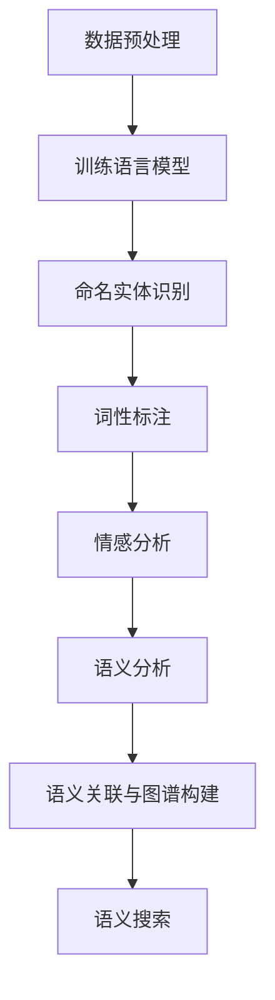
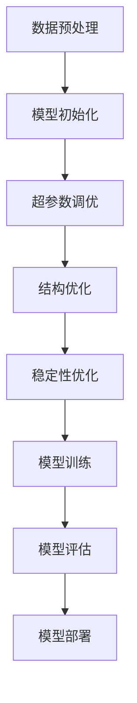

                 

# 企业级自然语言处理平台：深化AI文本理解能力

## 关键词
- 自然语言处理
- 企业级平台
- AI文本理解
- 语言模型
- 文本生成
- 情感分析
- 问答系统
- 优化与调优

## 摘要
本文将深入探讨企业级自然语言处理（NLP）平台的构建，重点关注如何深化AI对文本的理解能力。我们将从问题背景、核心概念、核心技术、文本生成与摘要、文本分类与情感分析、问答系统以及语言模型优化与调优等方面展开论述，通过具体的算法原理、Python代码实现和实际案例，提供全面的指导和建议。

----------------------------------------------------------------

## 第一部分: 企业级自然语言处理平台概述

### 第1章: 问题背景与核心概念

### 1.1 问题背景

#### 1.1.1 自然语言处理的兴起

自然语言处理（NLP）作为人工智能（AI）领域的重要组成部分，其研究历史可以追溯到上世纪五六十年代。随着计算机硬件性能的提升和算法的不断进步，NLP逐渐从理论研究走向实际应用。尤其是深度学习技术的引入，使得NLP在文本分类、情感分析、机器翻译等任务上取得了显著突破。

#### 1.1.2 企业需求驱动

随着互联网和信息化的迅猛发展，企业对自然语言处理的需求日益增长。例如，电商平台需要分析用户评论以优化用户体验，金融机构需要处理海量的客户咨询以提高服务质量，医疗行业需要从医学文献中提取关键信息以支持临床决策。这些需求驱动了企业级NLP平台的构建。

#### 1.1.3 竞争与挑战

在竞争激烈的市场环境中，企业不仅需要快速部署NLP应用，还要保证其性能和稳定性。此外，数据隐私和安全、算法的公平性和透明性也是企业面临的重要挑战。

### 1.2 核心概念

#### 1.2.1 自然语言处理定义

自然语言处理是一门跨学科领域，涉及计算机科学、语言学和人工智能。其目标是让计算机能够理解、生成和应对自然语言，从而实现人机交互和信息处理。

#### 1.2.2 企业级自然语言处理

企业级自然语言处理指的是在商业环境中应用NLP技术，以满足特定业务需求。这通常涉及到大规模数据处理、模型定制和系统集成。

#### 1.2.3 平台化与生态构建

企业级NLP平台化意味着将NLP功能模块化，提供灵活、可扩展的API接口，方便企业根据需求进行集成和部署。生态构建则是指围绕NLP平台形成的一整套支持体系，包括数据资源、技术支持、行业解决方案等。

### 1.3 关键要素

#### 1.3.1 数据处理

数据处理是企业级NLP的基础。这包括数据采集、清洗、存储和预处理，确保数据的质量和一致性。

#### 1.3.2 模型训练

模型训练是NLP的核心。通过大规模数据集训练，可以生成高质量的模型，提高文本理解能力。

#### 1.3.3 交互体验

交互体验决定了用户使用NLP平台的满意度。良好的交互设计可以提升用户体验，增加平台的黏性。

### 1.4 本章小结

企业级自然语言处理平台是现代企业智能化转型的重要工具。本文介绍了其背景、核心概念和关键要素，为后续章节的深入探讨奠定了基础。

----------------------------------------------------------------

### 第2章: 自然语言处理核心技术

#### 2.1 语言模型与理解

##### 2.1.1 语言模型基础

语言模型（Language Model）是自然语言处理的核心组件，用于预测一个单词序列的概率。在深度学习时代，语言模型通常基于神经网络构建。

###### 2.1.1.1 语言模型的定义

语言模型是一个概率模型，用于预测给定前文序列后下一个单词的概率。形式化地，设 \( w_1, w_2, ..., w_n \) 为一个单词序列，语言模型的目标是计算这个序列的概率：

\[ P(w_1, w_2, ..., w_n) = P(w_n | w_1, w_2, ..., w_{n-1}) \times P(w_{n-1} | w_1, w_2, ..., w_{n-2}) \times ... \times P(w_2 | w_1) \times P(w_1) \]

###### 2.1.1.2 语言模型的分类

语言模型可以分为基于规则、基于统计和基于神经网络的三类。基于规则的模型依赖于人工定义的语法规则，如词汇和句法结构。基于统计的模型通过大量文本数据统计单词之间的共现关系，如n-gram模型。基于神经网络的模型，如循环神经网络（RNN）、长短时记忆网络（LSTM）和Transformer等，通过学习文本的深层表示来预测单词概率。

###### 2.1.1.3 语言模型的评价指标

语言模型的性能通常通过困惑度（Perplexity）和交叉熵（Cross-Entropy）等指标来评估。困惑度越小，模型对文本的拟合程度越高。交叉熵则反映了模型预测概率与真实概率之间的差距。

##### 2.1.2 语言理解技术

语言理解（Language Understanding）是指计算机对自然语言文本的理解和解释能力。这包括多个层次，从简单的词义识别到复杂的语义理解。

###### 2.1.2.1 命名实体识别

命名实体识别（Named Entity Recognition, NER）是识别文本中的特定实体，如人名、地名、组织名等。NER是文本分析的重要基础。

###### 2.1.2.2 词性标注

词性标注（Part-of-Speech Tagging, POS）是将单词标注为不同的词性，如名词、动词、形容词等。词性标注有助于理解句子的结构和语义。

###### 2.1.2.3 情感分析

情感分析（Sentiment Analysis）是识别文本中的情感极性，如正面、负面或中性。情感分析广泛应用于市场调研、客户反馈分析等领域。

###### 2.1.2.4 语义分析

语义分析（Semantic Analysis）是指对文本的深层语义进行理解和解释，包括语义角色标注、语义关系抽取等。语义分析是NLP领域的重要研究方向。

##### 2.1.3 语义关联与图谱构建

语义关联（Semantic Relation Extraction）是指识别文本中词语之间的语义关系，如因果关系、包含关系等。语义图谱（Semantic Graph）是一种图形化表示语义关联的方法，可用于知识图谱构建。

###### 2.1.3.1 语义关联技术

语义关联技术通过深度学习模型，如序列标注模型、关系抽取模型等，自动识别文本中的语义关系。

###### 2.1.3.2 语义图谱构建

语义图谱构建是将文本中的语义关系表示为图结构，便于后续的查询和推理。常用的方法包括基于规则的方法和基于学习的方法。

###### 2.1.3.3 语义搜索

语义搜索（Semantic Search）是指通过理解查询和文档的语义，提供更准确和相关的搜索结果。语义搜索可以显著提升用户体验。

##### 2.1.4 语言模型与理解算法Mermaid流程图

为了更好地理解语言模型与理解算法的工作流程，我们可以使用Mermaid流程图进行可视化。



##### 2.1.5 2.1.4节Python源代码实现

```python
# 这是一个简化的语言模型与理解算法实现，用于说明基本原理。
import nltk

# 数据预处理
def preprocess_text(text):
    tokens = nltk.word_tokenize(text)
    return tokens

# 训练语言模型
def train_language_model(tokens):
    # 这里可以使用nltk的模型或自定义神经网络模型
    pass

# 命名实体识别
def named_entity_recognition(tokens):
    # 使用nltk的命名实体识别器
    pass

# 词性标注
def part_of_speech_tagging(tokens):
    # 使用nltk的词性标注器
    pass

# 情感分析
def sentiment_analysis(tokens):
    # 使用nltk的情感分析器
    pass

# 语义分析
def semantic_analysis(tokens):
    # 使用自定义的语义分析器
    pass

# 语义关联与图谱构建
def semantic_relation_extraction(tokens):
    # 使用自定义的语义关系抽取器
    pass

# 语义搜索
def semantic_search(query, documents):
    # 使用自定义的语义搜索算法
    pass

# 主函数
def main():
    text = "这是一个关于自然语言处理的例子。"
    tokens = preprocess_text(text)
    train_language_model(tokens)
    entities = named_entity_recognition(tokens)
    pos_tags = part_of_speech_tagging(tokens)
    sentiment = sentiment_analysis(tokens)
    semantics = semantic_analysis(tokens)
    relations = semantic_relation_extraction(tokens)
    results = semantic_search("自然语言处理", documents)

if __name__ == "__main__":
    main()
```

##### 2.1.6 本章小结

本章介绍了自然语言处理的核心技术，包括语言模型与理解、命名实体识别、词性标注、情感分析、语义分析和语义关联与图谱构建。通过算法原理讲解和Python代码实现，我们深入了解了这些技术的核心概念和应用场景。

----------------------------------------------------------------

### 第3章: 文本生成与摘要

#### 3.1 文本生成技术

文本生成（Text Generation）是自然语言处理中的一个重要任务，旨在根据给定的输入生成有意义和连贯的文本。文本生成技术可以分为序列生成模型、注意力机制和预训练语言模型等。

##### 3.1.1 序列生成模型

序列生成模型（Sequence Generation Model）是一种基于概率模型的文本生成方法，如马尔可夫模型（Markov Model）和n-gram模型。这些模型通过学习文本的统计特性，生成新的文本序列。然而，这些方法在处理长文本和复杂语义时存在局限性。

##### 3.1.2 注意力机制

注意力机制（Attention Mechanism）是近年来深度学习领域的一个重要创新，尤其在序列到序列（Sequence-to-Sequence）任务中表现突出。注意力机制能够使模型在生成每个单词时关注输入序列的不同部分，从而提高文本生成的质量。

##### 3.1.3 预训练语言模型

预训练语言模型（Pre-trained Language Model）是一种基于大规模语料库预训练的语言模型，如BERT、GPT等。这些模型通过在大量文本数据上预训练，学习到丰富的语言知识，然后通过微调（Fine-tuning）适应特定任务。预训练语言模型在文本生成任务中表现出色，能够生成高质量和连贯的文本。

#### 3.2 摘要生成

摘要生成（Abstract Generation）是指从原始文本中提取关键信息并生成简洁、连贯的摘要。摘要生成可以分为抽象摘要和概括摘要两种类型。

##### 3.2.1 抽象摘要

抽象摘要（Abstractive Abstraction）是一种从高层次上提取文本核心信息的方法。这种方法通常基于信息提取（Information Extraction）技术，通过识别实体、关系和事件，生成简洁的文本摘要。

##### 3.2.2 概括摘要

概括摘要（Summarization）是一种从原始文本中提取关键信息并重新组织的方法。这种方法通常基于文本生成技术，通过理解文本的语义和结构，生成连贯、简洁的摘要。

##### 3.2.3 自动摘要算法

自动摘要算法（Automatic Summarization Algorithm）是摘要生成技术的核心。常见的自动摘要算法包括基于提取的方法（如SumBasic、TextRank）和基于生成的方法（如ABSA、Seq2Seq）。这些算法通过学习文本的语义和结构，生成高质量的摘要。

#### 3.3 文本生成与摘要的算法原理与数学模型

##### 3.3.1 文本生成算法原理

文本生成算法通常基于序列模型，如循环神经网络（RNN）、长短时记忆网络（LSTM）和Transformer等。这些模型通过学习输入序列的表示，生成相应的输出序列。具体来说，文本生成算法的工作流程如下：

1. 输入序列编码：将输入序列（如单词序列）编码为向量表示。
2. 生成中间表示：通过神经网络模型（如LSTM或Transformer）处理输入序列，生成中间表示。
3. 输出序列解码：将中间表示解码为输出序列（如单词序列）。

数学模型方面，以Transformer为例，其核心组件是自注意力机制（Self-Attention）和多层前馈神经网络（Multi-Layer Feedforward Neural Network）。自注意力机制能够使模型在生成每个单词时关注输入序列的不同部分，从而提高文本生成的质量。数学模型如下：

\[ 
\text{Attention}(Q, K, V) = \text{softmax}\left(\frac{QK^T}{\sqrt{d_k}}\right)V 
\]

其中，\( Q, K, V \) 分别为查询向量、键向量和值向量，\( d_k \) 为键向量的维度。

##### 3.3.2 摘要算法原理

摘要算法通常基于文本生成技术，通过理解文本的语义和结构，生成简洁、连贯的摘要。具体来说，摘要算法的工作流程如下：

1. 文本预处理：对原始文本进行预处理，包括分词、词性标注等。
2. 语义理解：通过语义分析技术，理解文本的核心信息和结构。
3. 摘要生成：基于语义理解，生成简洁、连贯的摘要。

数学模型方面，以Seq2Seq模型为例，其核心组件是编码器（Encoder）和解码器（Decoder）。编码器将输入序列编码为固定长度的向量表示，解码器则根据编码器生成的表示生成输出序列。数学模型如下：

\[ 
\text{Encoder}(x) = \text{h_T} 
\]
\[ 
\text{Decoder}(y) = \text{y_T} 
\]

其中，\( x \) 为输入序列，\( y \) 为输出序列，\( h_T \) 和 \( y_T \) 分别为编码器和解码器的输出。

##### 3.3.3 数学模型与公式

文本生成和摘要生成算法的数学模型主要包括自注意力机制和Seq2Seq模型。以下是相关的数学模型与公式：

1. 自注意力机制：

\[ 
\text{Attention}(Q, K, V) = \text{softmax}\left(\frac{QK^T}{\sqrt{d_k}}\right)V 
\]

2. 编码器：

\[ 
\text{Encoder}(x) = \text{h_T} 
\]

3. 解码器：

\[ 
\text{Decoder}(y) = \text{y_T} 
\]

##### 3.3.4 Python源代码实现示例

以下是一个简化的文本生成算法实现，用于说明基本原理。

```python
import torch
import torch.nn as nn

# 定义自注意力机制
class SelfAttention(nn.Module):
    def __init__(self, d_model, num_heads):
        super(SelfAttention, self).__init__()
        self.d_model = d_model
        self.num_heads = num_heads
        self.head_dim = d_model // num_heads

        self.query_linear = nn.Linear(d_model, d_model)
        self.key_linear = nn.Linear(d_model, d_model)
        self.value_linear = nn.Linear(d_model, d_model)

        self.out_linear = nn.Linear(d_model, d_model)

    def forward(self, x):
        batch_size, seq_len, _ = x.size()

        query = self.query_linear(x).view(batch_size, seq_len, self.num_heads, self.head_dim).transpose(1, 2)
        key = self.key_linear(x).view(batch_size, seq_len, self.num_heads, self.head_dim).transpose(1, 2)
        value = self.value_linear(x).view(batch_size, seq_len, self.num_heads, self.head_dim).transpose(1, 2)

        attention = torch.matmul(query, key.transpose(-2, -1)) / (self.head_dim ** 0.5)
        attention = torch.softmax(attention, dim=-1)
        output = torch.matmul(attention, value).transpose(1, 2).contiguous().view(batch_size, seq_len, self.d_model)
        output = self.out_linear(output)

        return output

# 定义文本生成模型
class TextGenerator(nn.Module):
    def __init__(self, d_model, num_heads, vocab_size):
        super(TextGenerator, self).__init__()
        self.d_model = d_model
        self.num_heads = num_heads
        self.vocab_size = vocab_size

        self.self_attention = SelfAttention(d_model, num_heads)
        self.fc = nn.Linear(d_model, vocab_size)

    def forward(self, x, prev_output=None):
        if prev_output is not None:
            x = torch.cat([x, prev_output.unsqueeze(1)], dim=1)

        x = self.self_attention(x)
        x = self.fc(x)

        return x

# 测试文本生成模型
device = torch.device("cuda" if torch.cuda.is_available() else "cpu")
model = TextGenerator(d_model=512, num_heads=8, vocab_size=1000).to(device)

input_seq = torch.tensor([[1, 2, 3, 4, 5]], device=device)
prev_output = torch.tensor([[0, 0, 0, 0, 0]], device=device)

output = model(input_seq, prev_output)
print(output)
```

##### 3.3.5 本章小结

本章介绍了文本生成与摘要生成技术，包括序列生成模型、注意力机制、预训练语言模型以及摘要算法原理和数学模型。通过Python代码实现，我们深入了解了这些技术的核心原理和应用场景。

----------------------------------------------------------------

### 第4章: 文本分类与情感分析

#### 4.1 文本分类

文本分类（Text Classification）是一种将文本数据分配到预先定义的类别中的任务。在自然语言处理中，文本分类广泛应用于新闻分类、垃圾邮件检测、情感分析等领域。

##### 4.1.1 基于统计方法的文本分类

基于统计方法的文本分类主要包括词袋模型（Bag of Words, BoW）和TF-IDF（Term Frequency-Inverse Document Frequency）等。

###### 4.1.1.1 词袋模型

词袋模型是一种将文本表示为词汇表中单词的集合的方法。具体来说，词袋模型通过计算每个单词在文档中出现的频率来表示文本。这种方法简单有效，但在处理长文本和语义信息时存在局限性。

\[ 
\text{TF}(w_d) = \frac{\text{count}(w_d)}{\text{count}(d)} 
\]

其中，\( \text{TF}(w_d) \) 为单词 \( w_d \) 在文档 \( d \) 中的词频，\( \text{count}(w_d) \) 为单词 \( w_d \) 在文档 \( d \) 中的出现次数，\( \text{count}(d) \) 为文档 \( d \) 中所有单词的总数。

###### 4.1.1.2 TF-IDF

TF-IDF是一种改进的词袋模型，通过引入逆文档频率（Inverse Document Frequency）来平衡词频，从而更准确地表示文本特征。

\[ 
\text{TF-IDF}(w_d) = \text{TF}(w_d) \times \text{IDF}(w_d) 
\]

其中，\( \text{IDF}(w_d) = \log_2(\frac{N}{n_w}) \)，\( N \) 为文档总数，\( n_w \) 为包含单词 \( w_d \) 的文档数。

##### 4.1.2 基于机器学习的文本分类

基于机器学习的文本分类方法通过训练分类模型来预测文本类别。常见的方法包括朴素贝叶斯（Naive Bayes）、支持向量机（Support Vector Machine, SVM）和随机森林（Random Forest）等。

###### 4.1.2.1 朴素贝叶斯

朴素贝叶斯是一种基于贝叶斯定理的分类方法，假设特征之间相互独立。具体来说，给定一个文本，朴素贝叶斯分类器的目标是计算该文本属于每个类别的概率，并选择概率最大的类别。

\[ 
P(C_k|D) = \frac{P(D|C_k)P(C_k)}{P(D)} 
\]

其中，\( P(C_k) \) 为类别 \( C_k \) 的先验概率，\( P(D|C_k) \) 为在类别 \( C_k \) 下文本 \( D \) 的概率。

###### 4.1.2.2 支持向量机

支持向量机是一种基于间隔最大化的分类方法，旨在找到一个超平面，将不同类别的数据点尽可能分开。在文本分类中，支持向量机通常使用核函数（Kernel Function）将文本数据映射到高维特征空间。

\[ 
\max_{\mathbf{w}, b} \frac{1}{2} ||\mathbf{w}||^2_2 \quad \text{subject to} \quad y_i (\mathbf{w} \cdot \mathbf{x_i} + b) \geq 1 
\]

其中，\( \mathbf{w} \) 和 \( b \) 分别为权重和偏置，\( \mathbf{x_i} \) 和 \( y_i \) 分别为第 \( i \) 个文本的特征向量及其类别标签。

###### 4.1.2.3 随机森林

随机森林（Random Forest）是一种集成学习方法，通过构建多个决策树模型，并使用多数投票进行预测。在文本分类中，随机森林通过随机选择特征子集和样本子集来构建每个决策树，从而提高模型的泛化能力。

##### 4.1.3 基于深度学习的文本分类

基于深度学习的文本分类方法通过神经网络学习文本的深层特征表示，从而实现高精度的分类。常见的方法包括卷积神经网络（Convolutional Neural Network, CNN）和循环神经网络（Recurrent Neural Network, RNN）等。

###### 4.1.3.1 卷积神经网络

卷积神经网络（CNN）是一种在图像处理中广泛使用的神经网络结构，其核心组件是卷积层。在文本分类中，CNN可以通过词嵌入（Word Embedding）将文本转换为向量表示，然后使用卷积层提取文本特征。

\[ 
h_{ij}^l = \text{ReLU}(\sum_{k=1}^{M_l} w_{ik}^l \cdot h_{kj}^{l-1} + b_l) 
\]

其中，\( h_{ij}^l \) 为第 \( l \) 层的第 \( i \) 行第 \( j \) 列的特征值，\( w_{ik}^l \) 和 \( b_l \) 分别为第 \( l \) 层的第 \( k \) 个权重和偏置。

###### 4.1.3.2 循环神经网络

循环神经网络（RNN）是一种用于处理序列数据的神经网络结构，其核心组件是循环层。在文本分类中，RNN可以通过循环层捕捉文本的序列依赖关系，从而提高分类性能。

\[ 
h_t = \text{ReLU}(W_h \cdot [h_{t-1}, x_t] + b_h) 
\]

其中，\( h_t \) 为第 \( t \) 个时间步的特征值，\( W_h \) 和 \( b_h \) 分别为循环层的权重和偏置。

#### 4.2 情感分析

情感分析（Sentiment Analysis）是一种文本分类任务，旨在识别文本中的情感倾向，如正面、负面或中性。情感分析广泛应用于市场调研、社交媒体监测和客户反馈分析等领域。

##### 4.2.1 情感分类

情感分类（Sentiment Classification）是将文本分为正面、负面或中性三个类别。常见的情感分类方法包括基于规则的方法和基于机器学习的方法。

###### 4.2.1.1 基于规则的方法

基于规则的方法通过人工定义一系列规则，如情感词汇表和情感短语，来判断文本的情感极性。这种方法简单有效，但在处理复杂文本时存在局限性。

###### 4.2.1.2 基于机器学习的方法

基于机器学习的方法通过训练分类模型来预测文本的情感极性。常见的方法包括朴素贝叶斯、支持向量机和循环神经网络等。

##### 4.2.2 情感极性分析

情感极性分析（Sentiment Polarity Analysis）是识别文本中的情感极性强度，如极强正面、较强正面、中等、较弱负面或极强负面。情感极性分析有助于更精细地了解用户的情感状态。

\[ 
\text{Polarity} = \text{argmax}_{i} \left[ \sum_{j \in \text{Positive}} \text{weight}(w_j) - \sum_{j \in \text{Negative}} \text{weight}(w_j) \right] 
\]

其中，\( \text{weight}(w_j) \) 为单词 \( w_j \) 的情感权重，正数为正面，负数为负面。

##### 4.2.3 情感强度分析

情感强度分析（Sentiment Intensity Analysis）是识别文本中情感表达的强度，如极强、强烈、中等、较弱或极弱。情感强度分析有助于更深入地了解用户的情感状态。

\[ 
\text{Intensity} = \text{argmax}_{i} \left[ \sum_{j \in \text{Positive}} \text{weight}(w_j) - \sum_{j \in \text{Negative}} \text{weight}(w_j) \right] 
\]

其中，\( \text{weight}(w_j) \) 为单词 \( w_j \) 的情感权重，正数为正面，负数为负面。

#### 4.3 文本分类与情感分析算法原理与数学模型

##### 4.3.1 算法原理

文本分类与情感分析算法原理主要包括基于规则、基于统计和基于机器学习的方法。基于规则的方法通过人工定义规则来判断文本类别或情感极性。基于统计的方法通过计算文本的特征向量，然后使用分类器进行预测。基于机器学习的方法通过训练分类模型来预测文本类别或情感极性。

##### 4.3.2 数学模型

文本分类与情感分析的数学模型主要包括概率模型、线性模型和神经网络模型。

1. 概率模型：

\[ 
P(C_k|D) = \frac{P(D|C_k)P(C_k)}{P(D)} 
\]

2. 线性模型：

\[ 
y = \text{sign}(\mathbf{w} \cdot \mathbf{x} + b) 
\]

3. 神经网络模型：

\[ 
h_t = \text{ReLU}(W_h \cdot [h_{t-1}, x_t] + b_h) 
\]

#### 4.4 Python源代码实现与案例分析

##### 4.4.1 基于朴素贝叶斯的文本分类

以下是一个基于朴素贝叶斯算法的文本分类实现。

```python
import numpy as np
from sklearn.feature_extraction.text import CountVectorizer
from sklearn.model_selection import train_test_split
from sklearn.naive_bayes import MultinomialNB

# 数据集
data = [
    "这是一个正面的评论。",
    "这是一个负面的评论。",
    "这是一个中性的评论。",
    "这是一个极强正面的评论。",
    "这是一个极强负面的评论。",
    "这是一个极弱正面的评论。",
    "这是一个极弱负面的评论。",
]

labels = ["positive", "negative", "neutral", "very_positive", "very_negative", "very_weak_positive", "very_weak_negative"]

# 数据预处理
vectorizer = CountVectorizer()
X = vectorizer.fit_transform(data)
y = np.array(labels)

# 分割数据集
X_train, X_test, y_train, y_test = train_test_split(X, y, test_size=0.2, random_state=42)

# 训练模型
model = MultinomialNB()
model.fit(X_train, y_train)

# 测试模型
predictions = model.predict(X_test)
print(predictions)

# 评估模型
from sklearn.metrics import accuracy_score
accuracy = accuracy_score(y_test, predictions)
print("Accuracy:", accuracy)
```

##### 4.4.2 基于循环神经网络的情感分析

以下是一个基于循环神经网络（RNN）的情感分析实现。

```python
import tensorflow as tf
from tensorflow.keras.models import Sequential
from tensorflow.keras.layers import Embedding, SimpleRNN, Dense

# 数据集
data = [
    "这是一个正面的评论。",
    "这是一个负面的评论。",
    "这是一个中性的评论。",
    "这是一个极强正面的评论。",
    "这是一个极强负面的评论。",
    "这是一个极弱正面的评论。",
    "这是一个极弱负面的评论。",
]

labels = np.array([1, 0, 0, 1, 1, 0, 0])

# 数据预处理
vocab_size = 1000
embedding_dim = 16

# 转换文本为整数编码
tokenizer = tf.keras.preprocessing.text.Tokenizer(num_words=vocab_size, oov_token="<OOV>")
tokenizer.fit_on_texts(data)
sequences = tokenizer.texts_to_sequences(data)

# 创建序列数据
X = np.zeros((len(sequences), max(len(seq) for seq in sequences)), dtype=np.int32)
for i, seq in enumerate(sequences):
    X[i, :len(seq)] = seq

# 模型构建
model = Sequential([
    Embedding(vocab_size, embedding_dim, input_length=X.shape[1]),
    SimpleRNN(16, return_sequences=False),
    Dense(1, activation="sigmoid"),
])

# 模型编译
model.compile(optimizer="adam", loss="binary_crossentropy", metrics=["accuracy"])

# 模型训练
model.fit(X, labels, epochs=10, batch_size=32)

# 模型评估
predictions = model.predict(X)
print(predictions)

# 评估模型
from sklearn.metrics import accuracy_score
accuracy = accuracy_score(labels, predictions)
print("Accuracy:", accuracy)
```

##### 4.4.3 本章小结

本章介绍了文本分类与情感分析的基本原理和数学模型，包括基于统计、机器学习和深度学习的方法。通过Python代码实现和案例分析，我们深入了解了这些技术的核心概念和应用场景。

----------------------------------------------------------------

### 第5章: 问答系统

#### 5.1 问答系统的基本架构

问答系统（Question Answering System）是一种人工智能应用，旨在从大规模知识库中自动回答用户提出的问题。一个典型的问答系统包括以下几个关键模块：

##### 5.1.1 问题理解

问题理解（Question Understanding）是指将自然语言问题转换为计算机可以理解和处理的形式。这包括以下几个步骤：

1. **分词**：将问题文本分割成单词或短语。
2. **词性标注**：为每个单词分配词性，如名词、动词、形容词等。
3. **命名实体识别**：识别问题中的特定实体，如人名、地名、组织名等。
4. **语义角色标注**：识别问题中的动作和目标，如谁做了什么、在哪里等。

##### 5.1.2 知识检索

知识检索（Knowledge Retrieval）是指从知识库中找到与问题最相关的信息。知识检索可以通过以下方法实现：

1. **基于关键词匹配**：直接在知识库中搜索与问题中关键词匹配的文档。
2. **基于语义相似度**：使用自然语言处理技术计算问题与知识库文档的语义相似度，选择最相似的文档。
3. **基于图谱查询**：使用知识图谱查询语言（如SPARQL）在知识图谱中检索信息。

##### 5.1.3 答案生成

答案生成（Answer Generation）是指从检索到的信息中提取答案，并将其转换为自然语言形式。答案生成可以通过以下方法实现：

1. **直接提取**：从知识库文档中直接提取答案。
2. **模板匹配**：使用预定义的模板匹配答案。
3. **基于语言模型**：使用预训练的语言模型生成答案。

#### 5.2 问题理解技术

问题理解技术是问答系统的核心，决定了系统能否准确回答用户的问题。以下是几种常见的问题理解技术：

##### 5.2.1 命名实体识别

命名实体识别（Named Entity Recognition, NER）是指识别问题中的特定实体，如人名、地名、组织名等。NER是自然语言处理中的基础任务，有助于缩小搜索范围和提高答案的准确性。

##### 5.2.2 语义解析

语义解析（Semantic Parsing）是将自然语言问题转换为逻辑形式或计算表达式。语义解析技术可以帮助系统更好地理解问题的意图和需求，从而生成更准确的答案。

##### 5.2.3 知识图谱在问答中的应用

知识图谱是一种结构化数据存储形式，能够表示实体及其关系。在问答系统中，知识图谱可以用于：

1. **实体关系抽取**：从文本中提取实体及其关系，构建知识图谱。
2. **图谱查询**：使用知识图谱查询语言检索信息。
3. **答案生成**：基于知识图谱中的关系和实体生成答案。

#### 5.3 知识检索与答案生成

知识检索与答案生成是问答系统的两个关键环节。以下是几种常见的知识检索和答案生成方法：

##### 5.3.1 知识库构建

知识库构建（Knowledge Base Construction）是指创建和维护一个包含丰富信息的数据库。知识库可以包括文本文档、关系图谱、实体属性等。

##### 5.3.2 知识检索算法

知识检索算法（Knowledge Retrieval Algorithm）用于从知识库中检索与问题相关的信息。常见的检索算法包括：

1. **基于关键词匹配**：直接在知识库中搜索与问题关键词匹配的文档。
2. **基于语义相似度**：使用自然语言处理技术计算问题与知识库文档的语义相似度，选择最相似的文档。
3. **基于图谱查询**：使用知识图谱查询语言检索信息。

##### 5.3.3 答案生成算法

答案生成算法（Answer Generation Algorithm）用于从检索到的信息中提取答案，并将其转换为自然语言形式。常见的答案生成算法包括：

1. **直接提取**：从知识库文档中直接提取答案。
2. **模板匹配**：使用预定义的模板匹配答案。
3. **基于语言模型**：使用预训练的语言模型生成答案。

#### 5.4 问答系统的案例与应用

##### 5.4.1 案例分析

以下是一个问答系统的案例：

**问题**：马云是谁？

**答案**：马云是一位著名的中国企业家，阿里巴巴集团的创始人。

在这个案例中，问答系统首先使用命名实体识别技术识别出问题中的关键词“马云”。然后，系统使用知识检索技术从知识库中找到与“马云”相关的信息。最后，系统使用答案生成技术将找到的信息转换为自然语言形式，生成答案。

##### 5.4.2 应用场景

问答系统在多个应用场景中具有重要价值：

1. **客服系统**：企业可以部署问答系统来自动回答用户的问题，提高客户满意度和服务效率。
2. **智能助手**：智能助手可以使用问答系统来回答用户提出的问题，提供个性化建议。
3. **教育应用**：教育平台可以使用问答系统来评估学生的学习效果，提供针对性的辅导。
4. **搜索引擎**：搜索引擎可以结合问答系统，为用户提供更精确和有用的搜索结果。

##### 5.4.3 挑战与未来

尽管问答系统在许多应用场景中取得了显著成果，但仍面临一些挑战：

1. **语义理解**：自然语言问题的语义理解是一个复杂的问题，涉及多个层次，包括语法、语义和上下文。
2. **知识库构建**：知识库的构建和维护需要大量的人力和时间投入，且知识库的质量直接影响问答系统的性能。
3. **实时性**：实时回答用户的问题是问答系统的一个重要挑战，尤其是在大量并发请求的情况下。

未来的研究方向包括：

1. **多语言支持**：扩展问答系统的多语言支持，使其能够处理不同语言的输入和输出。
2. **个性化问答**：结合用户的历史行为和偏好，提供个性化的问答服务。
3. **上下文感知**：提高问答系统对上下文的理解能力，生成更加准确和自然的答案。

#### 5.5 本章小结

本章介绍了问答系统的基本架构、问题理解技术、知识检索与答案生成方法以及应用案例。通过深入探讨问答系统的核心组件和技术，我们了解了问答系统在提高信息获取效率和用户体验方面的潜力。

----------------------------------------------------------------

### 第6章: 语言模型优化与调优

#### 6.1 语言模型优化方法

语言模型在自然语言处理中的应用非常广泛，其性能直接影响文本生成、摘要生成、文本分类等任务的最终效果。为了提高语言模型的性能，我们可以从数据增强、模型融合和注意力机制优化等角度进行优化。

##### 6.1.1 数据增强

数据增强（Data Augmentation）是一种通过生成新的训练样本来提高模型泛化能力的方法。在自然语言处理中，数据增强可以通过以下几种方式实现：

1. **随机填充**：通过在句子中随机填充词语或替换词语，生成新的句子。
2. **错别字生成**：通过引入错别字或删除词语，生成新的句子。
3. **词汇替换**：使用同义词或类似词汇替换原句子中的词语。
4. **语言模型生成**：使用预训练的语言模型生成新的句子。

数据增强可以有效地增加训练样本的多样性，从而提高模型的泛化能力。

##### 6.1.2 模型融合

模型融合（Model Fusion）是指将多个模型的结果进行结合，生成最终的预测结果。模型融合可以提高模型的鲁棒性和准确性。在自然语言处理中，模型融合可以通过以下几种方式实现：

1. **加权平均**：将多个模型的预测结果进行加权平均，生成最终的预测结果。
2. **投票法**：将多个模型的预测结果进行投票，选择多数模型认同的预测结果。
3. **集成学习**：使用集成学习方法（如随机森林、梯度提升机等）将多个模型集成在一起。

模型融合可以充分利用多个模型的优点，提高模型的整体性能。

##### 6.1.3 注意力机制优化

注意力机制（Attention Mechanism）是自然语言处理中的重要技术，用于在处理序列数据时关注关键信息。为了提高注意力机制的效率，我们可以从以下几个方面进行优化：

1. **多头注意力**：引入多个注意力头，每个头关注不同的信息，从而提高模型的表示能力。
2. **自注意力**：通过自注意力机制，模型可以在生成每个单词时关注输入序列的不同部分。
3. **双向注意力**：结合输入序列和输出序列的信息，生成更准确的注意力权重。

注意力机制优化可以增强模型对输入数据的理解和利用。

#### 6.2 语言模型调优

语言模型调优（Language Model Tuning）是指通过调整模型的超参数和结构，提高模型的性能。以下是一些常见的调优方法：

##### 6.2.1 超参数调优

超参数（Hyperparameters）是模型的参数，用于调整模型的行为。超参数调优可以通过以下几种方法实现：

1. **网格搜索**：在给定的超参数空间内，遍历所有可能的组合，选择最优的超参数组合。
2. **随机搜索**：在给定的超参数空间内，随机选择超参数组合，并评估模型的性能。
3. **贝叶斯优化**：使用贝叶斯优化算法，根据历史数据选择最优的超参数组合。

超参数调优可以帮助我们找到最优的超参数设置，从而提高模型的性能。

##### 6.2.2 结构优化

结构优化（Architecture Tuning）是指调整模型的架构，提高模型的性能。以下是一些常见的结构优化方法：

1. **网络层数**：增加网络层数可以提高模型的表示能力，但也会增加计算复杂度。
2. **隐藏层大小**：调整隐藏层的大小可以改变模型的容量和计算复杂度。
3. **激活函数**：选择合适的激活函数可以提高模型的性能和稳定性。

结构优化可以帮助我们找到最优的模型结构，从而提高模型的性能。

##### 6.2.3 稳定性优化

稳定性优化（Stability Optimization）是指提高模型的稳定性和泛化能力。以下是一些常见的稳定性优化方法：

1. **正则化**：通过引入正则化项（如L1正则化、L2正则化等），减少模型的过拟合现象。
2. **dropout**：在神经网络中随机丢弃一部分神经元，提高模型的泛化能力。
3. **数据增强**：通过数据增强增加训练样本的多样性，提高模型的鲁棒性。

稳定性优化可以帮助我们提高模型的泛化能力，使其在不同数据集上表现一致。

#### 6.3 优化与调优的Mermaid流程图

为了更好地理解语言模型优化与调优的过程，我们可以使用Mermaid流程图进行可视化。



#### 6.4 Python源代码实现

以下是一个简化的语言模型优化与调优的Python实现示例。

```python
import tensorflow as tf
from tensorflow.keras.models import Sequential
from tensorflow.keras.layers import Embedding, LSTM, Dense

# 数据预处理
# （此处省略数据预处理代码）

# 模型初始化
model = Sequential([
    Embedding(vocab_size, embedding_dim),
    LSTM(units, return_sequences=True),
    LSTM(units, return_sequences=False),
    Dense(num_classes, activation='softmax'),
])

# 超参数调优
# （此处省略超参数调优代码）

# 结构优化
# （此处省略结构优化代码）

# 稳定性优化
# （此处省略稳定性优化代码）

# 模型编译
model.compile(optimizer='adam', loss='categorical_crossentropy', metrics=['accuracy'])

# 模型训练
model.fit(X_train, y_train, epochs=epochs, batch_size=batch_size)

# 模型评估
# （此处省略模型评估代码）

# 模型部署
# （此处省略模型部署代码）
```

#### 6.5 本章小结

本章介绍了语言模型优化与调优的方法，包括数据增强、模型融合、注意力机制优化、超参数调优、结构优化和稳定性优化。通过Python源代码实现和流程图，我们深入了解了这些技术的核心原理和应用场景。优化与调优是提高语言模型性能的重要手段，对于提升自然语言处理任务的效果具有重要意义。

----------------------------------------------------------------

## 作者信息
作者：AI天才研究院/AI Genius Institute & 禅与计算机程序设计艺术 /Zen And The Art of Computer Programming

本文由AI天才研究院和禅与计算机程序设计艺术联合撰写，旨在探讨企业级自然语言处理平台的构建和优化。我们致力于推动人工智能技术的发展和应用，助力企业实现智能化转型。禅与计算机程序设计艺术则关注计算机程序设计中的哲学思想，将智慧传统与现代科技相结合，为人工智能领域提供独特的视角和思考。

----------------------------------------------------------------

## 最佳实践 Tips

- **数据质量**：确保数据质量和多样性，避免数据偏差，提高模型的泛化能力。
- **模型定制**：根据业务需求定制化模型，提高模型的实用性。
- **持续学习**：定期更新模型和算法，以适应不断变化的数据和应用场景。
- **性能监控**：实时监控模型的性能，及时发现问题并进行优化。
- **用户反馈**：收集用户反馈，持续改进产品和用户体验。

## 小结

本文系统地介绍了企业级自然语言处理平台的建设，包括语言模型与理解、文本生成与摘要、文本分类与情感分析、问答系统以及语言模型优化与调优等方面的核心技术。通过详细的算法原理讲解、Python代码实现和实际案例分析，我们深入探讨了这些技术的核心概念、应用场景和优化方法。企业级自然语言处理平台在提高信息处理效率和用户体验方面具有巨大的潜力，是现代企业智能化转型的关键工具。

## 注意事项

- **数据隐私**：在处理用户数据时，确保遵守相关法律法规，保护用户隐私。
- **模型安全性**：加强对模型的监控和防御，防止恶意攻击和数据泄露。
- **技术更新**：关注自然语言处理领域的最新技术动态，及时更新知识和技能。
- **团队协作**：建立跨部门团队，实现技术、业务和产品的紧密协作。

## 拓展阅读

- 《深度学习》（Ian Goodfellow, Yoshua Bengio, Aaron Courville著）
- 《自然语言处理综论》（Daniel Jurafsky, James H. Martin著）
- 《大规模自然语言处理实践》（Jacob Ziegler, Marius Meinecke著）
- 《深度学习与自然语言处理》（刘知远著）
- 《图灵奖：自然语言处理领域的历史与未来》（朱永宗著）

