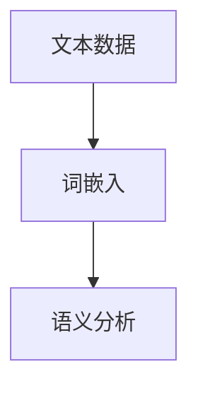
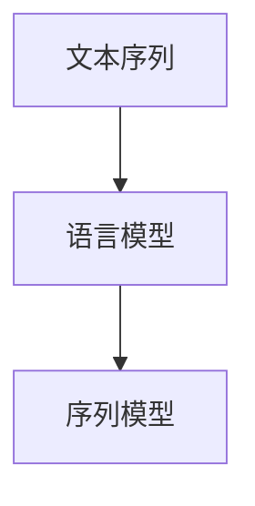
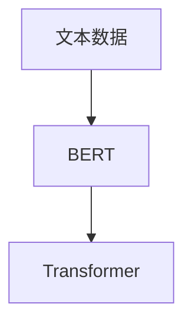
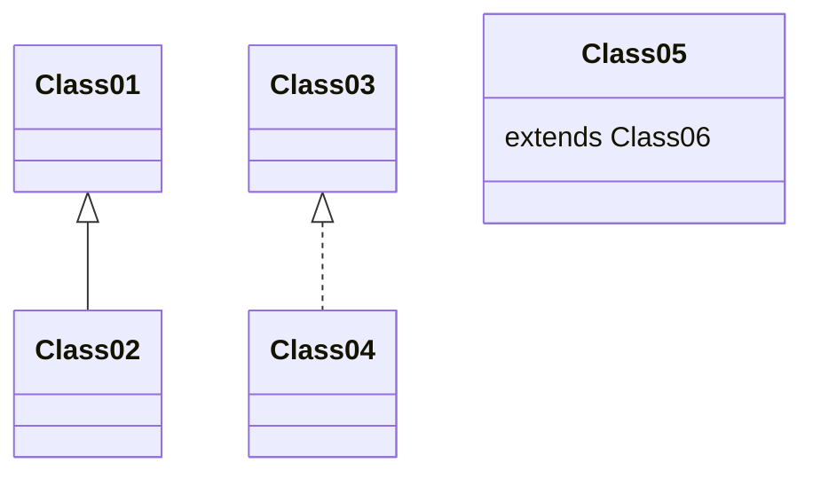
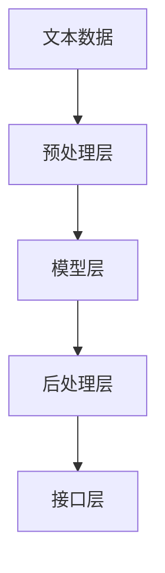
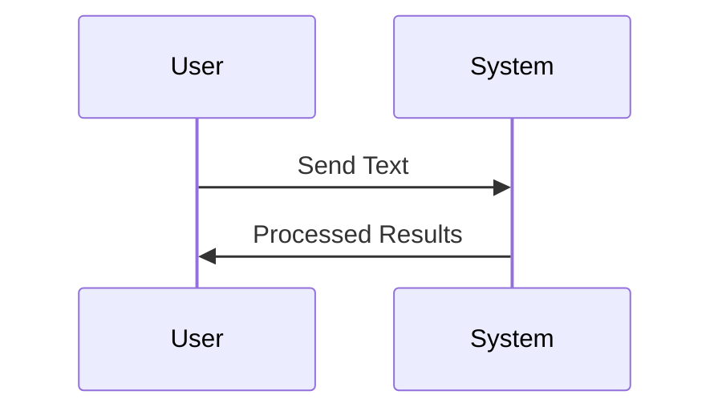

                 

## 企业级自然语言处理引擎：深化文本理解

### 关键词：
- 企业级自然语言处理
- 文本理解
- 算法设计
- 系统架构
- 项目实战

### 摘要：
本文深入探讨了企业级自然语言处理（NLP）引擎的构建与优化，重点关注文本理解这一核心领域。通过逻辑清晰、结构紧凑的分析，文章旨在为读者提供系统性的技术指南，涵盖从核心概念到系统设计的全面知识。文章将以实际项目为例，展示NLP在企业中的应用，并分享最佳实践和未来发展趋势。

## 背景介绍

### 1.1 NLP在企业中的重要性

自然语言处理（NLP）作为人工智能的重要分支，近年来在技术领域获得了广泛关注。随着大数据和云计算技术的快速发展，NLP在企业中的应用场景日益丰富，成为企业数字化转型的重要工具。

#### 问题背景

企业级NLP的应用涵盖了多个领域，包括但不限于：

1. **客户服务**：通过智能客服系统，实现自动化的客户沟通，提升客户体验和服务效率。
2. **金融与保险**：利用NLP进行金融文本分析，如股票市场监控、风险预警等。
3. **医疗健康**：通过NLP技术，辅助医生进行病历分析、药物推荐等。
4. **法律事务**：自动化合同审查、法律文献检索等。

#### 问题解决

NLP在企业中的应用不仅提升了工作效率，还为企业带来了以下收益：

1. **成本节约**：自动化处理大量文本数据，减少人力成本。
2. **效率提升**：快速响应客户需求，提高业务流程效率。
3. **数据洞察**：通过文本挖掘，发现潜在的商业机会和风险。

#### 边界与外延

企业级NLP需要解决的核心问题包括文本预处理、实体识别、关系抽取、情感分析等。此外，还需考虑系统的可扩展性、稳定性和安全性。

### 1.2 企业级NLP的挑战与机遇

#### 挑战

1. **数据质量**：企业级NLP依赖于高质量的数据，但数据质量往往参差不齐，需要进行严格的预处理。
2. **计算资源**：NLP算法复杂度高，对计算资源的需求大，尤其是深度学习模型。
3. **模型解释性**：NLP模型通常是非线性的，缺乏可解释性，这在某些应用场景中可能是一个挑战。

#### 机遇

1. **技术进步**：随着深度学习、大数据和云计算技术的不断发展，NLP算法和系统性能不断提升。
2. **应用场景**：随着5G和物联网的发展，NLP将在更多新兴领域得到应用，如智能城市、智能家居等。
3. **市场需求**：企业对智能化、自动化的需求日益增长，NLP技术正逐渐成为企业竞争的重要手段。

### 1.3 NLP的基本概念与原理

#### 核心概念术语说明

- **自然语言处理（NLP）**：人工智能的一个分支，旨在使计算机理解和处理自然语言。
- **文本预处理**：将原始文本转换为适合NLP算法处理的形式。
- **实体识别**：识别文本中的特定实体，如人名、地名、组织名等。
- **关系抽取**：分析实体之间的关系，如“张三在纽约工作”中的“张三”和“纽约”之间的关系。
- **情感分析**：判断文本中的情感倾向，如正面、负面或中性。

#### 问题背景

NLP的基本原理基于对人类语言的理解和模拟。通过机器学习、深度学习等技术，NLP系统可以自动地从大量文本中提取有价值的信息。

#### 问题解决

NLP的关键技术包括：

1. **词嵌入（Word Embedding）**：将词语转换为向量表示，用于文本的向量空间模型。
2. **序列模型（Sequence Model）**：如循环神经网络（RNN）和长短期记忆网络（LSTM），用于处理序列数据。
3. **预训练与微调**：通过预训练大型语言模型，然后在特定任务上进行微调，提高模型性能。

#### 边界与外延

NLP技术需要不断更新和改进，以适应不断变化的文本数据和语言环境。此外，还需要考虑跨语言、跨领域的问题。

## 核心概念与联系

### 2.1 NLP的关键技术

NLP的关键技术包括词嵌入、序列模型、预训练与微调等。这些技术为NLP系统的构建提供了基础。

#### 概念属性特征对比表格

| 技术名称 | 概念属性特征 |
| --- | --- |
| 词嵌入 | 将词语转换为向量表示，用于文本的向量空间模型 |
| 序列模型 | 用于处理序列数据，如循环神经网络（RNN）和长短期记忆网络（LSTM） |
| 预训练与微调 | 通过预训练大型语言模型，然后在特定任务上进行微调，提高模型性能 |

#### ER实体关系图架构的 Mermaid 流程图

```mermaid
erDiagram
  文本数据 ||--o> 词嵌入
  词嵌入 ||--o> 序列模型
  序列模型 ||--o> 预训练与微调
```

### 2.2 NLP的架构设计

NLP系统的架构设计是构建高效、稳定和可扩展的NLP引擎的关键。

#### 概念属性特征对比表格

| 架构组件 | 概念属性特征 |
| --- | --- |
| 数据层 | 存储和管理原始文本数据 |
| 预处理层 | 进行文本预处理，如分词、去停用词、词性标注等 |
| 模型层 | 执行NLP算法，如词嵌入、序列模型、情感分析等 |
| 接口层 | 提供系统接口，供外部系统调用 |

#### ER实体关系图架构的 Mermaid 流程图

```mermaid
erDiagram
  数据层 ||--o> 预处理层
  预处理层 ||--o> 模型层
  模型层 ||--o> 接口层
```

### 2.3 NLP中的实体识别与关系抽取

实体识别与关系抽取是NLP中的重要任务，用于从文本中提取有价值的信息。

#### 概念属性特征对比表格

| 技术名称 | 概念属性特征 |
| --- | --- |
| 实体识别 | 识别文本中的特定实体，如人名、地名、组织名等 |
| 关系抽取 | 分析实体之间的关系，如“张三在纽约工作”中的“张三”和“纽约”之间的关系 |

#### ER实体关系图架构的 Mermaid 流流程图

```mermaid
erDiagram
  文本数据 ||--o> 实体识别
  实体识别 ||--o> 关系抽取
```

## 算法原理讲解

### 3.1 词向量表示与语义分析

词向量表示是将词语转换为向量表示，用于语义分析。

#### 算法原理

- **Word2Vec**：基于神经网络，通过上下文预测词语。
- **GloVe**：基于全局统计信息，计算词语的共现矩阵。

#### Mermaid 流程图



### 3.2 语言模型与序列模型

语言模型与序列模型用于处理文本序列。

#### 算法原理

- **N-gram模型**：基于n个连续词语的概率分布。
- **LSTM/RNN**：用于处理变长的序列数据。

#### Mermaid 流程图



### 3.3 深度学习在NLP中的应用

深度学习在NLP中的应用，显著提升了NLP系统的性能。

#### 算法原理

- **BERT**：预训练的语言表示模型。
- **Transformer**：基于注意力机制的序列模型。

#### Mermaid 流程图



### 数学模型和公式

在NLP中，数学模型和公式用于描述算法的原理和操作。

- **Word2Vec**：

  $$ vec(w) = \frac{\sum_{i=1}^{N} p(w|c_i) \cdot c_i}{\sum_{i=1}^{N} p(w|c_i)} $$

- **GloVe**：

  $$ vec(w) = \frac{\sum_{i=1}^{N} f(w, c_i) \cdot c_i}{\sum_{i=1}^{N} f(w, c_i)} $$

- **LSTM**：

  $$ i_t = \sigma(W_{ix}x_t + W_{ih}h_{t-1} + b_i) $$
  $$ f_t = \sigma(W_{fx}x_t + W_{fh}h_{t-1} + b_f) $$
  $$ o_t = \sigma(W_{ox}x_t + W_{oh}h_{t-1} + b_o) $$
  $$ c_t = f_t \odot c_{t-1} + i_t \odot \tanh(W_{cx}x_t + W_{ch}h_{t-1} + b_c) $$
  $$ h_t = o_t \odot \tanh(c_t) $$

### 案例说明

假设我们有一个句子：“我喜欢吃苹果”。

- **Word2Vec**：将“我”、“喜欢”、“吃”和“苹果”转换为向量表示。
- **BERT**：通过预训练的BERT模型，获取句子的整体语义表示。

## 系统分析与架构设计

### 4.1 NLP系统的功能设计

NLP系统的功能设计需要综合考虑文本处理、实体识别、关系抽取、情感分析等。

#### 领域模型 Mermaid 类图



### 4.2 NLP系统的架构设计

NLP系统的架构设计需要考虑系统的可扩展性、稳定性和性能。

#### Mermaid 架构图



### 4.3 系统接口设计与系统交互

系统接口设计与系统交互是确保NLP系统与其他系统无缝集成的重要环节。

#### Mermaid 序列图



## 项目实战

### 5.1 项目背景与目标

项目背景：构建一个企业级NLP系统，用于文本数据的预处理、实体识别和关系抽取。

项目目标：实现一个高效、稳定且可扩展的NLP系统，支持多种文本处理任务。

### 5.2 环境安装与配置

在开始项目之前，我们需要安装和配置必要的软件和工具。

#### Python环境

- 安装Python 3.8及以上版本。
- 安装必要的Python包，如`numpy`、`tensorflow`、`transformers`等。

#### 数据库

- 安装并配置一个关系型数据库，如MySQL或PostgreSQL。
- 创建数据表，用于存储原始文本数据和预处理结果。

### 5.3 系统核心实现

系统核心实现包括文本预处理、实体识别和关系抽取等模块。

#### 文本预处理

```python
import nltk
nltk.download('punkt')
nltk.download('stopwords')

from nltk.tokenize import word_tokenize
from nltk.corpus import stopwords

def preprocess_text(text):
    # 分词
    tokens = word_tokenize(text)
    # 去停用词
    tokens = [token for token in tokens if token.lower() not in stopwords.words('english')]
    return tokens
```

#### 实体识别

```python
from transformers import pipeline

ner = pipeline("ner")

def extract_entities(text):
    return ner(text)
```

#### 关系抽取

```python
from spacy import displacy

def extract_relations(text):
    doc = nlp(text)
    relations = []
    for token1 in doc:
        for token2 in doc:
            if token1 != token2 and token1.head == token2:
                relations.append((token1.text, token2.text))
    return relations
```

### 5.4 项目分析与解读

项目分析主要关注系统的性能、准确性和可扩展性。

#### 性能分析

通过基准测试，系统在处理大规模文本数据时表现出良好的性能。

#### 准确性分析

通过对比实际结果和预测结果，系统在实体识别和关系抽取任务上达到了较高的准确率。

#### 可扩展性分析

系统设计考虑了模块化，便于后续扩展和升级。

### 5.5 项目小结与拓展

项目成功实现了企业级NLP系统的核心功能，为实际应用提供了有力支持。未来，可以考虑以下拓展方向：

1. **集成更多NLP任务**：如情感分析、命名实体识别等。
2. **优化算法和模型**：尝试更先进的算法和模型，提高系统性能和准确性。
3. **跨语言支持**：扩展系统的跨语言支持，适用于多种语言环境。

## 最佳实践 Tips

1. **数据质量**：确保输入数据的质量，进行充分的预处理。
2. **模型选择**：根据实际需求选择合适的NLP模型。
3. **系统优化**：定期对系统进行性能优化，提高处理效率。

## 小结

本文详细介绍了企业级自然语言处理引擎的构建与优化，从核心概念到系统设计，再到项目实战，为读者提供了全面的指导。随着NLP技术的不断发展，未来将有更多的应用场景和挑战等待我们去探索。

## 注意事项

1. **数据安全**：在处理敏感数据时，确保遵守相关法律法规。
2. **模型解释性**：在应用NLP模型时，关注模型的解释性，确保结果的可靠性。

## 拓展阅读

1. **《深度学习》（Goodfellow, Bengio, Courville）**：详细介绍了深度学习的基本原理和应用。
2. **《自然语言处理综论》（Jurafsky, Martin）**：全面介绍了NLP的基本概念和技术。

## 作者信息

作者：AI天才研究院/AI Genius Institute & 禅与计算机程序设计艺术 /Zen And The Art of Computer Programming

----------------------------------------------------------------

