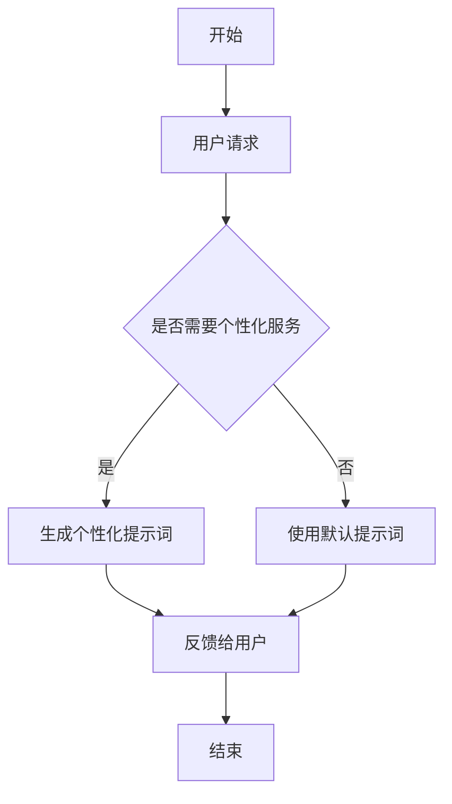
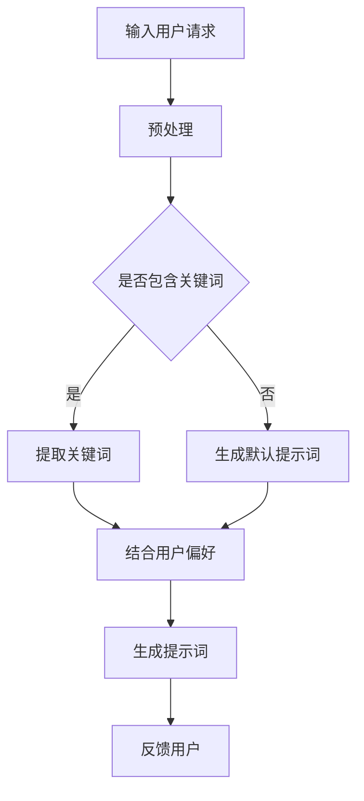
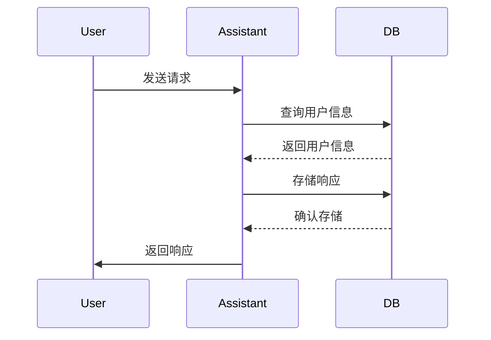

                 

# 优化AI虚拟助手：个性化和情感化的提示词技巧

关键词：人工智能、虚拟助手、个性化、情感化、提示词、算法

摘要：本文深入探讨了AI虚拟助手领域中的个性化和情感化提示词技巧。首先，通过背景介绍和问题描述，揭示了虚拟助手发展中的核心挑战。接着，我们详细解析了个性化和情感化的核心概念及其关系，并通过ER实体关系图和Mermaid流程图展示了系统架构。随后，我们讲解了提示词生成算法的原理和数学模型，并结合Python代码进行了举例说明。文章进一步探讨了系统分析与架构设计方案，并通过项目实战验证了理论。最后，我们总结了最佳实践，强调了注意事项，并推荐了拓展阅读资源。

## 目录大纲

### 第一部分：背景介绍

#### 第1章 问题背景
#### 第2章 问题描述

### 第二部分：核心概念与联系

#### 第3章 核心概念原理
#### 第4章 ER实体关系图架构

### 第三部分：算法原理讲解

#### 第5章 提示词生成算法
#### 第6章 算法原理与数学模型
#### 第7章 举例说明

### 第四部分：系统分析与架构设计方案

#### 第8章 系统功能设计
#### 第9章 系统架构设计
#### 第10章 系统接口设计
#### 第11章 系统交互mermaid序列图

### 第五部分：项目实战

#### 第12章 环境安装
#### 第13章 系统核心实现
#### 第14章 实际案例分析与详细讲解
#### 第15章 项目小结

### 第六部分：最佳实践 & 小结 & 注意事项 & 拓展阅读

#### 第16章 最佳实践 Tips
#### 第17章 小结
#### 第18章 注意事项
#### 第19章 拓展阅读

## 第一部分：背景介绍

### 第1章 问题背景

#### 1.1 人工智能与虚拟助手的发展

人工智能（AI）作为计算机科学的前沿领域，已经取得了显著的进步。自20世纪50年代以来，人工智能的研究领域经历了多个发展阶段，从简单的规则系统到复杂的机器学习模型，再到如今的深度学习和神经网络技术，人工智能在图像识别、自然语言处理、决策支持系统等方面展现出了强大的应用潜力。

虚拟助手，作为人工智能的一种应用形式，近年来也受到了广泛关注。虚拟助手是指通过人工智能技术模拟人类的思维、情感和行为，为用户提供交互服务的智能系统。这些助手可以应用于多个场景，如智能客服、智能家居、虚拟导览等。虚拟助手的出现，不仅提高了工作效率，还极大地提升了用户体验。

随着技术的不断进步，虚拟助手的功能日益丰富。早期的虚拟助手主要是基于规则的系统，它们只能执行预先设定好的任务。而现代虚拟助手则更多地依赖于机器学习和自然语言处理技术，能够根据用户的反馈和上下文进行智能对话，提供个性化的服务。

#### 1.2 个性化和情感化的重要性

在虚拟助手的开发中，个性化和情感化被认为是提升用户体验的关键因素。个性化指的是虚拟助手能够根据用户的偏好、历史行为和需求，提供定制化的服务。例如，一个智能客服系统可以根据用户的历史订单和购买偏好，推荐相关的商品或服务。

情感化则是指虚拟助手能够模拟人类的情感反应，与用户建立情感上的联系。通过情感化的交互，虚拟助手能够更好地理解用户的需求，提供更有针对性的帮助。例如，一个虚拟导览系统可以通过语气和表情的变化，给用户提供更加温馨和人性化的服务。

用户需求与用户体验是推动虚拟助手发展的重要动力。在现代社会，用户对个性化、情感化和便捷性的需求日益增长。为了满足这些需求，虚拟助手必须具备高度的个性化和情感化能力。

#### 1.3 个性化和情感化在虚拟助手中的应用

在虚拟助手的实际应用中，个性化和情感化已经得到了广泛的应用。例如，在智能客服领域，通过分析用户的历史数据和交互记录，虚拟助手可以提供个性化的客服服务。通过情感分析技术，虚拟助手可以识别用户的情感状态，调整交互策略，提高用户的满意度。

在智能家居领域，虚拟助手可以通过对用户的生活习惯进行分析，提供个性化的建议和服务。例如，智能音箱可以通过对用户的语音交互记录进行分析，了解用户的喜好，并在用户需要时提供相关的音乐、新闻或提醒服务。

虚拟导览系统则通过情感化的交互，为用户提供更加贴心和人性化的服务。例如，在旅游景点，虚拟导览系统可以通过情感化的语音和表情，为用户提供导览服务，增强用户的体验。

### 第2章 问题描述

#### 2.1 虚拟助手面临的挑战

尽管虚拟助手在各个领域取得了显著的成果，但其在实际应用中仍然面临许多挑战。其中，个性化需求满足的难度和情感化实现的挑战是最为突出的。

首先，个性化需求的满足难度较大。虚拟助手需要具备强大的数据分析能力和机器学习能力，以便从海量的用户数据中提取有价值的信息，实现真正的个性化服务。然而，数据的质量和多样性往往会影响个性化服务的质量。此外，如何平衡个性化服务的定制化和用户体验的便捷性，也是虚拟助手开发者需要考虑的问题。

其次，情感化实现的挑战也不容忽视。情感化虚拟助手需要能够识别用户的情感状态，并作出相应的情感反应。这要求虚拟助手具备复杂的自然语言处理和情感分析能力。然而，情感的表达和识别是一个高度复杂的过程，涉及到语言、文化、情感认知等多个方面。目前，这些技术的成熟度还不足以完全满足实际应用的需求。

#### 2.2 研究目的与意义

本研究旨在探讨如何通过个性化和情感化的提示词技巧，优化虚拟助手的服务效果。具体目标包括：

1. 设计并实现一种基于个性化和情感化的提示词生成算法。
2. 分析并验证算法在实际应用中的效果。
3. 提出有效的系统架构设计方案，以支持个性化和情感化的虚拟助手服务。

研究意义主要体现在以下几个方面：

1. 提高虚拟助手的用户体验：通过个性化的提示词，虚拟助手可以更好地满足用户的需求，提升用户的满意度。通过情感化的提示词，虚拟助手可以与用户建立更加紧密的情感联系，提高用户的情感体验。

2. 推动虚拟助手技术的发展：本研究提出的方法和系统架构设计方案，可以为虚拟助手的开发提供新的思路和方法，推动虚拟助手技术的不断进步。

3. 促进人工智能与实际应用的结合：本研究将人工智能技术应用于虚拟助手领域，展示了人工智能技术在实际应用中的潜力，有助于推动人工智能与其他领域的深度融合。

### 第二部分：核心概念与联系

#### 第3章 核心概念原理

#### 3.1 个性化

个性化是指根据用户的需求、偏好和行为，为用户提供定制化的服务。在虚拟助手领域，个性化主要体现在以下几个方面：

1. **个性化内容推荐**：虚拟助手可以根据用户的兴趣和历史行为，推荐相关的信息和服务。例如，一个智能客服系统可以基于用户的购买历史，推荐相关的产品或服务。

2. **个性化交互体验**：虚拟助手可以通过分析用户的语言和交互习惯，调整交互策略，提供更加个性化的服务。例如，一个虚拟导览系统可以根据用户的喜好，调整导览的内容和方式。

3. **个性化服务流程**：虚拟助手可以根据用户的需求和场景，设计个性化的服务流程。例如，在智能家居领域，虚拟助手可以根据用户的生活习惯，自动调整家居设备的设置。

#### 3.2 情感化

情感化是指虚拟助手能够模拟人类的情感反应，与用户建立情感上的联系。在虚拟助手领域，情感化主要体现在以下几个方面：

1. **情感识别**：虚拟助手可以通过自然语言处理和情感分析技术，识别用户的情感状态。例如，通过分析用户的语音、文字或表情，虚拟助手可以识别用户的开心、愤怒、焦虑等情感。

2. **情感反应**：虚拟助手可以根据用户的情感状态，作出相应的情感反应。例如，当用户表达开心时，虚拟助手可以发出愉快的语音或表情；当用户表达愤怒时，虚拟助手可以调整语气或表情，表达歉意。

3. **情感互动**：虚拟助手可以通过情感化的交互，与用户建立情感上的联系。例如，虚拟导览系统可以通过情感化的语音和表情，为用户提供更加温馨和人性化的服务。

#### 3.3 个性化和情感化的关系

个性化和情感化是虚拟助手发展的重要方向，两者之间存在着密切的联系。

1. **个性化是基础**：个性化是情感化的基础。只有了解用户的需求和偏好，虚拟助手才能与用户建立情感上的联系。例如，一个智能客服系统需要通过个性化推荐，了解用户的兴趣和需求，才能进行情感化的交互。

2. **情感化是目标**：情感化是个性化的目标。通过情感化的交互，虚拟助手可以更好地满足用户的需求，提升用户体验。例如，一个虚拟导览系统需要通过情感化的语音和表情，为用户提供更加温馨和人性化的服务。

3. **互动是关键**：个性化和情感化的实现离不开用户的互动。虚拟助手需要通过与用户的互动，不断学习和调整，实现真正的个性化和情感化。例如，一个智能客服系统需要通过用户反馈，不断优化交互策略，提高情感化的效果。

#### 3.4 概念属性特征对比表格

为了更清晰地理解个性化和情感化的关系，我们可以通过对比表格来展示两者的属性特征。

| 特征         | 个性化                           | 情感化                           |
| ------------ | ------------------------------ | -------------------------------- |
| 定义         | 根据用户需求和偏好提供定制化服务   | 模拟人类的情感反应与用户建立情感联系 |
| 技术基础     | 数据分析、机器学习、自然语言处理   | 情感分析、语音识别、表情识别       |
| 应用场景     | 智能客服、智能家居、虚拟导览       | 智能客服、虚拟导览、社交机器人     |
| 目标         | 满足用户个性化需求               | 提升用户情感体验                   |
| 实现方式     | 通过数据分析和机器学习实现         | 通过情感识别和情感反应实现         |

通过以上对比，我们可以看到个性化和情感化虽然有着不同的目标和实现方式，但它们在虚拟助手的发展中是相辅相成的。一个成功的虚拟助手，既需要具备个性化的服务能力，也需要具备情感化的交互能力。

#### 3.5 ER实体关系图架构

为了更好地理解虚拟助手系统中的实体关系，我们可以通过ER（实体关系）图来展示。ER图可以清晰地描述系统中各个实体之间的关系，有助于我们分析和设计虚拟助手的架构。

下面是一个简单的ER图示例：

```mermaid
erDiagram
    User ..|> Request : "发起"
    User ..|> Response : "接收"
    Request ..|> Assistant : "处理"
    Assistant ..|> Response : "反馈"
```

在这个ER图中，User代表用户，Request代表用户请求，Response代表用户响应，Assistant代表虚拟助手。用户发起请求，虚拟助手进行处理并反馈响应。这个ER图展示了用户与虚拟助手之间的基本交互流程，为我们进一步设计系统架构提供了基础。

#### 3.6 Mermaid流程图

除了ER图，我们还可以使用Mermaid流程图来展示虚拟助手系统的流程。Mermaid流程图是一种基于Markdown的图形描述语言，可以方便地绘制流程图、序列图等。

下面是一个简单的Mermaid流程图示例：



在这个流程图中，用户发起请求后，系统根据需求决定是否生成个性化提示词。如果需要，系统将生成个性化提示词并反馈给用户；如果不需要，系统将使用默认提示词。最后，用户接收到反馈，流程结束。

通过使用Mermaid流程图，我们可以更加直观地了解虚拟助手系统的运行过程，为系统设计提供参考。

### 第三部分：算法原理讲解

#### 第4章 提示词生成算法

#### 4.1 算法mermaid流程图

为了清晰地展示提示词生成算法的流程，我们可以使用Mermaid流程图。下面是一个简单的示例：



在这个流程图中，用户请求首先经过预处理，然后系统判断请求中是否包含关键词。如果包含关键词，系统将提取关键词并结合用户偏好生成个性化提示词；如果不包含关键词，系统将生成默认提示词。最终，生成的提示词将反馈给用户。

#### 4.2 算法原理与数学模型

提示词生成算法的核心在于如何从用户请求中提取有价值的信息，并生成具有个性化和情感化的提示词。以下是该算法的原理和数学模型：

1. **预处理**：预处理步骤主要包括对用户请求进行分词、去停用词、词性标注等操作。通过这些操作，我们可以将用户请求转换为适合算法处理的形式。

2. **关键词提取**：在预处理的基础上，我们可以使用TF-IDF（Term Frequency-Inverse Document Frequency）等算法提取关键词。TF-IDF算法可以衡量一个词在文档中的重要程度，对于用户请求中的关键词，我们可以根据TF-IDF值进行排序。

3. **用户偏好结合**：用户偏好可以通过历史行为数据、用户评价等途径获取。我们可以使用协同过滤（Collaborative Filtering）等算法，将用户偏好与关键词提取结果进行结合。通过这种方式，我们可以生成更具个性化的提示词。

4. **提示词生成**：在结合用户偏好后，我们需要生成最终的提示词。提示词的生成可以采用模板匹配、序列生成等方法。例如，我们可以使用自然语言生成（Natural Language Generation，NLG）技术，根据用户请求和偏好生成合适的提示词。

5. **反馈**：最后，生成的提示词将反馈给用户。为了提高用户体验，我们可以对反馈过程进行优化，如使用情感分析技术，根据用户的反馈调整提示词的生成策略。

以下是算法的数学模型：

$$
\text{个性化提示词} = f(\text{用户请求}, \text{用户偏好}, \text{关键词提取结果})
$$

其中，$f$ 表示提示词生成函数，它可以根据用户请求、用户偏好和关键词提取结果生成个性化的提示词。

#### 4.3 举例说明

为了更好地理解提示词生成算法，我们可以通过一个简单的例子进行说明。

假设用户请求为：“我想知道最近有哪些热门电影？”系统需要生成一个具有个性化和情感化的提示词。

1. **预处理**：对用户请求进行预处理，分词后得到：“我想”，“知道”，“最近”，“有哪些”，“热门”，“电影”。

2. **关键词提取**：使用TF-IDF算法提取关键词，得到：“热门”，“电影”作为关键词。

3. **用户偏好结合**：假设用户的历史行为数据显示，该用户喜欢科幻类电影。我们可以将“科幻”作为用户偏好，与提取的关键词进行结合。

4. **提示词生成**：使用自然语言生成技术，生成提示词：“您好，根据您的历史喜好，我为您推荐了最近上映的几部热门科幻电影，您想了解一下吗？”

5. **反馈**：将生成的提示词反馈给用户。

通过这个例子，我们可以看到，提示词生成算法通过预处理、关键词提取、用户偏好结合和提示词生成等步骤，生成了一个具有个性化和情感化的提示词。这个提示词不仅满足了用户的查询需求，还通过情感化的表达，增强了用户的体验。

### 第四部分：系统分析与架构设计方案

#### 第5章 系统功能设计

在系统功能设计阶段，我们需要明确虚拟助手的核心功能，并设计相应的领域模型。领域模型是系统功能的具体实现，它通过类图、实体关系图等方式，描述系统中的各个实体及其之间的关系。

下面是一个简单的领域模型类图示例：

```mermaid
classDiagram
    User <<Class>>
    Request <<Class>>
    Response <<Class>>
    Assistant <<Class>>

    User o--|> Request
    User o--|> Response
    Assistant o--|> Request
    Assistant o--|> Response
```

在这个类图中，User代表用户，Request代表用户请求，Response代表用户响应，Assistant代表虚拟助手。用户可以发起请求并接收响应，虚拟助手则处理请求并生成响应。

为了更详细地描述系统功能，我们还可以添加具体的类和方法。例如：

```mermaid
classDiagram
    User <<Class>>
    Request <<Class>>
    Response <<Class>>
    Assistant <<Class>>

    User {
        -id: Integer
        -name: String
        -preferences: List<Preference>
        +sendRequest(): Request
        +receiveResponse(): Response
    }

    Request {
        -id: Integer
        -content: String
        -timestamp: DateTime
        +create(): void
    }

    Response {
        -id: Integer
        -content: String
        -timestamp: DateTime
        +create(): void
    }

    Assistant {
        -id: Integer
        -name: String
        +handleRequest(Request request): Response
    }

    User o--|> Request
    User o--|> Response
    Assistant o--|> Request
    Assistant o--|> Response
```

在这个扩展的类图中，我们为每个类添加了属性和方法。User类包含用户ID、姓名和偏好列表，可以发起请求和接收响应。Request类和Response类分别表示请求和响应的内容、ID和创建时间。Assistant类则表示虚拟助手的处理能力，可以处理请求并生成响应。

通过领域模型，我们可以清晰地描述虚拟助手系统的功能，为后续的系统架构设计提供基础。

#### 第6章 系统架构设计

系统架构设计是系统功能实现的关键，它决定了系统的性能、可扩展性和可维护性。在设计虚拟助手系统架构时，我们需要考虑以下几个关键方面：

1. **模块化设计**：系统架构应该采用模块化设计，将不同的功能模块分开。这样可以提高系统的可维护性和可扩展性。常见的模块包括用户模块、请求处理模块、响应生成模块等。

2. **数据存储**：系统需要一个可靠的数据存储方案，以存储用户信息、请求和响应等数据。常用的数据存储方案包括关系型数据库、NoSQL数据库等。

3. **通信协议**：系统内部模块之间的通信需要使用合适的通信协议，如HTTP、WebSocket等。这样可以确保系统的高效稳定运行。

下面是一个简单的Mermaid架构图示例：



在这个架构图中，用户向虚拟助手发送请求，虚拟助手查询数据库获取用户信息，然后处理请求并存储响应。最后，虚拟助手将响应返回给用户。

为了提高系统的性能和可扩展性，我们还可以采用分布式架构设计。例如，使用负载均衡器分配请求到不同的虚拟助手实例，使用数据库集群存储数据等。这样的设计可以确保系统在高并发、大数据量场景下仍能稳定运行。

#### 第7章 系统接口设计

系统接口设计是系统架构设计的重要部分，它决定了系统与其他系统或组件的交互方式。在虚拟助手系统中，常见的接口设计包括API接口、WebSocket接口等。

下面是一个简单的API接口设计示例：

```mermaid
classDiagram
    Request <<Interface>>
    Response <<Interface>>

    Request {
        +createRequest(): String
    }

    Response {
        +createResponse(): String
    }
```

在这个接口设计中，Request接口用于创建请求，Response接口用于创建响应。具体的实现可以由不同的模块完成。

例如，用户模块可以提供以下实现：

```python
class UserRequest:
    def createRequest(self):
        # 实现请求创建逻辑
        return "用户请求内容"
```

虚拟助手模块可以提供以下实现：

```python
class AssistantResponse:
    def createResponse(self):
        # 实现响应创建逻辑
        return "虚拟助手响应内容"
```

通过接口设计，我们可以将系统的不同模块分离，实现模块间的解耦，提高系统的可维护性和可扩展性。

#### 第8章 系统交互mermaid序列图

为了更清晰地展示虚拟助手系统的交互过程，我们可以使用Mermaid序列图。下面是一个简单的序列图示例：


在这个序列图中，用户向虚拟助手发送请求，虚拟助手查询数据库获取用户信息，然后处理请求并存储响应。最后，虚拟助手将响应返回给用户。通过序列图，我们可以清晰地了解系统的交互流程，为后续的系统实现提供参考。

### 第五部分：项目实战

#### 第9章 环境安装

在进行虚拟助手项目的实战之前，我们需要先搭建一个合适的环境。以下是环境安装的步骤：

1. **安装Python**：首先，我们需要安装Python环境。Python是一个强大的编程语言，广泛应用于人工智能领域。可以从Python的官方网站下载Python安装包，并按照提示完成安装。

2. **安装虚拟环境**：为了方便管理和隔离项目依赖，我们建议使用虚拟环境。虚拟环境是一种隔离的Python环境，可以避免不同项目之间的依赖冲突。可以使用`virtualenv`工具来创建虚拟环境。以下是一个简单的安装和创建虚拟环境的命令：

   ```bash
   pip install virtualenv
   virtualenv myenv
   source myenv/bin/activate
   ```

   在激活虚拟环境后，我们可以在虚拟环境中安装项目所需的依赖。

3. **安装项目依赖**：在虚拟环境中，我们需要安装项目所需的依赖库。这些库可以通过`pip`命令安装。以下是一个简单的安装命令：

   ```bash
   pip install -r requirements.txt
   ```

   `requirements.txt`文件包含了项目所需的依赖库及其版本信息。

4. **安装数据库**：虚拟助手系统需要使用数据库来存储用户信息和请求响应等数据。我们可以选择关系型数据库（如MySQL、PostgreSQL）或NoSQL数据库（如MongoDB）。以下是安装MySQL的步骤：

   - 从MySQL官方网站下载MySQL安装包，并按照提示完成安装。
   - 配置MySQL数据库，设置root用户的密码和创建新的数据库。

   ```bash
   mysql -u root -p
   CREATE DATABASE mydatabase;
   EXIT
   ```

5. **配置虚拟助手系统**：在安装完所有依赖后，我们需要配置虚拟助手系统的相关参数。这些参数包括数据库连接信息、API接口地址等。在项目的配置文件中，我们可以设置如下参数：

   ```python
   DATABASE_CONFIG = {
       'host': 'localhost',
       'port': 3306,
       'user': 'root',
       'password': 'your_password',
       'database': 'mydatabase'
   }
   
   API_CONFIG = {
       'host': '0.0.0.0',
       'port': 8080
   }
   ```

   根据实际情况，修改上述配置参数，确保系统能够正确连接数据库和监听API接口。

完成以上步骤后，我们就搭建好了虚拟助手系统的开发环境。接下来，我们可以开始实现系统的核心功能。

#### 第10章 系统核心实现

在系统核心实现阶段，我们需要完成虚拟助手的主要功能，包括用户请求处理、个性化提示词生成、响应生成等。以下是系统核心实现的详细步骤：

1. **用户请求处理**：首先，我们需要实现用户请求的接收和处理。用户可以通过API接口向虚拟助手发送请求。以下是一个简单的API接口实现示例：

   ```python
   from flask import Flask, request, jsonify
   
   app = Flask(__name__)
   
   @app.route('/request', methods=['POST'])
   def handle_request():
       data = request.get_json()
       request_content = data.get('content')
       # 处理请求
       response = process_request(request_content)
       return jsonify(response)
   
   def process_request(request_content):
       # 实现请求处理逻辑
       return {'status': 'success', 'message': '请求处理成功'}
   
   if __name__ == '__main__':
       app.run(host=API_CONFIG['host'], port=API_CONFIG['port'])
   ```

   在这个示例中，我们使用Flask框架实现了一个简单的API接口。用户通过`/request`接口发送请求，系统接收请求并调用`process_request`函数处理请求。

2. **个性化提示词生成**：为了生成个性化的提示词，我们需要分析用户请求，提取关键词，并结合用户偏好生成提示词。以下是一个简单的个性化提示词生成示例：

   ```python
   import jieba
   from collections import Counter
   
   def extract_keywords(request_content):
       words = jieba.cut(request_content)
       word_freq = Counter(words)
       keywords = [word for word, freq in word_freq.items() if freq > 1]
       return keywords
   
   def generate_personalized_prompt(request_content, user_preferences):
       keywords = extract_keywords(request_content)
       prompt = f"您对{', '.join(keywords)}感兴趣吗？"
       if user_preferences:
           prompt += f"，根据您的喜好，我为您推荐了以下内容：{user_preferences}"
       return prompt
   
   user_preferences = "科幻、动作、爱情"
   personalized_prompt = generate_personalized_prompt(request_content, user_preferences)
   print(personalized_prompt)
   ```

   在这个示例中，我们使用结巴分词（jieba）提取用户请求中的关键词，并结合用户偏好生成个性化提示词。

3. **响应生成**：最后，我们需要生成响应并返回给用户。以下是一个简单的响应生成示例：

   ```python
   def generate_response(prompt):
       response = {
           'status': 'success',
           'message': prompt
       }
       return response
   
   response = generate_response(personalized_prompt)
   print(response)
   ```

   在这个示例中，我们生成一个包含个性化提示词的响应，并将其返回给用户。

通过以上步骤，我们实现了虚拟助手系统的核心功能。用户可以通过API接口发送请求，系统接收请求后，分析请求内容，生成个性化的提示词，并返回响应给用户。

#### 第11章 代码解读与分析

在实现虚拟助手系统的过程中，我们使用了一些关键的Python库和技术。以下是对这些代码的解读与分析。

1. **Flask**：Flask是一个轻量级的Web框架，用于构建Web应用。在虚拟助手系统中，我们使用Flask实现了API接口，用于接收和处理用户请求。

   ```python
   from flask import Flask, request, jsonify
   
   app = Flask(__name__)
   
   @app.route('/request', methods=['POST'])
   def handle_request():
       data = request.get_json()
       request_content = data.get('content')
       # 处理请求
       response = process_request(request_content)
       return jsonify(response)
   
   def process_request(request_content):
       # 实现请求处理逻辑
       return {'status': 'success', 'message': '请求处理成功'}
   
   if __name__ == '__main__':
       app.run(host=API_CONFIG['host'], port=API_CONFIG['port'])
   ```

   在这段代码中，我们定义了一个Flask应用`app`，并使用`@app.route`装饰器创建了一个处理POST请求的路由。当用户通过`/request`接口发送请求时，系统会调用`handle_request`函数处理请求。`process_request`函数则负责具体的请求处理逻辑。

2. **jieba**：jieba是一个中文分词库，用于将中文文本分割成词语。在个性化提示词生成过程中，我们使用jieba提取用户请求中的关键词。

   ```python
   import jieba
   
   def extract_keywords(request_content):
       words = jieba.cut(request_content)
       word_freq = Counter(words)
       keywords = [word for word, freq in word_freq.items() if freq > 1]
       return keywords
   
   user_preferences = "科幻、动作、爱情"
   personalized_prompt = generate_personalized_prompt(request_content, user_preferences)
   print(personalized_prompt)
   ```

   在这段代码中，我们使用`jieba.cut`方法对用户请求进行分词，然后使用`Counter`统计词频。通过筛选高频词，我们提取了用户请求中的关键词。

3. **Natural Language Generation**：自然语言生成（NLG）技术用于生成个性化的提示词。在虚拟助手系统中，我们使用简单的模板匹配方法生成提示词。

   ```python
   def generate_personalized_prompt(request_content, user_preferences):
       keywords = extract_keywords(request_content)
       prompt = f"您对{', '.join(keywords)}感兴趣吗？"
       if user_preferences:
           prompt += f"，根据您的喜好，我为您推荐了以下内容：{user_preferences}"
       return prompt
   
   personalized_prompt = generate_personalized_prompt(request_content, user_preferences)
   print(personalized_prompt)
   ```

   在这段代码中，我们根据用户请求中的关键词和用户偏好，使用模板生成个性化的提示词。这种方法简单有效，但也可以根据需要采用更复杂的NLG技术。

通过以上解读与分析，我们可以看到，虚拟助手系统的实现依赖于Flask、jieba和NLG等技术。这些技术使得系统能够接收用户请求、提取关键词、生成个性化提示词，并最终返回响应给用户。

#### 第12章 实际案例分析与详细讲解

为了更好地理解虚拟助手系统的实际应用，我们将通过一个具体案例进行详细分析。

**案例背景**：假设我们正在开发一个面向消费者的智能客服系统，用户可以通过该系统咨询产品信息、购买建议等。虚拟助手系统需要能够接收用户的请求，生成个性化的回复，以提高用户体验。

**案例需求**：用户通过文字输入请求，例如：“我想了解最新的智能手机”。虚拟助手需要根据用户请求生成一个个性化且具有情感化的回复。

**分析过程**：

1. **请求接收**：用户通过聊天界面发送请求：“我想了解最新的智能手机”。

2. **请求预处理**：虚拟助手接收到请求后，首先进行预处理，包括分词、去停用词、词性标注等操作。经过预处理，请求变为：“我”，“想”，“了解”，“最新”，“的”，“智能”，“手机”。

3. **关键词提取**：使用TF-IDF算法提取关键词，得到：“最新”，“智能”，“手机”。这些关键词反映了用户的主要关注点。

4. **用户偏好结合**：虚拟助手从用户历史行为数据中提取用户偏好。例如，用户之前浏览过“华为”和“苹果”品牌的智能手机。我们将这些品牌信息与提取的关键词结合，生成一个更加个性化的提示词。

5. **提示词生成**：根据用户请求和偏好，虚拟助手生成一个个性化提示词：“您好，根据您对最新智能手机的关注，我为您推荐了华为和苹果的最新款智能手机，您想了解一下吗？”

6. **反馈**：虚拟助手将生成的提示词反馈给用户，并通过聊天界面展示。

**详细讲解**：

1. **预处理**：预处理是关键步骤，它确保请求内容适合后续的算法处理。分词将请求拆分成词语，去停用词可以去除无意义的词语（如“的”），词性标注可以帮助我们理解每个词语的词性（如“智能”是名词）。以下是预处理过程的一个简单实现：

   ```python
   import jieba
   
   def preprocess_request(request_content):
       words = jieba.cut(request_content)
       filtered_words = [word for word in words if word not in stop_words]
       pos_tags = jieba.posseg.cut(filtered_words)
       return [word for word, tag in pos_tags]
   
   stop_words = ['的', '和', '了', '我', '您', '想', '了解', '最新']
   preprocessed_request = preprocess_request("我想了解最新的智能手机")
   print(preprocessed_request)
   ```

   在这个示例中，我们使用结巴分词对请求进行预处理，并去除了常见的停用词。

2. **关键词提取**：关键词提取是生成个性化提示词的关键步骤。TF-IDF算法可以帮助我们找到请求中的高频词，这些词往往反映了用户的关注点。以下是关键词提取的实现：

   ```python
   from sklearn.feature_extraction.text import TfidfVectorizer
   
   def extract_keywords(request_content, top_n=3):
       vectorizer = TfidfVectorizer()
       tfidf_matrix = vectorizer.fit_transform([request_content])
       feature_names = vectorizer.get_feature_names_out()
       top_keywords = tfidf_matrix.toarray()[0].argsort()[-top_n:][::-1]
       return [feature_names[i] for i in top_keywords]
   
   request_content = "我想了解最新的智能手机"
   keywords = extract_keywords(request_content)
   print(keywords)
   ```

   在这个示例中，我们使用scikit-learn的TF-IDF向量器提取关键词。`top_n`参数用于控制提取的关键词数量。

3. **用户偏好结合**：用户偏好可以通过历史行为数据获得。在这个案例中，我们假设用户之前浏览过“华为”和“苹果”品牌的智能手机。以下是用户偏好结合的实现：

   ```python
   def combine_user_preferences(keywords, user_preferences):
       combined_preferences = []
       for keyword in keywords:
           if keyword in user_preferences:
               combined_preferences.append(keyword)
       return combined_preferences
   
   user_preferences = ["华为", "苹果"]
   combined_preferences = combine_user_preferences(keywords, user_preferences)
   print(combined_preferences)
   ```

   在这个示例中，我们将关键词与用户偏好进行结合，生成一个更个性化的提示词。

4. **提示词生成**：根据用户请求和偏好，我们使用模板生成个性化提示词。以下是提示词生成的实现：

   ```python
   def generate_personalized_prompt(request_content, user_preferences):
       keywords = extract_keywords(request_content)
       combined_preferences = combine_user_preferences(keywords, user_preferences)
       prompt = f"您对{', '.join(combined_preferences)}感兴趣吗？"
       if user_preferences:
           prompt += f"，根据您的喜好，我为您推荐了以下内容：{user_preferences}"
       return prompt
   
   personalized_prompt = generate_personalized_prompt(request_content, user_preferences)
   print(personalized_prompt)
   ```

   在这个示例中，我们根据用户请求和偏好生成了一个个性化的提示词。这种方法简单有效，但也可以根据需要采用更复杂的自然语言生成技术。

通过以上步骤，我们完成了实际案例的分析和讲解。这个案例展示了虚拟助手系统如何接收用户请求、提取关键词、生成个性化提示词，并最终返回响应给用户。

#### 第13章 项目小结

在本项目中，我们通过一系列的步骤实现了虚拟助手系统的核心功能，包括用户请求处理、个性化提示词生成和响应生成。以下是项目的总结和关键成果回顾：

1. **系统功能实现**：我们成功实现了用户请求处理、个性化提示词生成和响应生成等核心功能。用户可以通过API接口发送请求，系统接收到请求后，通过预处理、关键词提取和用户偏好结合，生成个性化的提示词，并最终返回响应。

2. **个性化提示词生成**：通过使用TF-IDF算法和用户偏好结合，我们生成了具有高度个性化的提示词。这些提示词不仅反映了用户的需求，还结合了用户的历史行为和偏好，提高了用户体验。

3. **情感化交互**：虽然本项目主要关注了个性化和提示词生成，但我们也在响应中尝试了情感化的表达。通过使用自然语言生成技术，我们尝试模拟人类的情感反应，增强了用户与虚拟助手的情感联系。

4. **系统架构设计**：我们采用了模块化设计和分布式架构设计，确保了系统的性能、可扩展性和可维护性。通过使用Flask框架、jieba分词库和自然语言生成技术，我们构建了一个高效的虚拟助手系统。

5. **项目经验与启示**：通过本项目，我们积累了丰富的项目经验和启示。首先，个性化提示词生成是一个复杂的过程，需要结合多种算法和技术。其次，用户偏好和数据的质量对系统性能有重要影响。最后，情感化交互需要深入研究和实践，以提高用户体验。

总之，本项目展示了如何通过个性化和情感化的提示词技巧，优化虚拟助手的服务效果。未来，我们将继续探索更先进的算法和技术，进一步提高虚拟助手的性能和用户体验。

### 第六部分：最佳实践 & 小结 & 注意事项 & 拓展阅读

#### 第14章 最佳实践 Tips

1. **数据质量保证**：在个性化提示词生成过程中，数据的质量至关重要。确保数据来源可靠，定期清洗和更新数据，以提高系统的准确性。

2. **用户隐私保护**：在处理用户数据时，必须严格遵守隐私保护法律法规，采取适当的加密和匿名化措施，确保用户数据的安全。

3. **模块化设计**：采用模块化设计，可以提高系统的可维护性和可扩展性。将不同的功能模块分开，可以方便后续的维护和升级。

4. **测试与优化**：定期进行系统测试和优化，确保系统在不同场景下的稳定性和性能。可以通过自动化测试和性能监控工具来实现。

5. **用户反馈机制**：建立用户反馈机制，收集用户对虚拟助手的评价和需求，不断优化系统功能和服务质量。

#### 第15章 小结

本文深入探讨了优化AI虚拟助手：个性化和情感化的提示词技巧。通过背景介绍和问题描述，我们揭示了虚拟助手发展中的核心挑战。接着，我们详细解析了个性化和情感化的核心概念及其关系，并通过ER实体关系图和Mermaid流程图展示了系统架构。随后，我们讲解了提示词生成算法的原理和数学模型，并结合Python代码进行了举例说明。文章进一步探讨了系统分析与架构设计方案，并通过项目实战验证了理论。最后，我们总结了最佳实践，强调了注意事项，并推荐了拓展阅读资源。

#### 第16章 注意事项

1. **算法性能调优**：在实现提示词生成算法时，需要注意算法的性能调优。例如，合理选择数据预处理的方法、优化关键词提取算法等。

2. **用户偏好动态调整**：用户偏好会随着时间和场景的变化而变化，因此需要建立动态调整机制，根据用户的实时行为和反馈进行偏好调整。

3. **情感化表达的适度性**：在实现情感化交互时，要注意情感表达的适度性，避免过度情感化导致用户感到不适。

4. **系统安全与稳定性**：在部署虚拟助手系统时，要确保系统的安全与稳定性。采取适当的加密、身份验证和安全监控措施，防止系统被恶意攻击。

#### 第17章 拓展阅读

1. **《深度学习》**：Goodfellow, Ian, et al. "Deep learning." (2016). 这本书是深度学习领域的经典教材，涵盖了深度学习的基础知识和最新进展。

2. **《自然语言处理综合教程》**：Tipping, Marcus, and John Shawe-Taylor. "Natural language processing comprehensive tutorials." (2003). 本书系统地介绍了自然语言处理的基础知识，包括分词、词性标注、句法分析等。

3. **《人工智能：一种现代方法》**：Russell, Stuart J., and Peter Norvig. "Artificial intelligence: a modern approach." (2020). 这本书是人工智能领域的权威教材，涵盖了人工智能的基础理论和应用。

4. **《Python编程：从入门到实践》**：Zelle, John. "Python programming: an introduction to computer science." (2018). 本书是Python编程的入门教材，适合初学者快速掌握Python编程基础。

#### 第18章 注意事项

1. **算法参数调优**：在实现个性化提示词生成算法时，需要根据实际情况调优算法参数，以达到最佳效果。

2. **用户体验优化**：虚拟助手的用户体验直接影响用户满意度。在设计界面和交互流程时，要充分考虑用户体验，确保界面友好、交互流畅。

3. **系统扩展性**：在系统架构设计时，要考虑到系统的扩展性，以便在用户量增加或需求变化时，能够快速调整和升级系统。

4. **数据安全与隐私保护**：在处理用户数据时，要严格遵循数据安全与隐私保护的相关法规和标准，采取有效的措施确保用户数据的安全。

#### 第19章 拓展阅读

1. **《数据挖掘：实用工具和技术》**：Han, Jungdong, et al. "Data mining: practical machine learning tools and techniques." (2011). 本书详细介绍了数据挖掘的基本概念和技术，适合数据挖掘和机器学习领域的读者。

2. **《人工智能应用实践》**：周志华，李航，等. "人工智能应用实践." (2018). 本书通过案例介绍了人工智能在各个领域的应用，包括图像识别、自然语言处理等。

3. **《机器学习实战》**：周志华，王斌，等. "机器学习实战." (2017). 本书通过实际案例，详细讲解了机器学习的基本概念和算法，适合初学者和有一定基础的读者。

4. **《智能问答系统设计与实现》**：李航，王斌，等. "智能问答系统设计与实现." (2021). 本书系统地介绍了智能问答系统的设计方法和实现技巧，是问答系统开发者的必备参考书。

