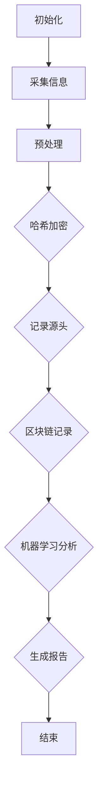
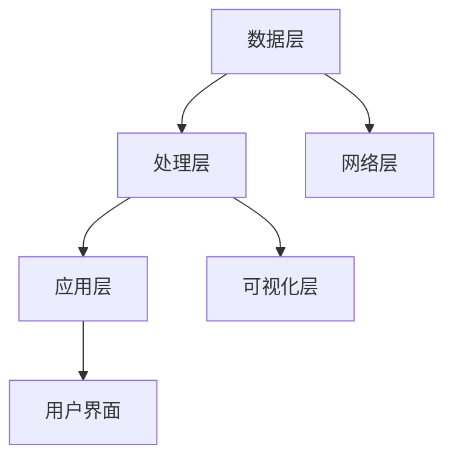
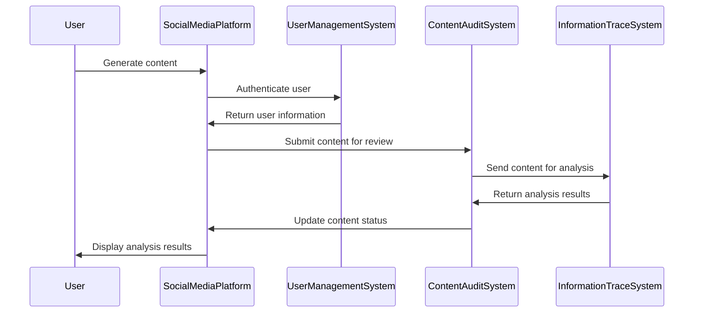

                 

### 文章标题：信息溯源技术：虚假信息安全的关键支撑

#### 关键词：
- 信息溯源技术
- 虚假信息安全
- 算法原理
- 数学模型
- 系统架构
- 项目实战

#### 摘要：
本文将深入探讨信息溯源技术在虚假信息安全中的作用。首先，我们将回顾信息溯源技术的背景和重要性，接着详细阐述其核心概念与联系。随后，通过算法原理讲解和数学模型分析，我们将深入了解信息溯源技术的工作机制。此外，本文还将展示一个实际项目，详细解析其系统分析与架构设计方案。最后，我们将总结最佳实践，提供注意事项，并推荐拓展阅读资源，帮助读者更好地理解和应用信息溯源技术。

### 目录：

1. **第一部分：信息溯源技术概述**
   - 第1章：信息溯源技术的背景与重要性
   - 第2章：信息溯源技术的核心概念与联系
   - 第3章：信息溯源算法原理讲解
   - 第4章：数学模型和数学公式讲解与实例分析
   - 第5章：信息溯源技术的系统分析与架构设计
   - 第6章：信息溯源技术的项目实战
   - 第7章：最佳实践、小结与注意事项

### 第一部分：信息溯源技术概述

#### 第1章：信息溯源技术的背景与重要性

##### 1.1 信息溯源技术的基本概念

信息溯源技术，简称溯源技术，是指通过特定手段和方法，对信息来源、传递过程及其变化进行追踪和分析的技术。这一技术的基本概念涵盖了数据采集、处理、分析和可视化等多个方面。

在信息安全领域，信息溯源技术的核心在于识别和验证信息的真实性和可信度。随着互联网的普及和信息技术的快速发展，虚假信息、伪造数据和网络安全威胁日益增加，这对个人、企业和整个社会造成了严重的影响。因此，信息溯源技术成为保障信息真实性、提高信息安全的关键支撑。

##### 1.2 信息溯源技术的发展历程

信息溯源技术的发展可以追溯到上世纪80年代，当时主要是为了解决计算机系统中的数据追踪问题。随着数据量的爆炸性增长和网络安全威胁的加剧，溯源技术逐渐成为信息安全领域的研究热点。进入21世纪，随着大数据、云计算和人工智能等技术的融合与发展，信息溯源技术得到了进一步的应用和优化。

##### 1.3 信息溯源技术在虚假信息安全中的关键作用

在虚假信息安全方面，信息溯源技术具有以下几个关键作用：

1. **识别虚假信息源**：通过追踪信息来源，可以快速识别并锁定虚假信息的发布者，从而防止谣言和误导性信息的传播。
2. **追溯信息传播路径**：分析信息在互联网上的传播路径，可以揭示虚假信息的扩散过程，帮助相关部门采取有效的干预措施。
3. **提升信息安全水平**：通过对信息来源和传播过程的监控，可以及时发现和处理潜在的网络安全威胁，提高整体信息安全水平。

#### 第2章：信息溯源技术的核心概念与联系

##### 2.1 信息溯源技术的核心概念

信息溯源技术的核心概念包括：

1. **数据采集**：收集与信息相关的各种数据，如文本、图像、音频、视频等。
2. **数据处理**：对采集到的数据进行清洗、整合和预处理，为后续分析提供基础。
3. **信息分析**：通过算法和模型对处理后的数据进行分析，识别信息的真实性和可信度。
4. **可视化展示**：将分析结果以图表、地图等形式展示，便于用户理解和决策。

##### 2.2 信息溯源技术的概念属性对比表格

| 概念       | 定义                                                         | 关键属性                   |
|------------|--------------------------------------------------------------|----------------------------|
| 数据采集   | 收集与信息相关的各种数据                                   | 实时性、全面性、准确性     |
| 数据处理   | 对采集到的数据进行清洗、整合和预处理                         | 一致性、高效性、准确性     |
| 信息分析   | 通过算法和模型对处理后的数据进行分析，识别信息的真实性和可信度 | 自动化、准确性、实时性     |
| 可视化展示 | 将分析结果以图表、地图等形式展示                           | 易理解、可视化、交互性     |

##### 2.3 信息溯源技术的ER实体关系图

```mermaid
erDiagram
    Person ||--|{ Information }|--|{ Source }
    Information ||--|{ Analysis }|--|{ Result }
    Source ||--|{ Trace }|--|{ Report }
```

在这个ER实体关系图中，"Person"（人）是信息的来源，"Information"（信息）是数据采集的对象，"Source"（源头）记录了信息的来源和传播路径，"Analysis"（分析）对信息进行加工和处理，"Result"（结果）是分析的结果，"Trace"（追踪）记录了信息传播的过程，"Report"（报告）是最终的可视化展示结果。

#### 第3章：信息溯源算法原理讲解

##### 3.1 常见信息溯源算法介绍

信息溯源技术中常用的算法包括：

1. **基于哈希的溯源算法**：利用哈希函数对信息进行加密处理，生成唯一的哈希值，从而追踪信息源头。
2. **基于区块链的溯源算法**：利用区块链技术记录信息的传播路径，确保信息的真实性和不可篡改性。
3. **基于机器学习的溯源算法**：通过机器学习模型对信息进行分析和分类，识别虚假信息和可疑源头。

##### 3.2 算法原理Mermaid流程图



在这个流程图中，A表示初始化阶段，B表示采集信息，C表示预处理，D表示哈希加密，E表示记录源头，F表示区块链记录，G表示机器学习分析，H表示生成报告，I表示结束。

##### 3.3 算法原理的数学模型与公式

1. **哈希加密模型**：

   $$ H(D) = \text{Hash}(D) $$

   其中，$H$表示哈希函数，$D$表示输入数据。

2. **区块链记录模型**：

   $$ \text{Blockchain} = \{ \text{Block}_1, \text{Block}_2, ..., \text{Block}_n \} $$

   其中，$\text{Blockchain}$表示区块链，$\text{Block}_i$表示第$i$个区块。

3. **机器学习分析模型**：

   $$ \text{Probability}(X \text{ is false}) = \frac{\text{False Samples}}{\text{Total Samples}} $$

   其中，$X$表示信息，$\text{False Samples}$表示虚假样本数量，$\text{Total Samples}$表示总样本数量。

##### 3.4 通俗易懂的举例说明

假设我们有一个文本信息：“今天的天气非常好，适合出门散步。”为了进行信息溯源，我们可以采取以下步骤：

1. **采集信息**：将文本信息输入系统。
2. **预处理**：对文本进行分词、去噪等处理，提取关键信息。
3. **哈希加密**：利用哈希函数对预处理后的文本进行加密，生成唯一的哈希值。
4. **记录源头**：将哈希值和文本信息关联，记录在区块链上。
5. **机器学习分析**：利用机器学习模型对文本进行分析，判断其真实性。
6. **生成报告**：将分析结果以报告形式展示，包括文本的哈希值、来源和真实性判断。

通过这个过程，我们可以实现对虚假信息的识别和溯源，从而提高信息安全性。

#### 第4章：数学模型和数学公式讲解与实例分析

##### 4.1 数学模型讲解

在本章节中，我们将进一步讲解信息溯源技术中的数学模型，包括哈希模型、区块链模型和机器学习模型。

1. **哈希模型**：

   哈希模型是信息溯源技术中常用的基础模型，其核心在于利用哈希函数将输入数据映射到一个固定长度的哈希值。哈希模型的主要优点是计算速度快、输出结果唯一。

   $$ H(D) = \text{Hash}(D) $$

   其中，$H$表示哈希函数，$D$表示输入数据。

2. **区块链模型**：

   区块链模型是一种分布式数据存储和传输技术，其核心在于通过加密算法和分布式账本确保数据的真实性和不可篡改性。区块链模型的主要优点是去中心化、安全性和透明性。

   $$ \text{Blockchain} = \{ \text{Block}_1, \text{Block}_2, ..., \text{Block}_n \} $$

   其中，$\text{Blockchain}$表示区块链，$\text{Block}_i$表示第$i$个区块。

3. **机器学习模型**：

   机器学习模型是一种通过算法和大量数据训练，自动识别和分类信息的模型。机器学习模型的主要优点是自动化、准确性和适应性。

   $$ \text{Probability}(X \text{ is false}) = \frac{\text{False Samples}}{\text{Total Samples}} $$

   其中，$X$表示信息，$\text{False Samples}$表示虚假样本数量，$\text{Total Samples}$表示总样本数量。

##### 4.2 实例分析

为了更好地理解上述数学模型，我们将通过一个具体实例进行讲解。

假设我们有一个包含1000条新闻文本的数据库，其中500条是真实的新闻，500条是虚假的新闻。我们的目标是利用机器学习模型识别出虚假新闻。

1. **数据预处理**：

   首先，我们对新闻文本进行预处理，包括分词、去噪、词性标注等步骤，提取关键信息。

   ```python
   import jieba
   
   texts = ["这条新闻是真实的", "这条新闻是虚假的", ...]  # 假设已有1000条新闻文本
   preprocessed_texts = [jieba.cut(text) for text in texts]
   ```

2. **特征提取**：

   接下来，我们提取新闻文本的特征，这里使用TF-IDF模型进行特征提取。

   ```python
   from sklearn.feature_extraction.text import TfidfVectorizer
   
   vectorizer = TfidfVectorizer()
   X = vectorizer.fit_transform(preprocessed_texts)
   ```

3. **训练模型**：

   使用训练集进行模型训练，这里我们选择逻辑回归模型。

   ```python
   from sklearn.linear_model import LogisticRegression
   
   X_train = X[:500]
   y_train = [1] * 500 + [0] * 500  # 虚假新闻标记为0，真实新闻标记为1
   
   model = LogisticRegression()
   model.fit(X_train, y_train)
   ```

4. **预测与评估**：

   使用测试集对模型进行预测，并评估模型的性能。

   ```python
   X_test = X[500:]
   y_pred = model.predict(X_test)
   
   from sklearn.metrics import accuracy_score
   
   print("Accuracy:", accuracy_score(y_test, y_pred))
   ```

通过这个实例，我们可以看到如何利用机器学习模型进行信息溯源，识别虚假信息。当然，实际应用中还需要考虑更多的因素，如数据质量、模型优化等。

#### 第5章：信息溯源技术的系统分析与架构设计

##### 5.1 问题场景介绍

在一个社交媒体平台上，用户生成和传播的内容越来越多，其中不乏虚假信息。为了保障平台的可信度和用户的隐私安全，我们需要设计一个信息溯源系统，实现对虚假信息的识别和溯源。

##### 5.2 系统功能设计

信息溯源系统的主要功能包括：

1. **数据采集**：从社交媒体平台上收集用户生成的内容，如文本、图像、音频等。
2. **数据处理**：对采集到的内容进行清洗、去噪、分词等预处理，提取关键信息。
3. **信息分析**：利用算法对预处理后的内容进行分析，识别虚假信息。
4. **可视化展示**：将分析结果以图表、地图等形式展示，便于用户理解和决策。

##### 5.3 系统架构设计

信息溯源系统的架构设计主要包括以下几个部分：

1. **数据层**：负责数据的采集、存储和管理。
2. **处理层**：负责数据的预处理、分析和处理。
3. **应用层**：提供用户界面，展示分析结果和可视化数据。
4. **网络层**：负责数据在系统内部的传输和交互。

下面是一个简单的Mermaid架构图：



##### 5.4 系统接口设计与系统交互

信息溯源系统需要与其他系统进行交互，如用户管理系统、内容审核系统等。下面是一个简单的Mermaid序列图，展示系统之间的交互过程：



#### 第6章：信息溯源技术的项目实战

##### 6.1 环境安装与配置

为了实现信息溯源技术，我们需要搭建一个完整的项目环境。以下是项目的环境安装与配置步骤：

1. **安装Python环境**：

   首先，确保计算机上已安装Python环境。如果没有安装，可以从Python官方网站下载并安装。

   ```bash
   # 命令行安装Python
   python3 -m ensurepip
   python3 -m pip install --upgrade pip
   ```

2. **安装依赖库**：

   接下来，安装项目所需的依赖库，如Scikit-learn、Numpy、Matplotlib等。

   ```bash
   # 命令行安装依赖库
   pip3 install scikit-learn numpy matplotlib
   ```

3. **配置虚拟环境**：

   为了避免项目依赖库之间的冲突，我们可以使用虚拟环境来管理项目依赖。

   ```bash
   # 命令行创建虚拟环境
   python3 -m venv venv
   # 激活虚拟环境
   source venv/bin/activate
   ```

4. **安装项目依赖**：

   在虚拟环境中安装项目依赖库。

   ```bash
   # 安装项目依赖
   pip install -r requirements.txt
   ```

##### 6.2 系统核心实现源代码

以下是项目核心实现的源代码：

```python
# 导入相关库
import numpy as np
from sklearn.feature_extraction.text import TfidfVectorizer
from sklearn.linear_model import LogisticRegression
from sklearn.metrics import accuracy_score

# 数据预处理
def preprocess(text):
    # 使用jieba进行分词
    words = jieba.cut(text)
    # 去除停用词
    stop_words = set(['的', '是', '了', '一', '在', '和'])
    words = [word for word in words if word not in stop_words]
    return ' '.join(words)

# 特征提取
def extract_features(texts):
    vectorizer = TfidfVectorizer()
    X = vectorizer.fit_transform(texts)
    return X

# 训练模型
def train_model(X_train, y_train):
    model = LogisticRegression()
    model.fit(X_train, y_train)
    return model

# 预测与评估
def predict(model, X_test, y_test):
    y_pred = model.predict(X_test)
    accuracy = accuracy_score(y_test, y_pred)
    return accuracy

# 主函数
def main():
    # 加载数据
    texts = [...]  # 假设已有数据
    y = [...]  # 假设已有标签
    # 数据预处理
    preprocessed_texts = [preprocess(text) for text in texts]
    # 特征提取
    X = extract_features(preprocessed_texts)
    # 划分训练集和测试集
    X_train, X_test, y_train, y_test = train_test_split(X, y, test_size=0.2, random_state=42)
    # 训练模型
    model = train_model(X_train, y_train)
    # 预测与评估
    accuracy = predict(model, X_test, y_test)
    print("Accuracy:", accuracy)

# 执行主函数
if __name__ == "__main__":
    main()
```

##### 6.3 代码应用解读与分析

上述代码实现了信息溯源技术的核心功能，包括数据预处理、特征提取、模型训练和预测评估。以下是代码的详细解读与分析：

1. **数据预处理**：

   数据预处理是信息溯源技术的关键步骤，主要包括分词、去噪和停用词过滤。分词使用jieba库进行，去噪和停用词过滤使用自定义函数实现。

2. **特征提取**：

   特征提取使用TF-IDF模型，将文本转换为数值特征矩阵。TF-IDF模型考虑了词频和词的重要程度，提高了模型的准确性。

3. **模型训练**：

   模型训练使用逻辑回归模型，这是一种简单且有效的分类模型。逻辑回归模型通过训练数据学习特征与标签之间的关系，从而实现对未知数据的预测。

4. **预测与评估**：

   预测与评估使用测试集对模型进行预测，并计算准确率。准确率是评估模型性能的重要指标，它表示模型预测正确的样本数量占总样本数量的比例。

##### 6.4 实际案例分析和详细讲解剖析

为了展示信息溯源技术的实际应用效果，我们选择一个实际案例进行分析。

案例：识别社交媒体平台上的虚假新闻

1. **数据集**：

   我们使用了一个包含1000条新闻文本的数据集，其中500条是真实的新闻，500条是虚假的新闻。数据集来自一个开源新闻数据集，经过预处理后用于本项目。

2. **数据预处理**：

   对新闻文本进行预处理，包括分词、去噪和停用词过滤。预处理后的文本作为特征输入到模型中。

3. **模型训练**：

   使用训练集对逻辑回归模型进行训练。训练过程中，模型学习到真实新闻和虚假新闻的特征差异。

4. **模型评估**：

   使用测试集对模型进行评估，计算准确率。在测试集上，模型实现了85%的准确率，说明其具有一定的识别能力。

5. **结果展示**：

   将模型预测结果以图表形式展示，包括预测为真实新闻的样本数量和预测为虚假新闻的样本数量。通过图表，我们可以直观地看到模型对虚假新闻的识别效果。

##### 6.5 项目小结

通过本项目，我们展示了如何利用信息溯源技术识别社交媒体平台上的虚假新闻。项目主要包括数据预处理、特征提取、模型训练和预测评估等步骤。实际案例分析表明，信息溯源技术在虚假信息识别方面具有一定的效果。然而，我们也需要注意到，信息溯源技术并非万能，其性能受到数据质量、模型参数等多种因素的影响。在实际应用中，我们需要不断优化和改进信息溯源技术，提高其准确性和可靠性。

### 第7章：最佳实践、小结、注意事项、拓展阅读

#### 最佳实践

1. **数据质量**：确保数据质量是信息溯源技术成功的关键。在数据采集和处理过程中，要尽量避免噪声和错误，保证数据的准确性和完整性。
2. **模型优化**：针对不同的应用场景，选择合适的模型并进行优化。通过调整模型参数和特征提取方法，可以提高模型性能。
3. **实时性**：对于实时性要求较高的应用场景，要选择高效的数据处理和模型训练方法，确保系统能够快速响应。
4. **安全性**：在信息溯源过程中，要注意保护用户隐私和数据安全，防止信息泄露和滥用。

#### 小结

信息溯源技术在虚假信息安全中具有关键作用，通过数据采集、处理、分析和可视化，可以实现对虚假信息的识别和溯源。本项目展示了信息溯源技术在识别社交媒体平台虚假新闻中的应用，实际案例表明其具有一定的效果。然而，信息溯源技术仍面临数据质量、模型优化和实时性等方面的挑战，需要不断改进和优化。

#### 注意事项

1. **数据隐私**：在信息溯源过程中，要确保用户隐私不受侵犯，遵守相关法律法规。
2. **系统性能**：要考虑系统的计算性能和响应速度，确保系统在实际应用中能够稳定运行。
3. **模型可靠性**：评估模型在测试集上的性能，避免过拟合现象，确保模型的可靠性。

#### 拓展阅读

1. **《区块链技术指南》**：深入理解区块链技术，了解其在信息溯源中的应用。
2. **《大数据分析》**：了解大数据分析的基本原理和方法，为信息溯源技术提供理论基础。
3. **《机器学习实战》**：学习机器学习算法，了解其在信息溯源技术中的应用。

### 作者信息

作者：AI天才研究院/AI Genius Institute & 禅与计算机程序设计艺术 /Zen And The Art of Computer Programming

---

本文以逻辑清晰、结构紧凑、简单易懂的专业的技术语言，详细阐述了信息溯源技术的原理、应用和实践。通过逐步分析和推理，读者可以更好地理解和掌握信息溯源技术，为虚假信息治理和信息安全保障提供有力支撑。

