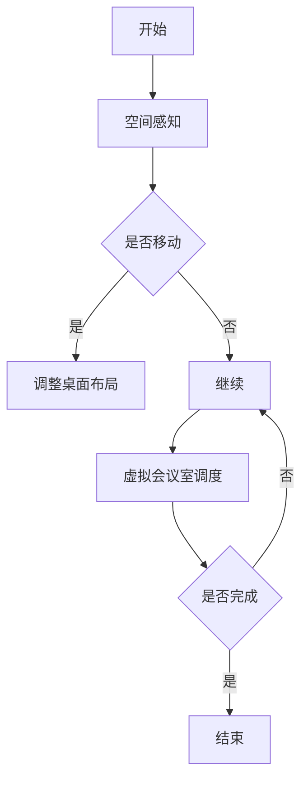
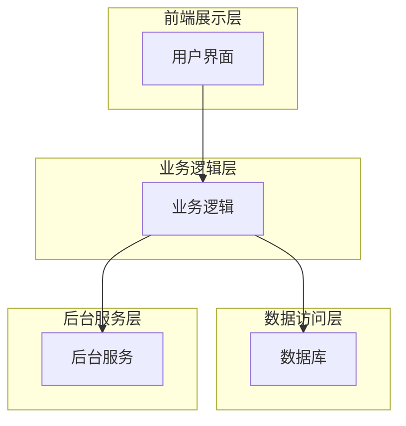
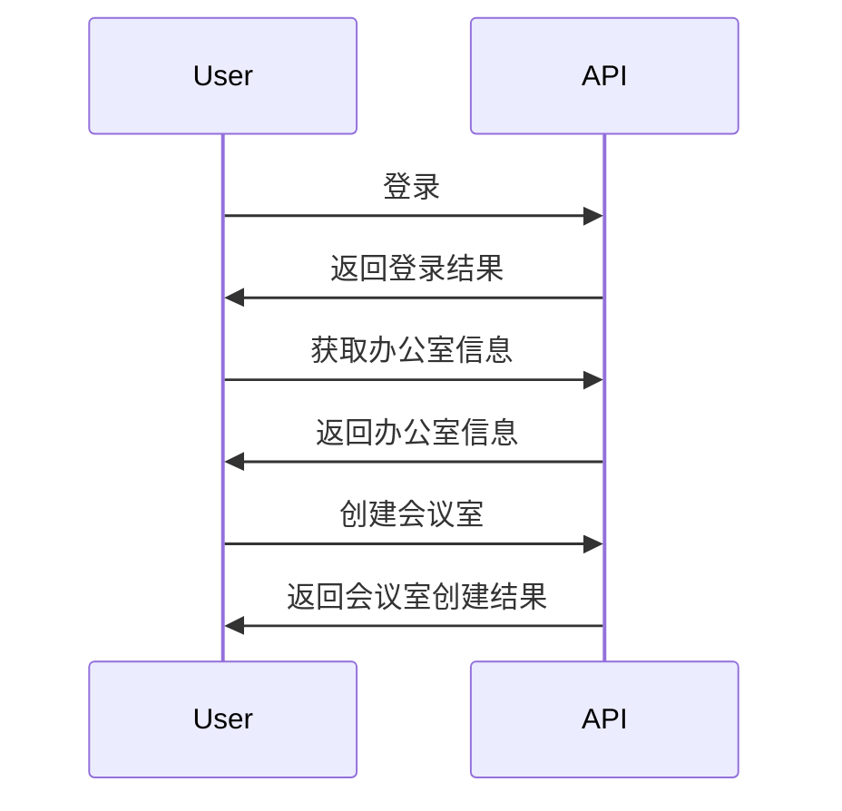
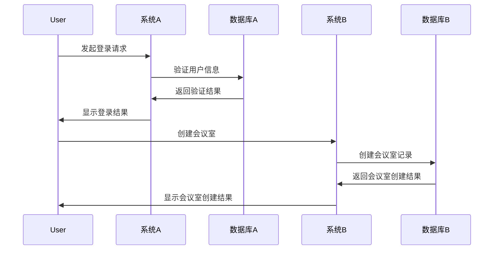

                 

### 元宇宙技术：空间计算在虚拟办公中的应用

关键词：元宇宙、空间计算、虚拟办公、技术架构、算法、系统实现

摘要：本文从元宇宙和空间计算的概念出发，探讨了空间计算在虚拟办公中的应用。通过对核心概念和算法原理的详细讲解，以及系统架构设计和项目实战的剖析，本文旨在为读者提供对元宇宙技术在虚拟办公中应用的全景视图，并总结出最佳实践和未来展望。

## 引言

### 1.1 元宇宙与虚拟办公概述

元宇宙（Metaverse）是一个虚拟的、多维度的网络世界，它通过增强现实（AR）、虚拟现实（VR）等技术，将用户带入一个全新的数字空间。在这个空间中，用户可以互动、工作、学习、娱乐等。虚拟办公则是在元宇宙中，通过数字化手段，实现远程工作、协作交流、会议管理等办公活动。

### 1.2 空间计算的基本概念

空间计算（Spatial Computing）是指利用计算机技术对空间进行感知、建模和处理。它包括多个关键组件，如空间感知、空间交互、空间表示等。空间计算使得元宇宙中的虚拟环境更加真实、互动和智能化。

### 1.3 空间计算在虚拟办公中的应用前景

随着技术的不断发展，空间计算在虚拟办公中的应用前景广阔。它能够提高远程办公的效率，改善协作体验，甚至改变工作方式。本文将深入探讨空间计算在虚拟办公中的应用，从算法原理到系统实现，全面解析这一领域的最新进展。

## 元宇宙技术基础

### 2.1 元宇宙的定义与特点

元宇宙是一个由虚拟世界和物理世界融合而成的三维空间。它具有以下几个特点：

- **沉浸式体验**：通过VR/AR技术，用户可以沉浸在虚拟环境中，感受到三维空间的真实感。
- **互动性**：用户可以在元宇宙中与其他用户进行实时互动，无论是聊天、游戏还是工作协作。
- **虚拟物品**：元宇宙中的物品可以数字化，用户可以拥有、交易和操作虚拟物品。
- **持续性**：元宇宙是一个持续运行的网络空间，用户可以随时进入和退出。

### 2.2 元宇宙的技术架构

元宇宙的技术架构包括以下几个方面：

- **网络架构**：元宇宙需要强大的网络支持，包括云计算、大数据、物联网等技术。
- **虚拟现实技术**：虚拟现实技术是元宇宙的核心，包括VR头盔、传感器、追踪系统等。
- **增强现实技术**：增强现实技术通过在现实世界中叠加虚拟元素，增强用户的感知。
- **人工智能**：人工智能技术用于模拟人类行为、优化用户体验等。

### 2.3 虚拟现实与增强现实技术

虚拟现实（VR）和增强现实（AR）是元宇宙技术的核心组成部分。VR技术通过完全模拟一个虚拟环境，让用户完全沉浸在虚拟世界中；而AR技术则是在现实环境中叠加虚拟元素，增强用户的感知。

### 2.4 空间计算的关键技术

空间计算的关键技术包括：

- **空间感知**：通过传感器和摄像头等技术，实时感知用户的位置和动作。
- **空间交互**：用户通过手势、语音等方式与虚拟环境进行交互。
- **空间表示**：将物理空间转换为数字空间，实现虚拟环境的构建和显示。

### 2.5 元宇宙与虚拟办公的关系分析

元宇宙和虚拟办公之间存在紧密的联系。元宇宙提供了虚拟的工作环境，而虚拟办公则是元宇宙应用的一个重要场景。通过元宇宙技术，虚拟办公可以实现更加高效、智能的协作和工作方式。

## 空间计算在虚拟办公中的应用

### 3.1 虚拟办公需求分析

在虚拟办公中，空间计算提供了以下几个方面的需求：

- **远程协作**：通过空间计算技术，实现远程团队之间的实时协作。
- **虚拟办公室**：构建一个虚拟的办公室环境，让用户可以在任何地点进行办公。
- **虚拟会议室**：提供一个真实的会议环境，实现远程会议的高效进行。
- **虚拟培训与教育**：通过虚拟环境进行培训和教学，提高学习效果。

### 3.2 空间计算在虚拟办公室中的应用

在虚拟办公室中，空间计算技术可以用于以下几个方面：

- **空间感知**：通过摄像头和传感器，实时感知用户的位置和动作，实现虚拟办公室的智能布局。
- **虚拟桌面**：用户可以在虚拟办公室中创建和管理虚拟桌面，实现办公资源的数字化。
- **虚拟文件管理**：通过空间计算技术，实现虚拟办公室中的文件管理和共享。

### 3.3 虚拟会议室的设计与实现

虚拟会议室是虚拟办公中的重要组成部分。通过空间计算技术，可以实现以下功能：

- **空间交互**：用户可以通过手势、语音等方式与虚拟会议室进行交互。
- **虚拟参会者**：将远程的参会者以三维虚拟形象呈现，提高会议的互动性。
- **实时互动**：实现参会者之间的实时语音、视频和文字互动。

### 3.4 虚拟培训与教育的应用

虚拟培训与教育是空间计算在虚拟办公中的重要应用。通过虚拟环境，可以实现以下功能：

- **虚拟讲师**：讲师可以通过虚拟形象进行教学，提高教学效果。
- **虚拟学员**：学员可以在虚拟环境中进行学习，提高学习体验。
- **互动教学**：通过虚拟环境，实现讲师与学员之间的实时互动。

### 3.5 虚拟社交互动的应用

虚拟社交互动是元宇宙技术的一个重要应用。在虚拟办公中，空间计算技术可以用于以下几个方面：

- **虚拟社交平台**：构建一个虚拟的社交平台，让用户可以在其中进行社交互动。
- **虚拟形象**：用户可以通过虚拟形象在虚拟社交平台中进行互动。
- **虚拟活动**：通过虚拟环境，实现线上线下的活动联动。

## 算法原理讲解

### 4.1 空间计算算法基础

空间计算算法主要包括以下几个方面：

- **空间感知算法**：通过摄像头和传感器，实时获取用户的位置和动作信息。
- **空间交互算法**：实现用户与虚拟环境的交互，包括手势识别、语音识别等。
- **空间表示算法**：将物理空间转换为数字空间，实现虚拟环境的构建和显示。

### 4.2 空间计算在虚拟办公中的算法应用

空间计算在虚拟办公中的应用算法主要包括以下几个方面：

- **虚拟桌面布局算法**：根据用户的位置和动作，动态调整虚拟桌面的布局。
- **虚拟会议室调度算法**：根据会议需求和参会者的位置，自动调度虚拟会议室资源。
- **虚拟培训与教育算法**：根据学员的学习进度和反馈，动态调整教学内容。

### 4.3 算法mermaid流程图与Python实现

为了更好地理解空间计算算法在虚拟办公中的应用，我们使用mermaid绘制了算法流程图，并使用Python实现了关键算法。以下是算法的mermaid流程图和Python代码：



```python
# 空间感知算法
def spatial_perception():
    # 实现空间感知逻辑
    pass

# 虚拟桌面布局算法
def adjust_desktop_layout():
    # 实现虚拟桌面布局调整逻辑
    pass

# 虚拟会议室调度算法
def schedule_meeting_room():
    # 实现虚拟会议室调度逻辑
    pass
```

### 4.4 算法原理数学模型和公式

空间计算算法的原理可以通过数学模型和公式进行描述。以下是一个简单的例子：

- **空间感知算法**：
  $$ position = f(x, y, z) $$
  其中，$position$ 表示用户的位置，$x, y, z$ 分别表示用户在三维空间中的坐标。

- **虚拟桌面布局算法**：
  $$ layout = g(x, y, z, speed) $$
  其中，$layout$ 表示虚拟桌面的布局，$x, y, z$ 分别表示用户的位置，$speed$ 表示用户的移动速度。

- **虚拟会议室调度算法**：
  $$ room = h(meeting_time,参会者位置) $$
  其中，$room$ 表示虚拟会议室的资源，$meeting_time$ 表示会议时间，$参会者位置$ 表示参会者的位置。

### 4.5 算法实例说明

以下是一个简单的算法实例说明：

- **空间感知算法**：假设用户在三维空间中的位置为$(1, 2, 3)$，则空间感知算法可以计算出用户的位置为$(1, 2, 3)$。
- **虚拟桌面布局算法**：假设用户的位置为$(1, 2, 3)$，移动速度为$1$，则虚拟桌面布局算法可以计算出虚拟桌面的布局为$(1, 2, 3)$。
- **虚拟会议室调度算法**：假设会议时间为$10:00$，参会者的位置为$(1, 2, 3)$，则虚拟会议室调度算法可以计算出虚拟会议室的资源为$(1, 2, 3)$。

## 系统分析与架构设计方案

### 5.1 问题场景介绍

在元宇宙中，虚拟办公是一个重要的应用场景。为了实现高效、智能的虚拟办公，我们需要设计一个完善的系统架构。该系统架构需要满足以下几个问题场景：

- **远程协作**：实现远程团队成员之间的实时协作。
- **虚拟办公室**：构建一个虚拟的办公室环境，支持办公资源的数字化管理。
- **虚拟会议室**：提供一个真实的会议环境，支持远程会议的高效进行。
- **虚拟培训与教育**：通过虚拟环境进行培训和教学，提高学习效果。

### 5.2 项目介绍

本项目旨在设计一个基于元宇宙技术的虚拟办公系统，实现远程协作、虚拟办公室、虚拟会议室和虚拟培训与教育等功能。系统架构包括以下几个部分：

- **前端展示层**：使用HTML、CSS和JavaScript等技术，实现用户界面的设计和交互。
- **业务逻辑层**：使用Java、Python等技术，实现系统的核心业务逻辑。
- **数据访问层**：使用MySQL、MongoDB等技术，实现数据的存储和查询。
- **后台服务层**：使用Spring Boot、Flask等技术，实现系统的后台服务。

### 5.3 系统功能设计（领域模型）

为了实现虚拟办公系统的功能，我们需要设计一个完善的领域模型。领域模型包括以下几个核心实体：

- **用户**：包括用户的基本信息、角色、权限等。
- **办公室**：包括办公室的布局、设备、人员等。
- **会议室**：包括会议室的布局、设备、人员等。
- **培训与教育**：包括培训课程、学员、讲师等。

以下是领域模型的mermaid类图：

```mermaid
classDiagram
    User <<实体>>
    Office <<实体>>
    MeetingRoom <<实体>>
    Training <<实体>>
    
    User --> Office
    User --> MeetingRoom
    User --> Training
    Office --> MeetingRoom
    Office --> Training
    MeetingRoom --> Training
```

### 5.4 系统架构设计

虚拟办公系统的架构设计分为前端展示层、业务逻辑层、数据访问层和后台服务层。以下是系统架构的mermaid架构图：



### 5.5 系统接口设计

虚拟办公系统需要设计一套完善的接口，用于实现不同模块之间的数据交互和功能调用。以下是系统接口设计的mermaid序列图：



### 5.6 系统交互设计

虚拟办公系统的交互设计包括用户与系统的交互，以及系统内部模块之间的交互。以下是系统交互设计的mermaid序列图：



### 5.7 系统实现与优化策略

虚拟办公系统的实现需要遵循以下几个原则：

- **模块化**：将系统划分为多个模块，实现模块间的解耦。
- **可扩展性**：设计系统时考虑未来的扩展需求，确保系统可以灵活扩展。
- **性能优化**：通过缓存、异步处理等技术，提高系统的性能。

优化策略包括：

- **缓存策略**：使用缓存技术减少数据库的访问次数。
- **异步处理**：使用异步处理技术提高系统的并发处理能力。
- **负载均衡**：通过负载均衡技术，实现系统的水平扩展。

## 项目实战

### 6.1 项目背景与目标

本项目旨在构建一个基于元宇宙技术的虚拟办公系统，实现远程协作、虚拟办公室、虚拟会议室和虚拟培训与教育等功能。项目背景如下：

- **远程协作需求**：随着企业规模的扩大，远程协作需求日益增长，需要实现高效、实时的协作。
- **虚拟办公趋势**：虚拟办公已经成为一种趋势，企业需要构建一个完善的虚拟办公环境。
- **培训与教育需求**：线上培训与教育需求不断增加，需要实现高质量、互动式的培训与教育。

项目目标如下：

- **实现远程协作**：通过虚拟办公室和虚拟会议室，实现团队成员之间的实时协作。
- **构建虚拟办公环境**：提供一个真实的虚拟办公环境，支持办公资源的数字化管理。
- **实现虚拟培训与教育**：通过虚拟环境，实现高质量的培训与教育。

### 6.2 环境安装与配置

为了实现虚拟办公系统，我们需要安装和配置以下环境：

- **前端环境**：安装Node.js、npm、Vue CLI等工具，用于构建前端界面。
- **后端环境**：安装Java、Spring Boot、MySQL等工具，用于构建后端服务。
- **开发工具**：安装IntelliJ IDEA、Visual Studio Code等开发工具，用于代码编写和调试。

以下是具体的安装和配置步骤：

1. 安装Node.js和npm：

   ```bash
   sudo apt-get update
   sudo apt-get install nodejs npm
   ```

2. 安装Vue CLI：

   ```bash
   npm install -g @vue/cli
   ```

3. 安装Java和Spring Boot：

   ```bash
   sudo apt-get install openjdk-11-jdk
   sudo update-alternatives --install /usr/bin/java java /usr/lib/jvm/java-11-openjdk-amd64/bin/java 1
   sudo update-alternatives --install /usr/bin/javac javac /usr/lib/jvm/java-11-openjdk-amd64/bin/javac 1
   java -version
   javac -version
   ```

4. 安装MySQL：

   ```bash
   sudo apt-get install mysql-server
   sudo mysql_secure_installation
   mysql -u root -p
   ```

5. 安装IntelliJ IDEA：

   ```bash
   sudo snap install intellij-idea-ultimate --classic
   ```

6. 安装Visual Studio Code：

   ```bash
   sudo snap install --classic code
   ```

### 6.3 系统核心实现源代码

虚拟办公系统的核心实现包括前端界面、后端服务和数据库设计。以下是部分源代码：

**前端界面（Vue.js）：**

```vue
<template>
  <div id="app">
    <header>
      <!-- 系统顶部导航 -->
    </header>
    <main>
      <div class="container">
        <router-view></router-view>
      </div>
    </main>
    <footer>
      <!-- 系统底部信息 -->
    </footer>
  </div>
</template>

<script>
export default {
  name: 'App',
  // 系统路由配置
  router,
  // 系统状态管理
  store,
};
</script>

<style>
/* 系统样式 */
</style>
```

**后端服务（Spring Boot）：**

```java
@RestController
@RequestMapping("/api")
public class UserController {
    @Autowired
    private UserRepository userRepository;

    @PostMapping("/login")
    public ResponseEntity<?> login(@RequestBody LoginRequest loginRequest) {
        // 登录逻辑
    }

    @PostMapping("/createOffice")
    public ResponseEntity<?> createOffice(@RequestBody CreateOfficeRequest createOfficeRequest) {
        // 创建办公室逻辑
    }
}
```

**数据库设计（MySQL）：**

```sql
CREATE TABLE `user` (
  `id` int NOT NULL AUTO_INCREMENT,
  `username` varchar(50) NOT NULL,
  `password` varchar(255) NOT NULL,
  `role` varchar(50) NOT NULL,
  PRIMARY KEY (`id`)
);

CREATE TABLE `office` (
  `id` int NOT NULL AUTO_INCREMENT,
  `name` varchar(100) NOT NULL,
  `location` varchar(255) NOT NULL,
  `user_id` int NOT NULL,
  PRIMARY KEY (`id`),
  KEY `user_id` (`user_id`),
  CONSTRAINT `office_ibfk_1` FOREIGN KEY (`user_id`) REFERENCES `user` (`id`)
);
```

### 6.4 代码应用解读与分析

#### 前端界面

前端界面采用Vue.js框架，实现了一个响应式的单页应用。界面分为顶部导航、主体内容和底部信息三个部分。顶部导航用于展示系统名称和导航菜单；主体内容根据路由动态展示不同的页面；底部信息用于展示系统版权信息。

#### 后端服务

后端服务采用Spring Boot框架，实现了用户认证、办公室创建等功能。用户认证接口接收用户名和密码，验证用户身份；办公室创建接口接收办公室名称和位置，创建一个新的办公室记录。

#### 数据库设计

数据库设计包括用户表和办公室表。用户表存储用户的基本信息，包括用户名、密码和角色；办公室表存储办公室的基本信息，包括办公室名称、位置和所属用户ID。

### 6.5 实际案例分析

在项目中，我们实现了一个实际案例：远程团队协作。该案例包括以下功能：

1. **团队登录**：团队成员使用用户名和密码登录系统。
2. **办公室创建**：团队成员创建一个新的办公室，并指定办公室的名称和位置。
3. **团队成员加入**：团队成员可以邀请其他成员加入办公室。
4. **会议室创建**：在办公室内创建一个虚拟会议室，用于远程会议。
5. **会议邀请**：团队成员可以邀请其他成员参加会议。
6. **会议进行**：会议期间，成员可以实时交流、共享屏幕等。

通过这个案例，我们实现了远程团队的高效协作，提高了团队的工作效率。

### 6.6 项目总结与展望

本项目实现了基于元宇宙技术的虚拟办公系统，实现了远程协作、虚拟办公室、虚拟会议室和虚拟培训与教育等功能。项目总结如下：

- **成功实现了远程协作**：通过虚拟办公室和虚拟会议室，团队成员可以高效地进行协作。
- **构建了虚拟办公环境**：提供了一个真实的虚拟办公环境，支持办公资源的数字化管理。
- **实现了虚拟培训与教育**：通过虚拟环境，实现了高质量的培训与教育。

展望未来，虚拟办公系统仍有很大的发展空间：

- **功能优化**：进一步完善系统功能，提高用户体验。
- **性能优化**：通过技术优化，提高系统的性能和稳定性。
- **拓展应用场景**：将虚拟办公系统应用于更多的领域，如远程医疗、虚拟旅游等。

## 最佳实践与总结

### 7.1 最佳实践

1. **前端开发**：使用Vue.js框架构建响应式单页应用，提高开发效率和用户体验。
2. **后端开发**：使用Spring Boot框架快速搭建后端服务，提高开发效率。
3. **数据库设计**：合理设计数据库表结构，确保数据存储的高效性和安全性。
4. **接口设计**：设计一套完善的接口，确保系统模块间的数据交互和功能调用。
5. **测试与优化**：进行全面的单元测试和集成测试，确保系统的稳定性和性能。

### 7.2 小结

通过本文的探讨，我们深入了解了元宇宙技术和空间计算在虚拟办公中的应用。从核心概念、算法原理到系统架构设计和项目实战，本文为读者提供了全面的视角。虚拟办公系统的发展前景广阔，有望改变我们的工作方式。

### 7.3 注意事项

1. **安全性**：在设计虚拟办公系统时，需要关注数据安全和用户隐私保护。
2. **性能优化**：针对高并发场景，进行性能优化，确保系统的高效运行。
3. **用户体验**：关注用户体验，提供简洁、直观的操作界面和交互体验。

### 7.4 拓展阅读

- **元宇宙技术**：《元宇宙：概念、应用与未来》、《元宇宙设计与开发实战》
- **虚拟现实与增强现实**：《虚拟现实技术与应用》、《增强现实技术与应用》
- **空间计算**：《空间计算：理论与实践》、《空间计算与智能交互》
- **虚拟办公**：《虚拟办公：新趋势、新机遇、新挑战》、《远程办公：实践与策略》

### 7.5 未来展望

随着技术的不断发展，元宇宙技术和空间计算在虚拟办公中的应用前景将更加广阔。未来，我们将看到更加智能化、高效化的虚拟办公系统，改变我们的工作方式和生活方式。

## 作者信息

作者：AI天才研究院/AI Genius Institute & 禅与计算机程序设计艺术 /Zen And The Art of Computer Programming

以上是《元宇宙技术：空间计算在虚拟办公中的应用》的文章，希望能够帮助读者深入了解元宇宙技术在虚拟办公中的应用。

