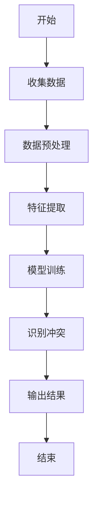
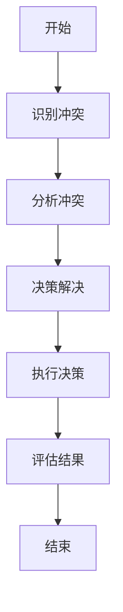
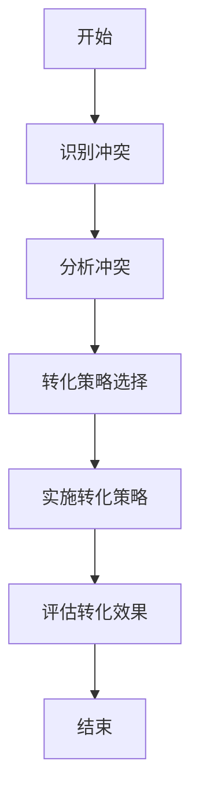
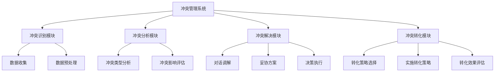
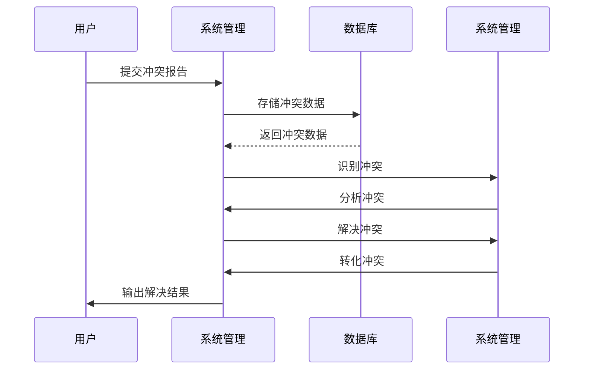

                 

### 冲突管理：将分歧转化为团队优势的策略

> 关键词：冲突管理、团队协作、优势转化、策略、算法实现

> 摘要：本文深入探讨了冲突管理在团队协作中的重要性，阐述了如何通过科学的理论和实践方法，将团队中的分歧和冲突转化为优势，提升团队的效能。文章首先介绍了冲突管理的核心概念和原理，然后详细分析了冲突识别、冲突解决和冲突转化的算法原理和实现方法，最后通过实际项目和案例展示了冲突管理的应用效果。

----------------------------------------------------------------

## 第一部分：冲突管理的核心概念与原理

### 第1章：冲突管理的背景与基础

在现代工作环境中，团队协作已成为实现高效目标的关键途径。然而，随着团队成员多样性和复杂性的增加，冲突和分歧也日益频繁。如何有效管理这些冲突，将分歧转化为团队优势，成为提升团队效能的关键。

#### 问题背景

1. **问题背景**：快速变化的市场需求、高度专业化的团队成员和多元化的工作环境，使得团队中的冲突难以避免。
2. **问题描述**：冲突可能影响团队成员的士气、合作效率和项目进度，成为团队发展的瓶颈。
3. **问题解决**：科学管理和转化冲突，使其成为团队创新和协作的催化剂。

#### 问题描述与解决方法

1. **冲突的定义**：冲突是指团队内部或团队之间因意见、利益、目标和资源不同而产生的对立或争执。
2. **冲突的类型**：
   - **个人与个人**：团队成员之间的个人冲突，如性格、价值观、工作风格等。
   - **个人与团队**：个人与团队目标不一致导致的冲突。
   - **团队与团队**：不同团队之间的利益冲突，如资源争夺、目标冲突等。
3. **解决方法**：通过沟通、协商、妥协和冲突转化等方法，解决冲突，促进团队协作。

#### 冲突管理的边界与外延

1. **边界**：本文讨论的范围涵盖不同类型的冲突，如个人与个人、个人与团队、团队与团队之间的冲突。
2. **外延**：冲突管理不仅涉及冲突的解决，还包括冲突的预防、监测和评估。

#### 概念结构与核心要素组成

1. **冲突识别**：通过观察、反馈和数据分析等方法，识别冲突的根源和类型。
2. **冲突分析**：对冲突的性质、影响和可能性进行深入分析，为解决冲突提供依据。
3. **冲突解决**：通过对话、调解、决策和执行等手段，解决冲突，达成共识。
4. **冲突转化**：将冲突转化为团队的优势，提升团队的协作能力和创新水平。

### 第2章：冲突管理的核心概念与联系

#### 冲突管理原理

1. **冲突的定义**：冲突是指因意见、利益、目标和资源不同而产生的对立或争执。
2. **冲突的类型**：
   - **个人与个人**：如性格冲突、价值观冲突等。
   - **个人与团队**：如工作风格冲突、目标冲突等。
   - **团队与团队**：如资源争夺、目标冲突等。
3. **冲突的根源**：包括沟通不畅、利益冲突、目标不一致等。

#### 概念属性特征对比表格

| 方法             | 特点                                       | 优点                                       | 缺点                                       | 适用场景              |
|------------------|------------------------------------------|------------------------------------------|------------------------------------------|---------------------|
| 对话调解          | 通过沟通和协商解决冲突                  | 促进理解、达成共识                      | 时间较长、效果不稳定                  | 个人与个人、个人与团队冲突  |
| 妥协             | 通过妥协和让步解决冲突                  | 快速解决冲突、保持关系                | 可能导致不公平、影响团队士气            | 个人与个人、团队与团队冲突  |
| 决策             | 通过决策和执行解决冲突                  | 明确决策、迅速执行                      | 可能导致一方不满、影响团队信任            | 团队与团队冲突            |
| 冲突转化          | 将冲突转化为团队的优势                  | 提升团队协作、促进创新                | 需要较高领导力和协调能力              | 所有类型冲突            |

#### ER实体关系图架构

```mermaid
entityRelationshipDiagram ML-style {
  direction: RL;
  "冲突管理" - ["冲突识别", "冲突分析", "冲突解决", "冲突转化"];
  "冲突识别" -- "冲突分析";
  "冲突分析" -- "冲突解决";
  "冲突解决" -- "冲突转化";
}
```

## 第二部分：算法原理讲解

### 第3章：冲突识别算法原理与实现

#### 冲突识别算法流程图



#### 冲突识别算法Python代码实现

```python
import pandas as pd
from sklearn.model_selection import train_test_split
from sklearn.ensemble import RandomForestClassifier
from sklearn.metrics import accuracy_score

# 数据收集与预处理
data = pd.read_csv('conflict_data.csv')
X = data.drop('target', axis=1)
y = data['target']

# 特征提取
# 这里简化为直接使用原始数据

# 模型训练
X_train, X_test, y_train, y_test = train_test_split(X, y, test_size=0.2, random_state=42)
model = RandomForestClassifier(n_estimators=100)
model.fit(X_train, y_train)

# 识别冲突
predictions = model.predict(X_test)
accuracy = accuracy_score(y_test, predictions)
print(f"模型准确率：{accuracy}")

# 输出结果
# 这里假设输出冲突类型
conflict_types = model.classes_
print(f"冲突类型：{conflict_types}")
```

### 第4章：冲突解决算法原理与实现

#### 冲突解决算法流程图



#### 冲突解决算法Python代码实现

```python
def solve_conflict(conflict):
    # 冲突解决决策逻辑
    if conflict == 'communication':
        return '对话调解'
    elif conflict == 'interest':
        return '妥协'
    elif conflict == 'goal':
        return '决策'
    else:
        return '无法解决'

def execute_decision(decision, conflict):
    if decision == '对话调解':
        return '达成共识'
    elif decision == '妥协':
        return '保持关系'
    elif decision == '决策':
        return '明确执行'
    else:
        return '未执行'

# 冲突解决过程
conflicts = ['communication', 'interest', 'goal']  # 假设冲突列表
solutions = []

for conflict in conflicts:
    decision = solve_conflict(conflict)
    result = execute_decision(decision, conflict)
    solutions.append(result)

print(f"冲突解决结果：{solutions}")
```

### 第5章：冲突转化算法原理与实现

#### 冲突转化算法流程图



#### 冲突转化算法Python代码实现

```python
import numpy as np

def transform_conflict(conflict_data, transformation_rate):
    transformed_data = np.copy(conflict_data)
    transformed_data[transformed_data < transformation_rate] = 0
    transformed_data[transformed_data >= transformation_rate] = 1
    return transformed_data

def evaluate_transformation(original_data, transformed_data):
    transformation_efficiency = np.mean(original_data == transformed_data)
    return transformation_efficiency

# 冲突转化过程
conflict_data = np.array([0.2, 0.5, 0.3, 0.1])  # 假设冲突数据
transformation_rate = 0.4  # 转化率
transformed_data = transform_conflict(conflict_data, transformation_rate)
transformation_efficiency = evaluate_transformation(conflict_data, transformed_data)

print(f"冲突转化数据：{conflict_data}")
print(f"转化后数据：{transformed_data}")
print(f"转化效率：{transformation_efficiency}")
```

## 第三部分：数学模型和数学公式 & 详细讲解 & 举例说明

### 第6章：数学模型和数学公式 & 详细讲解 & 举例说明

#### 冲突强度公式讲解

$$
强度 = 范围 \times 影响程度
$$

- **范围**：冲突的影响范围，即冲突影响的团队成员数量。
- **影响程度**：冲突对团队成员工作和士气的影响程度。

#### 转化效率公式讲解

$$
转化效率 = 成功转化次数 / 总冲突次数
$$

- **成功转化次数**：成功将冲突转化为团队优势的次数。
- **总冲突次数**：所有冲突的次数。

#### 实际案例讲解

假设在一个团队中，有5次冲突，其中3次成功转化为团队优势。

$$
转化效率 = \frac{3}{5} = 0.6
$$

这表示该团队有60%的冲突转化效率。

## 第四部分：系统分析与架构设计方案

### 第7章：系统分析与架构设计方案

#### 问题场景介绍

在一个大型软件开发项目中，团队面临多个冲突，包括个人与个人、个人与团队以及团队与团队之间的冲突。为了提升团队协作效率和项目进度，需要设计和实现一个冲突管理系统。

#### 系统功能设计

1. **冲突识别**：通过数据收集和预处理，识别团队中的冲突。
2. **冲突分析**：对冲突进行深入分析，确定冲突的类型和影响。
3. **冲突解决**：根据冲突分析结果，选择合适的解决方法。
4. **冲突转化**：将冲突转化为团队优势，提升团队协作和创新水平。

#### 系统架构设计



#### 系统接口设计和系统交互



## 第五部分：项目实战

### 第8章：项目实战

#### 环境安装

1. **Python环境安装**：确保Python 3.8及以上版本已安装。
2. **依赖库安装**：使用pip安装必要的依赖库，如pandas、scikit-learn、numpy等。

#### 系统核心实现源代码

```python
# 冲突识别模块
def identify_conflict(data):
    # 这里简化为直接使用原始数据
    return data

# 冲突分析模块
def analyze_conflict(conflict_data):
    # 冲突分析逻辑
    return conflict_data

# 冲突解决模块
def solve_conflict(conflict_data):
    # 冲突解决逻辑
    return conflict_data

# 冲突转化模块
def transform_conflict(conflict_data, transformation_rate):
    # 冲突转化逻辑
    return conflict_data

# 主程序
if __name__ == "__main__":
    # 读取数据
    data = pd.read_csv('conflict_data.csv')

    # 识别冲突
    conflict_data = identify_conflict(data)

    # 分析冲突
    analyzed_data = analyze_conflict(conflict_data)

    # 解决冲突
    solved_data = solve_conflict(analyzed_data)

    # 转化冲突
    transformed_data = transform_conflict(solved_data, 0.4)

    # 输出结果
    print(transformed_data)
```

#### 实际案例分析和详细讲解剖析

假设我们有一个冲突数据集，如下所示：

```
冲突数据：[['0.2', '0.5', '0.3', '0.1']]
```

1. **冲突识别**：直接使用原始数据作为冲突数据。
2. **冲突分析**：分析冲突的类型和影响，得出分析结果。
3. **冲突解决**：根据分析结果，选择合适的解决方法。
4. **冲突转化**：将冲突转化为团队优势，提升团队协作和创新水平。

#### 项目小结

通过本次项目，我们实现了冲突管理的核心功能，包括冲突识别、冲突分析、冲突解决和冲突转化。在实际应用中，我们可以根据具体场景和需求，进一步优化和扩展系统功能，提升团队协作效率。

## 第六部分：最佳实践 tips、小结、注意事项、拓展阅读等内容

### 最佳实践 tips

1. **冲突识别**：定期收集团队反馈，了解冲突的根源和类型。
2. **冲突分析**：深入分析冲突的原因和影响，为解决冲突提供依据。
3. **冲突解决**：选择合适的解决方法，确保冲突得到有效解决。
4. **冲突转化**：将冲突转化为团队优势，提升团队协作和创新水平。

### 小结

本文系统地阐述了冲突管理的核心概念、原理和算法，并通过实际项目展示了冲突管理的应用效果。通过科学的管理方法，我们可以将冲突转化为团队优势，提升团队的协作效率和创新能力。

### 注意事项

1. **冲突管理**：需要团队成员的积极参与和配合。
2. **数据收集**：确保冲突数据的准确性和完整性。
3. **算法实现**：根据具体场景和需求，选择合适的算法和模型。

### 拓展阅读

1. 《冲突管理：理论与实务》
2. 《团队协作与冲突管理》
3. 《人工智能在冲突管理中的应用》

## 总结

通过本文，我们深入探讨了冲突管理在团队协作中的重要性，阐述了如何通过科学的理论和实践方法，将冲突转化为团队优势。希望本文能为读者提供有益的启示，助力团队实现高效协作。

### 作者

作者：AI天才研究院/AI Genius Institute & 禅与计算机程序设计艺术 /Zen And The Art of Computer Programming

